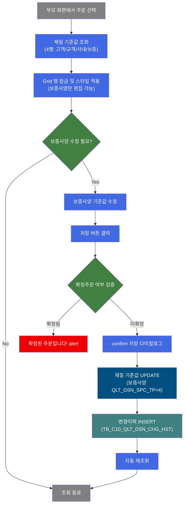
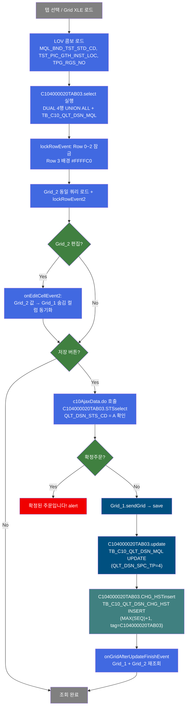
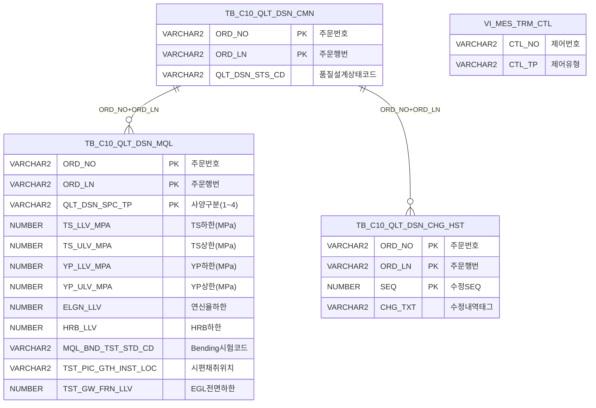

<h1 style="font-size: 40px; text-align: center; font-weight:
   bold; margin: 30px 0;">
  C104000020TAB03 레거시 시스템 분석 종합 보고서
</h1>


# 1. 시스템 개요
- **서비스 ID**: C104000020TAB03
- **업무명**: 품질설계결과-재질
- **분석 일시**: 2026-03-16 20:15 KST
- **분석 시간**: 약 7분
- **전체 Activity 수**: 5개 (Built-in 5개, Custom 0개)
- **분석자**: Claude Opus 4.6
- **분석 도구**: /analyze-service C104000020TAB03
- **문서 버전**: 1.0

# 📊 비즈니스 프로세스 분석

## 시스템 목적

C104000020TAB03은 품질설계결과 화면(C104000020)의 **재질 탭**으로, 특정 주문(ORD_NO + ORD_LN)에 대한 기계적 성질(재질) 설계 기준값을 사양 유형별(고객사양/규격사양/사내사양/보증사양)로 조회하고, 보증사양의 기준값을 수정할 수 있는 화면이다.

이 화면은 **두 개의 연동 그리드**로 구성된다. 상단 Grid_1은 인장강도(TS), 항복점(YP), 연신율(EL), 경도(HRB), 이방성(ERI), 굽힘시험(BND) 등 기계적 특성의 상하한값을 표시하고, 하단 Grid_2는 시편채취 정보(위치/길이/코드)와 도금량(EGL/CGL) 상하한값을 표시한다. 두 그리드는 동일한 4행 구조(고객/규격/사내/보증)를 공유하며, 보증사양(4번째 행)만 편집 가능하다.

수정 시에는 확정주문(QLT_DSN_STS_CD='A') 여부를 AJAX로 사전 검증하여 확정된 주문의 변경을 차단하고, 저장 후에는 변경이력(TB_C10_QLT_DSN_CHG_HST)에 자동으로 이력을 기록하여 추적성을 확보한다.

## 핵심 워크플로우 다이어그램



### 상세 워크플로우 다이어그램



## 주요 유즈케이스

### UC-01: 재질 설계 기준값 조회
- **Actor**: 품질설계 담당자
- **목적**: 특정 주문의 기계적 성질 설계 기준값을 사양 유형별로 비교 확인
- **전제조건**:
  - 부모 화면(C104000020)에서 주문번호/행번 선택 완료
  - TB_C10_QLT_DSN_MQL 테이블에 재질 데이터 존재

- **주요 흐름**:
  1. 부모 화면에서 주문번호/행번 선택 후 재질 탭 진입
  2. Grid_1 XLE 이벤트 → LOV 콤보(MQL_BND_TST_STD_CD) 로드
  3. uiCommon.parameters4로 부모 폼 파라미터 수집 → C104000020TAB03.select 실행
  4. DUAL 4행 + 실제 데이터 UNION ALL → GROUP BY 사양유형 → MAX 집계
  5. 4행(고객/규격/사내/보증) 데이터 Grid_1에 바인딩
  6. lockRowEvent: Row 0~2 잠금, Row 3(보증사양) 편집 가능 + 노란색 배경
  7. Grid_2 동일 과정 (시편/도금량 정보)

- **대체 흐름**:
  - 데이터 없는 사양 유형: DUAL 초기행에 의해 NULL 행으로 표시 (빈 행 보장)
  - 종료 처리된 주문: VI_MES_TRM_CTL에서 CTL_TP='O' NOT EXISTS로 제외

- **후행조건**:
  - 4행 × 2 그리드에 사양별 재질 기준값이 표시됨
  - 보증사양(Row 3)만 편집 가능 상태

### UC-02: 보증사양 재질 기준값 수정
- **Actor**: 품질설계 담당자
- **목적**: 보증사양의 기계적 성질 상하한값, 시편 정보, 도금량 기준을 수정
- **전제조건**:
  - UC-01 조회 완료
  - 해당 주문이 확정 상태(QLT_DSN_STS_CD='A')가 아닐 것

- **주요 흐름**:
  1. Grid_1 Row 3(보증사양)에서 HRB/YP/TS/EL/ERI/BND 상하한값 수정
  2. Grid_2 Row 3에서 시편채취위치(콤보), 시편채취길이, 시편가공코드(콤보), EGL/CGL 도금량 수정
  3. Grid_2 편집 시 onEditCellEvent2에서 Grid_1 숨김 컬럼(13~20)에 값 자동 동기화
  4. 저장 버튼 클릭
  5. c10AjaxData.do → C104000020TAB03.STSselect로 확정주문 여부 검증
  6. 미확정 → confirm "저장 하시겠습니까?" 표시
  7. 확인 시 Grid_1.sendGrid로 save 명령 전송
  8. 저장 Activity: TB_C10_QLT_DSN_MQL UPDATE (QLT_DSN_SPC_TP='4' 조건)
  9. 이력저장 Activity: TB_C10_QLT_DSN_CHG_HST INSERT (MAX(SEQ)+1, tag='C104000020TAB03')
  10. 자동 재조회 (Grid_1 + Grid_2)

- **대체 흐름**:
  - 확정주문인 경우: "확정된 주문입니다!" alert 표시 후 저장 차단
  - confirm에서 취소: 수정 작업 취소

- **후행조건**:
  - TB_C10_QLT_DSN_MQL 보증사양 행 갱신
  - TB_C10_QLT_DSN_CHG_HST에 변경이력 레코드 생성
  - 두 그리드 자동 재조회

### UC-03: Grid 간 데이터 동기화
- **Actor**: 품질설계 담당자
- **목적**: Grid_2에서 수정한 시편/도금량 정보를 Grid_1의 숨김 컬럼에 자동 반영하여 단일 저장으로 전체 데이터 일관성 유지
- **전제조건**:
  - UC-01 조회 완료, Grid_2 Row 3 편집 중

- **주요 흐름**:
  1. Grid_2 셀 편집 완료(stage==2) 시 onEditCellEvent2 발생
  2. 편집된 컬럼 인덱스(cInd)에 따라 Grid_1 대응 숨김 컬럼에 값 복사:
     - cInd 2(시편길이) → Grid_1 col 13
     - cInd 4(시편코드) → Grid_1 col 15
     - cInd 5(EGL전면하한) → Grid_1 col 16
     - cInd 6(EGL전면상한) → Grid_1 col 17
     - cInd 7(EGL후면하한) → Grid_1 col 18
     - cInd 8(EGL후면상한) → Grid_1 col 19
     - cInd 9(CGL하한) → Grid_1 col 20
  3. Grid_1 Row 3를 "updated" 상태로 마킹
  4. 콤보 선택 변경(TST_PIC_GTH_INST_LOC → col 12, TPG_RGS_NO → col 14)도 동일 패턴

- **후행조건**:
  - Grid_1과 Grid_2의 보증사양 데이터가 동기화됨
  - Grid_1 저장 시 모든 변경사항이 함께 저장됨

---
## 비즈니스 로직 상세

### 1. 사양 유형별 고정 4행 보장 (DUAL UNION ALL 패턴)

- **목적**: 사양 데이터가 없는 유형도 반드시 표시하여 4행 고정 그리드 구조 유지
- **처리 케이스**:

  **[케이스 1: DUAL 초기행 생성]**
  ```
    조건: 모든 조회 시
    처리:
      1. DUAL에서 QLT_DSN_SPC_TP = '1','2','3','4'인 NULL 행 4개 생성
      2. TB_C10_QLT_DSN_MQL의 실제 데이터를 UNION ALL로 합침
      3. GROUP BY QLT_DSN_SPC_TP + MAX 집계로 사양 유형별 1행으로 집약
      4. 실제 데이터 없는 사양 유형은 NULL 행 유지
  ```

  **[케이스 2: 사양 유형 코드 → 명칭 변환]**
  ```
    처리: DECODE(QLT_DSN_SPC_TP, '1','고객사양', '2','규격사양', '3','사내사양', '4','보증사양')
  ```

### 2. 확정주문 저장 차단

- **목적**: 품질설계가 확정된 주문의 재질 기준값 무단 변경 방지
- **처리 케이스**:

  **[케이스 1: AJAX 사전 검증]**
  ```
    조건: 저장 버튼 클릭 시
    처리:
      1. c10AjaxData.do 호출 (ServiceName=C104000020TAB03-service, STS_find=1)
      2. C104000020TAB03.STSselect 실행: QLT_DSN_STS_CD = 'A' 조건 조회
      3. 결과 cell이 존재하면 → "확정된 주문입니다!" alert, 저장 차단
      4. 결과 없음 → 저장 진행
  ```

### 3. 변경이력 자동 기록

- **목적**: 재질 기준값 수정 이력을 추적 테이블에 자동 기록
- **처리 케이스**:

  **[케이스 1: SEQ 자동 채번 + 이력 INSERT]**
  ```
    조건: 저장 Activity(update) 성공 후
    처리:
      1. NVL(MAX(SEQ) + 1, 1)로 순번 자동 생성
      2. CHG_TXT = 'C104000020TAB03' (변경 출처 태그)
      3. Audit 컬럼(ObjectType/ObjectId/ProgramId/Timestamp) 자동 주입
  ```

### 4. Grid 간 숨김 컬럼 동기화

- **목적**: Grid_2의 시편/도금량 편집값을 Grid_1의 숨김 컬럼에 실시간 복사하여 단일 Grid_1 저장으로 전체 데이터 일관성 확보
- **처리 케이스**:

  **[케이스 1: 셀 편집 동기화 (onEditCellEvent2)]**
  ```
    조건: Grid_2 셀 편집 완료 (stage==2)
    처리:
      Grid_2 cInd 2(시편길이) → Grid_1 col 13 (TST_PIC_GTH_INST_LTH)
      Grid_2 cInd 4(시편코드) → Grid_1 col 15 (TPG_RGS_NO) -- 단, 실제 값은 빈값처리
      Grid_2 cInd 5(EGL전면하한) → Grid_1 col 16 (TST_GW_FRN_LLV)
      Grid_2 cInd 6(EGL전면상한) → Grid_1 col 17 (TST_GW_FRN_ULV)
      Grid_2 cInd 7(EGL후면하한) → Grid_1 col 18 (TST_GW_BAK_LLV)
      Grid_2 cInd 8(EGL후면상한) → Grid_1 col 19 (TST_GW_BAK_ULV)
      Grid_2 cInd 9(CGL하한) → Grid_1 col 20 (TST_GW_TOT_LLV)
      null 값 → 대응 컬럼도 빈 문자열로 설정
  ```

  **[케이스 2: 콤보 선택 동기화]**
  ```
    조건: Grid_2 콤보(TST_PIC_GTH_INST_LOC, TPG_RGS_NO) 선택 변경
    처리:
      TST_PIC_GTH_INST_LOC 콤보 변경 → Grid_1 col 12
      TPG_RGS_NO 콤보 변경 → Grid_1 col 14
      Grid_1 Row 3 "updated" 마킹
  ```

### 5. 종료 주문 제외 (NOT EXISTS 패턴)

- **목적**: 종료 처리된 주문의 재질 데이터를 조회 결과에서 제외
- **처리 케이스**:

  **[케이스 1: 종료 여부 확인]**
  ```
    조건: select 쿼리 실행 시
    처리:
      NOT EXISTS (SELECT * FROM MESAPUSER.VI_MES_TRM_CTL
                  WHERE CTL_NO = A.ORD_NO AND CTL_TP = 'O')
      → CTL_TP = 'O' (Order 종료)인 주문의 재질 데이터는 실제 데이터에서 제외
      → DUAL 초기행은 유지되므로 4행 구조는 보장
  ```

---

# 💾 데이터 요구사항

## 핵심 테이블

### 1. TB_C10_QLT_DSN_MQL (MESAPUSER) - 품질설계 재질 기준

| 컬럼명 | 타입 | PK | 설명 |
|--------|------|----|-----|
| ORD_NO | VARCHAR2 | ✅ | 주문번호 |
| ORD_LN | VARCHAR2 | ✅ | 주문행번 |
| QLT_DSN_SPC_TP | VARCHAR2 | ✅ | 품질설계사양구분 (1=고객, 2=규격, 3=사내, 4=보증) |
| TS_LLV_MPA | NUMBER | | TS(인장강도) 하한 (MPa) |
| TS_ULV_MPA | NUMBER | | TS(인장강도) 상한 (MPa) |
| YP_LLV_MPA | NUMBER | | YP(항복점) 하한 (MPa) |
| YP_ULV_MPA | NUMBER | | YP(항복점) 상한 (MPa) |
| ELGN_LLV | NUMBER | | 연신율 하한 (%) |
| ELGN_ULV | NUMBER | | 연신율 상한 (%) |
| HRB_LLV | NUMBER | | HRB(경도) 하한 |
| HRB_ULV | NUMBER | | HRB(경도) 상한 |
| ER_LLV | NUMBER | | ERI(이방성) 하한 (mm) |
| ER_ULV | NUMBER | | ERI(이방성) 상한 (mm) |
| MQL_BND_TST_STD_CD | VARCHAR2 | | 재질 Bending 시험기준코드 |
| TST_PIC_GTH_INST_LOC | VARCHAR2 | | 시편채취지시위치 |
| TST_PIC_GTH_INST_LTH | NUMBER | | 시편채취지시길이 (mm) |
| TPG_RGS_NO | VARCHAR2 | | 시편호수 |
| TST_GW_FRN_LLV | NUMBER | | 시험도금량 전면 하한 (g/m2) |
| TST_GW_FRN_ULV | NUMBER | | 시험도금량 전면 상한 (g/m2) |
| TST_GW_BAK_LLV | NUMBER | | 시험도금량 후면 하한 (g/m2) |
| TST_GW_BAK_ULV | NUMBER | | 시험도금량 후면 상한 (g/m2) |
| TST_GW_TOT_LLV | NUMBER | | CGL 시험도금량 전체 하한 (g/m2) |
| TST_GW_TOT_ULV | NUMBER | | CGL 시험도금량 전체 상한 (g/m2) |

### 2. TB_C10_QLT_DSN_CHG_HST (MESAPUSER) - 품질설계 변경이력

| 컬럼명 | 타입 | PK | 설명 |
|--------|------|----|-----|
| ORD_NO | VARCHAR2 | ✅ | 주문번호 |
| ORD_LN | VARCHAR2 | ✅ | 주문행번 |
| SEQ | NUMBER | ✅ | 수정SEQ (MAX+1 자동 채번) |
| CHG_TXT | VARCHAR2 | | 수정내역 (변경 출처 태그: 'C104000020TAB03') |

### 3. TB_C10_QLT_DSN_CMN (MESAPUSER) - 품질설계 공통 마스터

| 컬럼명 | 타입 | PK | 설명 |
|--------|------|----|-----|
| ORD_NO | VARCHAR2 | ✅ | 주문번호 |
| ORD_LN | VARCHAR2 | ✅ | 주문행번 |
| QLT_DSN_STS_CD | VARCHAR2 | | 품질설계상태코드 ('A'=확정) |

### 4. MESAPUSER.VI_MES_TRM_CTL - 종료 제어 뷰

| 컬럼명 | 타입 | PK | 설명 |
|--------|------|----|-----|
| CTL_NO | VARCHAR2 | | 제어번호 (주문번호 매칭) |
| CTL_TP | VARCHAR2 | | 제어유형 ('O'=Order 종료) |

## 데이터 플로우

### 1. 조회

```
[재질 기준값 조회]
탭 선택 / Grid XLE 로드
→ C104000020TAB03.select
  FROM (
    SELECT '1' QLT_DSN_SPC_TP, NULL... FROM DUAL
    UNION ALL ... (4행 초기화)
    UNION ALL
    SELECT ... FROM TB_C10_QLT_DSN_MQL A
    WHERE ORD_NO = :ORD_NO AND ORD_LN = :ORD_LN
    AND NOT EXISTS (SELECT * FROM MESAPUSER.VI_MES_TRM_CTL ...)
  )
  GROUP BY QLT_DSN_SPC_TP
  ORDER BY QLT_DSN_SPC_TP_CD
→ Grid_1 (기계적 특성) + Grid_2 (시편/도금량) 4행 표시
→ Row 0~2 잠금, Row 3(보증사양) 편집 가능 + 배경 #FFFFC0
```

### 2. 확정주문 검증

```
[확정주문 여부 AJAX 확인]
저장 버튼 클릭
→ c10AjaxData.do (STS_find=1)
→ C104000020TAB03.STSselect
  SELECT * FROM TB_C10_QLT_DSN_CMN
  WHERE ORD_NO = :ORD_NO AND ORD_LN = :ORD_LN
  AND QLT_DSN_STS_CD = 'A'
→ 결과 있음: "확정된 주문입니다!" alert → 저장 차단
→ 결과 없음: 저장 진행
```

### 3. 저장 + 이력 기록

```
[보증사양 재질 기준값 수정]
confirm 확인 → Grid_1 sendGrid
→ C104000020TAB03.update
  UPDATE TB_C10_QLT_DSN_MQL
  SET TS_LLV_MPA, TS_ULV_MPA, YP_LLV_MPA, YP_ULV_MPA,
      ELGN_LLV, ELGN_ULV, HRB_LLV, HRB_ULV, ER_LLV, ER_ULV,
      MQL_BND_TST_STD_CD, TST_PIC_GTH_INST_LOC, TST_PIC_GTH_INST_LTH,
      TPG_RGS_NO, TST_GW_FRN/BAK/TOT LLV/ULV,
      Audit 컬럼 갱신
  WHERE ORD_NO = :ORD_NO AND ORD_LN = :ORD_LN
  AND QLT_DSN_SPC_TP = '4'

[변경이력 자동 기록]
저장 success 후 이력저장 Activity 실행
→ C104000020TAB03.CHG_HSTinsert
  INSERT INTO TB_C10_QLT_DSN_CHG_HST
  (ORD_NO, ORD_LN, SEQ = NVL(MAX(SEQ)+1, 1),
   CHG_TXT = 'C104000020TAB03', Audit 컬럼)
→ 저장 완료 → Grid_1 + Grid_2 자동 재조회
```

## SQL 일람표

| SQL 이름 | 쿼리 ID | 타입 | 출처 | 테이블 |
|---------|---------|-----|-------|-------|
| 확정주문 여부 조회 | C104000020TAB03.STSselect | SELECT | Service | TB_C10_QLT_DSN_CMN |
| 재질 기준값 조회 | C104000020TAB03.select | SELECT | Service | TB_C10_QLT_DSN_MQL, VI_MES_TRM_CTL, DUAL |
| 보증사양 재질 수정 | C104000020TAB03.update | UPDATE | Service | TB_C10_QLT_DSN_MQL |
| 변경이력 등록 | C104000020TAB03.CHG_HSTinsert | INSERT | Service | TB_C10_QLT_DSN_CHG_HST |

## ER 다이어그램 (핵심 관계)



관계 설명:
- TB_C10_QLT_DSN_CMN이 중심 테이블로 확정상태 검증에 사용
- TB_C10_QLT_DSN_MQL: ORD_NO+ORD_LN+QLT_DSN_SPC_TP로 사양 유형별 1:4 관계
- TB_C10_QLT_DSN_CHG_HST: ORD_NO+ORD_LN+SEQ로 변경이력 1:N 관계
- VI_MES_TRM_CTL: 종료 주문 제외용 NOT EXISTS 서브쿼리에서 참조

---

# 🖥️ 사용자 인터페이스 요구사항

## 화면 레이아웃 상세

### Layout 구조 (initLayout)
```javascript
{
  // 탭 콘텐츠 화면 (부모 C104000020의 탭바 내부)
  // absolute positioning
  components: [
    {
      id: "C104000020TAB03_Grid_1",
      type: "grid",
      position: { left: 1, top: 5, width: 973, height: 140 },
      description: "기계적 특성 그리드 (HRB/YP/TS/EL/ERI/굴곡)"
    },
    {
      id: "C104000020TAB03_Form_1",
      type: "form",
      position: { left: 0, top: 152, width: 975, height: 28 },
      description: "저장 버튼 바"
    },
    {
      id: "C104000020TAB03_Grid_2",
      type: "grid",
      position: { left: 1, top: 190, width: 973, height: 140 },
      description: "시편/도금량 상세 그리드"
    },
    {
      id: "messagebox",
      type: "messagebox",
      position: { left: 1, top: 429, width: 973, height: 19 }
    }
  ]
}
```

## 입출력 요소

### Form 컴포넌트
**C104000020TAB03_Form_1** (버튼 바)
- save: button - 저장 (security 속성 적용)

### Grid 컴포넌트

**C104000020TAB03_Grid_1 (기계적 특성)**
- 편집 가능 여부: Row 3(보증사양)만 편집 가능 (Row 0~2 잠금)
- Split: 없음
- 행 구조: 4행 고정 (고객사양/규격사양/사내사양/보증사양)
- 주요 컬럼 (23개):

  **표시 컬럼**:
  - QLT_DSN_SPC_TP: ro - 사양구분 (8%, 좌측정렬)
  - HRB_LLV: ed - HRB 하한 (7%, 포맷 00.0)
  - HRB_ULV: ed - HRB 상한 (7%, 포맷 00.0, #cspan 헤더)
  - YP_LLV_MPA: ed - YP(MPa) 하한 (7%)
  - YP_ULV_MPA: ed - YP(MPa) 상한 (7%, #cspan 헤더)
  - TS_LLV_MPA: ed - TS(MPa) 하한 (7%)
  - TS_ULV_MPA: ed - TS(MPa) 상한 (7%, #cspan 헤더)
  - ELGN_LLV: ed - 연신율(%) 하한 (7%, 포맷 00.0)
  - ELGN_ULV: ed - 연신율(%) 상한 (7%, 포맷 00.0, #cspan 헤더)
  - ER_LLV: ed - ERI(mm) 하한 (7%, 포맷 00.0)
  - ER_ULV: ed - ERI(mm) 상한 (7%, 포맷 00.0, #cspan 헤더)
  - MQL_BND_TST_STD_CD: combo_v - 굴곡 (나머지, LOV: SZ0000/MQL_BND_TST_STD_CD)

  **숨김 컬럼** (Grid_2 동기화용):
  - TST_PIC_GTH_INST_LOC: ro - 시편채취위치 (숨김)
  - TST_PIC_GTH_INST_LTH: ron - 시편채취길이 (숨김, 포맷 0000.0)
  - TPG_RGS_NO: ro - 시편호수 (숨김)
  - TST_GW_FRN_LLV: ron - EGL전면하한 (숨김, 포맷 000.0)
  - TST_GW_FRN_ULV: ron - EGL전면상한 (숨김, 포맷 000.0)
  - TST_GW_BAK_LLV: ron - EGL후면하한 (숨김, 포맷 000.0)
  - TST_GW_BAK_ULV: ron - EGL후면상한 (숨김, 포맷 000.0)
  - TST_GW_TOT_LLV: ron - CGL전체하한 (숨김, 포맷 000.0)
  - TST_GW_TOT_ULV: ron - CGL전체상한 (숨김, 포맷 000.0)
  - ORD_NO: ro - 주문번호 (숨김)
  - ORD_LN: ro - 주문행번 (숨김)

**C104000020TAB03_Grid_2 (시편/도금량 상세)**
- 편집 가능 여부: Row 3(보증사양)만 편집 가능 (Row 0~2 잠금)
- Split: 없음
- 행 구조: Grid_1과 동일 4행 구조
- 주요 컬럼 (10개):

  - QLT_DSN_SPC_TP: ro - 사양구분 (8%)
  - TST_PIC_GTH_INST_LOC: combo_v - 시편채취위치 (14%, LOV: SZ0000/TST_PIC_GTH_INST_LOC)
  - TST_PIC_GTH_INST_LTH: ed - 시편채취길이mm (8%, 포맷 0000.0)
  - TPG_RGS_NO: combo_v - 시편가공코드 (나머지, LOV: SZ0000/TPG_RGS_NO)
  - TST_GW_FRN_LLV: ed - EGL전면하한 (8%, 포맷 000.0)
  - TST_GW_FRN_ULV: ed - EGL전면상한 (8%, 포맷 000.0, #cspan 헤더)
  - TST_GW_BAK_LLV: ed - EGL후면하한 (8%, #cspan 헤더)
  - TST_GW_BAK_ULV: ed - EGL후면상한 (8%, #cspan 헤더)
  - TST_GW_TOT_LLV: ed - CGL시험도금량 하한 (8%)
  - TST_GW_TOT_ULV: ed - CGL시험도금량 상한 (8%, #cspan 헤더)

## 화면 동작 흐름

### 1. 화면 초기 로딩 (탭 최초 진입)
```
1. 부모 화면(C104000020)에서 C104000020TAB03 탭 콘텐츠 로드
2. ui.initializeDHTMLX() 호출 → DHTMLX Grid × 2, Form, messagebox 초기화
3. Grid_1 onRowSelect → doOnRowSelectedGrid1 (Grid_2 행 동기 선택)
4. Grid_2 onRowSelect → doOnRowSelectedGrid2 (Grid_1 행 동기 선택)
5. Grid_1 XLE → onGridLoadEvent1:
   - MQL_BND_TST_STD_CD 콤보 LOV 로드 (basicLovData.do)
   - 콤보 readonly + autoPositioning + 높이 100
   - uiCommon.parameters4로 조회 → lockRowEvent
   - onGridAfterUpdateFinishEvent 등록
   - XLE detach
6. Grid_2 XLE → onGridLoadEvent2:
   - TST_PIC_GTH_INST_LOC 콤보 LOV 로드 + onSelectionChange 등록
   - TPG_RGS_NO 콤보 LOV 로드 + onSelectionChange 등록
   - 조회 → lockRowEvent2
   - XLE detach
7. Grid_2 onEditCellEvent → onEditCellEvent2 등록
```

### 2. 보증사양 수정 및 저장
```
1. 사용자가 Grid_1 Row 3 또는 Grid_2 Row 3에서 값 수정
2. Grid_2 편집 시 onEditCellEvent2 → Grid_1 숨김 컬럼 동기화
3. Grid_2 콤보 변경 시 onSelectionChange → Grid_1 대응 컬럼 동기화
4. 저장 버튼 클릭 → save() 실행
5. c10AjaxData.do AJAX 호출 → 확정주문 여부 검증
6. 미확정 → dhtmlx.confirm "저장 하시겠습니까?"
7. 확인 → Grid_1.sendGrid('C104000020TAB03_Grid_1', 'save')
8. 서비스 체인: 저장(UPDATE, QLT_DSN_SPC_TP='4') → 이력저장(INSERT)
9. onGridAfterUpdateFinishEvent → Grid_1 + Grid_2 자동 재조회
```

### 3. Grid 행 선택 동기화
```
1. Grid_1에서 행 클릭 → doOnRowSelectedGrid1
2. items['C104000020TAB03_Grid_2'].getDhxGrid().selectRowById(rowId)
3. Grid_2에서도 동일 행 선택됨 (반대 방향도 동일)
```

## JavaScript 모듈

**C104000020TAB03.jsp** (탭 콘텐츠 스크립트)
- find(eventName): 조회 (uiCommon.parameters4로 부모 폼 파라미터 수집 → Grid_1, Grid_2 동시 로드)
- save(eventName, formDivObj, referenceItem): 저장 (c10AjaxData.do 확정검증 → confirm → Grid_1.sendGrid)
- findMessage(referenceItem): 조회 완료 메시지 표시
- doOnRowSelectedGrid1(rowId, cellId): Grid_1 행 선택 → Grid_2 동기 선택
- doOnRowSelectedGrid2(rowId, cellId): Grid_2 행 선택 → Grid_1 동기 선택
- onGridLoadEvent1(): Grid_1 XLE (LOV 콤보 로드, 자동 조회, 이벤트 등록)
- onGridLoadEvent2(): Grid_2 XLE (LOV 2종 콤보 로드 + onSelectionChange, 자동 조회)
- onGridAfterUpdateFinishEvent(): 저장 완료 후 Grid_1 + Grid_2 재조회
- onGridContextMenuClick(id, gridObj, menuObj): 컨텍스트 메뉴 (셀 복사, 엑셀 내보내기)
- lockRowEvent(): Grid_1 Row 0~2 잠금, Row 3 굴곡 콤보 Row 0~2 readonly, Row 3 배경 #FFFFC0
- lockRowEvent2(): Grid_2 Row 0~2 잠금 (콤보 컬럼 1,3 readonly), Row 3 배경 #FFFFC0
- onEditCellEvent2(stage, rId, cInd, nValue, oValue): Grid_2 편집 → Grid_1 숨김 컬럼 동기화
- refresh/add/modify/remove/copy/paste/undo/redo: 표준 메뉴 함수

## 주요 이벤트 핸들러

**onEditCellEvent2 (Grid_2 셀 편집)**
- 이벤트 타입: Grid Edit Cell (stage==2)
- 처리 내용:
  1. 편집 완료(stage==2) 시 발동
  2. cInd별 Grid_1 숨김 컬럼 매핑 (2→13, 4→15, 5→16, 6→17, 7→18, 8→19, 9→20)
  3. null 값이면 빈 문자열, 아니면 nValue 복사
  4. Grid_1 Row 3를 "updated" 상태로 마킹

**onSelectionChange (콤보 선택 변경)**
- 이벤트 타입: Combo Selection Change
- 처리 내용:
  1. TST_PIC_GTH_INST_LOC 콤보 → Grid_1 col 12에 선택값 복사 + Row 3 updated
  2. TPG_RGS_NO 콤보 → Grid_1 col 14에 선택값 복사 + Row 3 updated

**onRowSelect (행 선택 동기화)**
- 이벤트 타입: Grid Row Select
- 처리 내용:
  1. Grid_1 행 선택 시 Grid_2 동일 rowId 행 선택
  2. Grid_2 행 선택 시 Grid_1 동일 rowId 행 선택


# 📌 특이사항 및 주의사항

## 1. Grid 간 숨김 컬럼 동기화의 복잡성
- Grid_2의 편집값이 Grid_1의 **숨김 컬럼(col 12~20)**에 실시간 복사되는 구조이다. 실제 저장은 Grid_1만 수행하므로, Grid_2의 편집 내용이 Grid_1 숨김 컬럼에 정확히 동기화되지 않으면 데이터 손실이 발생한다. 특히 cInd 매핑 테이블이 하드코딩되어 있어, Grid XML 컬럼 순서 변경 시 동기화가 깨진다.

## 2. DUAL UNION ALL 4행 보장 패턴
- SELECT 쿼리에서 DUAL로 4개 NULL 초기행을 생성하고 실제 데이터와 UNION ALL 후 GROUP BY + MAX 집계하는 패턴을 사용한다. 이는 사양 데이터가 없는 유형도 반드시 그리드에 표시되도록 보장하지만, GROUP BY 절의 DECODE 표현식이 '4'일 때 '보증사양'이 아닌 단순 '보증사양'으로 처리되는 **잠재적 불일치**가 있다 (DECODE 4번째 케이스에 키값 '4' 없이 기본값으로 매핑).

## 3. 보증사양(QLT_DSN_SPC_TP='4')만 수정 가능
- UPDATE 쿼리에 `QLT_DSN_SPC_TP = '4'` 조건이 하드코딩되어 있어, 프론트엔드에서 Row 0~2를 잠금 해제하더라도 고객/규격/사내 사양은 DB 레벨에서 수정이 차단된다. 이중 안전장치이지만, 요구사항 변경 시 프론트엔드와 백엔드 양쪽 수정이 필요하다.

## 4. 확정주문 검증이 AJAX 동기 호출
- 저장 전 확정주문 여부를 `uiCommon.ajaxLoadData`로 **동기 AJAX** 호출한다. 이는 사용자 브라우저가 응답 대기 중 멈추는 원인이 될 수 있으며, 네트워크 지연 시 UX 저하가 발생한다.

## 5. 변경이력 태그가 화면 ID 하드코딩
- CHG_HSTinsert의 CHG_TXT에 'C104000020TAB03' 문자열이 하드코딩되어 있다. 이는 어떤 탭에서 변경이 발생했는지 추적하는 용도이지만, 실제 변경된 필드명이나 변경 전/후 값은 기록되지 않아 상세한 변경 감사가 불가능하다.

## 6. Grid_1의 MQL_BND_TST_STD_CD 콤보 Row 0~2 readonly 처리
- lockRowEvent에서 `setCellExcellType(rowId, 11, "ro")`로 Row 0~2의 굴곡 콤보 셀만 개별적으로 readonly 처리한다. lockRow()는 전체 행을 잠그지만, 콤보 타입 셀은 별도로 타입을 변경해야 편집이 차단되는 DHTMLX Grid의 특성 때문이다.

## 7. onEditCellEvent2에서 cInd 3 누락
- Grid_2 cInd 3(시편채취길이) 편집 시 Grid_1 col 14(TST_PIC_GTH_INST_LTH)에 복사하는 로직이 **없다**. cInd 2 → col 13, cInd 4 → col 15로 매핑되지만, cInd 3은 처리되지 않는다. 시편채취길이는 콤보가 아닌 ed 타입이므로 onSelectionChange가 아닌 onEditCellEvent2에서 처리되어야 하지만 누락된 것으로 보인다.

# 📚 참고 문서

- **Query SQL**: `src/query/C104000020TAB03-query.glue_sql`
- **Service XML**: `src/service/C104000020TAB03-service.xml`
- **JSP**: `WebContents/C104000020TAB03.jsp`
- **Grid_1 XML**: `WebContents/header/kr/C104000020TAB03/C104000020TAB03_Grid_1.xml`
- **Grid_2 XML**: `WebContents/header/kr/C104000020TAB03/C104000020TAB03_Grid_2.xml`
- **Form XML**: `WebContents/header/kr/C104000020TAB03/C104000020TAB03_Form_1.xml`
- **JS 공통**: `WebContents/js/c10.ui.js`
