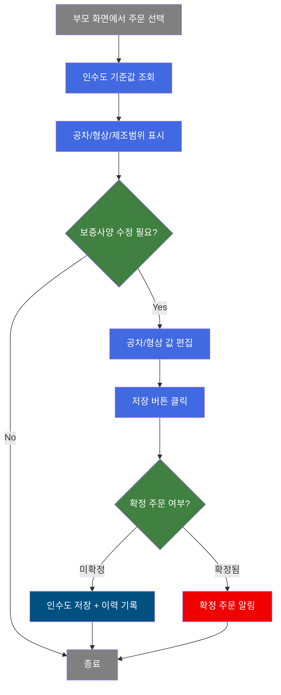
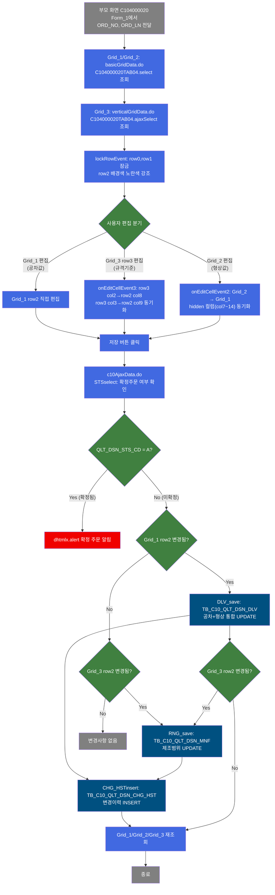
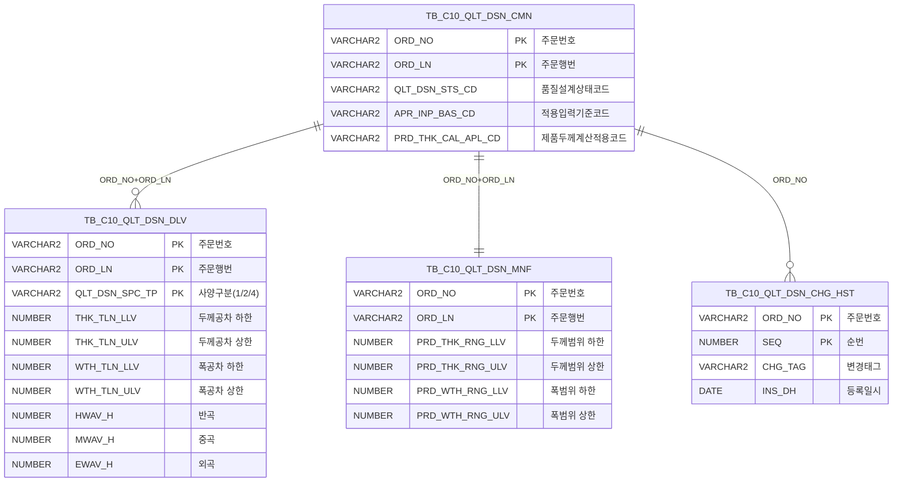

<h1 style="font-size: 40px; text-align: center; font-weight:
   bold; margin: 30px 0;">
  C104000020TAB04 레거시 시스템 분석 종합 보고서
</h1>


# 1. 시스템 개요
- **서비스 ID**: C104000020TAB04
- **업무명**: 품질설계결과 - 인수도
- **분석 일시**: 2026-03-17 08:28 KST
- **전체 Activity 수**: 7 (built-in 7개, custom 0개)
- **분석자**: Claude Opus 4.6 + Sonnet (Phase 4)
- **분석 도구**: /analyze-service C104000020TAB04
- **문서 버전**: 1.0

# 📊 비즈니스 프로세스 분석

## 시스템 목적

C104000020TAB04는 품질설계결과 화면(C104000020)의 **인수도 탭**으로, 특정 주문(ORD_NO, ORD_LN)에 대한 **치수 인수도 설계 기준값**을 사양 유형별(고객사양/규격사양/보증사양)로 조회하고 수정하는 화면이다.

이 화면은 두께/폭/길이 **공차 허용범위**(상한/하한), **형상 기준**(반곡/중곡/외곡/직각도/직선도/대각선공차/급준도/TELESCOPE), 그리고 **제조사양 범위**(제품 두께/폭/길이의 설계기준/규격기준)를 통합 관리한다. 품질설계 담당자는 이 화면을 통해 인수도 기준을 설정·수정하고, 변경 이력을 자동으로 기록한다.

부모 화면(C104000020)의 Form_1에서 선택된 주문번호/행번을 파라미터로 받아 3개 그리드에 데이터를 표시하며, Grid_1(공차)과 Grid_2(형상)는 양방향 행 선택 동기화 및 편집값 동기화 구조를 갖는다. 저장 시 확정주문 여부를 사전 확인하여 확정 주문에 대한 무단 수정을 방지한다.

## 핵심 워크플로우 다이어그램



### 상세 워크플로우 다이어그램



## 주요 유즈케이스

### UC-01: 인수도 기준값 조회

- **Actor**: 품질설계 담당자
- **목적**: 특정 주문의 치수 인수도 설계 기준값(공차/형상/제조범위)을 사양 유형별로 조회하여 현재 설정 상태 확인

- **전제조건**:
  - 부모 화면(C104000020)에서 주문번호/행번이 선택되어 있음
  - 해당 주문에 품질설계 인수도 데이터가 존재함
  - TB_C10_QLT_DSN_DLV 및 TB_C10_QLT_DSN_MNF 테이블에 데이터 등록됨

- **주요 흐름**:
  1. 부모 화면 Form_1에서 ORD_NO, ORD_LN을 파라미터로 전달
  2. Grid_1에 사양유형별(고객/규격/보증) 공차 기준값 표시 (C104000020TAB04.select)
  3. Grid_2에 사양유형별 형상 기준값 표시 (동일 쿼리)
  4. Grid_3에 제조사양 범위정보 표시 (C104000020TAB04.ajaxSelect - verticalGridData.do)
  5. row0(고객사양), row1(규격사양)은 읽기전용 잠금, row2(보증사양)만 편집 가능 상태로 노란색 강조

- **대체 흐름**:
  - 조회 데이터 없음: DUAL 기반 초기행으로 사양유형(1,2,4) NULL 행 3개가 표시됨
  - 종료 처리된 주문(VI_MES_TRM_CTL CTL_TP='O'): NOT EXISTS 조건으로 제외됨

- **후행조건**:
  - 3개 그리드에 인수도 기준값이 표시됨
  - 보증사양 행이 편집 가능 상태

### UC-02: 인수도 공차/형상 수정 저장

- **Actor**: 품질설계 담당자
- **목적**: 보증사양의 공차 허용범위(두께/폭/길이) 및 형상 기준값(반곡/중곡/외곡 등)을 수정하여 저장

- **전제조건**:
  - UC-01 조회가 완료된 상태
  - 해당 주문이 확정 상태(QLT_DSN_STS_CD='A')가 아닐 것

- **주요 흐름**:
  1. Grid_1(공차) row2 또는 Grid_2(형상) row2의 편집 가능 셀에서 값 수정
  2. Grid_2 편집 시 onEditCellEvent2에 의해 Grid_1의 hidden 컬럼(col7~14)에 자동 동기화
  3. 저장 버튼 클릭
  4. c10AjaxData.do로 확정주문 여부 확인 (STSselect)
  5. 확인 다이얼로그 표시 ("저장 하시겠습니까?")
  6. DLV_save 실행: TB_C10_QLT_DSN_DLV UPDATE (공차+형상 통합)
  7. CHG_HSTinsert 실행: TB_C10_QLT_DSN_CHG_HST INSERT (변경이력 기록)
  8. Grid_1/Grid_2/Grid_3 재조회

- **대체 흐름**:
  - 확정 주문인 경우: "확정된 주문입니다!" 알림 후 저장 중단
  - Grid_1 변경 없고 Grid_3만 변경: RNG_save만 실행

- **후행조건**:
  - TB_C10_QLT_DSN_DLV 테이블에 수정된 공차/형상 값이 반영됨
  - 변경이력이 TB_C10_QLT_DSN_CHG_HST에 기록됨 (태그: C104000020TAB04)

### UC-03: 제조사양 범위 수정 저장

- **Actor**: 품질설계 담당자
- **목적**: 제조사양의 설계기준(두께/폭/길이 범위)을 수정하고, 규격기준 두께범위가 변경되면 설계기준에도 자동 반영

- **전제조건**:
  - UC-01 조회가 완료된 상태
  - 해당 주문이 확정 상태가 아닐 것

- **주요 흐름**:
  1. Grid_3 row2(설계기준) 또는 row3(규격기준)의 두께/폭/길이 범위 셀 편집
  2. 입력 시 onEditCellEvent3에 의해 5자리 maxLength 유효성 검사 수행
  3. row3(규격기준) 두께 하한/상한(col2,col3) 편집 시 row2(설계기준) col8,col9에 자동 동기화
  4. 저장 버튼 클릭 → 확정주문 확인
  5. RNG_save 실행: TB_C10_QLT_DSN_MNF UPDATE (제조범위)
  6. CHG_HSTinsert 실행: 변경이력 기록
  7. 전체 그리드 재조회

- **대체 흐름**:
  - DLV_save 후 Grid_3 변경사항도 있으면 연쇄적으로 RNG_save 실행 (onGridAfterUpdateFinishEvent1)
  - 입력값 5자리 초과: 자동으로 마지막 문자 삭제 또는 빈값으로 초기화

- **후행조건**:
  - TB_C10_QLT_DSN_MNF 테이블에 수정된 제조범위 값이 반영됨
  - 변경이력 기록됨

---

## 비즈니스 로직 상세

### 1. 사양유형별 인수도 기준값 통합 조회 (SQL 기반)

- **목적**: 고객사양/규격사양/보증사양 3가지 유형의 치수 인수도 기준값을 누락 없이 표시 (데이터가 없는 유형도 NULL 행으로 표시)

- **처리 케이스**:

  **[케이스 1: DUAL 초기행 + 실데이터 UNION ALL 패턴]**
  ```
    조건: C104000020TAB04.select 쿼리 실행 시
    처리:
      1. DUAL에서 사양유형(1=고객, 2=규격, 4=보증) NULL 초기행 3개 생성
      2. TB_C10_QLT_DSN_DLV에서 ORD_NO, ORD_LN 조건으로 실데이터 조회
      3. UNION ALL로 초기행 + 실데이터 결합
      4. QLT_DSN_SPC_TP로 GROUP BY + MAX 집계
      5. 실데이터 있으면 MAX로 실값 반환, 없으면 NULL 유지
  ```

  **[케이스 2: 사양유형 코드→명칭 변환 (DECODE)]**
  ```
    조건: 결과 표시 시
    처리:
      DECODE(QLT_DSN_SPC_TP, '1', '고객사양', '2', '규격사양', '3', '사내사양', '보증사양')
      → 사양유형코드 4는 default로 '보증사양' 반환
      → 사내사양(3)은 DUAL 초기행에 포함되지 않아 사실상 미사용
  ```

  **[케이스 3: 종료 주문 제외 (NOT EXISTS)]**
  ```
    조건: 조회 시
    처리:
      VI_MES_TRM_CTL 뷰에서 CTL_TP='O' (종료 처리)인 주문 제외
      NOT EXISTS 서브쿼리로 필터링
  ```

### 2. Grid 간 편집값 동기화 로직

- **목적**: Grid_2(형상정보) 편집 시 Grid_1(공차정보)의 hidden 컬럼에 동일 값을 동기화하여, DLV_save 한 번으로 공차+형상을 통합 저장

- **처리 케이스**:

  **[케이스 1: Grid_2 → Grid_1 동기화]**
  ```
    조건: Grid_2 셀 편집 완료 (stage==2)
    처리:
      Grid_2 col1(HWAV_H) → Grid_1 col7
      Grid_2 col2(MWAV_H) → Grid_1 col8
      Grid_2 col3(EWAV_H) → Grid_1 col9
      Grid_2 col4(RAR_ULV) → Grid_1 col10
      Grid_2 col5(SLR_ULV) → Grid_1 col11
      Grid_2 col6(DGLN_DIF_ULV) → Grid_1 col12
      Grid_2 col7(STPN) → Grid_1 col13
      Grid_2 col8(TLC) → Grid_1 col14
      → Grid_1 row2를 "updated" 상태로 설정
  ```

  **[케이스 2: Grid_3 규격기준 → 설계기준 동기화]**
  ```
    조건: Grid_3 row3(규격기준) 셀 편집 완료 (stage==2)
    처리:
      row3 col2(두께하한) → row2 col8(PRD_THK_SPC_RNG_LLV)
      row3 col3(두께상한) → row2 col9(PRD_THK_SPC_RNG_ULV)
      → Grid_3 row2를 "updated" 상태로 설정
  ```

### 3. 저장 순서 제어 로직

- **목적**: 공차/형상(DLV)과 제조범위(RNG) 변경사항이 동시에 있을 때, 저장 순서를 제어하여 데이터 정합성 확보

- **처리 케이스**:

  **[케이스 1: DLV+RNG 동시 변경]**
  ```
    조건: Grid_1 row2 updated && Grid_3 row2 updated
    처리:
      1. DLV_save 먼저 실행 (TB_C10_QLT_DSN_DLV UPDATE)
      2. onGridAfterUpdateFinishEvent1 콜백에서 Grid_3 변경 확인
      3. RNG_save 연쇄 실행 (TB_C10_QLT_DSN_MNF UPDATE)
      4. onGridAfterUpdateFinishEvent3에서 전체 재조회
  ```

  **[케이스 2: RNG만 변경]**
  ```
    조건: Grid_1 row2 미변경 && Grid_3 row2 updated
    처리:
      1. RNG_save 직접 실행
      2. onGridAfterUpdateFinishEvent3에서 전체 재조회
  ```

- **예외 처리**:
  - 확정 주문(QLT_DSN_STS_CD='A'): "확정된 주문입니다!" 알림 후 저장 중단
  - 양쪽 모두 미변경: 저장 동작 없이 종료

---

# 💾 데이터 요구사항

## 핵심 테이블

### 1. TB_C10_QLT_DSN_DLV - (품질설계 인수도 치수 허용 기준)
| 컬럼명 | 타입 | PK | 설명 |
|--------|------|----|------|
| ORD_NO | VARCHAR2 | ✅ | 주문번호 |
| ORD_LN | VARCHAR2 | ✅ | 주문행번 |
| QLT_DSN_SPC_TP | VARCHAR2 | ✅ | 품질설계사양구분 (1=고객, 2=규격, 4=보증) |
| THK_TLN_LLV | NUMBER | | 두께공차 하한값 |
| THK_TLN_ULV | NUMBER | | 두께공차 상한값 |
| WTH_TLN_LLV | NUMBER | | 폭공차 하한값 |
| WTH_TLN_ULV | NUMBER | | 폭공차 상한값 |
| LTH_TLN_LLV | NUMBER | | 길이공차 하한값 |
| LTH_TLN_ULV | NUMBER | | 길이공차 상한값 |
| HWAV_H | NUMBER | | 반곡 높이(mm) |
| MWAV_H | NUMBER | | 중곡 높이(mm) |
| EWAV_H | NUMBER | | 외곡 높이(mm) |
| SLR_ULV | NUMBER | | 직선도 상한값 |
| RAR_ULV | NUMBER | | 직각도 상한값 |
| DGLN_DIF_ULV | NUMBER | | 대각선차 상한값 |
| STPN | NUMBER | | 급준도 |
| TLC | NUMBER | | TELESCOPE |

### 2. TB_C10_QLT_DSN_MNF - (품질설계 제조사양)
| 컬럼명 | 타입 | PK | 설명 |
|--------|------|----|------|
| ORD_NO | VARCHAR2 | ✅ | 주문번호 |
| ORD_LN | VARCHAR2 | ✅ | 주문행번 |
| PRD_THK_RNG_LLV | NUMBER | | 제품 두께 범위 하한 |
| PRD_THK_RNG_ULV | NUMBER | | 제품 두께 범위 상한 |
| PRD_WTH_RNG_LLV | NUMBER | | 제품 폭 범위 하한 |
| PRD_WTH_RNG_ULV | NUMBER | | 제품 폭 범위 상한 |
| PRD_LTH_RNG_LLV | NUMBER | | 제품 길이 범위 하한 |
| PRD_LTH_RNG_ULV | NUMBER | | 제품 길이 범위 상한 |
| PRD_THK_SPC_RNG_LLV | NUMBER | | 규격 두께 범위 하한 |
| PRD_THK_SPC_RNG_ULV | NUMBER | | 규격 두께 범위 상한 |

### 3. TB_C10_QLT_DSN_CMN - (품질설계 공통)
| 컬럼명 | 타입 | PK | 설명 |
|--------|------|----|------|
| ORD_NO | VARCHAR2 | ✅ | 주문번호 |
| ORD_LN | VARCHAR2 | ✅ | 주문행번 |
| QLT_DSN_STS_CD | VARCHAR2 | | 품질설계 상태코드 (A=승인/확정) |
| APR_INP_BAS_CD | VARCHAR2 | | 적용입력기준코드 |
| PRD_THK_CAL_APL_CD | VARCHAR2 | | 제품두께계산적용코드 |

### 4. TB_C10_QLT_DSN_CHG_HST - (품질설계 변경이력)
| 컬럼명 | 타입 | PK | 설명 |
|--------|------|----|------|
| ORD_NO | VARCHAR2 | ✅ | 주문번호 |
| SEQ | NUMBER | ✅ | 순번 (MAX+1 자동채번) |
| CHG_TAG | VARCHAR2 | | 변경 태그 (C104000020TAB04) |
| INS_DH | DATE | | 등록일시 |

### 5. VI_MES_TRM_CTL - (종료 처리 뷰)
| 컬럼명 | 타입 | PK | 설명 |
|--------|------|----|------|
| ORD_NO | VARCHAR2 | | 주문번호 |
| ORD_LN | VARCHAR2 | | 주문행번 |
| CTL_TP | VARCHAR2 | | 제어유형 (O=종료) |

## 데이터 플로우

### 1. 조회

```
[인수도 공차/형상 조회]
부모 화면에서 ORD_NO, ORD_LN 전달
→ C104000020TAB04.select
  FROM DUAL (사양유형 1,2,4 초기행 생성)
  UNION ALL
  FROM TB_C10_QLT_DSN_DLV A
  WHERE A.ORD_NO = :ORD_NO
    AND A.ORD_LN = :ORD_LN
    AND NOT EXISTS (SELECT 1 FROM VI_MES_TRM_CTL WHERE CTL_TP = 'O')
  GROUP BY QLT_DSN_SPC_TP
→ Grid_1(공차), Grid_2(형상)에 사양유형별 3행 표시

[제조사양 범위 조회]
→ C104000020TAB04.ajaxSelect (verticalGridData.do)
  FROM TB_C10_QLT_DSN_MNF
  INNER JOIN TB_C10_QLT_DSN_CMN ON ORD_NO, ORD_LN 일치
  WHERE ORD_NO = :ORD_NO AND ORD_LN = :ORD_LN
→ Grid_3에 설계기준/규격기준 행 표시

[확정주문 여부 확인]
→ C104000020TAB04.STSselect (c10AjaxData.do)
  FROM TB_C10_QLT_DSN_CMN
  WHERE ORD_NO = :ORD_NO AND ORD_LN = :ORD_LN AND QLT_DSN_STS_CD = 'A'
→ 결과 존재 시 확정 주문으로 판단
```

### 2. 인수도 저장 (DLV_save)

```
Grid_1 row2(보증사양) 변경 시
→ C104000020TAB04.update
  UPDATE TB_C10_QLT_DSN_DLV
  SET THK_TLN_ULV, THK_TLN_LLV, WTH_TLN_LLV, WTH_TLN_ULV,
      LTH_TLN_LLV, LTH_TLN_ULV, HWAV_H, MWAV_H, EWAV_H,
      RAR_ULV, SLR_ULV, DGLN_DIF_ULV, STPN, TLC
  WHERE ORD_NO = :ORD_NO AND ORD_LN = :ORD_LN AND QLT_DSN_SPC_TP = '4'
→ TB_C10_QLT_DSN_DLV 갱신
```

### 3. 제조범위 저장 (RNG_save)

```
Grid_3 row2(설계기준) 변경 시
→ C104000020TAB04.RNGupdate
  UPDATE TB_C10_QLT_DSN_MNF
  SET PRD_THK_RNG_LLV, PRD_THK_RNG_ULV, PRD_WTH_RNG_LLV, PRD_WTH_RNG_ULV,
      PRD_LTH_RNG_LLV, PRD_LTH_RNG_ULV
  WHERE ORD_NO = :ORD_NO AND ORD_LN = :ORD_LN
→ TB_C10_QLT_DSN_MNF 갱신
```

### 4. 변경이력 기록

```
인수도 저장 또는 범위 저장 후 자동 실행
→ C104000020TAB04.CHG_HSTinsert
  INSERT INTO TB_C10_QLT_DSN_CHG_HST
  (ORD_NO, SEQ, CHG_TAG, ...)
  VALUES (:ORD_NO, (SELECT MAX(SEQ)+1 ...), 'C104000020TAB04', ...)
→ 변경 이력 자동 채번 기록
```

## SQL 일람표

| SQL 이름 | 쿼리 ID | 타입 | 출처 | 테이블 |
|---------|---------|------|------|--------|
| 확정주문 여부 조회 | C104000020TAB04.STSselect | SELECT | Service | TB_C10_QLT_DSN_CMN |
| 인수도 공차/형상 조회 | C104000020TAB04.select | SELECT | Service | TB_C10_QLT_DSN_DLV, VI_MES_TRM_CTL, DUAL |
| 제조사양 범위 조회 | C104000020TAB04.ajaxSelect | SELECT | Service | TB_C10_QLT_DSN_MNF, TB_C10_QLT_DSN_CMN |
| 인수도 저장 | C104000020TAB04.update | UPDATE | Service | TB_C10_QLT_DSN_DLV |
| 제조범위 저장 | C104000020TAB04.RNGupdate | UPDATE | Service | TB_C10_QLT_DSN_MNF |
| 변경이력 등록 | C104000020TAB04.CHG_HSTinsert | INSERT | Service | TB_C10_QLT_DSN_CHG_HST |

## ER 다이어그램 (핵심 관계)



관계 설명:
- TB_C10_QLT_DSN_CMN이 중심 테이블로 품질설계 공통 정보(상태코드, 적용기준) 관리
- TB_C10_QLT_DSN_DLV: 사양유형(QLT_DSN_SPC_TP)별로 1:N 관계 (주문당 최대 3행: 고객/규격/보증)
- TB_C10_QLT_DSN_MNF: 주문당 1:1 관계로 제조사양 범위 관리
- TB_C10_QLT_DSN_CHG_HST: 변경이력 1:N 관계 (SEQ 자동채번)

---

# 🖥️ 사용자 인터페이스 요구사항

## 화면 레이아웃 상세

### Layout 구조 (절대 위치 배치)
```javascript
{
  type: "flat",  // DHTMLX Layout 컨테이너 없이 절대좌표로 배치
  components: [
    {
      id: "C104000020TAB04_Grid_1",
      type: "grid",
      position: { top: 5, left: 1, width: 973, height: 118 },
      description: "인수도 공차정보 (사양유형별 3행)"
    },
    {
      id: "C104000020TAB04_Form_1",
      type: "form",
      position: { top: 124, left: 0, width: 975, height: 28 },
      description: "저장 버튼 툴바"
    },
    {
      id: "C104000020TAB04_Grid_3",
      type: "grid",
      position: { top: 160, left: 1, width: 975, height: 88 },
      description: "제조사양 범위정보 (설계기준/규격기준)"
    },
    {
      id: "C104000020TAB04_Grid_2",
      type: "grid",
      position: { top: 297, left: 1, width: 973, height: 106 },
      description: "인수도 형상정보 (사양유형별 3행)"
    },
    {
      id: "messagebox",
      type: "messagebox",
      position: { top: 429, left: 1, width: 973, height: 19 },
      description: "메시지 표시 영역"
    }
  ]
}
```

## 입출력 요소

### Form 컴포넌트

**C104000020TAB04_Form_1 (저장 버튼 툴바)**
- save: Button - "저장" (초기 disabled=true, offset 880px 위치)

### Grid 컴포넌트

**C104000020TAB04_Grid_1 (인수도 공차정보)**
- 편집 가능 여부: 예 (row2 보증사양만 편집 가능)
- vertical: true (세로형 그리드)
- Split: 없음
- attachHeader: #rspan, 하한, 상한, 하한, 상한, 하한, 상한
- 고정 행: row0(고객사양), row1(규격사양) 잠금, row2(보증사양) 편집 가능
- 주요 컬럼 (17개):

  **표시 컬럼**:
  - QLT_DSN_SPC_TP: ro - 사양구분 (26%, 중앙정렬)
  - THK_TLN_LLV: ed - 두께공차 하한(mm) (12%, 중앙정렬, format: 00.000)
  - THK_TLN_ULV: ed - 두께공차 상한(mm) (*, 중앙정렬, format: 00.000, 헤더 #cspan)
  - WTH_TLN_LLV: ed - 폭공차 하한(mm) (12%, 중앙정렬, format: 0,000.0)
  - WTH_TLN_ULV: ed - 폭공차 상한(mm) (12%, 중앙정렬, format: 0,000.0, 헤더 #cspan)
  - LTH_TLN_LLV: ed - 길이공차 하한(mm) (12%, 중앙정렬, format: 00,000.0)
  - LTH_TLN_ULV: ed - 길이공차 상한(mm) (13%, 중앙정렬, format: 00,000.0, 헤더 #cspan)

  **숨김 컬럼 (Grid_2 동기화용)**:
  - HWAV_H: ro - 반곡(mm) (숨김, format: 0.0)
  - MWAV_H: ro - 중곡(mm) (숨김, format: 0.0)
  - EWAV_H: ro - 외곡(mm) (숨김, format: 0.0)
  - RAR_ULV: ro - 직각도 (숨김)
  - SLR_ULV: ro - 직선도 (숨김)
  - DGLN_DIF_ULV: ro - 대각선공차(mm) (숨김)
  - STPN: ro - 급준도(mm) (숨김, format: 0.0)
  - TLC: ro - TELESCOPE(mm) (숨김)
  - ORD_NO: ro - 주문번호 (숨김)
  - ORD_LN: ro - 행번 (숨김)

**C104000020TAB04_Grid_2 (인수도 형상정보)**
- 편집 가능 여부: 예 (row2 보증사양만 편집 가능)
- vertical: true (세로형 그리드)
- Split: 없음
- 고정 행: row0(고객사양), row1(규격사양) 잠금, row2(보증사양) 편집 가능
- 주요 컬럼 (9개):

  **표시 컬럼**:
  - QLT_DSN_SPC_TP: ro - 사양구분 (26%, 중앙정렬)
  - HWAV_H: ed - 반곡(mm) (9%, 중앙정렬, format: 0.0)
  - MWAV_H: ed - 중곡(mm) (9%, 중앙정렬, format: 0.0)
  - EWAV_H: ed - 외곡(mm) (9%, 중앙정렬, format: 0.0)
  - RAR_ULV: ed - 직각도 (9%, 중앙정렬)
  - SLR_ULV: ed - 직선도 (9%, 중앙정렬)
  - DGLN_DIF_ULV: ed - 대각선공차(mm) (9%, 중앙정렬)
  - STPN: ed - 급준도(mm) (9%, 중앙정렬, format: 0.0)
  - TLC: ed - TELESCOPE(mm) (*, 중앙정렬)

**C104000020TAB04_Grid_3 (제조사양 범위정보)**
- 편집 가능 여부: 예 (row2 설계기준, row3 규격기준 일부 편집)
- vertical: false (일반 그리드)
- noHeader: true (헤더 없음, row0/row1이 헤더 역할)
- rowspan/colspan: true
- alterCss: even/uneven (교대 배경색, 실제로는 동일 흰색)
- 로딩 방식: verticalGridData.do (AJAX)
- 주요 컬럼 (14개):

  **표시 컬럼**:
  - SPC_AVR_GIJUN: ro - 적용기준 (9%, 중앙정렬)
  - GRD_GIJUN: ro - 등급기준 (17%, 중앙정렬)
  - PRD_THK_RNG_LLV: ro - 두께범위 하한 (13%, 중앙정렬, row2에서 편집 가능)
  - PRD_THK_RNG_ULV: ro - 두께범위 상한 (13%, 중앙정렬, row2에서 편집 가능)
  - PRD_WTH_RNG_LLV: ro - 폭범위 하한 (12%, 중앙정렬, row2에서 편집 가능)
  - PRD_WTH_RNG_ULV: ro - 폭범위 상한 (12%, 중앙정렬, row2에서 편집 가능)
  - PRD_LTH_RNG_LLV: ro - 길이범위 하한 (12%, 중앙정렬, row2에서 편집 가능)
  - PRD_LTH_RNG_ULV: ro - 길이범위 상한 (12%, 중앙정렬, row2에서 편집 가능)

  **숨김 컬럼**:
  - PRD_THK_SPC_RNG_LLV: ro - 규격두께범위 하한 (숨김, row3에서 편집 가능)
  - PRD_THK_SPC_RNG_ULV: ro - 규격두께범위 상한 (숨김, row3에서 편집 가능)
  - ORD_NO: ro - 주문번호 (숨김)
  - ORD_LN: ro - 행번 (숨김)
  - APR_INP_BAS_CD: ro - 적용입력기준코드 (숨김)
  - PRD_THK_CAL_APL_CD: ro - 제품두께계산적용코드 (숨김)

## 화면 동작 흐름

### 1. 화면 초기 로딩
```
1. 부모 화면(C104000020) 탭 선택으로 C104000020TAB04.jsp 로드
2. ui.initializeDHTMLX() 호출하여 DHTMLX 컴포넌트 초기화
3. Grid_1 onXLE 이벤트(onGridLoadEvent1) 발동:
   - uiCommon.parameters4('C104000020_Form_1', 'C104000020TAB04_Grid_1', 'find') 호출
   - Grid_1 데이터 로드 + lockRowEvent 콜백 (row0,1 잠금, row2 노란색)
   - onAfterUpdateFinishEvent1 등록
4. Grid_2 onXLE 이벤트(onGridLoadEvent2) 발동:
   - 동일 패턴으로 데이터 로드 + lockRowEvent2 콜백
5. Grid_3 onXLE 이벤트(onGridLoadEvent3) 발동:
   - parent.items['C104000020_Form_1']에서 ORD_NO, ORD_LN 추출
   - varticalParameters + uiCommon.ajaxLoadData('verticalGridData.do') 호출
   - uiCommon.renderToGrid로 Grid_3에 데이터 렌더링
   - onAfterUpdateFinishEvent3 등록
6. Grid_1 ↔ Grid_2 행 선택 동기화 이벤트 등록
7. Grid_2, Grid_3 onEditCellEvent 등록
```

### 2. 인수도 조회 (find)
```
1. 부모 화면에서 주문 변경 시 find 함수 호출
2. uiCommon.parameters4('C104000020_Form_1', 'C104000020TAB04_Grid_1', eventName)
3. Grid_1.loadData(findUrl) → 콜백에서 Grid_2.loadData → lockRowEvent2 콜백
4. ORD_NO, ORD_LN 추출 → varticalParameters → ajaxLoadData('verticalGridData.do')
5. uiCommon.renderToGrid('C104000020TAB04_Grid_3', xmlObj)
6. 각 그리드 lockRowEvent: row0,1 잠금, row2 노란색 강조
```

### 3. 저장 (save)
```
1. Form_1 저장 버튼 클릭
2. 부모 Form에서 ORD_NO, ORD_LN 추출
3. c10AjaxData.do 호출 → STSselect 실행 (확정주문 확인)
4. 확정 주문이면 dhtmlx.alert("확정된 주문입니다!") → 종료
5. Grid_3 row3의 updated 상태 해제 (규격기준 변경은 별도 처리)
6. dhtmlx.confirm("저장 하시겠습니까?") 표시
7. 확인 시:
   a. Grid_1 row2 updated → DLV_save → afterUpdateFinish1에서 Grid_3 변경 확인 → RNG_save
   b. Grid_1 미변경, Grid_3 row2 updated → RNG_save
8. 저장 완료 후 전체 그리드 재조회
```

## JavaScript 모듈

**C104000020TAB04.jsp (인라인 스크립트)**
- find(eventName): 인수도 조회 (uiCommon.parameters4로 부모 Form 파라미터 구성 → Grid_1/Grid_2 loadData + Grid_3 verticalGridData.do AJAX)
- save(eventName, formDivObj, referenceItem): 저장 (c10AjaxData.do 확정주문 확인 → DLV_save/RNG_save)
- refresh(referenceItem): 그리드 선택 초기화 (getSelectionClear)
- add(referenceItem): 행 추가 (addRow)
- modify(referenceItem): 행 삭제 (removeRow) - modify이지만 실제로는 삭제 동작
- remove(referenceItem): 행 삭제 (removeRow)
- copy(referenceItem): 선택 행 클립보드 복사 (copyRowsClipboard, 탭 구분)
- paste(referenceItem): 클립보드 행 붙여넣기 (addRowClipboard)
- undo(referenceItem): 실행 취소
- redo(referenceItem): 다시 실행
- findMessage(referenceItem): messagebox에 appMsg 표시
- doOnRowSelectedGrid1(rowId, cellId): Grid_1 행 선택 → Grid_2 동기화
- doOnRowSelectedGrid2(rowId, cellId): Grid_2 행 선택 → Grid_1 동기화
- onGridLoadEvent1(): Grid_1 초기 데이터 로드 + afterUpdateFinish 등록 + onXLE 해제
- onGridLoadEvent2(): Grid_2 초기 데이터 로드 + onXLE 해제
- onGridLoadEvent3(): Grid_3 verticalGridData.do 초기 로드 + afterUpdateFinish 등록 + onXLE 해제
- onGridAfterUpdateFinishEvent1(): DLV 저장 후 Grid_3 변경 확인 → RNG_save 또는 전체 재조회
- onGridAfterUpdateFinishEvent3(): RNG 저장 후 전체 그리드 재조회
- onGridContextMenuClick(id, gridObj, menuObj): 컨텍스트 메뉴 (copy_row: 셀 클립보드 복사, excel_grid: Excel 내보내기)
- lockRowEvent(): Grid_1 row0,1 잠금 + row2 col1~6 노란색 배경
- lockRowEvent2(): Grid_2 row0,1 잠금 + row2 col1~8 노란색 배경
- onEditCellEvent2(stage, rId, cInd, nValue, oValue): Grid_2 편집 → Grid_1 hidden 컬럼 동기화
- onEditCellEvent3(stage, rId, cInd, nValue, oValue): Grid_3 편집 유효성 검사 + 규격기준→설계기준 동기화
- onFormLoadEvent(): Form 로드 이벤트 (빈 함수)

## 주요 이벤트 핸들러

**onEditCellEvent2 (Grid_2 형상값 편집)**
- 이벤트 타입: Grid Edit Cell (stage==2, 편집 완료)
- 처리 내용:
  1. Grid_2 편집된 컬럼 인덱스(cInd) 확인
  2. cInd+6에 해당하는 Grid_1 hidden 컬럼에 동일 값 설정
  3. 빈값(null) 입력 시 Grid_1 해당 셀 초기화("")
  4. Grid_1 row2를 "updated" 상태로 마킹

**onEditCellEvent3 (Grid_3 제조범위 편집)**
- 이벤트 타입: Grid Edit Cell (stage==1, 편집 중 / stage==2, 편집 완료)
- 처리 내용:
  1. stage==1: 두께(col2,3)/폭(col4,5)/길이(col6,7) 입력 시 maxLength 5자리 검사 (grid_qnty_check)
  2. stage==2: row3(규격기준) col2 편집 → row2 col8에 동기화, col3 → col9에 동기화
  3. Grid_3 row2를 "updated" 상태로 마킹

**lockRowEvent / lockRowEvent2 (행 잠금 + 강조)**
- 이벤트 타입: Grid 데이터 로드 완료 콜백
- 처리 내용:
  1. row0(고객사양), row1(규격사양) lockRow(true) 잠금
  2. row2(보증사양) 편집 가능 컬럼에 배경색 #FFFFC0(노란색) 적용
  3. uiCommon.progressOff(parent) 로딩 해제

**onGridAfterUpdateFinishEvent1 (DLV 저장 완료 후)**
- 이벤트 타입: Grid afterUpdateFinish
- 처리 내용:
  1. Grid_3 row2의 변경 상태 확인
  2. 변경됨 → RNG_save 연쇄 실행
  3. 미변경 → Grid_1/Grid_2 재조회

---

# 📌 특이사항 및 주의사항

## 1. Grid 간 편집값 동기화 의존성
- Grid_2 편집값이 Grid_1의 hidden 컬럼에 동기화되어 DLV_save 시 통합 저장되는 구조로, **Grid_2 편집 후 Grid_1 저장을 누락하면 형상 데이터가 반영되지 않음**
- onEditCellEvent2에서 컬럼 인덱스를 하드코딩(cInd+6 매핑)하고 있어, Grid 컬럼 구조 변경 시 동기화 로직 수정 필수

## 2. modify 함수의 오해소지
- JSP 내 `modify(referenceItem)` 함수는 이름과 달리 **실제로는 행 삭제(removeRow) 기능**을 수행
- `remove()` 함수와 동일한 동작으로, 함수명과 실제 기능이 불일치하는 레거시 코드 패턴

## 3. 확정주문 검증의 동기식 AJAX 호출
- save 함수에서 `uiCommon.ajaxLoadData('c10AjaxData.do', param1)`로 **동기식 AJAX** 호출하여 확정주문 여부를 확인
- 동기식 XMLHttpRequest는 UI 블로킹을 유발하며, 최신 브라우저에서 deprecated 경고가 발생할 수 있음

## 4. DUAL 기반 NULL 초기행 패턴
- select 쿼리에서 DUAL로 사양유형(1,2,4) 초기행을 생성하고 UNION ALL로 실데이터를 결합하는 Oracle 특화 패턴 사용
- 사양유형 3(사내사양)은 DECODE에 정의되어 있지만 DUAL 초기행에 포함되지 않아 실제로는 미사용

## 5. verticalGridData.do 특수 로딩 방식
- Grid_3은 일반 basicGridData.do가 아닌 `verticalGridData.do`로 별도 AJAX 로딩
- `varticalParameters` 함수명에 오타('vartical' → 올바르게는 'vertical')가 있으나 프레임워크에 이미 등록된 함수명

## 6. 부모 화면 의존성
- 이 탭 화면은 부모 화면(C104000020)의 `parent.items['C104000020_Form_1']`에 직접 접근하여 ORD_NO, ORD_LN을 가져옴
- 부모 화면 Form_1 구조가 변경되면 이 탭도 영향을 받는 긴밀한 결합(tight coupling) 구조

## 7. Grid_3 row3 변경상태 수동 해제
- save 함수 시작 시 `setUpdated(row3, false, "")`로 Grid_3 row3의 변경상태를 강제 해제
- 이는 규격기준(row3) 변경이 설계기준(row2)에 동기화되므로 row2만 저장하면 되기 때문이지만, 코드만 보면 의도가 불명확

---

# 📚 참고 문서

- **Query SQL**: `src/query/C104000020TAB04-query.glue_sql`
- **Service XML**: `src/service/C104000020TAB04-service.xml`
- **JS**: `WebContents/C104000020TAB04.jsp` (인라인 스크립트)
- **공통 JS**: `WebContents/js/c10.ui.js`
- **Grid XML**:
  - `WebContents/header/kr/C104000020TAB04/C104000020TAB04_Grid_1.xml`
  - `WebContents/header/kr/C104000020TAB04/C104000020TAB04_Grid_2.xml`
  - `WebContents/header/kr/C104000020TAB04/C104000020TAB04_Grid_3.xml`
- **Form XML**: `WebContents/header/kr/C104000020TAB04/C104000020TAB04_Form_1.xml`
