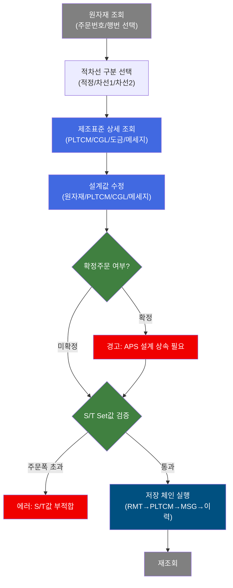
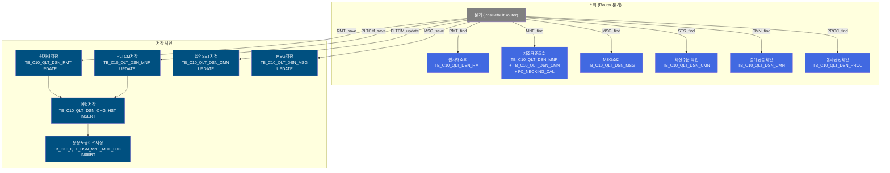
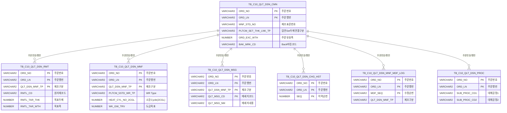

<h1 style="font-size: 40px; text-align: center; font-weight:
   bold; margin: 30px 0;">
  C104000020TAB05 레거시 시스템 분석 종합 보고서
</h1>


# 1. 시스템 개요
- **서비스 ID**: C104000020TAB05
- **업무명**: 품질설계결과-용융도금(제조표준)
- **분석 일시**: 2026-03-16 20:19 KST
- **전체 Activity 수**: 13 (Built-in 13, Custom 0)
- **분석자**: Claude Opus 4.6
- **분석 도구**: /analyze-service C104000020TAB05
- **문서 버전**: 1.0

# 📊 비즈니스 프로세스 분석

## 시스템 목적

본 서비스는 **품질설계결과 중 용융도금(CGL) 공정의 제조표준**을 관리하는 화면(탭)이다. 부모 화면 C104000020의 TAB05에 해당하며, 주문번호/주문행번 기반으로 원자재(Raw Material) 스펙, PLTCM 압연 제조사양, CGL 소둔조건(2~5CGL), 도금 부착량/작업조건, Back마킹, 품질메세지를 **조회 및 수정**할 수 있다.

품질설계 담당자가 주문별 적정/차선1/차선2 세 가지 적차선 구분에 따라 원자재 두께·폭 목표값, PLTCM 5Stand WR Type, 내경링 사용 여부, Side Trimming Set값, CGL별 소둔Cycle/가열온도/냉각온도/침적시간/Line Speed, 도금부착량, 수지부착량 등을 설정한다. 변경 시에는 변경 전/후 값이 이력 테이블에 자동 기록되며, 확정주문에 대해서는 APS 설계 상속 경고를 표시한다.

특히 PLTCM 폭목표값 산출 시 FC_NECKING_CAL 함수를 호출하여 네킹(폭수축) 보정값을 계산하고, BigData 분석값과 비교할 수 있다.

## 핵심 워크플로우 다이어그램



### 상세 워크플로우 다이어그램



## 주요 유즈케이스

### UC-01: 원자재 및 제조표준 조회
- **Actor**: 품질설계 담당자
- **목적**: 주문별 용융도금 공정의 원자재 스펙 및 제조표준 파라미터를 조회하여 설계 현황을 확인

- **전제조건**:
  - 부모 화면(C104000020)에서 주문번호 및 주문행번이 선택되어 있음
  - 해당 주문에 대한 품질설계 데이터가 존재함

- **주요 흐름**:
  1. 부모 화면 C104000020_Form_1에서 주문번호/주문행번 확인
  2. find() 호출 → uiCommon.parameters4로 파라미터 구성 → Grid_1(원자재)에 RMT_find 데이터 로드
  3. Grid_1 로드 완료 시 첫 행(적정) 자동 선택 → deteilFind() 콜백 실행
  4. deteilFind()에서 MNF_find(제조표준), MSG_find(품질메세지) 동시 조회
  5. Grid_2(PLTCM), Grid_3/4(CGL 소둔), Grid_5(도금부착량), Grid_6(Back마킹), Grid_7(품질메세지) 데이터 바인딩

- **대체 흐름**:
  - 주문번호 미입력 시: "주문번호를 입력해주세요." 알림
  - 주문행번 미선택 시: "주문행번를 선택해주세요." 알림

- **후행조건**:
  - 모든 Grid에 해당 적차선의 제조표준 데이터가 표시됨
  - 상태바(messagebox)에 원자재 조회 메세지 표시

### UC-02: 적차선별 제조표준 전환 조회
- **Actor**: 품질설계 담당자
- **목적**: 적정/차선1/차선2 간 전환하여 각 적차선의 제조표준을 비교 확인

- **전제조건**:
  - UC-01 조회가 완료되어 Grid_1에 3행(적정/차선1/차선2) 표시됨

- **주요 흐름**:
  1. Grid_1에서 다른 행(차선1 또는 차선2) 클릭
  2. onRowSelect_Grid1에서 다른 Grid 선택 해제
  3. deteilFind(rowId) 콜백 → QLT_DSN_MNF_TP 값 추출
  4. MNF_find, MSG_find 서비스 호출 (QLT_DSN_MNF_TP 파라미터 포함)
  5. Grid_2~7 해당 적차선 데이터로 갱신
  6. 압연Set지정 체크박스 리스너 등록

- **대체 흐름**:
  - 적차선 데이터 없는 경우: 해당 Grid에 빈 값 표시

- **후행조건**:
  - 선택한 적차선의 제조표준이 모든 하위 Grid에 표시됨

### UC-03: 제조표준 수정 및 저장
- **Actor**: 품질설계 담당자
- **목적**: 원자재 스펙, PLTCM 파라미터, CGL 소둔조건, 도금 부착량, 품질메세지를 수정하고 저장

- **전제조건**:
  - UC-01 조회 완료 상태
  - 수정 권한 보유

- **주요 흐름**:
  1. Grid_1(원자재)에서 원자재등급/두께/폭 값 수정 또는 Grid_2(PLTCM)에서 WR Type/ST값 수정 또는 Grid_7(메세지) 수정
  2. Form_1의 저장 버튼 클릭
  3. 확정주문 여부 확인 (STSselect → TB_C10_QLT_DSN_CMN 조회)
  4. 확정주문이면 "확정된 주문이니 APS에서 반드시 설계 상속 받으시기 바랍니다!" 경고
  5. S/T Set값 검증: 주공정/대체공정1/대체공정2 각각 주문폭(ORD_EXC_WTH) 이하인지 확인 (슬릿 그룹 카운트 0인 경우만)
  6. 저장 확인 대화상자 표시
  7. 저장 체인 실행:
     - Grid_1 변경시: RMT_save → 완료 후 PLTCM_save 또는 MSG_save
     - Grid_2 변경시: PLTCM_save → 완료 후 MSG_save 또는 재조회
     - Grid_7 변경시: MSG_save → 완료 후 재조회
  8. 각 저장 완료 시 이력 INSERT (CHG_HSTinsert + MNF_MDFinsert)
  9. 최종 재조회 (RMT_find)

- **대체 흐름**:
  - 변경 데이터 없음: "변경된 데이터가 없습니다." 알림
  - S/T값이 주문폭 초과: "주공정S/T값이 주문폭보다 작습니다" 등 에러 알림 후 저장 중단

- **후행조건**:
  - TB_C10_QLT_DSN_RMT, TB_C10_QLT_DSN_MNF, TB_C10_QLT_DSN_MSG 업데이트됨
  - TB_C10_QLT_DSN_CHG_HST, TB_C10_QLT_DSN_MNF_MDF_LOG에 변경 이력 기록
  - 화면 재조회되어 최신 데이터 표시

### UC-04: 압연Set지정 (PLTCM 두께 연결)
- **Actor**: 품질설계 담당자
- **목적**: PLTCM 압연 Set 두께 연결 타입을 설정하여 X-Ray Set 두께값과 압연 두께를 연동

- **전제조건**:
  - 제조표준 조회 완료 상태

- **주요 흐름**:
  1. Form_1의 "압연Set지정" 체크박스 변경
  2. Grid_2의 updated 상태 자동 설정 (addCheckboxChangeListener)
  3. 저장 시 PLTCM_SET_THK_LNK_TP 값(1/0)을 PLTCM_update 서비스로 TB_C10_QLT_DSN_CMN 업데이트
  4. 부모 화면 C104000020_Form_2에도 값 동기화

- **후행조건**:
  - TB_C10_QLT_DSN_CMN의 PLTCM_SET_THK_LNK_TP 컬럼 업데이트

### UC-05: CGL 소둔Cycle 변경 및 자동 동기화
- **Actor**: 품질설계 담당자
- **목적**: CGL별 소둔 Cycle을 변경하면 관련 그리드에 자동 반영

- **전제조건**:
  - 제조표준 조회 완료 상태

- **주요 흐름**:
  1. Grid_3에서 2CGL 또는 4CGL의 소둔Cycle 콤보 변경
  2. onSelectionChange 이벤트 → Grid_2의 해당 컬럼(인덱스 40/50)에 값 자동 동기화
  3. Grid_2의 해당 행 updated 상태 설정
  4. Grid_4에서 3CGL 또는 5CGL 변경 시 동일 패턴 (인덱스 45/55)

- **후행조건**:
  - Grid_2(PLTCM 제조사양)에 변경된 소둔Cycle이 반영됨
  - 저장 시 해당 값이 함께 저장됨

---
## 비즈니스 로직 상세

### 1. FC_NECKING_CAL 폭수축(네킹) 계산

- **목적**: PLTCM 압연 공정에서 폭수축(Necking) 보정값을 산출하여 Side Trimming Set값 및 폭목표값 설정에 활용
- **처리 케이스**:

  **[케이스 1: 네킹 계산 함수 호출]**
  ```
    조건: C104000020TAB05_MNF.select 쿼리 내 스칼라 서브쿼리로 호출
    처리:
      1. TB_C10_QLT_DSN_CMN(B) 테이블에서 MNF_STD_NO (제조표준번호) 조회
      2. C10APUSER.FC_NECKING_CAL(B.MNF_STD_NO) 함수 호출
      3. 결과를 NECKING_WTH 컬럼으로 Grid_2에 표시
      4. BIGDATA_NECKING_WTH와 비교 가능
  ```

- **참고**: FC_NECKING_CAL 함수는 C10APUSER 스키마의 Standalone Function으로, 제조표준번호 기반 네킹 보정값을 반환함 (상세 분석은 PL/SQL 분석 참조)

### 2. 확정주문 검증 로직

- **목적**: 확정된 주문의 설계값 변경 시 APS 설계 상속 필요성을 사전 경고
- **처리 케이스**:

  **[케이스 1: Grid_1(원자재) 변경 시]**
  ```
    조건: row_status11 == "updated"
    처리:
      1. STSselect 쿼리로 TB_C10_QLT_DSN_CMN에서 확정 여부 조회
      2. 데이터 존재(cells1.length > 0) → "확정된 주문이니 APS에서 반드시 설계 상속 받으시기 바랍니다!" 경고
      3. 경고 후 저장 계속 진행 (return 없음 - 주석 처리됨)
  ```

  **[케이스 2: Grid_2(PLTCM) 변경 시]**
  ```
    조건: row_status12 != "" AND fg_grid2_update == "N"
    처리: 동일한 확정주문 확인 후 경고 표시
  ```

### 3. S/T Set값 주문폭 검증

- **목적**: Side Trimming Set값이 주문폭을 초과하지 않도록 검증
- **처리 케이스**:

  **[주공정/대체공정1/대체공정2 각각 검증]**
  ```
    조건: S/T Set값이 존재하고, 슬릿 그룹 카운트(ORD_SLIT_GRP_CNT) == 0
    처리:
      1. CMN_find 쿼리로 주문폭(ORD_EXC_WTH)과 슬릿그룹카운트 조회
      2. parseFloat(주문폭) > parseFloat(S/T값) 비교
      3. 초과 시 "주공정S/T값이 주문폭보다 작습니다" 에러 → 저장 중단
      4. 대체공정1, 대체공정2도 동일 검증
  ```

### 4. 저장 체인 순서 제어

- **목적**: Grid_1 → Grid_2 → Grid_7 순서로 변경사항을 순차 저장하고 이력을 남김
- **처리 케이스**:

  **[케이스 1: Grid_1 변경된 경우]**
  ```
    처리:
      1. Grid_1 RMT_save (TB_C10_QLT_DSN_RMT UPDATE)
      2. onGridAfterUpdateFinishEvent1 콜백
      3. Grid_2 변경 있으면 → PLTCM_save 실행
      4. Grid_2 변경 없으면 → Grid_7 변경 있으면 MSG_save, 없으면 재조회
  ```

  **[케이스 2: 서비스 체인]**
  ```
    처리:
      1. 원자재저장 → success → 이력저장(CHG_HSTinsert) → success → 용융도금이력저장(MNF_MDFinsert)
      2. PLTCM저장 → success → 이력저장(CHG_HSTinsert) → success → 용융도금이력저장(MNF_MDFinsert)
      3. MSG저장 → success → end
      4. 압연SET지정 → success → end
  ```

### 5. 원자재 두께/폭 범위 경고 표시

- **목적**: 원자재 목표 두께/폭 값이 기준 범위를 벗어나면 셀 배경을 빨간색으로 표시
- **처리 케이스**:

  **[두께 범위 검증]**
  ```
    조건: onEditCellEvent1 stage==2, 컬럼인덱스 2 (RMTL_TAR_THK)
    처리:
      1. 신규값(nValue)이 하한기준(RMTL_TAR_THK_LVL_STD) 미만 또는 상한기준(RMTL_TAR_THK_UVL_STD) 초과 시
      2. 해당 셀 background:red 설정, redflag1 = 1
      3. 범위 내면 background:white 복원, redflag1 = 0
  ```

### 6. 코드값 변환 (MNF.select 쿼리)

- **목적**: 제조표준 조회 시 코드값을 의미명으로 변환하여 표시
- **처리 케이스**:

  **[스칼라 서브쿼리 코드 변환]**
  ```
    조건: VI_M00_CODE_ACCESS 뷰 참조
    처리:
      1. PLTCM_5STD_WR_TP → GRP_CD='PLTCM_5STD_WR_TP' 기준 코드명 조회
      2. PLTCM_SLV_USE_YN → GRP_CD='PLTCM_SLV_USE_YN' 기준
      3. PLTCM_EDG_ASG_TP → GRP_CD='CUT_LN_YN' 기준
      4. 각 코드명을 Grid에 표시
  ```

---

# 💾 데이터 요구사항

## 핵심 테이블

### 1. TB_C10_QLT_DSN_RMT - (품질설계 원자재)
| 컬럼명 | 타입 | PK | 설명 |
|--------|------|----|------|
| ORD_NO | VARCHAR2 | ✅ | 주문번호 |
| ORD_LN | VARCHAR2 | ✅ | 주문행번 |
| QLT_DSN_MNF_TP | VARCHAR2 | ✅ | 품질설계제조구분 (적정/차선1/차선2) |
| RMTL_CD | VARCHAR2 | | 원자재코드 |
| RMTL_GRD | VARCHAR2 | | 원자재등급(선호도) |
| RMTL_TAR_THK | NUMBER | | 원자재목표두께 |
| RMTL_TAR_THK_LVL | NUMBER | | 원자재목표두께 하한 |
| RMTL_TAR_THK_UVL | NUMBER | | 원자재목표두께 상한 |
| RMTL_TAR_WTH | NUMBER | | 원자재목표폭 |

### 2. TB_C10_QLT_DSN_MNF - (품질설계 제조표준)
| 컬럼명 | 타입 | PK | 설명 |
|--------|------|----|------|
| ORD_NO | VARCHAR2 | ✅ | 주문번호 |
| ORD_LN | VARCHAR2 | ✅ | 주문행번 |
| QLT_DSN_MNF_TP | VARCHAR2 | ✅ | 품질설계제조구분 |
| RMTL_CD | VARCHAR2 | | 원자재코드 |
| CRM_MNF_STD_NO | VARCHAR2 | | CRM 제조표준번호 |
| PLTCM_5STD_WR_TP | VARCHAR2 | | 5Stand WR Type |
| PLTCM_SLV_USE_YN | VARCHAR2 | | 내경링사용여부 |
| PLTCM_EDG_ASG_TP | VARCHAR2 | | S/T유무(Edge지정구분) |
| PLTCM_SET_THK_TRV | NUMBER | | X-Ray Set두께값 |
| PL_WTH_TRV | NUMBER | | Side Trimming Set값(주공정) |
| PL_WTH_SUB_PROC1_TRV | NUMBER | | Side Trimming Set값(대체공정1) |
| PL_WTH_SUB_PROC2_TRV | NUMBER | | Side Trimming Set값(대체공정2) |
| PLTCM_THK_TRV | NUMBER | | 압연 두께목표값 |
| PLTCM_THK_LLV | NUMBER | | 압연 두께하한값 |
| PLTCM_THK_ULV | NUMBER | | 압연 두께상한값 |
| PLTCM_WTH_TRV | NUMBER | | 폭목표값(주공정) |
| PLTCM_WTH_SUB_PROC1_TRV | NUMBER | | 폭목표값(대체공정1) |
| PLTCM_WTH_SUB_PROC2_TRV | NUMBER | | 폭목표값(대체공정2) |
| HEAT_CYL_NO_2CGL | NUMBER | | 소둔Cycle(2CGL) |
| HTG_TEM_2CGL | NUMBER | | 가열온도(2CGL) |
| CLG_TEM_2CGL | NUMBER | | 냉각온도(2CGL) |
| SHK_TM_2CGL | NUMBER | | 침적시간(2CGL) |
| LN_SPD_2CGL | NUMBER | | Line Speed(2CGL) |
| HEAT_CYL_NO_3CGL ~ LN_SPD_5CGL | NUMBER | | 3~5CGL 동일 구조 |
| WK_GW_TOT_LLV | NUMBER | | 도금부착량 하한 |
| WK_GW_TOT_ULV | NUMBER | | 도금부착량 상한 |
| WK_GW_TRV | NUMBER | | 도금목표 |
| GAL_THK_TRV | NUMBER | | 두께(도금량) |
| SPNL_TP | VARCHAR2 | | Spangle 유형 |
| CGL_LVL_YN | VARCHAR2 | | CGL Leveler 사용여부 |
| CGL_SP_ASG_YN | VARCHAR2 | | Skin Pass 여부 |
| CGL_SUR_HND_CD | VARCHAR2 | | 표면처리코드 |
| RSN_ATT_AMT_TRV | NUMBER | | 수지부착량(목표) |
| RSN_ATT_AMT_LLV | NUMBER | | 수지부착량(하한) |
| RSN_ATT_AMT_ULV | NUMBER | | 수지부착량(상한) |
| CGL_THK_TRV | NUMBER | | CGL 목표 두께 |
| CGL_WTH_TRV | NUMBER | | CGL 목표 폭 |

### 3. TB_C10_QLT_DSN_CMN - (품질설계 공통)
| 컬럼명 | 타입 | PK | 설명 |
|--------|------|----|------|
| ORD_NO | VARCHAR2 | ✅ | 주문번호 |
| ORD_LN | VARCHAR2 | ✅ | 주문행번 |
| MNF_STD_NO | VARCHAR2 | | 제조표준번호 |
| BAK_MRK_CD | VARCHAR2 | | Back마킹코드 |
| BAK_MRK | VARCHAR2 | | Back마킹 내용 |
| ORD_EXC_WTH | NUMBER | | 주문 유효폭 |
| ORD_SLIT_GRP_CNT | NUMBER | | 슬릿그룹카운트 |
| PLTCM_SET_THK_LNK_TP | VARCHAR2 | | 압연Set두께연결구분 |

### 4. TB_C10_QLT_DSN_MSG - (품질설계 메세지)
| 컬럼명 | 타입 | PK | 설명 |
|--------|------|----|------|
| ORD_NO | VARCHAR2 | ✅ | 주문번호 |
| ORD_LN | VARCHAR2 | ✅ | 주문행번 |
| QLT_DSN_MNF_TP | VARCHAR2 | ✅ | 품질설계제조구분 |
| QLT_MSG_CD | VARCHAR2 | ✅ | 품질Message코드 |
| QLT_MSG_NM | VARCHAR2 | | 품질Message 내용 |

### 5. TB_C10_QLT_DSN_CHG_HST - (품질설계 변경이력)
| 컬럼명 | 타입 | PK | 설명 |
|--------|------|----|------|
| ORD_NO | VARCHAR2 | ✅ | 주문번호 |
| ORD_LN | VARCHAR2 | ✅ | 주문행번 |
| SEQ | NUMBER | ✅ | 이력 순번 (자동증분) |
| CREATED_OBJECT_TYPE | VARCHAR2 | | 변경 유형 (UI/BATCH) |
| CREATED_OBJECT_ID | VARCHAR2 | | 변경자 ID |
| CREATED_PROGRAM_ID | VARCHAR2 | | 변경 프로그램 ID |
| CREATION_TIMESTAMP | VARCHAR2 | | 변경 일시 |

### 6. TB_C10_QLT_DSN_MNF_MDF_LOG - (용융도금 제조표준 변경 로그)
| 컬럼명 | 타입 | PK | 설명 |
|--------|------|----|------|
| ORD_NO | VARCHAR2 | ✅ | 주문번호 |
| ORD_LN | VARCHAR2 | ✅ | 주문행번 |
| MDF_SEQ | VARCHAR2 | ✅ | 수정 순번 |
| QLT_DSN_MNF_TP | VARCHAR2 | | 품질설계제조구분 |
| RMTL_TAR_THK | VARCHAR2 | | 원자재목표두께 (변경 후) |
| RMTL_TAR_THK_BF | VARCHAR2 | | 원자재목표두께 (변경 전) |
| RMTL_TAR_THK_LVL / _BF | VARCHAR2 | | 두께하한 변경 전/후 |
| RMTL_TAR_THK_UVL / _BF | VARCHAR2 | | 두께상한 변경 전/후 |
| RMTL_TAR_WTH / _BF | VARCHAR2 | | 폭 변경 전/후 |
| PLTCM_5STD_WR_TP / _BF | VARCHAR2 | | WR Type 변경 전/후 |
| PLTCM_SLV_USE_YN / _BF | VARCHAR2 | | 내경링사용 변경 전/후 |
| PLTCM_EDG_ASG_TP / _BF | VARCHAR2 | | S/T유무 변경 전/후 |
| MDF_PRS_ID | VARCHAR2 | | 수정자 ID |
| MDF_DH | VARCHAR2 | | 수정 일시 |

### 7. TB_C10_QLT_DSN_PROC - (품질설계 통과공정)
| 컬럼명 | 타입 | PK | 설명 |
|--------|------|----|------|
| ORD_NO | VARCHAR2 | ✅ | 주문번호 |
| ORD_LN | VARCHAR2 | ✅ | 주문행번 |
| SUB_PROC_CD1 | VARCHAR2 | | 대체공정코드1 |
| SUB_PROC_CD2 | VARCHAR2 | | 대체공정코드2 |

## 데이터 플로우

### 1. 조회
```
[원자재 조회]
부모 화면에서 주문번호/행번 선택
→ C104000020TAB05_RMT.select
  FROM TB_C10_QLT_DSN_RMT
  LEFT JOIN VI_M00_CODE_ACCESS (RMTL_CD 코드명 변환)
  WHERE ORD_NO = :ORD_NO AND ORD_LN = :ORD_LN
→ Grid_1에 적정/차선1/차선2 3행 표시

[제조표준 상세 조회]
Grid_1 행 선택 (deteilFind)
→ C104000020TAB05_MNF.select
  FROM TB_C10_QLT_DSN_MNF A
  INNER JOIN TB_C10_QLT_DSN_CMN B ON A.ORD_NO=B.ORD_NO AND A.ORD_LN=B.ORD_LN
  + 스칼라 서브쿼리: VI_M00_CODE_ACCESS (코드명 변환), FC_NECKING_CAL(B.MNF_STD_NO) (폭수축값)
  WHERE A.ORD_NO = :ORD_NO AND A.ORD_LN = :ORD_LN AND A.QLT_DSN_MNF_TP = :QLT_DSN_MNF_TP
→ Grid_2(PLTCM), Grid_3/4(CGL소둔), Grid_5(도금), Grid_6(Back마킹)에 표시

[품질메세지 조회]
→ C104000020TAB05_MSG.select
  FROM TB_C10_QLT_DSN_MSG
  WHERE ORD_NO = :ORD_NO AND ORD_LN = :ORD_LN AND QLT_DSN_MNF_TP = :QLT_DSN_MNF_TP
→ Grid_7에 표시

[확정주문 확인]
→ C104000020TAB05.STSselect
  FROM TB_C10_QLT_DSN_CMN
  WHERE ORD_NO = :ORD_NO AND ORD_LN = :ORD_LN
→ 데이터 존재 시 확정주문

[설계공통 확인]
→ C104000020TAB05_CMN
  FROM TB_C10_QLT_DSN_CMN
  WHERE ORD_NO = :ORD_NO AND ORD_LN = :ORD_LN
→ ORD_EXC_WTH, ORD_SLIT_GRP_CNT 반환

[통과공정 확인]
→ C104000020TAB05_PROC
  FROM TB_C10_QLT_DSN_PROC
  WHERE ORD_NO = :ORD_NO AND ORD_LN = :ORD_LN
→ SUB_PROC_CD1, SUB_PROC_CD2 반환
```

### 2. 저장
```
[원자재 저장]
→ C104000020TAB05.RMTupdate
  UPDATE TB_C10_QLT_DSN_RMT
  SET RMTL_CD, RMTL_GRD, RMTL_TAR_THK, RMTL_TAR_THK_LVL, RMTL_TAR_THK_UVL, RMTL_TAR_WTH, ...
  WHERE ORD_NO = :ORD_NO AND ORD_LN = :ORD_LN AND QLT_DSN_MNF_TP = :QLT_DSN_MNF_TP

[PLTCM 제조사양 저장]
→ C104000020TAB05.MNF_CGLupdate
  UPDATE TB_C10_QLT_DSN_MNF
  SET PLTCM_5STD_WR_TP, PLTCM_SLV_USE_YN, PLTCM_EDG_ASG_TP, 소둔조건(2~5CGL), 도금량, 수지량, ...
  WHERE ORD_NO = :ORD_NO AND ORD_LN = :ORD_LN AND QLT_DSN_MNF_TP = :QLT_DSN_MNF_TP

[압연SET지정]
→ C104000020TAB05.PLTCM_update
  UPDATE C10APUSER.TB_C10_QLT_DSN_CMN
  SET PLTCM_SET_THK_LNK_TP = :PLTCM_SET_THK_LNK_TP
  WHERE ORD_NO = :ORD_NO AND ORD_LN = :ORD_LN

[품질메세지 저장]
→ C104000020TAB05.MSGupdate
  UPDATE TB_C10_QLT_DSN_MSG
  SET QLT_MSG_NM = :QLT_MSG_NM
  WHERE ORD_NO = :ORD_NO AND ORD_LN = :ORD_LN AND QLT_DSN_MNF_TP = :QLT_DSN_MNF_TP AND QLT_MSG_CD = :QLT_MSG_CD

[이력 저장 (모든 저장 후)]
→ C104000020TAB05.CHG_HSTinsert
  INSERT INTO TB_C10_QLT_DSN_CHG_HST (ORD_NO, ORD_LN, SEQ, ...)

→ C104000020TAB05.MNF_MDFinsert
  INSERT INTO TB_C10_QLT_DSN_MNF_MDF_LOG (ORD_NO, ORD_LN, MDF_SEQ, 변경전값, 변경후값, ...)
```

## SQL 일람표

| SQL 이름 | 쿼리 ID | 타입 | 출처 | 테이블 |
|---------|---------|------|------|--------|
| 원자재 조회 | C104000020TAB05_RMT.select | SELECT | Service | TB_C10_QLT_DSN_RMT, VI_M00_CODE_ACCESS |
| 제조표준 상세 조회 | C104000020TAB05_MNF.select | SELECT | Service | TB_C10_QLT_DSN_MNF, TB_C10_QLT_DSN_CMN, VI_M00_CODE_ACCESS, FC_NECKING_CAL |
| 품질메세지 조회 | C104000020TAB05_MSG.select | SELECT | Service | TB_C10_QLT_DSN_MSG |
| 확정주문 확인 | C104000020TAB05.STSselect | SELECT | Service | TB_C10_QLT_DSN_CMN |
| 설계공통 확인 | C104000020TAB05_CMN | SELECT | Service | TB_C10_QLT_DSN_CMN |
| 통과공정 확인 | C104000020TAB05_PROC | SELECT | Service | TB_C10_QLT_DSN_PROC |
| 원자재 저장 | C104000020TAB05.RMTupdate | UPDATE | Service | TB_C10_QLT_DSN_RMT |
| PLTCM 제조사양 저장 | C104000020TAB05.MNF_CGLupdate | UPDATE | Service | TB_C10_QLT_DSN_MNF |
| 압연SET지정 | C104000020TAB05.PLTCM_update | UPDATE | Service | TB_C10_QLT_DSN_CMN |
| 품질메세지 저장 | C104000020TAB05.MSGupdate | UPDATE | Service | TB_C10_QLT_DSN_MSG |
| 변경이력 저장 | C104000020TAB05.CHG_HSTinsert | INSERT | Service | TB_C10_QLT_DSN_CHG_HST |
| 용융도금 변경로그 | C104000020TAB05.MNF_MDFinsert | INSERT | Service | TB_C10_QLT_DSN_MNF_MDF_LOG |

## PL/SQL 함수/프로시저

| # | 호출명 | 유형 | 용도 | 상세 분석 |
|---|--------|------|------|----------|
| 1 | FC_NECKING_CAL | Standalone Function | 폭수축(네킹) 보정값 계산 | [분석 보고서](../../../dbms/C10APUSER/function/FC_NECKING_CAL_analysis_report.md) |

## ER 다이어그램 (핵심 관계)



관계 설명:
- **TB_C10_QLT_DSN_CMN**이 중심 허브 테이블로, ORD_NO + ORD_LN을 기반으로 모든 하위 테이블과 1:N 관계
- TB_C10_QLT_DSN_RMT, TB_C10_QLT_DSN_MNF, TB_C10_QLT_DSN_MSG는 QLT_DSN_MNF_TP(적정/차선1/차선2)로 추가 분할
- TB_C10_QLT_DSN_CHG_HST는 변경 이력 (SEQ 자동증분), TB_C10_QLT_DSN_MNF_MDF_LOG는 제조표준 변경 전/후 값 상세 기록

---

# 🖥️ 사용자 인터페이스 요구사항

## 화면 레이아웃 상세

### Layout 구조 (절대 위치 기반)
```javascript
{
  // C104000020의 TAB05 탭 콘텐츠 (958 x 515px)
  components: [
    { id: "Grid_8",  type: "grid", left: 1, top: 0,   width: 116, height: 118, title: "적차선 구분 레이블" },
    { id: "Grid_1",  type: "grid", left: 118, top: 0,  width: 840, height: 118, title: "원자재 정보" },
    { id: "Form_1",  type: "form", left: 1, top: 121,  width: 958, height: 26,  title: "PLTCM 툴바" },
    { id: "Grid_2",  type: "grid", left: 1, top: 150,  width: 957, height: 74,  title: "PLTCM 제조사양" },
    { id: "Form_2",  type: "form", left: 1, top: 228,  width: 958, height: 20,  title: "CGL 헤더" },
    { id: "Grid_3",  type: "grid", left: 1, top: 249,  width: 479, height: 70,  title: "소둔조건(2CGL/4CGL)" },
    { id: "Grid_4",  type: "grid", left: 483, top: 249, width: 475, height: 70,  title: "소둔조건(3CGL/5CGL)" },
    { id: "Grid_5",  type: "grid", left: 1, top: 322,  width: 957, height: 74,  title: "도금부착량/CGL작업조건" },
    { id: "Grid_6",  type: "grid", left: 1, top: 399,  width: 957, height: 22,  title: "Back마킹" },
    { id: "Form_3",  type: "form", left: 1, top: 424,  width: 958, height: 20,  title: "품질메세지 헤더" },
    { id: "Grid_7",  type: "grid", left: 1, top: 424,  width: 957, height: 50,  title: "품질메세지" },
    { id: "messagebox", type: "messagebox", left: 1, top: 496, width: 957, height: 19 }
  ]
}
```

## 입출력 요소

### Form 컴포넌트

**C104000020TAB05_Form_1 (PLTCM 툴바)**
- std_title: label - "PLTCM"
- std_title1: label - "※시스템 설계값 복원은 '재설계'하시기 바랍니다!"
- PLTCM_SET_THK_LNK_TP: checkbox - "압연Set지정" → 체크 변경 시 Grid_2 updated 설정
- simul: button - "폭수축" (command: simul)
- save: button - "저장" (command: save, 초기 비활성화)

**C104000020TAB05_Form_2 (CGL 헤더)**
- std_title: label - "CGL"

**C104000020TAB05_Form_3 (품질메세지 헤더)**
- std_title: label - "품질메세지"

### Grid 컴포넌트

**C104000020TAB05_Grid_8 (적차선 구분 레이블)**
- 편집 가능 여부: 아니오 (읽기 전용)
- Split: 없음
- 정적 행: 3행 (적정/차선1/차선2 레이블)
- 주요 컬럼 (1개):

  **기본 정보**:
  - QLT_DSN_MNF_TP: ro - 적차선 구분 (100px)

**C104000020TAB05_Grid_1 (원자재 정보)**
- 편집 가능 여부: 예 (일부 컬럼)
- 수직 그리드 (vertical: true), 3행 고정
- saveAction: RMT_save
- referenceItem: C104000020TAB05_Grid_1
- 주요 컬럼 (16개):

  **표시 컬럼**:
  - RMTL_CD: ro - 원자재코드 (읽기 전용)
  - RMTL_GRD: combo_v - 원자재선호도 (LOV: RMTL_GRD)
  - RMTL_TAR_THK: ed - 두께(목표) (편집 가능, 범위 초과 시 빨간 배경)
  - RMTL_TAR_THK_LVL: ed - 두께(하한) (편집 가능)
  - RMTL_TAR_THK_UVL: ed - 두께(상한) (편집 가능)
  - RMTL_TAR_WTH: edn - 폭(목표) (숫자 편집, 범위 초과 시 빨간 배경)

  **숨김 컬럼**:
  - QLT_DSN_MNF_TP: ro - 품질설계제조구분 (숨김)
  - ORD_NO: ro - 주문번호 (숨김)
  - ORD_LN: ro - 주문행번 (숨김)
  - RMTL_TAR_THK_LVL_STD: ro - 두께하한 기준값 (숨김, 범위 검증용)
  - RMTL_TAR_THK_UVL_STD: ro - 두께상한 기준값 (숨김, 범위 검증용)
  - RMTL_TAR_WTH_STD: ro - 폭 기준값 (숨김, 범위 검증용)
  - RMTL_TAR_THK_BF: ro - 두께 변경 전 값 (숨김, 이력용)
  - RMTL_TAR_THK_LVL_BF: ro - 두께하한 변경 전 (숨김)
  - RMTL_TAR_THK_UVL_BF: ro - 두께상한 변경 전 (숨김)
  - RMTL_TAR_WTH_BF: ro - 폭 변경 전 값 (숨김)

**C104000020TAB05_Grid_2 (PLTCM 제조사양)**
- 편집 가능 여부: 예
- 수직 그리드, saveAction: PLTCM_save
- referenceItem: C104000020TAB05_Grid_1
- 주요 표시 컬럼 (15개):
  - PLTCM_5STD_WR_TP: combo_v - 5Stand WRType (LOV: PLTCM_5STD_WR_TP)
  - PLTCM_SLV_USE_YN: combo_v - 내경링사용여부 (LOV: PLTCM_SLV_USE_YN)
  - PLTCM_EDG_ASG_TP: combo_v - S/T유무 (LOV: CUT_LN_YN)
  - PLTCM_SET_THK_TRV: ron - X-Ray Set두께값 (읽기 전용 숫자)
  - PL_WTH_TRV: ed - Side Trimming Set값(주공정)
  - PL_WTH_SUB_PROC1_TRV: ed - Side Trimming Set값(대체공정1)
  - PL_WTH_SUB_PROC2_TRV: ed - Side Trimming Set값(대체공정2)
  - NECKING_WTH: ron - 폭수축값 (읽기 전용, FC_NECKING_CAL 결과)
  - BIGDATA_NECKING_WTH: ron - BigData분석값 (읽기 전용)
  - PLTCM_THK_TRV: ed - 두께목표값
  - PLTCM_THK_LLV: ed - 두께하한값
  - PLTCM_THK_ULV: ed - 두께상한값
  - PLTCM_WTH_TRV: ed - 폭목표값(주공정)
  - PLTCM_WTH_SUB_PROC1_TRV: ed - 폭목표값(대체공정1)
  - PLTCM_WTH_SUB_PROC2_TRV: ed - 폭목표값(대체공정2)
- 숨김 컬럼 (49개): CGL 소둔조건, 도금량, 수지량 등 하위 Grid와 공유되는 컬럼들

**C104000020TAB05_Grid_3 (CGL 소둔조건 - 2CGL/4CGL)**
- 편집 가능 여부: 예
- 수직 그리드, 정적 2행 (2CGL / 4CGL)
- 주요 컬럼 (6개):
  - LINE: ro - Line (2CGL/4CGL 레이블)
  - HEAT_CYL_NO_2CGL: combo_v - 소둔Cycle (LOV: HEAT_CYL_CD) → 변경 시 Grid_2 인덱스 40 동기화
  - HTG_TEM_2CGL: ed - HT (가열온도)
  - CLG_TEM_2CGL: ed - CT (냉각온도)
  - SHK_TM_2CGL: ed - ST (침적시간)
  - LN_SPD_2CGL: ed - Line Speed

**C104000020TAB05_Grid_4 (CGL 소둔조건 - 3CGL/5CGL)**
- Grid_3과 동일 구조, 3CGL/5CGL용 (인덱스 45/55로 Grid_2 동기화)

**C104000020TAB05_Grid_5 (도금 부착량 / CGL 작업조건)**
- 편집 가능 여부: 예
- 수직 그리드
- 주요 컬럼 (13개):
  - WK_GW_TOT_LLV: ed - 도금부착량(하한) (format: 0,000.0)
  - WK_GW_TOT_ULV: ed - 도금부착량(상한) (format: 0,000.0)
  - WK_GW_TRV: ed - 도금목표 (format: 000.0)
  - GAL_THK_TRV: ed - 두께(도금량) (format: 000)
  - SPNL_TP: ro - Spangle (읽기 전용)
  - CGL_LVL_YN: combo_v - L/V CGLLeveler사용여부 (LOV: CGL_LVL_YN) → 변경 시 Grid_2 인덱스 65 동기화
  - CGL_SP_ASG_YN: ro - Skin Pass (읽기 전용)
  - CGL_SUR_HND_CD: ro - 표면처리 (읽기 전용)
  - RSN_ATT_AMT_TRV: ed - 수지부착량(목표) (format: 0000)
  - RSN_ATT_AMT_LLV: ed - 수지부착량(하한) (format: 0000)
  - RSN_ATT_AMT_ULV: ed - 수지부착량(상한) (format: 0000)
  - CGL_THK_TRV: ed - 목표 Size(두께)
  - CGL_WTH_TRV: ed - 목표 Size(폭)

**C104000020TAB05_Grid_6 (Back마킹)**
- 편집 가능 여부: 아니오 (읽기 전용)
- 주요 컬럼 (2개):
  - BAK_MRK_CD: ro - Back마킹코드 (16px)
  - BAK_MRK: ro - Back마킹 내용 (*px, 가변 폭)

**C104000020TAB05_Grid_7 (품질메세지)**
- 편집 가능 여부: 예 (QLT_MSG_NM만)
- saveAction: MSG_save
- referenceItem: C104000020TAB05_Grid_7
- 주요 컬럼 (5개):

  **표시 컬럼**:
  - QLT_MSG_CD: ro - 품질Message코드
  - QLT_MSG_NM: ed - 품질Message 내용 (편집 가능)

  **숨김 컬럼**:
  - QLT_DSN_MNF_TP: ro - 제조사양구분 (숨김)
  - ORD_NO: ro - 주문번호 (숨김)
  - ORD_LN: ro - 주문행번 (숨김)

## 화면 동작 흐름

### 1. 화면 초기 로딩
```
1. C104000020 부모 화면의 TAB05 탭 활성화
2. pageConfiguration JSON 기반 DHTMLX 컴포넌트 초기화
3. Grid_8 로드 → 적차선 구분 레이블(적정/차선1/차선2) 정적 표시
4. Grid_1 onXLE → onGridLoadEvent1 실행:
   - 원자재등급(RMTL_GRD) 콤보 로드 (LOV: SZ0000/RMTL_GRD)
   - 부모 Form에서 주문번호/행번 확인
   - uiCommon.parameters4로 파라미터 구성 → RMT_find 데이터 로드
   - findMessage 콜백: 첫 행 선택 → deteilFind 자동 실행
5. Grid_2 onXLE → onGridLoadEvent2: WR Type/내경링/S/T 콤보 로드
6. Grid_3 onXLE → onGridLoadEvent3: 2CGL/4CGL 소둔Cycle 콤보 로드 + onSelectionChange 동기화 이벤트 등록
7. Grid_4 onXLE → onGridLoadEvent4: 3CGL/5CGL 동일 처리
8. Grid_5 onXLE → onGridLoadEvent5: CGL Leveler 콤보 + Grid_2 동기화 이벤트 등록
```

### 2. 적차선 전환 조회
```
1. 사용자가 Grid_1에서 다른 행(차선1/차선2) 클릭
2. onRowSelect_Grid1 → 다른 그리드 선택 해제
3. deteilFind(rowId) 콜백 실행
4. 선택 행의 QLT_DSN_MNF_TP 값 추출
5. parameters12 함수로 파라미터 구성 (부모 Form + customparam)
6. verticalGridData.do 동기 호출 (uiCommon.ajaxLoadData)
7. Grid_2~7에 uiCommon.renderToGrid로 데이터 바인딩
8. 압연Set지정 체크박스 리스너 등록 (addCheckboxChangeListener)
9. upt_clear()로 변경 상태 초기화
```

### 3. 저장 처리
```
1. Form_1의 저장 버튼 클릭 → save() 함수 실행
2. Grid_1/Grid_2/Grid_7 순서로 변경 여부 확인 (getUserData "!nativeeditor_status")
3. 변경된 Grid가 있으면:
   - 확정주문 확인 (STS_find → c10AjaxData.do)
   - S/T Set값 검증 (CMN_find → ORD_EXC_WTH 비교)
4. dhtmlx.confirm 저장 확인 대화상자
5. 저장 체인:
   - Grid_1 updated → sendGrid("RMT_save") → onGridAfterUpdateFinishEvent1
   - Grid_2 updated → sendGrid("PLTCM_save") → onGridAfterUpdateFinishEvent2
   - Grid_7 updated → sendGrid("MSG_save") → onGridAfterUpdateFinishEvent7
6. 최종 재조회 (RMT_find)
```

## JavaScript 모듈

**C104000020TAB05.jsp (인라인 스크립트)**
- find(eventName): 원자재 조회 (uiCommon.parameters4로 파라미터 구성 → Grid_1 RMT_find 로드)
- save(eventName, formDivObj, referenceItem): 저장 - 확정주문확인/S/T검증/저장체인 실행
- refresh(referenceItem): 그리드 새로고침
- add(referenceItem) / remove(referenceItem): 행 추가/삭제
- copy(referenceItem) / undo(referenceItem) / redo(referenceItem): 복사/실행취소/재실행
- deteilFind(rowId, cellIndex): 적차선 선택 시 하위 Grid 전체 갱신 (verticalGridData.do AJAX 호출)
- findMessage(referenceItem): 조회 완료 콜백 - 첫 행 선택, 메세지 표시
- upt_clear(): 모든 Grid 변경 상태 초기화
- parameters12(): 부모 Form + 커스텀 파라미터 결합 유틸리티
- onGridLoadEvent1~7(): 각 Grid XLE(로드 완료) 이벤트 핸들러 - 콤보 로드, 이벤트 등록
- onGridAfterUpdateFinishEvent1/2/7(): 저장 완료 후 체인 실행 콜백
- onEditCellEvent1(stage, rId, cInd, nValue, oValue): Grid_1 셀 편집 시 두께/폭 범위 경고
- onEditCellEvent2/3/4/5(): 각 Grid 셀 편집 이벤트 (Grid_2 동기화 등)
- onRowSelect_Grid1~8(): 그리드 행 선택 시 다른 그리드 선택 해제

## 주요 이벤트 핸들러

**deteilFind (적차선 행 선택)**
- 이벤트 타입: Grid Row Selected Callback
- 처리 내용:
  1. 선택 행의 QLT_DSN_MNF_TP(적차선 구분) 추출
  2. parameters12로 커스텀 파라미터 구성
  3. MNF_find → verticalGridData.do AJAX → Grid_2~6 렌더링
  4. MSG_find → verticalGridData.do AJAX → Grid_7 렌더링
  5. 압연Set지정 체크박스 리스너 등록
  6. upt_clear()로 변경 상태 초기화

**onEditCellEvent1 (원자재 셀 편집)**
- 이벤트 타입: Grid Edit Cell (stage 2 - 편집 완료)
- 처리 내용:
  1. 컬럼 인덱스 2(RMTL_TAR_THK): 신규값이 하한/상한 기준 범위 벗어나면 background:red
  2. 컬럼 인덱스 5(RMTL_TAR_WTH): 동일 범위 검증 (RMTL_TAR_WTH_STD 기준)
  3. redflag1/redflag2 플래그로 빨간 배경 상태 추적

**소둔Cycle 콤보 onSelectionChange (Grid_3/Grid_4)**
- 이벤트 타입: Combo Selection Change
- 처리 내용:
  1. 2CGL 변경 → Grid_2 setCellByIndexValue(0, 40, value)
  2. 4CGL 변경 → Grid_2 setCellByIndexValue(0, 50, value)
  3. 3CGL 변경 → Grid_2 setCellByIndexValue(0, 45, value)
  4. 5CGL 변경 → Grid_2 setCellByIndexValue(0, 55, value)
  5. Grid_2 해당 행 updated 상태 설정

**CGL_LVL_YN 콤보 onSelectionChange (Grid_5)**
- 이벤트 타입: Combo Selection Change
- 처리 내용:
  1. CGL Leveler 사용여부 변경
  2. Grid_2 setCellByIndexValue(0, 65, value)로 동기화
  3. Grid_2 해당 행 updated 상태 설정

---

# 📌 특이사항 및 주의사항

## 1. 부모-자식 화면 간 강결합
- 부모 화면 C104000020의 Form_1(ORD_NO/ORD_LN)과 Form_2(PLTCM_SET_THK_LNK_TP)를 `parent.items[]`로 직접 참조. 부모 화면의 컴포넌트 ID나 구조가 변경되면 본 탭이 동작하지 않음. 파라미터 참조는 `uiCommon.parameters4('C104000020_Form_1', ...)` 형태로 부모 Form ID가 하드코딩됨.

## 2. 다단계 저장 체인의 콜백 기반 순차 처리
- Grid_1 → Grid_2 → Grid_7 순서의 저장 체인이 `onGridAfterUpdateFinishEvent` 콜백을 통해 순차 실행됨. 각 단계에서 다음 저장할 Grid를 판단하고, 최종적으로 재조회를 수행함. 콜백 체인이 복잡하여 오류 발생 시 디버깅이 어려울 수 있음.

## 3. Grid_2에 49개 숨김 컬럼 존재
- Grid_2(PLTCM 제조사양)는 표시 컬럼 15개 외에 49개의 숨김 컬럼을 보유. 2~5CGL 소둔조건, 도금량, 수지량 등 하위 Grid에서 편집하는 값이 Grid_2의 숨김 컬럼에 동기화되어 함께 저장됨. 컬럼 인덱스(40, 45, 50, 55, 65 등) 기반 동기화이므로 Grid XML 컬럼 순서가 변경되면 동기화가 깨짐.

## 4. 확정주문 경고가 저장을 차단하지 않음
- `dhtmlx.alert("확정된 주문이니 APS에서 반드시 설계 상속 받으시기 바랍니다!")` 후 `return;`이 주석 처리되어 있어, 경고만 표시하고 저장은 계속 진행됨. 의도적인 설계인지 버그인지 확인 필요.

## 5. FC_NECKING_CAL 함수의 크로스 스키마 호출
- MNF.select 쿼리 내에서 `C10APUSER.FC_NECKING_CAL(B.MNF_STD_NO)` 형태로 다른 스키마의 Standalone Function을 호출함. 실행 시 C10APUSER 스키마에 대한 EXECUTE 권한이 필요하며, 함수 변경 시 본 화면에 영향.

## 6. 주석 처리된 통과공정 삭제 검증 로직
- JSP 내에 통과공정(2~5CGL) 삭제 시 해당 공정이 존재하면 삭제 불가하도록 하는 검증 로직이 `/* */`로 주석 처리되어 있음 (라인 209~272). 현재는 검증 없이 CGL 소둔조건 값을 삭제할 수 있는 상태.

## 7. 수직 그리드(vertical grid) 패턴 사용
- Grid_1~7 모두 `vertical: true`로 설정되어 행/열이 전치된 형태로 데이터를 표시. 일반적인 수평 그리드와 다르게 열이 레코드를 나타내므로, `cellByIndex`와 `getRowId` 접근 패턴이 특수함.

---

# 📚 참고 문서

- **Service XML**: `src/service/C104000020TAB05-service.xml`
- **Query SQL**: `src/query/C104000020TAB05-query.glue_sql`, `src/query/C104000020TAB05_RMT-query.glue_sql`, `src/query/C104000020TAB05_MNF-query.glue_sql`, `src/query/C104000020TAB05_MSG-query.glue_sql`, `src/query/C104000020TAB05_PROC-query.glue_sql`, `src/query/C104000020TAB05_CMN-query.glue_sql`
- **JSP**: `WebContents/C104000020TAB05.jsp`
- **UI XML**: `WebContents/header/kr/C104000020TAB05/C104000020TAB05_*.xml`
