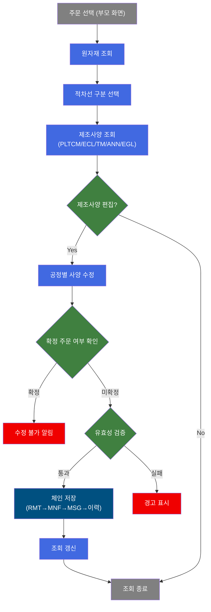
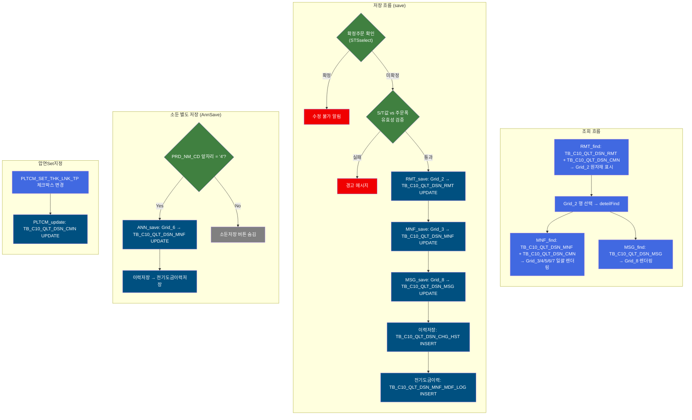
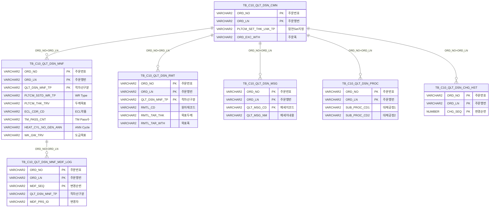

<h1 style="font-size: 40px; text-align: center; font-weight:
   bold; margin: 30px 0;">
  C104000020TAB06 레거시 시스템 분석 종합 보고서
</h1>


# 1. 시스템 개요
- **서비스 ID**: C104000020TAB06
- **업무명**: 품질설계결과 - 전기도금 (EGL)
- **분석 일시**: 2026-03-16 20:20 KST
- **전체 Activity 수**: 15개 (Built-in 15개, Custom 0개)
- **분석자**: Claude Opus 4.6
- **분석 도구**: /analyze-service C104000020TAB06
- **문서 버전**: 1.0

# 📊 비즈니스 프로세스 분석

## 시스템 목적

본 서비스는 전기도금(EGL) 제품의 품질설계결과를 조회하고 제조사양을 편집·저장하는 화면이다. 부모 화면(C104000020)에서 선택된 주문번호/주문행번에 대해 적정/차선1/차선2 구분별로 원자재, PLTCM(압연), ECL(전해청정), TM(조질압연), ANN(소둔), EGL(전기도금) 각 공정의 제조사양을 통합 관리한다.

품질설계 담당자는 본 화면을 통해 원자재 규격(두께/폭 목표·하한·상한), PLTCM 압연조건(WR Type, 내경링, S/T, 두께/폭 목표), ECL 약품·장력, TM 조도·Pass수, ANN 소둔Cycle·온도, EGL 도금량·표면처리 등의 제조표준을 설정한다. 모든 변경은 이력 테이블에 자동 기록되며, 전기도금 전용 변경이력(MNF_MDF_LOG)도 별도 관리된다.

확정된 주문에 대해서는 수정이 제한되며, 대체공정 삭제 시 통과공정 존재 여부를 확인하는 등 데이터 정합성 검증 로직이 적용된다.

## 핵심 워크플로우 다이어그램



### 상세 워크플로우 다이어그램



## 주요 유즈케이스

### UC-01: 전기도금 제조사양 조회
- **Actor**: 품질설계 담당자
- **목적**: 주문에 대한 전기도금 라인의 각 공정별 제조사양을 확인

- **전제조건**:
  - 부모 화면(C104000020)에서 주문번호/주문행번이 선택됨
  - 해당 주문에 품질설계 데이터가 존재함

- **주요 흐름**:
  1. 부모 화면에서 ORD_NO, ORD_LN 전달 → RMT_find 자동 실행
  2. Grid_2에 적정/차선1/차선2별 원자재 정보(원자재코드, 등급, 목표두께/폭) 표시
  3. Grid_1에서 적차선 구분(적정/차선1/차선2) 선택
  4. Grid_2 행 선택 시 deteilFind 실행 → MNF_find로 Grid_3~7(PLTCM/ECL/TM/ANN/EGL) 일괄 조회
  5. MSG_find로 Grid_8(품질메세지) 조회
  6. PRD_NM_CD 앞글자 '4'(소둔강)이면 AnnSave 버튼 표시

- **대체 흐름**:
  - 조회 결과 없음: messagebox에 "조회된 데이터가 없습니다" 표시
  - 원자재 데이터 없음: Grid_2 비어있음, 이후 편집 불가

- **후행조건**:
  - 전 공정 제조사양이 화면에 표시됨
  - 편집 및 저장 가능 상태

### UC-02: 제조사양 편집 및 저장
- **Actor**: 품질설계 담당자
- **목적**: 전기도금 제품의 공정별 제조사양을 수정하고 저장

- **전제조건**:
  - UC-01 조회 완료 상태
  - 해당 주문이 확정 상태가 아님

- **주요 흐름**:
  1. Grid_2에서 원자재(코드, 등급, 두께/폭 목표·하한·상한) 수정
  2. Grid_3에서 PLTCM(5Stand WRType, 내경링, S/T, 두께/폭 목표값) 수정
  3. Grid_4/5/6/7에서 ECL/TM/ANN/EGL 공정 사양 수정 → 편집값이 Grid_3 히든컬럼에 실시간 동기화
  4. Grid_8에서 품질메세지 내용 수정
  5. 저장 버튼 클릭
  6. 확정주문 여부 확인(STSselect) → 미확정 시 진행
  7. S/T값 vs 주문폭 비교, 통과공정 유효성 검증
  8. 체인 저장 실행: RMT_save → MNF_save → MSG_save → 이력저장 → 전기도금이력저장

- **대체 흐름**:
  - 확정 주문: "확정주문에 대해 수정을 할 수 없습니다" 알림
  - 두께 범위 초과: 셀 빨간색 표시로 경고
  - 대체공정 S/T값 삭제 시 통과공정 존재: "대체공정이 통과공정에 있으면 삭제할 수 없습니다" 경고

- **후행조건**:
  - TB_C10_QLT_DSN_RMT, TB_C10_QLT_DSN_MNF, TB_C10_QLT_DSN_MSG 업데이트 완료
  - TB_C10_QLT_DSN_CHG_HST에 변경이력 INSERT
  - TB_C10_QLT_DSN_MNF_MDF_LOG에 전기도금 변경이력 INSERT
  - 화면 자동 재조회

### UC-03: 소둔(ANN) 별도 저장
- **Actor**: 품질설계 담당자
- **목적**: CCLI/SOFT-GL 제품에 대해 소둔 공정 사양만 별도 저장

- **전제조건**:
  - PRD_NM_CD 앞자리가 '4' (소둔강 제품)
  - AnnSave 버튼이 표시된 상태

- **주요 흐름**:
  1. Grid_6에서 일반ANN/H-C ANN 소둔Cycle, 보정시간, 코일온도, 냉각종료온도 수정
  2. AnnSave 버튼 클릭
  3. 확정주문 여부 확인
  4. ANN Cycle 삭제 시 통과공정 존재 여부 확인
  5. ANN_save 실행 → 이력저장 → 전기도금이력저장

- **대체 흐름**:
  - ANN Cycle 삭제 시 통과공정 존재: "ANN Cycle을 삭제할 수 없습니다" 경고

- **후행조건**:
  - TB_C10_QLT_DSN_MNF의 ANN 관련 컬럼만 업데이트
  - 변경이력 기록 완료

### UC-04: 폭수축 시뮬레이션
- **Actor**: 품질설계 담당자
- **목적**: PLTCM 압연 시 폭수축값을 시뮬레이션하여 확인

- **전제조건**:
  - 원자재 및 PLTCM 제조사양 조회 완료

- **주요 흐름**:
  1. Form_1의 "폭수축" 버튼 클릭
  2. Grid_2의 RMTL_KND(적차선 코드), Grid_3의 ST_WHT(ST폭), PLTCM_THK(PLTCM두께) 파라미터 전달
  3. 팝업(C104000020POP02.jsp, 570x405) 오픈
  4. 시뮬레이션 결과 확인

- **후행조건**:
  - Grid_3의 NECKING_WTH(폭수축값) 컬럼에 결과 반영 (FC_NECKING_CAL 함수 사용)

### UC-05: 압연Set지정 체크박스 변경
- **Actor**: 품질설계 담당자
- **목적**: PLTCM 압연 Set 두께 연동 여부를 설정

- **전제조건**:
  - 제조사양 조회 완료

- **주요 흐름**:
  1. Form_1의 PLTCM_SET_THK_LNK_TP 체크박스 변경
  2. Grid_3 상태를 updated로 변경
  3. pltcmLnkTp 플래그 = 'Y' 설정
  4. PLTCM_update AJAX 호출 → TB_C10_QLT_DSN_CMN의 PLTCM_SET_THK_LNK_TP 업데이트

- **후행조건**:
  - 압연Set지정 상태 변경 완료

---

## 비즈니스 로직 상세

### 1. 공정별 그리드 ↔ 마스터 그리드 동기화

- **목적**: ECL/TM/ANN/EGL 각 공정 그리드의 편집값을 PLTCM 마스터 그리드(Grid_3)의 히든컬럼에 실시간 동기화하여, 저장 시 Grid_3 한 번의 save로 전 공정 데이터를 일괄 저장

- **처리 케이스**:

  **[케이스 1: ECL → Grid_3 동기화]**
  ```
    조건: Grid_4(ECL) 셀 편집 완료
    처리:
      1. ECL_CDR_CD(C-D방지약품) 값 → Grid_3 index 18 히든컬럼에 반영
      2. ECL_COILG_TS_CD(권취장력) 값 → Grid_3 index 19 히든컬럼에 반영
  ```

  **[케이스 2: TM → Grid_3 동기화]**
  ```
    조건: Grid_5(TM) 셀 편집 완료
    처리:
      1. TM_PASS_CNT → Grid_3 index 20
      2. ROU_RA_LLV/ULV → Grid_3 index 21, 22
      3. ROU_PPI_LLV/ULV → Grid_3 index 23, 24
      4. TM_WTH_TRV/SUB_PROC1/SUB_PROC2 → Grid_3 index 27, 28, 29
  ```

  **[케이스 3: ANN → Grid_3 동기화]**
  ```
    조건: Grid_6(ANN) 셀 편집 완료
    처리:
      1. COR_TM_GEN_ANN → Grid_3 index 32
      2. COIL_TMP_GEN_ANN → Grid_3 index 33
      3. CLG_END_TMP_GEN_ANN → Grid_3 index 34
      4. COR_TM_HC_ANN → Grid_3 index 37
      5. COIL_TMP_HC_ANN → Grid_3 index 38
      6. CLG_END_TMP_HC_ANN → Grid_3 index 39
  ```

  **[케이스 4: EGL → Grid_3 동기화]**
  ```
    조건: Grid_7(EGL) 셀 편집 완료
    처리:
      1. WK_GW_FRN_LLV/ULV → Grid_3 index 41, 42
      2. WK_GW_BAK_LLV/ULV → Grid_3 index 43, 44
      3. WK_GW_TRV → Grid_3 index 45
      4. GAL_THK_TRV → Grid_3 index 46
      5. EGL_THK_TRV → Grid_3 index 48
      6. EGL_WTH_TRV → Grid_3 index 49
  ```

### 2. 체인 저장 및 콜백 패턴

- **목적**: 여러 그리드의 변경 데이터를 순차적으로 저장하고, 각 저장 완료 후 다음 저장을 트리거

- **처리 케이스**:

  **[케이스 1: 전체 저장 (save 버튼)]**
  ```
    처리:
      1. Grid_2 변경 여부 확인 → 있으면 RMT_save → onGridAfterUpdateFinishEvent1
      2. onGridAfterUpdateFinishEvent1: Grid_3 변경 여부 확인 → 있으면 MNF_save → onGridAfterUpdateFinishEvent2
      3. onGridAfterUpdateFinishEvent2: Grid_4/5/6/7 상태 초기화, Grid_8 변경 여부 확인 → 있으면 MSG_save → onGridAfterUpdateFinishEvent8
      4. onGridAfterUpdateFinishEvent8: RMT_find 재조회
      5. 각 save마다 서비스 체인: save Activity → 이력저장 → 전기도금이력저장
  ```

  **[케이스 2: Grid_2 변경 없이 Grid_3만 변경]**
  ```
    처리:
      1. save 버튼 클릭 → Grid_2 변경 없음
      2. Grid_3 변경 확인 → MNF_save 직행
      3. 이후 MSG_save → 재조회 순서 동일
  ```

### 3. 입력값 유효성 검증

- **목적**: 제조사양 편집 시 범위 초과, 자릿수 제한 등 데이터 정합성 보장

- **처리 케이스**:

  **[케이스 1: 원자재 두께/폭 범위 검증]**
  ```
    조건: Grid_2 셀 편집 완료 (onEditCellEvent2)
    처리:
      1. RMTL_TAR_THK(cInd=2) 변경 시:
         - 값이 RMTL_TAR_THK_LVL_STD ~ RMTL_TAR_THK_UVL_STD 범위 초과
         → 셀 배경색 빨간색 (redflag1=1)
      2. RMTL_TAR_WTH(cInd=5) 변경 시:
         - 값이 RMTL_TAR_WTH_STD 기준 초과
         → 셀 배경색 빨간색 (redflag2=1)
  ```

  **[케이스 2: PLTCM 두께/폭 자릿수 제한]**
  ```
    조건: Grid_3 셀 편집 stage1 (onEditCellEvent3)
    처리:
      1. 두께/폭 입력값 자릿수 제한 적용
      2. 확정주문 상태 시 수정 방지
      3. 대체공정 S/T값 vs ORD_EXC_WTH(주문폭) 비교 검증
  ```

### 4. 폭수축값 계산 (FC_NECKING_CAL)

- **목적**: 원자재 두께/폭 기반으로 PLTCM 압연 시 폭수축값을 계산

- **처리 케이스**:
  ```
    호출: TB_C10_QLT_DSN_MNF SELECT 쿼리 내에서 FC_NECKING_CAL 함수 호출
    스키마: C10APUSER
    파라미터: 원자재 두께, 폭, ST 설정값 등
    결과: NECKING_WTH 컬럼에 폭수축 예측값 반환
  ```

---

# 💾 데이터 요구사항

## 핵심 테이블

### 1. TB_C10_QLT_DSN_MNF - 품질설계 제조사양 (메인)
| 컬럼명 | 타입 | PK | 설명 |
|--------|------|----|-----|
| ORD_NO | VARCHAR2 | ✅ | 주문번호 |
| ORD_LN | VARCHAR2 | ✅ | 주문행번 |
| QLT_DSN_MNF_TP | VARCHAR2 | ✅ | 품질설계제조구분 (적정/차선1/차선2) |
| PLTCM_5STD_WR_TP | VARCHAR2 | | 5Stand WR Type |
| PLTCM_SLV_USE_YN | VARCHAR2 | | 내경링사용여부 |
| PLTCM_EDG_ASG_TP | VARCHAR2 | | S/T유무 |
| PLTCM_SET_THK_TRV | VARCHAR2 | | X-Ray Set두께값 |
| PL_WTH_TRV | VARCHAR2 | | S/T Set값(주공정) |
| PL_WTH_SUB_PROC1_TRV | VARCHAR2 | | S/T Set값(대체공정1) |
| PL_WTH_SUB_PROC2_TRV | VARCHAR2 | | S/T Set값(대체공정2) |
| PLTCM_THK_TRV | VARCHAR2 | | 두께목표값 |
| PLTCM_THK_LLV | VARCHAR2 | | 두께하한값 |
| PLTCM_THK_ULV | VARCHAR2 | | 두께상한값 |
| PLTCM_WTH_TRV | VARCHAR2 | | 폭목표값(주공정) |
| PLTCM_WTH_SUB_PROC1_TRV | VARCHAR2 | | 폭목표값(대체공정1) |
| PLTCM_WTH_SUB_PROC2_TRV | VARCHAR2 | | 폭목표값(대체공정2) |
| ECL_CDR_CD | VARCHAR2 | | ECL C-D방지약품 코드 |
| ECL_COILG_TS_CD | VARCHAR2 | | ECL 권취장력 코드 |
| TM_PASS_CNT | VARCHAR2 | | TM Pass수 |
| ROU_RA_LLV | NUMBER | | 조도RA 하한 |
| ROU_RA_ULV | NUMBER | | 조도RA 상한 |
| ROU_PPI_LLV | VARCHAR2 | | 조도PPI 하한 |
| ROU_PPI_ULV | VARCHAR2 | | 조도PPI 상한 |
| ROU_R_MAX_LLV | NUMBER | | 조도RMAX 하한 |
| TM_WTH_TRV | NUMBER | | TM 폭목표값(주공정) |
| TM_WTH_SUB_PROC1_TRV | NUMBER | | TM 폭목표값(대체공정1) |
| TM_WTH_SUB_PROC2_TRV | NUMBER | | TM 폭목표값(대체공정2) |
| EMBS_CD | NUMBER | | 엠보스무늬 코드 |
| FUR_TP_GEN_ANN | VARCHAR2 | | 일반ANN 소둔로유형 |
| HEAT_CYL_NO_GEN_ANN | VARCHAR2 | | 일반ANN 소둔CYCLE |
| COR_TM_GEN_ANN | VARCHAR2 | | 일반ANN 보정시간 |
| COIL_TMP_GEN_ANN | VARCHAR2 | | 일반ANN 코일온도 |
| CLG_END_TMP_GEN_ANN | VARCHAR2 | | 일반ANN 냉각종료온도 |
| FUR_TP_HC_ANN | VARCHAR2 | | HC-ANN 소둔로유형 |
| HEAT_CYL_NO_HC_ANN | VARCHAR2 | | HC-ANN 소둔CYCLE |
| COR_TM_HC_ANN | VARCHAR2 | | HC-ANN 보정시간 |
| COIL_TMP_HC_ANN | VARCHAR2 | | HC-ANN 코일온도 |
| CLG_END_TMP_HC_ANN | VARCHAR2 | | HC-ANN 냉각종료온도 |
| WK_GW_FRN_LLV | NUMBER | | 작업도금량 전면하한 |
| WK_GW_FRN_ULV | NUMBER | | 작업도금량 전면상한 |
| WK_GW_BAK_LLV | NUMBER | | 작업도금량 후면하한 |
| WK_GW_BAK_ULV | NUMBER | | 작업도금량 후면상한 |
| WK_GW_TRV | VARCHAR2 | | 도금목표 |
| GAL_THK_TRV | VARCHAR2 | | 도금두께 목표 |
| EGL_SUR_HND_CD | VARCHAR2 | | EGL 표면처리코드 |
| EGL_THK_TRV | NUMBER | | EGL 두께목표값 |
| EGL_WTH_TRV | NUMBER | | EGL 폭목표값 |

### 2. TB_C10_QLT_DSN_RMT - 품질설계 원자재
| 컬럼명 | 타입 | PK | 설명 |
|--------|------|----|-----|
| ORD_NO | VARCHAR2 | ✅ | 주문번호 |
| ORD_LN | VARCHAR2 | ✅ | 주문행번 |
| QLT_DSN_MNF_TP | VARCHAR2 | ✅ | 품질설계제조구분 |
| RMTL_CD | VARCHAR2 | | 원자재코드 |
| RMTL_GRD | VARCHAR2 | | 원자재선호도(등급) |
| RMTL_TAR_THK | VARCHAR2 | | 원자재 목표두께 |
| RMTL_TAR_THK_LVL | VARCHAR2 | | 원자재 두께하한 |
| RMTL_TAR_THK_UVL | VARCHAR2 | | 원자재 두께상한 |
| RMTL_TAR_WTH | VARCHAR2 | | 원자재 목표폭 |
| RMTL_TAR_THK_LVL_STD | VARCHAR2 | | 두께하한 기준값 |
| RMTL_TAR_THK_UVL_STD | VARCHAR2 | | 두께상한 기준값 |
| RMTL_TAR_WTH_STD | VARCHAR2 | | 목표폭 기준값 |

### 3. TB_C10_QLT_DSN_CMN - 품질설계 공통 정보
| 컬럼명 | 타입 | PK | 설명 |
|--------|------|----|-----|
| ORD_NO | VARCHAR2 | ✅ | 주문번호 |
| ORD_LN | VARCHAR2 | ✅ | 주문행번 |
| PLTCM_SET_THK_LNK_TP | VARCHAR2 | | 압연Set지정 연동 여부 |
| ORD_EXC_WTH | VARCHAR2 | | 주문폭 (유효성 검증 기준) |
| ORD_SLIT_GRP_CNT | VARCHAR2 | | Slit 그룹 수 |

### 4. TB_C10_QLT_DSN_MSG - 품질설계 메세지
| 컬럼명 | 타입 | PK | 설명 |
|--------|------|----|-----|
| ORD_NO | VARCHAR2 | ✅ | 주문번호 |
| ORD_LN | VARCHAR2 | ✅ | 주문행번 |
| QLT_MSG_CD | VARCHAR2 | ✅ | 품질메세지 코드 |
| QLT_MSG_NM | VARCHAR2 | | 품질메세지 내용 |

### 5. TB_C10_QLT_DSN_CHG_HST - 품질설계 변경이력
| 컬럼명 | 타입 | PK | 설명 |
|--------|------|----|-----|
| ORD_NO | VARCHAR2 | ✅ | 주문번호 |
| ORD_LN | VARCHAR2 | ✅ | 주문행번 |
| CHG_SEQ | NUMBER | ✅ | 변경순번 (자동증분) |

### 6. TB_C10_QLT_DSN_MNF_MDF_LOG - 전기도금 제조사양 변경이력
| 컬럼명 | 타입 | PK | 설명 |
|--------|------|----|-----|
| ORD_NO | VARCHAR2 | ✅ | 주문번호 |
| ORD_LN | VARCHAR2 | ✅ | 주문행번 |
| MDF_SEQ | VARCHAR2 | ✅ | 변경순번 (자동증분) |
| QLT_DSN_MNF_TP | VARCHAR2 | | 품질설계제조구분 |
| RMTL_TAR_THK | VARCHAR2 | | 변경 후 원자재두께 |
| RMTL_TAR_THK_BF | VARCHAR2 | | 변경 전 원자재두께 |
| PLTCM_5STD_WR_TP | VARCHAR2 | | 변경 후 WR Type |
| PLTCM_5STD_WR_TP_BF | VARCHAR2 | | 변경 전 WR Type |
| MDF_PRS_ID | VARCHAR2 | | 변경자 ID |
| MDF_DH | VARCHAR2 | | 변경일시 |

### 7. TB_C10_QLT_DSN_PROC - 품질설계 통과공정
| 컬럼명 | 타입 | PK | 설명 |
|--------|------|----|-----|
| ORD_NO | VARCHAR2 | ✅ | 주문번호 |
| ORD_LN | VARCHAR2 | ✅ | 주문행번 |
| SUB_PROC_CD1 | VARCHAR2 | | 대체공정코드1 |
| SUB_PROC_CD2 | VARCHAR2 | | 대체공정코드2 |

## 데이터 플로우

### 1. 조회

```
[원자재 조회 - RMT_find]
부모 화면 → ORD_NO, ORD_LN 전달
→ C104000020TAB06_RMT.select
  FROM TB_C10_QLT_DSN_RMT A
  INNER JOIN TB_C10_QLT_DSN_CMN B ON A.ORD_NO = B.ORD_NO AND A.ORD_LN = B.ORD_LN
  WHERE A.ORD_NO = :ORD_NO AND A.ORD_LN = :ORD_LN
→ Grid_2에 적정/차선1/차선2별 원자재 정보 표시

[제조사양 일괄 조회 - MNF_find]
Grid_2 행 선택 → QLT_DSN_MNF_TP 파라미터 추출
→ C104000020TAB06_MNF.select
  FROM TB_C10_QLT_DSN_MNF A
  LEFT JOIN TB_C10_QLT_DSN_CMN B ON A.ORD_NO = B.ORD_NO AND A.ORD_LN = B.ORD_LN
  WHERE A.ORD_NO = :ORD_NO AND A.ORD_LN = :ORD_LN AND A.QLT_DSN_MNF_TP = :QLT_DSN_MNF_TP
  * FC_NECKING_CAL 함수 호출하여 NECKING_WTH 계산
→ Grid_3/4/5/6/7에 verticalGridData.do로 일괄 렌더링

[품질메세지 조회 - MSG_find]
→ C104000020TAB06_MSG.select
  FROM TB_C10_QLT_DSN_MSG A
  WHERE A.ORD_NO = :ORD_NO AND A.ORD_LN = :ORD_LN
→ Grid_8에 렌더링

[확정주문 확인 - STS_find]
→ C104000020TAB06.STSselect
  FROM TB_C10_QLT_DSN_CMN WHERE ORD_NO = :ORD_NO AND ORD_LN = :ORD_LN

[통과공정 확인 - PROC_find]
→ C104000020TAB06_PROC
  FROM TB_C10_QLT_DSN_PROC WHERE ORD_NO = :ORD_NO AND ORD_LN = :ORD_LN

[설계공통 확인 - CMN_find]
→ C104000020TAB05_CMN
  FROM TB_C10_QLT_DSN_CMN WHERE ORD_NO = :ORD_NO AND ORD_LN = :ORD_LN

[소둔통과공정 확인 - ANN_find]
→ C104000020TAB06_ANN
  FROM TB_C10_QLT_DSN_PROC WHERE ORD_NO = :ORD_NO AND ORD_LN = :ORD_LN
```

### 2. 저장 (체인 방식)

```
[원자재 저장 - RMT_save]
Grid_2 sendGrid
→ C104000020TAB06.RMTupdate
  UPDATE TB_C10_QLT_DSN_RMT
  SET RMTL_CD, RMTL_GRD, RMTL_TAR_THK, RMTL_TAR_WTH, RMTL_TAR_THK_LVL, RMTL_TAR_THK_UVL, ...
  WHERE ORD_NO = :ORD_NO AND ORD_LN = :ORD_LN AND QLT_DSN_MNF_TP = :QLT_DSN_MNF_TP
→ success → 이력저장 → 전기도금이력저장

[제조사양 저장 - MNF_save]
Grid_3 sendGrid (ECL/TM/ANN/EGL 히든컬럼 포함)
→ C104000020TAB06.EGL_MNFupdate
  UPDATE TB_C10_QLT_DSN_MNF
  SET PLTCM_5STD_WR_TP, ..., ECL_CDR_CD, ..., TM_PASS_CNT, ..., HEAT_CYL_NO_GEN_ANN, ..., WK_GW_TRV, ...
  WHERE ORD_NO = :ORD_NO AND ORD_LN = :ORD_LN AND QLT_DSN_MNF_TP = :QLT_DSN_MNF_TP
→ success → 이력저장 → 전기도금이력저장

[품질메세지 저장 - MSG_save]
Grid_8 sendGrid
→ C104000020TAB06.MSGupdate
  UPDATE TB_C10_QLT_DSN_MSG SET QLT_MSG_NM = :QLT_MSG_NM
  WHERE ORD_NO = :ORD_NO AND ORD_LN = :ORD_LN
→ success → 이력저장 → 전기도금이력저장

[소둔 별도 저장 - ANN_save]
Grid_6 sendGrid
→ C104000020TAB06.ANN_saveUpdate
  UPDATE TB_C10_QLT_DSN_MNF
  SET HEAT_CYL_NO_GEN_ANN, COR_TM_GEN_ANN, COIL_TMP_GEN_ANN, CLG_END_TMP_GEN_ANN,
      HEAT_CYL_NO_HC_ANN, COR_TM_HC_ANN, COIL_TMP_HC_ANN, CLG_END_TMP_HC_ANN
  WHERE ORD_NO = :ORD_NO AND ORD_LN = :ORD_LN AND QLT_DSN_MNF_TP = :QLT_DSN_MNF_TP
→ success → 이력저장 → 전기도금이력저장
```

### 3. 이력 기록

```
[공통 이력 저장]
→ C104000020TAB06.CHG_HSTinsert
  INSERT INTO TB_C10_QLT_DSN_CHG_HST
  (ORD_NO, ORD_LN, CHG_SEQ, ...)
  VALUES (:ORD_NO, :ORD_LN, (SELECT NVL(MAX(CHG_SEQ),0)+1...), ...)

[전기도금 전용 이력 저장]
→ C104000020TAB06.MNF_MDFinsert
  INSERT INTO TB_C10_QLT_DSN_MNF_MDF_LOG
  (ORD_NO, ORD_LN, MDF_SEQ, QLT_DSN_MNF_TP, RMTL_TAR_THK, RMTL_TAR_THK_BF, ...)
  VALUES (:ORD_NO, :ORD_LN, (SELECT NVL(MAX(MDF_SEQ),0)+1...), :QLT_DSN_MNF_TP, ...)
  * 변경 전/후 값을 모두 기록 (_BF 접미사 컬럼)
```

### 4. 단건 업데이트

```
[압연Set지정 체크박스 업데이트]
→ C104000020TAB06.PLTCM_update
  UPDATE TB_C10_QLT_DSN_CMN
  SET PLTCM_SET_THK_LNK_TP = :PLTCM_SET_THK_LNK_TP
  WHERE ORD_NO = :ORD_NO AND ORD_LN = :ORD_LN
```

## SQL 일람표
| SQL 이름 | 쿼리 ID | 타입 | 출처 | 테이블 |
|---------|---------|-----|-------|-------|
| 변경이력 저장 | C104000020TAB06.CHG_HSTinsert | INSERT | Service | TB_C10_QLT_DSN_CHG_HST |
| 통과공정 확인 | C104000020TAB06_PROC | SELECT | Service | TB_C10_QLT_DSN_PROC |
| 설계공통 확인 | C104000020TAB05_CMN | SELECT | Service | TB_C10_QLT_DSN_CMN |
| 제조사양 UPDATE | C104000020TAB06.EGL_MNFupdate | UPDATE | Service | TB_C10_QLT_DSN_MNF |
| 소둔통과공정 확인 | C104000020TAB06_ANN | SELECT | Service | TB_C10_QLT_DSN_PROC |
| 원자재 UPDATE | C104000020TAB06.RMTupdate | UPDATE | Service | TB_C10_QLT_DSN_RMT |
| 확정주문 확인 | C104000020TAB06.STSselect | SELECT | Service | TB_C10_QLT_DSN_CMN |
| 제조표준 조회 | C104000020TAB06_MNF.select | SELECT | Service | TB_C10_QLT_DSN_MNF, TB_C10_QLT_DSN_CMN |
| 품질메세지 조회 | C104000020TAB06_MSG.select | SELECT | Service | TB_C10_QLT_DSN_MSG |
| 압연Set지정 UPDATE | C104000020TAB06.PLTCM_update | UPDATE | Service | TB_C10_QLT_DSN_CMN |
| 품질메세지 UPDATE | C104000020TAB06.MSGupdate | UPDATE | Service | TB_C10_QLT_DSN_MSG |
| 전기도금 이력 INSERT | C104000020TAB06.MNF_MDFinsert | INSERT | Service | TB_C10_QLT_DSN_MNF_MDF_LOG |
| 원자재 조회 | C104000020TAB06_RMT.select | SELECT | Service | TB_C10_QLT_DSN_RMT, TB_C10_QLT_DSN_CMN |
| 소둔 제조사양 UPDATE | C104000020TAB06.ANN_saveUpdate | UPDATE | Service | TB_C10_QLT_DSN_MNF |

## PL/SQL 함수/프로시저

| # | 호출명 | 유형 | 용도 | 상세 분석 |
|---|--------|------|------|----------|
| 1 | FC_NECKING_CAL | 함수 (STANDALONE) | 폭수축값 계산 (PLTCM 압연) | [분석 보고서](../../dbms/C10APUSER/function/FC_NECKING_CAL_analysis_report.md) |

## ER 다이어그램 (핵심 관계)



관계 설명:
- **TB_C10_QLT_DSN_CMN**이 중심 테이블로 주문번호+주문행번 기준 모든 테이블과 1:N 관계
- TB_C10_QLT_DSN_MNF는 적차선구분(QLT_DSN_MNF_TP)으로 적정/차선1/차선2 3행 구성
- TB_C10_QLT_DSN_RMT도 적차선구분별 3행 (원자재 정보)
- TB_C10_QLT_DSN_MNF_MDF_LOG는 MNF 변경 시마다 전/후 값 기록 (이력 추적)

---

# 🖥️ 사용자 인터페이스 요구사항

## 화면 레이아웃 상세

### Layout 구조 (absolute positioning)
```javascript
{
  layoutType: "absolute",
  totalHeight: "585px",
  totalWidth: "958px",
  components: [
    { id: "Grid_1", type: "grid", top: 0, left: 1, width: 116, height: 118,
      desc: "적차선 구분 (적정/차선1/차선2)" },
    { id: "Grid_2", type: "grid", top: 0, left: 118, width: 840, height: 118,
      desc: "원자재 조회 (편집 가능)" },
    { id: "Form_1", type: "form", top: 120, left: 1, width: 958, height: 25,
      desc: "PLTCM 타이틀 + 압연Set지정 + 폭수축 + 저장 버튼" },
    { id: "Grid_3", type: "grid", top: 146, left: 1, width: 957, height: 74,
      desc: "PLTCM 제조사양 마스터 (15 가시 + 38 히든 = 53 컬럼)" },
    { id: "Form_2", type: "form", top: 224, left: 0, width: 195, height: 20,
      desc: "ECL 타이틀" },
    { id: "Grid_4", type: "grid", top: 245, left: 1, width: 188, height: 74,
      desc: "ECL 공정 (C-D방지약품, 권취장력)" },
    { id: "Form_3", type: "form", top: 224, left: 191, width: 768, height: 20,
      desc: "TM 타이틀" },
    { id: "Grid_5", type: "grid", top: 245, left: 190, width: 767, height: 74,
      desc: "TM 공정 (Pass수, 조도, 엠보스, 폭목표)" },
    { id: "Form_4", type: "form", top: 323, left: 1, width: 958, height: 20,
      desc: "ANN 타이틀 + 소둔저장 버튼" },
    { id: "Grid_6", type: "grid", top: 344, left: 1, width: 957, height: 36,
      desc: "ANN 소둔 (일반/H-C ANN)" },
    { id: "Form_5", type: "form", top: 395, left: 1, width: 958, height: 20,
      desc: "EGL 타이틀" },
    { id: "Grid_7", type: "grid", top: 415, left: 1, width: 957, height: 74,
      desc: "EGL 전기도금 (도금량, 목표Size)" },
    { id: "Form_6", type: "form", top: 494, left: 1, width: 958, height: 20,
      desc: "품질메세지 타이틀" },
    { id: "Grid_8", type: "grid", top: 515, left: 1, width: 957, height: 50,
      desc: "품질메세지 (코드 + 내용 편집)" },
    { id: "messagebox", type: "messagebox", top: 566, left: 1, width: 957, height: 19,
      desc: "상태 메세지 표시" }
  ]
}
```

## 입출력 요소

### Form 컴포넌트

**C104000020TAB06_Form_1 (PLTCM)**
- std_title: Label - "PLTCM"
- std_title1: Label - "※시스템 설계값 복원은 '재설계'하시기 바랍니다!"
- PLTCM_SET_THK_LNK_TP: Checkbox - 압연Set지정 → addCheckboxChangeListener 이벤트
- simul: Button - "폭수축" → C104000020POP02.jsp 팝업 오픈
- save: Button - "저장" (초기 disabled) → save 이벤트

**C104000020TAB06_Form_4 (ANN)**
- std_title1: Label - "※CCLI(SOFT-GL) 제품 ANN 투입에만 사용 바랍니다." (초기 hidden)
- AnnSave: Button - "소둔저장" (초기 hidden) → PRD_NM_CD 앞자리 '4'일 때만 표시

**C104000020TAB06_Form_2/3/5/6**
- 섹션 타이틀 전용 (ECL / TM / EGL / 품질메세지)

### Grid 컴포넌트

**C104000020TAB06_Grid_1 (적차선 구분)**
- 편집 가능 여부: 아니오 (읽기 전용)
- 정적 데이터: 적정/차선1/차선2 3행 고정
- 주요 컬럼 (1개):
  - QLT_DSN_MNF_TP: ro - 적차선 (100px, 중앙정렬)

**C104000020TAB06_Grid_2 (원자재)**
- 편집 가능 여부: 예
- 행 수: 3행 고정 (적정/차선1/차선2)
- 주요 컬럼 (16개):

  **편집 가능 컬럼 (배경: #FFFFC0)**:
  - RMTL_CD: combo_v - 원자재코드 (45px, 중앙정렬)
  - RMTL_GRD: combo_v - 원자재선호도 (15px, 중앙정렬)
  - RMTL_TAR_THK: ed - 두께(목표) (10px, 우측정렬)
  - RMTL_TAR_THK_LVL: ed - 두께(하한) (10px, 우측정렬)
  - RMTL_TAR_THK_UVL: ed - 두께(상한) (10px, 우측정렬)
  - RMTL_TAR_WTH: ed - 폭(목표) (*px, 우측정렬)

  **숨김 컬럼**:
  - QLT_DSN_MNF_TP: ro - 품질설계제조구분 (숨김)
  - ORD_NO: ro - 주문번호 (숨김)
  - ORD_LN: ro - 주문행번 (숨김)
  - RMTL_TAR_THK_LVL_STD: ro - 두께하한 기준값 (숨김)
  - RMTL_TAR_THK_UVL_STD: ro - 두께상한 기준값 (숨김)
  - RMTL_TAR_WTH_STD: ro - 목표폭 기준값 (숨김)
  - RMTL_TAR_THK_BF: ro - 목표두께 변경전값 (숨김)
  - RMTL_TAR_THK_LVL_BF: ro - 두께하한 변경전값 (숨김)
  - RMTL_TAR_THK_UVL_BF: ro - 두께상한 변경전값 (숨김)
  - RMTL_TAR_WTH_BF: ro - 목표폭 변경전값 (숨김)

**C104000020TAB06_Grid_3 (PLTCM 제조사양 마스터)**
- 편집 가능 여부: 예 (일부 컬럼)
- 주요 컬럼 (53개: 15 가시 + 38 히든):

  **편집 가능 컬럼 (배경: #FFFFC0)**:
  - PLTCM_5STD_WR_TP: combo_v - 5Stand WRType (7%, 중앙정렬)
  - PLTCM_SLV_USE_YN: combo_v - 내경링사용여부 (7%, 중앙정렬)
  - PLTCM_EDG_ASG_TP: combo_v - S/T유무 (7%, 중앙정렬)
  - PL_WTH_TRV: ed - S/T Set값(주공정) (6%, 중앙정렬)
  - PL_WTH_SUB_PROC1_TRV: ed - S/T Set값(대체공정1) (7%, 중앙정렬)
  - PL_WTH_SUB_PROC2_TRV: ed - S/T Set값(대체공정2) (7%, 중앙정렬)
  - PLTCM_THK_TRV: ed - 두께목표값 (6%, 중앙정렬)
  - PLTCM_THK_LLV: ed - 두께하한값 (6%, 중앙정렬)
  - PLTCM_THK_ULV: ed - 두께상한값 (6%, 중앙정렬)
  - PLTCM_WTH_TRV: ed - 폭목표값(주공정) (6%, 중앙정렬)
  - PLTCM_WTH_SUB_PROC1_TRV: ed - 폭목표값(대체공정1) (7%, 중앙정렬)
  - PLTCM_WTH_SUB_PROC2_TRV: ed - 폭목표값(대체공정2) (7%, 중앙정렬)

  **읽기 전용 컬럼**:
  - PLTCM_SET_THK_TRV: ro - X-Ray Set두께값 (7%, 중앙정렬)
  - NECKING_WTH: ron - 폭수축값 (7%, 중앙정렬)
  - BIGDATA_NECKING_WTH: ron - BigData분석값 (7%, 중앙정렬)

  **숨김 컬럼 (38개)**: QLT_DSN_MNF_TP, ORD_NO, ORD_LN, ECL_CDR_CD, ECL_COILG_TS_CD, TM_PASS_CNT, ROU_RA_LLV, ROU_RA_ULV, ROU_PPI_LLV, ROU_PPI_ULV, ROU_R_MAX_LLV, TM_THK_TRV, TM_WTH_TRV, TM_WTH_SUB_PROC1_TRV, TM_WTH_SUB_PROC2_TRV, FUR_TP_GEN_ANN, HEAT_CYL_NO_GEN_ANN, COR_TM_GEN_ANN, COIL_TMP_GEN_ANN, CLG_END_TMP_GEN_ANN, FUR_TP_HC_ANN, HEAT_CYL_NO_HC_ANN, COR_TM_HC_ANN, COIL_TMP_HC_ANN, CLG_END_TMP_HC_ANN, EMBS_CD, WK_GW_FRN_LLV, WK_GW_FRN_ULV, WK_GW_BAK_LLV, WK_GW_BAK_ULV, WK_GW_TRV, GAL_THK_TRV, EGL_SUR_HND_CD, EGL_THK_TRV, EGL_WTH_TRV (숨김 - ECL/TM/ANN/EGL 공정 데이터 통합 보관)

**C104000020TAB06_Grid_4 (ECL 공정)**
- 편집 가능 여부: 예
- 주요 컬럼 (5개):
  - ECL_CDR_CD: combo_v - C-D방지 약품 (50%, 중앙정렬, 편집 가능)
  - ECL_COILG_TS_CD: combo_v - 권취장력 (*%, 중앙정렬, 편집 가능)
  - QLT_DSN_MNF_TP, ORD_NO, ORD_LN: ro (숨김)

**C104000020TAB06_Grid_5 (TM 공정)**
- 편집 가능 여부: 예 (일부)
- 주요 컬럼 (13개):
  - TM_PASS_CNT: ed - Pass수 (10%, 중앙정렬, 편집 가능)
  - ROU_RA_LLV: ed - RA(하한) (10%, 중앙정렬, 편집 가능)
  - ROU_RA_ULV: ed - RA(상한) (10%, 중앙정렬, 편집 가능)
  - ROU_PPI_LLV: ed - PPI(하한) (10%, 중앙정렬, 편집 가능)
  - ROU_PPI_ULV: ed - PPI(상한) (10%, 중앙정렬, 편집 가능)
  - ROU_R_MAX_LLV: ron - RMAX (10%, 중앙정렬, 읽기 전용)
  - EMBS_CD: ro - 엠보스무늬 (10%, 중앙정렬, 읽기 전용)
  - TM_WTH_TRV: ed - 폭목표(주공정) (10%, 중앙정렬, 편집 가능)
  - TM_WTH_SUB_PROC1_TRV: ed - 폭목표(대체공정1) (10%, 중앙정렬, 편집 가능)
  - TM_WTH_SUB_PROC2_TRV: ed - 폭목표(대체공정2) (*%, 중앙정렬, 편집 가능)
  - QLT_DSN_MNF_TP, ORD_NO, ORD_LN: ro (숨김)

**C104000020TAB06_Grid_6 (ANN 소둔 공정)**
- 편집 가능 여부: 예 (일부)
- 주요 컬럼 (13개):
  - FUR_TP_GEN_ANN: ro - 구분(일반ANN) (10%, 중앙정렬, 읽기 전용)
  - HEAT_CYL_NO_GEN_ANN: combo_v - Cycle(일반ANN) (10%, 중앙정렬, 편집 가능)
  - COR_TM_GEN_ANN: ed - 보정시간(일반ANN) (10%, 중앙정렬, 편집 가능)
  - COIL_TMP_GEN_ANN: ed - 코일온도(일반ANN) (10%, 중앙정렬, 편집 가능)
  - CLG_END_TMP_GEN_ANN: ed - 냉각온도(일반ANN) (10%, 중앙정렬, 편집 가능)
  - FUR_TP_HC_ANN: ro - 구분(H-C ANN) (10%, 중앙정렬, 읽기 전용)
  - HEAT_CYL_NO_HC_ANN: combo_v - Cycle(H-C ANN) (10%, 중앙정렬, 편집 가능)
  - COR_TM_HC_ANN: ed - 보정시간(H-C ANN) (10%, 중앙정렬, 편집 가능)
  - COIL_TMP_HC_ANN: ed - 코일온도(H-C ANN) (10%, 중앙정렬, 편집 가능)
  - CLG_END_TMP_HC_ANN: ed - 냉각온도(H-C ANN) (*%, 중앙정렬, 편집 가능)
  - QLT_DSN_MNF_TP, ORD_NO, ORD_LN: ro (숨김)

**C104000020TAB06_Grid_7 (EGL 전기도금 공정)**
- 편집 가능 여부: 예 (일부)
- 주요 컬럼 (12개):
  - WK_GW_FRN_LLV: ed - 작업도금량(전면하한) (12%, 중앙정렬, 편집 가능)
  - WK_GW_FRN_ULV: ed - 작업도금량(전면상한) (12%, 중앙정렬, 편집 가능)
  - WK_GW_BAK_LLV: ed - 작업도금량(후면하한) (12%, 중앙정렬, 편집 가능)
  - WK_GW_BAK_ULV: ed - 작업도금량(후면상한) (12%, 중앙정렬, 편집 가능)
  - WK_GW_TRV: ed - 도금목표 (8%, 중앙정렬, 편집 가능)
  - GAL_THK_TRV: ed - 도금두께 (8%, 중앙정렬, 편집 가능)
  - EGL_SUR_HND_CD: ro - EGL표면처리코드 (18%, 중앙정렬, 읽기 전용)
  - EGL_THK_TRV: ed - 목표Size(두께) (10%, 중앙정렬, 편집 가능)
  - EGL_WTH_TRV: ed - 목표Size(폭) (*%, 중앙정렬, 편집 가능)
  - QLT_DSN_MNF_TP, ORD_NO, ORD_LN: ro (숨김)

**C104000020TAB06_Grid_8 (품질메세지)**
- 편집 가능 여부: 예 (메세지 내용만)
- 주요 컬럼 (5개):
  - QLT_MSG_CD: ro - 품질Message코드 (11%, 중앙정렬, 읽기 전용)
  - QLT_MSG_NM: ed - 품질Message (*, 좌측정렬, 편집 가능, 배경: #FFFFC0)
  - QLT_DSN_MNF_TP, ORD_NO, ORD_LN: ro (숨김)

## 화면 동작 흐름

### 1. 화면 초기 로딩
```
1. 부모 화면(C104000020)에서 TAB06 탭 선택
2. Grid_1 로드 → 적정/차선1/차선2 3행 정적 데이터 표시, 헤더 높이 52px 조정
3. Grid_2 로드 → RMTL_CD/RMTL_GRD 콤보 데이터 로드
4. ORD_NO, ORD_LN이 존재하면 RMT_find 자동 실행
   - handleDataProcess.do 호출 → Grid_2에 원자재 정보 표시
5. findMessage 콜백 → 첫행 선택 → deteilFind 실행
6. deteilFind → MNF_find(verticalGridData.do) + MSG_find(verticalGridData.do)
   - Grid_3/4/5/6/7에 renderToGrid로 공정별 사양 일괄 표시
   - Grid_8에 품질메세지 표시
7. PRD_NM_CD 앞글자 '4'이면 Form_4 AnnSave 버튼/안내문구 표시
8. messagebox에 appMsg 데이터 표시
```

### 2. 제조사양 편집 및 저장
```
1. 사용자가 Grid_2~8 셀 편집
2. Grid_4/5/6/7 편집 시 → Grid_3 히든컬럼에 실시간 동기화
3. 저장 버튼 클릭
4. STS_find → 확정주문 여부 확인 (c10AjaxData.do)
5. CMN_find → ORD_EXC_WTH(주문폭), ORD_SLIT_GRP_CNT 조회
6. PROC_find → 통과공정(SUB_PROC_CD1/CD2) 조회
7. S/T값 유효성 검증 → 통과 시 진행
8. 체인 저장: RMT_save → (콜백) → MNF_save → (콜백) → MSG_save → (콜백) → RMT_find 재조회
```

### 3. 팝업 (폭수축 시뮬레이션)
```
1. Form_1의 "폭수축" 버튼 클릭
2. Grid_2의 RMTL_KND, Grid_3의 ST_WHT, PLTCM_THK 파라미터 수집
3. window.open("C104000020POP02.jsp", 570x405)
4. 팝업에서 시뮬레이션 수행 후 결과 반환
```

## JavaScript 모듈

**C104000020TAB06.jsp (인라인 스크립트)**
- find(): 원자재 조회 (부모 Form 파라미터 → RMT_find 서비스 호출)
- save(): 저장 흐름 (STS_find → 유효성 → RMT_save → MNF_save → MSG_save 체인)
- AnnSave(): 소둔 별도 저장 (Grid_6 → ANN_save 서비스)
- simul(): 폭수축 팝업 오픈 (C104000020POP02.jsp, 570x405)
- deteilFind(): Grid_2 행 선택 → MNF_find + MSG_find 일괄 조회
- findMessage(): Grid_2 로드 완료 콜백 (첫행 선택, deteilFind 실행, AnnSave 버튼 표시 판단)
- onEditCellEvent2(): Grid_2 셀 편집 이벤트 (두께/폭 범위 초과 빨간색 표시)
- onEditCellEvent3(): Grid_3 셀 편집 이벤트 (자릿수 제한, 확정주문 방지, 대체공정 검증)
- onEditCellEvent5(): Grid_5(TM) 셀 편집 → Grid_3 히든컬럼 동기화
- onEditCellEvent6(): Grid_6(ANN) 셀 편집 → Grid_3 히든컬럼 동기화
- onEditCellEvent7(): Grid_7(EGL) 셀 편집 → Grid_3 히든컬럼 동기화
- onGridAfterUpdateFinishEvent1(): Grid_2 저장 완료 콜백 → Grid_3 변경 시 MNF_save
- onGridAfterUpdateFinishEvent2(): Grid_3 저장 완료 콜백 → Grid_8 변경 시 MSG_save
- onGridAfterUpdateFinishEvent8(): Grid_8 저장 완료 콜백 → RMT_find 재조회
- addCheckboxChangeListener(): PLTCM_SET_THK_LNK_TP 체크박스 변경 감지 → PLTCM_update
- upt_clear(): Grid_3~8 변경 상태 초기화

## 주요 이벤트 핸들러

**onRowSelect (Grid_1~8 행 선택)**
- 이벤트 타입: Grid Row Click
- 처리 내용:
  1. 다른 모든 그리드의 선택 해제 (단일 선택 유지)
  2. Grid_2 행 선택 시 deteilFind 실행

**onEditCellEvent2 (Grid_2 셀 편집 완료)**
- 이벤트 타입: Grid Cell Edit
- 처리 내용:
  1. RMTL_TAR_THK(cInd=2) 편집 시 STD 범위 초과 확인 → 빨간색 배경
  2. RMTL_TAR_WTH(cInd=5) 편집 시 STD 기준 초과 확인 → 빨간색 배경
  3. redflag1/redflag2 플래그 설정

**onEditCellEvent3 (Grid_3 셀 편집)**
- 이벤트 타입: Grid Cell Edit (stage1 + stage2)
- 처리 내용:
  1. stage1: 두께/폭 입력 자릿수 제한
  2. stage2: 확정주문 수정 방지, 대체공정 S/T값 삭제 시 통과공정 존재 확인

**onGridContextMenuClick (컨텍스트 메뉴)**
- 이벤트 타입: Context Menu
- 처리 내용:
  1. copy_row: 셀 복사
  2. excel_grid: 엑셀 내보내기

---

# 📌 특이사항 및 주의사항

## 1. 마스터 그리드 기반 통합 저장 아키텍처
- **Grid_3이 마스터 역할**: ECL(Grid_4), TM(Grid_5), ANN(Grid_6), EGL(Grid_7)의 편집값이 Grid_3의 히든컬럼(38개)에 실시간 동기화되며, 저장은 Grid_3 한 번의 EGL_MNFupdate로 전 공정 데이터를 일괄 처리한다.
- **컬럼 인덱스 하드코딩**: 동기화 로직이 Grid_3의 컬럼 인덱스(18, 19, 20, 21, ...)를 직접 참조하므로, Grid_3 컬럼 순서 변경 시 모든 동기화 로직이 깨질 위험이 있다.

## 2. 체인 저장 콜백 패턴의 복잡성
- **afterUpdateFinish 기반 순차 저장**: RMT_save → MNF_save → MSG_save가 콜백 체인으로 연결되어, 각 저장 완료 시점에 다음 그리드 변경 여부를 확인하고 분기한다. 이 패턴은 중간 저장 실패 시 부분 커밋이 발생할 수 있어 트랜잭션 정합성에 주의가 필요하다.
- **fg_grid3_update 플래그**: Grid_3 업데이트 여부를 전역 변수로 관리하며, upt_clear()로 초기화한다.

## 3. 확정주문 수정 방지 로직
- **STSselect 사전 검증**: 저장 전 TB_C10_QLT_DSN_CMN에서 확정 상태를 조회하여 확정된 주문의 수정을 차단한다. 그러나 Grid_3 onEditCellEvent3 stage2에서도 확정주문 검증이 이루어져 이중 검증 구조이다.

## 4. 제품 유형별 UI 분기 (PRD_NM_CD)
- **소둔강 제품 전용 기능**: PRD_NM_CD 앞글자가 '4'(소둔강)인 경우에만 AnnSave 버튼과 안내문구가 표시된다. 이 분기는 부모 화면(C104000020_Form_2)의 PRD_NM_CD 값에 의존하며, 부모-자식 간 데이터 의존성이 존재한다.

## 5. 변경 전/후 값 이력 관리 (_BF 패턴)
- **TB_C10_QLT_DSN_MNF_MDF_LOG**: 전기도금 전용 변경이력 테이블로, 각 컬럼에 대해 변경 전 값(_BF 접미사)과 변경 후 값을 동시에 INSERT한다. Grid_2의 숨김 컬럼(RMTL_TAR_THK_BF 등)에 원본 값을 보관하는 클라이언트 사이드 이력 관리 패턴이다.

## 6. FC_NECKING_CAL 함수 의존성
- **C10APUSER 스키마 함수**: 제조사양 조회 쿼리(MNF.select) 내에서 C10APUSER.FC_NECKING_CAL 함수를 호출하여 폭수축값을 계산한다. 함수는 강종/폭/두께를 구간 분류 후 BS_FCST_NECKING_MART에서 전체 메이커('0') 기준 NECKING_STAND를 조회한다. 함수 장애 시 WHEN OTHERS로 NULL 반환하여 조회는 실패하지 않으나 값이 표시되지 않을 수 있다. 상세: [FC_NECKING_CAL 분석 보고서](../../dbms/C10APUSER/function/FC_NECKING_CAL_analysis_report.md)

## 7. 통과공정 기반 대체공정 삭제 제한
- **PROC_find / ANN_find**: S/T값이나 ANN Cycle을 삭제(공백화)하기 전에 해당 대체공정이 통과공정(TB_C10_QLT_DSN_PROC)에 등록되어 있는지 확인한다. 등록된 공정은 삭제할 수 없으며, 이는 생산 라인에 이미 투입된 공정의 사양이 삭제되는 것을 방지하기 위한 안전장치이다.

---

# 📚 참고 문서

- **Service XML**: `src/service/C104000020TAB06-service.xml`
- **Query SQL**: `src/query/C104000020TAB06-query.glue_sql`, `src/query/C104000020TAB06_MNF-query.glue_sql`, `src/query/C104000020TAB06_MSG-query.glue_sql`, `src/query/C104000020TAB06_RMT-query.glue_sql`, `src/query/C104000020TAB06_PROC-query.glue_sql`, `src/query/C104000020TAB06_ANN-query.glue_sql`, `src/query/C104000020TAB05_CMN-query.glue_sql`
- **JSP**: `WebContents/C104000020TAB06.jsp`
- **UI XML**: `WebContents/header/kr/C104000020TAB06/C104000020TAB06_*.xml`
- **팝업**: `WebContents/C104000020POP02.jsp`
