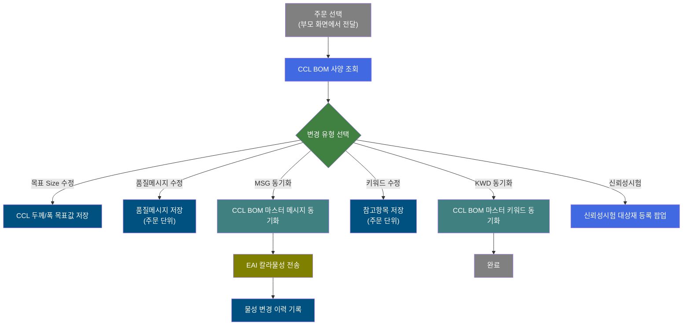
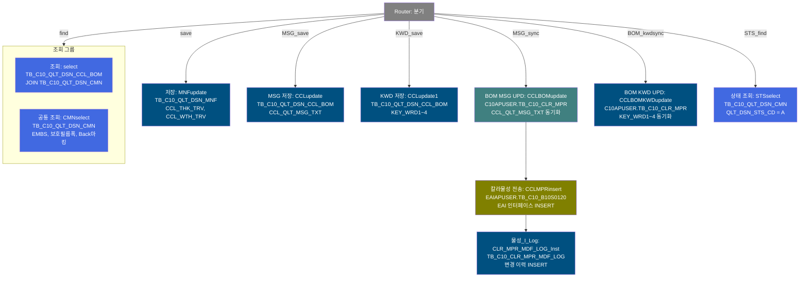
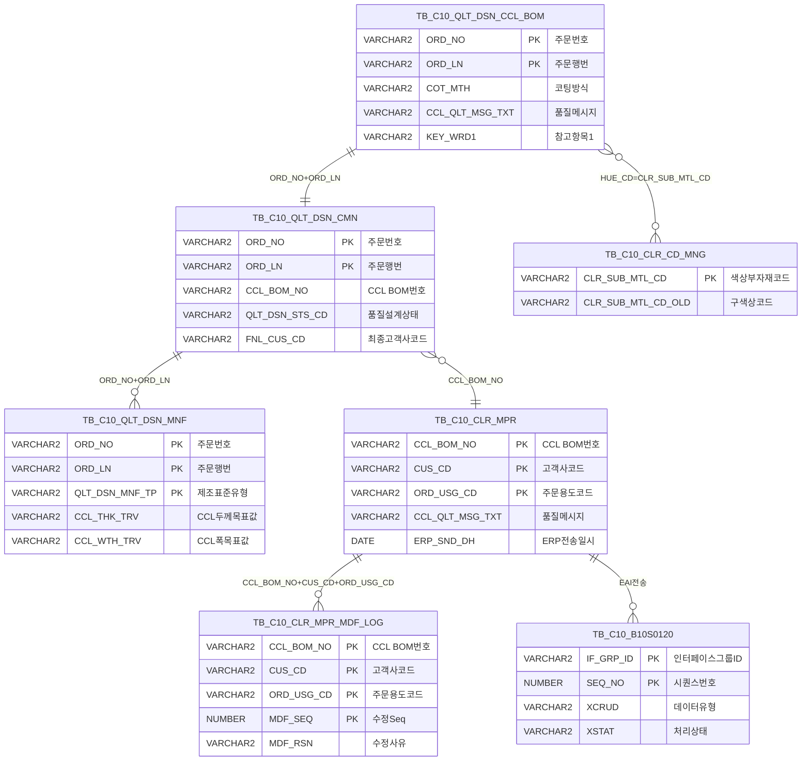

<h1 style="font-size: 40px; text-align: center; font-weight:
   bold; margin: 30px 0;">
  C104000020TAB07 레거시 시스템 분석 종합 보고서
</h1>


# 1. 시스템 개요
- **서비스 ID**: C104000020TAB07
- **업무명**: 품질설계결과-칼라제조사양
- **분석 일시**: 2026-03-16 20:23 KST
- **분석 시간**: 약 10분
- **전체 Activity 수**: 11개 (Custom 0개, Built-in 11개)
- **분석자**: Claude Opus 4.6 (claude-opus-4-6)
- **분석 도구**: /analyze-service C104000020TAB07
- **문서 버전**: 1.0

# 📊 비즈니스 프로세스 분석

## 시스템 목적

C104000020TAB07은 CCL(Color Coated Line) 공정의 품질설계결과 중 **칼라제조사양** 탭 화면으로, 부모 화면 C104000020의 7번째 탭이다. 주문번호(ORD_NO)와 주문행번(ORD_LN) 기준으로 CCL BOM(Bill of Materials)에 정의된 칼라 코팅 사양 정보를 조회하고, 품질메시지(CCL_QLT_MSG_TXT)와 참고항목(KEY_WRD1~4) 및 목표 Size(두께/폭)를 편집·저장하는 기능을 제공한다.

이 서비스의 핵심 업무는 **(1)** CCL BOM 기반의 수지구분·색상·광택·도막두께·작업점도·PMT·시너 등 상세 코팅 사양 조회, **(2)** 품질메시지/키워드 수정 및 CCL BOM 마스터(TB_C10_CLR_MPR)로의 동기화, **(3)** 동기화 시 EAI 인터페이스 테이블(EAIAPUSER.TB_C10_B10S0120)에 변경 이력 전송이다. 특히 BOM 메시지 동기화 체인(BOM MSG UPD → 칼라물성 전송 → 물성_I_Log)은 하나의 트랜잭션으로 CCL BOM 마스터 업데이트, EAI 전송, 변경 이력 기록을 순차 수행한다.


## 핵심 워크플로우 다이어그램



### 상세 워크플로우 다이어그램




## 주요 유즈케이스

### UC-01: CCL BOM 칼라 제조사양 조회
- **Actor**: 품질설계 담당자 / CCL 공정 오퍼레이터
- **목적**: 주문에 대한 CCL 코팅 사양(수지구분, 색상, 광택, 도막두께, 작업점도, PMT, 시너, 보호필름, 프린트, Lamina 등) 전체를 한 화면에서 확인

- **전제조건**:
  - 부모 화면(C104000020)에서 주문번호/주문행번이 선택되어 있음
  - TB_C10_QLT_DSN_CCL_BOM에 해당 주문의 CCL BOM 데이터 존재

- **주요 흐름**:
  1. 부모 화면에서 주문 선택 시 TAB07이 자동 활성화되며 XLE 이벤트로 데이터 로드
  2. Grid_1 - 수지구분/색상코드/광택코드/도막두께 등 Coat별(1~4Coat, 전면/후면/Lamina) BOM 정보 (9행 × 9컬럼 매트릭스)
  3. Grid_2 - 코팅방식/색상코드/도막두께Total/광택도/수지코드/목표Size/Chem Coat/재단선유무/상세색상명 요약
  4. Grid_3 - Bending 시험기준, MEK, 연필경도, 색차 물성기준
  5. Grid_4 - 보호필름(상세코드, 광택, 두께, 재질, 점착력)
  6. Grid_5 - PRINT(전면/후면 1~4도 Roll/Ink/Pattern)
  7. Grid_6 - Lamina(유형, 접착제, 필름두께) 및 프린트용도/패턴, Uni-Tex, Imprinting
  8. Grid_7 - 공통정보(EMBOSS, Back마킹, 보호필름폭)

- **대체 흐름**:
  - 주문 미선택 시: 모든 Grid 빈 상태 유지
  - CCL BOM 데이터 미존재 시: 빈 Grid 표시

- **후행조건**:
  - 10개 Grid에 해당 주문의 전체 칼라 제조사양 표시
  - 편집 가능 필드(목표Size, 품질메시지, 키워드) 수정 가능 상태

### UC-02: 품질메시지 수정 및 BOM 동기화
- **Actor**: 품질설계 담당자
- **목적**: 주문 단위의 품질메시지(CCL_QLT_MSG_TXT) 수정 후 CCL BOM 마스터(TB_C10_CLR_MPR)에 동기화하여 전체 동일 BOM 주문에 반영

- **전제조건**:
  - UC-01 조회가 완료된 상태
  - 사용자에게 수정 권한이 있음

- **주요 흐름**:
  1. Grid_8에서 품질메시지(txt 타입) 내용 수정
  2. 저장 버튼(Form_1) 클릭
  3. `=""` 특수문자 포함 여부 검증 → 포함 시 경고 후 중단
  4. 변경 감지 시 MSG_save 명령으로 CCLupdate 실행 (TB_C10_QLT_DSN_CCL_BOM UPDATE)
  5. MSG동기화 버튼 클릭 시 BOM MSG UPD 체인 실행:
     - CCLBOMupdate: TB_C10_CLR_MPR의 CCL_QLT_MSG_TXT 업데이트 (고객사/용도코드 4가지 OR 조건 매칭)
     - CCLMPRinsert: EAIAPUSER.TB_C10_B10S0120에 EAI 전송 데이터 INSERT
     - CLR_MPR_MDF_LOG_Inst: TB_C10_CLR_MPR_MDF_LOG에 변경 이력 INSERT

- **대체 흐름**:
  - 변경된 데이터 없는 상태에서 저장 시: "변경된 데이터가 없습니다." 경고
  - `=""` 문자열 포함 시: "품질메시지에 이상한 문자가 있습니다(indexOf). 수정해주세요." 경고

- **후행조건**:
  - 주문 단위 품질메시지 저장 완료
  - BOM 동기화 시 TB_C10_CLR_MPR 마스터 업데이트, EAI 전송 및 이력 기록 완료

### UC-03: 참고항목(Keyword) 수정 및 BOM 동기화
- **Actor**: 품질설계 담당자
- **목적**: 주문 단위의 참고항목(KEY_WRD1~4) 수정 후 CCL BOM 마스터에 동기화

- **전제조건**:
  - UC-01 조회가 완료된 상태

- **주요 흐름**:
  1. Grid_9에서 KEY_WRD1~4 내용 수정
  2. 저장 버튼 클릭 → `=""` 특수문자 검증 (4개 항목 각각)
  3. KWD_save 명령으로 CCLupdate1 실행 (TB_C10_QLT_DSN_CCL_BOM UPDATE, KEY_WRD1_LNK에도 동일값 저장)
  4. KWD동기화 버튼 클릭 시 BOM_kwdsync → CCLBOMKWDupdate 실행 (TB_C10_CLR_MPR UPDATE)

- **대체 흐름**:
  - Grid_10에서 KEY_WRD 셀 클릭 시: C106000160 화면으로 이동 (참고항목 상세 조회)

- **후행조건**:
  - 참고항목 저장 및 BOM 마스터 동기화 완료

### UC-04: 목표 Size(CCL 두께/폭) 수정
- **Actor**: 품질설계 담당자
- **목적**: CCL 공정의 목표 두께(CCL_THK_TRV)와 목표 폭(CCL_WTH_TRV) 값 수정

- **전제조건**:
  - UC-01 조회가 완료된 상태

- **주요 흐름**:
  1. Grid_2에서 CCL_THK_TRV(두께, 노란 배경) 또는 CCL_WTH_TRV(폭, 노란 배경) 편집
  2. 두께: 정수 2자리 + 소수 3자리 (MAX LENGTH 5), 폭: 정수 4자리 + 소수 1자리 (MAX LENGTH 5) 유효성 검증
  3. 저장 버튼 클릭 → MNFupdate 실행 (TB_C10_QLT_DSN_MNF UPDATE)

- **대체 흐름**:
  - 유효성 위반 시: 입력값 자동 삭제 또는 잘림

- **후행조건**:
  - TB_C10_QLT_DSN_MNF 테이블에 목표 두께/폭 갱신

### UC-05: 신뢰성시험 대상재 등록
- **Actor**: 품질설계 담당자
- **목적**: 해당 주문에 대한 신뢰성 시험 대상재 등록

- **전제조건**:
  - UC-01 조회가 완료된 상태

- **주요 흐름**:
  1. Form_1의 신뢰성시험 버튼 클릭
  2. 부모 화면에서 ORD_NO, ORD_LN 추출
  3. C104000020TAB07pop01.jsp 팝업 윈도우(310x232) 오픈
  4. 팝업에서 대상재 등록 수행

- **후행조건**:
  - 팝업 닫기 시 원래 화면으로 복귀

---
## 비즈니스 로직 상세

### 1. 코드값→의미명 변환 (스칼라 서브쿼리 패턴)

- **목적**: CCL BOM의 코드 필드를 사용자가 이해할 수 있는 "코드 : 의미명" 형태로 표시
- **처리 케이스**:

  **[케이스 1: 수지구분(RSN_TP) 코드 변환]**
  ```
    조건: 전면/후면 1~4Coat 각각의 RSN_TP 코드값 존재
    처리:
      1. A.RSN_TP_FRN_1COT 값에 대해 VI_M00_CODE_ACCESS에서 CD_TP='RSN_TP', CATEGORY_GROUP_NM='SZ0000' 조건으로 조회
      2. "코드값 : 의미명" 형태로 || 연결하여 출력
      3. 8개 Coat(전면 4 + 후면 4)에 대해 동일 패턴 반복
  ```

  **[케이스 2: 광택도코드(LUS_RT_CD) 변환 + 범위값 결합]**
  ```
    조건: Coat별 광택도코드 및 상한/하한값 존재
    처리:
      1. LUS_RT_CD_FRN_1COT에 대해 CD_TP='LUS_RT_CD'로 의미명 조회
      2. 광택도 범위: LUS_RT_FRN_1COT_LLV || ' - ' || LUS_RT_FRN_1COT_ULV 형태로 결합
      3. 9개 위치(전면 4 + 후면 4 + Lamina)에 대해 반복
  ```

  **[케이스 3: 보호필름 복합 코드 변환]**
  ```
    조건: PTT_FLM_DTL_CD(5자리 복합코드) 존재
    처리:
      1. PTT_FLM_DTL_CD 전체값에 PTT_FLM_DTL_CD_N 명칭 결합
      2. SUBSTR(PTT_FLM_DTL_CD,5,1) → PTT_FLM_PRD_ADH_CD(점착력)
      3. SUBSTR(PTT_FLM_DTL_CD,2,1) → PTT_FLM_THK_CD(두께)
      4. SUBSTR(PTT_FLM_DTL_CD,3,1) → PTT_FLM_MQL_CD(재질)
      5. SUS점착력: 두 코드(PTT_FLM_SUS_ADH_CD + PTT_FLM_SUS_ADH_CD_N) 결합
  ```

  **[케이스 4: 구색상코드 변환]**
  ```
    조건: 현재 색상코드(HUE_CD_FRN_nCOT)에 대응하는 구색상코드 필요
    처리:
      1. TB_C10_CLR_CD_MNG 테이블에서 CLR_SUB_MTL_CD = 현재 색상코드 조건으로 조회
      2. CLR_SUB_MTL_CD_OLD (구색상코드) 반환
      3. 9개 위치(전면 4 + 후면 4 + Lamina)에 대해 반복
  ```

### 2. CCL BOM 마스터 동기화 (고객사/용도 OR 매칭)

- **목적**: 주문 단위 품질메시지/키워드를 CCL BOM 마스터(TB_C10_CLR_MPR)에 반영
- **처리 케이스**:

  **[매칭 조건: 4-way OR 패턴]**
  ```
    조건: CCL_BOM_NO로 BOM 특정 후, 고객사(CUS_CD)와 용도(ORD_USG_CD) 조합 매칭
    처리:
      1. CUS_CD = '******' AND ORD_USG_CD = '******' (범용 BOM)
      2. CUS_CD = '******' AND ORD_USG_CD = :ORD_USG_CD (용도별 BOM)
      3. CUS_CD = :FNL_CUS_CD AND ORD_USG_CD = '******' (고객별 BOM)
      4. CUS_CD = :FNL_CUS_CD AND ORD_USG_CD = :ORD_USG_CD (고객+용도 BOM)
    의미: '******'은 와일드카드 역할로, 범용 → 용도별 → 고객별 → 고객+용도별 4계층 모두에 동기화
  ```

### 3. EAI 칼라물성 전송 데이터 생성

- **목적**: CCL BOM 마스터의 물성 변경사항을 EAI 인터페이스 테이블을 통해 외부 시스템에 전송
- **처리 케이스**:

  **[EAI INSERT 패턴]**
  ```
    조건: BOM 메시지 동기화(MSG_sync) 수행 시 자동 실행
    처리:
      1. IF_GRP_ID = SYSTIMESTAMP 포맷(YYYYMMDDHH24MISSFF4)으로 그룹 ID 생성
      2. SEQ_NO = EAIAPUSER.SQ_C10_B10S0120.NEXTVAL (시퀀스)
      3. TB_C10_CLR_MPR에서 CUS_CD='******', ORD_USG_CD='******' 조건(범용 BOM)으로 물성 데이터 SELECT
      4. 보호필름 상세코드에서 SUBSTR로 점착력명/두께명/재질명 추출하여 EAI 전송
      5. EAIAPUSER.TB_C10_B10S0120에 INSERT
  ```

### 4. 목표 Size 입력 유효성 검증

- **목적**: CCL 두께/폭 목표값의 자릿수 및 형식 검증
- **처리 케이스**:

  **[두께 검증]**
  ```
    규칙: grid_qnty_check("두께", 2, 3, true, value)
    의미: 정수부 최대 2자리, 소수부 최대 3자리 (예: 99.999까지)
    위반 시: 5자리 초과면 마지막 문자 삭제, 아니면 전체 초기화
  ```

  **[폭 검증]**
  ```
    규칙: grid_qnty_check("폭", 4, 1, true, value)
    의미: 정수부 최대 4자리, 소수부 최대 1자리 (예: 9999.9까지)
    위반 시: 동일 처리
  ```

---

# 💾 데이터 요구사항

## 핵심 테이블

### 1. TB_C10_QLT_DSN_CCL_BOM - (CCL BOM 품질설계 사양)
| 컬럼명 | 타입 | PK | 설명 |
|--------|------|----|-----|
| ORD_NO | VARCHAR2 | ✅ | 주문번호 |
| ORD_LN | VARCHAR2 | ✅ | 주문행번 |
| COT_MTH | VARCHAR2 | | 코팅방식 |
| HUE_CD_FRN | VARCHAR2 | | 색상코드(전면) |
| HUE_CD_BAK | VARCHAR2 | | 색상코드(후면) |
| RSN_TP_FRN_1COT~4COT | VARCHAR2 | | 수지구분 전면 1~4Coat |
| RSN_TP_BAK_1COT~4COT | VARCHAR2 | | 수지구분 후면 1~4Coat |
| PNT_FLM_THK_FRN_TOT | VARCHAR2 | | 도막두께 전면 Total |
| PNT_FLM_THK_BAK_TOT | VARCHAR2 | | 도막두께 후면 Total |
| LUS_RT_CD_FRN | VARCHAR2 | | 광택도코드(전면) |
| LUS_RT_CD_BAK | VARCHAR2 | | 광택도코드(후면) |
| CCL_QLT_MSG_TXT | VARCHAR2 | | CCL 공정 품질메시지 |
| KEY_WRD1~4 | VARCHAR2 | | 참고항목 1~4 |
| KEY_WRD1_LNK~4_LNK | VARCHAR2 | | 참고항목 링크 1~4 |
| PTT_FLM_DTL_CD | VARCHAR2 | | 보호필름 상세코드 |
| DTL_CLR_NM | VARCHAR2 | | 상세색상명 |
| LAST_UPDATE_TIMESTAMP | VARCHAR2 | | 최종변경일시 |

### 2. TB_C10_QLT_DSN_CMN - (품질설계 공통)
| 컬럼명 | 타입 | PK | 설명 |
|--------|------|----|-----|
| ORD_NO | VARCHAR2 | ✅ | 주문번호 |
| ORD_LN | VARCHAR2 | ✅ | 주문행번 |
| CCL_BOM_NO | VARCHAR2 | | CCL BOM 번호 |
| ORD_USG_CD | VARCHAR2 | | 주문용도코드 |
| FNL_CUS_CD | VARCHAR2 | | 최종고객사코드 |
| QLT_DSN_STS_CD | VARCHAR2 | | 품질설계상태코드 (A=확정) |
| EMBS_CD | VARCHAR2 | | EMBOSS 코드 |
| BAK_MRK | VARCHAR2 | | Back 마킹 |
| ORD_PTT_FLM_WTH | VARCHAR2 | | 주문 보호필름폭 |
| PTT_FLM_NOT_ADH_WS | VARCHAR2 | | 보호필름 미부착폭 WS |
| PTT_FLM_NOT_ADH_DS | VARCHAR2 | | 보호필름 미부착폭 DS |

### 3. TB_C10_QLT_DSN_MNF - (품질설계 제조표준)
| 컬럼명 | 타입 | PK | 설명 |
|--------|------|----|-----|
| ORD_NO | VARCHAR2 | ✅ | 주문번호 |
| ORD_LN | VARCHAR2 | ✅ | 주문행번 |
| QLT_DSN_MNF_TP | VARCHAR2 | ✅ | 품질설계제조표준유형 (1=CCL) |
| CCL_THK_TRV | VARCHAR2 | | CCL 두께 목표값 |
| CCL_WTH_TRV | VARCHAR2 | | CCL 폭 목표값 |

### 4. TB_C10_CLR_MPR (C10APUSER) - (칼라 물성 마스터)
| 컬럼명 | 타입 | PK | 설명 |
|--------|------|----|-----|
| CCL_BOM_NO | VARCHAR2 | ✅ | CCL BOM 번호 |
| CUS_CD | VARCHAR2 | ✅ | 고객사코드 (******=범용) |
| ORD_USG_CD | VARCHAR2 | ✅ | 주문용도코드 (******=범용) |
| CCL_QLT_MSG_TXT | VARCHAR2 | | 품질메시지 |
| KEY_WRD1~4 | VARCHAR2 | | 참고항목 1~4 |
| ERP_SND_DH | DATE | | ERP 전송일시 |

### 5. TB_C10_CLR_MPR_MDF_LOG - (칼라물성 변경이력)
| 컬럼명 | 타입 | PK | 설명 |
|--------|------|----|-----|
| CCL_BOM_NO | VARCHAR2 | ✅ | CCL BOM 번호 |
| CUS_CD | VARCHAR2 | ✅ | 고객사코드 |
| ORD_USG_CD | VARCHAR2 | ✅ | 주문용도코드 |
| MDF_SEQ | NUMBER | ✅ | 수정 Seq (MAX+1) |
| MDF_RSN | VARCHAR2 | | 수정사유 ('품질설계 결과 동기화') |
| CCL_QLT_MSG_TXT | VARCHAR2 | | 품질메시지 |

### 6. TB_C10_B10S0120 (EAIAPUSER) - (EAI 칼라물성 전송)
| 컬럼명 | 타입 | PK | 설명 |
|--------|------|----|-----|
| IF_GRP_ID | VARCHAR2 | ✅ | 인터페이스 그룹 ID |
| SEQ_NO | NUMBER | ✅ | 시퀀스 번호 |
| XCRUD | VARCHAR2 | | PI Data 유형 (C=Create) |
| XSTAT | VARCHAR2 | | 처리상태 (R=Ready) |
| CCL_BOM_NO | VARCHAR2 | | CCL BOM 번호 |
| CCL_QLT_MSG_TXT | VARCHAR2 | | 품질메시지 |

### 7. TB_C10_CLR_CD_MNG - (칼라 색상코드 관리)
| 컬럼명 | 타입 | PK | 설명 |
|--------|------|----|-----|
| CLR_SUB_MTL_CD | VARCHAR2 | ✅ | 색상 부자재 코드 (현재) |
| CLR_SUB_MTL_CD_OLD | VARCHAR2 | | 구 색상코드 |

## 데이터 플로우

### 1. 조회
```
[CCL BOM 전체 사양 조회]
부모 화면에서 주문 선택
→ C104000020TAB07.select (find)
  FROM TB_C10_QLT_DSN_CCL_BOM A
  JOIN TB_C10_QLT_DSN_CMN B ON A.ORD_NO = B.ORD_NO AND A.ORD_LN = B.ORD_LN
  + 다수 스칼라서브쿼리 (VI_M00_CODE_ACCESS, TB_C10_CLR_CD_MNG, TB_C10_QLT_DSN_MNF)
  WHERE A.ORD_NO = :ORD_NO AND A.ORD_LN = :ORD_LN
→ Grid_1~6, Grid_8~10에 데이터 바인딩

[공통 정보 조회]
→ C104000020TAB07.CMNselect (CMN_find)
  FROM TB_C10_QLT_DSN_CMN A
  WHERE ORD_NO = :ORD_NO AND ORD_LN = :ORD_LN
→ Grid_7에 EMBOSS/Back마킹/보호필름폭 표시
```

### 2. 저장 (목표 Size)
```
Grid_2에서 CCL_THK_TRV / CCL_WTH_TRV 편집
→ C104000020TAB07.MNFupdate (save)
  UPDATE TB_C10_QLT_DSN_MNF
  SET CCL_THK_TRV = :CCL_THK_TRV, CCL_WTH_TRV = :CCL_WTH_TRV
  WHERE ORD_NO = :ORD_NO AND ORD_LN = :ORD_LN
```

### 3. MSG 저장 + BOM 동기화
```
Grid_8에서 품질메시지 편집
→ C104000020TAB07.CCLupdate (MSG_save)
  UPDATE TB_C10_QLT_DSN_CCL_BOM SET CCL_QLT_MSG_TXT = :CCL_QLT_MSG_TXT
  WHERE ORD_NO = :ORD_NO AND ORD_LN = :ORD_LN

[동기화 체인 (MSG_sync)]
→ C104000020TAB07.CCLBOMupdate
  UPDATE C10APUSER.TB_C10_CLR_MPR SET CCL_QLT_MSG_TXT, ERP_SND_DH = SYSDATE
  WHERE CCL_BOM_NO = (SELECT...) AND 4-way OR 매칭
→ C104000020TAB07.CCLMPRinsert
  INSERT INTO EAIAPUSER.TB_C10_B10S0120 (SELECT ... FROM C10APUSER.TB_C10_CLR_MPR WHERE CUS_CD='******')
→ C104000020TAB07.CLR_MPR_MDF_LOG_Inst
  INSERT INTO TB_C10_CLR_MPR_MDF_LOG (SELECT ... FROM C10APUSER.TB_C10_CLR_MPR WHERE 4-way OR 매칭)
```

### 4. KWD 저장 + BOM 동기화
```
Grid_9에서 KEY_WRD1~4 편집
→ C104000020TAB07.CCLupdate1 (KWD_save)
  UPDATE TB_C10_QLT_DSN_CCL_BOM SET KEY_WRD1~4, KEY_WRD1_LNK~4_LNK
  WHERE ORD_NO = :ORD_NO AND ORD_LN = :ORD_LN

[동기화 (BOM_kwdsync)]
→ C104000020TAB07.CCLBOMKWDupdate
  UPDATE C10APUSER.TB_C10_CLR_MPR SET KEY_WRD1~4
  WHERE CCL_BOM_NO = (SELECT...) AND 4-way OR 매칭
```

## SQL 일람표
| SQL 이름 | 쿼리 ID | 타입 | 출처 | 테이블 |
|---------|---------|-----|-------|-------|
| CCL BOM 조회 | C104000020TAB07.select | SELECT | Service | TB_C10_QLT_DSN_CCL_BOM, TB_C10_QLT_DSN_CMN, TB_C10_CLR_CD_MNG, TB_C10_QLT_DSN_MNF |
| 공통 조회 | C104000020TAB07.CMNselect | SELECT | Service | TB_C10_QLT_DSN_CMN |
| 상태 조회 | C104000020TAB07.STSselect | SELECT | Service | TB_C10_QLT_DSN_CMN |
| 목표Size 저장 | C104000020TAB07.MNFupdate | UPDATE | Service | TB_C10_QLT_DSN_MNF |
| MSG 저장 | C104000020TAB07.CCLupdate | UPDATE | Service | TB_C10_QLT_DSN_CCL_BOM |
| KWD 저장 | C104000020TAB07.CCLupdate1 | UPDATE | Service | TB_C10_QLT_DSN_CCL_BOM |
| BOM MSG 동기화 | C104000020TAB07.CCLBOMupdate | UPDATE | Service | TB_C10_CLR_MPR |
| BOM KWD 동기화 | C104000020TAB07.CCLBOMKWDupdate | UPDATE | Service | TB_C10_CLR_MPR |
| EAI 칼라물성 전송 | C104000020TAB07.CCLMPRinsert | INSERT | Service | TB_C10_B10S0120, TB_C10_CLR_MPR, TB_C10_QLT_DSN_CMN |
| 물성 변경이력 | C104000020TAB07.CLR_MPR_MDF_LOG_Inst | INSERT | Service | TB_C10_CLR_MPR_MDF_LOG, TB_C10_CLR_MPR, TB_C10_QLT_DSN_CMN |

## ER 다이어그램 (핵심 관계)



관계 설명:
- **TB_C10_QLT_DSN_CCL_BOM**이 중심 테이블로 주문 단위 CCL 코팅 사양 보유
- **TB_C10_QLT_DSN_CMN**: ORD_NO+ORD_LN으로 1:1 연결, CCL_BOM_NO를 통해 마스터(TB_C10_CLR_MPR) 참조 허브
- **TB_C10_CLR_MPR**: CCL_BOM_NO + CUS_CD + ORD_USG_CD 복합키로 고객/용도별 물성 마스터 관리
- **TB_C10_CLR_CD_MNG**: 색상코드 매핑(현재→구 색상코드)

---

# 🖥️ 사용자 인터페이스 요구사항

## 화면 레이아웃 상세

### Layout 구조 (initLayout)
```javascript
{
  // 절대 위치 기반 레이아웃 (탭 콘텐츠)
  components: [
    { id: "Grid_1", type: "grid", top: 0, height: 250, width: 956 },    // CCL BOM Coat별 상세
    { id: "Grid_2", type: "grid", top: 253, height: 74, width: 956 },   // CCL 사양 요약 (편집)
    { id: "Grid_3", type: "grid", top: 329, height: 300, width: 171 },  // Bending/물성
    { id: "Grid_4", type: "grid", top: 329, height: 300, width: 250 },  // 보호필름
    { id: "Grid_5", type: "grid", top: 329, height: 300, width: 277 },  // PRINT
    { id: "Grid_6", type: "grid", top: 329, height: 300, width: 249 },  // Lamina/패턴
    { id: "Grid_7", type: "grid", top: 632, height: 44, width: 857 },   // 보호필름폭/EMBOSS
    { id: "Grid_8", type: "grid", top: 678, height: 100, width: 857 },  // 품질메시지 (편집)
    { id: "Form_1", type: "form", top: 646, height: 130, width: 98 },   // 저장/동기화 버튼
    { id: "Grid_9", type: "grid", top: 780, height: 50, width: 857 },   // 키워드 (편집)
    { id: "Grid_10", type: "grid", top: 831, height: 50, width: 857 },  // 키워드 링크
    { id: "Form_2", type: "form", top: 882, height: 23, width: 857 },   // 특수문자 안내
    { id: "messagebox", type: "messagebox", top: 909, height: 19 }       // 메시지박스
  ]
}
```

## 입출력 요소

### Form 컴포넌트

**C104000020TAB07_Form_1 (저장/동기화 버튼)**
- 저장: Button - save() 함수 호출 (Grid_2/8/9 변경분 일괄 저장)
- MSG동기화: Button - MSG_sync() 함수 호출 (BOM 메시지 동기화 체인)
- 신뢰성시험: Button - truTest_save() 함수 호출 (팝업 C104000020TAB07pop01.jsp)
- KWD동기화: Button - BOM_kwdsync() 함수 호출 (BOM 키워드 동기화)

**C104000020TAB07_Form_2 (안내 라벨)**
- "특수문자 입력불가" 안내 표시용 (읽기 전용)

### Grid 컴포넌트

**C104000020TAB07_Grid_1 (CCL BOM Coat별 상세)**
- 편집 가능 여부: 아니오 (읽기 전용)
- 멀티라인 헤더: #rspan | 4Coat | 3Coat | 2Coat | 1Coat | 1Coat | 2Coat | 3Coat | 4Coat | #rspan
- 고정 행: 9행 (품질수지, 색상코드, 광택코드, 광택도, 도막두께, 작업점도, PMT, 시너, 구매수지)
- 주요 컬럼 (10개 표시 + 다수 숨김):

  **표시 컬럼**:
  - KIND: ro - 구분 (8%, 좌측정렬)
  - RSN_TP_QT_BR_FRN_4COT~1COT: ro - Top 4Coat~1Coat (각 10%)
  - RSN_TP_QT_BR_BAK_4COT~1COT: ro - Back 4Coat~1Coat (각 10%)
  - RSN_TP_LMN: ro - Lamina (*)

  **숨김 컬럼 (59개)**: HUE_CD_FRN/BAK 1~4COT, LUS_RT_CD 1~4COT, PNT_FLM_THK 1~4COT, WK_VISCO 1~4COT, PMT 1~4COT, THR_CD 1~4COT, RSN_TP(구매수지) 등 Coat별 상세값

**C104000020TAB07_Grid_2 (CCL 사양 요약)**
- 편집 가능 여부: 부분 (CCL_THK_TRV, CCL_WTH_TRV만 편집, 노란색 배경)
- 주요 컬럼 (14개 표시 + 다수 숨김):

  **표시 컬럼**:
  - COT_MTH: ro - 도장방식 (20%)
  - HUE_CD_FRN: ro - 색상코드(전면) (5%)
  - HUE_CD_BAK: ro - 색상코드(후면) (5%)
  - PNT_FLM_THK_FRN_TOT: ro - 도막두께Total(전면) (5%)
  - PNT_FLM_THK_BAK_TOT: ro - 도막두께Total(후면) (5%)
  - LUS_RT_CD_FRN: ro - 광택도코드(전면) (5%)
  - LUS_RT_CD_BAK: ro - 광택도코드(후면) (5%)
  - RSN_TP_FRN: ro - 수지코드(전면) (5%)
  - RSN_TP_BAK: ro - 수지코드(후면) (5%)
  - CCL_THK_TRV: ed - 목표Size(두께) (5%, 편집가능, 배경 #FFFFC0)
  - CCL_WTH_TRV: ed - 목표Size(폭) (5%, 편집가능, 배경 #FFFFC0)
  - HUE_CD_CHM: ro - Chem Coat (5%)
  - CUT_LN_YN: ro - 재단선유무 (5%)
  - DTL_CLR_NM: ro - 상세색상명 (*)

  **숨김 컬럼 (39개)**: CCL_QLT_MSG_TXT, ORD_NO, ORD_LN, 물성기준(Bending/MEK/연필경도/색차), 보호필름상세(7종), KEY_WRD1~4+LNK, Print/Lamina/공정코드 등

**C104000020TAB07_Grid_3 (Bending/물성)**
- 편집 가능 여부: 아니오
- 주요 컬럼 (3개 표시 + 7개 숨김):
  - CLR_BND_TST_FRN_STD_CD: ro - 시험기준(전면) (55px)
  - CLR_BND_TST_FRN_GRD_PNT: ro - T (25px)
  - CLR_BND_TST_BAK_STD_CD: ro - B (*)
  - (숨김) CLR_BND_TST_BAK_GRD_PNT, CLR_DIF_FRN/BAK_ULV, MPR_BAS_PNCL_HRDN_FRN/BAK, MPR_BAS_MEK_FRN/BAK

**C104000020TAB07_Grid_4 (보호필름)**
- 편집 가능 여부: 아니오
- 주요 컬럼: PTT_FLM_DTL_CD(상세코드), PTT_FLM_LUS_RT_CD(광택), PTT_FLM_THK_CD(두께), PTT_FLM_MQL_CD(재질), PTT_FLM_SUS_ADH_CD(SUS점착력), PTT_FLM_PRD_ADH_CD(제품점착력), PTT_FLM_MNG_ADH_TXT(관리점착력)

**C104000020TAB07_Grid_5 (PRINT)**
- 편집 가능 여부: 아니오
- 주요 컬럼: PRT_ROLL_NO1~4(Top 1~4도 Roll), PRT_INK_CD1~4(Top 1~4도 Ink), PRT_ROLL_BAK_NO1~4(Back 1~4도 Roll), PRT_INK_BAK_CD1~4(Back 1~4도 Ink)

**C104000020TAB07_Grid_6 (Lamina/패턴)**
- 편집 가능 여부: 아니오
- 주요 컬럼: LMN_KND_TP(Lamina유형), LMN_BND_CD(접착제코드), LMN_FLM_THK_CD(필름두께), PRT_USG_CD(프린트용도), PRT_PTN_CD(프린트패턴), UNI_TEX_PTN_CD(Uni-Tex패턴), IMPT_ROLL_NO(Imprinting Roll)

**C104000020TAB07_Grid_7 (공통정보)**
- 편집 가능 여부: 아니오
- actionType: find (CMN_find → CMNselect 사용)
- 주요 컬럼: ORD_PTT_FLM_WTH(보호필름폭), PTT_FLM_NOT_ADH_WS/DS(미부착폭), EMBS_CD(EMBOSS), BAK_MRK(Back마킹)

**C104000020TAB07_Grid_8 (품질메시지)**
- 편집 가능 여부: 예 (txt 타입)
- actionType: save (MSG_save → CCLupdate)
- 마우스오버 시 셀 내용 tooltip 표시
- 주요 컬럼: CCL_QLT_MSG_TXT(품질메시지, txt 편집)

**C104000020TAB07_Grid_9 (참고항목 편집)**
- 편집 가능 여부: 예
- actionType: save (KWD_save → CCLupdate1)
- 주요 컬럼: KEY_WRD1~4 (각 25%, ed 타입)

**C104000020TAB07_Grid_10 (참고항목 링크)**
- 편집 가능 여부: 아니오 (클릭 시 화면 이동)
- 주요 컬럼: KEY_WRD1~4 (각 13%, 클릭 시 C106000160 화면 이동)

## 화면 동작 흐름

### 1. 화면 초기 로딩 (탭 진입)
```
1. 부모 화면(C104000020)에서 TAB07 탭 활성화
2. ui.initializeDHTMLX() 호출로 13개 컴포넌트 초기화
3. 각 Grid에 onRowSelect 이벤트 바인딩 (상호 선택 해제)
4. 각 Grid에 onXLE 이벤트 바인딩 (초기 데이터 자동 로딩)
5. Grid_1: onGridLoadEvent1() → parameters13() 파라미터 구성 → verticalGridData.do 호출 → renderToGrid
6. Grid_2: onGridLoadEvent2() → parameters12() → Grid_2/8/9에 동일 데이터 바인딩
7. Grid_3~6: 각각 onGridLoadEvent/Function → select 쿼리 결과 바인딩
8. Grid_7: onGridLoadEvent7() → CMN_find 명령 → CMNselect 실행
9. Grid_8/9/10: XLE 이벤트로 자동 로딩
10. Grid_2에 onEditCellEvent2 바인딩 (두께/폭 유효성 검증)
```

### 2. 데이터 저장 (save)
```
1. Form_1의 저장 버튼 클릭 → save() 함수 호출
2. Grid_2/8/9 현재 편집 셀에서 강제 포커스 이동 (변경 상태 인지)
3. 각 Grid의 !nativeeditor_status 확인 ("updated" 여부)
4. 변경 없으면 "변경된 데이터가 없습니다." 경고 후 중단
5. 확인 다이얼로그 표시 "저장 하시겠습니까?"
6. Grid_2 updated → sendGrid('save') → MNFupdate 실행
7. Grid_8 updated → '=""' 검증 → sendGrid('MSG_save') → CCLupdate 실행
8. Grid_9 updated → KEY_WRD1~4 각각 '=""' 검증 → sendGrid('KWD_save') → CCLupdate1 실행
```

### 3. MSG 동기화 (MSG_sync)
```
1. Form_1의 MSG동기화 버튼 클릭 → MSG_sync() 함수
2. 확인 다이얼로그 "CCL BOM메시지와 동기화하시겠습니까?"
3. Grid_8 강제 updated 상태 설정 (setUpdated)
4. sendGrid('MSG_sync') → Activity 체인 실행:
   - BOM MSG UPD (CCLBOMupdate) → TB_C10_CLR_MPR 업데이트
   - 칼라물성 전송 (CCLMPRinsert) → EAIAPUSER.TB_C10_B10S0120 INSERT
   - 물성_I_Log (CLR_MPR_MDF_LOG_Inst) → TB_C10_CLR_MPR_MDF_LOG INSERT
```

### 4. 키워드 링크 이동 (Grid_doLink)
```
1. Grid_10에서 KEY_WRD 셀 클릭
2. 클릭된 컬럼 인덱스 확인 (KEY_WRD1~4)
3. 해당 셀 값 추출
4. parent.parent.newRemoveOpenTab("C106000160", "&KEY_WRD=" + 값)
5. C106000160 화면으로 이동 (참고항목 상세 조회)
```

## JavaScript 모듈

**C104000020TAB07.jsp (메인 탭 스크립트)**
- find(): 전체 조회 (parameters13/12 → verticalGridData.do → Grid_1~10 renderToGrid)
- save(): 일괄 저장 (Grid_2/8/9 변경 감지 → 순차 sendGrid)
- MSG_sync(): BOM 메시지 동기화 (Grid_8 강제 updated → MSG_sync sendGrid)
- BOM_kwdsync(): BOM 키워드 동기화 (Grid_9 강제 updated → BOM_kwdsync sendGrid)
- truTest_save(): 신뢰성시험 팝업 (ui.window → C104000020TAB07pop01.jsp)
- onRowSelect_Grid1~10(): 상호 선택 해제 (10개 Grid 간)
- onGridLoadEvent1~10(): XLE 이벤트 자동 조회 (각 Grid 초기 데이터 로드)
- onEditCellEvent2(): Grid_2 편집 시 두께(2,3)/폭(4,1) 자릿수 검증 (grid_qnty_check)
- Grid_doLink(): Grid_10 키워드 클릭 시 C106000160 화면 이동 (newRemoveOpenTab)
- upt_clear(): Grid_2/8 updated 상태 초기화
- refresh(): 메뉴 새로고침 (uiCommon.parameters → loadData)

## 주요 이벤트 핸들러

**onRowSelect_Grid1~10 (Grid 행 선택)**
- 이벤트 타입: Grid Row Select
- 처리 내용:
  1. 선택된 Grid 외 나머지 9개 Grid의 선택 해제 (clearSelection)
  2. 한 번에 하나의 Grid만 선택 가능하도록 상호 배타적 제어

**onGridLoadEvent (XLE 초기 로딩)**
- 이벤트 타입: onXLE (Grid XML Load End)
- 처리 내용:
  1. 부모 화면(C104000020_Form_1)에서 파라미터 추출
  2. verticalGridData.do 호출로 데이터 조회
  3. renderToGrid로 데이터 바인딩
  4. detachEvent로 XLE 이벤트 해제 (1회만 실행)

**onEditCellEvent2 (Grid_2 편집 검증)**
- 이벤트 타입: onEditCell (stage=1)
- 처리 내용:
  1. cInd=9 (CCL_THK_TRV): grid_qnty_check("두께",2,3,true) 호출
  2. cInd=10 (CCL_WTH_TRV): grid_qnty_check("폭",4,1,true) 호출
  3. keyup 이벤트에서 실시간 유효성 검사
  4. 위반 시 자동 값 삭제

**Grid_doLink (키워드 링크 클릭)**
- 이벤트 타입: Cell Click (Grid_10)
- 처리 내용:
  1. 클릭된 셀의 컬럼 ID 확인 (KEY_WRD1~4)
  2. 셀 값 추출
  3. parent.parent.newRemoveOpenTab("C106000160") 호출
  4. KEY_WRD 파라미터로 C106000160 화면 이동


---

# 📌 특이사항 및 주의사항

## 1. 부모 화면(C104000020) 의존성
- TAB07은 독립 화면이 아니라 C104000020의 탭 콘텐츠로, `parent.items['C104000020_Form_1']`을 통해 ORD_NO/ORD_LN을 참조한다. 부모 화면의 폼 구조가 변경되면 이 탭도 영향을 받는다.
- `parameters13`, `parameters12` 함수는 c10.ui.js에 정의된 공통 함수로, 부모 폼 ID를 첫 번째 인자로 받는다.

## 2. '******' 와일드카드 패턴을 통한 4-way OR 매칭
- CCLBOMupdate/CCLBOMKWDupdate/CLR_MPR_MDF_LOG_Inst 쿼리에서 CUS_CD='******' AND ORD_USG_CD='******' 패턴으로 4가지 범위(범용/용도별/고객별/고객+용도별)에 동시 적용한다. '******'은 DB상 리터럴 값으로, 실제 와일드카드가 아닌 특수 의미의 고정값이다.

## 3. `=""` 특수문자 검증 하드코딩
- 품질메시지(Grid_8)와 키워드(Grid_9) 저장 시 `indexOf('=""')>0` 조건으로 특수문자를 검증한다. 이는 엑셀 CSV 인젝션 방지를 위한 것으로 보이나, 정확한 검증 위치가 `>0`(1번 인덱스 이후)이므로 첫 번째 문자에 `=""` 있는 경우는 통과할 수 있다 (`>0` 대신 `>=0`이어야 정확).

## 4. Grid_2 데이터의 다중 Grid 공유
- `C104000020TAB07.select` 쿼리 결과 하나로 Grid_2/3/4/5/6/8/9/10 총 8개 Grid에 동시 바인딩한다. 이 쿼리는 150+ 컬럼을 반환하며, 각 Grid는 숨김 컬럼을 통해 자신에게 필요한 데이터만 표시한다.

## 5. EAI 전송 시 범용 BOM만 대상
- CCLMPRinsert 쿼리에서 `CUS_CD='******' AND ORD_USG_CD='******'` 조건으로 범용 BOM 데이터만 EAI 전송한다. 고객별/용도별 BOM 데이터는 EAI로 전송되지 않는다.

## 6. 확정 주문 수정 제한 해제 (주석 처리)
- JSP 106~117행에서 `QLT_DSN_STS_CD = 'A'` 확정 주문에 대한 수정 제한 로직이 주석 처리되어 있다. "확정된 주문이라도 수정할 수 있도록 수정 : 박성용요청 20140611" 코멘트가 있어, 현재는 확정 주문도 수정 가능 상태이다.

## 7. 스칼라 서브쿼리 다수 사용으로 인한 성능 영향
- `C104000020TAB07.select` 쿼리에서 VI_M00_CODE_ACCESS를 30회 이상, TB_C10_CLR_CD_MNG를 9회 스칼라 서브쿼리로 호출한다. 코드 변환 목적이지만, Oracle의 스칼라 서브쿼리 캐싱에 의존하는 구조이다.

## 8. C10APUSER 크로스 스키마 참조
- CCLBOMupdate/CCLBOMKWDupdate/CCLMPRinsert/CLR_MPR_MDF_LOG_Inst 쿼리에서 `C10APUSER.TB_C10_CLR_MPR`, `C10APUSER.TB_C10_QLT_DSN_CMN`을 명시적으로 참조한다. 서비스 자체는 mesdao(MESAPUSER)를 사용하지만, 칼라물성 전송 체인에서는 eaidao(EAIAPUSER)도 사용한다.


# 📚 참고 문서

- **Query SQL**: `src/query/C104000020TAB07-query.glue_sql`
- **Popup Query SQL**: `src/query/C104000020TAB07pop01-query.glue_sql`
- **JSP**: `WebContents/C104000020TAB07.jsp`
- **Service XML**: `src/service/C104000020TAB07-service.xml`
- **JS (공통)**: `WebContents/js/c10.ui.js`
