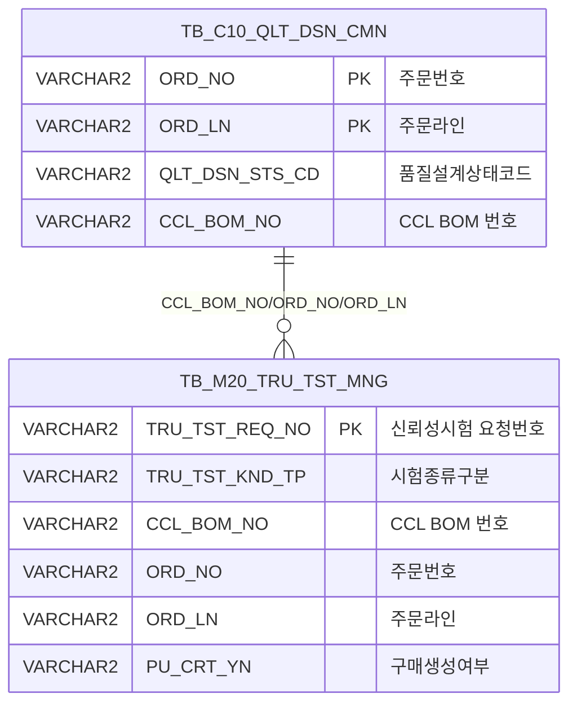

<h1 style="font-size: 40px; text-align: center; font-weight:
   bold; margin: 30px 0;">
  C104000020TAB07pop01 레거시 시스템 분석 종합 보고서
</h1>


# 1. 시스템 개요
- **서비스 ID**: C104000020TAB07pop01
- **업무명**: 신뢰성시험 대상재 등록
- **분석 일시**: 2026-03-16 20:25 KST
- **전체 Activity 수**: 2개 (Built-in: 2개, Custom: 0개)
- **분석자**: Claude Opus 4.6 / Sonnet 4.6
- **분석 도구**: /analyze-service C104000020TAB07pop01
- **문서 버전**: 1.0

# 📊 비즈니스 프로세스 분석

## 시스템 목적

C104000020TAB07pop01은 CCL(Color Coating Line) 품질설계 화면(C104000020)의 TAB07에서 호출되는 **신뢰성시험 대상재 등록 팝업**이다. 주문번호(ORD_NO)와 주문라인(ORD_LN)을 부모 화면으로부터 전달받아, 해당 주문의 시험종류(신뢰성 또는 칼라물성)를 선택한 후 신뢰성시험 관리 테이블(TB_M20_TRU_TST_MNG)에 등록하는 단순 팝업 서비스이다.

등록 시 품질설계 공통 테이블(TB_C10_QLT_DSN_CMN)에서 해당 주문의 CCL BOM 번호를 조회하여 자동으로 매핑하며, 신뢰성시험 요청번호(TRU_TST_REQ_NO)는 당일 날짜 기반 시퀀스(YYYYMMDD + 3자리 순번)로 자동 채번된다.

## 주요 유즈케이스

### UC-01: 신뢰성시험 대상재 등록
- **Actor**: 품질설계 담당자
- **목적**: 특정 주문에 대해 신뢰성시험 또는 칼라물성시험 대상재를 등록

- **전제조건**:
  - 부모 화면(C104000020 TAB07)에서 주문이 선택되어 있음
  - 해당 주문이 품질설계 공통 테이블에 존재함 (QLT_DSN_STS_CD가 'A' 또는 'B')
  - 해당 주문의 CCL_BOM_NO가 NULL이 아님

- **주요 흐름**:
  1. 부모 화면에서 팝업 호출 시 ORD_NO, ORD_LN을 URL 파라미터로 전달
  2. 팝업 로드 시 `onFormLoadFunction`에서 주문번호/주문라인을 폼에 자동 설정 (읽기 전용)
  3. 사용자가 시험종류 선택 (신뢰성: A / 칼라물성: B, 기본값: 신뢰성)
  4. "확인" 버튼 클릭
  5. 확인 다이얼로그 표시: "신뢰성시험 대상재로 등록하시겠습니까?"
  6. "등록" 클릭 시 `handleDataProcess.do`로 폼 전송
  7. `C104000020TAB07pop01-service` 실행: 분기(PosDefaultRouter) → 대상등록(GridSave)
  8. INSERT-SELECT 쿼리 실행: TB_C10_QLT_DSN_CMN에서 CCL_BOM_NO 조회 후 TB_M20_TRU_TST_MNG에 등록
  9. 등록 성공 시 `afterUpdateFinishEvent` → `winClose()` 호출로 팝업 자동 종료

- **대체 흐름**:
  - 취소 클릭 시: 다이얼로그 닫힘, 팝업 유지
  - 해당 주문의 QLT_DSN_STS_CD가 'A','B'가 아닌 경우: INSERT-SELECT 대상 없음 (0건 삽입)
  - CCL_BOM_NO가 NULL인 경우: INSERT-SELECT WHERE 조건 불충족 (0건 삽입)

- **후행조건**:
  - TB_M20_TRU_TST_MNG 테이블에 신뢰성시험 요청 레코드 생성
  - 팝업 자동 종료, 부모 화면으로 복귀

---
## 비즈니스 로직 상세

### 1. 신뢰성시험 요청번호 자동 채번

- **목적**: 일자별 고유한 신뢰성시험 요청번호를 자동 생성

- **처리 케이스**:

  **[케이스 1: 당일 첫 등록]**
  ```
    조건: 당일 날짜(YYYYMMDD)로 시작하는 TRU_TST_REQ_NO가 TB_M20_TRU_TST_MNG에 없음
    처리:
      1. MAX(SUBSTR(TRU_TST_REQ_NO, 9, 3)) → NULL
      2. NVL(NULL, '000') + 1 = 1
      3. TO_CHAR(SYSDATE,'YYYYMMDD') || '1' = 'YYYYMMDD1'
  ```

  **[케이스 2: 당일 추가 등록]**
  ```
    조건: 당일 날짜로 시작하는 기존 요청번호가 존재
    처리:
      1. MAX(SUBSTR(TRU_TST_REQ_NO, 9, 3)) → 기존 최대 순번 (예: '003')
      2. '003' + 1 = 4
      3. TO_CHAR(SYSDATE,'YYYYMMDD') || '4' = 'YYYYMMDD4'
  ```

- **계산 공식**:
  ```
  TRU_TST_REQ_NO = TO_CHAR(SYSDATE, 'YYYYMMDD') || (NVL(MAX(기존순번), '000') + 1)

  예시:
  2026년 3월 16일 첫 등록 → '202603161'
  2026년 3월 16일 두 번째 등록 → '202603162'
  ```

### 2. INSERT-SELECT 기반 데이터 매핑

- **목적**: 품질설계 공통 테이블에서 CCL BOM 번호를 자동 조회하여 신뢰성시험 관리 데이터와 매핑

- **처리 케이스**:

  **[케이스 1: 정상 등록]**
  ```
    조건: ORD_NO + ORD_LN으로 TB_C10_QLT_DSN_CMN 조회 시 QLT_DSN_STS_CD IN ('A','B') AND CCL_BOM_NO IS NOT NULL
    처리:
      1. TB_C10_QLT_DSN_CMN에서 CCL_BOM_NO, ORD_NO, ORD_LN 조회
      2. 스칼라 서브쿼리로 당일 기반 TRU_TST_REQ_NO 채번
      3. RGS_MTH_CD = 'A' (등록방법코드 고정값)
      4. PU_CRT_YN = 'N' (구매생성여부 초기값)
      5. 감사 컬럼(CREATED/LAST_UPDATED) 세션 정보로 설정
      6. TB_M20_TRU_TST_MNG에 INSERT
  ```

  **[케이스 2: 대상 없음]**
  ```
    조건: QLT_DSN_STS_CD가 'A','B'가 아니거나 CCL_BOM_NO가 NULL
    처리:
      1. SELECT 결과 0건 → INSERT 0건 수행
      2. 오류 없이 정상 종료 (0건 삽입)
  ```

---

# 💾 데이터 요구사항

## 핵심 테이블

### 1. TB_M20_TRU_TST_MNG - (신뢰성시험 관리)
| 컬럼명 | 타입 | PK | 설명 |
|--------|------|----|-----|
| TRU_TST_REQ_NO | VARCHAR2 | ✅ | 신뢰성시험 요청번호 (YYYYMMDD + 순번) |
| TRU_TST_REQ_DH | VARCHAR2 | | 신뢰성시험 요청일시 (YYYYMMDD) |
| RGS_MTH_CD | VARCHAR2 | | 등록방법코드 (고정값 'A') |
| TRU_TST_KND_TP | VARCHAR2 | | 시험종류구분 (A:신뢰성, B:칼라물성) |
| CCL_BOM_NO | VARCHAR2 | | CCL BOM 번호 |
| ORD_NO | VARCHAR2 | | 주문번호 |
| ORD_LN | VARCHAR2 | | 주문라인 |
| PU_CRT_YN | VARCHAR2 | | 구매생성여부 (초기값 'N') |
| SMPL_REQ_ID | VARCHAR2 | | 샘플요청ID (세션 ObjectId) |
| SMPL_REQ_DH | DATE | | 샘플요청일시 (SYSDATE) |
| CREATED_OBJECT_TYPE | VARCHAR2 | | 생성객체유형 |
| CREATED_OBJECT_ID | VARCHAR2 | | 생성객체ID |
| CREATED_PROGRAM_ID | VARCHAR2 | | 생성프로그램ID |
| CREATION_TIMESTAMP | VARCHAR2 | | 생성타임스탬프 |
| LAST_UPDATED_OBJECT_TYPE | VARCHAR2 | | 최종수정객체유형 |
| LAST_UPDATED_OBJECT_ID | VARCHAR2 | | 최종수정객체ID |
| LAST_UPDATE_PROGRAM_ID | VARCHAR2 | | 최종수정프로그램ID |
| LAST_UPDATE_TIMESTAMP | VARCHAR2 | | 최종수정타임스탬프 |

### 2. TB_C10_QLT_DSN_CMN - (품질설계 공통, C10APUSER 스키마)
| 컬럼명 | 타입 | PK | 설명 |
|--------|------|----|-----|
| ORD_NO | VARCHAR2 | ✅ | 주문번호 |
| ORD_LN | VARCHAR2 | ✅ | 주문라인 |
| QLT_DSN_STS_CD | VARCHAR2 | | 품질설계상태코드 (A:진행중, B:완료) |
| CCL_BOM_NO | VARCHAR2 | | CCL BOM 번호 |

## 데이터 플로우

### 1. 등록

```
[신뢰성시험 대상재 등록]
확인 버튼 클릭 → handleDataProcess.do
→ C104000020TAB07pop01.insert
  INSERT INTO MESAPUSER.TB_M20_TRU_TST_MNG
  SELECT (자동채번 서브쿼리), :TRU_TST_KND_TP, CCL_BOM_NO, ORD_NO, ORD_LN, ...
  FROM C10APUSER.TB_C10_QLT_DSN_CMN
  WHERE ORD_NO = :ORD_NO
    AND ORD_LN = :ORD_LN
    AND QLT_DSN_STS_CD IN ('A','B')
    AND CCL_BOM_NO IS NOT NULL
→ 등록 성공 시 팝업 자동 종료 (winClose)
```

## SQL 일람표

| SQL 이름 | 쿼리 ID | 타입 | 출처 | 테이블 |
|---------|---------|-----|-------|-------|
| 신뢰성시험 대상재 등록 | C104000020TAB07pop01.insert | INSERT | Service | TB_M20_TRU_TST_MNG, TB_C10_QLT_DSN_CMN |

## ER 다이어그램 (핵심 관계)



관계 설명:
- TB_C10_QLT_DSN_CMN(품질설계 공통)이 원천 테이블로, 주문번호+주문라인 기반으로 CCL BOM 번호를 제공
- TB_M20_TRU_TST_MNG(신뢰성시험 관리)는 INSERT-SELECT로 생성되는 대상 테이블
- 두 테이블은 ORD_NO, ORD_LN, CCL_BOM_NO를 통해 연결

---

# 🖥️ 사용자 인터페이스 요구사항

## 화면 레이아웃 상세

### Layout 구조 (절대 좌표 기반 팝업)
```javascript
{
  type: "popup",
  width: "290px",
  height: "212px",
  components: [
    {
      id: "C104000020TAB07pop01_Form_1",
      type: "form",
      position: { top: "0px", left: "0px", width: "290px", height: "190px" }
    },
    {
      id: "C104000020TAB07pop01_messagebox",
      type: "messagebox",
      position: { top: "160px", left: "0px", width: "290px", height: "22px" }
    }
  ]
}
```

## 입출력 요소

### Form 컴포넌트
**C104000020TAB07pop01_Form_1**

안내 레이블: "해당주문의 시험종류를 선택하세요" (아이콘 포함)

Fieldset "시험종류" (width=220):
- ORD_NO: input (읽기 전용) - 주문번호 (labelWidth=50, inputWidth=70, 우측정렬)
- ORD_LN: input (읽기 전용) - 주문라인 (labelWidth=5, inputWidth=25, 구분자 '-')
- TRU_TST_KND_TP: radio (value=A, 기본 선택) - 신뢰성
- TRU_TST_KND_TP: radio (value=B) - 칼라물성 (foreground-color: 255,140,50 = 주황색)

버튼 영역 (offset=70):
- save: button - "확인" (command=save → save() 함수 호출)

## 화면 동작 흐름

### 1. 팝업 초기 로딩
```
1. 부모 화면(C104000020 TAB07)에서 팝업 호출 (ORD_NO, ORD_LN 파라미터 전달)
2. ui.initializeDHTMLX() 호출하여 DHTMLX 컴포넌트 초기화
3. Form 로드 완료 시 onXLEEvent → onFormLoadFunction 실행
4. items['C104000020TAB07pop01_Form_1'].setItemValue("ORD_NO", ORD_NO) - 주문번호 설정
5. items['C104000020TAB07pop01_Form_1'].setItemValue("ORD_LN", ORD_LN) - 주문라인 설정
6. getDhxForm().detachEvent(onXleForm) - 폼 로드 이벤트 해제 (1회만 실행)
7. 시험종류 "신뢰성" 라디오 기본 선택 상태
```

### 2. 대상재 등록
```
1. 사용자가 시험종류 라디오 버튼 선택 (신뢰성 A / 칼라물성 B)
2. "확인" 버튼 클릭 → save() 함수 호출
3. getDhxForm().resetDataProcessor("inserted") - DataProcessor 상태 초기화
4. dhtmlx.confirm 다이얼로그 표시: "신뢰성시험 대상재로 등록하시겠습니까?"
5. "등록" 클릭 시:
   - items['C104000020TAB07pop01_Form_1'].sendForm("handleDataProcess.do", ..., eventName) 호출
   - 서버에서 C104000020TAB07pop01-service 실행
   - PosDefaultRouter → save → 대상등록(GridSave) → C104000020TAB07pop01.insert 실행
6. 등록 성공 → afterUpdateFinishEvent() → winClose() → 팝업 종료
7. "취소" 클릭 시 → 다이얼로그 닫힘, 팝업 유지
```

## JavaScript 모듈

**C104000020TAB07pop01.jsp** (인라인 스크립트)
- find(eventName, formDivObj, referenceItem): 폼 조회 (uiCommon.parameters로 URL 구성 → loadData)
- save(eventName, formDivObj, referenceItem): 등록 처리 (resetDataProcessor("inserted") → dhtmlx.confirm → sendForm("handleDataProcess.do"))
- refresh(referenceItem): 데이터 새로고침 (clearDataProcess → loadData)
- add(referenceItem): 그리드 행 추가 (addRow)
- remove(referenceItem): 그리드 행 삭제 (removeRow)
- copy(referenceItem): 행 복사 (copyRowContent)
- undo(referenceItem): 실행 취소
- redo(referenceItem): 재실행
- onGridContextMenuClick(id, gridObj, menuObj): 컨텍스트 메뉴 처리 (이동/필터/편집/엑셀)
- onFormLoadFunction(formDivObj): 폼 로드 후 ORD_NO/ORD_LN 설정, 이벤트 해제
- afterUpdateFinishEvent(): 저장 완료 후 winClose() 호출

## 주요 이벤트 핸들러

**onFormLoadFunction (폼 로드 완료)**
- 이벤트 타입: onXLEEvent (Form XML 로드 완료)
- 처리 내용:
  1. ORD_NO 폼 필드에 URL 파라미터 값 설정 (읽기 전용)
  2. ORD_LN 폼 필드에 URL 파라미터 값 설정 (읽기 전용)
  3. onXleForm 이벤트 detach (1회 실행 보장)

**save (확인 버튼 클릭)**
- 이벤트 타입: Button command="save"
- 처리 내용:
  1. DataProcessor를 "inserted" 상태로 초기화
  2. dhtmlx.confirm 확인 다이얼로그 표시
  3. 확인 시 sendForm으로 handleDataProcess.do에 폼 전송
  4. 서비스 실행 후 afterUpdateFinishEvent 콜백

**afterUpdateFinishEvent (저장 완료)**
- 이벤트 타입: onAfterUpdateFinishEvent
- 처리 내용:
  1. winClose() 호출하여 팝업 창 종료
  2. true 반환

---

# 📌 특이사항 및 주의사항

## 1. INSERT-SELECT 패턴의 자동 채번 동시성 이슈
- **채번 로직**: 스칼라 서브쿼리로 `MAX(SUBSTR(TRU_TST_REQ_NO, 9, 3)) + 1` 방식을 사용
- **동시성 위험**: 동일 시점에 복수 사용자가 동시 등록 시 동일 TRU_TST_REQ_NO가 생성될 수 있음 (시퀀스 오브젝트 미사용)
- **채번 형식 불일치**: LPAD 없이 단순 숫자 결합으로, 순번이 10 이상이면 자릿수가 달라짐 (예: 'YYYYMMDD10' vs 'YYYYMMDD1')

## 2. 미사용 그리드 관련 함수 잔존
- 본 팝업은 **Form 기반**이나, JSP에 그리드 관련 함수(find, refresh, add, remove, copy, undo, redo, onGridContextMenuClick)가 포함되어 있음
- 이들 함수는 표준 팝업 템플릿에서 복사된 것으로 보이며, 실제로는 호출되지 않는 데드 코드
- `pageConfiguration`에도 Grid 컴포넌트가 정의되어 있지 않음

## 3. 크로스 스키마 INSERT-SELECT
- **SELECT**: C10APUSER.TB_C10_QLT_DSN_CMN (품질설계 공통)
- **INSERT**: MESAPUSER.TB_M20_TRU_TST_MNG (신뢰성시험 관리)
- 두 개의 서로 다른 스키마(C10APUSER → MESAPUSER)를 걸치는 INSERT-SELECT 패턴
- DAO는 `mesdao`(MESAPUSER)를 사용하므로, C10APUSER 테이블 접근은 스키마 접두사를 통해 이루어짐

## 4. 품질설계 상태코드 필터링
- QLT_DSN_STS_CD IN ('A', 'B') 조건으로 진행중(A) 또는 완료(B) 상태의 주문만 등록 가능
- CCL_BOM_NO IS NOT NULL 조건으로 BOM 미할당 주문은 자동 제외
- 조건 불충족 시 0건 INSERT로 에러 없이 처리되나, 사용자에게 별도 안내 메시지가 없음

## 5. 등록방법코드 하드코딩
- RGS_MTH_CD = 'A'가 SQL 내에 하드코딩되어 있음
- 향후 등록방법이 추가될 경우 SQL 수정 필요

---

# 📚 참고 문서

- **Query SQL**: `src/query/C104000020TAB07pop01-query.glue_sql`
- **Service XML**: `src/service/C104000020TAB07pop01-service.xml`
- **JSP**: `WebContents/C104000020TAB07pop01.jsp`
- **Form XML**: `WebContents/header/kr/C104000020TAB07pop01/C104000020TAB07pop01_Form_1.xml`
