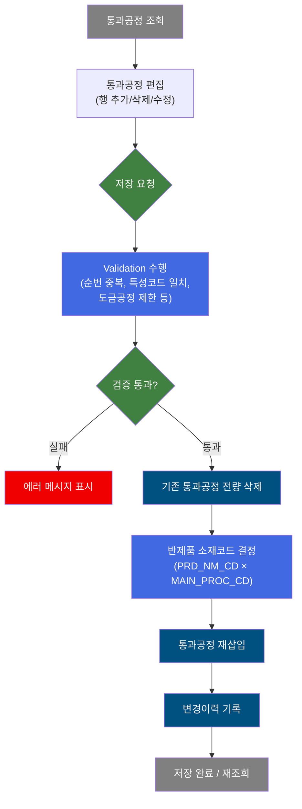
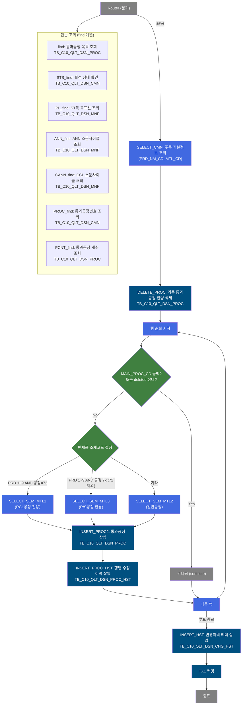
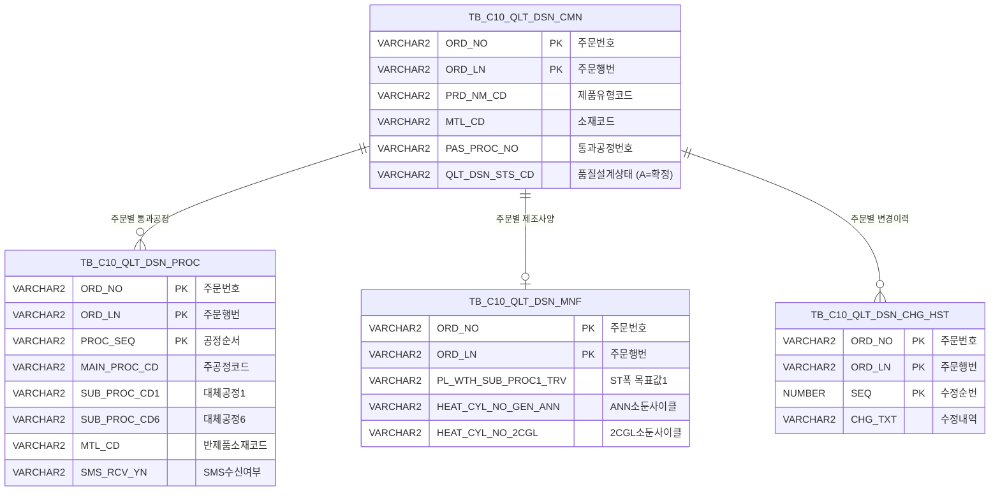

<h1 style="font-size: 40px; text-align: center; font-weight:
   bold; margin: 30px 0;">
  C104000020TAB08 레거시 시스템 분석 종합 보고서
</h1>


# 1. 시스템 개요
- **서비스 ID**: C104000020TAB08
- **업무명**: 품질설계결과 - 통과공정
- **분석 일시**: 2026-03-16 (KST)
- **전체 Activity 수**: 9개 (Built-in 8개, Custom 1개)
- **분석자**: Claude Opus 4.6 / Sonnet (Phase별)
- **분석 도구**: /analyze-service C104000020TAB08
- **문서 버전**: 1.0

# 📊 비즈니스 프로세스 분석

## 시스템 목적

본 서비스는 품질설계결과 화면(C104000020)의 **통과공정 탭(TAB08)**으로, 주문별 통과공정(주공정 및 대체공정 1~6)의 조회·편집·저장 기능을 제공한다. 통과공정이란 제품이 거쳐야 하는 제조 공정 경로를 의미하며, 주공정 외에 최대 6개의 대체공정을 설정할 수 있다.

사용자는 주문번호/행번을 기준으로 통과공정 목록을 조회하고, 공정 순서를 편집하거나 행을 추가/삭제할 수 있다. 저장 시에는 기존 통과공정을 전량 삭제한 후 화면에서 편집된 내용을 재삽입하는 Delete-then-Insert 패턴을 사용한다. 삽입 과정에서 제품유형(PRD_NM_CD)과 주공정코드(MAIN_PROC_CD) 조합에 따라 반제품 소재코드(SEM_MTL_CD)를 동적으로 결정하며, 모든 변경이력을 별도 이력 테이블에 기록한다.

화면에서는 저장 전 순번 중복 검사, 대체공정과 주공정 간 특성 코드 일치 검증, 도금공정 입력 제한, OFF-LINE/IN-LINE 공정 제한 등 다수의 Validation을 수행하여 데이터 정합성을 보장한다.


## 핵심 워크플로우 다이어그램



### 상세 워크플로우 다이어그램



## 주요 유즈케이스

### UC-01: 통과공정 조회
- **Actor**: 품질설계 담당자
- **목적**: 특정 주문의 통과공정(주공정 및 대체공정) 설계 정보를 조회하여 현재 공정 경로를 확인

- **전제조건**:
  - 부모 탭(C104000020)에서 주문번호/행번이 선택되어 있음
  - 해당 주문이 전산통제(VI_MES_TRM_CTL)에 의해 차단되지 않음

- **주요 흐름**:
  1. 부모 폼(C104000020_Form_1)에서 ORD_NO, ORD_LN 파라미터 획득
  2. PROC_find 호출 → TB_C10_QLT_DSN_CMN에서 통과공정번호(PAS_PROC_NO) 조회
  3. find 호출 → C104000020TAB08.select 쿼리로 TB_C10_QLT_DSN_PROC JOIN TB_C10_QLT_DSN_CMN에서 통과공정 목록 조회
  4. Grid에 공정순서(PROC_SEQ), 주공정(MAIN_PROC_CD), 대체공정1~6, MaterialCode(MTL_CD), SMS수신여부 표시
  5. 통과공정번호 폼에 PAS_PROC_NO 표시

- **대체 흐름**:
  - 전산통제 대상 주문: NOT EXISTS 조건에 의해 데이터 미조회 (빈 그리드)
  - 조회 결과 없음: 빈 그리드 표시

- **후행조건**:
  - Grid에 통과공정 목록 표시됨
  - 사용자가 편집/저장/행 추가/삭제 작업 가능 상태

### UC-02: 통과공정 저장 (Delete-then-Insert)
- **Actor**: 품질설계 담당자
- **목적**: 화면에서 편집한 통과공정 목록을 DB에 저장하고 변경이력 기록

- **전제조건**:
  - 주문이 품질설계 미확정 상태 (QLT_DSN_STS_CD != 'A')
  - 통과공정 데이터가 Grid에 존재

- **주요 흐름**:
  1. 저장 버튼 클릭
  2. STS_find 호출 → TB_C10_QLT_DSN_CMN에서 QLT_DSN_STS_CD = 'A' 확인 (확정 주문이면 저장 불가)
  3. 클라이언트 Validation 수행:
     - 순번(PROC_SEQ) 중복 검사
     - 주공정 대비 대체공정 특성 코드(첫 자리) 일치 검사
     - 도금공정(8/9로 시작) 대체공정3 이상 설정 불가
     - OFF-LINE 주공정 시 IN-LINE 대체공정 설정 불가
  4. C104000020TAB08ProcActivity 호출 (save 라우팅)
  5. SELECT_CMN으로 PRD_NM_CD, MTL_CD 조회
  6. DELETE_PROC로 기존 통과공정 전량 삭제
  7. 각 유효 행에 대해:
     - 반제품 소재코드(SEM_MTL_CD) 결정 (PRD_NM_CD × MAIN_PROC_CD 조합)
     - INSERT_PROC2로 통과공정 삽입
     - INSERT_PROC_HST로 행별 수정이력 삽입
  8. INSERT_HST로 변경이력 헤더 삽입
  9. TX1 커밋
  10. 저장 완료 후 2.5초 지연 → 공정순서 연속성 체크(proc_seq_chk) → 그리드 재조회

- **대체 흐름**:
  - 확정 주문 저장 시도: "품질설계가 확정된 주문입니다." 메시지 표시, 저장 차단
  - 순번 중복: "순번이 중복되었습니다." 메시지
  - 대체공정 특성 불일치: "주공정과 대체공정이 상이합니다." 메시지
  - Side Trimming(8로 시작) 대체공정 선택 시: ST폭 목표값 미입력 알림
  - ANN 소둔사이클(4로 시작) 대체공정 선택 시: 소둔사이클 미설정 알림

- **후행조건**:
  - TB_C10_QLT_DSN_PROC에 새 통과공정 데이터 저장
  - TB_C10_QLT_DSN_CHG_HST에 변경이력 기록
  - Grid 재조회로 최신 데이터 표시

### UC-03: 통과공정/CCL-BOM 공정 조회 팝업
- **Actor**: 품질설계 담당자
- **목적**: 현재 주문의 통과공정 번호 기준 통과공정 및 CCL-BOM 공정 상세 정보를 팝업으로 확인

- **전제조건**:
  - 주문이 선택되어 있음
  - PAS_PROC_NO 또는 CCL_BOM_NO가 존재

- **주요 흐름**:
  1. "공정조회" 링크버튼(chrProbtn) 클릭
  2. 부모 폼에서 PAS_PROC_NO, CCL_BOM_NO 파라미터 취득
  3. C104000020TAB08pop.jsp 팝업 오픈 (570×390)
  4. 팝업 내에서 통과공정 및 CCL-BOM 공정 상세 조회/표시

- **대체 흐름**:
  - PAS_PROC_NO 미존재: 빈 팝업 표시

- **후행조건**:
  - 사용자가 통과공정 경로 상세 확인 완료

### UC-04: 통과공정 변경이력 조회 팝업
- **Actor**: 품질설계 담당자
- **목적**: 특정 주문의 통과공정 변경 이력을 확인

- **전제조건**:
  - 주문번호/행번이 선택되어 있음

- **주요 흐름**:
  1. "변경이력" 링크버튼(chrProhstbtn) 클릭
  2. 부모 폼에서 ORD_NO, ORD_LN 파라미터 취득
  3. C104000020TAB08pop02.jsp 팝업 오픈 (700×390)
  4. 주문번호/행번 기준 변경이력 조회/표시

- **후행조건**:
  - 변경이력 확인 완료

### UC-05: 행 추가/삭제
- **Actor**: 품질설계 담당자
- **목적**: 통과공정 행을 추가하거나 삭제

- **전제조건**:
  - 품질설계 미확정 상태 (QLT_DSN_STS_CD != 'A')

- **주요 흐름**:
  1. 메뉴 툴바에서 "행추가" 클릭
  2. STS_find로 확정 상태 확인 → 미확정이면 행 추가 허용
  3. 새 행에 부모 폼의 ORD_NO, ORD_LN 자동 설정(setAutoData)
  4. 마지막 유효 행 순서 기준으로 PROC_SEQ 자동 설정
  5. 사용자가 주공정/대체공정 콤보에서 공정코드 선택

- **대체 흐름**:
  - 확정 주문에서 행 추가/삭제 시도: "품질설계가 확정된 주문입니다." 메시지, 차단
  - 삭제 시: 선택된 행에 취소선 스타일 적용 (font-weight:bold; color:red; text-decoration: line-through)

- **후행조건**:
  - 새 행이 Grid에 추가됨 (아직 DB 미반영)
  - 저장 버튼 클릭 시 DB 반영

---
## 비즈니스 로직 상세

### 1. 반제품 소재코드(SEM_MTL_CD) 결정 로직

- **목적**: 통과공정 저장 시 각 행의 주공정코드(MAIN_PROC_CD)와 제품유형(PRD_NM_CD) 조합에 따라 반제품 소재코드를 자동으로 결정하여 설정

- **처리 케이스**:

  **케이스 1: RCL공정 (MAIN_PROC_CD = "72")**
  ```
    조건: PRD_NM_CD in (1,2,3,4,5,6,7,8,9) AND MAIN_PROC_CD == "72"
    처리:
      1. SELECT_SEM_MTL1 SQL 실행 (RCL 전용 소재코드 조회)
      2. 파라미터: param[0] = PRD_NM_CD, param[1] = "72" (MAIN_PROC_CD 전체)
      3. 결과의 SEM_MTL_CD를 MTL_CD 파라미터로 설정
  ```

  **케이스 2: R/S공정 (MAIN_PROC_CD 첫자리 = "7", 72 제외)**
  ```
    조건: PRD_NM_CD in (1,2,3,4,5,6,7,8,9) AND MAIN_PROC_CD[0] == "7" AND MAIN_PROC_CD != "72"
    처리:
      1. SELECT_SEM_MTL3 SQL 실행 (R/S 전용 소재코드 조회)
      2. 파라미터: param[0] = PRD_NM_CD, param[1] = "7" (첫자리만)
      3. 결과의 SEM_MTL_CD를 MTL_CD 파라미터로 설정
  ```

  **케이스 3: 일반공정 (특수 PRD)**
  ```
    조건: PRD_NM_CD in (1,2,3,4,5,6,7,8,9) AND MAIN_PROC_CD[0] != "7"
    처리:
      1. SELECT_SEM_MTL2 SQL 실행 (일반 공정 소재코드 조회)
      2. 파라미터: param[0] = PRD_NM_CD, param[1] = MAIN_PROC_CD[0] (첫자리)
      3. 결과의 SEM_MTL_CD를 MTL_CD 파라미터로 설정
  ```

  **케이스 4: 일반공정 (기타 PRD)**
  ```
    조건: PRD_NM_CD not in (1,2,3,4,5,6,7,8,9)
    처리:
      1. SELECT_SEM_MTL2 SQL 실행 (일반 공정 소재코드 조회)
      2. 파라미터: param[0] = PRD_NM_CD, param[1] = MAIN_PROC_CD[0] (첫자리)
      3. 결과의 SEM_MTL_CD를 MTL_CD 파라미터로 설정
  ```

### 2. 클라이언트 Validation 로직

- **목적**: 통과공정 저장 전 데이터 정합성을 클라이언트(JavaScript)에서 사전 검증

- **처리 케이스**:

  **케이스 1: 순번 중복 검사**
  ```
    조건: Grid 내 동일 PROC_SEQ 값이 2개 이상 존재
    처리: "순번이 중복되었습니다." 메시지 → 저장 중단
  ```

  **케이스 2: 대체공정 특성 코드 불일치**
  ```
    조건: 대체공정(SUB_PROC_CD1~6)의 첫 자리 코드가 주공정(MAIN_PROC_CD)의 첫 자리와 불일치
    처리: "주공정과 대체공정이 상이합니다." 메시지 → 저장 중단
  ```

  **케이스 3: 도금공정 입력 제한**
  ```
    조건: 대체공정3~6에 도금공정(8 또는 9로 시작하는 코드) 입력
    처리: 도금공정은 대체공정1~2까지만 허용 → 저장 중단
  ```

  **케이스 4: OFF-LINE/IN-LINE 공정 혼합 제한**
  ```
    조건: 주공정이 OFF-LINE 작업인데 대체공정에 IN-LINE 공정 설정
    처리: "OFF-LINE 주공정에 IN-LINE 대체공정은 설정할 수 없습니다." → 저장 중단
  ```

  **케이스 5: Side Trimming 폭 목표값 확인**
  ```
    조건: 대체공정에 Side Trimming(8로 시작) 선택 시
    처리: PL_find 호출로 PL_WTH_SUB_PROC1_TRV, PL_WTH_SUB_PROC2_TRV 확인
          미입력 시 "ST폭 목표값이 입력되지 않았습니다." 알림 (경고, 저장 계속)
  ```

  **케이스 6: ANN 소둔사이클 확인**
  ```
    조건: 대체공정에 ANN 공정(4로 시작) 선택 시
    처리: ANN_find 호출로 HEAT_CYL_NO_GEN_ANN, HEAT_CYL_NO_HC_ANN 확인
          미설정 시 "소둔사이클이 설정되지 않았습니다." 알림 (경고, 저장 계속)
  ```

### 3. 저장 후 공정순서 연속성 검증

- **목적**: 저장 완료 후 통과공정 개수와 최대 순번을 비교하여 순서 연속성 확인

- **처리 케이스**:

  **케이스 1: 정상**
  ```
    조건: PCNT_find로 조회한 PROC_CNT == Grid 최대 PROC_SEQ
    처리: 정상 완료
  ```

  **케이스 2: 불일치**
  ```
    조건: PROC_CNT != Grid 최대 PROC_SEQ (빈 순번 존재)
    처리: proc_seq_chk에서 경고 표시
  ```

- **예외 처리**:
  - IDS 입력 없음: FAILURE 반환 (즉시 종료)
  - DB Exception 발생: TX1 롤백, ERRMSG 설정, FAILURE 반환
  - 전산통제 주문 조회: NOT EXISTS 조건으로 자동 필터링

---

# ⚙️ Java 컴포넌트 분석

## Custom Activity 상세 분석

### 1개 Custom Activity 발견

### 1. C104000020TAB08ProcActivity (통과공정저장)
- **클래스명**: com.unionsteel.mes.c10.activity.ui.C104000020TAB08ProcActivity
- **액티비티명**: 통과공정저장
- **파일 경로**: src/com/unionsteel/mes/c10/activity/ui/C104000020TAB08ProcActivity.java
- **주요 기능**: 통과공정 Delete-then-Insert 저장 및 반제품 소재코드 자동 결정
- **라인 수**: 329 | **메소드 수**: 1개

> 화면의 탭08(통과공정 편집 탭)에서 저장 요청이 오면, 주문에 해당하는 기존 통과공정을 전량 삭제한 후 화면에서 편집된 통과공정 행을 순서대로 재삽입하는 Activity이다. 삽입 시 반제품 소재코드(SEM_MTL_CD)를 제품유형(PRD_NM_CD) 및 주공정코드(MAIN_PROC_CD) 조합에 따라 동적으로 조회하여 설정하며, 모든 변경이력을 이력 테이블에도 기록한다.

📎 **[상세 분석 보고서](../customClass/com.unionsteel.mes.c10.activity.ui.C104000020TAB08ProcActivity_class_analysis.md)**

---

# 💾 데이터 요구사항

## 핵심 테이블

### 1. TB_C10_QLT_DSN_PROC - (품질설계 통과공정)
| 컬럼명 | 타입 | PK | 설명 |
|--------|------|----|------|
| ORD_NO | VARCHAR2 | ✅ | 주문번호 |
| ORD_LN | VARCHAR2 | ✅ | 주문행번 |
| PROC_SEQ | VARCHAR2 | ✅ | 공정순서 |
| MAIN_PROC_CD | VARCHAR2 | | 주공정코드 |
| SUB_PROC_CD1 | VARCHAR2 | | 대체공정1 |
| SUB_PROC_CD2 | VARCHAR2 | | 대체공정2 |
| SUB_PROC_CD3 | VARCHAR2 | | 대체공정3 |
| SUB_PROC_CD4 | VARCHAR2 | | 대체공정4 |
| SUB_PROC_CD5 | VARCHAR2 | | 대체공정5 |
| SUB_PROC_CD6 | VARCHAR2 | | 대체공정6 |
| MTL_CD | VARCHAR2 | | 반제품 소재코드 (SEM_MTL_CD) |
| SMS_RCV_YN | VARCHAR2 | | SMS 수신 여부 (Y/N) |

### 2. TB_C10_QLT_DSN_CMN - (품질설계 공통)
| 컬럼명 | 타입 | PK | 설명 |
|--------|------|----|------|
| ORD_NO | VARCHAR2 | ✅ | 주문번호 |
| ORD_LN | VARCHAR2 | ✅ | 주문행번 |
| PRD_NM_CD | VARCHAR2 | | 제품유형코드 |
| MTL_CD | VARCHAR2 | | 소재코드 |
| PAS_PROC_NO | VARCHAR2 | | 통과공정번호 |
| QLT_DSN_STS_CD | VARCHAR2 | | 품질설계상태코드 (A=확정) |

### 3. TB_C10_QLT_DSN_MNF - (품질설계 제조사양)
| 컬럼명 | 타입 | PK | 설명 |
|--------|------|----|------|
| ORD_NO | VARCHAR2 | ✅ | 주문번호 |
| ORD_LN | VARCHAR2 | ✅ | 주문행번 |
| PL_WTH_SUB_PROC1_TRV | VARCHAR2 | | PL ST폭 대체공정1 목표값 |
| PL_WTH_SUB_PROC2_TRV | VARCHAR2 | | PL ST폭 대체공정2 목표값 |
| HEAT_CYL_NO_GEN_ANN | VARCHAR2 | | 일반 ANN 소둔사이클 번호 |
| HEAT_CYL_NO_HC_ANN | VARCHAR2 | | HC ANN 소둔사이클 번호 |
| HEAT_CYL_NO_2CGL | VARCHAR2 | | 2CGL 소둔사이클 번호 |
| HEAT_CYL_NO_3CGL | VARCHAR2 | | 3CGL 소둔사이클 번호 |
| HEAT_CYL_NO_4CGL | VARCHAR2 | | 4CGL 소둔사이클 번호 |
| HEAT_CYL_NO_5CGL | VARCHAR2 | | 5CGL 소둔사이클 번호 |

### 4. TB_C10_QLT_DSN_CHG_HST - (품질설계 변경이력)
| 컬럼명 | 타입 | PK | 설명 |
|--------|------|----|------|
| ORD_NO | VARCHAR2 | ✅ | 주문번호 |
| ORD_LN | VARCHAR2 | ✅ | 주문행번 |
| SEQ | NUMBER | ✅ | 수정 순번 (MAX+1 자동채번) |
| CHG_TXT | VARCHAR2 | | 수정내역 (화면ID 고정: 'C104000020TAB08') |
| CREATED_OBJECT_TYPE | VARCHAR2 | | 등록 오브젝트 타입 |
| CREATED_OBJECT_ID | VARCHAR2 | | 등록 오브젝트 ID |
| CREATED_PROGRAM_ID | VARCHAR2 | | 등록 프로그램 ID |
| CREATION_TIMESTAMP | DATE | | 등록 일시 |

### 5. VI_MES_TRM_CTL - (전산통제 뷰, MESAPUSER)
| 컬럼명 | 타입 | PK | 설명 |
|--------|------|----|------|
| CTL_NO | VARCHAR2 | ✅ | 통제번호 (= ORD_NO) |
| CTL_TP | VARCHAR2 | ✅ | 통제유형 ('O' = 주문 통제) |

## 데이터 플로우

### 1. 조회

```
[통과공정 목록 조회]
탭 진입 (부모 폼에서 ORD_NO, ORD_LN 전달)
→ C104000020TAB08.select (find)
  FROM TB_C10_QLT_DSN_PROC
  INNER JOIN TB_C10_QLT_DSN_CMN ON ORD_NO, ORD_LN
  WHERE ORD_NO = :ORD_NO AND ORD_LN = :ORD_LN
    AND NOT EXISTS (VI_MES_TRM_CTL: CTL_NO = ORD_NO AND CTL_TP = 'O')
  ORDER BY PROC_SEQ
→ Grid에 통과공정 목록 표시 (SMS_RCV_YN은 DECODE로 Y→1, N→0 변환)

[통과공정번호 조회]
→ C104000020TAB08PROCselect (PROC_find)
  FROM TB_C10_QLT_DSN_CMN A
  WHERE ORD_NO = :ORD_NO AND ORD_LN = :ORD_LN
    AND NOT EXISTS (VI_MES_TRM_CTL)
→ Form에 PAS_PROC_NO 표시

[상태 확인]
→ C104000020TAB08.STSselect (STS_find)
  FROM TB_C10_QLT_DSN_CMN
  WHERE ORD_NO = :ORD_NO AND ORD_LN = :ORD_LN AND QLT_DSN_STS_CD = 'A'
→ 확정 여부 판단 (결과 있으면 확정)

[PL ST폭 확인]
→ C104000020TAB08.PLselect (PL_find)
  FROM TB_C10_QLT_DSN_MNF
  WHERE ORD_NO = :ORD_NO AND ORD_LN = :ORD_LN
→ PL_WTH_SUB_PROC1_TRV, PL_WTH_SUB_PROC2_TRV 반환

[ANN 소둔사이클 확인]
→ C104000020TAB08ANNselect (ANN_find)
  FROM TB_C10_QLT_DSN_MNF
  WHERE ORD_NO = :ORD_NO AND ORD_LN = :ORD_LN
→ HEAT_CYL_NO_GEN_ANN, HEAT_CYL_NO_HC_ANN 반환

[CGL 소둔사이클 확인]
→ C104000020TAB08CANNselect (CANN_find)
  FROM TB_C10_QLT_DSN_MNF
  WHERE ORD_NO = :ORD_NO AND ORD_LN = :ORD_LN
→ HEAT_CYL_NO_2CGL ~ HEAT_CYL_NO_5CGL 반환

[통과공정 개수 확인]
→ C104000020TAB08ROWCNTselect (PCNT_find)
  FROM TB_C10_QLT_DSN_PROC A
  WHERE ORD_NO = :ORD_NO AND ORD_LN = :ORD_LN
    AND NOT EXISTS (VI_MES_TRM_CTL)
→ COUNT(*) AS PROC_CNT 반환
```

### 2. 저장 (Delete-then-Insert)

```
[통과공정 저장]
저장 버튼 클릭 → 클라이언트 Validation 통과
→ save 라우팅 → C104000020TAB08ProcActivity
  1. C102100CMN.select (SELECT_CMN)
     FROM TB_C10_QLT_DSN_CMN
     WHERE ORD_NO = :ORD_NO AND ORD_LN = :ORD_LN
     → PRD_NM_CD, MTL_CD 취득
  2. C102100000.PROC_DELETE (DELETE_PROC)
     DELETE FROM TB_C10_QLT_DSN_PROC
     WHERE ORD_NO = :ORD_NO AND ORD_LN = :ORD_LN
  3. [행 루프] C102100PROC.SemMtlselect1/2/3 (SEM_MTL_CD 결정)
  4. [행 루프] C102100PROC.Insert2 (INSERT_PROC2)
     INSERT INTO TB_C10_QLT_DSN_PROC
     (ORD_NO, ORD_LN, PROC_SEQ, MAIN_PROC_CD, SUB_PROC_CD1~6, MTL_CD, SMS_RCV_YN, ...)
  5. [행 루프] C104000020TAB08pop02.insertHistory (INSERT_PROC_HST)
     INSERT INTO TB_C10_QLT_DSN_PROC 수정이력
  6. C104000020TAB08.CHG_HSTinsert (INSERT_HST)
     INSERT INTO TB_C10_QLT_DSN_CHG_HST
     (ORD_NO, ORD_LN, SEQ=MAX+1, CHG_TXT='C104000020TAB08', ...)
  7. TX1 커밋
```

## SQL 일람표

| SQL 이름 | 쿼리 ID | 타입 | 출처 | 테이블 |
|---------|---------|-----|-------|-------|
| 통과공정 목록 조회 | C104000020TAB08.select | SELECT | Service | TB_C10_QLT_DSN_PROC, TB_C10_QLT_DSN_CMN |
| 품질설계 상태 확인 | C104000020TAB08.STSselect | SELECT | Service | TB_C10_QLT_DSN_CMN |
| PL ST폭 확인 | C104000020TAB08.PLselect | SELECT | Service | TB_C10_QLT_DSN_MNF |
| ANN 소둔사이클 확인 | C104000020TAB08ANNselect | SELECT | Service | TB_C10_QLT_DSN_MNF |
| CGL 소둔사이클 확인 | C104000020TAB08CANNselect | SELECT | Service | TB_C10_QLT_DSN_MNF |
| 통과공정번호 조회 | C104000020TAB08PROCselect | SELECT | Service | TB_C10_QLT_DSN_CMN |
| 통과공정 개수 조회 | C104000020TAB08ROWCNTselect | SELECT | Service | TB_C10_QLT_DSN_PROC |
| 변경이력 헤더 삽입 | C104000020TAB08.CHG_HSTinsert | INSERT | Service | TB_C10_QLT_DSN_CHG_HST |
| 주문 기본정보 조회 | C102100CMN.select | SELECT | C104000020TAB08ProcActivity | TB_C10_QLT_DSN_CMN |
| 기존 통과공정 삭제 | C102100000.PROC_DELETE | DELETE | C104000020TAB08ProcActivity | TB_C10_QLT_DSN_PROC |
| RCL공정 소재코드 조회 | C102100PROC.SemMtlselect1 | SELECT | C104000020TAB08ProcActivity | (소재코드 마스터) |
| 일반공정 소재코드 조회 | C102100PROC.SemMtlselect2 | SELECT | C104000020TAB08ProcActivity | (소재코드 마스터) |
| R/S공정 소재코드 조회 | C102100PROC.SemMtlselect3 | SELECT | C104000020TAB08ProcActivity | (소재코드 마스터) |
| 통과공정 삽입 | C102100PROC.Insert2 | INSERT | C104000020TAB08ProcActivity | TB_C10_QLT_DSN_PROC |
| 행별 수정이력 삽입 | C104000020TAB08pop02.insertHistory | INSERT | C104000020TAB08ProcActivity | (통과공정 수정이력) |

## ER 다이어그램 (핵심 관계)



관계 설명:
- **TB_C10_QLT_DSN_CMN**이 중심 테이블로, 주문 기본정보와 품질설계 상태를 관리
- TB_C10_QLT_DSN_PROC: ORD_NO + ORD_LN 기준 1:N 관계 (주문당 복수 공정)
- TB_C10_QLT_DSN_MNF: ORD_NO + ORD_LN 기준 1:1 관계 (주문당 1건의 제조사양)
- TB_C10_QLT_DSN_CHG_HST: ORD_NO + ORD_LN 기준 1:N 관계 (주문당 복수 변경이력)
- VI_MES_TRM_CTL: CTL_NO = ORD_NO, CTL_TP = 'O' 조건으로 전산통제 주문 필터링

---

# 🖥️ 사용자 인터페이스 요구사항

## 화면 레이아웃 상세

### Layout 구조
```javascript
{
  type: "flat",
  description: "레이아웃 컨테이너 없이 div 기반 절대 위치 배치",
  components: [
    {
      id: "C104000020TAB08_Form_1",
      type: "form",
      position: { top: 3, left: 0, width: 974, height: 28 }
    },
    {
      id: "C104000020TAB08_Menu_1",
      type: "menu",
      position: { top: 37, left: 1, width: 973, height: 25 }
    },
    {
      id: "C104000020TAB08_Grid_1",
      type: "grid",
      position: { top: 63, left: 1, width: 973, height: 357 }
    },
    {
      id: "C104000020TAB08_messagebox",
      type: "messagebox",
      position: { top: 429, left: 1, width: 973, height: 19 }
    }
  ]
}
```

## 입출력 요소

### Form 컴포넌트
**C104000020TAB08_Form_1**
- PAS_PROC_NO: input (readonly) - 통과공정번호 표시 (80px 라벨, 60px 입력)
- chrProbtn: LinkButton - "공정조회" → C104000020TAB08pop.jsp 팝업 (570×390)
- chrProhstbtn: LinkButton - "변경이력" → C104000020TAB08pop02.jsp 팝업 (700×390)
- save: Button (초기 disabled) - "저장" → 저장 전 다중 Validation 수행 후 save 라우팅

### Menu 컴포넌트
**C104000020TAB08_Menu_1**
- refresh: "새로고침" (refresh.gif) - 그리드 선택 초기화 후 부모 폼 조건으로 재조회
- add: "행추가" (new.gif) - 품질설계 미확정 시에만 행 추가 가능
- remove: "삭제" (remove.gif) - 품질설계 미확정 시에만 행 삭제 가능

### Grid 컴포넌트
**C104000020TAB08_Grid_1 (통과공정 목록)**
- 편집 가능 여부: 예 (editable)
- Split: 없음 (0)
- 특수 기능: multiselect, contextmenu, validation, smartRendering, stableSorting
- 삭제 행 스타일: font-weight:bold; color:red; text-decoration: line-through
- 주요 컬럼 (12개):

  **공정 순서**:
  - PROC_SEQ: ed - 순서 (4%, 중앙정렬, 배경 #FFFFC0, 최대 2자리 숫자, 순번 중복 불가, 필수값)

  **주공정/대체공정**:
  - MAIN_PROC_CD: combo_v - 주공정 (13%, 중앙정렬, 배경 #FFFFC0, LOV: lov-service/PROC_CD, 높이 180px)
  - SUB_PROC_CD1: combo_v - 대체공정1 (11%, 중앙정렬, 배경 #FFFFC0, LOV: lov-service/PROC_CD, 주공정과 동일 특성 필수, ST 시 폭목표값 확인)
  - SUB_PROC_CD2: combo_v - 대체공정2 (11%, 중앙정렬, 배경 #FFFFC0, LOV: lov-service/PROC_CD, 주공정과 동일 특성 필수, ST 시 폭목표값 확인)
  - SUB_PROC_CD3: combo_v - 대체공정3 (11%, 중앙정렬, 배경 #FFFFC0, LOV: lov-service/PROC_CD, 도금공정 입력 불가)
  - SUB_PROC_CD4: combo_v - 대체공정4 (11%, 중앙정렬, 배경 #FFFFC0, LOV: lov-service/PROC_CD, 도금공정 입력 불가)
  - SUB_PROC_CD5: combo_v - 대체공정5 (11%, 중앙정렬, 배경 #FFFFC0, LOV: lov-service/PROC_CD, 도금공정 입력 불가)
  - SUB_PROC_CD6: combo_v - 대체공정6 (11%, 중앙정렬, 배경 #FFFFC0, LOV: lov-service/PROC_CD, 도금공정 입력 불가)

  **기타 정보**:
  - MTL_CD: ro - MaterialCode (나머지 폭, 좌측정렬, 읽기전용)

  **숨김 컬럼**:
  - ORD_NO: ro - 주문번호 (숨김)
  - ORD_LN: ro - 주문행번 (숨김)

  **체크박스**:
  - SMS_RCV_YN: ch - SMS수신 (4%, 중앙정렬, 배경 #FFFFC0)

## 화면 동작 흐름

### 1. 탭 진입 및 초기 로딩
```
1. 부모 탭(C104000020)에서 TAB08 탭 선택
2. 부모 폼(C104000020_Form_1)에서 ORD_NO, ORD_LN 취득
3. PROC_find 호출 → 통과공정번호(PAS_PROC_NO) 조회
4. Form에 PAS_PROC_NO 표시
5. find 호출 → C104000020TAB08.select 실행
6. Grid_1에 통과공정 목록 표시
7. LOV 데이터 로드 (basicLovData.do → lov-service/PROC_CD)
8. STS_find로 확정 상태 확인 → 미확정이면 저장/행추가/삭제 버튼 활성화
```

### 2. 통과공정 편집 및 저장
```
1. 사용자가 Grid 행의 주공정/대체공정 콤보에서 공정코드 선택
2. 또는 "행추가" 메뉴로 새 행 추가 (PROC_SEQ 자동채번, ORD_NO/ORD_LN 자동설정)
3. 저장 버튼 클릭
4. STS_find → 확정 주문이면 "품질설계가 확정된 주문입니다." 메시지 → 중단
5. 순번 중복 검사, 대체공정 특성 검증, 도금공정 제한, OFF-LINE 제한
6. PL_find → Side Trimming 대체공정 시 ST폭 목표값 확인 (경고)
7. ANN_find → ANN 대체공정 시 소둔사이클 설정 확인 (경고)
8. handleDataProcess.do 호출 → save 라우팅 → C104000020TAB08ProcActivity
9. 저장 완료 후 2.5초 지연
10. PCNT_find → 통과공정 개수 조회 → 순서 연속성 체크(proc_seq_chk)
11. onGridAfterUpdateFinishEvent → 그리드 재조회
```

### 3. 팝업 조회
```
1. "공정조회" 링크버튼 클릭
2. PAS_PROC_NO, CCL_BOM_NO 파라미터 취득
3. C104000020TAB08pop.jsp 팝업 오픈 (570×390, modal)
4. 통과공정 및 CCL-BOM 공정 상세 표시

또는

1. "변경이력" 링크버튼 클릭
2. ORD_NO, ORD_LN 파라미터 취득
3. C104000020TAB08pop02.jsp 팝업 오픈 (700×390, modal)
4. 변경이력 목록 표시
```

## JavaScript 모듈

**C104000020TAB08.jsp** (탭 내 인라인 스크립트)
- AJAX 호출: c10AjaxData.do를 통한 STS_find, PL_find, ANN_find, PCNT_find, PROC_find
- chrProbtn(): 공정조회 팝업 오픈 (window.open → C104000020TAB08pop.jsp)
- chrProhstbtn(): 변경이력 팝업 오픈 (window.open → C104000020TAB08pop02.jsp)
- save(): 다중 Validation 후 handleDataProcess.do 호출
- add(): 행 추가 (setAutoData로 ORD_NO/ORD_LN 설정, PROC_SEQ 자동채번)
- remove(): 행 삭제 (취소선 스타일 적용)
- refresh(): 그리드 초기화 후 재조회
- proc_seq_chk(): 저장 후 공정순서 연속성 검증

## 주요 이벤트 핸들러

**save (저장 버튼 클릭)**
- 이벤트 타입: Button Click
- 처리 내용:
  1. STS_find AJAX 호출로 확정 상태 확인
  2. 확정이면 메시지 출력 후 중단
  3. Grid 전체 행 순회하며 순번 중복, 특성 코드, 도금공정 Validation
  4. PL_find로 ST폭 목표값 확인 (경고)
  5. ANN_find로 소둔사이클 확인 (경고)
  6. 대체공정1/2 빈값 시 자동 앞당김(shift) 처리
  7. handleDataProcess.do 호출 (save 라우팅)

**onGridAfterUpdateFinishEvent (저장 완료 후)**
- 이벤트 타입: Grid Update Complete
- 처리 내용:
  1. 2.5초 지연 후 PCNT_find 호출
  2. 통과공정 개수와 최대 순번 비교 (proc_seq_chk)
  3. 그리드 재조회

**add (행추가 메뉴 클릭)**
- 이벤트 타입: Menu Click
- 처리 내용:
  1. STS_find로 확정 상태 확인
  2. 미확정이면 새 행 추가
  3. setAutoData로 ORD_NO, ORD_LN 자동 설정
  4. 마지막 유효 행의 PROC_SEQ + 1로 자동채번

---

# 📌 특이사항 및 주의사항

## 1. Delete-then-Insert 패턴의 동시성 위험
- **전량 삭제 후 재삽입**: 기존 통과공정을 모두 삭제한 후 화면 데이터를 재삽입하는 방식이므로, 트랜잭션 중 오류 발생 시 데이터 소실 위험이 있다. TX1 롤백으로 보호되지만, 다른 세션에서 동일 주문을 동시 편집할 경우 데이터 충돌 가능성이 존재한다.

## 2. 클라이언트-서버 Validation 이원화
- **클라이언트 Validation**: 순번 중복, 대체공정 특성 코드 일치, 도금공정 제한, OFF-LINE 제한 등은 JavaScript에서만 수행한다.
- **서버 측 미검증**: C104000020TAB08ProcActivity에는 이러한 Validation이 없어, 직접 API 호출 시 무결성이 보장되지 않는다.
- **Side Trimming / ANN 소둔사이클 확인은 경고 수준**: 저장을 차단하지 않고 사용자에게 알림만 제공하므로 무시하고 저장 가능하다.

## 3. logError의 비표준 사용
- **디버그 로그에 logError 사용**: C104000020TAB08ProcActivity에서 `logger.logError()`를 진행상황 추적 목적으로 사용하고 있다. 일반적으로 logError는 에러 레벨 로그이므로, 운영 환경에서 불필요한 에러 로그가 대량 발생할 수 있다.

## 4. SQL 상수의 외부 참조
- **다른 서비스의 SQL 사용**: C104000020TAB08ProcActivity는 자체 쿼리 파일이 아닌 C102100 계열 SQL(SELECT_CMN, DELETE_PROC, INSERT_PROC2, SEM_MTL 조회)을 참조한다. 이는 C10NuiConstantsIF 인터페이스를 통해 상수로 관리되며, C102100 쿼리 변경 시 본 서비스에도 영향을 미친다.

## 5. SMS_RCV_YN DECODE 변환
- **Y/N → 1/0 변환**: 조회 SQL에서 SMS_RCV_YN을 DECODE로 '1'/'0'으로 변환하여 Grid의 ch(체크박스) 타입과 호환시킨다. 저장 시에는 화면 값이 그대로 전달되므로, 저장 SQL에서 역변환이 필요할 수 있다.

## 6. 전산통제(VI_MES_TRM_CTL) 필터링
- **조회 시에만 적용**: NOT EXISTS 조건으로 전산통제 대상 주문은 조회에서 제외되지만, 저장(C104000020TAB08ProcActivity)에서는 전산통제 확인 로직이 없다. 이미 조회된 데이터로 저장하므로 일반적으로 문제없으나, 조회 후 전산통제가 설정된 경우 저장이 진행될 수 있다.

## 7. INSERT_PROC에서 INSERT_PROC2로 전환 흔적
- **주석 처리된 구버전 SQL**: 소스 코드에 INSERT_PROC(C102100PROC.Insert)에서 INSERT_PROC2(C102100PROC.Insert2)로 전환한 주석이 남아 있으며, INSERT_PROC2는 대체공정 6개를 모두 지원하는 확장 버전이다.

---

# 📚 참고 문서

- **Query SQL**: `src/query/C104000020TAB08-query.glue_sql`
- **Query SQL (팝업1)**: `src/query/C104000020TAB08pop-query.glue_sql`
- **Query SQL (팝업2)**: `src/query/C104000020TAB08pop-query02.glue_sql`
- **Service XML**: `src/service/C104000020TAB08-service.xml`
- **JSP**: `WebContents/C104000020TAB08.jsp`
- **팝업 JSP**: `WebContents/C104000020TAB08pop.jsp`, `WebContents/C104000020TAB08pop02.jsp`
- **Custom Java 클래스**:
  - `src/com/unionsteel/mes/c10/activity/ui/C104000020TAB08ProcActivity.java`
