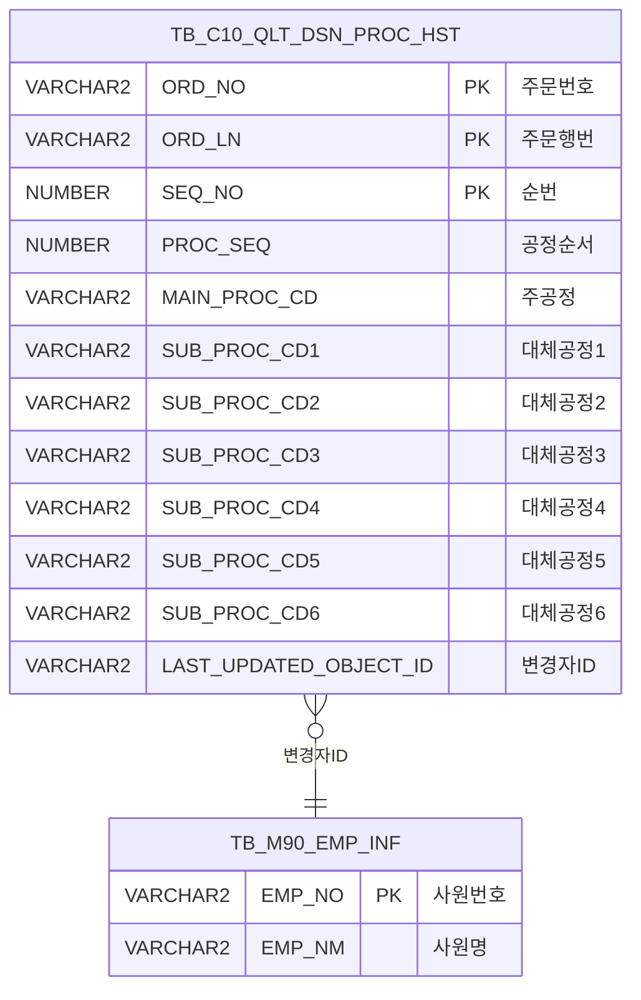

<h1 style="font-size: 40px; text-align: center; font-weight:
   bold; margin: 30px 0;">
  C104000020TAB08pop02 레거시 시스템 분석 종합 보고서
</h1>


# 1. 시스템 개요
- **서비스 ID**: C104000020TAB08pop02
- **업무명**: 통과공정이력 조회 (팝업)
- **분석 일시**: 2026-03-16 20:36 KST
- **전체 Activity 수**: 2 (Built-in 2, Custom 0)
- **분석자**: Claude Opus 4.6
- **분석 도구**: /analyze-service C104000020TAB08pop02
- **문서 버전**: 1.0

# 📊 비즈니스 프로세스 분석

## 시스템 목적

본 서비스는 **품질설계 통과공정의 변경 이력을 조회하는 팝업 화면**이다. 부모 화면(C104000020 TAB08)에서 특정 주문의 통과공정이력 버튼을 클릭하면 팝업으로 열리며, 해당 주문번호/주문행번에 대한 공정 순서별 주공정 및 대체공정(1~6) 변경 이력을 시간순으로 조회한다.

읽기 전용 조회 전용 화면으로, 데이터 입력이나 수정 기능은 없다. TB_C10_QLT_DSN_PROC_HST 테이블에서 이력 데이터를 조회하며, 변경자 정보는 M90APUSER.TB_M90_EMP_INF 테이블에서 사원명을 조인하여 표시한다.

## 주요 유즈케이스

### UC-01: 통과공정이력 조회
- **Actor**: 품질설계 담당자
- **목적**: 주문의 통과공정 변경 이력을 확인하여 공정 변경 추적 및 이력 관리

- **전제조건**:
  - 부모 화면(C104000020 TAB08)에서 주문번호/주문행번이 선택된 상태
  - 해당 주문에 통과공정이력 데이터가 존재

- **주요 흐름**:
  1. 부모 화면에서 "통과공정이력" 버튼 클릭 → 팝업 오픈
  2. onFormLoadEvent에서 부모 창의 ORD_NO, ORD_LN 파라미터를 Form_1에 자동 설정
  3. Grid_1 로드 완료(onLoadedGrid1) → find() 자동 호출
  4. C104000020TAB08pop02.select 쿼리 실행 (TB_C10_QLT_DSN_PROC_HST + TB_M90_EMP_INF 조인)
  5. Grid_1에 이력 목록 표시 (순번, 공정순서, 주공정, 대체공정1~6, 변경자)
  6. 상태바에 조회 결과 메세지 표시

- **대체 흐름**:
  - 이력 데이터 없음: 빈 그리드 표시

- **후행조건**:
  - 통과공정 변경 이력이 Grid에 시간순으로 표시됨
  - 닫기 버튼으로 팝업 종료

---
## 비즈니스 로직 상세

### 1. 통과공정이력 조회 로직

- **목적**: 주문번호/행번 기반으로 통과공정의 모든 변경 이력을 조회
- **처리 케이스**:

  **[케이스 1: 이력 조회 및 변경자 명칭 변환]**
  ```
    조건: ORD_NO, ORD_LN이 지정됨
    처리:
      1. TB_C10_QLT_DSN_PROC_HST(A) 테이블에서 해당 주문의 이력 조회
      2. M90APUSER.TB_M90_EMP_INF 테이블과 조인하여 LAST_UPDATED_OBJECT_ID → 사원명 변환
      3. SEQ_NO(순번), PROC_SEQ(공정순서), MAIN_PROC_CD(주공정), SUB_PROC_CD1~6(대체공정1~6) 반환
      4. 결과를 Grid에 표시 (읽기 전용)
  ```

---

# 💾 데이터 요구사항

## 핵심 테이블

### 1. TB_C10_QLT_DSN_PROC_HST - (품질설계 통과공정이력)
| 컬럼명 | 타입 | PK | 설명 |
|--------|------|----|------|
| ORD_NO | VARCHAR2 | ✅ | 주문번호 |
| ORD_LN | VARCHAR2 | ✅ | 주문행번 |
| SEQ_NO | NUMBER | ✅ | 순번 (이력 순서) |
| PROC_SEQ | NUMBER | | 공정순서 |
| MAIN_PROC_CD | VARCHAR2 | | 주공정코드 |
| SUB_PROC_CD1 | VARCHAR2 | | 대체공정코드1 |
| SUB_PROC_CD2 | VARCHAR2 | | 대체공정코드2 |
| SUB_PROC_CD3 | VARCHAR2 | | 대체공정코드3 |
| SUB_PROC_CD4 | VARCHAR2 | | 대체공정코드4 |
| SUB_PROC_CD5 | VARCHAR2 | | 대체공정코드5 |
| SUB_PROC_CD6 | VARCHAR2 | | 대체공정코드6 |
| LAST_UPDATED_OBJECT_ID | VARCHAR2 | | 최종변경자 ID |

### 2. TB_M90_EMP_INF - (사원정보, M90APUSER 스키마)
| 컬럼명 | 타입 | PK | 설명 |
|--------|------|----|------|
| EMP_NO | VARCHAR2 | ✅ | 사원번호 |
| EMP_NM | VARCHAR2 | | 사원명 |

## 데이터 플로우

### 1. 조회
```
[통과공정이력 조회]
팝업 오픈 → 부모 창에서 ORD_NO, ORD_LN 자동 설정
→ C104000020TAB08pop02.select
  FROM C10APUSER.TB_C10_QLT_DSN_PROC_HST A
  LEFT JOIN M90APUSER.TB_M90_EMP_INF ON A.LAST_UPDATED_OBJECT_ID = EMP_NO
  WHERE A.ORD_NO = :ORD_NO AND A.ORD_LN = :ORD_LN
→ Grid_1에 이력 목록 표시 (순번순)
```

## SQL 일람표

| SQL 이름 | 쿼리 ID | 타입 | 출처 | 테이블 |
|---------|---------|------|------|--------|
| 통과공정이력 조회 | C104000020TAB08pop02.select | SELECT | Service | TB_C10_QLT_DSN_PROC_HST, TB_M90_EMP_INF |

## ER 다이어그램 (핵심 관계)



관계 설명:
- TB_C10_QLT_DSN_PROC_HST의 LAST_UPDATED_OBJECT_ID → TB_M90_EMP_INF.EMP_NO로 사원명 조회
- 주문번호(ORD_NO) + 주문행번(ORD_LN) + 순번(SEQ_NO) 복합 PK로 이력 관리

---

# 🖥️ 사용자 인터페이스 요구사항

## 화면 레이아웃 상세

### Layout 구조 (절대 위치 기반)
```javascript
{
  // 팝업 창 (682 x 340px)
  components: [
    { id: "Form_1",     type: "form",       left: 0,  top: 0,   width: 682, height: 60,  title: "조회 조건" },
    { id: "Grid_1",     type: "grid",       left: 0,  top: 60,  width: 680, height: 260, title: "통과공정이력" },
    { id: "messagebox", type: "messagebox", left: -1, top: 321, width: 681, height: 19 }
  ]
}
```

## 입출력 요소

### Form 컴포넌트

**C104000020TAB08pop02_Form_1 (조회 조건)**
- std_title: label - "통과공정이력"
- ORD_NO: input - 주문번호 (75px, 비활성화 - 부모 창에서 자동 설정)
- ORD_LN: input - 주문행번 (25px, 비활성화, 라벨 "~")
- find: button - "확인" (command: find, 비활성화)
- winClose: button - "닫기" (command: winClose)

### Grid 컴포넌트

**C104000020TAB08pop02_Grid_1 (통과공정이력)**
- 편집 가능 여부: 아니오 (전체 읽기 전용)
- Split: 없음
- rowCnt: 10, vertical: true, pageset: true
- 주요 컬럼 (10개):

  **기본 정보**:
  - SEQ_NO: ro - 순번 (6%, 중앙정렬, int 정렬)
  - PROC_SEQ: ro - 공정순서 (9%, 중앙정렬, int 정렬)

  **공정 정보**:
  - MAIN_PROC_CD: ro - 주공정 (9%, 중앙정렬)
  - SUB_PROC_CD1: ro - 대체공정1 (11%, 중앙정렬)
  - SUB_PROC_CD2: ro - 대체공정2 (11%, 중앙정렬)
  - SUB_PROC_CD3: ro - 대체공정3 (11%, 중앙정렬)
  - SUB_PROC_CD4: ro - 대체공정4 (11%, 중앙정렬)
  - SUB_PROC_CD5: ro - 대체공정5 (11%, 중앙정렬)
  - SUB_PROC_CD6: ro - 대체공정6 (11%, 중앙정렬)

  **변경 정보**:
  - LAST_UPDATED_OBJECT_ID: ro - 변경자 (*%, 중앙정렬, 사원명으로 표시)

### Menu 컴포넌트

**C104000020TAB08pop02_Menu_1 (툴바)**
- refresh: 새로고침 (refresh.gif)
- add: 행추가 (new.gif)
- copy: 복사 (copy.gif)
- remove: 삭제 (remove.gif)
- undo: 실행취소 (undo.gif)
- redo: 재실행 (redo.gif)

## 화면 동작 흐름

### 1. 팝업 초기 로딩
```
1. 부모 화면에서 팝업 오픈 (ORD_NO, ORD_LN 파라미터 전달)
2. DHTMLX 컴포넌트 초기화 (pageConfiguration JSON 기반)
3. Form_1 onXLE → onFormLoadEvent 실행:
   - 부모 창의 ORD_NO, ORD_LN 파라미터를 Form_1에 설정
4. Grid_1 onXLE → onLoadedGrid1 실행:
   - find() 자동 호출 → 이력 데이터 조회
   - 이벤트 해제 (무한루프 방지)
5. findMessage 콜백: 상태바에 조회 메세지 표시
```

### 2. 닫기
```
1. Form_1의 "닫기" 버튼 클릭
2. winClose 함수 실행 → 팝업 창 종료
```

## JavaScript 모듈

**C104000020TAB08pop02.jsp (인라인 스크립트)**
- find(eventName): 폼 조건으로 그리드 데이터 조회 (uiCommon.parameters → Grid_1 loadData)
- findCclBom(eventName): CCL BOM 조회 (find와 동일 로직)
- save(eventName, formDivObj, referenceItem): 그리드 데이터 저장
- refresh(referenceItem): 그리드 선택 초기화 후 재조회
- add/remove/copy/undo/redo: 표준 그리드 조작 함수
- onLoadedGrid1(): 그리드 로드 후 자동 조회 실행 + 이벤트 해제
- onFormLoadEvent(): 폼 로드 시 부모 창 파라미터(ORD_NO, ORD_LN) 설정
- findMessage(referenceItem): 조회 결과 메세지 표시
- onGridContextMenuClick(id, gridObj, menuObj): 컨텍스트 메뉴 처리

## 주요 이벤트 핸들러

**onFormLoadEvent (폼 로드)**
- 이벤트 타입: Form XLE (로드 완료)
- 처리 내용:
  1. 부모 창의 ORD_NO 파라미터를 Form_1에 설정
  2. 부모 창의 ORD_LN 파라미터를 Form_1에 설정
  3. 폼 필드는 비활성화 상태 유지

**onLoadedGrid1 (그리드 로드)**
- 이벤트 타입: Grid XLE (로드 완료)
- 처리 내용:
  1. find() 호출하여 자동 조회 실행
  2. 이벤트 해제 (detachEvent) - 재로드 시 무한루프 방지

---

# 📌 특이사항 및 주의사항

## 1. 읽기 전용 팝업이지만 편집 기능 메뉴 존재
- 그리드는 전체 읽기 전용(ro)이지만, Menu_1에 행추가(add), 삭제(remove), 저장(save) 등 편집 관련 함수가 정의되어 있다. 이는 프레임워크 기본 템플릿에서 가져온 것으로 보이며, 실제로는 읽기 전용이므로 동작하지 않을 가능성이 높다.

## 2. 크로스 스키마 테이블 참조
- C10APUSER.TB_C10_QLT_DSN_PROC_HST(이력 테이블)과 M90APUSER.TB_M90_EMP_INF(사원정보)를 크로스 스키마 조인한다. C10APUSER 스키마의 테이블을 직접 참조하므로 MESAPUSER에서 C10APUSER에 대한 SELECT 권한이 필요하다.

## 3. 부모-자식 창 간 파라미터 전달 패턴
- 부모 창의 ORD_NO, ORD_LN을 팝업으로 전달하여 조회 조건으로 사용한다. 폼 필드는 모두 disabled 상태이므로 사용자가 직접 값을 변경할 수 없다. 부모 창에서 전달하는 파라미터가 없으면 빈 결과가 표시된다.

## 4. 대체공정 6개까지 지원
- SUB_PROC_CD1~6으로 최대 6개 대체공정을 기록한다. 이는 일반적인 품질설계(4~5개 대체공정)보다 많은 편으로, 복잡한 공정 경로를 가진 주문의 이력을 추적할 수 있다.

---

# 📚 참고 문서

- **Service XML**: `src/service/C104000020TAB08pop02-service.xml`
- **Query SQL**: `src/query/C104000020TAB08pop02-query.glue_sql`
- **JSP**: `WebContents/C104000020TAB08pop02.jsp`
- **UI XML**: `WebContents/header/kr/C104000020TAB08pop02/C104000020TAB08pop02_*.xml`
