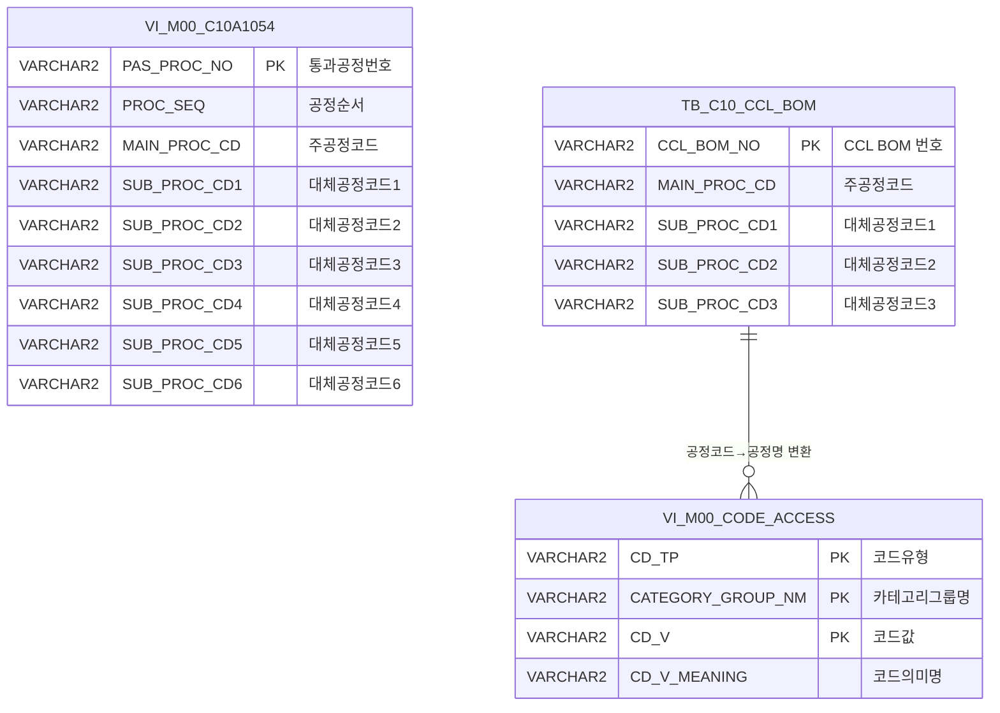

<h1 style="font-size: 40px; text-align: center; font-weight:
   bold; margin: 30px 0;">
  C104000020TAB08pop 레거시 시스템 분석 종합 보고서
</h1>


# 1. 시스템 개요
- **서비스 ID**: C104000020TAB08pop
- **업무명**: 통과공정 및 CCL-BOM 공정 조회 팝업
- **분석 일시**: 2026-03-16 (KST)
- **전체 Activity 수**: 3개 (Built-in 3개)
- **분석자**: Claude Opus 4.6
- **분석 도구**: /analyze-service C104000020TAB08pop
- **문서 버전**: 1.0

# 📊 비즈니스 프로세스 분석

## 시스템 목적

C104000020TAB08pop은 품질설계결과 화면(C104000020)의 TAB08에서 호출되는 팝업 화면으로, 특정 주문의 **통과공정(PAS_PROC_NO)** 과 **CCL-BOM 공정(CCL_BOM_NO)** 정보를 조회하여 표시하는 읽기 전용 조회 화면이다.

부모 화면에서 통과공정번호(PAS_PROC_NO)와 CCL-BOM 번호(CCL_BOM_NO)를 파라미터로 전달받아 팝업이 열리면 자동으로 두 개의 그리드에 데이터를 로드한다. Grid_1은 통과공정 뷰(VI_M00_C10A1054)에서 공정 순서별 주공정 및 최대 6개의 대체공정 코드를 조회하고, Grid_2는 CCL-BOM 테이블(TB_C10_CCL_BOM)에서 해당 BOM의 주공정과 대체공정 코드를 코드명으로 변환하여 표시한다.

이 팝업은 사용자가 직접 데이터를 입력하거나 수정하는 기능 없이, 품질설계 시 결정된 통과공정 경로와 CCL 코팅 BOM 공정 정보를 확인하는 용도로 사용된다.

<!-- 단순 조회 서비스: Custom Activity 0개, SELECT 쿼리만 사용, Router → 단일 조회 Activity 체인 → 워크플로우 다이어그램 생략 -->

## 주요 유즈케이스

### UC-01: 통과공정 정보 조회
- **Actor**: 품질설계 담당자 / 공정 오퍼레이터
- **목적**: 특정 통과공정번호에 해당하는 주공정 및 대체공정 경로를 확인

- **전제조건**:
  - 부모 화면(C104000020 TAB08)에서 통과공정번호(PAS_PROC_NO)가 존재하는 주문이 선택되어 있음
  - 팝업 호출 시 PAS_PROC_NO가 request 파라미터로 전달됨

- **주요 흐름**:
  1. 부모 화면에서 통과공정 팝업 호출 → PAS_PROC_NO, CCL_BOM_NO 파라미터 전달
  2. 팝업 화면 초기화 시 Form_1에 부모 파라미터 자동 주입 (onFormLoadEvent)
  3. Grid_1 XLE 이벤트 발생 → onLoadedGrid1 실행
  4. C104000020TAB08pop.select 쿼리로 VI_M00_C10A1054 뷰에서 공정 순서별 데이터 조회
  5. Grid_1에 공정순서, 주공정, 대체공정1~6 표시

- **대체 흐름**:
  - PAS_PROC_NO에 해당하는 통과공정 데이터 없음: 빈 그리드 표시

- **후행조건**:
  - Grid_1에 통과공정 경로 데이터가 표시됨
  - 사용자가 공정 경로를 확인한 후 닫기 버튼으로 팝업 종료

### UC-02: CCL-BOM 공정 정보 조회
- **Actor**: 품질설계 담당자 / 공정 오퍼레이터
- **목적**: 특정 CCL-BOM 번호에 해당하는 코팅 공정의 주공정 및 대체공정을 공정 코드명으로 확인

- **전제조건**:
  - 부모 화면에서 CCL_BOM_NO가 request 파라미터로 전달됨
  - CCL-BOM 마스터(TB_C10_CCL_BOM)에 해당 BOM 데이터가 존재

- **주요 흐름**:
  1. 팝업 초기화 시 Form_1에 CCL_BOM_NO 자동 주입
  2. Grid_2 XLE 이벤트 발생 → onLoadedGrid2 실행
  3. C104000020TAB08popCclBom.select 쿼리로 TB_C10_CCL_BOM에서 BOM 공정 조회
  4. 스칼라 서브쿼리로 공정코드(PROC_CD)를 VI_M00_CODE_ACCESS에서 공정명(CD_V_MEANING)으로 변환
  5. Grid_2에 주공정명, 대체공정명1~3 표시

- **대체 흐름**:
  - CCL_BOM_NO에 해당하는 BOM 데이터 없음: 빈 그리드 표시
  - 공정코드가 VI_M00_CODE_ACCESS에 미등록: 해당 셀 NULL 표시

- **후행조건**:
  - Grid_2에 CCL-BOM 공정 데이터가 코드명으로 표시됨

### UC-03: 팝업 종료
- **Actor**: 품질설계 담당자 / 공정 오퍼레이터
- **목적**: 조회 확인 후 팝업 창 닫기

- **전제조건**:
  - 팝업 화면이 열려 있음

- **주요 흐름**:
  1. 닫기 버튼 클릭 (Form_1의 winClose command)
  2. 팝업 창 종료

- **대체 흐름**:
  - 브라우저 X 버튼 클릭으로 종료

- **후행조건**:
  - 팝업 창이 닫히고 부모 화면으로 포커스 복귀

---
## 비즈니스 로직 상세

### 1. 공정코드→공정명 변환 (스칼라 서브쿼리)

- **목적**: CCL-BOM 테이블에 저장된 공정코드(PROC_CD)를 사용자가 이해할 수 있는 공정명(CD_V_MEANING)으로 변환하여 표시

- **처리 케이스**:

  **[케이스 1: 공정코드 → 공정명 변환]**
  ```
    조건: TB_C10_CCL_BOM의 MAIN_PROC_CD, SUB_PROC_CD1~3 각 컬럼에 공정코드가 존재
    처리:
      1. 각 공정코드 컬럼에 대해 스칼라 서브쿼리 실행
      2. VI_M00_CODE_ACCESS 뷰에서 CD_TP='PROC_CD', CATEGORY_GROUP_NM='SZ0000' 조건으로 검색
      3. CD_V = 해당 공정코드에 매칭되는 CD_V_MEANING(공정명) 반환
      4. 총 4개 컬럼(주공정, 대체1~3)에 동일 패턴 적용
  ```

  **[케이스 2: 공정코드 미등록]**
  ```
    조건: 해당 공정코드가 VI_M00_CODE_ACCESS에 존재하지 않음
    처리:
      1. 스칼라 서브쿼리 결과 NULL 반환
      2. Grid 셀에 빈 값 표시
  ```

### 2. 통과공정 순서 조회 (뷰 기반)

- **목적**: 통과공정번호(PAS_PROC_NO)에 해당하는 주공정 및 대체공정 경로를 공정 순서대로 조회

- **처리 케이스**:

  **[케이스 1: 정상 조회]**
  ```
    조건: PAS_PROC_NO에 해당하는 데이터가 VI_M00_C10A1054 뷰에 존재
    처리:
      1. PAS_PROC_NO 조건으로 뷰 조회
      2. PROC_SEQ(공정순서) 오름차순 정렬
      3. 각 공정순서별 주공정(MAIN_PROC_CD)과 대체공정 1~6(SUB_PROC_CD1~6) 반환
  ```

---

# 💾 데이터 요구사항

## 핵심 테이블

### 1. M00APUSER.VI_M00_C10A1054 - (통과공정 뷰)
| 컬럼명 | 타입 | PK | 설명 |
|--------|------|----|-----|
| PAS_PROC_NO | VARCHAR2 | ✅ | 통과공정번호 |
| PROC_SEQ | VARCHAR2 | | 공정순서 |
| MAIN_PROC_CD | VARCHAR2 | | 주공정코드 |
| SUB_PROC_CD1 | VARCHAR2 | | 대체공정코드1 |
| SUB_PROC_CD2 | VARCHAR2 | | 대체공정코드2 |
| SUB_PROC_CD3 | VARCHAR2 | | 대체공정코드3 |
| SUB_PROC_CD4 | VARCHAR2 | | 대체공정코드4 |
| SUB_PROC_CD5 | VARCHAR2 | | 대체공정코드5 |
| SUB_PROC_CD6 | VARCHAR2 | | 대체공정코드6 |

### 2. C10APUSER.TB_C10_CCL_BOM - (CCL-BOM 마스터)
| 컬럼명 | 타입 | PK | 설명 |
|--------|------|----|-----|
| CCL_BOM_NO | VARCHAR2 | ✅ | CCL BOM 번호 |
| MAIN_PROC_CD | VARCHAR2 | | 주공정코드 |
| SUB_PROC_CD1 | VARCHAR2 | | 대체공정코드1 |
| SUB_PROC_CD2 | VARCHAR2 | | 대체공정코드2 |
| SUB_PROC_CD3 | VARCHAR2 | | 대체공정코드3 |

### 3. M00APUSER.VI_M00_CODE_ACCESS - (공통코드 뷰)
| 컬럼명 | 타입 | PK | 설명 |
|--------|------|----|-----|
| CD_TP | VARCHAR2 | ✅ | 코드유형 (예: 'PROC_CD') |
| CATEGORY_GROUP_NM | VARCHAR2 | ✅ | 카테고리그룹명 (예: 'SZ0000') |
| CD_V | VARCHAR2 | ✅ | 코드값 (공정코드) |
| CD_V_MEANING | VARCHAR2 | | 코드의미 (공정명) |

## 데이터 플로우

### 1. 통과공정 조회

```
[팝업 초기 로딩 - 통과공정 조회]
팝업 진입 (부모에서 PAS_PROC_NO, CCL_BOM_NO 파라미터 전달)
→ onFormLoadEvent: Form_1에 PAS_PROC_NO, CCL_BOM_NO 자동 주입
→ onLoadedGrid1: C104000020TAB08pop.select 실행
  FROM M00APUSER.VI_M00_C10A1054
  WHERE PAS_PROC_NO = :PAS_PROC_NO
  ORDER BY PROC_SEQ
→ Grid_1에 공정순서별 주공정/대체공정 목록 표시
```

### 2. CCL-BOM 공정 조회

```
[팝업 초기 로딩 - CCL-BOM 공정 조회]
→ onLoadedGrid2: C104000020TAB08popCclBom.select 실행
  FROM C10APUSER.TB_C10_CCL_BOM
  WHERE CCL_BOM_NO = :CCL_BOM_NO
  + 스칼라 서브쿼리 4개 (MAIN_PROC_CD, SUB_PROC_CD1~3)
    각각 VI_M00_CODE_ACCESS에서 CD_TP='PROC_CD', CATEGORY_GROUP_NM='SZ0000' 조건으로
    공정코드 → 공정명 변환
→ Grid_2에 주공정명/대체공정명 표시
```

## SQL 일람표
| SQL 이름 | 쿼리 ID | 타입 | 출처 | 테이블 |
|---------|---------|-----|-------|-------|
| 통과공정 조회 | C104000020TAB08pop.select | SELECT | Service | M00APUSER.VI_M00_C10A1054 |
| CCL-BOM 공정 조회 | C104000020TAB08popCclBom.select | SELECT | Service | C10APUSER.TB_C10_CCL_BOM, M00APUSER.VI_M00_CODE_ACCESS |

## ER 다이어그램 (핵심 관계)



관계 설명:
- **VI_M00_C10A1054**는 통과공정 마스터 뷰로, PAS_PROC_NO를 키로 공정 경로를 관리
- **TB_C10_CCL_BOM**은 CCL 코팅 BOM 마스터로, 코팅 공정별 주공정/대체공정을 보유
- **VI_M00_CODE_ACCESS**는 공통코드 뷰로, TB_C10_CCL_BOM의 공정코드를 공정명으로 변환하는 데 사용 (CD_TP='PROC_CD', CATEGORY_GROUP_NM='SZ0000')

---

# 🖥️ 사용자 인터페이스 요구사항

## 화면 레이아웃 상세

### Layout 구조 (절대 좌표 배치)
```javascript
{
  type: "absolute",  // layout 컴포넌트 없음, div 절대 좌표 배치
  totalWidth: "552px",
  totalHeight: "340px",
  screenType: "popup",
  components: [
    {
      id: "C104000020TAB08pop_Form_1",
      type: "form",
      position: { left: 0, top: 0, width: 552, height: 56 },
      description: "검색 조건 폼 (통과공정번호, CCL_BOM, 확인/닫기 버튼)"
    },
    {
      id: "C104000020TAB08pop_Grid_1",
      type: "grid",
      position: { left: 0, top: 56, width: 550, height: 160 },
      description: "통과공정 그리드 (8컬럼, rowCnt=6)"
    },
    {
      id: "C104000020TAB08pop_Form_2",
      type: "form",
      position: { left: 0, top: 216, width: 550, height: 32 },
      description: "CCL-BOM 공정 섹션 타이틀"
    },
    {
      id: "C104000020TAB08pop_Grid_2",
      type: "grid",
      position: { left: 0, top: 248, width: 550, height: 73 },
      description: "CCL-BOM 공정 그리드 (4컬럼, rowCnt=2)"
    },
    {
      id: "C104000020TAB08pop_messagebox",
      type: "messagebox",
      position: { left: -1, top: 321, width: 551, height: 19 },
      description: "메시지 박스 (XML 파일 미존재)"
    }
  ]
}
```

## 입출력 요소

### Form 컴포넌트
**C104000020TAB08pop_Form_1**
- PAS_PROC_NO: input - 통과공정번호 (disabled=true, 부모 파라미터 자동 주입)
- CCL_BOM_NO: input - CCL_BOM 번호 (disabled=true, 부모 파라미터 자동 주입)
- find: button - 확인 (disabled=true, command=find)
- winClose: button - 닫기 (command=winClose)
- template: template - 타이틀 아이콘 (setTitleIcon)
- std_title: label - "통과공정"

**C104000020TAB08pop_Form_2**
- template: template - 타이틀 아이콘 (setTitleIcon)
- std_title: label - "CCL-BOM 공정"

### Grid 컴포넌트

**C104000020TAB08pop_Grid_1 (통과공정 그리드)**
- 편집 가능 여부: 아니오 (읽기 전용, 전 컬럼 type="ro")
- Split: 0 (고정 컬럼 없음)
- rowCnt: 6
- colwidthUnit: % (컬럼 너비 비율 기반)
- 주요 컬럼 (8개):

  **공정 순서**:
  - PROC_SEQ: ro - 공정순서 (8%, 중앙정렬, sort=int)

  **주공정**:
  - MAIN_PROC_CD: ro - 주공정 (14%, 중앙정렬, sort=str)

  **대체공정**:
  - SUB_PROC_CD1: ro - 대체공정1 (13%, 중앙정렬, sort=str)
  - SUB_PROC_CD2: ro - 대체공정2 (13%, 중앙정렬, sort=str)
  - SUB_PROC_CD3: ro - 대체공정3 (13%, 중앙정렬, sort=str)
  - SUB_PROC_CD4: ro - 대체공정4 (13%, 중앙정렬, sort=str)
  - SUB_PROC_CD5: ro - 대체공정5 (13%, 중앙정렬, sort=str)
  - SUB_PROC_CD6: ro - 대체공정6 (13%, 중앙정렬, sort=str)

**C104000020TAB08pop_Grid_2 (CCL-BOM 공정 그리드)**
- 편집 가능 여부: 아니오 (읽기 전용, 전 컬럼 type="ro")
- Split: 0 (고정 컬럼 없음)
- rowCnt: 2
- colwidthUnit: % (컬럼 너비 비율 기반)
- 주요 컬럼 (4개):

  **주공정**:
  - MAIN_PROC_CD: ro - 주공정명 (24%, 중앙정렬, sort=str) - 코드→코드명 변환 표시

  **대체공정**:
  - SUB_PROC_CD1: ro - 대체공정명1 (24%, 중앙정렬, sort=str) - 코드→코드명 변환 표시
  - SUB_PROC_CD2: ro - 대체공정명2 (24%, 중앙정렬, sort=str) - 코드→코드명 변환 표시
  - SUB_PROC_CD3: ro - 대체공정명3 (*, 중앙정렬, sort=str) - 코드→코드명 변환 표시

## 화면 동작 흐름

### 1. 화면 초기 로딩 (팝업 오픈)
```
1. 부모 화면에서 팝업 호출 (PAS_PROC_NO, CCL_BOM_NO 파라미터 전달)
2. ui.initializeDHTMLX() 호출 → pageConfiguration 기반 컴포넌트 초기화
3. XLE 이벤트 등록:
   - _onXLEForm = Form_1.onXLEEvent(onFormLoadEvent)
   - _onXLE1 = Grid_1.onXLEEvent(onLoadedGrid1)
   - _onXLE2 = Grid_2.onXLEEvent(onLoadedGrid2)
4. Form_1 초기 로드 완료 → onFormLoadEvent 실행:
   - items['Form_1'].setItemValue("PAS_PROC_NO", request.getParameter("PAS_PROC_NO"))
   - items['Form_1'].setItemValue("CCL_BOM_NO", request.getParameter("CCL_BOM_NO"))
   - Form_1.getDhxForm().detachEvent(_onXLEForm) → 이벤트 해제
5. Grid_1 초기 로드 완료 → onLoadedGrid1 실행:
   - uiCommon.parameters('Form_1', 'Grid_1', 'find') → 파라미터 URL 생성
   - items['Grid_1'].loadData(parentFindUrl) → C104000020TAB08pop.select 실행
   - Grid_1.getDhxGrid().detachEvent(_onXLE1) → 이벤트 해제 (무한루프 방지)
6. Grid_2 초기 로드 완료 → onLoadedGrid2 실행:
   - uiCommon.parameters('Form_1', 'Grid_2', 'findCclBom') → 파라미터 URL 생성
   - items['Grid_2'].loadData(parentFindUrl) → C104000020TAB08popCclBom.select 실행
   - Grid_2.getDhxGrid().detachEvent(_onXLE2) → 이벤트 해제 (무한루프 방지)
7. 두 그리드 모두 데이터 로드 완료
```

### 2. 컨텍스트 메뉴 기능
```
1. 그리드 영역에서 우클릭 → 컨텍스트 메뉴 표시
2. onGridContextMenuClick(id, gridObj, menuObj) 실행
3. 메뉴 항목별 처리:
   - move_grid: 체크 시 gridObj.enableColumnMove(true) → 컬럼 드래그 이동 가능
   - filter_grid: 체크 시 gridObj.enableHeaderMenu() → 헤더 필터 활성화
   - editable_grid: 체크 시 gridObj.setEditable(true) → 편집 모드 전환
   - excel_grid: gridObj.toExcel(contextPath + '/gridexcel', 'color') → 엑셀 다운로드
```

### 3. 팝업 종료
```
1. Form_1의 닫기(winClose) 버튼 클릭
2. 팝업 창 종료
3. 부모 화면으로 포커스 복귀
```

## JavaScript 모듈

**C104000020TAB08pop.jsp** (인라인 스크립트)
- find(eventName, formDivObj, referenceItem): 통과공정 조회 (uiCommon.parameters → Grid_1.loadData)
- findCclBom(eventName, formDivObj, referenceItem): CCL-BOM 공정 조회 (uiCommon.parameters → Grid_2.loadData)
- save(eventName, formDivObj, referenceItem): 그리드 데이터 저장 (items[referenceItem].sendGrid)
- refresh(referenceItem): 새로고침 (clearDataProcess → uiCommon.parameters → loadData)
- add(referenceItem): 행추가 (items[referenceItem].addRow)
- remove(referenceItem): 행삭제 (items[referenceItem].removeRow)
- copy(referenceItem): 클립보드 복사 (items[referenceItem].copyRowContent)
- undo(referenceItem): 작업취소 (items[referenceItem].undo)
- redo(referenceItem): 작업재실행 (items[referenceItem].redo)
- onLoadedGrid1(): Grid_1 초기 로드 이벤트 (Form_1 파라미터로 find 조회 → detachEvent)
- onLoadedGrid2(): Grid_2 초기 로드 이벤트 (Form_1 파라미터로 findCclBom 조회 → detachEvent)
- onGridContextMenuClick(id, gridObj, menuObj): 컨텍스트 메뉴 핸들러 (열이동/필터/편집/엑셀)
- findMessage(referenceItem): 메시지 표시 (uiCommon.message)
- onFormLoadEvent(): Form_1 초기 로드 → 부모 파라미터(PAS_PROC_NO, CCL_BOM_NO) 주입 → detachEvent

## 주요 이벤트 핸들러

**onFormLoadEvent (Form_1 초기 로드)**
- 이벤트 타입: XLE Event (Form 로드 완료)
- 처리 내용:
  1. request.getParameter("PAS_PROC_NO")로 부모 파라미터 획득
  2. items['Form_1'].setItemValue("PAS_PROC_NO", value)로 Form에 설정
  3. request.getParameter("CCL_BOM_NO")로 부모 파라미터 획득
  4. items['Form_1'].setItemValue("CCL_BOM_NO", value)로 Form에 설정
  5. Form_1.getDhxForm().detachEvent(_onXLEForm) → 1회 실행 후 이벤트 해제

**onLoadedGrid1 (Grid_1 초기 로드 → 통과공정 자동 조회)**
- 이벤트 타입: XLE Event (Grid 로드 완료)
- 처리 내용:
  1. uiCommon.parameters('Form_1', 'Grid_1', 'find')로 조회 URL 생성
  2. items['Grid_1'].loadData(parentFindUrl)로 데이터 로드
  3. Grid_1.getDhxGrid().detachEvent(_onXLE1) → 1회 실행 후 이벤트 해제 (무한루프 방지)

**onLoadedGrid2 (Grid_2 초기 로드 → CCL-BOM 자동 조회)**
- 이벤트 타입: XLE Event (Grid 로드 완료)
- 처리 내용:
  1. uiCommon.parameters('Form_1', 'Grid_2', 'findCclBom')로 조회 URL 생성
  2. items['Grid_2'].loadData(parentFindUrl)로 데이터 로드
  3. Grid_2.getDhxGrid().detachEvent(_onXLE2) → 1회 실행 후 이벤트 해제 (무한루프 방지)

**onGridContextMenuClick (컨텍스트 메뉴)**
- 이벤트 타입: 그리드 우클릭 컨텍스트 메뉴
- 처리 내용:
  1. menuObj.getCheckboxState(id)로 체크 상태 확인
  2. move_grid: 컬럼 이동 ON/OFF (enableColumnMove)
  3. filter_grid: 헤더 필터 활성화 (enableHeaderMenu)
  4. editable_grid: 편집 가능 ON/OFF (setEditable)
  5. excel_grid: 엑셀 다운로드 (toExcel)

# 📌 특이사항 및 주의사항

## 1. 미사용 Menu XML 파일 존재
- **Menu_1.xml 파일**이 `WebContents/header/kr/C104000020TAB08pop/` 디렉토리에 존재하나, JSP의 `pageConfiguration`에 등록되어 있지 않음
- Menu에는 refresh, add, copy, remove, undo, redo 항목이 정의되어 있으며, JSP에도 해당 함수(save, refresh, add, remove, copy, undo, redo)가 구현되어 있음
- 그러나 실제로는 메뉴가 화면에 렌더링되지 않으므로, 이 함수들은 호출되지 않는 죽은 코드(dead code)임
- **가능성**: 개발 초기에는 편집 기능이 있었으나 이후 읽기 전용으로 변경하면서 메뉴 등록만 제거한 것으로 추정

## 2. 확인 버튼 disabled 처리 및 자동 조회 패턴
- Form_1의 확인(find) 버튼은 `disabled=true`로 설정되어 사용자가 직접 클릭할 수 없음
- 부모 화면에서 파라미터가 자동 주입되고, XLE 이벤트를 통해 자동으로 조회가 실행됨
- PAS_PROC_NO, CCL_BOM_NO 입력 필드도 `disabled=true`로 사용자 수정 불가
- **detachEvent 패턴**: XLE 이벤트 핸들러 내부에서 자기 자신의 이벤트를 해제하여 무한루프를 방지하는 패턴 사용

## 3. Grid_1과 Grid_2의 공정코드 표시 차이
- **Grid_1 (통과공정)**: 공정코드를 그대로 표시 (VI_M00_C10A1054 뷰의 원시 코드값)
- **Grid_2 (CCL-BOM)**: 스칼라 서브쿼리로 공정코드를 공정명(CD_V_MEANING)으로 변환하여 표시
- 동일한 정보(주공정/대체공정)를 서로 다른 형태(코드/코드명)로 표시하는 비일관성 존재
- Grid_1은 주공정 + 대체공정 6개(총 8컬럼), Grid_2는 주공정 + 대체공정 3개(총 4컬럼)로 대체공정 개수도 상이

## 4. messagebox XML 파일 미존재
- `pageConfiguration`에 messagebox 컴포넌트가 등록되어 있고, `findMessage()` 함수도 구현되어 있으나, 실제 `C104000020TAB08pop_messagebox.xml` 파일이 존재하지 않음
- 메시지 표시 기능이 정상 작동하지 않을 가능성 있음

## 5. 별도 쿼리 파일 존재 (query02)
- `C104000020TAB08pop-query02.glue_sql` 파일이 존재하며, `C104000020TAB08pop02.select`(통과공정내역조회) 및 `C104000020TAB08pop02.insertHistory`(공정내역삽입) 쿼리가 정의됨
- 이 쿼리들은 현재 서비스(C104000020TAB08pop-service.xml)에서는 참조하지 않으며, 별도의 서비스(C104000020TAB08pop02)에서 사용되는 것으로 추정

# 📚 참고 문서

- **Query SQL**: `src/query/C104000020TAB08pop-query.glue_sql`
- **Service XML**: `src/service/C104000020TAB08pop-service.xml`
- **JSP**: `WebContents/C104000020TAB08pop.jsp`
- **Form XML**:
  - `WebContents/header/kr/C104000020TAB08pop/C104000020TAB08pop_Form_1.xml`
  - `WebContents/header/kr/C104000020TAB08pop/C104000020TAB08pop_Form_2.xml`
- **Grid XML**:
  - `WebContents/header/kr/C104000020TAB08pop/C104000020TAB08pop_Grid_1.xml`
  - `WebContents/header/kr/C104000020TAB08pop/C104000020TAB08pop_Grid_2.xml`
- **Menu XML**: `WebContents/header/kr/C104000020TAB08pop/C104000020TAB08pop_Menu_1.xml` (미사용)
