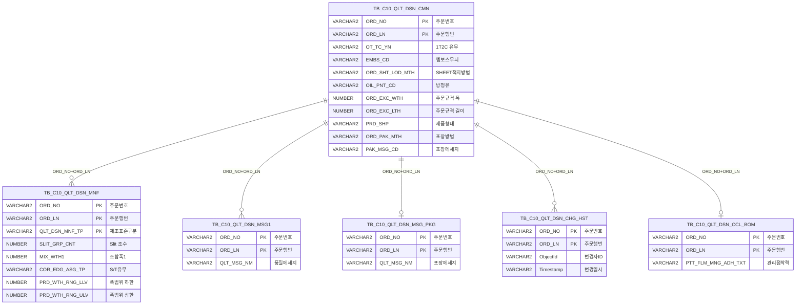

<h1 style="font-size: 40px; text-align: center; font-weight:
   bold; margin: 30px 0;">
  C104000020TAB09 레거시 시스템 분석 종합 보고서
</h1>


# 1. 시스템 개요
- **서비스 ID**: C104000020TAB09
- **업무명**: 품질설계결과 - 후공정 (정전/품질메세지/포장)
- **분석 일시**: 2026-03-17 (KST)
- **전체 Activity 수**: 9개 (모두 built-in)
- **분석자**: Claude Opus 4.6 / Sonnet (UI), Haiku/Sonnet (SQL)
- **분석 도구**: /analyze-service C104000020TAB09
- **문서 버전**: 1.0

# 📊 비즈니스 프로세스 분석

## 시스템 목적

C104000020TAB09은 품질설계결과 화면(C104000020)의 탭09(후공정) 서비스이다. 특정 주문(ORD_NO, ORD_LN)에 대한 후공정 제조사양 정보를 조회하고 편집하는 기능을 제공한다.

이 탭은 크게 세 가지 영역으로 구성된다: (1) **정전(Slit) 설정** - 조수(폭 Set), 조합폭(MIX_WTH1~10), 1T2C 유무, S/T 유무, 제품폭범위 등의 편집, (2) **품질메세지** - 주문별 품질 메세지 텍스트 편집, (3) **포장** - 포장방법 조회 및 포장메세지 코드 선택. 각 영역의 데이터를 수정 후 저장하면 변경이력(TB_C10_QLT_DSN_CHG_HST)이 자동 기록된다.

부모 프레임(C104000020)의 Form_1에서 주문번호와 주문행번을 전달받아 동작하며, 모든 조회/저장은 이 파라미터를 기준으로 수행된다.

## 주요 유즈케이스

### UC-01: 후공정 제조사양 조회
- **Actor**: 품질설계 담당자
- **목적**: 특정 주문의 정전(Slit), 엠보스/방청유/SKID, 보호필름, 품질메세지, 포장 정보를 한 화면에서 확인
- **전제조건**:
  - 부모 화면(C104000020)에서 주문번호(ORD_NO)와 주문행번(ORD_LN)이 선택되어 있음
  - 해당 주문이 종결처리(VI_MES_TRM_CTL 'O' 타입) 되지 않음
- **주요 흐름**:
  1. 부모 화면에서 TAB09 탭 선택
  2. 부모 Form의 ORD_NO, ORD_LN 파라미터로 Grid_1~3, Grid_5는 loadData, Grid_4는 ajaxLoadData(verticalGridData.do)로 데이터 로드
  3. Grid_1: 정전 조수/폭 Set 정보 표시 (편집 가능)
  4. Grid_2: 엠보스무늬, SHEET적치방법, 방청유, SKID 치수 표시 (읽기 전용)
  5. Grid_3: 보호필름 상세 정보 표시 (읽기 전용)
  6. Grid_4: 품질메세지 표시 (편집 가능)
  7. Grid_5: 포장방법/포장메세지 표시 (포장메세지만 편집 가능)
  8. messagebox에 조회 결과 메시지 표시
- **대체 흐름**:
  - 종결 주문 조회 시: VI_MES_TRM_CTL 필터에 의해 데이터 미표시
  - 주문번호/행번 미선택 시: 빈 화면 표시
- **후행조건**:
  - 각 Grid에 데이터가 바인딩됨
  - 편집 가능 컬럼의 수정 가능 상태 활성화

### UC-02: 정전(Slit) 설정 수정 및 저장
- **Actor**: 품질설계 담당자
- **목적**: Slit 조수, 조합폭, 1T2C 유무, S/T 유무, 제품폭범위를 수정하여 후공정 제조사양 반영
- **전제조건**:
  - UC-01이 완료되어 데이터가 로드된 상태
  - 저장 버튼이 활성화 가능한 상태
- **주요 흐름**:
  1. Grid_1에서 SLIT_GRP_CNT(조수), MIX_WTH1~10(조합폭), OT_TC_YN(1T2C), COR_EDG_ASG_TP(S/T), PRD_WTH_RNG_LLV/ULV(폭범위) 수정
  2. 조수(SLIT_GRP_CNT)는 최대 1자리 숫자, 폭목표(MIX_WTH)는 최대 4자리+1소수점 검증
  3. 저장 버튼 클릭 → confirm 다이얼로그 표시
  4. Grid_1 변경사항 → COR_save(handleDataProcess.do) → MNFupdate(TB_C10_QLT_DSN_MNF)
  5. 1T2C 변경 시 → OT_TC_YN_update(TB_C10_QLT_DSN_CMN)
  6. 이력저장 → CHG_HSTinsert(TB_C10_QLT_DSN_CHG_HST)
  7. 후속 Grid(4,5)에 변경사항 있으면 연쇄 저장
- **대체 흐름**:
  - 입력값 형식 오류 시: onEditCellEvent1에서 입력 차단 (숫자/소수점 검증)
  - confirm 취소 시: 저장 미수행
- **후행조건**:
  - TB_C10_QLT_DSN_MNF, TB_C10_QLT_DSN_CMN 업데이트
  - TB_C10_QLT_DSN_CHG_HST에 변경이력 INSERT
  - 전체 Grid 재조회

### UC-03: 품질메세지 수정 및 저장
- **Actor**: 품질설계 담당자
- **목적**: 주문별 품질 메세지 텍스트를 수정
- **전제조건**:
  - UC-01이 완료된 상태
- **주요 흐름**:
  1. Grid_4에서 QLT_MSG_NM(품질Message) 텍스트 수정
  2. 저장 버튼 클릭 → confirm 다이얼로그
  3. MSG_save → MSGupdate(TB_C10_QLT_DSN_MSG1)
  4. 이력저장 → CHG_HSTinsert
  5. 후속 Grid_5 변경사항 있으면 연쇄 저장
- **대체 흐름**:
  - Grid_4만 변경 시: MSG_save 후 Grid_5 변경 확인 → PKG_save 또는 재조회
- **후행조건**:
  - TB_C10_QLT_DSN_MSG1 업데이트
  - 변경이력 기록

### UC-04: 포장메세지 수정 및 저장
- **Actor**: 품질설계 담당자
- **목적**: 포장메세지 코드를 콤보 선택으로 수정
- **전제조건**:
  - UC-01이 완료된 상태
- **주요 흐름**:
  1. Grid_5에서 PAK_MSG_CD(포장메세지) 콤보 값 변경
  2. 저장 버튼 클릭 → confirm 다이얼로그
  3. PKG_save → PKG_MSGupdate(TB_C10_QLT_DSN_CMN.PAK_MSG_CD)
  4. 이력저장 → CHG_HSTinsert
- **대체 흐름**:
  - Grid_5만 변경 시: PKG_save 후 전체 재조회
- **후행조건**:
  - TB_C10_QLT_DSN_CMN.PAK_MSG_CD 업데이트
  - 변경이력 기록
  - Grid_1, Grid_4, Grid_5 전체 재조회

---
## 비즈니스 로직 상세

### 1. Slit 조합폭 표시 로직 (DECODE/CASE WHEN 변환)

- **목적**: COR_EDG_ASG_TP(S/T 유무) 값에 따라 Slit 조수 및 조합폭의 표시 여부를 동적으로 결정
- **처리 케이스**:

  **[케이스 1: S/T 미지정 (COR_EDG_ASG_TP = 'N' 또는 NULL)]**
  ```
    조건: NVL(COR_EDG_ASG_TP, 'N') = 'N'
    처리:
      1. SLIT_GRP_CNT → 빈 문자열 (조수 미표시)
      2. MIX_WTH1 → 빈 문자열 (조합폭 미표시)
      3. MIX_WTH2~10 → 빈 문자열
    결과: Grid_1에 조수/조합폭 컬럼이 빈 값으로 표시
  ```

  **[케이스 2: S/T 지정 (COR_EDG_ASG_TP ≠ 'N')]**
  ```
    조건: COR_EDG_ASG_TP 값이 'N'이 아닌 경우
    처리:
      1. SLIT_GRP_CNT → 실제 조수 값 표시
      2. MIX_WTH1 → NVL(MIX_WTH1, 0) = 0이면 COR_WTH_TRV(교정폭목표) 대체 표시
         그 외에는 MIX_WTH1 원래 값 표시
      3. MIX_WTH2~10 → 값이 0이면 빈 문자열, 그 외 FM99,990.0 형식 표시
    결과: S/T 지정 시에만 조수/조합폭 정보가 유효하게 표시
  ```

- **계산 공식**:
  ```
  SLIT_GRP_CNT 표시값 = DECODE(S/T유무조건, '0', '', CASE WHEN COR_EDG_ASG_TP='N' THEN 0 ELSE SLIT_GRP_CNT END)
  MIX_WTH1 표시값 = IF S/T='N' THEN '' ELSE IF MIX_WTH1=0 THEN COR_WTH_TRV ELSE MIX_WTH1
  MIX_WTH2~10 표시값 = IF 값=0 THEN '' ELSE TO_CHAR(값, 'FM99,990.0')
  ```

### 2. SKID 치수 계산 로직

- **목적**: 제품형태(PRD_SHP)와 주문규격(ORD_EXC_WTH, ORD_EXC_LTH)에 따라 SKID 폭/길이를 자동 산출
- **처리 케이스**:

  **[케이스 1: SHEET 형태 (PRD_SHP = 'S')]**
  ```
    조건: PRD_SHP = 'S'
    처리:
      1. ORD_EXC_WTH와 ORD_EXC_LTH 크기 비교
      2. SKID_WTH = MIN(ORD_EXC_WTH, ORD_EXC_LTH) → 작은 값이 폭
      3. SKID_LTH = MAX(ORD_EXC_WTH, ORD_EXC_LTH) → 큰 값이 길이
      4. FM99,990.0 형식으로 표시 (0이면 빈 문자열)
  ```

  **[케이스 2: SHEET 이외 (PRD_SHP ≠ 'S')]**
  ```
    조건: PRD_SHP이 'S'가 아닌 경우 (코일 등)
    처리:
      1. SKID_WTH = 0 → 빈 문자열
      2. SKID_LTH = 0 → 빈 문자열
    결과: SKID 치수 미표시
  ```

- **계산 공식**:
  ```
  SKID_WTH = CASE WHEN PRD_SHP != 'S' THEN 0
                  WHEN ORD_EXC_WTH <= ORD_EXC_LTH THEN ORD_EXC_WTH
                  ELSE ORD_EXC_LTH END

  SKID_LTH = CASE WHEN PRD_SHP != 'S' THEN 0
                  WHEN ORD_EXC_WTH <= ORD_EXC_LTH THEN ORD_EXC_LTH
                  ELSE ORD_EXC_WTH END
  ```

### 3. 보호필름 상세코드 파싱 및 코드 변환

- **목적**: ORD_PTT_FLM_DTL_CD(보호필름 상세코드) 문자열의 각 자릿수를 분리하여 의미값으로 변환
- **처리 케이스**:

  **[코드 분해 규칙]**
  ```
    ORD_PTT_FLM_DTL_CD = 'ABCDE' 형태
    처리:
      1. SUBSTR(2,1) = 'B' → PTT_FLM_THK_CD (두께코드) → VI_M00_CODE_ACCESS에서 의미명 조회
      2. SUBSTR(4,1) = 'D' → PTT_FLM_SUS_ADH_CD (SUS점착력) → VI_M00_CODE_ACCESS에서 의미명 조회
      3. SUBSTR(5,1) = 'E' → PTT_FLM_PRD_ADH_CD (제품점착력) → VI_M00_CODE_ACCESS에서 의미명 조회
    각 코드는 코드값 + ' : ' + 의미명 형태로 표시
  ```

  **[관리점착력 우선순위]**
  ```
    조건: CCL BOM 테이블(TB_C10_QLT_DSN_CCL_BOM) 데이터 존재 여부
    처리:
      1. CCL BOM에 ORD_NO/ORD_LN 일치 레코드 존재 → PTT_FLM_MNG_ADH_TXT 사용
      2. 미존재 → ORD_PTT_FLM_DTL_CD의 SUBSTR(5,1)에서 추출
    결과: CCL BOM이 우선, 없으면 주문 상세코드에서 파생
  ```

### 4. 스칼라 서브쿼리 코드→의미명 변환 패턴

- **목적**: 다수의 코드 컬럼을 M00APUSER.VI_M00_CODE_ACCESS 뷰를 통해 코드값 + 의미명으로 변환
- **대상 컬럼**:
  ```
  EMBS_CD → CD_TP='EMBS_CD' (엠보스무늬)
  ORD_SHT_LOD_MTH → CD_TP='ORD_SHT_LOD_MTH' (SHEET적치방법)
  OIL_PNT_CD → CD_TP='OIL_PNT_CD' (방청유)
  ORD_PTT_FLM_ADH_LOC_CD → CD_TP='ORD_PTT_FLM_ADH_LOC_CD' (보호필름 부착위치)
  ORD_PAK_MTH → CD_TP='ORD_PAK_MTH' (포장방법)
  PTT_FLM_THK_CD → CD_TP='PTT_FLM_THK_CD' (필름두께)
  PTT_FLM_SUS_ADH_CD → CD_TP='PTT_FLM_SUS_ADH_CD' (SUS점착력)
  PTT_FLM_PRD_ADH_CD → CD_TP='PTT_FLM_PRD_ADH_CD' (제품점착력)
  ```
- **변환 패턴**: `코드값 || (SELECT ' : ' || CD_V_MEANING FROM VI_M00_CODE_ACCESS WHERE CD_TP=... AND CD_V=코드값)`

### 5. 연쇄 저장(Cascade Save) 패턴

- **목적**: 여러 Grid의 변경사항을 순차적으로 저장하면서 각 저장 완료 후 후속 Grid를 확인하여 연쇄 저장
- **처리 흐름**:
  ```
  저장 버튼 클릭
  → Grid_1 변경? → Yes → COR_save (후공정 save → 1T2C save → 이력저장)
       → onGridAfterUpdateFinishEvent1
       → Grid_4 변경? → Yes → MSG_save (메세지 save → 이력저장)
            → onGridAfterUpdateFinishEvent4
            → Grid_5 변경? → Yes → PKG_save (포장메세지수정 → 이력저장)
                 → onGridAfterUpdateFinishEvent5 → 전체 재조회
            → No → 재조회
       → No → Grid_5 확인 → ...
  → No → Grid_4부터 확인 → ...
  ```
- **특징**: Activity 체인에서 `후공정 save → success → 1T2C save → success → 이력저장 → success → end` 패턴으로 하나의 save 요청에 3개 쿼리(MNFupdate + OT_TC_YN_update + CHG_HSTinsert) 순차 실행

---

# 💾 데이터 요구사항

## 핵심 테이블

### 1. TB_C10_QLT_DSN_MNF - (품질설계 제조표준)
| 컬럼명 | 타입 | PK | 설명 |
|--------|------|----|-----|
| ORD_NO | VARCHAR2 | ✅ | 주문번호 |
| ORD_LN | VARCHAR2 | ✅ | 주문행번 |
| QLT_DSN_MNF_TP | VARCHAR2 | ✅ | 품질설계 제조표준 구분 (조회 시 '1' 고정) |
| COR_WTH_TRV | NUMBER | | 교정폭목표 |
| SLIT_GRP_CNT | NUMBER | | Slit 조수(폭 Set) |
| MIX_WTH1 ~ MIX_WTH10 | NUMBER | | 조합폭 1~10 |
| COR_EDG_ASG_TP | VARCHAR2 | | S/T 유무 (Edge 지정구분) |
| OIL_PNT_CD | VARCHAR2 | | 방청유 코드 |
| PRD_WTH_RNG_LLV | NUMBER | | 제품폭범위 하한 |
| PRD_WTH_RNG_ULV | NUMBER | | 제품폭범위 상한 |

### 2. TB_C10_QLT_DSN_CMN - (품질설계 공통)
| 컬럼명 | 타입 | PK | 설명 |
|--------|------|----|-----|
| ORD_NO | VARCHAR2 | ✅ | 주문번호 |
| ORD_LN | VARCHAR2 | ✅ | 주문행번 |
| OT_TC_YN | VARCHAR2 | | 1T2C 유무 |
| EMBS_CD | VARCHAR2 | | 엠보스무늬 코드 |
| ORD_SHT_LOD_MTH | VARCHAR2 | | SHEET 적치방법 |
| ORD_EXC_WTH | NUMBER | | 주문규격 폭 |
| ORD_EXC_LTH | NUMBER | | 주문규격 길이 |
| PRD_SHP | VARCHAR2 | | 제품형태 (S=SHEET 등) |
| ORD_PTT_FLM_DTL_CD | VARCHAR2 | | 보호필름 상세코드 |
| ORD_PTT_FLM_ADH_LOC_CD | VARCHAR2 | | 보호필름 부착위치 코드 |
| ORD_PTT_FLM_WTH | NUMBER | | 보호필름 폭 |
| ORD_PAK_MTH | VARCHAR2 | | 포장방법 |
| PAK_MSG_CD | VARCHAR2 | | 포장메세지 코드 |

### 3. TB_C10_QLT_DSN_MSG1 - (품질설계 품질메세지)
| 컬럼명 | 타입 | PK | 설명 |
|--------|------|----|-----|
| ORD_NO | VARCHAR2 | ✅ | 주문번호 |
| ORD_LN | VARCHAR2 | ✅ | 주문행번 |
| QLT_MSG_NM | VARCHAR2 | | 품질 메세지 내용 |

### 4. TB_C10_QLT_DSN_CHG_HST - (품질설계 변경이력)
| 컬럼명 | 타입 | PK | 설명 |
|--------|------|----|-----|
| ORD_NO | VARCHAR2 | ✅ | 주문번호 |
| ORD_LN | VARCHAR2 | ✅ | 주문행번 |
| ObjectId | VARCHAR2 | | 변경자 ID |
| ObjectType | VARCHAR2 | | 변경자 유형 |
| ProgramId | VARCHAR2 | | 프로그램 ID |
| Timestamp | VARCHAR2 | | 변경 일시 |

### 5. TB_C10_QLT_DSN_MSG_PKG - (품질설계 포장메세지)
| 컬럼명 | 타입 | PK | 설명 |
|--------|------|----|-----|
| ORD_NO | VARCHAR2 | ✅ | 주문번호 |
| ORD_LN | VARCHAR2 | ✅ | 주문행번 |
| QLT_MSG_NM | VARCHAR2 | | 포장 메세지 내용 |

### 6. TB_C10_QLT_DSN_CCL_BOM - (품질설계 CCL BOM)
| 컬럼명 | 타입 | PK | 설명 |
|--------|------|----|-----|
| ORD_NO | VARCHAR2 | ✅ | 주문번호 |
| ORD_LN | VARCHAR2 | ✅ | 주문행번 |
| PTT_FLM_MNG_ADH_TXT | VARCHAR2 | | 보호필름 관리점착력 텍스트 |

## 데이터 플로우

### 1. 조회 (find)
```
[부모 화면에서 TAB09 탭 선택]
부모 Form(C104000020_Form_1)에서 ORD_NO, ORD_LN 추출
→ C104000020TAB09.STSselect (확정주문 조회)
  FROM TB_C10_QLT_DSN_CMN
  WHERE ORD_NO = :ORD_NO AND ORD_LN = :ORD_LN
→ Grid_1 로드 (MNF_find)

→ C104000020TAB09_MNF.select (제조표준 조회)
  FROM TB_C10_QLT_DSN_MNF
  INNER JOIN TB_C10_QLT_DSN_CMN ON ORD_NO, ORD_LN
  LEFT JOIN TB_C10_QLT_DSN_MSG_PKG ON ORD_NO(+), ORD_LN(+)
  WHERE ORD_NO = :ORD_NO AND ORD_LN = :ORD_LN
    AND QLT_DSN_MNF_TP = '1'
    AND NOT EXISTS (VI_MES_TRM_CTL 종결건)
→ Grid_2, Grid_3, Grid_5에 분할 표시

→ C104000020TAB09_MSG.select (품질메세지 조회)
  FROM TB_C10_QLT_DSN_MSG1
  WHERE ORD_NO = :ORD_NO AND ORD_LN = :ORD_LN
    AND NOT EXISTS (VI_MES_TRM_CTL 종결건)
→ Grid_4에 세로 방향 표시 (verticalGridData.do)
```

### 2. 후공정 저장 (COR_save)
```
[Grid_1 편집 후 저장 버튼 클릭]
→ C104000020TAB09.MNFupdate (후공정 save)
  UPDATE TB_C10_QLT_DSN_MNF
  SET SLIT_GRP_CNT, MIX_WTH1~10, COR_EDG_ASG_TP, PRD_WTH_RNG_LLV, PRD_WTH_RNG_ULV
  WHERE ORD_NO = :ORD_NO AND ORD_LN = :ORD_LN
→ C104000020TAB09.CMN.OT_TC_YN_update (1T2C save)
  UPDATE TB_C10_QLT_DSN_CMN
  SET OT_TC_YN = :OT_TC_YN
  WHERE ORD_NO = :ORD_NO AND ORD_LN = :ORD_LN
→ C104000020TAB09.CHG_HSTinsert (이력저장)
  INSERT INTO TB_C10_QLT_DSN_CHG_HST
  VALUES (:ORD_NO, :ORD_LN, :ObjectId, :ObjectType, :ProgramId, :Timestamp)
```

### 3. 품질메세지 저장 (MSG_save)
```
[Grid_4 편집 후 저장]
→ C104000020TAB09.MSGupdate (메세지 save)
  UPDATE TB_C10_QLT_DSN_MSG1
  SET QLT_MSG_NM = :QLT_MSG_NM
  WHERE ORD_NO = :ORD_NO AND ORD_LN = :ORD_LN
→ C104000020TAB09.CHG_HSTinsert (이력저장)
```

### 4. 포장메세지 저장 (PKG_save)
```
[Grid_5 편집 후 저장]
→ C104000020TAB09.PKG_MSGupdate (포장메세지수정)
  UPDATE TB_C10_QLT_DSN_CMN
  SET PAK_MSG_CD = :PAK_MSG_CD
  WHERE ORD_NO = :ORD_NO AND ORD_LN = :ORD_LN
→ C104000020TAB09.CHG_HSTinsert (이력저장)
```

## SQL 일람표
| SQL 이름 | 쿼리 ID | 타입 | 출처 | 테이블 |
|---------|---------|-----|------|-------|
| 확정주문 조회 | C104000020TAB09.STSselect | SELECT | Service | TB_C10_QLT_DSN_CMN |
| 제조표준 조회 | C104000020TAB09_MNF.select | SELECT | Service | TB_C10_QLT_DSN_MNF, TB_C10_QLT_DSN_CMN, TB_C10_QLT_DSN_MSG_PKG, TB_C10_QLT_DSN_CCL_BOM |
| 품질메세지 조회 | C104000020TAB09_MSG.select | SELECT | Service | TB_C10_QLT_DSN_MSG1 |
| 후공정 저장 | C104000020TAB09.MNFupdate | UPDATE | Service | TB_C10_QLT_DSN_MNF |
| 1T2C 저장 | C104000020TAB09.CMN.OT_TC_YN_update | UPDATE | Service | TB_C10_QLT_DSN_CMN |
| 품질메세지 저장 | C104000020TAB09.MSGupdate | UPDATE | Service | TB_C10_QLT_DSN_MSG1 |
| 포장메세지 저장 | C104000020TAB09.PKG_MSGupdate | UPDATE | Service | TB_C10_QLT_DSN_CMN |
| 변경이력 저장 | C104000020TAB09.CHG_HSTinsert | INSERT | Service | TB_C10_QLT_DSN_CHG_HST |

## ER 다이어그램 (핵심 관계)



관계 설명:
- **TB_C10_QLT_DSN_CMN**이 중심 테이블로 주문 공통 사양 관리
- **TB_C10_QLT_DSN_MNF**: 제조표준 구분(QLT_DSN_MNF_TP)별 상세 사양, CMN과 1:N 관계
- **TB_C10_QLT_DSN_MSG1**: 품질메세지, ORD_NO+ORD_LN 기반 1:N
- **TB_C10_QLT_DSN_MSG_PKG**: 포장메세지, OUTER JOIN (없을 수 있음)
- **TB_C10_QLT_DSN_CCL_BOM**: CCL BOM 보호필름 정보, 없을 수 있음 (NVL 처리)
- **M00APUSER.VI_M00_CODE_ACCESS**: 스칼라 서브쿼리로 코드→의미명 변환 (8개 컬럼)

---

# 🖥️ 사용자 인터페이스 요구사항

## 화면 레이아웃 상세

### Layout 구조 (absolute positioning)
```javascript
{
  itemType: "absolute",
  width: 976,
  components: [
    { id: "Form_1", type: "form", top: 0, height: 28, label: "정전" },
    { id: "Grid_1", type: "grid", top: 28, height: 74, label: "조수/폭 Set (편집)" },
    { id: "Grid_2", type: "grid", top: 105, height: 74, label: "엠보스/SHEET적치/방청유/SKID (읽기전용)" },
    { id: "Grid_3", type: "grid", top: 182, height: 74, label: "보호필름 (읽기전용)" },
    { id: "Form_2", type: "form", top: 260, height: 23, label: "품질메세지" },
    { id: "Grid_4", type: "grid", top: 284, height: 50, label: "품질메세지 (편집)" },
    { id: "Form_3", type: "form", top: 338, height: 23, label: "포장" },
    { id: "Grid_5", type: "grid", top: 363, height: 50, label: "포장메세지 (편집)" },
    { id: "messagebox", type: "messagebox", top: 430, height: 19 }
  ]
}
```

## 입출력 요소

### Form 컴포넌트

**C104000020TAB09_Form_1 (정전 섹션 헤더)**
- template: icon_title 아이콘
- std_title: Label - "정전"
- save: Button - "저장" (초기 disabled, security 적용)

**C104000020TAB09_Form_2 (품질메세지 섹션 헤더)**
- template: icon_title 아이콘
- std_title: Label - "품질메세지"

**C104000020TAB09_Form_3 (포장 섹션 헤더)**
- template: icon_title 아이콘
- std_title: Label - "포장"
- referenceItem: C104000020TAB09_Form_1 (저장 버튼 공유)

### Grid 컴포넌트

**C104000020TAB09_Grid_1 (조수/폭 Set - 편집 가능)**
- 편집 가능 여부: 예 (전체 편집 가능)
- Split: 0 (고정 컬럼 없음)
- attachHeader: 2단 헤더 - "조수(폭 Set)" | 1~10 | 1T2C/S/T | 하한/상한
- 배경색: #FFFFC0 (편집 가능 표시)
- 주요 컬럼 (17개):

  **숨김 컬럼**:
  - ORD_NO: ro - 주문번호 (숨김)
  - ORD_LN: ro - 주문행번 (숨김)

  **조수/조합폭**:
  - SLIT_GRP_CNT: ed - 폭 Set 조수 (*px, 중앙정렬, S/T 미지정 시 빈값)
  - MIX_WTH1: ed - 조합폭1 (*px, 중앙정렬, 값 없으면 COR_WTH_TRV 대체)
  - MIX_WTH2: ed - 조합폭2 (*px, 중앙정렬)
  - MIX_WTH3: ed - 조합폭3 (*px, 중앙정렬)
  - MIX_WTH4: ed - 조합폭4 (*px, 중앙정렬)
  - MIX_WTH5: ed - 조합폭5 (*px, 중앙정렬)
  - MIX_WTH6: ed - 조합폭6 (*px, 중앙정렬)
  - MIX_WTH7: ed - 조합폭7 (*px, 중앙정렬)
  - MIX_WTH8: ed - 조합폭8 (*px, 중앙정렬)
  - MIX_WTH9: ed - 조합폭9 (*px, 중앙정렬)
  - MIX_WTH10: ed - 조합폭10 (*px, 중앙정렬)

  **설정 정보**:
  - OT_TC_YN: combo_v - 1T2C 유무 (*px, 중앙정렬, LOV: OT_TC_YN)
  - COR_EDG_ASG_TP: combo_v - S/T 유무 (*px, 중앙정렬, LOV: CUT_LN_YN)

  **폭범위**:
  - PRD_WTH_RNG_LLV: ed - 제품폭범위 하한 (*px, 중앙정렬)
  - PRD_WTH_RNG_ULV: ed - 제품폭범위 상한 (*px, 중앙정렬)

**C104000020TAB09_Grid_2 (엠보스/SHEET적치/방청유/SKID - 읽기전용)**
- 편집 가능 여부: 아니오
- attachHeader: 2단 헤더 - 3개 #rspan + "폭"/"길이"
- 주요 컬럼 (5개):

  **후처리 정보**:
  - EMBS_CD: ro - 엠보스무늬 (23%w, 중앙정렬, 코드+의미명 표시)
  - ORD_SHT_LOD_MTH: ro - SHEET적치방법 (23%w, 중앙정렬, 코드+의미명 표시)
  - OIL_PNT_CD: ro - 방청유 (23%w, 중앙정렬, 코드+의미명 표시)

  **SKID 치수**:
  - SKID_WTH: ro - SKID 폭 (16%w, 중앙정렬, SHEET형태만 표시)
  - SKID_LTH: ro - SKID 길이 (*px, 중앙정렬, SHEET형태만 표시)

**C104000020TAB09_Grid_3 (보호필름 - 읽기전용)**
- 편집 가능 여부: 아니오
- attachHeader: "관리점착력|상세코드|부착위치|두께|폭|SUS점착력|제품점착력"
- 주요 컬럼 (7개):

  **보호필름 상세**:
  - PTT_FLM_MNG_ADH_TXT: ro - 관리점착력 (14%w, 중앙정렬, CCL BOM 우선)
  - ORD_PTT_FLM_DTL_CD: ro - 상세코드 (14%w, 중앙정렬)
  - ORD_PTT_FLM_ADH_LOC_CD: ro - 부착위치 (14%w, 중앙정렬, 코드+의미명)
  - PTT_FLM_THK_CD: ro - 두께 (14%w, 중앙정렬, SUBSTR(2,1) 변환)
  - ORD_PTT_FLM_WTH: ro - 폭 (14%w, 중앙정렬, FM99,990.0 형식)
  - PTT_FLM_SUS_ADH_CD: ro - SUS점착력 (14%w, 중앙정렬, SUBSTR(4,1) 변환)
  - PTT_FLM_PRD_ADH_CD: ro - 제품점착력 (*px, 중앙정렬, SUBSTR(5,1) 변환)

**C104000020TAB09_Grid_4 (품질메세지 - 편집 가능)**
- 편집 가능 여부: 예
- 헤더 없음 (noHeader: true), 멀티라인 (multiline: true)
- 데이터 로드: verticalGridData.do + ajaxLoadData 방식
- 주요 컬럼 (4개):

  **숨김 컬럼**:
  - ORD_NO: ro - 주문번호 (숨김)
  - ORD_LN: ro - 주문행번 (숨김)

  **품질메세지**:
  - QLT_MSG_CD: ro - 품질Message코드 (11%w, 중앙정렬)
  - QLT_MSG_NM: txt - 품질Message (*px, 좌측정렬, 텍스트 편집, #FFFFC0)

**C104000020TAB09_Grid_5 (포장방법/포장메세지 - 편집 가능)**
- 편집 가능 여부: 예 (PAK_MSG_CD만)
- 주요 컬럼 (4개):

  **숨김 컬럼**:
  - ORD_NO: ro - 주문번호 (숨김)
  - ORD_LN: ro - 주문행번 (숨김)

  **포장 정보**:
  - ORD_PAK_MTH: ro - 포장방법 (35%w, 중앙정렬, 코드+의미명 표시)
  - PAK_MSG_CD: combo_v - 포장메세지 (65%w, 중앙정렬, LOV: PAK_MSG_CD, #FFFFC0)

## 화면 동작 흐름

### 1. 화면 초기 로딩
```
1. 부모 화면(C104000020)에서 TAB09 탭 선택
2. C104000020_Form_1에서 ORD_NO, ORD_LN 파라미터 추출
3. upt_clear() 호출 → Grid_1, Grid_4, Grid_5 업데이트 상태 초기화
4. Grid_1 loadData (basicGridData.do) → onLoadGrid1 이벤트
   - COR_EDG_ASG_TP 콤보 초기화 (LOV: CUT_LN_YN)
   - OT_TC_YN 콤보 초기화 (LOV: OT_TC_YN)
   - MNF_find 호출 → Grid_2 loadData
5. Grid_2 loadData → onLoadGrid2 → MNF_find → Grid_3 loadData
6. Grid_3 loadData → onLoadGrid3 → MNF_find → Grid_5 loadData
7. Grid_4 ajaxLoadData (verticalGridData.do) → onLoadGrid4 → MSG_find
8. Grid_5 loadData → onLoadGrid5 → PAK_MSG_CD 콤보 초기화 후 MNF_find
9. findMessage() → messagebox에 조회 결과 메시지 표시
```

### 2. 저장 (연쇄 패턴)
```
1. 사용자가 Grid_1/Grid_4/Grid_5 데이터 편집
2. Form_1의 저장 버튼 클릭
3. Grid_1/Grid_4/Grid_5 변경 상태 확인
4. confirm 다이얼로그 "저장하시겠습니까?" 표시
5. 확인 → 변경된 Grid 순서대로 sendGrid 호출
   - Grid_1 변경 → COR_save (handleDataProcess.do)
   - Grid_1 완료 → onGridAfterUpdateFinishEvent1
   - Grid_4 변경 → MSG_save (handleDataProcess.do)
   - Grid_4 완료 → onGridAfterUpdateFinishEvent4
   - Grid_5 변경 → PKG_save (handleDataProcess.do)
   - Grid_5 완료 → onGridAfterUpdateFinishEvent5
6. 전체 Grid 재조회 (find 호출)
```

### 3. 셀 편집 검증
```
1. Grid_1 셀 편집 시작 → onEditCellEvent1 발생
2. cInd == 0 (SLIT_GRP_CNT 조수):
   - 최대 1자리 숫자만 허용
   - 초과 입력 시 이전 값으로 복원
3. cInd > 0 (MIX_WTH 폭목표):
   - 최대 4자리 + 소수점 1자리 허용 (FM99,990.0 형식)
   - 초과 입력 시 이전 값으로 복원
```

### 4. 컨텍스트 메뉴
```
1. 그리드 셀 우클릭 → 컨텍스트 메뉴 표시
2. copy_row: 선택 셀 값 클립보드 복사
3. excel_grid: 현재 Grid 데이터 엑셀 내보내기
```

## JavaScript 모듈

**C104000020TAB09.jsp (인라인 스크립트)**
- find(): 부모 Form에서 ORD_NO/ORD_LN 추출 → Grid_1~5 loadData 호출
- save(): Grid_1/4/5 변경 확인 → confirm → 순차 sendGrid
- upt_clear(): Grid_1/4/5 업데이트 상태 초기화
- findMessage(): Grid_1 appMsg userData → messagebox 표시
- onLoadGrid1(): COR_EDG_ASG_TP/OT_TC_YN 콤보 초기화, MNF_find 호출
- onLoadGrid2(): MNF_find 호출 (Grid_3 연쇄)
- onLoadGrid3(): MNF_find 호출 (Grid_5 연쇄)
- onLoadGrid4(): MSG_find 호출 (verticalGridData.do + ajaxLoadData)
- onLoadGrid5(): PAK_MSG_CD 콤보 초기화, MNF_find 호출
- onGridAfterUpdateFinishEvent1(): Grid_4 변경 확인 → MSG_save 또는 재조회
- onGridAfterUpdateFinishEvent4(): Grid_5 변경 확인 → PKG_save 또는 재조회
- onGridAfterUpdateFinishEvent5(): 전체 Grid 재조회
- onEditCellEvent1(): Grid_1 셀 편집 검증 (조수: 1자리, 폭: 4+1자리)
- onRowSelect_Grid1~5(): 상호 배타적 행 선택
- onGridContextMenuClick(): copy_row/excel_grid 처리

## 주요 이벤트 핸들러

**onLoadGrid1 (Grid_1 로드 완료)**
- 이벤트 타입: XLE (로드완료) 이벤트
- 처리 내용:
  1. 부모 Form에서 ORD_NO, ORD_LN 확인
  2. COR_EDG_ASG_TP 콤보 초기화 (LOV: CUT_LN_YN)
  3. OT_TC_YN 콤보 초기화 (LOV: OT_TC_YN)
  4. MNF_find 호출 → Grid_2 loadData 트리거

**onGridAfterUpdateFinishEvent1 (Grid_1 저장 완료)**
- 이벤트 타입: Grid 업데이트 완료 콜백
- 처리 내용:
  1. 저장 성공/실패 확인
  2. Grid_4 변경 상태 확인
  3. 변경 있으면 → MSG_save 호출
  4. 변경 없으면 → Grid_1 재조회

**save (저장 버튼 클릭)**
- 이벤트 타입: Button Click
- 처리 내용:
  1. Grid_1, Grid_4, Grid_5 변경 상태 확인
  2. 변경 없으면 안내 메시지 표시 후 종료
  3. confirm 다이얼로그 표시
  4. Grid_1 변경 시 → COR_save (후공정 save → 1T2C save → 이력저장)
  5. Grid_1 미변경 시 → Grid_4 확인 → MSG_save
  6. Grid_4 미변경 시 → Grid_5 확인 → PKG_save

**onEditCellEvent1 (Grid_1 셀 편집)**
- 이벤트 타입: Cell Edit 이벤트
- 처리 내용:
  1. 편집 컬럼 인덱스(cInd) 확인
  2. cInd=0 (조수): 1자리 숫자 정규식 검증
  3. cInd>0 (폭): 4자리+소수점1자리 정규식 검증
  4. 검증 실패 시 이전 값 복원

---

# 📌 특이사항 및 주의사항

## 1. 연쇄 저장(Cascade Save) 패턴
- Grid_1 → Grid_4 → Grid_5 순서의 순차적 sendGrid 호출 방식으로 저장. 각 Grid 저장 완료 콜백(onGridAfterUpdateFinishEvent)에서 다음 Grid의 변경 여부를 확인하고 연쇄적으로 저장을 트리거한다. 중간에 실패 시 후속 Grid는 저장되지 않으므로, 부분 저장 상태가 발생할 수 있다.
- 모든 저장(COR_save, MSG_save, PKG_save)에 이력저장(CHG_HSTinsert)이 자동 연결되어 Activity 체인(`save → 이력저장 → end`)이 구성됨.

## 2. verticalGridData.do 방식의 특수 데이터 로드
- Grid_4(품질메세지)는 일반 loadData가 아닌 `verticalGridData.do` + `ajaxLoadData` 방식으로 데이터를 로드한다. 이는 행/열을 전치(transpose)하여 세로 방향으로 데이터를 표시하는 DHTMLX 커스텀 패턴이다. 재구현 시 이 데이터 변환 로직을 별도로 구현해야 한다.

## 3. 부모 프레임 의존성
- 이 화면은 독립 실행이 불가하며, 반드시 부모 프레임(C104000020)의 Form_1에서 ORD_NO와 ORD_LN을 전달받아야 한다. 부모 Form의 ORD_LN은 combo 타입으로, `getValue()` 대신 콤보 선택값 추출 방식이 필요하다.

## 4. S/T 유무에 따른 동적 표시/비표시
- COR_EDG_ASG_TP(S/T 유무)가 'N' 또는 NULL이면 SLIT_GRP_CNT와 MIX_WTH1~10이 빈 값으로 표시된다. 이 로직은 SQL DECODE/CASE WHEN에서 처리되므로, 화면단에서는 별도 표시/숨김 처리 없이 빈 값이 그대로 표시된다. 그러나 편집 시 S/T를 'N'으로 변경해도 이미 입력된 조합폭 값은 DB에 남아 있을 수 있어, 조회 시에만 필터링되는 구조이다.

## 5. 보호필름 관리점착력의 이중 소스
- PTT_FLM_MNG_ADH_TXT는 TB_C10_QLT_DSN_CCL_BOM 테이블이 우선이고, 데이터가 없으면 ORD_PTT_FLM_DTL_CD의 SUBSTR(5,1)에서 파생한다. CCL BOM과 공통사양의 값이 다를 수 있으므로, 데이터 정합성 확인이 필요하다.

## 6. MIX_WTH1 기본값 대체 로직
- MIX_WTH1이 0 또는 NULL이면 COR_WTH_TRV(교정폭목표)로 대체 표시된다. 이는 조회 시에만 적용되는 표시 로직으로, 실제 DB 값은 0/NULL이 유지된다. MIX_WTH2~10에는 이 대체 로직이 없다.

## 7. 다수의 스칼라 서브쿼리 성능 우려
- C104000020TAB09_MNF.select 쿼리에서 8개 이상의 스칼라 서브쿼리(VI_M00_CODE_ACCESS)를 사용하여 코드→의미명 변환을 수행한다. 건수가 많지 않은 단건 조회이므로 현재는 문제가 없으나, 대량 데이터 조회 시 성능 이슈가 발생할 수 있다.

---

# 📚 참고 문서

- **Query SQL**: `src/query/C104000020TAB09-query.glue_sql`, `src/query/C104000020TAB09_MSG-query.glue_sql`, `src/query/C104000020TAB09_MNF-query.glue_sql`
- **Service XML**: `src/service/C104000020TAB09-service.xml`
- **JSP**: `WebContents/C104000020TAB09.jsp`
- **UI XML**: `WebContents/header/kr/C104000020TAB09/C104000020TAB09_*.xml`
