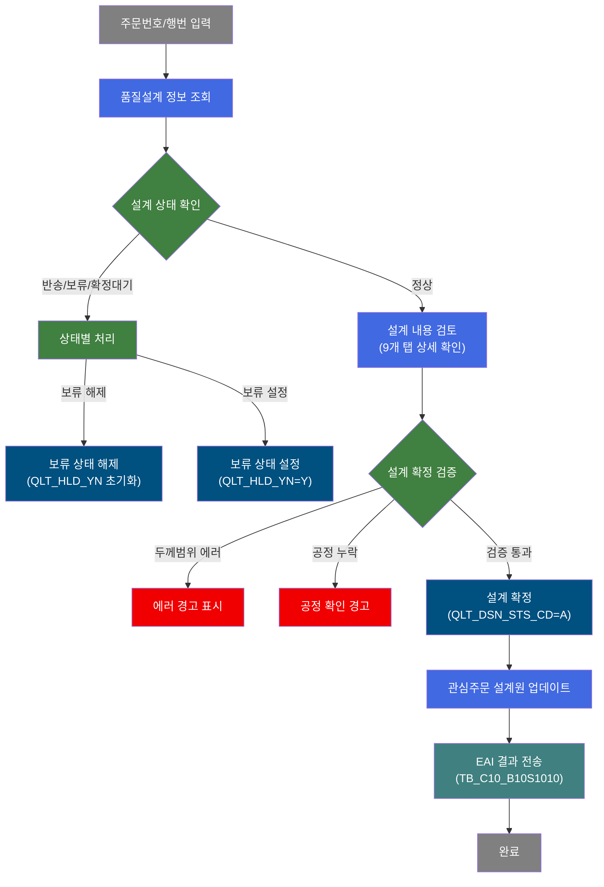
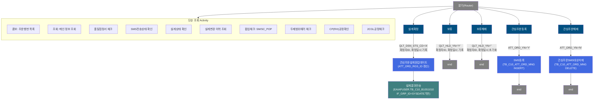
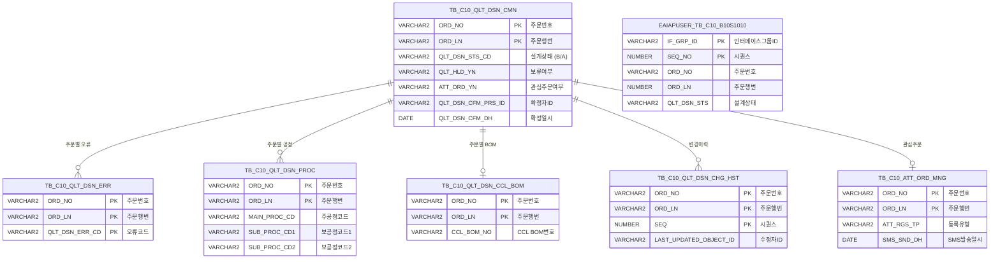

<h1 style="font-size: 40px; text-align: center; font-weight:
   bold; margin: 30px 0;">
  C104000020 레거시 시스템 분석 종합 보고서
</h1>


# 1. 시스템 개요
- **서비스 ID**: C104000020
- **업무명**: 품질설계결과 Main
- **분석 일시**: 2026-03-16 19:29 KST
- **전체 Activity 수**: 20개 (Built-in 20, Custom 0)
- **분석자**: Claude Opus 4.6
- **분석 도구**: /analyze-service C104000020
- **문서 버전**: 1.0

# 📊 비즈니스 프로세스 분석

## 시스템 목적

C104000020은 철강 제품의 **품질설계 결과를 조회, 검증, 확정**하는 핵심 화면이다. 품질설계원이 주문번호(ORD_NO)와 주문행번(ORD_LN)을 기준으로 해당 주문의 품질설계 상세 정보(공통, 재질, 인수도, 도금제조표준, 후공정제조표준, 칼라제조사양, 통과공정, 성분)를 9개 탭에서 종합적으로 확인하고, 설계 확정/보류/보류해제 등의 상태 변경을 수행한다.

또한 관심주문 관리 기능을 통해 특정 주문을 관심 대상으로 등록/해제하고, SMS 전송 대상으로 관리할 수 있다. 설계 확정 시에는 제품 두께 범위 에러 체크, 공정 코드(CP/RH, 2CGL) 검증, 위탁임가공 여부, KISS CUTTING 여부, Sheet Edge 코드 확인 등 다단계 유효성 검증을 거친 후 EAI 인터페이스 테이블에 확정 결과를 전송하여 외부 시스템과 연동한다.

## 핵심 워크플로우 다이어그램



### 상세 워크플로우 다이어그램



## 주요 유즈케이스

### UC-01: 품질설계 결과 조회
- **Actor**: 품질설계원
- **목적**: 주문번호/행번 기준으로 품질설계 상세 정보를 9개 탭에서 종합 확인
- **전제조건**:
  - 사용자가 시스템에 로그인되어 있음
  - 해당 주문의 품질설계 데이터가 TB_C10_QLT_DSN_CMN에 존재함
- **주요 흐름**:
  1. 사용자가 주문번호(ORD_NO)를 입력 → ORD_LN 콤보박스 자동 로딩 (C104000020.combo)
  2. 주문행번(ORD_LN) 선택 후 조회 버튼 클릭
  3. Form_2에 주문 상세정보 표시 (C104000020.select): 최종수요가, 규격약호, 주문Size, 고객사양명, 품명, 용도, 재질, BOM, Brand 등
  4. 공통 탭(C104000020TAB01) 자동 로딩
  5. 품질설계대상(QLT_DSN_YN=Y) 시 다른 탭 선택 가능 (동적 href 세팅)
- **대체 흐름**:
  - ORD_NO 미입력 시: "주문번호를 입력하세요" 알림
  - 조회 결과 없음 시: 빈 화면 표시
- **후행조건**:
  - 품질설계 상세정보가 화면에 표시됨
  - 설계확정/보류/관심주문 등 후속 작업 수행 가능 상태

### UC-02: 품질설계 확정
- **Actor**: 품질설계원
- **목적**: 검토 완료된 품질설계를 확정 처리하고 EAI를 통해 외부 시스템에 결과 전송
- **전제조건**:
  - UC-01에 의해 품질설계 정보가 조회된 상태
  - 설계 상태가 반송/보류/확정대기가 아닌 상태 (QLT_DSN_STS_CD != 'B', ORD_BAK_SND_TP != 'R', QLT_HLD_YN != 'Y')
- **주요 흐름**:
  1. 사용자가 "설계확정" 버튼 클릭
  2. 다단계 유효성 검증 수행:
     - 제품두께범위 초과 확인 (C104000020.ERRselect → NO_THK 값)
     - 설계상태 확인 (C104000020.STSselect)
     - BOM US**** → CP(RH)공정 필수 확인 (C104000020.PROCselect)
     - BOM J***** → #2CGL 원판 불가 확인 (C104000020.PROCselect1)
     - 설계내용 수정자=로그인자 동일 확인 (C104000020.MODselect, 품명코드 G/L/V/W만)
  3. 조건부 팝업 처리:
     - 위탁임가공(TRST_PROC_YN=Y) → POP03 팝업
     - 프로젝트수주(PRJ_YN=X) → POP04 팝업
     - KISS CUTTING(KISS_CUT_YN=Y, 위탁 아닌 경우) → POP05 팝업
     - Sheet Edge M코드/C코드 확인 → SM_POP/SC_POP 팝업
  4. 모든 검증 통과 시 설계확정 처리 (C104000020.update → QLT_DSN_STS_CD='A')
  5. 관심주문 설계원 업데이트 (C104000020.AttSmsupdate)
  6. EAI 인터페이스 전송 (C104000020.IFinsert → EAIAPUSER.TB_C10_B10S1010)
- **대체 흐름**:
  - 두께범위 에러 시: "제품두께가 규격범위를 초과합니다" 경고
  - 설계상태 부적합 시: "반송/보류/확정대기 상태입니다" 차단
  - CP공정 미포함 시: "CP(RH) 공정이 필요합니다" 경고
- **후행조건**:
  - TB_C10_QLT_DSN_CMN의 QLT_DSN_STS_CD = 'A', 확정자ID/확정일시 기록
  - EAIAPUSER.TB_C10_B10S1010에 인터페이스 데이터 적재

### UC-03: 품질설계 보류/보류해제
- **Actor**: 품질설계원
- **목적**: 추가 검토가 필요한 품질설계를 보류 처리하거나 보류 상태를 해제
- **전제조건**:
  - UC-01에 의해 품질설계 정보가 조회된 상태
- **주요 흐름 (보류)**:
  1. 사용자가 "보류" 버튼 클릭
  2. 설계상태 확인 (C104000020.STSselect)
  3. 보류 처리 (C104000020.update1 → QLT_HLD_YN='Y', 확정자ID/확정일시 기록)
- **주요 흐름 (보류해제)**:
  1. 사용자가 "보류해제" 버튼 클릭
  2. 보류 해제 (C104000020.update2 → QLT_HLD_YN='', 확정자ID/확정일시 초기화)
- **대체 흐름**:
  - 보류 시 상태 부적합: "반송/보류/확정대기 상태입니다" 차단
- **후행조건**:
  - 보류: QLT_HLD_YN='Y' 설정, 확정자 정보 기록
  - 보류해제: QLT_HLD_YN='' 초기화, 확정 정보 초기화

### UC-04: 관심주문 등록/해제
- **Actor**: 품질설계원
- **목적**: 특별 관심이 필요한 주문을 관심주문으로 등록하거나 해제하여 SMS 알림 대상 관리
- **전제조건**:
  - UC-01에 의해 품질설계 정보가 조회된 상태
- **주요 흐름 (등록)**:
  1. 사용자가 "등록" 버튼 클릭
  2. ATT_ORD_YN=Y 이미 등록 상태면 "이미 관심주문입니다" 차단
  3. 관심주문 등록 (C104000020.update3 → ATT_ORD_YN='Y')
  4. SMS 전송대상 등록 (C104000020.AttOrdInsert → TB_C10_ATT_ORD_MNG INSERT)
- **주요 흐름 (해제)**:
  1. 사용자가 "관심해제" 버튼 클릭
  2. ATT_ORD_YN=N 이미 해제 상태면 차단
  3. SMS 전송이력/수동등록 확인 (C104000020.SMSselect)
  4. SMS 이력 있으면 해제 차단
  5. 관심주문 해제 (C104000020.update4 → ATT_ORD_YN='N')
  6. SMS 대상 삭제 (C104000020.AttOrdDelete → TB_C10_ATT_ORD_MNG DELETE)
- **후행조건**:
  - 등록: ATT_ORD_YN='Y', SMS 대상 레코드 생성
  - 해제: ATT_ORD_YN='N', SMS 대상 레코드 삭제

### UC-05: 외부 화면 연동 (BOM/이미지/코드사용/품질협정서)
- **Actor**: 품질설계원
- **목적**: 품질설계 관련 BOM, 이미지, 코드사용, 품질협정서 정보를 연관 화면에서 확인
- **전제조건**:
  - UC-01에 의해 품질설계 정보가 조회된 상태
- **주요 흐름**:
  1. BOM 버튼 클릭 → C106000060 (BOM 조회) 탭 오픈 (CCL_BOM_NO 앞 5자리)
  2. 이미지 버튼 클릭 → BOM 첫글자 J이면 C106000140, 아니면 C106000100 탭 오픈
  3. 코드사용 버튼 클릭 → C106000090 (코드사용) 탭 오픈
  4. 품질협정서 링크 클릭 → M205010010 (품질협정서) 탭 오픈 (FNL_CUS_CD, CUS_CD, ACT_CUS_CD, CUS_SPC_TP_CD=3)

---
## 비즈니스 로직 상세

### 1. 두께범위 에러 판별 로직

- **목적**: 품질설계 오류 코드 중 CF80/CF81(두께 관련)과 그 외 에러의 발생 건수 차이를 계산하여 두께범위 초과 여부 판단
- **처리 케이스**:

  **[케이스 1: 두께범위 에러 존재]**
  ```
    조건: NO_THK > 0
    처리:
      1. TB_C10_QLT_DSN_ERR과 TB_C10_QLT_DSN_CMN을 주문번호/행번으로 JOIN
      2. DECODE로 CF80, CF81 코드 건수 합산
      3. CF80/CF81 건수 합 - 그 외 에러 건수 합 = NO_THK
      4. NO_THK > 0이면 "제품두께범위 초과" 경고 표시
  ```

- **계산 공식**:
  ```
  NO_THK = SUM(DECODE(QLT_DSN_ERR_CD,'CF80',1,'CF81',1,0))
         - SUM(DECODE(QLT_DSN_ERR_CD,'CF80',0,'CF81',0,1))

  해석:
  - CF80/CF81 에러만 있고 다른 에러가 없으면 NO_THK > 0 → 두께 에러
  - CF80/CF81 외 다른 에러도 있으면 NO_THK 감소
  ```

### 2. Sheet Edge 팝업 조건 판별 (SM_POP/SC_POP)

- **목적**: 제품 유형과 Edge 코드, 통과공정 조합으로 특수 팝업 필요 여부 결정
- **처리 케이스**:

  **[케이스 1: SM_POP (Sheet Edge M코드)]**
  ```
    조건: 제품이 STRIP 유형이고 Edge가 'M'인 경우
    처리:
      1. TB_C10_QLT_DSN_CMN에서 제품 유형 확인
      2. Edge 코드 'M' 존재 여부 COUNT
      3. SM_POP = COUNT > 0 이면 'Y', 아니면 'N'
  ```

  **[케이스 2: SC_POP (Sheet Edge C코드+공정 72/77)]**
  ```
    조건: Edge가 'C'이고 공정코드 72 또는 77이 없는 경우
    처리:
      1. SC_POP1 = 공정 72/77 포함 건수
      2. SC_POP2 = Edge 'C' 건수
      3. SC_POP = SC_POP1=0 AND SC_POP2>0 이면 'Y'
      → Edge C인데 해당 공정이 없으면 팝업 필요
  ```

### 3. 설계확정 체인 처리

- **목적**: 설계확정 → 관심주문 설계원 업데이트 → EAI 전송까지 3단계 체인 처리
- **처리 케이스**:

  **[설계확정 3단계 체인]**
  ```
    처리:
      1. C104000020.update: QLT_DSN_STS_CD='A', 확정자ID(ObjectId), 확정일시(SYSDATE) 기록
      2. C104000020.AttSmsupdate: TB_C10_ATT_ORD_MNG의 ATT_ORD_RGS_ID 갱신
      3. C104000020.IFinsert: EAIAPUSER.TB_C10_B10S1010에 인터페이스 레코드 생성
         - IF_GRP_ID = TO_CHAR(SYSDATE, 'YYYYMMDDHH24MISSSSS')
         - SEQ_NO = SQ_C10_B10S1010.NEXTVAL
         - XSEQ='1', XCRUD='C', XSTAT='R'
         - QLT_DSN_STS='A', QLT_DSN_MSG='B'
  ```

### 4. 설계 변경자 확인 로직

- **목적**: 설계확정 시 마지막 수정자가 현재 로그인 사용자와 동일한지 검증 (품명코드 G/L/V/W에 해당하는 경우만)
- **처리 케이스**:

  **[케이스 1: 수정자 불일치 차단]**
  ```
    조건: 품명코드가 G, L, V, W 중 하나이고, C104000020TAB05 탭의 최종 변경자 != 로그인자
    처리:
      1. TB_C10_QLT_DSN_CHG_HST에서 MAX(SEQ) 시퀀스의 LAST_UPDATED_OBJECT_ID 조회
      2. 조회된 수정자ID와 로그인자 비교
      3. 불일치 시 설계확정 차단
  ```

---

# 💾 데이터 요구사항

## 핵심 테이블

### 1. TB_C10_QLT_DSN_CMN - (품질설계 공통 마스터)
| 컬럼명 | 타입 | PK | 설명 |
|--------|------|----|-----|
| ORD_NO | VARCHAR2 | ✅ | 주문번호 |
| ORD_LN | VARCHAR2 | ✅ | 주문행번 |
| QLT_DSN_STS_CD | VARCHAR2 |  | 품질설계 상태코드 (B:미확정, A:확정) |
| QLT_HLD_YN | VARCHAR2 |  | 보류 여부 (Y/N) |
| ATT_ORD_YN | VARCHAR2 |  | 관심주문 여부 (Y/N) |
| ORD_BAK_SND_TP | VARCHAR2 |  | 주문반송유형 (R:반송) |
| QLT_DSN_CFM_PRS_ID | VARCHAR2 |  | 품질설계 확정자 ID |
| QLT_DSN_CFM_DH | DATE |  | 품질설계 확정 일시 |
| FNL_CUS_CD | VARCHAR2 |  | 최종수요가 코드 |
| CUS_CD | VARCHAR2 |  | 고객사 코드 |
| ACT_CUS_CD | VARCHAR2 |  | 수요가 고객사 코드 |
| SPC_AVR | VARCHAR2 |  | 규격약호 |
| ORD_EXC_THK | VARCHAR2 |  | 주문두께 |
| ORD_EXC_WTH | VARCHAR2 |  | 주문폭 |
| ORD_EXC_LTH | VARCHAR2 |  | 주문길이 |
| PRD_NM_CD | VARCHAR2 |  | 품명코드 |
| ORD_USG_CD | VARCHAR2 |  | 주문용도코드 |
| MQL_CD | VARCHAR2 |  | 재질코드 |
| TRST_PROC_YN | VARCHAR2 |  | 위탁임가공 여부 |
| PRJ_YN | VARCHAR2 |  | 프로젝트수주 여부 (X:해당) |
| KISS_CUT_YN | VARCHAR2 |  | KISS CUTTING 여부 |
| LAST_UPDATED_OBJECT_TYPE | VARCHAR2 |  | 최종 수정 객체 타입 |
| LAST_UPDATED_OBJECT_ID | VARCHAR2 |  | 최종 수정자 ID |
| LAST_UPDATE_PROGRAM_ID | VARCHAR2 |  | 최종 수정 프로그램 ID |
| LAST_UPDATE_TIMESTAMP | TIMESTAMP |  | 최종 수정 일시 |

### 2. TB_C10_QLT_DSN_ERR - (품질설계 오류)
| 컬럼명 | 타입 | PK | 설명 |
|--------|------|----|-----|
| ORD_NO | VARCHAR2 | ✅ | 주문번호 |
| ORD_LN | VARCHAR2 | ✅ | 주문행번 |
| QLT_DSN_ERR_CD | VARCHAR2 | ✅ | 품질설계 오류코드 (CF80, CF81 등) |

### 3. TB_C10_QLT_DSN_PROC - (품질설계 공정)
| 컬럼명 | 타입 | PK | 설명 |
|--------|------|----|-----|
| ORD_NO | VARCHAR2 | ✅ | 주문번호 |
| ORD_LN | VARCHAR2 | ✅ | 주문행번 |
| MAIN_PROC_CD | VARCHAR2 |  | 주공정 코드 |
| SUB_PROC_CD1 | VARCHAR2 |  | 보공정 코드1 |
| SUB_PROC_CD2 | VARCHAR2 |  | 보공정 코드2 |

### 4. TB_C10_QLT_DSN_CCL_BOM - (품질설계 CCL BOM)
| 컬럼명 | 타입 | PK | 설명 |
|--------|------|----|-----|
| ORD_NO | VARCHAR2 | ✅ | 주문번호 |
| ORD_LN | VARCHAR2 | ✅ | 주문행번 |
| CCL_BOM_NO | VARCHAR2 |  | CCL BOM 번호 |

### 5. TB_C10_QLT_DSN_CHG_HST - (품질설계 변경이력)
| 컬럼명 | 타입 | PK | 설명 |
|--------|------|----|-----|
| ORD_NO | VARCHAR2 | ✅ | 주문번호 |
| ORD_LN | VARCHAR2 | ✅ | 주문행번 |
| SEQ | NUMBER | ✅ | 시퀀스 번호 |
| LAST_UPDATED_OBJECT_ID | VARCHAR2 |  | 최종 수정자 ID |

### 6. TB_C10_ATT_ORD_MNG - (관심주문 관리)
| 컬럼명 | 타입 | PK | 설명 |
|--------|------|----|-----|
| ORD_NO | VARCHAR2 | ✅ | 주문번호 |
| ORD_LN | VARCHAR2 | ✅ | 주문행번 |
| ATT_RGS_TP | VARCHAR2 |  | 등록유형 (M:수동) |
| ATT_ORD_RGS_ID | VARCHAR2 |  | 관심주문 등록자 ID |
| SMS_SND_DH | DATE |  | SMS 발송 일시 |

### 7. EAIAPUSER.TB_C10_B10S1010 - (EAI 인터페이스)
| 컬럼명 | 타입 | PK | 설명 |
|--------|------|----|-----|
| IF_GRP_ID | VARCHAR2 | ✅ | 인터페이스 그룹ID (SYSDATE기반) |
| SEQ_NO | NUMBER | ✅ | 시퀀스 (SQ_C10_B10S1010) |
| XSEQ | VARCHAR2 |  | 고정값 '1' |
| XCRUD | VARCHAR2 |  | CRUD 유형 ('C':생성) |
| XSTAT | VARCHAR2 |  | 상태 ('R':Ready) |
| ORD_NO | VARCHAR2 |  | 주문번호 |
| ORD_LN | NUMBER |  | 주문행번 |
| QLT_DSN_STS | VARCHAR2 |  | 품질설계상태 ('A':확정) |
| QLT_DSN_MSG | VARCHAR2 |  | 메시지 ('B') |

### 8. TB_M20_QLTIV_CUS_SQ - (품질협정서 고객)
| 컬럼명 | 타입 | PK | 설명 |
|--------|------|----|-----|
| CUS_CD | VARCHAR2 | ✅ | 고객사 코드 |
| CUS_SPC_TP_CD | VARCHAR2 | ✅ | 고객사양유형코드 (3:품질협정서) |

## 데이터 플로우

### 1. 조회

```
[주문번호 입력 → 행번 콤보 로딩]
ORD_NO 입력
→ C104000020.combo
  FROM TB_C10_QLT_DSN_CMN
  WHERE ORD_NO = :ORD_NO
→ ORD_LN 콤보박스에 목록 표시

[메인 정보 조회]
ORD_NO + ORD_LN 선택 후 조회
→ C104000020.select
  FROM C10APUSER.TB_C10_QLT_DSN_CMN A
  LEFT OUTER JOIN C10APUSER.TB_C10_QLT_DSN_CCL_BOM B
    ON A.ORD_NO = B.ORD_NO(+) AND A.ORD_LN = B.ORD_LN(+)
  + 스칼라 서브쿼리: M00APUSER.VI_M00_CODE_ACCESS (코드명 변환)
  + 스칼라 서브쿼리: M00APUSER.VI_M00_C10A1020 (마스터 참조)
  + 스칼라 서브쿼리: TB_C10_QLT_DSN_CHG_HST (최종 변경자)
  WHERE A.ORD_NO = :ORD_NO AND A.ORD_LN = :ORD_LN
→ Form_2에 종합 정보 표시

[품질협정서 존재 확인]
→ C104000020.QLTselect
  FROM TB_M20_QLTIV_CUS_SQ
  WHERE CUS_SPC_TP_CD = '3'
    AND CUS_CD IN (:CUS_CD, :FNL_CUS_CD, :ACT_CUS_CD)
→ QLT_CNT > 0 이면 품질협정서 링크 활성화
```

### 2. 설계확정

```
[유효성 검증 체인]
1) C104000020.ERRselect → NO_THK 확인 (두께범위)
2) C104000020.STSselect → 설계상태 확인
3) C104000020.PROCselect → CP공정 확인 (BOM US****)
4) C104000020.PROCselect1 → 공정82 확인 (BOM J*****)
5) C104000020.MODselect → 수정자 확인
6) C104000020.POPselect → SM_POP/SC_POP 확인

[확정 처리 체인]
→ C104000020.update
  UPDATE TB_C10_QLT_DSN_CMN
  SET QLT_DSN_STS_CD = 'A',
      QLT_DSN_CFM_PRS_ID = :ObjectId,
      QLT_DSN_CFM_DH = SYSDATE
  WHERE ORD_NO = :ORD_NO AND ORD_LN = :ORD_LN

→ C104000020.AttSmsupdate
  UPDATE TB_C10_ATT_ORD_MNG
  SET ATT_ORD_RGS_ID = :ObjectId
  WHERE ORD_NO = :ORD_NO AND ORD_LN = :ORD_LN

→ C104000020.IFinsert
  INSERT INTO EAIAPUSER.TB_C10_B10S1010
  (IF_GRP_ID, SEQ_NO, XSEQ, XCRUD, XSTAT, ORD_NO, ORD_LN, QLT_DSN_STS, QLT_DSN_MSG, ...)
→ 외부 시스템 연동 완료
```

### 3. 관심주문 등록/해제

```
[관심주문 등록]
→ C104000020.update3
  UPDATE TB_C10_QLT_DSN_CMN SET ATT_ORD_YN = 'Y'
  WHERE ORD_NO = :ORD_NO AND ORD_LN = :ORD_LN
→ C104000020.AttOrdInsert
  INSERT INTO C10APUSER.TB_C10_ATT_ORD_MNG (ORD_NO, ORD_LN, ...)
→ SMS 대상 등록 완료

[관심주문 해제]
→ C104000020.SMSselect (SMS 이력 확인)
→ C104000020.update4
  UPDATE TB_C10_QLT_DSN_CMN SET ATT_ORD_YN = 'N'
  WHERE ORD_NO = :ORD_NO AND ORD_LN = :ORD_LN
→ C104000020.AttOrdDelete
  DELETE FROM C10APUSER.TB_C10_ATT_ORD_MNG
  WHERE ORD_NO = :ORD_NO AND ORD_LN = :ORD_LN
→ SMS 대상 삭제 완료
```

## SQL 일람표

| SQL 이름 | 쿼리 ID | 타입 | 출처 | 테이블 |
|---------|---------|-----|-------|-------|
| 두께범위에러 조회 | C104000020.ERRselect | SELECT | Service | TB_C10_QLT_DSN_ERR, TB_C10_QLT_DSN_CMN |
| 설계상태 조회 | C104000020.STSselect | SELECT | Service | TB_C10_QLT_DSN_CMN |
| 주문행번 콤보 | C104000020.combo | SELECT | Service | TB_C10_QLT_DSN_CMN |
| 팝업조건 조회 | C104000020.POPselect | SELECT | Service | TB_C10_QLT_DSN_CMN, TB_C10_QLT_DSN_PROC |
| 설계변경 이력 | C104000020.MODselect | SELECT | Service | TB_C10_QLT_DSN_CHG_HST |
| 2CGL공정체크 | C104000020.PROCselect1 | SELECT | Service | TB_C10_QLT_DSN_PROC |
| 메인 조회 | C104000020.select | SELECT | Service | TB_C10_QLT_DSN_CMN, TB_C10_QLT_DSN_CCL_BOM, VI_M00_CODE_ACCESS, VI_M00_C10A1020, TB_C10_QLT_DSN_CHG_HST |
| 품질협정서 조회 | C104000020.QLTselect | SELECT | Service | TB_M20_QLTIV_CUS_SQ |
| CP공정 확인 | C104000020.PROCselect | SELECT | Service | TB_C10_QLT_DSN_PROC |
| SMS전송상태 | C104000020.SMSselect | SELECT | Service | TB_C10_ATT_ORD_MNG |
| 관심주문 해제 | C104000020.update4 | UPDATE | Service | TB_C10_QLT_DSN_CMN |
| 설계확정 | C104000020.update | UPDATE | Service | TB_C10_QLT_DSN_CMN |
| EAI 전송 | C104000020.IFinsert | INSERT | Service | EAIAPUSER.TB_C10_B10S1010 |
| SMS대상 등록 | C104000020.AttOrdInsert | INSERT | Service | TB_C10_ATT_ORD_MNG |
| 관심주문 설계원 갱신 | C104000020.AttSmsupdate | UPDATE | Service | TB_C10_ATT_ORD_MNG |
| 관심주문 등록 | C104000020.update3 | UPDATE | Service | TB_C10_QLT_DSN_CMN |
| 보류해제 | C104000020.update2 | UPDATE | Service | TB_C10_QLT_DSN_CMN |
| 보류 | C104000020.update1 | UPDATE | Service | TB_C10_QLT_DSN_CMN |
| SMS대상 삭제 | C104000020.AttOrdDelete | DELETE | Service | TB_C10_ATT_ORD_MNG |

## ER 다이어그램 (핵심 관계)



관계 설명:
- **TB_C10_QLT_DSN_CMN**이 중심 테이블로 모든 관계의 허브 역할 (PK: ORD_NO + ORD_LN)
- **TB_C10_QLT_DSN_ERR**: 주문별 품질설계 오류코드 다건 관리 (1:N)
- **TB_C10_QLT_DSN_PROC**: 주문별 통과공정 정보 (1:N)
- **TB_C10_QLT_DSN_CCL_BOM**: 주문별 CCL BOM 정보 (1:0..1, LEFT JOIN)
- **TB_C10_QLT_DSN_CHG_HST**: 주문별 변경이력 시퀀스 관리 (1:N)
- **TB_C10_ATT_ORD_MNG**: 관심주문 SMS 관리 (1:0..1)
- **EAIAPUSER.TB_C10_B10S1010**: 설계확정 시 EAI 인터페이스 데이터 적재 (독립)

---

# 🖥️ 사용자 인터페이스 요구사항

## 화면 레이아웃 상세

### Layout 구조 (Flat - 절대 위치)
```javascript
{
  type: "flat",
  description: "splitter 없음, div 절대 위치로 구성",
  components: [
    {
      id: "C104000020_Form_1",
      type: "form",
      position: {left: "0px", top: "1px", width: "981px", height: "28px"},
      description: "검색/버튼 영역 (상단 1행)"
    },
    {
      id: "C104000020_Form_2",
      type: "form",
      position: {left: "0px", top: "29px", width: "981px", height: "60px"},
      description: "주문 상세정보 표시 영역 (상단 2~3행, 읽기전용)"
    },
    {
      id: "C104000020_Tabbar_1",
      type: "tabbar",
      position: {left: "1px", top: "114px", width: "979px", height: "479px"},
      description: "탭바 영역 (하단, 9개 탭)"
    }
  ]
}
```

## 입출력 요소

### Form 컴포넌트

**C104000020_Form_1 (검색/액션 버튼)**
- ORD_NO: input - 주문번호 (75px, 최대 10자, 배경색 #FFFFC0, 대문자 자동변환)
- ORD_LN: combo - 주문행번 (50px, 동적 로딩: OrdlnComboData.do)
- TRST_PROC_YN: input - 위탁주문 (20px, 읽기전용, 빨간굵은글씨)
- holdy: custombutton - "보류" → holdy 이벤트
- holdn: custombutton - "보류해제" → holdn 이벤트
- ATT_ORD_YN: input - 관심주문 (20px, 읽기전용, 빨간굵은글씨)
- atty: custombutton - "등록" → atty 이벤트 (관심주문 등록)
- attn: custombutton - "관심해제" → attn 이벤트
- tag_popup: custombutton - "Tag조회" → tag_popup 이벤트 (초기 disabled)
- custom_call: linkbutton - "품질협정서" → custom_call 이벤트 (초록굵은글씨)
- save: custombutton - "설계확정" → save 이벤트 (초기 disabled)
- find: button - "조회" → find 이벤트 (초기 disabled)
- winClose: button - "닫기" → winClose 이벤트

**C104000020_Form_2 (주문 상세정보 - 읽기전용 3행)**

행 1:
- FNL_CUS_CD: input - 최종수요가 (63px 라벨, 160px 입력, 읽기전용)
- SPC_AVR: input - 규격약호 (50px 라벨, 100px 입력, 읽기전용)
- ORD_EXC_THK: input - 주문Size T (50px 라벨, 50px 입력, 우측정렬, 읽기전용)
- ORD_EXC_WTH: input - W (50px 입력, 우측정렬, 읽기전용)
- ORD_EXC_LTH: input - L (50px 입력, 우측정렬, 읽기전용)
- CUS_BTH_NM: input - 고객사양명 (70px 라벨, 140px 입력, 읽기전용)
- PRJ_QLT_MNG_YN: checkbox - PRJ (PRJ_YN=X 시 체크/빨간색 표시)
- PRJ_YN: hidden

행 2:
- PRD_NM_CD: input - 품명 (30px 라벨, 60px 입력, 읽기전용)
- ORD_USG_CD: input - 용도 (30px 라벨, 320px 입력, 읽기전용)
- MQL_CD: input - 재질/원자재 (70px 라벨, 90px 입력, 읽기전용)
- RMTL_CD: input - (140px 입력, 읽기전용)
- MOD_USER_NM: input - 수정설계원 (65px 라벨, 60px 입력, 읽기전용)
- CUS_CD, ACT_CUS_CD, TRST_PROC_YN, ATT_ORD_YN, MOD_ID, MOD_PGM, CUS_CD_ORG, ACT_CUS_CD_ORG, FNL_CUS_CD_ORG, PRD_NM_CD_ORG, PLTCM_SET_THK_LNK_TP, KISS_CUT_YN: hidden

행 3:
- RSN_TP_QT_BR_FRN: input - 품질수지(T/B) 앞면 (90px 라벨, 150px 입력, 읽기전용)
- RSN_TP_QT_BR_BAK: input - 뒷면 (150px 입력, 읽기전용)
- LUXTEEL_BRD_CD: input - Brand (40px 라벨, 200px 입력, 읽기전용)
- CCL_BOM_NO: input - BOM (30px 라벨, 50px 입력, 읽기전용)
- BOM_LNK: linkbutton - "BOM" (60px) → openBom 이벤트
- COR_IMG: linkbutton - "이미지" (60px) → openColImg 이벤트
- CD_USG: linkbutton - "코드사용" (70px) → openCdUsg 이벤트

### Tabbar 컴포넌트

**C104000020_Tabbar_1 (9개 탭, iframes 모드)**
- C104000020TAB01: 공통 (100px, 기본 선택, 초기 로딩)
- C104000020TAB03: 재질 (90px, QLT_DSN_YN=Y 시 동적 로딩)
- C104000020TAB04: 인수도 (90px, QLT_DSN_YN=Y 시 동적 로딩)
- C104000020TAB05: 용융도금-제조표준 (120px, QLT_DSN_YN=Y 시 동적 로딩)
- C104000020TAB06: 전기도금-제조표준 (120px, QLT_DSN_YN=Y 시 동적 로딩)
- C104000020TAB09: 후공정-제조표준 (110px, QLT_DSN_YN=Y 시 동적 로딩)
- C104000020TAB07: 칼라제조사양 (100px, colorTabOpen=Y 시 자동 활성화)
- C104000020TAB08: 통과공정 (100px, QLT_DSN_YN=Y 시 동적 로딩)
- C104000020TAB02: 성분 (90px, QLT_DSN_YN=Y 시 동적 로딩)

탭 선택 규칙: TAB01 제외 탭 클릭 시 QLT_DSN_YN=Y 확인 후 동적 href 세팅 (tabID + '.jsp?pageID=C104000020')

## 화면 동작 흐름

### 1. 화면 초기 로딩
```
1. 화면 진입 (팝업 또는 탭으로 오픈)
2. C104000020_Form_1 초기화 (XLE 이벤트)
   - 파라미터에서 ORD_NO 세팅
   - OrdlnComboData.do 호출하여 ORD_LN 콤보 로딩
   - ORD_NO 입력 필드에 대문자 변환 처리 적용
3. C104000020_Tabbar_1 초기화
   - TAB01(공통) 기본 선택
   - colorTabOpen=Y 이면 TAB07(칼라제조사양) 자동 활성화
4. 파라미터로 ORD_NO, ORD_LN이 전달된 경우 자동 조회
5. 설계확정/조회/Tag조회 버튼 초기 disabled
```

### 2. 품질설계 정보 조회
```
1. 사용자가 ORD_NO 입력 (대문자 자동 변환)
2. ORD_NO 변경 시 onChange 이벤트 → OrdlnComboData.do 재호출
3. ORD_LN 콤보에서 행번 선택
4. 조회(find) 버튼 클릭
5. 유효성 검증: ORD_NO/ORD_LN 필수 확인
6. uiCommon.parameters6으로 URL 구성
7. items['C104000020_Form_2'].loadData(findUrl, findMessage)
8. Form_2 로딩 완료 시 onFormLoadEvent2:
   - setTrstProcYn: 위탁임가공 값 Form_1에 동기화
   - setQltYn: 품질협정서 여부 확인 (C104000020.QLTselect → QLT_CNT)
   - readOnly 배경색 설정
9. 활성 탭의 find 함수 호출
10. prjQltChk: PRJ_YN=X이면 체크박스 체크+빨간색, 아니면 해제+검정색
```

### 3. 설계확정 처리
```
1. 사용자가 "설계확정" 버튼 클릭
2. 8개 AJAX 검증 순차 수행 (c10AjaxData.do):
   - ERR_find → NO_THK 두께범위 체크
   - STS_find → 설계상태 체크
   - PROC_find → CP(RH)공정 (BOM US****)
   - PROC_find1 → 2CGL공정 (BOM J*****)
   - MOD_find → 수정자 확인 (품명 G/L/V/W)
   - POP_find → SM_POP/SC_POP 팝업 조건
3. 조건부 팝업:
   - TRST_PROC_YN=Y → POP03 (349x174, 위탁임가공 확인)
   - PRJ_YN=X → POP04 (600x400, 프로젝트주문 확인)
   - KISS_CUT_YN=Y → POP05 (600x500, KISS CUTTING 확인)
4. handleDataProcess.do 호출 (action=save)
5. 완료 후 onAfterUpdateFinishEvent → dataProcessor 'inserted' 리셋 → find() 재호출
```

### 4. 관심주문 등록/해제
```
[등록]
1. "등록" 버튼 클릭
2. ATT_ORD_YN=Y 이면 "이미 관심주문입니다" alert
3. handleDataProcess.do 호출 (action=atty)
4. 완료 후 find() 재호출

[해제]
1. "관심해제" 버튼 클릭
2. ATT_ORD_YN=N 이면 "이미 해제 상태" alert
3. SMS_find → SMS 이력 확인
4. SMS 발송이력 또는 수동등록(ATT_RGS_TP='M') 있으면 해제 차단
5. handleDataProcess.do 호출 (action=attn)
6. 완료 후 find() 재호출
```

### 5. 외부 화면 연동
```
[BOM 조회]
1. BOM 링크버튼 클릭
2. CCL_BOM_NO 앞 5자리 추출
3. parent.newRemoveOpenTab('C106000060', 'CCL_BOM_NO=...')

[이미지 조회]
1. 이미지 링크버튼 클릭
2. BOM 첫글자 = 'J' → C106000140, 아니면 → C106000100
3. parent.newRemoveOpenTab(targetId, 'CCL_BOM_NO=...')

[품질협정서]
1. 품질협정서 링크버튼 클릭
2. FNL_CUS_CD + CUS_CD + ACT_CUS_CD 파라미터 조합
3. CUS_SPC_TP_CD=3 고정
4. parent.newRemoveOpenTab('M205010010', vUrl)
```

## JavaScript 모듈

**C104000020.jsp (메인 화면 스크립트 - 인라인)**
- find(): 품질설계 조회 (uiCommon.parameters6으로 URL 구성 → Form_2 loadData → 활성 탭 find 호출)
- save(): 설계확정 (8개 AJAX 검증 → 조건부 팝업 → handleDataProcess.do 제출)
- holdy(): 보류 설정 (STS_find 검증 → handleDataProcess.do 제출)
- holdn(): 보류해제 (handleDataProcess.do 제출)
- atty(): 관심주문 등록 (ATT_ORD_YN 확인 → handleDataProcess.do 제출)
- attn(): 관심주문 해제 (SMS 이력 확인 → handleDataProcess.do 제출)
- tag_popup(): Tag정보조회 팝업 (C104000020POP01.jsp, 619x505)
- custom_call(): 품질협정서 화면 연동 (M205010010 탭 오픈)
- openBom(): BOM 화면 연동 (C106000060 탭 오픈)
- openColImg(): 이미지 화면 연동 (C106000140 또는 C106000100)
- openCdUsg(): 코드사용 화면 연동 (C106000090 탭 오픈)
- winClose(): 팝업이면 winClose(), 탭이면 tabClose()
- onFormLoadEvent(): Form_1 XLE → ORD_NO 세팅, ORD_LN 콤보 로딩, 대문자 변환
- onFormLoadEvent2(): Form_2 XLE → setTrstProcYn, setQltYn, readOnly 배경색
- onChange(): Form_1 onChange → ORD_NO 변경 시 ORD_LN 콤보 재로딩
- onTabContentLoaded(): TAB01 선택 시 Form_2 재로딩
- initializeTabEvent(): 탭 onSelect → QLT_DSN_YN 확인 후 동적 href
- onTabLoadEvent(): colorTabOpen=Y → TAB07 자동 활성화
- prjQltChk(): PRJ_YN=X 체크박스 처리
- onAfterUpdateFinishEvent(): dataProcessor 리셋 후 find() 재호출
- setTrstProcYn(): 위탁임가공 값 Form_1 동기화
- setQltYn(): 품질협정서 여부 확인 (AJAX → QLT_CNT)

## 주요 이벤트 핸들러

**find (조회)**
- 이벤트 타입: Button Click
- 처리 내용:
  1. ORD_NO, ORD_LN 필수 검증
  2. uiCommon.parameters6으로 findUrl 구성
  3. Form_2.loadData(findUrl, findMessage) 호출
  4. findMessage 콜백에서 prjQltChk() 호출 (PRJ 체크)
  5. 활성 탭의 find() 함수 호출

**save (설계확정)**
- 이벤트 타입: Button Click
- 처리 내용:
  1. ORD_NO, ORD_LN 필수 검증
  2. c10AjaxData.do로 순차 검증 (ERR/STS/PROC/MOD/POP)
  3. 조건부 팝업 (POP03/POP04/POP05)
  4. handleDataProcess.do 호출 (action=save, Form_1 submit)
  5. onAfterUpdateFinishEvent → 리셋 후 find() 재호출

**onChange (주문번호 변경)**
- 이벤트 타입: Form Change
- 처리 내용:
  1. 변경된 필드가 ORD_NO인지 확인
  2. OrdlnComboData.do 호출하여 ORD_LN 콤보 재로딩
  3. 이전 데이터 초기화

**onFormLoadEvent2 (Form_2 로딩 완료)**
- 이벤트 타입: XLE (Form Load Event)
- 처리 내용:
  1. TRST_PROC_YN 값을 Form_1에 동기화 (setTrstProcYn)
  2. 품질협정서 여부 AJAX 확인 (setQltYn → QLTselect)
  3. readOnly 필드 배경색 설정
  4. ATT_ORD_YN 값 Form_1에 동기화

---

# 📌 특이사항 및 주의사항

## 1. 다단계 유효성 검증의 복잡성
- **설계확정 시 8개 AJAX 호출 순차 수행**: ERR_find, STS_find, PROC_find, PROC_find1, MOD_find, POP_find 등을 순차적으로 호출하며, 각 결과에 따라 분기 처리가 다름. BOM 코드의 접두사(US****, J*****)에 따라 검증 항목이 달라지는 복잡한 조건 분기 구조.
- **3개 조건부 팝업**: 위탁임가공(POP03), 프로젝트수주(POP04), KISS CUTTING(POP05)이 각각 독립 조건으로 팝업되며, 팝업 결과에 따른 후속 처리가 분기됨.

## 2. EAI 인터페이스 연동
- **설계확정 체인**: 설계확정(update) → 관심주문 설계원 업데이트(AttSmsupdate) → EAI 전송(IFinsert) 3단계가 하나의 트랜잭션으로 연결됨. 중간 단계 실패 시 롤백 범위에 주의 필요.
- **IF_GRP_ID 생성**: `TO_CHAR(SYSDATE, 'YYYYMMDDHH24MISSSSS')` 형식으로 밀리초까지 포함된 타임스탬프 기반 ID 생성. 동시 처리 시 중복 가능성 존재.
- **고정값 하드코딩**: XSEQ='1', XCRUD='C', XSTAT='R', QLT_DSN_STS='A', QLT_DSN_MSG='B'가 SQL에 하드코딩되어 있음.

## 3. 관심주문과 SMS 관리의 연동
- **관심주문 등록 시**: TB_C10_QLT_DSN_CMN의 ATT_ORD_YN='Y' 업데이트와 TB_C10_ATT_ORD_MNG INSERT가 체인으로 처리됨. 두 테이블 간 정합성 유지 필요.
- **관심주문 해제 제한**: SMS 발송이력(SMS_SND_DH IS NOT NULL) 또는 수동등록(ATT_RGS_TP='M')이 있는 경우 해제 불가. 이는 이미 발송된 알림의 추적성을 보장하기 위한 제약.

## 4. 탭 동적 로딩 패턴
- **품질설계대상 여부(QLT_DSN_YN)에 따른 탭 활성화**: TAB01(공통)은 항상 로딩되지만, 나머지 8개 탭은 QLT_DSN_YN=Y인 경우에만 동적으로 href가 세팅됨. 비대상 주문에서 탭 클릭 시 빈 화면 표시.
- **colorTabOpen 파라미터**: 외부에서 이 파라미터가 Y로 전달되면 TAB07(칼라제조사양)이 자동 활성화됨 (2021.02.04 추가 기능).

## 5. 품명코드별 차별화된 검증
- **수정자 확인은 품명코드 G/L/V/W에만 적용**: PRD_NM_CD가 G(강판류), L(Luxteel류), V, W인 경우에만 설계 수정자와 로그인자 동일 여부를 검증. 다른 품명코드는 이 검증을 건너뜀. 품명코드별 비즈니스 규칙 차이가 코드에 하드코딩됨.

## 6. 서비스 타입 혼합 구조
- **nui 서비스이지만 UI 존재**: 서비스 XML은 nui(배치) 타입으로 분류되나 실제 JSP 화면(C104000020.jsp)이 존재하며, 사용자 인터페이스가 포함된 구조. 이는 팝업 화면으로 호출되는 특수한 패턴으로, 다른 화면(품질설계 목록 등)에서 주문번호를 지정하여 이 화면을 팝업/탭으로 오픈함.

---

# 📚 참고 문서

- **Query SQL**: `src/query/C104000020-query.glue_sql`
- **Service XML**: `src/service/C104000020-service.xml`
- **JSP**: `WebContents/C104000020.jsp`
- **탭 JSP**: `WebContents/C104000020TAB01.jsp` ~ `C104000020TAB09.jsp`
- **팝업 JSP**: `WebContents/C104000020POP01.jsp`, `C104000020POP03.jsp`, `C104000020POP04.jsp`, `C104000020POP05.jsp`
- **UI XML**: `WebContents/header/kr/C104000020/C104000020_Form_1.xml`, `C104000020_Form_2.xml`, `C104000020_Tabbar_1.xml`
