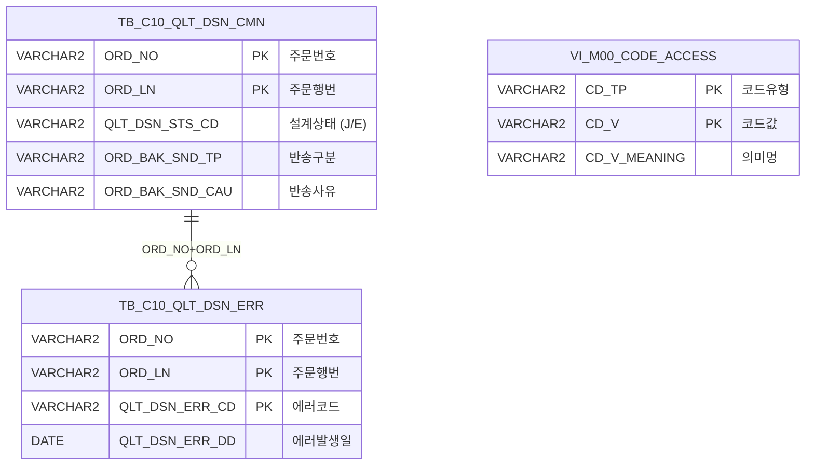

<h1 style="font-size: 40px; text-align: center; font-weight:
   bold; margin: 30px 0;">
  C104000030 레거시 시스템 분석 종합 보고서
</h1>


# 1. 시스템 개요
- **서비스 ID**: C104000030
- **업무명**: 품질설계결과 - 에러현황
- **분석 일시**: 2026-03-17 (KST)
- **전체 Activity 수**: 2개 (모두 built-in: 분기 + 조회)
- **분석자**: Claude Opus 4.6 / Sonnet (UI), Haiku (SQL)
- **분석 도구**: /analyze-service C104000030
- **문서 버전**: 1.0

# 📊 비즈니스 프로세스 분석

## 시스템 목적

C104000030은 품질설계 과정에서 발생한 에러 현황을 조회하는 단순 조회 화면이다. 주문번호, 주문행번, 에러 발생일자 범위, 반송제외 여부를 조건으로 품질설계 에러 목록을 검색한다.

품질설계 상태가 'J'(진행중) 또는 'E'(에러) 상태인 주문 중 에러가 발생한 건을 TB_C10_QLT_DSN_ERR 테이블에서 조회하고, 에러 코드에 대응하는 에러 내용(QLT_DSN_ERR_CD)과 해결방법(QLT_DSN_ERR_SOL_CD)을 M00APUSER.VI_M00_CODE_ACCESS 뷰에서 코드→의미명 변환하여 표시한다. 종결 처리된 주문(VI_MES_TRM_CTL에 'O' 타입)은 자동 제외된다.

조회 결과에서 특정 행을 더블클릭하면 해당 주문의 품질설계결과 상세 화면(C104000020)이 새 탭으로 열린다.

## 주요 유즈케이스

### UC-01: 품질설계 에러 목록 조회
- **Actor**: 품질설계 담당자
- **목적**: 에러가 발생한 품질설계 주문을 일자/주문번호 기준으로 검색하여 에러 현황 파악
- **전제조건**:
  - 사용자가 시스템에 로그인되어 있음
  - 품질설계 에러 조회 권한 보유

- **주요 흐름**:
  1. 화면 진입 시 품질설계에러일자가 기본값으로 설정됨 (현재일 -1일 ~ 현재일)
  2. 필요 시 주문번호(ORD_NO), 주문행번(ORD_LN) 입력 (선택)
  3. 필요 시 에러일자 범위 변경
  4. 반송제외 체크박스 설정 (기본: 반송제외 체크)
  5. 조회 버튼 클릭
  6. 시스템이 C104000030.select 쿼리 실행
  7. Grid에 에러 목록 표시 (주문번호, 행번, 에러코드, 에러내용, 해결방법, 에러일자)

- **대체 흐름**:
  - 주문번호/행번 입력 시: 날짜 조건이 무시되고 해당 주문의 에러만 조회 (날짜 범위가 1900-01-01 ~ 3000-12-31로 확장)
  - 주문번호 미입력 시: 반드시 에러일자 범위 조건 적용
  - 조회 결과 없음: 빈 Grid 표시 + messagebox에 메시지
  - ORD_NO 입력 시 자동 대문자 변환

- **후행조건**:
  - Grid에 에러 목록 데이터 표시
  - 행 더블클릭으로 상세 화면 이동 가능 상태

### UC-02: 에러 상세 화면 이동
- **Actor**: 품질설계 담당자
- **목적**: 에러가 발생한 주문의 품질설계 상세 화면으로 이동하여 원인 분석 및 수정
- **전제조건**:
  - UC-01 조회가 완료되어 Grid에 데이터 표시됨

- **주요 흐름**:
  1. Grid에서 에러 행 더블클릭
  2. 선택 행의 ORD_NO, ORD_LN 추출
  3. C104000020 화면을 새 탭으로 오픈 (ORD_NO, ORD_LN 파라미터 전달)
  4. 상세 화면에서 해당 주문의 품질설계 정보 확인

- **대체 흐름**:
  - 해당 없음

- **후행조건**:
  - C104000020 화면이 새 탭에서 열려 해당 주문 정보 표시

### UC-03: 화면 닫기
- **Actor**: 품질설계 담당자
- **목적**: 에러현황 화면을 닫고 이전 화면으로 복귀
- **전제조건**:
  - 화면이 열려있음

- **주요 흐름**:
  1. 닫기 버튼 클릭
  2. 팝업 모드이면 winClose, 탭 모드이면 tabClose 호출

- **대체 흐름**:
  - 해당 없음

- **후행조건**:
  - 화면이 닫히고 이전 상태로 복귀

---
## 비즈니스 로직 상세

### 1. 반송제외 필터링 (DECODE 패턴)

- **목적**: 반송 처리된 주문을 조회 대상에서 선택적으로 제외
- **처리 케이스**:

  **[케이스 1: 반송제외 체크 (ORD_BAK_SND_TP = '1')]**
  ```
    조건: 반송제외 체크박스 선택 (값: '1')
    처리:
      1. DECODE(:ORD_BAK_SND_TP, '1', '@', '') → '@'
      2. NVL(ORD_BAK_SND_TP, '@') LIKE '@%'
      3. ORD_BAK_SND_TP가 NULL인 행만 통과 (반송 사유가 없는 정상 주문)
    결과: 반송 처리된 주문(ORD_BAK_SND_TP에 값 있음) 제외
  ```

  **[케이스 2: 반송포함 (ORD_BAK_SND_TP = '' 또는 미체크)]**
  ```
    조건: 반송제외 체크박스 미선택
    처리:
      1. DECODE(:ORD_BAK_SND_TP, '1', '@', '') → ''
      2. NVL(ORD_BAK_SND_TP, '@') LIKE '%'
      3. 모든 행 통과 (반송 여부 무관)
    결과: 반송 처리된 주문 포함 전체 조회
  ```

### 2. 주문번호 지정 시 날짜 범위 자동 확장

- **목적**: 주문번호를 직접 지정하면 날짜 조건 무관하게 해당 주문의 모든 에러를 조회
- **처리 케이스**:

  **[케이스 1: 주문번호 미입력 (일자 범위 적용)]**
  ```
    조건: :ORD_NO || :ORD_LN = '' (빈 문자열)
    처리:
      1. DECODE(:ORD_NO||:ORD_LN, '', :QLT_DSN_END_DH_STR, ...) → :QLT_DSN_END_DH_STR
      2. 사용자 지정 날짜 범위 적용
      3. BETWEEN TO_DATE(:QLT_DSN_END_DH_STR) AND TO_DATE(:QLT_DSN_END_DH_END) + 1
    결과: 입력된 날짜 범위 내 에러만 조회
  ```

  **[케이스 2: 주문번호 입력 (일자 범위 무시)]**
  ```
    조건: :ORD_NO || :ORD_LN ≠ '' (주문번호 있음)
    처리:
      1. DECODE → NVL(:QLT_DSN_END_DH_STR, '1900-01-01') 적용
      2. 날짜 미입력 시 1900-01-01 ~ 3000-12-31 범위로 확장
      3. 사실상 날짜 조건 무효화
    결과: 해당 주문의 모든 에러 조회 (날짜 무관)
  ```

### 3. 에러코드→의미명 변환 (스칼라 서브쿼리)

- **목적**: 에러 코드값을 사람이 읽을 수 있는 에러 내용/해결방법으로 변환
- **변환 규칙**:
  ```
  QLT_DSN_ERR_DESC = (SELECT CD_V_MEANING FROM VI_M00_CODE_ACCESS
                      WHERE CD_TP = 'QLT_DSN_ERR_CD' AND CD_V = QLT_DSN_ERR_CD)
  → 에러 코드에 대응하는 에러 내용 설명

  QLT_DSN_ERR_SOL_DESC = (SELECT CD_V_MEANING FROM VI_M00_CODE_ACCESS
                          WHERE CD_TP = 'QLT_DSN_ERR_SOL_CD' AND CD_V = QLT_DSN_ERR_CD)
  → 동일 에러 코드에 대응하는 해결방법 설명
  ```
- **특이사항**: 에러 내용과 해결방법이 동일 에러 코드(QLT_DSN_ERR_CD)를 키로 하지만 다른 CD_TP('QLT_DSN_ERR_CD' vs 'QLT_DSN_ERR_SOL_CD')에서 조회

### 4. 종결 주문 제외 (NOT EXISTS)

- **목적**: 종결 처리된 주문을 자동으로 조회 대상에서 제외
- **처리**:
  ```
  NOT EXISTS (SELECT * FROM MESAPUSER.VI_MES_TRM_CTL
              WHERE CTL_NO = TB_C10_QLT_DSN_CMN.ORD_NO AND CTL_TP = 'O')
  ```
- **의미**: VI_MES_TRM_CTL 뷰에 CTL_TP='O'(주문종결)로 등록된 주문번호는 조회 결과에서 제외

---

# 💾 데이터 요구사항

## 핵심 테이블

### 1. TB_C10_QLT_DSN_ERR - (품질설계 에러)
| 컬럼명 | 타입 | PK | 설명 |
|--------|------|----|-----|
| ORD_NO | VARCHAR2 | ✅ | 주문번호 |
| ORD_LN | VARCHAR2 | ✅ | 주문행번 |
| QLT_DSN_ERR_CD | VARCHAR2 | ✅ | 품질설계 에러코드 |
| QLT_DSN_ERR_DD | DATE | | 품질설계 에러 발생일 |

### 2. TB_C10_QLT_DSN_CMN - (품질설계 공통)
| 컬럼명 | 타입 | PK | 설명 |
|--------|------|----|-----|
| ORD_NO | VARCHAR2 | ✅ | 주문번호 |
| ORD_LN | VARCHAR2 | ✅ | 주문행번 |
| QLT_DSN_STS_CD | VARCHAR2 | | 품질설계 상태코드 (J=진행, E=에러) |
| ORD_BAK_SND_TP | VARCHAR2 | | 반송 구분 (NULL=정상, 값 있음=반송) |
| ORD_BAK_SND_CAU | VARCHAR2 | | 반송 사유 |

### 3. M00APUSER.VI_M00_CODE_ACCESS - (공통코드 뷰)
| 컬럼명 | 타입 | PK | 설명 |
|--------|------|----|-----|
| CD_TP | VARCHAR2 | ✅ | 코드 유형 |
| CD_V | VARCHAR2 | ✅ | 코드 값 |
| CD_V_MEANING | VARCHAR2 | | 코드 의미명 |

## 데이터 플로우

### 1. 조회 (find)
```
[화면 진입 시 또는 조회 버튼 클릭]
Form에서 ORD_NO, ORD_LN, QLT_DSN_END_DH_STR, QLT_DSN_END_DH_END, ORD_BAK_SND_TP 추출
→ C104000030.select
  FROM TB_C10_QLT_DSN_ERR
  INNER JOIN TB_C10_QLT_DSN_CMN ON ORD_NO, ORD_LN
  WHERE QLT_DSN_STS_CD IN ('J', 'E')
    AND 반송제외 조건 (DECODE 패턴)
    AND 날짜범위 조건 (주문번호 유무에 따라 동적)
    AND ORD_NO LIKE :ORD_NO || '%'
    AND ORD_LN LIKE :ORD_LN || '%'
    AND NOT EXISTS (종결 주문)
  스칼라 서브쿼리:
    QLT_DSN_ERR_DESC ← VI_M00_CODE_ACCESS (CD_TP='QLT_DSN_ERR_CD')
    QLT_DSN_ERR_SOL_DESC ← VI_M00_CODE_ACCESS (CD_TP='QLT_DSN_ERR_SOL_CD')
  ORDER BY QLT_DSN_ERR_DD, ORD_NO, ORD_LN
→ Grid_1에 에러 목록 표시
```

## SQL 일람표
| SQL 이름 | 쿼리 ID | 타입 | 출처 | 테이블 |
|---------|---------|-----|------|-------|
| 에러현황 조회 | C104000030.select | SELECT | Service | TB_C10_QLT_DSN_ERR, TB_C10_QLT_DSN_CMN, VI_M00_CODE_ACCESS |

## ER 다이어그램 (핵심 관계)



관계 설명:
- **TB_C10_QLT_DSN_CMN**이 주문 공통 테이블로 QLT_DSN_STS_CD와 ORD_BAK_SND_TP 필터링 기준 제공
- **TB_C10_QLT_DSN_ERR**: 주문별 에러 정보, CMN과 ORD_NO+ORD_LN으로 1:N 관계
- **VI_M00_CODE_ACCESS**: 스칼라 서브쿼리로 에러코드→에러내용/해결방법 변환

---

# 🖥️ 사용자 인터페이스 요구사항

## 화면 레이아웃 상세

### Layout 구조 (flat/row)
```javascript
{
  itemType: "flat",
  dirType: "row",
  width: 981,
  components: [
    { id: "Form_1", type: "form", top: 0, height: 31, label: "조회 조건" },
    { id: "Grid_1", type: "grid", top: 36, height: 530, label: "에러 목록" },
    { id: "messagebox", type: "messagebox", top: 567, height: 19 }
  ]
}
```

## 입출력 요소

### Form 컴포넌트

**C104000030_Form_1 (조회 조건)**
- ORD_NO: input - 주문번호 (75px, 최대 10자, 입력 시 자동 대문자 변환)
- ORD_LN: input - 주문행번 (30px, 최대 3자)
- QLT_DSN_END_DH_STR: calendar - 품질설계에러일자 시작 (75px, %Y-%m-%d)
- QLT_DSN_END_DH_END: calendar - 품질설계에러일자 종료 (75px, %Y-%m-%d)
- ORD_BAK_SND_TP: checkbox - 반송제외 (기본 체크)
- find: button - "조회" (초기 disabled, security 적용)
- winClose: button - "닫기"

### Grid 컴포넌트

**C104000030_Grid_1 (에러 목록)**
- 편집 가능 여부: 아니오 (전체 읽기 전용)
- Split: 0 (고정 컬럼 없음)
- rowCnt: 22 (페이지당 22행)
- 컨텍스트메뉴: copy_row(셀 복사), excel_grid(엑셀 내보내기)
- 주요 컬럼 (6개):

  **기본 정보**:
  - ORD_NO: ro - 주문번호 (8%w, 중앙정렬, 정렬: sort_str_custom)
  - ORD_LN: ro - 행번 (4%w, 중앙정렬, 정렬: sort_int_custom)

  **에러 정보**:
  - QLT_DSN_ERR_CD: ro - 에러코드 (4%w, 중앙정렬, 정렬: sort_str_custom)
  - QLT_DSN_ERR_DESC: ro - 에러내용 (30%w, 좌측정렬, 정렬 불가)
  - QLT_DSN_ERR_SOL_DESC: ro - 해결방법 (47%w, 좌측정렬, 정렬 불가)

  **일자 정보**:
  - QLT_DSN_ERR_DD: ro - 에러발생일 (*px, 중앙정렬, 정렬: sort_date_custom)

## 화면 동작 흐름

### 1. 화면 초기 로딩
```
1. 화면 진입
2. onFormLoadEvent 실행:
   - ORD_NO 입력 필드 대문자 변환 설정
   - 날짜 기본값 설정: QLT_DSN_END_DH_STR = 현재일 -1일, QLT_DSN_END_DH_END = 현재일
   - 달력 주 시작일 설정 (일요일)
3. onGridLoadEvent 실행:
   - 주문번호 또는 날짜 조건 존재 여부 확인
   - 조건 존재 시 자동 조회 수행 (find 호출)
4. messagebox 초기화
```

### 2. 에러 목록 조회
```
1. 사용자가 조건 입력 (주문번호/날짜범위/반송제외)
2. 조회 버튼 클릭
3. 날짜 유효성 검증 (시작일 ≤ 종료일)
4. Form 파라미터 수집
5. C104000030-service 호출 (find 액션)
6. C104000030.select 쿼리 실행
7. Grid_1에 결과 바인딩
8. messagebox에 조회 건수 메시지 표시
```

### 3. 상세 화면 이동 (행 더블클릭)
```
1. Grid_1에서 에러 행 더블클릭 → doOnRowDblClicked
2. 선택 행의 ORD_NO, ORD_LN 추출
3. C104000020 화면을 새 탭으로 오픈 (파라미터: ORD_NO, ORD_LN)
4. 품질설계결과 상세 화면 표시
```

### 4. 화면 닫기
```
1. 닫기 버튼 클릭 → winClose 이벤트
2. 팝업 모드: winClose() 호출
3. 탭 모드: tabClose() 호출
```

## JavaScript 모듈

**C104000030.jsp (인라인 스크립트)**
- find(): 날짜 유효성 검증 후 Grid_1 loadData 호출
- winClose(): 팝업/탭 모드 구분하여 닫기
- onFormLoadEvent(): ORD_NO 대문자 변환, 날짜 기본값 설정 (현재일 -1 ~ 현재일)
- onGridLoadEvent(): 조건 존재 시 자동 조회
- doOnRowDblClicked(): 선택 행의 ORD_NO/ORD_LN으로 C104000020 탭 오픈
- findMessage(): Grid appMsg → messagebox 표시
- onGridContextMenuClick(): copy_row/excel_grid 처리

## 주요 이벤트 핸들러

**find (조회 버튼 클릭)**
- 이벤트 타입: Button Click
- 처리 내용:
  1. 날짜 유효성 검증 (시작일 ≤ 종료일)
  2. Form 파라미터 수집 (ORD_NO, ORD_LN, 날짜범위, 반송제외)
  3. Grid_1 loadData URL 생성
  4. basicGridData.do → C104000030-service(find) 호출
  5. 결과 Grid 바인딩 + messagebox 표시

**doOnRowDblClicked (Grid 행 더블클릭)**
- 이벤트 타입: Grid Row Double Click
- 처리 내용:
  1. 클릭된 행의 ORD_NO, ORD_LN 추출
  2. C104000020 화면을 새 탭으로 오픈
  3. 파라미터 전달: ORD_NO, ORD_LN

**onFormLoadEvent (Form 로드 완료)**
- 이벤트 타입: Form XLE 이벤트
- 처리 내용:
  1. ORD_NO 입력 필드에 대문자 자동변환 설정
  2. QLT_DSN_END_DH_STR = 현재일 - 1일
  3. QLT_DSN_END_DH_END = 현재일
  4. 달력 주 시작일 = 일요일

---

# 📌 특이사항 및 주의사항

## 1. 주문번호 지정 시 날짜 조건 자동 무효화
- DECODE(:ORD_NO||:ORD_LN, '', :QLT_DSN_END_DH_STR, NVL(:QLT_DSN_END_DH_STR, '1900-01-01')) 패턴으로, 주문번호를 입력하면 날짜 미입력 시 1900-01-01~3000-12-31로 확장되어 사실상 날짜 필터가 무효화된다. 이는 특정 주문의 전체 에러 이력을 편리하게 조회하기 위한 의도적 설계이다.

## 2. 반송제외 DECODE 패턴
- `NVL(ORD_BAK_SND_TP, '@') LIKE DECODE(:ORD_BAK_SND_TP, '1', '@', '') || '%'` 패턴은 체크박스 값이 '1'이면 '@%'로 매칭하여 ORD_BAK_SND_TP가 NULL인 행(정상)만 통과시키고, 미체크면 '%'로 전체를 통과시킨다. '@'는 실제 반송 코드에 존재하지 않는 문자로, NULL 마커 역할을 한다.

## 3. 에러 내용과 해결방법의 동일 키 다른 코드유형 조회
- QLT_DSN_ERR_DESC와 QLT_DSN_ERR_SOL_DESC 모두 동일한 QLT_DSN_ERR_CD 값을 키로 사용하지만, VI_M00_CODE_ACCESS에서 서로 다른 CD_TP('QLT_DSN_ERR_CD' vs 'QLT_DSN_ERR_SOL_CD')로 조회한다. 에러 코드 체계가 에러 내용과 해결방법을 1:1로 매핑하는 구조이다.

## 4. QLT_DSN_STS_CD 필터링
- `QLT_DSN_STS_CD IN ('J','E')` 조건으로 진행중(J)과 에러(E) 상태의 주문만 조회한다. 완료 또는 기타 상태의 주문은 자동 제외되므로, 과거 에러 이력을 확인하려면 상태가 변경되기 전에 조회해야 한다.

## 5. ORD_NO LIKE 패턴 검색
- `ORD_NO LIKE :ORD_NO||'%'`로 전방 일치 검색을 지원한다. 주문번호의 일부만 입력해도 검색 가능하지만, 인덱스 사용 효율을 위해 최소 앞 2-3자리 입력이 권장된다.

## 6. 팝업/탭 모드 이중 지원
- winClose 함수에서 팝업 모드(window.open)와 탭 모드(tabbar) 양쪽을 모두 지원한다. 에러현황 화면이 메인 화면의 탭이나 별도 팝업 창 어느 쪽으로든 열릴 수 있음을 의미한다.

---

# 📚 참고 문서

- **Query SQL**: `src/query/C104000030-query.glue_sql`
- **Service XML**: `src/service/C104000030-service.xml`
- **JSP**: `WebContents/C104000030.jsp`
- **UI XML**: `WebContents/header/kr/C104000030/C104000030_*.xml`
