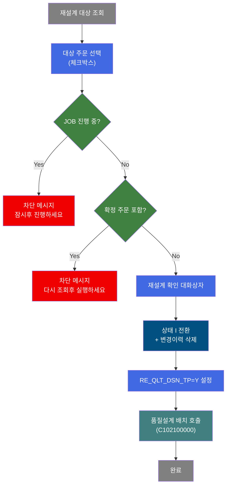
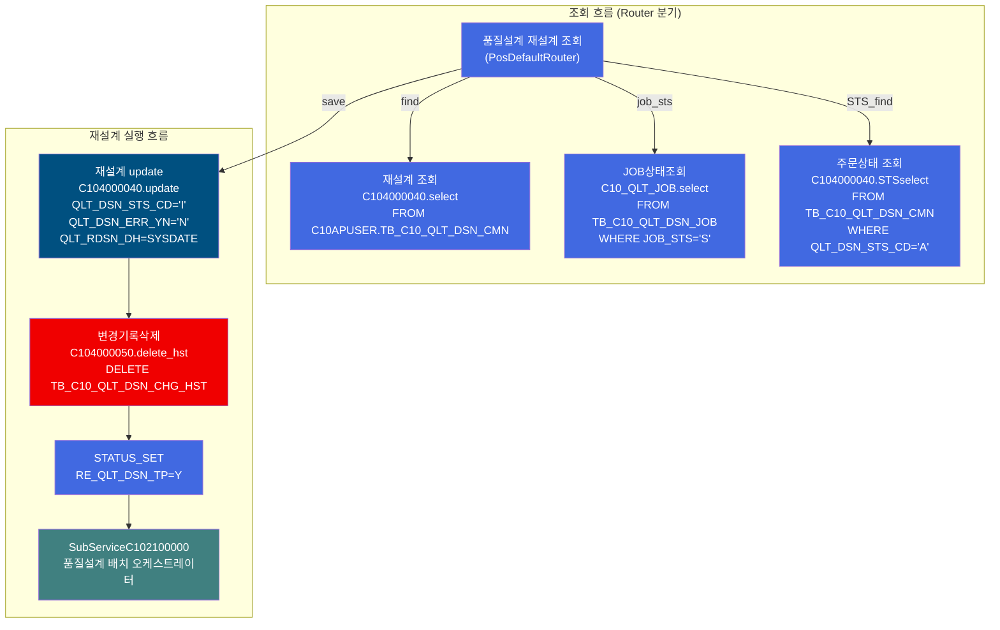
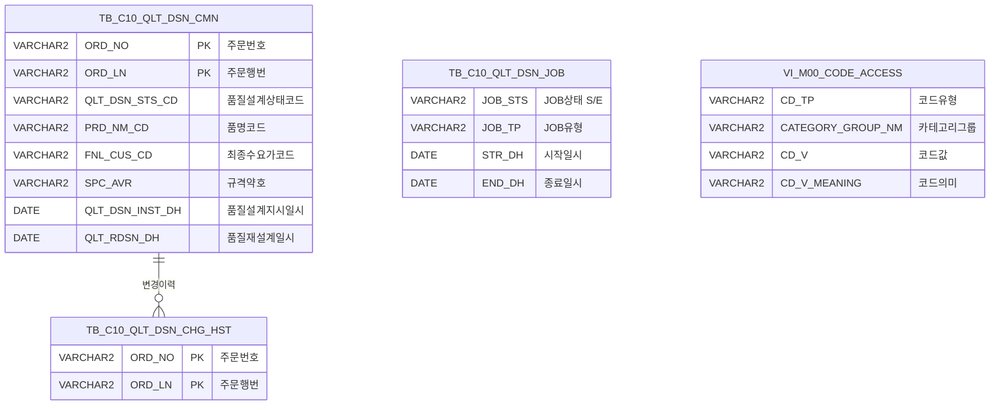

<h1 style="font-size: 40px; text-align: center; font-weight:
   bold; margin: 30px 0;">
  C104000040 레거시 시스템 분석 종합 보고서
</h1>


# 1. 시스템 개요
- **서비스 ID**: C104000040
- **업무명**: 품질설계 재설계
- **분석 일시**: 2026-03-17 08:45 KST
- **분석 시간**: 약 5분
- **전체 Activity 수**: 8개 (Custom 0, Built-in 7, Common 1)
- **분석자**: Claude Opus 4.6
- **분석 도구**: /analyze-service C104000040
- **문서 버전**: 1.0

# 📊 비즈니스 프로세스 분석

## 시스템 목적

C104000040 서비스는 **품질설계 재설계 화면**으로, 이미 완료된 품질설계를 다시 수행해야 하는 경우 사용자가 대상 주문을 선택하여 재설계를 요청하는 UI 서비스이다. 설계의뢰일 범위, 주문번호, 품명, 규격약호 등 다양한 조건으로 품질설계 결과를 조회하고, 선택한 주문의 품질설계 상태를 'I'(의뢰)로 되돌려 배치 품질설계 JOB(C102100000)이 재처리하도록 트리거한다.

핵심 비즈니스 흐름은 (1) 재설계 대상 주문 조회 → (2) 체크박스로 대상 선택 → (3) JOB 진행 중 여부 사전 검증 → (4) 확정 주문 여부 사전 검증 → (5) 상태 변경(QLT_DSN_STS_CD='I') + 변경이력 삭제 → (6) C102100000 서브서비스 호출로 품질설계 배치 재실행 순서이다. 확정('A') 상태인 주문은 조회 대상에서 자동 제외되며, 이미 JOB이 진행 중이면 재설계를 차단한다.

## 핵심 워크플로우 다이어그램



### 상세 워크플로우 다이어그램



## 주요 유즈케이스

### UC-01: 재설계 대상 주문 조회
- **Actor**: 품질설계 담당자
- **목적**: 품질설계 완료/오류 상태인 주문을 다양한 조건으로 검색하여 재설계 대상을 파악

- **전제조건**:
  - 사용자가 시스템에 로그인되어 있음
  - 품질설계가 수행된 주문이 존재함

- **주요 흐름**:
  1. 화면 진입 시 설계의뢰일 기본값 자동 설정 (전일~당일)
  2. 사용자가 조회 조건 입력 (설계의뢰일 범위, 주문번호, 품명, 규격약호, 주문용도, 최종수요가, 조회구분)
  3. 조회 버튼 클릭 → 날짜/주문번호 유효성 검사 수행
  4. C104000040.select 쿼리 실행 → TB_C10_QLT_DSN_CMN 테이블에서 조건에 맞는 주문 조회
  5. Grid에 조회 결과 표시 (주문번호, 품명, 수요가, 규격, 상태 등 21개 컬럼)

- **대체 흐름**:
  - 시작일만 입력 시: "설계의뢰 종료일을 입력해주세요" 메시지
  - 종료일만 입력 시: "설계의뢰 시작일을 입력해주세요" 메시지
  - 날짜/주문번호 모두 미입력 시: "주문번호를 입력해주세요" 메시지
  - 시작일 > 종료일: isCompareDate 검증 실패

- **후행조건**:
  - Grid에 재설계 대상 주문 목록이 표시됨
  - 사용자가 체크박스로 재설계 대상을 선택할 수 있는 상태

### UC-02: 품질설계 재설계 실행
- **Actor**: 품질설계 담당자
- **목적**: 선택한 주문의 품질설계를 초기화하여 배치 재처리를 트리거

- **전제조건**:
  - 재설계 대상 주문이 Grid에 조회되어 있음
  - 1건 이상의 주문이 체크박스로 선택됨
  - 품질설계 JOB이 현재 진행 중이 아님

- **주요 흐름**:
  1. 사용자가 Grid에서 재설계 대상 주문 체크박스 선택
  2. 재설계 버튼 클릭
  3. 시스템이 AJAX로 JOB 진행 여부 확인 (C10_QLT_JOB.select, JOB_STS='S')
  4. 시스템이 AJAX로 선택된 각 주문의 확정 여부 확인 (C104000040.STSselect, QLT_DSN_STS_CD='A')
  5. 확인 대화상자 표시: "재설계 하시겠습니까?"
  6. 확인 클릭 시 Grid 데이터 서버 전송
  7. 서버에서 C104000040.update 실행 → QLT_DSN_STS_CD='I', QLT_RDSN_DH=SYSDATE 설정
  8. C104000050.delete_hst 실행 → 기존 변경이력 삭제
  9. RE_QLT_DSN_TP=Y 파라미터 설정 후 C102100000 서브서비스 호출
  10. 완료 후 자동 재조회

- **대체 흐름**:
  - 선택된 주문 없음: "재설계할 대상을 선택해주세요" 메시지
  - JOB 진행 중: "품질설계JOB이 진행중입니다. 잠시후 진행하세요!" 메시지
  - 확정 주문 포함: "확정된 주문이 있습니다! 다시 조회후 실행하세요!" 메시지

- **후행조건**:
  - 선택된 주문의 QLT_DSN_STS_CD가 'I'(의뢰)로 변경됨
  - 변경이력(TB_C10_QLT_DSN_CHG_HST)이 삭제됨
  - C102100000 품질설계 배치가 트리거되어 재설계 수행

### UC-03: 품질설계 상세 화면 이동
- **Actor**: 품질설계 담당자
- **목적**: 특정 주문의 품질설계 상세 정보를 확인하기 위해 상세 화면으로 이동

- **전제조건**:
  - Grid에 주문 목록이 조회되어 있음

- **주요 흐름**:
  1. Grid 행 더블클릭
  2. 선택 행의 ORD_NO(주문번호), ORD_LN(주문행번) 추출
  3. parent.newRemoveOpenTab으로 C104000020 화면 열기 (ORD_NO, ORD_LN 파라미터 전달)
  4. C104000020 화면에서 해당 주문의 품질설계 상세 확인

- **대체 흐름**: 없음

- **후행조건**:
  - 부모 탭에서 C104000020(품질설계 상세) 화면이 열림

### UC-04: 마스터 코드 팝업 검색
- **Actor**: 품질설계 담당자
- **목적**: 주문용도, 최종수요가 코드를 팝업으로 검색하여 입력 편의성 향상

- **전제조건**:
  - 화면이 로드되어 있음

- **주요 흐름**:
  1. 주문용도(ORD_USG_CD) 또는 최종수요가(CUS_CD) 검색 아이콘 클릭
  2. masterPopup 함수 호출 → masterGridData.do로 팝업 창 열기 (469x532)
  3. 팝업에서 코드 검색 및 선택
  4. masterSetValue 콜백으로 선택된 코드를 Form 필드에 세팅

- **대체 흐름**: 없음

- **후행조건**:
  - 선택된 코드가 해당 Form 필드에 자동 입력됨

---

## 비즈니스 로직 상세

### 1. 재설계 상태 전환 로직

- **목적**: 선택된 주문의 품질설계 상태를 의뢰('I')로 되돌려 배치 재처리를 트리거
- **처리 케이스**:

  **[케이스 1: 정상 재설계]**
  ```
    조건: 체크박스 선택된 주문 + JOB 미진행 + 확정 미포함
    처리:
      1. QLT_DSN_STS_CD = 'I' (의뢰 상태로 복원)
      2. QLT_DSN_ERR_YN = 'N' (에러 플래그 초기화)
      3. QLT_RDSN_DH = SYSDATE (재설계 요청 일시 기록)
      4. QLT_RDSN_PRS_ID = 사용자ID (재설계 요청자 기록, ObjectId 앞 10자리)
      5. 감사 필드 업데이트 (ObjectType, ObjectId, ProgramId, Timestamp)
  ```

  **[케이스 2: JOB 진행 중 차단]**
  ```
    조건: TB_C10_QLT_DSN_JOB에 JOB_STS='S'인 레코드 존재
    처리:
      1. AJAX로 JOB 상태 사전 조회
      2. 진행 중이면 즉시 차단 → 메시지 표시
  ```

  **[케이스 3: 확정 주문 차단]**
  ```
    조건: 선택 주문 중 QLT_DSN_STS_CD='A'인 주문 존재
    처리:
      1. 선택된 모든 주문을 순회하며 개별 AJAX 확인
      2. 확정 주문 발견 시 즉시 차단 → 메시지 표시
  ```

### 2. 코드값 → 의미명 변환 규칙 (스칼라 서브쿼리)

- **목적**: 코드 테이블의 코드값을 사용자가 읽을 수 있는 "코드 : 의미명" 형태로 변환하여 Grid에 표시
- **처리 케이스**:

  **[케이스 1: 품명코드(PRD_NM_CD) 변환]**
  ```
    조건: CD_TP = 'PRD_NM_CD', CATEGORY_GROUP_NM = 'SZ0000'
    처리: CD_V || ' : ' || CD_V_MEANING 형태로 조합
  ```

  **[케이스 2: 수요가코드(FNL_CUS_CD) 변환]**
  ```
    조건: CD_TP = 'CUS_CD', CATEGORY_GROUP_NM = 'SZ0000'
    처리: FNL_CUS_CD || ' : ' || CD_V_MEANING 형태로 조합
  ```

  **[케이스 3: 도금량지정코드(GW_ASG_CD) - 품명별 카테고리 분기]**
  ```
    조건: CD_TP = 'GW_ASG_CD'
    처리:
      1. PRD_NM_CD에 따라 CATEGORY_GROUP_NM을 DECODE로 분기:
         - '4','L' → 'SL0000' (Lux Steel)
         - '2','E','8','N' → 'SE0000' (전기강판)
         - 'V','6' → 'SV0000'
         - 'W','9' → 'SW0000'
         - 그 외 → 'SG0000' (일반)
      2. 해당 카테고리의 코드명 조회
  ```

### 3. 날짜 범위 조건 처리

- **목적**: 설계의뢰일 기반 조회 시 주문번호 직접 입력과 날짜 범위 검색을 동시 지원
- **처리 케이스**:

  **[케이스 1: 주문번호 직접 입력]**
  ```
    조건: ORD_NO가 입력됨 (설계의뢰일 비어있을 수 있음)
    처리:
      1. ORD_NO LIKE :ORD_NO || '%' (전방 매칭)
      2. 날짜 조건: DECODE(:ORD_NO, '', :시작일, '1900-01-01') ~ DECODE(:ORD_NO, '', :종료일, '2999-12-31')+1
         → 주문번호 입력 시 날짜 조건 사실상 무효화 (1900~2999 범위)
  ```

  **[케이스 2: 날짜 범위 검색]**
  ```
    조건: 설계의뢰일 시작/종료 입력, 주문번호 비어있음
    처리:
      1. QLT_DSN_INST_DH BETWEEN TO_DATE(:시작일) AND TO_DATE(:종료일) + 1
      2. 종료일+1로 해당일 23:59:59까지 포함
  ```

### 4. 변경이력 삭제 후 서브서비스 호출 체인

- **목적**: 재설계 전 기존 변경이력을 정리하고, RE_QLT_DSN_TP 플래그를 설정하여 서브서비스의 재설계 모드 동작을 지시
- **처리 케이스**:

  **[체인 흐름]**
  ```
    1. C104000040.update → TB_C10_QLT_DSN_CMN 상태 변경
    2. C104000050.delete_hst → TB_C10_QLT_DSN_CHG_HST 해당 주문 이력 전체 삭제
    3. STATUS_SET (DbSetParam) → PosContext에 RE_QLT_DSN_TP=Y 설정
    4. C102100000-service 호출 (new-transaction=false, 기존 트랜잭션 공유)
       → 품질설계 배치 오케스트레이터가 'I' 상태 주문을 감지하여 재설계 수행
  ```

---

# 💾 데이터 요구사항

## 핵심 테이블

### 1. TB_C10_QLT_DSN_CMN - 품질설계 결과 공통
| 컬럼명 | 타입 | PK | 설명 |
|--------|------|----|-----|
| ORD_NO | VARCHAR2 | ✅ | 주문번호 |
| ORD_LN | VARCHAR2 | ✅ | 주문행번 |
| PRD_NM_CD | VARCHAR2 | | 품명코드 |
| FNL_CUS_CD | VARCHAR2 | | 최종수요가코드 |
| SPC_AVR | VARCHAR2 | | 규격약호 |
| ORD_USG_CD | VARCHAR2 | | 주문용도코드 |
| CUS_BTH_PAP_NO | VARCHAR2 | | 고객사양서번호 |
| CCL_BOM_NO | VARCHAR2 | | CCL BOM 번호 |
| QLT_DSN_STS_CD | VARCHAR2 | | 품질설계상태코드 (I=의뢰, A=확정, B=확정대기, E=오류) |
| ORD_EXC_THK | NUMBER | | 주문환산두께 |
| ORD_EXC_WTH | NUMBER | | 주문환산폭 |
| ORD_EXC_LTH | NUMBER | | 주문환산길이 |
| GW_ASG_CD | VARCHAR2 | | 도금량지정코드 |
| ORD_LN_WGT | NUMBER | | 주문행번중량 |
| RMTL_CD | VARCHAR2 | | 원자재코드 |
| MQL_CD | VARCHAR2 | | 재질코드 |
| CRM_MNF_STD_NO | VARCHAR2 | | 냉연제조표준번호 |
| QLT_DSN_INST_DH | DATE | | 품질설계지시일시 |
| QLT_DSN_END_DH | DATE | | 품질설계완료일시 |
| QLT_DSN_PRS_ID | VARCHAR2 | | 품질설계자ID |
| QLT_DSN_ERR_YN | VARCHAR2 | | 품질설계에러여부 |
| QLT_RDSN_DH | DATE | | 품질재설계일시 |
| QLT_RDSN_PRS_ID | VARCHAR2 | | 품질재설계자ID |

### 2. TB_C10_QLT_DSN_JOB - 품질설계 JOB 관리
| 컬럼명 | 타입 | PK | 설명 |
|--------|------|----|-----|
| JOB_STS | VARCHAR2 | | JOB 상태 (S=시작, E=종료) |
| JOB_TP | VARCHAR2 | | JOB 유형 |
| STR_DH | DATE | | JOB 시작일시 |
| END_DH | DATE | | JOB 종료일시 |

### 3. TB_C10_QLT_DSN_CHG_HST - 품질설계 변경이력
| 컬럼명 | 타입 | PK | 설명 |
|--------|------|----|-----|
| ORD_NO | VARCHAR2 | ✅ | 주문번호 |
| ORD_LN | VARCHAR2 | ✅ | 주문행번 |

## 데이터 플로우

### 1. 조회

```
[재설계 대상 조회]
화면 진입 (설계의뢰일 기본값: 전일~당일)
→ C104000040.select
  FROM C10APUSER.TB_C10_QLT_DSN_CMN
  스칼라 서브쿼리: M00APUSER.VI_M00_CODE_ACCESS (PRD_NM_CD, CUS_CD, ORD_USG_CD, GW_ASG_CD 코드 변환)
  WHERE ORD_NO LIKE :ORD_NO || '%'
    AND QLT_DSN_INST_DH BETWEEN 시작일 AND 종료일+1
    AND QLT_DSN_STS_CD != 'A' (확정 제외)
    AND 품명/규격약호/주문용도/수요가/CCL_BOM_NO 필터
  ORDER BY ORD_NO, ORD_LN
→ Grid에 재설계 대상 목록 표시

[JOB 상태 조회 - AJAX]
재설계 버튼 클릭
→ C10_QLT_JOB.select
  FROM TB_C10_QLT_DSN_JOB
  WHERE JOB_STS = 'S'
→ 진행 중 JOB 존재 여부 반환

[주문 확정 여부 조회 - AJAX]
JOB 미진행 확인 후
→ C104000040.STSselect (각 선택 주문별 반복)
  FROM TB_C10_QLT_DSN_CMN
  WHERE ORD_NO = :ORD_NO AND ORD_LN = :ORD_LN AND QLT_DSN_STS_CD = 'A'
→ 확정 주문 존재 여부 반환
```

### 2. 재설계 실행

```
[상태 변경]
사용자 확인 후
→ C104000040.update
  UPDATE TB_C10_QLT_DSN_CMN SET
    QLT_DSN_STS_CD = 'I', QLT_DSN_ERR_YN = 'N',
    QLT_RDSN_DH = SYSDATE, QLT_RDSN_PRS_ID = 사용자ID
  WHERE ORD_NO = :ORD_NO AND ORD_LN = :ORD_LN
→ 주문 상태를 의뢰(I)로 복원

[변경이력 삭제]
→ C104000050.delete_hst
  DELETE TB_C10_QLT_DSN_CHG_HST
  WHERE ORD_NO = :ORD_NO AND ORD_LN = :ORD_LN
→ 기존 변경이력 정리

[서브서비스 호출]
→ RE_QLT_DSN_TP = 'Y' 파라미터 설정
→ C102100000-service 호출 (품질설계 배치 재실행)
```

## SQL 일람표

| SQL 이름 | 쿼리 ID | 타입 | 출처 | 테이블 |
|---------|---------|-----|------|-------|
| 재설계 대상 조회 | C104000040.select | SELECT | Service | TB_C10_QLT_DSN_CMN, VI_M00_CODE_ACCESS |
| 주문 상태 업데이트 | C104000040.update | UPDATE | Service | TB_C10_QLT_DSN_CMN |
| 주문 확정 여부 조회 | C104000040.STSselect | SELECT | Service | TB_C10_QLT_DSN_CMN |
| JOB 상태 조회 | C10_QLT_JOB.select | SELECT | Service | TB_C10_QLT_DSN_JOB |
| 변경이력 삭제 | C104000050.delete_hst | DELETE | Service | TB_C10_QLT_DSN_CHG_HST |

## ER 다이어그램 (핵심 관계)



관계 설명:
- TB_C10_QLT_DSN_CMN이 중심 테이블로, 주문번호+행번 기준 품질설계 공통 정보 관리
- TB_C10_QLT_DSN_CHG_HST: ORD_NO+ORD_LN 기준 1:N 관계 (변경이력)
- TB_C10_QLT_DSN_JOB: 품질설계 배치 JOB 상태 관리 (독립 테이블)
- VI_M00_CODE_ACCESS: 마스터 코드 뷰 (코드값→의미명 변환)

---

# 🖥️ 사용자 인터페이스 요구사항

## 화면 레이아웃 상세

### Layout 구조
```javascript
{
  type: "flat",  // 레이아웃 없이 절대 좌표 배치
  components: [
    {
      id: "C104000040_Form_1",
      type: "form",
      position: { left: 0, top: 0, width: 981, height: 88 }
    },
    {
      id: "C104000040_Grid_1",
      type: "grid",
      position: { left: 1, top: 95, width: 977, height: 470 }
    },
    {
      id: "C104000040_messagebox",
      type: "messagebox",
      position: { left: 0, top: 567, width: 978, height: 19 }
    }
  ]
}
```

## 입출력 요소

### Form 컴포넌트
**C104000040_Form_1** (3개 블록)

**블록 1 (상단)**:
- QLT_DSN_INST_DH_START: Calendar - 설계의뢰일(시작), 입력폭 75px, 배경 연노랑(#FFFFC0), 기본값 전일
- QLT_DSN_INST_DH_END: Calendar - 설계의뢰일(종료), 입력폭 75px, 배경 연노랑, 기본값 당일
- ORD_NO: Input - 주문번호, 입력폭 75px, 최대 10자, 자동 대문자 변환, Enter 키로 조회
- PRD_NM_CD: Combo - 품명, 마스터콤보(SZ0000/PRD_NM_CD), 입력폭 168px, 읽기전용
- save: CustomButton - "재설계", 폭 80px, 초기 비활성
- find: Button - "조회", 초기 비활성
- winClose: Button - "닫기"

**블록 2 (중단)**:
- SPC_AVR: Input - 규격약호, 입력폭 100px, 최대 15자, 자동 대문자 변환
- ORD_USG_CD: Input - 주문용도, 입력폭 60px, 최대 6자, 검색 아이콘(masterPopup), 자동 대문자 변환
- CUS_CD: Input - 최종수요가, 입력폭 60px, 최대 6자, 검색 아이콘(masterPopup), 자동 대문자 변환

**블록 3 (하단)**:
- QLT_DSN_STS_CD: Radio - 조회구분 [전체(기본), 확정대기(B), 설계오류(E)]

### Grid 컴포넌트

**C104000040_Grid_1 (재설계 대상 목록)**
- 편집 가능 여부: 체크박스 컬럼만 편집 가능 (나머지 읽기전용)
- Split: 없음 (0)
- 스마트 렌더링: 활성 (preRendering: 19)
- 컨텍스트 메뉴: 활성 (복사, 엑셀 다운로드)
- 멀티셀렉트: 활성
- 행 수: 18
- 주요 컬럼 (21개):

  **선택**:
  - QLT_DSN_CFM: ch - 선택 (4%, 중앙정렬, 체크박스)

  **주문 기본 정보**:
  - ORD_NO: ro - 주문번호 (13%, 중앙정렬)
  - ORD_LN: ro - 주문행번 (7%, 중앙정렬)
  - PRD_NM_CD: ro - 품명 (10%, 중앙정렬)
  - CUS_CD: ro - 수요가 (15%, 좌측정렬)

  **규격/용도 정보**:
  - SPC_AVR: ro - 규격약호 (15%, 중앙정렬)
  - ORD_USG_CD: ro - 주문용도 (15%, 좌측정렬)
  - CUS_BTH_PAP_NO: ro - 고객사양번호 (10%, 중앙정렬)
  - CCL_BOM_NO: ro - CCL-BOM 번호 (10%, 중앙정렬)

  **상태 정보**:
  - QLT_DSN_STS_CD: ro - 품질설계상태 (10%, 중앙정렬)

  **주문 Size (그룹 헤더: 두께/폭/길이)**:
  - ORD_EXC_THK: ron - 두께 (6%, 중앙정렬, 포맷 00.000)
  - ORD_EXC_WTH: ron - 폭 (6%, 중앙정렬, 포맷 0000.0)
  - ORD_EXC_LTH: ron - 길이 (6%, 중앙정렬, 포맷 0000.0)

  **제조 정보**:
  - GW_ASG_CD: ro - 도금량지정코드 (10%, 중앙정렬)
  - ORD_LN_WGT: ro - 주문량 (8%, 중앙정렬)
  - RMTL_CD: ro - 원자재코드 (10%, 중앙정렬)
  - MQL_CD: ro - 재질코드 (10%, 중앙정렬)
  - CRM_MNF_STD_NO: ro - 제조표준번호 (10%, 중앙정렬)

  **일시/담당자 정보**:
  - QLT_DSN_INST_DH: ro - 품질설계요청일 (14%, 중앙정렬)
  - QLT_DSN_END_DH: ro - 품질설계완료일 (14%, 중앙정렬)
  - QLT_DSN_PRS_ID: ro - 설계자사번 (9%, 중앙정렬)

## 화면 동작 흐름

### 1. 화면 초기 로딩
```
1. 화면 진입
2. ui.initializeDHTMLX() 호출
3. Form XLE 이벤트 등록 (onXleForm → onFormLoadFunction)
4. onFormLoadFunction 실행:
   - 설계의뢰일 시작 = getCurrentAddMinusDay('-','',1) (전일)
   - 설계의뢰일 종료 = uiCommon.getCurrentDate() (당일)
   - 캘린더 주 시작요일 = 일요일 (setWeekStartDay(7))
   - PRD_NM_CD 마스터 콤보 로드 (SZ0000/PRD_NM_CD, 높이 220px)
   - 캘린더/콤보 입력 필드 Backspace/F5 키 차단
   - ORD_NO/SPC_AVR/ORD_USG_CD/CUS_CD 자동 대문자 변환 설정
5. Grid XLE 이벤트 등록 (onXleGrid → onGridLoadFunction)
6. onGridLoadFunction 실행 → find() 자동 호출하여 기본 조회
7. Grid 이벤트 등록: 체크박스/헤더클릭/더블클릭/업데이트완료
```

### 2. 재설계 대상 조회
```
1. 사용자가 조건 입력 (날짜, 주문번호, 품명, 규격약호 등)
2. 조회 버튼 클릭 또는 주문번호 필드에서 Enter 키
3. find() 함수 실행:
   - 날짜 입력 유효성 검사 (시작일↔종료일 상호 필수)
   - 날짜/주문번호 모두 미입력 시 주문번호 필수 검증
   - checkValid(날짜, "YYYYMMDD") 형식 검사
   - isCompareDate(시작일, 종료일) 순서 검사
4. uiCommon.parameters("C104000040_Form_1", "C104000040_Grid_1", "find") 파라미터 구성
5. items["C104000040_Grid_1"].loadData(findUrl)로 Grid 데이터 로드
```

### 3. 재설계 실행
```
1. 체크박스로 대상 주문 선택
2. 재설계 버튼 클릭
3. save() 함수 실행:
   - 변경된 행 수 확인 (nativeeditor_status 체크)
   - 미선택 시 "재설계할 대상을 선택해주세요" 알림
4. AJAX 1차: JOB 진행 중 확인 (c10AjaxData.do)
5. AJAX 2차: 각 선택 주문별 확정 여부 확인 (반복 호출)
6. dhtmlx.confirm 대화상자 표시
7. 확인 → items[referenceItem].sendGrid() → 서버 처리
8. 서버: update → delete_hst → STATUS_SET → C102100000 서브서비스
9. onGridAfterUpdateFinishEvent → find() 재조회
```

### 4. 상세 화면 이동
```
1. Grid 행 더블클릭
2. doOnRowDblClicked(rowId) 실행
3. ORD_NO = cells(rowId, 1).getValue(), ORD_LN = cells(rowId, 2).getValue()
4. parent.newRemoveOpenTab("C104000020", "ORD_NO=" + ORD_NO + "&ORD_LN=" + ORD_LN)
5. 부모 탭에서 C104000020 화면 오픈
```

## JavaScript 모듈

**C104000040.jsp** (메인 화면 스크립트, 인라인)
- find(eventName, formDivObj, referenceItem): 재설계 대상 조회 (날짜/주문번호 유효성 검사 → uiCommon.parameters → loadData)
- save(eventName, formDivObj, referenceItem): 재설계 실행 (nativeeditor_status 확인 → AJAX JOB 확인 → AJAX 확정 확인 → dhtmlx.confirm → sendGrid)
- onGridContextMenuClick(id, gridObj, menuObj): 컨텍스트 메뉴 (copy_row: cellToClipboard, excel_grid: toExcel)
- findMessage(referenceItem): 상태바 메시지 표시 (uiCommon.message)
- onFormLoadFunction(): Form 초기화 (캘린더 기본값, 마스터콤보 로드, 키 이벤트 바인딩)
- onGridLoadFunction(): Grid 로드 후 자동 조회 (find 호출)
- onGridAfterUpdateFinishEvent(): 업데이트 완료 후 재조회
- onCheckboxEvent(row_id, cell_index, state): 체크 해제 시 updated 상태 초기화
- onCheckboxHeaderClick(ind, obj): 헤더 체크박스 전체 선택/해제 토글
- doOnRowDblClicked(rowId): 행 더블클릭 → C104000020 화면 이동 (parent.newRemoveOpenTab)
- serchIcon_ORD_USG_CD(name, val): 주문용도 검색 아이콘 HTML 생성
- serchIcon_CUS_CD(name, val): 수요가 검색 아이콘 HTML 생성
- masterPopup(CD_TP, CATEGORY_GROUP_NM, target, formId): 마스터 코드 팝업 (ui.window, 469x532)
- masterSetValue(code, name, target, formId): 팝업 선택 코드 반영

**c10.ui.js** (공통 스크립트)
- 공통 UI 유틸리티 함수

## 주요 이벤트 핸들러

**find (조회 버튼 클릭)**
- 이벤트 타입: Form Button Click
- 처리 내용:
  1. 설계의뢰 시작일/종료일 상호 필수 검증
  2. 날짜/주문번호 미입력 시 주문번호 필수 검증
  3. 날짜 형식(YYYYMMDD) 및 순서(시작일≤종료일) 검증
  4. uiCommon.parameters로 파라미터 구성
  5. Grid loadData로 조회 실행

**save (재설계 버튼 클릭)**
- 이벤트 타입: Form CustomButton Click
- 처리 내용:
  1. Grid 전체 행 순회하여 nativeeditor_status 확인 → 변경 행 수 카운트
  2. 미선택 시 알림 반환
  3. AJAX로 JOB 진행 중 여부 확인 (C10_QLT_JOB.select)
  4. 선택된 각 주문별 AJAX 확정 여부 확인 (C104000040.STSselect)
  5. dhtmlx.confirm 대화상자 → 확인 시 sendGrid 실행

**doOnRowDblClicked (행 더블클릭)**
- 이벤트 타입: Grid Row Double Click
- 처리 내용:
  1. rowId 기반 ORD_NO(컬럼1), ORD_LN(컬럼2) 추출
  2. parent.newRemoveOpenTab으로 C104000020 화면 오픈
  3. ORD_NO, ORD_LN 파라미터 전달

**onCheckboxHeaderClick (헤더 체크박스 클릭)**
- 이벤트 타입: Grid Header Click
- 처리 내용:
  1. ind === 0 (첫 번째 컬럼) 확인
  2. 체크된 행 존재 시 전체 해제 (uncheckAll)
  3. 체크된 행 없으면 전체 선택 (checkAll)

**masterPopup (마스터 코드 팝업)**
- 이벤트 타입: Search Icon Click
- 처리 내용:
  1. ui.window 객체 생성 (469x532, masterGridData.do)
  2. 최소화/최대화 버튼 비활성화
  3. 모달 설정
  4. masterSetValue 콜백으로 선택 코드 반영

# 🔗 서브서비스

## 서브서비스 요약

| 서비스 ID | 설명 | 호출 액티비티 | 트랜잭션 | 상세 분석 |
|-----------|------|-------------|---------|----------|
| C102100000 | 품질설계 배치 메인 오케스트레이터 | SubServiceC102100000 | 기존 트랜잭션 공유 (new-transaction=false) | [상세 분석 링크](./C102100000_legacy_analysis.md) |

### C102100000 - 품질설계 배치 메인 오케스트레이터
품질설계 의뢰 상태('I')인 주문을 10건 단위로 가져와, 기존 설계 데이터를 전면 삭제(10개 자식 테이블)한 후, 18개 서브서비스를 순차 호출하여 설계키 → 규격사양 → 고객사양 → 사내사양 → 보증사양 → 원자재 → 제조사양 → 도금량 → CCL제조 → 통과공정 → Size → 정합성체크까지 전체 품질설계를 재생성한다.
Activity 33개, SQL Key 다수. "전면 삭제 후 재생성(Delete-then-Recreate)" 패턴 사용.

# 📌 특이사항 및 주의사항

## 1. AJAX 동기 호출을 통한 사전 검증 패턴
- **JOB 진행 중 검증**: 재설계 실행 전 `uiCommon.ajaxLoadData`로 동기 AJAX 호출하여 JOB 상태를 사전 확인. 동기 호출이므로 대량 선택 시 브라우저 블로킹 발생 가능.
- **주문별 반복 AJAX**: 확정 여부 확인 시 선택된 모든 주문에 대해 개별 AJAX 호출 반복. 대량 선택 시 N회 동기 호출로 인한 성능 저하 우려.

## 2. 트랜잭션 경계와 new-transaction=false
- **위험 포인트**: C102100000 서브서비스 호출 시 `new-transaction=false`로 기존 트랜잭션을 공유한다. 서브서비스 내부(33개 Activity, 18개 서브서비스 체인)에서 오류 발생 시 update/delete 포함 전체가 롤백될 수 있음.
- **RE_QLT_DSN_TP=Y 플래그**: DbSetParam으로 PosContext에 설정하여 서브서비스의 재설계 모드 동작을 지시하는 플래그. 이 값에 의존하는 서브서비스 로직 존재.

## 3. 도금량지정코드(GW_ASG_CD) 카테고리 분기 하드코딩
- **DECODE 분기**: 품명코드(PRD_NM_CD)에 따라 CATEGORY_GROUP_NM을 DECODE로 하드코딩 분기. 품명코드 '4','L'→SL0000, '2','E','8','N'→SE0000, 'V','6'→SV0000, 'W','9'→SW0000, 기본→SG0000. 신규 품명코드 추가 시 SQL 수정 필요.

## 4. C10APUSER 스키마 직접 참조
- **스키마 접두사**: 메인 조회 쿼리(C104000040.select)에서 `C10APUSER.TB_C10_QLT_DSN_CMN`으로 스키마를 명시적으로 지정. 반면 update/delete 쿼리는 스키마 없이 테이블명만 사용. 환경별 스키마 차이 시 불일치 가능성.

## 5. 캘린더/입력 필드 키 입력 제한
- **Backspace/F5 차단**: 캘린더 입력 필드와 콤보박스 입력에서 keyCode 8(Backspace), 116(F5) 키를 차단하는 코드가 다수 반복 작성됨. 브라우저 뒤로가기/새로고침 방지 목적이나, 현대 브라우저에서는 불필요할 수 있음.

## 6. 주석 처리된 CCL_BOM_NO 검색 로직
- **미사용 코드**: onFormLoadFunction 내에 CCL_BOM_NO 입력 필드의 Enter 키 조회 로직이 주석 처리되어 있음 (라인 239-251). Form에 CCL_BOM_NO 필드는 정의되어 있지 않으나 SQL WHERE 조건에는 `:CCL_BOM_NO` 바인드 변수가 존재하여 불일치.

# 📚 참고 문서

- **Query SQL**: `src/query/C104000040-query.glue_sql`, `src/query/C104000050-query.glue_sql`, `src/query/C10_QLT_JOB-query.glue_sql`
- **JS**: `WebContents/C104000040.jsp` (인라인 스크립트), `WebContents/js/c10.ui.js`
- **Service XML**: `src/service/C104000040-service.xml`
- **UI XML**: `WebContents/header/kr/C104000040/C104000040_Form_1.xml`, `WebContents/header/kr/C104000040/C104000040_Grid_1.xml`
- **서브서비스 분석**: `docs/analysis/service/ui/C102100000_legacy_analysis.md`
