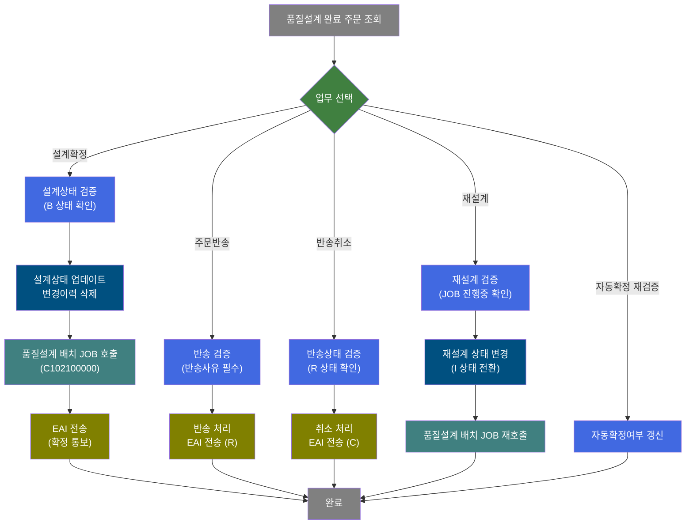
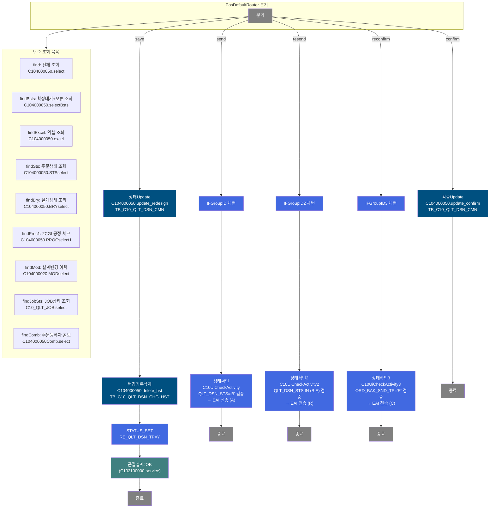
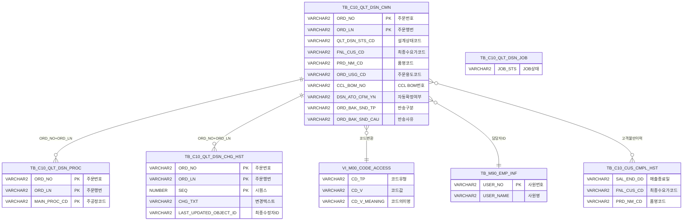

<h1 style="font-size: 40px; text-align: center; font-weight:
   bold; margin: 30px 0;">
  C104000050 레거시 시스템 분석 종합 보고서
</h1>


# 1. 시스템 개요
- **서비스 ID**: C104000050
- **업무명**: 품질설계확정
- **분석 일시**: 2026-03-17 08:55 KST
- **분석 시간**: 약 10분
- **전체 Activity 수**: 21개 (Custom 3, Built-in 17, Common 1)
- **분석자**: Claude Opus 4.6
- **분석 도구**: /analyze-service C104000050
- **문서 버전**: 1.0

# 📊 비즈니스 프로세스 분석

## 시스템 목적

C104000050 서비스는 **품질설계확정 화면**으로, 품질설계가 완료('B' 상태)된 주문에 대해 설계 결과를 검증하고 확정하는 업무를 수행한다. 품질설계 담당자가 설계 완료된 주문 목록을 조회하고, 개별 또는 일괄로 설계를 확정하거나 반려/재설계할 수 있다.

핵심 업무는 5가지이다: (1) **설계확정** - 확정대기('B') 상태 주문을 확정('A')으로 전환하고 EAI를 통해 후속 시스템에 통보, (2) **주문반송** - 설계에 문제가 있는 주문을 반려('R') 처리하여 영업 부서로 반송, (3) **반송취소** - 반려된 주문의 반송을 취소('C')하여 재검토, (4) **재설계** - 이미 확정된 설계를 재설계('I') 상태로 되돌려 품질설계 배치(C102100000)를 재실행, (5) **자동확정 재검증** - 자동확정된 주문의 자동확정 여부를 재갱신.

화면에서는 다양한 검색 조건(설계의뢰일, 주문번호, 품명, 칼라공정, 주문용도, 최종수요가, 등록자, CCL BOM 등)으로 조회하며, 조회구분(전체/확정대상/기확정/설계오류)과 필터(종결주문/MO전환/소재생산주문/자동확정)로 세밀한 필터링이 가능하다.

## 핵심 워크플로우 다이어그램



### 상세 워크플로우 다이어그램



## 주요 유즈케이스

### UC-01: 품질설계확정 대상 조회
- **Actor**: 품질설계 확정 담당자
- **목적**: 품질설계가 완료된 주문 목록을 다양한 조건으로 조회하여 확정 대상을 파악

- **전제조건**:
  - 사용자가 시스템에 로그인되어 있음
  - 품질설계확정 화면(C104000050) 접근 권한이 있음
  - 품질설계 배치(C102100000)에 의해 설계 완료('B') 또는 확정('A') 상태인 주문이 존재함

- **주요 흐름**:
  1. 화면 진입 시 설계의뢰일이 어제~오늘로 초기화, 조회구분 '확정대상(B)'이 기본 선택됨
  2. 품명(PRD_NM_CD), 칼라공정(PROC_CD) 콤보박스에 마스터 데이터 로드
  3. 자동으로 `findBsts` 이벤트 실행 → C104000050.selectBsts 쿼리로 확정대기(B)+설계오류(E) 주문 조회
  4. Grid에 주문 목록 표시 (반송/보류 주문은 빨간색, 종결주문은 파란색)

- **대체 흐름**:
  - 조회구분을 '전체'로 변경 시: `find` 이벤트로 C104000050.select 쿼리 실행
  - 주문번호, 규격약호, 주문용도 등 추가 검색 조건 입력 후 조회 버튼 클릭
  - 종결주문/MO전환/소재생산주문/자동확정 체크박스로 추가 필터링

- **후행조건**:
  - 조회된 주문 목록이 Grid에 표시됨
  - 설계확정/주문반송/반송취소/재설계 작업 수행 가능 상태

### UC-02: 설계확정 처리
- **Actor**: 품질설계 확정 담당자
- **목적**: 설계 완료된 주문의 품질설계 결과를 확정하여 후속 공정(스케줄링, 작업지시)으로 진행 가능하도록 함

- **전제조건**:
  - 대상 주문이 확정대기('B') 상태
  - 설계수정자와 확정자가 동일인이 아닐 것 (G/L/V/W 품명의 경우)
  - CCL BOM이 'J'로 시작하면서 2CGL공정이 있는 경우 확정 불가

- **주요 흐름**:
  1. Grid에서 설계확정(QLT_DSN_CFM) 체크박스를 선택 (단건 또는 헤더 체크박스로 일괄 선택)
  2. '설계확정' 버튼 클릭
  3. 시스템이 선택된 각 주문에 대해:
     a. AJAX로 설계상태(BRYselect) 조회 → 'B' 상태 확인
     b. 2CGL공정 체크(PROCselect1) → CCL BOM 'J' + 2CGL 공정 존재 시 차단
     c. 설계변경 이력(MODselect) 조회 → 설계수정자 = 확정자 동일 시 G/L/V/W 품명 차단
  4. 검증 통과 시 `sendGrid` 호출 → `IFGroupID` → `상태확인(C10UiCheckActivity)` 실행
  5. C10UiCheckActivity가 각 주문별로:
     - C104000050_CHECK 쿼리로 'B' 상태 재검증
     - C104000050_UPDATE 쿼리로 설계상태 업데이트
     - IFB10S1010_INSERT 쿼리로 EAI 전송 (COL_QLT_DSN_STS='A')
  6. 업데이트 완료 후 자동 재조회

- **대체 흐름**:
  - 설계상태가 'B'가 아닌 경우: "설계확정할 수 없는 상태입니다." 메시지
  - 위탁임가공 주문인 경우: 경고 메시지 표시 후 확인 시 진행
  - EAI 전송 실패 시: 트랜잭션 롤백, 에러 메시지 표시

- **후행조건**:
  - 주문 설계상태가 'A'(확정)로 변경됨
  - EAI를 통해 후속 시스템에 설계확정 통보됨

### UC-03: 주문반송 처리
- **Actor**: 품질설계 확정 담당자
- **목적**: 설계에 문제가 있는 주문을 영업 부서로 반려하여 주문 정보 수정을 요청

- **전제조건**:
  - 대상 주문이 이미 반송('R') 상태가 아닐 것
  - 대상 주문이 이미 확정('A') 상태가 아닐 것
  - 반송사유(ORD_BAK_SND_CAU)가 입력되어 있을 것

- **주요 흐름**:
  1. Grid에서 대상 주문 행의 반송사유(ORD_BAK_SND_CAU) 컬럼에 사유 입력
  2. '주문반송' 버튼 클릭
  3. 시스템이 반송사유 입력 여부, 반송/확정 상태 검증
  4. `sendGrid` → `IFGroupID2` → `상태확인2(C10UiCheckActivity2)` 실행
  5. C10UiCheckActivity2가 QLT_DSN_STS IN ('B','E') 검증 후 EAI 전송 (COL_QLT_DSN_STS='R')

- **대체 흐름**:
  - 이미 반송 상태: "이미 반송된 주문입니다." 메시지
  - 반송사유 미입력: "반송사유가 입력되지않았습니다." 메시지

- **후행조건**:
  - 주문이 반려('R') 상태로 변경됨
  - EAI를 통해 반려 사유와 함께 영업 시스템에 통보됨

### UC-04: 반송취소 처리
- **Actor**: 품질설계 확정 담당자
- **목적**: 잘못 반송된 주문의 반송을 취소하여 다시 확정 가능 상태로 복원

- **전제조건**:
  - 대상 주문이 반송('R') 상태일 것

- **주요 흐름**:
  1. Grid에서 반송(R) 상태인 주문 선택
  2. '반송취소' 버튼 클릭
  3. 시스템이 반송 상태 검증
  4. `sendGrid` → `IFGroupID3` → `상태확인3(C10UiCheckActivity3)` 실행
  5. C10UiCheckActivity3가 ORD_BAK_SND_TP='R' 검증 후 EAI 전송 (COL_QLT_DSN_STS='C')

- **대체 흐름**:
  - 반송 상태가 아닌 경우: "반송된 주문이 아닙니다" 메시지

- **후행조건**:
  - 주문 반송이 취소되어 재검토 가능 상태가 됨

### UC-05: 재설계 처리
- **Actor**: 품질설계 확정 담당자
- **목적**: 확정 전 또는 확정 후 주문의 설계를 초기화하여 품질설계 배치를 재실행

- **전제조건**:
  - 대상 주문이 확정('A') 상태가 아닐 것
  - 품질설계 JOB이 현재 진행 중('S' 상태)이 아닐 것

- **주요 흐름**:
  1. Grid에서 대상 주문 선택
  2. '재설계' 버튼 클릭
  3. AJAX로 설계상태(BRYselect) 확인 → 'A' 상태면 차단
  4. AJAX로 JOB 상태(C10_QLT_JOB.select) 확인 → 'S' 상태면 "품질설계JOB이 진행 중 입니다." 메시지
  5. `sendGrid` 호출 → `상태Update` → `변경기록삭제` → `STATUS_SET` → `품질설계JOB(C102100000)` 실행
  6. C104000050.update_redesign: QLT_DSN_STS_CD='I', 재설계자/일시 기록
  7. C104000050.delete_hst: 변경이력 삭제
  8. STATUS_SET: RE_QLT_DSN_TP='Y' 설정
  9. 품질설계 배치(C102100000) 서브서비스 호출로 전체 재설계 수행

- **대체 흐름**:
  - 확정 상태: "재설계 할수없는 상태입니다" 메시지
  - JOB 진행 중: "품질설계JOB이 진행 중 입니다." 경고

- **후행조건**:
  - 주문 설계상태가 'I'(재설계)로 변경됨
  - 기존 변경이력 삭제됨
  - 품질설계 배치가 재실행되어 설계 데이터가 재생성됨

### UC-06: 화면 이동 (더블클릭)
- **Actor**: 품질설계 확정 담당자
- **목적**: Grid 행 더블클릭으로 품질설계 상세 화면으로 이동하여 설계 내용 확인

- **전제조건**:
  - Grid에 조회 데이터가 존재함

- **주요 흐름**:
  1. Grid 행 더블클릭
  2. 설계오류('E') 상태면 C104000030(품질설계오류조회) 탭으로 이동
  3. 그 외 상태면 C104000020(품질설계결과조회) 탭으로 이동
  4. 주문번호(ORD_NO), 행번(ORD_LN) 파라미터 전달

- **대체 흐름**:
  - 24번 컬럼(반송사유) 더블클릭 시: 편집 모드(ed)로 전환하여 반송사유 직접 입력 가능

- **후행조건**:
  - 대상 품질설계 상세 화면이 새 탭으로 열림

---
## 비즈니스 로직 상세

### 1. 설계확정 상태 검증 및 EAI 전송 (C10UiCheckActivity 시리즈)

- **목적**: 품질설계 확정/반송/취소 시 상태 검증 후 EAI 인터페이스 테이블에 전송 레코드를 삽입하여 후속 시스템에 통보

- **처리 케이스**:

  **[케이스 1: 설계확정 - C10UiCheckActivity]**
  ```
    조건: QLT_DSN_STS_CD = 'B' (확정대기 상태)
    처리:
      1. mesdao로 C104000050_CHECK 쿼리 실행 → 'B' 상태 확인
      2. 결과 0건이면 ERRMSG 저장 → FAILURE 반환
      3. C104000050_UPDATE 쿼리로 설계상태 업데이트 (확정일시, 확정자 기록)
      4. eaidao로 IFB10S1010_INSERT 쿼리 실행
         → COL_QLT_DSN_STS = 'A', COL_QLT_DSN_MSG = 'A'
      5. 양 트랜잭션 커밋
  ```

  **[케이스 2: 주문반송 - C10UiCheckActivity2]**
  ```
    조건: QLT_DSN_STS_CD IN ('B','E') (확정대기 또는 설계오류)
    처리:
      1. C104000050_CHECK2 쿼리로 'B' 또는 'E' 상태 확인
      2. C104000050_UPDATE2 쿼리로 설계상태 업데이트 + 반송사유 기록
      3. EAI 테이블에 COL_QLT_DSN_STS = 'R' 삽입
         → ORD_BAK_SND_CAU(반송사유)를 COL_QLT_DSN_MSG에 포함
  ```

  **[케이스 3: 반송취소 - C10UiCheckActivity3]**
  ```
    조건: ORD_BAK_SND_TP = 'R' (반송 상태)
    처리:
      1. C104000050_CHECK3 쿼리로 반송 상태 확인
      2. C104000050_UPDATE3 쿼리로 설계상태 업데이트
      3. EAI 테이블에 COL_QLT_DSN_STS = 'C' 삽입
         → ORD_BAK_SND_CAU(취소사유)를 COL_QLT_DSN_MSG에 포함
  ```

- **예외 처리**:
  - 상태 검증 실패: ERRMSG에 "해당 주문은 설계확정 할 수 없는 상태입니다" 등 메시지 저장 → FAILURE
  - DB 예외: TX1(mesdao), TX2(eaidao) 양쪽 롤백 → ERRMSG 저장 → FAILURE

### 2. 재설계 프로세스 (Activity 체인)

- **목적**: 확정 전 주문의 설계를 초기화하여 품질설계 배치를 재실행

- **처리 케이스**:

  **[케이스 1: 재설계 실행]**
  ```
    조건: QLT_DSN_STS_CD != 'A' (확정 상태가 아님) AND JOB 상태 != 'S'
    처리:
      1. 상태Update: C104000050.update_redesign 실행
         → QLT_DSN_STS_CD = 'I', QLT_DSN_ERR_YN = NULL
         → QLT_RDSN_DH = SYSDATE, QLT_RDSN_PRS_ID = 현재사용자
      2. 변경기록삭제: C104000050.delete_hst 실행
         → TB_C10_QLT_DSN_CHG_HST에서 해당 주문 이력 삭제
      3. STATUS_SET: PosContext에 RE_QLT_DSN_TP = 'Y' 설정
      4. 품질설계JOB: C102100000-service 서브서비스 호출
         → 해당 주문의 설계 데이터를 전면 삭제 후 재생성
  ```

### 3. 설계확정 체크박스 로직 (SQL 기반)

- **목적**: Grid 조회 시 설계확정 체크박스(QLT_DSN_CFM) 초기값을 설계상태에 따라 자동 설정
- **처리 케이스**:

  **[DECODE 변환 규칙]**
  ```
    QLT_DSN_CFM = DECODE(QLT_DSN_STS_CD, 'A', '1', 'E', '0', '0')
    - 'A' (확정) → '1' (체크됨) - 이미 확정된 주문
    - 'E' (설계오류) → '0' (미체크) - 오류 주문
    - 기타 ('B' 등) → '0' (미체크) - 확정 대상

    DSN_ATO_CFM_YN = DECODE(DSN_ATO_CFM_YN, 'Y', '1', '0')
    - 'Y' → '1' (체크됨) - 자동확정 대상
    - 기타 → '0' (미체크)
  ```

### 4. 코드값 → 의미명 변환 패턴 (SQL 기반)

- **목적**: Grid 컬럼에 코드값과 의미명을 함께 표시하여 사용자 가독성 향상
- **처리 케이스**:

  **[스칼라 서브쿼리 패턴]**
  ```
    컬럼명 || (SELECT ' : ' || CD_V_MEANING
               FROM M00APUSER.VI_M00_CODE_ACCESS
               WHERE CD_TP = '코드유형'
               AND CATEGORY_GROUP_NM = 'SZ0000'
               AND CD_V = 컬럼명)

    적용 컬럼:
    - FNL_CUS_CD: 최종수요가코드 → "코드 : 고객명"
    - ORD_USG_CD: 주문용도코드 → "코드 : 용도명"
    - MO_CVT_ORD_YN: MO전환주문여부 → "코드 : 의미명"
    - MTL_PRD_ORD_YN: 소재생산주문여부 → "코드 : 의미명"
    - ORD_BAK_SND_TP: 반송구분코드 → 의미명

    담당자명 변환:
    (SELECT USER_NAME FROM M90APUSER.TB_M90_EMP_INF WHERE USER_NO = 사원ID)

    적용 컬럼: ORD_RGS_PRS_ID_NM, QLT_DSN_CFM_PRS_ID_NM, QLT_RDSN_PRS_ID_NM,
              DSN_ATO_CFM_PRS_ID_NM, ORD_BAK_SND_PRS_ID_NM
  ```

---

# ⚙️ Java 컴포넌트 분석

## Custom Activity 상세 분석

### 3개 Custom Activity 발견

### 1. C10UiCheckActivity (상태확인)
- **클래스명**: com.unionsteel.mes.c10.activity.ui.C10UiCheckActivity
- **액티비티명**: 상태확인
- **파일 경로**: src/com/unionsteel/mes/c10/activity/ui/C10UiCheckActivity.java
- **주요 기능**: 설계확정 대상 주문의 확정대기('B') 상태 검증 후 EAI 확정 전송
- **라인 수**: 197 | **메소드 수**: 1

> 작업지시변경저장(C104000050) 서비스에서 설계확정 대상 주문의 설계상태가 확정대기(`QLT_DSN_STS_CD = 'B'`) 상태인지 검증하고, 검증 통과 시 설계상태를 업데이트한 후 EAI 인터페이스 테이블에 전송 레코드(COL_QLT_DSN_STS='A')를 삽입하는 액티비티. ORD_BAK_SND_CAU 필드를 처리하지 않는다.

📎 **[상세 분석 보고서](../customClass/com.unionsteel.mes.c10.activity.ui.C10UiCheckActivity_class_analysis.md)**

---

### 2. C10UiCheckActivity2 (상태확인2)
- **클래스명**: com.unionsteel.mes.c10.activity.ui.C10UiCheckActivity2
- **액티비티명**: 상태확인2
- **파일 경로**: src/com/unionsteel/mes/c10/activity/ui/C10UiCheckActivity2.java
- **주요 기능**: 주문반송 - 확정대기/설계오류 상태 검증 후 EAI 반려 전송
- **라인 수**: 207 | **메소드 수**: 1

> 설계확정 대상 주문의 설계상태가 확정대기 또는 반려(`QLT_DSN_STS_CD IN ('B','E')`) 상태인지 검증하고, 검증 통과 시 반려 처리(`COL_QLT_DSN_STS = 'R'`) 레코드를 EAI에 삽입. 반려 사유(`ORD_BAK_SND_CAU`)를 함께 처리한다.

📎 **[상세 분석 보고서](../customClass/com.unionsteel.mes.c10.activity.ui.C10UiCheckActivity2_class_analysis.md)**

---

### 3. C10UiCheckActivity3 (상태확인3)
- **클래스명**: com.unionsteel.mes.c10.activity.ui.C10UiCheckActivity3
- **액티비티명**: 상태확인3
- **파일 경로**: src/com/unionsteel/mes/c10/activity/ui/C10UiCheckActivity3.java
- **주요 기능**: 반송취소 - 반송 상태 검증 후 EAI 취소 전송
- **라인 수**: 205 | **메소드 수**: 1

> 설계확정 대상 주문의 반려 전송 유형이 `'R'`(`ORD_BAK_SND_TP = 'R'`)인 주문을 검증하고, 검증 통과 시 취소 처리(`COL_QLT_DSN_STS = 'C'`) 레코드를 EAI에 삽입. 반려 사유(`ORD_BAK_SND_CAU`)를 EAI 메시지로 전송한다.

📎 **[상세 분석 보고서](../customClass/com.unionsteel.mes.c10.activity.ui.C10UiCheckActivity3_class_analysis.md)**

---

# 💾 데이터 요구사항

## 핵심 테이블

### 1. TB_C10_QLT_DSN_CMN - (품질설계 공통 정보)
| 컬럼명 | 타입 | PK | 설명 |
|--------|------|----|------|
| ORD_NO | VARCHAR2 | ✅ | 주문번호 |
| ORD_LN | VARCHAR2 | ✅ | 주문행번 |
| QLT_DSN_STS_CD | VARCHAR2 | | 품질설계상태코드 (I:의뢰, J:진행중, B:완료, A:확정, E:오류) |
| QLT_DSN_ERR_YN | VARCHAR2 | | 품질설계오류여부 |
| FNL_CUS_CD | VARCHAR2 | | 최종수요가코드 |
| PRD_NM_CD | VARCHAR2 | | 품명코드 |
| SPC_AVR | VARCHAR2 | | 규격약호 |
| ORD_USG_CD | VARCHAR2 | | 주문용도코드 |
| CCL_BOM_NO | VARCHAR2 | | CCL BOM 번호 |
| DSN_ATO_CFM_YN | VARCHAR2 | | 자동확정검증여부 (Y/N) |
| ORD_EXC_THK | NUMBER | | 주문환산두께 |
| ORD_EXC_WTH | NUMBER | | 주문환산폭 |
| ORD_EXC_LTH | NUMBER | | 주문환산길이 |
| ORD_LN_WGT | NUMBER | | 주문행번중량 |
| QLT_DSN_INST_DH | DATE | | 품질설계지시일시 |
| QLT_DSN_END_DH | DATE | | 품질설계완료일시 |
| QLT_DSN_CFM_DH | DATE | | 품질설계확정일시 |
| ORD_RGS_PRS_ID | VARCHAR2 | | 주문등록자ID |
| QLT_DSN_PRS_ID | VARCHAR2 | | 품질설계자ID |
| QLT_DSN_CFM_PRS_ID | VARCHAR2 | | 품질설계확정자ID |
| QLT_RDSN_PRS_ID | VARCHAR2 | | 품질재설계자ID |
| QLT_RDSN_DH | DATE | | 재설계일시 |
| DSN_ATO_CFM_PRS_ID | VARCHAR2 | | 자동확정검증자ID |
| DSN_ATO_CFM_DH | DATE | | 자동확정검증일시 |
| ORD_BAK_SND_TP | VARCHAR2 | | 주문반송구분 (R:반송) |
| ORD_BAK_SND_PRS_ID | VARCHAR2 | | 주문반송자ID |
| ORD_BAK_SND_DH | DATE | | 주문반송일시 |
| ORD_BAK_SND_CAU | VARCHAR2 | | 주문반송원인(사유) |
| MO_CVT_ORD_YN | VARCHAR2 | | MO전환주문여부 |
| MTL_PRD_ORD_YN | VARCHAR2 | | 소재생산주문여부 |
| TRST_PROC_YN | VARCHAR2 | | 위탁임가공여부 |
| CUS_REQ_DLV_DD | VARCHAR2 | | 고객요청납기일 |
| QLT_HLD_YN | VARCHAR2 | | 품질보류여부 |
| ORD_REP_YN | VARCHAR2 | | 반복주문여부 |
| ORD_END_TP | VARCHAR2 | | 주문종결구분 (E:종결) |

### 2. TB_C10_QLT_DSN_PROC - (품질설계 공정 정보)
| 컬럼명 | 타입 | PK | 설명 |
|--------|------|----|------|
| ORD_NO | VARCHAR2 | ✅ | 주문번호 |
| ORD_LN | VARCHAR2 | ✅ | 주문행번 |
| MAIN_PROC_CD | VARCHAR2 | ✅ | 주공정코드 (A로 시작: 칼라공정) |

### 3. TB_C10_QLT_DSN_CHG_HST - (품질설계 변경이력)
| 컬럼명 | 타입 | PK | 설명 |
|--------|------|----|------|
| ORD_NO | VARCHAR2 | ✅ | 주문번호 |
| ORD_LN | VARCHAR2 | ✅ | 주문행번 |
| SEQ | NUMBER | ✅ | 시퀀스 |
| CHG_TXT | VARCHAR2 | | 변경텍스트 (C104000020TAB05 등) |
| LAST_UPDATED_OBJECT_ID | VARCHAR2 | | 최종수정자ID |

### 4. TB_C10_QLT_DSN_JOB - (품질설계 JOB 상태)
| 컬럼명 | 타입 | PK | 설명 |
|--------|------|----|------|
| JOB_STS | VARCHAR2 | | JOB 상태 (S:시작, E:종료) |

### 5. TB_C10_CUS_CMPL_HST - (고객불만이력)
| 컬럼명 | 타입 | PK | 설명 |
|--------|------|----|------|
| SAL_END_DD | VARCHAR2 | | 매출종료일 |
| FNL_CUS_CD | VARCHAR2 | | 최종수요가코드 |
| PRD_NM_CD | VARCHAR2 | | 품명코드 |

### 6. VI_M00_CODE_ACCESS (뷰) - (공통코드 마스터)
| 컬럼명 | 타입 | PK | 설명 |
|--------|------|----|------|
| CD_TP | VARCHAR2 | | 코드유형 |
| CD_V | VARCHAR2 | | 코드값 |
| CD_V_MEANING | VARCHAR2 | | 코드의미명 |
| CATEGORY_GROUP_NM | VARCHAR2 | | 카테고리그룹명 (SZ0000) |

### 7. TB_M90_EMP_INF - (사원정보)
| 컬럼명 | 타입 | PK | 설명 |
|--------|------|----|------|
| USER_NO | VARCHAR2 | ✅ | 사원번호 |
| USER_NAME | VARCHAR2 | | 사원명 |

## 데이터 플로우

### 1. 조회
```
[기본 조회 - 확정대상+설계오류 동시 조회]
화면 진입 (QLT_DSN_STS_CD='B' 기본값)
→ C104000050.selectBsts
  FROM TB_C10_QLT_DSN_CMN A
  LEFT OUTER JOIN TB_C10_QLT_DSN_PROC B ON A.ORD_NO=B.ORD_NO AND A.ORD_LN=B.ORD_LN
  WHERE QLT_DSN_STS_CD IN ('B','E')
    AND 설계의뢰일 BETWEEN :STR AND :END+1
    AND NVL/DECODE 기반 다조건 필터
  스칼라 서브쿼리:
    - M00APUSER.VI_M00_CODE_ACCESS: 코드→의미명 변환
    - M90APUSER.TB_M90_EMP_INF: 사원ID→사원명 변환
    - C10APUSER.TB_C10_CUS_CMPL_HST: 고객불만이력 존재 여부
    - C10APUSER.TB_C10_QLT_DSN_CHG_HST: 최근 설계변경자
→ Grid_1에 목록 표시

[전체 조회]
조회구분 '전체' 선택 후 조회 버튼 클릭
→ C104000050.select
  동일 구조, WHERE 조건에서 QLT_DSN_STS_CD IN 제거
→ Grid_1에 목록 표시

[설계상태 조회 - AJAX 검증용]
→ C104000050.BRYselect
  FROM TB_C10_QLT_DSN_CMN
  WHERE ORD_NO = :ORD_NO AND ORD_LN = :ORD_LN
→ QLT_DSN_STS_CD, ORD_BAK_SND_TP, QLT_HLD_YN 반환

[2CGL 공정 체크 - AJAX 검증용]
→ C104000050.PROCselect1
  FROM TB_C10_QLT_DSN_PROC
  WHERE ORD_NO = :ORD_NO AND ORD_LN = :ORD_LN
→ 2CGL 공정 존재 여부 확인

[설계변경 이력 조회 - AJAX 검증용]
→ C104000020.MODselect
  FROM C10APUSER.TB_C10_QLT_DSN_CHG_HST
  WHERE ORD_NO = :ORD_NO AND ORD_LN = :ORD_LN
    AND CHG_TXT = 'C104000020TAB05'
    AND SEQ = (MAX(SEQ))
→ 최신 설계변경자 ID 반환

[JOB 상태 조회 - AJAX 검증용]
→ C10_QLT_JOB.select
  FROM TB_C10_QLT_DSN_JOB
→ JOB_STS = 'S' 여부 확인

[주문등록자 콤보 조회]
→ C104000050Comb.select
  FROM M90APUSER.TB_M90_EMP_INF
→ 주문등록담당자 목록
```

### 2. 재설계 처리
```
재설계 버튼 클릭 → sendGrid(save)
→ C104000050.update_redesign
  UPDATE TB_C10_QLT_DSN_CMN
  SET QLT_DSN_STS_CD = 'I', QLT_DSN_ERR_YN = NULL,
      QLT_RDSN_DH = SYSDATE, QLT_RDSN_PRS_ID = SUBSTR(:ObjectId,1,10)
  WHERE ORD_NO = :ORD_NO AND ORD_LN = :ORD_LN

→ C104000050.delete_hst
  DELETE FROM TB_C10_QLT_DSN_CHG_HST
  WHERE ORD_NO = :ORD_NO AND ORD_LN = :ORD_LN

→ STATUS_SET: RE_QLT_DSN_TP = 'Y'
→ 품질설계JOB(C102100000-service) 호출
```

### 3. 설계확정 처리
```
설계확정 버튼 클릭 → sendGrid(send)
→ IFGroupID 채번
→ C10UiCheckActivity (mesdao + eaidao 이중 트랜잭션):
  [mesdao] C104000050_CHECK: SELECT COUNT(*) WHERE QLT_DSN_STS_CD='B'
  [mesdao] C104000050_UPDATE: UPDATE 설계상태
  [eaidao] IFB10S1010_INSERT: INSERT INTO EAI 테이블 (COL_QLT_DSN_STS='A')
  COMMIT TX1, TX2
```

### 4. 자동확정 재검증
```
확정검증 버튼 클릭 → sendGrid(confirm)
→ C104000050.update_confirm
  UPDATE TB_C10_QLT_DSN_CMN
  SET DSN_ATO_CFM_YN 갱신
  WHERE ORD_NO = :ORD_NO AND ORD_LN = :ORD_LN
```

## SQL 일람표
| SQL 이름 | 쿼리 ID | 타입 | 출처 | 테이블 |
|---------|---------|------|------|--------|
| 재설계 상태 변경 | C104000050.update_redesign | UPDATE | Service | TB_C10_QLT_DSN_CMN |
| 확정대기+오류 조회 | C104000050.selectBsts | SELECT | Service | TB_C10_QLT_DSN_CMN, TB_C10_QLT_DSN_PROC |
| 설계상태 조회 | C104000050.BRYselect | SELECT | Service | TB_C10_QLT_DSN_CMN |
| 설계변경 이력 조회 | C104000020.MODselect | SELECT | Service | TB_C10_QLT_DSN_CHG_HST |
| 2CGL 공정 체크 | C104000050.PROCselect1 | SELECT | Service | TB_C10_QLT_DSN_PROC |
| 전체 조회 | C104000050.select | SELECT | Service | TB_C10_QLT_DSN_CMN, TB_C10_QLT_DSN_PROC |
| 엑셀 조회 | C104000050.excel | SELECT | Service | TB_C10_QLT_DSN_CMN, TB_C10_QLT_DSN_PROC |
| 주문상태 조회 | C104000050.STSselect | SELECT | Service | TB_C10_QLT_DSN_CMN |
| 주문등록자 콤보 | C104000050Comb.select | SELECT | Service | TB_M90_EMP_INF |
| 자동확정 재검증 | C104000050.update_confirm | UPDATE | Service | TB_C10_QLT_DSN_CMN |
| JOB 상태 조회 | C10_QLT_JOB.select | SELECT | Service | TB_C10_QLT_DSN_JOB |
| 변경이력 삭제 | C104000050.delete_hst | DELETE | Service | TB_C10_QLT_DSN_CHG_HST |

## ER 다이어그램 (핵심 관계)



관계 설명:
- **TB_C10_QLT_DSN_CMN**이 중심 테이블로 모든 관계의 허브 역할
- **TB_C10_QLT_DSN_PROC**: ORD_NO+ORD_LN 기반 1:N 관계 (주문별 다수 공정)
- **TB_C10_QLT_DSN_CHG_HST**: ORD_NO+ORD_LN 기반 1:N 관계 (주문별 변경이력)
- **VI_M00_CODE_ACCESS**: 코드유형(CD_TP) 기반 참조 관계 (코드→의미명 변환)
- **TB_M90_EMP_INF**: USER_NO 기반 참조 관계 (사원ID→사원명)
- **TB_C10_CUS_CMPL_HST**: FNL_CUS_CD+PRD_NM_CD 기반 참조 관계 (고객불만이력 존재 여부)

---

# 🖥️ 사용자 인터페이스 요구사항

## 화면 레이아웃 상세

### Layout 구조 (initLayout)
```javascript
{
  itemType: "layout",
  dirType: "row",           // 수직 분할
  splitter: true,           // 크기 조절 가능
  messageBox: true,         // 하단 상태바
  childSize: "90,",         // Form 90px, Grid 나머지 전체
  components: [
    {
      id: "C104000050_Form_1",
      height: "90px",
      component: {
        itemType: "form",
        formId: "C104000050_Form_1",
        url: "gridC10Data.do",
        actionType: "save",
        security: true
      }
    },
    {
      id: "C104000050_Grid_1",
      height: "*",           // 나머지 영역
      component: {
        itemType: "grid",
        gridId: "C104000050_Grid_1",
        url: "handleDataProcess.do",
        rowCnt: 22,
        vertical: true,
        contextmenu: true,
        pageset: true,
        split: 4              // 좌측 4컬럼 고정
      }
    }
  ]
}
```

## 입출력 요소

### Form 컴포넌트
**C104000050_Form_1** (3개 블록)

**블록 1 - 기본 검색 + 액션 버튼**:
- QLT_DSN_INST_DH_STR: calendar - 설계의뢰일(시작) (70px, 배경색 FFFFC0)
- QLT_DSN_INST_DH_END: calendar - 설계의뢰일(종료) (70px, 배경색 FFFFC0)
- ORD_NO: input - 주문번호 (70px, maxLength:10)
- PRD_NM_CD: combo - 품명 (70px)
- PROC_CD: combo - 칼라공정 (50px)
- reconfirm: custombutton - 확정검증 (초기 비활성)
- save: custombutton - 설계확정 (초기 비활성)
- redesign: custombutton - 재설계 (초기 비활성)
- send: custombutton - 주문반송 (초기 비활성)
- resend: custombutton - 반송취소 (초기 비활성)

**블록 2 - 추가 검색 + 조회/닫기**:
- SPC_AVR: input - 규격약호 (100px, maxLength:15)
- ORD_USG_CD: input + 검색아이콘 - 주문용도 (60px) → 마스터 팝업
- CUS_CD: input + 검색아이콘 - 최종수요가 (60px) → 마스터 팝업
- ORD_RGS_PRS_NAME: input - 등록자 (60px, maxLength:10)
- CCL_BOM_NO: input - CCLBOM (60px, maxLength:10, Enter 키 조회)
- find: button - 조회
- winClose: button - 닫기

**블록 3 - 조회구분 + 필터**:
- QLT_DSN_STS_CD: radio - 전체 (기본값:빈값, 기본 체크)
- QLT_DSN_STS_CD_B: radio - 확정대상 (값:'B')
- QLT_DSN_STS_CD_A: radio - 기확정 (값:'A')
- QLT_DSN_STS_CD_E: radio - 설계오류 (값:'E')
- ORD_END_TP: checkbox - 종결주문
- MO_CVT_ORD_YN: checkbox - MO전환
- MTL_PRD_ORD_YN: checkbox - 소재생산주문
- QLT_DSN_CFM_TP: checkbox - 자동확정
- excelExport: button - 엑셀출력

### Grid 컴포넌트

**C104000050_Grid_1 (품질설계확정 목록)**
- 편집 가능 여부: 부분 편집 (체크박스 3개, 반송사유 텍스트)
- Split: 4 (첫 4개 컬럼 고정)
- 멀티셀렉트: true
- 스마트렌더링: true
- 주요 컬럼 (41개):

  **고정 컬럼 (Split 4)**:
  - QLT_DSN_CFM: ch - 설계확정 (30px, 중앙정렬, **편집 가능**, 배경색 FFFFC0)
  - ORD_REP_YN: ro - 반복주문 (30px, 중앙정렬)
  - CUS_CMPL_HST_YN: ahref - 클레임여부 (40px, 중앙정렬, 클릭 시 C107000070pop01 팝업)
  - ORD_NO: ro - 주문번호 (100px, 중앙정렬)

  **주문 기본 정보**:
  - ORD_LN: ro - 행번 (40px, 중앙정렬)
  - FNL_CUS_CD: ro - 최종수요가 (160px, 좌측정렬)
  - MOD_ID_NM: ro - 설계수정자 (100px, 중앙정렬)
  - PRD_NM_CD: ro - 품명 (40px, 중앙정렬)
  - SPC_AVR: ro - 규격약호 (100px, 좌측정렬)
  - ORD_USG_CD: ro - 주문용도 (260px, 좌측정렬)
  - CCL_BOM_NO: ro - CCLBOM (80px, 중앙정렬)
  - CCL_PROC: ro - 칼라공정 (40px, 중앙정렬)

  **설계/검증 정보**:
  - DSN_ATO_CFM_YN: ch - 자동검증 (40px, 중앙정렬, **편집 가능**, 배경색 FFFFC0)
  - QLT_DSN_STS_CD: ro - 설계진도 (40px, 중앙정렬)

  **주문 Size (복합 헤더: 두께/폭/길이)**:
  - ORD_EXC_THK: ron - 두께 (60px, 우측정렬, 포맷 00.000)
  - ORD_EXC_WTH: ron - 폭 (60px, 우측정렬, 포맷 0,000.0)
  - ORD_EXC_LTH: ron - 길이 (60px, 우측정렬, 포맷 0,000.0)

  **수량/구분 정보**:
  - ORD_LN_WGT: ron - 주문량 (80px, 우측정렬, 포맷 0,000.0)
  - MTL_PRD_ORD_YN: ro - 소재생산주문여부 (130px, 중앙정렬)
  - MO_CVT_ORD_YN: ro - MO전환주문여부 (130px, 중앙정렬)
  - TRST_PROC_YN: ro - 위탁임가공여부 (130px, 중앙정렬)
  - CUS_REQ_DLV_DD: ro - 주문납기(고객/확정) (140px, 중앙정렬)

  **일시 정보**:
  - QLT_DSN_INST_DH: ro - 품질설계의뢰일 (120px, 중앙정렬)
  - QLT_DSN_END_DH: ro - 품질설계완료일 (120px, 중앙정렬)
  - QLT_DSN_CFM_DH: ro - 품질설계확정일 (120px, 중앙정렬)

  **담당자 정보**:
  - ORD_RGS_PRS_ID_NM: ro - 주문등록자 (90px, 중앙정렬)
  - QLT_DSN_CFM_PRS_ID_NM: ro - 설계확정자 (90px, 중앙정렬)
  - QLT_RDSN_PRS_ID_NM: ro - 재설계자 (80px, 중앙정렬)
  - DSN_ATO_CFM_PRS_ID_NM: ro - 자동확정검증자 (100px, 중앙정렬)
  - DSN_ATO_CFM_DH: ro - 자동확정검증일시 (130px, 중앙정렬)

  **반송 정보**:
  - ORD_BAK_SND_TP_NM: ro - 반송구분 (80px, 중앙정렬)
  - ORD_BAK_SND_PRS_ID_NM: ro - 반송요청자 (90px, 중앙정렬)
  - ORD_BAK_SND_DH: ro - 반송일시 (120px, 중앙정렬)
  - ORD_BAK_SND_CAU: ed - 반송사유 (240px, 좌측정렬, **편집 가능**, 배경색 FFFFC0)

  **숨김 컬럼**:
  - ORD_BAK_SND_TP: ro - 반송구분코드 (숨김)
  - QLT_DSN_CFM_PRS_ID: ro - 설계확정자ID (숨김)
  - QLT_RDSN_PRS_ID: ro - 재설계자ID (숨김)
  - DSN_ATO_CFM_PRS_ID: ro - 자동확정검증자ID (숨김)
  - ORD_BAK_SND_PRS_ID: ro - 반송요청자ID (숨김)
  - QLT_HLD_YN: ro - 보류여부 (숨김)
  - MOD_ID: ro - 설계수정자ID (숨김)
  - ORD_END_TP: ro - 주문종결구분 (숨김)

## 화면 동작 흐름

### 1. 화면 초기 로딩
```
1. 화면 진입
2. onFormLoadEvent 실행:
   - 설계의뢰일(QLT_DSN_INST_DH_STR) = 어제 날짜
   - 설계의뢰일(QLT_DSN_INST_DH_END) = 오늘 날짜
   - 조회구분(QLT_DSN_STS_CD) = 'B' (확정대상)
   - 콤보 데이터 로드: PRD_NM_CD(품명), PROC_CD(칼라공정) 마스터
   - 입력 필드 대문자 변환 설정
   - CCL_BOM_NO Enter 키 → 조회 트리거
3. onGridLoadEvent 실행:
   - renderCnt > 1이면 findBsts 이벤트 자동 실행
4. findBsts 호출:
   - C104000050.selectBsts 쿼리 실행
   - Grid_1에 확정대기(B)+설계오류(E) 주문 목록 표시
5. findAfterEvent 콜백:
   - 반송(ORD_BAK_SND_TP='R') 또는 보류(QLT_HLD_YN='Y') 행 → 빨간색 + 체크박스 비활성
   - 종결주문(ORD_END_TP='E') 행 → 파란색 + 체크박스 비활성
6. 상태바 메시지 표시
```

### 2. 설계확정 처리
```
1. Grid에서 QLT_DSN_CFM 체크박스 선택 (단건 또는 헤더 전체선택)
2. '설계확정' 버튼 클릭
3. 변경된 행 존재 여부 확인 (getChangedRows)
4. 각 선택된 행에 대해 AJAX 검증:
   a. c10AjaxData.do (BRY_find=1): 설계상태 'B' 확인
   b. c10AjaxData.do (PROC_find1=1): 2CGL 공정 + CCL BOM 'J' 시작 여부
   c. c10AjaxData.do (MOD_find=1): 설계수정자=확정자 동일 + G/L/V/W 품명 여부
5. 위탁임가공(TRST_PROC_YN='Y') 주문 경고 메시지
6. 최종 확인 팝업
7. sendGrid('send') 호출 → 서버 처리
8. onGridAfterUpdateFinishEvent → 자동 재조회
```

### 3. 더블클릭 화면 이동
```
1. Grid 행 더블클릭 (doOnRowDblClicked)
2. 클릭 컬럼 인덱스 확인:
   - 24번 컬럼(반송사유): ed 타입으로 전환 (인라인 편집)
   - 그 외 컬럼:
     a. QLT_DSN_STS_CD = 'E' → uiCommon.addTab("C104000030", {ORD_NO, ORD_LN}) - 설계오류조회
     b. 그 외 → uiCommon.addTab("C104000020", {ORD_NO, ORD_LN}) - 품질설계결과조회
```

### 4. 마스터 팝업 검색
```
1. 주문용도(ORD_USG_CD) 또는 최종수요가(CUS_CD) 검색 아이콘 클릭
2. masterPopup 함수 호출 → masterGridData.do 요청
3. 팝업 윈도우 표시
4. 사용자가 코드/명칭 선택
5. masterSetValue 콜백 → Form 아이템에 코드값 설정
```

## JavaScript 모듈

**C104000050.jsp** (메인 화면 스크립트 - JSP 내장)
- find(): 조회 (날짜 유효성 검증 → isCompareDate, 조회구분 분기 → find/findBsts)
- save(): 설계확정 (AJAX 다단계 검증 → sendGrid)
- send(): 주문반송 (반송상태/사유 검증 → sendGrid)
- resend(): 반송취소 (반송상태 검증 → sendGrid)
- redesign(): 재설계 (AJAX 상태/JOB 검증 → sendGrid)
- reconfirm(): 확정검증 (변경행 확인 → sendGrid)
- excelExport(): 엑셀출력 (팝업 윈도우로 excelExportC104000050.do 호출)
- doLink(id, ind): 클레임여부(CUS_CMPL_HST_YN) 컬럼 링크 클릭 → C107000070pop01 팝업
- parentPop(): 고객불만 상세보기 팝업 (C107000070pop02)
- masterPopup(): 마스터 팝업 (ORD_USG_CD, CUS_CD 검색)
- masterSetValue(): 팝업 선택값 Form 반영
- winClose(): 팝업/탭 닫기
- findAfterEvent(): Grid 로드 완료 콜백 (행 색상/체크박스 제어)
- doOnRowDblClicked(): 행 더블클릭 → 화면 이동 또는 인라인 편집
- onCheckEvent(): 체크박스 상태 변경 이벤트
- onCheckboxHeaderClick(): 헤더 체크박스 전체선택/해제
- setTextColor(): 보류 행 빨간색 표시 (현재 주석 처리됨)

## 주요 이벤트 핸들러

**onFormLoadEvent (Form 초기화)**
- 이벤트 타입: Form XLE Event
- 처리 내용:
  1. 설계의뢰일 시작/종료를 어제/오늘로 초기화
  2. 조회구분 QLT_DSN_STS_CD = 'B' 설정
  3. PRD_NM_CD, PROC_CD 콤보 마스터 데이터 로드
  4. 입력 필드 대문자 변환 설정
  5. CCL_BOM_NO Enter 키 → find() 트리거 설정

**onGridLoadEvent (Grid 초기화)**
- 이벤트 타입: Grid XLE Event
- 처리 내용:
  1. renderCnt 확인 (> 1이면 이미 로드된 상태)
  2. findBsts 이벤트로 자동 조회 실행

**findAfterEvent (Grid 로드 완료)**
- 이벤트 타입: Grid loadData Callback
- 처리 내용:
  1. 조회 결과 건수 메시지 표시
  2. 반송(ORD_BAK_SND_TP='R') 또는 보류(QLT_HLD_YN='Y') 행 → 빨간색 + 체크박스 비활성
  3. 종결주문(ORD_END_TP='E') 행 → 파란색 + 체크박스 비활성

**doOnRowDblClicked (행 더블클릭)**
- 이벤트 타입: Grid onRowDblClicked
- 처리 내용:
  1. 클릭 컬럼 인덱스 확인
  2. 24번 컬럼(반송사유) → ed 타입 전환 (인라인 편집)
  3. QLT_DSN_STS_CD = 'E' → C104000030 탭 오픈
  4. 그 외 → C104000020 탭 오픈

**onCheckEvent (체크박스 변경)**
- 이벤트 타입: Checkbox Click
- 처리 내용:
  1. 체크 시 행 상태를 'updated'로 설정
  2. 언체크 시 행 상태를 빈값으로 설정

# 🔗 서브서비스

## 서브서비스 요약

| 서비스 ID | 설명 | 호출 액티비티 | 트랜잭션 | 상세 분석 |
|-----------|------|-------------|---------|----------|
| C102100000 | 품질설계 배치 메인 오케스트레이터 | 품질설계JOB | 기존 트랜잭션 공유 (new-transaction=false) | [상세 분석](./C102100000_legacy_analysis.md) |

### C102100000 - 품질설계 배치 메인 오케스트레이터
품질설계 의뢰 상태('I')인 주문을 10건 단위로 가져와, 기존 설계 데이터를 전면 삭제(10개 자식 테이블)한 후 18개 서브서비스를 순차 호출하여 설계키→규격사양→고객사양→사내사양→보증사양→원자재→제조사양→도금량→CCL제조→통과공정→Size→정합성체크까지 전체 품질설계를 재생성한다. Activity 33개, SQL Key 다수.

# 📌 특이사항 및 주의사항

## 1. 세 개의 유사 Custom Activity 클래스 (코드 중복)
- **C10UiCheckActivity, C10UiCheckActivity2, C10UiCheckActivity3**은 거의 동일한 구조로, 설계확정(A)/반송(R)/취소(C) 처리만 다르다. 파일 헤더에 원본 클래스명(`C10UiCheckActivity.java`)이 그대로 남아있어, 복사-붙여넣기 후 클래스명만 변경한 것으로 보인다. 세 클래스를 하나로 통합하고 상태코드를 파라미터화하는 리팩토링이 가능하다.

## 2. 이중 트랜잭션 관리 (mesdao + eaidao)
- Custom Activity에서 **mesdao(MESAPUSER)**와 **eaidao(EAIAPUSER)** 두 개의 트랜잭션을 동시에 관리한다. 양쪽 커밋/롤백을 수동으로 제어하며, 한쪽 실패 시 양쪽 모두 롤백한다. XA 트랜잭션이 아닌 수동 관리이므로, 네트워크 오류 등에 의한 부분 커밋(한쪽만 커밋) 가능성이 있다.

## 3. 설계확정 시 다단계 AJAX 검증 (클라이언트-서버 왕복)
- 설계확정 버튼 클릭 시 **3회의 AJAX 호출**(BRYselect, PROCselect1, MODselect)이 순차적으로 발생한다. 각 선택된 행마다 반복되므로 다수 주문 일괄 확정 시 성능 이슈가 발생할 수 있다. 서버 사이드에서 일괄 검증하는 방식으로 개선하면 네트워크 왕복을 줄일 수 있다.

## 4. 하드코딩된 비즈니스 규칙
- CCL BOM이 'J'로 시작하면서 2CGL 공정이 있으면 확정 불가하는 규칙이 JavaScript에 하드코딩되어 있다.
- 설계수정자와 확정자가 동일인일 때 차단되는 품명 코드('G','L','V','W')가 JavaScript에 직접 코딩되어 있다.
- 업무기준 C10A2186에 의한 고객불만이력 팝업 제어 로직이 JavaScript에 하드코딩되어 있다.

## 5. 주석 처리된 기능 (setTextColor)
- `setTextColor` 함수는 보류(QLT_HLD_YN='Y') 행을 빨간색으로 표시하는 기능이지만 현재 XLE 이벤트에서 **주석 처리**되어 있다. 실제로는 `findAfterEvent`에서 유사한 로직이 수행되고 있어 중복 방지를 위해 주석 처리된 것으로 보인다.

## 6. 엑셀 출력 시 별도 쿼리 사용
- 엑셀 출력(excelExport)은 Grid에 표시되는 데이터와 **다른 쿼리**(C104000050.excel)를 사용한다. 팝업 윈도우 방식으로 `excelExportC104000050.do`를 호출하며, 서버 사이드에서 엑셀 파일을 생성한다. Grid 조회 쿼리(select/selectBsts)와 엑셀 쿼리(excel) 간 컬럼 불일치 가능성에 주의가 필요하다.

# 📚 참고 문서

- **Service XML**: `src/service/C104000050-service.xml`
- **Query SQL**: `src/query/C104000050-query.glue_sql`, `src/query/C104000020-query.glue_sql`, `src/query/C10_QLT_JOB-query.glue_sql`, `src/query/C104000050Comb-query.glue_sql`
- **JSP**: `WebContents/C104000050.jsp`
- **Custom Java 클래스**:
  - `src/com/unionsteel/mes/c10/activity/ui/C10UiCheckActivity.java`
  - `src/com/unionsteel/mes/c10/activity/ui/C10UiCheckActivity2.java`
  - `src/com/unionsteel/mes/c10/activity/ui/C10UiCheckActivity3.java`
