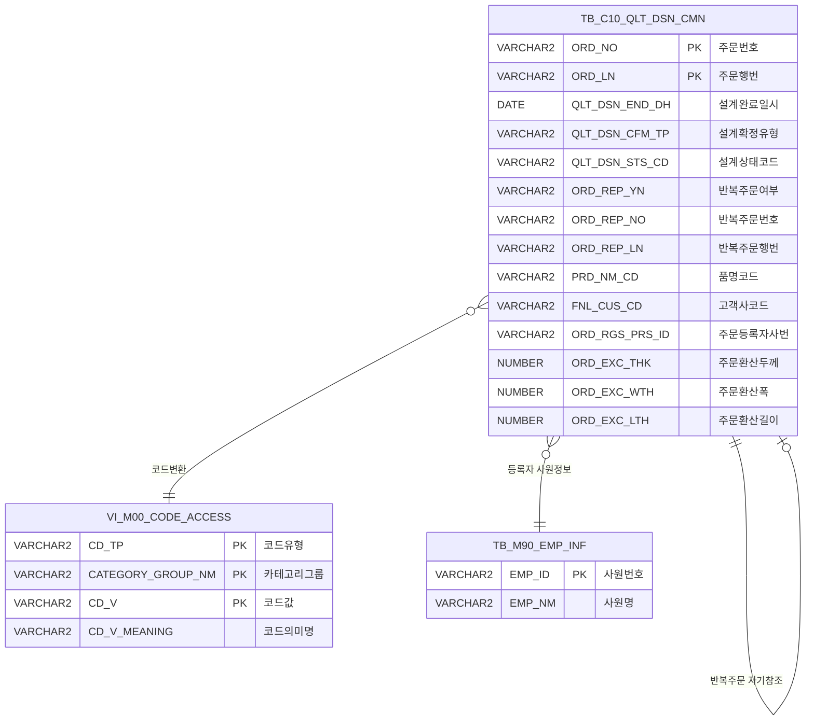

<h1 style="font-size: 40px; text-align: center; font-weight:
   bold; margin: 30px 0;">
  C104000060 레거시 시스템 분석 종합 보고서
</h1>


# 1. 시스템 개요
- **서비스 ID**: C104000060
- **업무명**: 반복주문자동설계 조회
- **분석 일시**: 2026-03-17 09:08 KST
- **분석 시간**: 약 5분
- **전체 Activity 수**: 4개 (Built-in 4개, Custom 0개)
- **분석자**: Claude Opus 4.6 / Claude Sonnet (UI분석)
- **분석 도구**: /analyze-service C104000060
- **문서 버전**: 1.0

# 📊 비즈니스 프로세스 분석

## 시스템 목적

본 서비스는 **반복주문 자동설계 결과를 조회**하는 화면이다. 품질설계(QLT_DSN) 공정에서 자동설계가 완료된 주문 중, 반복주문 여부(`ORD_REP_YN = 'X'`)가 표시된 주문을 기간별로 조회하여 반복주문번호와 원주문번호 간의 연결 관계를 확인할 수 있다.

사용자는 설계완료일자 범위, 고객사, 품명, 등록자, 주문번호 등 다양한 조건으로 검색할 수 있으며, 조회 결과에서 주문번호 또는 반복주문번호를 클릭하면 해당 주문의 상세 화면(C104000020)으로 이동하여 설계 내용을 확인할 수 있다. 고객사 콤보박스는 설계완료일자 범위에 따라 동적으로 필터링되어, 해당 기간에 실제 존재하는 고객사만 표시된다.

이 화면은 순수 조회 전용(SELECT only)으로, 데이터 수정 기능 없이 Router(분기) → FormSearch(조회) 패턴의 단순 구조로 구성되어 있다.

<!-- 단순 서비스: Custom Activity 0개 + SELECT 쿼리만 → 워크플로우 다이어그램 생략 -->

## 주요 유즈케이스

### UC-01: 기간별 반복주문 설계 결과 조회
- **Actor**: 품질설계 담당자
- **목적**: 특정 기간 내 자동설계가 완료된 반복주문 목록을 조회하여 설계 현황 파악

- **전제조건**:
  - 사용자가 시스템에 로그인되어 있음
  - 해당 기간에 자동설계가 완료된(`QLT_DSN_STS_CD = 'A'`, `QLT_DSN_CFM_TP = 'A'`) 반복주문 데이터가 존재함

- **주요 흐름**:
  1. 화면 진입 시 설계완료일자가 기본값으로 설정됨 (오늘 -30일 ~ 오늘)
  2. 고객사 콤보가 기본 날짜 범위 기준으로 자동 로드됨 (`C104000060FnlCusComb.select`)
  3. 필요 시 고객사, 품명, 등록자 조건 추가 입력
  4. 조회 버튼 클릭 → `C104000060.select` 실행
  5. Grid에 반복주문 설계 결과 목록 표시 (주문번호, 반복주문번호, 품명, 규격 등)

- **대체 흐름**:
  - 설계완료일자 미입력 시: "설계완료일자를 입력하지 않았습니다!" 경고
  - 시작일 > 종료일: "설계완료일자를 잘못 입력하였습니다!" 경고
  - 조회 결과 없음: 빈 Grid 표시

- **후행조건**:
  - Grid에 조회 결과가 표시됨
  - 주문번호/반복주문번호 클릭으로 상세 화면 이동 가능

### UC-02: 주문번호 기반 직접 검색
- **Actor**: 품질설계 담당자
- **목적**: 특정 주문번호/행번을 알고 있을 때 빠르게 해당 반복주문 설계 결과를 조회

- **전제조건**:
  - 사용자가 주문번호를 알고 있음
  - 등록자명(필수)을 알고 있음

- **주요 흐름**:
  1. 주문번호(ORD_NO) 필드에 주문번호 입력, 필요 시 행번(ORD_LN) 입력
  2. 등록자(ORD_RGS_PRS_ID) 입력 (사원명 LIKE 검색)
  3. 조회 버튼 클릭 → 주문번호 입력 감지 → `C104000060Ord.select` 실행
  4. TB_M90_EMP_INF 테이블과 JOIN하여 등록자명으로 필터링된 결과 표시

- **대체 흐름**:
  - 등록자명이 매칭되지 않는 경우: 빈 결과
  - 주문번호가 반복주문이 아닌 경우(`ORD_REP_YN ≠ 'X'`): 결과에서 제외

- **후행조건**:
  - 해당 주문번호의 반복주문 설계 정보가 Grid에 표시됨

### UC-03: 주문 상세 화면 이동
- **Actor**: 품질설계 담당자
- **목적**: 조회 결과에서 특정 주문의 상세 설계 내용을 확인하기 위해 상세 화면으로 이동

- **전제조건**:
  - Grid에 조회 결과가 표시되어 있음

- **주요 흐름**:
  1. Grid에서 주문번호(ORD_NO) 컬럼의 링크 클릭
  2. 선택된 행의 ORD_NO, ORD_LN 추출
  3. `parent.newRemoveOpenTab` 호출하여 C104000020 화면으로 이동
  4. 해당 주문의 상세 설계 화면 표시

- **대체 흐름**:
  - 반복주문번호(ORD_REP_NO) 클릭 시: ORD_REP_NO, ORD_REP_LN을 파라미터로 C104000020 화면 이동

- **후행조건**:
  - C104000020 상세 화면이 새 탭으로 열림

---
## 비즈니스 로직 상세

### 1. 코드값→의미명 변환 (스칼라 서브쿼리 패턴)

- **목적**: DB에 저장된 코드값(PRD_NM_CD, PRD_SHP, FLOW_CHL, ORD_KND, FNL_CUS_CD)을 사용자가 읽을 수 있는 의미명으로 변환하여 표시
- **처리 케이스**:

  **[케이스 1: 마스터 코드 테이블 기반 변환]**
  ```
    조건: 각 코드 컬럼에 대해 M00APUSER.VI_M00_CODE_ACCESS 뷰 참조
    처리:
      1. CD_TP = '[코드유형]' AND CATEGORY_GROUP_NM = 'SZ0000' 조건으로 필터
      2. CD_V = [원본 코드값] 조건으로 의미명(CD_V_MEANING) 조회
      3. 변환 대상 5개 컬럼:
         - PRD_NM_CD (품명코드) → CD_TP = 'PRD_NM_CD'
         - PRD_SHP (제품형태코드) → CD_TP = 'PRD_SHP'
         - FLOW_CHL (유통경로코드) → CD_TP = 'FLOW_CHL'
         - ORD_KND (주문종류코드) → CD_TP = 'ORD_KND'
         - FNL_CUS_CD (고객사코드) → CD_TP = 'CUS_CD'
  ```

### 2. 등록자명 역변환 (사번→사원명)

- **목적**: 주문등록자 사번(ORD_RGS_PRS_ID)을 사원명(EMP_NM)으로 변환하여 표시
- **처리 케이스**:

  **[케이스 1: C104000060.select - NVL 기반 fallback]**
  ```
    조건: 메인 조회 (기간별 검색)
    처리:
      1. M90APUSER.TB_M90_EMP_INF에서 EMP_ID = ORD_RGS_PRS_ID로 사원명 조회
      2. NVL로 감싸서 사원명이 없으면 사번 그대로 표시
      3. 등록자 조건 검색 시 EMP_NM LIKE '%검색어%'로 부분 매칭
  ```

  **[케이스 2: C104000060Ord.select - JOIN 기반]**
  ```
    조건: 주문번호 직접 검색
    처리:
      1. TB_M90_EMP_INF와 INNER JOIN (EMP_NM LIKE 검색어)
      2. T1.ORD_RGS_PRS_ID = T2.EMP_ID 조인 조건
      3. 사원명(EMP_NM)을 ORD_RGS_PRS_ID 별칭으로 표시
  ```

### 3. 날짜 범위 조건 처리

- **목적**: 사용자 입력 날짜를 Oracle DATE 비교에 적합한 형태로 변환
- **처리 케이스**:

  **[케이스 1: 종료일 +1 보정]**
  ```
    조건: 설계완료일자 범위 조회
    처리:
      1. 입력값에서 '-' 제거: REPLACE(:QLT_DSN_END_DH_STR, '-')
      2. TO_DATE 변환: TO_DATE(값, 'YYYYMMDD')
      3. 종료일에 +1일 추가하여 해당일 23:59:59까지 포함
      4. 조건: QLT_DSN_END_DH > 시작일 AND QLT_DSN_END_DH < 종료일+1
  ```

### 4. 고객사 콤보 동적 필터링

- **목적**: 설계완료일자 범위에 해당하는 고객사만 콤보에 표시하여 UX 개선
- **처리 케이스**:

  **[케이스 1: UNION ALL 기반 '전체' + 실제 고객사 목록]**
  ```
    조건: 날짜 범위 변경 시
    처리:
      1. DUAL에서 '%' / '　'(전각 공백) 행 생성 → '전체' 선택 옵션
      2. UNION ALL로 실제 고객사 목록 추가
      3. TB_C10_QLT_DSN_CMN에서 해당 기간의 고객사 GROUP BY
      4. 고객사명의 '&' 문자를 '&amp;'로 XML 이스케이프 처리
      5. 필터 조건: ORD_REP_YN='X', QLT_DSN_CFM_TP='A', QLT_DSN_STS_CD='A'
  ```

---

# 💾 데이터 요구사항

## 핵심 테이블

### 1. C10APUSER.TB_C10_QLT_DSN_CMN - (품질설계 공통 정보)
| 컬럼명 | 타입 | PK | 설명 |
|--------|------|----|------|
| ORD_NO | VARCHAR2 | ✅ | 주문번호 |
| ORD_LN | VARCHAR2 | ✅ | 주문행번 |
| QLT_DSN_END_DH | DATE | | 설계완료일시 |
| QLT_DSN_CFM_TP | VARCHAR2 | | 설계확정유형 ('A': 자동설계) |
| QLT_DSN_STS_CD | VARCHAR2 | | 설계상태코드 ('A': 완료) |
| ORD_REP_YN | VARCHAR2 | | 반복주문여부 ('X': 반복주문) |
| ORD_REP_NO | VARCHAR2 | | 반복주문번호 |
| ORD_REP_LN | VARCHAR2 | | 반복주문행번 |
| PRD_NM_CD | VARCHAR2 | | 품명코드 |
| PRD_SHP | VARCHAR2 | | 제품형태코드 |
| FLOW_CHL | VARCHAR2 | | 유통경로코드 |
| ORD_KND | VARCHAR2 | | 주문종류코드 |
| FNL_CUS_CD | VARCHAR2 | | 최종수요가(고객사)코드 |
| ORD_EXC_THK | NUMBER | | 주문환산두께 |
| ORD_EXC_WTH | NUMBER | | 주문환산폭 |
| ORD_EXC_LTH | NUMBER | | 주문환산길이 |
| ORD_RGS_PRS_ID | VARCHAR2 | | 주문등록자 사번 |

### 2. M00APUSER.VI_M00_CODE_ACCESS - (마스터 코드 뷰)
| 컬럼명 | 타입 | PK | 설명 |
|--------|------|----|------|
| CD_TP | VARCHAR2 | ✅ | 코드유형 (PRD_NM_CD, PRD_SHP 등) |
| CATEGORY_GROUP_NM | VARCHAR2 | ✅ | 카테고리그룹명 (SZ0000) |
| CD_V | VARCHAR2 | ✅ | 코드값 |
| CD_V_MEANING | VARCHAR2 | | 코드의미명 |

### 3. M90APUSER.TB_M90_EMP_INF - (사원 정보)
| 컬럼명 | 타입 | PK | 설명 |
|--------|------|----|------|
| EMP_ID | VARCHAR2 | ✅ | 사원번호 |
| EMP_NM | VARCHAR2 | | 사원명 |

## 데이터 플로우

### 1. 기간별 조회 (find)
```
[설계완료일자 범위 기반 반복주문 조회]
조회 버튼 클릭 (주문번호 미입력)
→ C104000060.select
  FROM C10APUSER.TB_C10_QLT_DSN_CMN T1
  스칼라서브쿼리: M00APUSER.VI_M00_CODE_ACCESS (코드변환 5건)
  스칼라서브쿼리: M90APUSER.TB_M90_EMP_INF (사원명 변환)
  WHERE QLT_DSN_END_DH > TO_DATE(시작일)
    AND QLT_DSN_END_DH < TO_DATE(종료일) + 1
    AND ORD_REP_YN = 'X'
    AND ORD_REP_NO IS NOT NULL
    AND QLT_DSN_CFM_TP = 'A'
    AND QLT_DSN_STS_CD = 'A'
    AND 등록자 조건 (선택)
    AND 고객사 LIKE 조건 (선택)
    AND 품명 LIKE 조건 (선택)
  ORDER BY QLT_DSN_END_DH, ORD_NO
→ Grid에 결과 표시
```

### 2. 주문번호 직접 검색 (findord)
```
[주문번호 기반 반복주문 조회]
조회 버튼 클릭 (주문번호 입력됨)
→ C104000060Ord.select
  FROM C10APUSER.TB_C10_QLT_DSN_CMN T1
  INNER JOIN M90APUSER.TB_M90_EMP_INF T2
    ON T1.ORD_RGS_PRS_ID = T2.EMP_ID
    AND T2.EMP_NM LIKE '%등록자명%'
  스칼라서브쿼리: M00APUSER.VI_M00_CODE_ACCESS (코드변환 5건)
  WHERE ORD_REP_YN = 'X'
    AND QLT_DSN_CFM_TP = 'A'
    AND QLT_DSN_STS_CD = 'A'
    AND ORD_NO LIKE 주문번호%
    AND ORD_LN LIKE 행번%
  ORDER BY QLT_DSN_END_DH, ORD_NO
→ Grid에 결과 표시
```

### 3. 고객사 콤보 로드 (findItem)
```
[설계완료일자 기간 내 고객사 목록 조회]
폼 로드 또는 날짜 변경 시
→ C104000060FnlCusComb.select
  SELECT '%' AS FNL_CUS_CD, '　' AS FNL_CUS_NM FROM DUAL
  UNION ALL
  SELECT FNL_CUS_CD, 고객사명(코드변환)
  FROM C10APUSER.TB_C10_QLT_DSN_CMN
  WHERE ORD_REP_YN = 'X'
    AND QLT_DSN_CFM_TP = 'A'
    AND QLT_DSN_STS_CD = 'A'
    AND 날짜 범위 조건
  GROUP BY FNL_CUS_CD
→ 고객사 콤보박스에 바인딩
```

## SQL 일람표
| SQL 이름 | 쿼리 ID | 타입 | 출처 | 테이블 |
|---------|---------|-----|-------|-------|
| 기간별 조회 | C104000060.select | SELECT | Service | TB_C10_QLT_DSN_CMN, VI_M00_CODE_ACCESS, TB_M90_EMP_INF |
| 주문번호 검색 | C104000060Ord.select | SELECT | Service | TB_C10_QLT_DSN_CMN, VI_M00_CODE_ACCESS, TB_M90_EMP_INF |
| 고객사콤보 리스트 | C104000060FnlCusComb.select | SELECT | Service | TB_C10_QLT_DSN_CMN, VI_M00_CODE_ACCESS, DUAL |

## ER 다이어그램 (핵심 관계)



관계 설명:
- **TB_C10_QLT_DSN_CMN**이 중심 테이블로 모든 관계의 허브 역할
- **자기 참조 관계**: ORD_REP_NO → ORD_NO를 통한 반복주문 연결 (원주문↔반복주문)
- **코드 마스터 관계**: PRD_NM_CD, PRD_SHP, FLOW_CHL, ORD_KND, FNL_CUS_CD → VI_M00_CODE_ACCESS 코드변환 (5건의 스칼라 서브쿼리)
- **사원 정보 관계**: ORD_RGS_PRS_ID → TB_M90_EMP_INF.EMP_ID (사번→사원명 변환)

---

# 🖥️ 사용자 인터페이스 요구사항

## 화면 레이아웃 상세

### Layout 구조 (flat 레이아웃)
```javascript
{
  itemType: "flat",
  components: [
    {
      id: "C104000060_Form_1",
      type: "form",
      position: { left: 0, top: 0, width: 981, height: 30 },
      service: "C104000060-service",
      actionType: "find"
    },
    {
      id: "C104000060_Grid_1",
      type: "grid",
      position: { left: 1, top: 31, width: 977, height: 534 },
      service: "C104000060-service",
      actionType: "save",
      rowCnt: 22,
      pageset: true,
      contextmenu: true
    },
    {
      id: "C104000060_messagebox",
      type: "messagebox",
      position: { left: 0, top: 566, width: 979, height: 19 }
    }
  ]
}
```

## 입출력 요소

### Form 컴포넌트
**C104000060_Form_1** (반복주문자동설계 조회 조건)
- QLT_DSN_END_DH_STR: Calendar - 완료일자(시작), 필수, 배경색 #FFFFC0, 너비 63px, readonly
- QLT_DSN_END_DH_END: Calendar - 완료일자(종료), 필수, 배경색 #FFFFC0, 너비 63px, readonly
- FNL_CUS_NAME: Combo - 고객사, 너비 60px, 동적 데이터소스 (OrdlnComboData.do, 날짜 변경 시 재로드)
- PRD_NM_CD: Combo - 품명, 너비 55px, 마스터코드 SZ0000
- ORD_RGS_PRS_ID: Input - 등록자, 너비 60px, 최대 20자, 배경색 #FFFFC0, Enter 시 조회 트리거, 자동 대문자 변환
- ORD_NO: Input - 주문번호, 너비 65px, 최대 10자
- ORD_LN: Input - 행번, 너비 30px, 최대 3자
- clear: Button - 초기 (폼 초기화)
- find: Button - 조회 (초기 disabled 상태)
- winClose: Button - 닫기

### Grid 컴포넌트

**C104000060_Grid_1 (반복주문자동설계 결과)**
- 편집 가능 여부: 아니오 (읽기 전용)
- Split: 없음 (고정 컬럼 없음)
- Smart Rendering: 사용 (대량 데이터 성능 최적화)
- 행 높이: 22px, 사전 렌더링: 10행
- 페이지셋: 사용
- 컨텍스트 메뉴: 사용 (컬럼 이동, 필터, 편집 모드 토글, 엑셀 다운로드)
- 주요 컬럼 (14개):

  **기본 정보**:
  - QLT_DSN_END_DH: ro - 설계완료일자 (9%, 중앙정렬, 커스텀정렬)
  - ORD_NO: ahref_idx - 주문번호 (9%, 중앙정렬, 클릭 시 C104000020으로 이동, 파라미터: ORD_NO, ORD_LN)
  - ORD_LN: ro - 주문행번 (3%, 중앙정렬)

  **제품 정보**:
  - PRD_NM_CD: ro - 품명 (6%, 중앙정렬)
  - PRD_SHP: ro - 제품유형 (6%, 중앙정렬)
  - FLOW_CHL: ro - 경로/유통경로 (5%, 중앙정렬)
  - ORD_KND: ro - 주문종류 (14%, 좌측정렬)
  - FNL_CUS_CD: ro - 고객사 (*, 좌측정렬, 가변폭)

  **규격 정보**:
  - ORD_EXC_THK: ron - 두께 (6%, 우측정렬, 포맷: 0.000)
  - ORD_EXC_WTH: ron - 폭 (6%, 우측정렬, 포맷: 0000.0)
  - ORD_EXC_LTH: ron - 길이 (6%, 우측정렬, 포맷: 0000)

  **반복주문 정보**:
  - ORD_REP_NO: ahref_idx - 반복주문번호 (9%, 중앙정렬, 클릭 시 C104000020으로 이동, 파라미터: ORD_REP_NO, ORD_REP_LN)
  - ORD_REP_LN: ro - 반복주문행번 (3%, 중앙정렬)

  **등록 정보**:
  - ORD_RGS_PRS_ID: ro - 주문등록자 (8%, 중앙정렬)

## 화면 동작 흐름

### 1. 화면 초기 로딩
```
1. 화면 진입 → onLoadForm 이벤트 발생
2. 설계완료일자 기본값 설정:
   - 시작일: 오늘 -30일
   - 종료일: 오늘
3. 고객사 콤보 로드 (OrdlnComboData.do → C104000060-service findItem)
   - C104000060FnlCusComb.select 실행
   - 기간 내 고객사 목록 바인딩
4. 품명 콤보 로드 (마스터코드 SZ0000)
5. 주문번호, 행번 초기화
6. onLoadGrid 이벤트 → 자동 조회 실행
   - 기본 날짜 범위로 C104000060.select 호출
   - Grid에 결과 표시
7. 상태바 초기화
```

### 2. 조건 조회 (find)
```
1. 사용자가 조건 입력 (고객사, 품명, 등록자 등)
2. 조회 버튼 클릭
3. 유효성 검증:
   - 설계완료일자 시작/종료 필수 입력 확인
   - 시작일 ≤ 종료일 확인 (날짜 순서 검증)
4. 주문번호 입력 여부 분기:
   - 주문번호 미입력 → cmd = "find" → 분기 Activity → 조회 (C104000060.select)
   - 주문번호 입력됨 → cmd = "findord" → 분기 Activity → 주문번호로찾기 (C104000060Ord.select)
5. basicGridData.do 호출 → Grid에 결과 바인딩
```

### 3. 화면 이동 (Grid 링크 클릭)
```
1. Grid에서 주문번호(ORD_NO) 또는 반복주문번호(ORD_REP_NO) 셀 클릭
2. Grid_doLink 핸들러 실행
3. 클릭된 컬럼 판별:
   - ORD_NO 클릭 → 파라미터: {ORD_NO, ORD_LN}
   - ORD_REP_NO 클릭 → 파라미터: {ORD_REP_NO, ORD_REP_LN}
4. parent.newRemoveOpenTab 호출
5. C104000020 (주문 상세) 화면으로 이동
```

### 4. 날짜 변경 시 콤보 재로드
```
1. 설계완료일자 시작/종료 변경 → OnDataChanged 이벤트
2. 변경된 날짜 범위로 고객사 콤보 재로드
   - OrdlnComboData.do → C104000060FnlCusComb.select
3. 콤보 선택값 초기화 (전체)
```

## JavaScript 모듈

**C104000060.jsp** (메인 화면 스크립트, JSP 내장)
- onLoadForm(): 폼 초기화 - 날짜 기본값(-30일~오늘) 설정, 콤보 로드, 주문번호/행번 초기화
- OnDataChanged(name, value): 폼 값 변경 이벤트 - 날짜 변경 시 고객사 콤보 동적 재로드
- onLoadGrid(): 그리드 초기화 - 자동 조회 실행 (날짜 조건 포함)
- find: 조회 처리 - 날짜 필수 입력/순서 검증, 주문번호 유무에 따라 find/findord 분기
- clear: 초기화 - 폼 초기화 후 onLoadForm 재실행
- Grid_doLink(id, ind): 그리드 셀 링크 클릭 - ORD_NO/ORD_REP_NO 클릭 시 C104000020 화면 이동

## 주요 이벤트 핸들러

**onLoadForm (폼 초기 로드)**
- 이벤트 타입: onXLEEvent
- 처리 내용:
  1. 설계완료일자 시작/종료 기본값 설정 (-30일 ~ 오늘)
  2. OrdlnComboData.do 호출하여 고객사 콤보 로드
  3. 마스터코드 SZ0000으로 품명 콤보 로드
  4. 주문번호, 행번 필드 초기화

**OnDataChanged (폼 값 변경)**
- 이벤트 타입: onChange
- 처리 내용:
  1. 변경된 필드 확인
  2. 날짜 필드 변경 시 고객사 콤보 데이터 재조회
  3. 동적 파라미터(QLT_DSN_END_DH_STR, QLT_DSN_END_DH_END)로 콤보 리프레시

**onGridContextMenuClick (컨텍스트 메뉴)**
- 이벤트 타입: Grid 우클릭
- 처리 내용:
  1. move_grid: 컬럼 이동
  2. filter_grid: 헤더 필터 토글
  3. editable_grid: 편집 모드 토글
  4. excel_grid: 엑셀 다운로드

---

# 📌 특이사항 및 주의사항

## 1. 두 가지 조회 모드의 SQL 구조 차이
- **기간별 조회(find)**: `C104000060.select`는 사원 테이블을 **스칼라 서브쿼리 + NVL**로 조인. 사원 정보가 없어도 사번 그대로 표시되는 Fallback 로직 존재
- **주문번호 검색(findord)**: `C104000060Ord.select`는 사원 테이블을 **INNER JOIN**으로 연결. 등록자명이 매칭되지 않으면 결과 자체가 조회되지 않는 구조적 차이 존재
- 동일한 비즈니스 목적이지만 SQL 구현 방식이 다르므로, 현대화 시 통합 검토 필요

## 2. 고객사 콤보의 XML 이스케이프 처리
- `C104000060FnlCusComb.select`에서 고객사명의 `&` 문자를 `&amp;`로 REPLACE 처리
- DHTMLX 콤보가 XML 기반으로 데이터를 수신하기 때문에 XML 특수문자 이스케이프 필수
- `(resultkey) = "xml-result"` 속성으로 XML 형식 응답 강제 지정

## 3. 반복주문 필터 조건의 하드코딩
- `ORD_REP_YN = 'X'`, `QLT_DSN_CFM_TP = 'A'`, `QLT_DSN_STS_CD = 'A'` 3가지 조건이 모든 SQL에 하드코딩
- 이 값들은 코드 테이블에서 관리되는 것이 아닌 직접 리터럴로 비교
- 특히 `ORD_REP_YN = 'X'`는 일반적인 'Y'/'N' 패턴이 아닌 'X' 사용이 비표준적

## 4. 등록자 검색의 대소문자 자동 변환
- JSP에서 등록자(ORD_RGS_PRS_ID) 입력 시 keyup 이벤트로 자동 대문자 변환 수행
- 사번이 대문자 알파벳 기반임을 전제로 한 구현
- 사원명(한글) 검색과 사번(영문) 직접 입력 두 가지 용도로 사용되나, SQL에서는 사원명 LIKE 검색으로만 동작

## 5. 날짜 비교 연산자의 비대칭
- `QLT_DSN_END_DH > 시작일` (초과)와 `QLT_DSN_END_DH < 종료일+1` (미만) 사용
- 시작일 당일의 00:00:00 데이터는 제외될 수 있음 (`>`가 아닌 `>=` 사용이 더 정확)
- 이는 의도적인 것인지 버그인지 확인 필요

---

# 📚 참고 문서

- **Service XML**: `src/service/C104000060-service.xml`
- **Query SQL**: `src/query/C104000060-query.glue_sql`
- **JSP 화면**: `WebContents/C104000060.jsp`
- **Form XML**: `WebContents/header/kr/C104000060/C104000060_Form_1.xml`
- **Grid XML**: `WebContents/header/kr/C104000060/C104000060_Grid_1.xml`
- **Messagebox XML**: `WebContents/header/kr/C104000060/C104000060_messagebox.xml`
