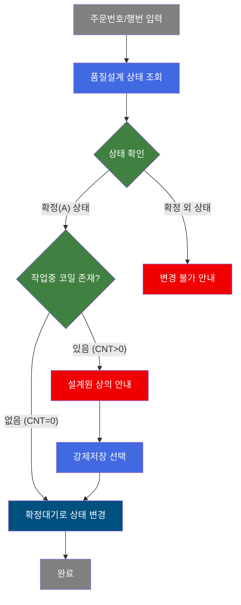
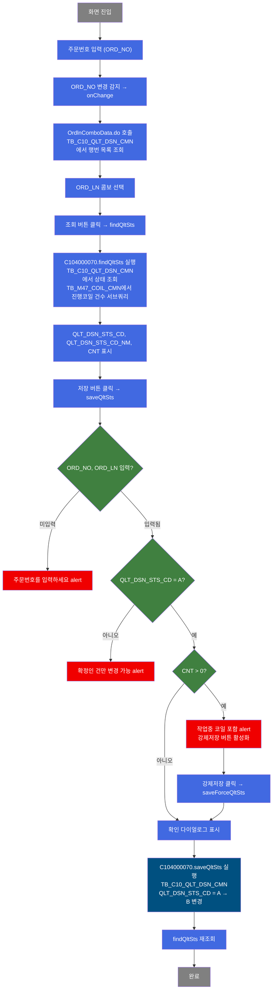
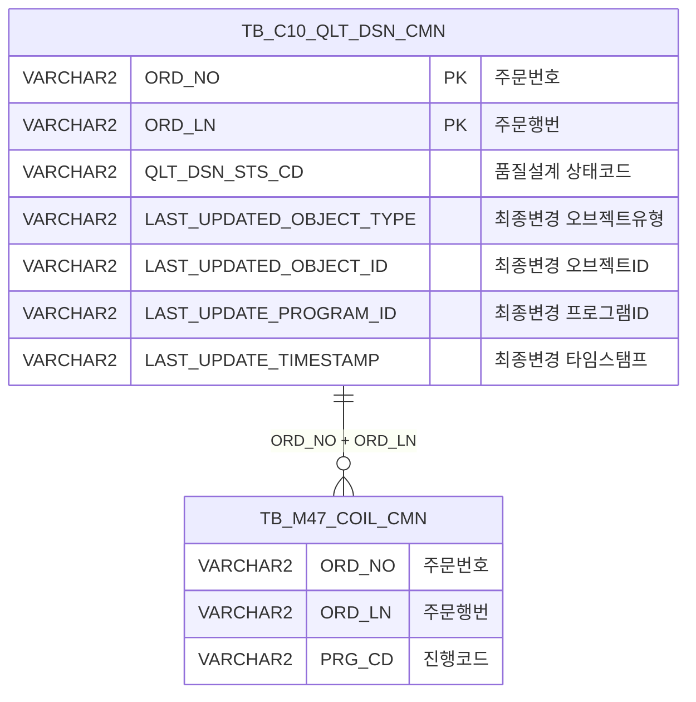

<h1 style="font-size: 40px; text-align: center; font-weight:
   bold; margin: 30px 0;">
  C104000070 레거시 시스템 분석 종합 보고서
</h1>


# 1. 시스템 개요
- **서비스 ID**: C104000070
- **업무명**: 품질설계 B/U (Back Up)
- **분석 일시**: 2026-03-17 09:38 KST
- **분석 시간**: 약 5분
- **전체 Activity 수**: 4개 (Built-in 4개, Custom 0개)
- **분석자**: Claude Opus 4.6 / Claude Sonnet 4.6
- **분석 도구**: /analyze-service C104000070
- **문서 버전**: 1.0

# 📊 비즈니스 프로세스 분석

## 시스템 목적

C104000070 화면은 품질설계 확정 상태를 확정대기 상태로 되돌리는 백업(B/U) 기능을 제공한다. 품질설계가 확정(A) 상태일 때, 설계 변경이나 오류 수정이 필요한 경우 확정대기(B) 상태로 롤백하여 재설계를 가능하게 한다.

주문번호와 주문행번을 입력하면 해당 품질설계의 현재 상태와 진행 중인 코일 건수를 조회하고, 확정 상태인 건에 대해서만 확정대기로 변경할 수 있다. 작업대기 또는 작업중(작업완료) 코일이 포함된 경우에는 일반 저장이 불가하며, 설계원과 상의 후 강제저장을 통해서만 상태 변경이 가능하다.

## 핵심 워크플로우 다이어그램



### 상세 워크플로우 다이어그램



## 주요 유즈케이스

### UC-01: 품질설계 상태 조회

- **Actor**: 품질설계 담당자 / 오퍼레이터
- **목적**: 특정 주문의 품질설계 현재 상태 및 진행 중인 코일 건수를 확인

- **전제조건**:
  - 사용자가 시스템에 로그인되어 있음
  - 조회할 주문번호를 알고 있음
  - 해당 주문이 TB_C10_QLT_DSN_CMN 테이블에 존재함

- **주요 흐름**:
  1. 주문번호(ORD_NO) 입력 → onChange 이벤트 발생
  2. OrdlnComboData.do 호출로 해당 주문의 행번 목록을 콤보에 로드 (C104000070.combo 쿼리)
  3. 주문행번(ORD_LN) 콤보에서 선택
  4. 조회 버튼 클릭 → findQltSts 실행
  5. C104000070.findQltSts 쿼리로 품질설계 상태(QLT_DSN_STS_CD), 상태명(DECODE 변환), 진행코일 건수(CNT) 조회
  6. Form에 현재상태, 상태명, 코일건수 표시

- **대체 흐름**:
  - 해당 주문이 TB_C10_QLT_DSN_CMN에 없는 경우: 빈 데이터 반환
  - 주문번호 미입력 상태에서 조회: 빈 결과 표시

- **후행조건**:
  - 현재 품질설계 상태가 Form에 표시됨
  - 저장/강제저장 가능 여부를 판단할 수 있는 상태

### UC-02: 품질설계 상태 변경 (일반 저장)

- **Actor**: 품질설계 담당자
- **목적**: 확정(A) 상태의 품질설계를 확정대기(B) 상태로 롤백하여 재설계 가능하게 함

- **전제조건**:
  - UC-01을 통해 품질설계 상태가 조회된 상태
  - 품질설계 상태가 'A'(확정)임
  - 진행 중인 코일(CNT)이 0건임

- **주요 흐름**:
  1. 저장 버튼 클릭 → saveQltSts 실행
  2. 주문번호/행번 입력 여부 검증
  3. 품질설계 상태가 'A'(확정)인지 검증
  4. 진행 중 코일 건수(CNT) 0 확인
  5. "확정 대기상태로 변경 하시겠습니까?" 확인 다이얼로그 표시
  6. 확인 클릭 시 handleDataProcess.do로 C104000070.saveQltSts UPDATE 실행
  7. QLT_DSN_STS_CD를 'A' → 'B'로 변경
  8. 저장 완료 후 findQltSts 자동 재조회

- **대체 흐름**:
  - 주문번호 미입력: "주문번호를 입력하세요" alert
  - 상태가 'A'가 아닌 경우: "품질설계 상태가 확정인 건만 확정대기 상태로 변경 가능합니다" alert
  - CNT > 0인 경우: "작업대기 또는 작업중(작업완료) 코일이 포함되어있습니다. 설계원과 상의하세요" alert → 강제저장 버튼 활성화

- **후행조건**:
  - TB_C10_QLT_DSN_CMN의 QLT_DSN_STS_CD가 'B'로 변경됨
  - 감사 컬럼(LAST_UPDATED_OBJECT_TYPE, LAST_UPDATED_OBJECT_ID, LAST_UPDATE_PROGRAM_ID, LAST_UPDATE_TIMESTAMP) 갱신
  - Form에 변경된 상태 반영

### UC-03: 품질설계 상태 강제 변경

- **Actor**: 품질설계 담당자 (설계원 상의 후)
- **목적**: 작업중 코일이 존재하더라도 품질설계 상태를 강제로 확정대기로 롤백

- **전제조건**:
  - UC-02 실행 시 CNT > 0으로 강제저장 버튼이 활성화된 상태
  - 설계원과 사전 상의 완료

- **주요 흐름**:
  1. 강제저장 버튼 클릭 → saveForceQltSts 실행
  2. 주문번호/행번 입력 여부 검증
  3. 품질설계 상태가 'A'(확정)인지 검증
  4. CNT 체크 없이 바로 확인 다이얼로그 표시
  5. 확인 시 handleDataProcess.do로 C104000070.saveQltSts UPDATE 실행
  6. 저장 완료 후 findQltSts 자동 재조회

- **대체 흐름**:
  - 주문번호 미입력: "주문번호를 입력하세요" alert
  - 상태가 'A'가 아닌 경우: "품질설계 상태가 확정인 건만 확정대기 상태로 변경 가능합니다" alert

- **후행조건**:
  - 작업중 코일이 존재하더라도 TB_C10_QLT_DSN_CMN의 QLT_DSN_STS_CD가 'B'로 변경됨
  - 강제저장 버튼 비활성화 (다음 조회 시 findQltSts에서 초기화)

---

## 비즈니스 로직 상세

### 1. 품질설계 상태 코드 변환 (DECODE)

- **목적**: 품질설계 상태 코드값을 사용자가 이해할 수 있는 한글 상태명으로 변환
- **처리 케이스**:

  **[케이스 1: DECODE 기반 상태명 변환]**
  ```
    조건: QLT_DSN_STS_CD 값에 따라 분기
    처리:
      - 'A' → '확정'
      - 'B' → '확정대기'
      - 'E' → '에러'
      - 'X' → '종료'
      - 그 외 → '기타'
  ```

### 2. 진행 코일 건수 산출 (서브쿼리)

- **목적**: 해당 주문에 대해 작업대기/작업중/작업완료 상태의 코일 건수를 산출하여 상태 변경 가능 여부 판단 근거 제공
- **처리 케이스**:

  **[케이스 1: PRG_CD 기반 진행코일 필터링]**
  ```
    조건: TB_M47_COIL_CMN에서 동일 ORD_NO, ORD_LN의 코일
    처리:
      1. PRG_CD NOT IN ('A','B','C','E') 조건으로 필터링
      2. 'A'(미착수), 'B'(대기), 'C'(완료), 'E'(에러)를 제외한 진행중 코일만 카운트
      3. COUNT(*) 결과를 CNT로 반환
    의미:
      - CNT = 0: 안전하게 상태 변경 가능
      - CNT > 0: 작업 진행 중 코일 존재 → 강제저장만 가능
  ```

### 3. 품질설계 상태 변경 (UPDATE)

- **목적**: 품질설계 확정 상태를 확정대기로 롤백
- **처리 케이스**:

  **[케이스 1: 확정 → 확정대기 변경]**
  ```
    조건: QLT_DSN_STS_CD = 'A' (확정 상태)
    처리:
      1. QLT_DSN_STS_CD를 'B'(확정대기)로 UPDATE
      2. WHERE 절에 QLT_DSN_STS_CD = 'A' 조건 포함 → 동시 변경 방지
      3. 감사 컬럼 4개 동시 갱신:
         - LAST_UPDATED_OBJECT_TYPE: 변경자 유형
         - LAST_UPDATED_OBJECT_ID: 변경자 ID
         - LAST_UPDATE_PROGRAM_ID: 변경 프로그램 ID
         - LAST_UPDATE_TIMESTAMP: 변경 시각
  ```

---

# 💾 데이터 요구사항

## 핵심 테이블

### 1. C10APUSER.TB_C10_QLT_DSN_CMN - 품질설계 공통 마스터

| 컬럼명 | 타입 | PK | 설명 |
|--------|------|----|------|
| ORD_NO | VARCHAR2 | ✅ | 주문번호 |
| ORD_LN | VARCHAR2 | ✅ | 주문행번 |
| QLT_DSN_STS_CD | VARCHAR2 | | 품질설계 상태코드 (A:확정, B:확정대기, E:에러, X:종료) |
| LAST_UPDATED_OBJECT_TYPE | VARCHAR2 | | 최종변경 오브젝트유형 |
| LAST_UPDATED_OBJECT_ID | VARCHAR2 | | 최종변경 오브젝트ID |
| LAST_UPDATE_PROGRAM_ID | VARCHAR2 | | 최종변경 프로그램ID |
| LAST_UPDATE_TIMESTAMP | VARCHAR2 | | 최종변경 타임스탬프 |

### 2. TB_M47_COIL_CMN - 코일 공통 (참조)

| 컬럼명 | 타입 | PK | 설명 |
|--------|------|----|------|
| ORD_NO | VARCHAR2 | | 주문번호 |
| ORD_LN | VARCHAR2 | | 주문행번 |
| PRG_CD | VARCHAR2 | | 진행코드 (A:미착수, B:대기, C:완료, E:에러 등) |

## 데이터 플로우

### 1. 조회

```
[주문행번 콤보 로드]
주문번호(ORD_NO) 입력 후 onChange 이벤트
→ C104000070.combo
  FROM C10APUSER.TB_C10_QLT_DSN_CMN
  WHERE ORD_NO = :ORD_NO
→ ORD_LN 콤보박스에 행번 목록 표시

[품질설계 상태 조회]
조회 버튼 클릭 → findQltSts
→ C104000070.findQltSts
  FROM C10APUSER.TB_C10_QLT_DSN_CMN A
  서브쿼리: SELECT COUNT(*) FROM TB_M47_COIL_CMN
           WHERE ORD_NO = A.ORD_NO AND ORD_LN = A.ORD_LN
           AND PRG_CD NOT IN ('A','B','C','E')
  WHERE ORD_NO = :ORD_NO AND ORD_LN = :ORD_LN
→ Form에 상태코드, 상태명(DECODE), 진행코일건수 표시
```

### 2. 상태 변경 (저장)

```
[품질설계 상태 변경]
저장/강제저장 버튼 → saveQltSts/saveForceQltSts
→ C104000070.saveQltSts
  UPDATE C10APUSER.TB_C10_QLT_DSN_CMN
  SET QLT_DSN_STS_CD = 'B',
      LAST_UPDATED_OBJECT_TYPE = :ObjectType,
      LAST_UPDATED_OBJECT_ID = :ObjectId,
      LAST_UPDATE_PROGRAM_ID = :ProgramId,
      LAST_UPDATE_TIMESTAMP = :Timestamp
  WHERE ORD_NO = :ORD_NO AND ORD_LN = :ORD_LN
        AND QLT_DSN_STS_CD = 'A'
→ 저장 완료 후 findQltSts 자동 재조회
```

## SQL 일람표

| SQL 이름 | 쿼리 ID | 타입 | 출처 | 테이블 |
|---------|---------|------|------|--------|
| 품질설계상태조회 | C104000070.findQltSts | SELECT | Service | C10APUSER.TB_C10_QLT_DSN_CMN, TB_M47_COIL_CMN |
| 품질설계상태변경 | C104000070.saveQltSts | UPDATE | Service | C10APUSER.TB_C10_QLT_DSN_CMN |
| 품질설계행번조회 | C104000070.combo | SELECT | Service | C10APUSER.TB_C10_QLT_DSN_CMN |

## ER 다이어그램 (핵심 관계)



관계 설명:
- TB_C10_QLT_DSN_CMN이 중심 테이블로 품질설계 상태를 관리
- TB_M47_COIL_CMN은 ORD_NO + ORD_LN으로 연결되며, 진행 중인 코일 건수 산출에 사용
- 1:N 관계: 하나의 주문행에 여러 코일이 존재할 수 있음

---

# 🖥️ 사용자 인터페이스 요구사항

## 화면 레이아웃 상세

### Layout 구조 (initLayout)
```javascript
{
  programId: "C104000070",
  itemType: "layout",
  dirType: "row",       // 수직 분할
  messageBox: true,      // 상태바 활성화
  splitter: false,       // 크기 조정 불가
  childSize: ",",
  components: [
    {
      itemType: "form",
      referenceItem: "C104000070_Form_1",
      xml: "./header/kr/C104000070/C104000070_Form_1.xml",
      url: "basicFormData.do",
      service: "C104000070-service",
      actionType: "save",
      security: "true"
    }
  ]
}
```

## 입출력 요소

### Form 컴포넌트

**C104000070_Form_1** (품질설계 확정 상태 변경 - Fieldset 너비 340px)

- ORD_NO: input - 주문번호 (너비 75px, 최대 10자, 배경색 #FFFFC0, 편집 가능)
- ORD_NO_BT: label - 구분자 "-"
- ORD_LN: combo - 주문행번 (너비 50px, 최대 3자, 배경색 #FFFFC0, 동적 로드)
- findQltSts: custombutton - "조회" 버튼 → findQltSts 함수 호출
- saveQltSts: custombutton - "저장" 버튼 → saveQltSts 함수 호출
- QLT_DSN_STS_CD: input - 현재상태 코드 (너비 30px, 라벨 "현재상태" 52px, 읽기전용)
- QLT_DSN_STS_CD_NM: input - 상태명 (너비 80px, 읽기전용)
- CNT: input - 작업코일 수 (너비 30px, 읽기전용)
- saveForceQltSts: custombutton - "강제저장" 버튼 → saveForceQltSts 함수 호출 (초기 비활성)

## 화면 동작 흐름

### 1. 화면 초기 로딩
```
1. 화면 진입
2. ui.initializeDHTMLX() 호출로 DHTMLX 컴포넌트 초기화
3. C104000070_Form_1 폼 렌더링
4. onChange 이벤트 핸들러 등록 (items[aForm1].getDhxForm().attachEvent)
5. onXLEEvent(onFormLoadEvent) 등록 (현재 빈 함수)
6. onAfterUpdateFinishEvent 핸들러 등록
7. 강제저장 버튼 초기 비활성 상태
8. 상태바(messageBox) 초기화
```

### 2. 주문번호 입력 및 행번 조회
```
1. 사용자가 ORD_NO 필드에 주문번호 입력
2. onChange 이벤트 발생 (id == "ORD_NO" 체크)
3. ORD_LN 콤보의 readonly 해제 (comboList['ORD_LN'].readonly(false,false))
4. ui.combo() 호출:
   - URL: OrdlnComboData.do
   - 파라미터: ServiceName=C104000070-service&OrdLnFind=1&column-info=ORD_LN,ORD_LN&ORD_NO={입력값}
   - 서비스: C104000070-service, 명령: combo
5. C104000070.combo 쿼리 실행 → ORD_LN 콤보에 행번 목록 로드
```

### 3. 상태 조회 및 저장
```
1. ORD_LN 콤보에서 행번 선택
2. 조회 버튼 클릭 → findQltSts 실행
3. 강제저장 버튼 비활성화 (disableItem)
4. uiCommon.parameters6("C104000070_Form_1","C104000070_Form_1",eventName) 호출
5. items["C104000070_Form_1"].loadData(findUrl) 호출
6. C104000070.findQltSts 쿼리 실행 → Form에 결과 바인딩
7. 저장 버튼 클릭 시 saveQltSts/saveForceQltSts 검증 로직 실행
8. 확인 다이얼로그 후 sendForm("handleDataProcess.do") 호출
9. 완료 후 findQltSts 자동 재조회
```

## JavaScript 모듈

**C104000070.jsp** (메인 화면 인라인 스크립트)
- findQltSts(eventName, formDivObj, referenceItem): 품질설계 상태 조회 (uiCommon.parameters6로 URL 구성 → Form.loadData로 데이터 로드)
- saveQltSts(eventName, formDivObj, referenceItem): 일반 저장 (getDhxForm().getItemValue로 값 추출 → 검증 → dhtmlx.confirm → sendForm)
- saveForceQltSts(eventName, formDivObj, referenceItem): 강제 저장 (CNT 검증 없이 → dhtmlx.confirm → sendForm)
- onFormLoadEvent(): 폼 XLE 이벤트 핸들러 (현재 빈 함수)
- onChange(id, value): 폼 필드 변경 이벤트 (ORD_NO 변경 시 ui.combo로 ORD_LN 콤보 동적 로드)
- onAfterUpdateFinishEvent(): 데이터 처리 완료 후 clearDataProcess + resetDataProcessor("updated") 호출

**c10.ui.js** (공통 스크립트 - 외부 참조)

## 주요 이벤트 핸들러

**findQltSts (조회 버튼 클릭)**
- 이벤트 타입: custombutton click
- 처리 내용:
  1. 강제저장 버튼 비활성화 (disableItem('saveForceQltSts'))
  2. uiCommon.parameters6으로 조회 URL 생성
  3. C104000070_Form_1.loadData(findUrl)로 데이터 조회
  4. uiCommon.progressOff(parent)로 진행 표시 제거

**saveQltSts (저장 버튼 클릭)**
- 이벤트 타입: custombutton click
- 처리 내용:
  1. ORD_NO, ORD_LN, QLT_DSN_STS_CD, CNT 값 추출 (getItemValue)
  2. 주문번호/행번 미입력 체크 → alert
  3. 품질설계 상태 'A' 여부 체크 → alert
  4. CNT > 0 체크 → alert + 강제저장 버튼 활성화 (enableItem)
  5. 모든 검증 통과 시 dhtmlx.confirm 다이얼로그 표시
  6. 확인 시 sendForm("handleDataProcess.do") 호출
  7. 저장 후 findQltSts 재조회

**onChange (폼 필드 변경)**
- 이벤트 타입: Form onChange
- 처리 내용:
  1. 변경된 필드 ID가 "ORD_NO"인지 확인
  2. ORD_NO 값 추출
  3. ORD_LN 콤보 readonly 해제
  4. ui.combo로 OrdlnComboData.do 호출하여 행번 콤보 동적 갱신

**onAfterUpdateFinishEvent (데이터 처리 완료)**
- 이벤트 타입: Form onAfterUpdateFinish
- 처리 내용:
  1. clearDataProcess() 호출로 DataProcessor 초기화
  2. getDhxForm().resetDataProcessor("updated") 상태 리셋

---

# 📌 특이사항 및 주의사항

## 1. 강제저장 2단계 보안 패턴
- 일반 저장(saveQltSts)에서 작업중 코일(CNT > 0) 감지 시 강제저장 버튼이 활성화되는 2단계 보안 패턴 적용
- 강제저장(saveForceQltSts)은 CNT 검증을 건너뛰고 바로 확인 다이얼로그로 진행
- 강제저장 사용 시 설계원과의 사전 상의가 전제조건이나, 시스템적으로 이를 강제하지는 않음 (운영 절차에 의존)

## 2. UPDATE WHERE 절의 낙관적 잠금
- C104000070.saveQltSts UPDATE 쿼리에서 `WHERE QLT_DSN_STS_CD = 'A'` 조건이 포함되어 있어, 조회 후 다른 사용자가 이미 상태를 변경한 경우 UPDATE가 0건 처리됨
- 이는 별도의 잠금 메커니즘 없이 동시 변경을 방지하는 낙관적 잠금(Optimistic Lock) 패턴
- 단, UPDATE 결과가 0건인 경우에 대한 별도 에러 처리가 구현되어 있지 않아, 사용자에게 변경 실패를 인지시키지 못할 수 있음

## 3. JavaScript 변수 스코프 불일치
- onChange 함수 내에서 `items[aForm1]` 참조 시 `aForm1` 변수가 함수 내부에 정의되지 않음
- `aForm1`은 JSP 하단 스크립트 블록에서 전역 변수로 선언(`var aForm1 = "C104000070_Form_1"`)되어 있어 동작하지만, 코드 가독성과 유지보수 측면에서 개선 여지 있음
- 반면 saveQltSts, saveForceQltSts 함수에서는 로컬 변수로 `var aForm1 = "C104000070_Form_1"` 재선언하여 사용

## 4. 주석 처리된 이전 로직
- saveQltSts, saveForceQltSts 함수 모두에 이전 코드가 주석(`//`)으로 남아있음 (lines 76-77, 109-110)
- 이전에는 확인 다이얼로그 없이 바로 sendForm → findQltSts를 호출하는 동기 방식이었으나, dhtmlx.confirm 콜백 방식으로 변경된 것으로 보임

## 5. C10APUSER 스키마 명시적 참조
- 쿼리에서 `C10APUSER.TB_C10_QLT_DSN_CMN`으로 스키마를 명시적으로 참조하고 있으나, TB_M47_COIL_CMN은 스키마 없이 참조됨
- 이는 mesdao(MESAPUSER 스키마)를 통해 실행되므로 TB_M47_COIL_CMN은 MESAPUSER 스키마의 테이블이거나 동의어(synonym)로 접근 가능한 것으로 판단됨

---

# 📚 참고 문서

- **Service XML**: `src/service/C104000070-service.xml`
- **Query SQL**: `src/query/C104000070-query.glue_sql`
- **JSP**: `WebContents/C104000070.jsp`
- **Form XML**: `WebContents/header/kr/C104000070/C104000070_Form_1.xml`
- **JS (공통)**: `WebContents/js/c10.ui.js`
