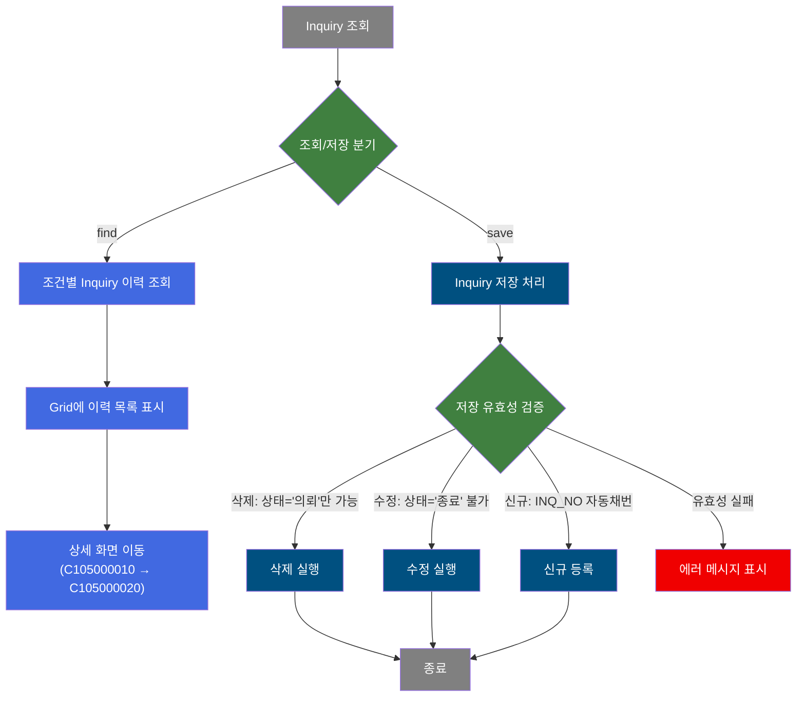
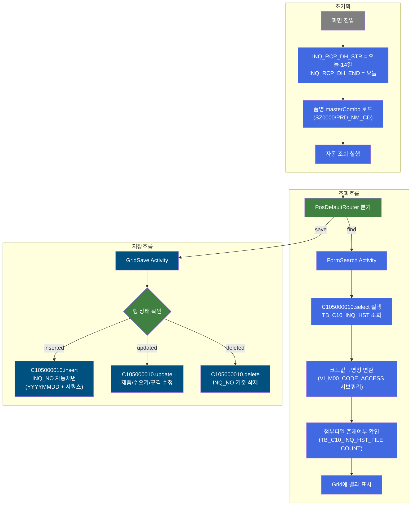
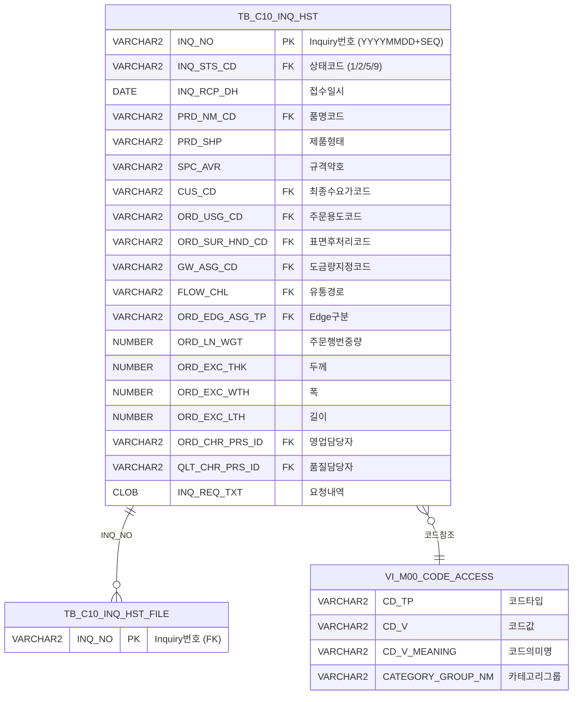

<h1 style="font-size: 40px; text-align: center; font-weight:
   bold; margin: 30px 0;">
  C105000010 레거시 시스템 분석 종합 보고서
</h1>


# 1. 시스템 개요
- **서비스 ID**: C105000010
- **업무명**: 제조가부검토 Inquiry 요청현황
- **분석 일시**: 2026-03-17 08:16 (KST)
- **분석 시간**: ~5분
- **전체 Activity 수**: 3개 (Built-in: 분기, 조회, 저장)
- **분석자**: Claude Opus 4.6 / Sonnet (Phase 4)
- **분석 도구**: /analyze-service C105000010
- **문서 버전**: 1.0

# 📊 비즈니스 프로세스 분석

## 시스템 목적

C105000010은 동국제강 MES C10 모듈의 **제조가부검토(Inquiry) 요청현황** 관리 화면이다. 영업팀이 고객으로부터 제품 생산 가능 여부를 문의받았을 때, 해당 Inquiry 요청을 등록·조회·수정·삭제하는 CRUD 기능을 제공한다.

주요 업무 흐름은 다음과 같다. 영업담당자가 고객의 Inquiry 요청(품명, 제품형태, 규격, 두께/폭/길이, 수요가, 도금량 등)을 등록하면 상태가 '의뢰(1)'로 시작되고, 품질담당자가 검토를 수행하여 '검토중(2)' → '검토완료(5)' → '종료(9)' 순으로 상태가 전이된다. 이 화면에서는 Inquiry 이력 목록을 조건별로 조회하고, 의뢰 단계의 요청을 수정하거나 삭제할 수 있다.

부가적으로 생산가부이력등록 팝업(C105000010pop01), SPC_AVR 조회 팝업(C105000010pop02), 첨부파일 등록 팝업(C105000010pop03), 톤당길이계산 팝업(C105000010pop04) 등을 통해 상세 정보 입력 및 계산 기능을 지원한다.

## 핵심 워크플로우 다이어그램



### 상세 워크플로우 다이어그램



## 주요 유즈케이스

### UC-01: Inquiry 이력 조회
- **Actor**: 영업담당자 / 품질담당자
- **목적**: 기간별·조건별 제조가부검토 Inquiry 요청현황을 조회하여 현재 상태를 파악

- **전제조건**:
  - 사용자가 MES 시스템에 로그인되어 있음
  - TB_C10_INQ_HST에 Inquiry 데이터가 존재함

- **주요 흐름**:
  1. 화면 진입 시 Inquiry접수일 범위가 자동 설정됨 (오늘-14일 ~ 오늘)
  2. 필요 시 Inquiry번호, 품명, 최종수요가, 검토자, 요청내용, Inquiry상태 조건을 추가 입력
  3. 조회 버튼 클릭
  4. 시스템이 C105000010.select 쿼리 실행 → TB_C10_INQ_HST에서 조건 매칭 데이터 조회
  5. 각 코드 컬럼에 대해 VI_M00_CODE_ACCESS 서브쿼리로 코드명칭을 변환하여 표시
  6. Grid에 Inquiry 목록 표시 (INQ_NO 순 정렬)

- **대체 흐름**:
  - 조회 결과 없음: 빈 Grid 표시
  - 날짜 범위 오류 (시작 > 종료): "날짜 범위를 확인하세요" 메시지 표시
  - Inquiry번호 직접 입력 시: LIKE 조건으로 부분 일치 검색

- **후행조건**:
  - Grid에 조건 맞는 Inquiry 목록이 표시됨
  - 사용자가 행 더블클릭으로 상세 화면(C105000020)으로 이동 가능

### UC-02: Inquiry 신규 등록
- **Actor**: 영업담당자
- **목적**: 고객의 제조가부검토 요청을 시스템에 신규 등록하여 이력 관리 시작

- **전제조건**:
  - 사용자가 MES 시스템에 로그인되어 있음
  - 등록할 제품 정보(품명, 제품형태, 규격 등)를 파악하고 있음

- **주요 흐름**:
  1. 메뉴의 "행추가" 버튼 클릭 → Grid에 빈 행 추가
  2. 품명(PRD_NM_CD) combo 선택 → 연동 combo(도금량지정코드 GW_ASG_CD)가 품명에 따라 동적 재로드
  3. 제품형태(PRD_SHP), 표면후처리(ORD_SUR_HND_CD), 유통경로(FLOW_CHL), Edge구분(ORD_EDG_ASG_TP) combo 선택
  4. 최종수요가(CUS_CD) 더블클릭 → masterGridData.do 팝업에서 검색·선택
  5. 주문용도(ORD_USG_CD) 더블클릭 → masterGridData.do 팝업에서 검색·선택
  6. 두께/폭/길이/중량 수치 입력
  7. 영업담당자(ORD_CHR_PRS_ID), 품질담당자(QLT_CHR_PRS_ID) 입력
  8. 요청내용(INQ_REQ_TXT) 입력
  9. 저장 버튼 클릭 → 확인 다이얼로그 → C105000010.insert 실행
  10. INQ_NO 자동채번 (YYYYMMDD + 당일 시퀀스), INQ_STS_CD = '1'(의뢰)로 등록

- **대체 흐름**:
  - "등록" 버튼 클릭 시: C105000010pop01 팝업으로 생산가부이력등록 화면 표시
  - SPC_AVR 필드에서 Glue 팝업 호출 가능 (C105000010pop02)

- **후행조건**:
  - TB_C10_INQ_HST에 신규 레코드 생성됨 (상태: 의뢰)
  - 조회 시 신규 등록된 Inquiry가 목록에 표시됨

### UC-03: Inquiry 수정
- **Actor**: 영업담당자
- **목적**: 등록된 Inquiry 요청의 제품 조건이나 요청내용을 수정

- **전제조건**:
  - 수정 대상 Inquiry가 존재함
  - Inquiry 상태가 '종료(9)'가 아님

- **주요 흐름**:
  1. Inquiry 목록에서 수정 대상 행의 편집 가능 컬럼을 직접 수정
  2. combo 컬럼(품명, 제품형태, 표면후처리, 도금량, 유통경로, Edge구분)은 드롭다운으로 변경
  3. 수치 컬럼(중량, 두께, 폭, 길이)은 직접 입력
  4. 저장 버튼 클릭 → 유효성 검증 → C105000010.update 실행

- **대체 흐름**:
  - Inquiry 상태가 '종료(9)'인 경우: "종료 상태의 Inquiry는 수정할 수 없습니다" 메시지 → 저장 차단

- **후행조건**:
  - TB_C10_INQ_HST의 해당 레코드가 수정됨
  - 수정 이력 추적을 위해 LAST_UPDATE_TIMESTAMP, LAST_UPDATED_OBJECT_ID 갱신

### UC-04: Inquiry 삭제
- **Actor**: 영업담당자
- **목적**: 잘못 등록된 Inquiry 요청을 삭제

- **전제조건**:
  - 삭제 대상 Inquiry가 존재함
  - Inquiry 상태가 '의뢰(1)'임

- **주요 흐름**:
  1. Grid에서 삭제 대상 행 선택
  2. 메뉴의 "삭제" 버튼 클릭 → 행에 삭제 마크
  3. 저장 버튼 클릭 → 유효성 검증 (INQ_STS_CD = '1' 확인) → C105000010.delete 실행

- **대체 흐름**:
  - Inquiry 상태가 '의뢰(1)'가 아닌 경우: "의뢰 상태의 Inquiry만 삭제 가능합니다" 메시지 → 삭제 차단

- **후행조건**:
  - TB_C10_INQ_HST에서 해당 레코드 삭제됨

### UC-05: 첨부파일 등록
- **Actor**: 영업담당자
- **목적**: Inquiry 요청에 관련 파일(도면, 사양서 등)을 첨부

- **전제조건**:
  - Inquiry가 등록되어 있음 (INQ_NO 존재)

- **주요 흐름**:
  1. Grid의 "파일추가" 컬럼의 링크 클릭
  2. C105000010pop03 팝업 표시 (465×405)
  3. 파일 업로드 수행
  4. TB_C10_INQ_HST_FILE에 파일 정보 저장

- **대체 흐름**:
  - 파일이 이미 존재하는 경우: FILE_ADD = 'Y'로 표시됨

- **후행조건**:
  - TB_C10_INQ_HST_FILE에 파일 레코드 생성됨
  - Grid의 FILE_ADD 컬럼이 'Y'로 갱신됨

### UC-06: 톤당길이 계산
- **Actor**: 영업담당자
- **목적**: 제품 규격 입력 시 톤당 길이를 자동 계산하여 참조

- **전제조건**:
  - 제품 두께, 폭 등 규격 정보가 입력되어 있음

- **주요 흐름**:
  1. Form의 "길이계산" 버튼 클릭
  2. C105000010pop04 팝업 표시 (634×569)
  3. 계산 결과 확인

- **후행조건**:
  - 계산된 길이값을 참조하여 Grid에 입력 가능

---

## 비즈니스 로직 상세

### 1. INQ_NO 자동채번 로직

- **목적**: Inquiry 번호를 당일 날짜 기반으로 자동 생성하여 고유성을 보장
- **처리 케이스**:

  **[케이스 1: 당일 첫 번째 등록]**
  ```
    조건: 당일 YYYYMMDD로 시작하는 INQ_NO가 TB_C10_INQ_HST에 없음
    처리:
      1. NVL(MAX(INQ_NO)+1, TO_CHAR(SYSDATE,'YYYYMMDD') || '01') 실행
      2. MAX(INQ_NO)이 NULL이므로 NVL에 의해 YYYYMMDD01 반환
      3. 예: 2026-03-17 첫 등록 → INQ_NO = '2026031701'
  ```

  **[케이스 2: 당일 후속 등록]**
  ```
    조건: 당일 YYYYMMDD로 시작하는 INQ_NO가 이미 존재
    처리:
      1. MAX(INQ_NO) + 1 계산
      2. 예: 기존 최대값 '2026031703' → 새 INQ_NO = '2026031704'
  ```

- **계산 공식**:
  ```
  INQ_NO = NVL(MAX(INQ_NO) + 1, YYYYMMDD || '01')
  WHERE INQ_NO LIKE YYYYMMDD || '%'

  예시: 당일 2026-03-17, 기존 3건 존재
  MAX('2026031701','2026031702','2026031703') = '2026031703'
  '2026031703' + 1 = '2026031704' (문자열+숫자 → 암시적 형변환)
  ```

- **예외 처리**:
  - 동시 등록 시 PK 중복 가능성: Oracle의 MAX+1 패턴은 동시성 제어가 없으므로 두 세션이 동시에 INSERT 시 PK 충돌 발생 가능

### 2. 코드값→명칭 변환 (스칼라 서브쿼리 패턴)

- **목적**: 코드 컬럼의 값을 사용자가 읽을 수 있는 "코드 : 의미명" 형태로 변환하여 표시
- **처리 케이스**:

  **[케이스 1: 일반 코드 변환]**
  ```
    대상 컬럼: INQ_STS_CD, PRD_NM_CD, PRD_SHP, CUS_CD, ORD_USG_CD, ORD_SUR_HND_CD, FLOW_CHL, ORD_EDG_ASG_TP
    처리:
      1. CD_V || ' : ' || CD_V_MEANING 형태로 연결
      2. VI_M00_CODE_ACCESS 뷰에서 CD_TP = 해당 코드타입 조건으로 조회
      3. 예: INQ_STS_CD = '1' → '1 : 검토의뢰'
  ```

  **[케이스 2: 품명 기반 카테고리 분기 (도금량지정코드)]**
  ```
    대상 컬럼: GW_ASG_CD_NM
    처리:
      1. PRD_NM_CD에 따라 CATEGORY_GROUP_NM을 동적 결정
      2. PRD_NM_CD IN ('G','K','3','J') → CATEGORY_GROUP_NM = 'SG0000'
      3. PRD_NM_CD IN ('5','Q') → CATEGORY_GROUP_NM = 'SL0000'
      4. PRD_NM_CD IN ('6') → CATEGORY_GROUP_NM = 'SE0000'
      5. 그 외 → CATEGORY_GROUP_NM = 'SZ0000'
      6. 결정된 카테고리로 VI_M00_CODE_ACCESS 조회
  ```

### 3. Inquiry 상태 기반 저장 제어

- **목적**: Inquiry 진행 상태에 따라 수정/삭제 가능 여부를 제어하여 데이터 무결성 보장
- **처리 케이스**:

  **[케이스 1: 삭제 제어]**
  ```
    조건: Grid에서 행 삭제 시도
    처리:
      1. 해당 행의 INQ_STS_CD(col26, 숨김컬럼) 값 확인
      2. INQ_STS_CD = '1' (의뢰) → 삭제 허용
      3. INQ_STS_CD ≠ '1' → "의뢰 상태만 삭제 가능" 경고 메시지 → 삭제 차단
  ```

  **[케이스 2: 수정 제어]**
  ```
    조건: Grid에서 행 수정 후 저장 시도
    처리:
      1. 해당 행의 INQ_STS_CD(col26) 값 확인
      2. INQ_STS_CD = '9' (종료) → "종료 상태는 저장 불가" 경고 메시지 → 저장 차단
      3. INQ_STS_CD ≠ '9' → 저장 허용
  ```

---

# 💾 데이터 요구사항

## 핵심 테이블

### 1. TB_C10_INQ_HST - (제조가부검토 Inquiry 이력)
| 컬럼명 | 타입 | PK | 설명 |
|--------|------|----|------|
| INQ_NO | VARCHAR2 | ✅ | Inquiry 번호 (YYYYMMDD + 시퀀스, 자동채번) |
| INQ_STS_CD | VARCHAR2 | | Inquiry 상태코드 (1:의뢰, 2:검토중, 5:검토완료, 9:종료) |
| INQ_RCP_DH | DATE | | Inquiry 접수일시 |
| PRD_NM_CD | VARCHAR2 | | 품명코드 |
| PRD_SHP | VARCHAR2 | | 제품형태 |
| SPC_AVR | VARCHAR2 | | 규격약호 |
| CUS_CD | VARCHAR2 | | 최종수요가코드 |
| ORD_USG_CD | VARCHAR2 | | 주문용도코드 |
| ORD_SUR_HND_CD | VARCHAR2 | | 표면후처리코드 |
| GW_ASG_CD | VARCHAR2 | | 도금량지정코드 |
| FLOW_CHL | VARCHAR2 | | 유통경로 |
| ORD_EDG_ASG_TP | VARCHAR2 | | Edge구분 |
| ORD_LN_WGT | NUMBER | | 주문행번중량 |
| ORD_EXC_THK | NUMBER | | 주문환산두께 |
| ORD_EXC_WTH | NUMBER | | 주문환산폭 |
| ORD_EXC_LTH | NUMBER | | 주문환산길이 |
| ORD_CHR_PRS_ID | VARCHAR2 | | 영업담당자ID |
| QLT_CHR_PRS_ID | VARCHAR2 | | 품질담당자ID |
| INQ_REQ_TXT | CLOB | | Inquiry 요청내역 (최종) |
| INQ_REQ_TXT1 | CLOB | | Inquiry 요청내역 (이력) |
| INQ_AUT_SRT_END_DH | DATE | | 자동검토 시작종료일시 |
| INQ_SRT_END_DH | DATE | | 검토 시작종료일시 |
| INQ_PSV_SRT_RSL_CD | VARCHAR2 | | 검토결과코드 |
| INQ_SRT_TXT | VARCHAR2 | | 검토내용 |
| CREATED_OBJECT_TYPE | VARCHAR2 | | 생성 객체 타입 |
| CREATED_OBJECT_ID | VARCHAR2 | | 생성 객체 ID |
| CREATED_PROGRAM_ID | VARCHAR2 | | 생성 프로그램 ID |
| CREATION_TIMESTAMP | TIMESTAMP | | 생성 타임스탬프 |
| LAST_UPDATED_OBJECT_TYPE | VARCHAR2 | | 최종수정 객체 타입 |
| LAST_UPDATED_OBJECT_ID | VARCHAR2 | | 최종수정 객체 ID |
| LAST_UPDATE_PROGRAM_ID | VARCHAR2 | | 최종수정 프로그램 ID |
| LAST_UPDATE_TIMESTAMP | TIMESTAMP | | 최종수정 타임스탬프 |

### 2. TB_C10_INQ_HST_FILE - (Inquiry 첨부파일)
| 컬럼명 | 타입 | PK | 설명 |
|--------|------|----|------|
| INQ_NO | VARCHAR2 | ✅ | Inquiry 번호 (FK → TB_C10_INQ_HST) |

### 3. VI_M00_CODE_ACCESS - (공통코드 뷰, M00APUSER)
| 컬럼명 | 타입 | PK | 설명 |
|--------|------|----|------|
| CD_TP | VARCHAR2 | | 코드타입 (INQ_STS_CD, PRD_NM_CD, PRD_SHP 등) |
| CD_V | VARCHAR2 | | 코드값 |
| CD_V_MEANING | VARCHAR2 | | 코드 의미명 |
| CATEGORY_GROUP_NM | VARCHAR2 | | 카테고리 그룹명 (SZ0000, SG0000 등) |

## 데이터 플로우

### 1. 조회
```
[Inquiry 이력 목록 조회]
화면 진입 (또는 조회 버튼 클릭)
→ C105000010.select
  FROM MESAPUSER.TB_C10_INQ_HST
  WHERE INQ_NO LIKE :INQ_NO || '%'              (Inquiry번호 부분검색)
    AND INQ_RCP_DH >= TO_DATE(:INQ_RCP_DH_STR)  (접수일시 시작)
    AND INQ_RCP_DH < TO_DATE(:INQ_RCP_DH_END)+1 (접수일시 종료+1일)
    AND PRD_NM_CD = :PRD_NM_CD                   (품명)
    AND CUS_CD = :CUS_CD                         (최종수요가)
    AND QLT_CHR_PRS_ID = :QLT_CHR_PRS_ID         (검토자)
    AND INQ_REQ_TXT LIKE '%' || :INQ_REQ_TXT || '%' (요청내용)
    AND INQ_STS_CD = :INQ_STS_CD                 (상태코드)
  (각 조건은 값이 있을 때만 적용)
  + 스칼라 서브쿼리: M00APUSER.VI_M00_CODE_ACCESS (코드명칭 변환 x8)
  + 스칼라 서브쿼리: TB_C10_INQ_HST_FILE (첨부파일 존재여부)
  ORDER BY INQ_NO
→ Grid에 목록 표시
```

### 2. 신규 등록
```
[Inquiry 신규 등록]
행추가 → 데이터 입력 → 저장 버튼 클릭
→ C105000010.insert
  INTO C10APUSER.TB_C10_INQ_HST
  VALUES (
    INQ_NO = (SELECT NVL(MAX(INQ_NO)+1, YYYYMMDD||'01') FROM TB_C10_INQ_HST WHERE INQ_NO LIKE YYYYMMDD||'%'),
    INQ_STS_CD = '1',
    INQ_RCP_DH = NVL(TO_DATE(:INQ_RCP_DH), SYSDATE),
    PRD_NM_CD, PRD_SHP, SPC_AVR, CUS_CD, ORD_USG_CD,
    ORD_SUR_HND_CD, GW_ASG_CD, FLOW_CHL, ORD_EDG_ASG_TP,
    ORD_LN_WGT, ORD_EXC_THK, ORD_EXC_WTH, ORD_EXC_LTH,
    ORD_CHR_PRS_ID, QLT_CHR_PRS_ID, INQ_REQ_TXT, INQ_REQ_TXT1,
    + 감사정보 (CREATED_OBJECT_TYPE/ID, PROGRAM_ID, TIMESTAMP)
  )
```

### 3. 수정
```
[Inquiry 수정]
Grid에서 데이터 수정 → 저장 버튼 클릭
→ C105000010.update
  UPDATE C10APUSER.TB_C10_INQ_HST
  SET INQ_RCP_DH, PRD_NM_CD, PRD_SHP, SPC_AVR, CUS_CD, ORD_USG_CD,
      ORD_SUR_HND_CD, GW_ASG_CD, FLOW_CHL, ORD_EDG_ASG_TP,
      ORD_LN_WGT, ORD_EXC_THK, ORD_EXC_WTH, ORD_EXC_LTH,
      ORD_CHR_PRS_ID, QLT_CHR_PRS_ID, INQ_REQ_TXT, INQ_REQ_TXT1,
      + 감사정보 갱신
  WHERE INQ_NO = :INQ_NO
```

### 4. 삭제
```
[Inquiry 삭제]
Grid에서 행 삭제 마크 → 저장 버튼 클릭
→ C105000010.delete
  DELETE FROM C10APUSER.TB_C10_INQ_HST
  WHERE INQ_NO = :INQ_NO
```

## SQL 일람표
| SQL 이름 | 쿼리 ID | 타입 | 출처 | 테이블 |
|---------|---------|------|------|--------|
| Inquiry 이력 조회 | C105000010.select | SELECT | Service | TB_C10_INQ_HST, VI_M00_CODE_ACCESS, TB_C10_INQ_HST_FILE |
| Inquiry 신규 등록 | C105000010.insert | INSERT | Service | C10APUSER.TB_C10_INQ_HST |
| Inquiry 삭제 | C105000010.delete | DELETE | Service | C10APUSER.TB_C10_INQ_HST |
| Inquiry 수정 | C105000010.update | UPDATE | Service | C10APUSER.TB_C10_INQ_HST |

## ER 다이어그램 (핵심 관계)



관계 설명:
- **TB_C10_INQ_HST**가 중심 테이블로 Inquiry 이력 전체 정보를 관리
- **TB_C10_INQ_HST_FILE**: INQ_NO를 통한 1:N 관계 (Inquiry당 다수 첨부파일)
- **VI_M00_CODE_ACCESS**: 8개 코드 컬럼(INQ_STS_CD, PRD_NM_CD, PRD_SHP, CUS_CD, ORD_USG_CD, ORD_SUR_HND_CD, GW_ASG_CD, FLOW_CHL, ORD_EDG_ASG_TP)의 코드명칭 참조

---

# 🖥️ 사용자 인터페이스 요구사항

## 화면 레이아웃 상세

### Layout 구조 (절대 좌표 배치)
```javascript
{
  type: "flat",           // 레이아웃 컨테이너 없이 절대 좌표 div 배치
  components: [
    {
      id: "C105000010_Form_1",
      type: "form",
      position: { left: 0, top: 0, width: 981, height: 84 }
    },
    {
      id: "C105000010_Menu_1",
      type: "menu",
      position: { left: 1, top: 85, width: 979, height: 25 }
    },
    {
      id: "C105000010_Grid_1",
      type: "grid",
      position: { left: -7, top: 103, width: 976, height: 454 }
    },
    {
      id: "messagebox",
      type: "messagebox",
      position: { left: 0, top: 567, width: 979, height: 19 }
    }
  ]
}
```

## 입출력 요소

### Form 컴포넌트
**C105000010_Form_1** (3개 블록 구성)

**블록 1 - 조회 조건 (주요)**:
- INQ_RCP_DH_STR: calendar - Inquiry접수일 시작 (labelWidth:80, inputWidth:75, 필수, 배경색:#FFFFC0)
- INQ_RCP_DH_DUR: label - "~" 구분자
- INQ_RCP_DH_END: calendar - Inquiry접수일 종료 (inputWidth:75, 필수, 배경색:#FFFFC0)
- INQ_NO: input - Inquiry번호 (inputWidth:80, maxLength:10, 배경색:#FFFFC0)
- PRD_NM_CD: combo - 품명 (inputWidth:120, masterCombo, SZ0000/PRD_NM_CD)
- create: custombutton - "등록" (width:75, 초기 disabled) → C105000010pop01 팝업 호출
- find: button - "조회" (초기 disabled) → 조회 기능 실행
- save: button - "저장" (초기 disabled) → 저장 기능 실행
- winClose: button - "닫기" → 화면 종료

**블록 2 - 조회 조건 (보조)**:
- CUS_CD: input - 최종수요가 (labelWidth:80, inputWidth:75, maxLength:6, keyup 시 대문자 변환)
- template: template - 최종수요가 검색 아이콘 (serchIcon_CUS_CD) → masterGridData.do 팝업
- QLT_CHR_PRS_ID: input - 검토자 (labelWidth:72, inputWidth:80)
- INQ_REQ_TXT: input - 요청내용 (labelWidth:55, inputWidth:118)
- calculate: custombutton - "길이계산" (width:75) → C105000010pop04 팝업

**블록 3 - Inquiry 상태 필터**:
- txt_input: template - "Inquiry상태" 레이블
- INQ_STS_CD: radio - 전체 (value:"", checked:true)
- INQ_STS_CD: radio - 의뢰 (value:"1")
- INQ_STS_CD: radio - 검토중 (value:"2")
- INQ_STS_CD: radio - 검토완료 (value:"5")
- INQ_STS_CD: radio - 종료 (value:"9")

### Menu 컴포넌트
**C105000010_Menu_1**
- refresh: "새로고침" (refresh.gif) → clearDataProcess 후 재조회
- add: "행추가" (new.gif) → Grid에 빈 행 추가
- remove: "삭제" (remove.gif) → 선택 행 삭제 마크

### Grid 컴포넌트
**C105000010_Grid_1 (Inquiry 요청현황)**
- 편집 가능 여부: 부분 편집 (일부 컬럼만)
- Split: 2 (INQ_NO, INQ_STS_CD_NM 고정)
- 헤더 그룹: Inquiry상태(2) | Inquiry 요청현황(18) | Inquiry 검토결과(5) | 파일추가(1)
- 설정: stableSorting, multiselect, contextmenu, pageset, vertical, colwidthUnit="%"
- 주요 컬럼 (35개):

  **숨김 컬럼 (9개)**:
  - INQ_STS_CD: ro - Inquiry상태코드 (숨김)
  - CUS_CD: ro - 최종수요가코드 (숨김)
  - ORD_USG_CD: ro - 주문용도코드 (숨김)
  - PRD_NM_CD: ro - 품명코드 (숨김)
  - PRD_SHP: ro - 제품형태코드 (숨김)
  - ORD_SUR_HND_CD: ro - 표면후처리코드 (숨김)
  - FLOW_CHL: ro - 유통경로코드 (숨김)
  - ORD_EDG_ASG_TP: ro - Edge구분코드 (숨김)
  - GW_ASG_CD: ro - 도금량지정코드 (숨김)

  **Inquiry 상태 (고정, 2컬럼)**:
  - INQ_NO: ro - Inquiry번호 (8%, 중앙정렬, sort_int_custom)
  - INQ_STS_CD_NM: ro - Inquiry상태 (13%, 좌측정렬, sort_str_custom)

  **Inquiry 요청현황 (18컬럼)**:
  - INQ_RCP_DH: dhxCalendar - 접수일시 (15%, 중앙정렬, YYYY-MM-DD HH:MI, enableTime)
  - PRD_NM_CD_NM: combo_v - 품명 (15%, 중앙정렬, SZ0000/PRD_NM_CD, 편집가능)
  - PRD_SHP_NM: combo_v - 제품형태 (20%, 중앙정렬, SZ0000/PRD_SHP, 편집가능)
  - SPC_AVR: ro - 규격약호 (15%, 중앙정렬)
  - CUS_CD_NM: ed - 최종수요가 (15%, 좌측정렬, 편집가능, 더블클릭→masterGridData.do 팝업)
  - ORD_USG_CD_NM: ed - 주문용도 (15%, 좌측정렬, 편집가능, 더블클릭→masterGridData.do 팝업)
  - ORD_SUR_HND_CD_NM: combo_v - 표면후처리 (35%, 좌측정렬, SZ0000/ORD_SUR_HND_CD, 편집가능)
  - GW_ASG_CD_NM: combo_v - 도금량지정 (20%, 좌측정렬, 품명에 따라 동적 category SG0000/SL0000/SE0000, 편집가능)
  - FLOW_CHL_NM: combo_v - 유통경로 (20%, 좌측정렬, SZ0000/FLOW_CHL, 편집가능)
  - ORD_EDG_ASG_TP_NM: combo_v - Edge구분 (20%, 좌측정렬, SZ0000/ORD_EDG_ASG_TP, 편집가능)
  - ORD_LN_WGT: edn - 주문행번중량 (14%, 좌측정렬, format:0,000, 편집가능)
  - ORD_EXC_THK: edn - 두께 (8%, 우측정렬, format:00.000, 편집가능)
  - ORD_EXC_WTH: edn - 폭 (8%, 우측정렬, format:0,000.0, 편집가능)
  - ORD_EXC_LTH: edn - 길이 (8%, 우측정렬, format:0,000.0, 편집가능)
  - ORD_CHR_PRS_ID: ed - 영업담당자 (10%, 중앙정렬, 편집가능)
  - QLT_CHR_PRS_ID: ed - 품질담당자 (10%, 중앙정렬, 편집가능)
  - INQ_REQ_TXT: txttxt - 요청내역(최종) (30%, 중앙정렬)
  - INQ_REQ_TXT1: txttxt - 요청내역(이력) (30%, 중앙정렬)

  **Inquiry 검토결과 (5컬럼)**:
  - INQ_AUT_SRT_END_DH: ro - 자동검토 시작종료일시 (13%, 중앙정렬)
  - QLT_CHR_PRS_ID: ro - 검토자 (10%, 중앙정렬)
  - INQ_SRT_END_DH: ro - 검토 시작종료일시 (15%, 중앙정렬)
  - INQ_PSV_SRT_RSL_CD: ro - 검토결과 (10%, 중앙정렬)
  - INQ_SRT_TXT: ro - 검토내용 (30%, 중앙정렬)

  **파일추가 (1컬럼)**:
  - FILE_ADD: link - 파일추가 (10%, 중앙정렬, 배경색:#FFFFC0, doFileUpload 함수 호출)

## 화면 동작 흐름

### 1. 화면 초기 로딩
```
1. 화면 진입 (C105000010.jsp)
2. onFormLoadFunction 실행:
   - INQ_RCP_DH_END = 현재일자 (uiCommon.getCurrentDate)
   - INQ_RCP_DH_STR = 현재일 - 14일
   - 달력 시작요일 일요일(7)로 설정
   - CUS_CD input에 keyup 이벤트 등록 (대문자 변환)
   - PRD_NM_CD masterCombo 로드 (SZ0000/PRD_NM_CD)
   - PRD_NM_CD readonly 설정, 백스페이스/F5 키 차단
3. onGridLoadEvent 실행:
   - col3(PRD_NM_CD) combo 로드, onSelectionChange 이벤트 등록
   - col4(PRD_SHP) combo 로드, onSelectionChange 이벤트 등록
   - col8(ORD_SUR_HND_CD) combo 로드, onSelectionChange 이벤트 등록
   - col10(FLOW_CHL) combo 로드, onSelectionChange 이벤트 등록
   - col11(ORD_EDG_ASG_TP) combo 로드, onSelectionChange 이벤트 등록
4. INQ_RCP_DH_END 값 존재 확인 → 자동 find 호출
5. Grid에 최근 14일 Inquiry 목록 표시
6. 상태바(messagebox) 초기화
```

### 2. 조건별 조회
```
1. 사용자가 조회 조건 입력/선택:
   - Inquiry접수일 범위 (INQ_RCP_DH_STR ~ INQ_RCP_DH_END)
   - Inquiry번호, 품명, 최종수요가, 검토자, 요청내용
   - Inquiry상태 라디오 버튼 (전체/의뢰/검토중/검토완료/종료)
2. 조회 버튼 클릭
3. find 함수 실행:
   - INQ_RCP_DH_STR, INQ_RCP_DH_END 필수 입력 확인
   - fromDate <= toDate 범위 유효성 확인
4. uiCommon.parameters(C105000010_Form_1) 호출하여 URL 파라미터 구성
5. C105000010_Grid_1.loadData 호출 (gridC10Data.do → C105000010-service → 조회 Activity)
6. C105000010.select 쿼리 실행
7. Grid에 결과 바인딩 (INQ_NO 순 정렬)
```

### 3. 행 더블클릭 동작
```
1. Grid 행 더블클릭 (doOnRowClicked)
2. 클릭 컬럼에 따른 분기:
   - col6 (CUS_CD_NM) → masterGridData.do 팝업 (CUS_CD, SZ0000)
   - col7 (ORD_USG_CD_NM) → masterGridData.do 팝업 (ORD_USG_CD, SZ0000)
   - col2~5, 8~19 → return true (기본 편집 동작)
   - 나머지 컬럼 → parent.newRemoveOpenTab으로 C105000020 상세 화면 이동 (INQ_NO 파라미터 전달)
```

### 4. 데이터 저장
```
1. Grid에서 데이터 추가/수정/삭제 후 저장 버튼 클릭
2. save 함수 실행:
   - 삭제 행: INQ_STS_CD = '1' 아니면 차단 ("의뢰 상태만 삭제 가능")
   - 수정 행: INQ_STS_CD = '9' 이면 차단 ("종료 상태 저장 불가")
3. dhtmlx.confirm 확인 다이얼로그 표시
4. 확인 시: C105000010_Grid_1.sendGrid('C105000010_Grid_1','save') 호출
5. handleDataProcess.do → C105000010-service → 저장 Activity (GridSave)
6. 각 행 상태별 SQL 실행 (INSERT/UPDATE/DELETE)
```

### 5. 팝업 호출
```
1. Form의 CUS_CD 검색 아이콘 클릭 → masterGridData.do 팝업 (469×532)
   - CD_TP=CUS_CD, CATEGORY_GROUP_NM=SZ0000
   - masterSetValue 콜백으로 선택값 반환
2. Form의 "등록" 버튼 클릭 → c105000010pop01.do 팝업 (634×569)
   - 생산가부이력등록 화면
3. SPC_AVR 관련 → c105000010pop02.do 팝업 (669×532)
   - Glue 팝업, gluePopupSetValue 콜백
4. Grid FILE_ADD 링크 클릭 → C105000010pop03.jsp 팝업 (465×405)
   - 파일 등록
5. Form "길이계산" 버튼 → C105000010pop04.jsp 팝업 (634×569)
   - 톤당길이 계산기
```

## JavaScript 모듈

**C105000010.jsp** (메인 화면 스크립트, 인라인)
- onFormLoadFunction(): 폼 초기화 (날짜 설정, combo 로드, 이벤트 바인딩)
- onGridLoadEvent(): Grid combo 초기화 및 onSelectionChange 이벤트 등록, 자동 조회
- find(): 조회 (uiCommon.parameters로 파라미터 구성 → Grid.loadData)
- save(): 저장 (상태 기반 유효성 검증 → dhtmlx.confirm → Grid.sendGrid)
- refresh(): 새로고침 (clearDataProcess → find)
- add(): 행추가 (addRow → col3 초기화)
- remove(): 행삭제 (removeRow)
- doOnRowClicked(rowId, cellInd): 행 더블클릭 이벤트 (팝업 또는 화면 이동 분기)
- onCellChangedEvent(): 셀 변경 이벤트 (col5/col6 변경 시 updated 마킹)
- masterSetValue(): 마스터 팝업 반환값 처리
- gluePopup(): SPC_AVR Glue 팝업 호출
- gluePopupSetValue(): Glue 팝업 반환값 처리
- doFileUpload(): 파일 등록 팝업 호출

## 주요 이벤트 핸들러

**onFormLoadFunction (화면 초기화)**
- 이벤트 타입: onXLEEvent
- 처리 내용:
  1. INQ_RCP_DH_END = 현재일자, INQ_RCP_DH_STR = 현재일-14일로 초기화
  2. 달력 시작요일 일요일(7) 설정
  3. CUS_CD input keyup 이벤트 → 대문자 자동 변환
  4. PRD_NM_CD masterCombo 로드 (SZ0000/PRD_NM_CD)
  5. PRD_NM_CD readonly, 백스페이스/F5 키 차단

**onGridLoadEvent (Grid 초기화 및 자동 조회)**
- 이벤트 타입: onXLEEvent
- 처리 내용:
  1. col3(PRD_NM_CD) combo 로드 → onSelectionChange: col29(숨김) 업데이트 + col9(GW_ASG_CD) 동적 재로드
  2. col4(PRD_SHP) combo 로드 → onSelectionChange: col30(숨김) 업데이트
  3. col8(ORD_SUR_HND_CD) combo → onSelectionChange: col31(숨김) 업데이트
  4. col10(FLOW_CHL) combo → onSelectionChange: col32(숨김) 업데이트
  5. col11(ORD_EDG_ASG_TP) combo → onSelectionChange: col33(숨김) 업데이트
  6. INQ_RCP_DH_END 값 존재 시 자동 find 호출

**doOnRowClicked (행 더블클릭)**
- 이벤트 타입: rowDblClicked
- 처리 내용:
  1. cellInd에 따라 분기:
     - col6 → masterGridData.do 팝업 (CUS_CD)
     - col7 → masterGridData.do 팝업 (ORD_USG_CD)
     - col2~5, 8~19 → return true (편집 허용)
     - 그 외 → parent.newRemoveOpenTab("C105000020", {INQ_NO: 선택행 INQ_NO})

**save (저장)**
- 이벤트 타입: Form button click
- 처리 내용:
  1. Grid 전체 행 순회하며 유효성 검증
  2. 삭제 행: col26(INQ_STS_CD) ≠ '1' → 경고 메시지, 저장 중단
  3. 수정 행: col26(INQ_STS_CD) = '9' → 경고 메시지, 저장 중단
  4. dhtmlx.confirm 확인 후 sendGrid 실행

---

# 📌 특이사항 및 주의사항

## 1. INQ_NO 자동채번의 동시성 이슈
- **MAX+1 패턴**: INSERT 시 `NVL(MAX(INQ_NO)+1, YYYYMMDD||'01')` 서브쿼리로 번호를 생성하는데, 이는 동시 트랜잭션에서 PK 충돌을 유발할 수 있다. Oracle SEQUENCE를 사용하지 않고 문자열 기반 자동채번을 수행하므로, 두 세션이 동시에 INSERT할 경우 동일한 INQ_NO를 생성할 위험이 있다.

## 2. 스키마 불일치: SELECT는 MESAPUSER, DML은 C10APUSER
- **SELECT 쿼리**는 `MESAPUSER.TB_C10_INQ_HST`를 참조하고, **INSERT/UPDATE/DELETE 쿼리**는 `C10APUSER.TB_C10_INQ_HST`를 참조한다. 동일 테이블에 대해 스키마 접두어가 다르게 사용되고 있어 동의어(SYNONYM) 또는 뷰가 설정되어 있을 것으로 추정된다. 스키마 변경 시 양쪽 모두 확인 필요.

## 3. 도금량지정코드(GW_ASG_CD) 동적 카테고리 분기
- **품명(PRD_NM_CD)에 따라 도금량지정코드의 combo 카테고리가 동적으로 변경**된다:
  - G, K, 3, J → SG0000 (용융아연도금강판 계열)
  - 5, Q → SL0000 (전기아연도금강판 계열)
  - 6 → SE0000 (전기주석도금강판 계열)
  - 기타 → SZ0000 (기본)
- SELECT 쿼리의 스칼라 서브쿼리에서도 동일한 CASE WHEN 로직이 반복되어 있어, 품명코드 체계 변경 시 양쪽(JSP/SQL) 동시 수정이 필요하다.

## 4. combo_v 컬럼의 숨김컬럼 이중 관리
- Grid의 combo_v 타입 컬럼(PRD_NM_CD_NM, PRD_SHP_NM 등)은 표시용이며, 실제 코드값은 별도 숨김 컬럼(PRD_NM_CD, PRD_SHP 등)에 저장된다. onSelectionChange 이벤트로 combo 선택 시 숨김 컬럼 값을 수동으로 업데이트하는 패턴이 반복 사용되어, 이벤트 핸들러 누락 시 코드값 불일치가 발생할 수 있다.

## 5. update 쿼리의 분석 결과 품질 저하
- C105000010.update 쿼리의 캐시 분석 결과에 이상값이 포함되어 있다 (테이블명이 "이민균"으로 기록됨). 이는 분석 모델의 오류로 추정되며, 실제 UPDATE 대상은 C10APUSER.TB_C10_INQ_HST이다. 쿼리 원문 확인이 필요하다.

## 6. 첨부파일 존재여부 확인 패턴
- SELECT 쿼리에서 TB_C10_INQ_HST_FILE 테이블에 대한 `COUNT(1) > 0 ? 'Y' : 'N'` 서브쿼리로 첨부파일 유무를 확인한다. 파일 삭제 시 별도 동기화 없이 조회 시점에 실시간으로 확인하는 구조이다.

## 7. 상태 전이 제어의 불완전성
- 이 화면에서는 삭제(상태=1만) 및 수정(상태≠9) 제어만 JS에서 수행하며, 상태 전이 자체(1→2→5→9)는 다른 화면(C105000020)에서 처리되는 것으로 보인다. 상태 전이의 무결성은 전적으로 프론트엔드 검증에 의존하고 있어, 서버 측 검증 부재 가능성이 있다.

---

# 📚 참고 문서

- **Service XML**: `src/service/C105000010-service.xml`
- **Query SQL**: `src/query/C105000010-query.glue_sql`
- **JSP**: `WebContents/C105000010.jsp`
- **컴포넌트 XML**:
  - `WebContents/header/kr/C105000010/C105000010_Form_1.xml`
  - `WebContents/header/kr/C105000010/C105000010_Grid_1.xml`
  - `WebContents/header/kr/C105000010/C105000010_Menu_1.xml`
- **관련 팝업**:
  - `WebContents/C105000010pop01.jsp` (생산가부이력등록)
  - `WebContents/C105000010pop02.jsp` (SPC_AVR Glue팝업)
  - `WebContents/C105000010pop03.jsp` (파일 등록)
  - `WebContents/C105000010pop04.jsp` (톤당길이계산)
