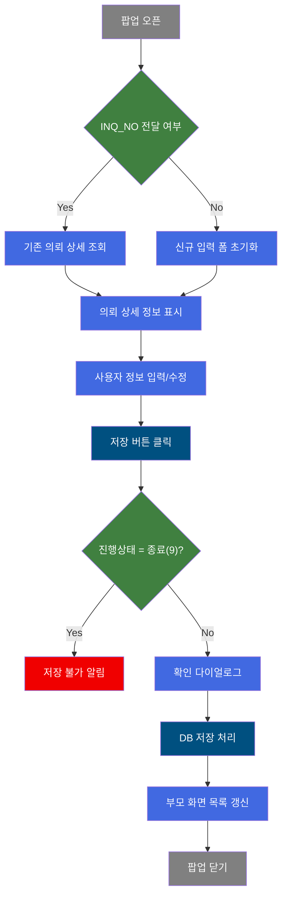
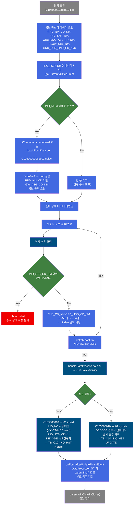
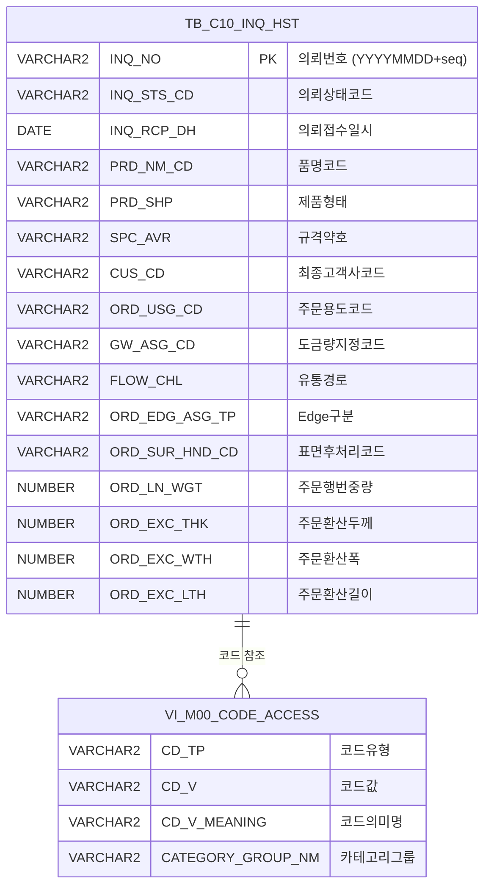

<h1 style="font-size: 40px; text-align: center; font-weight:
   bold; margin: 30px 0;">
  C105000010pop01 레거시 시스템 분석 종합 보고서
</h1>


# 1. 시스템 개요
- **서비스 ID**: C105000010pop01
- **업무명**: 제조가부검토 이력 등록/수정 팝업
- **분석 일시**: 2026-03-17 (KST)
- **전체 Activity 수**: 3개 (built-in 3, custom 0)
- **분석자**: Claude Sonnet 4.5 (Phase 1~4), Claude Opus 4.6 (Phase 5)
- **분석 도구**: /analyze-service C105000010pop01
- **문서 버전**: 1.0

# 📊 비즈니스 프로세스 분석

## 시스템 목적

본 서비스는 C105000010(제조가부검토 요청현황) 메인 화면에서 호출되는 **팝업 화면**으로, 개별 Inquiry(제조가부검토 의뢰) 건의 상세 정보를 등록하거나 수정하는 기능을 제공한다.

부모 화면(C105000010)의 Grid에서 특정 의뢰 건을 선택하면 INQ_NO(의뢰번호)가 URL 파라미터로 전달되어 팝업이 열리고, 해당 의뢰의 상세 정보(품명, 제품형태, 규격, 고객사, 주문용도, 도금량, 유통경로, Edge구분, 표면후처리, 주문치수, 담당자, 요청내역 등)를 Form 기반으로 조회 및 편집할 수 있다.

신규 등록 시에는 INQ_NO가 전달되지 않으며, 날짜 기반 자동 채번(YYYYMMDD + 일련번호) 방식으로 의뢰번호가 생성된다. 진행상태가 '9(종료)'인 경우에는 저장이 차단되며, 저장 완료 후 부모 화면의 목록을 자동 갱신하고 팝업을 닫는다.

## 핵심 워크플로우 다이어그램



### 상세 워크플로우 다이어그램



## 주요 유즈케이스

### UC-01: 기존 의뢰 상세 조회

- **Actor**: 영업/품질 담당자
- **목적**: 기존에 등록된 제조가부검토 의뢰 건의 상세 정보를 팝업에서 확인

- **전제조건**:
  - 부모 화면(C105000010)에서 Grid 행 선택
  - 선택된 행의 INQ_NO가 URL 파라미터로 전달됨

- **주요 흐름**:
  1. 부모 화면에서 의뢰 건 클릭 → 팝업 오픈 시 INQ_NO 전달
  2. onFormLoadFunction에서 콤보 마스터 데이터 로딩 (품명, 제품형태, Edge구분, 유통경로, 표면후처리)
  3. INQ_NO 존재 확인 → uiCommon.parameters6으로 파라미터 구성
  4. basicFormData.do → C105000010pop01.select 실행 (INQ_NO LIKE 검색)
  5. findAfterFunction에서 PRD_NM_CD 기반 GW_ASG_CD_NM 콤보 동적 로딩
  6. 폼에 전체 의뢰 상세 정보 바인딩 (코드값은 "코드 : 명칭" 형태)

- **대체 흐름**:
  - 조회 결과 0건: messageBox에 "0건 조회되었습니다" 표시, 폼 초기화(uiFormObj.clear())

- **후행조건**:
  - 의뢰 상세 정보가 폼에 표시됨
  - 사용자가 수정/저장 작업 가능 상태

### UC-02: 신규 의뢰 등록

- **Actor**: 영업 담당자
- **목적**: 새로운 제조가부검토 의뢰를 시스템에 등록

- **전제조건**:
  - 부모 화면에서 신규 등록 모드로 팝업 오픈 (INQ_NO 미전달)

- **주요 흐름**:
  1. 팝업 오픈 → INQ_NO 없음 → 빈 폼 표시
  2. INQ_RCP_DH에 현재 시각 자동 세팅 (getCurrentMinitesTime)
  3. 사용자가 품명, 제품형태, 규격약호, 고객사, 주문용도 등 입력
  4. 품명(PRD_NM_CD_NM) 콤보 변경 시 도금량코드(GW_ASG_CD_NM) 콤보 목록 동적 변경
  5. 저장 버튼 클릭 → CUS_CD_NM/ORD_USG_CD_NM에서 6자리 코드 추출 → hidden 필드 세팅
  6. 확인 다이얼로그 → handleDataProcess.do 호출 → C105000010pop01.insert 실행
  7. INQ_NO 자동 채번: `NVL(MAX(INQ_NO)+1, TO_CHAR(SYSDATE,'YYYYMMDD')||'01')`
  8. INQ_STS_CD = '1' (접수) 상태로 저장
  9. 저장 완료 → parent.find() 호출 → 팝업 닫기

- **대체 흐름**:
  - 저장 취소: 확인 다이얼로그에서 '취소' 선택 시 저장 중단

- **후행조건**:
  - TB_C10_INQ_HST에 신규 레코드 생성
  - 부모 화면 Grid 목록 자동 갱신
  - 팝업 자동 닫힘

### UC-03: 기존 의뢰 수정

- **Actor**: 영업/품질 담당자
- **목적**: 기존 의뢰의 상세 정보를 수정하여 저장

- **전제조건**:
  - UC-01 수행 완료 (기존 의뢰 조회 상태)
  - 의뢰 진행상태가 '종료(9)'가 아닐 것

- **주요 흐름**:
  1. 조회된 폼에서 필요한 필드 수정
  2. 저장 버튼 클릭
  3. INQ_STS_CD_NM 확인 → 종료 상태 아님 확인
  4. CUS_CD_NM/ORD_USG_CD_NM → 6자리 코드 추출 → hidden 필드 세팅
  5. 확인 다이얼로그 → handleDataProcess.do → C105000010pop01.update 실행
  6. DECODE로 빈값/null/undefined 정규화 처리
  7. 감사 컬럼(LAST_UPDATED_*) 기록
  8. 저장 완료 → parent.find() → 팝업 닫기

- **대체 흐름**:
  - 종료(9) 상태: dhtmlx.alert("상태가 \"종료\" 인경우 저장하실 수 없습니다.") → 저장 차단
  - 저장 취소: 확인 다이얼로그에서 '취소' 선택

- **후행조건**:
  - TB_C10_INQ_HST 해당 레코드 갱신
  - 부모 화면 Grid 목록 자동 갱신
  - 팝업 자동 닫힘

### UC-04: 의뢰 삭제

- **Actor**: 영업 담당자
- **목적**: 등록된 의뢰를 삭제

- **전제조건**:
  - 기존 의뢰가 조회된 상태

- **주요 흐름**:
  1. GridSave Activity의 delete-sql 매핑에 의해 삭제 처리
  2. C105000010pop01.delete 실행 → INQ_NO 기반 PK 삭제
  3. TB_C10_INQ_HST에서 해당 행 삭제 (C10APUSER 스키마 직접 참조)

- **대체 흐름**:
  - 해당 INQ_NO 미존재 시 삭제 대상 없음

- **후행조건**:
  - TB_C10_INQ_HST에서 레코드 삭제됨

---

## 비즈니스 로직 상세

### 1. INQ_NO 자동 채번 로직

- **목적**: 신규 의뢰 등록 시 의뢰번호를 날짜 기반으로 자동 생성
- **처리 케이스**:

  **[케이스 1: 당일 기존 의뢰 존재]**
  ```
    조건: TB_C10_INQ_HST에 당일(YYYYMMDD) 접두어를 가진 INQ_NO가 존재
    처리:
      1. WHERE INQ_NO LIKE TO_CHAR(SYSDATE,'YYYYMMDD') || '%' 조건으로 MAX(INQ_NO) 조회
      2. MAX(INQ_NO) + 1 → 새로운 INQ_NO 생성
      예: 기존 최대 '2026031703' → 신규 '2026031704'
  ```

  **[케이스 2: 당일 첫 의뢰]**
  ```
    조건: 당일 접두어를 가진 INQ_NO가 없음 (MAX 결과 NULL)
    처리:
      1. NVL 함수에 의해 TO_CHAR(SYSDATE,'YYYYMMDD') || '01' 생성
      예: '2026031701'
  ```

- **계산 공식**:
  ```
  INQ_NO = NVL(MAX(INQ_NO) + 1, TO_CHAR(SYSDATE, 'YYYYMMDD') || '01')
  조건: INQ_NO LIKE TO_CHAR(SYSDATE, 'YYYYMMDD') || '%'
  ```

### 2. 도금량 코드 카테고리 동적 매핑

- **목적**: 품명코드(PRD_NM_CD)에 따라 도금량지정코드(GW_ASG_CD)의 마스터 코드 카테고리를 동적으로 결정
- **처리 케이스**:

  **[SQL 서브쿼리 (SELECT) - 조회 시]**
  ```
    CASE WHEN PRD_NM_CD IN ('G','K','3','J') THEN 'SG0000'  -- 아연도금강판류
         WHEN PRD_NM_CD IN ('L','4')          THEN 'SL0000'  -- 알루미늄도금류
         WHEN PRD_NM_CD IN ('V','6')          THEN 'SV0000'  -- 합금도금류
         WHEN PRD_NM_CD IN ('W','9')          THEN 'SW0000'  -- 특수도금류
         WHEN PRD_NM_CD IN ('E','2')          THEN 'SE0000'  -- 전기도금류
         WHEN PRD_NM_CD IN ('N','8')          THEN 'SE0000'  -- 전기도금류(동일)
         ELSE 'SZ0000'                                        -- 기본 카테고리
    END
  ```

  **[JavaScript (UI) - 콤보 변경 시]**
  ```
    PRD_NM_CD ∈ {G, 3, J, 6} → category = 'SG0000'
    PRD_NM_CD ∈ {L, 4}       → category = 'SL0000'
    PRD_NM_CD ∈ {E, 2}       → category = 'SE0000'
    그 외                      → 콤보 비우기 (clearAll)
  ```

- **예외 처리**:
  - SQL과 JavaScript의 카테고리 매핑이 완전히 일치하지 않음 (SQL에 V/6→SV0000, W/9→SW0000, N/8→SE0000이 있으나 JS에는 없음)
  - category가 빈 문자열일 경우 GW_ASG_CD_NM 콤보를 초기화(clearAll)

### 3. DECODE 기반 null/빈값 정규화

- **목적**: INSERT/UPDATE 시 화면에서 전달된 빈값, null, 'undefined' 문자열을 공백('')으로 통일
- **처리 케이스**:

  **[INSERT 시]**
  ```
    DECODE(NVL(:param, ' '), ' ', '', 'null', '', :param)
    → null/빈값/' ' → 공백, 'null' 문자열 → 공백, 정상값 → 그대로 저장
  ```

  **[UPDATE 시 - 추가 'undefined' 처리]**
  ```
    DECODE(NVL(:param, ' '), ' ', '', 'null', '', 'undefined', '', :param)
    → null/빈값/' ' → 공백, 'null' → 공백, 'undefined' → 공백, 정상값 → 그대로 저장
  ```

### 4. 스칼라 서브쿼리 코드→명칭 변환

- **목적**: 코드값을 "코드 : 명칭" 형태로 변환하여 화면에 표시
- **처리 케이스**:

  **[일반 코드 변환 (8개 필드)]**
  ```
    변환 대상: INQ_STS_CD, PRD_NM_CD, PRD_SHP, CUS_CD, ORD_USG_CD, FLOW_CHL, ORD_EDG_ASG_TP, ORD_SUR_HND_CD
    조회 소스: M00APUSER.VI_M00_CODE_ACCESS 뷰
    변환 패턴: 코드값 || (SELECT ' : ' || CD_V_MEANING FROM VI_M00_CODE_ACCESS WHERE CD_TP = '컬럼명' AND CD_V = 코드값)
    결과 형태: "G : 용융아연도금강판", "9 : 종료" 등
  ```

  **[CUS_CD 특이사항]**
  ```
    CUS_CD의 서브쿼리에는 CATEGORY_GROUP_NM 조건이 없음
    → 다른 코드 필드와 달리 SZ0000 카테고리 제한 없이 전체 CUS_CD 코드에서 조회
  ```

### 5. 저장 전 코드 추출 로직 (JavaScript)

- **목적**: CUS_CD_NM/ORD_USG_CD_NM 표시값에서 실제 코드값(6자리)을 추출하여 저장
- **처리 케이스**:

  ```
    입력값이 6자리 초과 시: substring(0, 6)으로 코드 부분만 추출
    입력값이 6자리 이하 시: 그대로 사용
    예: "ABC123 : 고객사명" → "ABC123"
  ```

---

# 💾 데이터 요구사항

## 핵심 테이블

### 1. TB_C10_INQ_HST - 제조가부검토 의뢰 이력

| 컬럼명 | 타입 | PK | 설명 |
|--------|------|----|------|
| INQ_NO | VARCHAR2 | ✅ | 의뢰번호 (YYYYMMDD + 일련번호, 자동채번) |
| INQ_STS_CD | VARCHAR2 | | 의뢰상태코드 (1=접수, 9=종료 등) |
| INQ_RCP_DH | DATE | | 의뢰접수일시 |
| PRD_NM_CD | VARCHAR2 | | 품명코드 (G, L, E 등) |
| PRD_SHP | VARCHAR2 | | 제품형태 |
| SPC_AVR | VARCHAR2 | | 규격약호 |
| CUS_CD | VARCHAR2 | | 최종고객사코드 |
| ORD_USG_CD | VARCHAR2 | | 주문용도코드 |
| GW_ASG_CD | VARCHAR2 | | 도금량지정코드 |
| FLOW_CHL | VARCHAR2 | | 유통경로 |
| ORD_EDG_ASG_TP | VARCHAR2 | | Edge구분 |
| ORD_SUR_HND_CD | VARCHAR2 | | 표면후처리코드 |
| ORD_LN_WGT | NUMBER | | 주문행번중량 |
| ORD_EXC_THK | NUMBER | | 주문환산두께 |
| ORD_EXC_WTH | NUMBER | | 주문환산폭 |
| ORD_EXC_LTH | NUMBER | | 주문환산길이 |
| ORD_CHR_PRS_ID | VARCHAR2 | | 영업담당자ID |
| QLT_CHR_PRS_ID | VARCHAR2 | | 품질담당자ID |
| INQ_REQ_TXT | VARCHAR2 | | Inquiry 요청내역(최종) |
| INQ_REQ_TXT1 | VARCHAR2 | | Inquiry 요청내역(이력) |
| INQ_AUT_SRT_END_DH | DATE | | Inquiry 자동검토일시 |
| INQ_SRT_END_DH | DATE | | Inquiry 검토결과전송일시 |
| INQ_PSV_SRT_RSL_CD | VARCHAR2 | | Inquiry 자동검토결과코드 |
| INQ_SRT_TXT | VARCHAR2 | | Inquiry 검토내역 |
| CREATED_OBJECT_TYPE | VARCHAR2 | | 생성 객체 타입 (감사) |
| CREATED_OBJECT_ID | VARCHAR2 | | 생성 객체 ID (감사) |
| CREATED_PROGRAM_ID | VARCHAR2 | | 생성 프로그램 ID (감사) |
| CREATION_TIMESTAMP | DATE | | 생성 일시 (감사) |
| LAST_UPDATED_OBJECT_TYPE | VARCHAR2 | | 수정 객체 타입 (감사) |
| LAST_UPDATED_OBJECT_ID | VARCHAR2 | | 수정 객체 ID (감사) |
| LAST_UPDATE_PROGRAM_ID | VARCHAR2 | | 수정 프로그램 ID (감사) |
| LAST_UPDATE_TIMESTAMP | DATE | | 수정 일시 (감사) |

### 2. VI_M00_CODE_ACCESS (뷰) - 공통 코드 마스터

| 컬럼명 | 타입 | PK | 설명 |
|--------|------|----|------|
| CD_TP | VARCHAR2 | | 코드 유형 (INQ_STS_CD, PRD_NM_CD 등) |
| CD_V | VARCHAR2 | | 코드값 |
| CD_V_MEANING | VARCHAR2 | | 코드 의미명 |
| CATEGORY_GROUP_NM | VARCHAR2 | | 카테고리 그룹명 (SZ0000, SG0000 등) |

## 데이터 플로우

### 1. 조회

```
[팝업 오픈 시 기존 의뢰 조회]
INQ_NO 파라미터 존재
→ C105000010pop01.select
  FROM TB_C10_INQ_HST
  WHERE INQ_NO LIKE :INQ_NO || '%'
  + 8개 스칼라 서브쿼리 (M00APUSER.VI_M00_CODE_ACCESS)
    - INQ_STS_CD → INQ_STS_CD_NM (CD_TP='INQ_STS_CD', CATEGORY='SZ0000')
    - PRD_NM_CD → PRD_NM_CD_NM (CD_TP='PRD_NM_CD', CATEGORY='SZ0000')
    - PRD_SHP → PRD_SHP_NM (CD_TP='PRD_SHP', CATEGORY='SZ0000')
    - CUS_CD → CUS_CD_NM (CD_TP='CUS_CD', CATEGORY 조건 없음)
    - ORD_USG_CD → ORD_USG_CD_NM (CD_TP='ORD_USG_CD', CATEGORY='SZ0000')
    - GW_ASG_CD → GW_ASG_CD_NM (CD_TP='GW_ASG_CD', CATEGORY=PRD_NM_CD 기반 동적)
    - FLOW_CHL → FLOW_CHL_NM (CD_TP='FLOW_CHL', CATEGORY='SZ0000')
    - ORD_EDG_ASG_TP → ORD_EDG_ASG_TP_NM (CD_TP='ORD_EDG_ASG_TP', CATEGORY='SZ0000')
    - ORD_SUR_HND_CD → ORD_SUR_HND_CD_NM (CD_TP='ORD_SUR_HND_CD', CATEGORY='SZ0000')
→ Form_2에 상세 데이터 바인딩
```

### 2. 신규 등록

```
[신규 의뢰 저장]
저장 버튼 클릭 → 종료 상태 체크 → 코드 추출
→ C105000010pop01.insert
  INSERT INTO C10APUSER.TB_C10_INQ_HST
  INQ_NO = (SELECT NVL(MAX(INQ_NO)+1, TO_CHAR(SYSDATE,'YYYYMMDD')||'01')
            FROM TB_C10_INQ_HST
            WHERE INQ_NO LIKE TO_CHAR(SYSDATE,'YYYYMMDD')||'%')
  INQ_STS_CD = '1' (접수)
  INQ_RCP_DH = NVL(TO_DATE(:INQ_RCP_DH), SYSDATE)
  각 코드 필드 DECODE null 정규화
  감사 컬럼 기록
→ 부모 화면 갱신 (parent.find) → 팝업 닫기
```

### 3. 수정

```
[기존 의뢰 수정]
저장 버튼 클릭 → 종료 상태 체크 → 코드 추출
→ C105000010pop01.update
  UPDATE TB_C10_INQ_HST SET
    각 필드 = DECODE(NVL(:param,' '),' ','','null','','undefined','',:param)
    감사 컬럼 갱신 (LAST_UPDATED_*, LAST_UPDATE_*)
  WHERE INQ_NO = :INQ_NO
→ 부모 화면 갱신 (parent.find) → 팝업 닫기
```

### 4. 삭제

```
[의뢰 삭제]
→ C105000010pop01.delete
  DELETE C10APUSER.TB_C10_INQ_HST
  WHERE INQ_NO = :INQ_NO
```

## SQL 일람표

| SQL 이름 | 쿼리 ID | 타입 | 출처 | 테이블 |
|---------|---------|-----|------|-------|
| 의뢰 상세 조회 | C105000010pop01.select | SELECT | Service | TB_C10_INQ_HST, VI_M00_CODE_ACCESS |
| 신규 의뢰 등록 | C105000010pop01.insert | INSERT | Service | C10APUSER.TB_C10_INQ_HST |
| 의뢰 정보 수정 | C105000010pop01.update | UPDATE | Service | TB_C10_INQ_HST |
| 의뢰 삭제 | C105000010pop01.delete | DELETE | Service | C10APUSER.TB_C10_INQ_HST |

## ER 다이어그램 (핵심 관계)



관계 설명:
- TB_C10_INQ_HST가 중심 테이블로 의뢰 이력 관리의 핵심
- VI_M00_CODE_ACCESS는 M00APUSER 스키마의 공통 코드 뷰로, 8개 코드 필드의 코드→명칭 변환에 사용
- GW_ASG_CD의 카테고리는 PRD_NM_CD 값에 따라 동적으로 결정 (SG0000/SL0000/SV0000/SW0000/SE0000/SZ0000)

---

# 🖥️ 사용자 인터페이스 요구사항

## 화면 레이아웃 상세

### Layout 구조 (Flat - 절대 위치 배치)
```javascript
{
  layoutType: "flat (absolute positioning)",
  totalSize: { width: 615, height: 520 },
  components: [
    {
      id: "C105000010pop01_Form_1",
      role: "button-bar",
      position: { left: 0, top: 0, width: 615, height: 30 },
      component: { itemType: "form", buttons: ["저장", "닫기"] }
    },
    {
      id: "C105000010pop01_Form_2",
      role: "detail-input",
      position: { left: 0, top: 34, width: 615, height: 470 },
      component: { itemType: "form", fieldset: "생산가부이력 정보" }
    },
    {
      id: "C105000010pop01_messagebox",
      role: "status-message",
      position: { left: 1, top: 500, width: 612, height: 19 }
    }
  ]
}
```

## 입출력 요소

### Form 컴포넌트

**C105000010pop01_Form_1 (버튼 바)**
- save: Button - 저장 → save() 함수 호출
- popClose: Button - 닫기 → popClose() → parent.winObj.winClose()

**C105000010pop01_Form_2 (상세 입력 폼)**
- INQ_NO: input - INQUIRY NO (85px/185px, readonly) - 자동 채번 또는 URL 파라미터
- INQ_STS_CD_NM: input - 진행상태 (85px/185px, readonly) - "코드 : 명칭" 형태 표시, 9일 때 저장 차단
- INQ_RCP_DH: calendar - INQUIRY 접수일 (90px/185px) - 형식: %Y-%m-%d %H:%i, 시간 포함
- PRD_NM_CD_NM: combo - 품명 (85px/187px) - 마스터코드 SZ0000, onSelectionChange → PRD_NM_CD hidden 업데이트 + GW_ASG_CD_NM 콤보 동적 변경
- PRD_NM_CD: hidden - 품명코드
- PRD_SHP_NM: combo - 제품형태 (90px/185px) - 마스터코드 SZ0000, onSelectionChange → PRD_SHP hidden 업데이트
- PRD_SHP: hidden - 제품형태코드
- ORD_EDG_ASG_TP_NM: combo - Edge구분 (87px/187px) - 마스터코드 SZ0000, onSelectionChange → ORD_EDG_ASG_TP hidden 업데이트
- ORD_EDG_ASG_TP: hidden - Edge구분코드
- SPC_AVR: input - 규격약호 (90px/160px, maxLength=15) - 검색 아이콘 클릭 시 setGluePopup() → parent.gluePopup(spcAvr)
- GW_ASG_CD_NM: combo - 도금량코드 (90px/187px) - 동적 마스터코드(PRD_NM_CD 기반), onSelectionChange → GW_ASG_CD hidden 업데이트
- GW_ASG_CD: hidden - 도금량지정코드
- CUS_CD_NM: input - 최종수요가 (90px/160px, maxLength=6) - 검색 아이콘 클릭 시 parent.masterPopup2('CUS_CD','SZ0000','CUS_CD_NM','C105000010pop01_Form_2','Y')
- CUS_CD: hidden - 최종고객사코드
- ORD_USG_CD_NM: input - 주문용도 (85px/160px, maxLength=6) - 검색 아이콘 클릭 시 parent.masterPopup2('ORD_USG_CD','SZ0000','ORD_USG_CD_NM','C105000010pop01_Form_2','Y')
- ORD_USG_CD: hidden - 주문용도코드
- FLOW_CHL_NM: combo - 유통경로 (90px/187px) - 마스터코드 SZ0000, onSelectionChange → FLOW_CHL hidden 업데이트
- FLOW_CHL: hidden - 유통경로코드
- ORD_LN_WGT: input - 주문행번중량 (85px/185px, maxLength=15) - 우측정렬, IME 비활성
- ORD_EXC_THK: input - 주문치수(두께) (90px/56px, maxLength=6) - 우측정렬, IME 비활성
- ORD_EXC_WTH: input - 주문치수(폭) (56px, maxLength=6) - 우측정렬, IME 비활성
- ORD_EXC_LTH: input - 주문치수(길이) (56px, maxLength=6) - 우측정렬, IME 비활성
- ORD_SUR_HND_CD_NM: combo - 표면후처리 (85px/187px) - 마스터코드 SZ0000, onSelectionChange → ORD_SUR_HND_CD hidden 업데이트
- ORD_SUR_HND_CD: hidden - 표면후처리코드
- ORD_CHR_PRS_ID: input - 영업담당자 (90px/185px, maxLength=10)
- QLT_CHR_PRS_ID: input - 품질담당자 (85px/185px, maxLength=10)
- INQ_REQ_TXT: input(textarea) - 요청내용(최종) (90px/475px, rows=3, maxLength=200)
- INQ_REQ_TXT1: input(textarea) - 요청내용(이력) (90px/475px, rows=3, maxLength=200)
- INQ_SRT_TXT: input(textarea) - 검토결과(최종) (90px/475px, rows=3, readonly)
- messageBox: hidden - 메시지박스 값

## 화면 동작 흐름

### 1. 화면 초기 로딩 (기존 의뢰 조회)
```
1. 부모 화면에서 팝업 오픈 (INQ_NO 파라미터 전달)
2. ui.initializeDHTMLX() 호출 → DHTMLX 컴포넌트 초기화
3. onXLEEvent(C105000010pop01_Form_2) → onFormLoadFunction 트리거
4. getMasterCombos()로 6개 콤보 참조 획득
5. 콤보 마스터 데이터 로딩:
   - ui.combo.master(PRD_NM_CD_NM, 'SZ0000', 'PRD_NM_CD')
   - ui.combo.master(PRD_SHP_NM, 'SZ0000', 'PRD_SHP')
   - ui.combo.master(ORD_EDG_ASG_TP_NM, 'SZ0000', 'ORD_EDG_ASG_TP')
   - ui.combo.master(FLOW_CHL_NM, 'SZ0000', 'FLOW_CHL')
   - ui.combo.master(ORD_SUR_HND_CD_NM, 'SZ0000', 'ORD_SUR_HND_CD')
6. 각 콤보에 onSelectionChange 이벤트 + 백스페이스 차단 등록
7. INQ_RCP_DH = getCurrentMinitesTime() 세팅
8. parent.c10popUp_setVal = masterPopup2SetValue 바인딩
9. parent.c105000010pop02_setVal = c105000010pop02SetValue 바인딩
10. INQ_NO 존재 확인 → Form_2에 INQ_NO 세팅
11. uiCommon.parameters6("C105000010pop01_Form_2", "C105000010pop01_Form_2", "find") 호출
12. items['C105000010pop01_Form_2'].loadData(findUrl, findAfterFunction)
13. findAfterFunction: PRD_NM_CD 기반 GW_ASG_CD_NM 콤보 동적 로딩
14. onAfterUpdateFinishEvent 등록 → 저장 완료 후 자동 처리
```

### 2. 저장 처리
```
1. 저장 버튼 클릭 → save() 함수 호출
2. INQ_STS_CD_NM 값 확인 → split(" : ") → 코드 부분 추출
3. 코드 == "9" → dhtmlx.alert("상태가 \"종료\" 인경우 저장하실 수 없습니다.") → 중단
4. CUS_CD_NM 값에서 6자리 코드 추출 → CUS_CD hidden 필드 세팅
5. ORD_USG_CD_NM 값에서 6자리 코드 추출 → ORD_USG_CD hidden 필드 세팅
6. dhtmlx.confirm("저장 하시겠습니까?")
7. 확인 시: items['C105000010pop01_Form_2'].sendForm("handleDataProcess.do", ...)
8. GridSave Activity → insert-sql 또는 update-sql 실행
9. onFormAfterUpdateFinishEvent 트리거
10. DataProcessor 초기화: getDhxForm().resetDataProcessor("updated")
11. parent.find("find","C105000010_Form_1","C105000010_Grid_1") → 부모 화면 목록 갱신
12. parent.winObj.winClose() → 팝업 닫기
```

### 3. 팝업 콜백 (마스터 팝업 연동)
```
1. CUS_CD_NM 또는 ORD_USG_CD_NM 검색 아이콘 클릭
2. parent.masterPopup2(코드필드, 'SZ0000', 명칭필드, formId, 'Y') 호출
3. 부모 화면의 마스터 팝업 오픈
4. 사용자가 값 선택
5. masterPopup2SetValue(code, name, target, formId) 콜백 호출
   - target == "CUS_CD_NM" → CUS_CD_NM/CUS_CD 모두 세팅
   - target == "ORD_USG_CD_NM" → ORD_USG_CD_NM/ORD_USG_CD 모두 세팅
```

### 4. 규격약호 팝업 연동
```
1. SPC_AVR 검색 아이콘 클릭
2. setGluePopup() → 현재 SPC_AVR 값 획득
3. parent.gluePopup(spcAvr) 호출
4. 규격약호 검색 팝업 오픈 (C105000010pop02)
5. 사용자가 값 선택
6. c105000010pop02SetValue(val) 콜백 → SPC_AVR 필드에 값 세팅
```

## JavaScript 모듈

**C105000010pop01.jsp (인라인 스크립트)**
- find(eventName, formDivObj, referenceItem): 폼 조회 (uiCommon.parameters로 파라미터 구성 → loadData)
- save(eventName, formDivObj, referenceItem): 저장 (종료 상태 체크 → 코드 추출 → dhtmlx.confirm → sendForm)
- findMessage(referenceItem): 메시지 표시 (uiCommon.message)
- serchIcon_CUS_CD(name, val): 최종수요가 검색 아이콘 렌더링 (parent.masterPopup2 호출)
- serchIcon_ORD_USG_CD(name, val): 주문용도 검색 아이콘 렌더링 (parent.masterPopup2 호출)
- masterSetValue(code, name, target, formId): 팝업에서 선택한 값 세팅
- onFormLoadFunction(formDivObj): 폼 로드 후 초기화 (콤보 마스터 로드, 이벤트 등록, INQ_NO 조회)
- onFormAfterUpdateFinishEvent(): 저장 완료 후 처리 (DataProcessor 초기화, parent.find, winClose)
- masterPopup2SetValue(code, name, target, formId): CUS_CD/ORD_USG_CD 팝업 콜백
- popClose(): 팝업 닫기 (parent.winObj.winClose)
- findAfterFunction(): 조회 후 처리 (GW_ASG_CD_NM 동적 로딩, 메시지 표시, 0건 시 clear)
- setGluePopup(): 규격약호 팝업 호출 (parent.gluePopup)
- c105000010pop02SetValue(val): 규격약호 팝업 콜백 (SPC_AVR 세팅)
- onChangeEvent(id, value): CUS_CD_NM/ORD_USG_CD_NM null 변경 시 hidden 필드 초기화

**외부 참조 스크립트**
- glue.ui.bootstrap.js: DHTMLX 프레임워크 부트스트랩
- c10.ui.js: C10 모듈 공통 UI 유틸리티

## 주요 이벤트 핸들러

**onFormLoadFunction (폼 로드 완료)**
- 이벤트 타입: onXLEEvent
- 처리 내용:
  1. getMasterCombos()로 콤보 참조 획득
  2. 5개 콤보에 ui.combo.master() 호출하여 마스터 데이터 로딩
  3. PRD_NM_CD_NM onSelectionChange → hidden 업데이트 + GW_ASG_CD_NM 동적 변경
  4. 나머지 4개 콤보 onSelectionChange → 각각 hidden 필드 업데이트
  5. 각 콤보에 백스페이스(keyCode=8)/F5(keyCode=116) 차단
  6. INQ_RCP_DH 현재 시각 세팅
  7. parent 콜백 바인딩 (c10popUp_setVal, c105000010pop02_setVal)
  8. INQ_NO 존재 시 자동 조회 + findAfterFunction 콜백

**onSelectionChange (콤보 선택 변경) - 6개 콤보 공통**
- 이벤트 타입: Combo onSelectionChange
- 처리 내용:
  1. getSelectedValue()로 선택값 획득
  2. form.setItemValue()로 대응 hidden 필드 업데이트
  3. PRD_NM_CD_NM의 경우 추가로 GW_ASG_CD_NM 콤보 카테고리 동적 변경

**onChangeEvent (폼 필드 변경)**
- 이벤트 타입: Form onChange
- 처리 내용:
  1. id == "CUS_CD_NM" && null → CUS_CD hidden 필드 초기화
  2. id == "ORD_USG_CD_NM" && null → ORD_USG_CD hidden 필드 초기화

**onFormAfterUpdateFinishEvent (저장 완료)**
- 이벤트 타입: afterUpdateFinish
- 처리 내용:
  1. DataProcessor 상태 초기화 (resetDataProcessor("updated"))
  2. parent.find("find","C105000010_Form_1","C105000010_Grid_1") 호출
  3. parent.winObj.winClose()로 팝업 닫기

---

# 📌 특이사항 및 주의사항

## 1. INSERT/DELETE 스키마 불일치
- **INSERT/DELETE**: `C10APUSER.TB_C10_INQ_HST` (스키마 명시)
- **SELECT/UPDATE**: `TB_C10_INQ_HST` (스키마 미명시, 기본 스키마 사용)
- 동일 테이블에 대해 스키마 접두어 사용이 일관적이지 않음. 실행 계정의 기본 스키마와 C10APUSER가 동일한지 확인 필요.

## 2. INSERT 시 파라미터 바인딩 불일치
- INSERT에서 PRD_NM_CD 컬럼에 `:PRD_NM_CD_NM` 파라미터를 바인딩함 (코드값이 아닌 명칭 파라미터)
- 마찬가지로 PRD_SHP에 `:PRD_SHP_NM`, ORD_SUR_HND_CD에 `:ORD_SUR_HND_CD_NM`, GW_ASG_CD에 `:GW_ASG_CD_NM`, FLOW_CHL에 `:FLOW_CHL_NM`, ORD_EDG_ASG_TP에 `:ORD_EDG_ASG_TP_NM` 사용
- DHTMLX 콤보의 경우 `_NM` 필드에 실제 코드값이 저장되는 특성을 활용한 것으로 보이나, UPDATE에서는 코드 필드명(`:PRD_NM_CD` 등)을 직접 사용하여 일관성 없음

## 3. SQL과 JavaScript의 도금량 카테고리 매핑 차이
- SQL CASE WHEN: G/K/3/J→SG0000, L/4→SL0000, **V/6→SV0000**, **W/9→SW0000**, E/2→SE0000, **N/8→SE0000**
- JavaScript: G/3/J/**6**→SG0000, L/4→SL0000, E/2→SE0000, 그 외→clearAll
- SQL에는 V/6, W/9, N/8 매핑이 있으나 JavaScript에는 없음
- JavaScript에서 '6'이 SG0000에 매핑되나, SQL에서 '6'은 SV0000에 매핑 → **불일치**
- JavaScript에서 'K'가 누락됨 (SQL에서는 SG0000에 포함)

## 4. CUS_CD 코드 조회 시 CATEGORY_GROUP_NM 조건 누락
- 다른 모든 코드 필드의 서브쿼리에는 `CATEGORY_GROUP_NM = 'SZ0000'` 조건이 있으나, CUS_CD 서브쿼리에만 이 조건이 없음
- 고객사 코드가 카테고리와 무관하게 유일한 경우에는 문제없으나, 동일 CD_V가 다른 카테고리에 존재하면 다건 반환 가능

## 5. INQ_NO 채번의 동시성 문제
- MAX(INQ_NO) + 1 방식은 동시 접속 시 중복 채번 가능성이 있음
- DB 레벨의 Unique Constraint에 의해 중복 INSERT 시 에러 발생 예상
- SEQUENCE 사용이 아닌 SELECT MAX 방식이므로 고부하 시 주의 필요

## 6. 콤보 백스페이스/F5 키 차단
- 모든 콤보에 `onkeydown` 이벤트로 백스페이스(keyCode=8)와 F5(keyCode=116) 키를 차단
- IE 호환을 위한 `event.keyCode = 0; event.returnValue = false;` 패턴과 표준 `e.preventDefault()` 패턴 병용
- 콤보에서 직접 타이핑에 의한 검색이 차단되므로 목록에서만 선택 가능

## 7. 저장 시 코드 추출 로직의 취약점
- CUS_CD_NM/ORD_USG_CD_NM에서 `substring(0, 6)`으로 6자리 코드 추출
- 사용자가 직접 입력한 경우 코드와 무관한 문자열의 앞 6자리가 코드로 저장될 수 있음
- masterPopup2를 통해 선택한 경우에는 masterPopup2SetValue에서 code를 직접 세팅하므로 안전

---

# 📚 참고 문서

- **Query SQL**: `src/query/C105000010pop01-query.glue_sql`
- **JS**: `WebContents/C105000010pop01.jsp` (인라인 스크립트), `WebContents/js/c10.ui.js`
- **Service XML**: `src/service/C105000010pop01-service.xml`
- **Form XML**: `WebContents/header/kr/C105000010pop01/C105000010pop01_Form_1.xml`, `WebContents/header/kr/C105000010pop01/C105000010pop01_Form_2.xml`
- **부모 화면**: [C105000010_legacy_analysis.md](./C105000010_legacy_analysis.md)
