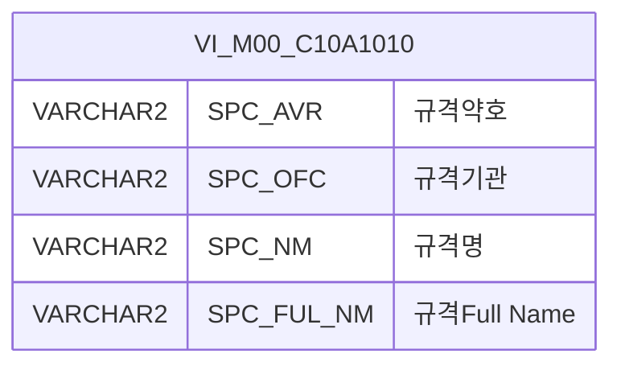

<h1 style="font-size: 40px; text-align: center; font-weight:
   bold; margin: 30px 0;">
  C105000010pop02 레거시 시스템 분석 종합 보고서
</h1>


# 1. 시스템 개요
- **서비스 ID**: C105000010pop02
- **업무명**: 생산가부이력등록 규격약호 팝업 조회
- **분석 일시**: 2026-03-17 08:45 (KST)
- **분석 시간**: 약 2분
- **전체 Activity 수**: 2개 (built-in 2개, custom 0개)
- **분석자**: Claude Opus 4.6 / Sonnet 4.6
- **분석 도구**: /analyze-service C105000010pop02
- **문서 버전**: 1.0

# 📊 비즈니스 프로세스 분석

## 시스템 목적

본 서비스는 **생산가부이력등록 화면(C105000010)**에서 호출되는 **규격약호 검색 팝업**이다. 사용자가 규격약호를 입력할 때 정확한 규격 코드를 검색하여 선택할 수 있도록 마스터 데이터 뷰(`VI_M00_C10A1010`)에서 규격 정보를 조회하는 보조 화면이다.

팝업은 부모 화면에서 전달된 규격약호 파라미터를 받아 자동 조회를 수행하며, 사용자가 그리드에서 원하는 규격을 더블클릭하면 선택된 규격약호 값을 부모 화면에 반환하고 팝업을 닫는다. Router → FormSearch 단일 조회 체인으로 구성된 단순 팝업 서비스이다.

## 주요 유즈케이스

### UC-01: 규격약호 검색 조회
- **Actor**: 생산가부 담당자
- **목적**: 마스터 데이터에서 규격약호, 규격기관, 규격명을 검색하여 정확한 규격 코드를 찾음

- **전제조건**:
  - 부모 화면(C105000010)에서 규격약호 입력 필드의 팝업 버튼을 클릭하여 진입
  - M00APUSER 스키마의 VI_M00_C10A1010 뷰에 규격 마스터 데이터가 존재

- **주요 흐름**:
  1. 팝업 진입 시 부모 화면에서 전달된 SPC_AVR 파라미터가 폼에 자동 세팅됨 (onLoadGrid 이벤트)
  2. 자동 조회 실행 — C105000010pop02.select 쿼리로 VI_M00_C10A1010 뷰를 LIKE 검색
  3. 그리드에 규격약호, 규격기관, 규격명, 규격Full Name 목록 표시
  4. 사용자가 원하는 규격 행을 더블클릭

- **대체 흐름**:
  - 검색 결과 없음: 빈 그리드 표시, 상태바에 메시지 출력
  - 규격약호 재입력: SPC_AVR 필드에 다른 값 입력 후 조회 버튼 클릭

- **후행조건**:
  - 선택된 SPC_AVR 값이 부모 화면(parent.gluePopupSetValue)에 반환됨
  - 팝업 창이 자동으로 닫힘

### UC-02: 규격약호 수동 검색
- **Actor**: 생산가부 담당자
- **목적**: 자동 조회 결과가 원하는 규격이 아닌 경우, 검색 조건을 변경하여 재조회

- **전제조건**:
  - 팝업이 이미 열려 있는 상태

- **주요 흐름**:
  1. SPC_AVR 입력 필드에 검색할 규격약호 일부 입력 (자동 대문자 변환)
  2. 조회 버튼 클릭
  3. LIKE '%입력값%' 패턴으로 VI_M00_C10A1010 뷰 검색
  4. 그리드에 필터링된 결과 표시

- **대체 흐름**:
  - SPC_AVR을 비워두고 조회: 전체 규격 목록 조회 (NVL 처리로 NULL → '%' 변환)

- **후행조건**:
  - 그리드에 필터링된 규격 목록이 표시됨

### UC-03: 팝업 닫기 (선택 취소)
- **Actor**: 생산가부 담당자
- **목적**: 규격 선택 없이 팝업을 닫음

- **전제조건**:
  - 팝업이 열려 있는 상태

- **주요 흐름**:
  1. 닫기 버튼 클릭
  2. parent.winObj3.winClose() 호출
  3. 팝업 창 닫힘

- **대체 흐름**: 없음

- **후행조건**:
  - 부모 화면에 값이 전달되지 않음
  - 기존 입력값 유지

---
## 비즈니스 로직 상세

### 1. 규격약호 LIKE 검색 패턴

- **목적**: 사용자가 입력한 부분 문자열로 규격약호와 규격기관을 동시에 필터링
- **처리 케이스**:

  **[케이스 1: 파라미터 입력 시 부분 일치 검색]**
  ```
    조건: SPC_AVR 또는 SPC_OFC에 값이 입력됨
    처리:
      1. NVL(SPC_AVR, '%')로 NULL 컬럼을 '%'로 치환 → NULL 값도 검색 대상에 포함
      2. LIKE '%' || :SPC_AVR || '%' 패턴으로 양방향 부분 일치 검색
      3. SPC_OFC도 동일 패턴 적용
      4. 결과를 SPC_AVR 기준 오름차순 정렬
  ```

  **[케이스 2: 파라미터 미입력 시 전체 조회]**
  ```
    조건: SPC_AVR, SPC_OFC 파라미터가 NULL 또는 빈 문자열
    처리:
      1. LIKE '%' || NULL || '%' → LIKE '%%' → 전체 일치
      2. 모든 규격 레코드 반환
  ```

- **예외 처리**:
  - 컬럼 값이 NULL인 경우: NVL 처리로 '%'가 되어 LIKE '%%'에 매칭 → 검색 결과에 포함됨

---

# 💾 데이터 요구사항

## 핵심 테이블

### 1. VI_M00_C10A1010 - (규격약호 마스터 뷰)
| 컬럼명 | 타입 | PK | 설명 |
|--------|------|----|-----|
| SPC_AVR | VARCHAR2 | | 규격약호 |
| SPC_OFC | VARCHAR2 | | 규격기관 |
| SPC_NM | VARCHAR2 | | 규격명 |
| SPC_FUL_NM | VARCHAR2 | | 규격Full Name |

> M00APUSER 스키마의 뷰로, C10 모듈에서 규격 마스터 정보를 참조하기 위한 공통 뷰

## 데이터 플로우

### 1. 조회
```
[규격약호 팝업 조회]
팝업 진입 (부모 화면에서 SPC_AVR 파라미터 전달)
→ C105000010pop02.select
  FROM M00APUSER.VI_M00_C10A1010
  WHERE NVL(SPC_AVR,'%') LIKE '%' || :SPC_AVR || '%'
    AND NVL(SPC_OFC,'%') LIKE '%' || :SPC_OFC || '%'
  ORDER BY SPC_AVR
→ Grid에 규격약호 목록 표시
```

### 2. 값 반환
```
[선택값 부모 화면 반환]
그리드 행 더블클릭
→ SPC_AVR 셀 값 추출 (index 0)
→ parent.gluePopupSetValue(cellValue) 호출
→ 부모 화면에 규격약호 값 세팅
→ 팝업 닫기 (parent.winObj3.winClose())
```

## SQL 일람표
| SQL 이름 | 쿼리 ID | 타입 | 출처 | 테이블 |
|---------|---------|-----|-------|-------|
| 규격약호 팝업 조회 | C105000010pop02.select | SELECT | Service | VI_M00_C10A1010 |

## ER 다이어그램 (핵심 관계)



관계 설명:
- VI_M00_C10A1010은 M00APUSER 스키마의 단독 뷰로, 다른 테이블과의 JOIN 관계 없이 독립적으로 조회됨
- C10 모듈의 규격 관련 팝업에서 공통으로 참조하는 마스터 뷰

---

# 🖥️ 사용자 인터페이스 요구사항

## 화면 레이아웃 상세

### Layout 구조 (절대좌표 배치 - 팝업)
```javascript
{
  layoutType: "absolute",  // 팝업 전용 절대좌표 배치
  components: [
    {
      id: "C105000010pop02_Form_1",
      type: "form",
      position: { left: "0px", top: "0px", width: "650px", height: "30px" }
    },
    {
      id: "C105000010pop02_Grid_1",
      type: "grid",
      position: { left: "1px", top: "31px", width: "648px", height: "431px" }
    },
    {
      id: "C105000010pop02_messagebox",
      type: "messagebox",
      position: { left: "0px", top: "464px", width: "649px", height: "19px" }
    }
  ]
}
```

## 입출력 요소

### Form 컴포넌트
**C105000010pop02_Form_1**
- SPC_AVR: input - 규격약호 (120px, 노란 배경 `#FFFFC0`, 편집 가능)
- 조회: button - find 명령 → 그리드 데이터 로딩
- 닫기: button - popClose 명령 → 팝업 창 닫기

### Grid 컴포넌트

**C105000010pop02_Grid_1 (규격약호 목록)**
- 편집 가능 여부: 아니오 (모든 컬럼 ro)
- Split: 0 (고정 컬럼 없음)
- 페이지셋: 활성화 (rowCnt: 18)
- 컨텍스트 메뉴: 활성화 (셀 복사, 엑셀 내보내기)
- 멀티셀렉트: 활성화
- 주요 컬럼 (4개):

  **규격 정보**:
  - SPC_AVR: ro - 규격약호 (20%, 중앙정렬, str_custom 정렬)
  - SPC_OFC: ro - 규격기관 (10%, 중앙정렬, str_custom 정렬)
  - SPC_NM: ro - 규격명 (*, 좌측정렬, str_custom 정렬)
  - SPC_FUL_NM: ro - 규격Full Name (27%, 중앙정렬, str_custom 정렬)

### Messagebox 컴포넌트
**C105000010pop02_messagebox**
- 위치: 하단 (464px)
- 용도: 조회 결과 메시지 표시 (건수 등)

## 화면 동작 흐름

### 1. 팝업 초기 로딩
```
1. 부모 화면에서 팝업 호출 (SPC_AVR 파라미터 전달)
2. onLoadGrid(XLE 이벤트) 발생
3. 부모에서 전달된 SPC_AVR 값을 폼에 세팅
   - items['C105000010pop02_Form_1'].setItemValue('SPC_AVR', spcAvr)
4. SPC_AVR 입력값 대문자 변환
5. 자동 조회 실행 — loadData(findUrl)
6. C105000010pop02.select 쿼리 실행
7. 그리드에 규격 목록 표시
8. 상태바에 조회 결과 메시지 표시 (findMessage → uiCommon.message)
```

### 2. 규격약호 수동 검색
```
1. 사용자가 SPC_AVR 입력 필드에 검색어 입력
2. 조회(find) 버튼 클릭
3. uiCommon.parameters(formDivObj, referenceItem, eventName) 호출
4. items[referenceItem].loadData(findUrl) 실행
5. C105000010pop02-service 서비스 호출 (find 명령)
   - 분기(PosDefaultRouter) → 조회(FormSearch) → end
6. 그리드에 필터링된 결과 바인딩
7. findMessage 이벤트로 상태바에 결과 메시지 표시
```

### 3. 규격 선택 및 값 반환
```
1. 그리드 행 더블클릭 (parentSetValue 이벤트)
2. 선택된 행의 SPC_AVR 셀 값 추출 (index 0)
3. parent.gluePopupSetValue(cellValue) 호출 → 부모 화면에 값 전달
4. parent.winObj3.winClose() 호출 → 팝업 닫기
```

### 4. 컨텍스트 메뉴 기능
```
1. 그리드 우클릭 → 컨텍스트 메뉴 표시
2. copy_row 선택 → gridObj.cellToClipboard() 실행 (셀 값 클립보드 복사)
3. excel_grid 선택 → gridObj.toExcel() 실행 (엑셀 내보내기)
```

## JavaScript 모듈

**C105000010pop02.jsp** (팝업 인라인 스크립트)
- find(): 조회 버튼 클릭 → uiCommon.parameters(formDivObj, referenceItem, eventName) → items[referenceItem].loadData(findUrl)
- save(): 저장 버튼 클릭 → items[referenceItem].sendGrid(referenceItem, eventName) (본 화면에서는 미사용)
- findMessage(): 조회 후 메시지 표시 → uiCommon.message('C105000010pop02_messagebox', appMsg)
- onLoadGrid(): XLE 이벤트 → 부모 파라미터(SPC_AVR) 폼 세팅 + 대문자 변환 + 자동 조회
- popClose(): 닫기 버튼 → parent.winObj3.winClose()
- parentSetValue(): 그리드 행 더블클릭 → parent.gluePopupSetValue(cellValue) → parent.winObj3.winClose()
- onGridContextMenuClick(): 컨텍스트 메뉴 → copy_row(셀 복사) / excel_grid(엑셀 내보내기)

## 주요 이벤트 핸들러

**find (조회 버튼 클릭)**
- 이벤트 타입: Form Button Click
- 처리 내용:
  1. uiCommon.parameters로 폼 파라미터(SPC_AVR) 구성
  2. referenceItem(Grid_1)에 대해 loadData 호출
  3. C105000010pop02-service 서비스 실행
  4. 그리드 데이터 갱신

**parentSetValue (그리드 행 더블클릭)**
- 이벤트 타입: Grid Row Double Click
- 처리 내용:
  1. 더블클릭된 행의 SPC_AVR 컬럼 값 추출 (cell index 0)
  2. parent.gluePopupSetValue(cellValue)로 부모 화면에 값 전달
  3. parent.winObj3.winClose()로 팝업 닫기

**onLoadGrid (그리드 로딩 완료)**
- 이벤트 타입: Grid XLE Event
- 처리 내용:
  1. 부모 화면에서 전달된 SPC_AVR 파라미터 수신
  2. 폼의 SPC_AVR 필드에 값 세팅
  3. 입력값 대문자 변환
  4. 자동 조회 실행 (loadData)

---

# 📌 특이사항 및 주의사항

## 1. NVL 기반 NULL 허용 LIKE 검색 패턴
- **NVL(SPC_AVR,'%') LIKE '%'||:SPC_AVR||'%'**: 컬럼 값이 NULL인 레코드도 검색 결과에 포함시키기 위해 NVL로 '%'치환 후 LIKE 비교. 이 패턴은 `SPC_AVR`이 NULL인 규격도 검색 대상이 되도록 하며, 파라미터가 NULL인 경우 전체 조회가 수행됨
- **인덱스 미사용 가능성**: NVL 함수 적용으로 인해 SPC_AVR 컬럼 인덱스를 활용하지 못할 수 있으며, 양방향 와일드카드(`%값%`)로 인해 Full Scan이 발생할 가능성이 높음

## 2. 팝업 부모-자식 간 데이터 전달 방식
- **gluePopupSetValue 패턴**: GLUE Framework 표준 팝업 값 반환 패턴인 `parent.gluePopupSetValue()`를 사용. 부모 화면에서 이 함수를 통해 반환값을 수신하므로, 부모 화면의 gluePopupSetValue 구현에 의존적
- **winObj3**: 팝업 창 객체가 `parent.winObj3`로 하드코딩되어 있어, 3번째 팝업 슬롯에 고정됨

## 3. M00APUSER 스키마 뷰 참조
- **VI_M00_C10A1010**: M00APUSER(마스터 데이터) 스키마의 뷰를 직접 참조. 뷰의 기반 테이블 구조 변경 시 본 팝업에도 영향이 있으며, C10 모듈 외 다른 모듈에서도 공통으로 사용할 수 있는 규격 마스터 뷰

## 4. SPC_AVR 입력값 대문자 자동 변환
- **onLoadGrid에서 toUpperCase() 적용**: 규격약호가 대문자 체계이므로 사용자 입력을 자동으로 대문자로 변환하여 검색 정확도를 높임. 다만 수동 조회 시(find 버튼 클릭 시) 별도 대문자 변환이 적용되는지는 JSP 코드 확인 필요

## 5. fetchSize 설정
- **fetchSize="10"**: 쿼리에 fetchSize가 10으로 설정되어 있어 한 번에 10건씩 가져옴. 그리드의 rowCnt(18)와 불일치할 수 있으나, 페이지셋이 활성화되어 있어 페이징으로 처리됨

---

# 📚 참고 문서

- **Query SQL**: `src/query/C105000010pop02-query.glue_sql`
- **Service XML**: `src/service/C105000010pop02-service.xml`
- **JSP**: `WebContents/C105000010pop02.jsp`
- **UI XML**:
  - `WebContents/header/kr/C105000010pop02/C105000010pop02_Form_1.xml`
  - `WebContents/header/kr/C105000010pop02/C105000010pop02_Grid_1.xml`
  - `WebContents/header/kr/C105000010pop02/C105000010pop02_messagebox.xml`
