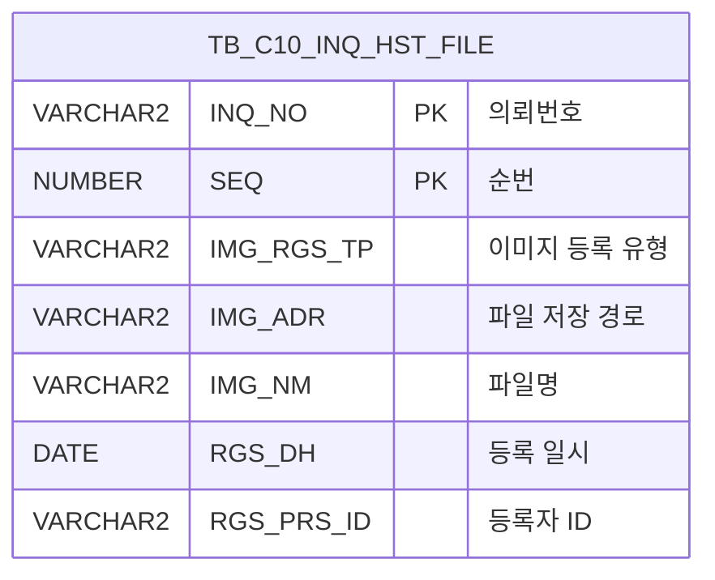

<h1 style="font-size: 40px; text-align: center; font-weight:
   bold; margin: 30px 0;">
  C105000010pop03 레거시 시스템 분석 종합 보고서
</h1>


# 1. 시스템 개요
- **서비스 ID**: C105000010pop03
- **업무명**: 생산가부이력관리 파일 업로드
- **분석 일시**: 2026-03-17 08:52 (KST)
- **전체 Activity 수**: 3개 (Built-in 3개, Custom 0개)
- **분석자**: Claude Opus 4.6 / Claude Sonnet
- **분석 도구**: /analyze-service C105000010pop03
- **문서 버전**: 1.0

# 비즈니스 프로세스 분석

## 시스템 목적

C105000010pop03은 생산가부이력관리(C105000010) 화면의 **파일 업로드 팝업**이다. 특정 의뢰번호(INQ_NO)에 대해 엑셀/PPT 파일을 첨부하고, 첨부된 파일 목록을 조회하며, 개별 파일을 삭제하거나 다운로드하는 기능을 제공한다.

이 팝업은 부모 화면(C105000010)의 그리드와 연동되어, 파일 업로드/삭제 완료 시 부모 창의 파일 관련 그리드를 자동으로 갱신한다. dhtmlXVault 컴포넌트를 활용하여 다중 파일 업로드를 지원하며, 허용 확장자(xls, xlsx, ppt, pptx)를 클라이언트 측에서 검증한다.

## 주요 유즈케이스

### UC-01: 첨부 파일 목록 조회
- **Actor**: MES 사용자 (생산가부 담당자)
- **목적**: 특정 의뢰에 첨부된 엑셀/PPT 파일 목록을 조회하여 현재 첨부 상태를 확인

- **전제조건**:
  - 부모 화면(C105000010)에서 의뢰번호(INQ_NO)가 선택된 상태
  - 팝업이 정상적으로 열린 상태

- **주요 흐름**:
  1. 부모 화면에서 파일 업로드 버튼 클릭 → 팝업 오픈 (INQ_NO 파라미터 전달)
  2. 팝업 로드 시 `onLoadGrid` 함수 실행
  3. `C105000010pop03.select` 쿼리 호출 (INQ_NO 바인드)
  4. TB_C10_INQ_HST_FILE 테이블에서 해당 의뢰의 파일 목록 조회
  5. 그리드에 파일명, 순번, 등록일자, 삭제 버튼 표시

- **대체 흐름**:
  - 첨부 파일이 없는 경우: 빈 그리드 표시

- **후행조건**:
  - 파일 목록이 그리드에 표시됨
  - 파일명 클릭으로 다운로드, 삭제 버튼으로 삭제 가능 상태

### UC-02: 파일 업로드
- **Actor**: MES 사용자 (생산가부 담당자)
- **목적**: 의뢰에 엑셀/PPT 파일을 첨부 등록

- **전제조건**:
  - 팝업이 열린 상태
  - 업로드할 파일이 허용 확장자(xls, xlsx, ppt, pptx)에 해당

- **주요 흐름**:
  1. "Add file" 버튼 클릭하여 파일 선택
  2. `vault.onAddFile` 이벤트에서 확장자 검증 수행
  3. "Upload" 버튼 클릭하여 업로드 시작
  4. `_uploadHandler2.jsp`로 파일 전송 (PAGE_ID, INQ_NO 폼필드 포함)
  5. 서버에서 `C105000010pop03.insert` 쿼리로 TB_C10_INQ_HST_FILE에 INSERT
  6. SEQ는 해당 INQ_NO의 MAX(SEQ)+1로 자동 채번
  7. `vault.onUploadComplete` 이벤트에서 성공 확인 후 `onLoadGrid` 호출
  8. 팝업 그리드 및 부모 창 그리드(C105000010_Grid_1) 동시 갱신

- **대체 흐름**:
  - 허용되지 않은 확장자: "허용되지 않은 확장자입니다" 알림 표시, 파일 추가 거부
  - 업로드 실패: 실패 알림 표시

- **후행조건**:
  - 파일이 서버에 저장되고 DB에 등록됨
  - 팝업 및 부모 창 그리드에 새 파일이 표시됨

### UC-03: 첨부 파일 삭제
- **Actor**: MES 사용자 (생산가부 담당자)
- **목적**: 잘못 첨부된 파일을 삭제

- **전제조건**:
  - 삭제 대상 파일이 그리드에 표시된 상태

- **주요 흐름**:
  1. 그리드의 "삭제" 컬럼 클릭
  2. `doImgDel` 함수 실행
  3. 해당 행의 INQ_NO, SEQ 추출
  4. `C105000010pop03.delete` 쿼리 호출 (INQ_NO + SEQ 복합키로 삭제)
  5. TB_C10_INQ_HST_FILE에서 해당 레코드 DELETE
  6. 팝업 그리드 재조회 및 부모 창 그리드(C105000010_Grid_1) 갱신

- **대체 흐름**:
  - 삭제 실패 시: 에러 메시지 표시

- **후행조건**:
  - DB에서 파일 레코드 삭제됨
  - 양쪽 그리드에서 해당 파일 제거됨

### UC-04: 첨부 파일 다운로드
- **Actor**: MES 사용자 (생산가부 담당자)
- **목적**: 첨부된 파일을 로컬에 다운로드

- **전제조건**:
  - 다운로드 대상 파일이 그리드에 표시된 상태

- **주요 흐름**:
  1. 그리드의 "파일" 컬럼(IMG_NM) 링크 클릭
  2. `Grid_doLink` 함수 실행
  3. 숨겨진 iframe을 통해 `/C10/download` 경로로 POST 요청
  4. 파일 다운로드 실행

- **대체 흐름**:
  - 파일이 서버에 존재하지 않는 경우: 다운로드 실패

- **후행조건**:
  - 파일이 사용자 로컬에 다운로드됨

---
## 비즈니스 로직 상세

### 1. 파일 경로 변환 로직 (SELECT 쿼리)

- **목적**: 서버 파일 시스템의 물리적 경로를 웹 접근 가능한 상대 경로로 변환
- **처리 케이스**:

  **[케이스 1: IMG_ADR → CHK_IMG_ADR 변환]**
  ```
    조건: IMG_ADR에 'FILE_UPLOAD' 문자열이 포함된 경우
    처리:
      1. INSTR(IMG_ADR, 'FILE_UPLOAD')로 'FILE_UPLOAD' 위치 탐색
      2. SUBSTR로 'FILE_UPLOAD' 이후 문자열 추출
      3. REPLACE로 백슬래시(\)를 슬래시(/)로 변환
      4. 앞에 './' 접두어, 뒤에 '/' 접미어를 붙여 상대 경로 구성
    결과: './' + 'FILE_UPLOAD/...' 형식의 웹 접근 가능 경로
  ```

### 2. SEQ 자동 채번 로직 (INSERT 쿼리)

- **목적**: 동일 의뢰번호 내에서 순번을 자동 증가시켜 파일 순서 관리
- **처리 케이스**:

  **[케이스 1: 기존 파일이 있는 경우]**
  ```
    조건: 동일 INQ_NO에 기존 레코드 존재
    처리:
      1. SELECT NVL(MAX(SEQ), 0) + 1 서브쿼리로 다음 순번 계산
      2. 최대 순번에 1을 더한 값을 SEQ로 사용
  ```

  **[케이스 2: 첫 번째 파일인 경우]**
  ```
    조건: 동일 INQ_NO에 기존 레코드 없음
    처리:
      1. MAX(SEQ)가 NULL → NVL로 0 처리
      2. 0 + 1 = 1로 첫 순번 할당
  ```

---

# 데이터 요구사항

## 핵심 테이블

### 1. TB_C10_INQ_HST_FILE - (생산가부이력 첨부파일)
| 컬럼명 | 타입 | PK | 설명 |
|--------|------|----|------|
| INQ_NO | VARCHAR2 | PK | 의뢰번호 |
| SEQ | NUMBER | PK | 순번 (자동채번) |
| IMG_RGS_TP | VARCHAR2 |  | 이미지 등록 유형 |
| IMG_ADR | VARCHAR2 |  | 파일 저장 경로 (서버 물리경로) |
| IMG_NM | VARCHAR2 |  | 파일명 |
| RGS_DH | DATE |  | 등록 일시 |
| RGS_PRS_ID | VARCHAR2 |  | 등록자 ID |
| CREATED_OBJECT_TYPE | VARCHAR2 |  | 생성 객체 유형 |
| CREATED_OBJECT_ID | VARCHAR2 |  | 생성 객체 ID |
| CREATED_PROGRAM_ID | VARCHAR2 |  | 생성 프로그램 ID |
| CREATION_TIMESTAMP | TIMESTAMP |  | 생성 타임스탬프 |
| LAST_UPDATED_OBJECT_TYPE | VARCHAR2 |  | 최종수정 객체 유형 |
| LAST_UPDATED_OBJECT_ID | VARCHAR2 |  | 최종수정 객체 ID |
| LAST_UPDATE_PROGRAM_ID | VARCHAR2 |  | 최종수정 프로그램 ID |
| LAST_UPDATE_TIMESTAMP | TIMESTAMP |  | 최종수정 타임스탬프 |

## 데이터 플로우

### 1. 조회
```
[팝업 로딩 시 파일 목록 조회]
팝업 진입 (INQ_NO 파라미터 수신)
→ C105000010pop03.select
  FROM TB_C10_INQ_HST_FILE
  WHERE INQ_NO = :INQ_NO
  ORDER BY SEQ
→ Grid에 파일 목록 표시
  - IMG_ADR → CHK_IMG_ADR 경로 변환 (FILE_UPLOAD 이후 추출, \ → / 변환)
  - RGS_DH → 'YYYY-MM-DD' 포맷 변환
```

### 2. 삭제
```
[파일 삭제]
삭제 버튼 클릭
→ C105000010pop03.delete
  FROM TB_C10_INQ_HST_FILE
  WHERE INQ_NO = :INQ_NO
    AND SEQ = :SEQ
→ 팝업 그리드 재조회 (onLoadGrid)
→ 부모 창 그리드 갱신 (parent.find)
```

### 3. 등록 (업로드)
```
[파일 업로드 등록]
dhtmlXVault 업로드 완료
→ _uploadHandler2.jsp에서 C105000010pop03.insert 실행
  INTO TB_C10_INQ_HST_FILE
  VALUES (INQ_NO, MAX(SEQ)+1, IMG_ADR, IMG_NM, SYSDATE, ...)
→ 팝업 그리드 재조회 (onLoadGrid)
→ 부모 창 그리드 갱신 (parent.find)
```

## SQL 일람표
| SQL 이름 | 쿼리 ID | 타입 | 출처 | 테이블 |
|---------|---------|-----|-------|-------|
| 생산가부이력관리 엑셀파일 조회 | C105000010pop03.select | SELECT | Service | TB_C10_INQ_HST_FILE |
| 생산가부이력관리 엑셀파일 등록 | C105000010pop03.insert | INSERT | Service | TB_C10_INQ_HST_FILE |
| 생산가부이력관리 엑셀파일 삭제 | C105000010pop03.delete | DELETE | Service | TB_C10_INQ_HST_FILE |

## ER 다이어그램 (핵심 관계)



관계 설명:
- TB_C10_INQ_HST_FILE은 단일 테이블 구조로, INQ_NO + SEQ 복합키로 관리
- INQ_NO는 부모 화면(C105000010)의 의뢰번호와 연결되는 논리적 FK 관계

---

# 사용자 인터페이스 요구사항

## 화면 레이아웃 상세

### Layout 구조 (팝업)
```javascript
{
  type: "popup",
  components: [
    {
      id: "vault1",
      type: "vault (dhtmlXVault)",
      position: { top: 0, left: 0 },
      description: "파일 업로드 영역"
    },
    {
      id: "C105000010pop03_Grid_1",
      type: "grid",
      position: { top: 260, left: 8, height: 70, width: 430 },
      description: "업로드된 파일 목록"
    },
    {
      id: "C105000010pop03_messagebox",
      type: "messagebox",
      position: { top: 332, left: 0, height: 23, width: 445 },
      description: "상태 메시지 표시"
    }
  ]
}
```

## 입출력 요소

### Vault 컴포넌트
**vault1 (dhtmlXVault - 파일 업로드)**
- 최대 파일 수: 50개
- 허용 확장자: xls, xlsx, ppt, pptx
- 서버 핸들러:
  - uploadHandler: `_uploadHandler2.jsp`
  - getInfoHandler: `_getInfoHandler.jsp`
  - getIdHandler: `_getIdHandler.jsp`
- 폼 필드: PAGE_ID=C105000010pop03, INQ_NO=(부모 전달값)
- 버튼: Add file, Upload, Clean, Done

### Grid 컴포넌트

**C105000010pop03_Grid_1 (파일 목록)**
- 편집 가능 여부: 아니오 (읽기 전용)
- Split: 없음
- 컬럼 너비 단위: %
- Multiselect: true
- 주요 컬럼 (8개):

  **표시 컬럼**:
  - INQ_NO: ro - 의뢰번호 (17%, 좌측정렬)
  - SEQ: ro - 순번 (8%, 중앙정렬)
  - IMG_NM: ahref_idx - 파일명 (*, 좌측정렬, 클릭 시 파일 다운로드)
  - RGS_DH: ro - 등록일자 (17%, 중앙정렬)
  - DEL_IMG: ro - 삭제 (8%, 중앙정렬, 클릭 시 doImgDel 실행)

  **숨김 컬럼**:
  - IMG_ADR: ro - 파일 서버 경로 (숨김)
  - CHK_IMG_NM: ro - 확인용 파일명 (숨김)
  - CHK_IMG_ADR: ro - 변환된 파일 경로 (숨김)

## 화면 동작 흐름

### 1. 팝업 초기 로딩
```
1. 부모 화면(C105000010)에서 팝업 오픈 (INQ_NO 파라미터 전달)
2. body.onload → onVaultLoad() 실행
3. dhtmlXVault 컴포넌트 초기화
   - imagePath, 서버 핸들러, 폼필드 설정
   - vault.setFilesLimit(50)
   - vault.setAllowedExtensions("xls,xlsx,ppt,pptx")
4. onLoadGrid() 호출
   - C105000010pop03.select 실행 (INQ_NO 바인드)
   - Grid에 파일 목록 표시
5. messagebox 초기화
```

### 2. 파일 업로드
```
1. "Add file" 버튼 클릭 → 파일 선택 다이얼로그
2. vault.onAddFile 이벤트 발생
   - 파일 확장자 추출 (마지막 '.' 이후)
   - xls/xlsx/ppt/pptx 이외 확장자 → 알림 후 거부
3. "Upload" 버튼 클릭 → 서버 전송 시작
4. vault.onUploadComplete 이벤트 발생
   - 성공 시: onLoadGrid() 호출 → 그리드 재조회
   - 실패 시: 실패 알림 표시
5. 부모 창 그리드 갱신: parent.find('find','C105000010_Form_1','C105000010_Grid_1')
```

### 3. 파일 삭제
```
1. Grid의 DEL_IMG 컬럼 클릭
2. doImgDel(rIdx) 함수 실행
3. 클릭된 행에서 INQ_NO(1번 컬럼), SEQ(2번 컬럼) 추출
4. C105000010pop03-service 호출 (delete 명령)
   - C105000010pop03.delete 실행 (INQ_NO + SEQ)
5. 삭제 후 자동으로 조회(C105000010pop03.select) 재실행
6. 부모 창 그리드 갱신: parent.find('find','C105000010_Form_1','C105000010_Grid_1')
```

### 4. 파일 다운로드
```
1. Grid의 IMG_NM 컬럼 링크 클릭
2. Grid_doLink(rowId, cellInd) 함수 실행
3. 숨겨진 iframe 생성
4. /C10/download 경로로 POST 요청 (파일 경로 파라미터 포함)
5. 파일 다운로드 실행
```

## JavaScript 모듈

**C105000010pop03.jsp** (팝업 스크립트 - JSP 내장)
- onVaultLoad(): dhtmlXVault 초기화 및 이벤트 핸들러 등록
- onLoadGrid(): 파일 목록 그리드 조회 + 부모 창 그리드 갱신 (parent.find 호출)
- doImgDel(rIdx): 행 인덱스 기반 파일 삭제 → 서비스 호출 → 부모 창 갱신
- Grid_doLink(rowId, cellInd): 파일명 링크 클릭 시 /C10/download로 POST 다운로드
- onXleGrid(): 엑셀 로드 완료 시 onLoadGrid 재호출

## 주요 이벤트 핸들러

**vault.onAddFile (파일 추가 시 확장자 검증)**
- 이벤트 타입: Vault File Add
- 처리 내용:
  1. 추가된 파일의 확장자를 추출
  2. 허용 확장자 목록(xls, xlsx, ppt, pptx) 비교
  3. 비허용 확장자 → alert 표시 후 파일 추가 거부
  4. 허용 확장자 → 파일 대기열에 추가

**vault.onUploadComplete (업로드 완료)**
- 이벤트 타입: Vault Upload Complete
- 처리 내용:
  1. 업로드 성공 여부 확인
  2. 성공 시 onLoadGrid() 호출
  3. 실패 시 실패 알림 표시

**doImgDel (파일 삭제)**
- 이벤트 타입: Grid Cell Click (DEL_IMG 컬럼)
- 처리 내용:
  1. 클릭된 행 인덱스(rIdx)로 행 데이터 접근
  2. INQ_NO, SEQ 값 추출 (customparam 구성)
  3. C105000010pop03-service delete 명령 호출
  4. 완료 후 onLoadGrid()로 그리드 재조회
  5. 부모 창 C105000010_Grid_1 갱신

**Grid_doLink (파일 다운로드)**
- 이벤트 타입: Grid Cell Link Click (IMG_NM 컬럼, ahref_idx 타입)
- 처리 내용:
  1. 클릭된 셀의 파일 경로 정보 추출
  2. hidden iframe 생성
  3. /C10/download 경로로 POST 방식 다운로드 요청

---

# 특이사항 및 주의사항

## 1. 부모 창 직접 접근 패턴
- **parent.find 호출**: 팝업에서 `parent.find('find','C105000010_Form_1','C105000010_Grid_1')` 형태로 부모 창의 그리드를 직접 갱신한다. 부모-자식 간 강한 결합이 존재하며, 부모 화면의 Form/Grid ID가 변경되면 팝업 코드도 반드시 수정해야 한다.

## 2. 파일 경로 변환의 하드코딩
- **FILE_UPLOAD 문자열 의존**: SELECT 쿼리에서 `INSTR(IMG_ADR, 'FILE_UPLOAD')`로 경로를 분리한다. 서버의 파일 업로드 디렉토리 구조가 변경되면 쿼리 수정이 필요하다.
- **백슬래시→슬래시 변환**: Windows 서버 경로를 웹 경로로 변환하는 `REPLACE(... ,'\','/')` 패턴이 SQL에 하드코딩되어 있다.

## 3. SEQ 채번의 동시성 이슈
- **MAX+1 패턴**: INSERT 쿼리에서 `SELECT NVL(MAX(SEQ),0)+1` 서브쿼리로 순번을 채번한다. 동시에 여러 사용자가 같은 INQ_NO에 파일을 업로드하면 SEQ 중복이 발생할 수 있다 (PK 위반 가능성).

## 4. 업로드 핸들러 JSP 의존
- **_uploadHandler2.jsp**: 파일 업로드 처리가 별도 JSP 핸들러로 구현되어 있으며, INSERT 쿼리가 이 JSP 내부에서 실행된다. Service XML의 Activity 체인이 아닌 JSP 직접 DB 접근 패턴이다.

## 5. 파일 삭제 시 물리 파일 미삭제
- **DB 레코드만 삭제**: `C105000010pop03.delete`는 DB 레코드만 삭제하며, 서버의 물리적 파일은 삭제하지 않는다. 이로 인해 불필요한 파일이 서버에 잔존할 수 있다.

---

# 참고 문서

- **Query SQL**: `src/query/C105000010pop03-query.glue_sql`
- **Service XML**: `src/service/C105000010pop03-service.xml`
- **JSP**: `WebContents/C105000010pop03.jsp`
- **Grid XML**: `WebContents/header/kr/C105000010pop03/C105000010pop03_Grid_1.xml`
- **Messagebox XML**: `WebContents/header/kr/C105000010pop03/C105000010pop03_messagebox.xml`
