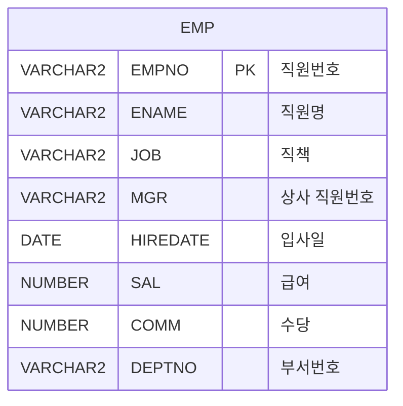

<h1 style="font-size: 40px; text-align: center; font-weight:
   bold; margin: 30px 0;">
  C105000010pop04 레거시 시스템 분석 종합 보고서
</h1>


# 1. 시스템 개요
- **서비스 ID**: C105000010pop04
- **업무명**: 톤당길이계산 (팝업)
- **분석 일시**: 2026-03-17 08:58 KST
- **분석 시간**: 약 5분
- **전체 Activity 수**: 3개 (Built-in 3개, Custom 0개)
- **분석자**: Claude Opus 4.6 / Sonnet (UI)
- **분석 도구**: /analyze-service C105000010pop04
- **문서 버전**: 1.0

# 📊 비즈니스 프로세스 분석

## 시스템 목적

본 서비스는 **톤당길이계산** 팝업 화면으로, 도금 강판의 톤당 길이를 산출하기 위한 계산 도구이다. 오퍼레이터가 품명, 주문두께, 주문폭, 도금부착량, BMT/TCT 구분 등 제조 조건을 입력하면 톤당길이, 전체중량, 압연SET 등을 자동 계산하여 제시한다.

주요 계산은 JavaScript + AJAX 기반으로 수행되며, 서버 측 JSP(`C105000010pop04_cal.jsp`, `C105000010pop05_cal.jsp`, `C105000010pop06_cal.jsp`)를 통해 목표도금두께/도금부착량을 조회하여 클라이언트에서 최종 계산한다. 서비스 XML 자체의 비즈니스 로직은 단순 CRUD(EMP 테이블 기준 테스트 쿼리)이며, 실제 핵심 로직은 UI(JavaScript)에 집중되어 있다.

## 주요 유즈케이스

### UC-01: 톤당길이 계산

- **Actor**: 오퍼레이터 / 생산관리 담당자
- **목적**: 품명·주문치수·도금부착량 조건에 따른 톤당길이(m/ton), MIN/MAX 범위, 전체중량을 산출

- **전제조건**:
  - 팝업 화면이 부모 화면에서 호출되어 열려 있음
  - 품명 마스터(SZ0000), 도금부착량 마스터(SG0000/SL0000/SE0000), BMT/TCT 마스터(SZ0001) 코드가 등록되어 있음

- **주요 흐름**:
  1. 품명(PRD_NM_CD_NM) 콤보에서 품명 선택 → 도금부착량 콤보 카테고리 자동 변경
  2. 주문두께(ORD_EXC_THK), 주문폭(ORD_EXC_WTH) 입력
  3. 도금부착량(GW_ASG_CD_NM) 선택
  4. BMT/TCT(ORD_THK_TP) 선택 → BMT: 주문두께 직접 사용 / TCT: AJAX(`C105000010pop04_cal.jsp`)로 압연set 자동 계산
  5. 계산 버튼 클릭
  6. `C105000010pop05_cal.jsp` AJAX 호출 → 톤당길이①②③④, 전체중량⑥ 계산
  7. `C105000010pop06_cal.jsp` AJAX 호출 (⑦톤당길이 값이 있는 경우) → ⑧압연SET 역산

- **대체 흐름**:
  - 압연SET(①) 값이 비어 있으면: "압연SET 값을 입력하세요" alert 표시
  - ⑦톤당길이 값이 없으면: ⑧압연SET 역산 단계 생략

- **후행조건**:
  - 결과 fieldset에 ①~⑧ 계산값 표시

### UC-02: 압연SET 역산

- **Actor**: 오퍼레이터 / 생산관리 담당자
- **목적**: 원하는 톤당길이(⑦)를 입력하여 역으로 필요한 압연SET(⑧)을 산출

- **전제조건**:
  - 품명, 도금부착량이 선택되어 있음
  - 주문폭(ORD_EXC_WTH)이 입력되어 있음

- **주요 흐름**:
  1. ⑦톤당길이(TON_PER_LENGTH2) 필드에 원하는 톤당길이 값 입력
  2. 계산 버튼 클릭
  3. `C105000010pop06_cal.jsp` AJAX 호출 → 도금부착량하한 조회
  4. ⑧압연SET(PLTCM_SET_THK_TRV2) = {1000000 / (폭 × ⑦톤당길이) - 도금부착량/1000} / 7.85 계산

- **대체 흐름**:
  - ⑦톤당길이 미입력 시: 역산 단계 자동 생략 (에러 없음)

- **후행조건**:
  - ⑧압연SET 필드에 역산 결과 표시

### UC-03: 초기화

- **Actor**: 오퍼레이터
- **목적**: 모든 입력 및 결과 필드를 초기화하여 새 계산 준비

- **전제조건**:
  - 팝업 화면이 열려 있음

- **주요 흐름**:
  1. 초기화 버튼 클릭
  2. Form_2의 모든 필드(입력 + 결과) 빈 값으로 초기화
  3. 콤보박스(PRD_NM_CD_NM, GW_ASG_CD_NM, ORD_THK_TP) 선택 해제

- **후행조건**:
  - 모든 필드가 빈 상태로 복귀

---
## 비즈니스 로직 상세

### 1. 톤당길이 계산 공식 (JavaScript/AJAX 기반)

- **목적**: 도금 강판의 두께·폭·도금부착량을 기반으로 톤당 길이, MIN/MAX 범위, 전체중량을 산출하여 생산계획 수립 및 품질 관리에 활용

- **처리 케이스**:

  **[케이스 1: BMT 선택 시 압연SET 결정]**
  ```
    조건: ORD_THK_TP = '1' (BMT)
    처리:
      1. 압연SET(①) = 주문두께(ORD_EXC_THK) 그대로 사용
  ```

  **[케이스 2: TCT 선택 시 압연SET 결정]**
  ```
    조건: ORD_THK_TP = '2' (TCT)
    처리:
      1. C105000010pop04_cal.jsp 호출 (파라미터: PRD_NM_CD, GW_ASG_CD)
      2. 목표도금두께(responseText) 조회
      3. 압연SET(①) = 주문두께(ORD_EXC_THK) - (목표도금두께 / 1000)
  ```

  **[케이스 3: 품명에 따른 도금량 카테고리 동적 변경]**
  ```
    조건: 품명 코드 첫 글자에 따라 분기
    처리:
      1. G, 3, J, 6 계열 → 도금부착량 카테고리 'SG0000'
      2. L, 4 계열 → 도금부착량 카테고리 'SL0000'
      3. E, 2 계열 → 도금부착량 카테고리 'SE0000'
  ```

- **계산 공식** (상세):

  ```
  ①압연SET = BMT: 주문두께
             TCT: 주문두께 - (목표도금두께 / 1000)

  ②톤당길이(m/ton) = 1,000,000 / {(①압연SET × 7.85 + 목표도금부착량/1000) × 주문폭}

  ③톤당길이MIN = 1,000,000 / {((①압연SET - 0.01) × 7.85 + 목표도금부착량/1000) × 주문폭}

  ④톤당길이MAX = 1,000,000 / {((①압연SET + 0.01) × 7.85 + 목표도금부착량/1000) × 주문폭}

  ⑥전체중량(ton) = ⑤주문길이 × ②톤당길이

  ⑧압연SET(역산) = {1,000,000 / (주문폭 × ⑦톤당길이) - 도금부착량하한/1000} / 7.85

  참고: 7.85 = 강판 비중 (g/cm³)
        도금부착량 단위 환산: /1000 (g/m² → kg/m²)
  ```

- **예외 처리**:
  - ①압연SET 미입력 시: "압연SET 값을 입력하세요" alert
  - 계산 결과가 0 또는 음수: 방어 로직 없음 (사용자 주의 필요)
  - AJAX 호출 실패 시: 별도 에러 핸들링 없음

---

# 💾 데이터 요구사항

## 핵심 테이블

### 1. EMP - (직원 정보 테이블, 테스트용)
| 컬럼명 | 타입 | PK | 설명 |
|--------|------|----|------|
| EMPNO | VARCHAR2 | ✅ | 직원번호 (PK) |
| ENAME | VARCHAR2 |  | 직원명 |
| JOB | VARCHAR2 |  | 직책 |
| MGR | VARCHAR2 |  | 상사 직원번호 |
| HIREDATE | DATE |  | 입사일 |
| SAL | NUMBER |  | 급여 |
| COMM | NUMBER |  | 수당 |
| DEPTNO | VARCHAR2 |  | 부서번호 |

## 데이터 플로우

### 1. 조회

```
[부서별 직원 목록 조회]
화면 진입 (find 이벤트)
→ C105000010pop04.select
  FROM EMP
  WHERE DEPTNO = :DEPTNO
→ Form에 직원 목록 표시
```

### 2. 저장 (INSERT/UPDATE/DELETE)

```
[직원 정보 추가]
행 추가 후 저장
→ C105000010pop04.insert
  INSERT INTO EMP(EMPNO, ENAME, JOB, MGR, HIREDATE, SAL, COMM, DEPTNO)
  VALUES(:EMPNO, :ENAME, :JOB, :MGR, :HIREDATE, :SAL, :COMM, :DEPTNO)

[직원 정보 수정]
기존 행 수정 후 저장
→ C105000010pop04.update
  UPDATE EMP SET ENAME=:ENAME, JOB=:JOB, MGR=:MGR, ...
  WHERE EMPNO=:EMPNO

[직원 정보 삭제]
행 선택 후 삭제
→ C105000010pop04.delete
  DELETE FROM EMP WHERE EMPNO=:EMPNO
```

## SQL 일람표

| SQL 이름 | 쿼리 ID | 타입 | 출처 | 테이블 |
|---------|---------|-----|------|-------|
| 직원 조회 | C105000010pop04.select | SELECT | Service | EMP |
| 직원 추가 | C105000010pop04.insert | INSERT | Service | EMP |
| 직원 수정 | C105000010pop04.update | UPDATE | Service | EMP |
| 직원 삭제 | C105000010pop04.delete | DELETE | Service | EMP |

## ER 다이어그램 (핵심 관계)



관계 설명:
- EMP 테이블은 단독 테이블로, 다른 테이블과의 JOIN 없이 사용
- MGR 컬럼을 통한 자기 참조 관계 (상사-부하 관계) 가능
- DEPTNO를 통해 부서 테이블과 연결 가능하나 본 서비스에서는 사용하지 않음

---

# 🖥️ 사용자 인터페이스 요구사항

## 화면 레이아웃 상세

### Layout 구조 (절대 위치 배치)
```javascript
{
  itemType: "absolute",
  pageTitle: "톤당길이계산",
  components: [
    {
      id: "C105000010pop04_Form_1",
      type: "form",
      position: "top:0px, left:0px",
      size: "width:615px, height:30px",
      role: "상단 버튼 바 (초기화/계산/닫기)"
    },
    {
      id: "C105000010pop04_Form_2",
      type: "form",
      position: "top:34px, left:0px",
      size: "width:615px, height:470px",
      role: "메인 입력/결과/계산식 영역"
    },
    {
      id: "C105000010pop04_messagebox",
      type: "messagebox",
      position: "top:500px, left:1px",
      size: "width:612px, height:19px",
      role: "서비스 응답 메시지 출력"
    }
  ]
}
```

## 입출력 요소

### Form 컴포넌트

**C105000010pop04_Form_1** (상단 버튼 바)
- clear: custombutton - 초기화 (75px) → 모든 필드 초기화
- calculate: custombutton - 계산 (75px) → 톤당길이 계산 실행
- popClose: button - 닫기 → 팝업 창 닫기 (`parent.winObj.winClose()`)

**C105000010pop04_Form_2** (메인 입력/결과/계산식 폼)

**[입력 fieldset]**
- PRD_NM_CD_NM: combo - 품명 (labelWidth:90, inputWidth:187, 카테고리:SZ0000, readonly, 선택 시 도금량 카테고리 동적 변경)
- PRD_NM_CD: hidden - 품명코드
- ORD_EXC_THK: input - 주문치수(두께) (inputWidth:70, maxLength:6, 우측정렬, IME 비활성)
- ORD_EXC_WTH: input - 주문치수(폭) (inputWidth:77, maxLength:6, 우측정렬, IME 비활성)
- PLTCM_SET_THK_TRV_CAL: hidden - 압연set값받아오기
- GW_ASG_CD_NM: combo - 도금부착량 (labelWidth:90, inputWidth:187, 동적 카테고리: SG0000/SL0000/SE0000)
- GW_ASG_CD: hidden - 도금량코드
- ORD_THK_TP: combo - BMT/TCT (labelWidth:90, inputWidth:187, 카테고리:SZ0001, readonly)

**[결과 fieldset]**
- PLTCM_SET_THK_TRV1: input - ①압연SET (inputWidth:70, maxLength:6, 단위:mm, 편집가능)
- TON_PER_LENGTH1: input - ②톤당길이 (inputWidth:60, maxLength:6, 단위:m/ton, 읽기전용)
- TON_PER_LENGTH_MIN: input - ③톤당길이MIN (inputWidth:40, maxLength:6, 읽기전용)
- TON_PER_LENGTH_MAX: input - ④톤당길이MAX (inputWidth:40, maxLength:6, 읽기전용)
- ORD_EXC_LTH: input - ⑤주문길이 (inputWidth:70, maxLength:6, 단위:m, 편집가능)
- TOT_WGT: input - ⑥전체중량 (inputWidth:60, maxLength:6, 단위:ton, 읽기전용)
- TON_PER_LENGTH2: input - ⑦톤당길이 (inputWidth:70, maxLength:6, 단위:m/ton, 편집가능, 역산용)
- PLTCM_SET_THK_TRV2: input - ⑧압연SET (inputWidth:60, maxLength:6, 단위:mm, 읽기전용)

**[계산식 fieldset]** (label만 표시)
- ①압연SET = BMT일 때는 주문두께, TCT일 때는 주문두께 - 목표도금두께
- ②톤당길이 = 1 / {(①압연SET x 7.85 + 목표도금부착량/1000) x 폭}
- ③톤당길이MIN = 1 / [{(①압연SET - 0.01) x 7.85 + 목표도금부착량/1000} x 폭]
- ④톤당길이MAX = 1 / [{(①압연SET + 0.01) x 7.85 + 목표도금부착량/1000} x 폭]
- ⑥전체중량 = ⑤주문길이 x ②톤당길이
- ⑧압연SET = {1 / (폭 x ⑦톤당길이) - 도금부착량/1000} / 7.85

## 화면 동작 흐름

### 1. 화면 초기 로딩
```
1. 부모 화면에서 팝업 호출
2. Form_1 로드 (버튼 바: 초기화/계산/닫기)
3. Form_2 로드 → onFormLoadFunction 실행
   - PRD_NM_CD_NM 콤보: SZ0000 카테고리로 마스터 콤보 초기화 (readonly, backspace 방지)
   - GW_ASG_CD_NM 콤보: 초기 카테고리 없음 (품명 선택 후 동적 설정)
   - ORD_THK_TP 콤보: SZ0001 카테고리로 마스터 콤보 초기화 (readonly, backspace 방지)
4. messagebox 초기화
5. 모든 입력/결과 필드 빈 상태
```

### 2. 톤당길이 계산 흐름
```
1. 품명 콤보에서 품명 선택
   - PRD_NM_CD 값 설정
   - 품명 코드 첫 글자로 도금부착량 카테고리 동적 변경:
     G/3/J/6 → SG0000, L/4 → SL0000, E/2 → SE0000
2. 주문두께(ORD_EXC_THK), 주문폭(ORD_EXC_WTH) 숫자 입력
3. 도금부착량(GW_ASG_CD_NM) 선택 → GW_ASG_CD 값 설정
4. BMT/TCT(ORD_THK_TP) 선택
   - BMT(1): PLTCM_SET_THK_TRV1 = 주문두께 그대로
   - TCT(2): AJAX(C105000010pop04_cal.jsp) 호출 → 목표도금두께 조회
             PLTCM_SET_THK_TRV1 = 주문두께 - (목표도금두께/1000)
5. 계산 버튼 클릭
   - PLTCM_SET_THK_TRV1 값 검증 (비어있으면 alert)
   - AJAX(C105000010pop05_cal.jsp) 호출 → 톤당길이 계산
   - (⑦톤당길이 값 있으면) AJAX(C105000010pop06_cal.jsp) 호출 → 압연SET 역산
6. 결과 fieldset에 ①~⑧ 값 표시
7. messagebox에 결과 메시지 표시
```

### 3. 초기화 및 닫기
```
1. 초기화 버튼 클릭
   - Form_2의 모든 필드(PRD_NM_CD_NM, GW_ASG_CD_NM, ORD_THK_TP,
     ORD_EXC_THK, ORD_EXC_WTH, PLTCM_SET_THK_TRV1,
     TON_PER_LENGTH1, TON_PER_LENGTH_MIN, TON_PER_LENGTH_MAX,
     ORD_EXC_LTH, TOT_WGT, TON_PER_LENGTH2, PLTCM_SET_THK_TRV2) 빈 값으로 초기화
2. 닫기 버튼 클릭
   - parent.winObj.winClose() 호출하여 팝업 창 닫기
```

## JavaScript 모듈

**C105000010pop04.jsp** (메인 팝업 스크립트 - JSP 내장)
- onFormLoadFunction(): Form_2 로드 완료 시 실행 - 마스터 콤보 초기화, onSelectionChange 이벤트 바인딩
- calculate(): 톤당길이 계산 실행 (PLTCM_SET_THK_TRV1 검증 → C105000010pop05_cal.jsp 호출 → C105000010pop06_cal.jsp 호출)
- clear(): Form_2 모든 필드 초기화
- callback(): TCT 선택 시 C105000010pop04_cal.jsp 응답으로 압연set 계산
- callback1(): C105000010pop05_cal.jsp 응답으로 톤당길이①②③④, 전체중량⑥ 계산
- callback2(): C105000010pop06_cal.jsp 응답으로 ⑧압연SET 역산
- popClose(): 팝업 창 닫기 (parent.winObj.winClose())
- findMessage(): 서비스 응답 메시지를 messagebox에 출력 (uiCommon.message 호출)

## 주요 이벤트 핸들러

**onFormLoadFunction (Form_2 로드 완료)**
- 이벤트 타입: onXLEEvent
- 처리 내용:
  1. PRD_NM_CD_NM 콤보 초기화 (SZ0000, readonly, backspace 방지)
  2. PRD_NM_CD_NM onSelectionChange 바인딩:
     - PRD_NM_CD 값 설정
     - 품명 첫 글자에 따라 GW_ASG_CD_NM 카테고리 동적 변경
  3. GW_ASG_CD_NM onSelectionChange 바인딩: GW_ASG_CD 값 설정
  4. ORD_THK_TP 콤보 초기화 (SZ0001, readonly, backspace 방지)
  5. ORD_THK_TP onSelectionChange 바인딩:
     - BMT(1): PLTCM_SET_THK_TRV1 = ORD_EXC_THK
     - TCT(2): AJAX 호출로 압연set 계산

**calculate (계산 버튼 클릭)**
- 이벤트 타입: custombutton click
- 처리 내용:
  1. PLTCM_SET_THK_TRV1 값 검증 (빈값이면 alert 후 중단)
  2. C105000010pop05_cal.jsp AJAX 호출 (PRD_NM_CD, GW_ASG_CD 전달)
  3. callback1에서 톤당길이①②③④, 전체중량⑥ 계산
  4. TON_PER_LENGTH2 값이 있으면 C105000010pop06_cal.jsp 호출
  5. callback2에서 ⑧압연SET 역산

**clear (초기화 버튼 클릭)**
- 이벤트 타입: custombutton click
- 처리 내용:
  1. Form_2의 13개 필드 모두 빈 값으로 초기화

---

# 📌 특이사항 및 주의사항

## 1. 서비스 XML과 UI 로직의 불일치
- **테스트 DAO 사용**: 서비스 XML에서 `testdao`를 사용하며, SQL은 EMP 테이블(Oracle 샘플 테이블) 대상 단순 CRUD이다. 반면 UI는 도금 강판 톤당길이 계산이라는 실제 비즈니스 기능을 구현하고 있어, 서비스 XML의 SQL과 UI 목적이 일치하지 않는다.
- **핵심 비즈니스 로직이 JavaScript에 집중**: 톤당길이 계산의 모든 공식과 분기 로직이 JSP 내 JavaScript에 구현되어 있으며, 서버 측 서비스 XML의 Activity 체인은 실질적으로 활용되지 않는다.

## 2. AJAX 기반 서버 호출 패턴
- **별도 JSP 계산 서버**: `C105000010pop04_cal.jsp`, `C105000010pop05_cal.jsp`, `C105000010pop06_cal.jsp` 등 3개의 별도 JSP를 AJAX로 호출하여 도금 관련 파라미터(목표도금두께, 도금부착량, 도금부착량하한)를 조회한다.
- **비동기 순차 호출**: callback → callback1 → callback2 순서로 연쇄적으로 AJAX 호출이 이루어지며, 이전 호출의 결과가 다음 계산에 사용된다.
- **에러 핸들링 부재**: AJAX 호출 실패 시 별도 에러 처리 로직이 없어, 네트워크 오류나 서버 오류 시 사용자에게 적절한 피드백이 제공되지 않을 수 있다.

## 3. 전역 변수 사용 및 상태 관리
- **전역 변수 다수 사용**: `pltcm_set_thk_trv_temp`, `prdNmCd_Cal_global`, `ton_cal_result_temp`, `req` 등 JavaScript 전역 변수를 사용하여 AJAX 콜백 간 상태를 공유한다. 동시 호출 시 경합 조건(race condition) 가능성이 있다.
- **XMLHttpRequest 직접 사용**: `req` 전역 변수로 XMLHttpRequest를 직접 관리하며, jQuery 등 라이브러리를 사용하지 않는 레거시 패턴이다.

## 4. 계산 정밀도 주의
- **부동소수점 계산**: 강판 비중(7.85), ±0.01 범위 계산 등 부동소수점 연산이 JavaScript에서 수행되므로, 부동소수점 정밀도 문제가 발생할 수 있다.
- **round 함수 사용**: 톤당길이 계산 결과에 round 함수를 적용하나, 소수점 자릿수 지정이 명확하지 않다.

---

# 📚 참고 문서

- **Query SQL**: `src/query/C105000010pop04-query.glue_sql`
- **Service XML**: `src/service/C105000010pop04-service.xml`
- **JSP**: `WebContents/C105000010pop04.jsp`
- **AJAX JSP**:
  - `WebContents/C105000010pop04_cal.jsp` (목표도금두께 조회)
  - `WebContents/C105000010pop05_cal.jsp` (목표도금부착량 조회)
  - `WebContents/C105000010pop06_cal.jsp` (도금부착량하한 조회)
- **Form XML**:
  - `WebContents/header/kr/C105000010pop04/C105000010pop04_Form_1.xml`
  - `WebContents/header/kr/C105000010pop04/C105000010pop04_Form_2.xml`
