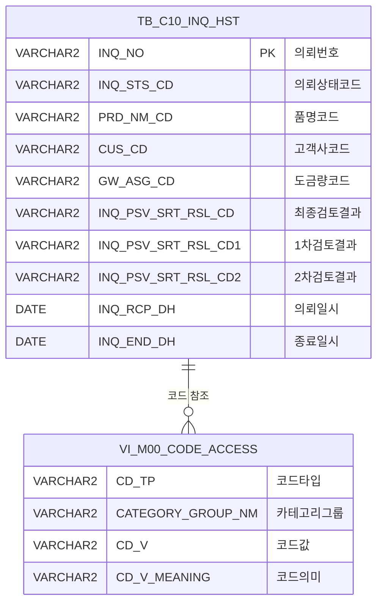

<h1 style="font-size: 40px; text-align: center; font-weight:
   bold; margin: 30px 0;">
  C105000020 레거시 시스템 분석 종합 보고서
</h1>


# 1. 시스템 개요
- **서비스 ID**: C105000020
- **업무명**: 생산가부수동검토
- **분석 일시**: 2026-03-17 09:05 KST
- **분석 시간**: 약 5분
- **전체 Activity 수**: 4개 (Built-in 4개, Custom 0개)
- **분석자**: Claude Opus 4.6 / Claude Sonnet 4.6
- **분석 도구**: /analyze-service C105000020
- **문서 버전**: 1.0

# 📊 비즈니스 프로세스 분석

## 시스템 목적

C105000020(생산가부수동검토)은 영업부서에서 접수한 Inquiry(생산가부 의뢰)에 대해 품질/기술 담당자가 수동으로 생산 가능 여부를 검토하고 결과를 기록하는 화면이다. 자동 검토 시스템에서 판단하지 못한 주문 건에 대해 담당자가 1차, 2차에 걸쳐 수동 검토를 수행하며, 검토 결과(가능/불가/조건부 가능 등)와 사유를 입력한다.

이 시스템은 Inquiry 프로세스의 핵심 단계로, 의뢰 접수(상태 1) → 1차 검토(상태 2) → 2차 검토(상태 3) → 검토 완료(상태 4) → 종료(상태 9)의 상태 전이를 관리한다. 고객사양번호 등록, 검토 결과 텍스트 기록, 검토 일자 관리 등의 부가 기능도 포함한다.

## 주요 유즈케이스

### UC-01: 생산가부 의뢰 조회
- **Actor**: 품질/기술 담당자
- **목적**: Inquiry 번호로 의뢰 상세 정보를 조회하여 검토 대상 주문의 제품 사양, 고객 정보, 자동 검토 결과 등을 확인

- **전제조건**:
  - 사용자가 시스템에 로그인되어 있음
  - 유효한 Inquiry 번호를 알고 있음
  - TB_C10_INQ_HST에 해당 의뢰 데이터가 존재함

- **주요 흐름**:
  1. 화면 상단 Form_1의 INQUIRY 번호 입력 필드에 10자리 숫자 입력
  2. 조회 버튼 클릭 (또는 URL 파라미터로 INQ_NO 전달 시 자동 조회)
  3. C105000020.select 쿼리 실행 — TB_C10_INQ_HST에서 의뢰 전체 정보 조회
  4. Form_2에 의뢰 상세 정보 표시 (품명, 고객사, 규격, 주문 사양, 검토 이력 등)
  5. findAfterFunction 콜백에서 INQ_STS_CD에 따라 1차/2차 입력 필드 활성화/비활성화 제어

- **대체 흐름**:
  - INQ_NO가 null이거나 숫자가 아닌 경우: "INQUIRY 번호가 올바르지 않습니다" 메시지
  - INQ_NO 길이가 10자리가 아닌 경우: "INQUIRY 번호를 정확하게 입력해 주세요!" 메시지
  - 조회 결과 없음: 빈 Form 표시

- **후행조건**:
  - Form_2에 의뢰 상세 정보가 표시됨
  - INQ_STS_CD에 따라 적절한 입력 필드가 활성화됨

### UC-02: 수동 검토 결과 저장
- **Actor**: 품질/기술 담당자
- **목적**: 1차 또는 2차 수동 검토 결과(가능/불가/조건부 등)와 검토 사유를 기록하고, 의뢰 상태를 다음 단계로 전이

- **전제조건**:
  - UC-01에서 의뢰 조회가 완료된 상태
  - INQ_STS_CD가 9(종료)가 아닌 상태

- **주요 흐름**:
  1. 1차 또는 2차 검토결과 콤보에서 결과 코드 선택 (SZ0000/INQ_SRT_RSL_CD 마스터 코드)
  2. 수동검토일, 결과전송일 캘린더 입력
  3. 검토결과(최종/이력) 텍스트 입력 (최대 2000자)
  4. 저장 버튼 클릭
  5. JavaScript save() 함수에서 최종검토결과/완료일/전송일 자동 계산:
     - 1차/2차 검토결과 중 최신 값을 INQ_PSV_SRT_RSL_CD로 설정
     - INQ_STS_CD 상태 전이 자동 계산
  6. 확인 다이얼로그 표시 후 C105000020.update 쿼리 실행
  7. 저장 완료 후 자동 재조회

- **대체 흐름**:
  - INQ_NO가 없는 경우: "INQUIRY 번호를 먼저 조회하세요" 메시지
  - INQ_STS_CD가 없는 경우: "상태를 확인할 수 없습니다" 메시지

- **후행조건**:
  - TB_C10_INQ_HST에 검토 결과가 저장됨
  - INQ_STS_CD가 다음 단계로 전이됨
  - 화면이 갱신된 데이터로 재조회됨

### UC-03: Inquiry 완료(종료) 처리
- **Actor**: 품질/기술 담당자
- **목적**: 검토가 완료된 의뢰 건을 최종 종료 상태(9)로 변경하고 종료 일시를 기록

- **전제조건**:
  - UC-01에서 의뢰 조회가 완료된 상태
  - INQ_STS_CD가 9(종료)가 아닌 상태

- **주요 흐름**:
  1. 완료 버튼 클릭
  2. INQ_STS_CD를 '9'(완료)로 강제 설정
  3. C105000020.inquiry_end_update 쿼리 실행 — INQ_END_DH에 SYSDATE 기록
  4. 저장 완료 후 자동 재조회
  5. findAfterFunction에서 상태 9 감지 → 모든 입력 필드 비활성화

- **대체 흐름**:
  - INQ_NO가 없는 경우: "INQUIRY 번호를 먼저 조회하세요" 메시지

- **후행조건**:
  - INQ_STS_CD = '9', INQ_END_DH = SYSDATE로 업데이트됨
  - 모든 입력 필드가 비활성화되어 더 이상 수정 불가

---
## 비즈니스 로직 상세

### 1. 의뢰 상태(INQ_STS_CD) 전이 로직

- **목적**: 검토 단계에 따라 의뢰 상태를 자동으로 전이하여 프로세스 진행을 관리
- **처리 케이스**:

  **[케이스 1: 1차 검토 진입 (1→2)]**
  ```
    조건: INQ_STS_CD = '1' (의뢰 접수)
    처리:
      1. 1차 검토결과 입력 시 상태를 '2'(1차 검토중)로 변경
  ```

  **[케이스 2: 1차/2차 검토 결과 반영 (1/2/4 + 'C' → 3)]**
  ```
    조건: INQ_STS_CD가 '1', '2', '4' 중 하나이고, 검토결과가 'C'(조건부 가능)
    처리:
      1. 상태를 '3'(2차 검토 진입)으로 변경
  ```

  **[케이스 3: 2차 검토 완료 (3→4)]**
  ```
    조건: INQ_STS_CD = '3' (2차 검토중)
    처리:
      1. 상태를 '4'(검토 완료)로 변경
  ```

  **[케이스 4: 완료 처리 (→9)]**
  ```
    조건: 완료 버튼 클릭
    처리:
      1. INQ_STS_CD를 '9'(종료)로 강제 변경
      2. INQ_END_DH에 SYSDATE 기록
  ```

### 2. 1차/2차 검토 필드 동적 활성화 로직

- **목적**: 의뢰 상태에 따라 1차 또는 2차 검토 입력 필드를 선택적으로 활성화하여 검토 단계별 입력을 제어
- **처리 케이스**:

  **[케이스 1: 1차 검토 활성화]**
  ```
    조건: INQ_STS_CD = '1' 또는 '2'
    처리:
      1. 1차 검토결과(INQ_PSV_SRT_RSL_CD1) 콤보 활성화 (배경색 노란색 #FFFFC0)
      2. 1차 수동검토일(INQ_PSV_SRT_END_DH1) 캘린더 활성화
      3. 1차 결과전송일(INQ_SRT_RSL_SND_DH1) 캘린더 활성화
      4. 2차 관련 필드 모두 비활성화 (배경색 흰색)
  ```

  **[케이스 2: 2차 검토 활성화]**
  ```
    조건: INQ_STS_CD가 '1', '2' 이외의 값
    처리:
      1. 2차 검토결과(INQ_PSV_SRT_RSL_CD2) 콤보 활성화 (배경색 노란색)
      2. 2차 수동검토일(INQ_PSV_SRT_END_DH2) 캘린더 활성화
      3. 2차 결과전송일(INQ_SRT_RSL_SND_DH2) 캘린더 활성화
      4. 1차 관련 필드 모두 비활성화 (배경색 흰색)
  ```

  **[케이스 3: 종료 상태 — 전체 비활성화]**
  ```
    조건: INQ_STS_CD = '9'
    처리:
      1. 1차, 2차 모든 필드 비활성화
      2. 검토결과(최종/이력) 텍스트 필드 readonly 설정
      3. 모든 입력 필드 배경색 흰색으로 변경
  ```

### 3. 코드값→의미명 변환 (SQL 서브쿼리)

- **목적**: DB에 저장된 코드값을 사용자가 이해할 수 있는 "코드 : 의미명" 형태로 변환하여 화면에 표시
- **처리 케이스**:

  **[케이스 1: 일반 코드 변환]**
  ```
    대상: INQ_STS_CD, PRD_NM_CD, CUS_CD, ORD_USG_CD, FLOW_CHL, PRD_SHP, ORD_SUR_HND_CD, INQ_REQ_TP
    처리:
      1. VI_M00_CODE_ACCESS 뷰에서 CATEGORY_GROUP_NM = 'SZ0000' 조건으로 조회
      2. CD_TP = 해당 컬럼명, CD_V = 코드값으로 매칭
      3. "코드값 : 의미명" 형태로 결합하여 반환
  ```

  **[케이스 2: 품명코드 기반 동적 카테고리 코드 변환 (GW_ASG_CD)]**
  ```
    대상: GW_ASG_CD (도금량코드)
    처리:
      1. PRD_NM_CD(품명코드)에 따라 CATEGORY_GROUP_NM을 동적으로 결정:
         - G, K, 3, J → 'SG0000'
         - L, 4 → 'SL0000'
         - V, 6 → 'SV0000'
         - W, 9 → 'SW0000'
         - E, 2 → 'SE0000'
         - N, 8 → 'SE0000'
         - 기타 → 'SZ0000'
      2. 해당 카테고리에서 CD_V = GW_ASG_CD로 코드명 조회
  ```

### 4. 선택적 날짜 업데이트 (DECODE 패턴)

- **목적**: 날짜 파라미터가 입력되지 않은 경우 기존 값을 유지하고, 입력된 경우에만 새 값으로 업데이트
- **처리 케이스**:

  **[케이스 1: 날짜 미입력 — 기존 값 유지]**
  ```
    조건: NVL(:파라미터, '%') = '%' (NULL이거나 미전달)
    처리:
      1. 기존 DB 컬럼값을 그대로 유지
      예: DECODE(NVL(:INQ_SRT_END_DH,'%'),'%',INQ_SRT_END_DH, ...)
  ```

  **[케이스 2: 날짜 입력 — 새 값 적용]**
  ```
    조건: 날짜 문자열이 전달됨
    처리:
      1. TO_DATE(:파라미터, 'yyyy-mm-dd HH24miss') 변환 후 저장
      2. 적용 대상: INQ_SRT_END_DH, INQ_SRT_RSL_SND_DH, INQ_PSV_SRT_END_DH1/DH2,
         INQ_SRT_RSL_SND_DH1/DH2, CUS_SPC_RGS_DH
  ```

### 5. 최종 검토결과 자동 산출 로직

- **목적**: 1차/2차 검토 결과 중 최신 값을 자동으로 최종 검토결과로 설정
- **처리 케이스**:

  **[케이스 1: 1차 활성 상태에서 저장]**
  ```
    조건: INQ_STS_CD = '1' 또는 '2'
    처리:
      1. INQ_PSV_SRT_RSL_CD = INQ_PSV_SRT_RSL_CD1 (1차 결과를 최종으로)
      2. INQ_SRT_END_DH = INQ_PSV_SRT_END_DH1
      3. INQ_SRT_RSL_SND_DH = INQ_SRT_RSL_SND_DH1
  ```

  **[케이스 2: 2차 활성 상태에서 저장]**
  ```
    조건: INQ_STS_CD가 '1', '2' 이외
    처리:
      1. INQ_PSV_SRT_RSL_CD = INQ_PSV_SRT_RSL_CD2 (2차 결과를 최종으로)
      2. INQ_SRT_END_DH = INQ_PSV_SRT_END_DH2
      3. INQ_SRT_RSL_SND_DH = INQ_SRT_RSL_SND_DH2
  ```

---

# 💾 데이터 요구사항

## 핵심 테이블

### 1. TB_C10_INQ_HST — 생산가부 의뢰 이력 (MESAPUSER)
| 컬럼명 | 타입 | PK | 설명 |
|--------|------|----|------|
| INQ_NO | VARCHAR2 | ✅ | 의뢰번호 (PK, 10자리) |
| INQ_STS_CD | VARCHAR2 | | 의뢰상태코드 (1:접수, 2:1차검토, 3:2차검토, 4:완료, 9:종료) |
| PRD_NM_CD | VARCHAR2 | | 품명코드 (G,K,L,V,W,E,N 등) |
| CUS_CD | VARCHAR2 | | 고객사코드 |
| SPC_AVR | VARCHAR2 | | 규격약호 |
| ORD_USG_CD | VARCHAR2 | | 주문용도코드 |
| GW_ASG_CD | VARCHAR2 | | 도금량코드 |
| FLOW_CHL | VARCHAR2 | | 유통경로코드 |
| ORD_LN_WGT | NUMBER | | 주문행번중량 |
| ORD_EXC_THK | NUMBER | | 주문칫수(두께) |
| ORD_EXC_WTH | NUMBER | | 주문칫수(폭) |
| ORD_EXC_LTH | NUMBER | | 주문칫수(길이) |
| PRD_SHP | VARCHAR2 | | 제품형태코드 |
| ORD_REQ_NO | VARCHAR2 | | 주문요청번호 |
| ORD_REQ_LN | VARCHAR2 | | 주문요청행번 |
| ORD_SUR_HND_CD | VARCHAR2 | | 표면후처리코드 |
| ORD_CHR_PRS_ID | VARCHAR2 | | 영업담당자 ID |
| INQ_RCP_DH | DATE | | 의뢰일시 |
| QLT_CHR_PRS_ID | VARCHAR2 | | 품질담당자 ID |
| INQ_REQ_TP | VARCHAR2 | | Inquiry 구분코드 |
| INQ_AUT_SRT_END_DH | DATE | | 자동검토일시 |
| INQ_AUT_SRT_RSL_CD | VARCHAR2 | | 자동검토결과코드 |
| INQ_PSV_SRT_RSL_CD | VARCHAR2 | | 최종 수동검토결과코드 |
| INQ_SRT_END_DH | DATE | | 최종검토완료일시 |
| INQ_SRT_RSL_SND_DH | DATE | | 검토결과전송일시 |
| INQ_PSV_SRT_RSL_CD1 | VARCHAR2 | | 1차 수동검토결과코드 |
| INQ_PSV_SRT_END_DH1 | DATE | | 1차 수동검토일 |
| INQ_SRT_RSL_SND_DH1 | DATE | | 1차 결과전송일 |
| INQ_PSV_SRT_RSL_CD2 | VARCHAR2 | | 2차 수동검토결과코드 |
| INQ_PSV_SRT_END_DH2 | DATE | | 2차 수동검토일 |
| INQ_SRT_RSL_SND_DH2 | DATE | | 2차 결과전송일 |
| INQ_END_DH | DATE | | 종료일시 |
| CUS_SPC_RGS_DH | DATE | | 고객사양등록일 |
| CUS_BTH_PAP_NO | VARCHAR2 | | 고객사양번호 |
| INQ_REQ_TXT | VARCHAR2 | | 검토요청(최종) |
| INQ_REQ_TXT1 | VARCHAR2 | | 검토요청(이력) |
| INQ_SRT_TXT | VARCHAR2 | | 검토결과(최종) |
| INQ_SRT_TXT1 | VARCHAR2 | | 검토결과(이력) |
| LAST_UPDATED_OBJECT_TYPE | VARCHAR2 | | 최종변경 객체 타입 |
| LAST_UPDATED_OBJECT_ID | VARCHAR2 | | 최종변경 객체 ID |
| LAST_UPDATE_PROGRAM_ID | VARCHAR2 | | 최종변경 프로그램 ID |
| LAST_UPDATE_TIMESTAMP | DATE | | 최종변경 타임스탬프 |

### 2. VI_M00_CODE_ACCESS — 공통코드 뷰 (M00APUSER)
| 컬럼명 | 타입 | PK | 설명 |
|--------|------|----|------|
| CD_TP | VARCHAR2 | | 코드 타입 (INQ_STS_CD, PRD_NM_CD 등) |
| CATEGORY_GROUP_NM | VARCHAR2 | | 카테고리 그룹명 (SZ0000, SG0000 등) |
| CD_V | VARCHAR2 | | 코드값 |
| CD_V_MEANING | VARCHAR2 | | 코드 의미명 |

## 데이터 플로우

### 1. 조회
```
[의뢰 상세 정보 조회]
INQUIRY 번호 입력 → 조회 버튼 클릭
→ C105000020.select
  FROM TB_C10_INQ_HST
  WHERE INQ_NO = :INQ_NO
  + 9개 스칼라 서브쿼리 (VI_M00_CODE_ACCESS 코드→의미명 변환)
→ Form_2에 의뢰 상세 정보 표시
→ findAfterFunction 콜백으로 필드 활성화/비활성화 제어
```

### 2. 저장 (수동 검토 결과)
```
[검토 결과 저장]
1차/2차 검토결과 입력 → 저장 버튼 클릭
→ JavaScript save()에서 최종결과/상태코드 자동 계산
→ C105000020.update
  UPDATE TB_C10_INQ_HST SET
    INQ_STS_CD, INQ_PSV_SRT_RSL_CD (최종결과),
    1차/2차 검토결과, 수동검토일, 결과전송일 (DECODE 선택적 업데이트),
    CUS_SPC_RGS_DH, CUS_BTH_PAP_NO, INQ_SRT_TXT/TXT1,
    감사정보 (LAST_UPDATED_*)
  WHERE INQ_NO = :INQ_NO
→ 저장 완료 후 find() 재호출로 화면 갱신
```

### 3. 완료 처리
```
[의뢰 종료]
완료 버튼 클릭
→ JavaScript inquiryEnd()에서 INQ_STS_CD = '9' 설정
→ C105000020.inquiry_end_update
  UPDATE TB_C10_INQ_HST SET
    INQ_STS_CD = :INQ_STS_CD (='9'),
    INQ_END_DH = SYSDATE,
    감사정보 (LAST_UPDATED_*)
  WHERE INQ_NO = :INQ_NO
→ 재조회 후 모든 필드 비활성화
```

## SQL 일람표
| SQL 이름 | 쿼리 ID | 타입 | 출처 | 테이블 |
|---------|---------|------|------|--------|
| 생산가부수동검토 조회 | C105000020.select | SELECT | Service | TB_C10_INQ_HST, VI_M00_CODE_ACCESS |
| 생산가부수동검토 저장 | C105000020.update | UPDATE | Service | TB_C10_INQ_HST |
| 의뢰 종료 처리 | C105000020.inquiry_end_update | UPDATE | Service | TB_C10_INQ_HST |

## ER 다이어그램 (핵심 관계)



관계 설명:
- TB_C10_INQ_HST가 중심 테이블로, 단일 테이블에 의뢰의 모든 정보(주문 정보, 검토 이력, 상태)를 저장
- VI_M00_CODE_ACCESS 뷰를 통해 9개 코드 컬럼(INQ_STS_CD, PRD_NM_CD, CUS_CD 등)의 의미명을 참조
- GW_ASG_CD는 PRD_NM_CD에 따라 다른 CATEGORY_GROUP_NM으로 참조 (동적 관계)

---

# 🖥️ 사용자 인터페이스 요구사항

## 화면 레이아웃 상세

### Layout 구조
```
DIV 기반 직접 배치 (DHTMLX Layout 미사용)
┌─────────────────────────────────────────────┐
│ Form_1 (0,0) 981×38px - 검색/액션 바        │
│ [INQUIRY 번호 입력] [완료] [조회] [저장] [닫기] │
├─────────────────────────────────────────────┤
│ Form_2 (0,42) 981×530px - 상세 데이터 폼     │
│ (배경색 #D6E8FF)                             │
│ ┌───────────────────┬──────────────────────┐│
│ │ INQUIRY 상태      │ 품명                  ││
│ │ 고객사            │ 규격약호              ││
│ │ 주문용도          │ 도금량코드            ││
│ │ 유통경로          │ 주문행번중량          ││
│ │ 주문칫수(두께×폭×길이) │ 제품유형          ││
│ │ ... (총 39개 필드) │                      ││
│ │ 검토요청(최종/이력) - 3행 텍스트           ││
│ │ 검토결과(최종/이력) - 3행 텍스트 (편집가능)││
│ └───────────────────┴──────────────────────┘│
├─────────────────────────────────────────────┤
│ MessageBox (1,567) 977×19px - 상태 메시지    │
└─────────────────────────────────────────────┘
```

## 입출력 요소

### Form 컴포넌트

**C105000020_Form_1 (검색/액션 바)**
- INQ_NO: input - INQUIRY 번호 (90px 라벨, 185px 입력, 배경색 #FFFFC0, 필수)
- inquiryEnd: custombutton - 완료 (80px, 초기 비활성화, command: inquiryEnd)
- find: button - 조회 (초기 비활성화, command: find)
- save: button - 저장 (초기 비활성화, command: save)
- winClose: button - 닫기 (command: winClose)

**C105000020_Form_2 (상세 데이터 폼, 배경색 #D6E8FF)**

  **읽기 전용 정보 (17개)**:
  - INQ_STS_CD: input - INQUIRY 상태 (179px, readonly)
  - PRD_NM_CD: input - 품명 (185px, readonly)
  - CUS_CD: input - 고객사 (179px, readonly)
  - SPC_AVR: input - 규격약호 (179px, readonly)
  - ORD_USG_CD: input - 주문용도 (185px, readonly)
  - GW_ASG_CD: input - 도금량코드 (179px, readonly)
  - FLOW_CHL: input - 유통경로 (179px, readonly)
  - ORD_LN_WGT: input - 주문행번중량 (185px, readonly)
  - ORD_EXC_THK: input - 주문칫수(두께) (55px, readonly)
  - ORD_EXC_WTH: input - 주문칫수(폭) (55px, readonly)
  - ORD_EXC_LTH: input - 주문칫수(길이) (55px, readonly)
  - PRD_SHP: input - 제품유형 (179px, readonly)
  - ORD_REQ_NO: input - 주문요청번호 (125px, readonly)
  - ORD_REQ_LN: input - 주문요청행번 (53px, readonly)
  - ORD_SUR_HND_CD: input - 표면후처리 (179px, readonly)
  - ORD_CHR_PRS_ID: input - 영업담당자 (179px, readonly)
  - INQ_RCP_DH: input - 의뢰일시 (185px, readonly)
  - QLT_CHR_PRS_ID: input - 품질담당자 (179px, readonly)
  - INQ_REQ_TP: input - Inquiry 구분 (179px, readonly)
  - INQ_AUT_SRT_END_DH: input - 자동검토일 (185px, readonly)
  - INQ_AUT_SRT_RSL_CD: input - 자동검토결과 (179px, readonly)
  - INQ_PSV_SRT_RSL_CD_NM: input - 최종검토결과 (179px, readonly)
  - INQ_END_DH: input - 종료일시 (179px, readonly)

  **숨김 필드 (2개)**:
  - INQ_PSV_SRT_RSL_CD: hidden - 최종검토결과코드 (숨김)
  - INQ_NO: hidden - 의뢰번호 (숨김)

  **1차 검토 필드 (3개, INQ_STS_CD에 따라 동적 활성화)**:
  - INQ_PSV_SRT_RSL_CD1: combo - 1차검토결과 (181px, 마스터코드 SZ0000/INQ_SRT_RSL_CD)
  - INQ_PSV_SRT_END_DH1: calendar - 1차 수동검토일 (185px, %Y-%m-%d)
  - INQ_SRT_RSL_SND_DH1: calendar - 1차 결과전송일 (179px, %Y-%m-%d)

  **2차 검토 필드 (3개, INQ_STS_CD에 따라 동적 활성화)**:
  - INQ_PSV_SRT_RSL_CD2: combo - 2차검토결과 (181px, 마스터코드 SZ0000/INQ_SRT_RSL_CD)
  - INQ_PSV_SRT_END_DH2: calendar - 2차 수동검토일 (185px, %Y-%m-%d)
  - INQ_SRT_RSL_SND_DH2: calendar - 2차 결과전송일 (179px, %Y-%m-%d)

  **최종 검토 일자 (2개, readonly)**:
  - INQ_SRT_END_DH: calendar - 최종검토완료일 (185px, %Y-%m-%d, readonly)
  - INQ_SRT_RSL_SND_DH: calendar - 검토결과전송일 (179px, %Y-%m-%d, readonly)

  **고객사양 필드 (2개)**:
  - CUS_SPC_RGS_DH: calendar - 고객사양등록일 (185px, %Y-%m-%d)
  - CUS_BTH_PAP_NO: input - 고객사양번호 (179px, maxLength 10)

  **텍스트 필드 (4개)**:
  - INQ_REQ_TXT: input - 검토요청(최종) (843px, 3행, readonly)
  - INQ_REQ_TXT1: input - 검토요청(이력) (843px, 3행, readonly)
  - INQ_SRT_TXT: input - 검토결과(최종) (843px, 3행, maxLength 2000, 편집가능)
  - INQ_SRT_TXT1: input - 검토결과(이력) (843px, 3행, maxLength 2000, 편집가능)

## 화면 동작 흐름

### 1. 화면 초기 로딩
```
1. 화면 진입 (C105000020.jsp)
2. Form_1 XLE 이벤트 → onFormLoadFunction1() 실행
   - URL 파라미터 INQ_NO 값을 Form_1의 INQ_NO 필드에 설정
   - INQ_NO가 있으면 find() 자동 호출
3. Form_2 XLE 이벤트 → onFormLoadFunction2() 실행
   - INQ_PSV_SRT_RSL_CD1 콤보에 마스터코드(SZ0000/INQ_SRT_RSL_CD) 로드
   - INQ_PSV_SRT_RSL_CD2 콤보에 마스터코드(SZ0000/INQ_SRT_RSL_CD) 로드
   - 캘린더 입력 필드에 키보드 이벤트 제한 설정 (Backspace/F5 방지)
   - onAfterUpdateFinishEvent 등록
4. MessageBox 초기화
```

### 2. Inquiry 조회
```
1. 사용자가 INQ_NO 입력 (10자리 숫자)
2. 조회 버튼 클릭
3. find() 함수 실행:
   - INQ_NO null 체크 → "INQUIRY 번호가 올바르지 않습니다"
   - INQ_NO 숫자 여부 체크 → "INQUIRY 번호가 올바르지 않습니다"
   - INQ_NO 길이 10 체크 → "INQUIRY 번호를 정확하게 입력해 주세요!"
4. uiCommon.parameters6() 호출하여 URL 파라미터 구성
5. items['C105000020_Form_2'].loadData(findUrl, findAfterFunction)
6. C105000020.select 쿼리 실행 → Form_2에 데이터 바인딩
7. findAfterFunction() 콜백:
   - INQ_STS_CD 확인하여 1차/2차 필드 동적 활성화/비활성화
   - 상태 9이면 전체 필드 비활성화
```

### 3. 검토 결과 저장
```
1. 1차 또는 2차 검토결과 콤보에서 결과 선택
2. 수동검토일, 결과전송일 입력
3. 검토결과(최종/이력) 텍스트 입력
4. 저장 버튼 클릭
5. save() 함수 실행:
   - INQ_NO 유효성 검사
   - 현재 활성 단계(1차/2차)의 결과를 최종검토결과로 복사
   - INQ_STS_CD 자동 전이 계산
   - CUS_BTH_PAP_NO 존재 시 CUS_SPC_RGS_DH에 현재 날짜 설정
6. dhtmlx.confirm() 확인 다이얼로그
7. form.sendForm('handleDataProcess.do') → C105000020.update 실행
8. onAfterUpdateFinishEvent 콜백 → find() 재호출로 화면 갱신
```

### 4. Inquiry 완료 처리
```
1. 완료 버튼 클릭
2. inquiryEnd() 함수 실행:
   - INQ_NO 유효성 검사
   - INQ_STS_CD = '9' 강제 설정
3. form.sendForm('handleDataProcess.do', 'C105000020_Form_2', 'inquiryEnd')
   → C105000020.inquiry_end_update 실행
4. 재조회 → 모든 필드 비활성화
```

## JavaScript 모듈

**C105000020.jsp (인라인 스크립트)**
- find(): Inquiry 조회 (INQ_NO 유효성 검증 → uiCommon.parameters6으로 URL 생성 → Form_2 loadData)
- save(): 검토 결과 저장 (최종결과/상태 자동 계산 → dhtmlx.confirm → form.sendForm)
- inquiryEnd(): 완료 처리 (INQ_STS_CD='9' 설정 → form.sendForm)
- findAfterFunction(): 조회 후 콜백 (INQ_STS_CD 기반 1차/2차 필드 동적 제어)
- findMessage(): 메시지박스 표시 (uiCommon.message 호출)
- onFormLoadFunction1(): Form_1 초기화 (URL 파라미터 설정, 자동 조회)
- onFormLoadFunction2(): Form_2 초기화 (콤보 마스터 로드, 캘린더 이벤트, backspaceOff)
- onAfterUpdateFinishEvent(): 저장 완료 콜백 (DataProcessor 초기화 → find 재호출)

## 주요 이벤트 핸들러

**find (조회 버튼 클릭)**
- 이벤트 타입: Button Click (Form_1)
- 처리 내용:
  1. INQ_NO 입력값 검증 (null, 숫자 형식, 길이 10)
  2. uiCommon.parameters6으로 조회 URL 생성
  3. Form_2.loadData(url, findAfterFunction) 호출
  4. 조회 완료 후 findAfterFunction에서 필드 활성화 제어

**save (저장 버튼 클릭)**
- 이벤트 타입: Button Click (Form_1)
- 처리 내용:
  1. INQ_NO, INQ_STS_CD 유효성 검사
  2. 1차/2차 활성 상태에 따라 최종결과 자동 산출
  3. INQ_STS_CD 상태 전이 계산 (1→2, 1/2/4+C→3, 3→4)
  4. CUS_BTH_PAP_NO 입력 시 CUS_SPC_RGS_DH 자동 설정
  5. dhtmlx.confirm 확인 후 handleDataProcess.do 호출

**inquiryEnd (완료 버튼 클릭)**
- 이벤트 타입: CustomButton Click (Form_1)
- 처리 내용:
  1. INQ_NO, INQ_STS_CD 유효성 검사
  2. INQ_STS_CD = '9' 설정
  3. handleDataProcess.do 호출 (inquiry_end_update 실행)

**findAfterFunction (조회 완료 콜백)**
- 이벤트 타입: Form_2 Data Load Callback
- 처리 내용:
  1. INQ_STS_CD 값 확인
  2. 1 또는 2 → 1차 필드 활성화 (노란 배경), 2차 필드 비활성화
  3. 그 외 → 2차 필드 활성화 (노란 배경), 1차 필드 비활성화
  4. 9(종료) → 전체 필드 비활성화, 텍스트 readonly

**onAfterUpdateFinishEvent (저장 완료)**
- 이벤트 타입: Form_2 Update Finish
- 처리 내용:
  1. getDhxForm().resetDataProcessor('updated')
  2. find() 재호출하여 화면 갱신

---

# 📌 특이사항 및 주의사항

## 1. 품명코드(PRD_NM_CD) 기반 동적 카테고리 참조
- **GW_ASG_CD(도금량코드)** 의미명 변환 시 CATEGORY_GROUP_NM이 PRD_NM_CD에 따라 SG0000/SL0000/SV0000/SW0000/SE0000/SZ0000으로 동적 결정됨
- 품명코드 'N'과 '8'은 'E'/'2'와 동일하게 SE0000 카테고리를 사용하는 특수 매핑이 존재
- 신규 품명코드 추가 시 CASE WHEN 분기를 수정해야 하므로 유지보수 주의 필요

## 2. DECODE 기반 선택적 날짜 업데이트 패턴
- UPDATE 쿼리에서 `DECODE(NVL(:param,'%'),'%',기존값, TO_DATE(:param,...))` 패턴으로 NULL 파라미터 시 기존 DB값을 유지
- 날짜 포맷이 `'yyyy-mm-dd HH24miss'`로 비표준 (일반적 `HH24:MI:SS`와 다름) — 시간 부분에 구분자가 없으므로 클라이언트에서 정확한 형태로 전송해야 함
- CUS_BTH_PAP_NO(고객사양번호)도 동일한 DECODE 패턴 적용 (문자열 필드에 대해서도 NULL 보존)

## 3. JavaScript 상태 전이 로직의 복잡성
- INQ_STS_CD 상태 전이가 JavaScript save() 함수에서 처리됨 (서버 사이드가 아닌 클라이언트 사이드)
- 상태 전이 규칙: 1→2, 1/2/4+검토결과'C'→3, 3→4가 클라이언트에서 계산되므로, 직접 DB 수정 시 상태 불일치 위험
- 완료(9) 처리는 inquiryEnd 별도 함수로 분리되어 save와 독립적으로 동작

## 4. 1차/2차 최종결과 자동 복사 로직
- save() 함수에서 현재 활성 단계(1차/2차)의 검토결과를 INQ_PSV_SRT_RSL_CD(최종검토결과)로 자동 복사
- 최종검토완료일(INQ_SRT_END_DH), 검토결과전송일(INQ_SRT_RSL_SND_DH)도 동일하게 복사
- 이로 인해 2차 검토 시 1차 결과가 최종결과에서 덮어써짐 (2차가 항상 최종)

## 5. 팝업 화면으로 사용되는 구조
- URL 파라미터 INQ_NO를 통해 외부 화면에서 호출 가능한 구조
- onFormLoadFunction1에서 URL 파라미터 감지 시 자동 조회 수행
- winClose 버튼으로 창 닫기 기능 제공 — 독립 화면이 아닌 팝업/모달 용도로 설계됨

## 6. 캘린더 키보드 이벤트 제한
- onFormLoadFunction2에서 캘린더 입력 필드에 Backspace, F5 키 이벤트 차단 설정
- 사용자가 키보드로 날짜를 직접 수정/삭제하는 것을 방지하여 데이터 무결성 보호

---

# 📚 참고 문서

- **Service XML**: `src/service/C105000020-service.xml`
- **Query SQL**: `src/query/C105000020-query.glue_sql`
- **JSP**: `WebContents/C105000020.jsp`
- **Form XML**:
  - `WebContents/header/kr/C105000020/C105000020_Form_1.xml`
  - `WebContents/header/kr/C105000020/C105000020_Form_2.xml`
- **MessageBox XML**: `WebContents/header/kr/C105000020/C105000020_messagebox.xml`
