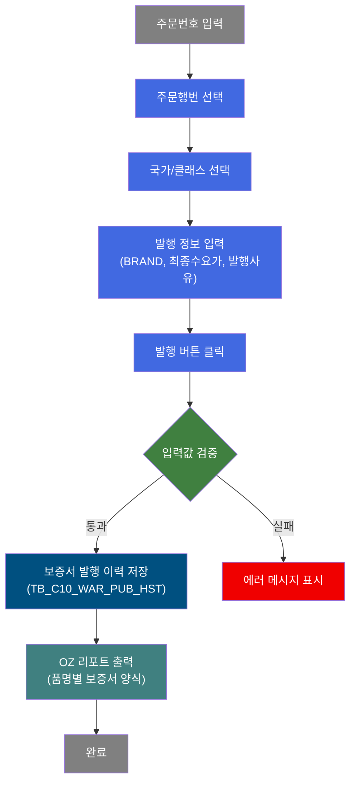
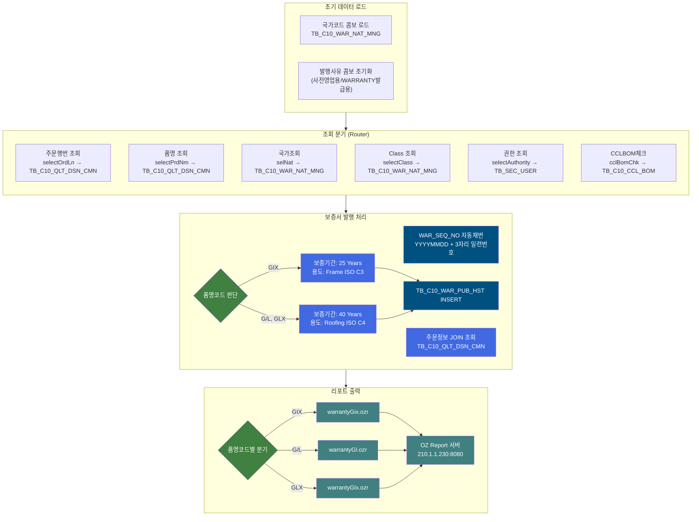
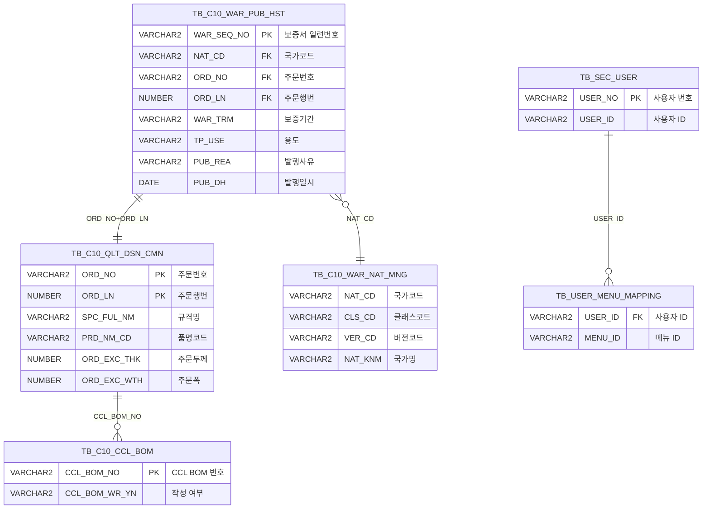

<h1 style="font-size: 40px; text-align: center; font-weight:
   bold; margin: 30px 0;">
  C105000030 레거시 시스템 분석 종합 보고서
</h1>


# 1. 시스템 개요
- **서비스 ID**: C105000030
- **업무명**: Brand 보증서 출력 관리
- **분석 일시**: 2026-03-17 09:35 KST
- **분석 시간**: ~5분
- **전체 Activity 수**: 8개 (Built-in 8개, Custom 0개)
- **분석자**: Claude Opus 4.6 / Sonnet (Phase별)
- **분석 도구**: /analyze-service C105000030
- **문서 버전**: 1.0

# 📊 비즈니스 프로세스 분석

## 시스템 목적

본 시스템은 동국제강 CCL(Color Coating Line) 공정에서 생산되는 Brand 제품(GIX, G/L, GLX)에 대한 **제품 보증서(Warranty Certificate)** 발행을 관리하는 화면이다. 품명코드에 따라 보증 기간(GIX: 25년, G/L/GLX: 40년)과 용도(Frame/Roofing)가 자동 결정되며, OZ Report 서버를 통해 보증서를 출력한다.

주문번호와 주문행번을 기반으로 주문 규격(SPC_FUL_NM), 품명(PRD_NM_CD), 도금부착량(GW_ASG_CD), 고객사(CUS_CD) 정보를 자동 조회하여 보증서 발행 이력(TB_C10_WAR_PUB_HST)에 저장한다. 국가별 보증서 발행 대상 관리(TB_C10_WAR_NAT_MNG)를 통해 국가 및 Class를 선택하고, CCL BOM 작성 여부(TB_C10_CCL_BOM)를 확인하는 기능도 포함한다.

보증서 발행 권한은 메뉴 ID '5903'에 대한 사용자 매핑(M90APUSER.TB_USER_MENU_MAPPING)으로 관리되며, 발행 사유는 '사전영업용'과 'WARRANTY발급용' 중 선택한다.

## 핵심 워크플로우 다이어그램



### 상세 워크플로우 다이어그램




## 주요 유즈케이스

### UC-01: 보증서 발행

- **Actor**: 품질관리 담당자
- **목적**: Brand 제품(GIX/G/L/GLX)에 대한 보증서를 발행하고 이력을 저장하며, 보증서 리포트를 출력

- **전제조건**:
  - 사용자가 시스템에 로그인되어 있음
  - 메뉴 ID '5903' 보증서 출력 권한이 있음
  - 해당 주문번호에 대한 품질설계공통(TB_C10_QLT_DSN_CMN) 데이터가 존재함

- **주요 흐름**:
  1. 사용자가 주문번호(ORD_NO) 입력 → 주문행번(ORD_LN) 콤보 자동 로드 (selectOrdLn 쿼리)
  2. 주문행번 선택 → 품명코드(PRD_NM_CD) AJAX 자동 조회 (selectPrdNm → c10AjaxData.do)
  3. 국가(NAT_CD) 선택 → 클래스(CLS_CD) 콤보 연동 로드 (selectClass 쿼리)
  4. BRAND, 최종수요가(CUS_CD), 발행사유(PUB_REA), 언어(한글/영문) 입력
  5. 발행 버튼 클릭 → handleDataProcess.do로 이력등록(saveWarPubHst) 서비스 호출
  6. 이력 저장 완료 후 → prtRpt() 자동 호출 → OZ Report 팝업 출력

- **대체 흐름**:
  - 주문번호 미입력: "주문번호를 입력해주세요." alert 표시 후 ORD_NO 포커스 이동
  - 품명코드가 GIX/G/L/GLX 외: prtRpt() 함수에서 return false, 리포트 출력 안됨
  - CCL BOM 미작성: cclBomChk 쿼리로 'X' 또는 'N' 반환 (화면에서 활용)

- **후행조건**:
  - TB_C10_WAR_PUB_HST에 발행 이력 INSERT 완료
  - OZ Report 서버에서 보증서 PDF 출력 팝업 표시

### UC-02: 국가별 Class 조회

- **Actor**: 품질관리 담당자
- **목적**: 보증서 발행 대상 국가와 해당 국가의 Class 목록을 확인

- **전제조건**:
  - TB_C10_WAR_NAT_MNG에 국가별 보증서 관리 데이터가 등록되어 있음

- **주요 흐름**:
  1. 화면 로드 시 국가코드(NAT_CD) 콤보 자동 로드 (selNat 쿼리 - 최신 VER_CD 기준)
  2. 사용자가 국가 선택
  3. onSelectionChange 이벤트 → 선택 국가의 Class 목록 자동 조회 (selectClass 쿼리)
  4. CLS_CD 콤보에 Class 목록 바인딩

- **대체 흐름**:
  - 국가에 등록된 Class가 없는 경우: 빈 콤보 표시

- **후행조건**:
  - 선택된 국가의 Class 목록이 콤보에 표시됨

### UC-03: 최종수요가 검색

- **Actor**: 품질관리 담당자
- **목적**: 마스터 팝업을 통해 최종수요가(CUS_CD)를 검색하여 선택

- **전제조건**:
  - 마스터 데이터에 CUS_CD 코드가 등록되어 있음

- **주요 흐름**:
  1. 최종수요가 필드 옆 검색 아이콘 클릭
  2. masterPopup() 호출 → masterGridData.do?CD_TP=CUS_CD&CATEGORY_GROUP_NM=SZ0000 팝업 열기
  3. 팝업에서 고객사 검색 및 선택
  4. masterSetValue() 콜백으로 C105000030_Form_1의 CUS_CD 필드에 값 세팅

- **대체 흐름**:
  - 팝업 닫기: 값 미설정, 기존 값 유지

- **후행조건**:
  - Form의 CUS_CD 히든 필드에 선택된 고객사 코드 세팅

---

## 비즈니스 로직 상세

### 1. 보증서 일련번호 자동 채번

- **목적**: 보증서 발행 이력의 고유 키(WAR_SEQ_NO)를 날짜 기반으로 자동 생성
- **처리 케이스**:

  **[케이스 1: 당일 첫 발행]**
  ```
    조건: 당일 날짜(YYYYMMDD)로 시작하는 WAR_SEQ_NO가 없음
    처리:
      1. SYSDATE를 YYYYMMDD 형식으로 변환
      2. MAX(SUBSTR(WAR_SEQ_NO,9,11)) 결과가 NULL → NVL로 1 적용
      3. LPAD로 3자리 채움 → YYYYMMDD001
  ```

  **[케이스 2: 당일 추가 발행]**
  ```
    조건: 당일 기존 발행 이력 존재 (예: YYYYMMDD003)
    처리:
      1. MAX 값 추출 (3) + 1 = 4
      2. LPAD로 3자리 → YYYYMMDD004
  ```

- **계산 공식**:
  ```
  WAR_SEQ_NO = TO_CHAR(SYSDATE, 'YYYYMMDD') || LPAD(NVL(MAX(기존일련번호) + 1, 1), 3, '0')

  예시:
  2026-03-17 첫 발행 → 20260317001
  2026-03-17 두 번째 → 20260317002
  ```

### 2. 품명코드별 보증기간/용도 자동 결정

- **목적**: 제품 유형에 따라 보증서의 보증기간과 용도를 자동 설정

- **처리 케이스**:

  **[케이스 1: GIX 제품]**
  ```
    조건: PRD_NM_CD = 'GIX'
    처리:
      1. WAR_TRM(보증기간) = '25 Years'
      2. TP_USE(용도) = 'Frame (ISO C3)'
  ```

  **[케이스 2: G/L, GLX 등 기타 제품]**
  ```
    조건: PRD_NM_CD ≠ 'GIX' (G/L, GLX 등)
    처리:
      1. WAR_TRM(보증기간) = '40 Years'
      2. TP_USE(용도) = 'Roofing (ISO C4)'
  ```

- **SQL 구현**:
  ```
  WAR_TRM = CASE :PRD_NM_CD WHEN 'GIX' THEN '25 Years' ELSE '40 Years' END
  TP_USE  = CASE :PRD_NM_CD WHEN 'GIX' THEN 'Frame (ISO C3)' ELSE 'Roofing (ISO C4)' END
  ```

### 3. 코드값→의미명 변환 (FUNC_DECODE01 함수)

- **목적**: 코드값을 사람이 읽을 수 있는 의미명으로 변환하여 보증서에 표시

- **처리 케이스**:

  **[케이스 1: 품명 코드 변환]**
  ```
    호출: C10APUSER.FUNC_DECODE01('PRD_NM_CD', 'SZ0000', A.PRD_NM_CD)
    처리: PRD_NM_CD 코드를 SZ0000 카테고리 그룹에서 품명 한글명으로 변환
  ```

  **[케이스 2: 도금부착량 코드 변환]**
  ```
    호출: C10APUSER.FUNC_DECODE01('GW_ASG_CD', 'SV0000', A.GW_ASG_CD)
    처리: GW_ASG_CD를 SV0000 카테고리에서 도금부착량 명칭으로 변환
  ```

  **[케이스 3: 고객사 코드 변환]**
  ```
    호출: C10APUSER.FUNC_DECODE01('CUS_CD', 'SZ0000', A.CUS_CD)
    처리: CUS_CD를 SZ0000 카테고리에서 고객사명으로 변환
  ```

### 4. CCL BOM 작성 여부 확인

- **목적**: 보증서 출력 전 CCL BOM이 정상 작성되었는지 검증
- **처리 케이스**:

  **[케이스 1: BOM 존재 및 작성 완료]**
  ```
    조건: TB_C10_CCL_BOM에 CCL_BOM_NO 존재, CCL_BOM_WR_YN = 'Y'
    결과: 'Y' 반환
  ```

  **[케이스 2: BOM 존재하나 미작성]**
  ```
    조건: TB_C10_CCL_BOM에 CCL_BOM_NO 존재, CCL_BOM_WR_YN = NULL
    결과: 'N' 반환 (NVL 처리)
  ```

  **[케이스 3: BOM 미존재]**
  ```
    조건: TB_C10_CCL_BOM에 CCL_BOM_NO 미존재
    결과: 'X' 반환 (서브쿼리 전체가 NULL → 외부 NVL 처리)
  ```

---

# 💾 데이터 요구사항

## 핵심 테이블

### 1. TB_C10_WAR_PUB_HST - (보증서 발행 이력)
| 컬럼명 | 타입 | PK | 설명 |
|--------|------|----|-----|
| WAR_SEQ_NO | VARCHAR2 | ✅ | 보증서 일련번호 (YYYYMMDD + 3자리) |
| PDN_CLS_CD | VARCHAR2 | | 생산분류코드 |
| PUB_DH | DATE | | 발행일시 |
| PUB_EMP_ID | VARCHAR2 | | 발행자 사번 |
| PUB_REA | VARCHAR2 | | 발행사유 (사전영업용/WARRANTY발급용) |
| NAT_CD | VARCHAR2 | | 국가코드 |
| ORD_NO | VARCHAR2 | | 주문번호 |
| ORD_LN | NUMBER | | 주문행번 |
| ORD_STD | VARCHAR2 | | 주문규격 (SPC_FUL_NM) |
| ORD_PRD | VARCHAR2 | | 주문품명 (FUNC_DECODE01 변환) |
| ORD_THK | NUMBER | | 주문두께 (ORD_EXC_THK) |
| ORD_WTH | NUMBER | | 주문폭 (ORD_EXC_WTH) |
| ORD_COT_WGT | VARCHAR2 | | 도금부착량 (FUNC_DECODE01 변환) |
| ORD_CLT | VARCHAR2 | | 고객사명 (FUNC_DECODE01 변환) |
| WAR_TRM | VARCHAR2 | | 보증기간 (25 Years / 40 Years) |
| TP_USE | VARCHAR2 | | 용도 (Frame ISO C3 / Roofing ISO C4) |
| WAR_CTT1~6 | VARCHAR2 | | 보증 내용 1~6 |
| CREATED_OBJECT_TYPE | VARCHAR2 | | 생성 객체 유형 |
| CREATED_OBJECT_ID | VARCHAR2 | | 생성 객체 ID |
| CREATED_PROGRAM_ID | VARCHAR2 | | 프로그램 ID |
| CREATION_TIMESTAMP | TIMESTAMP | | 생성 타임스탬프 |
| LAST_UPDATED_OBJECT_TYPE | VARCHAR2 | | 최종수정 객체 유형 |
| LAST_UPDATED_OBJECT_ID | VARCHAR2 | | 최종수정 객체 ID |
| LAST_UPDATE_PROGRAM_ID | VARCHAR2 | | 최종수정 프로그램 ID |
| LAST_UPDATE_TIMESTAMP | TIMESTAMP | | 최종수정 타임스탬프 |

### 2. TB_C10_WAR_NAT_MNG - (보증서 국가 관리)
| 컬럼명 | 타입 | PK | 설명 |
|--------|------|----|-----|
| NAT_CD | VARCHAR2 | | 국가코드 |
| NAT_KNM | VARCHAR2 | | 국가 한글명 |
| CLS_CD | VARCHAR2 | | 클래스 코드 |
| CLS_KNM | VARCHAR2 | | 클래스 한글명 |
| VER_CD | VARCHAR2 | | 버전코드 (최신 버전 필터링 기준) |

### 3. TB_C10_QLT_DSN_CMN - (품질설계 공통)
| 컬럼명 | 타입 | PK | 설명 |
|--------|------|----|-----|
| ORD_NO | VARCHAR2 | ✅ | 주문번호 |
| ORD_LN | NUMBER | ✅ | 주문행번 |
| SPC_FUL_NM | VARCHAR2 | | 규격 전체명 |
| PRD_NM_CD | VARCHAR2 | | 품명코드 |
| ORD_EXC_THK | NUMBER | | 주문 정확 두께 |
| ORD_EXC_WTH | NUMBER | | 주문 정확 폭 |
| GW_ASG_CD | VARCHAR2 | | 도금부착량 코드 |
| CUS_CD | VARCHAR2 | | 고객사 코드 |

### 4. TB_C10_CCL_BOM - (CCL BOM)
| 컬럼명 | 타입 | PK | 설명 |
|--------|------|----|-----|
| CCL_BOM_NO | VARCHAR2 | ✅ | CCL BOM 번호 |
| CCL_BOM_WR_YN | VARCHAR2 | | BOM 작성 여부 (Y/N) |

### 5. TB_SEC_USER / TB_USER_MENU_MAPPING - (사용자 권한)
| 컬럼명 | 타입 | PK | 설명 |
|--------|------|----|-----|
| USER_NO | VARCHAR2 | ✅ | 사용자 번호 (TB_SEC_USER) |
| USER_ID | VARCHAR2 | | 사용자 ID (TB_SEC_USER) |
| MENU_ID | VARCHAR2 | | 메뉴 ID (TB_USER_MENU_MAPPING, '5903' = 보증서 출력) |

## 데이터 플로우

### 1. 조회

```
[화면 초기 로딩 - 국가코드 콤보]
화면 진입 → onFormLoadFunction → comboList()
→ C105000030_selNat.select
  FROM TB_C10_WAR_NAT_MNG
  WHERE VER_CD = (SELECT MAX(VER_CD) FROM TB_C10_WAR_NAT_MNG)
  DISTINCT NAT_CD, NAT_KNM
  ORDER BY NAT_KNM
→ NAT_CD 콤보에 국가 목록 표시

[주문번호 입력 시 - 주문행번 조회]
ORD_NO 입력 → onChange → OrdlnComboData.do
→ C105000030.selectOrdLn
  FROM TB_C10_QLT_DSN_CMN
  WHERE ORD_NO = :ORD_NO
→ ORD_LN 콤보에 행번 목록 표시

[주문번호 입력 시 - 품명코드 AJAX 조회]
ORD_NO 입력 → onChange → c10AjaxData.do
→ C105000030_selectPrdNm
  FROM TB_C10_QLT_DSN_CMN A
  WHERE A.ORD_NO = :ORD_NO AND ROWNUM = 1
→ prdNmCd 글로벌 변수에 품명코드 저장

[국가 선택 시 - 클래스 조회]
NAT_CD 선택 → onSelectionChange → OrdlnComboData.do
→ C105000030.selectClass
  FROM TB_C10_WAR_NAT_MNG
  WHERE NAT_CD = :NAT_CD
    AND VER_CD = (SELECT MAX(VER_CD) FROM TB_C10_WAR_NAT_MNG WHERE NAT_CD = :NAT_CD)
  ORDER BY CLS_CD
→ CLS_CD 콤보에 클래스 목록 표시

[권한 조회]
→ C105000030.selectAuthority
  FROM M90APUSER.TB_SEC_USER A
  WHERE A.USER_NO = :USER_NO
    AND EXISTS (SELECT 1 FROM M90APUSER.TB_USER_MENU_MAPPING WHERE MENU_ID = '5903' AND USER_ID = A.USER_ID)
→ COUNT(*) 결과로 권한 여부 판단

[CCL BOM 체크]
→ C105000030_cclBomChk.select
  SELECT NVL((SELECT NVL(CCL_BOM_WR_YN,'N') FROM TB_C10_CCL_BOM WHERE CCL_BOM_NO = :CCL_BOM_NO),'X') FROM DUAL
→ Y/N/X 결과로 BOM 상태 판단
```

### 2. 저장 (보증서 발행 이력 등록)

```
[보증서 발행 이력 INSERT]
발행 버튼 클릭 → handleDataProcess.do → 이력등록 Activity
→ C105000030.saveWarPubHst
  INSERT INTO C10APUSER.TB_C10_WAR_PUB_HST
  SELECT (자동채번 서브쿼리) AS WAR_SEQ_NO,
         :PDN_CLS_CD, TO_DATE(SYSDATE), :PUB_EMP_ID, :PUB_REA, :NAT_CD,
         :ORD_NO, :ORD_LN,
         A.SPC_FUL_NM AS ORD_STD,
         FUNC_DECODE01('PRD_NM_CD','SZ0000',A.PRD_NM_CD) AS ORD_PRD,
         A.ORD_EXC_THK, A.ORD_EXC_WTH,
         FUNC_DECODE01('GW_ASG_CD','SV0000',A.GW_ASG_CD) AS ORD_COT_WGT,
         FUNC_DECODE01('CUS_CD','SZ0000',A.CUS_CD) AS ORD_CLT,
         CASE :PRD_NM_CD WHEN 'GIX' THEN '25 Years' ELSE '40 Years' END AS WAR_TRM,
         CASE :PRD_NM_CD WHEN 'GIX' THEN 'Frame (ISO C3)' ELSE 'Roofing (ISO C4)' END AS TP_USE,
         :WAR_CTT1~6, 감사 컬럼들
  FROM TB_C10_QLT_DSN_CMN A
  WHERE A.ORD_NO = :ORD_NO AND A.ORD_LN = :ORD_LN
→ 이력 저장 완료 → prtRpt() 콜백 → OZ Report 출력
```

## SQL 일람표

| SQL 이름 | 쿼리 ID | 타입 | 출처 | 테이블 |
|---------|---------|-----|-------|-------|
| 국가조회 | C105000030_selNat.select | SELECT | Service | TB_C10_WAR_NAT_MNG |
| 보증서 권한 조회 | C105000030.selectAuthority | SELECT | Service | TB_SEC_USER, TB_USER_MENU_MAPPING |
| Class 조회 | C105000030.selectClass | SELECT | Service | TB_C10_WAR_NAT_MNG |
| 품명 조회 | C105000030_selectPrdNm | SELECT | Service | TB_C10_QLT_DSN_CMN |
| CCLBOM 체크 | C105000030_cclBomChk.select | SELECT | Service | TB_C10_CCL_BOM, DUAL |
| 주문행번 조회 | C105000030.selectOrdLn | SELECT | Service | TB_C10_QLT_DSN_CMN |
| 이력등록 | C105000030.saveWarPubHst | INSERT | Service | TB_C10_WAR_PUB_HST, TB_C10_QLT_DSN_CMN |

## PL/SQL 함수/프로시저

| # | 호출명 | 유형 | 용도 | 상세 분석 |
|---|--------|------|------|----------|
| 1 | FUNC_DECODE01 | 함수 | 코드값→의미명 변환 (PRD_NM_CD, GW_ASG_CD, CUS_CD) | [분석 보고서](../../../dbms/C10APUSER/function/FUNC_DECODE01_analysis_report.md) |

## ER 다이어그램 (핵심 관계)



관계 설명:
- TB_C10_WAR_PUB_HST가 중심 테이블로 보증서 발행 이력을 저장
- TB_C10_QLT_DSN_CMN: ORD_NO + ORD_LN 기반 1:1 관계 (INSERT 시 JOIN으로 주문정보 조회)
- TB_C10_WAR_NAT_MNG: NAT_CD 기반 다:1 관계 (국가/클래스 마스터)
- TB_SEC_USER → TB_USER_MENU_MAPPING: USER_ID 기반 1:N 관계 (권한 확인)

---

# 🖥️ 사용자 인터페이스 요구사항

## 화면 레이아웃 상세

### Layout 구조 (absolute positioning)
```javascript
{
  itemType: "layout",
  dirType: "row",  // 수직 배치 (absolute positioning)
  totalWidth: "964px",
  totalHeight: "932px",
  components: [
    {
      id: "C105000030_Form_1",
      type: "form",
      top: "0px",
      height: "100px",
      xmlFile: "C105000030_Form_1.xml",
      service: "C105000030-service",
      actionType: "save",
      referenceItem: "C105000030_Form_2"
    },
    {
      id: "C105000030_Form_2",
      type: "form",
      top: "100px",
      height: "813px",
      xmlFile: "C105000030_Form_2.xml",
      note: "빈 Form - 동적 데이터 로드"
    },
    {
      id: "C105000030_messagebox",
      type: "messagebox",
      top: "909px",
      height: "19px"
    }
  ]
}
```

## 입출력 요소

### Form 컴포넌트

**C105000030_Form_1 (검색/입력 폼)**
- ORD_NO: input - 주문번호 (75px, maxLength:10, 배경색:#FFFFC0, onChange → 행번 콤보 연동)
- ORD_NO_BT: label - "-" 구분자
- ORD_LN: combo - 주문행번 (50px, maxLength:3, 배경색:#FFFFC0, 동적 로드)
- BRAND: input - BRAND (79px, 우측라벨정렬, 라벨너비:65px)
- NAT_CD: combo - 국가 (140px, 라벨너비:52px, OrdlnComboData.do로 동적 로드)
- CLS_CD: combo - 클래스 (80px, 우측라벨정렬, 라벨너비:64px, 국가 선택 연동)
- CUS_CD: hidden - 최종수요가 (80px, 우측라벨정렬, 라벨너비:84px, maxLength:6)
- template: template - 최종수요가 검색 아이콘 (masterPopup 호출)
- CCL_BOM_NO: hidden - CCLBOM (75px, 우측라벨정렬, 라벨너비:64px)
- GAA: hidden - 도금부착량 (75px, 우측라벨정렬, 라벨너비:84px)
- PUB_REA: combo - 발행사유 (140px, 정적옵션: 사전영업용/WARRANTY발급용)
- radio1: radio - 한글 (KOR) / 영문 (ENG, 기본선택)
- save: button - "출력" (발행 command)
- winClose: button - "닫기"

**C105000030_Form_2 (조회 결과 표시)**
- 빈 Form XML, 동적으로 데이터 로드 (Form_1의 referenceItem)

## 화면 동작 흐름

### 1. 화면 초기 로딩
```
1. 화면 진입
2. ui.initializeDHTMLX() 호출 → 전체 DHTMLX 컴포넌트 초기화
3. Form_1 로드 완료 → onFormLoadFunction() → comboList()
   - NAT_CD 콤보: OrdlnComboData.do → C105000030-service selNat=0 호출
   - NAT_CD onSelectionChange 이벤트 등록 (클래스 연동)
   - PUB_REA 콤보: 정적 comboValue 배열로 옵션 추가
   - 각 콤보 readonly(true) 설정
4. Form_2 로드 완료 → onFormLoadFunction2() (현재 빈 함수)
5. Form_1 이벤트 등록:
   - onAfterUpdateFinishEvent → prtRpt (저장 후 리포트 출력)
   - onChangeEvent → OnRadioChanged
   - onChange → onChange (ORD_NO 변경 감지)
6. Form_2 onChange → OnDataChanged (현재 빈 함수)
```

### 2. 주문번호 입력 및 조회
```
1. 사용자가 ORD_NO 입력 후 포커스 이동
2. onChange('ORD_NO', value) 이벤트 발생
3. ORD_LN 콤보 초기화:
   - setComboText('') → clearAll() → readonly(false,false)
   - OrdlnComboData.do 호출 (ServiceName=C105000030-service&OrdLnFind=1&ORD_NO=xxx)
   - 로드 완료 → 첫 번째 옵션 자동 선택
4. prdNmCd AJAX 조회:
   - c10AjaxData.do 호출 (ServiceName=C105000030-service&PrdNmFind=1&ORD_NO=xxx)
   - 응답 XML에서 cell 태그 파싱 → prdNmCd 글로벌 변수 업데이트
5. find 버튼 또는 직접 호출 시:
   - ORD_NO 유효성 체크 (미입력 시 alert)
   - uiCommon.parameters6() → findUrl 구성
   - Form_2.loadData(findUrl, findMessage) 호출
```

### 3. 보증서 발행 (저장 + 리포트 출력)
```
1. 사용자가 발행 버튼 클릭 → save() 호출
2. ORD_NO 유효성 체크
3. customParam 구성: {ORD_NO, ORD_LN}
4. form.sendForm('handleDataProcess.do', 'C105000030_Form_1', 'save', customParam)
5. 서버에서 Router → '이력등록' Activity (GridSave) 실행
6. saveWarPubHst INSERT 실행 (자동채번 + 주문정보 JOIN)
7. 저장 완료 → onAfterUpdateFinishEvent → prtRpt() 자동 호출
8. prtRpt():
   - prdNmCd 값으로 리포트 파일 분기 (GIX/G/L/GLX)
   - OZ Report 서버 URL 구성
   - window.open()으로 리포트 출력 팝업 열기 (310x300)
```

## JavaScript 모듈

**C105000030.jsp (인라인 스크립트)**
- find(eventName, formDivObj, referenceItem): 조회 기능 (uiCommon.parameters6으로 URL 구성 → Form_2.loadData)
- save(eventName, formDivObj, referenceItem): 발행 저장 (form.sendForm → handleDataProcess.do)
- prtRpt(): 보증서 리포트 출력 (품명코드별 OZ Report 팝업 window.open)
- refresh(referenceItem): 새로고침 (uiCommon.parameters6 → Form_2.loadData)
- copy(referenceItem): 클립보드 복사 (copyRowContent)
- undo(referenceItem) / redo(referenceItem): 되돌리기/다시실행
- findMessage(referenceItem): 조회 완료 콜백 (uiCommon.progressOff → hiddenFormItem)
- onFormLoadFunction(formDivObj): Form_1 로드 시 콤보 초기화 (comboList 호출)
- onFormLoadFunction2(formDivObj): Form_2 로드 시 초기화 (현재 빈 함수)
- comboList(formId): 콤보 생성 (ui.combo → OrdlnComboData.do, 정적 comboValue)
- onChange(id, value): 필드 변경 이벤트 (ORD_NO → 행번 콤보 + 품명 AJAX 조회)
- serchIcon_CUS_CD(name, val): 최종수요가 검색 아이콘 HTML 생성
- masterPopup(CD_TP, CATEGORY_GROUP_NM, target, formId): 마스터 팝업 열기 (ui.window)
- masterSetValue(code, name, target, formId): 팝업에서 선택한 값 Form에 세팅

**c10.ui.js** (공통 UI 스크립트 - 참조)

## 주요 이벤트 핸들러

**onChange (주문번호 변경)**
- 이벤트 타입: Form onChange (id='ORD_NO')
- 처리 내용:
  1. ORD_NO 값 읽기
  2. ORD_LN 콤보 초기화 및 OrdlnComboData.do로 재로드
  3. prdNmCd 초기화 후 c10AjaxData.do AJAX 호출
  4. XML 응답 파싱 → prdNmCd 글로벌 변수 업데이트

**onSelectionChange (국가 변경)**
- 이벤트 타입: Combo onSelectionChange (NAT_CD)
- 처리 내용:
  1. 선택된 NAT_CD 값 getSelectedValue()
  2. CLS_CD 콤보 OrdlnComboData.do로 재로드 (선택 국가 기준)
  3. 첫 번째 옵션 자동 선택

**onAfterUpdateFinishEvent (저장 완료)**
- 이벤트 타입: Form 저장 완료 콜백
- 처리 내용:
  1. prtRpt() 자동 호출
  2. 품명코드별 리포트 파일 결정
  3. OZ Report 팝업 열기

---

# 📌 특이사항 및 주의사항

## 1. OZ Report 서버 하드코딩
- **IP 주소 직접 지정**: 리포트 서버 URL이 `http://210.1.1.230:8080/oz80`으로 하드코딩되어 있음. 환경 변경 시 JSP 소스 수정 필요.
- **리포트 파일 경로**: `CRMES/C10/ozr/warrantyGix.ozr`, `warrantyGl.ozr`, `warrantyGlx.ozr` 3개 리포트 파일이 고정 경로로 참조됨.

## 2. 품명코드 미처리 케이스
- **prtRpt() 함수**: GIX, G/L, GLX 외의 품명코드인 경우 `return false`로 리포트 출력이 되지 않으나, 사용자에게 별도 에러 메시지를 표시하지 않음. save는 정상 실행되어 이력은 저장되나 리포트만 미출력되는 상황 발생 가능.

## 3. WAR_SEQ_NO 채번 동시성 이슈
- **자동채번 서브쿼리**: `SELECT MAX(SUBSTR(WAR_SEQ_NO,9,11))+1` 방식은 동시 트랜잭션 시 중복 채번 가능성이 있음. Oracle SEQUENCE 대신 MAX+1 패턴 사용.

## 4. 주문번호 유효성 체크 중복
- **코드 중복**: find()와 save() 함수 모두 `isNull(pOrdNo) || isNull(pOrdNo)` 조건을 사용하는데, ORD_LN이 아닌 ORD_NO를 두 번 체크하는 오류 패턴이 있음 (실질적으로 ORD_LN 미입력 검증이 누락).

## 5. Cross-Schema 참조
- **C10APUSER 스키마**: saveWarPubHst 쿼리에서 C10APUSER.TB_C10_WAR_PUB_HST에 INSERT하면서 C10APUSER.FUNC_DECODE01 함수를 호출. mesdao(MESAPUSER)를 통해 C10APUSER 스키마 객체에 접근하므로 스키마 간 권한 설정이 필요.
- **M90APUSER 스키마**: selectAuthority 쿼리에서 M90APUSER.TB_SEC_USER, M90APUSER.TB_USER_MENU_MAPPING 참조.

## 6. 빈 콜백 함수
- **chkCclBomWrYn()**, **mapValues()**, **checkCode()**, **hiddenFormItem()**, **OnDataChanged()**, **OnRadioChanged()**: 모두 빈 함수로 정의되어 있음. 개발 미완료이거나 향후 확장을 위한 스텁 코드로 보임. 특히 hiddenFormItem()은 findMessage 콜백에서 호출되나 실제 동작 없음.

## 7. 발행사유 하드코딩
- **comboValue**: 발행사유 옵션이 JavaScript 배열로 하드코딩(`['사전영업용','사전영업용'], ['WARRANTY발급용','WARRANTY발급용']`). DB 마스터 테이블이 아닌 클라이언트 코드에서 관리.

---

# 📚 참고 문서

- **Service XML**: `src/service/C105000030-service.xml`
- **Query SQL**: `src/query/C105000030-query.glue_sql`
- **JSP**: `WebContents/C105000030.jsp`
- **JS (공통)**: `WebContents/js/c10.ui.js`
- **Form XML**:
  - `WebContents/header/kr/C105000030/C105000030_Form_1.xml`
  - `WebContents/header/kr/C105000030/C105000030_Form_2.xml`
