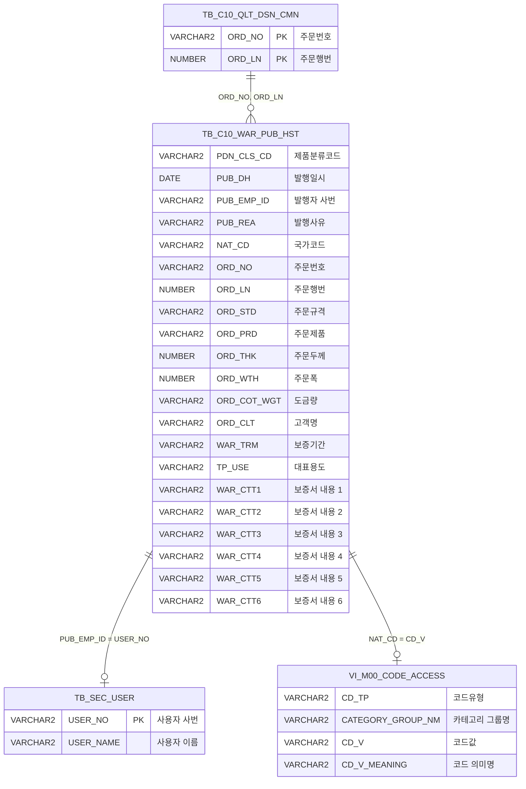

<h1 style="font-size: 40px; text-align: center; font-weight:
   bold; margin: 30px 0;">
  C105000040 레거시 시스템 분석 종합 보고서
</h1>


# 1. 시스템 개요
- **서비스 ID**: C105000040
- **업무명**: Brand 보증서 이력 관리
- **분석 일시**: 2026-03-17 09:46 KST
- **전체 Activity 수**: 3 (Built-in 3개)
- **분석자**: Claude Opus 4.6 / Claude Sonnet 4.6
- **분석 도구**: /analyze-service C105000040
- **문서 버전**: 1.0

# 📊 비즈니스 프로세스 분석

## 시스템 목적

Brand 보증서 발행 이력을 관리하는 조회 전용 화면이다. 동국제강 제품(GIX, G/L, GLX 등급)에 대해 발행된 Brand 보증서의 이력을 출력기간, 주문번호, 주문행번, 보증서 양식(제품분류코드) 기준으로 검색하여 조회한다.

보증서에는 제품 규격(STANDARD), 제품명(PRODUCT), 두께(THICKNESS), 폭(WIDTH), 도금량(COATING WEIGHT), 고객명(CLIENT), 보증기간(WARRANTY PERIOD), 대표용도(TYPICAL USES) 등 수출용 품질보증 정보가 포함되며, 추가 내용(WAR_CTT1~6) 필드를 통해 보증서 본문 내용도 관리한다.

주문번호 입력 시 해당 주문의 행번 목록을 동적으로 조회하여 콤보박스에 로딩하는 연동 기능을 제공하며, 발행일자, 발행자, 발행사유, 국가 정보 등을 함께 표시하여 보증서 발행 추적이 가능하다.

## 주요 유즈케이스

### UC-01: 보증서 발행 이력 조회
- **Actor**: 품질 관리 담당자
- **목적**: 특정 기간 및 주문 조건에 해당하는 Brand 보증서 발행 이력을 검색하여 발행 현황을 파악

- **전제조건**:
  - 사용자가 시스템에 로그인되어 있음
  - 보증서 발행 이력 데이터가 TB_C10_WAR_PUB_HST 테이블에 존재
  - 조회 권한 보유

- **주요 흐름**:
  1. 화면 진입 시 출력기간이 자동 설정됨 (시작: 월 첫째 날, 종료: 오늘)
  2. 필요 시 주문번호, 주문행번, 보증서 양식(GIX/G/L/GLX) 조건 추가 입력
  3. 조회 버튼 클릭
  4. 출력기간 유효성 검사 수행 (시작일/종료일 모두 입력 필수)
  5. C105000040_selectWarPubHst 쿼리 실행 — LIKE 패턴 검색 + 발행일 범위 필터링
  6. Grid에 보증서 이력 목록 표시 (발행일 내림차순 정렬)

- **대체 흐름**:
  - 출력기간 시작일만 입력: "출력기간 종료일을 입력해주세요." 알림 → 종료일 필드 포커스
  - 출력기간 종료일만 입력: "출력기간 시작일을 입력해주세요." 알림 → 시작일 필드 포커스
  - 출력기간 미입력: "출력기간을 입력해야 합니다." 알림 → 시작일 필드 포커스
  - 조회 결과 없음: Grid에 빈 목록 표시

- **후행조건**:
  - Grid에 조건에 해당하는 보증서 이력이 표시됨
  - 컨텍스트 메뉴(refresh/copy/undo/redo)를 통해 추가 작업 가능

### UC-02: 주문행번 동적 조회
- **Actor**: 품질 관리 담당자
- **목적**: 주문번호 입력 시 해당 주문의 행번 목록을 자동으로 로딩하여 행번 기반 필터링을 지원

- **전제조건**:
  - 주문번호가 입력됨
  - 해당 주문에 대한 품질설계 공통 데이터(TB_C10_QLT_DSN_CMN)가 존재

- **주요 흐름**:
  1. 사용자가 주문번호(ORD_NO) 필드에 값 입력
  2. onChange 이벤트 발생 → ORD_LN 콤보 초기화
  3. OrdlnComboData.do URL로 C105000040.selectOrdLn 쿼리 실행
  4. 조회된 행번 목록이 ORD_LN 콤보박스에 동적 로딩
  5. 첫 번째 옵션 자동 선택

- **대체 흐름**:
  - 해당 주문에 행번이 없는 경우: 빈 콤보박스 표시

- **후행조건**:
  - ORD_LN 콤보박스에 해당 주문의 행번 목록이 로딩됨
  - 사용자가 행번을 선택하여 조회 조건에 반영 가능

### UC-03: 그리드 컨텍스트 메뉴 작업
- **Actor**: 품질 관리 담당자
- **목적**: 조회된 보증서 이력 데이터에 대해 새로고침, 복사, 실행취소/다시실행 작업 수행

- **전제조건**:
  - Grid에 조회된 데이터가 존재

- **주요 흐름**:
  1. Grid 영역에서 우클릭하여 컨텍스트 메뉴 표시
  2. 메뉴 항목 선택:
     - refresh: 현재 조건으로 데이터 재조회
     - copy: 선택된 행 클립보드 복사
     - undo: 마지막 작업 실행 취소
     - redo: 취소된 작업 다시 실행

- **대체 흐름**: 없음

- **후행조건**:
  - 선택된 메뉴 동작이 수행됨

---
## 비즈니스 로직 상세

### 1. 발행자 ID → 사용자명 변환

- **목적**: 보증서 발행자의 사번(USER_NO)을 사람이 읽을 수 있는 이름(USER_NAME)으로 변환하여 표시
- **처리 케이스**:

  **[케이스 1: 스칼라 서브쿼리 사용자명 변환]**
  ```
    조건: PUB_EMP_ID(발행자 사번)가 존재
    처리:
      1. M90APUSER.TB_SEC_USER 테이블에서 USER_NO = PUB_EMP_ID 조건으로 조회
      2. ROWNUM = 1 제한으로 중복 방지
      3. USER_NAME을 PUB_EMP_ID 컬럼 값으로 치환 표시
  ```

### 2. 국가코드 → 국가명 변환

- **목적**: 국가코드(NAT_CD)를 공통코드 뷰에서 조회하여 국가명으로 변환
- **처리 케이스**:

  **[케이스 1: 공통코드 뷰 코드 변환]**
  ```
    조건: NAT_CD(국가코드)가 존재
    처리:
      1. M00APUSER.VI_M00_CODE_ACCESS 뷰에서 조회
      2. 조건: CD_TP = 'NAT_CD', CATEGORY_GROUP_NM = 'SZ0000', CD_V = NAT_CD
      3. CD_V_MEANING(코드 의미명)을 NAT_CD 컬럼 값으로 치환 표시
  ```

### 3. 발행일 범위 필터링

- **목적**: 사용자 입력 출력기간을 Oracle 날짜 비교 형태로 변환하여 범위 검색 수행
- **처리 케이스**:

  **[케이스 1: BETWEEN 날짜 범위 필터]**
  ```
    조건: PUB_DH_FR(시작일)과 PUB_DH_TO(종료일) 모두 입력
    처리:
      1. TO_DATE(:PUB_DH_FR, 'YYYY-MM-DD') ~ TO_DATE(:PUB_DH_TO, 'YYYY-MM-DD') 범위 적용
      2. PUB_DH 컬럼에 BETWEEN 조건으로 필터링
  ```

### 4. LIKE 패턴 기반 다조건 검색

- **목적**: 주문번호, 주문행번, 제품분류코드를 LIKE 패턴으로 유연하게 검색
- **처리 케이스**:

  **[케이스 1: 전방 일치 검색]**
  ```
    조건: 각 검색 필드에 값이 입력됨
    처리:
      1. ORD_NO LIKE :ORD_NO || '%' — 주문번호 전방 일치
      2. ORD_LN LIKE :ORD_LN || '%' — 주문행번 전방 일치
      3. PDN_CLS_CD LIKE :PUB_GBN || '%' — 제품분류코드 전방 일치
      4. 빈 값 입력 시 '%' 패턴으로 전체 조회 효과
  ```

---

# 💾 데이터 요구사항

## 핵심 테이블

### 1. TB_C10_WAR_PUB_HST - (보증서 발행 이력)
| 컬럼명 | 타입 | PK | 설명 |
|--------|------|----|------|
| PDN_CLS_CD | VARCHAR2 | | 제품분류코드 (GIX/G/L/GLX) |
| PUB_DH | DATE | | 보증서 발행일시 |
| PUB_EMP_ID | VARCHAR2 | | 발행자 사번 |
| PUB_REA | VARCHAR2 | | 발행사유 |
| NAT_CD | VARCHAR2 | | 국가코드 |
| ORD_NO | VARCHAR2 | | 주문번호 |
| ORD_LN | NUMBER | | 주문행번 |
| ORD_STD | VARCHAR2 | | 주문규격 (STANDARD) |
| ORD_PRD | VARCHAR2 | | 주문제품 (PRODUCT) |
| ORD_THK | NUMBER | | 주문두께 (THICKNESS) |
| ORD_WTH | NUMBER | | 주문폭 (WIDTH) |
| ORD_COT_WGT | VARCHAR2 | | 도금량 (COATING WEIGHT) |
| ORD_CLT | VARCHAR2 | | 고객명 (CLIENT) |
| WAR_TRM | VARCHAR2 | | 보증기간 (WARRANTY PERIOD) |
| TP_USE | VARCHAR2 | | 대표용도 (TYPICAL USES) |
| WAR_CTT1 | VARCHAR2 | | 보증서 내용 1 |
| WAR_CTT2 | VARCHAR2 | | 보증서 내용 2 |
| WAR_CTT3 | VARCHAR2 | | 보증서 내용 3 |
| WAR_CTT4 | VARCHAR2 | | 보증서 내용 4 |
| WAR_CTT5 | VARCHAR2 | | 보증서 내용 5 |
| WAR_CTT6 | VARCHAR2 | | 보증서 내용 6 |

### 2. TB_C10_QLT_DSN_CMN - (품질설계 공통)
| 컬럼명 | 타입 | PK | 설명 |
|--------|------|----|------|
| ORD_NO | VARCHAR2 | ✅ | 주문번호 |
| ORD_LN | NUMBER | ✅ | 주문행번 |

### 3. TB_SEC_USER - (사용자 정보, M90APUSER 스키마)
| 컬럼명 | 타입 | PK | 설명 |
|--------|------|----|------|
| USER_NO | VARCHAR2 | ✅ | 사용자 사번 |
| USER_NAME | VARCHAR2 | | 사용자 이름 |

### 4. VI_M00_CODE_ACCESS - (공통코드 뷰, M00APUSER 스키마)
| 컬럼명 | 타입 | PK | 설명 |
|--------|------|----|------|
| CD_TP | VARCHAR2 | | 코드유형 |
| CATEGORY_GROUP_NM | VARCHAR2 | | 카테고리 그룹명 |
| CD_V | VARCHAR2 | | 코드값 |
| CD_V_MEANING | VARCHAR2 | | 코드 의미명 |

## 데이터 플로우

### 1. 주문행번 조회 (콤보 로딩)
```
주문번호 입력 (onChange 이벤트)
→ C105000040.selectOrdLn
  FROM C10APUSER.TB_C10_QLT_DSN_CMN
  WHERE ORD_NO = :ORD_NO
→ ORD_LN 콤보박스에 행번 목록 로딩
```

### 2. 보증서 이력 조회
```
조회 버튼 클릭 (출력기간 유효성 검사 통과 후)
→ C105000040_selectWarPubHst
  FROM C10APUSER.TB_C10_WAR_PUB_HST A
  스칼라 서브쿼리 JOIN M90APUSER.TB_SEC_USER (발행자명 변환)
  스칼라 서브쿼리 JOIN M00APUSER.VI_M00_CODE_ACCESS (국가명 변환)
  WHERE ORD_NO LIKE :ORD_NO || '%'
    AND ORD_LN LIKE :ORD_LN || '%'
    AND PUB_DH BETWEEN TO_DATE(:PUB_DH_FR) AND TO_DATE(:PUB_DH_TO)
    AND PDN_CLS_CD LIKE :PUB_GBN || '%'
  ORDER BY PUB_DH DESC, ORD_NO, ORD_LN
→ Grid_1에 보증서 이력 목록 표시
```

## SQL 일람표
| SQL 이름 | 쿼리 ID | 타입 | 출처 | 테이블 |
|---------|---------|------|------|--------|
| 주문행번 조회 | C105000040.selectOrdLn | SELECT | Service | TB_C10_QLT_DSN_CMN |
| 보증서 발행 이력 조회 | C105000040_selectWarPubHst | SELECT | Service | TB_C10_WAR_PUB_HST, TB_SEC_USER, VI_M00_CODE_ACCESS |

## ER 다이어그램 (핵심 관계)



관계 설명:
- TB_C10_WAR_PUB_HST가 중심 테이블로 보증서 발행 이력을 관리
- TB_SEC_USER: PUB_EMP_ID → USER_NO 관계로 발행자명 조회 (스칼라 서브쿼리)
- VI_M00_CODE_ACCESS: NAT_CD → CD_V 관계로 국가명 조회 (스칼라 서브쿼리, CD_TP='NAT_CD', CATEGORY_GROUP_NM='SZ0000')
- TB_C10_QLT_DSN_CMN: ORD_NO 기반으로 주문행번 목록 제공

---

# 🖥️ 사용자 인터페이스 요구사항

## 화면 레이아웃 상세

### Layout 구조 (absolute 배치)
```javascript
{
  layoutType: "absolute",
  totalWidth: "981px",
  totalHeight: "586px",
  components: [
    {
      id: "C105000040_Form_1",
      type: "form",
      position: { left: 0, top: 0, width: 981, height: 45 }
    },
    {
      id: "C105000040_Grid_1",
      type: "grid",
      position: { left: 1, top: 45, width: 977, height: 520 }
    },
    {
      id: "C105000040_messagebox",
      type: "messagebox",
      position: { left: 1, top: 567, width: 977, height: 19 }
    }
  ]
}
```

## 입출력 요소

### Form 컴포넌트
**C105000040_Form_1**
- PUB_DH_FR: calendar - 출력기간 시작일 (입력폭 80px, 필수, YYYY-MM-DD 형식, 초기값: 월 첫째 날)
- PUB_DH_TO: calendar - 출력기간 종료일 (입력폭 80px, 필수, YYYY-MM-DD 형식, 초기값: 오늘)
- ORD_NO: input - 주문번호 (입력폭 75px, 최대 10자, onChange → ORD_LN 콤보 동적 로딩)
- ORD_NO_BT: label - 구분자 "-"
- ORD_LN: combo - 주문행번 (입력폭 50px, 동적 로딩: OrdlnComboData.do, ORD_NO 변경 시 트리거)
- PUB_GBN: combo - 보증서 양식 (입력폭 140px, 읽기전용, 옵션: 전체/""/GIX/G/L/GLX)
- find: button - 조회 → find() 함수 호출
- winClose: button - 닫기 → 창 닫기

### Grid 컴포넌트

**C105000040_Grid_1 (보증서 이력 목록)**
- 편집 가능 여부: 아니오 (전체 읽기 전용)
- Split: 없음 (split=0)
- 컬럼 너비 단위: %
- 초기 행 수: 7행
- 컨텍스트 메뉴: 활성화 (refresh/copy/undo/redo)
- 멀티셀렉트: 활성화
- 페이징: 활성화
- 주요 컬럼 (21개):

  **표시 컬럼 (15개)**:
  - PDN_CLS_CD: ro - 제품분류코드 (10%, 중앙정렬)
  - PUB_DH: ro - 발행일자 (10%, 중앙정렬)
  - PUB_EMP_ID: ro - 발행자 (10%, 중앙정렬, 스칼라 서브쿼리로 사용자명 변환)
  - PUB_REA: ro - 발행사유 (10%, 중앙정렬)
  - NAT_CD: ro - 국가 (10%, 중앙정렬, 스칼라 서브쿼리로 국가명 변환)
  - ORD_NO: ro - 주문번호 (10%, 중앙정렬)
  - ORD_LN: ro - 주문행번 (10%, 중앙정렬)
  - ORD_STD: ro - STANDARD (15%, 중앙정렬)
  - ORD_PRD: ro - PRODUCT (10%, 중앙정렬)
  - ORD_THK: ro - THICKNESS (10%, 중앙정렬)
  - ORD_WTH: ro - WIDTH (10%, 중앙정렬)
  - ORD_COT_WGT: ro - COATING WEIGHT (10%, 중앙정렬)
  - ORD_CLT: ro - CLIENT (15%, 중앙정렬)
  - WAR_TRM: ro - WARRANTY PERIOD (10%, 중앙정렬)
  - TP_USE: ro - TYPICAL USES (15%, 중앙정렬)

  **숨김 컬럼 (6개)**:
  - WAR_CTT1: ro - 보증서 내용 1 (10%, 숨김)
  - WAR_CTT2: ro - 보증서 내용 2 (10%, 숨김)
  - WAR_CTT3: ro - 보증서 내용 3 (10%, 숨김)
  - WAR_CTT4: ro - 보증서 내용 4 (10%, 숨김)
  - WAR_CTT5: ro - 보증서 내용 5 (10%, 숨김)
  - WAR_CTT6: ro - 보증서 내용 6 (10%, 숨김)

## 화면 동작 흐름

### 1. 화면 초기 로딩
```
1. 화면 진입
2. ui.initializeDHTMLX() 호출 — DHTMLX 컴포넌트 초기화
3. Form_1 onChange 이벤트 핸들러 등록 (onChange 함수)
4. Form_1 onXLE 이벤트 핸들러 등록 (onFormLoadFunction 함수)
5. onFormLoadFunction 실행:
   - PUB_DH_FR에 월 첫째 날 설정 (firstDay())
   - PUB_DH_TO에 오늘 날짜 설정 (uiCommon.getCurrentDate())
   - comboList() 호출 → PUB_GBN 콤보에 보증서 양식 옵션 로딩
   - PUB_GBN 첫 번째 옵션("전체") 자동 선택, 읽기전용 설정
6. 상태바 초기화
```

### 2. 보증서 이력 조회
```
1. 사용자가 출력기간, 주문번호/행번, 보증서 양식 조건 입력
2. 조회 버튼 클릭 → find() 함수 호출
3. 출력기간 유효성 검사:
   - 시작일만 입력: "출력기간 종료일을 입력해주세요." → PUB_DH_TO 포커스
   - 종료일만 입력: "출력기간 시작일을 입력해주세요." → PUB_DH_FR 포커스
   - 둘 다 미입력: "출력기간을 입력해야 합니다." → PUB_DH_FR 포커스
4. uiCommon.parameters(formDivObj, referenceItem, "find") 호출하여 파라미터 구성
5. items[referenceItem].loadData(findUrl) — C105000040-service 호출 (find 명령)
6. Grid_1에 보증서 이력 목록 바인딩
7. findMessage() → uiCommon.progressOff() → hiddenFormItem() 호출
```

### 3. 주문번호 입력 시 행번 콤보 동적 로딩
```
1. 사용자가 ORD_NO 필드에 주문번호 입력
2. onChange 이벤트 발생 → onChange(id, value) 함수 호출
3. id == "ORD_NO" 확인
4. ORD_LN 콤보 초기화 (setComboText(''), clearAll(), readonly(false))
5. ui.combo() 호출:
   - URL: OrdlnComboData.do
   - 파라미터: ServiceName=C105000040-service&OrdLnFind=1&column-info=ORD_LN,ORD_LN&ORD_NO={입력값}
6. 콜백: 첫 번째 옵션 자동 선택 (selectOption(0))
```

## JavaScript 모듈

**C105000040.jsp** (메인 화면 인라인 스크립트)
- find(eventName, formDivObj, referenceItem): 보증서 이력 조회 (출력기간 유효성 검사 후 uiCommon.parameters로 파라미터 구성 → Grid 로딩)
- refresh(referenceItem): 컨텍스트 메뉴 새로고침 (clearDataProcess → uiCommon.parameters → loadData)
- copy(referenceItem): 선택 행 클립보드 복사 (copyRowContent 호출)
- undo(referenceItem): 실행 취소
- redo(referenceItem): 다시 실행
- findMessage(referenceItem): 조회 완료 후 콜백 (uiCommon.progressOff → hiddenFormItem)
- chkCclBomWrYn(): 빈 함수 (미사용)
- onFormLoadFunction(formDivObj): 폼 로드 시 초기화 (firstDay/getCurrentDate 설정, comboList 호출)
- comboList(formId): PUB_GBN 콤보 옵션 생성 (getMasterCombos → addOption → selectOption → readonly)
- mapValues(chkIF): 빈 함수 (미사용)
- checkCode(): 빈 함수 (미사용)
- hiddenFormItem(): 빈 함수 (미사용)
- onChange(id, value): ORD_NO 변경 시 ORD_LN 콤보 동적 로딩 (ui.combo로 OrdlnComboData.do 호출)

**c10.ui.js** (공통 UI 스크립트 - 외부 참조)

## 주요 이벤트 핸들러

**onChange (폼 필드 변경)**
- 이벤트 타입: Form Change (attachEvent("onChange"))
- 처리 내용:
  1. 변경된 필드 ID 확인 (id == "ORD_NO")
  2. ORD_NO 값 추출 (getItemValue)
  3. ORD_LN 콤보 초기화 (setComboText, clearAll, readonly 해제)
  4. ui.combo로 OrdlnComboData.do 호출하여 행번 목록 동적 로딩
  5. 로딩 완료 후 첫 번째 옵션 자동 선택

**onFormLoadFunction (폼 로드)**
- 이벤트 타입: Form XLE (onXLEEvent)
- 처리 내용:
  1. PUB_DH_FR에 월 첫째 날 설정 (firstDay())
  2. PUB_DH_TO에 오늘 날짜 설정 (uiCommon.getCurrentDate())
  3. comboList(formId) 호출하여 PUB_GBN 콤보 초기화

**find (조회 버튼 클릭)**
- 이벤트 타입: Button Command ("find")
- 처리 내용:
  1. PUB_DH_FR, PUB_DH_TO 입력값 추출 (getInput)
  2. isNull() 함수로 유효성 검사 (3가지 케이스)
  3. 유효성 통과 시 uiCommon.parameters() 호출
  4. items[referenceItem].loadData(findUrl) 실행

---

# 📌 특이사항 및 주의사항

## 1. C10APUSER 스키마 직접 참조
- TB_C10_WAR_PUB_HST 테이블은 `C10APUSER` 스키마를 직접 참조한다 (일반적인 `MESAPUSER` 스키마가 아님). 이는 C10 모듈 전용 데이터로 다른 MES 모듈과 스키마가 분리되어 있음을 의미한다. 테이블 마이그레이션 시 스키마 참조 경로를 반드시 확인해야 한다.

## 2. 다중 스키마 크로스 조회
- 단일 쿼리(selectWarPubHst)에서 3개 스키마를 동시 참조한다: C10APUSER(메인), M90APUSER(사용자 정보), M00APUSER(공통코드). 스칼라 서브쿼리 2개가 매 행마다 실행되므로 데이터량 증가 시 성능 저하 가능성이 있다. JOIN 변환 또는 캐싱 고려 필요.

## 3. 빈 함수(Dead Code) 다수 존재
- JSP 내에 `chkCclBomWrYn()`, `mapValues()`, `checkCode()`, `hiddenFormItem()` 등 빈 함수가 4개 존재한다. 이는 다른 화면(예: C105000030)의 템플릿을 복사하여 만든 화면으로 추정되며, 미사용 코드가 정리되지 않은 상태이다. `findMessage()` 내부에서 `hiddenFormItem()`을 호출하지만 실제로는 아무 동작도 하지 않는다.

## 4. LIKE 패턴 검색의 전체 조회 위험
- 모든 검색 조건이 `LIKE :param || '%'` 패턴으로 구현되어, 파라미터가 빈 문자열이면 `LIKE '%'`가 되어 전체 데이터가 조회된다. 출력기간만 필수 검증하고 나머지 조건은 미입력 시 전체 매칭되므로, 대량 데이터 시 성능 문제가 발생할 수 있다.

## 5. SQL 힌트 오류
- selectOrdLn 쿼리의 힌트 주석에 `C105000030`이 기재되어 있으나 실제 서비스는 `C105000040`이다. 다른 서비스의 쿼리를 복사하면서 힌트 주석이 수정되지 않은 것으로 보인다. 기능에는 영향 없으나 디버깅 시 혼선 가능.

## 6. 숨김 컬럼(WAR_CTT1~6) 용도
- Grid에 6개의 숨김 컬럼(WAR_CTT1~WAR_CTT6)이 존재한다. 화면에서는 보이지 않으나 데이터는 로딩되며, 보증서 본문 내용을 저장하는 용도로 추정된다. 다른 화면이나 리포트에서 이 값들을 참조할 수 있으므로 삭제 시 주의가 필요하다.

---

# 📚 참고 문서

- **Service XML**: `src/service/C105000040-service.xml`
- **Query SQL**: `src/query/C105000040-query.glue_sql`
- **JSP**: `WebContents/C105000040.jsp`
- **JS**: `WebContents/js/c10.ui.js` (공통 UI)
- **Form XML**: `WebContents/header/kr/C105000040/C105000040_Form_1.xml`
- **Grid XML**: `WebContents/header/kr/C105000040/C105000040_Grid_1.xml`
