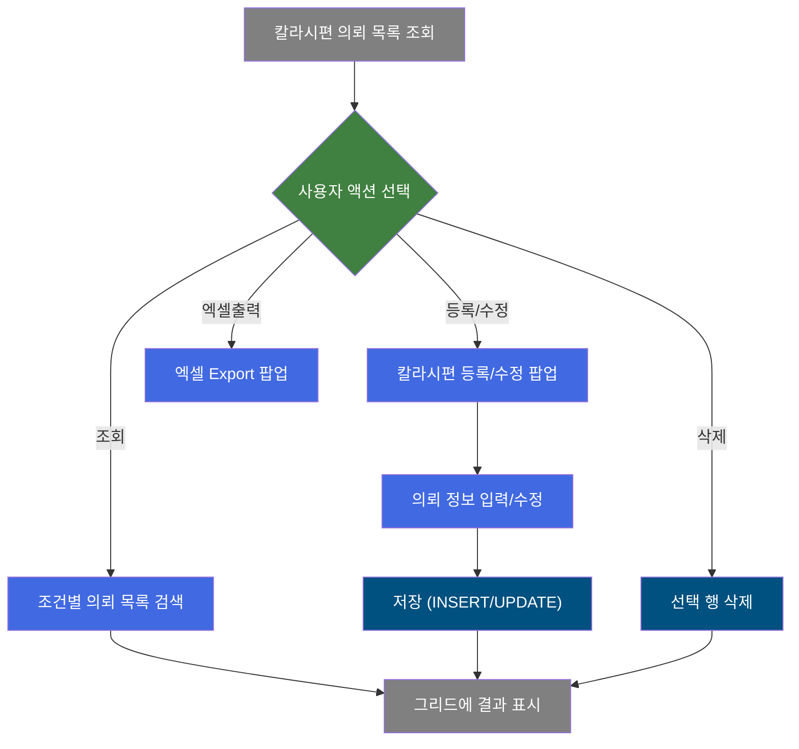
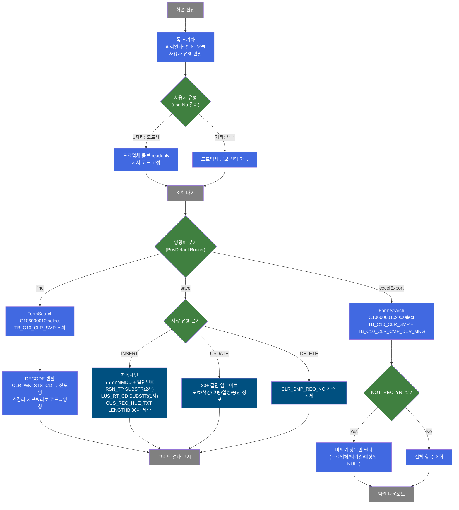
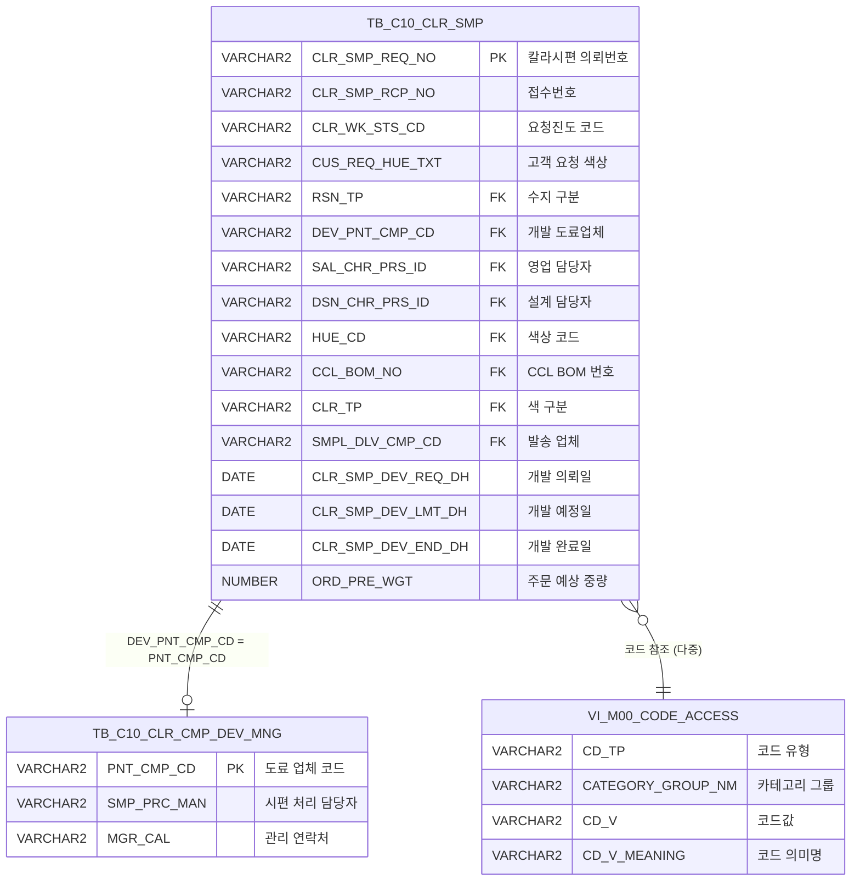

<h1 style="font-size: 40px; text-align: center; font-weight:
   bold; margin: 30px 0;">
  C106000010 칼라시편관리 레거시 시스템 분석 종합 보고서
</h1>


# 1. 시스템 개요
- **서비스 ID**: C106000010
- **업무명**: 칼라시편관리
- **분석 일시**: 2026-03-17 (KST)
- **전체 Activity 수**: 4개 (Built-in 4개, Custom 0개)
- **분석자**: Claude Opus 4.6 / Sonnet (Phase별)
- **분석 도구**: /analyze-service C106000010
- **문서 버전**: 1.0

# 비즈니스 프로세스 분석

## 시스템 목적

칼라시편관리(C106000010)는 CCL(Color Coating Line) 공정에서 사용되는 칼라시편(색상 샘플)의 개발 의뢰부터 발송까지의 전체 라이프사이클을 관리하는 시스템이다. 영업담당자가 고객 요청에 따라 색상 시편 개발을 의뢰하면, 설계담당자와 도료업체가 협업하여 시편을 개발하고, 개발 완료 후 고객에게 발송하는 프로세스를 지원한다.

핵심 업무는 칼라시편 의뢰 등록/조회/수정/삭제(CRUD)이며, 의뢰번호는 날짜 기반 자동 채번(YYYYMMDD+일련번호) 방식으로 생성된다. 도료업체 사용자(userNo 6자리)와 사내 사용자를 구분하여 화면 접근 권한을 차등 적용하며, 시편의 개발 진도(개발등록→개발승인→개발접수→배송출발)를 추적한다. 엑셀 출력 기능으로 시편 의뢰 현황을 일괄 다운로드할 수 있으며, 미의뢰현황 필터로 도료업체/의뢰일/예정일이 누락된 항목을 식별할 수 있다.

## 핵심 워크플로우 다이어그램



### 상세 워크플로우 다이어그램



## 주요 유즈케이스

### UC-01: 칼라시편 의뢰 목록 조회
- **Actor**: 영업담당자 / 설계담당자 / 도료업체 담당자
- **목적**: 의뢰일자, 의뢰번호, 도료업체, 영업담당자, 요청진도 조건으로 칼라시편 의뢰 목록을 검색하여 개발 진행 상황을 파악

- **전제조건**:
  - 사용자가 시스템에 로그인되어 있음
  - TB_C10_CLR_SMP 테이블에 의뢰 데이터가 존재함

- **주요 흐름**:
  1. 화면 진입 시 의뢰일자 기본값 설정 (월초~오늘) - onFormLoadFunction
  2. 사용자 유형 판별 (userNo 6자리 = 도료사 → 도료업체 콤보 readonly)
  3. 조건 입력 후 조회 버튼 클릭 - find 이벤트
  4. 시스템이 C106000010.select 쿼리 실행 (mesdao)
  5. DECODE로 요청진도 코드→명칭 변환, 스칼라 서브쿼리로 도료업체/발송업체 명칭 조회
  6. 그리드에 의뢰 목록 표시 (15컬럼, 전체 읽기전용)

- **대체 흐름**:
  - 시작일만 입력하고 종료일 미입력: "종료일을 입력하세요" 유효성 검증
  - 모든 조건 미입력 시: "조회 조건을 입력하세요" 알림
  - 조회 결과 없음: 빈 그리드 표시

- **후행조건**:
  - 그리드에 조건에 맞는 의뢰 목록이 표시됨
  - 사용자가 수정/등록, 삭제, 엑셀출력 등 후속 작업 가능

### UC-02: 칼라시편 등록/수정
- **Actor**: 영업담당자 / 설계담당자
- **목적**: 고객 요청에 따른 칼라시편 개발 의뢰를 신규 등록하거나 기존 의뢰 정보를 수정

- **전제조건**:
  - 수정/등록 권한이 있는 사용자
  - 수정 시: 그리드에서 대상 의뢰 행이 선택되어 있음

- **주요 흐름**:
  1. "수정/등록" 버튼 클릭 - create 이벤트
  2. 팝업 호출 (c106000010pop01.do, 890x520, 모달)
  3. 선택된 행이 있으면 CLR_SMP_REQ_NO 파라미터 전달 (수정 모드)
  4. 팝업에서 의뢰 정보 입력/수정 (고객색상, 수지, 도료업체, 개발일정 등)
  5. 팝업 저장 시 GridSave 활동 실행
  6. INSERT: 자동채번(YYYYMMDD+일련번호)으로 CLR_SMP_REQ_NO 생성, CUS_REQ_HUE_TXT LENGTHB 30자 제한
  7. UPDATE: 30개 이상 컬럼 업데이트 (CLR_SMP_REQ_NO 기준)

- **대체 흐름**:
  - 신규 행 저장 시 색상/사양 정보 미입력: 유효성 검증 실패 알림
  - 저장할 데이터 없음: "저장할 데이터가 없습니다" 메시지

- **후행조건**:
  - TB_C10_CLR_SMP에 레코드 생성/수정
  - 그리드 갱신하여 변경 내용 반영

### UC-03: 칼라시편 의뢰 삭제
- **Actor**: 영업담당자
- **목적**: 잘못 등록되거나 취소된 칼라시편 의뢰를 삭제

- **전제조건**:
  - 삭제 대상 행이 그리드에서 선택되어 있음

- **주요 흐름**:
  1. 그리드에서 삭제 대상 행 선택
  2. 메뉴의 "삭제" 클릭 - remove 이벤트
  3. 저장 버튼 클릭으로 삭제 확정
  4. C106000010.delete 쿼리 실행 (CLR_SMP_REQ_NO 기준)

- **대체 흐름**:
  - 행 미선택 시 삭제: "삭제할 행을 선택하세요" 알림

- **후행조건**:
  - TB_C10_CLR_SMP에서 해당 레코드 삭제됨
  - 그리드 갱신

### UC-04: 엑셀 출력
- **Actor**: 영업담당자 / 관리자
- **목적**: 칼라시편 의뢰 현황을 엑셀 파일로 다운로드하여 보고서 작성 또는 현황 공유

- **전제조건**:
  - 조회 조건이 설정되어 있음

- **주요 흐름**:
  1. "엑셀출력" 버튼 클릭 - excelExport 이벤트
  2. 엑셀 출력 팝업 호출 (excelExportC106000010.do, 310x300)
  3. C106000010xls.select 실행 (TB_C10_CLR_SMP LEFT JOIN TB_C10_CLR_CMP_DEV_MNG)
  4. 엑셀 파일 생성 및 다운로드

- **대체 흐름**:
  - NOT_REC_YN='1' 설정 시: 미의뢰 항목만 필터링 (도료업체/의뢰일/예정일 중 NULL인 항목)

- **후행조건**:
  - 엑셀 파일 다운로드 완료

### UC-05: 도료사별 색상개발 담당 조회
- **Actor**: 영업담당자 / 설계담당자
- **목적**: 특정 도료사의 색상개발 담당자 정보를 팝업으로 조회

- **전제조건**:
  - 도료업체가 선택되어 있음

- **주요 흐름**:
  1. findClrCmp 함수 호출
  2. 팝업 호출 (C106000010pop02.jsp, 848x406, 모달)
  3. 도료사별 색상개발 담당 정보 조회 및 선택
  4. 선택된 값을 메인 폼에 반환

- **후행조건**:
  - 선택된 담당자 정보가 폼에 설정됨

---
## 비즈니스 로직 상세

### 1. 요청진도 코드 변환 (CLR_WK_STS_CD)

- **목적**: 칼라시편 의뢰의 개발 진행 단계를 코드에서 사람이 읽을 수 있는 명칭으로 변환
- **처리 케이스**:

  **[케이스 1: DECODE 기반 진도 변환]**
  ```
    조건: SELECT 쿼리 실행 시 CLR_WK_STS_CD 컬럼 변환
    처리:
      DECODE(CLR_WK_STS_CD,
        'A', '개발등록',
        'B', '개발승인',
        'C', '개발접수',
        'D', '배송출발',
        '')
    → 미등록 코드는 빈 문자열 반환
  ```

### 2. 의뢰번호 자동채번 (CLR_SMP_REQ_NO)

- **목적**: 신규 칼라시편 의뢰 시 고유한 의뢰번호를 날짜 기반으로 자동 생성
- **처리 케이스**:

  **[케이스 1: 당일 첫 의뢰]**
  ```
    조건: 당일 의뢰 레코드가 없는 경우
    처리:
      1. MAX(CLR_SMP_REQ_NO) 조회 → NULL
      2. NVL(NULL, TO_CHAR(SYSDATE,'yyyymmdd')||'00') → 'YYYYMMDD00'
      3. +1 → 'YYYYMMDD01' (첫 번째 의뢰번호)
  ```

  **[케이스 2: 당일 추가 의뢰]**
  ```
    조건: 당일 기존 의뢰 레코드 존재
    처리:
      1. MAX(CLR_SMP_REQ_NO) 조회 → 'YYYYMMDD03' (예시)
      2. +1 → 'YYYYMMDD04'
  ```

- **계산 공식**:
  ```
  CLR_SMP_REQ_NO = NVL(MAX(CLR_SMP_REQ_NO), TO_CHAR(SYSDATE,'yyyymmdd')||'00') + 1
  WHERE CLR_SMP_REQ_NO LIKE TO_CHAR(SYSDATE,'yyyymmdd') || '%'

  예시: 2026-03-17 세 번째 의뢰 → '2026031703'
  ```

### 3. 입력값 가공 (SUBSTR / LENGTHB)

- **목적**: 사용자 입력값을 DB 저장 규격에 맞게 가공
- **처리 케이스**:

  **[케이스 1: 수지구분(RSN_TP) 2자리 추출]**
  ```
    조건: INSERT 시 RSN_TP 파라미터
    처리: SUBSTR(:RSN_TP, '1', '2') → 앞 2자리만 저장
    예시: 'PE고급' → 'PE'
  ```

  **[케이스 2: 광택도코드(LUS_RT_CD) 1자리 추출]**
  ```
    조건: INSERT 시 LUS_RT_CD 파라미터
    처리: SUBSTR(:LUS_RT_CD, '1', '1') → 앞 1자리만 저장
    예시: 'H고광택' → 'H'
  ```

  **[케이스 3: 고객색상명(CUS_REQ_HUE_TXT) 바이트 제한]**
  ```
    조건: INSERT 시 CUS_REQ_HUE_TXT 파라미터
    처리: CASE WHEN LENGTHB(:CUS_REQ_HUE_TXT) > 30
           THEN SUBSTRB(:CUS_REQ_HUE_TXT, 1, 30)
           ELSE :CUS_REQ_HUE_TXT END
    → 30바이트 초과 시 자동 절삭 (한글 3바이트 고려)
  ```

### 4. 스칼라 서브쿼리 코드→명칭 변환

- **목적**: 코드 테이블(VI_M00_CODE_ACCESS)을 참조하여 코드값을 사용자가 이해할 수 있는 명칭으로 변환
- **처리 케이스**:

  **[케이스 1: 도료업체 명칭 변환]**
  ```
    조건: DEV_PNT_CMP_CD 코드가 존재
    처리:
      SELECT CD_V_MEANING FROM M00APUSER.VI_M00_CODE_ACCESS
      WHERE CD_TP = 'PNT_CMP_CD'
        AND CATEGORY_GROUP_NM = 'SZ0000'
        AND CD_V = DEV_PNT_CMP_CD
  ```

  **[케이스 2: 발송업체 명칭 변환]**
  ```
    조건: SMPL_DLV_CMP_CD 코드가 존재
    처리:
      SELECT CD_V_MEANING FROM M00APUSER.VI_M00_CODE_ACCESS
      WHERE CD_TP = 'SMPL_DLV_CMP_CD'
        AND CATEGORY_GROUP_NM = 'SZ0000'
        AND CD_V = SMPL_DLV_CMP_CD
  ```

  **[케이스 3: 수지 구분 코드+명칭 결합 (select 쿼리)]**
  ```
    처리:
      RSN_TP || (SELECT ' : ' || CD_V_MEANING FROM M00APUSER.VI_M00_CODE_ACCESS
      WHERE CD_TP = 'RSN_TP' AND CATEGORY_GROUP_NM = 'SZ0000' AND CD_V = RSN_TP)
    예시: 'PE : 폴리에스테르'
  ```

  **[케이스 4: 색구분 명칭 변환 (xls 쿼리)]**
  ```
    처리:
      SELECT CD_V_MEANING FROM M00APUSER.VI_M00_CODE_ACCESS
      WHERE CD_TP = 'CLR_TP' AND CATEGORY_GROUP_NM = 'SZ0000' AND CD_V = CLR_TP
  ```

### 5. 프로젝트 개발 구분 변환 (PRJ_DEV_CD)

- **목적**: 프로젝트 개발 횟수 코드를 의미 있는 텍스트로 변환
- **처리 케이스**:
  ```
    DECODE(PRJ_DEV_CD, '1', '1~3회', '2', '반복', '')
    → '1': 초기 개발(1~3회), '2': 반복 개발, 기타: 빈 문자열
  ```

### 6. 미의뢰현황 필터 (NOT_REC_YN)

- **목적**: 엑셀 출력 시 도료업체/의뢰일/예정일이 누락된 미처리 항목을 식별
- **처리 케이스**:

  **[케이스 1: 미의뢰 필터 활성화]**
  ```
    조건: NOT_REC_YN = '1'
    처리:
      AND (A.DEV_PNT_CMP_CD IS NULL
        OR A.CLR_SMP_DEV_REQ_DH IS NULL
        OR A.CLR_SMP_DEV_LMT_DH IS NULL)
    → 세 항목 중 하나라도 NULL이면 미의뢰로 분류
  ```

---

# 데이터 요구사항

## 핵심 테이블

### 1. TB_C10_CLR_SMP - 칼라시편 관리 (메인 테이블)
| 컬럼명 | 타입 | PK | 설명 |
|--------|------|----|------|
| CLR_SMP_REQ_NO | VARCHAR2 | PK | 칼라시편 의뢰번호 (YYYYMMDD+일련번호) |
| CLR_SMP_RCP_NO | VARCHAR2 | | 칼라시편 접수번호 |
| CLR_WK_STS_CD | VARCHAR2 | | 요청진도 코드 (A:개발등록, B:개발승인, C:개발접수, D:배송출발) |
| CUS_REQ_HUE_TXT | VARCHAR2 | | 고객 요청 색상명 |
| RSN_TP | VARCHAR2 | | 수지 구분 코드 (2자리) |
| RSN_TP_TXT | VARCHAR2 | | 수지 구분 텍스트 |
| RSN_ANL_REQ_YN | VARCHAR2 | | 수지 분석 요망 여부 |
| SMP_SND_YN | VARCHAR2 | | 시편 송부 여부 |
| PNT_FLM_THK_TXT | VARCHAR2 | | 도막 두께 |
| SMP_LUS_YN | VARCHAR2 | | 샘플 광택 여부 |
| LUS_RT_CD | VARCHAR2 | | 광택도 코드 (1자리) |
| CLR_USE_NM | VARCHAR2 | | 색상 사용 용도명 |
| PRD_NM_CD | VARCHAR2 | | 제품명 코드 (FK) |
| PRD_TP_YN | VARCHAR2 | | 제품명 구분 여부 |
| SAL_CHR_PRS_ID | VARCHAR2 | | 영업 담당자 ID (FK) |
| DSN_CHR_PRS_ID | VARCHAR2 | | 설계 담당자 ID (FK) |
| CUS_CD | VARCHAR2 | | 고객사 코드 (FK) |
| CUS_CD_TXT | VARCHAR2 | | 고객사명 |
| USE_REG_TXT | VARCHAR2 | | 사용 지역명 |
| DEV_PNT_CMP_CD | VARCHAR2 | | 개발 도료 업체 코드 (FK) |
| LST_PNT_CMP_CD | VARCHAR2 | | 최종 도료 업체 코드 (FK) |
| PNT_CMP_CD | VARCHAR2 | | 도료 업체 코드 (FK) |
| PNT_CMP_DLV_NM | VARCHAR2 | | 발송 담당자명 |
| PNT_CMP_DLV_HP | VARCHAR2 | | 발송 담당자 연락처 |
| PNT_CMP_DLV_EXP_DH | DATE | | 발송 예정일 |
| PNT_CMP_DLV_DH | DATE | | 발송일 |
| IVC_NO | VARCHAR2 | | 송장번호 |
| SMPL_DLV_CMP_CD | VARCHAR2 | | 발송 업체 코드 (FK) |
| SAL_CHR_REQ_DH | DATE | | 영업 담당자 요청일 |
| SAL_CHR_RGN_DH | DATE | | 영업 담당자 승인일 |
| SAL_CHR_RGN_YN | VARCHAR2 | | 영업 담당자 승인 여부 |
| SAL_CHR_RGN_TXT | VARCHAR2 | | 영업 담당자 승인 내역 |
| CLR_SMP_DEV_RCP_DH | DATE | | 칼라시편 개발 접수일 |
| CLR_SMP_DEV_REQ_DH | DATE | | 칼라시편 개발 의뢰일 |
| CLR_SMP_DEV_LMT_DH | DATE | | 칼라시편 개발 예정일 |
| CLR_SMP_DEV_END_DH | DATE | | 칼라시편 개발 완료일 |
| CLR_SMP_DEV_SND_DH | DATE | | 칼라시편 개발 송부일 |
| SMP_SND_INF | VARCHAR2 | | 시편 송부 정보 |
| DSN_CHR_RGN_YN | VARCHAR2 | | 설계 담당자 승인 여부 |
| HUE_CD | VARCHAR2 | | 색상 코드 (FK) |
| CCL_BOM_NO | VARCHAR2 | | CCL BOM 번호 (FK) |
| CCL_BOM_RGS_DH | DATE | | CCL BOM 등록일 |
| CLR_TP | VARCHAR2 | | 색 구분 코드 (FK) |
| CLR_SMP_RMK | VARCHAR2 | | 칼라시편 비고 |
| CLR_SMP_DSN_RMK | VARCHAR2 | | 설계 비고 |
| STD_CLR_NM | VARCHAR2 | | 표준 색상명 |
| COAT2_TXT | VARCHAR2 | | 2Coat 내역 |
| COAT3_TXT | VARCHAR2 | | 3Coat 내역 |
| COAT4_TXT | VARCHAR2 | | 4Coat 내역 |
| LMN_TXT | VARCHAR2 | | Lamina 내역 |
| PRT_TXT | VARCHAR2 | | Print 내역 |
| ORD_TEM_CD | VARCHAR2 | | 영업팀 코드 (FK) |
| SIM_HUE_PRG_YN | VARCHAR2 | | 유사색상 진행 여부 |
| HUE_CD_RGS_YN | VARCHAR2 | | 색상 코드 등록 여부 |
| CLR_SMP_END_TXT | VARCHAR2 | | 칼라시편 완료 내역 |
| COL_CFM_ACT_YN | VARCHAR2 | | 색상 확인 실적 여부 |
| PRJ_DEV_CD | VARCHAR2 | | 프로젝트 개발 구분 (1:1~3회, 2:반복) |
| ORD_PRE_WGT | NUMBER | | 주문 예상 중량 |
| CREATED_OBJECT_TYPE | VARCHAR2 | | 생성 객체 유형 |
| CREATED_OBJECT_ID | VARCHAR2 | | 생성 객체 ID |
| CREATED_PROGRAM_ID | VARCHAR2 | | 생성 프로그램 ID |
| CREATION_TIMESTAMP | TIMESTAMP | | 생성 타임스탬프 |
| LAST_UPDATED_OBJECT_TYPE | VARCHAR2 | | 수정 객체 유형 |
| LAST_UPDATED_OBJECT_ID | VARCHAR2 | | 수정 객체 ID |
| LAST_UPDATE_PROGRAM_ID | VARCHAR2 | | 수정 프로그램 ID |
| LAST_UPDATE_TIMESTAMP | TIMESTAMP | | 수정 타임스탬프 |

### 2. TB_C10_CLR_CMP_DEV_MNG - 도료업체 개발 관리 (엑셀 쿼리에서 참조)
| 컬럼명 | 타입 | PK | 설명 |
|--------|------|----|------|
| PNT_CMP_CD | VARCHAR2 | PK | 도료 업체 코드 |
| SMP_PRC_MAN | VARCHAR2 | | 시편 처리 담당자 |
| MGR_CAL | VARCHAR2 | | 관리 연락처 |

### 3. VI_M00_CODE_ACCESS - 코드 마스터 뷰 (M00APUSER 스키마)
| 컬럼명 | 타입 | PK | 설명 |
|--------|------|----|------|
| CD_TP | VARCHAR2 | | 코드 유형 (PNT_CMP_CD, RSN_TP, CLR_TP, SMPL_DLV_CMP_CD 등) |
| CATEGORY_GROUP_NM | VARCHAR2 | | 카테고리 그룹명 (SZ0000, SZ0001) |
| CD_V | VARCHAR2 | | 코드값 |
| CD_V_MEANING | VARCHAR2 | | 코드 의미명 |

## 데이터 플로우

### 1. 조회
```
[칼라시편 의뢰 목록 조회]
사용자 조건 입력 (의뢰일자, 의뢰번호, 도료업체, 영업담당자, 요청진도)
→ C106000010.select
  FROM TB_C10_CLR_SMP
  WHERE CLR_SMP_DEV_REQ_DH BETWEEN :시작일 AND :종료일
    AND NVL(:CLR_SMP_REQ_NO, '%') LIKE 선택적 필터
    AND NVL(:DEV_PNT_CMP_CD, '%') LIKE 선택적 필터
    AND NVL(:SAL_CHR_PRS_ID, '%') LIKE 선택적 필터
    AND NVL(:CLR_WK_STS_CD, '%') LIKE 선택적 필터
  + 스칼라 서브쿼리: VI_M00_CODE_ACCESS (RSN_TP, PNT_CMP_CD, SMPL_DLV_CMP_CD)
  ORDER BY CLR_SMP_REQ_NO
→ Grid에 의뢰 목록 표시 (15컬럼)
```

### 2. 엑셀 출력 조회
```
[엑셀 Export용 상세 조회]
사용자 조건 입력 (접수일자, 의뢰번호, 접수번호, 도료업체, 영업담당자, 미의뢰여부)
→ C106000010xls.select
  FROM TB_C10_CLR_SMP A
  LEFT OUTER JOIN TB_C10_CLR_CMP_DEV_MNG B ON A.DEV_PNT_CMP_CD = B.PNT_CMP_CD(+)
  WHERE CLR_SMP_DEV_RCP_DH BETWEEN :시작일 AND :종료일
    AND 선택적 필터 (의뢰번호, 접수번호, 도료업체, 영업담당자)
    AND NOT_REC_YN='1' 시 미의뢰 필터
  + 스칼라 서브쿼리: VI_M00_CODE_ACCESS (PNT_CMP_CD, CLR_TP)
  ORDER BY CLR_SMP_REQ_NO, CLR_SMP_RCP_NO
→ 엑셀 파일 생성
```

### 3. 신규 등록
```
[칼라시편 신규 의뢰 등록]
팝업에서 의뢰 정보 입력
→ C106000010.insert
  INTO TB_C10_CLR_SMP
  VALUES (자동채번, :고객색상, SUBSTR(:수지,1,2), SYSDATE, ... 총 30+ 컬럼)
  CLR_SMP_REQ_NO = 서브쿼리 자동채번
  CLR_SMP_DEV_RCP_DH = SYSDATE (접수일 자동 입력)
→ 그리드 갱신
```

### 4. 수정
```
[칼라시편 의뢰 정보 수정]
팝업에서 의뢰 정보 수정
→ C106000010.update
  UPDATE TB_C10_CLR_SMP
  SET CLR_SMP_RCP_NO, CUS_REQ_HUE_TXT, PNT_CMP_CD, ... 30+ 컬럼
  WHERE CLR_SMP_REQ_NO = :CLR_SMP_REQ_NO
→ 그리드 갱신
```

### 5. 삭제
```
[칼라시편 의뢰 삭제]
그리드에서 행 삭제 표시
→ C106000010.delete
  DELETE FROM TB_C10_CLR_SMP
  WHERE CLR_SMP_REQ_NO = :CLR_SMP_REQ_NO
→ 그리드 갱신
```

## SQL 일람표
| SQL 이름 | 쿼리 ID | 타입 | 출처 | 테이블 |
|---------|---------|------|------|--------|
| 칼라시편 의뢰 목록 조회 | C106000010.select | SELECT | Service | TB_C10_CLR_SMP, VI_M00_CODE_ACCESS |
| 칼라시편 엑셀 조회 | C106000010xls.select | SELECT | Service | TB_C10_CLR_SMP, TB_C10_CLR_CMP_DEV_MNG, VI_M00_CODE_ACCESS |
| 칼라시편 신규 등록 | C106000010.insert | INSERT | Service | TB_C10_CLR_SMP |
| 칼라시편 삭제 | C106000010.delete | DELETE | Service | TB_C10_CLR_SMP |
| 칼라시편 수정 | C106000010.update | UPDATE | Service | TB_C10_CLR_SMP |

## ER 다이어그램 (핵심 관계)



관계 설명:
- **TB_C10_CLR_SMP**가 중심 테이블로 모든 관계의 허브 역할
- **TB_C10_CLR_CMP_DEV_MNG**: DEV_PNT_CMP_CD = PNT_CMP_CD(+) LEFT OUTER JOIN으로 도료업체 개발관리 정보 연결 (엑셀 쿼리에서만 사용)
- **VI_M00_CODE_ACCESS**: 스칼라 서브쿼리를 통해 PNT_CMP_CD, RSN_TP, CLR_TP, SMPL_DLV_CMP_CD 등 다수의 코드→명칭 변환에 사용 (M00APUSER 스키마)

---

# 사용자 인터페이스 요구사항

## 화면 레이아웃 상세

### Layout 구조 (div 기반 절대좌표 배치)
```javascript
{
  type: "flat",
  description: "레이아웃 없이 div 기반 절대좌표 배치",
  components: [
    {
      id: "C106000010_Form_1",
      type: "form",
      position: { left: 0, top: 0, width: 981, height: 71 }
    },
    {
      id: "C106000010_Menu_1",
      type: "menu",
      position: { left: 0, top: 73, width: 981, height: 25 }
    },
    {
      id: "C106000010_Grid_1",
      type: "grid",
      position: { left: 0, top: 97, width: 977, height: 467 }
    },
    {
      id: "C106000010_messagebox",
      type: "messagebox",
      position: { left: 1, top: 567, width: 977, height: 19 }
    }
  ]
}
```

## 입출력 요소

### Form 컴포넌트
**C106000010_Form_1**
- CLR_SMP_DEV_REQ_DH_START: calendar - 의뢰 시작일자 (80px, 배경색 #FFFFC0)
- CLR_SMP_DEV_REQ_DH_END: calendar - 의뢰 종료일자 (80px, 배경색 #FFFFC0)
- CLR_SMP_REQ_NO: input - 의뢰번호 (80px, maxLength 10, 배경색 #FFFFC0)
- DEV_PNT_CMP_CD: combo - 도료업체 (200px, 마스터 콤보 SZ0000/PNT_CMP_CD)
- SAL_CHR_PRS_ID: input - 영업담당자 (100px, maxLength 20, 배경색 #FFFFC0)
- CLR_WK_STS_CD: combo - 요청진도 (100px, 마스터 콤보 SZ0001/CLR_WK_STS_CD)
- create: custombutton - "수정/등록" (75px, disabled, → c106000010pop01.do 팝업)
- excelExport: button - "엑셀출력" (→ excelExportC106000010.do 팝업)
- find: button - "조회" (disabled)
- save: button - "저장" (disabled)
- winClose: button - "닫기"

### Menu 컴포넌트
**C106000010_Menu_1**
- refresh: "새로고침" (refresh.gif) - 그리드 데이터 갱신
- copy: "복사" (copy.gif) - 선택 행 클립보드 복사
- remove: "삭제" (remove.gif) - 선택 행 삭제 표시

### Grid 컴포넌트

**C106000010_Grid_1 (칼라시편 의뢰 목록)**
- 편집 가능 여부: 아니오 (전체 읽기전용)
- Split: 없음
- 행 수: 18행
- 기능: 멀티셀렉트, 유효성검증, rowspan/colspan, 안정정렬, 컨텍스트메뉴, 페이징
- 주요 컬럼 (15개):

  **의뢰 기본정보**:
  - CLR_SMP_REQ_NO: ro - 의뢰번호 (8%, 중앙정렬, sort_int_custom)
  - CLR_WK_STS_NM: ro - 요청진도 (8%, 중앙정렬, sort_str_custom)
  - SAL_CHR_REQ_DH: ro - 요청등록일 (10%, 중앙정렬, 정렬불가)

  **고객/색상 정보**:
  - CUS_CD_TXT: ro - 고객사 (15%, 좌측정렬, sort_str_custom)
  - CUS_REQ_HUE_TXT: ro - 고객색상 (16%, 좌측정렬, sort_int_custom)
  - RSN_TP_TXT: ro - 수지 (18%, 좌측정렬, sort_str_custom)

  **담당자 정보**:
  - SAL_CHR_PRS_ID: ro - 영업담당 (8%, 중앙정렬, sort_str_custom)
  - DSN_CHR_PRS_ID: ro - 설계담당 (8%, 중앙정렬, sort_str_custom)

  **도료업체/배송 정보**:
  - DEV_PNT_CMP_CD_NM: ro - 도료업체 (18%, 좌측정렬, sort_str_custom)
  - PNT_CMP_DLV_NM: ro - 발송담당자 (8%, 중앙정렬, sort_str_custom)
  - PNT_CMP_DLV_HP: ro - 발송담당연락처 (13%, 중앙정렬, sort_str_custom)
  - PNT_CMP_DLV_EXP_DH: ro - 발송예정일 (10%, 중앙정렬, sort_str_custom)
  - PNT_CMP_DLV_DH: ro - 발송일 (10%, 중앙정렬, sort_str_custom)
  - IVC_NO: ro - 송장번호 (15%, 좌측정렬, sort_str_custom)
  - SMPL_DLV_CMP_NM: ro - 발송업체 (10%, 중앙정렬, sort_str_custom)

### Messagebox 컴포넌트
**C106000010_messagebox**
- 하단 메시지 표시 영역 (1px, 567px, 977x19)

## 화면 동작 흐름

### 1. 화면 초기 로딩
```
1. 화면 진입
2. onFormLoadFunction 실행 (폼 XLE 이벤트)
3. 의뢰일자 초기값 설정:
   - 시작일: 당월 1일
   - 종료일: 오늘
4. 사용자 유형 판별 (userNo 길이)
   - 6자리 → 도료사 사용자
     → DEV_PNT_CMP_CD 콤보 readonly 고정 (자사 코드)
   - 기타 → 사내 사용자
     → 도료업체 콤보 선택 가능
5. 요청진도 콤보 초기화 (SZ0001/CLR_WK_STS_CD)
6. 도료업체 콤보 초기화 (SZ0000/PNT_CMP_CD)
7. 그리드 초기화 (onGridLoadFunction 주석처리 → 자동 조회 비활성)
```

### 2. 조건별 조회
```
1. 사용자가 의뢰일자 범위, 의뢰번호, 도료업체, 영업담당자, 요청진도 조건 입력
2. "조회" 버튼 클릭 (find 이벤트)
3. 유효성 검증:
   - 시작일 입력 시 종료일 필수
   - 종료일 입력 시 시작일 필수
   - 모든 조건 미입력 시 조회 불가
4. uiCommon.parameters(C106000010_Form_1) 호출하여 파라미터 구성
5. basicGridData.do 서비스 호출 (find 액션, C106000010-service)
6. C106000010.select 실행 → Grid에 결과 바인딩
7. findMessage로 메시지박스에 조회 결과 표시
```

### 3. 등록/수정 팝업
```
1. "수정/등록" 버튼 클릭 (create 이벤트)
2. 그리드 선택 행의 CLR_SMP_REQ_NO 추출 (없으면 신규 등록 모드)
3. 팝업 호출: c106000010pop01.do (890x520, 모달)
   - 파라미터: CLR_SMP_REQ_NO
4. 팝업에서 의뢰 정보 입력/수정
5. 팝업 저장 → handleDataProcess.do 호출 (save 액션)
6. 팝업 닫힘 시 메인 그리드 자동 갱신
```

### 4. 엑셀 출력
```
1. "엑셀출력" 버튼 클릭 (excelExport 이벤트)
2. 엑셀 출력 팝업 호출: excelExportC106000010.do (310x300)
3. 전체 15컬럼 데이터 엑셀 export
   - columnList: CLR_SMP_REQ_NO ~ SMPL_DLV_CMP_NM
```

### 5. 컨텍스트 메뉴
```
1. 그리드 셀 우클릭
2. 컨텍스트 메뉴 표시:
   - copy_row: 선택 셀 클립보드 복사
   - excel_grid: 그리드 엑셀 내보내기
```

## JavaScript 모듈

**C106000010.jsp** (메인 화면 스크립트)
- onFormLoadFunction(): 폼 로드 시 초기화 (의뢰일자 기본값, 사용자 유형별 콤보 설정)
- onGridLoadFunction(): 그리드 로드 시 초기 조회 (현재 주석처리됨), onAfterUpdateFinishEvent 등록
- find: 조건별 의뢰 목록 조회 (basicGridData.do, C106000010.select)
- save: 그리드 변경 데이터 저장 (handleDataProcess.do, inserted 행 유효성 검사)
- create: 수정/등록 팝업 호출 (c106000010pop01.do, 890x520)
- excelExport: 엑셀 출력 팝업 호출 (excelExportC106000010.do, 310x300)
- refresh: 그리드 새로고침
- remove: 선택 행 삭제 표시
- copy: 선택 행 클립보드 복사
- findClrCmp(): 도료사별 색상개발 담당 팝업 호출 (C106000010pop02.jsp, 848x406)
- findMessage(): 메시지박스에 appMsg 표시
- masterSetValue(): 마스터 팝업 반환값 폼 설정
- masterPopupSetValue(): 마스터 팝업2 반환값 c10popUp_setVal로 설정
- onGridContextMenuClick(): 컨텍스트 메뉴 (copy_row, excel_grid)

## 주요 이벤트 핸들러

**onFormLoadFunction (폼 로드 이벤트)**
- 이벤트 타입: Form XLE Event
- 처리 내용:
  1. 의뢰일자 시작일을 당월 1일로 설정
  2. 의뢰일자 종료일을 오늘로 설정
  3. userNo 길이 체크 (6자리 = 도료사)
  4. 도료사인 경우 DEV_PNT_CMP_CD 콤보를 readonly로 고정
  5. 요청진도 콤보 SZ0001 코드로 초기화

**find (조회 이벤트)**
- 이벤트 타입: Form Button Click
- 처리 내용:
  1. 날짜 유효성 검증 (시작일↔종료일 쌍 체크)
  2. 모든 조건 미입력 체크
  3. uiCommon.parameters로 파라미터 구성
  4. basicGridData.do 호출 (C106000010-service, find)
  5. 그리드 데이터 바인딩
  6. 메시지박스에 조회 결과 표시

**save (저장 이벤트)**
- 이벤트 타입: Form Button Click
- 처리 내용:
  1. 변경 데이터 존재 여부 체크
  2. inserted 행 필드 유효성 검사 (색상/사양 정보 필수)
  3. confirm 대화상자 표시
  4. handleDataProcess.do 호출 (C106000010-service, save)
  5. 저장 완료 후 그리드 갱신 및 재조회

**create (수정/등록 팝업)**
- 이벤트 타입: Form CustomButton Click
- 처리 내용:
  1. 선택된 행의 CLR_SMP_REQ_NO 추출
  2. c106000010pop01.do 팝업 호출 (890x520, modal)
  3. CLR_SMP_REQ_NO 파라미터 전달

---

# 특이사항 및 주의사항

## 1. 사용자 유형 기반 접근 제어
- **도료사 판별 로직**: userNo 문자열 길이가 정확히 6자리이면 도료사 사용자로 판단하여 도료업체 콤보를 readonly로 고정. 이 판별 로직은 하드코딩된 문자열 길이에 의존하므로, 사용자 번호 체계 변경 시 영향받을 수 있음
- **영향 범위**: onFormLoadFunction에서 화면 초기화 시 적용

## 2. 의뢰번호 자동채번 동시성 이슈
- **채번 방식**: INSERT 서브쿼리에서 MAX(CLR_SMP_REQ_NO)+1로 자동채번. Oracle의 읽기 일관성으로 인해 동시 트랜잭션 시 중복 채번 가능성이 있음
- **위험 시나리오**: 두 사용자가 동시에 신규 의뢰를 등록하면 동일한 CLR_SMP_REQ_NO가 생성될 수 있으며, PK 제약조건 위반 에러 발생
- **시퀀스 미사용**: Oracle SEQUENCE 대신 MAX+1 패턴 사용 중

## 3. 그리드 자동 조회 비활성화
- **현상**: onGridLoadFunction 내 자동 조회 코드가 주석처리(`onXLEEvent` 주석)되어 있어, 화면 진입 시 자동 조회가 수행되지 않음
- **영향**: 사용자가 반드시 수동으로 "조회" 버튼을 클릭해야 데이터가 표시됨

## 4. 바이트 기반 문자열 제한
- **CUS_REQ_HUE_TXT**: INSERT 시 LENGTHB로 30바이트 제한 후 SUBSTRB로 절삭. UTF-8 환경에서 한글은 3바이트이므로 실질적으로 한글 10자까지만 저장 가능
- **RSN_TP / LUS_RT_CD**: SUBSTR 인자가 문자열('1', '2')로 전달되어 있으나 Oracle이 암묵적 형변환으로 처리

## 5. 그리드 전체 읽기전용 + 팝업 편집 패턴
- **설계 패턴**: 메인 그리드는 전체 ro(읽기전용)이며, 실제 데이터 편집은 팝업(c106000010pop01.do)을 통해서만 가능. 그리드의 GridSave 활동(insert/update/delete)은 팝업에서 전달된 데이터를 처리하는 용도
- **메뉴의 삭제**: 그리드 행을 삭제 표시 후 저장 버튼으로 확정하는 2단계 삭제 패턴

## 6. 엑셀 쿼리의 추가 JOIN 및 필터
- **xls 쿼리 전용 테이블**: TB_C10_CLR_CMP_DEV_MNG (도료업체 개발관리)는 엑셀 출력 쿼리에서만 LEFT OUTER JOIN으로 참조됨
- **미의뢰현황 필터**: NOT_REC_YN='1' 파라미터로 도료업체/의뢰일/예정일 중 하나라도 NULL인 미처리 항목만 필터링하는 특수 기능 제공

---

# 참고 문서

- **Service XML**: `src/service/C106000010-service.xml`
- **Query SQL**: `src/query/C106000010-query.glue_sql`, `src/query/C106000010xls-query.glue_sql`
- **JSP**: `WebContents/C106000010.jsp`
- **UI XML**: `WebContents/header/kr/C106000010/C106000010_Form_1.xml`, `C106000010_Grid_1.xml`, `C106000010_Menu_1.xml`, `C106000010_messagebox.xml`
