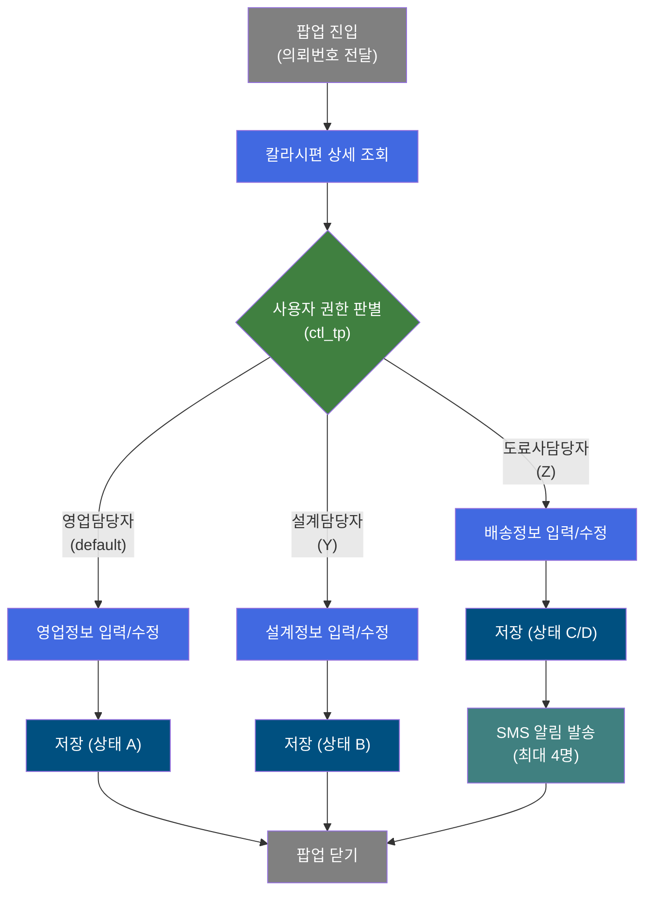
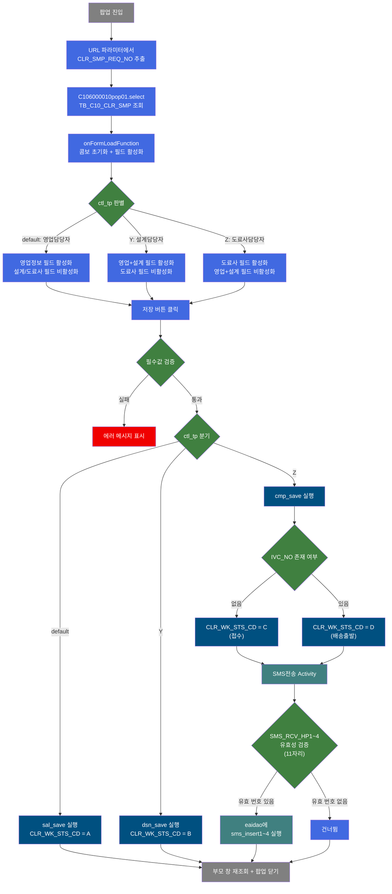
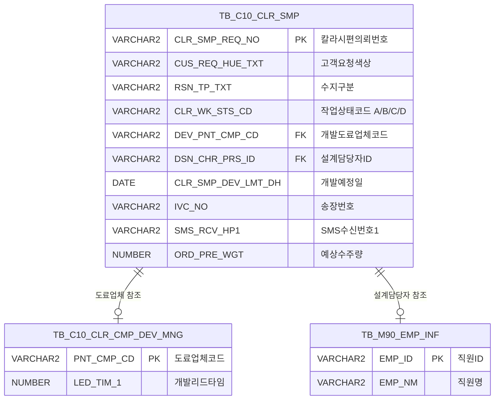

<h1 style="font-size: 40px; text-align: center; font-weight:
   bold; margin: 30px 0;">
  C106000010pop01 레거시 시스템 분석 종합 보고서
</h1>


# 1. 시스템 개요
- **서비스 ID**: C106000010pop01
- **업무명**: 칼라시편관리 팝업 (상세 등록/수정)
- **분석 일시**: 2026-03-17 08:36 KST
- **전체 Activity 수**: 6개 (built-in 5 + custom 1)
- **분석자**: Claude Opus 4.6 (Phase 1~4: sonnet/haiku)
- **분석 도구**: /analyze-service C106000010pop01
- **문서 버전**: 1.0

# 📊 비즈니스 프로세스 분석

## 시스템 목적

칼라시편관리(C106000010) 메인 화면에서 호출되는 팝업 서비스로, 칼라시편 의뢰 건의 상세 정보를 역할별로 등록·수정하는 기능을 제공한다. 영업담당자, 설계담당자, 도료사담당자 세 역할이 각각 담당 영역의 정보만 편집할 수 있으며, 저장 시 역할에 따라 서로 다른 SQL(sal_insert/update, dsn_insert/update, cmp_insert/update)이 실행된다.

도료사담당자가 저장할 경우, 저장 완료 후 영업정보에 등록된 최대 4개의 휴대폰 번호로 SMS 알림이 자동 발송된다. SMS 발송은 EAI 인터페이스 테이블에 레코드를 삽입하는 방식으로, `C10UiC106000010InsertActivity` 커스텀 액티비티가 담당한다. 작업상태(CLR_WK_STS_CD)는 역할에 따라 A(영업등록) → B(설계승인) → C(접수)/D(배송출발)로 자동 전이된다.

## 핵심 워크플로우 다이어그램



### 상세 워크플로우 다이어그램



## 주요 유즈케이스

### UC-01: 영업담당자 칼라시편 신규 등록
- **Actor**: 영업담당자
- **목적**: 고객으로부터 칼라시편 의뢰를 접수하여 기본 고객정보와 색상 요청사항을 등록

- **전제조건**:
  - 메인 화면(C106000010)에서 팝업 호출
  - 사용자 권한(ctl_tp)이 default(영업담당자)

- **주요 흐름**:
  1. 메인 화면에서 신규 등록 클릭 → 팝업 호출 (CLR_SMP_REQ_NO 미전달)
  2. onFormLoadFunction 실행 → 영업정보 fieldset 활성화, 설계/도료사 fieldset 비활성화
  3. 고객요청색상, 수지, 도막두께, 광택도, 사용용도, 영업담당자명, 예상수주량, 고객사명, 사용지역, 품명구분, 영업요청일, 보호필름, 수신처주소 입력
  4. SMS 수신 휴대폰 번호(최대 4개) 입력 (선택)
  5. 저장 버튼 클릭 → 필수값 검증 (SAL_CHR_REQ_DH, PTT_FLM_YN, PRD_TP_YN 등)
  6. sal_insert 실행 → CLR_SMP_REQ_NO 자동생성(MAX+1), CLR_WK_STS_CD = 'A', CLR_SMP_DEV_REQ_DH = SYSDATE
  7. 부모 창 Grid 재조회 후 팝업 닫기

- **대체 흐름**:
  - 필수값 미입력 시: "항목이(가) 입력되지 않았습니다." 메시지 표시
  - PRD_TP_YN = 'Y' 선택 시: PRD_NM_CD 필수 입력 활성화
  - ORD_PRE_WGT 비숫자 입력 시: "예상수주량은 숫자만 입력가능합니다." 메시지 표시

- **후행조건**:
  - TB_C10_CLR_SMP에 신규 레코드 생성 (상태 A)
  - 메인 화면 Grid에 신규 건 반영

### UC-02: 설계담당자 설계정보 입력
- **Actor**: 설계담당자
- **목적**: 영업담당자가 등록한 칼라시편 의뢰에 대해 도료업체, 품질수지코드, 유사색상 진행여부 등 설계 상세정보를 입력

- **전제조건**:
  - 기존 칼라시편 의뢰 건 존재 (CLR_SMP_REQ_NO 전달)
  - 사용자 권한(ctl_tp) = 'Y' (설계담당자)

- **주요 흐름**:
  1. 메인 화면에서 의뢰번호 클릭 → 팝업 호출 (CLR_SMP_REQ_NO 전달)
  2. C106000010pop01.select 실행 → 기존 데이터 Form_2에 바인딩
  3. onFormLoadFunction → 영업+설계정보 필드 활성화, 도료사 필드 비활성화
  4. 도료업체(DEV_PNT_CMP_CD), 품질수지코드(RSN_TP_QT_BR), 유사색상코드(HUE_CD), 유사색상진행(SIM_HUE_PRG_YN) 입력
  5. 저장 버튼 클릭 → dsn_save 실행
  6. dsn_update: CLR_WK_STS_CD = 'B', TB_C10_CLR_CMP_DEV_MNG에서 개발리드타임(LED_TIM_1) 조회하여 개발예정일 자동 계산
  7. 부모 창 재조회 후 팝업 닫기

- **대체 흐름**:
  - 신규 건(dsn_insert): 상태 B로 INSERT, 개발리드타임 참조하여 예정일 계산
  - M90APUSER.TB_M90_EMP_INF에서 설계담당자 직원명 자동 조회

- **후행조건**:
  - CLR_WK_STS_CD = 'B' (설계승인)로 변경
  - 개발예정일(CLR_SMP_DEV_LMT_DH) 자동 산출

### UC-03: 도료사담당자 배송정보 입력 및 SMS 발송
- **Actor**: 도료사담당자
- **목적**: 칼라시편 샘플의 배송 정보(발송예정일, 발송담당자, 배송업체, 송장번호 등)를 입력하고, 관련 담당자에게 SMS 알림 발송

- **전제조건**:
  - 기존 칼라시편 의뢰 건 존재 (CLR_SMP_REQ_NO 전달)
  - 사용자 권한(ctl_tp) = 'Z' (도료사담당자)

- **주요 흐름**:
  1. 메인 화면에서 의뢰번호 클릭 → 팝업 호출
  2. 기존 데이터 조회 후 도료사 필드만 활성화
  3. 발송예정일(PNT_CMP_DLV_EXP_DH), 담당전화(PNT_CMP_DLV_HP), 발송담당자(PNT_CMP_DLV_NM), 발송일(PNT_CMP_DLV_DH), 배송업체(SMPL_DLV_CMP_CD), 송장번호(IVC_NO) 입력
  4. 저장 버튼 클릭 → cmp_save 실행
  5. cmp_update: 송장번호(IVC_NO) 존재 여부에 따라 CLR_WK_STS_CD = DECODE(:IVC_NO, '', 'C', 'D')
  6. 저장 성공 → SMS전송 Activity 자동 실행
  7. SMS_RCV_HP1~4 각각 11자리 유효성 검증 후 eaidao에 sms_insert1~4 실행 (0~4건)
  8. 부모 창 재조회 후 팝업 닫기

- **대체 흐름**:
  - 신규 건(cmp_insert): 의뢰번호 자동생성, TB_C10_CLR_CMP_DEV_MNG에서 리드타임 조회, M90APUSER에서 직원정보 조회
  - SMS 수신번호가 없거나 11자리가 아닌 경우: 해당 번호 건너뜀 (에러 없이 계속)
  - SMS 삽입 중 오류 발생: "데이타 오류입니다." PosException 발생

- **후행조건**:
  - CLR_WK_STS_CD = 'C'(접수) 또는 'D'(배송출발)
  - EAI SMS 큐 테이블에 0~4건 SMS 전송 요청 레코드 삽입

### UC-04: 칼라시편 의뢰 삭제
- **Actor**: 영업담당자/설계담당자/도료사담당자
- **목적**: 기존 칼라시편 의뢰 건을 삭제

- **전제조건**:
  - 기존 칼라시편 의뢰 건 존재

- **주요 흐름**:
  1. 팝업에서 삭제 대상 건 확인
  2. GridSave의 delete 모드 실행
  3. C106000010pop01.delete → CLR_SMP_REQ_NO 기준 TB_C10_CLR_SMP 레코드 삭제

- **대체 흐름**:
  - 해당 없음 (PK 기준 단건 삭제)

- **후행조건**:
  - TB_C10_CLR_SMP에서 해당 의뢰 건 삭제 완료

---

## 비즈니스 로직 상세

### 1. 역할 기반 화면 제어 및 저장 분기 (C10A2183 룰)

- **목적**: 접속 사용자의 권한(ctl_tp)에 따라 편집 가능한 필드를 제한하고 저장 시 서로 다른 SQL을 실행하여 역할별 데이터 분리 관리

- **처리 케이스**:

  **케이스 1: 영업담당자 (ctl_tp = default)**
  ```
    조건: ctl_tp가 'Y'도 'Z'도 아닌 경우
    처리:
      1. 영업정보 필드 활성화 (고객정보, 색상정보, SMS 수신번호 등)
      2. 설계정보/도료사정보 필드 비활성화
      3. 저장 시 sal_save → sal_insert 또는 sal_update 실행
      4. CLR_WK_STS_CD = 'A' (개발등록) 고정
  ```

  **케이스 2: 설계담당자 (ctl_tp = 'Y')**
  ```
    조건: C10A2183 룰에서 ctl_tp = 'Y' 반환
    처리:
      1. 영업정보 + 설계정보 필드 활성화
      2. 도료사정보 필드 비활성화
      3. 저장 시 dsn_save → dsn_insert 또는 dsn_update 실행
      4. CLR_WK_STS_CD = 'B' (개발승인) 고정
  ```

  **케이스 3: 도료사담당자 (ctl_tp = 'Z')**
  ```
    조건: C10A2183 룰에서 ctl_tp = 'Z' 반환
    처리:
      1. 도료사정보 필드만 활성화
      2. 영업정보 + 설계정보 필드 비활성화
      3. 저장 시 cmp_save → cmp_insert 또는 cmp_update 실행
      4. CLR_WK_STS_CD = DECODE(:IVC_NO, '', 'C', 'D')
      5. 저장 성공 후 SMS전송 Activity 자동 실행
  ```

### 2. 작업상태 자동 전이 로직 (CLR_WK_STS_CD)

- **목적**: 칼라시편 의뢰의 업무 진행 단계를 역할별 저장 시 자동으로 전이

- **상태 전이표**:
  ```
  A (개발등록)   ← 영업담당자 저장 시 (sal_insert/sal_update)
  B (개발승인)   ← 설계담당자 저장 시 (dsn_insert/dsn_update)
  C (개발접수)   ← 도료사담당자 저장 + 송장번호 미입력 (cmp_insert/cmp_update, IVC_NO = '')
  D (배송출발)   ← 도료사담당자 저장 + 송장번호 입력됨 (cmp_insert/cmp_update, IVC_NO != '')
  ```

### 3. 개발리드타임 기반 예정일 자동 계산

- **목적**: 도료업체별 개발 리드타임을 참조하여 개발예정일을 자동 산출
- **처리 케이스**:

  **케이스 1: 설계담당자/도료사담당자 INSERT/UPDATE 시**
  ```
    조건: DEV_PNT_CMP_CD(개발도료업체코드) 지정
    처리:
      1. TB_C10_CLR_CMP_DEV_MNG에서 PNT_CMP_CD = :DEV_PNT_CMP_CD 로 LED_TIM_1 조회
      2. CLR_SMP_DEV_LMT_DH = SYSDATE + LED_TIM_1 (개발예정일 자동 계산)
  ```

### 4. SMS 발송 로직 (C10UiC106000010InsertActivity)

- **목적**: 도료사 저장 완료 시 관련 담당자에게 SMS 알림 자동 발송
- **처리 케이스**:

  **케이스 1: SMS 수신번호 유효**
  ```
    조건: SMS_RCV_HPn != null AND SMS_RCV_HPn.length() == 11 (n = 1~4)
    처리:
      1. eaidao(EAIAPUSER) 사용
      2. C106000010pop01.sms_insertn 실행 → EAI SMS 큐 테이블에 INSERT
      3. 파라미터: CUS_CD_TXT, CUS_REQ_HUE_TXT, RSN_TP_TXT, SMPL_DLV_CMP_CD, IVC_NO + 감사속성
  ```

  **케이스 2: SMS 수신번호 무효**
  ```
    조건: SMS_RCV_HPn == null OR SMS_RCV_HPn.length() != 11
    처리:
      1. 해당 번호 건너뜀 (에러 없이 다음 번호로 진행)
      2. 4개 모두 무효여도 SUCCESS 반환
  ```

- **예외 처리**:
  - SMS INSERT 중 Exception: "데이타 오류입니다." PosException 재발생 → 프레임워크 failure 처리

### 5. 의뢰번호 자동생성 로직

- **목적**: 칼라시편 의뢰번호(CLR_SMP_REQ_NO) 자동 채번
- **계산 공식**:
  ```
  신규 의뢰번호 = MAX(CLR_SMP_REQ_NO) + 1
  기본값 (당일 첫 건): yyyymmdd00 (날짜 + '00')

  예시: 2026-03-17 첫 건 → '2026031700', 두 번째 건 → '2026031701'
  ```

---

# ⚙️ Java 컴포넌트 분석

## Custom Activity 상세 분석

### 1개 Custom Activity 발견

### 1. C10UiC106000010InsertActivity (SMS전송)
- **클래스명**: com.unionsteel.mes.c10.activity.ui.C10UiC106000010InsertActivity
- **액티비티명**: SMS전송
- **파일 경로**: src/com/unionsteel/mes/c10/activity/ui/C10UiC106000010InsertActivity.java
- **주요 기능**: 도료사 저장 완료 후 최대 4개의 휴대폰 번호로 EAI SMS 전송 요청 삽입
- **라인 수**: 222 | **메소드 수**: 5개

> 칼라코드 관리 화면(C106000010) 팝업에서 도료사 권한자 저장 시 영업정보에 등록된 휴대폰 번호로 SMS를 발송하는 액티비티이다. 최대 4개의 수신자 번호(`SMS_RCV_HP1` ~ `SMS_RCV_HP4`)에 대해 각각 11자리 유효성을 검증한 후 EAI 인터페이스 테이블에 SMS 전송 요청 레코드를 삽입한다.

📎 **[상세 분석 보고서](../customClass/com.unionsteel.mes.c10.activity.ui.C10UiC106000010InsertActivity_class_analysis.md)**

---

# 💾 데이터 요구사항

## 핵심 테이블

### 1. TB_C10_CLR_SMP - (칼라시편 관리 메인 테이블)
| 컬럼명 | 타입 | PK | 설명 |
|--------|------|----|------|
| CLR_SMP_REQ_NO | VARCHAR2 | ✅ | 칼라시편의뢰번호 (PK, yyyymmddNN 자동생성) |
| CUS_REQ_HUE_TXT | VARCHAR2 |  | 고객요청색상 |
| RSN_TP_TXT | VARCHAR2 |  | 수지구분 |
| PNT_FLM_THK_TXT | VARCHAR2 |  | 도막두께 |
| LUS_RT_CD | VARCHAR2 |  | 광택도 코드 |
| CLR_USE_NM | VARCHAR2 |  | 사용용도 |
| SAL_CHR_PRS_ID | VARCHAR2 |  | 영업담당자명 |
| ORD_PRE_WGT | NUMBER |  | 예상수주량(t) |
| CUS_CD_TXT | VARCHAR2 |  | 고객사명 |
| USE_REG_TXT | VARCHAR2 |  | 사용지역 |
| PRD_TP_YN | VARCHAR2 |  | 품명구분 (Y/N) |
| PRD_NM_CD | VARCHAR2 |  | 품명코드 |
| SAL_CHR_REQ_DH | DATE |  | 영업 요청일 |
| SAL_CHR_RGN_DH | DATE |  | 영업 등록일 |
| PTT_FLM_YN | VARCHAR2 |  | 보호필름 유무 |
| ADD_RSS | VARCHAR2 |  | 수신처주소 |
| CLR_SMP_RMK | VARCHAR2 |  | 비고 |
| SMS_RCV_HP1 | VARCHAR2 |  | SMS수신번호1 |
| SMS_RCV_HP2 | VARCHAR2 |  | SMS수신번호2 |
| SMS_RCV_HP3 | VARCHAR2 |  | SMS수신번호3 |
| SMS_RCV_HP4 | VARCHAR2 |  | SMS수신번호4 |
| CLR_WK_STS_CD | VARCHAR2 |  | 작업상태코드 (A/B/C/D) |
| DSN_CHR_PRS_ID | VARCHAR2 |  | 설계담당자ID |
| DEV_PNT_CMP_CD | VARCHAR2 |  | 개발도료업체코드 |
| RSN_TP_QT_BR | VARCHAR2 |  | 품질수지코드 |
| HUE_CD | VARCHAR2 |  | 유사색상코드 |
| SIM_HUE_PRG_YN | VARCHAR2 |  | 유사색상진행여부 |
| CLR_SMP_DSN_RMK | VARCHAR2 |  | 설계비고 |
| CLR_SMP_DEV_REQ_DH | DATE |  | 개발의뢰일 (SYSDATE) |
| CLR_SMP_DEV_LMT_DH | DATE |  | 개발예정일 (SYSDATE + LED_TIM_1) |
| CLR_SMP_DEV_RCP_DH | DATE |  | 개발접수일 |
| PNT_CMP_DLV_EXP_DH | DATE |  | 배송예정일 |
| PNT_CMP_DLV_HP | VARCHAR2 |  | 배송담당전화 |
| PNT_CMP_DLV_NM | VARCHAR2 |  | 배송담당자명 |
| PNT_CMP_DLV_DH | DATE |  | 배송일 |
| SMPL_DLV_CMP_CD | VARCHAR2 |  | 배송업체코드 |
| IVC_NO | VARCHAR2 |  | 송장번호 |
| PNT_CMP_TXT | VARCHAR2 |  | 도료사 비고 |
| COL_CFM_ACT_YN | VARCHAR2 |  | 색상확인활동여부 |
| RSN_ANL_REQ_YN | VARCHAR2 |  | 수지분석요청여부 |
| SMP_SND_YN | VARCHAR2 |  | 시편송부여부 |
| SMP_LUS_YN | VARCHAR2 |  | 시편광택여부 |
| PRJ_DEV_CD | VARCHAR2 |  | 프로젝트개발코드 |
| INS_DH | DATE |  | 등록 일시 |
| UPD_DH | DATE |  | 수정 일시 |

### 2. TB_C10_CLR_CMP_DEV_MNG - (도료업체 개발관리)
| 컬럼명 | 타입 | PK | 설명 |
|--------|------|----|------|
| PNT_CMP_CD | VARCHAR2 | ✅ | 도료업체코드 (PK) |
| LED_TIM_1 | NUMBER |  | 개발리드타임 (일수) |

### 3. M90APUSER.TB_M90_EMP_INF - (직원정보, M90 스키마)
| 컬럼명 | 타입 | PK | 설명 |
|--------|------|----|------|
| EMP_ID | VARCHAR2 | ✅ | 직원ID (PK) |
| EMP_NM | VARCHAR2 |  | 직원명 |

## 데이터 플로우

### 1. 조회
```
[팝업 진입 시 기본 조회]
팝업 열림 (CLR_SMP_REQ_NO 파라미터)
→ C106000010pop01.select
  FROM TB_C10_CLR_SMP
  WHERE CLR_SMP_REQ_NO = :CLR_SMP_REQ_NO
→ Form_2에 전체 필드 바인딩
→ SIM_HUE_PRG_YN, COL_CFM_ACT_YN: DECODE('Y','1','2') 변환
→ SAL_CHR_REQ_DH: TO_CHAR(yyyy-mm-dd) 포맷
```

### 2. 영업담당자 저장 (INSERT)
```
[영업원 신규 등록]
저장 버튼 클릭 (ctl_tp = default)
→ 필수값 검증 (SAL_CHR_REQ_DH, PTT_FLM_YN, PRD_TP_YN 등)
→ C106000010pop01.sal_insert
  INSERT INTO TB_C10_CLR_SMP
  CLR_SMP_REQ_NO = MAX(CLR_SMP_REQ_NO) + 1 또는 yyyymmdd00
  CLR_WK_STS_CD = 'A'
  CLR_SMP_DEV_REQ_DH = SYSDATE
→ 부모 창 Grid 재조회
```

### 3. 영업담당자 저장 (UPDATE)
```
[영업원 수정]
저장 버튼 클릭 (ctl_tp = default)
→ C106000010pop01.sal_update
  UPDATE TB_C10_CLR_SMP
  SET CUS_REQ_HUE_TXT, RSN_TP_TXT, PNT_FLM_THK_TXT, LUS_RT_CD,
      CLR_USE_NM, SAL_CHR_PRS_ID, ORD_PRE_WGT, CUS_CD_TXT,
      USE_REG_TXT, PRD_NM_CD, PRD_TP_YN, SAL_CHR_REQ_DH, PTT_FLM_YN,
      CLR_SMP_RMK, SMS_RCV_HP1~4 등
  CLR_WK_STS_CD = 'A'
  WHERE CLR_SMP_REQ_NO = :CLR_SMP_REQ_NO
```

### 4. 설계담당자 저장
```
[설계원 수정]
저장 버튼 클릭 (ctl_tp = 'Y')
→ C106000010pop01.dsn_update
  UPDATE TB_C10_CLR_SMP
  SET DEV_PNT_CMP_CD, RSN_TP_QT_BR, HUE_CD, SIM_HUE_PRG_YN,
      CLR_SMP_DSN_RMK, ADD_RSS 등
  CLR_WK_STS_CD = 'B'
  CLR_SMP_DEV_LMT_DH = SYSDATE + (SELECT LED_TIM_1 FROM TB_C10_CLR_CMP_DEV_MNG)
  DSN_CHR_PRS_ID = (SELECT EMP_NM FROM M90APUSER.TB_M90_EMP_INF)
  WHERE CLR_SMP_REQ_NO = :CLR_SMP_REQ_NO
```

### 5. 도료사담당자 저장 + SMS
```
[도료사 수정 + SMS 발송]
저장 버튼 클릭 (ctl_tp = 'Z')
→ C106000010pop01.cmp_update
  UPDATE TB_C10_CLR_SMP
  SET PNT_CMP_DLV_EXP_DH, PNT_CMP_DLV_HP, PNT_CMP_DLV_NM,
      PNT_CMP_DLV_DH, SMPL_DLV_CMP_CD, IVC_NO, PNT_CMP_TXT
  CLR_WK_STS_CD = DECODE(:IVC_NO, '', 'C', 'D')
  WHERE CLR_SMP_REQ_NO = :CLR_SMP_REQ_NO
→ SMS전송 Activity (C10UiC106000010InsertActivity)
  → SMS_RCV_HP1~4 각각 11자리 검증
  → 유효 번호에 대해 eaidao.C106000010pop01.sms_insert1~4 실행
  → EAI SMS 큐 테이블에 INSERT
```

### 6. 삭제
```
[의뢰 건 삭제]
GridSave delete 모드
→ C106000010pop01.delete
  DELETE FROM TB_C10_CLR_SMP
  WHERE CLR_SMP_REQ_NO = :CLR_SMP_REQ_NO
```

## SQL 일람표
| SQL 이름 | 쿼리 ID | 타입 | 출처 | 테이블 |
|---------|---------|------|------|--------|
| 칼라시편 정보 조회 | C106000010pop01.select | SELECT | Service | TB_C10_CLR_SMP |
| 설계원 신규등록 | C106000010pop01.dsn_insert | INSERT | Service | TB_C10_CLR_SMP, TB_C10_CLR_CMP_DEV_MNG |
| 설계원 수정 | C106000010pop01.dsn_update | UPDATE | Service | TB_C10_CLR_SMP, TB_C10_CLR_CMP_DEV_MNG, M90APUSER.TB_M90_EMP_INF |
| 도료사 신규등록 | C106000010pop01.cmp_insert | INSERT | Service | TB_C10_CLR_SMP, TB_C10_CLR_CMP_DEV_MNG, M90APUSER.TB_M90_EMP_INF |
| 도료사 배송정보 수정 | C106000010pop01.cmp_update | UPDATE | Service | TB_C10_CLR_SMP |
| 영업원 신규등록 | C106000010pop01.sal_insert | INSERT | Service | TB_C10_CLR_SMP |
| 영업원 수정 | C106000010pop01.sal_update | UPDATE | Service | TB_C10_CLR_SMP |
| 의뢰 삭제 | C106000010pop01.delete | DELETE | Service | TB_C10_CLR_SMP |
| SMS전송1 | C106000010pop01.sms_insert1 | INSERT | C10UiC106000010InsertActivity | EAIAPUSER SMS 큐 |
| SMS전송2 | C106000010pop01.sms_insert2 | INSERT | C10UiC106000010InsertActivity | EAIAPUSER SMS 큐 |
| SMS전송3 | C106000010pop01.sms_insert3 | INSERT | C10UiC106000010InsertActivity | EAIAPUSER SMS 큐 |
| SMS전송4 | C106000010pop01.sms_insert4 | INSERT | C10UiC106000010InsertActivity | EAIAPUSER SMS 큐 |

## ER 다이어그램 (핵심 관계)



관계 설명:
- **TB_C10_CLR_SMP**이 중심 테이블로 모든 칼라시편 의뢰 정보를 관리
- **TB_C10_CLR_CMP_DEV_MNG**: DEV_PNT_CMP_CD를 통해 도료업체 개발 리드타임 참조 (설계/도료사 INSERT/UPDATE 시)
- **M90APUSER.TB_M90_EMP_INF**: DSN_CHR_PRS_ID를 통해 설계담당자 직원명 조회 (설계/도료사 INSERT/UPDATE 시)

---

# 🖥️ 사용자 인터페이스 요구사항

## 화면 레이아웃 상세

### Layout 구조 (absolute 배치)
```javascript
{
  layoutType: "absolute",
  description: "팝업 레이아웃 - 870 x 470px",
  components: [
    {
      id: "C106000010pop01_Form_1",
      type: "form",
      position: { left: 0, top: 0, width: 870, height: 28 },
      description: "버튼 폼 (저장/닫기)"
    },
    {
      id: "C106000010pop01_Form_2",
      type: "form",
      position: { left: 0, top: 29, width: 870, height: 425 },
      style: "overflow-x:hidden; overflow-y:scroll",
      description: "데이터 폼 (3개 fieldset)"
    },
    {
      id: "C106000010pop01_MessageBox_1",
      type: "messagebox",
      position: { left: 1, top: 452, width: 869, height: 19 },
      description: "메시지 표시 영역"
    }
  ]
}
```

## 입출력 요소

### Form 컴포넌트

**C106000010pop01_Form_1 (버튼 폼)**
- save: Button - 저장 → ctl_tp에 따라 dsn_save/cmp_save/sal_save 분기
- popClose: Button - 닫기 → 부모 창 Grid 재조회 후 팝업 닫기

**C106000010pop01_Form_2 (데이터 폼 - 3개 fieldset)**

**Fieldset 1: 영업 정보**
- CLR_SMP_REQ_NO: Input(readonly) - *의뢰번호 (100px 라벨, 260px 입력, 우측정렬, 필수)
- CUS_REQ_HUE_TXT: Input - *고객요청색상 (100px, 260px, maxLength:300, 필수)
- RSN_TP_TXT: Input - *수지 (100px, 130px, 필수)
- PNT_FLM_THK_TXT: Input - *도막두께 (100px, 60px, maxLength:10, 필수)
- LUS_RT_CD: Combo - *광택도 (90px, 100px, masterCode:SZ0001, 필수)
- CLR_USE_NM: Input - *사용용도 (100px, 260px, maxLength:20, 필수)
- SAL_CHR_PRS_ID: Input - *영업담당자명 (100px, 80px, maxLength:10, 필수)
- ORD_PRE_WGT: Input - *예상수주량(t) (90px, 68px, format:0,000.0, maxLength:6, 숫자검증, 필수)
- CUS_CD_TXT: Input - *고객사명 (100px, 260px, maxLength:20, 필수)
- USE_REG_TXT: Input - *사용지역 (100px, 260px, maxLength:20, 필수)
- PRD_TP_YN: Combo - *품명구분 (100px, 85px, masterCode:SZ0000, 필수)
- PRD_NM_CD: Combo - *품명 (80px, 85px, masterCode:SZ0000, 조건부 필수: PRD_TP_YN='Y')
- SAL_CHR_REQ_DH: Calendar - *영업 요청일 (100px, 100px, yyyy-mm-dd, 필수)
- PTT_FLM_YN: Combo - *보호필름 (57px, 85px, masterCode:SZ0000, 필수)
- ADD_RSS: Input - *수신처주소 (100px, 260px, maxLength:100, 필수)
- CLR_SMP_RMK: Input - 비고 (100px, 260px, maxLength:100)
- SMS_RCV_HP1: Input - 수신HP1,2(-제외) (100px, 110px, 숫자만 11자리)
- SMS_RCV_HP2: Input - (100px, 숫자만 11자리)
- SMS_RCV_HP3: Input - 수신HP3,4(-제외) (100px, 110px, 숫자만 11자리)
- SMS_RCV_HP4: Input - (100px, 숫자만 11자리)

**Fieldset 2: 설계 정보**
- DSN_CHR_PRS_ID: Hidden - 설계담당자ID (세션에서 자동 설정)
- DEV_PNT_CMP_CD: Combo - *도료업체 (100px, 260px, masterCode:SZ0000/PNT_CMP_CD, 필수)
- RSN_TP_QT_BR: Combo - *품질수지코드 (100px, 260px, masterCode:SZ0000, 필수)
- HUE_CD: Input - 유사색상코드 (100px, 100px, maxLength:5)
- SIM_HUE_PRG_YN: Combo - *유사색상진행 (82px, masterCode:SZ0000, 필수)
- CLR_SMP_DSN_RMK: Input - 비고 (100px, 260px, maxLength:1000)

**Fieldset 3: 도료사 정보**
- PNT_CMP_DLV_EXP_DH: Calendar - *발송예정일 (100px, 100px, yyyy-mm-dd, 필수)
- PNT_CMP_DLV_HP: Input - *담당전화 (100px, 100px, maxLength:1000, 필수)
- PNT_CMP_DLV_NM: Input - *발송담당자 (100px, 100px, maxLength:1000, 필수)
- PNT_CMP_DLV_DH: Calendar - *발송일 (100px, 100px, yyyy-mm-dd, 필수)
- SMPL_DLV_CMP_CD: Combo - *배송업체 (100px, 100px, masterCode:SZ0000, 필수)
- IVC_NO: Input - *송장번호 (100px, 260px, maxLength:1000, 필수)
- PNT_CMP_TXT: Input - 비고 (100px, 260px, maxLength:1000)

### MessageBox 컴포넌트
**C106000010pop01_MessageBox_1**
- 조회 결과 및 처리 결과 메시지 표시 영역 (869 x 19px)

## 화면 동작 흐름

### 1. 화면 초기 로딩
```
1. 부모 화면(C106000010)에서 팝업 호출
2. URL 파라미터에서 CLR_SMP_REQ_NO 추출
3. Form_2 XML 로드 (basicFormData.do)
4. C106000010pop01.select 실행 (CLR_SMP_REQ_NO 기준)
5. 조회 결과 Form_2에 바인딩
6. onFormLoadFunction 실행:
   - 콤보박스 초기화 (LUS_RT_CD, PRD_TP_YN, PRD_NM_CD, PTT_FLM_YN 등)
   - ctl_tp 값에 따라 필드 활성화/비활성화
     - default(영업): 영업정보 활성화, 설계/도료사 비활성화
     - Y(설계): 영업+설계 활성화, 도료사 비활성화
     - Z(도료사): 도료사 활성화, 영업+설계 비활성화
7. MessageBox 초기화
```

### 2. 저장 처리
```
1. 사용자가 저장 버튼 클릭
2. ctl_tp 값에 따라 분기:
   - default(영업): 필수값 검증 (SAL_CHR_REQ_DH, PTT_FLM_YN, PRD_TP_YN)
   - PRD_TP_YN == 'Y'이면 PRD_NM_CD 추가 필수 검증
   - SMS_RCV_HP1~4 숫자/11자리 검증 (입력 시)
3. uiCommon.parameters(C106000010pop01_Form_2) 파라미터 구성
4. ctl_tp에 따라 save action 결정:
   - default → sal_save (영업원 저장)
   - Y → dsn_save (설계원 저장)
   - Z → cmp_save (도료사 저장)
5. Service 호출 → GridSave Activity 실행
6. cmp_save인 경우: 저장 성공 후 SMS전송 Activity 자동 실행
7. onAfterUpdateFinishEvent → Form_2 재조회
8. 부모 창 Grid 재조회
```

### 3. 필드 변경 이벤트
```
1. ORD_PRE_WGT (예상수주량) 변경:
   - 숫자만 입력 가능 검증
   - 비숫자 입력 시 "예상수주량은 숫자만 입력가능합니다." 메시지
2. PRD_TP_YN (품명구분) 변경:
   - 'Y' 선택 시: PRD_NM_CD 콤보 활성화 (필수)
   - 'Y' 이외: PRD_NM_CD 콤보 비활성화
```

### 4. 팝업 닫기
```
1. 닫기 버튼 클릭 또는 저장 완료 후
2. 부모 창의 Grid 재조회 (최신 데이터 반영)
3. 팝업 창 닫기
```

## JavaScript 모듈

**C106000010pop01.js** (팝업 스크립트)
- onFormLoadFunction(): 폼 로드 완료 후 콤보 초기화 + ctl_tp 기반 필드 활성화/비활성화 처리
- save(): 저장 버튼 핸들러 - 필수값 검증 후 ctl_tp에 따라 dsn_save/cmp_save/sal_save 분기
- popClose(): 닫기 핸들러 - 부모 창 Grid 재조회 후 팝업 닫기
- onPop01Form2Changed(): Form_2 필드 변경 이벤트 - ORD_PRE_WGT 숫자 검증, PRD_TP_YN 변경 시 PRD_NM_CD 활성화 토글
- onAfterUpdateFinishEvent(): 저장 완료 후 Form_2 재조회

## 주요 이벤트 핸들러

**onFormLoadFunction (폼 로드 완료)**
- 이벤트 타입: onXLEEvent (Form_2)
- 처리 내용:
  1. 마스터 콤보 데이터 로드 (LUS_RT_CD, PRD_TP_YN, PRD_NM_CD, PTT_FLM_YN, DEV_PNT_CMP_CD, RSN_TP_QT_BR, SIM_HUE_PRG_YN, SMPL_DLV_CMP_CD)
  2. ctl_tp 값 확인 (C10A2183 룰)
  3. 역할에 따라 3개 fieldset의 필드 활성화/비활성화 설정
  4. CLR_SMP_REQ_NO readonly 처리

**save (저장 버튼 클릭)**
- 이벤트 타입: button_command (Form_1)
- 처리 내용:
  1. ctl_tp 확인
  2. 영업담당자인 경우 필수값 검증 (SAL_CHR_REQ_DH, PTT_FLM_YN, PRD_TP_YN)
  3. ctl_tp에 따라 save action 결정 (sal_save / dsn_save / cmp_save)
  4. Form_2 데이터를 파라미터로 구성하여 서비스 호출
  5. 도료사 저장(cmp_save) 시: 저장 성공 → SMS전송 Activity 자동 실행

**onPop01Form2Changed (필드 변경)**
- 이벤트 타입: onChangeEvent (Form_2)
- 처리 내용:
  1. ORD_PRE_WGT 변경 시: 숫자만 입력 가능 검증
  2. PRD_TP_YN 변경 시: PRD_NM_CD 콤보 활성화/비활성화

**popClose (닫기 버튼)**
- 이벤트 타입: button_command (Form_1)
- 처리 내용:
  1. 부모 창의 Grid 재조회
  2. 팝업 창 닫기

---

# 📌 특이사항 및 주의사항

## 1. 역할 기반 화면 제어의 복잡성
- **C10A2183 룰 의존**: 화면 필드 활성화/비활성화와 저장 SQL 분기가 모두 ctl_tp 값에 의존한다. 이 룰의 정확한 동작이 화면 전체 기능의 전제조건이다.
- **설계담당자(Y)가 영업정보도 수정 가능**: 설계담당자는 영업+설계 필드가 모두 활성화되어, 영업담당자가 입력한 데이터를 변경할 수 있다. 이는 의도적 설계인지 확인 필요.
- **동일 테이블에 역할별 INSERT/UPDATE SQL 6종**: sal_insert/update, dsn_insert/update, cmp_insert/update가 모두 TB_C10_CLR_SMP 하나의 테이블을 대상으로 하나 각각 다른 컬럼 세트를 업데이트한다.

## 2. SMS 발송 관련 특이사항
- **파일 헤더 불일치**: C10UiC106000010InsertActivity.java의 `@fileName`은 `C10UiC106000020InsertActivity.java`, 설명은 "품질설계 시물레이션 저장"으로 다른 파일에서 복사한 내용이 수정되지 않았다.
- **String[] 배열 파라미터 설정**: `setNamedParamter`에 String 배열 전체를 전달하는 방식으로, 프레임워크가 배열 첫 요소를 자동 추출하는 것에 의존한다.
- **SMS 발송과 도료사 저장의 트랜잭션**: 도료사 저장(GridSave) 성공 후 SMS전송 Activity가 실행되므로, SMS INSERT 실패 시 도료사 데이터 저장은 이미 커밋된 상태일 수 있다.
- **eaidao 사용**: SMS INSERT는 EAIAPUSER 스키마의 EAI 인터페이스 테이블에 삽입되며, 실제 SMS 발송은 EAI 시스템이 비동기적으로 처리한다.

## 3. 의뢰번호 자동 채번의 동시성 이슈
- **MAX + 1 패턴**: CLR_SMP_REQ_NO를 `MAX(CLR_SMP_REQ_NO) + 1`로 생성하므로, 동시 INSERT 시 중복 번호가 발생할 수 있다. Oracle SEQUENCE를 사용하지 않는 레거시 패턴이다.
- **날짜 기반 초기값**: 당일 첫 건은 `yyyymmdd00`으로 시작하여 일일 100건 한계가 있다.

## 4. 작업상태 전이의 비검증성
- **상태 역전 가능**: 영업담당자가 상태 B(설계승인) 이후의 건을 수정하면 상태가 다시 A로 변경된다. 이전 상태 검증 없이 무조건 해당 역할의 상태로 덮어쓰므로, 업무 프로세스 순서가 강제되지 않는다.

## 5. DECODE를 활용한 Y/N → 1/2 변환
- **select 쿼리**: SIM_HUE_PRG_YN, COL_CFM_ACT_YN을 DECODE('Y','1','2')로 변환하여 조회한다. DHTMLX 콤보박스의 value가 1/2 형태인 것에 맞춘 변환이다.

---

# 📚 참고 문서

- **Service XML**: `src/service/C106000010pop01-service.xml`
- **Query SQL**: `src/query/C106000010pop01-query.glue_sql`
- **JS**: `WebContents/js/c10/C106000010pop01.js`
- **Custom Java 클래스**:
  - `src/com/unionsteel/mes/c10/activity/ui/C10UiC106000010InsertActivity.java`
