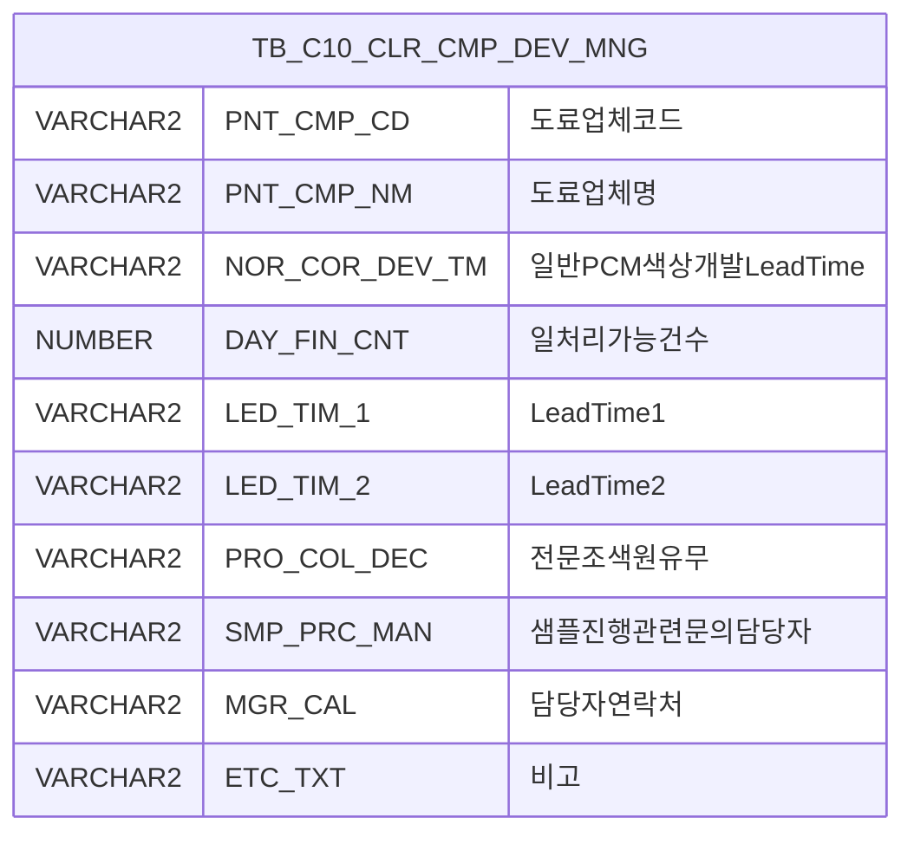

<h1 style="font-size: 40px; text-align: center; font-weight:
   bold; margin: 30px 0;">
  C106000010pop02 레거시 시스템 분석 종합 보고서
</h1>


# 1. 시스템 개요
- **서비스 ID**: C106000010pop02
- **업무명**: 도료사별 색상개발 담당 조회 팝업
- **분석 일시**: 2026-03-17 08:45 (KST)
- **분석 시간**: 약 3분
- **전체 Activity 수**: 2 (Built-in: PosDefaultRouter, FormSearch)
- **분석자**: Claude Opus 4.6 / Sonnet
- **분석 도구**: /analyze-service C106000010pop02
- **문서 버전**: 1.0

# 📊 비즈니스 프로세스 분석

## 시스템 목적

본 서비스는 CCL(Color Coating Line) 공정의 도료 관리 화면(`C106000010`)에서 호출되는 팝업 화면으로, **도료업체별 색상개발 담당자 정보를 조회**하는 기능을 제공한다.

도료업체(페인트 공급사)마다 일반 PCM 색상개발 Lead Time, 일일 처리 가능 건수, 전문 조색원 유무, 샘플 진행 관련 문의 담당자 및 연락처 등 색상개발 관련 핵심 정보를 한눈에 확인할 수 있다. CCL 공정 운영자가 신규 색상 개발 요청 시 업체별 역량과 담당자 정보를 빠르게 파악하여 적절한 도료업체를 선정하는 데 활용된다.

단순 조회 전용 팝업으로, 데이터 수정/저장 기능 없이 `TB_C10_CLR_CMP_DEV_MNG` 테이블의 전체 데이터를 조회하여 Grid에 표시한다.

## 주요 유즈케이스

### UC-01: 도료업체별 색상개발 담당 정보 조회

- **Actor**: CCL 공정 운영자 / 색상개발 담당자
- **목적**: 도료업체별 색상개발 Lead Time, 처리 건수, 담당자 연락처 등을 조회하여 업체 선정 및 업무 연락에 활용

- **전제조건**:
  - 사용자가 C106000010(도료 관리) 화면에서 팝업을 호출함
  - TB_C10_CLR_CMP_DEV_MNG 테이블에 업체 정보가 등록되어 있음

- **주요 흐름**:
  1. 사용자가 도료 관리 화면에서 팝업 호출
  2. 팝업 화면 로드 시 Grid의 onLoadedGrid 이벤트로 자동 조회 실행
  3. C106000010pop02.select 쿼리로 TB_C10_CLR_CMP_DEV_MNG 전체 데이터 조회
  4. Grid에 업체코드, 업체명, Lead Time, 처리건수, 담당자 정보 등 표시

- **대체 흐름**:
  - 조회 결과가 없는 경우: 빈 Grid 표시
  - 사용자가 "조회" 버튼 재클릭: 동일 쿼리 재실행하여 최신 데이터 반영

- **후행조건**:
  - Grid에 도료업체별 색상개발 정보가 표시됨
  - 사용자가 필요한 업체 담당자 연락처를 확인 가능

### UC-02: Grid 데이터 활용 (컨텍스트 메뉴)

- **Actor**: CCL 공정 운영자
- **목적**: 조회된 업체 정보를 엑셀로 내보내거나 필터링하여 활용

- **전제조건**:
  - Grid에 데이터가 로드되어 있음

- **주요 흐름**:
  1. Grid 영역에서 우클릭하여 컨텍스트 메뉴 호출
  2. "Excel" 메뉴 선택 시 Grid 데이터를 엑셀 파일로 내보내기
  3. "헤더 필터" 메뉴 선택 시 컬럼별 필터링 활성화
  4. "컬럼 이동" 메뉴 선택 시 컬럼 순서 변경 가능

- **대체 흐름**:
  - "편집 모드 토글" 선택 시: Grid 편집 모드 전환 (단, 모든 컬럼이 ro 타입이므로 실질적 편집 불가)

- **후행조건**:
  - 엑셀 파일 다운로드 또는 필터 적용 상태의 Grid 표시

### UC-03: 팝업 닫기

- **Actor**: CCL 공정 운영자
- **목적**: 정보 확인 완료 후 팝업을 닫고 부모 화면으로 복귀

- **전제조건**:
  - 팝업 화면이 열려 있음

- **주요 흐름**:
  1. "닫기" 버튼 클릭
  2. winClose 이벤트 발생
  3. 팝업 윈도우 종료
  4. 부모 화면(C106000010)으로 포커스 복귀

- **대체 흐름**:
  - 브라우저 X 버튼으로 닫기: 동일하게 팝업 종료

- **후행조건**:
  - 팝업 윈도우가 닫힘
  - 부모 화면이 활성화됨

---
## 비즈니스 로직 상세

본 서비스는 단순 전체 조회 서비스로, SQL에 특별한 계산/변환 로직이 없다. `TB_C10_CLR_CMP_DEV_MNG` 테이블의 10개 컬럼을 그대로 SELECT하여 표시하는 구조이다.

---

# 💾 데이터 요구사항

## 핵심 테이블

### 1. TB_C10_CLR_CMP_DEV_MNG - (도료업체별 색상개발 관리)

| 컬럼명 | 타입 | PK | 설명 |
|--------|------|----|------|
| PNT_CMP_CD | VARCHAR2 | | 도료업체코드 |
| PNT_CMP_NM | VARCHAR2 | | 도료업체명 |
| NOR_COR_DEV_TM | VARCHAR2 | | 일반PCM 색상개발 Lead Time (WorkingDay 기준) |
| DAY_FIN_CNT | NUMBER | | 일처리가능건수 (평균~MAX) |
| LED_TIM_1 | VARCHAR2 | | Lead Time(1) |
| LED_TIM_2 | VARCHAR2 | | Lead Time(2) |
| PRO_COL_DEC | VARCHAR2 | | 전문조색원 유무 |
| SMP_PRC_MAN | VARCHAR2 | | 샘플진행관련 문의 담당자 |
| MGR_CAL | VARCHAR2 | | 담당자 연락처 |
| ETC_TXT | VARCHAR2 | | 비고 |

## 데이터 플로우

### 1. 조회

```
[팝업 로드 시 자동 조회 / 조회 버튼 클릭]
화면 진입 (또는 조회 버튼 클릭)
→ C106000010pop02.select
  FROM TB_C10_CLR_CMP_DEV_MNG
  (조건 없이 전체 조회)
→ Grid에 도료업체별 색상개발 담당 정보 표시
```

## SQL 일람표

| SQL 이름 | 쿼리 ID | 타입 | 출처 | 테이블 |
|---------|---------|------|------|--------|
| 도료업체별 색상개발 담당자 조회 | C106000010pop02.select | SELECT | Service | TB_C10_CLR_CMP_DEV_MNG |

## ER 다이어그램 (핵심 관계)



관계 설명:
- TB_C10_CLR_CMP_DEV_MNG는 단일 테이블로 다른 테이블과의 JOIN 없이 독립적으로 사용됨
- PNT_CMP_CD(도료업체코드)가 사실상 식별 키 역할 수행

---

# 🖥️ 사용자 인터페이스 요구사항

## 화면 레이아웃 상세

### Layout 구조 (절대 위치 기반)
```javascript
// initLayout 미사용, 절대 위치(absolute) 기반 배치
// 총 크기: 830px x 357px (팝업 윈도우)
{
  components: [
    {
      id: "C106000010pop02_Form_1",
      type: "form",
      position: { left: 0, top: 0 },
      size: { width: 830, height: 35 }
    },
    {
      id: "C106000010pop02_Grid_1",
      type: "grid",
      position: { left: 1, top: 35 },
      size: { width: 827, height: 301 }
    },
    {
      id: "C106000010pop02_messagebox",
      type: "messagebox",
      position: { left: 0, top: 338 },
      size: { width: 828, height: 19 }
    }
  ]
}
```

## 입출력 요소

### Form 컴포넌트
**C106000010pop02_Form_1** (높이 35px, 버튼 우측 정렬)
- find: Button - "조회" → Grid 데이터 로드 (find 커맨드)
- winClose: Button - "닫기" → 팝업 윈도우 종료 (winClose 커맨드)

### Grid 컴포넌트

**C106000010pop02_Grid_1 (도료업체 색상개발 정보)**
- 편집 가능 여부: 아니오 (전 컬럼 ro - 읽기 전용)
- Split: 없음
- 멀티셀렉트: 예
- 컨텍스트 메뉴: 예 (컬럼이동, 헤더필터, 편집모드, Excel)
- 페이지셋: 예
- 스마트 렌더링: 예
- 주요 컬럼 (10개):

  **업체 기본 정보**:
  - PNT_CMP_CD: ro - 업체코드 (8%, 중앙정렬)
  - PNT_CMP_NM: ro - 업체명 (17%, 좌측정렬)

  **Lead Time 정보**:
  - NOR_COR_DEV_TM: ro - 일반PCM색상개발LeadTime (WorkingDay 기준) (15%, 중앙정렬)
  - DAY_FIN_CNT: ro - 일처리가능건수 (평균~MAX) (12%, 중앙정렬)
  - LED_TIM_1: ro - Lead Time(1) (6.5%, 중앙정렬)
  - LED_TIM_2: ro - Lead Time(2) (6.5%, 중앙정렬)

  **담당자 정보**:
  - PRO_COL_DEC: ro - 전문조색원 유무 (9%, 중앙정렬)
  - SMP_PRC_MAN: ro - 샘플진행관련 문의 담당자 (10%, 중앙정렬)
  - MGR_CAL: ro - 담당자연락처 (10.5%, 좌측정렬)

  **기타**:
  - ETC_TXT: ro - 비고 (6%, 중앙정렬)

### Messagebox 컴포넌트
**C106000010pop02_messagebox** (높이 19px)
- 상태 메시지 표시 영역

## 화면 동작 흐름

### 1. 화면 초기 로딩 (팝업 오픈)
```
1. 부모 화면(C106000010)에서 팝업 호출
2. 팝업 윈도우 생성 (830 x 357px)
3. Form, Grid, Messagebox 컴포넌트 초기화
4. Grid의 onLoadedGrid(XLE) 이벤트 발생
5. 부모 화면의 findUrl을 이용하여 자동 조회 실행
   - C106000010pop02.select (TB_C10_CLR_CMP_DEV_MNG 전체 조회)
6. Grid에 도료업체별 색상개발 정보 표시
7. onLoadedGrid 이벤트 detach (무한루프 방지)
8. 상태바 초기화
```

### 2. 수동 조회 (조회 버튼 클릭)
```
1. 사용자가 "조회" 버튼 클릭
2. find 커맨드 실행
3. Form의 referenceItem(Grid_1)에 대해 loadData(findUrl) 호출
4. C106000010pop02.select 쿼리 실행
5. Grid 데이터 갱신
6. findMessage 콜백으로 상태바에 결과 메시지 표시
   - uiCommon.message('C106000010pop02_messagebox', appMsg)
```

### 3. 컨텍스트 메뉴 기능
```
1. Grid 영역에서 우클릭
2. 컨텍스트 메뉴 표시
3. 메뉴 항목 선택:
   - "컬럼이동" (move_grid): enableColumnMove 토글
   - "헤더필터" (filter_grid): enableHeaderMenu 활성화
   - "편집모드" (editable_grid): setEditable 토글
   - "Excel" (excel_grid): toExcel('/gridexcel','color') 호출 → 엑셀 다운로드
```

## JavaScript 모듈

**C106000010pop02.jsp** (인라인 스크립트)
- find: Form 조회 버튼 이벤트 → items[referenceItem].loadData(findUrl) 호출
- winClose: 팝업 윈도우 닫기
- save: Grid 데이터 저장 전송 (items[referenceItem].sendGrid)
- refresh: Grid 초기화 후 재조회 (clearDataProcess + loadData)
- add: Grid 신규 행 추가 (items[referenceItem].addRow)
- remove: Grid 선택 행 삭제 (items[referenceItem].removeRow)
- copy: Grid 행 클립보드 복사 (items[referenceItem].copyRowContent)
- undo/redo: Grid 변경 취소/재실행
- onLoadedGrid: Grid 로드 완료 시 자동 조회 + 이벤트 detach
- onGridContextMenuClick: 컨텍스트 메뉴 처리 (컬럼이동/필터/편집/Excel)
- findMessage: 상태바 메시지 표시 (uiCommon.message)
- onFormLoadEvent: Form 로드 완료 시 이벤트 detach

## 주요 이벤트 핸들러

**onLoadedGrid (Grid 초기 로드 자동 조회)**
- 이벤트 타입: Grid XLE (XML Loaded Event)
- 처리 내용:
  1. Grid XML 로드 완료 감지
  2. 부모 화면의 findUrl로 loadData 자동 호출
  3. _onXLE 이벤트 detach (1회성 실행, 무한루프 방지)

**onGridContextMenuClick (Grid 컨텍스트 메뉴)**
- 이벤트 타입: Context Menu Click
- 처리 내용:
  1. 선택된 메뉴 ID 확인 (move_grid, filter_grid, editable_grid, excel_grid)
  2. 해당 기능 토글 또는 실행
  3. move_grid: 드래그 기반 컬럼 이동 활성화/비활성화
  4. filter_grid: 헤더 필터 메뉴 활성화
  5. excel_grid: toExcel('/gridexcel', 'color')로 엑셀 내보내기

---

# 📌 특이사항 및 주의사항

## 1. 읽기 전용 팝업에 편집 관련 이벤트 존재
- **save, add, remove, undo, redo 이벤트**: Grid의 모든 컬럼이 `ro`(읽기 전용)임에도 불구하고 save, add, remove, copy, undo, redo 등 편집 관련 이벤트 핸들러가 정의되어 있다. 이는 GLUE Framework의 공통 JSP 템플릿에서 자동 생성되는 표준 이벤트로, 실제로는 사용되지 않는다.

## 2. 컨텍스트 메뉴의 편집 모드 토글
- **editable_grid 메뉴**: 컨텍스트 메뉴에서 "편집모드" 토글이 가능하지만, 모든 컬럼이 `ro` 타입이므로 편집 모드로 전환해도 실제 데이터 수정은 불가능하다. UX 관점에서 불필요한 메뉴 항목이 노출되는 상태이다.

## 3. 조건 없는 전체 테이블 스캔
- **C106000010pop02.select**: WHERE 조건 없이 TB_C10_CLR_CMP_DEV_MNG 테이블을 전체 조회한다. 현재 도료업체 수가 적어 성능 문제가 없으나, 데이터가 증가할 경우 페이징 또는 조건 검색 추가를 고려해야 한다.

## 4. 부모 화면 의존적 자동 조회
- **onLoadedGrid**: Grid 로드 시 부모 화면(C106000010)의 `parentFindUrl`을 사용하여 자동 조회를 실행한다. 부모 화면 없이 독립 호출 시 자동 조회가 실패할 수 있다.

## 5. Grid 컬럼 너비 퍼센트(%) 단위 사용
- **colwidth: "%"**: Grid 설정에서 컬럼 너비를 퍼센트(%) 단위로 지정하여 팝업 윈도우 크기에 비례하여 컬럼이 자동 조정된다. 총합이 약 100.5%로 소수점 오차가 존재한다.

---

# 📚 참고 문서

- **Service XML**: `src/service/C106000010pop02-service.xml`
- **Query SQL**: `src/query/C106000010pop02-query.glue_sql`
- **JSP**: `WebContents/C106000010pop02.jsp`
- **Grid XML**: `WebContents/header/kr/C106000010pop02/C106000010pop02_Grid_1.xml`
- **Form XML**: `WebContents/header/kr/C106000010pop02/C106000010pop02_Form_1.xml`
- **Messagebox XML**: `WebContents/header/kr/C106000010pop02/C106000010pop02_messagebox.xml`
