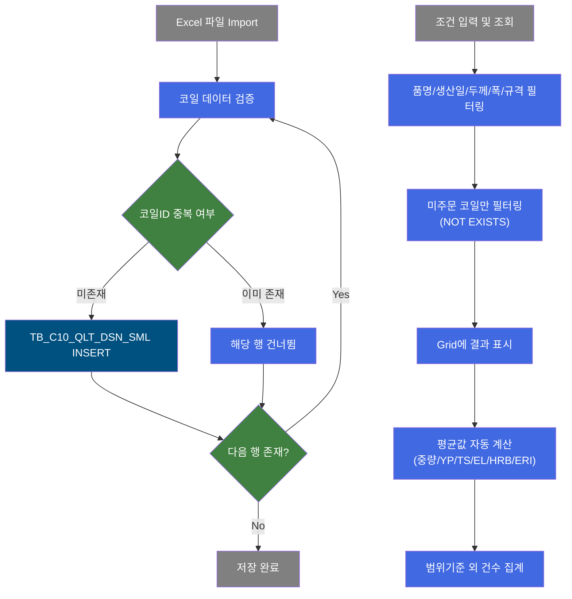
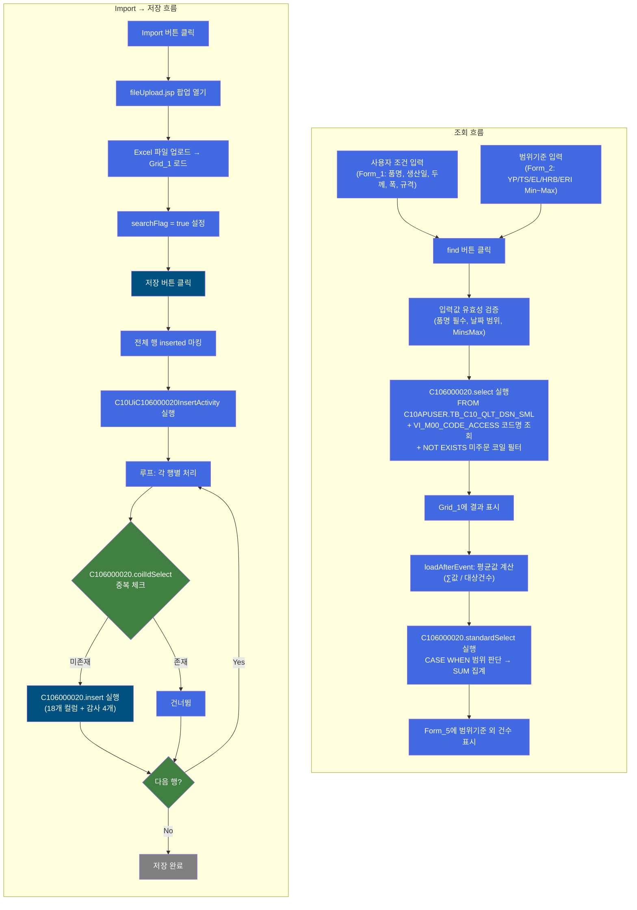
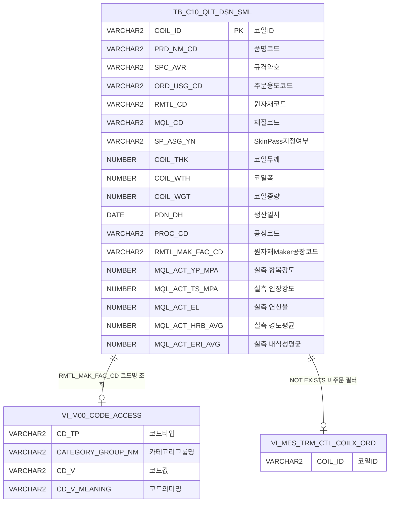

<h1 style="font-size: 40px; text-align: center; font-weight:
   bold; margin: 30px 0;">
  C106000020 품질설계시뮬레이션 레거시 시스템 분석 종합 보고서
</h1>


# 1. 시스템 개요
- **서비스 ID**: C106000020
- **업무명**: 품질설계시뮬레이션
- **분석 일시**: 2026-03-17 08:52 KST
- **분석 시간**: 약 5분
- **전체 Activity 수**: 5개 (Built-in 4개, Custom 1개)
- **분석자**: Claude Opus 4.6 / Sonnet (subagent)
- **분석 도구**: /analyze-service C106000020
- **문서 버전**: 1.0

# 📊 비즈니스 프로세스 분석

## 시스템 목적

품질설계시뮬레이션 화면은 생산된 코일의 품질 실측 데이터(항복강도 YP, 인장강도 TS, 연신율 EL, 경도 HRB, 내식성 ERI)를 Excel에서 Import하여 시뮬레이션 테이블(`TB_C10_QLT_DSN_SML`)에 저장하고, 다양한 조건으로 조회·분석하는 기능을 제공한다.

사용자는 품명, 생산일, 두께/폭 범위, 규격약호, 공정 등 복합 조건으로 코일을 검색하며, 범위기준(YP/TS/EL/HRB/ERI의 Min~Max)을 설정하여 기준 외 건수를 집계할 수 있다. 이를 통해 품질설계 담당자가 생산 코일의 품질 분포를 파악하고, 설계 규격 범위의 적정성을 검증하는 시뮬레이션을 수행한다.

특히, 주문이 아직 배정되지 않은 미주문 코일만을 대상으로 하며(NOT EXISTS 조건), Excel Import 시 COIL_ID 중복을 자동으로 건너뛰는 Upsert-guard 패턴을 적용하여 데이터 무결성을 보장한다.

## 핵심 워크플로우 다이어그램



### 상세 워크플로우 다이어그램



## 주요 유즈케이스

### UC-01: 품질설계 시뮬레이션 데이터 조회
- **Actor**: 품질설계 담당자
- **목적**: 생산된 코일 중 미주문 코일의 품질 실측 데이터를 다양한 조건으로 검색하여 품질 분포를 파악

- **전제조건**:
  - 사용자가 시스템에 로그인되어 있음
  - TB_C10_QLT_DSN_SML 테이블에 시뮬레이션 데이터가 존재함
  - 품명 마스터 데이터(SZ0000 카테고리)가 등록되어 있음

- **주요 흐름**:
  1. 화면 진입 시 품명/생산공정/S/P 콤보 마스터 데이터 자동 로드 (SZ0000 카테고리)
  2. 생산일 초기값 자동 설정 (시작: 전일, 종료: 당일)
  3. 사용자가 품명(필수), 생산일 범위, 두께/폭 범위, 규격약호, 주문용도, 공정, S/P 조건 입력
  4. 조회 버튼 클릭 → 입력값 유효성 검증 (품명 필수, 날짜 범위 등)
  5. C106000020.select 쿼리 실행 → Grid_1에 코일 목록 표시 (18개 컬럼)
  6. loadAfterEvent 콜백에서 평균값 자동 계산 (대상건수, 평균중량, YP/TS/EL/HRB/ERI 평균) → Form_3에 표시

- **대체 흐름**:
  - 조회 결과 없음: "조회된 데이터가 없습니다" 메시지 표시
  - 품명 미선택: 조회 불가 (필수 검증)

- **후행조건**:
  - Grid_1에 미주문 코일 데이터 표시
  - Form_3에 평균값 표시

### UC-02: 범위기준 외 건수 집계
- **Actor**: 품질설계 담당자
- **목적**: 설정한 품질 범위 기준(YP/TS/EL/HRB/ERI)에서 벗어난 코일 건수를 파악하여 설계 규격의 적정성 검증

- **전제조건**:
  - UC-01 조회가 선행 완료됨
  - Form_2에 범위기준 Min/Max 값이 입력됨

- **주요 흐름**:
  1. 사용자가 Form_2 범위기준 필드셋에 YP/TS/EL/HRB/ERI의 Min~Max 값 입력
  2. 조회 버튼 클릭 시 C106000020.standardSelect 쿼리 동시 실행
  3. 각 항목별 CASE WHEN으로 범위 내/외 판단 → SUM으로 기준 외 건수 집계
  4. Form_5에 YP/TS/EL/HRB/ERI별 기준 외 건수 표시

- **대체 흐름**:
  - 범위 미입력 시: NVL로 기본값 적용 (YP/TS: -1~1000, EL/HRB/ERI: -1~100)
  - Min > Max 입력 시: 유효성 검증에서 차단

- **후행조건**:
  - Form_5에 각 항목별 범위기준 외 건수 표시

### UC-03: Excel Import 및 시뮬레이션 데이터 저장
- **Actor**: 품질설계 담당자
- **목적**: Excel 파일에서 코일 품질 데이터를 Import하여 시뮬레이션 테이블에 저장

- **전제조건**:
  - Import할 Excel 파일이 준비되어 있음
  - Excel 파일 형식이 18개 컬럼 규격에 맞음

- **주요 흐름**:
  1. Import 버튼 클릭 → fileUpload.jsp 팝업(465x305) 열기
  2. Excel 파일 선택 및 업로드
  3. Grid_1에 Import된 데이터 표시, searchFlag = true 설정
  4. 저장 버튼 클릭 → 확인 다이얼로그 표시
  5. 전체 행을 inserted 상태로 마킹
  6. C10UiC106000020InsertActivity 실행:
     - 각 행별로 C106000020.coilIdSelect로 COIL_ID 중복 체크
     - 미존재 시 C106000020.insert로 18개 컬럼 + 감사 컬럼 INSERT
     - 이미 존재 시 해당 행 건너뜀
  7. 저장 완료 메시지 표시

- **대체 흐름**:
  - Import 전 저장 시도: searchFlag = false이므로 저장 불가
  - 코일 ID 중복: 해당 행 건너뛰고 계속 진행
  - 데이터 오류: PosException("{COIL_ID}데이타 오류입니다.") 발생

- **후행조건**:
  - 신규 코일 데이터가 TB_C10_QLT_DSN_SML에 저장됨
  - 그리드 상태 초기화 (updated → false)

### UC-04: 그리드 컨텍스트 메뉴 기능
- **Actor**: 품질설계 담당자
- **목적**: 그리드 데이터를 Excel로 내보내거나 셀 값을 클립보드에 복사

- **전제조건**:
  - Grid_1에 데이터가 조회되어 있음

- **주요 흐름**:
  1. Grid_1에서 우클릭 → 컨텍스트 메뉴 표시
  2. "엑셀 다운로드" 선택 → gridObj.toExcel('/gridexcel', 'color') 실행
  3. 또는 "셀 복사" 선택 → gridObj.cellToClipboard(rowId, cellInd) 실행

- **대체 흐름**: 없음

- **후행조건**:
  - Excel 파일 다운로드 또는 클립보드에 셀 값 복사

---
## 비즈니스 로직 상세

### 1. Excel Import 코일 데이터 저장 (C10UiC106000020InsertActivity)

- **목적**: Excel에서 Import된 코일 품질 실측 데이터를 시뮬레이션 테이블에 저장하되 중복을 방지

- **처리 케이스**:

  **[케이스 1: 신규 코일 INSERT]**
  ```
    조건: C106000020.coilIdSelect 결과가 null 또는 0건 (해당 COIL_ID 미존재)
    처리:
      1. PosContext에서 18개 컬럼 값 추출 (COIL_ID, PRD_NM_CD, SPC_AVR 등)
      2. PosParameter에 18개 컬럼 + 감사 컬럼(ObjectType, ObjectId, ProgramId, Timestamp) 설정
      3. C106000020.insert 실행 → TB_C10_QLT_DSN_SML에 INSERT
      4. idx(성공 카운터) 증가
  ```

  **[케이스 2: 중복 코일 건너뜀]**
  ```
    조건: C106000020.coilIdSelect 결과 1건 이상 (해당 COIL_ID 이미 존재)
    처리:
      1. INSERT 수행하지 않음
      2. 다음 행으로 진행
  ```

  **[케이스 3: 오류 발생]**
  ```
    조건: IDS가 null 또는 빈 배열, 또는 처리 중 Exception 발생
    처리:
      1. IDS 미존재 시: PosException("IDS가 존재하지 않습니다.") throw
      2. 기타 오류 시: PosException("{COIL_ID[idx]}데이타 오류입니다.") throw
      3. System.out.println 및 logger.logDebug로 에러 로그 출력
  ```

- **예외 처리**:
  - IDS 파라미터 없음: PosException("IDS가 존재하지 않습니다.") - 즉시 중단
  - 데이터 처리 오류: PosException("{COIL_ID}데이타 오류입니다.") - 오류 코일 ID 식별 가능
  - 트랜잭션 롤백은 프레임워크 상위에서 처리 (Activity 내 rollbackTransaction 미호출)

### 2. 범위기준 외 건수 집계 로직 (SQL 기반)

- **목적**: 사용자가 설정한 품질 범위 기준에서 벗어난 코일 건수를 항목별로 집계

- **처리 케이스**:

  **[케이스 1: 범위 내/외 판단 및 집계]**
  ```
    조건: 각 품질 항목(YP, TS, EL, HRB, ERI)별로 Min~Max 범위 설정
    처리:
      1. CASE WHEN으로 각 항목이 범위 내이면 0, 외이면 1 반환
      2. SUM으로 범위 외 건수 집계
      3. NVL로 범위 미입력 시 기본값 적용
  ```

- **계산 공식**:
  ```
  범위기준 외 건수(YP) = SUM(CASE WHEN (MQL_ACT_YP_MPA >= NVL(:MIN, -1)
                           AND MQL_ACT_YP_MPA <= NVL(:MAX, 1000)) THEN 0 ELSE 1 END)

  동일 패턴으로 TS, EL, HRB, ERI 각각 집계

  기본 범위값:
  - YP, TS: -1 ~ 1000
  - EL, HRB, ERI: -1 ~ 100
  ```

### 3. 미주문 코일 필터링 (SQL 기반)

- **목적**: 이미 주문이 배정된 코일을 제외하고 미주문 코일만 조회

- **처리 케이스**:

  **[케이스 1: NOT EXISTS 서브쿼리]**
  ```
    조건: 조회 대상 코일에 주문 매핑 정보가 없음
    처리:
      1. MESAPUSER.VI_MES_TRM_CTL_COILX_ORD 뷰에서 COIL_ID 존재 여부 확인
      2. NOT EXISTS이면 조회 대상에 포함
      3. EXISTS이면 제외
  ```

### 4. 원자재 Maker 공장 코드명 변환 (SQL 기반)

- **목적**: 원자재 Maker 공장 코드를 코드명과 함께 표시

- **처리 케이스**:

  **[케이스 1: 스칼라 서브쿼리 코드 변환]**
  ```
    조건: RMTL_MAK_FAC_CD 값이 존재
    처리:
      1. M00APUSER.VI_M00_CODE_ACCESS 뷰에서 CD_TP='RMTL_MAK_FAC_CD', CATEGORY_GROUP_NM='SZ0000' 조건 조회
      2. RMTL_MAK_FAC_CD || ' : ' || CD_V_MEANING 형태로 코드+코드명 결합 표시
  ```

### 5. 클라이언트 평균값 계산 (JavaScript)

- **목적**: 조회된 코일 데이터의 품질 항목 평균값을 클라이언트에서 계산하여 표시

- **계산 공식**:
  ```
  대상건수(TOTAL_CNT) = Grid_1의 총 행 수
  평균중량(AVG_WGT) = ∑(COIL_WGT) / 대상건수
  YP평균(YP_AVG) = ∑(MQL_ACT_YP_MPA) / 대상건수
  TS평균(TS_AVG) = ∑(MQL_ACT_TS_MPA) / 대상건수
  EL평균(EL_AVG) = ∑(MQL_ACT_EL) / 대상건수
  HRB평균(HRB_AVG) = ∑(MQL_ACT_HRB_AVG) / 대상건수
  ERI평균(ERI_AVG) = ∑(MQL_ACT_ERI_AVG) / 대상건수
  ```

---

# ⚙️ Java 컴포넌트 분석

## Custom Activity 상세 분석

### 1개 Custom Activity 발견

### 1. C10UiC106000020InsertActivity (저장)
- **클래스명**: com.unionsteel.mes.c10.activity.ui.C10UiC106000020InsertActivity
- **액티비티명**: 저장
- **파일 경로**: src/com/unionsteel/mes/c10/activity/ui/C10UiC106000020InsertActivity.java
- **주요 기능**: Excel Import 코일 데이터를 TB_C10_QLT_DSN_SML에 저장 (Upsert-guard 패턴)
- **라인 수**: 239 라인 | **메소드 수**: 4개

> 품질설계 시뮬레이션 데이터를 Excel에서 Import하여 `TB_C10_QLT_DSN_SML` 테이블에 저장하는 Activity이다. 화면 그리드에서 넘어온 코일 데이터를 행별로 순회하며, 각 코일 ID의 중복 여부를 먼저 조회한 후 미존재 시에만 INSERT를 수행하는 Upsert-guard 패턴을 사용한다.

📎 **[상세 분석 보고서](../customClass/com.unionsteel.mes.c10.activity.ui.C10UiC106000020InsertActivity_class_analysis.md)**

---

# 💾 데이터 요구사항

## 핵심 테이블

### 1. TB_C10_QLT_DSN_SML (C10APUSER) - 품질설계시뮬레이션

| 컬럼명 | 타입 | PK | 설명 |
|--------|------|----|-----|
| COIL_ID | VARCHAR2 | ✅ | 코일ID |
| PRD_NM_CD | VARCHAR2 | | 품명코드 |
| SPC_AVR | VARCHAR2 | | 규격약호 |
| ORD_USG_CD | VARCHAR2 | | 주문용도코드 |
| RMTL_CD | VARCHAR2 | | 원자재코드 |
| MQL_CD | VARCHAR2 | | 재질코드 |
| SP_ASG_YN | VARCHAR2 | | SkinPass 지정 여부 |
| COIL_THK | NUMBER | | 코일두께 |
| COIL_WTH | NUMBER | | 코일폭 |
| COIL_WGT | NUMBER | | 코일중량 |
| PDN_DH | DATE | | 생산일시 |
| PROC_CD | VARCHAR2 | | 공정코드 |
| RMTL_MAK_FAC_CD | VARCHAR2 | | 원자재Maker공장코드 |
| MQL_ACT_YP_MPA | NUMBER | | 실측 항복강도 (MPa) |
| MQL_ACT_TS_MPA | NUMBER | | 실측 인장강도 (MPa) |
| MQL_ACT_EL | NUMBER | | 실측 연신율 |
| MQL_ACT_HRB_AVG | NUMBER | | 실측 경도 평균 |
| MQL_ACT_ERI_AVG | NUMBER | | 실측 내식성 평균 |
| CREATED_OBJECT_TYPE | VARCHAR2 | | 등록 오브젝트 타입 |
| CREATED_OBJECT_ID | VARCHAR2 | | 등록자 ID |
| CREATED_PROGRAM_ID | VARCHAR2 | | 등록 프로그램 ID |
| CREATION_TIMESTAMP | DATE | | 등록 일시 |
| LAST_UPDATED_OBJECT_TYPE | VARCHAR2 | | 수정 오브젝트 타입 |
| LAST_UPDATED_OBJECT_ID | VARCHAR2 | | 수정자 ID |
| LAST_UPDATE_PROGRAM_ID | VARCHAR2 | | 수정 프로그램 ID |
| LAST_UPDATE_TIMESTAMP | DATE | | 수정 일시 |

### 2. M00APUSER.VI_M00_CODE_ACCESS - 코드 마스터 뷰 (참조)

| 컬럼명 | 타입 | PK | 설명 |
|--------|------|----|-----|
| CD_TP | VARCHAR2 | | 코드 타입 |
| CATEGORY_GROUP_NM | VARCHAR2 | | 카테고리 그룹명 |
| CD_V | VARCHAR2 | | 코드 값 |
| CD_V_MEANING | VARCHAR2 | | 코드 의미명 |

### 3. MESAPUSER.VI_MES_TRM_CTL_COILX_ORD - 코일-주문 매핑 뷰 (참조)

| 컬럼명 | 타입 | PK | 설명 |
|--------|------|----|-----|
| COIL_ID | VARCHAR2 | | 코일ID (NOT EXISTS 조건에 사용) |

## 데이터 플로우

### 1. 조회 (품질설계 시뮬레이션 데이터)
```
[조건 기반 코일 목록 조회]
조회 버튼 클릭
→ C106000020.select
  FROM C10APUSER.TB_C10_QLT_DSN_SML A
  스칼라 서브쿼리: M00APUSER.VI_M00_CODE_ACCESS (원자재Maker공장 코드명)
  NOT EXISTS: MESAPUSER.VI_MES_TRM_CTL_COILX_ORD (미주문 코일만)
  WHERE PRD_NM_CD LIKE :PRD_NM_CD
    AND PDN_DH BETWEEN :PDN_DH_START AND :PDN_DH_END + 1
    AND COIL_THK BETWEEN :COIL_THK_MIN AND :COIL_THK_MAX
    AND COIL_WTH BETWEEN :COIL_WTH_MIN AND :COIL_WTH_MAX
    AND SPC_AVR LIKE :SPC_AVR%
    AND ORD_USG_CD LIKE :ORD_USG_CD%
    AND PROC_CD LIKE :PROC_CD%
    AND SP_ASG_YN LIKE :SP_ASG_YN%
→ Grid_1에 코일 목록 표시 (18개 컬럼)
→ loadAfterEvent: 평균값 계산 → Form_3에 표시
```

### 2. 범위기준 외 건수 조회
```
[범위기준 외 건수 집계]
조회 버튼 클릭 (동시 실행)
→ C106000020.standardSelect
  FROM C10APUSER.TB_C10_QLT_DSN_SML
  WHERE (동일 필터 조건)
  SUM(CASE WHEN ... THEN 0 ELSE 1 END) × 5개 항목
→ Form_5에 YP/TS/EL/HRB/ERI별 기준 외 건수 표시
```

### 3. 코일 중복 체크
```
[Import 저장 시 중복 확인]
각 행별 반복
→ C106000020.coilIdSelect
  FROM C10APUSER.TB_C10_QLT_DSN_SML
  WHERE COIL_ID = :COIL_ID
→ 결과 존재 시 건너뜀, 미존재 시 INSERT 진행
```

### 4. 저장 (INSERT)
```
[신규 코일 데이터 저장]
중복 체크 통과 후
→ C106000020.insert
  INSERT INTO TB_C10_QLT_DSN_SML
  (18개 업무 컬럼 + 4개 감사 컬럼)
  VALUES(:COIL_ID, :PRD_NM_CD, ... :Timestamp)
→ 저장 완료
```

## SQL 일람표

| SQL 이름 | 쿼리 ID | 타입 | 출처 | 테이블 |
|---------|---------|-----|-------|-------|
| 품질설계 시뮬레이션 조회 | C106000020.select | SELECT | Service | TB_C10_QLT_DSN_SML, VI_M00_CODE_ACCESS, VI_MES_TRM_CTL_COILX_ORD |
| 코일ID 중복 조회 | C106000020.coilIdSelect | SELECT | Service / Java | TB_C10_QLT_DSN_SML |
| 범위기준 외 건수 조회 | C106000020.standardSelect | SELECT | Service | TB_C10_QLT_DSN_SML |
| 코일 데이터 INSERT | C106000020.insert | INSERT | Java (C10UiC106000020InsertActivity) | TB_C10_QLT_DSN_SML |

## ER 다이어그램 (핵심 관계)



관계 설명:
- **TB_C10_QLT_DSN_SML**이 중심 테이블로 품질설계 시뮬레이션 데이터 저장
- **VI_M00_CODE_ACCESS**: RMTL_MAK_FAC_CD 코드를 코드명으로 변환하는 참조 관계 (스칼라 서브쿼리)
- **VI_MES_TRM_CTL_COILX_ORD**: 주문 배정 여부 확인용 뷰 (NOT EXISTS 조건으로 미주문 코일만 필터링)

---

# 🖥️ 사용자 인터페이스 요구사항

## 화면 레이아웃 상세

### Layout 구조 (Absolute Positioning)
```javascript
{
  itemType: "layout",
  dirType: "row",  // 절대 위치 기반 수직 배치
  totalWidth: "981px",
  totalHeight: "586px",
  components: [
    {
      id: "C106000020_Form_1",
      type: "form",
      position: { top: "0px" },
      height: "91px",
      label: "검색조건 폼"
    },
    {
      id: "C106000020_Form_2",
      type: "form",
      position: { top: "96px" },
      height: "65px",
      label: "범위기준 검색조건 폼",
      backgroundColor: "#D6E8FF"
    },
    {
      id: "C106000020_Grid_1",
      type: "grid",
      position: { top: "165px" },
      height: "320px",
      label: "품질설계시뮬레이션 그리드"
    },
    {
      id: "C106000020_Form_3",
      type: "form",
      position: { top: "494px", left: "0px" },
      width: "566px",
      height: "76px",
      label: "평균값 폼"
    },
    {
      id: "C106000020_Form_4",
      type: "form",
      position: { top: "494px", left: "590px" },
      width: "300px",
      height: "25px",
      label: "범위기준 외 건수 타이틀"
    },
    {
      id: "C106000020_Form_5",
      type: "form",
      position: { top: "523px", left: "590px" },
      width: "300px",
      height: "28px",
      label: "범위기준 외 건수 폼"
    },
    {
      id: "C106000020_messagebox",
      type: "messagebox",
      position: { top: "567px" },
      height: "19px",
      label: "메시지박스"
    }
  ]
}
```

## 입출력 요소

### Form 컴포넌트

**C106000020_Form_1 (검색조건 폼)**
- PRD_NM_CD: Combo - 품명 (필수, 배경색 #FFFFC0, 너비 100px)
- PDN_DH_START: Calendar - 생산일(시작) (너비 100px, 포맷 %Y-%m-%d)
- PDN_DH_END: Calendar - 생산일(종료) (너비 100px, 포맷 %Y-%m-%d)
- COIL_THK_MIN: Input - 두께(최소) (너비 90px)
- COIL_THK_MAX: Input - 두께(최대) (너비 90px)
- COIL_WTH_MIN: Input - 폭(최소) (너비 85px)
- COIL_WTH_MAX: Input - 폭(최대) (너비 85px)
- SPC_AVR: Input - 규격약호 (너비 100px)
- ORD_USG_CD: Input - 주문용도 (너비 100px) → 검색 아이콘 클릭 시 masterPopup 팝업
- PROC_CD: Combo - 생산공정 (너비 120px)
- SP_ASG_YN: Combo - S/P (너비 120px)
- Import: CustomButton - Excel Import
- 조회: Button - 조회 (초기 비활성)
- 저장: Button - 저장 (초기 비활성)
- 닫기: Button - 창 닫기

**C106000020_Form_2 (범위기준 폼, 배경색 #D6E8FF)**
- 필드셋 "범위기준":
  - MQL_ACT_YP_MPA_MIN / MAX: Input - YP(최소/최대) (각 65px)
  - MQL_ACT_TS_MPA_MIN / MAX: Input - TS(최소/최대) (각 65px)
  - MQL_ACT_EL_MIN / MAX: Input - EL(최소/최대) (각 65px)
  - MQL_ACT_HRB_AVG_MIN / MAX: Input - HRB(최소/최대) (각 65px)
  - MQL_ACT_ERI_AVG_MIN / MAX: Input - ERI(최소/최대) (각 65px)

**C106000020_Form_3 (평균값 폼, 읽기 전용)**
- TOTAL_CNT: Input - 대상건수 (80px, readOnly)
- AVG_WGT: Input - 평균중량 (80px, readOnly)
- YP_AVG: Input - YP (70px, readOnly)
- TS_AVG: Input - TS (70px, readOnly)
- EL_AVG: Input - EL (70px, readOnly)
- HRB_AVG: Input - HRB (70px, readOnly)
- ERI_AVG: Input - ERI (70px, readOnly)

**C106000020_Form_4 (범위기준 외 건수 타이틀)**
- std_title: Label - "범위기준 외 건수"

**C106000020_Form_5 (범위기준 외 건수)**
- MQL_ACT_YP_MPA_CNT: Input - YP (70px)
- MQL_ACT_TS_MPA_CNT: Input - TS (70px)
- MQL_ACT_EL_CNT: Input - EL (70px)
- MQL_ACT_HRB_AVG_CNT: Input - HRB (70px)
- MQL_ACT_ERI_AVG_CNT: Input - ERI (70px)

### Grid 컴포넌트

**C106000020_Grid_1 (품질설계시뮬레이션 그리드)**
- 편집 가능 여부: 아니오 (전체 ro 타입)
- Split: 0 (고정 컬럼 없음)
- 컬럼 너비 단위: % (전체 너비 대비 비율)
- 멀티헤더: 두께/폭 그룹 헤더
- 기능: multiselect, validation, rowspan, stableSorting, colSpan, contextmenu, pageset
- 주요 컬럼 (18개):

  **기본 식별 정보**:
  - COIL_ID: ro - 코일ID (10%, 중앙정렬, sort_str_custom)
  - PRD_NM_CD: ro - 품명코드 (7%, 중앙정렬, sort_str_custom)
  - SPC_AVR: ro - 규격약호 (15%, 중앙정렬, sort_str_custom)
  - ORD_USG_CD: ro - 주문용도 (10%, 중앙정렬, sort_str_custom)

  **원자재/재질 정보**:
  - RMTL_CD: ro - 원자재코드 (7%, 중앙정렬, sort_str_custom)
  - MQL_CD: ro - 재질코드 (7%, 중앙정렬, sort_str_custom)
  - SP_ASG_YN: ro - S/P (7%, 중앙정렬, sort_str_custom)

  **물리적 특성 (멀티헤더: 두께/폭)**:
  - COIL_THK: ro - 두께(제품) (7%, 우측정렬, sort_int_custom)
  - COIL_WTH: ro - 폭 (7%, 우측정렬, sort_int_custom, #cspan)

  **생산 정보**:
  - COIL_WGT: ron - 중량 (7%, 우측정렬, sort_int_custom, 포맷 0,000)
  - PDN_DH: ro - 생산일 (10%, 중앙정렬, sort_date_custom)
  - PROC_CD: ro - 생산공정 (7%, 중앙정렬, sort_str_custom)
  - RMTL_MAK_FAC_CD: ro - 원자재Maker공장코드 (20%, 좌측정렬, sort_str_custom)

  **품질 실측값**:
  - MQL_ACT_YP_MPA: ro - YP (7%, 우측정렬, sort_int_custom)
  - MQL_ACT_TS_MPA: ro - TS (7%, 우측정렬, sort_int_custom)
  - MQL_ACT_EL: ro - EL (7%, 우측정렬, sort_int_custom)
  - MQL_ACT_HRB_AVG: ro - HRB (7%, 우측정렬, sort_int_custom)
  - MQL_ACT_ERI_AVG: ro - ERI (7%, 우측정렬, sort_int_custom)

## 화면 동작 흐름

### 1. 화면 초기 로딩
```
1. 화면 진입
2. onFormLoadFunction 실행:
   - 생산일 초기값 설정 (시작: getCurrentAddMinusDay('-', '', 1), 종료: uiCommon.getCurrentDate())
   - 주 시작일 설정 (일요일)
   - ui.combo.master()로 콤보 마스터 데이터 로드:
     - PRD_NM_CD: SZ0000 > PRD_NM_CD (totalValue=all, orderBy=value)
     - PROC_CD: SZ0000 > PROC_CD (totalValue=, orderBy=value)
     - SP_ASG_YN: SZ0000 > SPM_USE_YN (totalValue=, orderBy=value)
   - 주문용도(ORD_USG_CD) 대문자 변환 처리
3. onGridLoadFunction 실행:
   - onAfterUpdateFinishEvent 핸들러 등록
4. 상태바 초기화
```

### 2. 조회 (find)
```
1. 사용자가 검색조건 입력 (Form_1: 품명 필수, 생산일 범위, 두께/폭 범위 등)
2. 사용자가 범위기준 입력 (Form_2: YP/TS/EL/HRB/ERI Min~Max)
3. 조회 버튼 클릭
4. 입력값 유효성 검증:
   - 품명(PRD_NM_CD) 필수 확인
   - 날짜 유효성 검증
   - YP/TS/EL/HRB/ERI 범위값 유효성 검증 (Min ≤ Max)
5. Grid_1 조회: items['C106000020_Grid_1'].loadData(findUrl, loadAfterEvent)
   - C106000020-service (actionType: find) → C106000020.select 실행
6. Form_5 조회: items['C106000020_Form_5'].loadData(findUrl2, loadAfterEvent2)
   - C106000020-service (actionType: find) → C106000020.standardSelect 실행
7. loadAfterEvent 콜백:
   - 메시지 표시: uiCommon.message('C106000020_messagebox', appMsg)
   - 그리드 데이터 순회하여 평균값 계산
   - Form_3에 대상건수, 평균중량, YP/TS/EL/HRB/ERI 평균 설정
8. loadAfterEvent2 콜백:
   - uiCommon.progressOff(parent) 실행
```

### 3. Excel Import 및 저장
```
1. Import 버튼 클릭
2. fileUpload.jsp 팝업 열기 (465x305)
3. Excel 파일 업로드 → Grid_1에 데이터 로드
4. searchFlagUpdate() 호출 → searchFlag = true
5. 저장 버튼 클릭
6. searchFlag === true 확인 (Import 후에만 저장 가능)
7. 확인 다이얼로그 표시
8. 전체 행을 inserted 상태로 마킹
9. items[referenceItem].sendGrid(referenceItem, eventName) 호출
10. C106000020-service (actionType: save) → C10UiC106000020InsertActivity 실행
11. onGridAfterUpdateFinishEvent 콜백:
    - 모든 행의 updated 상태 초기화
    - dataProcess 클리어
```

### 4. 주문용도 팝업 (masterPopup)
```
1. 주문용도(ORD_USG_CD) 옆 검색 아이콘 클릭
2. masterPopup 팝업 열기 (469x532)
   - URL: masterGridData.do?CD_TP=ORD_USG_CD&...
3. 팝업에서 주문용도 검색 및 선택
4. masterSetValue 콜백 → Form_1의 ORD_USG_CD에 선택 값 설정
```

## JavaScript 모듈

**C106000020.jsp (메인 화면 스크립트 - 인라인)**
- onFormLoadFunction(): 폼 초기화 - 날짜 기본값, 콤보 마스터 로드 (ui.combo.master, getCurrentAddMinusDay, uiCommon.getCurrentDate)
- onGridLoadFunction(): 그리드 초기화 - onAfterUpdateFinishEvent 핸들러 등록
- find(): 조회 - 입력값 유효성 검증, Grid_1/Form_5 데이터 로드 (items[].loadData)
- save(): 저장 - searchFlag 확인, 전체 행 inserted 마킹, sendGrid 호출
- excelImport(): Import - fileUpload.jsp 팝업 열기 (ui.window)
- loadAfterEvent(): 조회 콜백 - 메시지 표시, 평균값 계산 (uiCommon.message)
- loadAfterEvent2(): 범위기준 조회 콜백 - progressOff (uiCommon.progressOff)
- onGridAfterUpdateFinishEvent(): 저장 완료 콜백 - 상태 초기화 (setUpdated, clearDataProcess)
- onGridContextMenuClick(): 컨텍스트 메뉴 - 셀 복사/엑셀 다운로드 (cellToClipboard, toExcel)
- masterPopup(): 주문용도 팝업 - masterGridData.do 팝업 열기 (ui.window)
- masterSetValue(): 팝업 콜백 - 선택 값 설정 (setItemValue)
- searchFlagUpdate(): Import 완료 콜백 - searchFlag = true 설정
- findMessage(): 메시지박스 find 이벤트 (uiCommon.message)

## 주요 이벤트 핸들러

**find (조회 버튼 클릭)**
- 이벤트 타입: Form Button Click
- 처리 내용:
  1. 품명(PRD_NM_CD) 필수 검증
  2. 날짜 유효성 검증
  3. YP/TS/EL/HRB/ERI 범위값 유효성 검증 (Min ≤ Max)
  4. Grid_1에 조회 데이터 로드 (C106000020.select)
  5. Form_5에 범위기준 외 건수 로드 (C106000020.standardSelect)
  6. 평균값 자동 계산 → Form_3 반영

**save (저장 버튼 클릭)**
- 이벤트 타입: Form Button Click
- 처리 내용:
  1. searchFlag 확인 (Import 후에만 저장 가능)
  2. 확인 다이얼로그 표시
  3. 전체 행을 inserted 상태로 마킹
  4. sendGrid 호출 → C10UiC106000020InsertActivity 실행
  5. 완료 후 상태 초기화

**excelImport (Import 버튼 클릭)**
- 이벤트 타입: Custom Button Click
- 처리 내용:
  1. fileUpload.jsp 팝업(465x305) 열기
  2. 업로드 완료 후 searchFlagUpdate() 호출

**loadAfterEvent (Grid 로드 완료 콜백)**
- 이벤트 타입: Callback
- 처리 내용:
  1. appMsg 메시지 표시
  2. 그리드 전체 행 순회
  3. 중량/YP/TS/EL/HRB/ERI 합계 계산
  4. 대상건수, 평균값 산출 후 Form_3에 설정

**onGridContextMenuClick (우클릭 메뉴)**
- 이벤트 타입: Context Menu Click
- 처리 내용:
  1. copy_row: 선택 셀 클립보드 복사
  2. excel_grid: 그리드 엑셀 다운로드

---

# 📌 특이사항 및 주의사항

## 1. Select-then-Insert 패턴 (MERGE INTO 미사용)
- **중복 방지 로직**: 코일 데이터 저장 시 Oracle MERGE INTO 구문 대신 `SELECT → 결과 확인 → INSERT` 패턴을 사용한다. 동시성 환경에서 Race Condition이 발생할 수 있으며, 동일 COIL_ID에 대해 두 세션이 동시에 coilIdSelect를 수행하면 둘 다 미존재로 판단하여 중복 INSERT가 시도될 수 있다.
- **권장**: MERGE INTO 또는 INSERT ... SELECT WHERE NOT EXISTS 패턴으로 변경하면 원자적(atomic) 중복 방지가 가능하다.

## 2. 사용되지 않는 update/delete 쿼리 존재
- **C106000020.update**: EMP 테이블 대상 UPDATE 쿼리가 정의되어 있으나, 실제 서비스에서 참조되지 않는다. 이 쿼리는 프로젝트 초기 템플릿(EMP/DEPT 샘플)의 잔재로 보이며, TB_C10_QLT_DSN_SML과 무관한 EMP 테이블을 대상으로 한다.
- **C106000020.delete**: 마찬가지로 EMP 테이블 DELETE 쿼리가 잔재로 남아 있다.
- 이 쿼리들은 보안 관점에서 불필요한 코드이므로 정리가 권장된다.

## 3. 스키마 불일치 주의
- **C10APUSER vs MESAPUSER**: 쿼리에서 TB_C10_QLT_DSN_SML은 `C10APUSER` 스키마로 참조하고 있으나, 서비스 XML에서는 `mesdao` (MESAPUSER 스키마)를 사용한다. 이는 C10APUSER에서 MESAPUSER로의 시노님(synonym) 또는 DB 링크가 설정되어 있을 수 있음을 의미하며, 현대화 시 스키마 매핑에 주의가 필요하다.

## 4. System.out.println 사용
- **C10UiC106000020InsertActivity**: 예외 처리에서 `System.out.println(e.getMessage())`을 사용한다. 운영 환경에서 콘솔 출력이 로그 파일 크기를 증가시킬 수 있으며, 구조화된 로깅(logger)만 사용하는 것이 바람직하다.

## 5. 오류 인덱스 추적의 불정확성
- **idx 변수**: INSERT 성공 시에만 증가하므로, 예외 발생 시 `COIL_ID[idx]` 값은 "마지막으로 성공한 INSERT의 다음 인덱스"가 아닌 "마지막으로 INSERT된 행 수"를 가리킨다. 중복 건너뛴 행이 있으면 실제 오류 발생 행과 idx가 불일치할 수 있다.

## 6. Import 전 저장 방지 플래그
- **searchFlag**: JavaScript 전역 변수로 Import 완료 여부를 추적한다. Import 없이 직접 저장을 시도하면 차단된다. 그러나 이 플래그는 클라이언트 측 검증이므로 우회 가능하며, 서버 측 검증이 추가되면 더 안전하다.

## 7. standardSelect 쿼리의 두께/폭 바인드 변수 불일치
- **C106000020.standardSelect**: 두께/폭 조건에서 `:COIL_THK`와 `:COIL_WTH`를 MIN/MAX 양쪽에 동일하게 사용한다 (`NVL(:COIL_THK,0) BETWEEN NVL(:COIL_THK,0) AND NVL(:COIL_THK,99)`). 이는 select 쿼리의 `:COIL_THK_MIN`/`:COIL_THK_MAX` 패턴과 다르며, 실질적으로 두께/폭 범위 필터링이 무효화된다.

---

# 📚 참고 문서

- **Query SQL**: `src/query/C106000020-query.glue_sql`
- **Service XML**: `src/service/C106000020-service.xml`
- **JSP**: `WebContents/C106000020.jsp`
- **Custom Java 클래스**:
  - `src/com/unionsteel/mes/c10/activity/ui/C10UiC106000020InsertActivity.java`
- **UI XML 컴포넌트**:
  - `WebContents/header/kr/C106000020/C106000020_Form_1.xml`
  - `WebContents/header/kr/C106000020/C106000020_Form_2.xml`
  - `WebContents/header/kr/C106000020/C106000020_Form_3.xml`
  - `WebContents/header/kr/C106000020/C106000020_Form_4.xml`
  - `WebContents/header/kr/C106000020/C106000020_Form_5.xml`
  - `WebContents/header/kr/C106000020/C106000020_Grid_1.xml`
  - `WebContents/header/kr/C106000020/C106000020_messagebox.xml`
