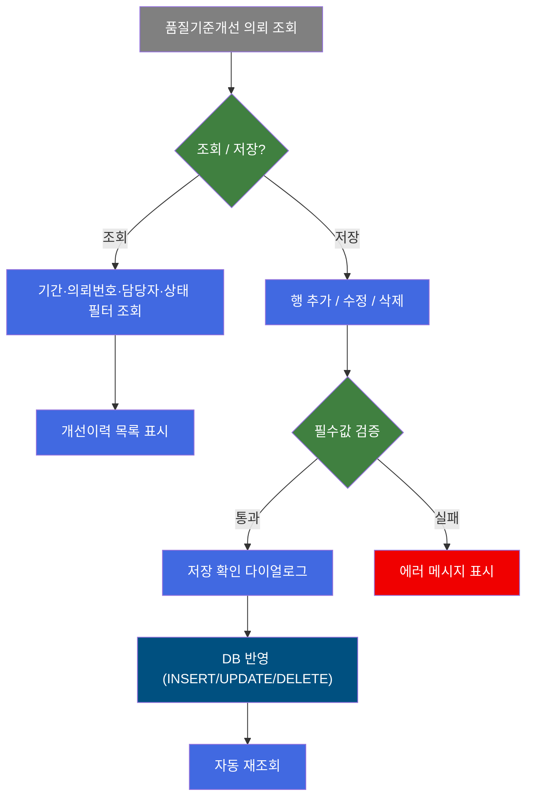
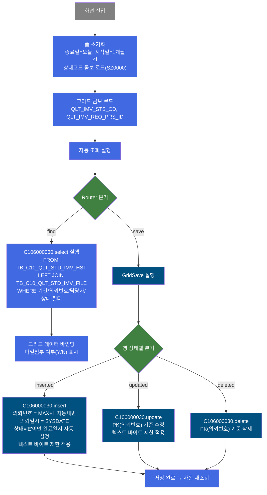
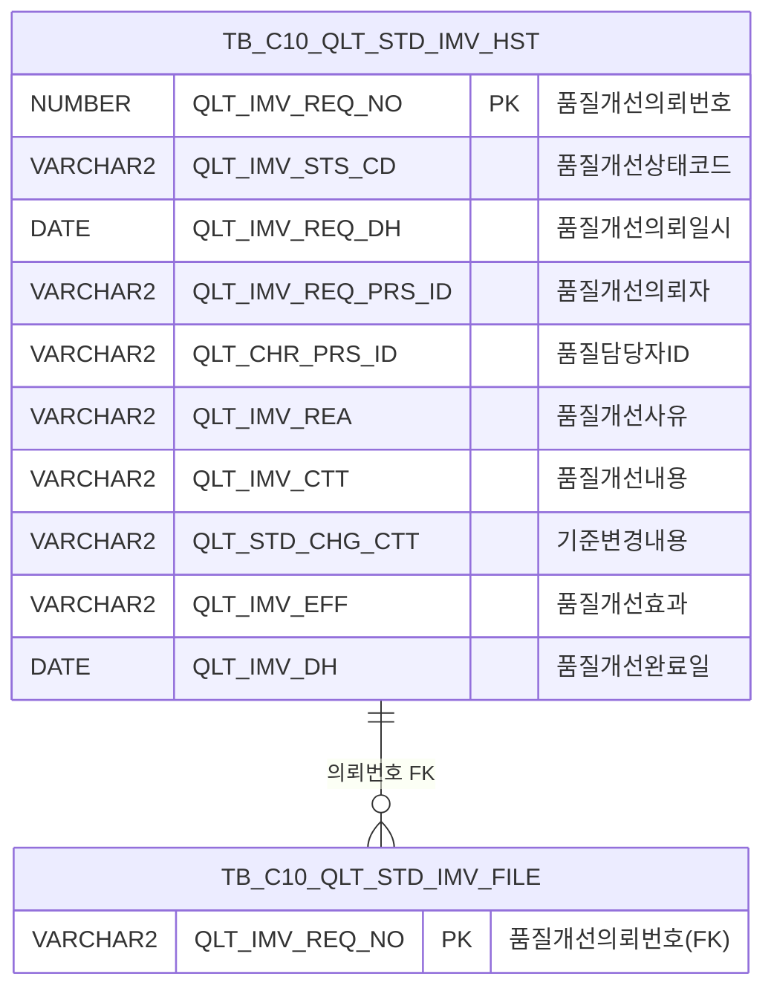

<h1 style="font-size: 40px; text-align: center; font-weight:
   bold; margin: 30px 0;">
  C106000030 레거시 시스템 분석 종합 보고서
</h1>


# 1. 시스템 개요
- **서비스 ID**: C106000030
- **업무명**: 품질기준개선이력관리
- **분석 일시**: 2026-03-17 09:02 KST
- **전체 Activity 수**: 3개 (Built-in 3개, Custom 0개)
- **분석자**: Claude Opus 4.6 / Sonnet (Phase 4)
- **분석 도구**: /analyze-service C106000030
- **문서 버전**: 1.0

# 📊 비즈니스 프로세스 분석

## 시스템 목적

품질기준개선이력관리 시스템은 동국제강 C10 모듈에서 품질기준 개선 의뢰 건을 등록·수정·삭제·조회하는 CRUD 화면이다. 품질 담당자가 품질기준 개선을 의뢰하면 의뢰번호가 자동 채번되고, 개선사유·개선주요내역·기준변경내용·개선효과를 기록하여 이력을 관리한다.

의뢰 건별로 상태코드(SZ0000 마스터)를 통해 진행 상황을 추적하며, 상태가 'E'(완료)로 설정되면 완료일시가 자동 기록된다. 각 의뢰 건에는 파일 첨부 기능이 제공되어 관련 증빙 자료를 관리할 수 있다.

## 핵심 워크플로우 다이어그램



### 상세 워크플로우 다이어그램



## 주요 유즈케이스

### UC-01: 품질기준개선이력 조회
- **Actor**: 품질 담당자
- **목적**: 기간·의뢰번호·담당자·상태 등 다양한 필터로 품질기준개선 의뢰 이력을 조회하여 현황 파악

- **전제조건**:
  - 사용자가 시스템에 로그인되어 있음
  - TB_C10_QLT_STD_IMV_HST 테이블에 데이터가 존재함

- **주요 흐름**:
  1. 화면 진입 시 의뢰일 범위가 자동 설정됨 (시작일=1개월 전, 종료일=오늘)
  2. 필요 시 의뢰번호, 품질담당자, 의뢰자, 상태코드 조건을 추가 입력
  3. 조회 버튼 클릭 → `find()` 함수 실행
  4. 의뢰일자 유효성 검증 (필수 입력, 시작일 ≤ 종료일)
  5. `uiCommon.parameters()` 호출하여 Form 파라미터 구성
  6. C106000030-service (find) → C106000030.select 쿼리 실행
  7. Grid에 결과 표시 (의뢰번호, 상태코드, 의뢰일자, 의뢰자, 품질담당자, 개선사유, 개선주요내역, 기준변경내용, 개선효과, 파일첨부 여부)

- **대체 흐름**:
  - 의뢰일자 미입력: "의뢰일자를 입력하지 않았습니다!" 알림
  - 시작일 > 종료일: "의뢰일자를 잘못 입력하였습니다!" 알림
  - 조회 결과 없음: 빈 그리드 표시

- **후행조건**:
  - 조회된 데이터가 Grid에 표시됨
  - 사용자가 행 수정/추가/삭제 작업을 수행할 수 있는 상태

### UC-02: 품질기준개선이력 신규 등록
- **Actor**: 품질 담당자
- **목적**: 새로운 품질기준개선 의뢰 건을 등록하여 개선 이력을 생성

- **전제조건**:
  - 조회가 완료된 상태
  - 등록할 개선 의뢰 정보가 준비됨

- **주요 흐름**:
  1. 메뉴 "행추가" 클릭 → `add()` 함수 → Grid에 신규 행 추가
  2. `setAutoData()` 콜백으로 의뢰일자(QLT_IMV_REQ_DH)에 오늘 날짜 자동 입력, 상태코드/의뢰자 초기화
  3. 상태코드(QLT_IMV_STS_CD) 콤보에서 선택 (SZ0000 마스터)
  4. 의뢰자(QLT_IMV_REQ_PRS_ID) 콤보에서 선택
  5. 품질담당자(QLT_CHR_PRS_ID), 개선사유, 개선주요내역, 기준변경내용, 개선효과 입력
  6. 저장 버튼 클릭 → `save()` 함수 실행
  7. 필수값 검증 (상태코드, 의뢰자 필수)
  8. "입력된 정보를 저장하시겠습니까?" 확인 다이얼로그
  9. C106000030-service (save) → C106000030.insert 실행
  10. 의뢰번호 = MAX(QLT_IMV_REQ_NO) + 1 자동 채번 (없으면 YYYYMM0001 시작)
  11. 텍스트 필드 바이트 제한 적용 (사유 200B, 내역/변경/효과 400B)
  12. 상태코드 = 'E' 이면 완료일시(QLT_IMV_DH) = SYSDATE 자동 설정
  13. 저장 완료 후 자동 재조회 (`onAfterUpdateFinishEvent`)

- **대체 흐름**:
  - 상태코드 미선택: "품질개선상태코드를 선택해주세요." 알림
  - 의뢰자 미선택: "품질개선의뢰자를 선택해주세요." 알림
  - 변경 데이터 없음: "변경된 데이터가 없습니다." 알림

- **후행조건**:
  - TB_C10_QLT_STD_IMV_HST에 새 레코드 INSERT
  - 자동 재조회로 최신 목록 표시

### UC-03: 품질기준개선이력 수정
- **Actor**: 품질 담당자
- **목적**: 기존 의뢰 건의 상태·담당자·개선내용 등을 수정

- **전제조건**:
  - 조회가 완료되어 Grid에 데이터가 표시된 상태

- **주요 흐름**:
  1. Grid 행의 편집 가능 셀(상태코드, 의뢰일자, 의뢰자, 품질담당자, 개선사유, 개선주요내역, 기준변경내용, 개선효과) 클릭하여 편집
  2. `onEditCellEvent` 콜백으로 컬럼별 입력 글자 수 제한 실시간 검증
  3. 저장 버튼 클릭 → 필수값 검증 → 확인 다이얼로그
  4. C106000030.update 실행 (PK: QLT_IMV_REQ_NO)
  5. 텍스트 바이트 제한 적용 + AUDIT 컬럼 자동 갱신
  6. 저장 완료 후 자동 재조회

- **대체 흐름**:
  - 입력 글자 수 초과: "N자리만 입력 가능합니다." 알림, 입력값 초기화

- **후행조건**:
  - TB_C10_QLT_STD_IMV_HST 해당 레코드 UPDATE
  - AUDIT 컬럼(LAST_UPDATE_*) 자동 갱신

### UC-04: 품질기준개선이력 삭제
- **Actor**: 품질 담당자
- **목적**: 불필요한 의뢰 건을 삭제

- **전제조건**:
  - 삭제할 행이 Grid에서 선택된 상태

- **주요 흐름**:
  1. Grid에서 삭제 대상 행 선택
  2. 메뉴 "삭제" 클릭 → `remove()` 함수 실행
  3. 선택된 행에 삭제 스타일 적용 (붉은색 취소선)
  4. 저장 버튼 클릭 → 확인 다이얼로그
  5. C106000030.delete 실행 (PK: QLT_IMV_REQ_NO)
  6. 저장 완료 후 자동 재조회

- **대체 흐름**:
  - 행 미선택: "삭제 대상이 없습니다." 알림

- **후행조건**:
  - TB_C10_QLT_STD_IMV_HST에서 해당 레코드 DELETE

### UC-05: 파일 첨부
- **Actor**: 품질 담당자
- **목적**: 의뢰 건에 관련 증빙 파일을 첨부

- **전제조건**:
  - Grid에 의뢰 데이터가 표시된 상태
  - 의뢰번호가 존재하는 행

- **주요 흐름**:
  1. Grid의 "파일첨부" 링크 컬럼 클릭 → `doFileUpload()` 실행
  2. C106000030pop01.jsp 팝업 오픈 (465x405px, 모달)
  3. 의뢰번호(QLT_IMV_REQ_NO)가 파라미터로 전달됨
  4. 팝업에서 파일 업로드 처리

- **후행조건**:
  - TB_C10_QLT_STD_IMV_FILE에 파일 정보 저장
  - 조회 시 FILE_ADD 컬럼이 'Y'로 표시

---
## 비즈니스 로직 상세

### 1. 의뢰번호 자동 채번 로직

- **목적**: 신규 의뢰 등록 시 고유한 의뢰번호를 자동 생성
- **처리 케이스**:

  **[케이스 1: 기존 의뢰번호 존재]**
  ```
    조건: TB_C10_QLT_STD_IMV_HST에 기존 레코드 존재
    처리:
      1. MAX(QLT_IMV_REQ_NO) 조회
      2. MAX값 + 1 = 새 의뢰번호
  ```

  **[케이스 2: 최초 등록 (기존 데이터 없음)]**
  ```
    조건: TB_C10_QLT_STD_IMV_HST가 비어있음
    처리:
      1. NVL(MAX(...), TO_CHAR(SYSDATE,'YYYYMM') || '0000') 적용
      2. YYYYMM0000 + 1 = YYYYMM0001이 첫 의뢰번호
  ```

- **계산 공식**:
  ```
  신규 의뢰번호 = NVL(MAX(QLT_IMV_REQ_NO), YYYYMM || '0000') + 1

  예시:
  기존 MAX = 2026030005 → 새 번호 = 2026030006
  데이터 없음 (2026년 3월) → 새 번호 = 2026030001
  ```

- **예외 처리**:
  - 동시 등록 시 MAX+1 중복 가능성 → 서브쿼리 기반 채번이므로 동시성 이슈 잠재

### 2. 텍스트 필드 바이트 길이 제한

- **목적**: Oracle VARCHAR2 컬럼 크기 초과 방지를 위해 SQL 레벨에서 바이트 단위 절단
- **처리 케이스**:

  **[케이스 1: 일반 텍스트 (200바이트 이내)]**
  ```
    조건: LENGTHB(:QLT_IMV_REA) <= 200
    처리: 원본 값 그대로 저장
  ```

  **[케이스 2: 초과 텍스트 (200바이트 초과)]**
  ```
    조건: LENGTHB(:QLT_IMV_REA) > 200
    처리: SUBSTRB(:QLT_IMV_REA, 1, 200) 으로 200바이트까지만 절단 저장
  ```

- **적용 필드 및 제한**:
  ```
  QLT_IMV_REA (개선사유): 200바이트
  QLT_IMV_CTT (개선주요내역): 400바이트
  QLT_STD_CHG_CTT (기준변경내용): 400바이트
  QLT_IMV_EFF (개선효과): 400바이트
  ```

### 3. 완료일시 자동 설정 로직

- **목적**: 상태코드가 'E'(완료)일 때 완료일시를 현재 시각으로 자동 기록
- **처리 케이스**:

  **[케이스 1: 완료 상태]**
  ```
    조건: QLT_IMV_STS_CD = 'E'
    처리: QLT_IMV_DH = TO_DATE(TO_CHAR(SYSDATE,'YYYYMMDDHH24MISS'),'YYYYMMDDHH24MISS')
  ```

  **[케이스 2: 비완료 상태]**
  ```
    조건: QLT_IMV_STS_CD != 'E'
    처리: QLT_IMV_DH = '' (빈 값)
  ```

### 4. 파일 첨부 여부 판별 (서브쿼리)

- **목적**: 조회 시 각 의뢰 건의 파일 첨부 여부를 Y/N으로 표시
- **처리 케이스**:

  **[케이스 1: 파일 존재]**
  ```
    조건: TB_C10_QLT_STD_IMV_FILE에서 해당 의뢰번호의 COUNT > 0
    처리: FILE_ADD = 'Y'
  ```

  **[케이스 2: 파일 미존재]**
  ```
    조건: COUNT = 0
    처리: FILE_ADD = 'N'
  ```

### 5. 날짜 범위 조회 처리

- **목적**: 사용자 입력 날짜 범위를 Oracle 날짜 비교에 적합한 형태로 변환
- **처리 케이스**:

  **[종료일 +1 보정]**
  ```
    조건: 조회 기간의 종료일이 지정됨
    처리:
      1. TO_DATE(:QLT_IMV_REQ_DH_TO, 'YYYY-MM-DD') + 1 로 종료일 다음 날 0시까지 포함
      2. BETWEEN 시작일 AND 종료일+1 범위 쿼리 생성
      3. 이를 통해 종료일 23:59:59까지의 데이터를 포함
  ```

---

# 💾 데이터 요구사항

## 핵심 테이블

### 1. TB_C10_QLT_STD_IMV_HST - 품질기준개선이력
| 컬럼명 | 타입 | PK | 설명 |
|--------|------|----|------|
| QLT_IMV_REQ_NO | NUMBER | ✅ | 품질개선의뢰번호 (자동채번: MAX+1) |
| QLT_IMV_STS_CD | VARCHAR2 | | 품질개선상태코드 (SZ0000 마스터 참조) |
| QLT_IMV_REQ_DH | DATE | | 품질개선의뢰일시 |
| QLT_IMV_REQ_PRS_ID | VARCHAR2 | | 품질개선의뢰자 ID |
| QLT_CHR_PRS_ID | VARCHAR2 | | 품질담당자 ID |
| QLT_IMV_REA | VARCHAR2 | | 품질개선사유 (200바이트 제한) |
| QLT_IMV_CTT | VARCHAR2 | | 품질개선내용 (400바이트 제한) |
| QLT_STD_CHG_CTT | VARCHAR2 | | 기준변경내용 (400바이트 제한) |
| QLT_IMV_EFF | VARCHAR2 | | 품질개선효과 (400바이트 제한) |
| QLT_IMV_DH | DATE | | 품질개선완료일 (상태='E' 시 자동 설정) |
| CREATED_OBJECT_TYPE | VARCHAR2 | | 생성 OBJECT 유형 (AUDIT) |
| CREATED_OBJECT_ID | VARCHAR2 | | 생성 OBJECT ID (AUDIT) |
| CREATED_PROGRAM_ID | VARCHAR2 | | 생성 프로그램 ID (AUDIT) |
| CREATION_TIMESTAMP | DATE | | 생성일시 (AUDIT) |
| LAST_UPDATED_OBJECT_TYPE | VARCHAR2 | | 최종변경 OBJECT 유형 (AUDIT) |
| LAST_UPDATED_OBJECT_ID | VARCHAR2 | | 최종변경 OBJECT ID (AUDIT) |
| LAST_UPDATE_PROGRAM_ID | VARCHAR2 | | 최종변경 프로그램 ID (AUDIT) |
| LAST_UPDATE_TIMESTAMP | DATE | | 최종변경일시 (AUDIT) |

### 2. TB_C10_QLT_STD_IMV_FILE - 품질기준개선 첨부파일
| 컬럼명 | 타입 | PK | 설명 |
|--------|------|----|------|
| QLT_IMV_REQ_NO | VARCHAR2 | ✅ | 품질개선의뢰번호 (FK → TB_C10_QLT_STD_IMV_HST) |
| (기타 파일 관련 컬럼) | - | | 파일첨부 상세정보 (pop01 서비스에서 관리) |

## 데이터 플로우

### 1. 조회

```
[품질기준개선이력 조회]
화면 진입 (자동조회) 또는 조회 버튼 클릭
→ C106000030.select
  FROM TB_C10_QLT_STD_IMV_HST QSIH
  LEFT JOIN TB_C10_QLT_STD_IMV_FILE (서브쿼리 - 파일 존재여부)
  WHERE QLT_IMV_REQ_DH BETWEEN TO_DATE(:QLT_IMV_REQ_DH_FR) AND TO_DATE(:QLT_IMV_REQ_DH_TO) + 1
    AND QLT_IMV_REQ_NO LIKE :QLT_IMV_REQ_NO || '%'
    AND NVL(QLT_IMV_REQ_PRS_ID, '%') LIKE :QLT_IMV_REQ_PRS_ID || '%'
    AND NVL(QLT_CHR_PRS_ID, '%') LIKE :QLT_CHR_PRS_ID || '%'
    AND NVL(QLT_IMV_STS_CD, '%') LIKE :QLT_IMV_STS_CD || '%'
  ORDER BY QLT_IMV_REQ_NO
→ Grid에 목록 표시 (19행 페이징)
```

### 2. 신규 등록

```
[품질기준개선이력 신규 등록]
행추가 → 데이터 입력 → 저장
→ C106000030.insert
  INTO TB_C10_QLT_STD_IMV_HST
  의뢰번호: (SELECT NVL(MAX(QLT_IMV_REQ_NO), YYYYMM||'0000') + 1)
  의뢰일시: SYSDATE
  텍스트 필드: LENGTHB/SUBSTRB 바이트 제한
  완료일시: DECODE(:QLT_IMV_STS_CD, 'E', SYSDATE, '')
  AUDIT 컬럼: 자동 설정
→ 저장 완료 → 자동 재조회
```

### 3. 수정

```
[품질기준개선이력 수정]
Grid 셀 직접 편집 → 저장
→ C106000030.update
  SET 상태코드, 의뢰자, 품질담당자, 개선사유, 개선내용, 기준변경내용, 개선효과
  텍스트 필드: LENGTHB/SUBSTRB 바이트 제한
  AUDIT 컬럼: 자동 갱신
  WHERE QLT_IMV_REQ_NO = :QLT_IMV_REQ_NO
→ 저장 완료 → 자동 재조회
```

### 4. 삭제

```
[품질기준개선이력 삭제]
행 선택 → 삭제 메뉴 → 저장
→ C106000030.delete
  FROM TB_C10_QLT_STD_IMV_HST
  WHERE QLT_IMV_REQ_NO = :QLT_IMV_REQ_NO
→ 저장 완료 → 자동 재조회
```

## SQL 일람표

| SQL 이름 | 쿼리 ID | 타입 | 출처 | 테이블 |
|---------|---------|-----|------|-------|
| 품질기준개선이력 조회 | C106000030.select | SELECT | Service | TB_C10_QLT_STD_IMV_HST, TB_C10_QLT_STD_IMV_FILE |
| 품질기준개선이력 등록 | C106000030.insert | INSERT | Service | TB_C10_QLT_STD_IMV_HST |
| 품질기준개선이력 수정 | C106000030.update | UPDATE | Service | TB_C10_QLT_STD_IMV_HST |
| 품질기준개선이력 삭제 | C106000030.delete | DELETE | Service | TB_C10_QLT_STD_IMV_HST |

## ER 다이어그램 (핵심 관계)



관계 설명:
- **TB_C10_QLT_STD_IMV_HST**가 중심 테이블로 품질기준개선 의뢰 이력을 관리
- **TB_C10_QLT_STD_IMV_FILE**은 의뢰번호 기준 1:N 관계로 첨부파일을 관리
- 상태코드(QLT_IMV_STS_CD)는 SZ0000 공통코드 마스터 참조

---

# 🖥️ 사용자 인터페이스 요구사항

## 화면 레이아웃 상세

### Layout 구조 (Absolute 배치)
```javascript
{
  itemType: "layout",
  dirType: "absolute",
  totalWidth: "981px",
  totalHeight: "586px",
  components: [
    {
      id: "C106000030_Form_1",
      type: "form",
      position: { left: "0px", top: "0px" },
      size: { width: "981px", height: "62px" }
    },
    {
      id: "C106000030_Menu_2",
      type: "menu",
      position: { left: "0px", top: "67px" },
      size: { width: "981px", height: "25px" }
    },
    {
      id: "C106000030_Grid_1",
      type: "grid",
      position: { left: "1px", top: "92px" },
      size: { width: "977px", height: "465px" }
    },
    {
      id: "C106000030_messagebox",
      type: "messagebox",
      position: { left: "0px", top: "567px" },
      size: { width: "978px", height: "19px" }
    }
  ]
}
```

## 입출력 요소

### Form 컴포넌트
**C106000030_Form_1** (2행 구성, 981x62px)

**1행 (검색/액션)**:
- QLT_IMV_REQ_DH_FR: calendar - 의뢰일(시작), 배경 #FFFFC0, 포맷 %Y-%m-%d, inputWidth 91px
- QLT_IMV_REQ_DH_TO: calendar - ~(종료), 배경 #FFFFC0, 포맷 %Y-%m-%d, inputWidth 90px
- QLT_IMV_REQ_NO: input - 의뢰번호, inputWidth 80px
- find: button - 조회 → `find()` 함수 호출 (초기 disabled)
- save: button - 저장 → `save()` 함수 호출 (초기 disabled)
- winClose: button - 닫기 → 창 닫기
- saveMessage: hidden - 저장 메시지 (숨김)

**2행 (추가 필터)**:
- QLT_CHR_PRS_ID: input - 품질담당자, inputWidth 69px
- QLT_IMV_REQ_PRS_ID: input - 의뢰자, inputWidth 70px
- QLT_IMV_STS_CD: combo - 상태코드, readonly, SZ0000 마스터 콤보 (전체: %, 정렬: value), inputWidth 60px

### Menu 컴포넌트
**C106000030_Menu_2** (툴바, 981x25px)
- refresh: 새로고침 (refresh.gif) → `refresh()` 함수
- add: 행추가 (new.gif) → `add()` 함수
- remove: 삭제 (remove.gif) → `remove()` 함수
- undo: 되돌리기 (undo.gif) → `undo()` 함수
- redo: 다시실행 (redo.gif) → `redo()` 함수

### Grid 컴포넌트
**C106000030_Grid_1 (품질기준개선이력 목록)**
- 편집 가능 여부: 예 (대부분 컬럼 편집 가능)
- Split: 0 (고정 컬럼 없음)
- 페이징: 19행 단위
- 컨텍스트 메뉴: 활성 (copy_row, excel_grid)
- 다중 선택: 활성
- 정렬: stableSorting 활성
- 날짜 포맷: %Y-%m-%d
- 대상 테이블: TB_C10_QLT_STD_IMV_HST
- 주요 컬럼 (10개):

  **기본 정보**:
  - QLT_IMV_REQ_NO: ro - 의뢰번호 (8%, 중앙정렬, 읽기전용, sort_int_custom)
  - QLT_IMV_STS_CD: combo_v - 상태코드 (6%, 중앙정렬, 편집가능, 배경 #FFFFC0, SZ0000 콤보 연동)
  - QLT_IMV_REQ_DH: dhxCalendar - 의뢰일자 (9%, 중앙정렬, 편집가능, 배경 #FFFFC0, sort_date_custom)

  **담당자 정보**:
  - QLT_IMV_REQ_PRS_ID: combo_v - 의뢰자 (8%, 중앙정렬, 편집가능, 배경 #FFFFC0)
  - QLT_CHR_PRS_ID: ed - 품질담당자 (8%, 중앙정렬, 편집가능, 배경 #FFFFC0, 최대 10자)

  **개선 내용**:
  - QLT_IMV_REA: txt - 개선사유 (13%, 중앙정렬, 편집가능, 배경 #FFFFC0, 최대 200자)
  - QLT_IMV_CTT: txt - 개선주요내역 (14%, 중앙정렬, 편집가능, 배경 #FFFFC0, 최대 400자)
  - QLT_STD_CHG_CTT: txt - 기준변경내용 (14%, 중앙정렬, 편집가능, 배경 #FFFFC0, 최대 400자)
  - QLT_IMV_EFF: txt - 개선효과 (13%, 중앙정렬, 편집가능, 배경 #FFFFC0, 최대 400자)

  **파일**:
  - FILE_ADD: link - 파일첨부 (*, 중앙정렬, 읽기전용, 배경 #FFFFC0, 클릭 시 `doFileUpload()` → C106000030pop01.jsp 팝업)

## 화면 동작 흐름

### 1. 화면 초기 로딩
```
1. 화면 진입 → ui.initializeDHTMLX() 호출
2. pageConfiguration JSON 파싱하여 컴포넌트 생성
3. Form XLE 이벤트 → onFormLoadFunction() 실행
   - QLT_IMV_REQ_DH_TO = uiCommon.getCurrentDate() (오늘)
   - QLT_IMV_REQ_DH_FR = dateAdd(오늘, -1) (1개월 전)
   - 캘린더 시작요일 = 일요일 (setWeekStartDay(7))
   - 상태코드 콤보 로드: ui.combo.master(SZ0000, QLT_IMV_STS_CD, totalValue=%, orderBy=value)
   - 콤보 readonly 설정, 첫 번째 항목(%) 자동 선택
   - 키보드 입력 차단 (Backspace, F5 방지)
   - formLoadFlag = true
4. Grid XLE 이벤트 → onGridLoadEvent() 실행
   - QLT_IMV_STS_CD 그리드 콤보 로드 (SZ0000, orderBy=sequence)
   - formLoadFlag가 true이면 자동 조회 실행
5. DataProcessor 스타일 설정
   - inserted/updated: bold black
   - deleted: bold red + 취소선
6. 이벤트 바인딩
   - onEnter → focusMove (Enter 키 셀 이동)
   - onRowAdded → setAutoData (행 추가 시 오늘 날짜 자동 입력)
   - onEditCellEvent → 컬럼별 글자 수 제한 검증
   - onAfterUpdateFinishEvent → 저장 후 자동 재조회
7. 상태바 초기화
```

### 2. 조회 기능
```
1. 사용자가 의뢰일 범위, 의뢰번호, 품질담당자, 의뢰자, 상태코드 입력/선택
2. 조회 버튼 클릭 → find(eventName, formDivObj, referenceItem)
3. 날짜 유효성 검증
   - get_DateTypeDay()로 날짜 형식 변환
   - fromDate == '' || toDate == '' → "의뢰일자를 입력하지 않았습니다!" 알림
   - fromDate > toDate → "의뢰일자를 잘못 입력하였습니다!" 알림
4. uiCommon.parameters('C106000030_Form_1', 'C106000030_Grid_1', eventName) 호출
5. items['C106000030_Grid_1'].loadData(findUrl) 실행
6. Grid에 결과 바인딩
```

### 3. 저장 기능
```
1. Grid에서 행 추가/수정/삭제 수행
2. 저장 버튼 클릭 → save(eventName, formDivObj, referenceItem)
3. 전체 행 순회하며 변경된 행 검증
   - 변경 행의 상태코드(QLT_IMV_STS_CD) 필수 확인
   - 변경 행의 의뢰자(QLT_IMV_REQ_PRS_ID) 필수 확인
   - deleted 행은 필수값 검증 제외
4. 변경 데이터 없으면 "변경된 데이터가 없습니다." 알림
5. dhtmlx.confirm "입력된 정보를 저장하시겠습니까?"
6. items[referenceItem].sendGrid(referenceItem, eventName) 실행
7. handleDataProcess.do → C106000030-service (save) → GridSave 액티비티
8. onAfterUpdateFinishEvent() → 자동 재조회
```

### 4. 파일 첨부 팝업
```
1. Grid의 FILE_ADD 링크 컬럼 클릭
2. doFileUpload(rowId) 실행
3. 해당 행의 의뢰번호(QLT_IMV_REQ_NO) 추출 (getCellByIndexValue(rowId, 0))
4. C106000030pop01.jsp 팝업 오픈
   - URL 파라미터: rowId, QLT_IMV_REQ_NO
   - 크기: 465x405px
   - 모달: true
   - park/minmax1 버튼 비활성화
```

## JavaScript 모듈

**C106000030.jsp** (메인 화면 스크립트)
- find(eventName, formDivObj, referenceItem): 조회 - 날짜 검증 후 uiCommon.parameters → Grid loadData
- save(eventName, formDivObj, referenceItem): 저장 - 전체 행 순회 필수값 검증 → dhtmlx.confirm → sendGrid
- onAfterUpdateFinishEvent(): 저장 완료 후 자동 재조회 (uiCommon.parameters → loadData)
- progressOff(): 프로그레스 바 종료 (uiCommon.progressOff)
- refresh(referenceItem): 새로고침 - clearDataProcess → 재조회
- add(referenceItem): 행추가 → addRow
- remove(referenceItem): 삭제 - 선택 행 확인 → removeRow
- copy(referenceItem): 행 복사 → copyRowContent
- undo(referenceItem): 되돌리기
- redo(referenceItem): 다시실행
- onGridContextMenuClick(id, gridObj, menuObj): 컨텍스트 메뉴 - copy_row(셀 클립보드 복사), excel_grid(엑셀 출력)
- getMessage(messageBoxId): 메시지박스 내용 추출
- findMessage(referenceItem): 저장 메시지 출력 (uiCommon.message)
- onFormLoadFunction(formDivObj): 폼 초기화 - 날짜 설정, 콤보 로드, 캘린더 설정
- dateAdd(date, addDay): 날짜 가감 유틸리티 (Date 객체 + 일수 × 밀리초)
- setAutoData(id): 행 추가 시 오늘 날짜 자동 입력 (uiCommon.getCurrentDate), 상태코드/의뢰자 초기화
- onGridLoadEvent(): 그리드 콤보 로드 (SZ0000), formLoadFlag 확인 후 자동 조회
- doFileUpload(rowId): 파일첨부 팝업 오픈 (ui.window, C106000030pop01.jsp)
- chkfocusInd(gridObj, id, ind): Enter 키 포커스 이동 계산
- focusMove(id, ind): Enter 키 셀 이동 실행
- onEditCellEvent(stage, rId, cInd, nValue, oValue): 셀 편집 시 컬럼별 글자 수 제한 검증 (hanCheck)

## 주요 이벤트 핸들러

**find (조회 버튼 클릭)**
- 이벤트 타입: Button Command
- 처리 내용:
  1. QLT_IMV_REQ_DH_FR/TO 값 추출
  2. get_DateTypeDay()로 날짜 형식 변환
  3. 빈 값/역순 검증 → dhtmlx.alert
  4. uiCommon.parameters('C106000030_Form_1', 'C106000030_Grid_1', eventName)
  5. items['C106000030_Grid_1'].loadData(findUrl)

**save (저장 버튼 클릭)**
- 이벤트 타입: Button Command
- 처리 내용:
  1. 전체 행 순회 (getRowsNum)
  2. getUserData !nativeeditor_status로 변경 행 식별
  3. 삭제 행 제외, 상태코드/의뢰자 필수 검증
  4. chgCnt == 0 → "변경된 데이터가 없습니다."
  5. dhtmlx.confirm → sendGrid

**onRowAdded (행 추가 이벤트)**
- 이벤트 타입: Grid Event (attachEvent)
- 처리 내용:
  1. setAutoData(id) 콜백 실행
  2. 의뢰일자(col 2) = uiCommon.getCurrentDate()
  3. 상태코드(col 1) = "" (빈 값)
  4. 의뢰자(col 3) = "" (빈 값)

**onEditCellEvent (셀 편집 이벤트)**
- 이벤트 타입: Grid Edit Event
- 처리 내용:
  1. stage == 1 일 때 컬럼별 검증 실행
  2. cInd 4 (품질담당자): hanCheck(value, '10') → 10자 제한
  3. cInd 5 (개선사유): hanCheck(value, '200') → 200자 제한
  4. cInd 6 (개선주요내역): hanCheck(value, '400') → 400자 제한
  5. cInd 7 (기준변경내용): hanCheck(value, '400') → 400자 제한
  6. cInd 8 (개선효과): hanCheck(value, '400') → 400자 제한
  7. 초과 시 dhtmlx.alert + 입력값 초기화

**doFileUpload (파일첨부 링크 클릭)**
- 이벤트 타입: Grid Link Cell Click
- 처리 내용:
  1. rowId로 해당 행의 의뢰번호 추출
  2. ui.window("C106000030PopWin") 팝업 생성
  3. C106000030pop01.jsp?rowId=&QLT_IMV_REQ_NO= 호출
  4. setModal() + park/minmax1 버튼 비활성화

---

# 📌 특이사항 및 주의사항

## 1. 의뢰번호 채번 동시성 이슈
- **MAX+1 서브쿼리 채번**: `(SELECT NVL(MAX(QLT_IMV_REQ_NO), YYYYMM||'0000')+1)` 방식으로 PK를 생성한다. Oracle 시퀀스가 아닌 MAX+1 패턴이므로 **동시 INSERT 시 중복 키 에러** 가능성이 있다. 트랜잭션 격리 수준에 따라 동일 번호가 채번될 수 있으며, 이 경우 ORA-00001 (unique constraint violation) 발생.

## 2. 텍스트 필드 이중 바이트 제한 (JS + SQL)
- **클라이언트**: onEditCellEvent에서 hanCheck() 함수로 **문자 수** 기준 실시간 검증 (10자/200자/400자)
- **서버(SQL)**: LENGTHB/SUBSTRB로 **바이트 수** 기준 절단 (200B/400B)
- 한글은 UTF-8에서 3바이트이므로 **JS 문자 수 제한과 SQL 바이트 제한이 불일치**할 수 있다. 예: 한글 200자 = 600바이트 → SQL에서 200바이트로 절단되어 약 66자만 저장.
- JS에서 검증 실패 시 입력값이 빈 문자열로 초기화되는 점도 사용성 문제.

## 3. 완료일시(QLT_IMV_DH) INSERT 시에만 자동 설정
- INSERT 쿼리에서 상태코드 = 'E'일 때 `DECODE(:QLT_IMV_STS_CD, 'E', SYSDATE, '')` 로 완료일시를 설정하지만, **UPDATE 쿼리에는 QLT_IMV_DH 갱신 로직이 없다**. 즉, 등록 후 상태를 'E'로 변경해도 완료일시가 갱신되지 않는다. 신규 등록 시에만 상태를 'E'로 설정해야 완료일시가 기록된다.

## 4. 폼 상태코드 콤보 readonly + 키보드 입력 차단
- 상태코드 콤보를 `readonly(true, true)` 설정 후 추가로 `onkeydown` 이벤트에서 Backspace(8), F5(116) 키를 차단한다. 이는 구형 IE 브라우저에서 콤보 입력 시 의도치 않은 페이지 이동/새로고침을 방지하기 위한 조치로, `e.preventDefault()`와 `event.returnValue = false` 양방향 처리하는 크로스브라우저 패턴이다.

## 5. 미사용 쿼리 존재 (C106000030.max)
- 쿼리 파일에 `C106000030.max` 쿼리가 정의되어 있으나 서비스 XML이나 JSP에서 참조하지 않는다. 의뢰번호 MAX 생성 용도의 별도 INSERT 쿼리로, 현재 INSERT 쿼리 내 서브쿼리로 대체된 것으로 보이며 데드 코드로 판단된다.

## 6. dateAdd 함수 변수명 섀도잉
- JSP 내 `dateAdd(date, addDay)` 함수에서 파라미터명 `date`와 내부 변수 `var date = nowDate.getDate()`가 동일하여 변수명 섀도잉이 발생한다. 현재는 사용 순서상 문제가 없으나 유지보수 시 혼란을 야기할 수 있다.

---

# 📚 참고 문서

- **Query SQL**: `src/query/C106000030-query.glue_sql`
- **팝업 Query SQL**: `src/query/C106000030pop01-query.glue_sql`
- **Service XML**: `src/service/C106000030-service.xml`
- **JSP**: `WebContents/C106000030.jsp`
- **팝업 JSP**: `WebContents/C106000030pop01.jsp`
- **Form XML**: `WebContents/header/kr/C106000030/C106000030_Form_1.xml`
- **Grid XML**: `WebContents/header/kr/C106000030/C106000030_Grid_1.xml`
- **Menu XML**: `WebContents/header/kr/C106000030/C106000030_Menu_2.xml`
- **공통 JS**: `WebContents/js/c10.ui.js`
