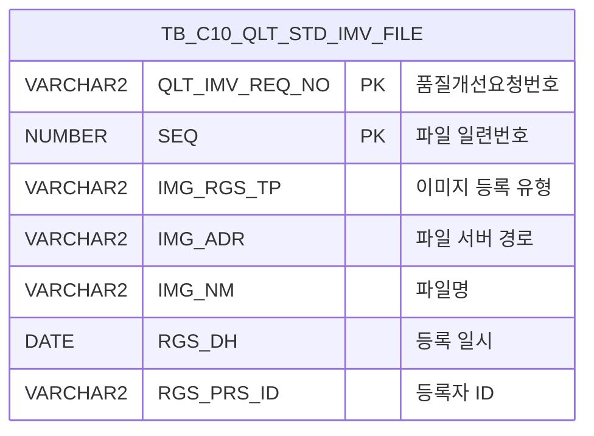

<h1 style="font-size: 40px; text-align: center; font-weight:
   bold; margin: 30px 0;">
  C106000030pop01 레거시 시스템 분석 종합 보고서
</h1>


# 1. 시스템 개요
- **서비스 ID**: C106000030pop01
- **업무명**: 품질개선이력관리 파일 업로드 팝업
- **분석 일시**: 2026-03-17 09:11 KST
- **전체 Activity 수**: 3개 (Built-in: 3개, Custom: 0개)
- **분석자**: Claude Opus 4.6 / Sonnet (Phase 4)
- **분석 도구**: /analyze-service C106000030pop01
- **문서 버전**: 1.0

# 📊 비즈니스 프로세스 분석

## 시스템 목적

품질개선이력관리(C106000030) 화면에서 호출되는 팝업 화면으로, 품질개선 의뢰건에 대한 엑셀 파일의 업로드/조회/삭제/다운로드 기능을 제공한다.

사용자는 dhtmlXVault 컴포넌트를 통해 xls/xlsx 형식의 엑셀 파일을 업로드하고, 업로드된 파일 목록을 그리드에서 확인할 수 있다. 파일명 링크를 클릭하여 다운로드하거나, 삭제 버튼으로 개별 파일을 삭제할 수 있다. 모든 파일 변경(업로드/삭제) 후에는 부모 화면(C106000030)의 그리드도 자동으로 갱신된다.

<!-- 단순 조회+삭제 서비스로 핵심/상세 워크플로우 다이어그램 생략 -->

## 주요 유즈케이스

### UC-01: 엑셀 파일 업로드
- **Actor**: 품질관리 담당자
- **목적**: 품질개선 의뢰건에 관련 엑셀 파일(검사 데이터, 분석 결과 등)을 첨부

- **전제조건**:
  - 부모 화면(C106000030)에서 품질개선 의뢰건이 선택되어 있음
  - QLT_IMV_REQ_NO(품질개선요청번호)가 URL 파라미터로 전달됨

- **주요 흐름**:
  1. 팝업 화면 진입 시 dhtmlXVault 컴포넌트 초기화 (onVaultLoad)
  2. 사용자가 Vault 영역에 xls/xlsx 파일을 드래그앤드롭 또는 파일 선택
  3. vault.onAddFile 이벤트에서 파일 확장자 검증 (xls, xlsx만 허용)
  4. 서버 핸들러(`_uploadHandler.jsp`)로 파일 업로드 수행
  5. 업로드 완료 시 vault.onUploadComplete → onLoadGrid() 호출
  6. Grid_1에 파일 목록 재조회 (gridC10Data.do, action=find)
  7. parent.find()로 부모 화면(C106000030) 그리드 갱신

- **대체 흐름**:
  - 허용되지 않는 확장자 파일 추가 시: "xls, xlsx 파일만 업로드 가능합니다" 알림 후 파일 제거
  - 업로드 실패 시: vault.onUploadComplete에서 오류 알림 표시

- **후행조건**:
  - TB_C10_QLT_STD_IMV_FILE에 파일 레코드 INSERT 완료
  - 파일 목록 그리드 및 부모 화면 그리드가 최신 상태로 갱신

### UC-02: 업로드된 파일 조회 및 다운로드
- **Actor**: 품질관리 담당자
- **목적**: 의뢰건에 첨부된 엑셀 파일 목록을 확인하고 필요한 파일을 다운로드

- **전제조건**:
  - 팝업 화면이 QLT_IMV_REQ_NO와 함께 열려 있음

- **주요 흐름**:
  1. 화면 진입 시 onLoadGrid() 자동 호출
  2. C106000030pop01.select 쿼리로 파일 목록 조회 (의뢰번호, 순번, 파일명, 등록일자)
  3. Grid_1에 파일 목록 표시
  4. 파일명(IMG_NM) 컬럼의 링크 클릭 시 Grid_doLink() 호출
  5. fileDownload() 함수가 숨겨진 iframe에 form을 동적 생성
  6. `/C10/download` 엔드포인트로 파일 다운로드 수행

- **대체 흐름**:
  - 첨부 파일이 없는 경우: 빈 그리드 표시

- **후행조건**:
  - 사용자가 선택한 파일이 로컬에 다운로드됨

### UC-03: 첨부 파일 삭제
- **Actor**: 품질관리 담당자
- **목적**: 잘못 업로드되었거나 불필요한 첨부 파일을 삭제

- **전제조건**:
  - 그리드에 파일 목록이 표시되어 있음

- **주요 흐름**:
  1. 사용자가 그리드의 삭제(DEL_IMG) 셀 클릭
  2. doImgDel(rowIndex, cellIndex) 함수 호출
  3. 선택 행에서 QLT_IMV_REQ_NO, SEQ 값 추출
  4. gridC10Data.do (action=delete) 호출 → C106000030pop01.delete 쿼리 실행
  5. TB_C10_QLT_STD_IMV_FILE에서 해당 레코드 DELETE
  6. onLoadGrid()로 파일 목록 그리드 재조회
  7. parent.find()로 부모 화면(C106000030) 그리드 갱신

- **대체 흐름**:
  - 삭제 실패 시: 에러 메시지 표시

- **후행조건**:
  - 해당 파일 레코드가 DB에서 삭제됨
  - 파일 목록 및 부모 화면 그리드가 갱신됨

---
## 비즈니스 로직 상세

### 1. 이미지 경로 정규화 (SELECT 쿼리)

- **목적**: DB에 저장된 파일 경로를 웹에서 접근 가능한 상대 경로로 변환
- **처리 케이스**:

  **[케이스 1: 경로 변환]**
  ```
    조건: IMG_ADR 컬럼에 저장된 전체 파일 경로
    처리:
      1. INSTR(IMG_ADR, 'FILE_UPLOAD')로 'FILE_UPLOAD' 문자열 위치 탐색
      2. SUBSTR로 FILE_UPLOAD 이후 경로만 추출
      3. REPLACE로 백슬래시(\)를 슬래시(/)로 변환 (Windows→Web 경로)
      4. 앞에 './' 접두어, 뒤에 '/' 접미어 추가하여 CHK_IMG_ADR 생성
  ```

  **[케이스 2: 날짜 포맷 변환]**
  ```
    조건: RGS_DH (등록일시) 컬럼
    처리:
      1. TO_CHAR(RGS_DH, 'YYYY-MM-DD') 형식으로 변환
      2. 그리드에 날짜만 표시 (시분초 제외)
  ```

### 2. SEQ 자동 채번 (INSERT 쿼리 - 업로드 핸들러에서 사용)

- **목적**: 동일 의뢰번호 내에서 파일 순번을 자동으로 증가시켜 부여
- **처리 케이스**:

  **[케이스 1: 기존 파일 존재]**
  ```
    조건: 해당 QLT_IMV_REQ_NO에 기존 파일 레코드가 있음
    처리:
      1. SELECT NVL(MAX(SEQ), 0) + 1로 다음 순번 계산
      2. 서브쿼리로 INSERT 시 SEQ 값 자동 설정
  ```

  **[케이스 2: 최초 파일 등록]**
  ```
    조건: 해당 QLT_IMV_REQ_NO에 기존 파일이 없음
    처리:
      1. MAX(SEQ) = NULL → NVL(NULL, 0) + 1 = 1
      2. SEQ = 1로 첫 번째 파일 등록
  ```

---

# 💾 데이터 요구사항

## 핵심 테이블

### 1. TB_C10_QLT_STD_IMV_FILE - (품질개선이력관리 엑셀파일)
| 컬럼명 | 타입 | PK | 설명 |
|--------|------|----|-----|
| QLT_IMV_REQ_NO | VARCHAR2 | ✅ | 품질개선요청번호 |
| SEQ | NUMBER | ✅ | 파일 일련번호 |
| IMG_RGS_TP | VARCHAR2 | | 이미지 등록 유형 |
| IMG_ADR | VARCHAR2 | | 이미지 주소 (파일 서버 전체 경로) |
| IMG_NM | VARCHAR2 | | 이미지명 (파일명) |
| RGS_DH | DATE | | 등록 일시 |
| RGS_PRS_ID | VARCHAR2 | | 등록자 ID |
| CREATED_OBJECT_TYPE | VARCHAR2 | | 생성 오브젝트 유형 |
| CREATED_OBJECT_ID | VARCHAR2 | | 생성 오브젝트 ID |
| CREATED_PROGRAM_ID | VARCHAR2 | | 생성 프로그램 ID |
| CREATION_TIMESTAMP | TIMESTAMP | | 생성 타임스탬프 |
| LAST_UPDATED_OBJECT_TYPE | VARCHAR2 | | 최종 수정 오브젝트 유형 |
| LAST_UPDATED_OBJECT_ID | VARCHAR2 | | 최종 수정 오브젝트 ID |
| LAST_UPDATE_PROGRAM_ID | VARCHAR2 | | 최종 수정 프로그램 ID |
| LAST_UPDATE_TIMESTAMP | TIMESTAMP | | 최종 수정 타임스탬프 |

## 데이터 플로우

### 1. 조회
```
[업로드된 파일 목록 조회]
팝업 진입 / 파일 업로드 완료 / 삭제 완료
→ C106000030pop01.select
  FROM TB_C10_QLT_STD_IMV_FILE
  WHERE QLT_IMV_REQ_NO = :QLT_IMV_REQ_NO
  ORDER BY SEQ
→ Grid_1에 파일 목록 표시
→ 경로 변환: IMG_ADR → CHK_IMG_ADR (FILE_UPLOAD 이후 경로 + 슬래시 정규화)
```

### 2. 삭제
```
[첨부 파일 삭제]
사용자가 그리드 삭제 셀 클릭
→ doImgDel() 함수 호출
→ C106000030pop01.delete
  DELETE FROM TB_C10_QLT_STD_IMV_FILE
  WHERE QLT_IMV_REQ_NO = :QLT_IMV_REQ_NO
    AND SEQ = :SEQ
→ onLoadGrid()로 파일 목록 재조회
→ parent.find()로 부모 화면 갱신
```

### 3. 등록 (업로드 핸들러)
```
[파일 업로드 등록]
dhtmlXVault에서 파일 업로드 완료
→ _uploadHandler.jsp 서버 핸들러
→ C106000030pop01.insert
  INSERT INTO TB_C10_QLT_STD_IMV_FILE
  (QLT_IMV_REQ_NO, SEQ, IMG_RGS_TP, IMG_ADR, IMG_NM, RGS_DH, ...)
  VALUES (:QLT_IMV_REQ_NO, (SELECT NVL(MAX(SEQ),0)+1 ...), ...)
→ SEQ 자동 채번 (서브쿼리)
→ vault.onUploadComplete → onLoadGrid()
```

## SQL 일람표
| SQL 이름 | 쿼리 ID | 타입 | 출처 | 테이블 |
|---------|---------|-----|-------|-------|
| 엑셀파일 조회 | C106000030pop01.select | SELECT | Service | TB_C10_QLT_STD_IMV_FILE |
| 엑셀파일 삭제 | C106000030pop01.delete | DELETE | Service | TB_C10_QLT_STD_IMV_FILE |
| 엑셀파일 등록 | C106000030pop01.insert | INSERT | Service (업로드 핸들러) | TB_C10_QLT_STD_IMV_FILE |

## ER 다이어그램 (핵심 관계)



관계 설명:
- TB_C10_QLT_STD_IMV_FILE이 단일 테이블로 사용되며, QLT_IMV_REQ_NO + SEQ 복합 PK로 관리
- QLT_IMV_REQ_NO는 부모 화면(C106000030)의 품질개선이력 테이블과 논리적 FK 관계

---

# 🖥️ 사용자 인터페이스 요구사항

## 화면 레이아웃 상세

### Layout 구조
```javascript
// initLayout 미사용 - 팝업 전용 화면
// body에 직접 div 배치 (절대 좌표 position:absolute)
{
  type: "flat",  // 팝업 전용 레이아웃
  components: [
    {
      id: "vault1",
      type: "vault",
      position: "body 최상단",
      description: "dhtmlXVault 파일 업로드 컴포넌트"
    },
    {
      id: "C106000030pop01_Grid_1",
      type: "grid",
      position: "left:8px; top:260px; width:430px; height:70px",
      description: "업로드된 파일 목록 그리드"
    },
    {
      id: "C106000030pop01_messagebox",
      type: "messagebox",
      position: "left:0px; top:332px; width:445px; height:23px",
      description: "메시지 표시 컴포넌트"
    }
  ]
}
```

## 입출력 요소

### Vault 컴포넌트
**vault1 (dhtmlXVault 파일 업로드)**
- 허용 확장자: xls, xlsx
- 최대 파일 수: 50개
- 서버 핸들러:
  - 업로드: `_uploadHandler.jsp`
  - 정보 조회: `_getInfoHandler.jsp`
  - ID 조회: `_getIdHandler.jsp`
- 폼 필드: PAGE_ID=C106000030pop01, QLT_IMV_REQ_NO=(URL 파라미터)

### Grid 컴포넌트

**C106000030pop01_Grid_1 (파일 목록)**
- 편집 가능 여부: 아니오 (읽기 전용)
- Split: 없음 (0)
- 컬럼 너비 단위: %
- 다중 선택: 예
- 주요 컬럼 (8개):

  **기본 정보**:
  - QLT_IMV_REQ_NO: ro - 의뢰번호 (17%, 좌측정렬)
  - SEQ: ro - 순번 (8%, 중앙정렬)
  - IMG_NM: ahref_idx - 파일명 (*, 좌측정렬, 클릭 시 Grid_doLink → fileDownload로 파일 다운로드)
  - RGS_DH: ro - 등록일자 (16%, 중앙정렬)

  **기능 컬럼**:
  - DEL_IMG: ro - 삭제 (8%, 중앙정렬, 클릭 시 doImgDel 함수로 삭제 처리)

  **숨김 컬럼**:
  - IMG_ADR: ro - 이미지 주소 (숨김)
  - CHK_IMG_NM: ro - 체크용 이미지명 (숨김)
  - CHK_IMG_ADR: ro - 정규화된 이미지 경로 (숨김)

### Messagebox 컴포넌트
**C106000030pop01_messagebox**
- 위치: 하단 (left:0px, top:332px)
- 크기: 445px x 23px
- XML 파일: 미존재 (C106000030pop01_messagebox.xml 누락)

## 화면 동작 흐름

### 1. 화면 초기 로딩
```
1. 부모 화면(C106000030)에서 팝업 호출 (QLT_IMV_REQ_NO 파라미터 전달)
2. body onload → onVaultLoad() 실행
3. dhtmlXVault 객체 초기화
   - 업로드 핸들러 URL 설정
   - 허용 확장자(xls, xlsx) 설정
   - 최대 파일 수(50) 설정
   - QLT_IMV_REQ_NO 폼 필드 바인딩
4. vault.onAddFile 이벤트에 확장자 검증 로직 등록
5. vault.onUploadComplete 이벤트에 onLoadGrid 콜백 등록
6. onLoadGrid() 호출 → Grid_1에 기존 파일 목록 로드
7. ui.initializeDHTMLX 후 XLE(엑셀 업로드) 이벤트 등록
```

### 2. 파일 업로드
```
1. 사용자가 Vault에 파일 드래그앤드롭 또는 파일 선택
2. vault.onAddFile에서 확장자 검증 (xls, xlsx 외 거부)
3. Vault가 _uploadHandler.jsp로 파일 전송
4. 서버에서 파일 저장 + C106000030pop01.insert 쿼리 실행
5. vault.onUploadComplete 이벤트 발생
6. 성공 시 onLoadGrid() 호출
   - gridC10Data.do?action=find&QLT_IMV_REQ_NO=xxx
   - Grid_1 데이터 갱신
7. parent.find()로 부모 화면(C106000030) 그리드도 갱신
```

### 3. 파일 다운로드
```
1. Grid_1의 파일명(IMG_NM) 컬럼 링크 클릭
2. Grid_doLink(id, ind) 함수 호출
3. 해당 행의 CHK_IMG_ADR(정규화된 경로), CHK_IMG_NM(파일명) 추출
4. fileDownload(경로, 파일명) 호출
5. 숨겨진 iframe에 form 동적 생성
6. /C10/download 엔드포인트로 POST 요청
7. 파일 다운로드 실행
```

### 4. 파일 삭제
```
1. Grid_1의 삭제(DEL_IMG) 셀 클릭
2. doImgDel(rowIndex, cellIndex) 함수 호출
3. 선택 행에서 QLT_IMV_REQ_NO, SEQ 값 추출
4. gridC10Data.do?action=delete 호출
5. C106000030pop01.delete 쿼리 실행 (PK 기반 삭제)
6. onLoadGrid()로 Grid_1 파일 목록 재조회
7. parent.find()로 부모 화면(C106000030) 그리드 갱신
```

## JavaScript 모듈

**C106000030pop01.jsp** (팝업 화면 내장 스크립트)
- onVaultLoad(): dhtmlXVault 초기화 및 이벤트 바인딩
- onLoadGrid(): Grid_1 파일 목록 재조회 + parent.find()로 부모 화면 갱신
- doImgDel(rowIndex, cellIndex): 선택 행 파일 삭제 (gridC10Data.do, action=delete)
- Grid_doLink(id, ind): 파일명 링크 클릭 → fileDownload 호출
- fileDownload(path, name): 숨겨진 iframe + form으로 /C10/download 다운로드
- find(): uiCommon.parameters로 URL 생성 후 그리드 데이터 로드
- save(): 그리드 데이터 저장 (sendGrid)
- refresh(): 그리드 초기화 후 재조회
- add(): 그리드에 새 행 추가
- remove(): 그리드에서 행 삭제
- copy(): 그리드 행 클립보드 복사
- undo() / redo(): 그리드 실행 취소 / 다시 실행
- onGridContextMenuClick(id): 컨텍스트 메뉴 처리 (move_grid, filter_grid, editable_grid, excel_grid)
- findMessage(): appMsg 사용자 데이터를 messagebox에 표시

## 주요 이벤트 핸들러

**vault.onAddFile (파일 추가 시)**
- 이벤트 타입: Vault File Add
- 처리 내용:
  1. 추가된 파일의 확장자 추출
  2. xls, xlsx 확장자 여부 확인
  3. 허용되지 않는 확장자면 파일 제거 + 알림

**vault.onUploadComplete (업로드 완료 시)**
- 이벤트 타입: Vault Upload Complete
- 처리 내용:
  1. 업로드 성공/실패 확인
  2. 성공 시 onLoadGrid() 호출
  3. 실패 시 오류 알림 표시

**doImgDel (삭제 셀 클릭)**
- 이벤트 타입: Grid Cell Click
- 처리 내용:
  1. 클릭된 행의 QLT_IMV_REQ_NO, SEQ 추출
  2. gridC10Data.do (action=delete) 서비스 호출
  3. 삭제 완료 후 onLoadGrid() 재조회
  4. parent.find()로 부모 화면 갱신

---

# 📌 특이사항 및 주의사항

## 1. initLayout 미사용 - 절대 좌표 배치
- 일반적인 GLUE 프레임워크 화면은 initLayout 객체로 레이아웃을 구성하지만, 이 팝업은 body에 직접 div를 절대 좌표(position:absolute)로 배치
- 팝업 창 크기가 고정되어 있어 반응형 레이아웃이 불필요한 설계로 판단됨
- 화면 크기 변경 시 레이아웃이 깨질 수 있음

## 2. 부모-자식 화면 간 양방향 갱신
- 파일 업로드/삭제 후 `parent.find()`를 호출하여 부모 화면(C106000030)의 그리드를 자동 갱신
- 부모 화면의 `find` 함수에 의존하므로, 부모 화면 구조가 변경되면 팝업도 영향을 받음
- 팝업 독립 실행 시 `parent.find()`에서 에러 발생 가능성 있음

## 3. SEQ 채번의 동시성 이슈
- INSERT 쿼리에서 `SELECT NVL(MAX(SEQ),0)+1` 서브쿼리로 순번을 채번
- 동일 의뢰번호에 대해 동시에 여러 파일을 업로드할 경우 SEQ 중복 가능성 존재 (시퀀스 미사용)
- dhtmlXVault가 최대 50개 파일까지 허용하므로 다건 동시 업로드 시 주의 필요

## 4. messagebox XML 파일 누락
- `C106000030pop01_messagebox.xml` 파일이 존재하지 않음
- 메시지박스 컴포넌트가 정상 동작하지 않을 수 있음

## 5. 파일 경로 정규화 로직의 하드코딩
- SELECT 쿼리에서 `FILE_UPLOAD` 문자열을 하드코딩하여 경로 분리
- 파일 서버 경로 구조가 변경되면 쿼리 수정이 필요
- 백슬래시→슬래시 변환은 Windows 파일 서버 환경을 가정한 코드

## 6. 감사 컬럼 스키마 패턴
- INSERT 시 CREATED_OBJECT_TYPE, CREATED_OBJECT_ID, CREATED_PROGRAM_ID 등 감사 추적 컬럼을 함께 기록
- LAST_UPDATED 계열 컬럼도 INSERT 시 동일 값으로 초기화 (UPDATE 쿼리가 별도로 없으므로 수정 이력 추적 불가)

---

# 📚 참고 문서

- **Service XML**: `src/service/C106000030pop01-service.xml`
- **Query SQL**: `src/query/C106000030pop01-query.glue_sql`
- **JSP**: `WebContents/C106000030pop01.jsp`
- **Grid XML**: `WebContents/header/kr/C106000030pop01/C106000030pop01_Grid_1.xml`
