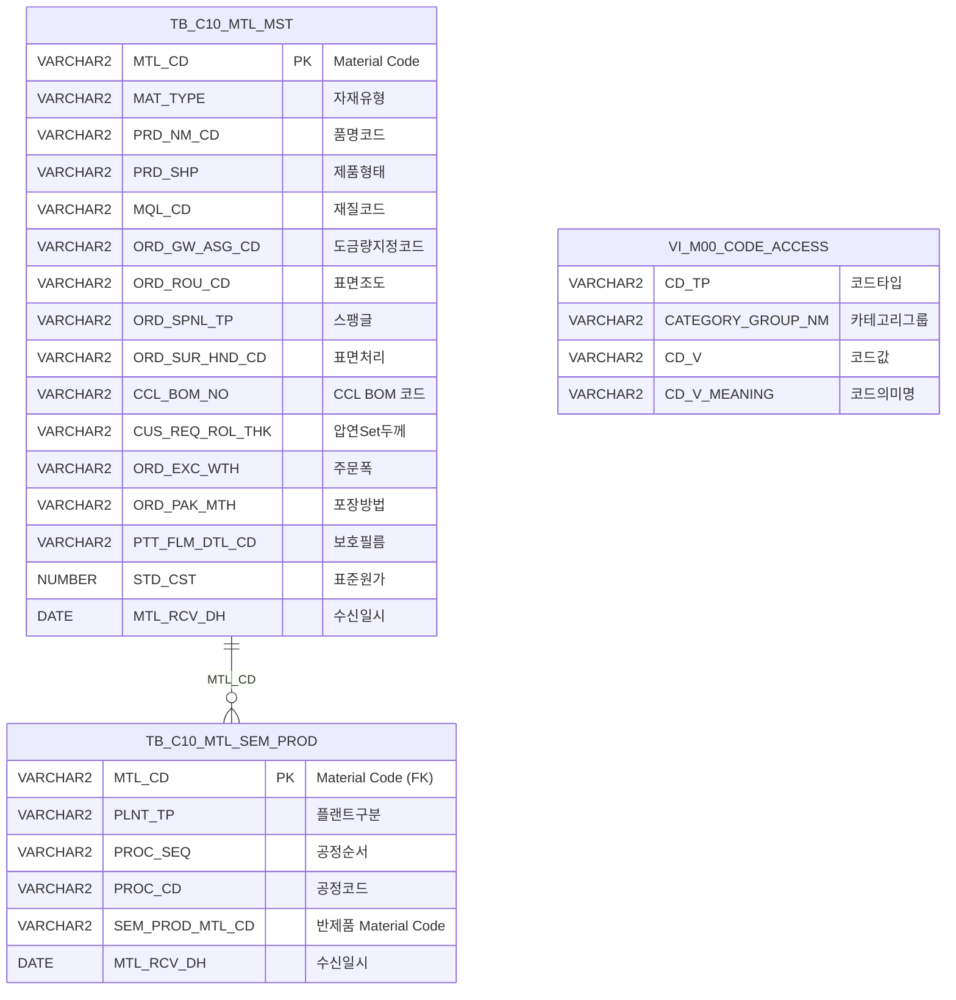

<h1 style="font-size: 40px; text-align: center; font-weight:
   bold; margin: 30px 0;">
  C106000040 레거시 시스템 분석 종합 보고서
</h1>


# 1. 시스템 개요
- **서비스 ID**: C106000040
- **업무명**: Material Code 관리
- **분석 일시**: 2026-03-17 09:41 (KST)
- **전체 Activity 수**: 3개 (Built-in 3개)
- **분석자**: Claude Opus 4.6 / Claude Sonnet 4.6 / Claude Haiku 4.5
- **분석 도구**: /analyze-service C106000040
- **문서 버전**: 1.0

# 📊 비즈니스 프로세스 분석

## 시스템 목적

Material Code 관리 화면은 동국제강 MES C10 모듈에서 자재 마스터(TB_C10_MTL_MST) 정보를 조회하고 관리하기 위한 화면이다. 외부 시스템(EAI)으로부터 수신된 자재 마스터 데이터를 품명코드, 제품유형, 재질코드, 도금량코드 등 다양한 조건으로 검색하여 자재의 제품 속성 정보를 확인할 수 있다.

마스터 그리드에서 특정 자재를 선택하면 해당 자재의 반제품 공정 정보(TB_C10_MTL_SEM_PROD)를 디테일 그리드에서 확인할 수 있는 마스터-디테일 구조로 구성되어 있다. 이를 통해 자재별 공정 순서, 공정코드, 반제품 Material Code 등 생산 공정 경로를 파악할 수 있다.

특히 도금량 지정코드(ORD_GW_ASG_CD)는 품명코드(PRD_NM_CD)에 따라 카테고리 그룹이 동적으로 결정되는 비즈니스 규칙이 적용되어 있어, 강종 계열(아연도금강판 G계열, 알루미늄도금 L계열, 전기아연도금 E계열 등)에 따른 도금량 분류 체계를 반영한다.

## 주요 유즈케이스

### UC-01: 자재 마스터 조회
- **Actor**: 생산관리 담당자
- **목적**: 자재코드, 품명, 제품유형, 재질, 도금량 등 다양한 조건으로 자재 마스터 정보를 검색하여 자재 속성을 확인

- **전제조건**:
  - 사용자가 MES 시스템에 로그인되어 있음
  - TB_C10_MTL_MST에 자재 마스터 데이터가 존재함

- **주요 흐름**:
  1. 사용자가 검색 조건 입력 - MTL_CD(Material Code) 직접 입력 또는 품명코드/제품유형 콤보 선택
  2. 조회 버튼(find) 클릭
  3. 시스템이 입력값 검증 수행 - MTL_CD 또는 (PRD_NM_CD + PRD_SHP) 중 하나 필수 입력 확인
  4. C106000040.select 쿼리 실행 - 6개 파라미터 LIKE 검색 조건으로 TB_C10_MTL_MST 조회
  5. Grid_1에 자재 마스터 목록 표시 (최대 10건 페이징)

- **대체 흐름**:
  - MTL_CD와 품명코드 모두 미입력 시: 필수 입력 검증 메시지 표시
  - 조회 결과 없음: 빈 그리드 표시

- **후행조건**:
  - Grid_1에 자재 목록이 표시됨
  - 사용자가 행 선택하여 디테일 조회 가능

### UC-02: 자재별 반제품 공정 상세 조회
- **Actor**: 생산관리 담당자
- **목적**: 특정 자재의 반제품 공정 경로(플랜트구분, 공정순서, 공정코드, 반제품 Material Code)를 확인

- **전제조건**:
  - UC-01에서 자재 목록이 조회된 상태
  - Grid_1에 데이터가 표시되어 있음

- **주요 흐름**:
  1. 사용자가 Grid_1에서 특정 자재 행 선택 (deteilMtlCd 이벤트 발생)
  2. 선택 행의 MTL_CD 값 추출
  3. C106000040.detailSelect 쿼리 실행 - MTL_CD 조건으로 TB_C10_MTL_SEM_PROD 조회
  4. Grid_2에 반제품 공정 목록 표시 (플랜트구분, 공정순서, 공정코드+명, 반제품코드, 수신일시)

- **대체 흐름**:
  - 반제품 공정 데이터 없음: 빈 디테일 그리드 표시

- **후행조건**:
  - Grid_2에 선택 자재의 공정 경로가 표시됨

### UC-03: 품명코드별 도금량코드 동적 변경
- **Actor**: 생산관리 담당자
- **목적**: 품명코드 선택에 따라 도금량코드 콤보박스의 카테고리를 동적으로 변경하여 해당 강종 계열에 맞는 도금량 코드만 표시

- **전제조건**:
  - 화면이 로드되어 콤보박스가 초기화된 상태

- **주요 흐름**:
  1. 사용자가 품명(PRD_NM_CD) 콤보에서 값 선택
  2. onSelectionChange 이벤트 발생
  3. 선택된 품명코드에 따라 도금량코드(ORD_GW_ASG_CD) 콤보의 카테고리 그룹 변경:
     - G, K, H, Z, J, 3, 6 → SG0000 (아연도금강판 계열)
     - L, M, 4 → SL0000 (알루미늄도금 계열)
     - E, F, 2 → SE0000 (전기아연도금 계열)
  4. 도금량코드 콤보 옵션 목록이 해당 카테고리로 갱신됨

- **대체 흐름**:
  - 매핑되지 않는 품명코드 선택 시: 도금량코드 콤보 변경 없음

- **후행조건**:
  - 도금량코드 콤보에 해당 강종 계열의 코드만 표시됨

### UC-04: 셀 복사 및 엑셀 다운로드
- **Actor**: 생산관리 담당자
- **목적**: 그리드 데이터를 클립보드에 복사하거나 엑셀 파일로 다운로드

- **전제조건**:
  - 그리드에 데이터가 표시된 상태

- **주요 흐름**:
  1. 사용자가 그리드에서 우클릭하여 컨텍스트 메뉴 표시
  2. "셀 복사" 또는 "엑셀 다운로드" 선택
  3. copy_row: 선택 셀 값을 클립보드에 복사
  4. excel_grid: 그리드 전체 데이터를 엑셀 파일로 다운로드

- **대체 흐름**:
  - 데이터 없는 상태에서 실행 시: 빈 결과 반환

- **후행조건**:
  - 클립보드에 셀 값 복사 또는 엑셀 파일 다운로드 완료

---
## 비즈니스 로직 상세

### 1. 품명코드별 도금량 카테고리 분류 (DECODE 기반)

- **목적**: 품명코드(PRD_NM_CD)에 따라 도금량 지정코드(ORD_GW_ASG_CD)의 의미명을 올바른 카테고리 그룹에서 조회
- **처리 케이스**:

  **[케이스 1: 아연도금강판 계열 (SG0000)]**
  ```
    조건: PRD_NM_CD IN ('G', 'K', 'H', 'Z', 'J', '3', '6')
    처리:
      1. VI_M00_CODE_ACCESS 뷰에서 CATEGORY_GROUP_NM = 'SG0000' 조건으로 조회
      2. CD_TP = 'GW_ASG_CD', CD_V = ORD_GW_ASG_CD 매칭
      3. 코드값 + ' : ' + 의미명 형태로 표시
  ```

  **[케이스 2: 알루미늄도금 계열 (SL0000)]**
  ```
    조건: PRD_NM_CD IN ('L', 'M', '4')
    처리:
      1. VI_M00_CODE_ACCESS 뷰에서 CATEGORY_GROUP_NM = 'SL0000' 조건으로 조회
      2. 이하 동일
  ```

  **[케이스 3: SV0000 계열]**
  ```
    조건: PRD_NM_CD IN ('V', '6')
    처리:
      1. VI_M00_CODE_ACCESS 뷰에서 CATEGORY_GROUP_NM = 'SV0000' 조건으로 조회
  ```

  **[케이스 4: SW0000 계열]**
  ```
    조건: PRD_NM_CD IN ('W', '9')
    처리:
      1. VI_M00_CODE_ACCESS 뷰에서 CATEGORY_GROUP_NM = 'SW0000' 조건으로 조회
  ```

  **[케이스 5: 전기아연도금 계열 (SE0000)]**
  ```
    조건: PRD_NM_CD IN ('E', 'F', '2', 'N', '8')
    처리:
      1. VI_M00_CODE_ACCESS 뷰에서 CATEGORY_GROUP_NM = 'SE0000' 조건으로 조회
  ```

- **참고**: SQL의 DECODE와 JSP의 콤보 동적 변경 로직에서 품명코드→카테고리 매핑이 일부 상이함. SQL에는 V→SV0000, W→SW0000 매핑이 존재하나 JSP 이벤트 핸들러에는 G계열→SG0000, L계열→SL0000, E계열→SE0000 3가지만 존재.

### 2. 스칼라 서브쿼리 코드 변환 패턴

- **목적**: TB_C10_MTL_MST의 코드값 컬럼들을 사람이 읽을 수 있는 "코드 : 의미명" 형태로 변환
- **처리 케이스**:

  **[변환 대상 코드 목록]**
  ```
    1. MAT_TYPE (자재유형) → CD_TP='MAT_TYPE', CATEGORY_GROUP_NM='SZ0000'
    2. PRD_NM_CD (품명코드) → CD_TP='PRD_NM_CD', CATEGORY_GROUP_NM='SZ0000'
    3. PRD_SHP (제품형태) → CD_TP='PRD_TP', CATEGORY_GROUP_NM='SZ0000'
    4. MQL_CD (재질코드) → CD_TP='MQL_CD', CATEGORY_GROUP_NM='SZ0000'
    5. ORD_GW_ASG_CD (도금량지정코드) → CD_TP='GW_ASG_CD', CATEGORY_GROUP_NM=DECODE(PRD_NM_CD,...)
    6. ORD_SPNL_TP (스팽글) → CD_TP='MTL_SPNL_TP', CATEGORY_GROUP_NM='SZ0000'
    7. ORD_SUR_HND_CD (표면처리) → CD_TP='ORD_SUR_HND_CD', CATEGORY_GROUP_NM='SZ0000'
    8. ORD_PAK_MTH (포장방법) → CD_TP='ORD_PAK_MTH', CATEGORY_GROUP_NM='SZ0000'
    9. PROC_CD (공정코드, detailSelect) → CD_TP='PROC_CD', CATEGORY_GROUP_NM='SZ0000'
  ```

  **[변환 패턴]**
  ```
    결과 = 원본코드값 || (SELECT ' : ' || CD_V_MEANING FROM VI_M00_CODE_ACCESS WHERE ...)
    예시: 'G : 용융아연도금강판', 'L : 알루미늄도금강판'
  ```

### 3. LIKE 기반 다조건 필터링

- **목적**: 6개 파라미터를 조합하여 자재를 유연하게 검색
- **처리 케이스**:

  **[NVL + LIKE 패턴]**
  ```
    조건: 각 파라미터가 NULL이거나 빈 값일 수 있음
    처리:
      1. NVL(컬럼, ' ') LIKE :파라미터 || '%' 패턴 적용
      2. 파라미터 미입력 시 빈문자열 → '%' 전체 매칭 (전건 조회)
      3. MTL_CD만 NVL 미적용 (NOT NULL 컬럼)
      4. 6개 조건 AND 결합으로 교차 필터링
  ```

---

# 💾 데이터 요구사항

## 핵심 테이블

### 1. TB_C10_MTL_MST - (자재 마스터)
| 컬럼명 | 타입 | PK | 설명 |
|--------|------|----|------|
| MTL_CD | VARCHAR2 | ✅ | Material Code (PK) |
| MAT_TYPE | VARCHAR2 |  | 자재유형 코드 |
| PRD_NM_CD | VARCHAR2 |  | 품명코드 |
| PRD_SHP | VARCHAR2 |  | 제품형태 |
| MQL_CD | VARCHAR2 |  | 재질코드 |
| ORD_GW_ASG_CD | VARCHAR2 |  | 도금량 지정코드 |
| ORD_ROU_CD | VARCHAR2 |  | 표면조도 |
| ORD_SPNL_TP | VARCHAR2 |  | 스팽글 유형 |
| ORD_SUR_HND_CD | VARCHAR2 |  | 표면처리(도금후처리) 코드 |
| CCL_BOM_NO | VARCHAR2 |  | CCL BOM 코드 |
| CUS_REQ_ROL_THK | VARCHAR2 |  | 압연 Set 두께 |
| ORD_EXC_WTH | VARCHAR2 |  | 주문폭 |
| ORD_PAK_MTH | VARCHAR2 |  | 포장방법 코드 |
| PTT_FLM_DTL_CD | VARCHAR2 |  | 보호필름 상세코드 |
| STD_CST | NUMBER |  | 표준원가 |
| MTL_RCV_DH | DATE |  | 자재 수신일시 |

### 2. TB_C10_MTL_SEM_PROD - (자재별 반제품 공정)
| 컬럼명 | 타입 | PK | 설명 |
|--------|------|----|------|
| MTL_CD | VARCHAR2 | ✅ | Material Code (FK → TB_C10_MTL_MST) |
| PLNT_TP | VARCHAR2 |  | 플랜트 구분 |
| PROC_SEQ | VARCHAR2 |  | 공정 순서 |
| PROC_CD | VARCHAR2 |  | 공정코드 |
| SEM_PROD_MTL_CD | VARCHAR2 |  | 반제품 Material Code |
| MTL_RCV_DH | DATE |  | 수신일시 |

### 3. VI_M00_CODE_ACCESS (뷰) - (공통 코드 마스터)
| 컬럼명 | 타입 | PK | 설명 |
|--------|------|----|------|
| CD_TP | VARCHAR2 |  | 코드 타입 |
| CATEGORY_GROUP_NM | VARCHAR2 |  | 카테고리 그룹명 |
| CD_V | VARCHAR2 |  | 코드 값 |
| CD_V_MEANING | VARCHAR2 |  | 코드 의미명 |

## 데이터 플로우

### 1. 자재 마스터 조회
```
[자재 목록 조회]
조회 버튼 클릭 (find)
→ C106000040.select
  FROM TB_C10_MTL_MST
  스칼라 서브쿼리 JOIN VI_M00_CODE_ACCESS (8개 코드 변환)
  WHERE MTL_CD LIKE :MTL_CD || '%'
    AND NVL(PRD_NM_CD,' ') LIKE :PRD_NM_CD || '%'
    AND NVL(PRD_SHP,' ') LIKE :PRD_SHP || '%'
    AND NVL(MQL_CD,' ') LIKE :MQL_CD || '%'
    AND NVL(ORD_GW_ASG_CD,' ') LIKE :ORD_GW_ASG_CD || '%'
    AND NVL(CCL_BOM_NO,' ') LIKE :CCL_BOM_NO || '%'
→ Grid_1에 자재 목록 표시 (16컬럼)
```

### 2. 반제품 공정 상세 조회
```
[반제품 공정 조회]
Grid_1 행 선택 (deteilMtlCd)
→ C106000040.detailSelect
  FROM TB_C10_MTL_SEM_PROD
  스칼라 서브쿼리 JOIN VI_M00_CODE_ACCESS (공정코드 변환)
  WHERE MTL_CD = :MTL_CD
→ Grid_2에 반제품 공정 목록 표시 (6컬럼)
```

## SQL 일람표
| SQL 이름 | 쿼리 ID | 타입 | 출처 | 테이블 |
|---------|---------|-----|-------|-------|
| 자재 목록 조회 | C106000040.select | SELECT | Service | TB_C10_MTL_MST, VI_M00_CODE_ACCESS |
| 반제품 공정 상세 조회 | C106000040.detailSelect | SELECT | Service | TB_C10_MTL_SEM_PROD, VI_M00_CODE_ACCESS |

## ER 다이어그램 (핵심 관계)



관계 설명:
- TB_C10_MTL_MST가 중심 테이블로 자재 마스터 정보의 허브 역할
- TB_C10_MTL_SEM_PROD: MTL_CD를 통해 1:N 관계 (자재 1개에 여러 반제품 공정)
- VI_M00_CODE_ACCESS: 스칼라 서브쿼리로 코드값 → 의미명 변환에 사용 (참조 관계)

---

# 🖥️ 사용자 인터페이스 요구사항

## 화면 레이아웃 상세

### Layout 구조 (absolute 배치)
```javascript
{
  layoutType: "absolute",
  components: [
    {
      id: "C106000040_Form_1",
      type: "form",
      position: { left: 0, top: 0, width: 981, height: 58 },
      service: "C106000040-service",
      actionType: "find",
      referenceItem: "C106000040_Grid_1"
    },
    {
      id: "C106000040_Grid_1",
      type: "grid",
      position: { left: -7, top: 52, width: 977, height: 242 },
      service: "C106000040-service",
      actionType: "find",
      pageset: true, split: 1
    },
    {
      id: "C106000040_Grid_2",
      type: "grid",
      position: { left: 1, top: 309, width: 977, height: 256 },
      service: "C106000040-service",
      actionType: "find",
      pageset: true, split: 0
    },
    {
      id: "C106000040_messagebox",
      type: "messagebox",
      position: { left: 0, top: 567, width: 979, height: 19 }
    }
  ]
}
```

## 입출력 요소

### Form 컴포넌트
**C106000040_Form_1**
- find: Button - 조회 버튼 (disabled=true, 초기 비활성)
- winClose: Button - 닫기 버튼
- MTL_CD: Input - Material Code 입력 (130px, 배경색 #FFFFC0 노란색 강조)
- PRD_NM_CD: Combo - 품명 선택 (75px, 마스터콤보 SZ0000/PRD_NM_CD, 배경색 #FFFFC0)
- PRD_SHP: Combo - 제품유형 선택 (75px, 마스터콤보 SZ0000/PRD_TP, displayType=all-code, 배경색 #FFFFC0)
- MQL_CD: Combo - 재질코드 선택 (75px, 마스터콤보 SZ0000/MQL_CD)
- ORD_GW_ASG_CD: Combo - 도금량코드 선택 (75px, PRD_NM_CD에 따라 카테고리 동적 변경)
- CCL-BOM번호: Input - CCL BOM 번호 입력 (75px)

### Grid 컴포넌트

**C106000040_Grid_1 (Material Code 마스터 목록)**
- 편집 가능 여부: 아니오 (읽기 전용)
- Split: 1 (첫 1개 컬럼 고정)
- 페이징: 10건 단위
- 컨텍스트 메뉴: 셀 복사, 엑셀 다운로드
- 주요 컬럼 (16개):

  **기본 정보**:
  - MTL_CD: ro - Material Code (15%, 중앙정렬, 커스텀 문자열 정렬)
  - MAT_TYPE: ro - 자재유형 (10%, 좌측정렬, 코드:의미명)
  - PRD_NM_CD: ro - 품명코드 (10%, 좌측정렬, 코드:의미명)
  - PRD_SHP: ro - 제품형태 (20%, 좌측정렬, 코드:의미명)

  **재질/도금 정보**:
  - MQL_CD: ro - 재질코드 (16%, 좌측정렬, 코드:의미명)
  - ORD_GW_ASG_CD: ro - 도금량 지정코드 (17%, 좌측정렬, 코드:의미명)
  - ORD_ROU_CD: ro - 표면조도 (10%, 중앙정렬)
  - ORD_SPNL_TP: ro - Spangle (17%, 좌측정렬, 코드:의미명)
  - ORD_SUR_HND_CD: ro - 표면처리 (17%, 좌측정렬, 코드:의미명)

  **제품 속성**:
  - CCL_BOM_NO: ro - CCL BOM 코드 (17%, 중앙정렬)
  - CUS_REQ_ROL_THK: ro - 압연Set두께 (17%, 우측정렬, 정수 정렬)
  - ORD_EXC_WTH: ron - 주문폭 (8%, 우측정렬, 숫자포맷 0,000)
  - ORD_PAK_MTH: ro - 포장방법 (13%, 좌측정렬, 코드:의미명)
  - PTT_FLM_DTL_CD: ro - 보호필름 (10%, 중앙정렬)
  - STD_CST: ro - 표준원가 (10%, 우측정렬, 정수 정렬)

  **수신 정보**:
  - MTL_RCV_DH: dhxCalendarA - 수신일시 (15%, 중앙정렬, YYYY-MM-DD HH24:MI:SS 포맷)

**C106000040_Grid_2 (반제품 공정 목록 - 디테일)**
- 편집 가능 여부: 아니오 (읽기 전용)
- Split: 없음
- 페이징: 10건 단위
- 주요 컬럼 (6개):

  **숨김 컬럼**:
  - MTL_CD: ro - Material Code (숨김, width=0)

  **공정 정보**:
  - PLNT_TP: ro - 플랜트구분 (20%, 중앙정렬)
  - PROC_SEQ: ro - 공정순서 (20%, 중앙정렬, 정수 정렬)
  - PROC_CD: ro - 공정코드 (20%, 중앙정렬, 코드:의미명)
  - SEM_PROD_MTL_CD: ro - 반제품 Material Code (20%, 중앙정렬)
  - MTL_RCV_DH: ro - 수신일시 (20%, 중앙정렬, 날짜 정렬)

## 화면 동작 흐름

### 1. 화면 초기 로딩
```
1. 화면 진입
2. onFormLoadFunction 실행
   - PRD_NM_CD (품명) 마스터 콤보 로드 (SZ0000/PRD_NM_CD)
   - PRD_SHP (제품유형) 마스터 콤보 로드 (SZ0000/PRD_TP, displayType=all-code)
   - MQL_CD (재질코드) 마스터 콤보 로드 (SZ0000/MQL_CD)
   - ORD_GW_ASG_CD (도금량코드) 마스터 콤보 초기 설정
3. PRD_NM_CD onSelectionChange 이벤트 바인딩
   - 품명 변경 시 도금량코드 카테고리 동적 전환
4. find 버튼 초기 disabled 상태
5. Grid_1, Grid_2 빈 상태로 표시
6. 상태바(messagebox) 초기화
```

### 2. 자재 목록 조회
```
1. 사용자가 MTL_CD 입력 또는 PRD_NM_CD/PRD_SHP 콤보 선택
2. 조회 버튼(find) 클릭
3. 입력값 검증 - MTL_CD 또는 (PRD_NM_CD + PRD_SHP) 중 하나 필수
4. uiCommon.parameters(C106000040_Form_1) 호출하여 파라미터 구성
5. basicGridData.do URL로 C106000040-service 호출 (actionType: find)
6. C106000040.select 쿼리 실행
7. Grid_1에 결과 바인딩 (페이징 10건)
8. findMessage 콜백으로 상태바에 조회 결과 메시지 표시
```

### 3. 디테일 공정 조회 (마스터-디테일 연동)
```
1. Grid_1에서 자재 행 선택
2. deteilMtlCd 이벤트 발생 (rowSelected)
3. 선택 행의 MTL_CD 값 추출
4. handleDataProcess.do URL로 C106000040-service 호출 (detailFind)
5. C106000040.detailSelect 쿼리 실행 (MTL_CD 파라미터)
6. Grid_2에 반제품 공정 목록 바인딩
```

### 4. 품명코드 변경에 따른 도금량코드 갱신
```
1. PRD_NM_CD 콤보에서 새 품명코드 선택
2. onSelectionChange 이벤트 발생
3. 선택값에 따라 ORD_GW_ASG_CD 콤보 카테고리 변경:
   - G,K,H,Z,J,3,6 → SG0000
   - L,M,4 → SL0000
   - E,F,2 → SE0000
4. 도금량코드 콤보 옵션 목록 갱신
```

## JavaScript 모듈

**C106000040.jsp** (메인 화면 스크립트 - JSP 내 inline)
- find(): 자재 목록 조회 - MTL_CD 또는 품명+제품유형 필수 검증 후 Grid_1 데이터 로딩
- deteilMtlCd(): Grid_1 행 선택 시 MTL_CD로 Grid_2 디테일 자동 조회
- onFormLoadFunction(): 폼 초기화 - 마스터 콤보 설정, PRD_NM_CD 변경 이벤트 바인딩
- onGridLoadFunction(): Grid_1 로드 완료 이벤트 핸들러
- onGridContextMenuClick(): 컨텍스트 메뉴 - copy_row(셀 복사), excel_grid(엑셀 다운로드)
- findMessage(): 조회 완료 메시지 상태바 표시 (appMsg 사용자 데이터 기반)
- onAfterUpdateFinishEvent(): 업데이트 완료 후 폼 데이터프로세서 리셋

## 주요 이벤트 핸들러

**find (조회 버튼 클릭)**
- 이벤트 타입: Form Button Click
- 처리 내용:
  1. MTL_CD 입력값 확인
  2. MTL_CD 미입력 시 PRD_NM_CD + PRD_SHP 필수 검증
  3. Form 파라미터 구성
  4. C106000040-service 호출 (find 액션)
  5. Grid_1에 결과 바인딩

**deteilMtlCd (마스터 그리드 행 선택)**
- 이벤트 타입: Grid Row Selected
- 처리 내용:
  1. Grid_1에서 선택된 행의 MTL_CD 값 추출
  2. detailFind 액션으로 C106000040-service 호출
  3. Grid_2에 반제품 공정 목록 바인딩

**PRD_NM_CD onSelectionChange (품명코드 변경)**
- 이벤트 타입: Combo Selection Change
- 처리 내용:
  1. 선택된 품명코드 값 확인
  2. 품명코드→카테고리 매핑 (G계열→SG0000, L계열→SL0000, E계열→SE0000)
  3. ORD_GW_ASG_CD 콤보의 카테고리 그룹 변경
  4. 도금량코드 옵션 목록 갱신

---

# 📌 특이사항 및 주의사항

## 1. 품명코드-도금량 카테고리 매핑 불일치
- **SQL vs JSP 매핑 차이**: SQL의 DECODE에는 V→SV0000, W→SW0000, 6→SV0000 등 5개 카테고리(SG/SL/SV/SW/SE)가 정의되어 있으나, JSP의 콤보 동적 변경 이벤트에는 3개 카테고리(SG/SL/SE)만 구현되어 있음. 이로 인해 V, W 계열 품명코드 선택 시 도금량코드 콤보가 올바른 카테고리로 변경되지 않을 수 있음.
- **6번 코드 중복 매핑**: SQL에서 품명코드 '6'이 SG0000(아연도금 계열)과 SV0000 계열 모두에 매핑되어 있어, DECODE 우선순위에 따라 SG0000이 적용됨.

## 2. 미사용 쿼리 잔존
- **update/delete/insert 쿼리**: 쿼리 파일(C106000040-query.glue_sql)에 EMP 테이블 대상의 update, delete, insert 쿼리가 정의되어 있으나 서비스 XML에서 참조하지 않음. 이는 GLUE Framework 초기 템플릿의 샘플 쿼리로 추정되며, 실제 자재 마스터와 무관한 EMP(사원) 테이블 대상 쿼리임. 코드 정리가 필요함.

## 3. 읽기 전용 조회 화면
- 본 서비스는 순수 조회 전용 화면으로, Custom Activity 없이 Built-in FormSearch Activity만 사용. 데이터 CUD(생성/수정/삭제) 기능이 없으며, 자재 마스터 데이터는 외부 시스템(EAI)에서 수신하여 관리됨.

## 4. NVL 기반 널 처리 패턴
- 검색 조건에서 `NVL(컬럼, ' ') LIKE :param || '%'` 패턴을 사용하여, 컬럼값이 NULL인 레코드도 검색 대상에 포함. 파라미터 미입력 시 빈문자열과 '%' 결합으로 전건 매칭되나, NULL 컬럼은 공백(' ')으로 대체되어 빈문자열 LIKE '%' 조건에 매칭됨.

## 5. Grid_1의 컬럼 너비 합계 초과
- Grid_1의 16개 컬럼 너비 합계가 100%를 초과 (약 222%). colwidthUnit이 '%'로 설정되어 있어 수평 스크롤이 발생하며, 실제 화면에서 모든 컬럼을 한눈에 보기 어려운 구조.

---

# 📚 참고 문서

- **Query SQL**: `src/query/C106000040-query.glue_sql`
- **Service XML**: `src/service/C106000040-service.xml`
- **JSP**: `WebContents/C106000040.jsp`
- **Form XML**: `WebContents/header/kr/C106000040/C106000040_Form_1.xml`
- **Grid XML**: `WebContents/header/kr/C106000040/C106000040_Grid_1.xml`, `WebContents/header/kr/C106000040/C106000040_Grid_2.xml`
