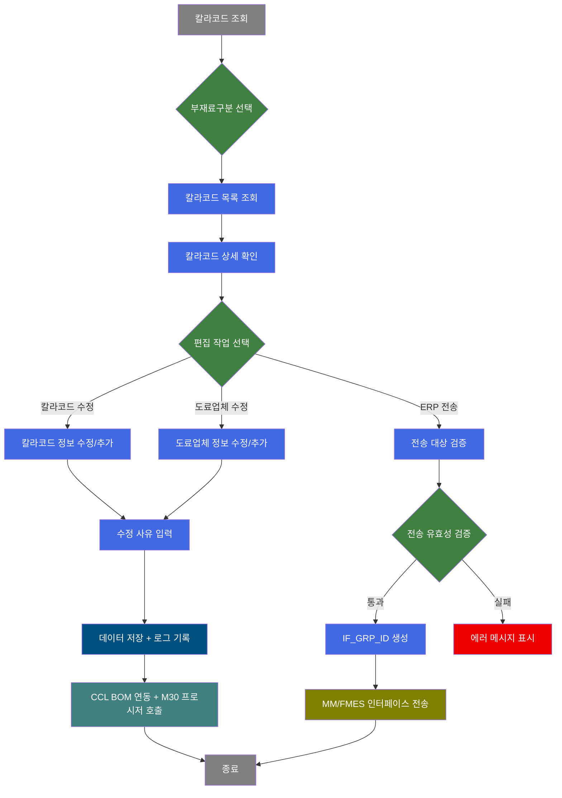
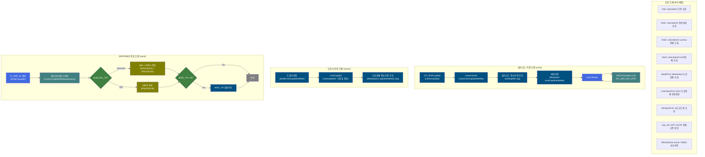
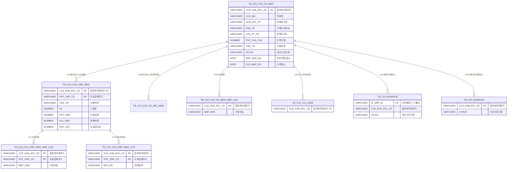

<h1 style="font-size: 40px; text-align: center; font-weight:
   bold; margin: 30px 0;">
  C106000050 칼라코드관리 레거시 시스템 분석 종합 보고서
</h1>


# 1. 시스템 개요
- **서비스 ID**: C106000050
- **업무명**: 칼라코드관리
- **분석 일시**: 2026-03-17 09:47 KST
- **전체 Activity 수**: 23개 (Built-in 21, Common 1, Custom 1)
- **분석자**: Claude Opus 4.6 / Claude Sonnet 4.6
- **분석 도구**: /analyze-service C106000050
- **문서 버전**: 1.0

# 📊 비즈니스 프로세스 분석

## 시스템 목적

칼라코드관리(C106000050)는 CCL(Color Coating Line) 공정에서 사용하는 칼라 부자재(도료, 시너, 잉크, 보호필름, Lamina, UGS필름 등) 코드를 등록·관리하고, 해당 정보를 SAP MM(자재관리) 및 FMES(생산관리)로 인터페이스 전송하는 마스터 관리 화면이다.

부자재 유형(SUB_MTL_TP)에 따라 10개 이상의 카테고리(S31=PCM도료, S32=Primer, S33=Thinner, S34=Ink, S35=Clear, S36=보호필름, S37=도장기타, S38=구매Lamina, S39=UGS필름, S40=생산Lamina, S41=필름용도료, S49=생산UGS필름, ZZZ=대표색상)를 관리하며, 각 카테고리별로 화면에 표시되는 컬럼이 동적으로 변경된다. 칼라코드별로 복수의 도료업체(TB_C10_CLR_CMP_MNG)를 등록하여 업체별 물성 정보(고형분, 도료비중, 용제비중, 입자 정보 등)를 관리한다.

ERP/FMES 전송 기능은 칼라 부자재 정보가 수정된 후 전송 대상을 식별(LAST_UPDATE_TIMESTAMP > ERP_SND_DH)하여 SAP MM으로 일괄 전송하며, 생산Lamina(S40) 및 생산UGS필름(S49)인 경우 FMES로 추가 전송한다. 2025년 추가된 내수/수입 구분(ZFLAG) 로직에 따라 SAP 전송 파라미터가 동적으로 결정된다.

## 핵심 워크플로우 다이어그램



### 상세 워크플로우 다이어그램



## 주요 유즈케이스

### UC-01: 칼라코드 조회
- **Actor**: CCL 공정 관리자 / 구매 담당자
- **목적**: 부재료구분별 칼라 부자재 코드 목록을 조회하여 현재 등록 상태를 확인

- **전제조건**:
  - 사용자가 시스템에 로그인되어 있음
  - 부재료구분 마스터 코드(SZ0000/SUB_MTL_TP_CD)가 등록되어 있음

- **주요 흐름**:
  1. 부재료구분(SUB_MTL_TP_SH) 콤보에서 카테고리 선택 → Grid_1 컬럼 동적 표시/숨김 적용
  2. 선택적으로 컬러코드(CLR_SUB_MTL_CD_SH), TYPE구분(TP_CD), 수지타입(RSN_TP_SH) 등 필터 입력
  3. 조회 버튼 클릭 → C106000050.colorselect 실행 (TB_C10_CLR_CD_MNG 기반)
  4. Grid_1에 칼라코드 목록 표시 (88개 컬럼, 부재료구분에 따라 가시성 동적 변경)
  5. Grid_1 행 선택 시 → C106000050.detailselect 자동 실행 → Grid_2에 해당 칼라코드의 도료업체 목록 표시

- **대체 흐름**:
  - 전송대상(SND_LST) 체크 시: colorselect2 쿼리로 ERP 미전송 건만 조회
  - Lamina전체(L_TOT) 체크 시: colorselect2 쿼리로 구매+생산 Lamina 조회
  - UGS전체(U_TOT) 체크 시: colorselect3 쿼리로 구매+생산 UGS필름(S39/S49) 조회
  - 엑셀출력 버튼 클릭 시: C106000050xls.select 실행 후 엑셀 다운로드

- **후행조건**:
  - Grid_1에 칼라코드 목록이 표시됨
  - SND_LST='Y'인 행은 빨간색, PUR_CHR_CFM 상태에 따라 녹색/파란색 행 텍스트 적용

### UC-02: 칼라코드 등록/수정
- **Actor**: CCL 공정 관리자
- **목적**: 신규 칼라 부자재 코드를 등록하거나 기존 정보를 수정

- **전제조건**:
  - 칼라코드 목록이 조회된 상태
  - 수정 권한이 있음

- **주요 흐름**:
  1. Menu_1에서 행추가 클릭 → Grid_1에 신규 행 추가 (컬러코드 컬럼 ed 타입으로 변경)
  2. 부재료구분별 필수항목 입력 (S31=PCM도료: 색상명, 수지타입, 광택도코드, 도막두께 등 / S33=Thinner: 색상명, 부재료구분만 / S36=보호필름: 보호필름 관련 코드 등)
  3. 저장 버튼 클릭 → 부재료구분별 필수항목 검증
  4. 수지타입 변경 시 MTC NOTE 편집기준 AJAX 체크 (C106000050.rule_chk)
  5. updated/deleted 행 존재 시 팝업(C106000050pop01) 통해 수정 사유 입력
  6. 확인 다이얼로그 표시 후 저장 실행:
     - CCL BOM update (cclbomupdate) → colorinsert/colorupdate/colordelete → 수정 로깅(clrMngMdf_log) → 파일저장 → Loop Router → PL_M30_INS_UPD 프로시저 호출

- **대체 흐름**:
  - 필수항목 누락 시: 해당 필드명과 함께 경고 메시지 표시
  - 컬러코드 5자리 초과/미만 시: "컬러코드는 5자리로 입력하세요" 경고
  - 색상명 40byte 초과 시: "색상명은 40byte 이하로 입력하세요" 경고

- **후행조건**:
  - TB_C10_CLR_CD_MNG에 칼라코드 정보 저장
  - TB_C10_CLR_CD_MNG_MDF_LOG에 수정 이력 기록
  - CCL BOM(TB_C10_CCL_BOM) 연동 업데이트
  - PL_M30_INS_UPD 프로시저로 M30 부자재 마스터 연동

### UC-03: 도료업체 정보 관리
- **Actor**: CCL 공정 관리자 / 구매 담당자
- **목적**: 칼라코드별 도료업체 정보(물성, MSDS, 입자 정보 등)를 등록/수정

- **전제조건**:
  - Grid_1에서 특정 칼라코드 행이 선택된 상태
  - Grid_2에 해당 칼라코드의 도료업체 목록이 표시된 상태

- **주요 흐름**:
  1. Menu_2에서 행추가 클릭 → Grid_2에 신규 행 추가 (업체코드 combo_v 동적 로드)
  2. 업체코드 선택 및 물성 정보 입력 (고형분, 도료비중, 용제비중, 도료원단위, 입자 정보, 소광제 정보 등)
  3. Form_3의 저장 버튼 클릭 → 칼라코드/업체코드 필수 검증
  4. 팝업(C106000050pop01) 통해 수정 사유 입력
  5. 도료사저장(detailinsert/update/delete) → ColorUpdate(colorupdate2: 수정일 자동 갱신) → 도료업체 정보수정 로깅(detailupsert_log/detaildelete_log)

- **대체 흐름**:
  - MSDS 셀 클릭: C106000050pop03 팝업으로 MSDS 파일 다운로드
  - Grid_1 선택 행 없이 행추가 시: "칼라코드를 먼저 선택하세요" 경고

- **후행조건**:
  - TB_C10_CLR_CMP_MNG에 도료업체 정보 저장
  - TB_C10_CLR_CMP_MNG_MDF_LOG에 수정 이력 기록
  - 칼라코드 수정일(CLR_MDF_DH) 자동 갱신

### UC-04: ERP/FMES 전송
- **Actor**: CCL 공정 관리자
- **목적**: 수정된 칼라 부자재 정보를 SAP MM 및 FMES로 인터페이스 전송

- **전제조건**:
  - Grid_1에서 전송 대상 행이 선택된 상태
  - 해당 칼라코드에 도료업체가 1건 이상 등록되어 있음

- **주요 흐름**:
  1. 전송 버튼 클릭 → 선택 행 유효성 검증 (컬러코드 ZZZ/공백 불가, 색상명 40byte, 수지타입명 40byte)
  2. 도료업체 등록 여부 AJAX 확인 (C106000050.compAjaxFind)
  3. FMES 기존 전송이력 확인 (IFB10S0150.check)
  4. 전송 확인 다이얼로그 → IF_GRP_ID 생성 → C10UiC106000050SendActivity 실행
  5. 각 칼라코드별: 전송일시 업데이트 → MES 조회 → EAI INSERT(MM) → (S40/S49 시) FMES INSERT → (MOD_YN='M' 시) MOD_YN 업데이트

- **대체 흐름**:
  - ZZZ(대표색상) 코드 전송 시도: "대표색상은 전송할 수 없습니다" 경고
  - 도료업체 미등록 시: "도료업체가 등록되지 않은 칼라코드입니다" 경고
  - MES 마스터 조회 0건: FAILURE 반환 + 오류 메시지
  - ZFLAG='2'(수입/보세): SAP 전송 시 ZFLAG="X" 설정

- **후행조건**:
  - EAIAPUSER.TB_C10_B10S0130에 MM 인터페이스 데이터 삽입
  - (S40/S49) EAIAPUSER.TB_C10_B10S0150에 FMES 인터페이스 데이터 삽입
  - ERP_SND_DH 전송일시 갱신
  - MOD_YN 플래그 초기화

### UC-05: 수정이력 조회
- **Actor**: CCL 공정 관리자 / 품질 담당자
- **목적**: 칼라코드 또는 도료업체 정보의 수정 이력을 조회하여 변경 추적

- **전제조건**:
  - 칼라코드가 조회된 상태

- **주요 흐름**:
  1. Form_1의 수정이력조회 버튼 클릭 → C106000050pop04 팝업 오픈 (칼라코드 수정이력)
  2. 또는 Form_3의 수정이력조회 버튼 클릭 → C106000050pop02 팝업 오픈 (도료업체 수정이력)

- **대체 흐름**: 없음

- **후행조건**:
  - 팝업에서 수정 이력 목록이 표시됨

### UC-06: 파일 관리 (도장사양서/원가내역서/MSDS)
- **Actor**: CCL 공정 관리자
- **목적**: 칼라코드별 도장사양서, 원가내역서, MSDS 파일을 등록/조회

- **전제조건**:
  - Grid_1 또는 Grid_2에서 대상 행이 선택된 상태

- **주요 흐름**:
  1. Grid_1 도장사양서(MIMAGE_YN) 셀 클릭 → C106000050pop06 팝업 (파일 등록)
  2. Grid_1 원가내역서(MFILE_YN) 셀 클릭 → C106000050pop07 팝업 (파일 다운로드)
  3. Grid_2 MSDS(DOC_YN) 셀 클릭 → C106000050pop03 팝업 (MSDS 파일 다운로드)

- **대체 흐름**: 없음

- **후행조건**:
  - TB_C10_CLR_CD_IMG_MNG에 파일 정보 저장

---

## 비즈니스 로직 상세

### 1. EAI 인터페이스 전송 로직 (C10UiC106000050SendActivity)

- **목적**: 칼라 부자재 정보를 MM(자재관리) 및 FMES로 인터페이스 전송
- **처리 케이스**:

  **[케이스 1: MM 전송 (모든 부자재)]**
  ```
    조건: 전송 대상 칼라코드가 선택됨 (ZZZ 제외)
    처리:
      1. 전송일시(ERP_SND_DH) 현재 시각으로 업데이트
      2. MES 칼라 부자재 마스터 조회 (사용여부, 도료업체코드, 업체명)
      3. 각 도료업체별 30여 개 필드를 파라미터로 구성
      4. ZFLAG 판별: '2'(수입/보세) → ZFLAG="X", 기타(내수) → ZFLAG=""
      5. IFB10S0130_INSERT 실행 (EAI → SAP MM 인터페이스 삽입)
  ```

  **[케이스 2: FMES 추가 전송 (S40/S49만)]**
  ```
    조건: SUB_MTL_TP = 'S40'(생산Lamina) 또는 'S49'(생산UGS필름)
    처리:
      1. FMES 기존 전송이력 조회 (IFB10S0150_CHECK)
      2. 전송이력 0건 → XCRUD="C"(신규), PNT_FLM_THK 유지
      3. 전송이력 있음 → XCRUD="U"(수정), PNT_FLM_THK=""(공백처리)
      4. IFB10S0150_INSERT 실행 (EAI → FMES 인터페이스 삽입)
  ```

  **[케이스 3: MOD_YN 플래그 업데이트]**
  ```
    조건: MOD_YN[i] == "M" (수정 완료 상태)
    처리:
      1. 해당 칼라코드의 MOD_YN 플래그 업데이트 (C106000050.updateModYn)
  ```

- **예외 처리**:
  - IDS 파라미터 없음: PosException("IDS가 존재하지 않습니다.")
  - MES 마스터 조회 0건: FAILURE 반환 + "C106000050_CHECK_ERR" 메시지
  - 처리 중 Exception: PosException("[첫번째 코드] : 처리중에 오류가 발생했습니다") - idx=0 고정 버그

### 2. ERP 전송대상 식별 로직 (SND_LST)

- **목적**: ERP에 아직 전송되지 않은 변경 데이터를 식별
- **처리 케이스**:

  **[CASE WHEN 비교 로직]**
  ```
    조건: LAST_UPDATE_TIMESTAMP > NVL(ERP_SND_DH, 기본값)
    결과: SND_LST = 'Y' (전송 필요)

    조건: LAST_UPDATE_TIMESTAMP <= NVL(ERP_SND_DH, 기본값)
    결과: SND_LST = 'N' (전송 완료)
  ```

### 3. 부재료구분별 컬럼 가시성 로직

- **목적**: 부재료구분(SUB_MTL_TP)에 따라 Grid_1 컬럼을 동적으로 표시/숨김 처리
- **처리 케이스**:

  **[S31/S32/S35/ZZZ/S41: PCM도료/Primer/Clear/대표색상/필름용도료]**
  ```
    표시: 도막두께, 광택도, 작업점도, 수지타입, 색차기준 등 전체 주요 항목
    숨김: Lamina 관련, 보호필름 관련 컬럼
  ```

  **[S33: Thinner]**
  ```
    표시: 컬러코드, 색상명, 부재료구분 등 기본 항목만
    숨김: 광택도, 도막두께, 수지타입, Lamina, 보호필름 등 대부분 숨김
  ```

  **[S36: 보호필름]**
  ```
    표시: 보호필름 관련 컬럼 (광택코드, 두께코드, 재질코드, SUS점착력, 제품점착력)
    숨김: 도료 관련 컬럼
  ```

  **[S38/S40: 구매Lamina/생산Lamina]**
  ```
    표시: Lamina유형, 접착제코드(1C/2C), 시너코드(1C/2C), 필름두께코드
    숨김: 보호필름 관련 컬럼
  ```

### 4. CCL BOM 연동 및 M30 프로시저 호출

- **목적**: 칼라코드 저장 시 CCL BOM 정보 업데이트 및 M30 부자재 마스터 동기화
- **처리 케이스**:

  **[CCL BOM 업데이트]**
  ```
    조건: 칼라코드 저장 시 (save 흐름)
    처리:
      1. C106000050.cclbomupdate 실행 (C10APUSER.TB_C10_CCL_BOM UPDATE)
      2. 칼라코드의 변경 정보를 CCL BOM에 반영
  ```

  **[M30 부자재 마스터 동기화]**
  ```
    조건: 파일저장 완료 후 Loop Router 통해 반복
    처리:
      1. MESAPUSER.PL_M30_INS_UPD 프로시저 호출
      2. 파라미터: SUB_MTL_TP, CLR_SUB_MTL_CD, USERNO
      3. M30 부자재 마스터에 칼라코드 정보 Insert/Update
  ```

---

# ⚙️ Java 컴포넌트 분석

## Custom Activity 상세 분석

### 1개 Custom Activity 발견

### 1. C10UiC106000050SendActivity (칼라부자재코드전송)
- **클래스명**: com.unionsteel.mes.c10.activity.ui.C10UiC106000050SendActivity
- **액티비티명**: 칼라부자재코드전송
- **파일 경로**: src/com/unionsteel/mes/c10/activity/ui/C10UiC106000050SendActivity.java
- **주요 기능**: 칼라 부자재(색상 소재) 정보 및 도료사 정보를 MM(자재관리 시스템) 및 FMES로 인터페이스 전송
- **라인 수**: 412 라인 | **메소드 수**: 5개

> 다건 처리를 지원하며, 선택된 각 항목에 대해 전송일시 업데이트 → MES 조회 → EAI INSERT → (조건부) FMES INSERT → (조건부) MOD_YN 업데이트 순으로 처리한다. 내수/수입 구분 플래그(ZFLAG)에 따라 SAP/FMES 전송값을 동적으로 결정하는 비즈니스 로직을 포함한다.

📎 **[상세 분석 보고서](../customClass/com.unionsteel.mes.c10.activity.ui.C10UiC106000050SendActivity_class_analysis.md)**

---

# 💾 데이터 요구사항

## 핵심 테이블

### 1. TB_C10_CLR_CD_MNG - (칼라코드 마스터 관리)
| 컬럼명 | 타입 | PK | 설명 |
|--------|------|----|------|
| CLR_SUB_MTL_CD | VARCHAR2 | ✅ | 칼라부자재코드 (5자리) |
| CLR_NM | VARCHAR2 | | 색상명 |
| SUB_MTL_TP | VARCHAR2 | | 부재료구분 (S31~S41, S49, ZZZ) |
| TP_CD | VARCHAR2 | | TYPE구분 |
| RSN_TP | VARCHAR2 | | 구매수지타입 |
| RSN_TP_QT_BR | VARCHAR2 | | 품질수지타입 |
| LUS_RT_CD | VARCHAR2 | | 광택도코드 |
| RL_LUS_RT | NUMBER | | 실광택값 |
| LUS_RT_LLV | NUMBER | | 광택하한 |
| LUS_RT_ULV | NUMBER | | 광택상한 |
| EX_YN | VARCHAR2 | | 광택제외여부 |
| COL_DIF_STD | NUMBER | | 색차기준 |
| WK_VISCO | NUMBER | | 작업점도 |
| PNT_FLM_THK | NUMBER | | 도막두께 |
| PRT_INK_TP | VARCHAR2 | | INK TYPE코드 |
| NV | NUMBER | | 고형분 |
| PNT_GRA | NUMBER | | 도료비중 |
| SLV_GRA | NUMBER | | 용제비중 |
| THR_CD | VARCHAR2 | | 적용시너코드 |
| PNT_UNT | NUMBER | | 도료원단위 |
| PMT | NUMBER | | PMT |
| QT_L | NUMBER | | L (색좌표) |
| QT_A | NUMBER | | A (색좌표) |
| QT_B | NUMBER | | B (색좌표) |
| RSN_TP_QT | VARCHAR2 | | 품질수지 |
| PAT_CD | VARCHAR2 | | 안료코드 |
| FUNC_CD | VARCHAR2 | | 기능코드 |
| TTE_CD | VARCHAR2 | | 질감코드 |
| USE_POS_CD | VARCHAR2 | | 사용위치코드 |
| WTY_YN | VARCHAR2 | | 보증여부 |
| STD_CLR_NM | VARCHAR2 | | 표준색상명 |
| LMN_KND_TP | VARCHAR2 | | Lamina유형 |
| LMN_BND_CD | VARCHAR2 | | Lamina접착제코드(1C) |
| LMN_BND_THR_CD | VARCHAR2 | | Lamina접착제시너코드(1C) |
| LMN_BND_CD1 | VARCHAR2 | | Lamina접착제코드(2C) |
| LMN_BND_THR_CD1 | VARCHAR2 | | Lamina접착제시너코드(2C) |
| LMN_FLM_THK_CD | VARCHAR2 | | Lamina필름두께코드 |
| PTT_FLM_LUS_RT_CD | VARCHAR2 | | 보호필름광택코드 |
| PTT_FLM_THK_CD | VARCHAR2 | | 보호필름두께코드 |
| PTT_FLM_MQL_CD | VARCHAR2 | | 보호필름재질코드 |
| PTT_FLM_SUS_ADH_CD | VARCHAR2 | | 보호필름SUS점착력코드 |
| PTT_FLM_PRD_ADH_CD | VARCHAR2 | | 보호필름제품점착력코드 |
| MGR_CLR_SUB_MTL_CD | VARCHAR2 | | 통합컬러코드 |
| CLR_SUB_MTL_CD_OLD | VARCHAR2 | | (구)컬러코드 |
| RSN_TP_OLD | VARCHAR2 | | (구)수지타입 |
| LUS_RT_CD_OLD | VARCHAR2 | | (구)광택도코드 |
| PNT_FLM_THK_OLD | NUMBER | | (구)도막두께 |
| RAL_CD | VARCHAR2 | | RAL CODE/라미나필름사 CODE |
| RMRK | VARCHAR2 | | 비고 |
| ZFLAG | VARCHAR2 | | 내수수입구분 (1=내수, 2=수입) |
| USE_YN | VARCHAR2 | | 사용여부 |
| MOD_YN | VARCHAR2 | | 수정여부 |
| LAMINA_INS_YN | VARCHAR2 | | 라미나수입검사여부 |
| PUR_CHR_CFM | VARCHAR2 | | 구매담당자확정 |
| ERP_SND_DH | DATE | | ERP전송일시 |
| CLR_MDF_DH | DATE | | 칼라코드수정일시 |
| CREATED_OBJECT_ID | VARCHAR2 | | 등록자ID |
| LAST_UPDATED_OBJECT_ID | VARCHAR2 | | 최종수정자ID |
| RGS_DH | DATE | | 등록일시 |
| LAST_UPDATE_TIMESTAMP | DATE | | 최종수정일시 |

### 2. TB_C10_CLR_CMP_MNG - (칼라 도료업체 관리)
| 컬럼명 | 타입 | PK | 설명 |
|--------|------|----|------|
| CLR_SUB_MTL_CD | VARCHAR2 | ✅ | 칼라부자재코드 (FK → TB_C10_CLR_CD_MNG) |
| PNT_CMP_CD | VARCHAR2 | ✅ | 도료업체코드 |
| USE_YN | VARCHAR2 | | 사용여부 |
| NV | NUMBER | | 고형분 |
| PNT_GRA | NUMBER | | 도료비중 |
| SLV_GRA | NUMBER | | 용제비중 |
| PNT_UNT | NUMBER | | 도료원단위 |
| CCL_TXT | VARCHAR2 | | CCL 텍스트 |
| PTC_YN | VARCHAR2 | | 입자유무 |
| PTC_TYPE | VARCHAR2 | | 입자TYPE |
| TEX_KND | VARCHAR2 | | 질감종류 |
| PTC_MIN | NUMBER | | 입자MIN |
| PTC_MAX | NUMBER | | 입자MAX |
| PTC_AVG | NUMBER | | 입자AVG |
| CMT | VARCHAR2 | | 비고 |
| QUE_MIN | NUMBER | | 소광제MIN |
| QUE_MAX | NUMBER | | 소광제MAX |
| QUE_AVG | NUMBER | | 소광제AVG |

### 3. TB_C10_CLR_CD_MNG_MDF_LOG - (칼라코드 수정 이력 로그)
| 컬럼명 | 타입 | PK | 설명 |
|--------|------|----|------|
| CLR_SUB_MTL_CD | VARCHAR2 | ✅ | 칼라부자재코드 |
| MDF_RSN | VARCHAR2 | | 수정사유 |
| 전체 칼라코드 필드 | - | | TB_C10_CLR_CD_MNG의 전체 컬럼 INSERT SELECT |

### 4. TB_C10_CLR_CMP_MNG_MDF_LOG - (도료업체 수정 이력 로그)
| 컬럼명 | 타입 | PK | 설명 |
|--------|------|----|------|
| CLR_SUB_MTL_CD | VARCHAR2 | ✅ | 칼라부자재코드 |
| PNT_CMP_CD | VARCHAR2 | ✅ | 도료업체코드 |
| MDF_RSN | VARCHAR2 | | 수정사유 |

### 5. TB_C10_CLR_CD_IMG_MNG - (칼라코드 이미지 파일 관리)
| 컬럼명 | 타입 | PK | 설명 |
|--------|------|----|------|
| CLR_SUB_MTL_CD | VARCHAR2 | ✅ | 칼라부자재코드 |
| 파일 관련 컬럼 | - | | 도장사양서, 원가내역서 파일 정보 |

### 6. TB_C10_CLR_CMP_MNG_FILE - (도료업체 MSDS 파일 관리)
| 컬럼명 | 타입 | PK | 설명 |
|--------|------|----|------|
| CLR_SUB_MTL_CD | VARCHAR2 | ✅ | 칼라부자재코드 |
| PNT_CMP_CD | VARCHAR2 | ✅ | 도료업체코드 |
| REV_DD | VARCHAR2 | | 개정일자 |

### 7. C10APUSER.TB_C10_CCL_BOM - (CCL BOM)
| 컬럼명 | 타입 | PK | 설명 |
|--------|------|----|------|
| CLR_SUB_MTL_CD | VARCHAR2 | | 칼라부자재코드 (FK) |
| 기타 BOM 관련 | - | | CCL BOM 칼라코드 연동 정보 |

### 8. EAIAPUSER.TB_C10_B10S0130 - (EAI MM 인터페이스)
| 컬럼명 | 타입 | PK | 설명 |
|--------|------|----|------|
| IF_GRP_ID | VARCHAR2 | ✅ | 인터페이스 그룹 ID |
| CLR_SUB_MTL_CD | VARCHAR2 | | 칼라부자재코드 |
| ZFLAG | VARCHAR2 | | 내수/수입 구분 (X=수입, 공백=내수) |
| 30여 개 인터페이스 필드 | - | | SAP MM 전송 대상 필드 |

### 9. EAIAPUSER.TB_C10_B10S0150 - (EAI FMES 인터페이스)
| 컬럼명 | 타입 | PK | 설명 |
|--------|------|----|------|
| CLR_SUB_MTL_CD | VARCHAR2 | ✅ | 칼라부자재코드 |
| XCRUD | VARCHAR2 | | C=신규, U=수정 |
| PNT_FLM_THK | NUMBER | | 도막두께 (수정 시 공백) |

## 데이터 플로우

### 1. 조회

```
[칼라코드 기본 조회 (find)]
화면 진입 → 부재료구분 선택
→ C106000050.colorselect
  FROM TB_C10_CLR_CD_MNG
  LEFT OUTER JOIN TB_C10_CLR_CD_IMG_MNG (도장사양서/원가내역서 파일 존재 여부)
  LEFT OUTER JOIN TB_C10_CLR_CD_IMG (이미지 정보)
  + 서브쿼리 VI_M00_CODE_ACCESS (부재료구분명, 수지타입명, 광택도명, INK TYPE명 등 10여 개 코드명)
  + 서브쿼리 TB_M30_SMTL_CD (시너코드명)
  + 서브쿼리 TB_M90_EMP_INF (등록자명, 수정자명)
  WHERE SUB_MTL_TP_SH(동적), CLR_SUB_MTL_CD_SH(전방일치), TP_CD, RSN_TP_SH, RSN_TP_QT_BR_SH, PRT_INK_TP_SH
→ Grid_1에 칼라코드 목록 표시

[전송대상 조회 (find1)]
SND_LST 체크박스 선택
→ C106000050.colorselect2 (인라인 뷰)
  FROM TB_C10_CLR_CD_MNG
  + SND_LST = CASE WHEN LAST_UPDATE_TIMESTAMP > NVL(ERP_SND_DH,...) THEN 'Y' ELSE 'N' END
  외부 WHERE SND_LST = 'Y'
→ Grid_1에 ERP 미전송 건만 표시

[UGS 전체 조회 (find3)]
U_TOT 체크박스 선택
→ C106000050.colorselect3
  FROM TB_C10_CLR_CD_MNG
  WHERE SUB_MTL_TP IN ('S39', 'S49')
→ Grid_1에 UGS 관련 부자재만 표시

[도료업체 상세 조회 (detailFind)]
Grid_1 행 선택
→ C106000050.detailselect
  FROM TB_C10_CLR_CMP_MNG A
  + 서브쿼리 VI_M00_CODE_ACCESS (업체코드명)
  + 서브쿼리 TB_C10_CLR_CMP_MNG_FILE (MSDS 파일 존재 여부, 개정일자)
  WHERE A.CLR_SUB_MTL_CD = :CLR_SUB_MTL_CD
→ Grid_2에 도료업체 목록 표시
```

### 2. 칼라코드 저장 (save)

```
[칼라코드 저장 흐름]
저장 버튼 클릭 → 필수항목 검증 → 수정 사유 팝업
→ CCL BOM update: C106000050.cclbomupdate
  UPDATE C10APUSER.TB_C10_CCL_BOM SET ... WHERE CLR_SUB_MTL_CD = :CLR_SUB_MTL_CD
→ customInsert: C106000050.colorinsert / colorupdate / colordelete
  INSERT INTO TB_C10_CLR_CD_MNG (...) VALUES (...)
  UPDATE TB_C10_CLR_CD_MNG SET ... WHERE CLR_SUB_MTL_CD = :CLR_SUB_MTL_CD
  DELETE FROM TB_C10_CLR_CD_MNG WHERE CLR_SUB_MTL_CD = :CLR_SUB_MTL_CD
→ 칼라코드 정보수정 로깅: C106000050.clrMngMdf_log
  INSERT INTO TB_C10_CLR_CD_MNG_MDF_LOG (SELECT ... FROM TB_C10_CLR_CD_MNG WHERE CLR_SUB_MTL_CD = :CLR_SUB_MTL_CD)
→ 파일저장: C106000050.fileuploadinsert / fileuploadupdate / fileuploaddelete
  C10APUSER.TB_C10_CLR_CD_IMG_MNG
→ Loop Router → M30 Procedure Call
  MESAPUSER.PL_M30_INS_UPD(SUB_MTL_TP, CLR_SUB_MTL_CD, USERNO)
```

### 3. 도료사 저장 (save1)

```
[도료업체 정보 저장 흐름]
Form_3 저장 버튼 → 검증 → 수정 사유 팝업
→ 도료사저장: C106000050.detailinsert / detailupdate / detaildelete
  INSERT INTO TB_C10_CLR_CMP_MNG (...) VALUES (...)
  UPDATE TB_C10_CLR_CMP_MNG SET ... WHERE CLR_SUB_MTL_CD = :CLR_SUB_MTL_CD AND PNT_CMP_CD = :PNT_CMP_CD
  DELETE FROM TB_C10_CLR_CMP_MNG WHERE CLR_SUB_MTL_CD = :CLR_SUB_MTL_CD AND PNT_CMP_CD = :PNT_CMP_CD
→ ColorUpdate: C106000050.colorupdate2
  UPDATE TB_C10_CLR_CD_MNG SET CLR_MDF_DH = SYSDATE WHERE CLR_SUB_MTL_CD = :CLR_SUB_MTL_CD
→ 도료업체 정보수정 로깅: C106000050.detailupsert_log / detaildelete_log
  INSERT INTO TB_C10_CLR_CMP_MNG_MDF_LOG (...) VALUES (...)
```

### 4. ERP/FMES 전송 (send)

```
[ERP/FMES 인터페이스 전송 흐름]
전송 버튼 → 유효성 검증 → AJAX 확인 → IF_GRP_ID 생성
→ C10UiC106000050SendActivity:
  1) UPDATE TB_C10_CLR_CD_MNG SET ERP_SND_DH = SYSDATE (mesdao)
  2) SELECT USE_YN, PNT_CMP_CD, PNT_CMP_NM FROM TB_C10_CLR_CMP_MNG (mesdao)
  3) SELECT COUNT FROM EAIAPUSER.TB_C10_B10S0150 (mesdao)
  4) INSERT INTO EAIAPUSER.TB_C10_B10S0130 (eaidao, MM 전송)
  5) INSERT INTO EAIAPUSER.TB_C10_B10S0150 (eaidao, FMES 전송, S40/S49만)
  6) UPDATE TB_C10_CLR_CD_MNG SET MOD_YN (mesdao, MOD_YN='M' 시)
```

## SQL 일람표

| SQL 이름 | 쿼리 ID | 타입 | 출처 | 테이블 |
|---------|---------|------|------|--------|
| 시너코드 AJAX 조회 | C106000050.thinAjaxFind | SELECT | Service | TB_M30_SMTL_CD |
| ERP 전송대상 조회 | C106000050.colorselect2 | SELECT | Service | TB_C10_CLR_CD_MNG, VI_M00_CODE_ACCESS, TB_M90_EMP_INF |
| MTC NOTE 편집기준 확인 | C106000050.rule_chk | SELECT | Service | M00APUSER.VI_M00_M20B3030 |
| 도료업체 상세 조회 | C106000050.detailselect | SELECT | Service | TB_C10_CLR_CMP_MNG, VI_M00_CODE_ACCESS, TB_C10_CLR_CMP_MNG_FILE |
| 엑셀출력 조회 | C106000050xls.select | SELECT | Service | TB_C10_CLR_CD_MNG, TB_C10_CLR_CMP_MNG, VI_M00_CODE_ACCESS, TB_M90_EMP_INF |
| 칼라코드 기본 조회 | C106000050.colorselect | SELECT | Service | TB_C10_CLR_CD_MNG, TB_C10_CLR_CD_IMG_MNG, VI_M00_CODE_ACCESS, TB_M30_SMTL_CD, TB_M90_EMP_INF, TB_C10_CLR_CD_IMG |
| 칼라코드 AJAX 조회 | C106000050.colorAjaxFind | SELECT | Service | C10APUSER.TB_C10_CLR_CD_MNG |
| FMES 전송이력 확인 | IFB10S0150.check | SELECT | Service | EAIAPUSER.TB_C10_B10S0150 |
| UGS 전체 조회 | C106000050.colorselect3 | SELECT | Service | TB_C10_CLR_CD_MNG, TB_C10_CLR_CD_IMG_MNG, VI_M00_CODE_ACCESS, TB_M90_EMP_INF, TB_C10_CLR_CD_IMG |
| 도료업체 등록확인 AJAX | C106000050.compAjaxFind | SELECT | Service | C10APUSER.TB_C10_CLR_CMP_MNG |
| CCL BOM 업데이트 | C106000050.cclbomupdate | UPDATE | Service | C10APUSER.TB_C10_CCL_BOM |
| 칼라코드 추가 | C106000050.colorinsert | INSERT | Service | TB_C10_CLR_CD_MNG |
| 칼라코드 수정 | C106000050.colorupdate | UPDATE | Service | TB_C10_CLR_CD_MNG |
| 칼라코드 삭제 | C106000050.colordelete | DELETE | Service | TB_C10_CLR_CD_MNG |
| 이미지파일 등록 | C106000050.fileuploadinsert | INSERT | Service | C10APUSER.TB_C10_CLR_CD_IMG_MNG |
| 이미지파일 수정 | C106000050.fileuploadupdate | UPDATE | Service | TB_C10_CLR_CD_IMG_MNG |
| 이미지파일 삭제 | C106000050.fileuploaddelete | DELETE | Service | C10APUSER.TB_C10_CLR_CD_IMG_MNG |
| 칼라코드 수정 로그 | C106000050.clrMngMdf_log | INSERT | Service | TB_C10_CLR_CD_MNG_MDF_LOG, TB_C10_CLR_CD_MNG |
| 도료사 수정일 갱신 | C106000050.colorupdate2 | UPDATE | Service | TB_C10_CLR_CD_MNG |
| 도료사 수정 로그 | C106000050.detailupsert_log | INSERT | Service | TB_C10_CLR_CMP_MNG_MDF_LOG |
| 도료사 삭제 로그 | C106000050.detaildelete_log | INSERT | Service | TB_C10_CLR_CMP_MNG_MDF_LOG |
| 도료사 추가 | C106000050.detailinsert | INSERT | Service | TB_C10_CLR_CMP_MNG |
| 도료사 삭제 | C106000050.detaildelete | DELETE | Service | TB_C10_CLR_CMP_MNG |
| 도료사 수정 | C106000050.detailupdate | UPDATE | Service | TB_C10_CLR_CMP_MNG |

## ER 다이어그램 (핵심 관계)



관계 설명:
- **TB_C10_CLR_CD_MNG**가 중심 테이블로 모든 관계의 허브 역할
- 칼라코드(CLR_SUB_MTL_CD)를 기준으로 도료업체, 이미지파일, 수정이력, CCL BOM, EAI 인터페이스 테이블과 1:N 관계
- TB_C10_CLR_CMP_MNG는 복합 PK(CLR_SUB_MTL_CD + PNT_CMP_CD)로 칼라코드별 복수 업체 관리
- EAIAPUSER 스키마의 인터페이스 테이블은 전송 시에만 INSERT되는 단방향 데이터 흐름

---

# 🖥️ 사용자 인터페이스 요구사항

## 화면 레이아웃 상세

### Layout 구조 (initLayout)
```javascript
{
  itemType: "layout",
  dirType: "row",           // 수직(위→아래) 3단 분할
  childSize: "60,50%,*",    // Form:60px, 칼라코드영역:50%, 도료업체영역:나머지
  splitter: false,
  messageBox: true,          // 하단 상태바
  components: [
    {
      id: "form_area",
      height: "60px",
      component: {
        itemType: "form",
        formId: "C106000050_Form_1"    // 조회 조건 폼
      }
    },
    {
      id: "grid1_area",
      height: "50%",
      component: {
        itemType: "layout",
        dirType: "row",
        childSize: "30,*",             // Menu:30px, Grid:나머지
        components: [
          { itemType: "menu", menuId: "C106000050_Menu_1" },
          { itemType: "grid", gridId: "C106000050_Grid_1" }
        ]
      }
    },
    {
      id: "grid2_area",
      height: "*",
      component: {
        itemType: "layout",
        dirType: "row",
        childSize: "30,*",
        components: [
          {
            itemType: "layout",
            dirType: "col",            // 가로(좌→우) 분할
            childSize: "70%,*",        // Menu_2:70%, Form_3:나머지
            components: [
              { itemType: "menu", menuId: "C106000050_Menu_2" },
              { itemType: "form", formId: "C106000050_Form_3" }
            ]
          },
          { itemType: "grid", gridId: "C106000050_Grid_2" }
        ]
      }
    }
  ]
}
```

## 입출력 요소

### Form 컴포넌트

**C106000050_Form_1 (조회 조건 폼)**
- SUB_MTL_TP_SH: Combo - 부재료구분 (SZ0000/SUB_MTL_TP_CD 마스터)
- CLR_SUB_MTL_CD_SH: Input - 컬러코드 (5자리, 소문자 자동 대문자 변환, Enter키 조회)
- TP_CD: Combo - TYPE구분 (SZ0000/TP_CD, 주황색 강조)
- RSN_TP_SH: Combo - 구매수지타입 (SZ0000/RSN_TP, 주황색 강조)
- RSN_TP_QT_BR_SH: Combo - 품질수지타입 (SZ0000/RSN_TP_QT_BR, 주황색 강조)
- PRT_INK_TP_SH: Combo - INK TYPE (SZ0000/PRT_INK_TP, 주황색 강조)
- RAL_CD: Input - 찾기 (10자리)
- SND_LST: Checkbox - 전송대상 (주황색 강조)
- L_TOT: Checkbox - 구매+생산Lamina조회용 (주황색 강조)
- U_TOT: Checkbox - 구매+생산UGS필름조회용 (주황색 강조)
- unusedCode: LinkButton → 미사용 코드 팝업
- excelExport: CustomButton → 엑셀출력
- send: CustomButton → 전송 (주황색, 초기 disabled)
- find: Button → 조회 (초기 disabled)
- save: Button → 저장 (초기 disabled)
- winClose: Button → 닫기
- C10_linkC106000050pop04: LinkButton → 수정이력조회 팝업

**C106000050_Form_3 (도료업체 저장/수정이력 조회)**
- C10_linkC106000050pop02: LinkButton → 수정이력조회 팝업
- save1: Button → 저장 (초기 disabled)

### Grid 컴포넌트

**C106000050_Grid_1 (칼라코드 목록)**
- 편집 가능 여부: 예 (대부분 컬럼 편집 가능, 노란색 배경)
- Split: 0 (고정 컬럼 없음)
- 페이징: 10건/페이지
- 주요 컬럼 (88개):

  **숨김 컬럼**:
  - SUB_MTL_TP_NM: ro - 부재료구분명 (숨김)
  - RSN_TP_NM: ro - 구매수지타입명 (숨김)
  - LUS_RT_NM: ro - 광택도명 (숨김)
  - PRT_INK_TP_NM: ro - INK TYPE명 (숨김)
  - THR_NM: ro - 적용시너코드명 (숨김)
  - LMN_KND_TP_NM: ro - Lamina유형명 (숨김)
  - PTT_FLM_LUS_RT_NM: ro - 보호필름광택도코드명 (숨김)
  - PTT_FLM_THK_NM: ro - 보호필름두께코드명 (숨김)
  - PTT_FLM_MQL_NM: ro - 보호필름재질코드명 (숨김)
  - PTT_FLM_SUS_ADH_NM: ro - 보호필름SUS점착력코드명 (숨김)
  - PTT_FLM_PRD_ADH_NM: ro - 보호필름제품점착력코드명 (숨김)
  - SUB_MTL_TP_HIDDEN: ro - 부재료구분(숨김복사) (숨김)
  - LMN_FLM_THK_CD_NM: ro - Lamina필름두께코드명 (숨김)
  - SND_LST: ro - 전송대상 (숨김)
  - USERNO: ro - 사용자사번 (숨김)
  - MDF_RSN: txt - 수정사유 (숨김)
  - RSN_TP_QT_NM: ro - 품질수지한자리명 (숨김)
  - PAT_CD_NM: ro - 안료명 (숨김)
  - FUNC_CD_NM: ro - 기능명 (숨김)
  - TTE_CD_NM: ro - 질감명 (숨김)
  - USE_POS_CD_NM: ro - 사용위치명 (숨김)
  - WTY_YN_NM: ro - 보증여부명 (숨김)
  - RSN_TP_QT_BR_NM: ro - 품질수지타입명 (숨김)
  - PCM_SPEC_FILE1: ro - PCM사양서파일 (숨김)
  - COST_STM_FILE1: ro - 원가내역서파일 (숨김)
  - LAST_UPDATED_OBJECT_ID: ro - 등록수정자 (숨김)

  **기본 정보**:
  - USE_YN: ch - 사용여부 (40px, 중앙정렬, 편집가능)
  - CLR_SUB_MTL_CD: ro - 컬러코드 (50px, 중앙정렬, 읽기전용)
  - CLR_NM: ed - 색상명 (150px, 좌측정렬, 편집가능, 노란배경)
  - SUB_MTL_TP: combo_v - 부재료구분 (130px, 중앙정렬, 편집가능, SZ0000/SUB_MTL_TP_CD)

  **분류/속성 정보**:
  - TP_CD: combo_v - TYPE구분 (150px, 편집가능, SZ0000/TP_CD)
  - RSN_TP: combo_v - 구매수지타입 (260px, 편집가능, SZ0000/RSN_TP)
  - RSN_TP_QT_BR: combo_v - 품질수지타입 (260px, 편집가능, SZ0000/RSN_TP_QT_BR)

  **광택/색차 정보**:
  - LUS_RT_CD: combo_v - 광택도코드 (160px, 편집가능, SZ0000/LUS_RT_CD)
  - RL_LUS_RT: edn - 실광택값 (60px, 편집가능, 000.0)
  - LUS_RT_LLV: edn - 광택하한 (60px, 편집가능, 000.0)
  - LUS_RT_ULV: edn - 광택상한 (60px, 편집가능, 000.0)
  - EX_YN: ch - 광택제외여부 (40px, 편집가능)
  - COL_DIF_STD: edn - 색차기준 (70px, 편집가능, 000.0)
  - EX_YN1: ch - 색차제외여부 (40px, 편집가능)

  **도료 물성 정보**:
  - WK_VISCO: edn - 작업점도 (40px, 편집가능, 0,000)
  - PNT_FLM_THK: edn - 도막두께 (40px, 편집가능, 0,000)
  - PRT_INK_TP: combo_v - INK TYPE코드 (200px, 편집가능, SZ0000/PRT_INK_TP)
  - NV: ed - 고형분 (60px, 편집가능)
  - PNT_GRA: ed - 도료비중 (60px, 편집가능)
  - SLV_GRA: ed - 용제비중 (60px, 편집가능)
  - THR_CD: ed - 적용시너코드 (60px, 편집가능, AJAX 시너명 조회)
  - PNT_UNT: ed - 도료원단위 (60px, 편집가능)
  - PMT: ed - PMT (60px, 편집가능)

  **색좌표/품질 정보**:
  - QT_L: ed - L (50px, 편집가능)
  - QT_A: ed - A (50px, 편집가능)
  - QT_B: ed - B (50px, 편집가능)
  - RSN_TP_QT: combo_v - 품질수지 (130px, 편집가능, SZ0000/RSN_TP_QT)
  - PAT_CD: combo_v - 안료 (130px, 편집가능, SZ0000/PAT_CD)
  - FUNC_CD: combo_v - 기능 (130px, 편집가능, SZ0000/FUNC_CD)
  - TTE_CD: combo_v - 질감 (130px, 편집가능, SZ0000/TTE_CD)
  - USE_POS_CD: combo_v - 사용위치 (130px, 편집가능, SZ0000/USE_POS_CD)
  - WTY_YN: combo_v - 보증여부 (130px, 편집가능, SZ0000/WTY_YN)
  - STD_CLR_NM: ed - 표준색상명 (100px, 편집가능)

  **Lamina 관련**:
  - LMN_KND_TP: combo_v - Lamina유형 (160px, 편집가능, SZ0000/LMN_KND_TP)
  - LMN_BND_CD: ed - Lamina접착제코드(1C) (100px, 편집가능)
  - LMN_BND_THR_CD: ed - Lamina접착제시너코드(1C) (100px, 편집가능)
  - LMN_BND_CD1: ed - Lamina접착제코드(2C) (100px, 편집가능)
  - LMN_BND_THR_CD1: ed - Lamina접착제시너코드(2C) (100px, 편집가능)
  - LMN_FLM_THK_CD: combo_v - Lamina필름두께코드 (120px, 편집가능, SZ0000/LMN_FLM_THK_CD)

  **보호필름 관련**:
  - PTT_FLM_LUS_RT_CD: combo_v - 보호필름광택코드 (150px, 편집가능, SZ0000/PTT_FLM_LUS_RT_CD)
  - PTT_FLM_THK_CD: combo_v - 보호필름두께코드 (80px, 편집가능, SZ0000/PTT_FLM_THK_CD)
  - PTT_FLM_MQL_CD: combo_v - 보호필름재질코드 (150px, 편집가능, SZ0000/PTT_FLM_MQL_CD)
  - PTT_FLM_SUS_ADH_CD: combo_v - 보호필름SUS점착력코드 (250px, 편집가능, SZ0000/PTT_FLM_SUS_ADH_CD)
  - PTT_FLM_PRD_ADH_CD: combo_v - 보호필름제품점착력코드 (180px, 편집가능, SZ0000/PTT_FLM_PRD_ADH_CD)

  **기타/관리 정보**:
  - RMRK: ed - 비고 (160px, 좌측정렬, 편집가능)
  - MIMAGE_YN: ro - 도장사양서 (100px, 클릭 시 파일 등록 팝업)
  - MFILE_YN: ro - 원가내역서 (100px, 클릭 시 파일 다운로드 팝업)
  - RGS_PRS_ID: ro - 등록자 (80px, 읽기전용)
  - RGS_DH: ro - 등록일 (120px, 읽기전용)
  - MDF_PRS_ID: ro - 수정자 (80px, 읽기전용)
  - CLR_MDF_DH: ro - 수정일 (120px, 읽기전용)
  - MGR_CLR_SUB_MTL_CD: ed - 통합컬러코드 (60px, 편집가능)
  - CLR_SUB_MTL_CD_OLD: ed - (구)컬러코드 (60px, 편집가능)
  - RSN_TP_OLD: ed - (구)수지타입 (60px, 편집가능)
  - LUS_RT_CD_OLD: ed - (구)광택도코드 (80px, 편집가능)
  - PNT_FLM_THK_OLD: ed - (구)도막두께 (60px, 편집가능)
  - ERP_SND_DH: ro - ERP전송일시 (120px, 읽기전용)
  - MOD_YN: ro - 수정여부 (80px, 읽기전용)
  - RAL_CD: ed - RAL CODE/라미나필름사 CODE (90px, 편집가능)
  - ZFLAG: combo_v - 내수수입구분 (70px, 편집가능, 정적: 1=내수, 2=수입)
  - LAMINA_INS_YN: ch - 라미나수입검사여부 (50px, 편집가능)
  - PUR_CHR_CFM: ro - 구매담당자확정 (50px, 읽기전용)

**C106000050_Grid_2 (도료업체 목록)**
- 편집 가능 여부: 예 (대부분 편집 가능)
- Split: 0
- Multiselect: true
- 주요 컬럼 (24개):

  **숨김 컬럼**:
  - USE_YN_BAK: ch - 사용여부 백업 (숨김)
  - MOD_YN_BAK: ro - 수정여부 백업 (숨김)
  - MDF_RSN: txt - 수정사유 (숨김)

  **기본 정보**:
  - USE_YN: ch - 사용여부 (50px, 편집가능)
  - CLR_SUB_MTL_CD: ro - 컬러코드 (100px, 읽기전용)
  - PNT_CMP_CD: ro - 업체코드 (220px, 읽기전용, 행추가 시 combo_v 동적 변경)
  - PNT_CMP_NM: ro - 업체코드명 (220px, 좌측정렬, 읽기전용)

  **문서 정보**:
  - DOC_YN: ro - MSDS (100px, 클릭 시 파일 다운로드 팝업, 노란배경)
  - REV_DD: ro - 개정일자 (220px, 읽기전용)
  - CCL_TXT: ed - CCL (220px, 좌측정렬, 편집가능)

  **물성 정보**:
  - NV: edn - 고형분 (100px, 편집가능, 00,000.00)
  - PNT_GRA: edn - 도료비중 (100px, 편집가능, 00,000.00)
  - SLV_GRA: edn - 용제비중 (100px, 편집가능, 00,000.00)
  - PNT_UNT: edn - 도료원단위 (100px, 편집가능, 00,000.00)

  **입자 정보**:
  - PTC_YN: edn - 입자유무 (100px, 편집가능)
  - PTC_TYPE: edn - 입자TYPE (100px, 편집가능)
  - TEX_KND: edn - 질감종류 (100px, 편집가능)
  - PTC_MIN: edn - 입자MIN (100px, 편집가능, 00,000.00)
  - PTC_MAX: edn - 입자MAX (100px, 편집가능, 00,000.00)
  - PTC_AVG: edn - 입자AVG (100px, 편집가능, 00,000.00)
  - CMT: edn - 비고 (220px, 편집가능)

  **소광제 정보**:
  - QUE_MIN: edn - 소광제MIN (100px, 편집가능, 00,000.00)
  - QUE_MAX: edn - 소광제MAX (100px, 편집가능, 00,000.00)
  - QUE_AVG: edn - 소광제AVG (100px, 편집가능, 00,000.00)

## 화면 동작 흐름

### 1. 화면 초기 로딩
```
1. 화면 진입
2. Form_1 콤보 마스터 로드
   - SUB_MTL_TP_CD, RSN_TP, RSN_TP_QT_BR, PRT_INK_TP, TP_CD 콤보 초기화
3. Grid_1 콤보 컬럼 마스터 로드
   - 부재료구분, 수지타입, 광택도코드, INK TYPE, 보호필름 관련 코드,
     Lamina 관련 코드, 품질수지, 안료, 기능, 질감, 사용위치, 보증여부, 내수수입구분 등
4. Grid_1 onSelectStateChanged 이벤트 바인딩 (행 선택 시 Grid_2 자동 조회)
5. 부재료구분 선택 변경 시 Grid_1 컬럼 동적 표시/숨김 적용
6. 상태바(messagebox) 초기화
```

### 2. 칼라코드 조회
```
1. 사용자가 부재료구분 선택 → Grid_1 컬럼 가시성 자동 변경
2. 선택적 필터 입력 (컬러코드, TYPE구분, 수지타입, 품질수지타입, INK TYPE)
3. 체크박스 조합에 따라 eventName 결정:
   - 기본: find (colorselect)
   - SND_LST 체크: find1 (colorselect2, 전송대상만)
   - L_TOT 체크: find2 (colorselect2, Lamina전체)
   - U_TOT 체크: find3 (colorselect3, UGS전체)
4. uiCommon.parameters(C106000050_Form_1) 호출하여 파라미터 구성
5. C106000050-service 호출 (find/find1/find2/find3)
6. Grid_1에 결과 바인딩
7. findAfterEvent: SND_LST='Y' → 빨간색, PUR_CHR_CFM 상태에 따라 녹색/파란색 적용
```

### 3. 칼라코드 저장
```
1. Grid_1에서 데이터 수정 또는 행추가
2. 저장 버튼 클릭
3. 부재료구분별 필수항목 클라이언트 검증:
   - S31/S32/S35: 색상명, 수지타입, 광택도코드, 도막두께
   - S33: 색상명
   - S34: 색상명, 광택도코드
   - S36: 보호필름 관련 코드
   - 기타: 부재료구분별 고유 필수항목
4. 수지타입 변경 시 AJAX 호출 (rule_chk): MTC NOTE 편집기준 확인
5. updated/deleted 행 존재 시 수정 사유 팝업(C106000050pop01) 오픈
6. 확인 다이얼로그 → 서비스 호출 (save):
   CCL BOM → colorinsert/update/delete → 수정로그 → 파일저장 → PL_M30_INS_UPD
7. 저장 완료 후 재조회
```

### 4. ERP/FMES 전송
```
1. Grid_1에서 전송 대상 행 선택
2. 전송 버튼 클릭
3. 유효성 검증:
   - 컬러코드 ZZZ/공백 불가
   - 색상명, 수지타입명 40byte 이하
4. AJAX 호출 (compAjaxFind): 도료업체 등록 여부 확인
5. 전송 확인 다이얼로그
6. IF_GRP_ID 생성 → C10UiC106000050SendActivity 실행
7. 전송 완료 후 재조회
```

### 5. 도료업체 관리
```
1. Grid_1에서 칼라코드 행 선택 → Grid_2에 도료업체 목록 자동 표시
2. Menu_2 행추가 → 업체코드 combo_v 동적 로드 (SZ0000/PNT_CMP_CD)
3. 도료업체 물성 정보 입력
4. Form_3 저장 → 검증 → 수정 사유 팝업
5. 서비스 호출 (save1):
   detailinsert/update/delete → colorupdate2 → detailupsert_log/detaildelete_log
```

## JavaScript 모듈

**C106000050.jsp (메인 화면 스크립트 - 인라인)**
- initLayout 객체: 화면 레이아웃 정의 (3단 row 레이아웃)
- find(): 체크박스 조합(SND_LST/L_TOT/U_TOT)에 따라 find/find1/find2/find3 분기 조회
- save(): Grid_1 부재료구분별 필수항목 검증 → MTC NOTE 편집기준 AJAX 체크 → 수정 사유 팝업 → 저장
- save1(): Grid_2 도료업체 필수 검증 → 수정 사유 팝업 → 도료사 저장
- send(): 전송 유효성 검증 → 도료업체 등록확인 AJAX → IF_GRP_ID 생성 → 전송
- deteilFind(): Grid_1 행 선택 시 Grid_2 도료업체 자동 조회 (onSelectStateChanged)
- onFormLoadFunction(): Form_1 콤보 마스터 로드, 부재료구분 변경 시 컬럼 가시성 제어
- onGrid1LoadFunction(): Grid_1 콤보 컬럼 마스터 로드 (15개 이상 콤보)
- onEditCellEvent(): Grid_1 셀 편집 검증 (컬러코드 5자리, 색상명 40자, 시너코드 AJAX 조회 등)
- findAfterEvent(): Grid_1 행 색상 조건부 적용 (SND_LST/PUR_CHR_CFM 기준)
- doImgPopUp10/11/2(): 도장사양서/원가내역서/MSDS 파일 팝업
- onCheckboxEvent(): Grid_1 체크박스 변경 시 행 상태 업데이트

## 주요 이벤트 핸들러

**onFormLoadFunction (Form_1 초기화)**
- 이벤트 타입: Form Load
- 처리 내용:
  1. 부재료구분(SUB_MTL_TP_SH) 콤보 마스터 로드
  2. TYPE구분(TP_CD), 수지타입(RSN_TP_SH), 품질수지타입(RSN_TP_QT_BR_SH), INK TYPE(PRT_INK_TP_SH) 콤보 초기화
  3. 부재료구분 변경 시 Grid_1 컬럼 동적 표시/숨김 처리 함수 바인딩
  4. 10개 부재료구분 유형별 가시 컬럼 세트 정의

**onGrid1LoadFunction (Grid_1 초기화)**
- 이벤트 타입: Grid Load
- 처리 내용:
  1. Grid_1의 15개 이상 combo_v 컬럼에 마스터 코드 로드
  2. onSelectStateChanged 이벤트에 deteilFind 바인딩
  3. Grid_1 행 선택 시 Grid_2 자동 조회 연동

**find (조회)**
- 이벤트 타입: Button Click / Enter Key
- 처리 내용:
  1. SND_LST/L_TOT/U_TOT 체크박스 조합 확인
  2. eventName 결정 (find/find1/find2/find3)
  3. uiCommon.parameters(C106000050_Form_1)으로 파라미터 구성
  4. C106000050-service 호출
  5. Grid_1에 결과 바인딩 + 행 색상 적용

**save (칼라코드 저장)**
- 이벤트 타입: Button Click
- 처리 내용:
  1. Grid_1 변경 행 순회
  2. 부재료구분별 필수항목 검증 (S31~S41/ZZZ별 상이)
  3. 수지타입 변경 시 MTC NOTE AJAX 체크
  4. updated/deleted 행 시 수정 사유 팝업
  5. C106000050-service (save) 호출

**send (ERP/FMES 전송)**
- 이벤트 타입: Button Click
- 처리 내용:
  1. 선택 행 컬러코드 ZZZ/공백 검증
  2. 색상명/수지타입명 40byte 검증
  3. 도료업체 등록확인 AJAX (compAjaxFind)
  4. FMES 송신이력 확인
  5. IF_GRP_ID 생성 → C10UiC106000050SendActivity 실행

---

# 📌 특이사항 및 주의사항

## 1. 다중 부재료구분에 따른 컬럼 동적 제어 복잡성
- **10개 이상의 부재료구분 유형**(S31~S41, S49, ZZZ)에 따라 Grid_1의 88개 컬럼 중 표시/숨김이 동적으로 변경됨. 이 로직이 JavaScript에 하드코딩되어 있어, 부재료구분 추가 시 JS와 SQL 모두 수정 필요
- **부재료구분별 필수항목도 JS에 하드코딩**: save() 함수 내에서 부재료구분별로 다른 필수항목을 체크하며, 이 검증 로직이 서버가 아닌 클라이언트에만 존재

## 2. ERP 전송 대상 식별 로직 (SND_LST)
- **LAST_UPDATE_TIMESTAMP와 ERP_SND_DH 비교**로 전송 대상을 식별하는데, 이 두 필드의 시간 정밀도 불일치가 있을 수 있음
- colorselect2 쿼리의 인라인 뷰 구조로 인해 SND_LST 계산이 매 조회 시 수행되어 대량 데이터 시 성능 영향 가능

## 3. 이중 인터페이스 전송 및 FMES 수정 시 도막두께 공백 처리
- SUB_MTL_TP가 S40/S49인 경우에만 FMES 추가 전송하며, **FMES 수정 시 PNT_FLM_THK(도막두께)를 의도적으로 공백 처리**하는 특이 로직이 존재. FMES 측에서 수정 건의 도막두께를 자체 관리하는 것으로 추정되나, 이 동작의 비즈니스 근거가 코드에 명시되지 않음

## 4. 예외 메시지 idx=0 고정 버그
- C10UiC106000050SendActivity의 `idx` 변수가 0으로 초기화된 후 루프에서 업데이트되지 않아, 다건 전송 시 오류가 발생하면 **항상 첫 번째 항목의 코드가 에러 메시지에 표시**됨. 실제 오류 발생 항목을 식별하기 어려움

## 5. 수정 이력 로그의 INSERT-SELECT 패턴
- clrMngMdf_log 쿼리가 `INSERT INTO ... SELECT ... FROM TB_C10_CLR_CD_MNG WHERE CLR_SUB_MTL_CD = :CLR_SUB_MTL_CD` 패턴을 사용하여 수정 전 전체 행을 로그 테이블에 복사함. 수정 사유(MDF_RSN)는 별도 컬럼으로 추가

## 6. 다중 스키마 참조
- **MESAPUSER** (메인 MES 스키마), **C10APUSER** (CCL BOM, 일부 조회), **EAIAPUSER** (EAI 인터페이스), **M00APUSER** (마스터/코드 뷰), **M90APUSER** (직원 정보) 등 5개 스키마를 참조하며, DAO도 mesdao/eaidao를 혼용

## 7. PL_M30_INS_UPD 프로시저 Loop 호출
- 칼라코드 저장 후 Loop Router를 통해 PL_M30_INS_UPD 프로시저를 반복 호출하여 M30 부자재 마스터와 동기화함. loopCnt1 변수에 의해 반복 횟수가 결정되나, 이 값의 설정 로직이 서비스 XML에 명시되지 않음

## 8. 감사속성(Audit) 수동 설정
- C10UiC106000050SendActivity에서 PosAuditAttributes를 사용하여 감사속성을 직접 취득 후 파라미터에 설정하는데, ctx에서 가져온 LAST_UPDATED_OBJECT_ID가 audit.getObjectId()로 덮어씌워지는 코드가 있으며, 주석에 "Audit 값이 안들어가서 임의로 추가해봄"이라고 기재됨

---

# 📚 참고 문서

- **Query SQL**: `src/query/C106000050-query.glue_sql`, `src/query/C106000050xls-query.glue_sql`, `src/query/IFB10S0150-query.glue_sql`
- **JS**: `WebContents/C106000050.jsp` (인라인 JavaScript)
- **Custom Java 클래스**:
  - `src/com/unionsteel/mes/c10/activity/ui/C10UiC106000050SendActivity.java`
- **Service XML**: `src/service/C106000050-service.xml`
- **UI XML**: `WebContents/header/kr/C106000050/C106000050_Form_1.xml`, `C106000050_Form_3.xml`, `C106000050_Grid_1.xml`, `C106000050_Grid_2.xml`, `C106000050_Menu_1.xml`, `C106000050_Menu_2.xml`
