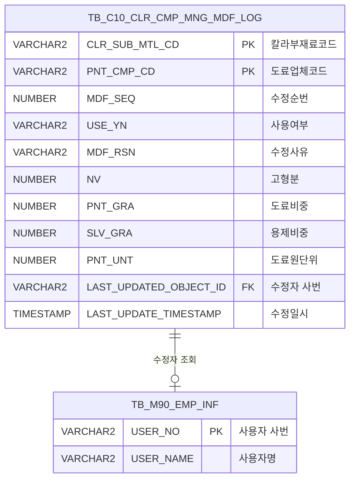

<h1 style="font-size: 40px; text-align: center; font-weight:
   bold; margin: 30px 0;">
  C106000050pop02 레거시 시스템 분석 종합 보고서
</h1>


# 1. 시스템 개요
- **서비스 ID**: C106000050pop02
- **업무명**: 칼라부재료업체 정보 수정 이력 팝업2
- **분석 일시**: 2026-03-17 09:48 (KST)
- **분석 시간**: 약 5분
- **전체 Activity 수**: 2개 (Built-in 2개, Custom 0개)
- **분석자**: Claude Opus 4.6 + Claude Sonnet 4.6
- **분석 도구**: /analyze-service C106000050pop02
- **문서 버전**: 1.0

# 비즈니스 프로세스 분석

## 시스템 목적

본 서비스는 CCL(Color Coating Line) 공정에서 사용하는 **칼라부재료업체 관리 정보의 수정 이력을 조회**하기 위한 팝업 화면이다. 부모 화면(C106000050)에서 특정 칼라코드와 도료업체를 선택하여 이 팝업을 호출하면, 해당 칼라부재료의 물성치(고형분, 도료비중, 용제비중, 도료원단위 등)와 입자/소광제 관련 수치가 언제, 누구에 의해, 어떤 사유로 변경되었는지를 시계열로 확인할 수 있다.

이 화면은 **읽기 전용 이력 조회** 목적으로, 데이터 수정 기능은 제공하지 않는다. CCL 공정의 칼라 도료 관리에서 품질 추적성(Traceability)을 확보하고, 물성치 변경에 대한 감사 추적(Audit Trail)을 지원하는 역할을 한다.

<!-- 단순 서비스: Custom Activity 0개, SELECT 쿼리만 사용, Router → 단일 조회 Activity 구조이므로 워크플로우 다이어그램 생략 -->

## 주요 유즈케이스

### UC-01: 칼라부재료 수정이력 조회

- **Actor**: CCL 공정 관리자 / 품질 담당자
- **목적**: 특정 칼라코드와 도료업체에 대한 물성치 변경 이력을 시계열로 확인하여 품질 추적 및 변경 감사 수행

- **전제조건**:
  - 부모 화면(C106000050)에서 칼라코드와 도료업체를 선택한 상태
  - TB_C10_CLR_CMP_MNG_MDF_LOG 테이블에 해당 칼라코드/업체의 수정 이력이 존재
  - 사용자가 시스템에 로그인되어 있음

- **주요 흐름**:
  1. 부모 화면에서 팝업 호출 시 URL 파라미터(clr_cd, pnt_cmp_cd)가 전달됨
  2. 폼 로드 완료 후 URL 파라미터를 폼 필드(CLR_SUB_MTL_CD, PNT_CMP_CD)에 자동 세팅
  3. load_find() 함수에서 자동 조회 실행 (C106000050pop02.select 쿼리 호출)
  4. 수정이력 데이터가 Grid에 MDF_SEQ 순으로 표시됨
  5. 수정자 ID는 스칼라 서브쿼리로 TB_M90_EMP_INF에서 사용자명으로 변환되어 표시

- **대체 흐름**:
  - 조회 결과가 없는 경우: Grid에 데이터 없음 표시, messagebox에 결과 메시지 출력
  - URL 파라미터 미전달 시: 폼에 수동으로 칼라코드/업체코드 입력 후 조회 버튼 클릭

- **후행조건**:
  - 조회된 수정이력이 Grid에 시계열로 표시됨
  - 사용자가 컨텍스트 메뉴를 통해 셀 복사 또는 엑셀 다운로드 가능

### UC-02: 수정이력 엑셀 다운로드

- **Actor**: CCL 공정 관리자 / 품질 담당자
- **목적**: 조회된 수정이력 데이터를 엑셀 파일로 다운로드하여 오프라인 분석 또는 보고서 작성에 활용

- **전제조건**:
  - UC-01을 통해 Grid에 수정이력 데이터가 로드된 상태

- **주요 흐름**:
  1. Grid 영역에서 마우스 우클릭하여 컨텍스트 메뉴 표시
  2. "엑셀 다운로드" 메뉴 항목 선택
  3. 현재 Grid 데이터가 컬러 포맷 포함하여 엑셀 파일로 다운로드

- **대체 흐름**:
  - "셀 복사" 선택 시: 선택된 셀 값이 클립보드에 복사됨

- **후행조건**:
  - 엑셀 파일이 사용자 로컬에 다운로드됨

### UC-03: 수동 조건 변경 후 재조회

- **Actor**: CCL 공정 관리자
- **목적**: 팝업 내에서 다른 칼라코드/업체코드로 조건을 변경하여 재조회

- **전제조건**:
  - 팝업이 열려있는 상태

- **주요 흐름**:
  1. 폼의 칼라코드(CLR_SUB_MTL_CD) 필드에 새로운 칼라코드 입력
  2. 부재료업체(PNT_CMP_CD) 필드에 새로운 업체코드 입력
  3. 조회 버튼 클릭
  4. 변경된 조건으로 C106000050pop02.select 쿼리 재실행
  5. Grid에 새로운 조건의 수정이력 표시

- **대체 흐름**:
  - 해당 조건의 이력이 없는 경우: Grid 초기화, messagebox에 결과 메시지 출력

- **후행조건**:
  - 변경된 조건의 수정이력이 Grid에 표시됨

---
## 비즈니스 로직 상세

### 1. 수정자 ID → 사용자명 변환

- **목적**: 수정이력의 수정자 사번(USER_NO)을 사람이 식별 가능한 사용자명(USER_NAME)으로 변환하여 표시
- **처리 케이스**:

  **[케이스 1: 스칼라 서브쿼리 변환]**
  ```
    조건: LAST_UPDATED_OBJECT_ID 컬럼에 수정자 사번이 저장되어 있음
    처리:
      1. TB_C10_CLR_CMP_MNG_MDF_LOG.LAST_UPDATED_OBJECT_ID 값 추출
      2. M90APUSER.TB_M90_EMP_INF 테이블에서 USER_NO = LAST_UPDATED_OBJECT_ID 조건으로 조회
      3. 조회된 USER_NAME을 LAST_UPDATED_OBJECT_ID 컬럼 별칭으로 반환
      4. 해당 사번의 사원이 없으면 NULL 표시
  ```

### 2. 수정이력 정렬 기준

- **목적**: 수정이력을 수정 순서대로 정렬하여 변경 추적 용이성 확보
- **처리 케이스**:

  **[케이스 1: MDF_SEQ 순 정렬]**
  ```
    조건: 동일 칼라코드 + 도료업체 내 복수 수정 이력 존재
    처리:
      1. MDF_SEQ(수정순번) 기준 오름차순 정렬
      2. 가장 오래된 수정부터 최신 수정 순으로 표시
  ```

### 3. 데이터 변환 공식

- **목적**: SQL 쿼리 내 데이터 변환 로직을 수식으로 정리

- **계산 공식**:

  ```
  수정자명 변환:
    LAST_UPDATED_OBJECT_ID(표시값) = (SELECT USER_NAME FROM M90APUSER.TB_M90_EMP_INF
                                       WHERE USER_NO = TB_C10_CLR_CMP_MNG_MDF_LOG.LAST_UPDATED_OBJECT_ID)
    ※ 사원 미존재 시 NULL 반환

  정렬 순서:
    ORDER BY MDF_SEQ ASC
    → 수정순번 오름차순 (시계열 정렬: 최초 수정 → 최신 수정)
  ```

---

# 데이터 요구사항

## 핵심 테이블

### 1. TB_C10_CLR_CMP_MNG_MDF_LOG - (칼라부재료업체 관리 수정 이력)
| 컬럼명 | 타입 | PK | 설명 |
|--------|------|----|-----|
| CLR_SUB_MTL_CD | VARCHAR2 | ✅ | 칼라부재료코드 (PK) |
| PNT_CMP_CD | VARCHAR2 | ✅ | 도료업체코드 (PK) |
| MDF_SEQ | NUMBER | | 수정순번 |
| USE_YN | VARCHAR2 | | 사용여부 |
| MDF_RSN | VARCHAR2 | | 수정사유 |
| NV | NUMBER | | 고형분 |
| PNT_GRA | NUMBER | | 도료비중 |
| SLV_GRA | NUMBER | | 용제비중 |
| PNT_UNT | NUMBER | | 도료원단위 |
| PTC_YN | VARCHAR2 | | 입자유무 |
| PTC_TYPE | VARCHAR2 | | 입자TYPE |
| TEX_KND | VARCHAR2 | | 질감종류 |
| PTC_MIN | NUMBER | | 입자MIN |
| PTC_MAX | NUMBER | | 입자MAX |
| PTC_AVG | NUMBER | | 입자AVG |
| CMT | VARCHAR2 | | 비고 |
| QUE_MIN | NUMBER | | 소광제MIN |
| QUE_MAX | NUMBER | | 소광제MAX |
| QUE_AVG | NUMBER | | 소광제AVG |
| LAST_UPDATED_OBJECT_ID | VARCHAR2 | | 최종수정자 사번 |
| LAST_UPDATE_TIMESTAMP | TIMESTAMP | | 최종수정일시 |

### 2. TB_M90_EMP_INF - (사원 정보, M90APUSER 스키마)
| 컬럼명 | 타입 | PK | 설명 |
|--------|------|----|-----|
| USER_NO | VARCHAR2 | ✅ | 사용자 사번 (PK) |
| USER_NAME | VARCHAR2 | | 사용자명 |

## 데이터 플로우

### 1. 조회
```
[칼라부재료 수정이력 조회]
팝업 진입 (URL 파라미터: clr_cd, pnt_cmp_cd)
→ C106000050pop02.select
  FROM TB_C10_CLR_CMP_MNG_MDF_LOG
  SCALAR SUBQUERY: M90APUSER.TB_M90_EMP_INF (USER_NO = LAST_UPDATED_OBJECT_ID)
  WHERE CLR_SUB_MTL_CD = :CLR_SUB_MTL_CD
    AND PNT_CMP_CD = :PNT_CMP_CD
  ORDER BY MDF_SEQ
→ Grid에 수정이력 목록 표시 (21개 컬럼)
```

## SQL 일람표

| SQL 이름 | 쿼리 ID | 타입 | 출처 | 테이블 |
|---------|---------|-----|-------|-------|
| 칼라부재료 수정이력 조회 | C106000050pop02.select | SELECT | Service | TB_C10_CLR_CMP_MNG_MDF_LOG, TB_M90_EMP_INF |

## ER 다이어그램 (핵심 관계)



관계 설명:
- **TB_C10_CLR_CMP_MNG_MDF_LOG**가 중심 테이블로, 칼라부재료업체 관리 수정 이력을 저장
- **TB_M90_EMP_INF**: LAST_UPDATED_OBJECT_ID → USER_NO 스칼라 서브쿼리로 수정자명 조회 (M90APUSER 스키마)

---

# 사용자 인터페이스 요구사항

## 화면 레이아웃 상세

### Layout 구조 (Absolute 배치)
```javascript
{
  itemType: "absolute",  // 절대 위치 배치
  components: [
    {
      id: "C106000050pop02_Form_1",
      type: "form",
      position: { left: 0, top: 0 },
      size: { width: 699, height: 30 }
    },
    {
      id: "C106000050pop02_Grid_1",
      type: "grid",
      position: { left: 1, top: 31 },
      size: { width: 696, height: 298 }
    },
    {
      id: "C106000050pop02_messagebox",
      type: "messagebox",
      position: { left: 0, top: 331 },
      size: { width: 697, height: 19 }
    }
  ]
}
```

## 입출력 요소

### Form 컴포넌트
**C106000050pop02_Form_1**
- CLR_SUB_MTL_CD: input (60px) - 칼라코드 입력, URL 파라미터 clr_cd로 자동 세팅
- PNT_CMP_CD: input (60px) - 부재료업체 입력, URL 파라미터 pnt_cmp_cd로 자동 세팅
- find: button - 조회 → find 이벤트 호출
- winClose: button - 닫기 → 팝업 창 닫기

### Grid 컴포넌트

**C106000050pop02_Grid_1 (수정이력 목록)**
- 편집 가능 여부: 아니오 (전체 읽기 전용, ro/ron)
- Split: 0 (고정 컬럼 없음)
- 페이지셋: 사용 (pageset: true, rowCnt: 2)
- 컨텍스트 메뉴: 사용 (셀 복사, 엑셀 다운로드)
- 주요 컬럼 (21개):

  **기본 식별 정보**:
  - USE_YN: ro - 사용여부 (5%, 중앙정렬, sort_str_custom)
  - CLR_SUB_MTL_CD: ro - 컬러코드 (8%, 중앙정렬, sort_str_custom)
  - PNT_CMP_CD: ro - 업체코드 (8%, 중앙정렬, sort_str_custom)
  - MDF_SEQ: ro - Seq (5%, 중앙정렬, str 정렬)
  - MDF_RSN: ro - 수정사유 (21%, 좌측정렬, str 정렬)

  **물성치 수치 (배경색: #FFFFC0)**:
  - NV: ron - 고형분 (8%, 중앙정렬, 포맷: 00,000.00, sort_int_custom)
  - PNT_GRA: ron - 도료비중 (8%, 중앙정렬, 포맷: 00,000.00, sort_int_custom)
  - SLV_GRA: ron - 용제비중 (8%, 중앙정렬, 포맷: 00,000.00, sort_int_custom)
  - PNT_UNT: ron - 도료원단위 (8%, 중앙정렬, 포맷: 00,000.00, sort_int_custom)

  **입자 관련 (배경색: #FFFFC0)**:
  - PTC_YN: ron - 입자유무 (8%, 중앙정렬, sort_int_custom)
  - PTC_TYPE: ron - 입자TYPE (8%, 중앙정렬, sort_int_custom)
  - TEX_KND: ron - 질감종류 (8%, 중앙정렬, sort_int_custom)
  - PTC_MIN: ron - 입자MIN (8%, 중앙정렬, sort_int_custom)
  - PTC_MAX: ron - 입자MAX (8%, 중앙정렬, sort_int_custom)
  - PTC_AVG: ron - 입자AVG (8%, 중앙정렬, sort_int_custom)

  **비고**:
  - CMT: ro - 비고 (22%, 중앙정렬, sort_int_custom)

  **소광제 관련 (배경색: #FFFFC0)**:
  - QUE_MIN: ron - 소광제MIN (8%, 중앙정렬, sort_int_custom)
  - QUE_MAX: ron - 소광제MAX (8%, 중앙정렬, sort_int_custom)
  - QUE_AVG: ron - 소광제AVG (8%, 중앙정렬, sort_int_custom)

  **이력 정보**:
  - LAST_UPDATED_OBJECT_ID: ro - 수정자 (10%, 중앙정렬, str_custom 정렬)
  - LAST_UPDATE_TIMESTAMP: ro - 수정일자 (18%, 중앙정렬, str_custom 정렬)

## 화면 동작 흐름

### 1. 화면 초기 로딩 (팝업 열기)
```
1. 부모 화면(C106000050)에서 팝업 호출 (URL 파라미터: clr_cd, pnt_cmp_cd 전달)
2. JSP 페이지 로드, 서버 측에서 request.getParameter()로 파라미터 추출
   - clrcd = request.getParameter("clr_cd")
   - pntcmpcd = request.getParameter("pnt_cmp_cd")
3. Form XML 로드 완료 → onLoadForm() 이벤트 발생 → loadForm_yn = 'Y'
4. Grid XML 로드 완료 → onLoadGrid() 이벤트 발생 → loadGrid_yn = 'Y'
5. load_find() 호출 (Form + Grid 모두 로드 완료 확인)
   - CLR_SUB_MTL_CD 필드에 clr_cd 값 세팅
   - PNT_CMP_CD 필드에 pnt_cmp_cd 값 세팅
6. Grid 자동 조회 실행: items['C106000050pop02_Grid_1'].loadData(findUrl)
7. C106000050pop02.select 쿼리 실행 → Grid에 수정이력 표시
8. findMessage()로 messagebox에 조회 결과 메시지 표시
```

### 2. 수동 재조회
```
1. 사용자가 폼의 칼라코드/부재료업체 필드에 새로운 값 입력
2. 조회 버튼 클릭 → find 이벤트 발생
3. items[referenceItem].loadData(findUrl) 호출
   - referenceItem: C106000050pop02_Grid_1
   - findUrl: basicGridData.do + 폼 파라미터
4. C106000050pop02-service 호출 → PosDefaultRouter → 조회 Activity
5. Grid 데이터 갱신 → findMessage()로 결과 메시지 표시
```

### 3. 컨텍스트 메뉴 사용 (셀 복사 / 엑셀 다운로드)
```
1. Grid 영역에서 마우스 우클릭 → 컨텍스트 메뉴 표시
2-a. "copy_row" 선택 → 선택된 셀 값을 클립보드에 복사
2-b. "excel_grid" 선택 → Grid 데이터를 컬러 포맷 포함 엑셀 파일로 다운로드
```

## JavaScript 모듈

**C106000050pop02.jsp** (인라인 스크립트)
- load_find(): 폼/그리드 로드 완료 확인 후 URL 파라미터를 폼에 세팅하고 자동 조회 실행
- find(): 조회 버튼 클릭 이벤트 → items[referenceItem].loadData(findUrl) 호출
- save(): 저장 버튼 이벤트 → items[referenceItem].sendGrid(referenceItem, eventName) (본 화면에서는 미사용)
- findMessage(): Grid 로드 완료 후 → uiCommon.message('C106000050pop02_messagebox', appMsg) 호출
- onGridContextMenuClick(): 컨텍스트 메뉴 처리 (copy_row: 셀 복사, excel_grid: 엑셀 다운로드)
- onLoadForm(): Form XLE 이벤트 → loadForm_yn = 'Y', load_find() 호출
- onLoadGrid(): Grid XLE 이벤트 → loadGrid_yn = 'Y', load_find() 호출

## 주요 이벤트 핸들러

**find (조회 버튼 클릭)**
- 이벤트 타입: Button Click
- 처리 내용:
  1. referenceItem(C106000050pop02_Grid_1) 확인
  2. findUrl 구성 (basicGridData.do + 폼 파라미터)
  3. items[referenceItem].loadData(findUrl) 호출
  4. 조회 완료 후 findMessage() 콜백으로 messagebox 갱신

**onGridContextMenuClick (컨텍스트 메뉴)**
- 이벤트 타입: Grid Context Menu Click
- 처리 내용:
  1. 선택된 메뉴 ID 확인
  2. copy_row: 선택 셀 클립보드 복사
  3. excel_grid: 그리드 엑셀 다운로드 (color 포맷 포함)

**load_find (자동 조회)**
- 이벤트 타입: Form + Grid 로드 완료 시 자동 호출
- 처리 내용:
  1. loadForm_yn && loadGrid_yn 모두 'Y'인지 확인
  2. URL 파라미터 clr_cd → CLR_SUB_MTL_CD 폼 필드 세팅
  3. URL 파라미터 pnt_cmp_cd → PNT_CMP_CD 폼 필드 세팅
  4. Grid 자동 조회 실행

---

# 특이사항 및 주의사항

## 1. URL 파라미터 기반 자동 조회 패턴
- 부모 화면에서 팝업 호출 시 `clr_cd`, `pnt_cmp_cd` URL 파라미터를 전달하며, JSP에서 `request.getParameter()`로 서버 측에서 추출 후 JavaScript 변수에 할당하는 패턴 사용
- Form과 Grid가 모두 로드 완료된 후에만 자동 조회가 실행되는 **이중 로드 체크 패턴** (loadForm_yn + loadGrid_yn) 적용

## 2. 수정자 사번 → 사용자명 변환 (스칼라 서브쿼리)
- LAST_UPDATED_OBJECT_ID 컬럼은 실제 저장값은 사번(USER_NO)이지만, 조회 시 스칼라 서브쿼리로 M90APUSER.TB_M90_EMP_INF에서 USER_NAME으로 변환하여 동일 컬럼 별칭으로 반환
- 퇴직 등으로 사원 정보가 없는 경우 NULL이 반환될 수 있음

## 3. Grid 컬럼 너비 퍼센트(%) 단위 사용
- 일반적인 픽셀(px) 지정 대신 `colWidth: "%"` 설정으로 컬럼 너비를 퍼센트로 지정
- 21개 컬럼의 퍼센트 합계가 100%를 초과할 수 있어 가로 스크롤이 발생할 수 있음

## 4. 읽기 전용 팝업이지만 save 함수 존재
- 전체 Grid가 읽기 전용(ro/ron)이고 수정 기능이 없으나, JavaScript에 `save()` 함수가 정의되어 있음 (프레임워크 템플릿 기반 생성으로 추정)
- 실제로 호출되지 않는 미사용 코드

## 5. 물성치 컬럼 시각적 강조
- 고형분, 도료비중, 용제비중, 도료원단위 등 핵심 물성치 컬럼과 입자/소광제 관련 컬럼에 배경색 `#FFFFC0`(연한 노란색)이 적용되어 시각적으로 구분
- Grid의 `vertical: true` 옵션이 설정되어 있어 세로형 그리드 배치가 적용될 수 있음

---

# 참고 문서

- **Query SQL**: `src/query/C106000050pop02-query.glue_sql`
- **Service XML**: `src/service/C106000050pop02-service.xml`
- **JSP**: `WebContents/C106000050pop02.jsp`
- **Form XML**: `WebContents/header/kr/C106000050pop02/C106000050pop02_Form_1.xml`
- **Grid XML**: `WebContents/header/kr/C106000050pop02/C106000050pop02_Grid_1.xml`
