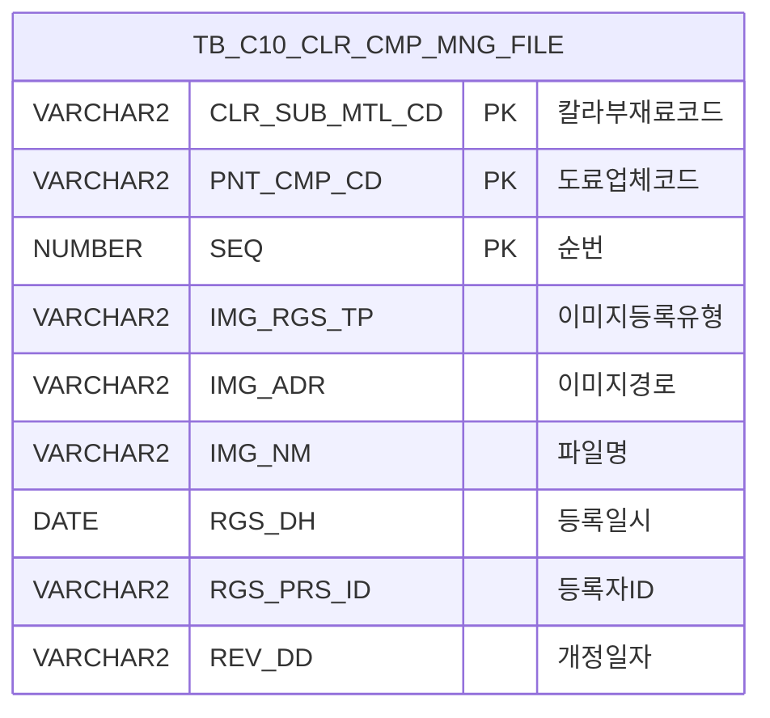

<h1 style="font-size: 40px; text-align: center; font-weight:
   bold; margin: 30px 0;">
  C106000050pop03 레거시 시스템 분석 종합 보고서
</h1>


# 1. 시스템 개요
- **서비스 ID**: C106000050pop03
- **업무명**: MSDS문서등록 (칼라코드관리 문서다운로드)
- **분석 일시**: 2026-03-17 09:54 (KST)
- **분석 시간**: 약 5분
- **전체 Activity 수**: 2개 (built-in)
- **분석자**: Claude Opus 4.6
- **분석 도구**: /analyze-service C106000050pop03
- **문서 버전**: 1.0

# 비즈니스 프로세스 분석

## 시스템 목적

본 서비스는 칼라코드관리 화면(C106000050)의 팝업 화면으로, 특정 칼라부재료코드(CLR_SUB_MTL_CD)와 도료업체코드(PNT_CMP_CD)에 해당하는 **물질안전보건자료(MSDS) 문서를 등록, 조회, 다운로드, 삭제**하는 파일 관리 기능을 제공한다.

칼라코팅(CCL) 공정에서 사용하는 도료의 MSDS(Material Safety Data Sheet) 문서를 업체별, 칼라코드별로 관리하여 안전보건 규정 준수를 지원한다. dhtmlXVault 컴포넌트를 활용한 파일 업로드와 Grid 기반 파일 목록 조회/다운로드/삭제 기능을 통합 제공하는 단순 파일 관리 팝업 서비스이다.

## 주요 유즈케이스

### UC-01: MSDS 문서 목록 조회
- **Actor**: CCL 공정 오퍼레이터 / 품질관리 담당자
- **목적**: 특정 칼라코드와 도료업체에 등록된 MSDS 문서 파일 목록을 조회

- **전제조건**:
  - 부모 화면(C106000050)에서 칼라코드와 도료업체를 선택한 상태
  - CLR_SUB_MTL_CD, PNT_CMP_CD 파라미터가 전달됨

- **주요 흐름**:
  1. 부모 화면에서 팝업 오픈 시 CLR_SUB_MTL_CD, PNT_CMP_CD 파라미터 전달
  2. 화면 초기화 완료 후 onXLEEvent로 onLoadGrid 자동 호출
  3. parametersC10으로 파라미터 구성 후 C106000050pop03-service 호출 (find 명령)
  4. C106000050pop03.select 쿼리 실행 → TB_C10_CLR_CMP_MNG_FILE 테이블 조회
  5. Grid에 파일 목록 표시 (컬러코드, 업체코드, 파일명, 등록일자, 등록자, 삭제 버튼)

- **대체 흐름**:
  - 등록된 문서가 없는 경우: 빈 Grid 표시

- **후행조건**:
  - 파일 목록이 Grid에 표시되어 다운로드/삭제 가능 상태

### UC-02: MSDS 문서 업로드
- **Actor**: CCL 공정 오퍼레이터 / 품질관리 담당자
- **목적**: 새로운 MSDS 문서 파일을 시스템에 등록

- **전제조건**:
  - 팝업 화면이 열려 있음
  - 업로드할 파일이 준비됨

- **주요 흐름**:
  1. dhtmlXVault 영역에 파일을 드래그앤드롭 또는 선택하여 업로드
  2. vault.setFormField로 설정된 파라미터 전송 (IMG_RGS_TP=1, IMG_RGS_FLAG=06, IMG_RGS_FLAG_ID=CLR_SUB_MTL_CD, IMG_RGS_FLAG_ID2=PNT_CMP_CD)
  3. _uploadHandler6.jsp에서 파일 저장 및 C106000050pop03.insert 쿼리로 DB 등록
  4. SEQ는 MAX(SEQ)+1로 자동 채번
  5. 업로드 완료 후 onUploadComplete 콜백 → onLoadGrid 호출로 Grid 자동 갱신

- **대체 흐름**:
  - 업로드 실패 시: "파일업로드에 실패하였습니다." 알림 표시

- **후행조건**:
  - 파일이 서버에 저장되고 DB에 등록됨
  - Grid에 새 파일이 표시됨

### UC-03: MSDS 문서 다운로드
- **Actor**: CCL 공정 오퍼레이터 / 품질관리 담당자
- **목적**: 등록된 MSDS 문서 파일을 로컬에 다운로드

- **전제조건**:
  - Grid에 파일 목록이 표시된 상태

- **주요 흐름**:
  1. Grid의 파일명(IMG_NM) 컬럼 링크 클릭
  2. Grid_doLink 함수 호출 → 해당 행의 IMG_ADR, IMG_NM 값 추출
  3. _fileDownloadHandler.jsp에 FILE_ADR, FILE_NM 파라미터로 요청
  4. 파일 다운로드 실행

- **대체 흐름**:
  - 파일이 서버에 존재하지 않는 경우: 다운로드 핸들러에서 오류 처리

- **후행조건**:
  - 파일이 사용자 로컬에 다운로드됨

### UC-04: MSDS 문서 삭제
- **Actor**: CCL 공정 오퍼레이터 / 품질관리 담당자
- **목적**: 등록된 MSDS 문서를 시스템에서 삭제

- **전제조건**:
  - Grid에 파일 목록이 표시된 상태

- **주요 흐름**:
  1. Grid의 삭제 컬럼 클릭
  2. doImgDel 함수 호출 → 해당 행의 CLR_SUB_MTL_CD, PNT_CMP_CD, SEQ, CHK_IMG_NM 추출
  3. "선택한 이미지를 삭제하시겠습니까?" 확인 다이얼로그 표시
  4. 확인 시 _fileDeleteHandler5.jsp 호출 (IMG_RGS_FLAG=06, IMG_RGS_FLAG_ID, IMG_RGS_FLAG_ID2, SEQ, FILE_NAME 파라미터)
  5. DB 레코드 삭제 (C106000050pop03.delete) 및 물리 파일 삭제
  6. 삭제 완료 후 onLoadGrid 콜백으로 Grid 자동 갱신

- **대체 흐름**:
  - 취소 시: 아무 동작 없이 복귀

- **후행조건**:
  - DB 레코드와 물리 파일이 삭제됨
  - Grid에서 해당 행이 제거됨

---
## 비즈니스 로직 상세

### 1. 파일 경로 정규화 (SQL 기반)

- **목적**: 서버에 저장된 파일 경로를 웹에서 접근 가능한 상대 경로로 변환
- **처리 케이스**:

  **[케이스 1: IMG_ADR 경로 변환]**
  ```
    조건: IMG_ADR 컬럼에 서버 절대 경로가 저장됨
    처리:
      1. INSTR(IMG_ADR, 'IMG_UPLOAD')로 'IMG_UPLOAD' 문자열 위치 탐색
      2. SUBSTR로 'IMG_UPLOAD' 이후 경로만 추출
      3. REPLACE로 백슬래시(\)를 슬래시(/)로 변환
      4. 앞에 './' 접두사, 뒤에 '/' 접미사 추가하여 웹 상대 경로 생성
    결과: CHK_IMG_ADR = './IMG_UPLOAD/.../파일경로/'
  ```

### 2. 이미지 등록 유형 코드 변환 (DECODE)

- **목적**: IMG_RGS_TP 코드값을 사용자가 이해할 수 있는 문자열로 변환
- **처리 케이스**:

  **[케이스 1: 모바일 등록]**
  ```
    조건: IMG_RGS_TP = '2'
    결과: '모바일'
  ```

  **[케이스 2: PC 등록 (기본값)]**
  ```
    조건: IMG_RGS_TP ≠ '2' (또는 NULL)
    결과: 'PC'
  ```

### 3. SEQ 자동 채번 (INSERT 시)

- **목적**: 파일 등록 시 순번을 자동으로 부여
- **계산 공식**:
  ```
  SEQ = NVL(MAX(SEQ), 0) + 1
  (TB_C10_CLR_CMP_MNG_FILE 전체 테이블 기준)
  ```
- **주의**: 서브쿼리가 특정 CLR_SUB_MTL_CD/PNT_CMP_CD 조건 없이 전체 테이블에서 MAX(SEQ)를 조회하므로 글로벌 순번으로 동작

### 4. REV_DD (개정일자) 자동 추출

- **목적**: 업로드 파일명에서 개정일자를 자동 추출하여 DB에 저장
- **계산 공식**:
  ```
  REV_DD = SUBSTR(FILE_NAME, 14, 8)
  파일명의 14번째 문자부터 8자리를 개정일자로 추출
  (예: 파일명 규칙에 따라 YYYYMMDD 형식의 날짜가 14번째 위치에 포함됨)
  ```

---

# 데이터 요구사항

## 핵심 테이블

### 1. TB_C10_CLR_CMP_MNG_FILE - (칼라부재료 관리 파일)
| 컬럼명 | 타입 | PK | 설명 |
|--------|------|----|-----|
| CLR_SUB_MTL_CD | VARCHAR2 | ✅ | 칼라부재료코드 (PK) |
| PNT_CMP_CD | VARCHAR2 | ✅ | 도료업체코드 (PK) |
| SEQ | NUMBER | ✅ | 순번 (PK) |
| IMG_RGS_TP | VARCHAR2 |  | 이미지등록유형 (1:PC, 2:모바일) |
| IMG_ADR | VARCHAR2 |  | 이미지 저장 경로 (서버 절대 경로) |
| IMG_NM | VARCHAR2 |  | 이미지/파일명 |
| RGS_DH | DATE |  | 등록일시 |
| RGS_PRS_ID | VARCHAR2 |  | 등록자 ID |
| REV_DD | VARCHAR2 |  | 개정일자 (파일명에서 추출) |
| CREATED_OBJECT_TYPE | VARCHAR2 |  | 생성 오브젝트 유형 |
| CREATED_OBJECT_ID | VARCHAR2 |  | 생성자 ID |
| CREATED_PROGRAM_ID | VARCHAR2 |  | 생성 프로그램 ID |
| CREATION_TIMESTAMP | TIMESTAMP |  | 생성 타임스탬프 |
| LAST_UPDATED_OBJECT_TYPE | VARCHAR2 |  | 최종수정 오브젝트 유형 |
| LAST_UPDATED_OBJECT_ID | VARCHAR2 |  | 최종수정자 ID |
| LAST_UPDATE_PROGRAM_ID | VARCHAR2 |  | 최종수정 프로그램 ID |
| LAST_UPDATE_TIMESTAMP | TIMESTAMP |  | 최종수정 타임스탬프 |

## 데이터 플로우

### 1. 조회
```
[파일 목록 조회]
팝업 진입 (onXLEEvent → onLoadGrid)
→ C106000050pop03.select
  FROM TB_C10_CLR_CMP_MNG_FILE
  WHERE CLR_SUB_MTL_CD = :CLR_SUB_MTL_CD
    AND PNT_CMP_CD = :PNT_CMP_CD
  ORDER BY CLR_SUB_MTL_CD, PNT_CMP_CD, SEQ
→ Grid_1에 파일 목록 표시
```

### 2. 업로드 (파일 등록)
```
[MSDS 문서 업로드]
dhtmlXVault에서 파일 업로드
→ _uploadHandler6.jsp 파일 서버 저장
→ C106000050pop03.insert
  INSERT INTO C10APUSER.TB_C10_CLR_CMP_MNG_FILE
  VALUES (CLR_SUB_MTL_CD, PNT_CMP_CD, MAX(SEQ)+1, '1', FILE_ADDR, FILE_NAME, SYSDATE, ...)
→ onUploadComplete 콜백 → onLoadGrid 자동 호출 → Grid 갱신
```

### 3. 삭제
```
[MSDS 문서 삭제]
Grid 삭제 컬럼 클릭 → 확인 다이얼로그
→ _fileDeleteHandler5.jsp 호출
→ C106000050pop03.delete
  DELETE TB_C10_CLR_CMP_MNG_FILE
  WHERE CLR_SUB_MTL_CD = :IMG_RGS_FLAG_ID
    AND PNT_CMP_CD = :IMG_RGS_FLAG_ID2
    AND SEQ = :SEQ
→ onLoadGrid 콜백 → Grid 갱신
```

## SQL 일람표
| SQL 이름 | 쿼리 ID | 타입 | 출처 | 테이블 |
|---------|---------|-----|-------|-------|
| 파일 목록 조회 | C106000050pop03.select | SELECT | Service | TB_C10_CLR_CMP_MNG_FILE |
| 파일 등록 | C106000050pop03.insert | INSERT | _uploadHandler6.jsp | C10APUSER.TB_C10_CLR_CMP_MNG_FILE |
| 파일 삭제 | C106000050pop03.delete | DELETE | _fileDeleteHandler5.jsp | TB_C10_CLR_CMP_MNG_FILE |

## ER 다이어그램 (핵심 관계)



관계 설명:
- 단일 테이블(TB_C10_CLR_CMP_MNG_FILE) 기반의 독립적인 파일 관리 서비스
- CLR_SUB_MTL_CD, PNT_CMP_CD는 부모 화면(C106000050)의 칼라코드 마스터 테이블과 논리적 FK 관계
- INSERT 시 C10APUSER 스키마를 명시적으로 지정하여 교차 스키마 접근

---

# 사용자 인터페이스 요구사항

## 화면 레이아웃 상세

### Layout 구조 (absolute positioning)
```javascript
{
  layoutType: "absolute",
  components: [
    {
      id: "vault1",
      type: "dhtmlxVault",
      description: "파일 업로드 Vault",
      position: "상단 영역"
    },
    {
      id: "C106000050pop03_Grid_1",
      type: "grid",
      position: { top: "260px", left: "8px", width: "430px", height: "70px" }
    },
    {
      id: "C106000050pop03_MessageBox_1",
      type: "messagebox",
      position: { top: "332px", left: "0px", width: "445px", height: "23px" }
    }
  ]
}
```

## 입출력 요소

### Grid 컴포넌트

**C106000050pop03_Grid_1 (문서 목록)**
- 편집 가능 여부: 아니오 (읽기 전용)
- Split: 0 (고정 컬럼 없음)
- rowCnt: 2, vertical: true (세로 스크롤)
- multiselect: true
- 주요 컬럼 (10개):

  **기본 정보**:
  - CLR_SUB_MTL_CD: ro - 컬러코드 (19%, 중앙정렬)
  - PNT_CMP_CD: ro - 업체코드 (19%, 중앙정렬)
  - IMG_NM: ahref_idx - 파일명 (*, 좌측정렬, 클릭 시 Grid_doLink로 파일 다운로드)
  - RGS_DH: ro - 등록일자 (20%, 중앙정렬)
  - RGS_PRS_ID: ro - 등록자 (16%, 중앙정렬)
  - DEL_IMG: ro - 삭제 (8%, 중앙정렬, 클릭 시 doImgDel로 파일 삭제)

  **숨김 컬럼**:
  - SEQ: ro - 순번 (숨김, 우측정렬)
  - IMG_ADR: ro - 이미지 경로 (숨김)
  - CHK_IMG_NM: ro - 확인용 파일명 (숨김)
  - CHK_IMG_ADR: ro - 확인용 파일 경로 (숨김, 웹 상대 경로)

### Vault 컴포넌트

**vault1 (dhtmlXVault 파일 업로드)**
- 업로드 핸들러: _uploadHandler6.jsp
- 폼 필드:
  - IMG_RGS_TP: 1 (고정값, PC 업로드)
  - IMG_RGS_FLAG: 06
  - IMG_RGS_FLAG_ID: CLR_SUB_MTL_CD (파라미터)
  - IMG_RGS_FLAG_ID2: PNT_CMP_CD (파라미터)

## 화면 동작 흐름

### 1. 화면 초기 로딩
```
1. 부모 화면(C106000050)에서 팝업 오픈
2. CLR_SUB_MTL_CD, PNT_CMP_CD, SEQ, rowId, parent_item 파라미터 수신
3. body onload → onVaultLoad() 실행
   - dhtmlXVault 초기화 (이미지 경로, 서버 핸들러 설정)
   - vault.create("vault1")
   - vault.setFormField로 업로드 파라미터 설정
   - onUploadComplete 콜백 등록
4. ui.initializeDHTMLX() 호출 → Grid, MessageBox 초기화
5. onXLEEvent 등록 → onLoadGrid 자동 호출
6. parametersC10으로 파라미터 구성 → find 명령으로 Grid 데이터 로드
```

### 2. 파일 업로드 및 Grid 갱신
```
1. 사용자가 vault1 영역에 파일 드래그앤드롭 또는 파일 선택
2. _uploadHandler6.jsp로 파일 전송 (IMG_RGS_TP, IMG_RGS_FLAG, IMG_RGS_FLAG_ID, IMG_RGS_FLAG_ID2 포함)
3. 서버에서 파일 저장 및 DB INSERT 수행
4. vault.onUploadComplete 콜백 실행
   - 업로드 에러 확인 → 에러 시 "파일업로드에 실패하였습니다." 알림
   - 성공 시 onLoadGrid() 호출
5. onLoadGrid에서 customparam 구성 → parametersC10 호출 → Grid 데이터 재로드
6. onXleGrid 이벤트 해제 (detachEvent) → 중복 호출 방지
```

### 3. 파일 다운로드
```
1. Grid의 IMG_NM 컬럼(ahref_idx) 링크 클릭
2. Grid_doLink(filename, rowId) 함수 호출
3. 해당 행에서 IMG_ADR, IMG_NM 값 추출 (getColIndexById)
4. _fileDownloadHandler.jsp에 FILE_ADR, FILE_NM 파라미터로 요청
5. location.href로 파일 다운로드 실행
```

### 4. 파일 삭제
```
1. Grid의 DEL_IMG 컬럼 클릭
2. doImgDel(rowIdx) 함수 호출
3. 해당 행에서 CLR_SUB_MTL_CD, PNT_CMP_CD, SEQ, CHK_IMG_NM 추출
4. confirm("선택한 이미지를 삭제하시겠습니까?") 확인 다이얼로그
5. 확인 시 _fileDeleteHandler5.jsp 호출 (dhtmlxAjax.get)
   - IMG_RGS_FLAG=06, IMG_RGS_FLAG_ID, IMG_RGS_FLAG_ID2, SEQ, FILE_NAME
6. 완료 후 onLoadGrid 콜백으로 Grid 자동 갱신
```

## JavaScript 모듈

**C106000050pop03.jsp** (인라인 스크립트)
- find(eventName, formDivObj, referenceItem): 폼 조회 (uiCommon.parameters → loadData)
- save(eventName, formDivObj, referenceItem): 그리드 저장 (sendGrid)
- add(referenceItem): 그리드 행 추가 (addRow)
- remove(referenceItem): 그리드 행 삭제 (removeRow)
- copy(referenceItem): 행 클립보드 복사 (copyRowContent)
- undo(referenceItem): 실행 취소
- redo(referenceItem): 다시 실행
- onGridContextMenuClick(id, gridObj, menuObj): 컨텍스트 메뉴 (열이동/필터/편집가능/엑셀)
- findMessage(referenceItem): 메시지박스 표시 (uiCommon.message)
- onVaultLoad(): body onload - dhtmlXVault 초기화 및 업로드 설정
- onLoadGrid(): Grid 데이터 재로드 (parametersC10 → loadData, onXleGrid detachEvent)
- Grid_doLink(filename, rowId): 파일 다운로드 (_fileDownloadHandler.jsp → location.href)
- doImgDel(rowIdx): 파일 삭제 (confirm → _fileDeleteHandler5.jsp → dhtmlxAjax.get → onLoadGrid)

## 주요 이벤트 핸들러

**onVaultLoad (화면 초기화)**
- 이벤트 타입: body onload
- 처리 내용:
  1. 부모 화면의 Grid 객체 참조 (parent.items[parent_item])
  2. dhtmlXVault 인스턴스 생성 및 서버 핸들러 설정
  3. 업로드 폼 필드 설정 (IMG_RGS_TP, IMG_RGS_FLAG, IMG_RGS_FLAG_ID, IMG_RGS_FLAG_ID2)
  4. onUploadComplete 콜백 등록 (에러 시 알림, 성공 시 Grid 갱신)

**onXLEEvent (Grid 초기 로드)**
- 이벤트 타입: XLE 이벤트 (Grid 초기화 완료 후 자동 발화)
- 처리 내용:
  1. onLoadGrid 함수 호출
  2. customparam으로 CLR_SUB_MTL_CD, PNT_CMP_CD, SEQ 전달
  3. parametersC10 호출 → Grid 데이터 로드
  4. onXleGrid 이벤트 해제 (1회성 실행)

**Grid_doLink (파일 다운로드)**
- 이벤트 타입: Grid ahref_idx 컬럼 클릭
- 처리 내용:
  1. 클릭된 행의 IMG_ADR, IMG_NM 값 추출
  2. _fileDownloadHandler.jsp URL 구성
  3. location.href로 다운로드 실행

**doImgDel (파일 삭제)**
- 이벤트 타입: Grid DEL_IMG 컬럼 클릭
- 처리 내용:
  1. 클릭된 행의 CLR_SUB_MTL_CD, PNT_CMP_CD, SEQ, CHK_IMG_NM 추출
  2. _fileDeleteHandler5.jsp URL 구성 (FILE_NAME은 encodeURIComponent 적용)
  3. confirm 다이얼로그 표시
  4. 확인 시 dhtmlxAjax.get으로 삭제 요청 → onLoadGrid 콜백

---

# 특이사항 및 주의사항

## 1. SEQ 채번 범위 이슈
- **글로벌 MAX(SEQ)**: INSERT 쿼리의 SEQ 채번이 `SELECT NVL(MAX(SEQ),0)+1 FROM C10APUSER.TB_C10_CLR_CMP_MNG_FILE` 로 **테이블 전체**에서 MAX를 조회한다. CLR_SUB_MTL_CD + PNT_CMP_CD 별로 개별 채번하지 않아 SEQ 값이 불연속적으로 증가할 수 있다.

## 2. 교차 스키마 접근
- **SELECT 쿼리**는 스키마 없이 `TB_C10_CLR_CMP_MNG_FILE` 참조 (MESAPUSER 스키마)
- **INSERT 쿼리**는 `C10APUSER.TB_C10_CLR_CMP_MNG_FILE`로 명시적 스키마 지정
- **DELETE 쿼리**는 스키마 없이 참조
- 동일 테이블인데 스키마 지정이 일관되지 않아, SYNONYM 또는 권한 설정에 따라 다른 테이블을 참조할 가능성이 있음

## 3. 파일명 기반 개정일자 추출
- INSERT 시 `REV_DD = SUBSTR(:FILE_NAME, 14, 8)`로 파일명에서 개정일자를 추출하는데, 파일명 규칙을 따르지 않는 파일 업로드 시 잘못된 날짜가 저장될 수 있다.

## 4. dhtmlXVault 의존성
- 파일 업로드에 dhtmlXVault 컴포넌트를 사용하며, 일반적인 GLUE Framework의 Form/Grid 패턴과 다른 독립적인 UI 컴포넌트를 활용한다. vault.js, vault.css 별도 로드 필요.

## 5. onXleGrid 이벤트 1회성 처리
- `onLoadGrid` 함수 내에서 `grid.getDhxGrid().detachEvent(onXleGrid)`로 XLE 이벤트를 해제하여, 초기 로딩 시에만 자동 조회가 실행되고 이후에는 업로드/삭제 완료 콜백으로만 Grid가 갱신되도록 설계되어 있다.

## 6. DELETE SQL 구문 비표준
- `DELETE TB_C10_CLR_CMP_MNG_FILE WHERE ...` 에서 `FROM` 키워드가 누락되어 있다. Oracle에서는 `DELETE FROM` 없이도 동작하지만 ANSI SQL 표준에 부합하지 않는다.

---

# 참고 문서

- **Query SQL**: `src/query/C106000050pop03-query.glue_sql`
- **Service XML**: `src/service/C106000050pop03-service.xml`
- **JSP**: `WebContents/C106000050pop03.jsp`
- **Grid XML**: `WebContents/header/kr/C106000050pop03/C106000050pop03_Grid_1.xml`
- **MessageBox XML**: `WebContents/header/kr/C106000050pop03/C106000050pop03_MessageBox_1.xml`
