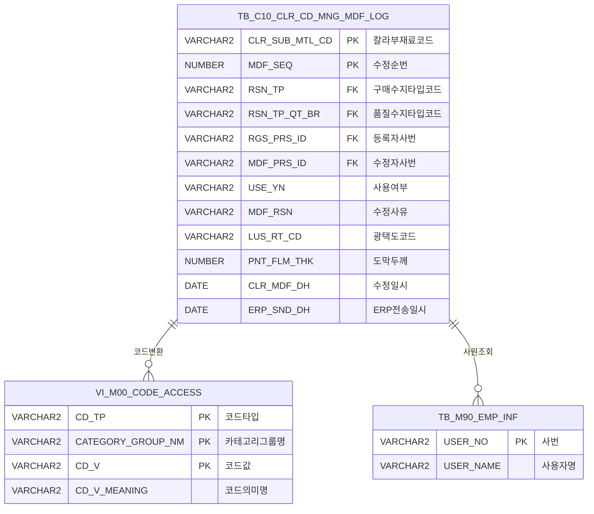

<h1 style="font-size: 40px; text-align: center; font-weight:
   bold; margin: 30px 0;">
  C106000050pop04 레거시 시스템 분석 종합 보고서
</h1>


# 1. 시스템 개요
- **서비스 ID**: C106000050pop04
- **업무명**: 칼라코드 정보 수정 이력 조회 팝업
- **분석 일시**: 2026-03-17 09:54 (KST)
- **전체 Activity 수**: 2개 (built-in 2개, custom 0개)
- **분석자**: Claude Opus 4.6 + Sonnet (Phase 4)
- **분석 도구**: /analyze-service C106000050pop04
- **문서 버전**: 1.0

# 비즈니스 프로세스 분석

## 시스템 목적

본 서비스는 CCL(Color Coating Line) 공정의 **칼라코드 관리 화면(C106000050)**의 팝업 화면으로, 특정 칼라부재료코드(CLR_SUB_MTL_CD)에 대한 모든 **수정 이력 정보를 시계열 역순으로 조회**하는 기능을 제공한다.

부모 화면에서 특정 칼라코드를 선택하고 수정 이력 팝업을 호출하면, URL 파라미터로 전달된 칼라코드를 자동 설정하여 해당 코드의 수정 이력을 즉시 조회한다. 수정이력 테이블(TB_C10_CLR_CD_MNG_MDF_LOG)에 기록된 수지타입, 광택도, 도막두께, Lamina 관련 정보, 보호필름 정보, 색차기준 등 62개 항목의 변경 이력을 한눈에 확인할 수 있어, 칼라코드 변경 추적 및 품질관리 감사(audit) 용도로 활용된다.

<!-- 단순 조회 서비스: Custom Activity 0개, SELECT 쿼리만 사용, Router→단일 조회 체인 → 워크플로우 다이어그램 생략 -->

## 주요 유즈케이스

### UC-01: 칼라코드 수정 이력 자동 조회
- **Actor**: CCL 공정 관리자 / 품질관리 담당자
- **목적**: 부모 화면에서 팝업 호출 시 해당 칼라코드의 전체 수정 이력을 자동으로 조회하여 변경 추적

- **전제조건**:
  - 부모 화면(C106000050)에서 특정 칼라코드를 선택한 상태
  - URL 파라미터 `clr_cd`로 칼라부재료코드가 전달됨
  - TB_C10_CLR_CD_MNG_MDF_LOG 테이블에 해당 코드의 수정 이력이 존재

- **주요 흐름**:
  1. 부모 화면에서 수정이력 팝업 호출 → URL 파라미터 `clr_cd` 전달
  2. 팝업 화면 로드 완료 시 `load_find()` 자동 실행 (폼/그리드 로드 완료 감지)
  3. CLR_SUB_MTL_CD 폼 필드에 `clr_cd` 값 자동 설정
  4. `C106000050pop04.select` 쿼리 실행 → `mesdao` 통해 TB_C10_CLR_CD_MNG_MDF_LOG 조회
  5. MDF_SEQ 역순 정렬로 Grid에 수정 이력 표시

- **대체 흐름**:
  - 조회 결과 없음: 빈 그리드 표시
  - URL 파라미터 미전달: 빈 폼 상태로 로드, 사용자가 직접 칼라코드 입력 후 조회 가능

- **후행조건**:
  - 수정 이력이 시계열 역순으로 Grid에 표시됨
  - 사용자가 컨텍스트 메뉴로 행 복사 또는 엑셀 내보내기 가능

### UC-02: 칼라코드 수동 조회
- **Actor**: CCL 공정 관리자
- **목적**: 팝업 내에서 다른 칼라코드의 수정 이력을 직접 입력하여 조회

- **전제조건**:
  - 팝업 화면이 로드된 상태

- **주요 흐름**:
  1. 사용자가 CLR_SUB_MTL_CD 입력 필드에 칼라코드 직접 입력
  2. 조회 버튼(find) 클릭
  3. `uiCommon.parameters()`로 폼 파라미터 구성
  4. Grid_1.loadData()로 `C106000050pop04.select` 쿼리 실행
  5. Grid에 해당 칼라코드의 수정 이력 표시

- **대체 흐름**:
  - 존재하지 않는 칼라코드 입력: 빈 결과 반환

- **후행조건**:
  - 입력한 칼라코드의 수정 이력이 Grid에 표시됨

### UC-03: 수정 이력 데이터 내보내기
- **Actor**: CCL 공정 관리자 / 품질관리 담당자
- **목적**: 조회된 수정 이력 데이터를 엑셀 파일로 내보내어 보관 또는 보고서 작성에 활용

- **전제조건**:
  - Grid에 수정 이력 데이터가 조회된 상태

- **주요 흐름**:
  1. Grid에서 마우스 우클릭으로 컨텍스트 메뉴 호출
  2. "엑셀 출력" 메뉴 항목 선택
  3. `toExcel()` 함수 실행, 시트명 'color'로 엑셀 파일 생성
  4. 엑셀 파일 다운로드

- **대체 흐름**:
  - "행 복사" 메뉴 선택 시: 선택 셀 내용을 클립보드에 복사 (`cellToClipboard`)

- **후행조건**:
  - 엑셀 파일이 사용자 로컬에 다운로드됨

---
## 비즈니스 로직 상세

### 1. 코드값 → 의미명 변환 (스칼라 서브쿼리)

- **목적**: 저장된 코드값(RSN_TP, RSN_TP_QT_BR)을 사람이 읽을 수 있는 의미명으로 변환하여 표시

- **처리 케이스**:

  **[케이스 1: 구매수지타입 코드 변환]**
  ```
    조건: RSN_TP 컬럼에 수지타입 코드가 저장됨
    처리:
      1. M00APUSER.VI_M00_CODE_ACCESS 뷰에서 CD_TP='RSN_TP', CATEGORY_GROUP_NM='SZ0000' 조건으로 조회
      2. CD_V = RSN_TP (원본 코드값)으로 매칭
      3. CD_V_MEANING 값을 RSN_TP_NM 컬럼으로 표시
  ```

  **[케이스 2: 품질수지타입 코드 변환]**
  ```
    조건: RSN_TP_QT_BR 컬럼에 품질수지타입 코드가 저장됨
    처리:
      1. M00APUSER.VI_M00_CODE_ACCESS 뷰에서 CD_TP='RSN_TP_QT_BR', CATEGORY_GROUP_NM='SZ0000' 조건으로 조회
      2. CD_V = RSN_TP_QT_BR (원본 코드값)으로 매칭
      3. CD_V_MEANING 값을 RSN_TP_QT_BR_NM 컬럼으로 표시
  ```

### 2. 등록자/수정자 사번 → 성명 변환

- **목적**: 사번(USER_NO)으로 저장된 등록자/수정자 정보를 사용자 이름으로 변환하여 가독성 확보

- **처리 케이스**:

  **[케이스 1: 등록자 성명 조회]**
  ```
    조건: RGS_PRS_ID에 사번이 저장됨
    처리:
      1. M90APUSER.TB_M90_EMP_INF 테이블에서 USER_NO = RGS_PRS_ID로 조회
      2. USER_NAME 반환
      3. NVL 처리: 사원 정보 없으면 원본 사번(RGS_PRS_ID) 그대로 표시
  ```

  **[케이스 2: 수정자 성명 조회]**
  ```
    조건: MDF_PRS_ID에 사번이 저장됨
    처리:
      1. M90APUSER.TB_M90_EMP_INF 테이블에서 USER_NO = MDF_PRS_ID로 조회
      2. USER_NAME 반환
      3. NVL 처리: 사원 정보 없으면 원본 사번(MDF_PRS_ID) 그대로 표시
  ```

### 3. 라미나 검사여부 코드 변환

- **목적**: 내부 저장값(1/기타)을 Y/N 표시로 변환

- **처리 케이스**:

  **[DECODE 변환]**
  ```
    조건: LAMINA_INS_YN 컬럼 값
    처리:
      1. DECODE(LAMINA_INS_YN, '1', 'Y', 'N') 적용
      2. 값이 '1'이면 'Y'(검사 대상), 그 외 모든 값은 'N'(미대상)
  ```

---

# 데이터 요구사항

## 핵심 테이블

### 1. TB_C10_CLR_CD_MNG_MDF_LOG - (칼라코드 수정 이력 로그)
| 컬럼명 | 타입 | PK | 설명 |
|--------|------|----|------|
| CLR_SUB_MTL_CD | VARCHAR2 | ✅ | 칼라부재료코드 |
| MDF_SEQ | NUMBER | ✅ | 수정 순번 |
| USE_YN | VARCHAR2 | | 사용여부 |
| MDF_RSN | VARCHAR2 | | 수정사유(비고) |
| SUB_MTL_TP | VARCHAR2 | | 부재료구분 |
| TP_CD | VARCHAR2 | | TYPE구분 |
| RSN_TP | VARCHAR2 | | 구매수지타입코드 |
| LUS_RT_CD | VARCHAR2 | | 광택도코드 |
| RL_LUS_RT | VARCHAR2 | | 실광택값 |
| LUS_RT_LLV | VARCHAR2 | | 광택도 하한값 |
| LUS_RT_ULV | VARCHAR2 | | 광택도 상한값 |
| EX_YN | VARCHAR2 | | 광택제외여부 |
| COL_DIF_STD | VARCHAR2 | | 색차기준 |
| EX_YN1 | VARCHAR2 | | 색차제외여부 |
| WK_VISCO | NUMBER | | 작업점도 |
| PNT_FLM_THK | NUMBER | | 도막두께 |
| PRT_INK_TP | VARCHAR2 | | INK TYPE코드 |
| NV | NUMBER | | 고형분 |
| PNT_GRA | NUMBER | | 도료비중 |
| SLV_GRA | NUMBER | | 용제비중 |
| THR_CD | VARCHAR2 | | 적용시너코드 |
| PNT_UNT | NUMBER | | 도료원단위 |
| PMT | NUMBER | | PMT |
| QT_L | NUMBER | | L (색좌표) |
| QT_A | NUMBER | | A (색좌표) |
| QT_B | NUMBER | | B (색좌표) |
| RSN_TP_QT | VARCHAR2 | | 품질수지 |
| PAT_CD | VARCHAR2 | | 안료코드 |
| FUNC_CD | VARCHAR2 | | 기능코드 |
| TTE_CD | VARCHAR2 | | 질감코드 |
| USE_POS_CD | VARCHAR2 | | 사용위치코드 |
| WTY_YN | VARCHAR2 | | 보증여부 |
| STD_CLR_NM | VARCHAR2 | | 표준색상명 |
| LMN_KND_TP | VARCHAR2 | | Lamina유형 |
| LMN_BND_CD | VARCHAR2 | | Lamina접착제코드(1C) |
| LMN_BND_THR_CD | VARCHAR2 | | Lamina접착제시너코드(1C) |
| LMN_BND_CD1 | VARCHAR2 | | Lamina접착제코드(2C) |
| LMN_BND_THR_CD1 | VARCHAR2 | | Lamina접착제시너코드(2C) |
| LMN_FLM_THK_CD | VARCHAR2 | | Lamina필름두께코드 |
| PTT_FLM_LUS_RT_CD | VARCHAR2 | | 보호필름광택코드 |
| PTT_FLM_THK_CD | VARCHAR2 | | 보호필름두께코드 |
| PTT_FLM_MQL_CD | VARCHAR2 | | 보호필름재질코드 |
| PTT_FLM_SUS_ADH_CD | VARCHAR2 | | 보호필름SUS점착력코드 |
| PTT_FLM_PRD_ADH_CD | VARCHAR2 | | 보호필름제품점착력코드 |
| RMRK | VARCHAR2 | | 비고 |
| CLR_SUB_MTL_CD_OLD | VARCHAR2 | | (구)컬러코드 |
| RSN_TP_OLD | VARCHAR2 | | (구)수지타입 |
| LUS_RT_CD_OLD | VARCHAR2 | | (구)광택도코드 |
| PNT_FLM_THK_OLD | NUMBER | | (구)도막두께 |
| MGR_CLR_SUB_MTL_CD | VARCHAR2 | | 통합컬러코드 |
| MOD_YN | VARCHAR2 | | 수지수정여부 |
| RAL_CD | VARCHAR2 | | RAL CODE |
| LAMINA_INS_YN | VARCHAR2 | | 라미나수입검사여부 (1=Y, 기타=N) |
| PUR_CHR_CFM | VARCHAR2 | | 구매담당자확정 |
| RSN_TP_QT_BR | VARCHAR2 | | 품질수지타입코드 |
| ERP_SND_DH | DATE | | ERP전송일시 |
| RGS_PRS_ID | VARCHAR2 | | 등록자 사번 |
| RGS_DH | DATE | | 등록일시 |
| MDF_PRS_ID | VARCHAR2 | | 수정자 사번 |
| CLR_MDF_DH | DATE | | 수정일시 |

### 2. VI_M00_CODE_ACCESS - (공통 코드 마스터 뷰)
| 컬럼명 | 타입 | PK | 설명 |
|--------|------|----|------|
| CD_TP | VARCHAR2 | ✅ | 코드 타입 |
| CATEGORY_GROUP_NM | VARCHAR2 | ✅ | 카테고리 그룹명 |
| CD_V | VARCHAR2 | ✅ | 코드 값 |
| CD_V_MEANING | VARCHAR2 | | 코드 의미명 |

### 3. TB_M90_EMP_INF - (사원 정보)
| 컬럼명 | 타입 | PK | 설명 |
|--------|------|----|------|
| USER_NO | VARCHAR2 | ✅ | 사번 |
| USER_NAME | VARCHAR2 | | 사용자명 |

## 데이터 플로우

### 1. 조회
```
[팝업 오픈 시 자동 조회 / 수동 조회]
화면 진입 (부모 화면에서 clr_cd 파라미터 전달)
→ C106000050pop04.select
  FROM MESAPUSER.TB_C10_CLR_CD_MNG_MDF_LOG
  스칼라 서브쿼리 JOIN M00APUSER.VI_M00_CODE_ACCESS (RSN_TP → RSN_TP_NM 변환)
  스칼라 서브쿼리 JOIN M00APUSER.VI_M00_CODE_ACCESS (RSN_TP_QT_BR → RSN_TP_QT_BR_NM 변환)
  스칼라 서브쿼리 JOIN M90APUSER.TB_M90_EMP_INF (RGS_PRS_ID → 등록자명 변환)
  스칼라 서브쿼리 JOIN M90APUSER.TB_M90_EMP_INF (MDF_PRS_ID → 수정자명 변환)
  WHERE CLR_SUB_MTL_CD = :CLR_SUB_MTL_CD
  ORDER BY MDF_SEQ DESC
→ Grid_1에 수정 이력 목록 표시 (MDF_SEQ 역순)
```

## SQL 일람표
| SQL 이름 | 쿼리 ID | 타입 | 출처 | 테이블 |
|---------|---------|------|------|--------|
| 칼라코드 수정이력 조회 | C106000050pop04.select | SELECT | Service | TB_C10_CLR_CD_MNG_MDF_LOG, VI_M00_CODE_ACCESS, TB_M90_EMP_INF |

## ER 다이어그램 (핵심 관계)



관계 설명:
- **TB_C10_CLR_CD_MNG_MDF_LOG**가 중심 테이블로, 칼라코드 변경 이력의 모든 상세 정보를 보유
- **VI_M00_CODE_ACCESS**: RSN_TP, RSN_TP_QT_BR 코드값의 의미명 변환에 사용 (스칼라 서브쿼리)
- **TB_M90_EMP_INF**: RGS_PRS_ID, MDF_PRS_ID 사번의 사용자명 변환에 사용 (스칼라 서브쿼리)

---

# 사용자 인터페이스 요구사항

## 화면 레이아웃 상세

### Layout 구조 (initLayout)
```javascript
{
  programId: "C106000050pop04",
  itemType: "layout",
  dirType: "row",       // 세로 배치 (위→아래)
  childSize: "30,",     // Form 30px, Grid 나머지 전체
  splitter: false,      // 고정 크기
  messageBox: true,     // 하단 상태바
  components: [
    {
      id: "C106000050pop04_Form_1",
      height: "30px",
      component: {
        itemType: "form",
        formId: "C106000050pop04_Form_1"
      }
    },
    {
      id: "C106000050pop04_Grid_1",
      height: "*",       // 나머지 영역
      component: {
        itemType: "grid",
        gridId: "C106000050pop04_Grid_1"
      }
    }
  ]
}
```

## 입출력 요소

### Form 컴포넌트
**C106000050pop04_Form_1**
- CLR_SUB_MTL_CD: input - 칼라코드 입력 (60px, 편집 가능)
- find: Button - 조회 → `find()` 함수 호출
- winClose: Button - 닫기 → 팝업 윈도우 닫기

### Grid 컴포넌트

**C106000050pop04_Grid_1 (수정 이력 목록)**
- 편집 가능 여부: 아니오 (전체 읽기 전용)
- Split: 없음
- vertical: true (세로 스크롤 활성화)
- contextmenu: true (우클릭 메뉴 지원)
- pageset: true (페이지네이션 활성화)
- 주요 컬럼 (62개):

  **기본 정보**:
  - USE_YN: ro - 사용여부 (40px, 중앙정렬)
  - CLR_SUB_MTL_CD: ro - 컬러코드 (60px, 중앙정렬)
  - MDF_SEQ: ro - Seq (30px, 중앙정렬)
  - MDF_RSN: ro - 비고(승인의견/수정-반려사유) (200px, 중앙정렬, 배경색 #FFFFC1)

  **부재료/수지 정보**:
  - SUB_MTL_TP: ro - 부재료구분 (60px, 중앙정렬)
  - TP_CD: ro - TYPE구분 (50px, 중앙정렬)
  - RSN_TP: ro - 구매수지 (40px, 중앙정렬)
  - RSN_TP_NM: ro - 구매수지명 (120px, 좌측정렬)
  - RSN_TP_QT: ro - 품질수지 (50px, 중앙정렬)
  - RSN_TP_QT_BR: ro - 품질수지타입 (50px, 중앙정렬)
  - RSN_TP_QT_BR_NM: ro - 품질수지타입명 (120px, 좌측정렬)

  **광택도 정보**:
  - LUS_RT_CD: ro - 광택도코드 (50px, 중앙정렬)
  - RL_LUS_RT: ro - 실광택값 (60px, 중앙정렬, 포맷 000.0)
  - LUS_RT_LLV: ro - 광택하한 (60px, 중앙정렬, 포맷 000.0)
  - LUS_RT_ULV: ro - 광택상한 (60px, 중앙정렬, 포맷 000.0)
  - EX_YN: ro - 광택제외여부 (40px, 중앙정렬)

  **색차 정보**:
  - COL_DIF_STD: ro - 색차기준 (70px, 중앙정렬, 포맷 000.0)
  - EX_YN1: ro - 색차제외여부 (40px, 중앙정렬)

  **도료/점도 정보**:
  - WK_VISCO: ro - 작업점도 (40px, 중앙정렬, 포맷 0,000)
  - PNT_FLM_THK: ro - 도막두께 (40px, 중앙정렬, 포맷 0,000)
  - PRT_INK_TP: ro - INK TYPE코드 (120px, 중앙정렬)
  - NV: ro - 고형분 (60px, 중앙정렬)
  - PNT_GRA: ro - 도료비중 (60px, 중앙정렬)
  - SLV_GRA: ro - 용제비중 (60px, 중앙정렬)
  - THR_CD: ro - 적용시너코드 (60px, 중앙정렬)
  - PNT_UNT: ro - 도료원단위 (60px, 중앙정렬)
  - PMT: ro - PMT (60px, 중앙정렬)

  **색좌표(L*a*b*)**:
  - QT_L: ro - L (50px, 중앙정렬)
  - QT_A: ro - A (50px, 중앙정렬)
  - QT_B: ro - B (50px, 중앙정렬)

  **분류 코드 정보**:
  - PAT_CD: ro - 안료 (50px, 중앙정렬)
  - FUNC_CD: ro - 기능 (50px, 중앙정렬)
  - TTE_CD: ro - 질감 (50px, 중앙정렬)
  - USE_POS_CD: ro - 사용위치 (50px, 중앙정렬)
  - WTY_YN: ro - 보증여부 (50px, 중앙정렬)
  - STD_CLR_NM: ro - 표준색상명 (60px, 중앙정렬)

  **Lamina 관련 정보**:
  - LMN_KND_TP: ro - Lamina유형 (60px, 중앙정렬)
  - LMN_BND_CD: ro - Lamina접착제코드(1C) (60px, 중앙정렬)
  - LMN_BND_THR_CD: ro - Lamina접착제시너코드(1C) (60px, 중앙정렬)
  - LMN_BND_CD1: ro - Lamina접착제코드(2C) (60px, 중앙정렬)
  - LMN_BND_THR_CD1: ro - Lamina접착제시너코드(2C) (60px, 중앙정렬)
  - LMN_FLM_THK_CD: ro - Lamina필름두께코드 (60px, 중앙정렬)

  **보호필름 관련 정보**:
  - PTT_FLM_LUS_RT_CD: ro - 보호필름광택코드 (60px, 중앙정렬)
  - PTT_FLM_THK_CD: ro - 보호필름두께코드 (60px, 중앙정렬)
  - PTT_FLM_MQL_CD: ro - 보호필름재질코드 (60px, 중앙정렬)
  - PTT_FLM_SUS_ADH_CD: ro - 보호필름SUS점착력코드 (60px, 중앙정렬)
  - PTT_FLM_PRD_ADH_CD: ro - 보호필름제품점착력코드 (60px, 중앙정렬)

  **기타 정보**:
  - RMRK: ro - 비고 (150px, 좌측정렬)
  - LAMINA_INS_YN: ro - 라미나검사여부 (50px, 중앙정렬)
  - PUR_CHR_CFM: ro - 구매담당자확정 (50px, 중앙정렬)

  **이력 관리 정보**:
  - RGS_PRS_ID: ro - 등록자 (80px, 중앙정렬)
  - RGS_DH: ro - 등록일 (120px, 중앙정렬, 정렬불가)
  - MDF_PRS_ID: ro - 수정자 (80px, 중앙정렬)
  - CLR_MDF_DH: ro - 수정일 (120px, 중앙정렬, 정렬불가)
  - MGR_CLR_SUB_MTL_CD: ro - 통합컬러코드 (60px, 중앙정렬)
  - ERP_SND_DH: ro - ERP전송일시 (120px, 중앙정렬)
  - MOD_YN: ro - 수지수정여부 (80px, 중앙정렬)
  - RAL_CD: ro - RAL CODE (90px, 중앙정렬)

  **숨김 컬럼**:
  - CLR_SUB_MTL_CD_OLD: ro - (구)컬러코드 (60px, 숨김)
  - RSN_TP_OLD: ro - (구)수지타입 (60px, 숨김)
  - LUS_RT_CD_OLD: ro - (구)광택도코드 (80px, 숨김)
  - PNT_FLM_THK_OLD: ro - (구)도막두께 (60px, 숨김)

## 화면 동작 흐름

### 1. 화면 초기 로딩 (팝업 자동 조회)
```
1. 부모 화면에서 팝업 호출 (window.open, URL 파라미터 clr_cd 포함)
2. 폼 XML 로드 (C106000050pop04_Form_1.xml)
   - onXleForm → onLoadForm() 실행
   - loadForm_yn = 'Y' 설정
3. 그리드 XML 로드 (C106000050pop04_Grid_1.xml)
   - onXleGrid → onLoadGrid() 실행
   - loadGrid_yn = 'Y' 설정
4. load_find() 실행 (폼/그리드 모두 로드 완료 후)
   - URL 파라미터 clr_cd 값 추출
   - CLR_SUB_MTL_CD 폼 필드에 자동 설정
   - uiCommon.parameters()로 조회 URL 생성
   - Grid_1.loadData() 자동 조회 실행
5. Grid에 수정 이력 표시
6. 상태바(messageBox)에 조회 결과 메시지 표시
```

### 2. 수동 조회
```
1. 사용자가 CLR_SUB_MTL_CD 입력 필드에 칼라코드 입력
2. 조회(find) 버튼 클릭
3. find(eventName, formDivObj, referenceItem) 함수 실행
4. uiCommon.parameters()로 폼 파라미터를 URL로 변환
5. items[referenceItem].loadData(findUrl) 호출
6. C106000050pop04.select 쿼리 실행 (mesdao)
7. Grid_1에 결과 데이터 바인딩
8. findMessage()로 상태바에 조회 결과 메시지 표시
```

### 3. 컨텍스트 메뉴 (행 복사 / 엑셀 출력)
```
1. Grid에서 마우스 우클릭
2. 컨텍스트 메뉴 표시
3. onGridContextMenuClick(id, gridObj, menuObj) 실행
   - copy_row 선택: cellToClipboard()로 선택 셀 클립보드 복사
   - excel_grid 선택: toExcel()로 엑셀 내보내기 (시트명: 'color')
```

## JavaScript 모듈

**C106000050pop04.jsp** (팝업 화면 인라인 스크립트)
- find(eventName, formDivObj, referenceItem): 조회 기능 (uiCommon.parameters → Grid.loadData)
- save(eventName, formDivObj, referenceItem): 저장 기능 (Grid.sendGrid - 본 화면에서는 미사용)
- findMessage(referenceItem): 서버 응답 메시지 표시 (uiCommon.message)
- onGridContextMenuClick(id, gridObj, menuObj): 컨텍스트 메뉴 처리 (cellToClipboard, toExcel)
- onLoadForm(): 폼 로드 완료 콜백 (loadForm_yn 플래그 설정, load_find 호출)
- onLoadGrid(): 그리드 로드 완료 콜백 (loadGrid_yn 플래그 설정, load_find 호출)
- load_find(): 폼/그리드 동시 로드 완료 감지 → URL 파라미터 자동 설정 → 자동 조회 실행

## 주요 이벤트 핸들러

**find (조회 버튼 클릭)**
- 이벤트 타입: Form Button Click
- 처리 내용:
  1. uiCommon.parameters()로 폼 필드값을 URL 파라미터로 변환
  2. items[referenceItem].loadData(findUrl)로 Grid 데이터 로드
  3. 서버 응답 후 findMessage()로 결과 메시지 표시

**load_find (자동 조회)**
- 이벤트 타입: 폼/그리드 로드 완료 후 자동 실행
- 처리 내용:
  1. loadForm_yn과 loadGrid_yn이 모두 'Y'인지 확인 (둘 다 로드 완료 시에만 실행)
  2. URL 파라미터 `clr_cd` 값 추출
  3. CLR_SUB_MTL_CD 폼 필드에 값 설정
  4. uiCommon.parameters()로 조회 URL 생성
  5. Grid_1.loadData()로 자동 조회 실행

**onGridContextMenuClick (컨텍스트 메뉴 클릭)**
- 이벤트 타입: Grid Context Menu Click
- 처리 내용:
  1. 메뉴 ID에 따라 분기 처리
  2. copy_row: 선택 셀을 클립보드에 복사 (cellToClipboard)
  3. excel_grid: 그리드를 엑셀로 내보내기 (toExcel, 시트명 'color')

---

# 특이사항 및 주의사항

## 1. 폼/그리드 동시 로드 완료 감지 패턴
- **구현 방식**: `loadForm_yn`과 `loadGrid_yn` 두 개의 플래그 변수를 사용하여 폼과 그리드가 모두 로드 완료된 시점을 감지한다. 각 컴포넌트의 XLE 이벤트 콜백에서 플래그를 'Y'로 설정하고 `load_find()`를 호출하며, `load_find()` 내부에서 두 플래그가 모두 'Y'인 경우에만 실제 조회를 수행한다.
- **주의**: 비동기 로드 순서에 관계없이 안전하게 동작하는 패턴이지만, 네트워크 지연으로 한쪽 컴포넌트만 로드되는 경우 자동 조회가 실행되지 않을 수 있다.

## 2. save 함수 존재하지만 미사용
- **현상**: JSP 코드에 `save()` 함수가 정의되어 있으나, 이 팝업은 조회 전용 화면으로 저장 버튼이 Form XML에 존재하지 않는다. 이는 GLUE 프레임워크의 공통 템플릿에서 자동 생성된 코드로 추정된다.

## 3. 62개 컬럼의 대량 데이터 조회
- **현상**: Grid에 62개의 컬럼이 정의되어 있어 한 행당 조회되는 데이터량이 매우 크다. smartRendering(11행 사전 렌더링)이 적용되어 있으나, 수정 이력이 많은 칼라코드의 경우 성능 이슈가 발생할 수 있다.
- **MDF_RSN 컬럼 강조**: 비고(승인의견/수정-반려사유) 컬럼에 배경색 `#FFFFC1`(연한 노란색)이 적용되어 시각적으로 강조 표시된다.

## 4. 숨김 컬럼의 이전 값 보존
- **현상**: CLR_SUB_MTL_CD_OLD, RSN_TP_OLD, LUS_RT_CD_OLD, PNT_FLM_THK_OLD 4개의 숨김 컬럼이 존재한다. 이들은 변경 전 값을 저장하여 변경 이력 비교 용도로 사용되지만, UI에서는 숨김 처리되어 사용자에게 직접 표시되지 않는다.

## 5. 스칼라 서브쿼리 다중 사용에 따른 쿼리 복잡도
- **현상**: 단일 SELECT 쿼리 내에서 4개의 스칼라 서브쿼리(RSN_TP_NM, RSN_TP_QT_BR_NM, RGS_PRS_ID→성명, MDF_PRS_ID→성명)를 사용한다. 행 수가 많아질 경우 각 행마다 4번의 서브쿼리가 실행되어 성능 저하가 발생할 수 있다.

---

# 참고 문서

- **Service XML**: `src/service/C106000050pop04-service.xml`
- **Query SQL**: `src/query/C106000050pop04-query.glue_sql`
- **JSP**: `WebContents/C106000050pop04.jsp`
- **Grid XML**: `WebContents/header/kr/C106000050pop04/C106000050pop04_Grid_1.xml`
- **Form XML**: `WebContents/header/kr/C106000050pop04/C106000050pop04_Form_1.xml`
