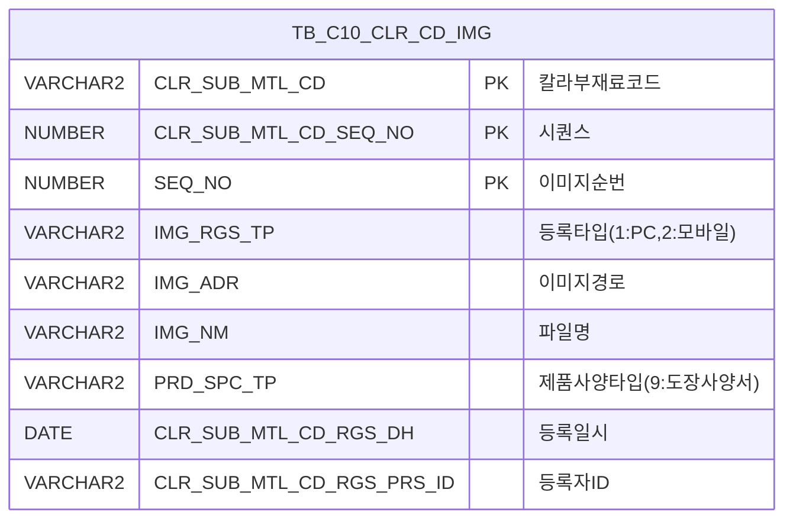

<h1 style="font-size: 40px; text-align: center; font-weight:
   bold; margin: 30px 0;">
  C106000050pop06 레거시 시스템 분석 종합 보고서
</h1>


# 1. 시스템 개요
- **서비스 ID**: C106000050pop06
- **업무명**: 칼라코드 도장사양서 파일등록 팝업
- **분석 일시**: 2026-03-17 10:01 KST
- **전체 Activity 수**: 2 (Built-in 2개, Custom 0개)
- **분석자**: Claude Opus 4.6 / Sonnet
- **분석 도구**: /analyze-service C106000050pop06
- **문서 버전**: 1.0

# 📊 비즈니스 프로세스 분석

## 시스템 목적

칼라코드 마스터(C106000050) 화면에서 특정 칼라코드의 도장사양서 파일을 업로드/조회/삭제하기 위한 팝업 화면이다. 부모 화면(C106000050)에서 칼라코드를 선택한 후 이 팝업을 열면, 해당 칼라코드에 연결된 도장사양서 이미지 파일 목록을 조회하고 새 파일을 업로드하거나 기존 파일을 삭제할 수 있다.

dhtmlXVault 컴포넌트를 사용하여 파일 업로드를 처리하며, 업로드 완료 시 자동으로 그리드를 재조회하고 부모 화면의 그리드도 갱신한다. 파일 다운로드는 그리드의 파일명 링크 클릭으로 수행되고, 삭제는 각 행의 삭제 버튼을 통해 AJAX로 처리된다. 이미지 등록 타입(IMG_RGS_TP)이 '1'(PC)로 고정되며, 이미지 등록 플래그(IMG_RGS_FLAG)는 '04'(도장사양서)로 설정된다.

## 주요 유즈케이스

### UC-01: 도장사양서 파일 목록 조회
- **Actor**: 칼라코드 관리 담당자
- **목적**: 특정 칼라코드에 등록된 도장사양서 파일 목록을 확인

- **전제조건**:
  - 부모 화면(C106000050)에서 칼라코드가 선택되어 있음
  - CLR_SUB_MTL_CD, CLR_SUB_MTL_CD_SEQ_NO 파라미터가 전달됨

- **주요 흐름**:
  1. 부모 화면에서 팝업 호출 시 CLR_SUB_MTL_CD, CLR_SUB_MTL_CD_SEQ_NO 파라미터 전달
  2. 팝업 로딩 시 onVaultLoad()로 Vault 컴포넌트 초기화
  3. onLoadGrid() 호출로 C106000050pop06.select 쿼리 실행
  4. TB_C10_CLR_CD_IMG 테이블에서 PRD_SPC_TP='9'(도장사양서) 조건으로 파일 목록 조회
  5. 그리드에 컬러코드, 순번, 구분(PC/모바일), 파일명, 등록일자, 등록자 표시

- **대체 흐름**:
  - 등록된 파일이 없는 경우: 빈 그리드 표시

- **후행조건**:
  - 파일 목록이 그리드에 표시됨
  - 사용자가 파일 업로드/다운로드/삭제를 수행할 수 있는 상태

### UC-02: 도장사양서 파일 업로드
- **Actor**: 칼라코드 관리 담당자
- **목적**: 새로운 도장사양서 파일을 칼라코드에 등록

- **전제조건**:
  - 팝업이 열려 있고 Vault 컴포넌트가 초기화됨
  - 업로드할 파일이 준비됨

- **주요 흐름**:
  1. Vault 영역에 파일을 드래그앤드롭 또는 파일 선택
  2. dhtmlXVault가 _uploadHandler6.jsp로 파일 전송
  3. 전송 시 formField로 IMG_RGS_TP(1), IMG_RGS_FLAG(04), IMG_RGS_FLAG_ID(CLR_SUB_MTL_CD), IMG_RGS_FLAG_ID2(CLR_SUB_MTL_CD_SEQ_NO), PRD_SPC_TP 전달
  4. 업로드 완료 시 onLoadGrid() 호출로 그리드 재조회
  5. parent.find() 호출로 부모 화면(C106000050) 그리드 갱신

- **대체 흐름**:
  - 업로드 실패 시: 오류 메시지 표시

- **후행조건**:
  - TB_C10_CLR_CD_IMG 테이블에 새 레코드 등록
  - 그리드에 새로 업로드된 파일 표시
  - 부모 화면 그리드 갱신

### UC-03: 도장사양서 파일 다운로드
- **Actor**: 칼라코드 관리 담당자
- **목적**: 등록된 도장사양서 파일을 다운로드

- **전제조건**:
  - 그리드에 파일 목록이 표시되어 있음

- **주요 흐름**:
  1. 그리드의 파일명(IMG_NM) 컬럼 링크 클릭
  2. Grid_doLink() 함수 호출
  3. _fileDownloadHandler.jsp로 이동 (FILE_ADR, FILE_NM 파라미터 전달)
  4. 파일 다운로드 실행

- **대체 흐름**:
  - 파일이 서버에 존재하지 않는 경우: 다운로드 실패

- **후행조건**:
  - 파일이 사용자 PC에 다운로드됨

### UC-04: 도장사양서 파일 삭제
- **Actor**: 칼라코드 관리 담당자
- **목적**: 등록된 도장사양서 파일을 삭제

- **전제조건**:
  - 그리드에 파일 목록이 표시되어 있음

- **주요 흐름**:
  1. 그리드의 삭제(DEL_IMG) 버튼 클릭
  2. doImgDel() 함수 호출
  3. _fileDeleteHandler6.jsp로 AJAX 요청
  4. 삭제 완료 후 onLoadGrid() 호출로 그리드 재조회
  5. parent.find() 호출로 부모 화면(C106000050) 그리드 갱신

- **대체 흐름**:
  - 삭제 실패 시: 오류 메시지 표시

- **후행조건**:
  - TB_C10_CLR_CD_IMG 테이블에서 해당 레코드 삭제
  - 그리드에서 해당 행 제거
  - 부모 화면 그리드 갱신

---
## 비즈니스 로직 상세

### 1. 이미지 등록 타입 분류 (DECODE 변환)

- **목적**: IMG_RGS_TP 코드값을 사용자가 읽을 수 있는 구분명으로 변환
- **처리 케이스**:

  **[케이스 1: PC 등록]**
  ```
    조건: IMG_RGS_TP 값이 '2'가 아닌 경우 (기본값)
    처리:
      1. DECODE(IMG_RGS_TP, '2', '모바일', 'PC') 적용
      2. 'PC'로 표시
  ```

  **[케이스 2: 모바일 등록]**
  ```
    조건: IMG_RGS_TP = '2'
    처리:
      1. DECODE(IMG_RGS_TP, '2', '모바일', 'PC') 적용
      2. '모바일'로 표시
  ```

### 2. 파일 경로 정규화 (CHK_IMG_ADR)

- **목적**: 서버 저장 경로를 웹 접근 가능한 상대 경로로 변환
- **처리 케이스**:

  **[케이스 1: 경로 변환]**
  ```
    조건: IMG_ADR에 'IMG_UPLOAD' 문자열이 포함된 경우
    처리:
      1. IMG_ADR에서 'IMG_UPLOAD' 이후 문자열 추출 (SUBSTR + INSTR)
      2. 백슬래시(\)를 슬래시(/)로 변환 (REPLACE)
      3. 앞에 './' 접두어, 뒤에 '/' 접미어 추가
      4. 최종 형태: './IMG_UPLOAD/.../파일경로/'
  ```

  **계산 공식**:
  ```
  CHK_IMG_ADR = './' || REPLACE(SUBSTR(IMG_ADR, INSTR(IMG_ADR, 'IMG_UPLOAD')), '\', '/') || '/'

  예시:
  IMG_ADR = 'D:\server\IMG_UPLOAD\C10\2026\image.jpg'
  → SUBSTR 결과: 'IMG_UPLOAD\C10\2026\image.jpg'
  → REPLACE 결과: 'IMG_UPLOAD/C10/2026/image.jpg'
  → 최종: './IMG_UPLOAD/C10/2026/image.jpg/'
  ```

### 3. 도장사양서 필터 조건 (PRD_SPC_TP)

- **목적**: 이미지 테이블에서 도장사양서 유형만 필터링
- **처리 케이스**:

  **[케이스 1: 도장사양서 필터]**
  ```
    조건: PRD_SPC_TP = '9' (하드코딩)
    처리:
      1. TB_C10_CLR_CD_IMG 테이블에서 PRD_SPC_TP = '9' 조건 적용
      2. 도장사양서 이외의 이미지 유형(제품사양서 등)은 제외
  ```

---

# 💾 데이터 요구사항

## 핵심 테이블

### 1. TB_C10_CLR_CD_IMG - (칼라코드 이미지 관리)
| 컬럼명 | 타입 | PK | 설명 |
|--------|------|----|-----|
| CLR_SUB_MTL_CD | VARCHAR2 | ✅ | 칼라부재료코드 (PK, FK) |
| CLR_SUB_MTL_CD_SEQ_NO | NUMBER | ✅ | 칼라부재료코드 시퀀스 (PK) |
| SEQ_NO | NUMBER | ✅ | 이미지 순번 (PK) |
| IMG_RGS_TP | VARCHAR2 | | 이미지 등록 타입 (1=PC, 2=모바일) |
| IMG_ADR | VARCHAR2 | | 이미지 서버 저장 경로 |
| IMG_NM | VARCHAR2 | | 이미지 파일명 |
| PRD_SPC_TP | VARCHAR2 | | 제품사양 타입 (9=도장사양서) |
| CLR_SUB_MTL_CD_RGS_DH | DATE | | 등록 일시 |
| CLR_SUB_MTL_CD_RGS_PRS_ID | VARCHAR2 | | 등록자 ID (FK) |

## 데이터 플로우

### 1. 조회

```
[도장사양서 파일 목록 조회]
팝업 진입 / 파일 업로드·삭제 후
→ C106000050pop06.select
  FROM TB_C10_CLR_CD_IMG
  WHERE CLR_SUB_MTL_CD = :CLR_SUB_MTL_CD
    AND CLR_SUB_MTL_CD_SEQ_NO = :CLR_SUB_MTL_CD_SEQ_NO
    AND PRD_SPC_TP = '9'
  ORDER BY SEQ_NO
→ Grid에 파일 목록 표시
```

### 2. 파일 업로드

```
[도장사양서 파일 업로드]
Vault 영역에 파일 드래그앤드롭
→ _uploadHandler6.jsp
  IMG_RGS_TP = '1' (PC)
  IMG_RGS_FLAG = '04' (도장사양서)
  IMG_RGS_FLAG_ID = CLR_SUB_MTL_CD
  IMG_RGS_FLAG_ID2 = CLR_SUB_MTL_CD_SEQ_NO
  PRD_SPC_TP = 전달받은 값
→ TB_C10_CLR_CD_IMG INSERT
→ onLoadGrid() 그리드 재조회
→ parent.find() 부모 화면 갱신
```

### 3. 파일 삭제

```
[도장사양서 파일 삭제]
그리드 삭제 버튼 클릭
→ _fileDeleteHandler6.jsp (AJAX)
  FILE_ADR = CHK_IMG_ADR
  FILE_NM = CHK_IMG_NM
→ TB_C10_CLR_CD_IMG DELETE
→ onLoadGrid() 그리드 재조회
→ parent.find() 부모 화면 갱신
```

## SQL 일람표
| SQL 이름 | 쿼리 ID | 타입 | 출처 | 테이블 |
|---------|---------|-----|-------|-------|
| 도장사양서 파일 목록 조회 | C106000050pop06.select | SELECT | Service | TB_C10_CLR_CD_IMG |

## ER 다이어그램 (핵심 관계)



관계 설명:
- TB_C10_CLR_CD_IMG가 유일한 테이블로, 단일 테이블 기반 CRUD 서비스
- CLR_SUB_MTL_CD는 칼라코드 마스터 테이블(부모 화면 C106000050)의 FK로 추정
- CLR_SUB_MTL_CD_RGS_PRS_ID는 사용자 마스터 테이블의 FK로 추정

---

# 🖥️ 사용자 인터페이스 요구사항

## 화면 레이아웃 상세

### Layout 구조 (Flat - initLayout 없음)
```javascript
{
  // initLayout 없이 body에 직접 배치 (팝업 특성)
  components: [
    {
      id: "vault1",
      type: "dhtmlxVault",
      position: "absolute, top area",
      description: "파일 업로드 영역"
    },
    {
      id: "C106000050pop06_Grid_1",
      type: "grid",
      position: "absolute, height:70px, width:430px, left:8px, top:260px",
      description: "파일 목록 그리드"
    },
    {
      id: "C106000050pop06_MessageBox_1",
      type: "messagebox",
      position: "absolute, height:23px, width:445px, left:0px, top:332px",
      description: "상태 메시지 표시"
    }
  ]
}
```

## 입출력 요소

### Vault 컴포넌트
**vault1 (dhtmlXVault - 파일 업로드)**
- 업로드 핸들러: _uploadHandler6.jsp
- 정보 조회 핸들러: _getInfoHandler.jsp
- ID 조회 핸들러: _getIdHandler.jsp
- formField:
  - IMG_RGS_TP: 이미지 등록 타입 (값 고정: 1)
  - IMG_RGS_FLAG: 이미지 등록 플래그 (값 고정: 04)
  - IMG_RGS_FLAG_ID: 칼라부재료코드 (request 파라미터)
  - IMG_RGS_FLAG_ID2: 칼라부재료코드 시퀀스 (request 파라미터)
  - PRD_SPC_TP: 제품사양타입 (request 파라미터)
- 이벤트: 업로드 완료 시 → onLoadGrid() + parent.find()

### Grid 컴포넌트

**C106000050pop06_Grid_1 (파일 목록)**
- 편집 가능 여부: 아니오 (읽기 전용, 모든 컬럼 ro)
- Split: 0 (고정 컬럼 없음)
- colwidth: % (비율 기반)
- multiselect: true
- vertical: true (세로 스크롤)
- 주요 컬럼 (11개):

  **표시 컬럼 (7개)**:
  - CLR_SUB_MTL_CD: ro - 컬러코드 (19%, 중앙정렬)
  - SEQ_NO: ro - 순번 (8%, 중앙정렬)
  - IMG_RGS_TP: ro - 구분 (11%, 중앙정렬) — DECODE로 'PC'/'모바일' 표시
  - IMG_NM: ahref_idx - 파일명 (나머지%, 좌측정렬, 클릭 시 파일 다운로드)
  - CLR_SUB_MTL_CD_RGS_DH: ro - 등록일자 (20%, 중앙정렬) — 'YYYY-MM-DD' 형식
  - CLR_SUB_MTL_CD_RGS_PRS_ID: ro - 등록자 (16%, 중앙정렬)
  - DEL_IMG: ro - 삭제 (8%, 중앙정렬) — 클릭 시 doImgDel() 호출

  **숨김 컬럼 (4개)**:
  - CLR_SUB_MTL_CD_SEQ_NO: ro - 시퀀스번호 (숨김)
  - IMG_ADR: ro - 이미지 서버 경로 (숨김)
  - CHK_IMG_NM: ro - 확인용 파일명 (숨김) — 삭제 시 사용
  - CHK_IMG_ADR: ro - 확인용 경로 (숨김) — 정규화된 웹 경로, 다운로드/삭제 시 사용

## 화면 동작 흐름

### 1. 화면 초기 로딩
```
1. 부모 화면(C106000050)에서 팝업 호출
   - CLR_SUB_MTL_CD, CLR_SUB_MTL_CD_SEQ_NO, rowId, parent_item, IMG_RGS_TP, PRD_SPC_TP 전달
2. body onload → onVaultLoad() 실행
   - dhtmlXVaultObject 생성
   - imagePath, uploadHandler, getInfoHandler, getIdHandler 설정
   - formField 5개 설정 (IMG_RGS_TP, IMG_RGS_FLAG, IMG_RGS_FLAG_ID, IMG_RGS_FLAG_ID2, PRD_SPC_TP)
3. onLoadGrid() 호출
   - CLR_SUB_MTL_CD, CLR_SUB_MTL_CD_SEQ_NO 파라미터로 그리드 조회
   - C106000050pop06.select 쿼리 실행
4. 그리드에 파일 목록 표시
5. MessageBox 초기화
```

### 2. 파일 업로드
```
1. 사용자가 Vault 영역에 파일 드래그앤드롭 또는 파일 선택
2. dhtmlXVault가 _uploadHandler6.jsp로 파일 + formField 전송
3. 서버에서 파일 저장 및 TB_C10_CLR_CD_IMG INSERT 처리
4. 업로드 완료 콜백:
   - onLoadGrid() → 그리드 재조회
   - parent.find("find", "C106000050_Form_1", "C106000050_Grid_1") → 부모 화면 갱신
```

### 3. 파일 다운로드
```
1. 그리드의 파일명(IMG_NM) 링크 클릭
2. Grid_doLink(id, ind) 함수 호출
3. 해당 행의 CHK_IMG_ADR(정규화된 경로), CHK_IMG_NM(파일명) 추출
4. _fileDownloadHandler.jsp?FILE_ADR=...&FILE_NM=... 로 이동
5. 파일 다운로드 실행
```

### 4. 파일 삭제
```
1. 그리드의 삭제(DEL_IMG) 버튼 클릭
2. doImgDel() 함수 호출
3. _fileDeleteHandler6.jsp로 AJAX 요청 (파일 경로, 파일명 전달)
4. 서버에서 파일 삭제 및 TB_C10_CLR_CD_IMG DELETE 처리
5. 삭제 완료 콜백:
   - onLoadGrid() → 그리드 재조회
   - parent.find("find", "C106000050_Form_1", "C106000050_Grid_1") → 부모 화면 갱신
```

## JavaScript 모듈

**C106000050pop06.jsp** (인라인 스크립트)
- onVaultLoad(): Vault 컴포넌트 초기화 (dhtmlXVaultObject 생성, formField 설정)
- onLoadGrid(): 그리드 재조회 (CLR_SUB_MTL_CD, CLR_SUB_MTL_CD_SEQ_NO 파라미터로 loadData)
- Grid_doLink(id, ind): 파일 다운로드 (_fileDownloadHandler.jsp로 이동)
- doImgDel(): 파일 삭제 (_fileDeleteHandler6.jsp AJAX 호출 후 onLoadGrid + parent.find)
- find(): 폼 데이터로 그리드 조회 (uiCommon.parameters → loadData)
- save(): 그리드 데이터 저장 (sendGrid)
- refresh(): 그리드 새로고침 (clearDataProcess → loadData)
- findMessage(): 메시지 박스 표시 (uiCommon.message)
- onGridContextMenuClick(): 컨텍스트 메뉴 처리 (move_grid, filter_grid, editable_grid, excel_grid)

## 주요 이벤트 핸들러

**onUploadComplete (파일 업로드 완료)**
- 이벤트 타입: dhtmlXVault Upload Complete
- 처리 내용:
  1. onLoadGrid() 호출로 파일 목록 그리드 재조회
  2. parent.find("find", "C106000050_Form_1", "C106000050_Grid_1") 호출
  3. 부모 화면(C106000050)의 칼라코드 그리드 갱신

**Grid_doLink (파일명 링크 클릭)**
- 이벤트 타입: Grid ahref_idx Click
- 처리 내용:
  1. 클릭된 행의 CHK_IMG_ADR, CHK_IMG_NM 값 추출
  2. _fileDownloadHandler.jsp로 파일 경로 및 파일명 전달
  3. 파일 다운로드 실행

**doImgDel (삭제 버튼 클릭)**
- 이벤트 타입: Grid Button Click
- 처리 내용:
  1. 클릭된 행의 파일 정보 추출
  2. _fileDeleteHandler6.jsp로 AJAX 요청
  3. 삭제 완료 후 onLoadGrid() 재조회
  4. parent.find() 부모 화면 갱신

---

# 📌 특이사항 및 주의사항

## 1. 하드코딩된 상수값
- **IMG_RGS_TP = '1'**: PC 등록 타입이 하드코딩. 모바일 업로드 시 별도 팝업이 필요할 수 있음
- **IMG_RGS_FLAG = '04'**: 도장사양서 플래그가 하드코딩. 다른 이미지 유형과 분리됨
- **PRD_SPC_TP = '9'**: SQL WHERE 조건에 하드코딩되어 도장사양서만 필터링

## 2. 파일 경로 처리 방식의 취약성
- **경로 정규화**: CHK_IMG_ADR 계산에서 'IMG_UPLOAD' 문자열을 기준으로 경로를 분리하는데, 이 문자열이 경로에 없으면 잘못된 경로가 생성될 수 있음
- **백슬래시→슬래시 변환**: Windows 서버 경로를 웹 경로로 변환하는 패턴으로, 서버 OS 의존성이 있음
- **파일 삭제 핸들러**: _fileDeleteHandler6.jsp로 AJAX 호출 시 서버 파일 시스템의 실제 파일도 함께 삭제되는 구조

## 3. 부모-자식 화면 간 강한 결합
- **parent.find() 직접 호출**: 팝업에서 부모 화면의 함수를 직접 호출하여 갱신하는 패턴. 부모 화면의 함수 시그니처가 변경되면 팝업에서 오류 발생
- **하드코딩된 부모 참조**: `parent.find("find", "C106000050_Form_1", "C106000050_Grid_1")`에서 부모 화면의 Form/Grid ID가 하드코딩됨
- **parent_item 파라미터**: 부모 그리드의 아이템 ID를 전달받아 특정 컴포넌트와 연결

## 4. Vault 컴포넌트 의존성
- **dhtmlXVault**: DHTMLX 프레임워크의 파일 업로드 전용 컴포넌트 사용. 일반 그리드/폼과 다른 별도 라이브러리
- **3개 핸들러 JSP**: _uploadHandler6.jsp, _getInfoHandler.jsp, _getIdHandler.jsp — 공통 파일 처리 JSP에 의존
- **_fileDeleteHandler6.jsp**: 삭제 전용 핸들러로, 번호 접미사('6')가 C10 모듈 전용을 의미할 수 있음

## 5. 단일 테이블 기반 단순 구조
- TB_C10_CLR_CD_IMG 테이블 하나만 사용하는 단순 CRUD 서비스
- JOIN 없이 단일 테이블 SELECT로 구성되어 데이터 정합성 검증이 별도로 필요하지 않음

---

# 📚 참고 문서

- **Service XML**: `src/service/C106000050pop06-service.xml`
- **Query SQL**: `src/query/C106000050pop06-query.glue_sql`
- **JSP**: `WebContents/C106000050pop06.jsp`
- **Grid XML**: `WebContents/header/kr/C106000050pop06/C106000050pop06_Grid_1.xml`
