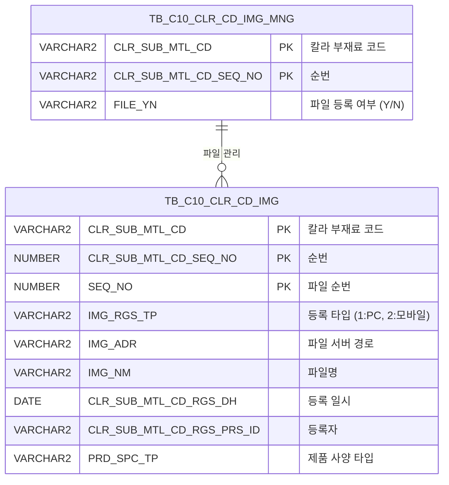

<h1 style="font-size: 40px; text-align: center; font-weight:
   bold; margin: 30px 0;">
  C106000050pop07 레거시 시스템 분석 종합 보고서
</h1>


# 1. 시스템 개요
- **서비스 ID**: C106000050pop07
- **업무명**: 칼라코드 도장사양서 파일등록 (팝업)
- **분석 일시**: 2026-03-17 10:03 KST
- **분석 시간**: 약 3분
- **전체 Activity 수**: 2개 (Built-in 2개, Custom 0개)
- **분석자**: Claude Opus 4.6 / Claude Sonnet 4.6
- **분석 도구**: /analyze-service C106000050pop07
- **문서 버전**: 1.0

# 📊 비즈니스 프로세스 분석

## 시스템 목적

본 서비스는 칼라코드 도장사양서에 첨부되는 이미지 파일을 관리하는 팝업 화면이다. 부모 화면(C106000050)에서 특정 칼라코드(CLR_SUB_MTL_CD)와 순번(CLR_SUB_MTL_CD_SEQ_NO)을 선택한 후 이 팝업을 호출하면, 해당 칼라코드에 연결된 원가내역서(PRD_SPC_TP='0') 파일 목록을 조회하고, dhtmlXVault 컴포넌트를 통한 파일 업로드/다운로드/삭제 기능을 제공한다.

파일 업로드 시 TB_C10_CLR_CD_IMG 테이블에 이미지 정보가 INSERT되며, SEQ_NO는 기존 최대값+1로 자동 채번된다. 업로드 완료 및 삭제 시 부모 화면의 그리드도 자동 재조회되어 파일 등록 상태가 실시간 반영된다. 또한 TB_C10_CLR_CD_IMG_MNG 테이블의 FILE_YN 컬럼이 파일 존재 여부에 따라 'Y'/'N'으로 자동 갱신된다.

<!-- 단순 조회 서비스 (Custom Activity 0개, Built-in SELECT only, Router→단일 조회 체인) → 워크플로우 다이어그램 생략 -->

## 주요 유즈케이스

### UC-01: 도장사양서 파일 목록 조회
- **Actor**: 칼라코드 관리 담당자
- **목적**: 특정 칼라코드에 등록된 원가내역서 이미지 파일 목록을 확인

- **전제조건**:
  - 부모 화면(C106000050)에서 칼라코드와 순번이 선택되어 팝업이 호출됨
  - CLR_SUB_MTL_CD, CLR_SUB_MTL_CD_SEQ_NO 파라미터가 전달됨

- **주요 흐름**:
  1. 팝업 로드 시 onLoadGrid() 호출
  2. CLR_SUB_MTL_CD, CLR_SUB_MTL_CD_SEQ_NO 파라미터로 C106000050pop07.select 쿼리 실행
  3. TB_C10_CLR_CD_IMG 테이블에서 PRD_SPC_TP='0' 조건으로 파일 목록 조회
  4. Grid에 컬러코드, 순번, 구분(PC/모바일), 파일명, 등록일자, 등록자 표시

- **대체 흐름**:
  - 등록된 파일이 없는 경우: 빈 그리드 표시

- **후행조건**:
  - 파일 목록이 Grid에 표시됨
  - 사용자가 파일 업로드/다운로드/삭제 작업 가능 상태

### UC-02: 파일 업로드
- **Actor**: 칼라코드 관리 담당자
- **목적**: 도장사양서 관련 이미지 파일을 시스템에 등록

- **전제조건**:
  - 팝업이 정상 로드된 상태
  - 업로드할 파일이 준비됨

- **주요 흐름**:
  1. dhtmlXVault 영역에 파일 드래그앤드롭 또는 파일 선택
  2. Vault가 _uploadHandler6.jsp로 파일 전송
  3. 서버에서 C106000050pop07.insert 쿼리로 TB_C10_CLR_CD_IMG에 INSERT (SEQ_NO 자동 채번)
  4. C106000050pop07.update 쿼리로 TB_C10_CLR_CD_IMG_MNG의 FILE_YN을 'Y'로 갱신
  5. vault.onUploadComplete 이벤트 발생 → onLoadGrid()로 그리드 재조회
  6. parent.find()로 부모 화면(C106000050) 그리드 재조회

- **대체 흐름**:
  - 업로드 실패 시: 에러 메시지 표시

- **후행조건**:
  - 파일이 서버에 저장됨
  - TB_C10_CLR_CD_IMG에 파일 메타 정보 등록
  - TB_C10_CLR_CD_IMG_MNG.FILE_YN = 'Y'로 갱신
  - 팝업 그리드와 부모 화면 그리드가 최신 상태로 갱신

### UC-03: 파일 다운로드
- **Actor**: 칼라코드 관리 담당자
- **목적**: 등록된 도장사양서 이미지 파일을 다운로드

- **전제조건**:
  - 그리드에 파일 목록이 조회된 상태

- **주요 흐름**:
  1. Grid에서 파일명(IMG_NM) 링크 클릭
  2. Grid_doLink 이벤트 핸들러 실행
  3. _fileDownloadHandler.jsp 호출 (CHK_IMG_NM, CHK_IMG_ADR 파라미터 전달)
  4. 브라우저에서 파일 다운로드 실행

- **대체 흐름**:
  - 파일이 서버에 존재하지 않는 경우: 다운로드 실패 메시지

- **후행조건**:
  - 파일이 사용자 로컬에 다운로드됨

### UC-04: 파일 삭제
- **Actor**: 칼라코드 관리 담당자
- **목적**: 등록된 도장사양서 이미지 파일을 삭제

- **전제조건**:
  - 그리드에 파일 목록이 조회된 상태

- **주요 흐름**:
  1. Grid에서 삭제 버튼 클릭
  2. doImgDel 이벤트 핸들러 실행 → 삭제 확인 대화상자
  3. 확인 시 _fileDeleteHandler6.jsp 호출
  4. C106000050pop07.delete 쿼리로 TB_C10_CLR_CD_IMG에서 해당 행 DELETE
  5. C106000050pop07.update 쿼리로 TB_C10_CLR_CD_IMG_MNG의 FILE_YN 갱신 (파일 0개면 'N')
  6. onLoadGrid()로 그리드 재조회
  7. parent.find()로 부모 화면(C106000050) 그리드 재조회

- **대체 흐름**:
  - 사용자가 취소 클릭: 삭제 중단

- **후행조건**:
  - TB_C10_CLR_CD_IMG에서 해당 행 삭제
  - TB_C10_CLR_CD_IMG_MNG.FILE_YN이 잔여 파일 존재 여부에 따라 갱신
  - 팝업 그리드와 부모 화면 그리드가 최신 상태로 갱신

---
## 비즈니스 로직 상세

### 1. 이미지 등록 구분(IMG_RGS_TP) 코드 변환

- **목적**: 이미지 등록 타입 코드값을 사용자가 이해할 수 있는 명칭으로 변환
- **처리 케이스**:

  **[케이스 1: 모바일 등록]**
  ```
    조건: IMG_RGS_TP = '2'
    처리: '모바일'로 표시
  ```

  **[케이스 2: PC 등록 (기본값)]**
  ```
    조건: IMG_RGS_TP ≠ '2' (기본값)
    처리: 'PC'로 표시
  ```

### 2. 파일 경로 정규화 (CHK_IMG_ADR)

- **목적**: 서버에 저장된 이미지 파일 경로를 웹 접근 가능한 상대 경로로 변환
- **처리 케이스**:

  **[케이스 1: 경로 변환]**
  ```
    조건: IMG_ADR에 'IMG_UPLOAD' 문자열 포함
    처리:
      1. IMG_ADR에서 'IMG_UPLOAD' 시작 위치 이후 문자열 추출 (SUBSTR + INSTR)
      2. 백슬래시(\)를 슬래시(/)로 변환 (REPLACE)
      3. 앞에 './' 접두어, 뒤에 '/' 접미어 추가
    결과: './IMG_UPLOAD/경로/' 형태의 웹 상대 경로
  ```

- **계산 공식**:
  ```
  CHK_IMG_ADR = './' || REPLACE(SUBSTR(IMG_ADR, INSTR(IMG_ADR, 'IMG_UPLOAD')), '\', '/') || '/'

  예시:
  IMG_ADR = 'D:\server\webapps\IMG_UPLOAD\c10\2022\file1.jpg'
  → SUBSTR 결과: 'IMG_UPLOAD\c10\2022\file1.jpg'
  → REPLACE 결과: 'IMG_UPLOAD/c10/2022/file1.jpg'
  → 최종: './IMG_UPLOAD/c10/2022/file1.jpg/'
  ```

### 3. 파일 시퀀스 자동 채번 (INSERT 시)

- **목적**: 동일 칼라코드 내 파일 순번을 자동으로 증가시켜 중복 없이 관리
- **처리 케이스**:

  **[케이스 1: 기존 파일 존재]**
  ```
    조건: 동일 CLR_SUB_MTL_CD + CLR_SUB_MTL_CD_SEQ_NO에 기존 파일이 있음
    처리: MAX(SEQ_NO) + 1로 채번
  ```

  **[케이스 2: 최초 파일 등록]**
  ```
    조건: 해당 칼라코드에 등록된 파일이 없음 (MAX(SEQ_NO) IS NULL)
    처리: NVL(NULL, 0) + 1 = 1로 채번
  ```

- **계산 공식**:
  ```
  SEQ_NO = NVL(MAX(SEQ_NO), 0) + 1
    WHERE CLR_SUB_MTL_CD = :IMG_RGS_FLAG_ID
    AND   CLR_SUB_MTL_CD_SEQ_NO = :IMG_RGS_FLAG_ID2
  ```

### 4. 파일 등록 여부 자동 갱신 (FILE_YN)

- **목적**: 칼라코드의 파일 등록 상태를 자동으로 관리
- **처리 케이스**:

  **[케이스 1: 파일 존재]**
  ```
    조건: TB_C10_CLR_CD_IMG에 해당 칼라코드의 파일 수(COUNT) > 0
    처리: TB_C10_CLR_CD_IMG_MNG.FILE_YN = 'Y'
  ```

  **[케이스 2: 파일 없음]**
  ```
    조건: TB_C10_CLR_CD_IMG에 해당 칼라코드의 파일 수(COUNT) = 0
    처리: TB_C10_CLR_CD_IMG_MNG.FILE_YN = 'N'
  ```

- **계산 공식**:
  ```
  FILE_YN = DECODE(
    (SELECT COUNT(IMG_NM) FROM TB_C10_CLR_CD_IMG
     WHERE CLR_SUB_MTL_CD = :IMG_RGS_FLAG_ID
     AND   CLR_SUB_MTL_CD_SEQ_NO = :IMG_RGS_FLAG_ID2
     AND   PRD_SPC_TP = '0'),
    0, 'N', 'Y')
  ```

---

# 💾 데이터 요구사항

## 핵심 테이블

### 1. TB_C10_CLR_CD_IMG - (칼라코드 이미지 파일 관리)
| 컬럼명 | 타입 | PK | 설명 |
|--------|------|----|------|
| CLR_SUB_MTL_CD | VARCHAR2 | ✅ | 칼라 부재료 코드 (PK) |
| CLR_SUB_MTL_CD_SEQ_NO | NUMBER | ✅ | 칼라 부재료 코드 순번 (PK) |
| SEQ_NO | NUMBER | ✅ | 파일 순번 (PK, 자동 채번) |
| IMG_RGS_TP | VARCHAR2 | | 이미지 등록 타입 ('1'=PC, '2'=모바일) |
| IMG_ADR | VARCHAR2 | | 이미지 파일 서버 경로 |
| IMG_NM | VARCHAR2 | | 이미지 파일명 |
| CLR_SUB_MTL_CD_RGS_DH | DATE | | 등록 일시 |
| CLR_SUB_MTL_CD_RGS_PRS_ID | VARCHAR2 | | 등록자 ID |
| PRD_SPC_TP | VARCHAR2 | | 제품 사양 타입 ('0'=원가내역서) |
| CREATED_OBJECT_TYPE | VARCHAR2 | | 생성 객체 타입 |
| CREATED_OBJECT_ID | VARCHAR2 | | 생성자 ID |
| CREATED_PROGRAM_ID | VARCHAR2 | | 생성 프로그램 ID |
| CREATION_TIMESTAMP | TIMESTAMP | | 생성 타임스탬프 |
| LAST_UPDATED_OBJECT_TYPE | VARCHAR2 | | 최종 수정 객체 타입 |
| LAST_UPDATED_OBJECT_ID | VARCHAR2 | | 최종 수정자 ID |
| LAST_UPDATE_PROGRAM_ID | VARCHAR2 | | 최종 수정 프로그램 ID |
| LAST_UPDATE_TIMESTAMP | TIMESTAMP | | 최종 수정 타임스탬프 |

### 2. TB_C10_CLR_CD_IMG_MNG - (칼라코드 이미지 파일 관리 마스터)
| 컬럼명 | 타입 | PK | 설명 |
|--------|------|----|------|
| CLR_SUB_MTL_CD | VARCHAR2 | ✅ | 칼라 부재료 코드 (PK) |
| CLR_SUB_MTL_CD_SEQ_NO | NUMBER | ✅ | 칼라 부재료 코드 순번 (PK) |
| FILE_YN | VARCHAR2 | | 파일 등록 여부 ('Y'/'N') |
| LAST_UPDATED_OBJECT_TYPE | VARCHAR2 | | 최종 수정 객체 타입 |
| LAST_UPDATED_OBJECT_ID | VARCHAR2 | | 최종 수정자 ID |
| LAST_UPDATE_PROGRAM_ID | VARCHAR2 | | 최종 수정 프로그램 ID |
| LAST_UPDATE_TIMESTAMP | TIMESTAMP | | 최종 수정 타임스탬프 |

## 데이터 플로우

### 1. 조회
```
[파일 목록 조회]
팝업 진입 (부모 화면에서 CLR_SUB_MTL_CD, CLR_SUB_MTL_CD_SEQ_NO 전달)
→ C106000050pop07.select
  FROM TB_C10_CLR_CD_IMG
  WHERE CLR_SUB_MTL_CD = :CLR_SUB_MTL_CD
    AND CLR_SUB_MTL_CD_SEQ_NO = :CLR_SUB_MTL_CD_SEQ_NO
    AND PRD_SPC_TP = '0'
  ORDER BY CLR_SUB_MTL_CD, CLR_SUB_MTL_CD_SEQ_NO, SEQ_NO
→ Grid에 파일 목록 표시 (DECODE로 PC/모바일 변환, 경로 정규화)
```

### 2. 파일 업로드
```
[파일 업로드 처리]
사용자가 Vault에 파일 드롭
→ _uploadHandler6.jsp로 파일 서버 저장
→ C106000050pop07.insert
  INTO TB_C10_CLR_CD_IMG
  VALUES (CLR_SUB_MTL_CD, CLR_SUB_MTL_CD_SEQ_NO, 자동채번SEQ, ...)
→ C106000050pop07.update
  UPDATE TB_C10_CLR_CD_IMG_MNG SET FILE_YN = DECODE(COUNT, 0, 'N', 'Y')
  WHERE CLR_SUB_MTL_CD = :IMG_RGS_FLAG_ID
    AND CLR_SUB_MTL_CD_SEQ_NO = :IMG_RGS_FLAG_ID2
→ 팝업 Grid 재조회 + 부모 화면 Grid 재조회
```

### 3. 파일 삭제
```
[파일 삭제 처리]
사용자가 삭제 버튼 클릭 → 확인 대화상자
→ _fileDeleteHandler6.jsp 호출
→ C106000050pop07.delete
  DELETE TB_C10_CLR_CD_IMG
  WHERE CLR_SUB_MTL_CD = :IMG_RGS_FLAG_ID
    AND CLR_SUB_MTL_CD_SEQ_NO = :IMG_RGS_FLAG_ID2
    AND SEQ_NO = :SEQ
→ C106000050pop07.update
  UPDATE TB_C10_CLR_CD_IMG_MNG SET FILE_YN = DECODE(COUNT, 0, 'N', 'Y')
→ 팝업 Grid 재조회 + 부모 화면 Grid 재조회
```

## SQL 일람표
| SQL 이름 | 쿼리 ID | 타입 | 출처 | 테이블 |
|---------|---------|-----|------|-------|
| 파일 목록 조회 | C106000050pop07.select | SELECT | Service | TB_C10_CLR_CD_IMG |
| 파일 업로드 | C106000050pop07.insert | INSERT | _uploadHandler6.jsp | TB_C10_CLR_CD_IMG |
| 파일 삭제 | C106000050pop07.delete | DELETE | _fileDeleteHandler6.jsp | TB_C10_CLR_CD_IMG |
| 파일 등록여부 갱신 | C106000050pop07.update | UPDATE | _uploadHandler6.jsp / _fileDeleteHandler6.jsp | TB_C10_CLR_CD_IMG_MNG |

## ER 다이어그램 (핵심 관계)



관계 설명:
- TB_C10_CLR_CD_IMG_MNG가 마스터 테이블로 칼라코드별 파일 등록 상태(FILE_YN)를 관리
- TB_C10_CLR_CD_IMG가 상세 테이블로 실제 이미지 파일 정보를 저장 (1:N 관계)
- CLR_SUB_MTL_CD + CLR_SUB_MTL_CD_SEQ_NO 복합키로 연결

---

# 🖥️ 사용자 인터페이스 요구사항

## 화면 레이아웃 상세

### Layout 구조 (팝업)
```javascript
{
  type: "popup",
  description: "파일 업로드 팝업 (절대 위치 배치)",
  components: [
    {
      id: "vault1",
      type: "dhtmlxVault",
      position: "top",
      description: "파일 업로드 영역"
    },
    {
      id: "C106000050pop07_Grid_1",
      type: "grid",
      position: "absolute",
      top: 260, left: 8, width: 430, height: 70,
      description: "등록 파일 목록"
    },
    {
      id: "C106000050pop07_MessageBox_1",
      type: "messagebox",
      position: "absolute",
      top: 332, left: 0, width: 445, height: 23,
      description: "상태 메시지 표시"
    }
  ]
}
```

## 입출력 요소

### Vault 컴포넌트
**vault1 (dhtmlXVault - 파일 업로드)**
- 서버 핸들러:
  - 업로드: `_uploadHandler6.jsp`
  - 정보 조회: `_getInfoHandler.jsp`
  - ID 조회: `_getIdHandler.jsp`
- 업로드 폼 필드:
  - IMG_RGS_TP: 이미지 등록 타입 (값 '1' 고정 = PC)
  - IMG_RGS_FLAG: 이미지 등록 플래그 (값 '04' 고정)
  - IMG_RGS_FLAG_ID: 칼라 부재료 코드 (request parameter에서 가져옴)
  - IMG_RGS_FLAG_ID2: 칼라 부재료 코드 순번 (request parameter에서 가져옴)
  - PRD_SPC_TP: 제품 사양 타입 (request parameter에서 가져옴)

### Grid 컴포넌트

**C106000050pop07_Grid_1 (등록 파일 목록)**
- 편집 가능 여부: 아니오 (전체 읽기 전용)
- Split: 없음 (0)
- Vertical: true (세로 스크롤)
- Pageset: true (페이징 활성화)
- rowCnt: 2 (표시 행 수)
- 주요 컬럼 (11개):

  **표시 컬럼 (7개)**:
  - CLR_SUB_MTL_CD: ro - 컬러코드 (19%, 중앙정렬)
  - SEQ_NO: ro - 순번 (8%, 중앙정렬)
  - IMG_RGS_TP: ro - 구분 (11%, 중앙정렬, PC/모바일 표시)
  - IMG_NM: ahref_idx - 파일 (*, 좌측정렬, 클릭 시 파일 다운로드)
  - CLR_SUB_MTL_CD_RGS_DH: ro - 등록일자 (20%, 중앙정렬)
  - CLR_SUB_MTL_CD_RGS_PRS_ID: ro - 등록자 (16%, 중앙정렬)
  - DEL_IMG: ro - 삭제 (8%, 중앙정렬, 삭제 버튼)

  **숨김 컬럼 (4개)**:
  - CLR_SUB_MTL_CD_SEQ_NO: ro - 칼라 부재료 코드 순번 (숨김)
  - IMG_ADR: ro - 이미지 서버 경로 (숨김)
  - CHK_IMG_NM: ro - 다운로드용 파일명 (숨김)
  - CHK_IMG_ADR: ro - 다운로드용 정규화 경로 (숨김)

## 화면 동작 흐름

### 1. 화면 초기 로딩
```
1. 부모 화면(C106000050)에서 팝업 호출
   - CLR_SUB_MTL_CD, CLR_SUB_MTL_CD_SEQ_NO, PRD_SPC_TP, IMG_RGS_TP 파라미터 전달
2. body.onload → onVaultLoad() 실행
3. dhtmlXVaultObject 초기화
   - 업로드 핸들러 URL 설정 (_uploadHandler6.jsp)
   - 폼 필드 값 설정 (IMG_RGS_TP=1, IMG_RGS_FLAG=04, etc.)
4. vault.onUploadComplete 콜백 등록
5. onLoadGrid() 호출 → 기존 파일 목록 조회
   - C106000050pop07.select 실행
   - Grid에 파일 목록 표시
6. MessageBox 초기화
```

### 2. 파일 업로드 후 갱신
```
1. 사용자가 Vault 영역에 파일 드래그앤드롭
2. Vault가 _uploadHandler6.jsp로 파일 + 폼 필드 전송
3. 서버에서 파일 저장 + DB INSERT + FILE_YN UPDATE
4. vault.onUploadComplete 콜백 실행
5. onLoadGrid() → 팝업 Grid 재조회
6. parent.find('find','C106000050_Form_1','C106000050_Grid_1') → 부모 화면 재조회
```

### 3. 파일 다운로드
```
1. Grid에서 파일명(IMG_NM) 링크 클릭
2. Grid_doLink(id, ind) 이벤트 핸들러 실행
3. 숨김 컬럼에서 CHK_IMG_NM(파일명), CHK_IMG_ADR(경로) 추출
4. _fileDownloadHandler.jsp 호출 (filename, path 파라미터)
5. 브라우저에서 파일 다운로드 실행
```

### 4. 파일 삭제
```
1. Grid에서 삭제 컬럼(DEL_IMG) 클릭
2. doImgDel(rowIdx) 이벤트 핸들러 실행
3. confirm 대화상자로 삭제 확인
4. 확인 시 _fileDeleteHandler6.jsp 호출 (IMG_RGS_FLAG_ID, IMG_RGS_FLAG_ID2, SEQ 파라미터)
5. 서버에서 DB DELETE + FILE_YN UPDATE
6. onLoadGrid() → 팝업 Grid 재조회
7. parent.find() → 부모 화면 재조회
```

## JavaScript 모듈

**C106000050pop07.jsp (팝업 인라인 스크립트)**
- onVaultLoad(): 페이지 로드 시 dhtmlXVaultObject 초기화 및 업로드 핸들러 설정
- onLoadGrid(): CLR_SUB_MTL_CD, CLR_SUB_MTL_CD_SEQ_NO 파라미터로 Grid 재조회
- Grid_doLink(id, ind): 파일명 링크 클릭 시 _fileDownloadHandler.jsp로 파일 다운로드
- doImgDel(rowIdx): 삭제 확인 후 _fileDeleteHandler6.jsp 호출
- find(cmd, formId, gridId): 폼 파라미터 기반 Grid 데이터 로드
- save(cmd, formId, gridId): Grid 데이터 저장
- refresh(): Grid 데이터 클리어 후 재조회
- add(): Grid에 신규 행 추가
- remove(): Grid 선택 행 삭제
- copy(): 행 클립보드 복사
- undo(): Grid 변경 취소
- redo(): Grid 변경 다시 실행
- onGridContextMenuClick(): 컨텍스트 메뉴 처리 (열 이동, 필터, 편집 가능, 엑셀 내보내기)
- findMessage(): MessageBox에 appMsg 사용자 데이터 표시
- onXleGrid(): XLE(엑셀 업로드) 이벤트 핸들러

## 주요 이벤트 핸들러

**vault.onUploadComplete (파일 업로드 완료)**
- 이벤트 타입: Vault Upload Complete Callback
- 처리 내용:
  1. onLoadGrid() 호출하여 팝업 Grid 재조회
  2. parent.find('find','C106000050_Form_1','C106000050_Grid_1') 호출하여 부모 화면 재조회

**Grid_doLink (파일명 클릭)**
- 이벤트 타입: Grid Cell Click (ahref_idx)
- 처리 내용:
  1. 클릭된 행의 CHK_IMG_NM(파일명) 추출
  2. 클릭된 행의 CHK_IMG_ADR(정규화 경로) 추출
  3. _fileDownloadHandler.jsp로 다운로드 요청

**doImgDel (파일 삭제)**
- 이벤트 타입: Button Click (삭제 컬럼)
- 처리 내용:
  1. confirm("해당 이미지를 삭제하시겠습니까?") 표시
  2. 확인 시 해당 행의 IMG_RGS_FLAG_ID, IMG_RGS_FLAG_ID2, SEQ 추출
  3. _fileDeleteHandler6.jsp 호출
  4. onLoadGrid() → 팝업 Grid 재조회
  5. parent.find() → 부모 화면 재조회

---

# 📌 특이사항 및 주의사항

## 1. JSP 기반 파일 처리 (서비스 외부 로직)
- **업로드/삭제/다운로드 로직이 Service XML이 아닌 JSP 핸들러에 구현**: `_uploadHandler6.jsp`, `_fileDeleteHandler6.jsp`, `_fileDownloadHandler.jsp`가 직접 SQL(insert, delete, update)을 실행하며, 이는 GLUE 프레임워크의 표준 Service-Activity 패턴을 따르지 않는 비표준 구조이다. Service XML에는 SELECT 쿼리만 정의되어 있고, CUD 쿼리는 JSP에서 직접 처리된다.

## 2. 쿼리 주석의 서비스 ID 불일치
- **C106000050pop07.update 쿼리의 주석에 'C106000050pop06'으로 잘못 기재**: 쿼리 파일 내 update 쿼리의 SQL 주석이 `C106000050pop06.update`로 되어 있으나, 실제 쿼리 ID는 `C106000050pop07.update`이다. 이는 pop06에서 복사하여 작성 시 주석을 수정하지 않은 것으로 보인다.

## 3. 부모-자식 화면 간 직접 DOM 접근
- **parent.find() 호출로 부모 화면 직접 제어**: 팝업에서 업로드/삭제 완료 시 `parent.find('find','C106000050_Form_1','C106000050_Grid_1')`로 부모 화면의 Grid를 직접 재조회한다. 이는 부모-자식 간 강결합 구조로, 부모 화면의 컴포넌트 ID가 변경되면 팝업도 수정해야 한다.

## 4. IMG_RGS_TP 하드코딩
- **업로드 시 IMG_RGS_TP가 '1'(PC)로 고정**: Vault 컴포넌트의 폼 필드에서 IMG_RGS_TP를 request parameter에서 가져오지만, 실제로는 값 '1'로 고정 사용된다. 모바일('2') 등록은 별도 경로로 처리되는 것으로 추정된다.

## 5. SEQ_NO 채번의 동시성 이슈
- **SELECT MAX + 1 패턴**: INSERT 시 `NVL(MAX(SEQ_NO),0)+1`로 순번을 채번하는데, 동시에 여러 사용자가 같은 칼라코드에 파일을 업로드하면 SEQ_NO 중복으로 PK 위반이 발생할 수 있다. Oracle SEQUENCE를 사용하지 않는 레거시 패턴이다.

## 6. DELETE 쿼리의 비표준 구문
- **DELETE 문에 FROM 키워드 누락**: `DELETE TB_C10_CLR_CD_IMG WHERE ...` 형태로, 표준 SQL의 `DELETE FROM` 구문에서 FROM이 생략되어 있다. Oracle에서는 동작하지만 비표준 구문이다.

---

# 📚 참고 문서

- **Service XML**: `src/service/C106000050pop07-service.xml`
- **Query SQL**: `src/query/C106000050pop07-query.glue_sql`
- **JSP**: `WebContents/C106000050pop07.jsp`
- **Grid XML**: `WebContents/header/kr/C106000050pop07/C106000050pop07_Grid_1.xml`
- **MessageBox XML**: `WebContents/header/kr/C106000050pop07/C106000050pop07_MessageBox_1.xml`
- **부모 화면**: `C106000050` (칼라코드 도장사양서 메인)
