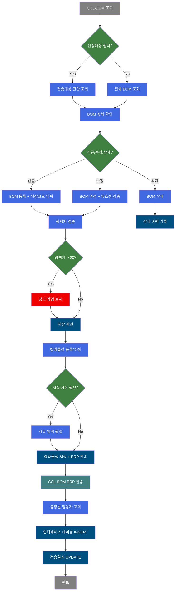
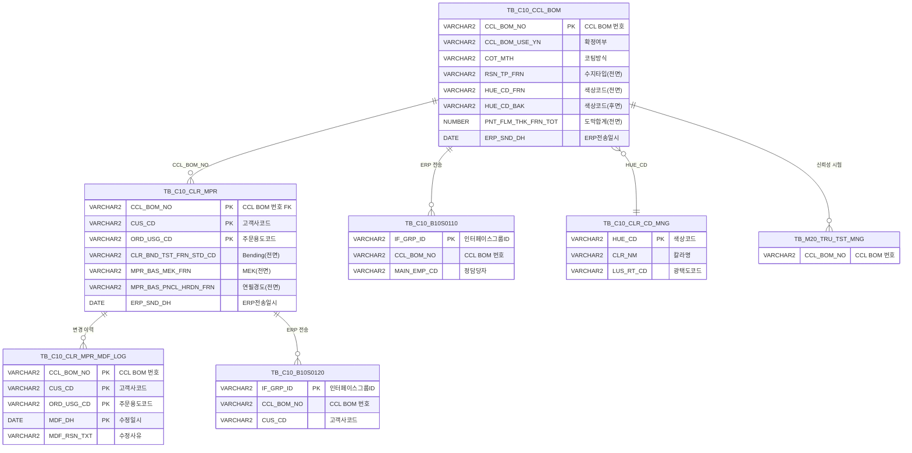

<h1 style="font-size: 40px; text-align: center; font-weight:
   bold; margin: 30px 0;">
  C106000060 레거시 시스템 분석 종합 보고서
</h1>


# 1. 시스템 개요
- **서비스 ID**: C106000060
- **업무명**: CCL-BOM 관리
- **분석 일시**: 2026-03-17 10:11 KST
- **분석 시간**: 약 6분
- **전체 Activity 수**: 38개 (Built-in 35개, Custom 3개)
- **분석자**: Claude Opus 4.6 / Sonnet (Phase 2~4)
- **분석 도구**: /analyze-service C106000060
- **문서 버전**: 1.0

# 📊 비즈니스 프로세스 분석

## 시스템 목적

CCL-BOM(Color Coated Line - Bill of Materials) 관리 화면으로, 칼라강판 도장 공정에서 사용되는 BOM 정보를 등록·수정·삭제하고 ERP로 전송하는 핵심 품질설계 시스템이다. CCL BOM에는 전면/후면 각 4코트의 색상코드, 수지타입, 광택도, 도막두께, 원단위, 프린트 롤/잉크 정보, 보호필름, 라미나, Chemical Coat 등 칼라강판 제조에 필요한 모든 도장 사양이 포함된다.

이 화면은 마스터(CCL-BOM) - 종속(칼라물성) 2단계 구조로, CCL-BOM별로 고객사·주문용도별 칼라물성(MEK, 연필경도, 색차, Bending 등 품질기준)을 관리한다. BOM 확정 후 ERP 전송 시 공정별 담당자(정/부) 정보를 함께 전송하며, 칼라물성 변경 시에는 수정 사유 기록 및 이력 관리가 이루어진다. 신뢰성 시험 정보도 BOM과 연계하여 등록된다.

## 핵심 워크플로우 다이어그램



### 상세 워크플로우 다이어그램

```mermaid
flowchart TD
    subgraph 조회["조회 흐름"]
        R0["Event_Router"]:::start
        R0 -->|find| F1["cclBomInfoSelect<br/>TB_C10_CCL_BOM 조회"]:::proc
        R0 -->|find1| F2["cclBomInfoSelec2<br/>전송대상 필터 조회"]:::proc
        R0 -->|colorDetailFind| F3["colorSelect<br/>색상코드 상세 조회"]:::proc
        R0 -->|detailFind| F4["detailSelect<br/>칼라물성 상세 조회"]:::proc
        R0 -->|colNmFind| F5["colorName<br/>칼라명 AJAX"]:::proc
        R0 -->|colorAjaxFind| F6["colorAjaxSelect<br/>광택값 AJAX"]:::proc
        R0 -->|utPntCDFind| F7["UtPntCdSelect<br/>U-TEX 롤 조회"]:::proc
        R0 -->|prtPntCdFind| F8["PrtPntCdSelect<br/>프린트 롤 조회"]:::proc
        R0 -->|고객사Check| F9["cusCdAjaxSelect"]:::proc
        R0 -->|주문용도Check| F10["ordUsgCdAjaxSelect"]:::proc
        R0 -->|엑셀출력| F11["C106000060xls.select"]:::proc
    end

    subgraph CCL_BOM_저장["CCL-BOM 저장 흐름"]
        R0 -->|customInsert| S1["신뢰성 시험등록<br/>tru_tst_Insert"]:::save
        S1 --> S2["GridSave<br/>cclBomInfoInsert/Update/Delete"]:::save
    end

    subgraph CCL_BOM_전송["CCL-BOM ERP 전송 흐름"]
        R0 -->|send| SD1["공정별담당자 조회<br/>c10A2200Select"]:::proc
        SD1 --> SD2["공정담당자편집<br/>C10UiC106000060InsertActivity<br/>MAIN_EMP_CD, SUB_EMP_CD1/2 추출"]:::proc_call
        SD2 --> SD3["CCL-BOM전송<br/>interFaceCCLBOM<br/>TB_C10_B10S0110 INSERT"]:::save
        SD3 --> SD4["ERP전송일Update<br/>ccl_snd_update<br/>TB_C10_CCL_BOM UPDATE"]:::save
        SD4 --> SD5["LoopRouter<br/>행별 반복 처리"]:::proc_call
    end

    subgraph 칼라물성_단건["칼라물성 단건 저장 흐름"]
        R0 -->|칼라물성추가| CM1["colorInfoInsert<br/>TB_C10_CLR_MPR INSERT"]:::save
        R0 -->|칼라물성변경| CM2["colorInfoUpdate<br/>TB_C10_CLR_MPR UPDATE"]:::save
        R0 -->|칼라물성삭제| CM3["칼라물성전송2<br/>interFaceColorDel<br/>TB_C10_B10S0120 INSERT"]:::save
        CM1 --> CM4["칼라물성 전송<br/>interFaceColor<br/>TB_C10_B10S0120 INSERT"]:::save
        CM2 --> CM4
        CM3 --> CM5["칼라물성전송삭제<br/>colorInfoDelete<br/>TB_C10_CLR_MPR DELETE"]:::save
        CM4 --> CM6["ERP전송일시UPDATE<br/>clr_snd_update"]:::save
        CM5 --> CM7["물성_D_Log<br/>colorInfo_D_Log_Insert"]:::save
        CM6 --> CM8["물성_IU_Log<br/>colorInfo_IU_Log_Insert"]:::save
        CM8 --> CM9["LoopRouter2<br/>행별 반복"]:::proc_call
        CM7 --> CM9
    end

    subgraph 칼라물성_그리드["칼라물성 그리드 저장 흐름"]
        R0 -->|customInsert2| CS1["신뢰성 시험등록2<br/>tru_tst_Insert"]:::save
        CS1 --> CS2["GridSave<br/>cclBomInfoInsert/Update/Delete"]:::save
        CS2 --> CS3["칼라물성추가2<br/>colorInfoInsert2<br/>TB_C10_CLR_MPR INSERT"]:::save
        CS3 --> CS4["칼라물성 전송2<br/>interFaceColor2<br/>TB_C10_B10S0120 INSERT"]:::save
        CS4 --> CS5["ERP전송일시UPDATE2<br/>clr_snd_update"]:::save
        CS5 --> CS6["물성_IU_Log2<br/>colorInfo_IU_Log_Insert2"]:::save
    end

    subgraph BOM_확정["BOM 확정여부 변경"]
        R0 -->|CCL-BOM 확정여부 UPDATE| BU1["cclBomUseUpdate<br/>TB_C10_CCL_BOM UPDATE"]:::save
    end

    classDef start fill:#808080,color:#fff
    classDef proc fill:#4169E1,color:#fff
    classDef proc_call fill:#408080,color:#fff
    classDef decision fill:#408040,color:#fff
    classDef save fill:#005080,color:#fff
    classDef error fill:#F00000,color:#fff
```




## 주요 유즈케이스

### UC-01: CCL-BOM 조회
- **Actor**: 품질설계 담당자
- **목적**: 칼라강판 도장 공정의 BOM 정보를 조건별로 조회하여 현재 등록된 BOM 사양을 확인

- **전제조건**:
  - 사용자가 시스템에 로그인되어 있음
  - CCL-BOM 조회 권한이 있음

- **주요 흐름**:
  1. CCL-BOM번호, 수지타입(콤보), 도장방식(콤보) 조건 입력
  2. 전송대상 체크박스 여부에 따라 전체 조회(find) 또는 전송대상 필터 조회(find1) 분기
  3. cclBomInfoSelect / cclBomInfoSelec2 실행 → Grid_1에 CCL-BOM 목록 표시
  4. Grid_1 행 선택 시 deteilCclBomNo() 호출 → 칼라물성(Grid_2), 색상코드(Grid_3), 프린트(Grid_4/9), 기타속성(Grid_5) 종속 데이터 자동 조회

- **대체 흐름**:
  - CCL-BOM번호 미입력 시: 수지타입 + 도장방식 필수 체크
  - 조회 결과 없음: 빈 Grid 표시

- **후행조건**:
  - Grid_1에 BOM 목록이 표시됨
  - 선택 행의 종속 정보(칼라물성, 색상코드 등)가 하위 Grid에 표시됨

### UC-02: CCL-BOM 등록/수정
- **Actor**: 품질설계 담당자
- **목적**: 새로운 CCL-BOM을 등록하거나 기존 BOM의 도장 사양(색상, 수지, 광택, 도막, 프린트 등)을 수정

- **전제조건**:
  - BOM 목록이 조회되어 있음
  - 저장 권한이 있음

- **주요 흐름**:
  1. Menu_1에서 '행추가' 클릭 → Grid_1에 신규 행 추가, 하위 Grid 초기화
  2. CCL-BOM번호(6자리), 코팅방식, 색상코드(전면/후면), Chemical Coat, 상세색상명 등 입력
  3. Grid_3에서 전면/후면 4코트별 색상코드·도막두께 편집
  4. Grid_4/9에서 프린트 잉크코드 편집
  5. Grid_5에서 기타속성(아농코드, 보호필름, 라미나, 공정, Brand 등) 편집
  6. '저장' 버튼 클릭 → saveBom() 실행
  7. 색상코드 입력 여부, CCL-BOM번호 6자리 길이, Chemical Coat/무독성구분/상세색상명 필수 체크
  8. TOP/BACK 색상코드 광택차 계산(colorAjaxFind AJAX) → 광택차 > 20이면 경고 팝업(pop09)
  9. 중복 체크(duplicateCclBom) 후 확인 팝업 → Grid_1.sendGrid 호출
  10. 신뢰성 시험등록(tru_tst_Insert) → cclBomInfoInsert/Update/Delete 실행

- **대체 흐름**:
  - 복사: Menu_1 '복사' 클릭 → 선택 행 데이터 복사, 확정 체크박스는 '0'으로 초기화
  - 광택차 > 20: 경고 팝업 확인 후 저장 진행 가능

- **후행조건**:
  - TB_C10_CCL_BOM 테이블에 데이터가 INSERT/UPDATE/DELETE됨
  - 신뢰성 시험 정보가 TB_M20_TRU_TST_MNG에 등록됨

### UC-03: 칼라물성 등록/수정/삭제
- **Actor**: 품질설계 담당자
- **목적**: CCL-BOM에 대한 고객사·주문용도별 칼라물성(Bending, MEK, 연필경도, 색차, 품질메세지 등) 관리

- **전제조건**:
  - CCL-BOM이 Grid_1에서 선택되어 있음
  - 칼라물성 저장 권한이 있음

- **주요 흐름**:
  1. Menu_2에서 '행추가' 클릭 → Grid_2에 신규 행 추가
  2. Menu_2 '고객사' 클릭 → AJAX로 고객사 코드/명 조회 후 Grid_2에 설정
  3. Menu_2 '주문용도' 클릭 → AJAX로 주문용도 코드/명 조회 후 Grid_2에 설정
  4. 보호필름, MEK, 연필경도, 색차, Bending, 품질메세지, 참고/링크 등 입력
  5. '저장' 버튼 클릭 → save1() 실행
  6. 중복 체크(duplicateColorInfo) → 저장 사유 팝업(pop06) 표시
  7. 사유 입력 후 행 상태(inserted/updated/deleted)별 ERP전송 여부 체크
  8. Grid_2.sendGrid → 칼라물성추가/변경/삭제 + ERP전송(interFaceColor) + 이력 기록(colorInfo_IU_Log/D_Log)

- **대체 흐름**:
  - 삭제 시: 칼라물성전송삭제(interFaceColorDel → TB_C10_B10S0120) 후 colorInfoDelete → 삭제 이력 기록
  - 행복사: Menu_2 '행복사' 클릭 → 선택 행 데이터 복사

- **후행조건**:
  - TB_C10_CLR_MPR 테이블에 데이터가 변경됨
  - TB_C10_CLR_MPR_MDF_LOG에 수정 이력이 기록됨
  - TB_C10_B10S0120에 ERP 인터페이스 데이터가 INSERT됨

### UC-04: CCL-BOM ERP 전송
- **Actor**: 품질설계 담당자
- **목적**: 확정된 CCL-BOM 정보를 ERP 시스템으로 전송

- **전제조건**:
  - CCL-BOM이 선택되어 있음
  - BOM이 저장 완료 상태 (inserted 상태가 아님)

- **주요 흐름**:
  1. Form_2 '전송' 버튼 클릭
  2. 저장 전 상태(inserted) 체크 → '저장 후 전송' 경고
  3. 확인 팝업 → Grid_1.sendGrid('send') 호출
  4. 공정별담당자 조회(c10A2200Select → VI_M00_C10A2200)
  5. 공정담당자편집(C10UiC106000060InsertActivity) → MAIN_EMP_CD, SUB_EMP_CD1/2 추출
  6. CCL-BOM전송(interFaceCCLBOM → TB_C10_B10S0110 INSERT) — eaidao 사용
  7. ERP전송일Update(ccl_snd_update → TB_C10_CCL_BOM UPDATE)
  8. LoopRouter로 다중 행 반복 처리

- **대체 흐름**:
  - 저장 전 상태: "저장 후 전송해 주세요" 메시지 표시, 전송 중단

- **후행조건**:
  - TB_C10_B10S0110에 인터페이스 데이터가 INSERT됨 (eaidao)
  - TB_C10_CCL_BOM의 ERP 전송일이 갱신됨

### UC-05: BOM 확정여부 변경
- **Actor**: 품질설계 담당자
- **목적**: CCL-BOM의 확정 상태(사용여부)를 변경하여 생산 현장에서 참조할 BOM을 지정

- **전제조건**:
  - CCL-BOM이 Grid_1에서 선택되어 있음

- **주요 흐름**:
  1. Grid_1의 '확정' 체크박스 컬럼(CCL_BOM_USE_YN) 값 변경
  2. cclBomUseUpdate 실행 → TB_C10_CCL_BOM의 CCL_BOM_USE_YN 갱신

- **후행조건**:
  - BOM 확정 상태가 변경됨

### UC-06: 엑셀 출력
- **Actor**: 품질설계 담당자
- **목적**: 현재 조회된 CCL-BOM 데이터를 엑셀 파일로 내보내기

- **전제조건**:
  - Grid_1에 데이터가 조회되어 있음

- **주요 흐름**:
  1. Form_1 '엑셀출력' 버튼 클릭
  2. C106000060xls.select 실행 → TB_C10_CCL_BOM + TB_C10_CLR_MPR JOIN 조회
  3. 엑셀 파일 생성 및 다운로드

- **후행조건**:
  - 엑셀 파일이 사용자 PC에 다운로드됨

---
## 비즈니스 로직 상세

### 1. 광택차 검증 로직

- **목적**: TOP/BACK 색상코드의 실광택값 차이가 품질 기준(20) 이내인지 검증
- **처리 케이스**:

  **[케이스 1: 광택차 정상]**
  ```
    조건: |TOP 실광택값 - BACK 실광택값| ≤ 20
    처리:
      1. colorAjaxFind AJAX로 TOP/BACK 색상코드의 광택값 조회 (TB_C10_CLR_CD_MNG)
      2. 광택차 계산
      3. 정상 → 저장 진행
  ```

  **[케이스 2: 광택차 초과]**
  ```
    조건: |TOP 실광택값 - BACK 실광택값| > 20
    처리:
      1. pop09 경고 팝업 표시 (색상코드, 실광택값, 광택차 표시)
      2. 사용자 확인 후 저장 진행 가능
  ```

### 2. CCL-BOM ERP 전송 데이터 구성 (공정담당자 편집)

- **목적**: CCL-BOM 전송 시 품질설계 담당자(정/부) 정보를 인터페이스 데이터에 포함
- **처리 케이스**:

  **[데이터 중계]**
  ```
    조건: send 이벤트 발생 시
    처리:
      1. c10A2200Select 쿼리로 VI_M00_C10A2200 뷰에서 공정별 담당자 조회
      2. C10UiC106000060InsertActivity에서 RK_C10A2200 PosRow 추출
      3. MAIN_EMP_CD(정담당자), SUB_EMP_CD1(부담당자1), SUB_EMP_CD2(부담당자2) ctx에 재배치
      4. interFaceCCLBOM INSERT 시 담당자 정보 포함하여 TB_C10_B10S0110에 INSERT
  ```

### 3. LoopRouter 반복 처리 로직

- **목적**: 그리드에서 DML된 다중 행을 행 단위로 순차 처리
- **처리 케이스**:

  **[루프 구동]**
  ```
    조건: 그리드에 INSERT/UPDATE/DELETE된 행이 존재
    처리:
      1. 최초: ids 배열을 m60Ids에 백업, LOOP_CNT=0
      2. 각 반복: m60Ids[LOOP_CNT] 행 ID 추출 → ids에 단일 행 설정
      3. 행의 DML 타입(INSERT/UPDATE/DELETE) 반환 → 해당 transition 분기
      4. LOOP_CNT 증가
      5. 모든 행 처리 완료 → endLoop 반환하여 루프 종료
  ```

### 4. 칼라물성 변경 이력 관리

- **목적**: 칼라물성 데이터 변경 시 변경 전/후 이력을 기록하여 추적 가능하게 함
- **처리 케이스**:

  **[INSERT/UPDATE 이력]**
  ```
    조건: 칼라물성 추가 또는 변경 시
    처리:
      1. 칼라물성 INSERT/UPDATE 실행
      2. ERP 전송 (interFaceColor → TB_C10_B10S0120)
      3. ERP전송일시 UPDATE (clr_snd_update)
      4. 물성_IU_Log (colorInfo_IU_Log_Insert → TB_C10_CLR_MPR_MDF_LOG)
  ```

  **[DELETE 이력]**
  ```
    조건: 칼라물성 삭제 시
    처리:
      1. ERP 전송 삭제건 (interFaceColorDel → TB_C10_B10S0120)
      2. 칼라물성 DELETE (colorInfoDelete → TB_C10_CLR_MPR)
      3. 물성_D_Log (colorInfo_D_Log_Insert → TB_C10_CLR_MPR_MDF_LOG)
  ```

### 5. 코드값 변환 (SQL 기반)

- **목적**: DB 코드값을 사용자 화면에 표시할 의미명으로 변환
- **처리 케이스**:

  **[FUNC_DECODE 함수 활용]**
  ```
    조건: 조회 쿼리에서 코드 표시 필요 시
    처리:
      1. FUNC_DECODE('COT_MTH','SZ0000', COT_MTH) → 코팅방식명 변환
      2. FUNC_DECODE('RSN_TP','SZ0000', RSN_TP_FRN) → 수지타입명 변환
      3. FUNC_DECODE('LUS_RT_CD','SZ0000', LUS_RT_CD_FRN) → 광택도명 변환
  ```

  **[DECODE/NVL 패턴]**
  ```
    조건: 확정여부 등 Y/N 코드 변환
    처리:
      1. DECODE(NVL(CCL_BOM_USE_YN,'N'),'N',0,1) → 체크박스 0/1 변환
      2. 스칼라 서브쿼리로 VI_M00_CODE_ACCESS 뷰에서 코드명 조회
      3. TB_M90_EMP_INF JOIN으로 등록자/수정자 사번 → 성명 변환
  ```
---

# ⚙️ Java 컴포넌트 분석

## Custom Activity 상세 분석

### 2개 Custom Activity 발견 (3개 인스턴스)

### 1. LoopRouter (LoopRouter, LoopRouter2)
- **클래스명**: com.unionsteel.mes.c10.activity.ui.LoopRouter
- **액티비티명**: LoopRouter, LoopRouter2
- **파일 경로**: src/com/unionsteel/mes/c10/activity/ui/LoopRouter.java
- **주요 기능**: 그리드 DML 행 반복 처리 라우터
- **라인 수**: 144 | **메소드 수**: 6개

> 화면 그리드에서 DML(INSERT/UPDATE/DELETE)된 행 목록을 하나씩 꺼내어 LOOP를 구동하는 라우팅 전용 Activity이다. LOOP_CNT를 관리하며 각 반복마다 DML 타입을 반환하여 해당 transition으로 분기시키고, 모든 행 처리 완료 시 endLoop를 반환하여 루프를 종료한다.

📎 **[상세 분석 보고서](../customClass/com.unionsteel.mes.c10.activity.ui.LoopRouter_class_analysis.md)**

---

### 2. C10UiC106000060InsertActivity (공정담당자편집)
- **클래스명**: com.unionsteel.mes.c10.activity.ui.C10UiC106000060InsertActivity
- **액티비티명**: 공정담당자편집
- **파일 경로**: src/com/unionsteel/mes/c10/activity/ui/C10UiC106000060InsertActivity.java
- **주요 기능**: 품질설계 담당자 정보 데이터 중계
- **라인 수**: 172 | **메소드 수**: 5개

> C106000060 화면에서 품질설계 관련 담당자(정/부) 정보를 PosContext에서 추출하여 ctx에 재저장하는 데이터 중계 Activity이다. RK_C10A2200 키의 PosRow에서 MAIN_EMP_CD, SUB_EMP_CD1, SUB_EMP_CD2 값을 꺼내어 개별 ctx 키로 재배치하는 단순 데이터 변환 역할을 한다.

📎 **[상세 분석 보고서](../customClass/com.unionsteel.mes.c10.activity.ui.C10UiC106000060InsertActivity_class_analysis.md)**

---

# 💾 데이터 요구사항

## 핵심 테이블

### 1. TB_C10_CCL_BOM - CCL-BOM 마스터 (칼라강판 도장 사양)
| 컬럼명 | 타입 | PK | 설명 |
|--------|------|----|------|
| CCL_BOM_NO | VARCHAR2 | ✅ | CCL BOM 번호 (6자리) |
| CCL_BOM_USE_YN | VARCHAR2 | | 확정여부 (Y/N) |
| COT_MTH | VARCHAR2 | | 코팅방식 코드 |
| RSN_TP_FRN | VARCHAR2 | | 수지타입(전면) |
| RSN_TP_BAK | VARCHAR2 | | 수지타입(후면) |
| LUS_RT_CD_FRN | VARCHAR2 | | 광택도코드(전면) |
| LUS_RT_CD_BAK | VARCHAR2 | | 광택도코드(후면) |
| HUE_CD_FRN | VARCHAR2 | | 색상코드(전면) |
| HUE_CD_BAK | VARCHAR2 | | 색상코드(후면) |
| PNT_FLM_THK_FRN_TOT | NUMBER | | 도막두께 합계(전면) |
| PNT_FLM_THK_BAK_TOT | NUMBER | | 도막두께 합계(후면) |
| HUE_CD_FRN_4COT ~ HUE_CD_FRN_1COT | VARCHAR2 | | 전면 4~1코트 색상코드 |
| HUE_CD_BAK_1COT ~ HUE_CD_BAK_4COT | VARCHAR2 | | 후면 1~4코트 색상코드 |
| PNT_FLM_THK_FRN_4COT ~ PNT_FLM_THK_FRN_1COT | NUMBER | | 전면 4~1코트 도막두께 |
| PRT_ROLL_NO1 ~ PRT_ROLL_NO4 | VARCHAR2 | | 프린트 1~4도 롤번호(전면) |
| PRT_INK_CD1 ~ PRT_INK_CD4 | VARCHAR2 | | 프린트 1~4도 잉크코드(전면) |
| ANON_CD | VARCHAR2 | | 아농코드 |
| HUE_CD_CHM | VARCHAR2 | | Chemical Coat 코드 |
| DTL_CLR_NM | VARCHAR2 | | 상세색상명 |
| TLP_TP | VARCHAR2 | | 무독성구분 |
| MAIN_PROC_CD | VARCHAR2 | | 주공정 코드 |
| LMN_BND_CD | VARCHAR2 | | 라미나 접착제 코드 |
| PRT_USG_CD | VARCHAR2 | | 프린트용도 |
| LUXTEEL_BRD_CD | VARCHAR2 | | Brand 코드 |
| CCL_BOM_WR_YN | VARCHAR2 | | 보증 여부 |
| CCL_BOM_ATT_YN | VARCHAR2 | | 관심 여부 |
| QLT_DSN_CFM_TP_NM | VARCHAR2 | | 설계확정구분 |
| ERP_SND_DH | DATE | | ERP 전송일시 |
| INS_DH | DATE | | 등록 일시 |
| UPD_DH | DATE | | 수정 일시 |

### 2. TB_C10_CLR_MPR - 칼라물성 (고객사/용도별 품질기준)
| 컬럼명 | 타입 | PK | 설명 |
|--------|------|----|------|
| CCL_BOM_NO | VARCHAR2 | ✅ | CCL BOM 번호 (FK) |
| CUS_CD | VARCHAR2 | ✅ | 고객사 코드 |
| ORD_USG_CD | VARCHAR2 | ✅ | 주문용도 코드 |
| PTT_FLM_DTL_CD | VARCHAR2 | | 보호필름 상세코드 |
| UNI_GLS_FLM_CD | VARCHAR2 | | UGS 필름 코드 |
| PTT_FLM_MNG_ADH_TXT | VARCHAR2 | | 관리점착력 |
| CLR_BND_TST_FRN_STD_CD | VARCHAR2 | | Bending 기준(전면) |
| CLR_BND_TST_BAK_STD_CD | VARCHAR2 | | Bending 기준(후면) |
| MPR_BAS_MEK_FRN | VARCHAR2 | | MEK(전면) |
| MPR_BAS_MEK_BAK | VARCHAR2 | | MEK(후면) |
| MPR_BAS_PNCL_HRDN_FRN | VARCHAR2 | | 연필경도(전면) |
| MPR_BAS_PNCL_HRDN_BAK | VARCHAR2 | | 연필경도(후면) |
| CLR_DIF_FRN_ULV | VARCHAR2 | | 색차(전면) |
| CLR_DIF_BAK_ULV | VARCHAR2 | | 색차(후면) |
| CCL_QLT_MSG_TXT | VARCHAR2 | | 품질메세지 |
| KEY_WRD1 ~ KEY_WRD4 | VARCHAR2 | | 참고1~4 |
| ERP_SND_DH | DATE | | ERP 전송일시 |
| INS_DH | DATE | | 등록 일시 |
| UPD_DH | DATE | | 수정 일시 |

### 3. TB_C10_CLR_MPR_MDF_LOG - 칼라물성 수정 이력
| 컬럼명 | 타입 | PK | 설명 |
|--------|------|----|------|
| CCL_BOM_NO | VARCHAR2 | ✅ | CCL BOM 번호 |
| CUS_CD | VARCHAR2 | ✅ | 고객사 코드 |
| ORD_USG_CD | VARCHAR2 | ✅ | 주문용도 코드 |
| MDF_DH | DATE | ✅ | 수정일시 |
| MDF_RSN_TXT | VARCHAR2 | | 수정사유 |
| INS_DH | DATE | | 등록 일시 |

### 4. TB_C10_B10S0110 - CCL-BOM EAI 인터페이스 (ERP 전송)
| 컬럼명 | 타입 | PK | 설명 |
|--------|------|----|------|
| IF_GRP_ID | VARCHAR2 | ✅ | 인터페이스 그룹 ID |
| CCL_BOM_NO | VARCHAR2 | | CCL BOM 번호 |
| MAIN_EMP_CD | VARCHAR2 | | 정담당자 사번 |
| SUB_EMP_CD1 | VARCHAR2 | | 부담당자1 사번 |
| SUB_EMP_CD2 | VARCHAR2 | | 부담당자2 사번 |
| ObjectType | VARCHAR2 | | 오브젝트 타입 |
| ObjectId | VARCHAR2 | | 오브젝트 ID |
| ProgramId | VARCHAR2 | | 프로그램 ID |
| Timestamp | DATE | | 타임스탬프 |

### 5. TB_C10_B10S0120 - 칼라물성 EAI 인터페이스 (ERP 전송)
| 컬럼명 | 타입 | PK | 설명 |
|--------|------|----|------|
| IF_GRP_ID | VARCHAR2 | ✅ | 인터페이스 그룹 ID |
| CCL_BOM_NO | VARCHAR2 | | CCL BOM 번호 |
| CUS_CD | VARCHAR2 | | 고객사 코드 |
| ORD_USG_CD | VARCHAR2 | | 주문용도 코드 |
| PTT_FLM_DTL_CD | VARCHAR2 | | 보호필름 상세코드 |
| ObjectType | VARCHAR2 | | 오브젝트 타입 |
| ObjectId | VARCHAR2 | | 오브젝트 ID |
| ProgramId | VARCHAR2 | | 프로그램 ID |
| Timestamp | DATE | | 타임스탬프 |

### 6. TB_C10_CLR_CD_MNG - 색상코드 마스터
| 컬럼명 | 타입 | PK | 설명 |
|--------|------|----|------|
| HUE_CD | VARCHAR2 | ✅ | 색상코드 |
| CLR_NM | VARCHAR2 | | 칼라명 |
| LUS_RT_CD | VARCHAR2 | | 광택도 코드 |
| RSN_TP | VARCHAR2 | | 수지타입 |

### 7. TB_M20_TRU_TST_MNG - 신뢰성 시험 관리
| 컬럼명 | 타입 | PK | 설명 |
|--------|------|----|------|
| CCL_BOM_NO | VARCHAR2 | | CCL BOM 번호 (FK) |
| TRU_TST_DATA | VARCHAR2 | | 신뢰성 시험 데이터 |

## 데이터 플로우

### 1. 조회

```
[CCL-BOM 목록 조회]
화면 진입 → 조건 입력
→ C106000060.cclBomInfoSelect
  FROM TB_C10_CCL_BOM
  LEFT JOIN VI_M00_CODE_ACCESS ON GRP_CD = 코드그룹
  LEFT JOIN TB_M90_EMP_INF ON EMP_CD = 등록자/수정자
  LEFT JOIN TB_C10_CLR_CD_MNG ON HUE_CD = 색상코드
  WHERE CCL_BOM_NO LIKE :CCL_BOM_NO
    AND RSN_TP_FRN = :RSN_TP_FRN
    AND COT_MTH = :COT_MTH
→ Grid_1에 BOM 목록 표시

[전송대상 조회]
전송대상 체크 시
→ C106000060.cclBomInfoSelec2
  FROM TB_C10_CCL_BOM
  WHERE ERP 전송 대상 조건 필터
→ Grid_1에 전송대상 목록 표시

[칼라물성 상세 조회]
Grid_1 행 선택 시
→ C106000060.detailSelect
  FROM TB_C10_CLR_MPR
  LEFT JOIN VI_M00_CODE_ACCESS ON 코드 변환
  WHERE CCL_BOM_NO = :CCL_BOM_NO
→ Grid_2에 칼라물성 표시

[색상코드 상세 조회]
Grid_1 행 선택 시
→ C106000060.colorSelect
  FROM TB_C10_CCL_BOM
  LEFT JOIN TB_C10_CLR_CD_MNG ON HUE_CD
  WHERE CCL_BOM_NO = :CCL_BOM_NO
→ Grid_3에 전면/후면 4코트 색상 정보 표시
```

### 2. CCL-BOM 저장

```
[신규 등록]
→ C106000060.tru_tst_Insert
  INSERT INTO TB_M20_TRU_TST_MNG (CCL_BOM_NO 기반 신뢰성 시험 데이터)
→ C106000060.cclBomInfoInsert
  INSERT INTO C10APUSER.TB_C10_CCL_BOM (전면/후면 4코트 색상·수지·광택·도막 등 200+컬럼)

[수정]
→ C106000060.cclBomInfoUpdate
  UPDATE TB_C10_CCL_BOM SET ... WHERE CCL_BOM_NO = :CCL_BOM_NO

[삭제]
→ C106000060.cclBomInfoDelete
  DELETE FROM TB_C10_CCL_BOM WHERE CCL_BOM_NO = :CCL_BOM_NO
```

### 3. 칼라물성 저장 + ERP 전송

```
[단건 추가]
→ C106000060.colorInfoInsert
  INSERT INTO TB_C10_CLR_MPR
→ C106000060.interFaceColor
  INSERT INTO TB_C10_B10S0120 (eaidao, ERP 전송)
→ C106000060.clr_snd_update
  UPDATE TB_C10_CLR_MPR SET ERP_SND_DH = SYSDATE
→ C106000060.colorInfo_IU_Log_Insert
  INSERT INTO TB_C10_CLR_MPR_MDF_LOG (변경 이력)

[삭제]
→ C106000060.interFaceColorDel
  INSERT INTO TB_C10_B10S0120 (eaidao, 삭제건 전송)
→ C106000060.colorInfoDelete
  DELETE FROM TB_C10_CLR_MPR
→ C106000060.colorInfo_D_Log_Insert
  INSERT INTO TB_C10_CLR_MPR_MDF_LOG (삭제 이력)
```

### 4. CCL-BOM ERP 전송

```
→ C106000060.c10A2200Select
  FROM VI_M00_C10A2200 (공정별 담당자 조회)
→ C10UiC106000060InsertActivity
  MAIN_EMP_CD, SUB_EMP_CD1, SUB_EMP_CD2 ctx 재배치
→ C106000060.interFaceCCLBOM
  INSERT INTO TB_C10_B10S0110 (eaidao, BOM+색상+담당자 정보)
→ C106000060.ccl_snd_update
  UPDATE TB_C10_CCL_BOM SET ERP_SND_DH = SYSDATE
→ LoopRouter (다중 행 반복)
```

## SQL 일람표

| SQL 이름 | 쿼리 ID | 타입 | 출처 | 테이블 |
|---------|---------|-----|------|-------|
| CCL-BOM 목록 조회 | C106000060.cclBomInfoSelect | SELECT | Service | TB_C10_CCL_BOM, VI_M00_CODE_ACCESS, TB_M90_EMP_INF, TB_C10_CLR_CD_MNG |
| 전송대상 조회 | C106000060.cclBomInfoSelec2 | SELECT | Service | TB_C10_CCL_BOM, VI_M00_CODE_ACCESS, TB_M90_EMP_INF |
| 색상코드 상세 조회 | C106000060.colorSelect | SELECT | Service | TB_C10_CCL_BOM, TB_C10_CLR_CD_MNG |
| 칼라물성 상세 조회 | C106000060.detailSelect | SELECT | Service | TB_C10_CLR_MPR, VI_M00_CODE_ACCESS |
| 칼라명 AJAX 조회 | C106000060.colorName | SELECT | Service | TB_C10_CLR_CD_MNG |
| 광택값 AJAX 조회 | C106000060.colorAjaxSelect | SELECT | Service | VI_M00_CODE_ACCESS, TB_C10_CLR_CD_MNG |
| 고객사 AJAX 조회 | C106000060.cusCdAjaxSelect | SELECT | Service | VI_M00_CODE_ACCESS |
| 주문용도 AJAX 조회 | C106000060.ordUsgCdAjaxSelect | SELECT | Service | VI_M00_CODE_ACCESS |
| U-TEX 롤 조회 | C106000060.UtPntCdSelect | SELECT | Service | VI_M00_CODE_ACCESS, VI_M00_C10A1092 |
| 프린트 롤 조회 | C106000060.PrtPntCdSelect | SELECT | Service | VI_M00_CODE_ACCESS, VI_M00_C10A1091 |
| 공정별 담당자 조회 | C106000060.c10A2200Select | SELECT | Service | VI_M00_C10A2200 |
| 엑셀 출력 | C106000060xls.select | SELECT | Service | TB_C10_CCL_BOM, TB_C10_CLR_MPR, TB_M90_EMP_INF |
| CCL-BOM 등록 | C106000060.cclBomInfoInsert | INSERT | Service | C10APUSER.TB_C10_CCL_BOM |
| CCL-BOM 수정 | C106000060.cclBomInfoUpdate | UPDATE | Service | TB_C10_CCL_BOM |
| CCL-BOM 삭제 | C106000060.cclBomInfoDelete | DELETE | Service | TB_C10_CCL_BOM |
| BOM 확정여부 변경 | C106000060.cclBomUseUpdate | UPDATE | Service | TB_C10_CCL_BOM |
| BOM ERP전송일 갱신 | C106000060.ccl_snd_update | UPDATE | Service | TB_C10_CCL_BOM |
| 칼라물성 추가(단건) | C106000060.colorInfoInsert | INSERT | Service | TB_C10_CLR_MPR |
| 칼라물성 추가(그리드) | C106000060.colorInfoInsert2 | INSERT | Service | TB_C10_CLR_MPR |
| 칼라물성 수정 | C106000060.colorInfoUpdate | UPDATE | Service | TB_C10_CLR_MPR |
| 칼라물성 삭제 | C106000060.colorInfoDelete | DELETE | Service | TB_C10_CLR_MPR |
| 물성 ERP전송일 갱신 | C106000060.clr_snd_update | UPDATE | Service | TB_C10_CLR_MPR |
| 칼라물성 ERP 전송 | C106000060.interFaceColor | INSERT | Service | TB_C10_B10S0120 |
| 칼라물성 ERP 전송(그리드) | C106000060.interFaceColor2 | INSERT | Service | TB_C10_B10S0120 |
| 칼라물성 삭제건 ERP 전송 | C106000060.interFaceColorDel | INSERT | Service | TB_C10_B10S0120 |
| CCL-BOM ERP 전송 | C106000060.interFaceCCLBOM | INSERT | Service | TB_C10_B10S0110 |
| 신뢰성 시험 등록 | C106000060.tru_tst_Insert | INSERT | Service | TB_M20_TRU_TST_MNG |
| 물성 변경 이력(I/U) | C106000060.colorInfo_IU_Log_Insert | INSERT | Service | TB_C10_CLR_MPR_MDF_LOG |
| 물성 변경 이력(I/U 그리드) | C106000060.colorInfo_IU_Log_Insert2 | INSERT | Service | TB_C10_CLR_MPR_MDF_LOG |
| 물성 삭제 이력 | C106000060.colorInfo_D_Log_Insert | INSERT | Service | TB_C10_CLR_MPR_MDF_LOG |

## ER 다이어그램 (핵심 관계)



관계 설명:
- **TB_C10_CCL_BOM**이 중심 테이블로, 모든 관계의 허브 역할
- **TB_C10_CLR_MPR**: CCL_BOM_NO + CUS_CD + ORD_USG_CD 복합키로 BOM별 고객·용도별 물성 관리
- **TB_C10_CLR_MPR_MDF_LOG**: 칼라물성 변경 이력 (MDF_DH 포함 4컬럼 복합키)
- **TB_C10_B10S0110/B10S0120**: EAI 인터페이스 테이블, eaidao를 통해 ERP로 전송
- **TB_C10_CLR_CD_MNG**: 색상코드 마스터, HUE_CD로 색상명·광택 정보 참조
- **TB_M20_TRU_TST_MNG**: 신뢰성 시험 데이터, CCL_BOM_NO로 연결

---

# 🖥️ 사용자 인터페이스 요구사항

## 화면 레이아웃 상세

### Layout 구조 (initLayout)
```javascript
{
  itemType: "layout",
  dirType: "flat",  // 단일 페이지 (탭 없이 세로 배치)
  components: [
    {
      id: "C106000060_Form_1",
      component: { itemType: "form", formId: "C106000060_Form_1" }
      // 검색 조건 폼
    },
    {
      id: "C106000060_Menu_1",
      component: { itemType: "menu" }
      // CCL-BOM 메뉴 (새로고침, 행추가, 복사)
    },
    {
      id: "C106000060_Form_2",
      component: { itemType: "form", formId: "C106000060_Form_2" }
      // CCL-BOM 저장/전송 버튼
    },
    {
      id: "C106000060_Grid_1",
      component: { itemType: "grid", gridId: "C106000060_Grid_1" }
      // CCL-BOM 목록 그리드 (vertical, 200+컬럼)
    },
    {
      id: "C106000060_Menu_2",
      component: { itemType: "menu" }
      // 칼라물성 메뉴 (새로고침, 행추가, 삭제, 고객사, 주문용도, 행복사)
    },
    {
      id: "C106000060_Form_3",
      component: { itemType: "form", formId: "C106000060_Form_3" }
      // 칼라물성 저장 버튼 + 수정이력조회 링크
    },
    {
      id: "C106000060_Grid_2",
      component: { itemType: "grid", gridId: "C106000060_Grid_2" }
      // 칼라물성 그리드
    },
    {
      id: "C106000060_Grid_3",
      component: { itemType: "grid", gridId: "C106000060_Grid_3" }
      // 색상코드 수직 그리드 (전면/후면 4코트)
    },
    {
      id: "C106000060_Grid_4",
      component: { itemType: "grid", gridId: "C106000060_Grid_4" }
      // 프린트 정보 TOP
    },
    {
      id: "C106000060_Grid_9",
      component: { itemType: "grid", gridId: "C106000060_Grid_9" }
      // 프린트 정보 BACK
    },
    {
      id: "C106000060_Grid_5",
      component: { itemType: "grid", gridId: "C106000060_Grid_5" }
      // 기타속성 폼형 그리드
    },
    {
      id: "C106000060_Grid_6",
      component: { itemType: "grid", gridId: "C106000060_Grid_6" }
      // 광택도 TOP/BACK 레이블
    },
    {
      id: "C106000060_Grid_7",
      component: { itemType: "grid", gridId: "C106000060_Grid_7" }
      // T/B 레이블
    },
    {
      id: "C106000060_Grid_8",
      component: { itemType: "grid", gridId: "C106000060_Grid_8" }
      // 구 잉크코드 레이블
    },
    {
      id: "messagebox",
      component: { itemType: "messagebox" }
    }
  ]
}
```

## 입출력 요소

### Form 컴포넌트

**C106000060_Form_1 (검색 조건)**
- CCL_BOM_NO: input - CCL-BOM 번호 (maxLength=6, 배경색 FFFFC0)
- RSN_TP_FRN: combo - 수지타입 (inputWidth=130)
- COT_MTH: combo - 도장방식 (inputWidth=110)
- SND_LST: checkbox - 전송대상
- img_btn: custombutton - 이미지 (width=55)
- excelExport: custombutton - 엑셀출력
- find: button - 조회 (초기 disabled)
- winClose: button - 닫기
- ORG_CCL_BOM_NO, CUS_CD, ORD_USG_CD: hidden

**C106000060_Form_2 (CCL-BOM 액션)**
- send: custombutton - 전송 (width=70, 초기 disabled)
- save: button - 저장 (초기 disabled)

**C106000060_Form_3 (칼라물성 액션)**
- C10_linkC106000060pop07: linkbutton - 수정이력조회 → pop07 팝업
- send1: hidden - 전송 (초기 disabled)
- save1: button - 저장 (초기 disabled)

### Grid 컴포넌트

**C106000060_Grid_1 (CCL-BOM 목록)**
- 편집 가능 여부: 부분 편집 (체크박스 컬럼)
- Split: 없음
- 특성: vertical(수직 그리드), multiselect, smartRendering, contextmenu, pageset, editEvents(click+dblclick)
- 주요 컬럼 (14개 표시 + 200+개 hidden):

  **표시 컬럼**:
  - CCL_BOM_NO: ro - CCL BOM 번호 (*, 배경색 FFFFC0)
  - CCL_BOM_USE_YN: ch - 확정 (4px, 배경색 FFFFC0)
  - COT_MTH_NM: ro - 코팅방식 (10px)
  - RSN_TP_FRN_NM: ro - 수지(T) (10px)
  - RSN_TP_BAK_NM: ro - 수지(B) (10px)
  - LUS_RT_CD_FRN_NM: ro - 광택도(T) (10px)
  - LUS_RT_CD_BAK_NM: ro - 광택도(B) (10px)
  - HUE_CD_FRN: ro - 색상(T) (6px)
  - HUE_CD_BAK: ro - 색상(B) (6px)
  - PNT_FLM_THK_FRN_TOT: ro - 도막(T) (6px)
  - PNT_FLM_THK_BAK_TOT: ro - 도막(B) (6px)
  - CCL_BOM_WR_YN: ch - 보증 (4px, 배경색 FFFFC0)
  - HUE_CD_FRN_OLD: ro - 구색상(T) (7px, 배경색 FFFFC0)
  - CCL_BOM_ATT_YN: ch - 관심 (4px, 배경색 FFFFC0)

  **숨김 컬럼** (200+개):
  - 전면/후면 각 4코트별: 색상코드, 수지타입, 광택도, 도막두께, 원단위, PMT, 시너, 도료비중, 용제비중, 고형분
  - 프린트 1~4도별: 롤번호, 잉크코드, 패턴코드, 원단위 (전면/후면)
  - 라미나, 보호필름, Chemical Coat, 아농코드, Brand 등

**C106000060_Grid_2 (칼라물성)**
- 편집 가능 여부: 예 (주요 물성 필드 편집 가능)
- 특성: vertical, multiselect, validation, rowspan, smartRendering, attachHeader(T/B 구분)
- 주요 컬럼 (24개):

  **기본 정보**:
  - CUS_CD: ro - 최종수요가 (5px)
  - CUS_CD_NM: ro - 최종수요가명 (8px)
  - ORD_USG_CD: ro - 용도 (5px)
  - ORD_USG_CD_NM: ro - 용도명 (9px)

  **물성 기준**:
  - PTT_FLM_DTL_CD: ed - 보호필름 (6px)
  - PTT_FLM_DTL_CD_N: ed - 구보호필름 (7px)
  - UNI_GLS_FLM_CD: ed - UGS필름 (6px)
  - PTT_FLM_MNG_ADH_TXT: ed - 관리점착력 (6px)
  - CLR_BND_TST_FRN_STD_CD / CLR_BND_TST_BAK_STD_CD: combo_v - Bending T/B (5px)
  - MPR_BAS_MEK_FRN / MPR_BAS_MEK_BAK: ed - MEK T/B (4px)
  - MPR_BAS_PNCL_HRDN_FRN / MPR_BAS_PNCL_HRDN_BAK: combo_v - 연필경도 T/B (5px)
  - CLR_DIF_FRN_ULV / CLR_DIF_BAK_ULV: ed - 색차 T/B (4px)
  - CCL_QLT_MSG_TXT: txt - 품질메세지 (15px)

  **참고 정보**:
  - KEY_WRD1~4: ed - 참고1~4 (15px, 배경색 FFFFC0)
  - KEY_WRD11~44: ahref_idx - 링크1~4 (15px)

  **상태 정보**:
  - ERP_SND_DH: ro - ERP전송일시 (8px)

**C106000060_Grid_3 (색상코드 수직 그리드)**
- 편집 가능 여부: 부분 편집 (색상코드, 도막 편집 가능)
- 특성: setNoHeader(true), enableAlterCss, rowspan, colSpan
- 구조: 10행 (행0=헤더, 행1~4=전면 4C~1C, 행5~8=후면 1C~4C, 행9=라미나)
- 주요 컬럼 (코트당):
  - HUE_CD_FRN_xCOT: ed - 색상코드 (편집 가능, 배경색 FFFFC0)
  - RSN_TP_FRN_xCOT: ro - 수지타입
  - TP_CD_FRN_xCOT: ro - TYPE유형
  - LUS_RT_CD_FRN_xCOT: ro - 광택코드
  - LUS_RT_FRN_xCOT_LLV: ro - 광택도
  - PMT_FRN_xCOT: ro - PMT
  - PNT_FLM_THK_FRN_xCOT: ed - 도막 (편집 가능, 배경색 FFFFC0)
  - SLV_GRA_FRN_xCOT: ro - 용제비중
  - PNT_GRA_FRN_xCOT: ro - 도료비중
  - NV_FRN_xCOT: ro - 고형분
  - PNT_UNT_FRN_xCOT: ro - 원단위
  - THR_CD_FRN_xCOT: ro - 시너
  - RSN_TP_QT_BR_FRN_xCOT: ro - 품질수지

**C106000060_Grid_4 (프린트 정보 TOP)**
- 편집 가능 여부: 잉크코드만 편집 가능
- 특성: vertical, attachHeader(Roll/Ink/RPTy/원단위 × 4도 + U-TEX + PICK-UP)
- 주요 컬럼:
  - PRT_ROLL_NO1~4: ro - 롤번호 1~4도 (6px)
  - PRT_INK_CD1~4: ed - 잉크코드 1~4도 (편집 가능, 배경색 FFFFC0)
  - PRT_ROLL_PTN_CD1~4: ro - 패턴코드 1~4도
  - PRT_UNT1~4: ro - 원단위 1~4도
  - UNI_TEX_ROLL_NO: ro - U-TEX (7px)
  - PICK_UP_ROLL_NO: ro - PICK-UP (7px)
  - IMPT_ROLL_NO: ro - IMPRINT (7px)

**C106000060_Grid_9 (프린트 정보 BACK)**
- 편집 가능 여부: 잉크코드만 편집 가능
- 특성: Grid_4와 동일 구조 (후면용)
- 주요 컬럼:
  - PRT_ROLL_BAK_NO1~4: ro - 롤번호 1~4도 BACK
  - PRT_INK_BAK_CD1~4: ed - 잉크코드 1~4도 BACK (편집 가능, 배경색 FFFFC0)
  - PRT_ROLL_PTN_BAK_CD1~4: ro - 패턴코드 1~4도 BACK
  - PRT_BAK_UNT1~4: ro - 원단위 1~4도 BACK
  - IMPT_ROLL_BAK_NO: ro - IMPRINT BACK

**C106000060_Grid_5 (기타속성 폼형 그리드)**
- 편집 가능 여부: 주요 속성 편집 가능
- 특성: setNoHeader(true), enableAlterCss, rowspan, colSpan, 8행 폼형
- 주요 필드:
  - ANON_CD - 아농코드
  - HUE_CD_CHM: combo_v - Chemical Coat
  - DTL_CLR_NM - 상세색상명
  - COT_MTH: combo_v - 코팅방식
  - HUE_CD_FRN / HUE_CD_BAK: ed - 색상코드(T/B) (배경색 FFFFC0)
  - RSN_TP_FRN / RSN_TP_BAK - 구매수지타입(T/B)
  - TLP_TP: combo_v - 무독성구분
  - RSN_TP_QT_BR_FRN / RSN_TP_QT_BR_BAK - 품질수지타입(T/B) (배경색 FFFFC0)
  - MAIN_PROC_CD: combo_v - 주공정
  - SUB_PROC_CD1~3: combo_v - 대체공정1~3
  - LMN_BND_CD / LMN_BND_CD1: ed - 접착제
  - LMN_FLM_THK_CD_NM - 필름두께
  - PRT_USG_CD: combo_v - 프린트용도
  - PRT_PTN_CD_NM - 패턴
  - LUXTEEL_BRD_CD - Brand (배경색 FFFFC0)
  - QLT_DSN_CFM_TP_NM: combo_v - 설계확정구분
  - CUT_LN_YN: combo_v - 재단선유무
  - PT_TP: combo_v - 핀트종류
  - ERP_SND_DH - ERP전송일

**C106000060_Grid_6/7/8 (레이블 그리드)**
- Grid_6: 광택도 TOP/BACK 4코트+라미나 레이블 (10행)
- Grid_7: T/B 레이블 (2행)
- Grid_8: 구 잉크코드 레이블

## 화면 동작 흐름

### 1. 화면 초기 로딩
```
1. 화면 진입
2. Form_1 콤보 데이터 로드
   - RSN_TP_FRN 콤보: 수지타입 목록
   - COT_MTH 콤보: 도장방식 목록
3. 저장/전송 버튼 disabled 상태
4. Grid_1~Grid_9 빈 상태 초기화
5. messagebox 초기화
```

### 2. CCL-BOM 조회
```
1. 사용자가 CCL-BOM번호, 수지타입, 도장방식 입력
2. 전송대상 체크박스 확인
3. 조회 버튼 클릭
4. CCL_BOM_NO 미입력 시 RSN_TP_FRN + COT_MTH 필수 체크
5. SND_LST 체크 여부 → eventName 'find' 또는 'find1' 분기
6. Grid_1.loadData(handleDataProcess.do) 호출
7. Grid_1에 CCL-BOM 목록 표시
8. findAfterFunction() 콜백 → 버튼 활성화
```

### 3. CCL-BOM 행 선택 → 종속 데이터 로드
```
1. Grid_1 행 선택
2. deteilCclBomNo() 호출
3. 선택 행의 CCL_BOM_NO 추출
4. Grid_2 loadData → detailFind → detailSelect 실행 (칼라물성)
5. Grid_3 AJAX → verticalGridData.do → colorFind (색상코드)
6. Grid_4 loadData → colorFind → UtPntCdSelect (프린트 TOP)
7. Grid_9 loadData → colorFind → PrtPntCdSelect (프린트 BACK)
8. Grid_5 AJAX → verticalGridData.do → find → cclBomInfoSelect (기타속성)
```

### 4. CCL-BOM 저장 (saveBom)
```
1. Form_2 저장 버튼 클릭
2. useCopy == 'Y' → saveAll() / 그 외 → saveBom()
3. Grid_3 색상코드 입력 여부 확인
4. prtPntCdFind AJAX → PrintRollNo로 PrintPatternCode 조회
5. CCL_BOM_NO 6자리 길이 체크
6. Chemical Coat, 무독성구분, 상세색상명 필수 체크
7. colorAjaxFind AJAX → TOP/BACK 실광택값 조회
8. 광택차 계산 → > 20이면 pop09 경고팝업
9. duplicateCclBom() 중복 체크
10. dhtmlx.confirm → Grid_1.sendGrid 호출
```

### 5. 칼라물성 저장 (save1)
```
1. Form_3 저장 버튼 클릭
2. Grid_1 선택 행 확인, Grid_2 선택 행 확인
3. duplicateColorInfo() 중복 체크
4. popCompleteYN != 'Y' → pop06 사유 입력 팝업
5. 사유 입력 후 popCompleteYN = 'Y'
6. 각 행 상태별 ERP전송 여부 체크 → rowStatus 설정
7. CCL-BOM번호, 고객사, 주문용도 필수 확인
8. dhtmlx.confirm → Grid_2.sendGrid 호출
```

### 6. CCL-BOM ERP 전송 (send)
```
1. Form_2 전송 버튼 클릭
2. Grid_1 선택 행 확인
3. inserted 상태이면 "저장 후 전송" 경고
4. ORG_CCL_BOM_USE_YN 값 원복
5. rowStatus = 'updated' 설정
6. dhtmlx.confirm → Grid_1.sendGrid('send') 호출
```


## JavaScript 모듈

**C106000060.jsp 내장 스크립트**
- find(eventName, formId, referenceItem): CCL-BOM 조회 (SND_LST 체크 여부로 find/find1 분기)
- findAfterFunction(): Grid_1 데이터 로드 후 콜백 (버튼 활성화)
- saveBom(): CCL-BOM 저장 (색상코드·Chemical Coat·광택차 복합 유효성 검증)
- save1(): 칼라물성 저장 (사유 팝업 → ERP전송 이력 분기)
- saveAll(): 전체 저장 (복사 시 BOM + 물성 동시 저장)
- send(): CCL-BOM ERP 전송
- deteilCclBomNo(): Grid_1 행 선택 → 종속 데이터 자동 조회
- duplicateCclBom(): BOM 중복 체크
- duplicateColorInfo(): 칼라물성 중복 체크
- add(): BOM 행 추가 + 하위 Grid 초기화
- copy(): BOM 복사 (선택 행 데이터 복사, 확정 초기화)
- refresh(): BOM 새로고침
- refresh1(): 칼라물성 새로고침
- setCusCd(): 고객사 AJAX 조회 후 Grid_2 설정 (c10AjaxData.do)
- setOrdUsgCd(): 주문용도 AJAX 조회 후 Grid_2 설정 (c10AjaxData.do)
- excelExport(): 엑셀 출력 (C106000060xls.select)
- C10_linkC106000060pop06(): 물성 저장 사유 팝업
- C10_linkC106000060pop07(): 수정이력조회 팝업
- C10_linkC106000060pop09(): 광택차 경고 팝업

## 주요 이벤트 핸들러

**find (조회 버튼 클릭)**
- 이벤트 타입: Button Click
- 처리 내용:
  1. CCL_BOM_NO 미입력 시 RSN_TP_FRN + COT_MTH 필수 체크
  2. SND_LST 체크박스 여부로 eventName 'find' 또는 'find1' 분기
  3. Grid_1.loadData(handleDataProcess.do) 호출
  4. findAfterFunction 콜백으로 후처리

**deteilCclBomNo (Grid_1 행 선택)**
- 이벤트 타입: Grid Row Click
- 처리 내용:
  1. 선택 행의 CCL_BOM_NO 추출
  2. Grid_2 loadData (detailFind → detailSelect)
  3. Grid_3 AJAX 조회 (verticalGridData.do → colorFind)
  4. Grid_4/Grid_9 loadData (UtPntCdSelect/PrtPntCdSelect)
  5. Grid_5 AJAX 조회 (verticalGridData.do → find)

**saveBom (CCL-BOM 저장)**
- 이벤트 타입: Button Click → 내부 호출
- 처리 내용:
  1. Grid_3 색상코드 입력 여부 확인
  2. prtPntCdFind AJAX → PrintRollNo/PrintPatternCode 조회
  3. CCL-BOM번호 6자리, Chemical Coat, 무독성구분, 상세색상명 필수 체크
  4. colorAjaxFind AJAX → TOP/BACK 실광택값 조회 → 광택차 계산
  5. 광택차 > 20 → pop09 경고 팝업
  6. duplicateCclBom() 중복 체크
  7. dhtmlx.confirm → Grid_1.sendGrid 호출

**save1 (칼라물성 저장)**
- 이벤트 타입: Button Click
- 처리 내용:
  1. Grid_1/Grid_2 선택 행 확인
  2. duplicateColorInfo() 중복 체크
  3. pop06 저장 사유 팝업 → popCfmRea에 사유 저장
  4. 행 상태별(inserted/updated/deleted) ERP전송 여부 체크
  5. CCL-BOM번호, 고객사, 주문용도 필수 확인
  6. Grid_2.sendGrid 호출

**send (CCL-BOM ERP 전송)**
- 이벤트 타입: Button Click
- 처리 내용:
  1. Grid_1 선택 행 확인
  2. inserted 상태 → "저장 후 전송" 경고
  3. ORG_CCL_BOM_USE_YN 체크박스 값 원복
  4. rowStatus = 'updated' 설정
  5. Grid_1.sendGrid('C106000060_Grid_1', 'send')

---

# 📌 특이사항 및 주의사항

## 1. 초대형 Grid 컬럼 수 (200+개 hidden 컬럼)
- Grid_1(TB_C10_CCL_BOM)은 전면/후면 각 4코트의 색상·수지·광택·도막·원단위·PMT·시너·도료비중·용제비중·고형분, 프린트 1~4도의 롤번호·잉크코드·패턴코드·원단위 등 **200개 이상의 hidden 컬럼**을 포함한다. 이는 CCL-BOM의 모든 도장 사양을 하나의 그리드 행에 담고 있기 때문이며, 데이터 전송량이 매우 크다. 현대화 시 정규화 또는 JSON 구조화를 검토해야 한다.

## 2. 이중 저장 경로 (단건 vs 그리드)
- 칼라물성 저장에 **단건 처리**(칼라물성추가/변경/삭제 → Form 기반)와 **그리드 처리**(customInsert2 → GridSave 기반)의 두 가지 경로가 존재한다. 단건 처리는 colorInfoInsert + interFaceColor 체인, 그리드 처리는 cclBomInfoInsert/Update/Delete → colorInfoInsert2 → interFaceColor2 체인으로, 유사하지만 다른 쿼리를 사용한다. 이는 복사(copy) 기능 시 saveAll()에서 BOM과 물성을 동시 저장하기 위한 분기이다.

## 3. 광택차 AJAX 검증 패턴
- saveBom() 내에서 **colorAjaxFind AJAX**를 동기 호출하여 TOP/BACK 색상코드의 실광택값을 조회한 뒤, JavaScript에서 광택차를 계산한다. 광택차가 20을 초과하면 pop09 경고 팝업을 띄우되 저장 자체는 차단하지 않는다 (경고 후 진행 가능). 이 로직은 서버 측이 아닌 **클라이언트 측에서만** 수행되므로, 직접 DB 수정 시에는 이 검증을 우회할 수 있다.

## 4. LoopRouter 이중 인스턴스
- LoopRouter 클래스가 **LoopRouter**(CCL-BOM 전송 루프)와 **LoopRouter2**(칼라물성 전송/이력 루프)로 두 개의 Activity 인스턴스에서 사용된다. 동일 클래스이지만 서비스 XML의 transition 설정에 의해 서로 다른 후속 Activity 체인으로 분기된다.

## 5. EAI 인터페이스 테이블 분리
- CCL-BOM 전송은 **TB_C10_B10S0110** (eaidao), 칼라물성 전송은 **TB_C10_B10S0120** (eaidao)으로 별도 인터페이스 테이블을 사용한다. IF_GRP_ID 생성(PosIFGroupID)으로 인터페이스 그룹을 식별하며, 삭제 시에도 삭제건 INSERT 방식으로 ERP에 전달한다 (삭제 플래그 방식).

## 6. 수직 그리드(vertical) 활용
- Grid_1, Grid_3, Grid_5 등이 **수직 그리드**(vertical=true)로 설정되어, 행과 열이 전치된 형태로 표시된다. 특히 Grid_3은 setNoHeader(true)로 헤더 없이 10행으로 전면/후면 4코트+라미나 색상·수지·광택·도막 매트릭스를 구현한다. Grid_5는 폼형 그리드로 8행에 각종 기타속성을 배치한다.

## 7. 코드 변환 함수 FUNC_DECODE
- SQL 쿼리에서 **FUNC_DECODE** 사용자 정의 함수를 사용하여 코드→명칭 변환을 수행한다 (예: FUNC_DECODE('COT_MTH','SZ0000',COT_MTH)). 이는 VI_M00_CODE_ACCESS 뷰의 스칼라 서브쿼리 대안으로 사용되는 DB 레벨 함수이다.

---

# 📚 참고 문서

- **Query SQL**: `src/query/C106000060-query.glue_sql`, `src/query/C106000060xls-query.glue_sql`
- **JS**: `WebContents/C106000060.jsp` (내장 스크립트)
- **Custom Java 클래스**:
  - `src/com/unionsteel/mes/c10/activity/ui/LoopRouter.java`
  - `src/com/unionsteel/mes/c10/activity/ui/C10UiC106000060InsertActivity.java`
