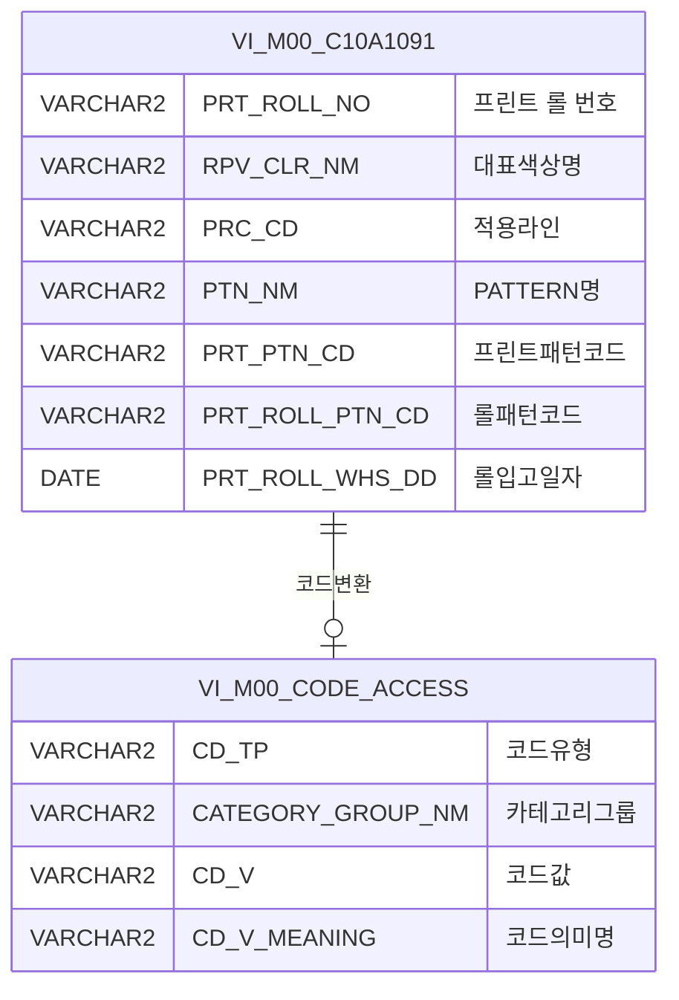

<h1 style="font-size: 40px; text-align: center; font-weight:
   bold; margin: 30px 0;">
  C106000060pop01 레거시 시스템 분석 종합 보고서
</h1>


# 1. 시스템 개요
- **서비스 ID**: C106000060pop01
- **업무명**: CCL-BOM Master 칼라롤관리기준 팝업 조회
- **분석 일시**: 2026-03-17 10:12 KST
- **분석 시간**: 약 5분
- **전체 Activity 수**: 2개 (Built-in: 2개, Custom: 0개)
- **분석자**: Claude Opus 4.6 / Sonnet 4.6
- **분석 도구**: /analyze-service C106000060pop01
- **문서 버전**: 1.0

# 📊 비즈니스 프로세스 분석

## 시스템 목적

C106000060pop01은 CCL(연속컬러코팅라인) 공정의 BOM(Bill of Materials) Master 관리 화면(C106000060)에서 호출되는 **칼라롤관리기준 팝업**이다. 사용자가 프린트 롤(Print Roll) 정보를 검색하고 선택하여 부모 화면의 Grid에 반환하는 역할을 수행한다.

이 팝업은 부모 화면의 두 개 Grid(C106000060_Grid_4, C106000060_Grid_9)에서 호출될 수 있으며, `targetDivId` 파라미터에 따라 반환 콜백 함수가 분기된다. 롤 번호(PRT_ROLL_NO), 대표색상명(RPV_CLR_NM), PATTERN명(PTN_NM) 세 가지 조건으로 LIKE 검색을 수행하며, 결과 행을 더블클릭하면 롤번호, 프린트패턴코드, 롤패턴코드, 원단위 정보가 부모 화면으로 전달된다.

데이터 소스는 M00APUSER 스키마의 `VI_M00_C10A1091` 뷰로, 칼라롤관리기준 마스터 정보를 제공한다. 롤패턴코드의 의미명(원단위)은 `VI_M00_CODE_ACCESS` 공통코드 뷰에서 스칼라 서브쿼리로 변환한다.

## 주요 유즈케이스

### UC-01: 칼라롤 정보 검색 및 선택

- **Actor**: CCL 공정 오퍼레이터 / BOM 관리 담당자
- **목적**: CCL-BOM Master 화면에서 프린트 롤 정보를 검색하여 해당 롤의 패턴코드 및 원단위 정보를 부모 화면에 반환

- **전제조건**:
  - 부모 화면(C106000060)에서 팝업 호출
  - `prt_roll_no`, `rowId`, `cellIndex`, `targetDivId` 파라미터가 전달됨
  - VI_M00_C10A1091 뷰에 롤 마스터 데이터가 존재

- **주요 흐름**:
  1. 팝업 오픈 시 부모 화면에서 전달된 `prt_roll_no` 값이 Form의 PRT_ROLL_NO 필드에 자동 설정
  2. `onLoadGrid` 이벤트에서 자동 조회 실행 (`find` 함수 호출)
  3. Grid에 검색 결과 표시 (롤번호, 대표색상, 적용라인, 패턴명, 프린트패턴코드, 롤패턴코드, 원단위, 롤입고일자)
  4. 사용자가 원하는 행을 더블클릭
  5. `targetDivId`에 따라 `parent.popSetValue` 또는 `parent.popSetValue9` 호출하여 부모 화면에 데이터 반환
  6. 팝업 자동 닫기

- **대체 흐름**:
  - 검색 결과 없음: Grid에 빈 결과 표시, messagebox에 조회 결과 메시지 표시
  - 사용자가 검색 조건 변경 후 재조회: 롤번호/대표색상/패턴명 입력 후 조회 버튼 클릭
  - 닫기 버튼 클릭: 데이터 반환 없이 팝업 종료

- **후행조건**:
  - 부모 화면 Grid의 해당 행에 선택된 롤 정보(PRT_ROLL_NO, PRT_PTN_CD, PRT_ROLL_PTN_CD, PRT_ROLL_PTN_NM) 설정됨

### UC-02: 조건부 검색

- **Actor**: CCL 공정 오퍼레이터
- **목적**: 롤번호, 대표색상, 패턴명 중 하나 이상의 조건으로 부분 검색하여 원하는 롤을 빠르게 찾기

- **전제조건**:
  - 팝업이 열려 있음
  - 검색 조건 중 하나 이상 입력

- **주요 흐름**:
  1. 사용자가 Form에서 Roll 코드, 대표색상명, PATTERN명 중 원하는 조건 입력
  2. PRT_ROLL_NO 입력 시 자동 대문자 변환 (keyup 이벤트)
  3. 조회 버튼 클릭
  4. `C106000060pop01.select` 쿼리 실행 (LIKE '%조건%' 패턴으로 부분 검색)
  5. Grid에 필터링된 결과 표시

- **대체 흐름**:
  - 모든 조건 미입력: 전체 목록 조회 (NVL 처리로 '%' 기본값 적용)

- **후행조건**:
  - Grid에 검색 조건에 맞는 롤 목록 표시

### UC-03: 컨텍스트 메뉴 활용

- **Actor**: CCL 공정 오퍼레이터
- **목적**: Grid 데이터를 클립보드 복사 또는 Excel 내보내기

- **전제조건**:
  - Grid에 조회 데이터가 존재

- **주요 흐름**:
  1. Grid에서 마우스 우클릭하여 컨텍스트 메뉴 표시
  2. `copy_row` 선택 시 선택 셀 데이터를 클립보드에 복사
  3. `excel_grid` 선택 시 Grid 전체 데이터를 Excel 파일로 내보내기

- **대체 흐름**:
  - 데이터 미존재 시: 빈 결과에 대한 복사/내보내기 수행

- **후행조건**:
  - 클립보드에 데이터 복사됨 또는 Excel 파일 다운로드됨

---
## 비즈니스 로직 상세

### 1. 스칼라 서브쿼리 코드 변환 (롤패턴코드 → 원단위명)

- **목적**: 롤패턴코드(PRT_ROLL_PTN_CD)를 사람이 읽을 수 있는 원단위명(PRT_ROLL_PTN_NM)으로 변환
- **처리 케이스**:

  **[케이스 1: 공통코드 뷰를 통한 코드명 변환]**
  ```
    조건: PRT_ROLL_PTN_CD 값이 존재하는 경우
    처리:
      1. M00APUSER.VI_M00_CODE_ACCESS 뷰에서 CD_TP = 'PRT_ROLL_PTN_CD' 조건으로 조회
      2. CATEGORY_GROUP_NM = 'SU0000' (동국제강 카테고리 그룹) 필터 적용
      3. CD_V = PRT_ROLL_PTN_CD 매칭
      4. CD_V_MEANING 값을 PRT_ROLL_PTN_NM으로 반환
  ```

  **[케이스 2: 코드값 미존재]**
  ```
    조건: PRT_ROLL_PTN_CD 값이 코드 테이블에 없는 경우
    처리:
      1. 스칼라 서브쿼리 결과 NULL 반환
      2. Grid의 원단위 컬럼에 빈 값 표시
  ```

### 2. LIKE 부분검색 + NVL 기본값 처리

- **목적**: 검색 조건이 입력되지 않은 경우에도 전체 조회가 가능하도록 NVL 처리
- **처리 케이스**:

  **[케이스 1: 검색 조건 입력됨]**
  ```
    조건: :PRT_ROLL_NO, :RPV_CLR_NM, :PTN_NM 중 하나 이상 입력
    처리:
      1. NVL(컬럼값, '%')로 NULL 데이터도 포함
      2. LIKE '%' || :파라미터 || '%' 패턴으로 부분 매칭
      3. 결과를 PRT_ROLL_NO 오름차순 정렬
  ```

  **[케이스 2: 검색 조건 미입력]**
  ```
    조건: 바인드 변수가 NULL 또는 빈 문자열
    처리:
      1. NVL(컬럼값, '%') LIKE '%' || NULL || '%' → NVL(컬럼값, '%') LIKE '%%'
      2. 모든 행이 조건을 만족하여 전체 조회 수행
  ```

### 3. 데이터 변환 공식

- **목적**: SQL 쿼리 내 코드 변환 및 검색 조건 처리 로직을 수식으로 정리

- **계산 공식**:

  ```
  롤패턴코드 → 원단위명 변환 (스칼라 서브쿼리):
    PRT_ROLL_PTN_NM = (SELECT CD_V_MEANING FROM M00APUSER.VI_M00_CODE_ACCESS
                        WHERE CD_TP = 'PRT_ROLL_PTN_CD'
                        AND CATEGORY_GROUP_NM = 'SU0000'
                        AND CD_V = VI_M00_C10A1091.PRT_ROLL_PTN_CD)
    ※ 코드 미존재 시 NULL 반환

  LIKE 검색 + NVL 기본값 처리:
    검색조건 = NVL(컬럼값, '%') LIKE '%' || :파라미터 || '%'
    → 파라미터 NULL 시: NVL(컬럼값, '%') LIKE '%%' = 전체 조회
    → 컬럼값 NULL 시: '%' LIKE '%파라미터%' = NULL 데이터도 포함

  정렬:
    ORDER BY PRT_ROLL_NO ASC
  ```

---

# 💾 데이터 요구사항

## 핵심 테이블

### 1. VI_M00_C10A1091 - (칼라롤관리기준 뷰, M00APUSER 스키마)
| 컬럼명 | 타입 | PK | 설명 |
|--------|------|----|-----|
| PRT_ROLL_NO | VARCHAR2 | | 프린트 롤 번호 |
| RPV_CLR_NM | VARCHAR2 | | 대표색상명 |
| PRC_CD | VARCHAR2 | | 적용 라인(공정코드) |
| PTN_NM | VARCHAR2 | | PATTERN명 |
| PRT_PTN_CD | VARCHAR2 | | 프린트 패턴 코드 |
| PRT_ROLL_PTN_CD | VARCHAR2 | | 롤 패턴 코드 |
| PRT_ROLL_WHS_DD | DATE | | 롤 입고일자 |

### 2. VI_M00_CODE_ACCESS - (공통코드 뷰, M00APUSER 스키마)
| 컬럼명 | 타입 | PK | 설명 |
|--------|------|----|-----|
| CD_TP | VARCHAR2 | | 코드 유형 (PRT_ROLL_PTN_CD) |
| CATEGORY_GROUP_NM | VARCHAR2 | | 카테고리 그룹명 (SU0000) |
| CD_V | VARCHAR2 | | 코드 값 |
| CD_V_MEANING | VARCHAR2 | | 코드 의미명 (원단위) |

## 데이터 플로우

### 1. 조회

```
[칼라롤관리기준 팝업 조회]
팝업 진입 (prt_roll_no 파라미터 수신)
→ Form PRT_ROLL_NO 필드에 초기값 설정
→ C106000060pop01.select 자동 실행
  FROM M00APUSER.VI_M00_C10A1091
  스칼라 서브쿼리: M00APUSER.VI_M00_CODE_ACCESS
    WHERE CD_TP = 'PRT_ROLL_PTN_CD'
    AND CATEGORY_GROUP_NM = 'SU0000'
    AND CD_V = PRT_ROLL_PTN_CD
  WHERE NVL(PRT_ROLL_NO,'%') LIKE '%' || :PRT_ROLL_NO || '%'
    AND NVL(RPV_CLR_NM,'%') LIKE '%' || :RPV_CLR_NM || '%'
    AND NVL(PTN_NM,'%') LIKE '%' || :PTN_NM || '%'
  ORDER BY PRT_ROLL_NO
→ Grid_1에 롤 목록 표시 (8개 컬럼)
```

### 2. 선택 반환

```
[더블클릭 데이터 반환]
Grid_1 행 더블클릭
→ 선택 행에서 PRT_ROLL_NO, PRT_PTN_CD, PRT_ROLL_PTN_CD, PRT_ROLL_PTN_NM 추출
→ targetDivId 분기:
  - C106000060_Grid_4 → parent.popSetValue(rowId, cellIndex, col0, col4, col5, col6)
  - C106000060_Grid_9 → parent.popSetValue9(rowId, cellIndex, col0, col4, col5, col6)
→ 팝업 닫기
```

## SQL 일람표

| SQL 이름 | 쿼리 ID | 타입 | 출처 | 테이블 |
|---------|---------|-----|-------|-------|
| 칼라롤관리기준 팝업 조회 | C106000060pop01.select | SELECT | Service | VI_M00_C10A1091, VI_M00_CODE_ACCESS |

## ER 다이어그램 (핵심 관계)



관계 설명:
- `VI_M00_C10A1091`이 중심 뷰로 칼라롤관리기준 데이터를 제공
- `VI_M00_CODE_ACCESS`는 공통코드 뷰로, PRT_ROLL_PTN_CD 값을 CD_V_MEANING(원단위명)으로 변환하는 데 사용
- 스칼라 서브쿼리를 통한 1:1 코드 매핑 관계 (CD_TP='PRT_ROLL_PTN_CD', CATEGORY_GROUP_NM='SU0000')

---

# 🖥️ 사용자 인터페이스 요구사항

## 화면 레이아웃 상세

### Layout 구조 (절대좌표 배치)
```javascript
{
  type: "absolute",  // 레이아웃 컴포넌트 없이 절대좌표 div 배치
  components: [
    {
      id: "C106000060pop01_Form_1",
      type: "form",
      position: { left: 0, top: 0 },
      size: { width: 650, height: 30 }
    },
    {
      id: "C106000060pop01_Grid_1",
      type: "grid",
      position: { left: 1, top: 31 },
      size: { width: 648, height: 431 }
    },
    {
      id: "C106000060pop01_messagebox",
      type: "messagebox",
      position: { left: 0, top: 464 },
      size: { width: 649, height: 19 }
    }
  ]
}
```

## 입출력 요소

### Form 컴포넌트
**C106000060pop01_Form_1**
- PRT_ROLL_NO: input - Roll 코드 (너비 75px, keyup 시 대문자 자동 변환)
- RPV_CLR_NM: input - 대표색상명 (너비 75px)
- PTN_NM: input - PATTERN명 (너비 75px)
- find: button - 조회 → find 함수 호출
- winClose: button - 닫기 → 팝업 종료

### Grid 컴포넌트

**C106000060pop01_Grid_1 (칼라롤 목록)**
- 편집 가능 여부: 아니오 (읽기 전용, 모든 컬럼 ro 타입)
- Split: 0 (고정 컬럼 없음)
- 멀티셀렉트: true
- 컬럼 너비 단위: % (colwidthUnit=%)
- 페이징: pageset 사용
- 컨텍스트 메뉴: 사용 (copy_row, excel_grid)
- 행 더블클릭: parentSetValue 함수 호출 (부모 창으로 데이터 반환)
- 주요 컬럼 (8개):

  **기본 정보**:
  - PRT_ROLL_NO: ro - ROLL NO (15%, 중앙정렬, 문자열 정렬)
  - RPV_CLR_NM: ro - 대표색상 (15%, 중앙정렬, 문자열 정렬)
  - PRC_CD: ro - 적용라인 (10%, 중앙정렬, 문자열 정렬)

  **패턴 정보**:
  - PTN_NM: ro - PATTERN 명 (*, 중앙정렬, 문자열 정렬, 나머지 공간 자동 채움)
  - PRT_PTN_CD: ro - 프린트패턴코드 (12%, 중앙정렬, 문자열 정렬)
  - PRT_ROLL_PTN_CD: ro - 롤패턴코드 (12%, 중앙정렬, 문자열 정렬)
  - PRT_ROLL_PTN_NM: ro - 원단위 (10%, 중앙정렬, 문자열 정렬, 스칼라 서브쿼리로 코드명 변환)

  **일자 정보**:
  - PRT_ROLL_WHS_DD: ro - 롤입고일자 (13%, 중앙정렬, 문자열 정렬)

### Messagebox 컴포넌트
**C106000060pop01_messagebox**
- 위치: 하단 (top: 464px)
- 크기: 649 × 19px
- 용도: 조회 결과 메시지 표시 (appMsg 사용자 데이터)
- XML 파일: 미존재 (pageConfiguration에 정의되어 있으나 실제 파일 없음)

## 화면 동작 흐름

### 1. 팝업 초기 로딩
```
1. 부모 화면(C106000060)에서 팝업 호출
   - 전달 파라미터: prt_roll_no, rowId, cellIndex, targetDivId
2. JSP 로드 시 request 파라미터 JavaScript 변수에 설정
   - var prt_roll_no = request.getParameter("prt_roll_no")
   - var rowId = request.getParameter("rowId")
   - var cellIndex = request.getParameter("cellIndex")
   - var targetDivId = request.getParameter("targetDivId")
3. DHTMLX 컴포넌트 초기화 (pageConfiguration 기반)
   - Form_1, Grid_1, messagebox 순서로 초기화
4. Grid XLE(XML Load End) 이벤트 발생 → onLoadGrid 실행
5. Form PRT_ROLL_NO 필드에 prt_roll_no 값 설정
6. PRT_ROLL_NO 입력 필드에 keyup 이벤트 바인딩 (대문자 변환)
7. find() 함수 자동 호출 → Grid 데이터 조회
```

### 2. 조건 검색
```
1. 사용자가 Roll 코드 / 대표색상명 / PATTERN명 입력
2. PRT_ROLL_NO 입력 시 keyup 이벤트로 대문자 자동 변환
3. 조회 버튼 클릭 → find() 함수 호출
4. Form 파라미터 구성 (PRT_ROLL_NO, RPV_CLR_NM, PTN_NM)
5. C106000060pop01-service 호출 (분기 → 조회 Activity)
6. C106000060pop01.select 쿼리 실행
7. Grid_1에 결과 바인딩
8. messagebox에 조회 결과 메시지 표시 (findMessage 콜백)
```

### 3. 행 더블클릭 데이터 반환
```
1. 사용자가 Grid_1에서 원하는 행 더블클릭
2. rowDblClicked 이벤트 → parentSetValue 함수 호출
3. 선택 행에서 컬럼값 추출:
   - col0: PRT_ROLL_NO (롤번호)
   - col4: PRT_PTN_CD (프린트패턴코드)
   - col5: PRT_ROLL_PTN_CD (롤패턴코드)
   - col6: PRT_ROLL_PTN_NM (원단위)
4. targetDivId 분기:
   - "C106000060_Grid_4" → parent.popSetValue(rowId, cellIndex, col0, col4, col5, col6)
   - "C106000060_Grid_9" → parent.popSetValue9(rowId, cellIndex, col0, col4, col5, col6)
5. 팝업 자동 닫기
```

## JavaScript 모듈

**C106000060pop01.jsp** (인라인 스크립트)
- onLoadGrid(): Grid XLE 이벤트 핸들러 - Form PRT_ROLL_NO 초기값 설정, keyup 대문자 변환 바인딩, 자동 조회
- find(): 조회 실행 - Form 파라미터 기반 Grid 데이터 로드
- save(): 저장 실행 - sendGrid 호출 (실제 사용되지 않는 것으로 추정)
- findMessage(): Grid 메시지 콜백 - appMsg 사용자 데이터를 messagebox에 표시
- parentSetValue(): 부모 창 데이터 반환 - targetDivId 분기하여 popSetValue/popSetValue9 호출 후 팝업 닫기
- onGridContextMenuClick(id, ind): 컨텍스트 메뉴 이벤트 - copy_row(셀 클립보드 복사), excel_grid(Excel 내보내기)

## 주요 이벤트 핸들러

**onLoadGrid (Grid 초기 로드 완료)**
- 이벤트 타입: Grid XLE (XML Load End)
- 처리 내용:
  1. Form에서 PRT_ROLL_NO 필드의 DOM 요소 접근
  2. prt_roll_no JavaScript 변수값을 필드에 설정
  3. keyup 이벤트 바인딩 (입력값 대문자 변환: `this.value = this.value.toUpperCase()`)
  4. find() 함수 호출하여 초기 데이터 자동 조회

**rowDblClicked (Grid 행 더블클릭)**
- 이벤트 타입: Grid Row Double Click
- 처리 내용:
  1. 클릭된 행의 컬럼 데이터 추출 (col0, col4, col5, col6)
  2. targetDivId 값 확인
  3. "C106000060_Grid_4"이면 parent.popSetValue 호출
  4. "C106000060_Grid_9"이면 parent.popSetValue9 호출
  5. 팝업 창 닫기

**onGridContextMenuClick (컨텍스트 메뉴 클릭)**
- 이벤트 타입: Context Menu Click
- 처리 내용:
  1. id가 "copy_row"이면 선택 셀 값을 클립보드에 복사
  2. id가 "excel_grid"이면 Grid 데이터 Excel 내보내기

---

# 📌 특이사항 및 주의사항

## 1. 부모-팝업 간 데이터 전달 방식
- **targetDivId 기반 콜백 분기**: 동일 팝업이 부모 화면의 두 개 Grid(Grid_4, Grid_9)에서 호출되며, `targetDivId` 파라미터 값에 따라 반환 콜백 함수가 달라진다(`popSetValue` vs `popSetValue9`). 부모 화면의 Grid 구조 변경 시 팝업의 콜백 로직도 함께 수정해야 한다.
- **하드코딩된 컬럼 인덱스**: parentSetValue에서 `col0`, `col4`, `col5`, `col6`으로 컬럼 인덱스를 직접 참조하고 있어, Grid 컬럼 순서 변경 시 반환값이 잘못될 위험이 있다.

## 2. NVL + LIKE 검색 패턴의 성능 이슈
- **NVL 처리**: `NVL(컬럼값, '%') LIKE '%' || :param || '%'` 패턴은 컬럼이 NULL인 행도 포함시키기 위한 것이나, NVL 함수 적용으로 인해 해당 컬럼의 인덱스를 활용할 수 없다(Full Scan 유발).
- **양쪽 와일드카드**: `'%' || :param || '%'` 패턴은 앞뒤 양쪽 와일드카드이므로 인덱스 Range Scan이 불가능하다. 데이터량이 많아지면 성능 저하가 예상된다.

## 3. 사용하지 않는 save 함수 존재
- JSP에 `save()` 함수가 정의되어 있으나, 이 팝업은 조회 전용(읽기 전용 Grid)이며 저장 버튼이 Form에 없다. 불필요한 코드로 추정되며, 다른 팝업 JSP에서 복사 시 남겨진 것으로 보인다.

## 4. messagebox XML 파일 미존재
- `pageConfiguration`에 `C106000060pop01_messagebox`가 정의되어 있으나 실제 XML 파일(`C106000060pop01_messagebox.xml`)이 존재하지 않는다. DHTMLX 프레임워크에서 기본 설정으로 동작하는 것으로 추정된다.

## 5. PRT_ROLL_NO 대문자 강제 변환
- keyup 이벤트에서 입력값을 `toUpperCase()`로 강제 변환하고 있다. 롤 번호 체계가 대문자 영문+숫자 조합임을 시사하며, DB 데이터와의 일관된 검색을 위한 처리이다.

---

# 📚 참고 문서

- **Query SQL**: `src/query/C106000060pop01-query.glue_sql`
- **Service XML**: `src/service/C106000060pop01-service.xml`
- **JSP**: `WebContents/C106000060pop01.jsp`
- **Form XML**: `WebContents/header/kr/C106000060pop01/C106000060pop01_Form_1.xml`
- **Grid XML**: `WebContents/header/kr/C106000060pop01/C106000060pop01_Grid_1.xml`
