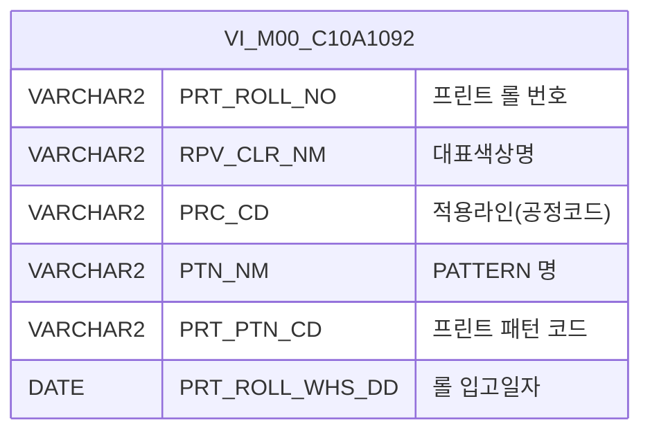

<h1 style="font-size: 40px; text-align: center; font-weight:
   bold; margin: 30px 0;">
  C106000060pop02 레거시 시스템 분석 종합 보고서
</h1>


# 1. 시스템 개요
- **서비스 ID**: C106000060pop02
- **업무명**: UNI-TEX 롤 코드 검색 팝업
- **분석 일시**: 2026-03-17 10:14 KST
- **전체 Activity 수**: 2개 (Built-in 2개, Custom 0개)
- **분석자**: Claude Opus 4.6 / Sonnet (UI 분석)
- **분석 도구**: /analyze-service C106000060pop02
- **문서 버전**: 1.0

# 📊 비즈니스 프로세스 분석

## 시스템 목적

C106000060pop02는 CCL(연속컬러코팅라인) 공정의 BOM 관리 화면(C106000060)에서 호출되는 **UNI-TEX 프린트 롤 코드 검색 팝업**이다. 사용자가 프린트 롤 번호, 대표색상, 패턴명 등의 조건으로 UNI-TEX 타입 롤 정보를 검색하여 부모 화면에 선택된 롤 정보를 반환하는 단순 조회/선택 기능을 수행한다.

이 서비스는 VI_M00_C10A1092 뷰(마스터 데이터)에서 'R'로 시작하는 프린트 롤 번호를 조건 검색하며, 사용자가 그리드 행을 더블클릭하면 해당 롤의 정보를 부모 화면의 popSetValue2 함수로 전달한 후 팝업을 닫는다.

<!-- 워크플로우 다이어그램 생략: Custom Activity 0개, SELECT 쿼리만 사용, Router → 단일 조회 Activity 구성 -->

## 주요 유즈케이스

### UC-01: UNI-TEX 롤 코드 조회
- **Actor**: CCL 공정 오퍼레이터
- **목적**: UNI-TEX 프린트 롤 정보를 조건별로 검색하여 BOM 화면에서 사용할 롤 코드를 선택

- **전제조건**:
  - 부모 화면(C106000060)에서 팝업이 호출됨
  - VI_M00_C10A1092 뷰에 UNI-TEX 롤 마스터 데이터가 등록되어 있음

- **주요 흐름**:
  1. 팝업 오픈 시 URL 파라미터(uni_tex_roll_no)로 롤 번호 초기값 설정
  2. 자동으로 조회 실행 (onLoadGrid → find)
  3. Grid에 조회 결과 표시 (ROLL NO, 대표색상, 적용라인, PATTERN 명 등)
  4. 사용자가 원하는 롤 행을 더블클릭하여 선택

- **대체 흐름**:
  - 조회 결과 없음: "조회된 데이터가 없습니다" 메시지 표시
  - 닫기 버튼 클릭: 값을 반환하지 않고 팝업 닫힘

- **후행조건**:
  - 부모 화면의 popSetValue2 함수에 선택된 롤 정보(rowId, cellIndex, targetDivId 포함) 전달됨
  - 팝업 창이 닫힘

### UC-02: 조건 검색을 통한 롤 필터링
- **Actor**: CCL 공정 오퍼레이터
- **목적**: 롤 번호, 대표색상명, 패턴명 등 조건으로 원하는 롤을 빠르게 찾기

- **전제조건**:
  - 팝업이 열려 있음

- **주요 흐름**:
  1. 사용자가 검색 조건 입력 (Roll 코드, 대표색상명, PATTERN명 중 하나 이상)
  2. Roll 코드 입력 시 자동 대문자 변환 (onkeyup 이벤트)
  3. 조회 버튼 클릭
  4. C106000060pop02.select 쿼리 실행 (LIKE 부분검색)
  5. Grid에 필터링된 결과 표시

- **대체 흐름**:
  - 검색 조건 미입력 시: 전체 UNI-TEX 롤 목록 조회 (SUBSTR(PRT_ROLL_NO,1,1)='R' 기본 필터)

- **후행조건**:
  - Grid에 필터링된 롤 목록이 표시됨

### UC-03: 행 복사 및 엑셀 다운로드
- **Actor**: CCL 공정 오퍼레이터
- **목적**: 조회된 롤 정보를 복사하거나 엑셀로 다운로드

- **전제조건**:
  - Grid에 조회 결과가 표시되어 있음

- **주요 흐름**:
  1. Grid 위에서 우클릭하여 컨텍스트 메뉴 표시
  2. "행 복사" 선택 시 선택 셀 값을 클립보드에 복사
  3. "엑셀 다운로드" 선택 시 Grid 데이터를 엑셀 파일로 다운로드

- **대체 흐름**:
  - 데이터 없는 상태에서 엑셀 다운로드: 빈 파일 생성

- **후행조건**:
  - 클립보드에 셀 값 복사됨 또는 엑셀 파일 다운로드됨

---
## 비즈니스 로직 상세

### 1. UNI-TEX 롤 필터링 조건

- **목적**: 'R'로 시작하는 프린트 롤 번호만 UNI-TEX 타입으로 분류하여 조회
- **처리 케이스**:

  **[케이스 1: 기본 필터 - UNI-TEX 롤 식별]**
  ```
    조건: SUBSTR(PRT_ROLL_NO, 1, 1) = 'R'
    처리:
      1. 프린트 롤 번호의 첫 글자가 'R'인 것만 추출
      2. 이는 UNI-TEX 타입 롤을 다른 타입과 구분하는 기준
  ```

  **[케이스 2: 부분 검색 (LIKE 패턴)]**
  ```
    조건: 사용자가 검색 조건(PRT_ROLL_NO, RPV_CLR_NM, PTN_NM) 중 하나 이상 입력
    처리:
      1. 각 검색어에 대해 LIKE '%검색어%' 패턴으로 부분 일치 검색
      2. 빈 검색어는 조건에서 제외 (NVL 또는 빈 문자열 체크)
      3. 결과를 PRT_ROLL_NO 순서로 정렬
  ```

  **[케이스 3: 전체 조회 (조건 미입력)]**
  ```
    조건: 검색 조건 모두 비어있음
    처리:
      1. SUBSTR(PRT_ROLL_NO, 1, 1) = 'R' 기본 필터만 적용
      2. 전체 UNI-TEX 롤 목록 반환
  ```

---

# 💾 데이터 요구사항

## 핵심 테이블

### 1. VI_M00_C10A1092 - (UNI-TEX 롤 관리기준 뷰)
| 컬럼명 | 타입 | PK | 설명 |
|--------|------|----|-----|
| PRT_ROLL_NO | VARCHAR2 | | 프린트 롤 번호 |
| RPV_CLR_NM | VARCHAR2 | | 대표색상명 |
| PRC_CD | VARCHAR2 | | 적용라인 (공정코드) |
| PTN_NM | VARCHAR2 | | PATTERN 명 |
| PRT_PTN_CD | VARCHAR2 | | 프린트 패턴 코드 |
| PRT_ROLL_WHS_DD | DATE | | 롤 입고일자 |

> **참고**: VI_M00_C10A1092는 M00APUSER 스키마의 뷰(View)로, 마스터 데이터 스키마에서 관리됨. 실제 기반 테이블 구조는 뷰 정의에 의존.

## 데이터 플로우

### 1. 조회

```
[팝업 오픈 시 자동 조회]
팝업 진입 (URL 파라미터: uni_tex_roll_no)
→ Form에 초기값 설정 (PRT_ROLL_NO = uni_tex_roll_no)
→ C106000060pop02.select
  FROM VI_M00_C10A1092
  WHERE SUBSTR(PRT_ROLL_NO, 1, 1) = 'R'
    AND PRT_ROLL_NO LIKE '%' || :PRT_ROLL_NO || '%' (입력 시)
    AND RPV_CLR_NM LIKE '%' || :RPV_CLR_NM || '%' (입력 시)
    AND PTN_NM LIKE '%' || :PTN_NM || '%' (입력 시)
  ORDER BY PRT_ROLL_NO
→ Grid에 롤 목록 표시

[조건 검색 후 조회]
사용자 검색 조건 입력
→ 조회 버튼 클릭
→ C106000060pop02.select (동일 쿼리, 파라미터 변경)
→ Grid 갱신
```

### 2. 선택 반환

```
[롤 선택 후 부모 화면 반환]
Grid 행 더블클릭
→ 선택 행의 컬럼 데이터 추출
→ parent.popSetValue2(rowId, cellIndex, targetDivId, 선택값) 호출
→ 팝업 닫기 (winClose)
```

## SQL 일람표
| SQL 이름 | 쿼리 ID | 타입 | 출처 | 테이블 |
|---------|---------|-----|-------|-------|
| UNI-TEX 롤 조회 | C106000060pop02.select | SELECT | Service | VI_M00_C10A1092 |

## ER 다이어그램 (핵심 관계)



관계 설명:
- VI_M00_C10A1092는 M00APUSER 스키마의 단일 뷰로, 본 서비스에서는 다른 테이블과의 JOIN 없이 독립적으로 조회됨
- 부모 화면(C106000060)의 BOM 테이블과 PRT_ROLL_NO를 통해 연결되나, 본 팝업 서비스 범위 내에서는 직접적인 FK 관계 없음

---

# 🖥️ 사용자 인터페이스 요구사항

## 화면 레이아웃 상세

### Layout 구조 (절대좌표 기반 팝업)
```javascript
{
  type: "absolute",  // 레이아웃 없이 절대좌표 배치 (팝업 화면)
  windowSize: { width: 650, height: 483 },
  components: [
    {
      id: "C106000060pop02_Form_1",
      type: "form",
      position: { left: 0, top: 0, width: 650, height: 30 }
    },
    {
      id: "C106000060pop02_Grid_1",
      type: "grid",
      position: { left: 1, top: 31, width: 648, height: 431 }
    },
    {
      id: "C106000060pop02_messagebox",
      type: "messagebox",
      position: { left: 0, top: 464, width: 649, height: 19 }
    }
  ]
}
```

## 입출력 요소

### Form 컴포넌트
**C106000060pop02_Form_1**
- PRT_ROLL_NO: input - Roll 코드 (75px, onkeyup 자동 대문자 변환)
- RPV_CLR_NM: input - 대표색상명 (75px)
- PTN_NM: input - PATTERN명 (75px)
- find: Button - 조회 → C106000060pop02-service 호출 (basicGridData.do)
- winClose: Button - 닫기 → 팝업 닫기

### Grid 컴포넌트

**C106000060pop02_Grid_1 (UNI-TEX 롤 목록)**
- 편집 가능 여부: 아니오 (전체 읽기 전용)
- Split: 없음
- 페이징: 사용 (pageset: true)
- 멀티선택: 사용 (multiselect: true)
- 컨텍스트 메뉴: 행 복사, 엑셀 다운로드
- 참조 테이블: VI_M00_C10A1092
- 주요 컬럼 (6개):

  **롤 기본 정보**:
  - PRT_ROLL_NO: ro - ROLL NO (15%, 중앙정렬, str 정렬)
  - RPV_CLR_NM: ro - 대표색상 (15%, 중앙정렬, str 정렬)
  - PRC_CD: ro - 적용라인 (10%, 중앙정렬, str 정렬)

  **패턴 정보**:
  - PTN_NM: ro - PATTERN 명 (*, 중앙정렬, str 정렬)
  - PRT_PTN_CD: ro - 프린트패턴코드 (12%, 중앙정렬, str 정렬)

  **입고 정보**:
  - PRT_ROLL_WHS_DD: ro - 롤입고일자 (13%, 중앙정렬, str 정렬)

## 화면 동작 흐름

### 1. 화면 초기 로딩
```
1. 부모 화면에서 팝업 호출 (URL 파라미터: uni_tex_roll_no, rowId, cellIndex, targetDivId)
2. ui.initializeDHTMLX() 호출하여 Form, Grid, Messagebox 초기화
3. URL 파라미터에서 uni_tex_roll_no 추출
4. Form의 PRT_ROLL_NO 필드에 초기값 설정
5. Grid XLE 로드 완료 이벤트(onXLEEvent) 발생
6. onLoadGrid() 호출 → find() 자동 실행
7. C106000060pop02.select 쿼리로 초기 데이터 조회
8. Grid에 결과 표시, Messagebox에 건수 표시
```

### 2. 조건 검색 조회
```
1. 사용자가 Roll 코드 / 대표색상명 / PATTERN명 입력
2. Roll 코드 입력 시 onkeyup 이벤트로 자동 대문자 변환
3. 조회 버튼 클릭
4. uiCommon.parameters(C106000060pop02_Form_1) 호출하여 파라미터 구성
5. basicGridData.do로 C106000060pop02-service 호출 (find 명령)
6. C106000060pop02.select 쿼리 실행
7. Grid 데이터 갱신, Messagebox에 결과 건수 표시
```

### 3. 롤 선택 및 부모 화면 반환
```
1. Grid에서 원하는 롤 행 더블클릭 (rowDblClicked 이벤트)
2. parentSetValue() 함수 실행
3. parent.popSetValue2(rowId, cellIndex, targetDivId, 선택값) 호출
4. 부모 화면에 선택된 롤 정보 전달
5. winClose() 호출하여 팝업 닫기
```

### 4. 컨텍스트 메뉴 사용
```
1. Grid 영역에서 우클릭
2. 컨텍스트 메뉴 표시 (행 복사, 엑셀 다운로드)
3. "행 복사" 선택 → onGridContextMenuClick(copy_row) → 선택 셀 클립보드 복사
4. "엑셀 다운로드" 선택 → onGridContextMenuClick(excel_grid) → Grid 데이터 엑셀 출력
```

## JavaScript 모듈

**C106000060pop02.jsp** (팝업 화면 인라인 스크립트)
- onLoadGrid(): Grid XLE 완료 후 초기 조회 실행 (Form 초기값 설정 → find 호출)
- find(): Form 파라미터로 Grid 데이터 조회 (uiCommon.parameters → basicGridData.do)
- winClose(): 팝업 창 닫기
- parentSetValue(): Grid 행 더블클릭 시 부모 창 popSetValue2 호출 후 닫기
- findMessage(appMsg): Grid 조회 결과 메시지박스 표시
- onGridContextMenuClick(id, zoneId): 컨텍스트 메뉴 핸들러 (행 복사, 엑셀 다운로드)

## 주요 이벤트 핸들러

**rowDblClicked (롤 행 더블클릭)**
- 이벤트 타입: Grid Row Double Click
- 처리 내용:
  1. 더블클릭된 행의 데이터 추출
  2. parentSetValue() 함수 호출
  3. parent.popSetValue2(rowId, cellIndex, targetDivId, 선택값) 실행
  4. winClose()로 팝업 닫기

**PRT_ROLL_NO onkeyup (롤 코드 입력)**
- 이벤트 타입: Input Keyup
- 처리 내용:
  1. 입력된 문자를 대문자로 변환 (toUpperCase)
  2. 변환된 값을 필드에 재설정

**onXLEEvent (Grid 초기화 완료)**
- 이벤트 타입: Grid XLE Complete
- 처리 내용:
  1. Grid 초기 설정 완료 확인
  2. onLoadGrid() 호출하여 초기 데이터 자동 조회

---

# 📌 특이사항 및 주의사항

## 1. UNI-TEX 롤 식별 하드코딩
- **SUBSTR 기반 타입 분류**: `SUBSTR(PRT_ROLL_NO, 1, 1) = 'R'` 조건으로 UNI-TEX 롤을 식별하고 있음. 롤 번호 체계가 변경되면 쿼리 수정이 필요한 하드코딩 패턴.

## 2. 부모-자식 창 간 데이터 전달 방식
- **parent.popSetValue2 직접 호출**: 부모 창의 JavaScript 함수를 직접 호출하는 밀결합(tight coupling) 구조. 부모 화면에 popSetValue2 함수가 존재하지 않으면 런타임 에러 발생 가능. 부모 화면(C106000060)의 해당 함수 존재 여부에 의존적.

## 3. URL 파라미터 기반 초기값 전달
- **uni_tex_roll_no 파라미터**: 팝업 호출 시 URL 파라미터로 초기 검색값을 전달받아 자동 조회. rowId, cellIndex, targetDivId 등 부모 화면의 Grid 위치 정보도 함께 전달하여, 선택 반환 시 정확한 셀 위치에 값을 설정할 수 있도록 함.

## 4. 마스터 뷰(VI_M00_C10A1092) 사용
- **M00APUSER 스키마 뷰 참조**: 실 테이블이 아닌 뷰를 조회하므로 뷰 정의 변경에 영향을 받음. mesdao를 통해 접근하나 실제 데이터는 M00APUSER 스키마의 마스터 데이터임.

## 5. 자동 대문자 변환 처리
- **Roll 코드 입력 보정**: PRT_ROLL_NO 필드에 onkeyup 이벤트를 걸어 입력값을 자동 대문자 변환. 서버 측에서 별도 변환이 없으므로 JavaScript 비활성 환경에서는 소문자 검색이 가능하나, 'R'로 시작 조건과 불일치할 수 있음.

---

# 📚 참고 문서

- **Service XML**: `src/service/C106000060pop02-service.xml`
- **Query SQL**: `src/query/C106000060pop02-query.glue_sql`
- **JSP**: `WebContents/C106000060pop02.jsp`
- **Form XML**: `WebContents/header/kr/C106000060pop02/C106000060pop02_Form_1.xml`
- **Grid XML**: `WebContents/header/kr/C106000060pop02/C106000060pop02_Grid_1.xml`
