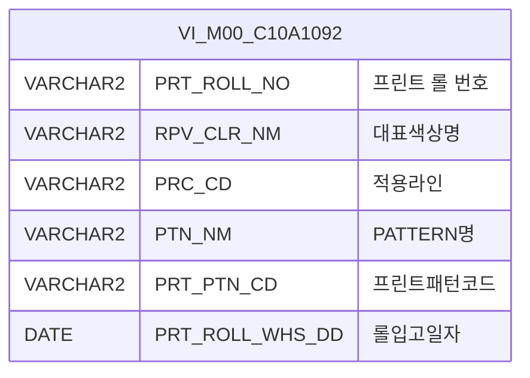

<h1 style="font-size: 40px; text-align: center; font-weight:
   bold; margin: 30px 0;">
  C106000060pop03 레거시 시스템 분석 종합 보고서
</h1>


# 1. 시스템 개요
- **서비스 ID**: C106000060pop03
- **업무명**: CCL-BOM Master PRT Roll No 조회 팝업
- **분석 일시**: 2026-03-17 10:15 KST
- **분석 시간**: 약 3분
- **전체 Activity 수**: 2개 (Built-in 2개, Custom 0개)
- **분석자**: Claude Opus 4.6 + Sonnet 4.6
- **분석 도구**: /analyze-service C106000060pop03
- **문서 버전**: 1.0

# 📊 비즈니스 프로세스 분석

## 시스템 목적

C106000060pop03은 CCL(연속도장라인) BOM Master 화면(C106000060)의 세 번째 팝업으로, **PRT(프린트) Roll No를 검색하여 부모 화면에 선택값을 반환하는 조회 전용 팝업**이다.

사용자는 Roll 코드, 대표색상명, PATTERN명을 검색 조건으로 입력하여 UNI-TEX PICKUP 타입의 프린트 롤 정보를 조회하고, 원하는 롤을 더블클릭하여 부모 화면의 해당 필드에 값을 설정한다. 롤번호 첫 글자가 'U'인 롤만 검색 대상이며, 마스터 뷰 `VI_M00_C10A1092`에서 데이터를 조회한다.

부모 화면에서 팝업 호출 시 `pick_up_roll_no` URL 파라미터를 전달하면, 해당 값이 Roll 코드 필드에 자동 설정되고 즉시 조회가 수행되어 사용자의 편의성을 높인다.

## 주요 유즈케이스

### UC-01: PRT Roll No 검색 조회
- **Actor**: CCL 공정 오퍼레이터
- **목적**: BOM 등록 시 PRT Roll 번호를 검색하여 선택

- **전제조건**:
  - 부모 화면(C106000060)에서 팝업을 호출한 상태
  - VI_M00_C10A1092 뷰에 롤 마스터 데이터가 등록되어 있음

- **주요 흐름**:
  1. 팝업 오픈 시 URL 파라미터 `pick_up_roll_no`가 있으면 Roll 코드 필드에 자동 설정
  2. 자동 조회 실행 (loadData) - C106000060pop03.select 쿼리 호출
  3. Grid에 SUBSTR(PRT_ROLL_NO,1,1)='U' 조건을 만족하는 롤 목록 표시
  4. 사용자가 추가 검색 조건(Roll 코드, 대표색상명, PATTERN명) 입력 후 조회 버튼 클릭

- **대체 흐름**:
  - 조회 결과 없음: 빈 Grid 표시
  - URL 파라미터 없이 팝업 오픈: Roll 코드 필드 빈 상태로 시작, 수동 검색

- **후행조건**:
  - Grid에 검색 결과가 표시됨

### UC-02: PRT Roll No 선택 및 부모 화면 반환
- **Actor**: CCL 공정 오퍼레이터
- **목적**: 검색된 PRT Roll을 선택하여 부모 화면 BOM 입력 필드에 값 전달

- **전제조건**:
  - UC-01에 의해 Grid에 조회 결과가 표시된 상태

- **주요 흐름**:
  1. 사용자가 Grid 행을 더블클릭
  2. parentSetValue 함수 호출 - 선택 행의 PRT_ROLL_NO(index 0) 값 추출
  3. `parent.popSetValue3(rowId, cellIndex, PRT_ROLL_NO값)` 호출하여 부모 화면에 값 전달
  4. winClose()로 팝업 닫기

- **대체 흐름**:
  - 닫기 버튼 클릭: 값 전달 없이 팝업 닫기

- **후행조건**:
  - 부모 화면의 PRT Roll No 필드에 선택값이 설정됨
  - 팝업 창이 닫힘

### UC-03: Grid 컨텍스트 메뉴 기능
- **Actor**: CCL 공정 오퍼레이터
- **목적**: Grid 데이터의 셀 복사 및 Excel 다운로드

- **전제조건**:
  - Grid에 데이터가 표시된 상태

- **주요 흐름**:
  1. 사용자가 Grid에서 우클릭하여 컨텍스트 메뉴 표시
  2. "셀 복사" 선택 시 선택 셀 값을 클립보드에 복사
  3. "Excel 다운로드" 선택 시 Grid 데이터를 Excel로 내보내기

- **대체 흐름**:
  - 빈 Grid에서 우클릭: 메뉴는 표시되나 동작 없음

- **후행조건**:
  - 클립보드에 값 복사 또는 Excel 파일 다운로드 완료

---
## 비즈니스 로직 상세

### 1. UNI-TEX PICKUP 롤 필터링

- **목적**: PRT Roll 중 UNI-TEX PICKUP 유형의 롤만 조회 대상으로 제한
- **처리 케이스**:

  **[케이스 1: 롤번호 접두어 필터링]**
  ```
    조건: SUBSTR(PRT_ROLL_NO, 1, 1) = 'U'
    처리:
      1. 롤번호 첫 글자가 'U'인 롤만 검색 대상
      2. 'U'가 아닌 롤번호는 결과에서 제외
  ```

### 2. 부분 문자열 검색 (LIKE 패턴)

- **목적**: 사용자가 Roll 코드, 대표색상명, PATTERN명의 일부만 입력해도 검색 가능
- **처리 케이스**:

  **[케이스 1: 선택적 조건 바인딩]**
  ```
    조건: 각 검색 파라미터가 입력된 경우
    처리:
      1. PRT_ROLL_NO LIKE '%' || :PRT_ROLL_NO || '%' (롤번호 부분 일치)
      2. RPV_CLR_NM LIKE '%' || :RPV_CLR_NM || '%' (대표색상명 부분 일치)
      3. PTN_NM LIKE '%' || :PTN_NM || '%' (패턴명 부분 일치)
      4. 미입력 파라미터는 WHERE 절에서 제외 (동적 조건)
  ```

### 3. Roll 코드 대문자 자동 변환

- **목적**: 롤번호 검색 시 소문자 입력을 자동으로 대문자로 변환하여 검색 정확도 향상
- **처리 케이스**:

  **[케이스 1: onkeyup 이벤트 기반 변환]**
  ```
    조건: PRT_ROLL_NO 입력 필드에 키 입력 발생
    처리:
      1. 입력값을 toUpperCase()로 변환
      2. 변환된 값을 필드에 재설정
  ```

---

# 💾 데이터 요구사항

## 핵심 테이블

### 1. VI_M00_C10A1092 - (UNI-TEX PICKUP 롤관리기준 뷰)
| 컬럼명 | 타입 | PK | 설명 |
|--------|------|----|-----|
| PRT_ROLL_NO | VARCHAR2 |  | 프린트 롤 번호 |
| RPV_CLR_NM | VARCHAR2 |  | 대표색상명 |
| PRC_CD | VARCHAR2 |  | 적용라인 (공정코드) |
| PTN_NM | VARCHAR2 |  | PATTERN명 |
| PRT_PTN_CD | VARCHAR2 |  | 프린트패턴코드 |
| PRT_ROLL_WHS_DD | DATE |  | 롤입고일자 |

## 데이터 플로우

### 1. 조회

```
[PRT Roll No 검색 조회]
팝업 진입 (URL 파라미터 pick_up_roll_no로 초기값 설정)
→ C106000060pop03.select
  FROM VI_M00_C10A1092
  WHERE SUBSTR(PRT_ROLL_NO, 1, 1) = 'U'
    AND PRT_ROLL_NO LIKE '%' || :PRT_ROLL_NO || '%' (선택적)
    AND RPV_CLR_NM LIKE '%' || :RPV_CLR_NM || '%' (선택적)
    AND PTN_NM LIKE '%' || :PTN_NM || '%' (선택적)
  ORDER BY PRT_ROLL_NO
→ Grid에 롤 목록 표시
```

## SQL 일람표
| SQL 이름 | 쿼리 ID | 타입 | 출처 | 테이블 |
|---------|---------|-----|-------|-------|
| PRT Roll No 조회 | C106000060pop03.select | SELECT | Service | VI_M00_C10A1092 |

## ER 다이어그램 (핵심 관계)



관계 설명:
- VI_M00_C10A1092는 M00APUSER 스키마의 마스터 뷰로, 단일 테이블 조회 구조
- 이 팝업은 단일 뷰만 참조하므로 테이블 간 관계 없음

---

# 🖥️ 사용자 인터페이스 요구사항

## 화면 레이아웃 상세

### Layout 구조
```javascript
{
  screenType: "popup",
  width: "650px",
  height: "485px",
  components: [
    {
      id: "C106000060pop03_Form_1",
      type: "form",
      position: { left: "0px", top: "0px", width: "650px", height: "30px" }
    },
    {
      id: "C106000060pop03_Grid_1",
      type: "grid",
      position: { left: "1px", top: "31px", width: "648px", height: "431px" }
    },
    {
      id: "C106000060pop03_messagebox",
      type: "messagebox",
      position: { left: "0px", top: "464px", width: "649px", height: "19px" }
    }
  ]
}
```

## 입출력 요소

### Form 컴포넌트
**C106000060pop03_Form_1**
- PRT_ROLL_NO: Input - Roll 코드 (너비 75px, 자동 대문자 변환 onkeyup 이벤트, 초기값은 URL 파라미터 pick_up_roll_no)
- RPV_CLR_NM: Input - 대표색상명 (너비 75px)
- PTN_NM: Input - PATTERN명 (너비 75px)
- find: Button - 조회 (find 커맨드)
- winClose: Button - 닫기 (winClose 커맨드)

### Grid 컴포넌트

**C106000060pop03_Grid_1 (PRT Roll 목록)**
- 편집 가능 여부: 아니오 (전체 읽기 전용)
- Split: 0 (고정 컬럼 없음)
- 기능: multiselect, validation, contextmenu, pageset
- 날짜 포맷: %Y-%m-%d
- 컬럼 너비 단위: %
- 주요 컬럼 (6개):

  **롤 식별 정보**:
  - PRT_ROLL_NO: ro - ROLL NO (15%, 중앙정렬, str 정렬)
  - RPV_CLR_NM: ro - 대표색상 (15%, 중앙정렬, str 정렬)
  - PRC_CD: ro - 적용라인 (10%, 중앙정렬, str 정렬)

  **패턴 정보**:
  - PTN_NM: ro - PATTERN 명 (*, 중앙정렬, str 정렬)
  - PRT_PTN_CD: ro - 프린트패턴코드 (12%, 중앙정렬, str 정렬)

  **입고 정보**:
  - PRT_ROLL_WHS_DD: ro - 롤입고일자 (13%, 중앙정렬, str 정렬)

## 화면 동작 흐름

### 1. 화면 초기 로딩 (팝업 오픈)
```
1. 팝업 오픈 (부모 화면에서 window.open 호출)
2. URL 파라미터 파싱 (pick_up_roll_no, rowId, cellIndex, targetDivId)
3. Form/Grid 컴포넌트 초기화
4. onLoadGrid 이벤트 발생:
   - PRT_ROLL_NO 폼 필드에 prtRollNo 파라미터 값 설정
   - 자동 조회 실행 (loadData)
   - PRT_ROLL_NO 필드에 onkeyup 대문자 변환 이벤트 등록
   - onXleGrid 이벤트 detachEvent
5. Grid에 조회 결과 표시
```

### 2. Roll No 검색 조회
```
1. 사용자가 Roll 코드, 대표색상명, PATTERN명 중 하나 이상 입력
2. PRT_ROLL_NO 입력 시 onkeyup으로 자동 대문자 변환
3. 조회(find) 버튼 클릭
4. C106000060pop03-service 호출 (find 커맨드)
5. C106000060pop03.select 쿼리 실행
   - SUBSTR(PRT_ROLL_NO,1,1)='U' 고정 조건 적용
   - 입력된 검색어에 대해 LIKE 부분 일치 검색
6. Grid에 결과 바인딩
7. findMessage로 메시지박스에 결과 메시지 표시
```

### 3. Roll No 선택 및 부모 화면 값 전달
```
1. Grid 행 더블클릭
2. parentSetValue(rowId, cellIndex) 함수 호출
3. 선택 행의 PRT_ROLL_NO (index 0) 값 추출
4. parent.popSetValue3(rowId, cellIndex, PRT_ROLL_NO값) 호출
5. winClose()로 팝업 닫기
6. 부모 화면의 해당 필드에 PRT_ROLL_NO 값 설정
```

## JavaScript 모듈

**C106000060pop03.jsp** (팝업 인라인 스크립트)
- onLoadGrid(): 그리드 초기화 후 URL 파라미터 설정 및 자동 조회, 대문자 변환 이벤트 등록
- parentSetValue(rowId, cellIndex): Grid 행 더블클릭 시 부모 화면에 선택값 전달 (parent.popSetValue3 호출) 후 팝업 닫기
- onGridContextMenuClick(id, zoneId, cas): 컨텍스트 메뉴 처리 (copy_row: 셀 복사, excel_grid: Excel 다운로드)
- find(): 폼 조회 버튼 이벤트 - 그리드 데이터 로드
- findMessage(): 메시지박스에 appMsg 표시

## 주요 이벤트 핸들러

**onLoadGrid (그리드 초기화 후)**
- 이벤트 타입: Grid onXLE 이벤트
- 처리 내용:
  1. PRT_ROLL_NO 폼 필드에 URL 파라미터 prtRollNo 값 설정
  2. 자동 조회 실행 (loadData)
  3. PRT_ROLL_NO 필드에 onkeyup 대문자 변환 이벤트 바인딩
  4. onXleGrid 이벤트 detachEvent (1회성 실행 보장)

**parentSetValue (행 더블클릭)**
- 이벤트 타입: Grid Row DoubleClick
- 처리 내용:
  1. 선택된 행의 PRT_ROLL_NO (index 0) 값 추출
  2. parent.popSetValue3(rowId, cellIndex, PRT_ROLL_NO값) 호출
  3. winClose()로 팝업 닫기

**onGridContextMenuClick (컨텍스트 메뉴)**
- 이벤트 타입: Grid Context Menu Click
- 처리 내용:
  1. copy_row: 선택 셀 값 클립보드 복사
  2. excel_grid: Grid 데이터 Excel 다운로드

---

# 📌 특이사항 및 주의사항

## 1. UNI-TEX PICKUP 전용 롤 필터링
- **하드코딩된 조건**: `SUBSTR(PRT_ROLL_NO,1,1)='U'` 조건이 SQL에 고정되어 있어, 'U'로 시작하지 않는 PICKUP 롤은 검색 불가. 향후 PICKUP 롤 코드 체계가 변경되면 SQL 수정 필요.

## 2. 부모-팝업 간 값 전달 방식
- **parent.popSetValue3 의존성**: 부모 화면(C106000060)에 `popSetValue3` 함수가 반드시 정의되어 있어야 함. 이 팝업은 세 번째 팝업(pop03)으로, pop01(popSetValue), pop02(popSetValue2)와 함께 부모 화면의 서로 다른 콜백 함수를 호출하는 패턴.
- **URL 파라미터 기반 초기값**: `pick_up_roll_no` 파라미터로 초기 검색어를 전달받아 사용자 편의성을 높이지만, 파라미터 없이 직접 호출 시에도 정상 동작.

## 3. 마스터 뷰(VI_M00_C10A1092) 참조 구조
- **M00APUSER 스키마 뷰**: `VI_M00_C10A1092`는 M00APUSER 스키마의 마스터 뷰로, `mesdao`를 통해 접근함. 뷰의 원본 테이블 구조나 조인 관계는 이 서비스 분석 범위 밖이며, 뷰 정의 변경 시 이 팝업의 조회 결과에 직접 영향.

## 4. Grid 컬럼 너비 단위 특이점
- **퍼센트(%) 단위 사용**: Grid 컬럼 너비가 px가 아닌 %로 지정되어 있어 팝업 크기(650px)에 비례하여 자동 조정. PTN_NM 컬럼은 `*`(나머지 영역)로 설정되어 가변폭.

## 5. 대문자 변환 클라이언트 전용 처리
- **서버 미검증**: Roll 코드 대문자 변환은 클라이언트 JavaScript(onkeyup)에서만 수행되며, 서버 측 별도 변환 로직 없음. JavaScript 비활성화 시 소문자 검색어가 전달될 수 있으나, SQL의 SUBSTR 조건이 'U' 대문자를 요구하므로 결과적으로 필터링에는 영향 없음.

---

# 📚 참고 문서

- **Query SQL**: `src/query/C106000060pop03-query.glue_sql`
- **Service XML**: `src/service/C106000060pop03-service.xml`
- **JSP**: `WebContents/C106000060pop03.jsp`
- **UI XML**:
  - `WebContents/header/kr/C106000060pop03/C106000060pop03_Form_1.xml`
  - `WebContents/header/kr/C106000060pop03/C106000060pop03_Grid_1.xml`
