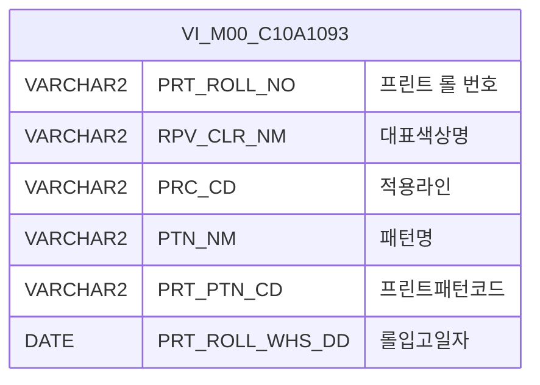

<h1 style="font-size: 40px; text-align: center; font-weight:
   bold; margin: 30px 0;">
  C106000060pop04 레거시 시스템 분석 종합 보고서
</h1>


# 1. 시스템 개요
- **서비스 ID**: C106000060pop04
- **업무명**: IMPRINTING 롤관리기준 팝업 조회 (CCL-BOM Master popup4)
- **분석 일시**: 2026-03-17 10:21 (KST)
- **분석 시간**: ~3분
- **전체 Activity 수**: 2개 (Built-in 2개)
- **분석자**: Claude Opus 4.6 + Sonnet (UI)
- **분석 도구**: /analyze-service C106000060pop04
- **문서 버전**: 1.0

# 📊 비즈니스 프로세스 분석

## 시스템 목적

C106000060pop04는 CCL(연속도장라인) 공정의 BOM Master 관리 화면(C106000060)에서 호출되는 팝업 서비스로, IMPRINTING 타입의 프린트 롤 정보를 검색하여 선택할 수 있는 기능을 제공한다.

이 팝업은 VI_M00_C10A1093 뷰에서 롤번호 첫 글자가 'I'(IMPRINTING)인 롤 데이터만 필터링하여 조회하며, 사용자가 롤 번호, 대표색상명, 패턴명으로 검색 후 행을 더블클릭하면 선택된 값을 부모 화면에 전달하고 팝업을 닫는다. 부모 화면의 `popSetValue4` 함수를 통해 선택 값이 반영된다.

서비스 구조는 PosDefaultRouter(분기) → FormSearch(조회)의 단순 조회 패턴으로, Custom Activity 없이 프레임워크 내장 Activity만으로 구성되어 있다.

<!-- 워크플로우 다이어그램 생략: Custom Activity 0개, SELECT 쿼리만 사용, Router → 단일 조회 Activity 단순 구조 -->

## 주요 유즈케이스

### UC-01: IMPRINTING 롤 검색 및 조회
- **Actor**: CCL 공정 오퍼레이터
- **목적**: BOM 등록 시 IMPRINTING 타입 프린트 롤을 검색하여 조회

- **전제조건**:
  - 부모 화면(C106000060)에서 팝업이 호출됨
  - URL 파라미터로 `impt_roll_no`(기존 롤 번호)가 전달됨
  - VI_M00_C10A1093 뷰에 IMPRINTING 롤 데이터가 존재함

- **주요 흐름**:
  1. 팝업 로딩 시 URL 파라미터 `impt_roll_no` 값을 PRT_ROLL_NO 폼 필드에 자동 설정
  2. 그리드 onXLEEvent 발생 시 자동으로 조회(find) 실행
  3. C106000060pop04.select 쿼리 실행 — VI_M00_C10A1093에서 `SUBSTR(PRT_ROLL_NO,1,1)='I'` 조건과 검색어로 필터링
  4. 결과가 그리드에 표시됨 (ROLL NO, 대표색상, 적용라인, PATTERN명, 프린트패턴코드, 롤입고일자)

- **대체 흐름**:
  - 검색 결과 없음: 빈 그리드 표시
  - 롤 번호 입력 시: 자동 대문자 변환 (onkeyup 이벤트)

- **후행조건**:
  - 조회 결과가 그리드에 표시되어 사용자가 선택 가능한 상태가 됨

### UC-02: 롤 선택 및 부모 화면 전달
- **Actor**: CCL 공정 오퍼레이터
- **목적**: 검색된 IMPRINTING 롤을 선택하여 부모 BOM Master 화면에 값을 반영

- **전제조건**:
  - UC-01의 조회가 완료되어 그리드에 데이터가 표시됨

- **주요 흐름**:
  1. 사용자가 원하는 롤 행을 더블클릭 (rowDblClicked 이벤트)
  2. 선택된 행의 데이터를 부모 창의 `popSetValue4` 함수에 전달
  3. 전달 파라미터: rowId, cellIndex, targetDivId (URL 파라미터에서 수신)
  4. 팝업 창 자동 닫힘 (window.close)

- **대체 흐름**:
  - 닫기 버튼 클릭: 값 전달 없이 팝업 닫힘 (winClose 커맨드)

- **후행조건**:
  - 부모 화면의 해당 셀에 선택된 롤 정보가 반영됨

### UC-03: 롤 데이터 복사 및 엑셀 내보내기
- **Actor**: CCL 공정 오퍼레이터
- **목적**: 조회된 롤 데이터를 클립보드 복사 또는 엑셀 파일로 내보내기

- **전제조건**:
  - 그리드에 데이터가 표시됨

- **주요 흐름**:
  1. 그리드에서 마우스 우클릭하여 컨텍스트 메뉴 호출
  2. "copy_row" 선택 시 선택 셀 값을 클립보드에 복사
  3. "excel_grid" 선택 시 그리드 데이터를 엑셀 파일로 내보내기

- **대체 흐름**:
  - 데이터 없는 상태에서 내보내기: 빈 엑셀 파일 생성

- **후행조건**:
  - 클립보드에 셀 값이 복사되거나 엑셀 파일이 다운로드됨

---
## 비즈니스 로직 상세

### 1. IMPRINTING 롤 필터링 조건

- **목적**: VI_M00_C10A1093 뷰에서 IMPRINTING 타입 롤만 선별하여 조회
- **처리 케이스**:

  **[케이스 1: IMPRINTING 타입 필터링]**
  ```
    조건: 롤번호 첫 글자가 'I'인 데이터만 대상
    처리:
      1. SUBSTR(PRT_ROLL_NO, 1, 1) = 'I' 조건으로 IMPRINTING 타입만 필터링
      2. 롤번호, 대표색상명, 패턴명을 LIKE 부분검색으로 추가 필터링
      3. 롤번호 오름차순 정렬
  ```

  **[케이스 2: 검색 조건 조합]**
  ```
    조건: 사용자가 롤번호, 대표색상명, 패턴명 중 하나 이상 입력
    처리:
      1. 각 검색어는 선택적 — 입력된 항목만 LIKE '%검색어%' 조건 적용
      2. 롤번호 입력 시 자동 대문자 변환 (JavaScript onkeyup 이벤트)
      3. 여러 조건 입력 시 AND 조합으로 필터링
  ```

---

# 💾 데이터 요구사항

## 핵심 테이블

### 1. VI_M00_C10A1093 - (IMPRINTING 롤관리기준 뷰)
| 컬럼명 | 타입 | PK | 설명 |
|--------|------|----|-----|
| PRT_ROLL_NO | VARCHAR2 | | 프린트 롤 번호 |
| RPV_CLR_NM | VARCHAR2 | | 대표색상명 |
| PRC_CD | VARCHAR2 | | 적용라인(공정코드) |
| PTN_NM | VARCHAR2 | | 패턴명 |
| PRT_PTN_CD | VARCHAR2 | | 프린트패턴코드 |
| PRT_ROLL_WHS_DD | DATE | | 롤입고일자 |

## 데이터 플로우

### 1. 조회

```
[IMPRINTING 롤 검색 조회]
팝업 진입 (URL 파라미터: impt_roll_no, rowId, cellIndex, targetDivId)
→ PRT_ROLL_NO 폼 필드에 impt_roll_no 초기값 설정
→ C106000060pop04.select
  FROM VI_M00_C10A1093
  WHERE SUBSTR(PRT_ROLL_NO, 1, 1) = 'I'
    AND PRT_ROLL_NO LIKE '%' || :PRT_ROLL_NO || '%' (선택)
    AND RPV_CLR_NM LIKE '%' || :RPV_CLR_NM || '%' (선택)
    AND PTN_NM LIKE '%' || :PTN_NM || '%' (선택)
  ORDER BY PRT_ROLL_NO
→ Grid에 롤 목록 표시 (6개 컬럼)
```

### 2. 선택 및 값 전달

```
[행 더블클릭 → 부모 화면 값 전달]
사용자가 그리드 행 더블클릭
→ rowDblClicked 이벤트 발생
→ 부모 창 popSetValue4(rowId, cellIndex, targetDivId, 선택 데이터) 호출
→ 팝업 닫힘 (window.close)
```

## SQL 일람표

| SQL 이름 | 쿼리 ID | 타입 | 출처 | 테이블 |
|---------|---------|-----|------|-------|
| IMPRINTING 롤관리기준 조회 | C106000060pop04.select | SELECT | Service | VI_M00_C10A1093 |

## ER 다이어그램 (핵심 관계)



관계 설명:
- VI_M00_C10A1093은 M00APUSER 스키마의 코드 뷰로, IMPRINTING 롤 관리기준 데이터를 제공하는 단일 뷰 구조
- 그리드 XML에서는 VI_M00_C10A1092를 테이블로 참조하나, 실제 SQL 쿼리는 VI_M00_C10A1093 뷰를 사용 (유사 뷰명으로 버전 차이 가능)

---

# 🖥️ 사용자 인터페이스 요구사항

## 화면 레이아웃 상세

### Layout 구조 (absolute positioning)
```javascript
{
  layoutType: "absolute",  // 절대 위치 레이아웃
  totalWidth: "650px",
  totalHeight: "483px",
  components: [
    {
      id: "C106000060pop04_Form_1",
      type: "form",
      position: { left: 0, top: 0, width: 650, height: 30 }
    },
    {
      id: "C106000060pop04_Grid_1",
      type: "grid",
      position: { left: 1, top: 31, width: 648, height: 431 }
    },
    {
      id: "C106000060pop04_messagebox",
      type: "messagebox",
      position: { left: 0, top: 464, width: 649, height: 19 }
    }
  ]
}
```

## 입출력 요소

### Form 컴포넌트
**C106000060pop04_Form_1** (검색 폼, 높이 30px)
- PRT_ROLL_NO: input - Roll 코드 (너비 75px, onkeyup 대문자 변환)
- RPV_CLR_NM: input - 대표색상명 (너비 75px)
- PTN_NM: input - PATTERN명 (너비 75px)
- find: button - 조회 → find 커맨드 실행
- winClose: button - 닫기 → 팝업 창 닫기

### Grid 컴포넌트

**C106000060pop04_Grid_1 (IMPRINTING 롤 목록)**
- 편집 가능 여부: 아니오 (모든 컬럼 ro - 읽기 전용)
- Split: 0 (고정 컬럼 없음)
- 멀티 선택: 가능
- 컨텍스트 메뉴: copy_row(셀 복사), excel_grid(엑셀 내보내기)
- 페이징: 사용 (rowCnt: 2)
- 날짜 형식: %Y-%m-%d
- 컬럼 너비 단위: % (퍼센트)
- 주요 컬럼 (6개):

  **기본 정보**:
  - PRT_ROLL_NO: ro - ROLL NO (15%, 중앙정렬, 문자열 정렬)
  - RPV_CLR_NM: ro - 대표색상 (15%, 중앙정렬, 문자열 정렬)
  - PRC_CD: ro - 적용라인 (10%, 중앙정렬, 문자열 정렬)

  **패턴 정보**:
  - PTN_NM: ro - PATTERN 명 (*, 중앙정렬, 문자열 정렬)
  - PRT_PTN_CD: ro - 프린트패턴코드 (12%, 중앙정렬, 문자열 정렬)

  **일자 정보**:
  - PRT_ROLL_WHS_DD: ro - 롤입고일자 (13%, 중앙정렬, 문자열 정렬)

### Messagebox 컴포넌트
**C106000060pop04_messagebox** (상태 메시지 표시, 높이 19px)

## 화면 동작 흐름

### 1. 팝업 초기 로딩
```
1. 부모 화면(C106000060)에서 팝업 호출
   - URL 파라미터: impt_roll_no, rowId, cellIndex, targetDivId
2. 그리드 onXLEEvent 발생 → onLoadGrid 핸들러 실행
3. URL 파라미터 impt_roll_no 값을 PRT_ROLL_NO 폼 필드에 설정
4. 자동으로 find() 함수 호출 → C106000060pop04.select 쿼리 실행
5. 그리드에 IMPRINTING 롤 목록 표시
6. messagebox 초기화
```

### 2. 롤 검색 조회
```
1. 사용자가 Roll 코드, 대표색상명, PATTERN명 중 검색 조건 입력
   - PRT_ROLL_NO 입력 시 자동 대문자 변환 (onkeyup → toUpperCase)
2. 조회 버튼 클릭 → find 커맨드 실행
3. uiCommon.parameters(C106000060pop04_Form_1) 호출하여 파라미터 구성
4. C106000060pop04-service 호출 (find 명령)
5. PosDefaultRouter → FormSearch(조회) Activity 실행
6. C106000060pop04.select 쿼리 실행 (SUBSTR 'I' 필터 + LIKE 검색)
7. 그리드에 결과 바인딩
```

### 3. 롤 선택 및 팝업 닫기
```
1. 사용자가 그리드 행 더블클릭 (rowDblClicked 이벤트)
2. parentSetValue 핸들러 실행
3. 부모 창의 popSetValue4 함수 호출
   - 전달 파라미터: rowId, cellIndex, targetDivId, 선택 행 데이터
4. 팝업 창 닫힘 (window.close)
```

## JavaScript 모듈

**C106000060pop04.jsp** (팝업 스크립트 - JSP 내장)
- onLoadGrid(): 팝업 초기화 — URL 파라미터에서 impt_roll_no 추출 → PRT_ROLL_NO 폼 필드 설정 → 자동 조회 실행
- parentSetValue(): 행 더블클릭 시 부모 창 popSetValue4 호출 후 팝업 닫기
- find(): 폼 파라미터 기반 그리드 데이터 조회
- save(): 그리드 데이터 전송 (사용하지 않는 것으로 추정)
- findMessage(): messagebox 메시지 표시
- onGridContextMenuClick(): 컨텍스트 메뉴 처리 (copy_row, excel_grid)

## 주요 이벤트 핸들러

**onXLEEvent (그리드 로드 완료)**
- 이벤트 타입: Grid XLE Event
- 처리 내용:
  1. URL 파라미터에서 impt_roll_no 값 추출
  2. PRT_ROLL_NO 폼 필드에 초기값 설정
  3. find() 함수 호출하여 자동 조회 실행

**rowDblClicked (행 더블클릭)**
- 이벤트 타입: Grid Row Double Click
- 처리 내용:
  1. 더블클릭된 행의 데이터 추출
  2. 부모 창의 popSetValue4 함수에 rowId, cellIndex, targetDivId와 함께 전달
  3. 팝업 창 닫기 (window.close)

**onkeyup (롤번호 입력)**
- 이벤트 타입: Keyboard Input
- 대상 필드: PRT_ROLL_NO
- 처리 내용:
  1. 입력된 문자를 대문자로 자동 변환 (toUpperCase)

**onGridContextMenuClick (컨텍스트 메뉴)**
- 이벤트 타입: Context Menu Click
- 처리 내용:
  1. copy_row: 선택 셀 값을 클립보드에 복사
  2. excel_grid: 그리드 데이터를 엑셀 파일로 내보내기

---

# 📌 특이사항 및 주의사항

## 1. IMPRINTING 롤 필터링 하드코딩
- **SUBSTR 조건 하드코딩**: `SUBSTR(PRT_ROLL_NO, 1, 1) = 'I'` 조건이 SQL에 직접 하드코딩되어 있어, IMPRINTING 롤 유형의 식별 방식이 변경될 경우 쿼리 수정 필요
- **뷰 참조 불일치**: 쿼리 SQL은 `VI_M00_C10A1093` 뷰를 사용하지만, Grid XML의 컬럼 정의는 `VI_M00_C10A1092`를 테이블로 참조하고 있어 뷰명 불일치 존재

## 2. 부모-팝업 간 데이터 전달 방식
- **window 객체 기반 통신**: 부모 창의 `popSetValue4` 함수를 `window.opener` 또는 `parent` 객체를 통해 직접 호출하는 방식으로, 브라우저 팝업 차단 정책이나 보안 설정에 영향을 받을 수 있음
- **URL 파라미터 의존**: `impt_roll_no`, `rowId`, `cellIndex`, `targetDivId` 4개 파라미터가 URL을 통해 전달되며, 이 중 하나라도 누락되면 값 전달 기능이 정상 동작하지 않을 수 있음

## 3. 미사용 이벤트 핸들러 존재
- **save 이벤트**: Form에 save 이벤트 핸들러가 정의되어 있으나, 이 팝업은 조회 및 선택 전용으로 실제 저장 기능이 없음. 프레임워크 기본 템플릿에서 제거되지 않은 것으로 추정
- **페이징 설정**: `rowCnt: 2`로 설정되어 있어 한 번에 2건만 표시되는 것으로 보이나, 이는 프레임워크의 페이징 단위 설정으로 실제 동작과 다를 수 있음

## 4. 입력값 자동 변환 패턴
- **대문자 변환**: PRT_ROLL_NO 입력 필드에 onkeyup 이벤트로 `toUpperCase()` 자동 변환이 적용되어, 소문자 입력이 불가능한 구조. IMPRINTING 롤 번호가 대문자 'I'로 시작하는 것과 연관

---

# 📚 참고 문서

- **Query SQL**: `src/query/C106000060pop04-query.glue_sql`
- **Service XML**: `src/service/C106000060pop04-service.xml`
- **JSP**: `WebContents/C106000060pop04.jsp`
- **UI Components**:
  - `WebContents/header/kr/C106000060pop04/C106000060pop04_Form_1.xml`
  - `WebContents/header/kr/C106000060pop04/C106000060pop04_Grid_1.xml`
  - `WebContents/header/kr/C106000060pop04/C106000060pop04_messagebox.xml`
