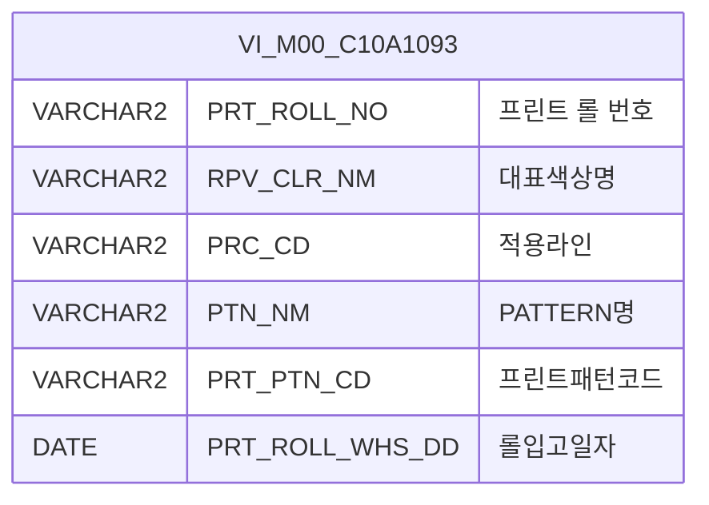

<h1 style="font-size: 40px; text-align: center; font-weight:
   bold; margin: 30px 0;">
  C106000060pop05 레거시 시스템 분석 종합 보고서
</h1>


# 1. 시스템 개요
- **서비스 ID**: C106000060pop05
- **업무명**: CCL-BOM Master 팝업 - IMPRINTING 롤 조회 (pop05)
- **분석 일시**: 2026-03-17 10:21 KST
- **분석 시간**: 약 3분
- **전체 Activity 수**: 2개 (Built-in)
- **분석자**: Claude Opus 4.6 / Sonnet (Phase 4)
- **분석 도구**: /analyze-service C106000060pop05
- **문서 버전**: 1.0

# 📊 비즈니스 프로세스 분석

## 시스템 목적

CCL(연속도금라인) 공정의 BOM(Bill of Materials) Master 관리 화면(C106000060)에서 호출되는 **IMPRINTING 롤 검색 팝업**이다. 부모 화면에서 IMPRINTING 타입 프린트 롤을 선택해야 할 때, 이 팝업을 통해 롤 코드, 대표색상, PATTERN명 등의 조건으로 검색하여 원하는 롤을 선택할 수 있다.

팝업은 `VI_M00_C10A1093` 마스터 뷰에서 `PRT_ROLL_NO`가 'I'로 시작하는 IMPRINTING 전용 롤만 필터링하여 조회한다. 사용자가 행을 더블클릭하면 선택된 롤 번호가 부모 화면의 `popSetValue5()` 함수를 통해 반환되고 팝업은 자동으로 닫힌다.

<!-- 단순 조회 서비스: Custom Activity 0개, SELECT 쿼리만 사용, Router → 단일 조회 Activity 구성 → 워크플로우 다이어그램 생략 -->

## 주요 유즈케이스

### UC-01: IMPRINTING 롤 검색 및 선택
- **Actor**: CCL 공정 오퍼레이터
- **목적**: BOM Master 등록/수정 시 IMPRINTING 타입 프린트 롤을 검색하여 선택

- **전제조건**:
  - 부모 화면(C106000060)에서 팝업 호출됨
  - `impt_roll_no` URL 파라미터로 초기 롤 번호가 전달될 수 있음
  - `VI_M00_C10A1093` 뷰에 IMPRINTING 롤 데이터가 존재함

- **주요 흐름**:
  1. 부모 화면에서 팝업 오픈 시 URL 파라미터 `impt_roll_no` 값이 Form의 `PRT_ROLL_NO` 필드에 자동 설정됨
  2. 설정된 값으로 Grid 자동 조회 실행 (`C106000060pop05.select`)
  3. Grid에 IMPRINTING 롤 목록 표시 (ROLL NO, 대표색상, 적용라인, PATTERN명, 프린트패턴코드, 롤입고일자)
  4. 사용자가 원하는 롤 행을 더블클릭
  5. `parent.popSetValue5(rowId, cellIndex, PRT_ROLL_NO)` 호출로 부모 화면에 값 반환
  6. 팝업 자동 닫기

- **대체 흐름**:
  - 검색 결과 없음: Grid에 빈 목록 표시, 다른 검색 조건으로 재조회 가능
  - 초기 파라미터 없이 팝업 오픈: 빈 Form으로 표시, 사용자가 직접 조건 입력 후 조회

- **후행조건**:
  - 부모 화면의 IMPRINTING 롤 필드에 선택된 `PRT_ROLL_NO` 값이 설정됨
  - 팝업 창이 닫힘

### UC-02: 조건별 롤 검색
- **Actor**: CCL 공정 오퍼레이터
- **목적**: 롤 코드, 대표색상, PATTERN명 조건을 조합하여 원하는 IMPRINTING 롤을 찾기

- **전제조건**:
  - 팝업이 열려 있음
  - 검색 조건을 알고 있음

- **주요 흐름**:
  1. Form에서 검색 조건 입력 (Roll 코드, 대표색상명, PATTERN명 중 하나 이상)
  2. Roll 코드 입력 시 자동 대문자 변환 (onkeyup 이벤트)
  3. 조회 버튼 클릭
  4. `C106000060pop05.select` 쿼리 실행 (LIKE 부분검색 + `SUBSTR(PRT_ROLL_NO,1,1)='I'` 필터)
  5. Grid에 검색 결과 표시

- **대체 흐름**:
  - 모든 조건 미입력 시: IMPRINTING 전체 롤 목록 조회
  - 조회 결과 없음: 빈 Grid 표시

- **후행조건**:
  - Grid에 검색 조건에 맞는 롤 목록이 표시됨

### UC-03: Grid 데이터 활용 (복사/엑셀)
- **Actor**: CCL 공정 오퍼레이터
- **목적**: 조회된 롤 데이터를 클립보드 복사 또는 엑셀로 내보내기

- **전제조건**:
  - Grid에 조회된 데이터가 존재함

- **주요 흐름**:
  1. Grid 영역에서 우클릭하여 컨텍스트 메뉴 호출
  2. `copy_row` 선택 시: 선택 셀 값을 클립보드에 복사
  3. `excel_grid` 선택 시: Grid 데이터를 Excel 파일로 다운로드

- **대체 흐름**:
  - 데이터 없는 상태에서 우클릭: 컨텍스트 메뉴는 표시되나 데이터 없음

- **후행조건**:
  - 복사: 클립보드에 셀 값 저장
  - 엑셀: Excel 파일 다운로드 완료

---
## 비즈니스 로직 상세

### 1. IMPRINTING 롤 필터링 로직

- **목적**: 전체 롤 마스터에서 IMPRINTING 타입 롤만 필터링하여 조회
- **처리 케이스**:

  **[케이스 1: IMPRINTING 타입 필터링]**
  ```
    조건: PRT_ROLL_NO의 첫 글자가 'I'
    처리:
      1. SUBSTR(PRT_ROLL_NO, 1, 1) = 'I' 조건으로 IMPRINTING 롤만 추출
      2. 추가 검색 조건(롤코드, 대표색상, 패턴명) LIKE 부분일치 검색 적용
      3. PRT_ROLL_NO 오름차순 정렬
  ```

  **[케이스 2: 선택적 조건 검색]**
  ```
    조건: 각 검색 파라미터가 NULL이 아닌 경우
    처리:
      1. PRT_ROLL_NO LIKE '%' || :PRT_ROLL_NO || '%' (롤코드 부분일치)
      2. RPV_CLR_NM LIKE '%' || :RPV_CLR_NM || '%' (대표색상 부분일치)
      3. PTN_NM LIKE '%' || :PTN_NM || '%' (패턴명 부분일치)
      4. NULL인 파라미터는 조건에서 제외 (선택적 AND 조건)
  ```

---

# 💾 데이터 요구사항

## 핵심 테이블

### 1. VI_M00_C10A1093 - (IMPRINTING 롤관리기준 뷰, M00APUSER 스키마)
| 컬럼명 | 타입 | PK | 설명 |
|--------|------|----|-----|
| PRT_ROLL_NO | VARCHAR2 | | 프린트 롤 번호 |
| RPV_CLR_NM | VARCHAR2 | | 대표색상명 |
| PRC_CD | VARCHAR2 | | 적용라인(공정코드) |
| PTN_NM | VARCHAR2 | | PATTERN명 |
| PRT_PTN_CD | VARCHAR2 | | 프린트패턴코드 |
| PRT_ROLL_WHS_DD | DATE | | 롤입고일자 |

> **참고**: Grid XML에서 테이블명은 `VI_M00_C10A1092`로 참조되나, 실제 쿼리는 `VI_M00_C10A1093` 뷰를 사용함. 두 뷰는 동일 마스터 데이터의 다른 뷰일 수 있음.

## 데이터 플로우

### 1. 조회

```
[IMPRINTING 롤 검색]
팝업 오픈 (또는 조회 버튼 클릭)
→ C106000060pop05.select
  FROM VI_M00_C10A1093
  WHERE SUBSTR(PRT_ROLL_NO, 1, 1) = 'I'
    AND PRT_ROLL_NO LIKE '%' || :PRT_ROLL_NO || '%'  (선택)
    AND RPV_CLR_NM LIKE '%' || :RPV_CLR_NM || '%'    (선택)
    AND PTN_NM LIKE '%' || :PTN_NM || '%'             (선택)
  ORDER BY PRT_ROLL_NO
→ Grid에 IMPRINTING 롤 목록 표시
```

## SQL 일람표
| SQL 이름 | 쿼리 ID | 타입 | 출처 | 테이블 |
|---------|---------|-----|-------|-------|
| IMPRINTING 롤 조회 | C106000060pop05.select | SELECT | Service | VI_M00_C10A1093 |

## ER 다이어그램 (핵심 관계)



관계 설명:
- `VI_M00_C10A1093`은 M00APUSER 스키마의 IMPRINTING 롤관리기준 마스터 뷰로, 단독 조회 대상임
- 부모 화면(C106000060)의 BOM 테이블과 `PRT_ROLL_NO`를 통해 연결됨

---

# 🖥️ 사용자 인터페이스 요구사항

## 화면 레이아웃 상세

### Layout 구조 (절대 좌표 방식 팝업)
```javascript
{
  type: "absolute",
  width: 650,
  height: 483,
  components: [
    {
      id: "C106000060pop05_Form_1",
      type: "form",
      position: { left: 0, top: 0, width: 650, height: 30 }
    },
    {
      id: "C106000060pop05_Grid_1",
      type: "grid",
      position: { left: 1, top: 31, width: 648, height: 431 }
    },
    {
      id: "C106000060pop05_messagebox",
      type: "messagebox",
      position: { left: 0, top: 464, width: 649, height: 19 }
    }
  ]
}
```

## 입출력 요소

### Form 컴포넌트
**C106000060pop05_Form_1**
- PRT_ROLL_NO: input - Roll 코드 (75px, onkeyup 대문자 자동변환)
- RPV_CLR_NM: input - 대표색상명 (75px)
- PTN_NM: input - PATTERN명 (75px)
- find: button - 조회 → Grid 조회 실행
- winClose: button - 닫기 → 팝업 닫기

### Grid 컴포넌트

**C106000060pop05_Grid_1 (IMPRINTING 롤 목록)**
- 편집 가능 여부: 아니오 (전체 읽기 전용)
- Split: 없음
- 컨텍스트 메뉴: 복사(copy_row), 엑셀(excel_grid) 지원
- 다중 선택: 가능 (multiselect)
- 주요 컬럼 (6개):

  **기본 정보**:
  - PRT_ROLL_NO: ro - ROLL NO (15%, 중앙정렬, 더블클릭 시 부모 창에 값 반환)
  - RPV_CLR_NM: ro - 대표색상 (15%, 중앙정렬)
  - PRC_CD: ro - 적용라인 (10%, 중앙정렬)

  **패턴 정보**:
  - PTN_NM: ro - PATTERN 명 (나머지 영역, 중앙정렬)
  - PRT_PTN_CD: ro - 프린트패턴코드 (12%, 중앙정렬)

  **일자 정보**:
  - PRT_ROLL_WHS_DD: ro - 롤입고일자 (13%, 중앙정렬)

## 화면 동작 흐름

### 1. 팝업 초기 로딩
```
1. 부모 화면에서 팝업 오픈 (window.open)
2. URL 파라미터 수신: impt_roll_no, rowId, cellIndex, targetDivId
3. onXLEEvent (Grid 로드 완료) 이벤트 발생
4. onLoadGrid 핸들러 실행:
   - Form의 PRT_ROLL_NO 필드에 impt_roll_no 파라미터값 설정
   - PRT_ROLL_NO 입력 필드에 onkeyup 대문자 변환 이벤트 바인딩
   - Grid 자동 조회 실행 (find 함수 호출)
   - onXleGrid 이벤트 detach (1회성 실행)
5. C106000060pop05.select 쿼리 실행
6. Grid에 IMPRINTING 롤 목록 표시
7. messagebox에 응답 메시지 표시 (findMessage)
```

### 2. 조건 검색 조회
```
1. 사용자가 Form에 검색 조건 입력
   - Roll 코드: 입력 시 자동 대문자 변환 (onkeyup)
   - 대표색상명: 텍스트 입력
   - PATTERN명: 텍스트 입력
2. 조회 버튼 클릭
3. find() 함수 실행
4. uiCommon.parameters()로 Form 파라미터 구성
5. Grid loadData() 호출 → C106000060pop05.select 쿼리 실행
6. Grid에 검색 결과 표시
7. findMessage()로 messagebox에 결과 메시지 표시
```

### 3. 롤 선택 및 값 반환
```
1. Grid 행 더블클릭 (rowDblClicked 이벤트)
2. parentSetValue() 함수 실행
3. 선택 행의 첫 번째 컬럼(PRT_ROLL_NO) 값 추출
4. parent.popSetValue5(rowId, cellIndex, PRT_ROLL_NO값) 호출
5. winClose() 호출로 팝업 닫기
```

## JavaScript 모듈

**C106000060pop05.jsp** (팝업 인라인 스크립트)
- onLoadGrid(): Grid 로드 완료 후 초기화 (URL 파라미터 설정, 자동 조회, 대문자 변환 바인딩)
- find(): 조회 실행 (uiCommon.parameters()로 파라미터 구성 → Grid loadData() 호출)
- save(): Grid 데이터 저장 (sendGrid 호출, 현재 미사용)
- findMessage(): 서버 응답 메시지를 messagebox에 표시 (uiCommon.message() 호출)
- onGridContextMenuClick(): Grid 우클릭 메뉴 처리 (copy_row, excel_grid)
- parentSetValue(): 행 더블클릭 시 부모 창에 값 반환 (parent.popSetValue5() 호출 → winClose())

## 주요 이벤트 핸들러

**onLoadGrid (Grid 로드 완료)**
- 이벤트 타입: onXLEEvent
- 처리 내용:
  1. URL 파라미터 `impt_roll_no` 값을 Form의 PRT_ROLL_NO 필드에 설정
  2. Grid 자동 조회 실행
  3. PRT_ROLL_NO 입력 필드에 onkeyup 대문자 변환 이벤트 바인딩
  4. onXleGrid 이벤트 detach (1회 실행 보장)

**parentSetValue (행 더블클릭)**
- 이벤트 타입: rowDblClicked
- 처리 내용:
  1. 더블클릭된 행의 PRT_ROLL_NO 값 추출
  2. parent.popSetValue5(rowId, cellIndex, PRT_ROLL_NO) 호출로 부모 창에 값 전달
  3. winClose() 호출로 팝업 닫기

**onGridContextMenuClick (Grid 컨텍스트 메뉴)**
- 이벤트 타입: 우클릭 메뉴 선택
- 처리 내용:
  1. copy_row: 선택 셀 값 클립보드 복사
  2. excel_grid: Grid 데이터 Excel 다운로드

---

# 📌 특이사항 및 주의사항

## 1. 뷰 참조 불일치
- Grid XML의 `table` 속성은 `VI_M00_C10A1092`를 참조하나, 실제 쿼리 SQL은 `VI_M00_C10A1093` 뷰를 사용함. 두 뷰의 관계와 차이점을 확인할 필요가 있음. 현대화 시 정확한 데이터 소스를 확정해야 함.

## 2. IMPRINTING 타입 하드코딩 필터
- SQL에서 `SUBSTR(PRT_ROLL_NO, 1, 1) = 'I'` 조건으로 IMPRINTING 롤을 필터링함. 롤 번호 첫 글자가 'I'인 것이 IMPRINTING 타입이라는 암묵적 코딩 규칙에 의존하고 있어, 향후 롤 번호 체계 변경 시 영향을 받을 수 있음.

## 3. 부모-자식 창 통신 패턴
- `parent.popSetValue5()` 함수를 통한 부모-자식 창 간 값 전달 패턴 사용. pop05 전용 함수명(`popSetValue5`)으로, 부모 화면(C106000060)에 해당 함수가 반드시 정의되어 있어야 함. 팝업 번호와 함수명이 1:1 매핑되는 구조.

## 4. save 함수 미사용
- JSP에 `save()` 함수가 정의되어 있으나 Form에 저장 버튼이 없어 실제로 호출되지 않음. 읽기 전용 팝업이므로 불필요한 코드가 잔존.

## 5. 대문자 자동변환 처리
- `PRT_ROLL_NO` 입력 필드에 onkeyup 이벤트로 대문자 자동변환이 적용됨. 롤 번호가 대문자 체계('I'로 시작)를 따르기 때문이며, 사용자 입력 편의성을 위한 처리.

---

# 📚 참고 문서

- **Query SQL**: `src/query/C106000060pop05-query.glue_sql`
- **Service XML**: `src/service/C106000060pop05-service.xml`
- **JSP**: `WebContents/C106000060pop05.jsp`
- **Form XML**: `WebContents/header/kr/C106000060pop05/C106000060pop05_Form_1.xml`
- **Grid XML**: `WebContents/header/kr/C106000060pop05/C106000060pop05_Grid_1.xml`
