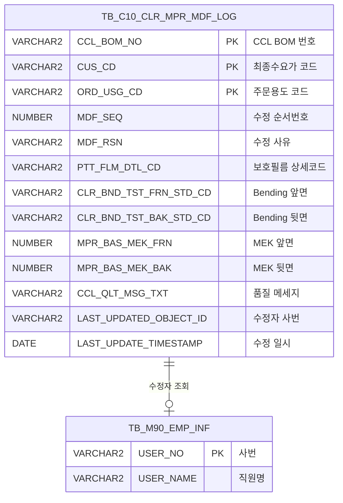

<h1 style="font-size: 40px; text-align: center; font-weight:
   bold; margin: 30px 0;">
  C106000060pop07 레거시 시스템 분석 종합 보고서
</h1>


# 1. 시스템 개요
- **서비스 ID**: C106000060pop07
- **업무명**: CCL-BOM 칼라물성 수정이력 조회 팝업
- **분석 일시**: 2026-03-17 10:22 KST
- **전체 Activity 수**: 2 (Built-in 2개, Custom 0개)
- **분석자**: Claude Opus 4.6 / Sonnet (Phase 4)
- **분석 도구**: /analyze-service C106000060pop07
- **문서 버전**: 1.0

# 비즈니스 프로세스 분석

## 시스템 목적

CCL(Color Coating Line) 공정에서 관리하는 칼라물성(Color Material Property) 데이터의 수정 이력을 조회하는 팝업 화면이다. CCL BOM 번호, 최종수요가 코드, 주문용도 코드를 기준으로 칼라물성 마스터(`TB_C10_CLR_MPR`) 테이블의 변경 내역을 시간순으로 표시한다.

이 팝업은 C106000060(칼라물성 관리) 메인 화면에서 특정 BOM의 물성 변경 추적이 필요할 때 호출된다. 보호필름, UGS필름, Bending(앞/뒤), MEK(앞/뒤), 연필경도(앞/뒤), 색차(앞/뒤), 품질메세지 등 주요 물성 항목의 변경 이력과 수정 사유, 수정자 정보를 제공하여 품질 관리 이력 추적을 지원한다.

## 주요 유즈케이스

### UC-01: 칼라물성 수정이력 조회
- **Actor**: CCL 공정 오퍼레이터 / 품질관리 담당자
- **목적**: 특정 CCL BOM의 칼라물성 변경 이력을 시간순으로 조회하여 변경 사유 및 변경 내용을 확인

- **전제조건**:
  - C106000060 메인 화면에서 팝업이 호출됨
  - CCL_BOM_NO, CUS_CD, ORD_USG_CD 파라미터가 URL로 전달됨
  - 해당 BOM에 대한 수정이력 데이터가 존재함

- **주요 흐름**:
  1. 메인 화면에서 팝업 호출 시 URL 파라미터(ccl_bom_no, cus_cd, ord_usg_cd)가 전달됨
  2. 팝업 로드 완료(onLoadForm + onLoadGrid) 후 `load_find()` 자동 실행
  3. URL 파라미터를 Form 필드에 자동 설정 (CCL_BOM_NO, CUS_CD, ORD_USG_CD)
  4. `C106000060pop07.select` 쿼리 실행하여 `TB_C10_CLR_MPR_MDF_LOG` 테이블에서 수정이력 조회
  5. 수정순서(MDF_SEQ) 기준 정렬된 결과를 Grid에 표시

- **대체 흐름**:
  - 조회 결과 없음: "조회된 데이터가 없습니다" 메시지 표시
  - 사용자가 조건 변경 후 조회 버튼 수동 클릭: 변경된 조건으로 재조회

- **후행조건**:
  - Grid에 수정이력 목록이 표시됨
  - 사용자가 컨텍스트 메뉴로 셀 복사 또는 엑셀 다운로드 가능

### UC-02: 수정이력 셀 복사
- **Actor**: CCL 공정 오퍼레이터 / 품질관리 담당자
- **목적**: 조회된 수정이력의 특정 셀 값을 클립보드에 복사

- **전제조건**:
  - Grid에 수정이력 데이터가 로드되어 있음

- **주요 흐름**:
  1. Grid 셀에서 우클릭하여 컨텍스트 메뉴 표시
  2. "셀 복사" 메뉴 선택
  3. `gridObj.cellToClipboard()` 호출하여 선택 셀 값 클립보드 복사

- **대체 흐름**: 없음

- **후행조건**:
  - 선택한 셀 값이 클립보드에 복사됨

### UC-03: 수정이력 엑셀 다운로드
- **Actor**: CCL 공정 오퍼레이터 / 품질관리 담당자
- **목적**: 조회된 수정이력 전체를 엑셀 파일로 다운로드

- **전제조건**:
  - Grid에 수정이력 데이터가 로드되어 있음

- **주요 흐름**:
  1. Grid에서 우클릭하여 컨텍스트 메뉴 표시
  2. "엑셀 다운로드" 메뉴 선택
  3. `gridexcel` (color 타입) 호출하여 Grid 데이터를 엑셀 파일로 내보내기

- **대체 흐름**: 없음

- **후행조건**:
  - 엑셀 파일이 다운로드됨

---
## 비즈니스 로직 상세

### 1. 수정자 이름 변환 (스칼라 서브쿼리)

- **목적**: 수정이력 테이블의 수정자 ID(사번)를 사람이 읽을 수 있는 이름으로 변환하여 표시
- **처리 케이스**:

  **[케이스 1: 스칼라 서브쿼리를 통한 사번→이름 변환]**
  ```
    조건: TB_C10_CLR_MPR_MDF_LOG.LAST_UPDATED_OBJECT_ID에 사번이 저장되어 있음
    처리:
      1. LAST_UPDATED_OBJECT_ID 값을 M90APUSER.TB_M90_EMP_INF 테이블의 USER_NO와 매칭
      2. 매칭된 레코드의 USER_NAME을 조회하여 LAST_UPDATED_OBJECT_ID 컬럼으로 표시
      3. 매칭 실패 시 NULL 반환
  ```

### 2. 수정 순서 정렬

- **목적**: 칼라물성 수정이력을 수정 순서대로 정렬하여 변경 추적의 시간적 흐름 제공
- **처리 케이스**:

  **[케이스 1: MDF_SEQ 기준 오름차순 정렬]**
  ```
    조건: 동일 BOM + 고객코드 + 용도코드 내 여러 수정이력 존재
    처리:
      1. ORDER BY MDF_SEQ로 수정 순서번호 기준 오름차순 정렬
      2. 가장 오래된 수정 내역부터 최신까지 시간순 표시
  ```

---

# 데이터 요구사항

## 핵심 테이블

### 1. TB_C10_CLR_MPR_MDF_LOG (C10APUSER) - 칼라물성 수정이력 로그
| 컬럼명 | 타입 | PK | 설명 |
|--------|------|----|------|
| CCL_BOM_NO | VARCHAR2 | ✅ | CCL BOM 번호 |
| CUS_CD | VARCHAR2 | ✅ | 최종수요가 코드 |
| ORD_USG_CD | VARCHAR2 | ✅ | 주문용도 코드 |
| MDF_SEQ | NUMBER | | 수정 순서번호 |
| MDF_RSN | VARCHAR2 | | 수정 사유 |
| PTT_FLM_DTL_CD | VARCHAR2 | | 보호필름 상세코드 |
| PTT_FLM_DTL_CD_N | VARCHAR2 | | 구보호필름 상세코드 |
| UNI_GLS_FLM_CD | VARCHAR2 | | UGS필름 코드 |
| CLR_BND_TST_FRN_STD_CD | VARCHAR2 | | Bending 시험 앞면 기준코드 |
| CLR_BND_TST_BAK_STD_CD | VARCHAR2 | | Bending 시험 뒷면 기준코드 |
| MPR_BAS_MEK_FRN | NUMBER | | MEK 앞면 기준값 |
| MPR_BAS_MEK_BAK | NUMBER | | MEK 뒷면 기준값 |
| MPR_BAS_PNCL_HRDN_FRN | NUMBER | | 연필경도 앞면 기준값 |
| MPR_BAS_PNCL_HRDN_BAK | NUMBER | | 연필경도 뒷면 기준값 |
| CLR_DIF_FRN_ULV | NUMBER | | 색차 앞면 상한값 |
| CLR_DIF_BAK_ULV | NUMBER | | 색차 뒷면 상한값 |
| CCL_QLT_MSG_TXT | VARCHAR2 | | 품질 메세지 텍스트 |
| LAST_UPDATED_OBJECT_ID | VARCHAR2 | | 최종 수정자 사번 |
| LAST_UPDATE_TIMESTAMP | DATE | | 최종 수정 일시 |

### 2. TB_M90_EMP_INF (M90APUSER) - 직원 정보
| 컬럼명 | 타입 | PK | 설명 |
|--------|------|----|------|
| USER_NO | VARCHAR2 | ✅ | 사번 |
| USER_NAME | VARCHAR2 | | 직원명 |

## 데이터 플로우

### 1. 조회
```
[칼라물성 수정이력 조회]
팝업 오픈 (URL 파라미터 수신)
→ C106000060pop07.select
  FROM C10APUSER.TB_C10_CLR_MPR_MDF_LOG
  스칼라 서브쿼리: M90APUSER.TB_M90_EMP_INF (USER_NO → USER_NAME 변환)
  WHERE CCL_BOM_NO = :CCL_BOM_NO
    AND CUS_CD = :CUS_CD
    AND ORD_USG_CD = :ORD_USG_CD
  ORDER BY MDF_SEQ
→ Grid에 수정이력 목록 표시
```

## SQL 일람표
| SQL 이름 | 쿼리 ID | 타입 | 출처 | 테이블 |
|---------|---------|------|------|--------|
| 칼라물성 수정이력 조회 | C106000060pop07.select | SELECT | Service | TB_C10_CLR_MPR_MDF_LOG, TB_M90_EMP_INF |

## ER 다이어그램 (핵심 관계)



관계 설명:
- **TB_C10_CLR_MPR_MDF_LOG**가 중심 테이블로 칼라물성 수정이력 데이터를 보유
- **TB_M90_EMP_INF**: LAST_UPDATED_OBJECT_ID → USER_NO 스칼라 서브쿼리로 수정자 이름 변환

---

# 사용자 인터페이스 요구사항

## 화면 레이아웃 상세

### Layout 구조 (절대좌표 기반)
```javascript
// initLayout 없음 - 절대좌표(absolute) 기반 팝업 레이아웃
// 전체 크기: 699px(W) x 350px(H)
{
  components: [
    {
      id: "C106000060pop07_Form_1",
      type: "form",
      position: { left: 0, top: 0 },
      size: { width: 699, height: 30 }
    },
    {
      id: "C106000060pop07_Grid_1",
      type: "grid",
      position: { left: 1, top: 31 },
      size: { width: 696, height: 298 }
    },
    {
      id: "C106000060pop07_messagebox",
      type: "messagebox",
      position: { left: 0, top: 331 },
      size: { width: 697, height: 19 }
    }
  ]
}
```

## 입출력 요소

### Form 컴포넌트
**C106000060pop07_Form_1**
- CCL_BOM_NO: input - CCL BOM 번호 (60px, URL 파라미터로 자동 설정)
- CUS_CD: input - 최종수요가 코드 (60px, URL 파라미터로 자동 설정)
- ORD_USG_CD: input - 용도 코드 (60px, URL 파라미터로 자동 설정)
- find: Button - 조회 → Grid 데이터 로딩
- winClose: Button - 닫기 → 팝업 창 닫기

### Grid 컴포넌트

**C106000060pop07_Grid_1 (칼라물성 수정이력 목록)**
- 편집 가능 여부: 아니오 (전체 읽기 전용)
- Split: 0 (고정 컬럼 없음)
- 추가 헤더: Bending(앞/뒤), MEK(앞/뒤), 연필경도(앞/뒤), 색차(앞/뒤) 헤더 2행 병합 (T/B)
- vertical: true (2행 표시)
- 컨텍스트 메뉴: 셀 복사, 엑셀 다운로드
- 주요 컬럼 (19개):

  **기본 정보**:
  - CCL_BOM_NO: ro - CCL BOM 번호 (8%, 중앙정렬)
  - CUS_CD: ro - 최종수요가 (8%, 중앙정렬)
  - ORD_USG_CD: ro - 용도 (8%, 중앙정렬)
  - MDF_SEQ: ro - 수정순서 Seq (5%, 중앙정렬)
  - MDF_RSN: ro - 수정사유 (21%, 좌측정렬)

  **필름 정보**:
  - PTT_FLM_DTL_CD: ro - 보호필름 (7%, 중앙정렬)
  - PTT_FLM_DTL_CD_N: ro - 구보호필름 (7%, 중앙정렬)
  - UNI_GLS_FLM_CD: ro - UGS필름 (6%, 중앙정렬)

  **물성 시험값 (앞/뒤 쌍)**:
  - CLR_BND_TST_FRN_STD_CD: ro - Bending 앞면(T) (4%, 중앙정렬)
  - CLR_BND_TST_BAK_STD_CD: ro - Bending 뒷면(B) (4%, 중앙정렬, 헤더 #cspan 병합)
  - MPR_BAS_MEK_FRN: ron - MEK 앞면(T) (4%, 중앙정렬)
  - MPR_BAS_MEK_BAK: ron - MEK 뒷면(B) (4%, 중앙정렬, 헤더 #cspan 병합)
  - MPR_BAS_PNCL_HRDN_FRN: ro - 연필경도 앞면(T) (4%, 중앙정렬)
  - MPR_BAS_PNCL_HRDN_BAK: ro - 연필경도 뒷면(B) (4%, 중앙정렬, 헤더 #cspan 병합)
  - CLR_DIF_FRN_ULV: ron - 색차 앞면(T) (4%, 중앙정렬)
  - CLR_DIF_BAK_ULV: ron - 색차 뒷면(B) (4%, 중앙정렬, 헤더 #cspan 병합)

  **기타 정보**:
  - CCL_QLT_MSG_TXT: ro - 품질메세지 (20%, 좌측정렬)
  - LAST_UPDATED_OBJECT_ID: ro - 수정자 (10%, 중앙정렬, 사번→이름 변환 표시)
  - LAST_UPDATE_TIMESTAMP: ro - 수정일자 (18%, 중앙정렬)

## 화면 동작 흐름

### 1. 팝업 오픈 및 자동 조회
```
1. 메인 화면(C106000060)에서 팝업 호출 (URL 파라미터: ccl_bom_no, cus_cd, ord_usg_cd)
2. JSP 로딩 → Form/Grid 컴포넌트 초기화
3. onLoadForm() 콜백 → loadForm_yn = 'Y' 설정, load_find() 호출
4. onLoadGrid() 콜백 → loadGrid_yn = 'Y' 설정, load_find() 호출
5. load_find(): loadForm_yn == 'Y' && loadGrid_yn == 'Y' 확인
6. request.getParameter()로 URL 파라미터 추출
7. Form 필드에 값 자동 설정 (CCL_BOM_NO, CUS_CD, ORD_USG_CD)
8. uiCommon.parameters() → Grid 조회 자동 실행
9. findMessage()로 messagebox에 처리 결과 표시
```

### 2. 수동 재조회
```
1. 사용자가 Form 필드 값 변경 (CCL_BOM_NO, CUS_CD, ORD_USG_CD)
2. 조회 버튼 클릭
3. find(eventName, formDivObj, referenceItem) 호출
4. uiCommon.parameters()로 파라미터 구성
5. items[referenceItem].loadData(findUrl) 호출
6. C106000060pop07-service → 분기 → 조회 Activity 실행
7. C106000060pop07.select 쿼리 실행
8. Grid 데이터 바인딩 및 messagebox에 결과 메시지 표시
```

### 3. 컨텍스트 메뉴 사용
```
1. Grid 셀에서 우클릭
2. 컨텍스트 메뉴 표시 (copy_row, excel_grid)
3-a. "셀 복사" 선택 → gridObj.cellToClipboard() 실행
3-b. "엑셀 다운로드" 선택 → gridexcel(color 타입) 실행
```

## JavaScript 모듈

**C106000060pop07.jsp** (인라인 스크립트)
- find(eventName, formDivObj, referenceItem): 조회 실행 (uiCommon.parameters로 파라미터 구성 → Grid loadData)
- onLoadForm(): Form 로드 완료 콜백 (loadForm_yn 플래그 설정 → load_find 호출)
- onLoadGrid(): Grid 로드 완료 콜백 (loadGrid_yn 플래그 설정 → load_find 호출)
- load_find(): Form/Grid 모두 로드 완료 시 URL 파라미터를 Form에 설정 후 자동 조회 실행
- findMessage(referenceItem): 처리 결과 메시지를 messagebox에 표시 (uiCommon.message 호출)
- onGridContextMenuClick(id, gridObj, menuObj): 컨텍스트 메뉴 이벤트 처리 (copy_row → cellToClipboard, excel_grid → gridexcel)

## 주요 이벤트 핸들러

**find (조회 버튼 클릭)**
- 이벤트 타입: Button Click
- 처리 내용:
  1. formDivObj에서 파라미터 구성 (uiCommon.parameters)
  2. referenceItem(Grid)의 loadData 호출
  3. findMessage로 결과 메시지 표시

**onGridContextMenuClick (Grid 컨텍스트 메뉴)**
- 이벤트 타입: Context Menu Click
- 처리 내용:
  1. 메뉴 ID 분기 (copy_row / excel_grid)
  2. copy_row: gridObj.cellToClipboard() 실행
  3. excel_grid: gridexcel(color 타입) 실행으로 엑셀 내보내기

---

# 특이사항 및 주의사항

## 1. 크로스 스키마 조회
- **C10APUSER 스키마 직접 참조**: 쿼리에서 `C10APUSER.TB_C10_CLR_MPR_MDF_LOG`로 스키마를 명시적으로 지정하여 조회. DAO가 `mesdao` (MESAPUSER)이지만 C10APUSER 스키마의 테이블을 직접 참조하는 패턴으로, 스키마 간 권한 설정이 전제됨
- **M90APUSER 스키마 참조**: 수정자 이름 변환을 위해 `M90APUSER.TB_M90_EMP_INF` 테이블을 스칼라 서브쿼리로 참조

## 2. 팝업 자동 로딩 패턴
- **이중 플래그 체크**: `loadForm_yn`과 `loadGrid_yn` 두 플래그를 모두 확인하여 Form과 Grid가 모두 로드 완료된 후에만 자동 조회 실행. DHTMLX 컴포넌트의 비동기 로딩 타이밍 이슈를 방지하기 위한 패턴

## 3. Grid 2행 표시 (vertical)
- **rowCnt: "2"** + **vertical: "true"** 설정으로 Grid가 2행 형태로 데이터를 표시. 19개 컬럼을 한 화면(699px 폭)에 표시하기 위해 수직 2행 분할 레이아웃을 사용하는 비표준 패턴

## 4. 물성 시험값 앞/뒤 헤더 병합
- Bending, MEK, 연필경도, 색차 4개 물성 항목이 각각 앞면(T)/뒷면(B) 2개 컬럼으로 구성되며, 추가 헤더 행으로 #cspan 병합 처리. 헤더가 2행 구조로 되어 있어 상단 행은 물성명, 하단 행은 T(앞)/B(뒤) 표시

## 5. Oracle 힌트 주석에 작성자 정보 포함
- SQL 쿼리의 힌트 주석에 `/*+ C10 칼라물성 수정이력 popup조회 C106000060pop07.SELECT 성낙원*/` 형태로 작성자명(성낙원)이 포함됨. 실질적 힌트가 아닌 주석 용도로 사용

---

# 참고 문서

- **Service XML**: `src/service/C106000060pop07-service.xml`
- **Query SQL**: `src/query/C106000060pop07-query.glue_sql`
- **JSP**: `WebContents/C106000060pop07.jsp`
- **UI XML**: `WebContents/header/kr/C106000060pop07/C106000060pop07_Form_1.xml`, `C106000060pop07_Grid_1.xml`, `C106000060pop07_messagebox.xml`
