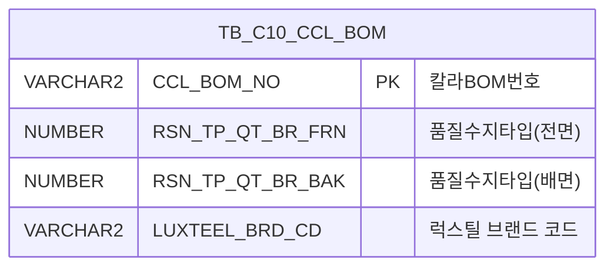

<h1 style="font-size: 40px; text-align: center; font-weight:
   bold; margin: 30px 0;">
  C106000060pop08 레거시 시스템 분석 종합 보고서
</h1>


# 1. 시스템 개요
- **서비스 ID**: C106000060pop08
- **업무명**: CCL-BOM 품질수지타입/Brand 선택 팝업
- **분석 일시**: 2026-03-17 10:24 (KST)
- **전체 Activity 수**: 2개 (Built-in 2개)
- **분석자**: Claude Opus 4.6 / Claude Sonnet 4.6
- **분석 도구**: /analyze-service C106000060pop08
- **문서 버전**: 1.0

# 📊 비즈니스 프로세스 분석

## 시스템 목적

CCL(Color Coated Line) 공정의 작업지시 화면(C106000060)에서 호출되는 팝업 화면으로, 특정 CCL BOM 번호에 대한 **품질수지타입(전면/배면)** 및 **럭스틸 Brand 코드**를 조회하고 선택하는 기능을 제공한다.

오퍼레이터는 이 팝업을 통해 BOM에 설정된 추천값(AI 자동배정값)을 확인하고, 필요 시 직접 선정값을 콤보박스에서 선택하여 부모 화면에 적용할 수 있다. 품질수지타입은 코일 전면(T)과 배면(B)을 각각 별도로 관리하며, 럭스틸 브랜드 코드와 함께 CCL BOM의 품질 특성을 결정하는 핵심 파라미터이다.

## 주요 유즈케이스

### UC-01: BOM 품질수지 정보 조회
- **Actor**: CCL 공정 오퍼레이터
- **목적**: 특정 CCL BOM의 품질수지타입(전면/배면) 및 럭스틸 브랜드 코드 현재값을 확인

- **전제조건**:
  - 부모 화면(C106000060)에서 CCL BOM 번호가 선택되어 있음
  - 팝업 호출 시 CCL_BOM_NO 파라미터가 전달됨

- **주요 흐름**:
  1. 부모 화면에서 팝업 호출 시 CCL_BOM_NO, rsn_tp_qt_br_frn 등 파라미터 전달
  2. 팝업 로딩 시 Form_2의 콤보박스 마스터 코드 초기화 (SZ0000/RSN_TP_QT_BR, SZ0000/LUXTEEL_BRD_CD)
  3. C106000060pop08.select 쿼리 실행 → TB_C10_CCL_BOM에서 RSN_TP_QT_BR_FRN, RSN_TP_QT_BR_BAK, LUXTEEL_BRD_CD 조회
  4. 조회 결과를 Form_2의 추천값(읽기전용 input) 및 선정값(콤보박스)에 바인딩

- **대체 흐름**:
  - 조회 결과 없음: BOM에 해당 정보가 미등록된 상태로 빈 값 표시
  - CCL_BOM_NO 미전달: 조회 실패, 빈 폼 표시

- **후행조건**:
  - 품질수지 정보가 폼에 표시됨
  - 오퍼레이터가 선정값 변경 또는 적용 가능한 상태

### UC-02: 품질수지타입/Brand 선정값 적용
- **Actor**: CCL 공정 오퍼레이터
- **목적**: 추천값 또는 직접 선택한 선정값을 부모 화면에 반영

- **전제조건**:
  - 팝업에 품질수지 정보가 조회되어 있음
  - 라디오 버튼으로 추천/선정 구분이 선택됨

- **주요 흐름**:
  1. 추천(A)/선정(B) 라디오 버튼 선택 (기본값: 선정 B)
  2. 선정(B) 선택 시 콤보박스에서 품질수지타입(T), 품질수지타입(B), Brand 값 선택
  3. "적용하기" 버튼 클릭
  4. parentSetValue 이벤트 핸들러가 Form_2 값을 부모 창의 popSetValue10 함수로 전달
     - RSN_TP_QT_BR_FRN_CB → 부모 파라미터 인덱스 1
     - RSN_TP_QT_BR_BAK_CB → 부모 파라미터 인덱스 2
     - LUXTEEL_BRD_CD_CB → 부모 파라미터 인덱스 5
  5. 팝업 창 자동 닫기

- **대체 흐름**:
  - "닫기" 버튼 클릭: 값 변경 없이 팝업 종료
  - 콤보 미선택 상태에서 적용: 빈 값이 부모에 전달됨

- **후행조건**:
  - 부모 화면의 해당 필드에 선택값이 반영됨
  - 팝업 창이 닫힘

### UC-03: 팝업 닫기
- **Actor**: CCL 공정 오퍼레이터
- **목적**: 값 변경 없이 팝업을 종료

- **전제조건**:
  - 팝업이 열려 있음

- **주요 흐름**:
  1. "닫기" 버튼 클릭
  2. winClose 이벤트 핸들러 실행
  3. 팝업 창 닫기

- **대체 흐름**: 없음

- **후행조건**:
  - 부모 화면 값 변경 없음
  - 팝업 창이 닫힘

---

# 💾 데이터 요구사항

## 핵심 테이블

### 1. TB_C10_CCL_BOM - (CCL 칼라 BOM 마스터)
| 컬럼명 | 타입 | PK | 설명 |
|--------|------|----|------|
| CCL_BOM_NO | VARCHAR2 | ✅ | 칼라BOM번호 (PK) |
| RSN_TP_QT_BR_FRN | NUMBER | | 품질수지타입(전면) - 코일 전면 수지 불순물 함유도 |
| RSN_TP_QT_BR_BAK | NUMBER | | 품질수지타입(배면) - 코일 배면 수지 불순물 함유도 |
| LUXTEEL_BRD_CD | VARCHAR2 | | 럭스틸 브랜드 코드 |

## 데이터 플로우

### 1. 조회

```
[팝업 로딩 시 BOM 품질수지 정보 조회]
팝업 진입 (CCL_BOM_NO 파라미터 수신)
→ C106000060pop08.select
  FROM TB_C10_CCL_BOM
  WHERE CCL_BOM_NO = :CCL_BOM_NO
→ Form_2에 RSN_TP_QT_BR_FRN, RSN_TP_QT_BR_BAK, LUXTEEL_BRD_CD 표시

[적용 시 부모 화면 전달]
"적용하기" 버튼 클릭
→ Form_2의 콤보 선택값을 부모 창 popSetValue10 함수로 전달
  - RSN_TP_QT_BR_FRN_CB → 파라미터 1
  - RSN_TP_QT_BR_BAK_CB → 파라미터 2
  - LUXTEEL_BRD_CD_CB → 파라미터 5
→ 팝업 닫기
```

## SQL 일람표
| SQL 이름 | 쿼리 ID | 타입 | 출처 | 테이블 |
|---------|---------|-----|-------|-------|
| 품질수지 조회 | C106000060pop08.select | SELECT | Service | TB_C10_CCL_BOM |

## ER 다이어그램 (핵심 관계)



관계 설명:
- TB_C10_CCL_BOM이 유일한 참조 테이블로, CCL_BOM_NO(PK)를 기준으로 단건 조회
- 부모 화면(C106000060)에서 CCL_BOM_NO를 전달받아 품질수지 정보를 조회하는 단순 1:1 관계

---

# 🖥️ 사용자 인터페이스 요구사항

## 화면 레이아웃 상세

### Layout 구조 (Absolute 배치)
```javascript
{
  itemType: "absolute",  // 절대 좌표 배치 (팝업 전용)
  totalSize: { width: 615, height: 180 },
  components: [
    {
      id: "C106000060pop08_Form_1",
      type: "form",
      position: { left: 0, top: 0, width: 615, height: 30 },
      purpose: "버튼 바 (적용하기, 닫기)"
    },
    {
      id: "C106000060pop08_Form_2",
      type: "form",
      position: { left: 1, top: 31, width: 615, height: 130 },
      purpose: "품질수지타입/Brand 선택 폼"
    },
    {
      id: "C106000060pop08_messagebox",
      type: "messagebox",
      position: { left: 0, top: 161, width: 615, height: 19 },
      purpose: "상태 메시지 표시"
    }
  ]
}
```

## 입출력 요소

### Form 컴포넌트

**C106000060pop08_Form_1 (버튼 바)**
- parentSetValue: custombutton - "적용하기" → 선택값을 부모 화면에 전달 후 팝업 닫기
- winClose: button - "닫기" → 팝업 창 닫기

**C106000060pop08_Form_2 (품질수지타입/Brand 선택)**

3행 구조 (컬럼 헤더 + 추천값 행 + 선정값 행):

  **1행 - 컬럼 헤더 라벨**:
  - RSN_TP_QT_BR_FRN: label - "품질수지타입(T)"
  - RSN_TP_QT_BR_BAK: label - "품질수지타입(B)"
  - LUXTEEL_BRD_CD: label - "Brand"

  **2행 - 추천값 (radio=A + 읽기전용 input)**:
  - RSN_TP_QT_BR_FRN_KND_TP: radio - "추천" (value=A, label-right)
  - RSN_TP_QT_BR_FRN_AI: input - 품질수지타입(전면) 추천값 (150px, readonly)
  - RSN_TP_QT_BR_BAK_KND_TP: radio - (value=A, label-right)
  - RSN_TP_QT_BR_BAK_AI: input - 품질수지타입(배면) 추천값 (150px, readonly)
  - LUXTEEL_BRD_CD_KND_TP: radio - (value=A, label-right)
  - LUXTEEL_BRD_CD_AI: input - 럭스틸 브랜드 추천값 (150px, readonly)

  **3행 - 선정값 (radio=B, 기본선택 + combo)**:
  - RSN_TP_QT_BR_FRN_KND_TP: radio - "선정" (value=B, checked, label-right)
  - RSN_TP_QT_BR_FRN_CB: combo - 품질수지타입(전면) 선택 (150px, 마스터코드: SZ0000/RSN_TP_QT_BR, readonly)
  - RSN_TP_QT_BR_BAK_KND_TP: radio - (value=B, checked, label-right)
  - RSN_TP_QT_BR_BAK_CB: combo - 품질수지타입(배면) 선택 (150px, 마스터코드: SZ0000/RSN_TP_QT_BR, readonly)
  - LUXTEEL_BRD_CD_KND_TP: radio - (value=B, checked, label-right)
  - LUXTEEL_BRD_CD_CB: combo - 럭스틸 브랜드 선택 (150px, 마스터코드: SZ0000/LUXTEEL_BRD_CD, readonly)

### Grid 컴포넌트 (미사용)

**C106000060pop08_Grid_1 (참조용 - pageConfiguration 미등록)**
- 편집 가능 여부: 아니오 (읽기 전용)
- 뷰 참조: VI_M00_C10A1091
- 비고: XML 파일은 존재하나 pageConfiguration에 등록되지 않아 화면에 표시되지 않음 (구버전 참조 또는 미사용)
- 주요 컬럼 (8개):
  - PRT_ROLL_NO: ro - ROLL NO (15%, 중앙정렬)
  - RPV_CLR_NM: ro - 대표색상 (15%, 중앙정렬)
  - PRC_CD: ro - 적용라인 (10%, 중앙정렬)
  - PTN_NM: ro - PATTERN 명 (*, 중앙정렬)
  - PRT_PTN_CD: ro - 프린트패턴코드 (12%, 중앙정렬)
  - PRT_ROLL_PTN_CD: ro - 롤패턴코드 (12%, 중앙정렬)
  - PRT_ROLL_PTN_NM: ro - 원단위 (10%, 중앙정렬)
  - PRT_ROLL_WHS_DD: ro - 롤입고일자 (13%, 중앙정렬)

## 화면 동작 흐름

### 1. 화면 초기 로딩
```
1. 부모 화면(C106000060)에서 팝업 호출
   - 전달 파라미터: CCL_BOM_NO, rsn_tp_qt_br_frn, rowId, cellIndex, targetDivId
2. 절대좌표 레이아웃 초기화 (615x180)
3. Form_1 로드 (버튼 바)
4. Form_2 로드 → onFormLoadFunction 이벤트 발생
   - RSN_TP_QT_BR_FRN_CB 콤보 초기화 (SZ0000/RSN_TP_QT_BR)
   - RSN_TP_QT_BR_BAK_CB 콤보 초기화 (SZ0000/RSN_TP_QT_BR)
   - LUXTEEL_BRD_CD_CB 콤보 초기화 (SZ0000/LUXTEEL_BRD_CD)
5. C106000060pop08.select 쿼리 실행 (find)
   - TB_C10_CCL_BOM에서 CCL_BOM_NO 기준 조회
6. 조회 결과를 추천값(input) 및 선정값(combo)에 바인딩
7. 라디오 버튼 기본 선택: "선정"(B)
```

### 2. 적용하기 (부모 화면 값 전달)
```
1. 오퍼레이터가 추천(A)/선정(B) 라디오 선택
2. 선정(B) 선택 시 각 콤보박스에서 원하는 값 선택
3. "적용하기" 버튼 클릭
4. parentSetValue 이벤트 핸들러 실행
   - Form_2에서 RSN_TP_QT_BR_FRN_CB, RSN_TP_QT_BR_BAK_CB, LUXTEEL_BRD_CD_CB 값 추출
   - 부모 창의 popSetValue10 함수 호출 (파라미터 인덱스 1, 2, 5)
5. 팝업 창 닫기
```

### 3. 닫기 (값 미적용)
```
1. "닫기" 버튼 클릭
2. winClose 이벤트 핸들러 실행
3. 팝업 창 닫기 (부모 화면 값 변경 없음)
```

## JavaScript 모듈

**C106000060pop08.jsp (팝업 화면 내장 스크립트)**
- onFormLoadFunction(): Form_2 로드 완료 후 콤보박스 마스터코드 초기화
- parentSetValue(): 적용하기 버튼 클릭 → Form_2 콤보 선택값을 부모 창 popSetValue10으로 전달 후 팝업 닫기
- winClose(): 닫기 버튼 클릭 → 팝업 창 닫기
- onGridContextMenuClick(): 그리드 컨텍스트 메뉴 (copy_row: 셀 클립보드 복사, excel_grid: 엑셀 다운로드)

## 주요 이벤트 핸들러

**onFormLoadFunction (Form_2 로드 완료)**
- 이벤트 타입: onXLEEvent
- 처리 내용:
  1. RSN_TP_QT_BR_FRN_CB 콤보 → SZ0000/RSN_TP_QT_BR 마스터코드 로드
  2. RSN_TP_QT_BR_BAK_CB 콤보 → SZ0000/RSN_TP_QT_BR 마스터코드 로드
  3. LUXTEEL_BRD_CD_CB 콤보 → SZ0000/LUXTEEL_BRD_CD 마스터코드 로드

**parentSetValue (적용하기 버튼)**
- 이벤트 타입: custombutton click
- 처리 내용:
  1. Form_2에서 콤보 선택값 추출 (RSN_TP_QT_BR_FRN_CB, RSN_TP_QT_BR_BAK_CB, LUXTEEL_BRD_CD_CB)
  2. 부모 창의 popSetValue10 함수 호출 (인덱스 1, 2, 5로 매핑)
  3. 팝업 창 닫기

**winClose (닫기 버튼)**
- 이벤트 타입: button click
- 처리 내용:
  1. 팝업 창 닫기 (값 전달 없음)

**onGridContextMenuClick (그리드 컨텍스트 메뉴)**
- 이벤트 타입: contextMenuClick
- 처리 내용:
  1. copy_row: 선택 셀 클립보드 복사
  2. excel_grid: 그리드 엑셀 다운로드

---

# 📌 특이사항 및 주의사항

## 1. 추천/선정 라디오 이중 구조
- **추천(A)/선정(B) 분리 패턴**: 각 필드(전면 수지, 배면 수지, 브랜드)마다 추천값(AI 자동배정, 읽기전용)과 선정값(오퍼레이터 수동 선택, 콤보)을 별도 행으로 구성. 라디오 버튼으로 추천/선정을 전환하는 UI 패턴이 적용됨
- **기본값 선정(B)**: 라디오 기본 선택이 "선정"(B)으로 설정되어, 오퍼레이터가 직접 선택하는 것을 기본 동작으로 유도

## 2. 미사용 Grid 컴포넌트 잔존
- **Grid_1 XML 존재하나 미등록**: `C106000060pop08_Grid_1.xml`이 파일로 존재하지만 JSP의 pageConfiguration에 등록되지 않아 실제 화면에 표시되지 않음. VI_M00_C10A1091 뷰를 참조하는 프린트 롤 정보 그리드로, 이전 버전에서 사용되었거나 향후 사용 예정인 것으로 추정
- 현대화 시 해당 Grid 컴포넌트의 필요 여부 확인 필요

## 3. 부모-팝업 간 값 전달 비대칭 매핑
- **파라미터 인덱스 비연속**: parentSetValue에서 부모 창 popSetValue10으로 값 전달 시 인덱스가 1, 2, 5로 비연속적으로 매핑됨 (3, 4 인덱스 누락). 이는 부모 화면에서 다른 팝업(pop09 등)이 나머지 인덱스를 사용하거나, 과거 필드 삭제로 인한 잔여 매핑일 수 있음
- 부모 화면 popSetValue10 함수와의 인덱스 정합성 확인 필요

## 4. 콤보박스 readonly 속성
- **선정값 콤보가 readonly**: Form_2의 선정값 콤보박스(RSN_TP_QT_BR_FRN_CB, RSN_TP_QT_BR_BAK_CB, LUXTEEL_BRD_CD_CB)에 readonly 속성이 설정되어 있음. 실제 선택 가능 여부는 런타임 JavaScript에서 readonly 해제 여부에 따라 결정됨

## 5. 요청 파라미터 미활용 가능성
- **rowId, cellIndex, targetDivId**: 팝업 호출 시 전달받는 파라미터 중 rowId, cellIndex, targetDivId는 부모 화면에서의 호출 위치를 구분하기 위한 것이나, 팝업 내부 로직에서의 활용 여부가 불분명

---

# 📚 참고 문서

- **Query SQL**: `src/query/C106000060pop08-query.glue_sql`
- **Service XML**: `src/service/C106000060pop08-service.xml`
- **JSP**: `WebContents/C106000060pop08.jsp`
- **UI XML**:
  - `WebContents/header/kr/C106000060pop08/C106000060pop08_Form_1.xml`
  - `WebContents/header/kr/C106000060pop08/C106000060pop08_Form_2.xml`
  - `WebContents/header/kr/C106000060pop08/C106000060pop08_Grid_1.xml` (미사용)
  - `WebContents/header/kr/C106000060pop08/C106000060pop08_messagebox.xml`
