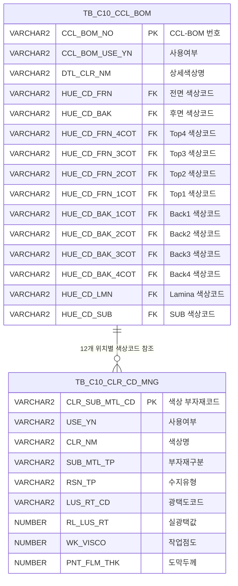

<h1 style="font-size: 40px; text-align: center; font-weight:
   bold; margin: 30px 0;">
  C106000065 레거시 시스템 분석 종합 보고서
</h1>


# 1. 시스템 개요
- **서비스 ID**: C106000065
- **업무명**: CCL-BOM & 칼라코드 조회
- **분석 일시**: 2026-03-17 (KST)
- **전체 Activity 수**: 3개 (Built-in 3개, Custom 0개)
- **분석자**: Claude Opus 4.6 / Sonnet (Phase별)
- **분석 도구**: /analyze-service C106000065
- **문서 버전**: 1.0

# 📊 비즈니스 프로세스 분석

## 시스템 목적

CCL(Color Coated Line, 칼라강판 도장라인) 공정에서 사용하는 BOM(Bill of Materials) 정보와 각 도장 위치별 칼라코드(색상코드) 상세 규격을 조회하는 화면이다. CCL 공정에서는 강판의 전면/후면에 다단계 코팅(Top4~Top1, Back1~Back4)과 라미나(Lamina), SUB 코팅을 적용하며, 각 위치에 사용되는 도료의 색상·광택·점도·도막두께 등의 규격 정보를 관리한다.

이 화면은 읽기 전용 조회 화면으로, 상위 Grid에서 CCL-BOM 번호별 12개 도장 위치의 색상코드를 가로 방향으로 한눈에 파악하고, 특정 BOM을 선택하면 하위 Grid에서 각 위치별 도료 상세 규격(부자재구분, 수지유형, 광택도, 작업점도, 도막두께, Lamina/보호필름 정보 등)을 세로 방향 목록으로 확인할 수 있다.

## 주요 유즈케이스

### UC-01: CCL-BOM 및 칼라코드 목록 조회
- **Actor**: CCL 공정 오퍼레이터 / 품질관리 담당자
- **목적**: CCL-BOM 번호, 사용여부, 칼라코드 조건으로 BOM별 12개 도장 위치의 색상코드를 조회하여 도장 사양을 확인

- **전제조건**:
  - 사용자가 시스템에 로그인되어 있음
  - TB_C10_CCL_BOM 테이블에 BOM 데이터가 등록되어 있음

- **주요 흐름**:
  1. 사용자가 검색 조건 입력 — CCL-BOM번호(전방일치), 사용여부(전체/Y/N), 칼라코드(전방일치), 사용여부(전체/Y/N)
  2. 조회 버튼 클릭
  3. 시스템이 `C106000065_Grid1.select` 쿼리 실행 — TB_C10_CCL_BOM과 TB_C10_CLR_CD_MNG 12회 LEFT JOIN
  4. Grid_1에 CCL-BOM 목록 표시 (BOM번호, 사용여부, 상세색상, 전면~SUB까지 12개 위치별 색상코드 및 사용여부)

- **대체 흐름**:
  - 조회 결과 없음: "조회된 데이터가 없습니다" 메시지 표시
  - 칼라코드 조건 입력 시: 12개 위치 중 하나라도 매칭되는 BOM만 필터링

- **후행조건**:
  - Grid_1에 조회된 BOM 목록 표시
  - 사용자가 특정 BOM 행을 선택하여 상세 조회 가능

### UC-02: 칼라코드 상세 규격 조회
- **Actor**: CCL 공정 오퍼레이터 / 품질관리 담당자
- **목적**: 특정 CCL-BOM의 12개 도장 위치별 도료 상세 규격(광택도, 점도, 도막두께, Lamina, 보호필름 등)을 확인

- **전제조건**:
  - UC-01에서 Grid_1에 데이터가 조회되어 있음

- **주요 흐름**:
  1. 사용자가 Grid_1에서 특정 BOM 행 선택 (클릭)
  2. 시스템이 선택 행에서 12개 색상코드 파라미터 추출 (HUE_CD_FRN, HUE_CD_BAK, HUE_CD_FRN_4COT ~ HUE_CD_SUB)
  3. `C106000065_Grid2.select` 쿼리 실행 — WITH CTE로 12개 위치별 TB_C10_CLR_CD_MNG 조회 + DUAL UNION ALL
  4. Grid_2에 12행(전면/후면/Top4~Top1/Back1~Back4/Lamina/SUB) 상세 규격 표시

- **대체 흐름**:
  - 특정 위치에 색상코드가 없는 경우: DUAL의 NULL 행으로 해당 위치 빈 행 표시 (항상 12행 보장)

- **후행조건**:
  - Grid_2에 선택된 BOM의 12개 도장 위치별 상세 규격 표시

### UC-03: 컨텍스트 메뉴 활용
- **Actor**: CCL 공정 오퍼레이터
- **목적**: Grid 데이터에 대한 부가 기능(컬럼이동, 필터, 엑셀출력, 행복사) 활용

- **전제조건**:
  - Grid에 데이터가 조회되어 있음

- **주요 흐름**:
  1. 사용자가 Grid에서 마우스 우클릭
  2. 컨텍스트 메뉴 표시 (컬럼이동, 필터, 편집, 엑셀출력, 행복사)
  3. 원하는 메뉴 항목 선택
  4. 해당 기능 실행

- **대체 흐름**:
  - 엑셀출력 시: Grid 데이터를 엑셀 파일로 다운로드

- **후행조건**:
  - 선택한 기능에 따른 결과 반영

---
## 비즈니스 로직 상세

### 1. 12개 도장 위치별 색상코드 가로 전개 (Grid1 쿼리)

- **목적**: CCL-BOM 마스터에 등록된 12개 도장 위치의 색상코드를 하나의 행으로 가로 전개하여 한눈에 비교 가능하게 표시
- **처리 케이스**:

  **[케이스 1: 12회 LEFT OUTER JOIN 가로 전개]**
  ```
    조건: TB_C10_CCL_BOM의 각 색상코드 컬럼(hue_cd_frn, hue_cd_bak, hue_cd_frn_4cot, ... hue_cd_sub)
    처리:
      1. TB_C10_CCL_BOM(a) 메인 테이블에서 BOM 기본 정보 조회
      2. 각 색상 위치별로 TB_C10_CLR_CD_MNG(b1~b12)와 Oracle (+) 외부조인
         - b1: 전면(hue_cd_frn), b2: 후면(hue_cd_bak)
         - b3: Top4(hue_cd_frn_4cot), b4: Top3(hue_cd_frn_3cot)
         - b5: Top2(hue_cd_frn_2cot), b6: Top1(hue_cd_frn_1cot)
         - b7: Back1(hue_cd_bak_1cot), b8: Back2(hue_cd_bak_2cot)
         - b9: Back3(hue_cd_bak_3cot), b10: Back4(hue_cd_bak_4cot)
         - b11: Lamina(hue_cd_lmn), b12: SUB(hue_cd_sub)
      3. 각 조인에서 clr_sub_mtl_cd(색상코드)와 use_yn(사용여부) 추출
      4. CCL_BOM_NO 기준 정렬
  ```

  **[케이스 2: 칼라코드 조건 필터링]**
  ```
    조건: CLR_CD 파라미터가 입력됨
    처리:
      1. 12개 위치(b1~b12) 모두에 대해 clr_sub_mtl_cd LIKE :CLR_CD||'%' 조건 적용
      2. 12개 위치 중 하나라도 매칭되면 해당 BOM 표시
      3. CLR_USE_YN 조건도 12개 위치 모두에 use_yn LIKE :CLR_USE_YN 적용
  ```

### 2. 칼라코드 상세 규격 세로 전개 + FUNC_DECODE 코드 변환 (Grid2 쿼리)

- **목적**: 선택된 BOM의 12개 도장 위치별 도료 상세 규격을 세로 방향 목록으로 표시하며, 코드값을 사람이 읽을 수 있는 명칭으로 변환
- **처리 케이스**:

  **[케이스 1: WITH CTE + UNION ALL 세로 전개]**
  ```
    조건: Grid1에서 선택된 BOM의 12개 색상코드 파라미터(P_HUE_CD_FRN ~ P_HUE_CD_SUB) 전달
    처리:
      1. WITH 절(CTE)에서 12개 색상 위치 각각에 대해 별도 SELECT 실행
      2. 각 SELECT는 TB_C10_CLR_CD_MNG에서 PK(clr_sub_mtl_cd) 조회
      3. 데이터가 없는 위치는 DUAL에서 NULL 행 생성 → UNION ALL
      4. seq + clr_loc(위치명) 기준 GROUP BY → MAX 집계로 실제값 우선 표시
      5. 항상 12행 결과 보장 (seq: 1=전면, 2=후면, 3=Top4, ..., 12=SUB)
  ```

  **[케이스 2: FUNC_DECODE 스칼라 함수 코드 변환]**
  ```
    조건: 코드성 컬럼 표시 시
    처리:
      1. MESAPUSER.FUNC_DECODE 함수 호출하여 코드→명칭 변환
      2. 변환 대상 컬럼:
         - sub_mtl_tp: 부자재구분 코드 → 명칭
         - rsn_tp: 수지유형 코드 → 명칭
         - lus_rt_cd: 광택도 코드 → 명칭
         - prt_ink_tp: 잉크타입 코드 → 명칭
         - lmn_knd_tp: Lamina유형 코드 → 명칭
         - lmn_flm_thk_cd: Lamina두께 코드 → 명칭
         - ptt_flm_lus_rt_cd: 보호필름광택 코드 → 명칭
         - ptt_flm_thk_cd: 보호필름두께 코드 → 명칭
         - ptt_flm_mql_cd: 보호필름재질 코드 → 명칭
         - ptt_flm_sus_adh_cd: 보호필름SUS점착 코드 → 명칭
         - ptt_flm_prd_adh_cd: 보호필름제품점착 코드 → 명칭
  ```

---

# 💾 데이터 요구사항

## 핵심 테이블

### 1. TB_C10_CCL_BOM - CCL-BOM 마스터
| 컬럼명 | 타입 | PK | 설명 |
|--------|------|----|------|
| CCL_BOM_NO | VARCHAR2 | ✅ | CCL-BOM 번호 |
| CCL_BOM_USE_YN | VARCHAR2 | | 사용여부 (Y/N) |
| DTL_CLR_NM | VARCHAR2 | | 상세색상명 |
| HUE_CD_FRN | VARCHAR2 | | 전면 색상코드 |
| HUE_CD_BAK | VARCHAR2 | | 후면 색상코드 |
| HUE_CD_FRN_4COT | VARCHAR2 | | Top4 색상코드 |
| HUE_CD_FRN_3COT | VARCHAR2 | | Top3 색상코드 |
| HUE_CD_FRN_2COT | VARCHAR2 | | Top2 색상코드 |
| HUE_CD_FRN_1COT | VARCHAR2 | | Top1 색상코드 |
| HUE_CD_BAK_1COT | VARCHAR2 | | Back1 색상코드 |
| HUE_CD_BAK_2COT | VARCHAR2 | | Back2 색상코드 |
| HUE_CD_BAK_3COT | VARCHAR2 | | Back3 색상코드 |
| HUE_CD_BAK_4COT | VARCHAR2 | | Back4 색상코드 |
| HUE_CD_LMN | VARCHAR2 | | Lamina 색상코드 |
| HUE_CD_SUB | VARCHAR2 | | SUB 색상코드 |

### 2. TB_C10_CLR_CD_MNG - 칼라코드 관리
| 컬럼명 | 타입 | PK | 설명 |
|--------|------|----|------|
| CLR_SUB_MTL_CD | VARCHAR2 | ✅ | 색상 부자재코드 (=칼라코드) |
| USE_YN | VARCHAR2 | | 사용여부 |
| CLR_NM | VARCHAR2 | | 색상명 |
| SUB_MTL_TP | VARCHAR2 | | 부자재구분 코드 |
| RSN_TP | VARCHAR2 | | 수지유형 코드 |
| LUS_RT_CD | VARCHAR2 | | 광택도 코드 |
| RL_LUS_RT | NUMBER | | 실광택값 |
| LUS_RT_LLV | NUMBER | | 광택도 하한값 |
| LUS_RT_ULV | NUMBER | | 광택도 상한값 |
| TP_CD | VARCHAR2 | | Type 구분 |
| WK_VISCO | NUMBER | | 작업점도 |
| PNT_FLM_THK | NUMBER | | 도막두께 |
| PRT_INK_TP | VARCHAR2 | | Ink type 코드 |
| NV | NUMBER | | 고형분(NV) |
| PNT_GRA | VARCHAR2 | | 도료비중 |
| SLV_GRA | VARCHAR2 | | 용제비중 |
| THR_CD | VARCHAR2 | | 신나코드 |
| PNT_UNT | VARCHAR2 | | 도료원단위 |
| PMT | NUMBER | | PMT |
| QT_L | NUMBER | | L값 (색차) |
| QT_A | NUMBER | | A값 (색차) |
| QT_B | NUMBER | | B값 (색차) |
| STD_CLR_NM | VARCHAR2 | | 표준색상명 |
| LMN_KND_TP | VARCHAR2 | | Lamina 유형 코드 |
| LMN_BND_CD | VARCHAR2 | | Lamina 접착제 코드 |
| LMN_BND_THR_CD | VARCHAR2 | | Lamina 접착제 신나코드 |
| LMN_FLM_THK_CD | VARCHAR2 | | Lamina 두께 코드 |
| PTT_FLM_LUS_RT_CD | VARCHAR2 | | 보호필름 광택 코드 |
| PTT_FLM_THK_CD | VARCHAR2 | | 보호필름 두께 코드 |
| PTT_FLM_MQL_CD | VARCHAR2 | | 보호필름 재질 코드 |
| PTT_FLM_SUS_ADH_CD | VARCHAR2 | | 보호필름 SUS점착 코드 |
| PTT_FLM_PRD_ADH_CD | VARCHAR2 | | 보호필름 제품점착 코드 |
| RMRK | VARCHAR2 | | 비고 |

## 데이터 플로우

### 1. CCL-BOM 목록 조회
```
[검색 조건 입력 후 조회]
Form_1에서 조건 입력 (CCL_BOM_NO, CCL_BOM_USE_YN, CLR_CD, CLR_USE_YN)
→ C106000065_Grid1.select
  FROM TB_C10_CCL_BOM a
  LEFT JOIN TB_C10_CLR_CD_MNG b1 ON a.hue_cd_frn = b1.clr_sub_mtl_cd (+)
  LEFT JOIN TB_C10_CLR_CD_MNG b2 ON a.hue_cd_bak = b2.clr_sub_mtl_cd (+)
  ... (b3~b12: Top4~Top1, Back1~Back4, Lamina, SUB 각각 조인)
  WHERE a.ccl_bom_no LIKE :CCL_BOM_NO||'%'
    AND a.ccl_bom_use_yn LIKE :CCL_BOM_USE_YN
    AND (b1~b12 중 하나라도 clr_sub_mtl_cd LIKE :CLR_CD||'%')
    AND (b1~b12 중 하나라도 use_yn LIKE :CLR_USE_YN)
  ORDER BY a.ccl_bom_no
→ Grid_1에 BOM 목록 표시 (27개 컬럼)
```

### 2. 칼라코드 상세 조회 (Grid_1 행 선택 연동)
```
[Grid_1 행 선택 시]
선택 행에서 12개 색상코드 파라미터 추출
→ C106000065_Grid2.select
  WITH PT AS (
    SELECT 1 seq, '전면' clr_loc, ... FROM TB_C10_CLR_CD_MNG WHERE clr_sub_mtl_cd = :P_HUE_CD_FRN
    UNION ALL SELECT 1, '전면', ... FROM DUAL
    UNION ALL
    SELECT 2 seq, '후면' clr_loc, ... FROM TB_C10_CLR_CD_MNG WHERE clr_sub_mtl_cd = :P_HUE_CD_BAK
    UNION ALL SELECT 2, '후면', ... FROM DUAL
    ... (3~12: Top4~SUB 각 위치 반복)
  )
  SELECT seq, clr_loc, MAX(clr_cd), MAX(use_yn), ... , MAX(rmrk)
  FROM PT
  GROUP BY seq, clr_loc
  ORDER BY seq
→ Grid_2에 12행 상세 규격 표시 (35개 컬럼)
  - MESAPUSER.FUNC_DECODE 함수로 코드→명칭 변환 (11개 컬럼)
```

## SQL 일람표
| SQL 이름 | 쿼리 ID | 타입 | 출처 | 테이블 |
|---------|---------|------|------|--------|
| CCL-BOM & 칼라코드 목록 | C106000065_Grid1.select | SELECT | Service | TB_C10_CCL_BOM, TB_C10_CLR_CD_MNG |
| 칼라코드 상세 규격 | C106000065_Grid2.select | SELECT | Service | TB_C10_CLR_CD_MNG, DUAL |

## PL/SQL 함수/프로시저
| # | 호출명 | 유형 | 용도 | 상세 분석 |
|---|--------|------|------|----------|
| 1 | FUNC_DECODE | 스탠드얼론 함수 | 코드값→명칭 변환 (11개 컬럼에 적용) | [분석 보고서](../../../dbms/MESAPUSER/function/FUNC_DECODE_analysis_report.md) |

## ER 다이어그램 (핵심 관계)



관계 설명:
- **TB_C10_CCL_BOM**이 중심 테이블로 CCL 생산에 필요한 BOM 정보 관리
- **TB_C10_CLR_CD_MNG**는 개별 색상코드(부자재코드) 단위로 도료 규격 관리
- BOM 1건당 최대 12개 위치의 색상코드를 참조 (전면, 후면, Top4~Top1, Back1~Back4, Lamina, SUB)
- 각 위치의 색상코드 컬럼이 CLR_SUB_MTL_CD를 FK로 참조하는 1:N 구조 (BOM:색상코드 = N:1)

---

# 🖥️ 사용자 인터페이스 요구사항

## 화면 레이아웃 상세

### Layout 구조 (initLayout)
```javascript
{
  itemType: "layout",
  dirType: "row",  // 세로 배치 (위→아래)
  childSize: "30px,20px,200px,20px,292px,19px",
  components: [
    {
      id: "form_area_1",
      height: "30px",
      component: { itemType: "form", formId: "C106000065_Form_1" }
    },
    {
      id: "label_area_1",
      height: "20px",
      component: { itemType: "form", formId: "C106000065_Form_2" }
    },
    {
      id: "grid_area_1",
      height: "200px",
      component: { itemType: "grid", gridId: "C106000065_Grid_1" }
    },
    {
      id: "label_area_2",
      height: "20px",
      component: { itemType: "form", formId: "C106000065_Form_3" }
    },
    {
      id: "grid_area_2",
      height: "292px",
      component: { itemType: "grid", gridId: "C106000065_Grid_2" }
    },
    {
      id: "statusbar_area",
      height: "19px",
      component: { itemType: "messagebox" }
    }
  ]
}
```

## 입출력 요소

### Form 컴포넌트
**C106000065_Form_1 (검색 조건)**
- CCL_BOM_NO: Input - CCL-BOM번호 (60px 라벨, 70px 입력)
- CCL_BOM_USE_YN: Combo - 사용여부 (전체/Y/N, 기본값 Y)
- CLR_CD: Input - 칼라코드 (50px 라벨, 60px 입력)
- CLR_USE_YN: Combo - 사용여부 (전체/Y/N, 기본값 N)
- find: Button - 조회 → find 이벤트
- winClose: Button - 닫기 → winClose 이벤트

**C106000065_Form_2 (섹션 레이블)**
- label_cclbom: Label - "1. CCL-BOM" (주황색 255,140,50)

**C106000065_Form_3 (섹션 레이블)**
- label_clrdetail: Label - "2. 칼라코드 상세" (주황색 255,140,50)

### Grid 컴포넌트

**C106000065_Grid_1 (CCL-BOM 목록)**
- 편집 가능 여부: 아니오 (전체 읽기 전용)
- Split: 없음
- 컨텍스트메뉴: 사용 (컬럼이동, 필터, 편집, 엑셀출력, 행복사)
- colSpan/rowSpan: 사용
- colwidthUnit: % (비율 기반 너비)
- 주요 컬럼 (27개):

  **BOM 기본 정보**:
  - CCL_BOM_NO: ro - CCL-BOM번호 (6%, 중앙정렬)
  - CCL_BOM_USE_YN: ro - 사용여부 (3%, 중앙정렬)
  - DTL_CLR_NM: ro - 상세색상 (8%, 좌측정렬)

  **전면/후면 색상코드**:
  - HUE_CD_FRN: ro - 전면 색상코드 (5%, 중앙정렬)
  - FRN_YN: ro - 전면 사용여부 (2%, 중앙정렬)
  - HUE_CD_BAK: ro - 후면 색상코드 (5%, 중앙정렬)
  - BAK_YN: ro - 후면 사용여부 (2%, 중앙정렬)

  **Top 코팅 (Top4~Top1)**:
  - HUE_CD_FRN_4COT: ro - Top4 색상코드 (5%, 중앙정렬)
  - FRN4_YN: ro - Top4 사용여부 (2%, 중앙정렬)
  - HUE_CD_FRN_3COT: ro - Top3 색상코드 (5%, 중앙정렬)
  - FRN3_YN: ro - Top3 사용여부 (2%, 중앙정렬)
  - HUE_CD_FRN_2COT: ro - Top2 색상코드 (5%, 중앙정렬)
  - FRN2_YN: ro - Top2 사용여부 (2%, 중앙정렬)
  - HUE_CD_FRN_1COT: ro - Top1 색상코드 (5%, 중앙정렬)
  - FRN1_YN: ro - Top1 사용여부 (2%, 중앙정렬)

  **Back 코팅 (Back1~Back4)**:
  - HUE_CD_BAK_1COT: ro - Back1 색상코드 (5%, 중앙정렬)
  - BAK1_YN: ro - Back1 사용여부 (2%, 중앙정렬)
  - HUE_CD_BAK_2COT: ro - Back2 색상코드 (5%, 중앙정렬)
  - BAK2_YN: ro - Back2 사용여부 (2%, 중앙정렬)
  - HUE_CD_BAK_3COT: ro - Back3 색상코드 (5%, 중앙정렬)
  - BAK3_YN: ro - Back3 사용여부 (2%, 중앙정렬)
  - HUE_CD_BAK_4COT: ro - Back4 색상코드 (5%, 중앙정렬)
  - BAK4_YN: ro - Back4 사용여부 (2%, 중앙정렬)

  **Lamina/SUB**:
  - HUE_CD_LMN: ro - Lamina 색상코드 (5%, 중앙정렬)
  - LMN_YN: ro - Lamina 사용여부 (2%, 중앙정렬)
  - HUE_CD_SUB: ro - SUB 색상코드 (5%, 중앙정렬)
  - SUB_YN: ro - SUB 사용여부 (2%, 중앙정렬)

**C106000065_Grid_2 (칼라코드 상세)**
- 편집 가능 여부: 아니오 (전체 읽기 전용)
- Split: 없음
- 컨텍스트메뉴: 사용
- colSpan/rowSpan: 사용
- colwidthUnit: % (비율 기반 너비)
- 주요 컬럼 (35개):

  **숨김 컬럼**:
  - SEQ: ron - 순번 (숨김, 우측정렬)

  **기본 정보**:
  - CLR_LOC: ro - 구분(위치명) (8%, 중앙정렬)
  - CLR_CD: ro - 칼라코드 (8%, 중앙정렬)
  - USE_YN: ro - 사용여부 (4%, 중앙정렬)
  - CLR_NM: ro - 색상명 (16%, 좌측정렬)

  **도료 기본 규격**:
  - SUB_MTL_TP: ro - 부자재구분 (12%, 좌측정렬) — FUNC_DECODE 변환
  - RSN_TP: ro - 수지 (12%, 좌측정렬) — FUNC_DECODE 변환
  - LUS_RT_CD: ro - 광택도 (12%, 좌측정렬) — FUNC_DECODE 변환
  - RL_LUS_RT: ron - 실광택값 (6%, 우측정렬, 000.0)
  - LUS_RT_LLV: ron - 광택도하한값 (6%, 우측정렬, 000.0)
  - LUS_RT_ULV: ron - 광택도상한값 (6%, 우측정렬, 000.0)
  - TP_CD: ro - Type구분 (4%, 중앙정렬)
  - WK_VISCO: ron - 작업점도 (6%, 우측정렬)
  - PNT_FLM_THK: ron - 도막두께 (6%, 우측정렬)

  **잉크/물성 정보**:
  - PRT_INK_TP: ro - Ink type (4%, 중앙정렬) — FUNC_DECODE 변환
  - NV: ron - 고형분 (6%, 우측정렬, 0,000.00)
  - PNT_GRA: ron - 도료비중 (6%, 우측정렬, 0,000.00)
  - SLV_GRA: ron - 용제비중 (6%, 우측정렬, 0,000.00)
  - THR_CD: ro - 신나코드 (6%, 중앙정렬)
  - PNT_UNT: ron - 도료원단위 (6%, 중앙정렬, 0,000.00)
  - PMT: ron - PMT (6%, 중앙정렬)

  **색차 (CIE L*a*b*)**:
  - QT_L: ron - L값 (6%, 중앙정렬, 0,000.000)
  - QT_A: ron - A값 (6%, 중앙정렬, 0,000.000)
  - QT_B: ron - B값 (6%, 중앙정렬, 0,000.000)
  - STD_CLR_NM: ro - 표준색상명 (16%, 좌측정렬)

  **Lamina 정보**:
  - LMN_KND_TP: ro - Lamina유형 (6%, 중앙정렬) — FUNC_DECODE 변환
  - LMN_BND_CD: ro - Lamina접착제 (10%, 중앙정렬)
  - LMN_BND_THR_CD: ro - Lamina접착제신나 (10%, 중앙정렬)
  - LMN_FLM_THK_CD: ro - Lamina두께코드 (6%, 중앙정렬) — FUNC_DECODE 변환

  **보호필름 정보**:
  - PTT_FLM_LUS_RT_CD: ro - 보호필름광택코드 (6%, 중앙정렬) — FUNC_DECODE 변환
  - PTT_FLM_THK_CD: ro - 보호필름두께코드 (6%, 중앙정렬) — FUNC_DECODE 변환
  - PTT_FLM_MQL_CD: ro - 보호필름재질코드 (6%, 중앙정렬) — FUNC_DECODE 변환
  - PTT_FLM_SUS_ADH_CD: ro - 보호필름SUS점착 (6%, 중앙정렬) — FUNC_DECODE 변환
  - PTT_FLM_PRD_ADH_CD: ro - 보호필름제품점착 (6%, 중앙정렬) — FUNC_DECODE 변환
  - RMRK: ro - 비고 (20%, 중앙정렬)

## 화면 동작 흐름

### 1. 화면 초기 로딩
```
1. 화면 진입 (C106000065.jsp)
2. initLayout 실행 — 세로 6분할 레이아웃 구성
3. Form_1 검색폼 초기화
   - CCL_BOM_USE_YN 콤보 기본값: 'Y' (사용중인 BOM만 조회)
   - CLR_USE_YN 콤보 기본값: 'N'
4. Grid_1, Grid_2 초기화 (데이터 없음)
5. messagebox 초기화
```

### 2. CCL-BOM 목록 조회
```
1. 사용자가 검색 조건 입력 (CCL-BOM번호, 사용여부, 칼라코드, 사용여부)
2. 조회 버튼(find) 클릭
3. Grid_2 데이터 초기화 (이전 상세 데이터 제거)
4. uiCommon.parameters(C106000065_Form_1) 호출하여 파라미터 구성
5. C106000065-service 서비스 호출 (find 명령)
   - Router '분기'가 'CCLBOM&칼라코드' Activity로 라우팅
   - FormSearch Activity → mesdao.C106000065_Grid1.select 실행
6. Grid_1에 결과 바인딩
7. findMessage로 messagebox에 서버 응답 메시지 표시
```

### 3. 칼라코드 상세 연동 조회 (Grid_1 행 선택)
```
1. 사용자가 Grid_1에서 특정 BOM 행 클릭
2. onGridLoad1()에서 등록한 onSelectStateChanged 이벤트 발생
3. onRowSelect_Grid1(id) 핸들러 실행
4. 선택 행에서 12개 칼라코드 파라미터 추출:
   - HUE_CD_FRN, HUE_CD_BAK
   - HUE_CD_FRN_4COT ~ HUE_CD_FRN_1COT
   - HUE_CD_BAK_1COT ~ HUE_CD_BAK_4COT
   - HUE_CD_LMN, HUE_CD_SUB
5. C106000065-service 서비스 호출 (칼라코드 상세 명령)
   - Router '분기'가 '칼라코드 상세' Activity로 라우팅
   - FormSearch Activity → mesdao.C106000065_Grid2.select 실행
6. Grid_2에 12행 상세 규격 표시
```

## JavaScript 모듈

**C106000065.jsp (메인 화면 스크립트)**
- initLayout: 화면 레이아웃 초기화 (ui.initializeDHTMLX 호출)
- find(eventName, formDivObj, referenceItem): Grid_2 초기화 후 Form_1 조건으로 Grid_1 조회
- onRowSelect_Grid1(id): Grid_1 행 선택 시 12개 색상코드 파라미터 추출 → Grid_2 연동 조회
- onGridLoad1(): Grid_1 로드 완료 시 onSelectStateChanged 이벤트 연결
- onGridContextMenuClick(id, gridObj, menuObj): 컨텍스트 메뉴 처리 (컬럼이동, 필터, 편집, 엑셀출력, 행복사)
- findMessage(referenceItem): 서버 응답 메시지를 messagebox에 표시

## 주요 이벤트 핸들러

**find (조회 버튼 클릭)**
- 이벤트 타입: Button Click
- 처리 내용:
  1. Grid_2 데이터 초기화
  2. Form_1에서 파라미터 수집 (CCL_BOM_NO, CCL_BOM_USE_YN, CLR_CD, CLR_USE_YN)
  3. C106000065-service 호출 → Grid_1에 결과 바인딩
  4. messagebox에 응답 메시지 표시

**onRowSelect_Grid1 (BOM 행 선택)**
- 이벤트 타입: Grid Row Select (onSelectStateChanged)
- 처리 내용:
  1. 선택된 행의 12개 색상코드 컬럼값 추출
  2. 12개 파라미터를 P_HUE_CD_FRN ~ P_HUE_CD_SUB로 매핑
  3. C106000065-service 호출 → Grid_2에 상세 규격 12행 표시

**onGridContextMenuClick (컨텍스트 메뉴)**
- 이벤트 타입: Grid Context Menu Click
- 처리 내용:
  1. 메뉴 ID에 따라 분기
  2. 컬럼이동/필터/편집/엑셀출력/행복사 기능 실행

---

# 📌 특이사항 및 주의사항

## 1. 12회 LEFT OUTER JOIN 성능 고려
- **대규모 조인**: Grid1 쿼리에서 TB_C10_CLR_CD_MNG 테이블을 12번 LEFT OUTER JOIN하므로, BOM 데이터가 많을 경우 쿼리 성능에 영향을 줄 수 있음
- **Oracle (+) 구문 사용**: ANSI LEFT JOIN이 아닌 Oracle 고유 (+) 외부조인 구문 사용

## 2. WITH CTE + UNION ALL + GROUP BY MAX 패턴
- **Grid2 쿼리의 특수 구조**: 12개 색상 위치를 세로로 전개하기 위해 각 위치별 SELECT + DUAL UNION ALL을 CTE로 묶고, GROUP BY + MAX 집계로 NULL 우선순위 처리
- 색상코드가 없는 위치도 DUAL에서 NULL 행 생성하여 항상 12행 보장

## 3. FUNC_DECODE 스칼라 함수 다수 호출
- **Grid2 쿼리에서 MESAPUSER.FUNC_DECODE 함수를 11개 컬럼에 적용**: 부자재구분, 수지유형, 광택도, Ink type, Lamina유형, Lamina두께, 보호필름 광택/두께/재질/SUS점착/제품점착
- 각 행마다 11회씩 함수 호출이 발생하므로, 대량 데이터 시 스칼라 서브쿼리 성능 이슈 가능

## 4. Grid_2 헤더명 중복
- Grid_1의 Back2/Back3/Back4 컬럼 헤더가 모두 "Back1"으로 표기되어 있음 (HUE_CD_BAK_2COT, HUE_CD_BAK_3COT, HUE_CD_BAK_4COT 모두 header: "Back1")
- 실제로는 Back2, Back3, Back4여야 하므로 Grid XML의 헤더 설정 오류로 보임

## 5. 읽기 전용 조회 화면
- 모든 Grid 컬럼이 ro(read only) 타입으로 편집 불가
- INSERT/UPDATE/DELETE 쿼리 없이 SELECT만 사용하는 순수 조회 화면
- 데이터 수정은 별도 관리 화면에서 수행하는 것으로 추정

---

# 📚 참고 문서

- **Query SQL**: `src/query/C106000065-query.glue_sql`
- **Service XML**: `src/service/C106000065-service.xml`
- **JSP**: `WebContents/C106000065.jsp`
- **UI XML**: `WebContents/header/kr/C106000065/C106000065_*.xml`
