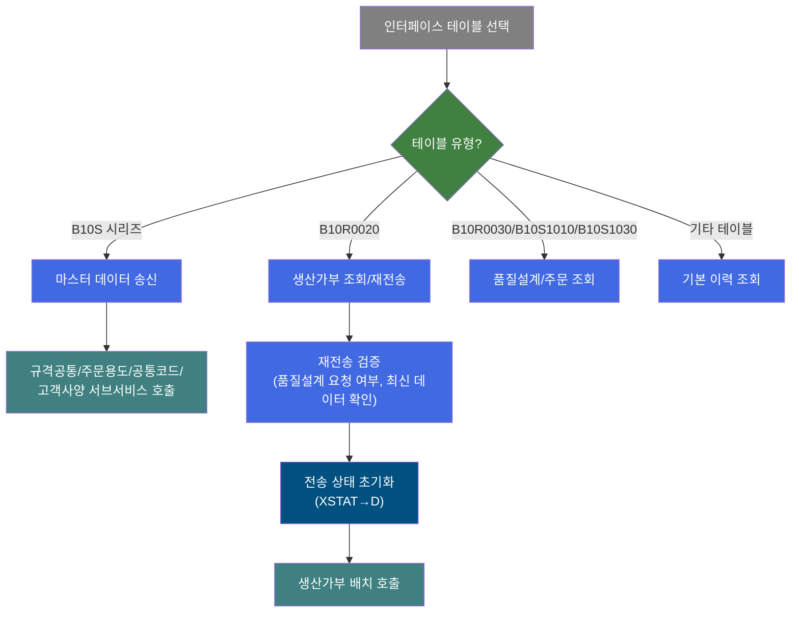
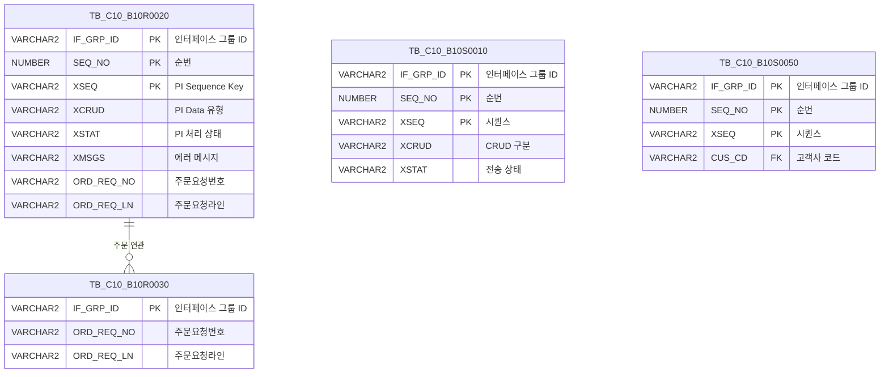

<h1 style="font-size: 40px; text-align: center; font-weight:
   bold; margin: 30px 0;">
  C106000070 레거시 시스템 분석 종합 보고서
</h1>


# 1. 시스템 개요
- **서비스 ID**: C106000070
- **업무명**: InterFace 조회
- **분석 일시**: 2026-03-17 (KST)
- **전체 Activity 수**: 18개 (Built-in 12, Custom 6)
- **분석자**: Claude Opus 4.6
- **분석 도구**: /analyze-service C106000070
- **문서 버전**: 1.0

# 📊 비즈니스 프로세스 분석

## 시스템 목적

C106000070 서비스는 MES 시스템의 **EAI 인터페이스 데이터 조회 및 송신/재전송 관리 화면**이다. EAIAPUSER 스키마의 다양한 인터페이스 테이블(`TB_C10_B10S0010`~`TB_C10_B10S0050`, `TB_C10_B10R0020`, `TB_C10_B10R0030` 등)에 대해 PI(Process Integration) 전송 이력을 조회하고, 마스터 데이터 송신 및 생산가부 재전송을 수행한다.

이 화면은 EAI 운영자가 인터페이스 전송 현황을 모니터링하고, 필요 시 마스터 데이터(규격공통, 주문용도, 공통코드, 고객공통정보 등)를 외부 시스템으로 재송신하거나, 생산가부검토 결과를 재전송하는 용도로 사용된다. TABLE_NAME 콤보 선택에 따라 그리드 헤더가 동적으로 변경되는 특수한 UI 패턴을 사용하며, 선택된 테이블에 따라 조회 조건과 기능 버튼이 동적으로 표시/숨김 처리된다.

## 핵심 워크플로우 다이어그램



### 상세 워크플로우 다이어그램

```mermaid
flowchart TD
    A["분기<br/>PosDefaultRouter"]:::start --> |"find"| B["조회<br/>SearchTableLoad"]:::proc
    A --> |"find2"| C["생산가부조회<br/>SearchTableLoad"]:::proc
    A --> |"find3"| D["품질설계조회<br/>SearchTableLoad"]:::proc
    A --> |"find4"| E["생산가부검토결과조회<br/>SearchTableLoad"]:::proc

    subgraph 단순조회["단순 조회 (AJAX/콤보)"]
        F1["행번 조회<br/>ordLnSelect"]
        F2["주문행번조회(추가)<br/>ordLnSelect1"]
        F3["combo설정<br/>comboSelect"]
        F4["컬럼정보조회<br/>ajaxFind"]
        F5["재전송확인1<br/>chk30_find"]
        F6["재전송확인2<br/>chk20_find"]
    end
    A --> F1 & F2 & F3 & F4 & F5 & F6

    subgraph 송신["마스터 데이터 송신"]
        S1["규격공통정보송신<br/>B10S0010"]:::proc_call
        S2["주문용도정보송신<br/>B10S0020"]:::proc_call
        S3["규격별주문용도정보송신<br/>B10S0030"]:::proc_call
        S4["공통코드정보송신<br/>B10S0040"]:::proc_call
        S5["고객공통정보송신<br/>B10S0050"]:::proc_call
    end
    A --> |"Send~Send4"| S1 & S2 & S3 & S4 & S5

    A --> |"reSend"| G["재전송<br/>GridSave"]:::save
    G --> |"reSendUpdate<br/>TB_C10_B10R0020<br/>XSTAT→D 초기화"| H["생산가부Batch Call<br/>PosBatchJobInvoker"]:::proc_call

    B --> |"#TABLE_NAME# 동적 치환<br/>eaidao"| Z["end"]:::start
    C --> |"#TABLE_NAME# 동적 치환<br/>eaidao"| Z
    D --> |"#TABLE_NAME# 동적 치환<br/>eaidao"| Z
    E --> |"#TABLE_NAME# 동적 치환<br/>eaidao"| Z

    classDef start fill:#808080,color:#fff
    classDef proc fill:#4169E1,color:#fff
    classDef proc_call fill:#408080,color:#fff
    classDef save fill:#005080,color:#fff
```



## 주요 유즈케이스

### UC-01: 인터페이스 전송 이력 조회
- **Actor**: EAI 운영자
- **목적**: 선택한 EAI 인터페이스 테이블의 PI 전송 이력을 조회하여 전송 현황 모니터링
- **전제조건**:
  - 사용자가 시스템에 로그인되어 있음
  - EAIAPUSER 스키마 접근 권한 보유

- **주요 흐름**:
  1. TABLE_NAME 콤보에서 조회 대상 테이블 선택 (C106000070.comboSelect → EAIAPUSER의 TB_C10 패턴 테이블 목록)
  2. 테이블 선택 시 c10AjaxData.do(ajaxFind=1) 호출하여 컬럼 헤더 정보 조회 (C106000070.ajaxFind)
  3. setGridHeaderData.do 호출하여 그리드 헤더 동적 재구성
  4. 송신일 범위(XDATE_START~XDATE_END), STATUS, IF GRP ID 조건 입력
  5. 조회 버튼 클릭 → SearchTableLoad가 동적 테이블명(`#TABLE_NAME#`)을 치환하여 eaidao 조회 (C106000070.select)
  6. Grid에 IF_GRP_ID, SEQ_NO, XSEQ, XCRUD, XSTAT, XMSGS, XDATE, XTIME 등 표시

- **대체 흐름**:
  - TABLE_NAME 미선택: alert "인터페이스 테이블을 선택해 주세요" 표시
  - 조회 결과 없음: 빈 그리드 표시

- **후행조건**:
  - 전송 이력이 Grid에 표시됨
  - 운영자가 전송 상태(XSTAT) 및 에러 메시지(XMSGS) 확인 가능

### UC-02: 마스터 데이터 송신
- **Actor**: EAI 운영자
- **목적**: MES 마스터 데이터를 EAI 인터페이스를 통해 외부 시스템으로 송신
- **전제조건**:
  - B10S 시리즈 테이블(TB_C10_B10S0010~TB_C10_B10S0050) 중 하나 선택
  - 전송 버튼 활성화 상태

- **주요 흐름**:
  1. TABLE_NAME 콤보에서 B10S 시리즈 테이블 선택
  2. 전송 버튼 클릭
  3. TABLE_NAME에 따라 서브서비스 분기:
     - TB_C10_B10S0010 → B10S0010(규격공통정보송신)
     - TB_C10_B10S0020 → B10S0020(주문용도정보송신)
     - TB_C10_B10S0030 → B10S0030(규격별주문용도정보송신)
     - TB_C10_B10S0040 → B10S0040(공통코드정보송신)
     - TB_C10_B10S0050 → B10S0050(고객공통정보송신)
  4. 확인 다이얼로그 → 승인 시 서브서비스 호출
  5. 서브서비스가 마스터 뷰에서 전건 조회 → 송신 테이블에 INSERT → COMMIT

- **대체 흐름**:
  - B10S 시리즈 외 테이블 선택: alert "전송이 불가능한 테이블입니다" 표시

- **후행조건**:
  - 해당 송신 테이블에 마스터 데이터 적재 완료
  - 자동 조회 실행으로 전송 이력 갱신

### UC-03: 생산가부 재전송
- **Actor**: EAI 운영자
- **목적**: 전송 실패하거나 재처리가 필요한 생산가부검토 결과를 재전송
- **전제조건**:
  - TB_C10_B10R0020 테이블 선택
  - 재전송 대상 행 선택

- **주요 흐름**:
  1. TABLE_NAME에서 TB_C10_B10R0020 선택 → 추가 조건 필드(주문요청번호, 주문라인, 품명, 주문용도, 수요가, 두께 범위, 등록자) 표시
  2. 조회 조건 입력 후 조회 (C106000070.select2 → 생산가부 전용 조회)
  3. Grid에서 재전송 대상 행 선택
  4. 재전송 버튼 클릭
  5. 품질설계 요청 여부 확인 (chk30_find → TB_C10_B10R0030)
  6. 최신 요청 데이터 존재 여부 확인 (chk20_find → TB_C10_B10R0020)
  7. 확인 다이얼로그 → 승인 시 reSendUpdate 실행 (XSTAT→'D', XMSGS→'', XSTAT_CALLBACK→'' 초기화)
  8. 생산가부 배치 잡(batchJobB10R0020) 호출

- **대체 흐름**:
  - 품질설계 이미 요청됨: alert 후 중단
  - 최신 요청 데이터 존재: alert 후 중단
  - 행 미선택: alert "재전송 대상을 선택해 주세요"

- **후행조건**:
  - TB_C10_B10R0020의 전송 상태가 'D'(대기)로 초기화
  - 배치 잡이 트리거되어 재전송 수행

### UC-04: 생산가부검토 결과 상세 조회
- **Actor**: EAI 운영자
- **목적**: 생산가부검토 결과의 상세 정보를 팝업으로 확인
- **전제조건**:
  - TB_C10_B10R0020 테이블 선택
  - Grid에 데이터 존재

- **주요 흐름**:
  1. Grid 행 더블클릭
  2. 선택 행의 IF_GRP_ID, SEQ_NO 추출
  3. C106000070pop01.jsp 팝업 오픈 (945x585, 모달)
  4. 팝업에서 해당 전송 건의 상세 정보 확인

- **대체 흐름**:
  - TB_C10_B10R0020 외 테이블: 더블클릭 무시

- **후행조건**:
  - 상세 팝업이 표시됨

---
## 비즈니스 로직 상세

### 1. 동적 테이블 조회 패턴 (SearchTableLoad)

- **목적**: 다양한 EAI 인터페이스 테이블에 대해 단일 서비스/액티비티로 범용 조회를 수행
- **처리 케이스**:

  **[케이스 1: SQL 문자열 동적 치환]**
  ```
  조건: Service XML의 key1 프로퍼티에 "#TABLE_NAME#|TABLE_NAME" 설정
  처리:
    1. SQL 쿼리 정의에서 '#TABLE_NAME#' 플레이스홀더 검색
    2. PosContext에서 'TABLE_NAME' 키로 실제 테이블명 조회
    3. SQL 문자열에서 직접 치환 (Named Parameter가 아닌 문자열 replace)
    4. 치환된 SQL을 eaidao로 실행
    5. 결과를 PosContext에 저장 (PV_XML_RESULT)
  ```

  **[케이스 2: 조건별 분기 조회]**
  ```
  조건: TABLE_NAME 값에 따라 서로 다른 SQL 실행
  처리:
    - 기본(find): C106000070.select (IF_GRP_ID, XSTAT, 날짜 범위 필터)
    - 생산가부(find2): C106000070.select2 (주문정보, 품명, 두께 범위 추가 필터)
    - 품질설계(find3): C106000070.select3 (주문번호, 주문라인 필터)
    - 생산가부검토결과(find4): C106000070.select4 (주문요청번호, 주문라인 필터)
  ```

- **예외 처리**:
  - keyCount null: 기본값 0 사용
  - TABLE_NAME 미선택: JavaScript 레벨에서 alert 차단

### 2. 동적 그리드 헤더 재구성

- **목적**: 선택된 인터페이스 테이블의 컬럼 구조에 맞게 그리드 헤더를 동적으로 변경
- **처리 케이스**:

  **[케이스 1: 헤더 정보 조회]**
  ```
  조건: TABLE_NAME 선택 변경 시
  처리:
    1. C106000070.ajaxFind 실행 → ALL_TAB_COLUMNS + ALL_COL_COMMENTS 조인
    2. EAIAPUSER 스키마의 해당 테이블 컬럼명(COLUMN_CODE_INFO)과 주석(COLUMN_NAME_INFO) 조회
    3. audit 컬럼(CREATED_*, LAST_UPDATED_*) 제외
    4. UNION ALL로 P_IF_GRP_ID, P_TBL_NM 고정 항목 추가
    5. setGridHeaderData.do 호출하여 그리드 헤더 재구성
    6. 마지막 2개 컬럼(P_IF_GRP_ID, P_TBL_NM) 숨김 처리
  ```

### 3. 재전송 검증 로직

- **목적**: 생산가부 재전송 시 중복 전송 및 무효한 재전송을 방지
- **처리 케이스**:

  **[케이스 1: 품질설계 요청 확인]**
  ```
  조건: 재전송 버튼 클릭 시
  처리:
    1. chk30_find 호출 → TB_C10_B10R0030에서 동일 주문의 품질요청 존재 확인
    2. 이미 품질설계 요청이 있으면 alert "이미 품질설계 요청이 되었습니다" → 중단
  ```

  **[케이스 2: 최신 데이터 확인]**
  ```
  조건: 품질설계 요청 검증 통과
  처리:
    1. chk20_find 호출 → TB_C10_B10R0020에서 동일 주문/날짜/시간의 최신 기록 확인
    2. 이미 최신 데이터가 존재하면 alert "이미 최신 요청 데이터가 있습니다" → 중단
  ```

  **[케이스 3: 상태 초기화]**
  ```
  조건: 검증 통과 후 확인 다이얼로그 승인
  처리:
    1. reSendUpdate 실행 → XSTAT='D', XMSGS='', XSTAT_CALLBACK='' 초기화
    2. 생산가부 배치 잡(batchJobB10R0020) 호출
  ```

---

# ⚙️ Java 컴포넌트 분석

## Custom Activity 상세 분석

### 1개 Custom Activity 발견 (6개 인스턴스)

### 1. SearchTableLoad (조회, 행번 조회, 생산가부조회, 품질설계조회, 생산가부검토결과조회, 주문행번조회(추가))
- **클래스명**: com.unionsteel.mes.c10.activity.ui.SearchTableLoad
- **액티비티명**: 조회, 행번 조회, 생산가부조회, 품질설계조회, 생산가부검토결과조회, 주문행번조회(추가)
- **파일 경로**: src/com/unionsteel/mes/c10/activity/ui/SearchTableLoad.java
- **주요 기능**: EAI 인터페이스 테이블에 대한 동적 SQL 조회 수행. SQL 문자열 직접 치환 방식 사용
- **라인 수**: 77 | **메소드 수**: 4

> EAI 인터페이스 테이블에 대한 동적 SQL 조회를 수행하는 범용 조회 액티비티이다. SQL 쿼리 정의에서 플레이스홀더(`#TABLE_NAME#`)를 런타임에 ctx 값으로 치환하는 동적 쿼리 패턴을 사용하며, 일반적인 Named Parameter 방식이 아닌 SQL 문자열 직접 치환 방식을 사용하는 특수 클래스이다.

📎 **[상세 분석 보고서](../customClass/com.unionsteel.mes.c10.activity.ui.SearchTableLoad_class_analysis.md)**

**Activity 인스턴스 매핑**:

| 액티비티명 | SQL Key | DAO | 용도 |
|-----------|---------|-----|------|
| 조회 | C106000070.select | eaidao | 기본 인터페이스 이력 조회 |
| 생산가부조회 | C106000070.select2 | eaidao | 생산가부 전용 상세 조회 |
| 품질설계조회 | C106000070.select3 | eaidao | 품질설계 전용 조회 |
| 생산가부검토결과조회 | C106000070.select4 | eaidao | 생산가부검토 결과 조회 |
| 행번 조회 | C106000070.ordLnSelect | eaidao | 주문요청라인 콤보 동적 로드 |
| 주문행번조회(추가) | C106000070.ordLnSelect1 | eaidao | 품질설계 주문라인 콤보 동적 로드 |

---

# 💾 데이터 요구사항

## 핵심 테이블

### 1. TB_C10_B10R0020 - (생산가부요청수신 인터페이스 테이블)
| 컬럼명 | 타입 | PK | 설명 |
|--------|------|----|-----|
| IF_GRP_ID | VARCHAR2 | ✅ | 인터페이스 그룹 ID |
| SEQ_NO | NUMBER | ✅ | 순번 |
| XSEQ | VARCHAR2 | ✅ | PI Sequence Key Value |
| XCRUD | VARCHAR2 | | PI Data 유형 (C/U/D) |
| XSTAT | VARCHAR2 | | PI 처리 상태 (R/D/S/E) |
| XMSGS | VARCHAR2 | | PI 에러 메시지 |
| XSTAT_CALLBACK | VARCHAR2 | | 콜백 상태 |
| XDATE | DATE | | PI 송신일자 |
| XTIME | VARCHAR2 | | PI 송신시간 |
| ORD_REQ_NO | VARCHAR2 | | 주문요청번호 |
| ORD_REQ_LN | VARCHAR2 | | 주문요청라인 |

### 2. TB_C10_B10R0030 - (품질설계요청 인터페이스 테이블)
| 컬럼명 | 타입 | PK | 설명 |
|--------|------|----|-----|
| IF_GRP_ID | VARCHAR2 | ✅ | 인터페이스 그룹 ID |
| ORD_REQ_NO | VARCHAR2 | | 주문요청번호 |
| ORD_REQ_LN | VARCHAR2 | | 주문요청라인 |

### 3. ALL_TAB_COLUMNS / ALL_COL_COMMENTS / USER_TAB_COMMENTS - (Oracle 데이터 딕셔너리)
| 뷰명 | 용도 |
|-------|------|
| ALL_TAB_COLUMNS | EAIAPUSER 스키마 테이블 컬럼 정보 조회 |
| ALL_COL_COMMENTS | 컬럼 주석 조회 (그리드 헤더 라벨) |
| USER_TAB_COMMENTS | 테이블 주석 조회 (TABLE_NAME 콤보 표시) |

## 데이터 플로우

### 1. 조회 (동적 테이블 기반)

```
[테이블 목록 콤보 로드]
화면 진입
→ C106000070.comboSelect
  FROM ALL_TAB_COLUMNS A
  INNER JOIN USER_TAB_COMMENTS B ON A.TABLE_NAME = B.TABLE_NAME
  WHERE A.OWNER = 'EAIAPUSER' AND A.TABLE_NAME LIKE 'TB_C10%'
→ TABLE_NAME 콤보에 테이블 목록 표시

[컬럼 헤더 동적 로드]
TABLE_NAME 선택 변경
→ C106000070.ajaxFind
  FROM ALL_TAB_COLUMNS T1
  INNER JOIN ALL_COL_COMMENTS T2 ON T1.TABLE_NAME = T2.TABLE_NAME
  WHERE T1.OWNER = 'EAIAPUSER' AND T1.TABLE_NAME = :TABLE_NAME
  AND T1.COLUMN_NAME NOT IN (audit 컬럼)
  UNION ALL SELECT P_IF_GRP_ID, P_TBL_NM FROM DUAL
→ 그리드 헤더 재구성

[기본 데이터 조회]
조회 버튼 클릭
→ C106000070.select (또는 select2/select3/select4)
  FROM #TABLE_NAME# A (동적 치환)
  WHERE XDATE BETWEEN :XDATE_START AND :XDATE_END
  AND IF_GRP_ID LIKE :IF_GRP_ID_CD (선택)
  AND XSTAT = :XSTAT_CD (선택)
  ORDER BY IF_GRP_ID DESC, XDATE DESC, XTIME DESC
→ Grid에 결과 표시
```

### 2. 재전송 (상태 초기화 + 배치 호출)

```
[재전송 처리]
재전송 버튼 클릭
→ C106000070.chk30_find (검증1: 품질설계 요청 여부)
  FROM TB_C10_B10R0030
  WHERE ORD_REQ_NO = :ORD_REQ_NO AND ORD_REQ_LN = :ORD_REQ_LN
→ C106000070.chk20_find (검증2: 최신 데이터 확인)
  FROM TB_C10_B10R0020
  WHERE ORD_REQ_NO = :ORD_REQ_NO AND ORD_REQ_LN = :ORD_REQ_LN
    AND XDATE = :XDATE AND XTIME = :XTIME
→ C106000070.reSendUpdate (상태 초기화)
  UPDATE TB_C10_B10R0020
  SET XSTAT = 'D', XMSGS = '', XSTAT_CALLBACK = ''
  WHERE IF_GRP_ID = :P_IF_GRP_ID
→ 생산가부 배치 잡 (batchJobB10R0020) 호출
```

### 3. 마스터 데이터 송신 (서브서비스 호출)

```
[마스터 데이터 전송]
전송 버튼 클릭
→ TABLE_NAME에 따라 서브서비스 분기:
  TB_C10_B10S0010 → B10S0010-service (규격공통정보)
  TB_C10_B10S0020 → B10S0020-service (주문용도정보)
  TB_C10_B10S0030 → B10S0030-service (규격별주문용도정보)
  TB_C10_B10S0040 → B10S0040-service (공통코드정보)
  TB_C10_B10S0050 → B10S0050-service (고객공통정보)
→ 각 서브서비스가 마스터 뷰 전건 조회 → 송신 테이블 INSERT → COMMIT
```

## SQL 일람표

| SQL 이름 | 쿼리 ID | 타입 | 출처 | 테이블 |
|---------|---------|-----|-------|-------|
| 테이블 목록 콤보 | C106000070.comboSelect | SELECT | Service | ALL_TAB_COLUMNS, USER_TAB_COMMENTS |
| 컬럼 정보 AJAX | C106000070.ajaxFind | SELECT | Service | ALL_TAB_COLUMNS, ALL_COL_COMMENTS, DUAL |
| 기본 조회 | C106000070.select | SELECT | Service | #TABLE_NAME# (동적) |
| 생산가부 조회 | C106000070.select2 | SELECT | Service | #TABLE_NAME# (동적) |
| 품질설계 조회 | C106000070.select3 | SELECT | Service | #TABLE_NAME# (동적) |
| 생산가부검토결과 조회 | C106000070.select4 | SELECT | Service | #TABLE_NAME# (동적) |
| 주문요청라인 조회 | C106000070.ordLnSelect | SELECT | Service | #TABLE_NAME# (동적) |
| 품질설계 주문라인 조회 | C106000070.ordLnSelect1 | SELECT | Service | #TABLE_NAME# (동적) |
| 재전송확인 (품질) | C106000070.chk30_find | SELECT | Service | TB_C10_B10R0030 |
| 재전송확인 (생산가부) | C106000070.chk20_find | SELECT | Service | TB_C10_B10R0020 |
| 재전송 상태 초기화 | C106000070.reSendUpdate | UPDATE | Service | TB_C10_B10R0020 |

## ER 다이어그램 (핵심 관계)



관계 설명:
- TB_C10_B10R0020(생산가부)과 TB_C10_B10R0030(품질설계)은 ORD_REQ_NO + ORD_REQ_LN으로 주문 단위 연관
- TB_C10_B10S0010~B10S0050은 독립적인 마스터 데이터 송신 테이블로 IF_GRP_ID 기반 관리
- 모든 테이블은 EAIAPUSER 스키마 소유

---

# 🖥️ 사용자 인터페이스 요구사항

## 화면 레이아웃 상세

### Layout 구조 (Absolute Positioning)
```javascript
{
  itemType: "absolute",
  totalWidth: "981px",
  totalHeight: "586px",
  components: [
    {
      id: "C106000070_Form_1",
      type: "form",
      height: "65px (기본) / 95px (조건부)",
      top: "0px"
    },
    {
      id: "C106000070_Grid_1",
      type: "grid",
      height: "500px (기본) / 470px (조건부)",
      top: "65px (기본) / 95px (조건부)"
    },
    {
      id: "C106000070_messagebox",
      type: "messagebox",
      height: "19px",
      top: "567px"
    }
  ]
}
```

## 입출력 요소

### Form 컴포넌트
**C106000070_Form_1**
- TABLE_NAME: Combo - 인터페이스 테이블 선택 (필수, 310px, OrdlnComboData.do 동적 로드)
- XDATE_START: Calendar - 송신일 시작 (95px, 시분 포함, 기본값: 오늘 00:00)
- XDATE_END: Calendar - 송신일 종료 (95px, 시분 포함, 기본값: 현재 시각)
- IF_GRP_ID_CD: Input - IF GRP ID 검색 (311px, 최대 20자)
- XSTAT_CD: Combo - STATUS 선택 (200px, 마스터코드 SZ0000/XSTAT_CD)
- ORD_RGS_PRS_ID: Input - 등록자 (70px, 숨김, B10R0020 시 표시)
- template2: Template - 등록자 검색 아이콘 (숨김)
- ORD_REQ_NO: Input - 주문요청번호/주문번호 (80px, 숨김, 조건부 표시)
- ORD_REQ_NO_BT: Label - "~" 구분자 (숨김)
- ORD_REQ_LN: Combo - 주문라인 (50px, 숨김, ORD_REQ_NO 변경 시 동적 로드)
- PRD_NM_CD: Combo - 품명 (120px, 숨김, B10R0020 시 표시)
- ORD_USG_CD: Input - 주문용도 (80px, 숨김, 자동 대문자 변환)
- template: Template - 주문용도 검색 아이콘 (숨김)
- CUS_CD: Input - 수요가 (80px, 숨김, 자동 대문자 변환)
- template1: Template - 수요가 검색 아이콘 (숨김)
- ORD_EXT_THK_STR: Input - 두께 시작 (75px, 숨김, 우측정렬)
- ORD_EXT_THK_DUR: Label - "~" 구분자 (숨김)
- ORD_EXT_THK_END: Input - 두께 종료 (75px, 숨김)
- 전송: CustomButton → Send 이벤트 (70px, 비활성)
- 조회: Button → find 이벤트 (비활성)
- 닫기: Button → winClose 이벤트
- 재전송: CustomButton → reSend 이벤트 (80px, 숨김/비활성)

### Grid 컴포넌트

**C106000070_Grid_1 (인터페이스 전송 이력)**
- 편집 가능 여부: 아니오 (읽기 전용)
- Split: 없음
- 페이지: 15건/페이지 (pageset 적용)
- 컬럼 단위: % (colwidthUnit)
- 스킨: dhx_skyblue
- 컨텍스트 메뉴: 있음 (복사, 엑셀)
- **동적 헤더**: TABLE_NAME 선택 시 setGridHeaderData.do로 헤더 재구성
- 주요 컬럼 (10개, 기본 TB_C10_QLT_DSN_CMN 기준):

  **숨김 컬럼**:
  - P_IF_GRP_ID: ro - 인터페이스 그룹 ID (13%, 중앙정렬, 숨김)
  - P_TBL_NM: ro - 인터페이스 테이블명 (13%, 중앙정렬, 숨김)

  **기본 정보**:
  - P_IF_GRP_ID: ro - 인터페이스그룹아이디 (15%, 중앙정렬, 더블클릭 시 팝업 파라미터)
  - SEQ_NO: ro - 인터페이스 SEQ (13%, 중앙정렬)
  - XSEQ: ro - PI Sequence Key Value (13%, 중앙정렬)

  **PI 상태 정보**:
  - XCRUD: ro - PI Data 유형 (10%, 좌측정렬)
  - XSTAT: ro - PI 처리 상태 (10%, 중앙정렬)
  - XMSGS: ro - PI 에러 메시지 (*, 좌측정렬)

  **일시 정보**:
  - XDATE: ro - PI 송신일자 (13%, 중앙정렬)
  - XTIME: ro - PI 송신시간 (13%, 중앙정렬)

## 화면 동작 흐름

### 1. 화면 초기 로딩
```
1. 화면 진입
2. onFormLoadFunction 실행
3. TABLE_NAME 콤보 로드 (OrdlnComboData.do, comboSelect=1)
4. XSTAT_CD 콤보 로드 (마스터코드 SZ0000/XSTAT_CD, 첫 항목 선택)
5. PRD_NM_CD 콤보 로드 (마스터코드 SZ0000/PRD_NM_CD)
6. 날짜 기본값 설정 (XDATE_START=오늘 00:00, XDATE_END=현재시각)
7. 조건부 필드 숨김 처리 (reSend, ORD_REQ_NO 등 13개 필드)
8. Form 높이 65px, Grid top 65px, Grid 높이 500px 설정
9. TABLE_NAME onSelectionChange 이벤트 등록
```

### 2. 테이블 선택 및 조회
```
1. TABLE_NAME 콤보에서 테이블 선택
2. c10AjaxData.do(ajaxFind=1) 호출 → 컬럼 헤더 정보 조회
3. setGridHeaderData.do 호출 → 그리드 헤더 동적 재구성
4. 마지막 2개 컬럼(P_IF_GRP_ID, P_TBL_NM) 숨김
5. TABLE_NAME에 따라 폼 필드 표시/숨김 및 높이 조정:
   - TB_C10_B10R0020: 13개 추가 필드 표시, Form 95px
   - TB_C10_B10R0030/B10S1010/B10S1030: 3개 추가 필드 표시, Form 95px
   - 그 외: 모든 조건부 필드 숨김, Form 65px
6. gridLoadAfterFunction → 자동 조회 실행
```

### 3. 재전송 처리
```
1. TB_C10_B10R0020 테이블 선택 상태
2. Grid에서 재전송 대상 행 선택
3. 재전송 버튼 클릭
4. chk30_find(AJAX) → 품질설계 요청 여부 검증
5. chk20_find(AJAX) → 최신 요청 데이터 존재 검증
6. 확인 다이얼로그 표시
7. customParam(P_IF_GRP_ID, P_TBL_NM) 구성
8. sendGrid 호출 → reSendUpdate 실행
9. 생산가부 배치 잡 트리거
10. 조회 재실행하여 결과 갱신
```

### 4. 마스터 데이터 전송
```
1. B10S 시리즈 테이블 선택 상태
2. 전송 버튼 클릭
3. TABLE_NAME에 따라 서브서비스 분기 (Send~Send4)
4. 확인 다이얼로그 표시
5. 확인 시 첫 번째 행 updated 플래그 설정
6. sendGrid 호출 → 서브서비스(B10S0010~B10S0050) 실행
7. 조회 재실행하여 결과 갱신
```

## JavaScript 모듈

**C106000070.js** (메인 화면 스크립트)
- onFormLoadFunction(): 폼 초기화 (콤보 로드, 날짜 설정, 필드 숨김, 이벤트 등록)
- find(): 기본 조회 (TABLE_NAME별 find/find2/find3/find4 분기, uiCommon.parameters 사용)
- Send(): 마스터 데이터 전송 (TABLE_NAME별 Send~Send4 분기, 확인 다이얼로그)
- reSend(): 재전송 (2단계 AJAX 검증 후 sendGrid 호출)
- doOnRowDblClicked(): Grid 행 더블클릭 → C106000070pop01.jsp 팝업 (TB_C10_B10R0020만)
- onChangeEvent(): 폼 필드 변경 이벤트 (ORD_REQ_NO 변경 시 ORD_REQ_LN 동적 로드)
- onGridContextMenuClick(): 컨텍스트 메뉴 (copy_row, excel_grid)
- findMessage(): 메시지박스 갱신
- onGridAfterUpdateFinishEvent(): 업데이트 완료 후 자동 조회

## 주요 이벤트 핸들러

**TABLE_NAME onSelectionChange (테이블 선택 변경)**
- 이벤트 타입: Combo Change
- 처리 내용:
  1. c10AjaxData.do 호출하여 컬럼 헤더 정보 조회
  2. setGridHeaderData.do로 그리드 헤더 동적 재구성
  3. TABLE_NAME별 조건부 필드 표시/숨김
  4. Form/Grid 높이 동적 조정
  5. 자동 조회 실행

**find (조회 버튼)**
- 이벤트 타입: Button Click
- 처리 내용:
  1. TABLE_NAME 선택 검증
  2. TABLE_NAME별 조회 이벤트 분기 (find/find2/find3/find4)
  3. uiCommon.parameters()로 파라미터 구성
  4. Grid loadData 호출

**Send (전송 버튼)**
- 이벤트 타입: CustomButton Click
- 처리 내용:
  1. TABLE_NAME 선택 검증
  2. B10S 시리즈 확인 (비해당 시 alert)
  3. TABLE_NAME별 서브서비스 분기
  4. 확인 다이얼로그 → sendGrid 호출

**reSend (재전송 버튼)**
- 이벤트 타입: CustomButton Click
- 처리 내용:
  1. 행 선택 검증
  2. 2단계 AJAX 검증 (chk30/chk20)
  3. customParam 구성 (P_IF_GRP_ID, P_TBL_NM)
  4. 확인 다이얼로그 → sendGrid 호출

---

# 🔗 서브서비스

## 서브서비스 요약

| 서비스 ID | 설명 | 호출 액티비티 | 트랜잭션 | 상세 분석 |
|-----------|------|-------------|---------|----------|
| B10S0010 | 규격공통 마스터 데이터 EAI 송신 | 규격공통정보송신 | 신규 트랜잭션 | [상세 분석](../nui/B10S0010_legacy_analysis.md) |
| B10S0020 | 주문용도코드 마스터 데이터 EAI 송신 | 주문용도정보송신 | 신규 트랜잭션 | [상세 분석](../nui/B10S0020_legacy_analysis.md) |
| B10S0030 | 규격별 주문용도정보 EAI 송신 | 규격별주문용도정보송신 | 신규 트랜잭션 | [상세 분석](../nui/B10S0030_legacy_analysis.md) |
| B10S0040 | Master Code(공통코드) EAI 송신 | 공통코드정보송신 | 신규 트랜잭션 | [상세 분석](../nui/B10S0040_legacy_analysis.md) |
| B10S0050 | 고객공통정보 EAI 송신 | 고객공통정보송신 | 신규 트랜잭션 | [상세 분석](../nui/B10S0050_legacy_analysis.md) |

### B10S0010 - 규격공통정보송신
규격공통 마스터 뷰에서 전건 조회 후 TB_C10_B10S0010 송신 테이블에 일괄 INSERT. Activity 5개, SQL 2개.

### B10S0020 - 주문용도정보송신
주문용도코드(대/중/소분류) 마스터 데이터를 조회하여 TB_C10_B10S0020 송신 테이블에 적재. Activity 15개, SQL Key 복수.

### B10S0030 - 규격별주문용도정보송신
규격별 주문용도 정보를 마스터 뷰에서 전건 조회 후 TB_C10_B10S0030에 INSERT. Activity 5개, SQL 2개.

### B10S0040 - 공통코드정보송신
MES 공통코드 마스터를 조회하여 TB_C10_B10S0040 송신 테이블에 적재. Activity 5개, SQL 2개.

### B10S0050 - 고객공통정보송신
고객공통사양 + 인수도사양을 LEFT JOIN으로 통합 조회 후 TB_C10_B10S0050에 INSERT. Activity 5개, SQL 2개. DbQualDesignLoop로 루프 처리.

---

# 📌 특이사항 및 주의사항

## 1. SQL 문자열 직접 치환 (SQL Injection 위험)
- SearchTableLoad 클래스는 Named Parameter가 아닌 **SQL 문자열 직접 치환** 방식으로 `#TABLE_NAME#`을 동적으로 교체한다. 테이블명이 사용자 입력이 아닌 콤보 선택값이므로 현재 직접적인 SQL Injection 위험은 낮으나, 일반적인 보안 모범 사례와는 다른 패턴이다.

## 2. Oracle 데이터 딕셔너리 직접 조회
- `ALL_TAB_COLUMNS`, `ALL_COL_COMMENTS`, `USER_TAB_COMMENTS` 등 Oracle 데이터 딕셔너리를 직접 조회하여 동적 UI를 구성한다. 테이블 구조 변경 시 별도 UI 수정 없이 자동 반영되는 장점이 있으나, 딕셔너리 조회 성능이 떨어질 수 있다.

## 3. 동적 그리드 헤더
- TABLE_NAME 선택 시 매번 그리드 헤더를 Ajax로 조회하고 재구성하는 특수 패턴. `setGridHeaderData.do`라는 별도 서블릿을 통해 처리되며, 일반적인 DHTMLX 그리드 초기화 방식과 다르다.

## 4. 교차 DAO 패턴
- 서브서비스(B10S 시리즈)에서 `mesdao`(MESAPUSER)로 마스터 데이터 조회 후 `eaidao`(EAIAPUSER)로 INSERT하는 교차 DAO 패턴을 사용한다. 분산 트랜잭션 관리에 주의 필요.

## 5. 재전송 2단계 검증
- 재전송 시 품질설계 요청 여부(chk30_find)와 최신 데이터 존재 여부(chk20_find)를 순차적으로 AJAX 검증한다. 동기 AJAX 호출 방식으로, 네트워크 지연 시 사용자 경험에 영향을 줄 수 있다.

## 6. 전송 버튼의 서브서비스 전건 처리
- 전송 버튼 클릭 시 해당 마스터 데이터를 **전건 조회 후 일괄 INSERT**하므로, 데이터 건수에 따라 처리 시간이 상당할 수 있다. 특히 B10S0020(주문용도)은 15개 Activity로 구성된 복잡한 서비스이다.

---

# 📚 참고 문서

- **Query SQL**: `src/query/C106000070-query.glue_sql`
- **JS**: `WebContents/C106000070.jsp`
- **Custom Java 클래스**:
  - `src/com/unionsteel/mes/c10/activity/ui/SearchTableLoad.java`
- **Service XML**: `src/service/C106000070-service.xml`
- **서브서비스 분석**:
  - `docs/analysis/service/nui/B10S0010_legacy_analysis.md`
  - `docs/analysis/service/nui/B10S0020_legacy_analysis.md`
  - `docs/analysis/service/nui/B10S0030_legacy_analysis.md`
  - `docs/analysis/service/nui/B10S0040_legacy_analysis.md`
  - `docs/analysis/service/nui/B10S0050_legacy_analysis.md`
