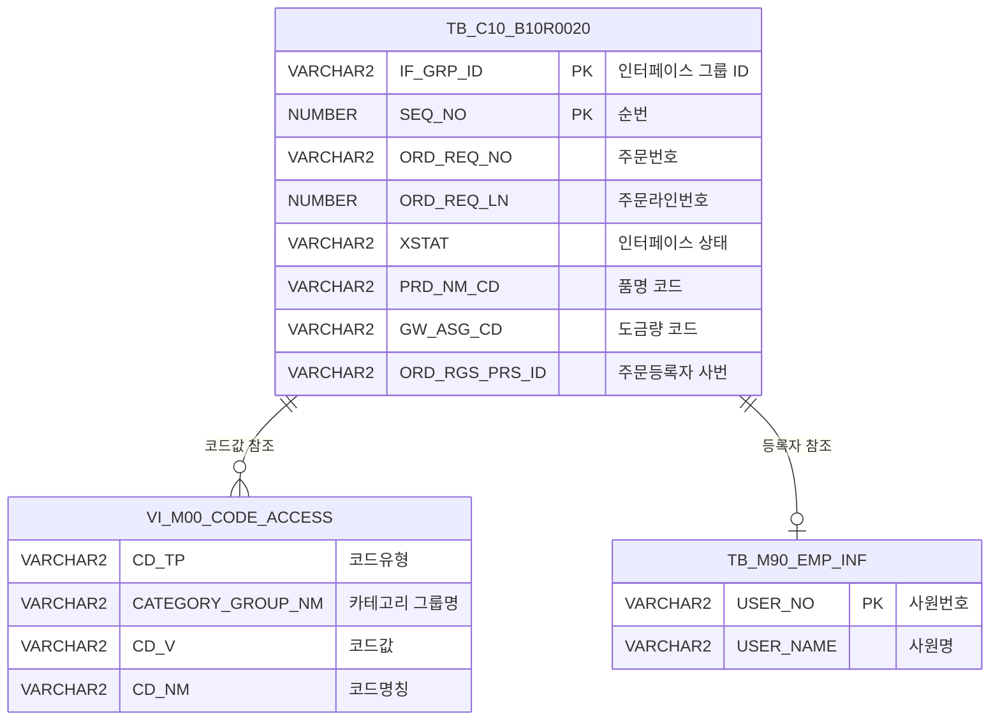

<h1 style="font-size: 40px; text-align: center; font-weight:
   bold; margin: 30px 0;">
  C106000070pop01 레거시 시스템 분석 종합 보고서
</h1>


# 1. 시스템 개요
- **서비스 ID**: C106000070pop01
- **업무명**: 생산가부요청수신 IF 상세 팝업
- **분석 일시**: 2026-03-17 10:29 KST
- **분석 시간**: 약 4분
- **전체 Activity 수**: 2개 (built-in)
- **분석자**: Claude Opus 4.6
- **분석 도구**: /analyze-service C106000070pop01
- **문서 버전**: 1.0

# 📊 비즈니스 프로세스 분석

## 시스템 목적

C106000070pop01은 생산가부요청 수신 인터페이스(EAI)의 상세 정보를 팝업 화면으로 표시하는 **읽기 전용 조회 서비스**이다. 부모 화면(C106000070)에서 특정 IF_GRP_ID와 SEQ_NO를 URL 파라미터로 전달받아, 해당 건의 주문 상세 정보를 폼 형태로 조회·표시한다.

EAI 인터페이스 테이블(EAIAPUSER.TB_C10_B10R0020)에 저장된 생산가부요청 데이터는 코드값으로만 저장되어 있어, 사용자가 직관적으로 이해할 수 있도록 약 25개 이상의 코드 컬럼에 대해 M00APUSER.VI_M00_CODE_ACCESS 뷰에서 스칼라 서브쿼리를 통해 코드명칭을 조합 표시한다. 주문 기본정보(품명, 규격, 용도), Size/공차, 포장 사양, 도금/도막/색상 정보, 조합폭 등 제조 실행에 필요한 전체 주문 속성을 한 화면에서 확인할 수 있도록 구성되어 있다.

이 팝업은 데이터 입력·수정 기능 없이 순수 조회 전용이며, 생산가부요청 수신 목록 화면에서 개별 건을 상세 확인하는 용도로 사용된다.

## 주요 유즈케이스

### UC-01: 생산가부요청 상세 정보 조회
- **Actor**: 생산관리 담당자, 스케줄 담당자
- **목적**: EAI 인터페이스를 통해 수신된 생산가부요청 건의 주문 상세 정보를 확인하여 생산 가능 여부 판단을 위한 기초 데이터를 파악

- **전제조건**:
  - 부모 화면(C106000070)에서 목록 조회가 완료된 상태
  - 조회 대상 IF_GRP_ID, SEQ_NO가 선택된 상태
  - 해당 건이 TB_C10_B10R0020 테이블에 존재

- **주요 흐름**:
  1. 사용자가 부모 화면 목록에서 특정 건을 클릭하여 팝업 호출
  2. URL 파라미터(IF_GRP_ID, SEQ_NO)를 통해 팝업에 키값 전달
  3. onFormLoadFunction에서 자동으로 find 이벤트 발생 (uiCommon.parameters6 사용)
  4. basicFormData.do → C106000070pop01-service → 분기(PosDefaultRouter) → 조회(FormSearch) 순서로 서비스 실행
  5. C106000070pop01.select 쿼리 실행 (eaidao - EAIAPUSER 스키마)
  6. 약 95개 필드에 주문 상세 정보 표시 (코드값 + 코드명칭 병행 표시)
  7. LoadAfterFunction 콜백으로 progressOff 및 상태바 업데이트

- **대체 흐름**:
  - 해당 IF_GRP_ID/SEQ_NO에 데이터가 없는 경우: 빈 폼 표시
  - EAI 테이블 접속 오류: 에러 메시지 상태바 표시

- **후행조건**:
  - 주문 상세 정보가 읽기 전용 폼에 표시됨
  - 사용자가 주문 속성을 확인하여 생산가부 판단 가능

### UC-02: 코드값 → 명칭 변환 확인
- **Actor**: 생산관리 담당자
- **목적**: 코드값으로만 저장된 주문 속성의 실제 의미를 확인

- **전제조건**:
  - UC-01 조회가 완료된 상태

- **주요 흐름**:
  1. 조회 결과 폼에서 각 필드 확인
  2. 코드값 필드는 "코드값 + 코드명" 형태로 표시 (예: "A01 내수판매")
  3. 도금량코드(GW_ASG_CD)의 경우 DECODE 기반 CATEGORY_GROUP_NM 분기를 통해 정확한 코드명 표시
  4. 주문등록자(ORD_RGS_PRS_ID)는 TB_M90_EMP_INF에서 사원명 조회 표시

- **대체 흐름**:
  - 코드값이 코드 마스터에 없는 경우: 코드값만 단독 표시 (명칭 없음)

- **후행조건**:
  - 사용자가 코드 의미를 직관적으로 파악 가능

### UC-03: 조합폭/Size 정보 확인
- **Actor**: 스케줄 담당자, 슬리팅 공정 담당자
- **목적**: 주문의 조합폭 및 Size 사양을 확인하여 슬리팅 계획 수립에 활용

- **전제조건**:
  - UC-01 조회가 완료된 상태

- **주요 흐름**:
  1. 주문 Size 영역에서 두께(ORD_EXC_THK), 폭(ORD_EXC_WTH), 길이(ORD_EXC_LTH) 확인
  2. 조합수(ORD_SLIT_GRP_CNT)와 조합폭 1~10(ORD_MIX_WTH1~10) 확인
  3. 공차 정보(두께/폭/길이 공차 하한/상한) 확인
  4. 포장 사양(포장단중, 포장길이, 정포장중량/매수 등) 확인

- **대체 흐름**:
  - 코일 제품의 경우: 내경(ORD_COIL_IDIA), 외경(ORD_COIL_ODIA), 권취방법(ORD_COILG_MTH) 필드 추가 확인
  - Sheet 제품의 경우: 주문총매수(ORD_SHT_CNT), Sheet 적치방법(ORD_SHT_LOD_MTH) 필드 추가 확인

- **후행조건**:
  - 슬리팅 조합폭 및 Size 사양 파악 완료

---
## 비즈니스 로직 상세

### 1. 스칼라 서브쿼리 기반 코드값 → 명칭 변환

- **목적**: EAI 인터페이스 테이블에 코드값으로만 저장된 약 25개 컬럼에 대해 사람이 읽을 수 있는 명칭을 병행 표시
- **처리 케이스**:

  **[케이스 1: 표준 코드 변환 (다수 컬럼)]**
  ```
    조건: XSTAT, PLNT_TP, PRD_NM_CD, PRD_SHP, FLOW_CHL, ORD_KND, ORD_USG_CD,
          CUS_CD, ACT_CUS_CD, FNL_CUS_CD, ORD_ROU_CD, ORD_SPNL_TP, ORD_COILG_MTH,
          ORD_SUR_HND_CD, ORD_SKP_DEG, ORD_EDG_ASG_TP, ORD_THK_TP, WGT_DCS_MTH_TP,
          ORD_SLV_KND_TP, EMBS_CD, ORD_PTT_FLM_ADH_LOC_CD, NAT_CD, ORD_TEM_CD,
          ORD_PAK_MTH, PAK_MSG_CD, ORD_THK_MNG_CD, ORD_WTH_MNG_CD, ORD_LTH_MNG_CD 등
    처리:
      1. 각 코드값 컬럼에 대해 스칼라 서브쿼리 적용
      2. M00APUSER.VI_M00_CODE_ACCESS 뷰에서 CD_TP, CATEGORY_GROUP_NM, CD_V 조건으로 CD_NM 조회
      3. 결과를 "코드값 || ' ' || 코드명" 형태로 연결 표시
      4. 코드명이 없으면 코드값만 표시
  ```

  **[케이스 2: 도금량코드 조건 분기 (GW_ASG_CD)]**
  ```
    조건: GW_ASG_CD 컬럼
    처리:
      1. DECODE를 사용하여 CATEGORY_GROUP_NM 조건 분기
      2. 도금 유형에 따라 다른 코드그룹에서 코드명 조회
      3. 결과를 "코드값 || ' ' || 코드명" 형태로 표시
  ```

  **[케이스 3: 사원명 조회 (ORD_RGS_PRS_ID)]**
  ```
    조건: ORD_RGS_PRS_ID (주문등록자 사번)
    처리:
      1. M90APUSER.TB_M90_EMP_INF 테이블에서 USER_NO 조건으로 조회
      2. USER_NAME(사원명) 추출
      3. 결과를 "사번 || ' ' || 사원명" 형태로 표시
  ```

### 2. 조건부 LIKE 검색 패턴

- **목적**: IF_GRP_ID, SEQ_NO 바인드 변수에 대해 유연한 검색 지원
- **처리 케이스**:

  **[케이스 1: 정확한 키값 전달 시]**
  ```
    조건: IF_GRP_ID, SEQ_NO에 정확한 값 전달
    처리:
      1. NVL(:IF_GRP_ID, '%') → 전달된 값으로 LIKE 검색
      2. 정확한 키값이므로 단건 조회 결과 반환
  ```

  **[케이스 2: 빈 값 전달 시]**
  ```
    조건: IF_GRP_ID 또는 SEQ_NO가 빈 문자열
    처리:
      1. NVL('', '%') → '%'로 대체
      2. LIKE '%' → 전체 건 조회 (보통 팝업에서는 발생하지 않음)
  ```

---

# 💾 데이터 요구사항

## 핵심 테이블

### 1. TB_C10_B10R0020 (EAIAPUSER) - 생산가부요청수신 EAI 인터페이스 테이블
| 컬럼명 | 타입 | PK | 설명 |
|--------|------|----|-----|
| IF_GRP_ID | VARCHAR2 | ✅ | 인터페이스 그룹 ID |
| SEQ_NO | NUMBER | ✅ | 순번 |
| XSEQ | VARCHAR2 | | EAI 시퀀스 |
| XCRUD | VARCHAR2 | | CRUD 구분 |
| XSTAT | VARCHAR2 | | 인터페이스 상태 코드 |
| XMSGS | VARCHAR2 | | 인터페이스 메시지 |
| XDATE | VARCHAR2 | | 인터페이스 일자 |
| XTIME | VARCHAR2 | | 인터페이스 시간 |
| XSTAT_CALLBACK | VARCHAR2 | | 콜백 상태 |
| ORD_REQ_NO | VARCHAR2 | | 주문번호 |
| ORD_REQ_LN | NUMBER | | 주문라인번호 |
| PLNT_TP | VARCHAR2 | | 공장구분 코드 |
| PRD_NM_CD | VARCHAR2 | | 품명 코드 |
| PRD_SHP | VARCHAR2 | | 제품형태 코드 |
| FLOW_CHL | VARCHAR2 | | 유통경로 코드 |
| ORD_KND | VARCHAR2 | | 주문유형 코드 |
| ORD_USG_CD | VARCHAR2 | | 용도 코드 |
| CUS_CD | VARCHAR2 | | 고객사 코드 |
| ACT_CUS_CD | VARCHAR2 | | 수요가 코드 |
| FNL_CUS_CD | VARCHAR2 | | 최종수요가 코드 |
| CUS_BTH_PAP_NO | VARCHAR2 | | 고객사양번호 |
| SPC_AVR | VARCHAR2 | | 규격약호 |
| SPC_YR | VARCHAR2 | | 규격년도 |
| ORD_SZ | VARCHAR2 | | 주문 Actual Size |
| ORD_EXC_THK | NUMBER | | 주문 두께 |
| ORD_EXC_WTH | NUMBER | | 주문 폭 |
| ORD_EXC_LTH | NUMBER | | 주문 길이 |
| CUS_REQ_DLV_DD | VARCHAR2 | | 고객요구납기일 |
| GW_ASG_CD | VARCHAR2 | | 도금량 코드 |
| CCL_BOM_NO | VARCHAR2 | | CCL BOM 번호 |
| HUE_CD_FRN | VARCHAR2 | | 표면 색상코드 |
| HUE_CD_BAK | VARCHAR2 | | 이면 색상코드 |
| ORD_ORG_PLT_SPC_AVR | VARCHAR2 | | 원판규격약호 |
| ORD_ROU_CD | VARCHAR2 | | 조도 코드 |
| ORD_SPNL_TP | VARCHAR2 | | Spangle 구분 |
| ORD_COILG_MTH | VARCHAR2 | | 권취방법 코드 |
| ORD_SUR_HND_CD | VARCHAR2 | | 표면처리 코드 |
| ORD_SKP_DEG | VARCHAR2 | | 조질도 코드 |
| ORD_EDG_ASG_TP | VARCHAR2 | | Edge 지정 구분 |
| ORD_THK_TP | VARCHAR2 | | 주문두께구분 코드 |
| WGT_DCS_MTH_TP | VARCHAR2 | | 중량결정방법 구분 |
| ORD_SLV_KND_TP | VARCHAR2 | | 슬리브종류 구분 |
| EMBS_CD | VARCHAR2 | | EMBOSS 무늬 코드 |
| ORD_PTT_FLM_CD | VARCHAR2 | | 보호필름 코드 |
| ORD_PTT_FLM_WTH | NUMBER | | 보호필름 폭 |
| ORD_PTT_FLM_ADH_LOC_CD | VARCHAR2 | | 보호필름 부착위치 코드 |
| ORD_WGT_UNT | VARCHAR2 | | 주문중량단위 |
| ORD_LN_WGT | NUMBER | | 주문량(중량) |
| ORD_SHT_CNT | NUMBER | | 주문총매수 |
| ORD_PAK_SHT_CNT | NUMBER | | Sheet 포장매수 |
| ORD_PAK_UNT_WGT_LLV | NUMBER | | 포장단중 하한 |
| ORD_PAK_UNT_WGT_ULV | NUMBER | | 포장단중 상한 |
| ORD_DLV_ALW_DIF_LLV | NUMBER | | 인도허용차 하한 |
| ORD_DLV_ALW_DIF_ULV | NUMBER | | 인도허용차 상한 |
| ORD_PAK_LTH_LLV | NUMBER | | 포장길이 하한 |
| ORD_PAK_LTH_ULV | NUMBER | | 포장길이 상한 |
| ORD_STDP_LLV | NUMBER | | 정포장중량 하한 |
| ORD_STDP_ULV | NUMBER | | 정포장중량 상한 |
| ORD_STDP_CNT_LLV | NUMBER | | 정포장매수 하한 |
| ORD_STDP_CNT_ULV | NUMBER | | 정포장매수 상한 |
| ORD_PAK_UNT_WGT | NUMBER | | 포장단중 |
| ORD_SML_PAK_WGT | NUMBER | | 소포장 중량 |
| ORD_SML_PAK_MIR | NUMBER | | 소포장 혼입율 |
| ORD_UNT_WGT | NUMBER | | 단위중량 |
| ORD_PAK_MTH | VARCHAR2 | | 포장방법 코드 |
| ORD_COIL_IDIA | NUMBER | | 코일 내경 |
| ORD_COIL_ODIA | NUMBER | | 코일 외경 |
| ORD_THK_TLN_LLV | NUMBER | | 두께공차 하한 |
| ORD_THK_TLN_ULV | NUMBER | | 두께공차 상한 |
| ORD_WTH_TLN_LLV | NUMBER | | 폭공차 하한 |
| ORD_WTH_TLN_ULV | NUMBER | | 폭공차 상한 |
| ORD_LTH_TLN_LLV | NUMBER | | 길이공차 하한 |
| ORD_LTH_TLN_ULV | NUMBER | | 길이공차 상한 |
| ORD_THK_MNG_CD | VARCHAR2 | | 두께관리 코드 |
| ORD_WTH_MNG_CD | VARCHAR2 | | 폭관리 코드 |
| ORD_LTH_MNG_CD | VARCHAR2 | | 길이관리 코드 |
| CUS_REQ_CLR_NM | VARCHAR2 | | 고객정의색상명 |
| ORD_RCP_DD | VARCHAR2 | | 주문접수일 |
| ORD_SHT_LOD_MTH | VARCHAR2 | | Sheet 적치방법 |
| ORD_SLIT_GRP_CNT | NUMBER | | 조합수 |
| ORD_MIX_WTH1~10 | NUMBER | | 조합폭 1~10 |
| SLIT_MAX_WGT | NUMBER | | 슬리팅 최대중량 |
| TRST_PROC_YN | VARCHAR2 | | 외주공정여부 |
| TAG_TP | VARCHAR2 | | Tag 구분 |
| NAT_CD | VARCHAR2 | | 국가 코드 |
| ORD_RGS_PRS_ID | VARCHAR2 | | 주문등록자 사번 |
| ORD_TEM_CD | VARCHAR2 | | 주문팀 코드 |
| PAK_MSG_CD | VARCHAR2 | | 포장메시지 코드 |

### 2. VI_M00_CODE_ACCESS (M00APUSER) - 공통코드 접근 뷰
| 컬럼명 | 타입 | PK | 설명 |
|--------|------|----|-----|
| CD_TP | VARCHAR2 | | 코드유형 |
| CATEGORY_GROUP_NM | VARCHAR2 | | 카테고리 그룹명 |
| CD_V | VARCHAR2 | | 코드값 |
| CD_NM | VARCHAR2 | | 코드명칭 |

### 3. TB_M90_EMP_INF (M90APUSER) - 사원정보 테이블
| 컬럼명 | 타입 | PK | 설명 |
|--------|------|----|-----|
| USER_NO | VARCHAR2 | ✅ | 사원번호 |
| USER_NAME | VARCHAR2 | | 사원명 |

## 데이터 플로우

### 1. 조회

```
[팝업 자동 조회]
부모 화면에서 팝업 호출 (IF_GRP_ID, SEQ_NO 파라미터 전달)
→ onFormLoadFunction 자동 실행
→ C106000070pop01.select
  FROM EAIAPUSER.TB_C10_B10R0020
  + 스칼라 서브쿼리: M00APUSER.VI_M00_CODE_ACCESS (약 25개 코드 컬럼 변환)
  + 스칼라 서브쿼리: M90APUSER.TB_M90_EMP_INF (주문등록자 사원명)
  WHERE IF_GRP_ID LIKE NVL(:IF_GRP_ID, '%')
    AND SEQ_NO LIKE NVL(:SEQ_NO, '%')
→ Form에 약 95개 필드 표시 (읽기 전용)
```

## SQL 일람표
| SQL 이름 | 쿼리 ID | 타입 | 출처 | 테이블 |
|---------|---------|-----|-------|-------|
| 생산가부요청수신 상세 조회 | C106000070pop01.select | SELECT | Service | TB_C10_B10R0020, VI_M00_CODE_ACCESS, TB_M90_EMP_INF |

## ER 다이어그램 (핵심 관계)



관계 설명:
- TB_C10_B10R0020이 중심 테이블로 EAI 인터페이스 수신 데이터 저장
- VI_M00_CODE_ACCESS: 약 25개 코드 컬럼에 대해 CD_TP + CATEGORY_GROUP_NM + CD_V 조건으로 1:1 코드명 참조
- TB_M90_EMP_INF: ORD_RGS_PRS_ID = USER_NO로 주문등록자 사원명 참조

---

# 🖥️ 사용자 인터페이스 요구사항

## 화면 레이아웃 상세

### Layout 구조 (initLayout)
```javascript
{
  itemType: "flat",  // 플랫 레이아웃 (팝업)
  totalSize: { width: 910, height: 598 },
  components: [
    {
      id: "C106000070pop01_Form_1",
      type: "form",
      position: { left: 0, top: 0, width: 910, height: 575 },
      readonly: true,
      url: "basicFormData.do"
    },
    {
      id: "C106000070pop01_messagebox",
      type: "messagebox",
      position: { left: 1, top: 575, width: 910, height: 23 }
    }
  ]
}
```

## 입출력 요소

### Form 컴포넌트
**C106000070pop01_Form_1** (읽기 전용 상세 정보 폼, 95개 필드)

**주문 기본정보**:
- ORD_REQ_NO: input - 주문번호 (120px라벨, 100px입력, readonly)
- ORD_REQ_LN: input - 주문라인번호 (46px입력, maxLength=3)
- FNL_CUS_CD: input - 최종수요가 (120px라벨, 165px입력, readonly)
- SPC_AVR: input - 규격약호 (120px라벨, 165px입력, readonly)
- PRD_NM_CD: input - 품명 (120px라벨, 165px입력, readonly)
- ORD_USG_CD: input - 용도 (120px라벨, 165px입력, readonly)
- RMTL_CD: input - 원자재코드 (120px라벨, 165px입력, readonly)

**주문 Size/규격**:
- ORD_EXC_THK: input - 주문Size 두께 (115px라벨, 50px입력, 우측정렬, readonly)
- ORD_EXC_WTH: input - 주문Size 폭 (50px입력, 우측정렬, readonly)
- ORD_EXC_LTH: input - 주문Size 길이 (50px입력, 우측정렬, readonly)
- ORD_SZ: input - 주문 Actual Size (120px라벨, 165px입력, readonly)
- CUS_BTH_PAP_NO: input - 고객사양번호 (120px라벨, 165px입력, readonly)
- CCL_BOM_NO: input - CCL-BOM (120px라벨, 165px입력, readonly)

**품질/유형**:
- QLT_DSN_STS_CD: input - 품질설계상태 (120px라벨, 165px입력, readonly)
- ORD_KND: input - 주문유형 (120px라벨, 165px입력, readonly)
- FLOW_CHL: input - 유통경로 (120px라벨, 165px입력, readonly)

**제품형태/표면**:
- PRD_SHP: input - 제품형태 (120px라벨, 70px입력, readonly)
- ORD_EDG_ASG_TP: input - EDGE 구분 (70px입력, readonly)
- SPC_NM: input - 규격명 (120px라벨, 165px입력, readonly)
- ACPT_RT_SPC: input - 인수도규격 (120px라벨, 78px입력, readonly)
- SPC_YR: input - 규격년도 (78px입력, readonly)
- ORD_SUR_HND_CD: input - 표면처리코드 (120px라벨, 165px입력, readonly)
- GW_ASG_CD: input - 도금량코드 (120px라벨, 165px입력, readonly)
- ORD_ROU_CD: input - 조도 (120px라벨, 49px입력, readonly)
- ORD_SPNL_TP: input - Spangle (49px입력, 우측정렬, readonly)
- ORD_SKP_DEG: input - 조질도 (49px입력, 우측정렬, readonly)

**고객/수요가**:
- CUS_CD: input - 고객사 (120px라벨, 165px입력, readonly)
- ACT_CUS_CD: input - 수요가 (120px라벨, 165px입력, readonly)
- ORD_ORG_PLT_SPC_AVR: input - 원판규격약호 (120px라벨, 165px입력, readonly)

**수량/중량**:
- ORD_SHT_CNT: input - 주문총매수 (120px라벨, 165px입력, 우측정렬, readonly)
- ORD_DLV_ALW_DIF_LLV: input - 인도허용차 하한 (120px라벨, 78px입력, 우측정렬, readonly)
- ORD_DLV_ALW_DIF_ULV: input - 인도허용차 상한 (78px입력, 우측정렬, readonly)
- ORD_LN_WGT: input - 주문량 (120px라벨, 78px입력, 우측정렬, readonly)
- ORD_UNT_WGT: input - 단위중량 (78px입력, 우측정렬, readonly)
- WGT_DCS_MTH_TP: input - 중량결정 (120px라벨, 165px입력, readonly)

**납기**:
- CUS_REQ_DLV_DD: input - 주문납기(고객) (120px라벨, 78px입력, readonly)
- ORD_PTL_END_DD: input - 주문납기(확정) (78px입력, readonly)

**포장 사양**:
- ORD_PAK_UNT_WGT_LLV: input - 포장단중 하한 (120px라벨, 78px입력, 우측정렬, readonly)
- ORD_PAK_UNT_WGT_ULV: input - 포장단중 상한 (78px입력, 우측정렬, readonly)
- ORD_PAK_LTH_LLV: input - 포장길이 하한 (120px라벨, 78px입력, 우측정렬, readonly)
- ORD_PAK_LTH_ULV: input - 포장길이 상한 (78px입력, 우측정렬, readonly)
- ORD_PAK_SHT_CNT: input - Sheet 포장매수 (120px라벨, 78px입력, 우측정렬, readonly)
- ORD_PAK_UNT_WGT: input - 포장단중 (78px입력, 우측정렬, readonly)
- ORD_STDP_LLV: input - 정포장중량 하한 (120px라벨, 78px입력, 우측정렬, readonly)
- ORD_STDP_ULV: input - 정포장중량 상한 (78px입력, 우측정렬, readonly)
- ORD_STDP_CNT_LLV: input - 정포장매수 하한 (120px라벨, 78px입력, 우측정렬, readonly)
- ORD_STDP_CNT_ULV: input - 정포장매수 상한 (78px입력, 우측정렬, readonly)
- ORD_SML_PAK_WGT: input - 소포장 중량 (120px라벨, 78px입력, 우측정렬, readonly)
- ORD_SML_PAK_MIR: input - 소포장 혼입율 (78px입력, 우측정렬, readonly)
- ORD_PAK_MTH: input - 포장방법 (120px라벨, 165px입력, readonly)
- ORD_SHT_LOD_MTH: input - Sheet적치방법 (120px라벨, 165px입력, readonly)

**코일 사양**:
- ORD_COIL_IDIA: input - 코일 내경 (120px라벨, 40px입력, 우측정렬, readonly)
- ORD_SLV_KND_TP: input - 슬리브 종류 (115px입력, readonly)
- ORD_COIL_ODIA: input - 코일 외경 (120px라벨, 165px입력, 우측정렬, readonly)
- ORD_COILG_MTH: input - 권취방법 (120px라벨, 165px입력, readonly)

**도막/색상/필름**:
- HUE_CD_FRN: input - 표면 색상코드 (120px라벨, 78px입력, readonly)
- HUE_CD_BAK: input - 이면 색상코드 (78px입력, readonly)
- EMBS_CD: input - EMBOSS무늬 (120px라벨, 165px입력, readonly)
- ORD_PTT_FLM_CD: input - 보호필름상세 (120px라벨, 165px입력, readonly)
- RSN_TP_FRN: input - 표면 수지구분 (120px라벨, 78px입력, readonly)
- RSN_TP_BAK: input - 이면 수지구분 (78px입력, readonly)
- PNT_FLM_THK_FRN_TOT: input - 표면 도막두께 (120px라벨, 78px입력, 우측정렬, readonly)
- PNT_FLM_THK_BAK_TOT: input - 이면 도막두께 (78px입력, 우측정렬, readonly)
- LUS_RT_CD_FRN: input - 표면 광택도 (120px라벨, 78px입력, readonly)
- LUS_RT_CD_BAK: input - 이면 광택도 (78px입력, readonly)
- ORD_PTT_FLM_WTH: input - 보호필름 폭 (120px라벨, 165px입력, 우측정렬, readonly)
- ORD_PTT_FLM_ADH_LOC_CD: input - 보호필름 부착위치 (120px라벨, 165px입력, readonly)
- CUS_REQ_CLR_NM: input - 고객정의색상 (120px라벨, 165px입력, readonly)
- ORD_THK_TP: input - 주문두께구분 (120px라벨, 165px입력, readonly)

**공차 정보**:
- ORD_THK_MNG_CD: input - 두께관리코드 (120px라벨, 165px입력, readonly)
- ORD_WTH_MNG_CD: input - 폭관리코드 (120px라벨, 165px입력, readonly)
- ORD_LTH_MNG_CD: input - 길이관리코드 (120px라벨, 165px입력, readonly)
- ORD_THK_TLN_LLV: input - 두께공차 하한 (120px라벨, 78px입력, 우측정렬, readonly)
- ORD_THK_TLN_ULV: input - 두께공차 상한 (78px입력, 우측정렬, readonly)
- ORD_WTH_TLN_LLV: input - 폭공차 하한 (120px라벨, 78px입력, 우측정렬, readonly)
- ORD_WTH_TLN_ULV: input - 폭공차 상한 (78px입력, 우측정렬, readonly)
- ORD_LTH_TLN_LLV: input - 길이공차 하한 (120px라벨, 78px입력, 우측정렬, readonly)
- ORD_LTH_TLN_ULV: input - 길이공차 상한 (78px입력, 우측정렬, readonly)
- CUS_REQ_ROL_THK: input - 압연목표두께 (120px라벨, 78px입력, 우측정렬, readonly)
- THK_COR_UNT: input - 두께보정단위 (78px입력, 우측정렬, readonly)

**조합폭**:
- ORD_SLIT_GRP_CNT: input - 조합수 (120px라벨, 59px입력, 우측정렬, readonly)
- ORD_MIX_WTH1~10: input - 조합폭 1~10 (각 58~59px입력, 우측정렬, readonly)

**등록 정보**:
- ORD_CFM_DD: input - 주문등록확정일 (120px라벨, 165px입력, readonly)
- ORD_RGS_PRS_ID: input - 주문등록자 (120px라벨, 78px입력, readonly)
- ORD_TEM_CD: input - 부서코드 (78px입력, readonly)
- QLT_DSN_PRS_ID: input - 품질설계자 (120px라벨, 78px입력, readonly)
- QLT_DSN_END_DH: input - 품질설계일시 (78px입력, readonly)

**기타**:
- MTL_CD: input - Material Code (120px라벨, 165px입력, readonly)
- CLS_CD: input - Class (120px라벨, 48px입력, readonly)
- SUB_CLS_CD: input - SubClass (108px입력, readonly)
- NAT_CD: input - 국가코드 (코드값+명칭 표시)
- TAG_TP: input - Tag 구분
- TRST_PROC_YN: input - 외주공정여부
- SLIT_MAX_WGT: input - 슬리팅 최대중량
- PAK_MSG_CD: input - 포장메시지 코드

**숨김 필드**:
- messageBox: hidden - 상태 메시지용 (빈 값)

## 화면 동작 흐름

### 1. 화면 초기 로딩 (팝업 오픈)
```
1. 부모 화면에서 팝업 호출 (window.open 또는 프레임워크 팝업)
2. URL 파라미터에서 IF_GRP_ID, SEQ_NO 추출
   - request.getParameter("IF_GRP_ID")
   - request.getParameter("SEQ_NO")
3. 팝업 JSP 로드 완료 후 onFormLoadFunction 자동 실행
4. customParam에 IF_GRP_ID, SEQ_NO 설정
5. uiCommon.parameters6("C106000070pop01_Form_1") 호출하여 파라미터 구성
6. basicFormData.do 서비스 호출 (find 이벤트)
7. C106000070pop01-service 실행:
   - 분기(PosDefaultRouter) → 조회(FormSearch)
   - eaidao로 C106000070pop01.select 쿼리 실행
8. 조회 결과를 Form 필드에 바인딩 (약 95개 필드)
9. LoadAfterFunction 콜백 실행
   - progressOff() 호출
   - messagebox 업데이트
```

### 2. 데이터 조회 완료 후 확인
```
1. 읽기 전용 폼에 데이터 표시
2. 코드값 필드는 "코드 + 코드명" 형태로 표시
3. 사용자가 스크롤하며 각 섹션 확인
   - 상단: 주문 기본정보 (주문번호, 품명, 규격 등)
   - 중단: Size/공차, 포장 사양, 도금/도막/색상
   - 하단: 조합폭, 등록 정보
4. 확인 완료 후 팝업 닫기
```

## JavaScript 모듈

**C106000070pop01.js** (팝업 화면 스크립트)
- onFormLoadFunction(): 폼 로드 시 자동 실행 - URL 파라미터(IF_GRP_ID, SEQ_NO)를 customParam으로 설정 후 find 이벤트 호출 (uiCommon.parameters6 사용)
- LoadAfterFunction(): 데이터 로드 완료 콜백 - progressOff 및 messagebox 업데이트
- find(): 조회 이벤트 - uiCommon.parameters6 호출 후 basicFormData.do 서비스 실행
- save(): 저장 이벤트 - sendGrid 호출 (실질적으로 사용되지 않는 빈 핸들러)
- refresh(): 새로고침 - clearDataProcess 후 재조회
- add/remove/copy/undo/redo(): 메뉴 이벤트 핸들러 (팝업에서 실질적 사용 없음)
- onGridContextMenuClick(): 그리드 컨텍스트 메뉴 핸들러 (컬럼이동, 필터, 편집가능, Excel 내보내기)

## 주요 이벤트 핸들러

**onFormLoadFunction (폼 자동 로드)**
- 이벤트 타입: Form Load
- 처리 내용:
  1. URL에서 IF_GRP_ID, SEQ_NO 파라미터 추출
  2. customParam 객체에 파라미터 설정
  3. referenceItem="C106000070pop01_Form_1", event="find" 으로 서비스 호출
  4. 조회 완료 후 LoadAfterFunction 콜백 실행

**LoadAfterFunction (로드 완료 콜백)**
- 이벤트 타입: Callback
- 처리 내용:
  1. progressOff() 호출하여 로딩 표시 종료
  2. messagebox에 조회 결과 상태 메시지 업데이트

---

# 📌 특이사항 및 주의사항

## 1. 대규모 스칼라 서브쿼리 사용
- **약 25개 코드 컬럼**에 대해 각각 VI_M00_CODE_ACCESS 스칼라 서브쿼리를 실행하여 성능 부하 가능성이 있음
- 단건 조회이므로 현재 성능 문제는 없으나, 대량 조회로 변경 시 성능 이슈 발생 가능
- GW_ASG_CD의 경우 DECODE 기반 CATEGORY_GROUP_NM 조건 분기가 포함되어 다른 코드 컬럼보다 복잡

## 2. DAO 스키마 분리 (eaidao 사용)
- 이 서비스는 **eaidao**(EAIAPUSER 스키마)를 사용하여 EAI 인터페이스 테이블을 직접 조회
- 일반적인 MES 서비스가 mesdao(MESAPUSER)를 사용하는 것과 다른 패턴
- 스칼라 서브쿼리에서 M00APUSER, M90APUSER 스키마의 테이블을 크로스 스키마로 참조

## 3. 읽기 전용 팝업에 불필요한 이벤트 핸들러 존재
- save, add, remove, copy, undo, redo 등 편집 관련 이벤트 핸들러가 정의되어 있으나 **실질적으로 사용되지 않음**
- 프레임워크 표준 JSP 템플릿에서 기본 제공되는 핸들러로 보이며, 읽기 전용 팝업에는 불필요한 코드
- onGridContextMenuClick도 Grid가 없는 화면에서 정의되어 있어 미사용 코드

## 4. NVL + LIKE 패턴의 조건부 검색
- IF_GRP_ID, SEQ_NO에 대해 `LIKE NVL(:param, '%')` 패턴 사용
- 팝업에서 항상 정확한 키값이 전달되므로 LIKE 패턴은 과잉 설계
- 빈 값 전달 시 전체 테이블 LIKE '%' 스캔이 발생할 수 있어 잠재적 성능 리스크

## 5. 조합폭 필드 10개 고정 배열
- ORD_MIX_WTH1~10까지 10개 고정 필드로 조합폭 관리
- 10개 초과 조합이 필요한 경우 확장 불가능한 하드코딩 구조
- 현재 테이블 설계에서 정규화되지 않은 반복 컬럼 패턴

---

# 📚 참고 문서

- **Query SQL**: `src/query/C106000070pop01-query.glue_sql`
- **JS**: `WebContents/C106000070pop01.jsp` (인라인 JavaScript)
- **Service XML**: `src/service/C106000070pop01-service.xml`
