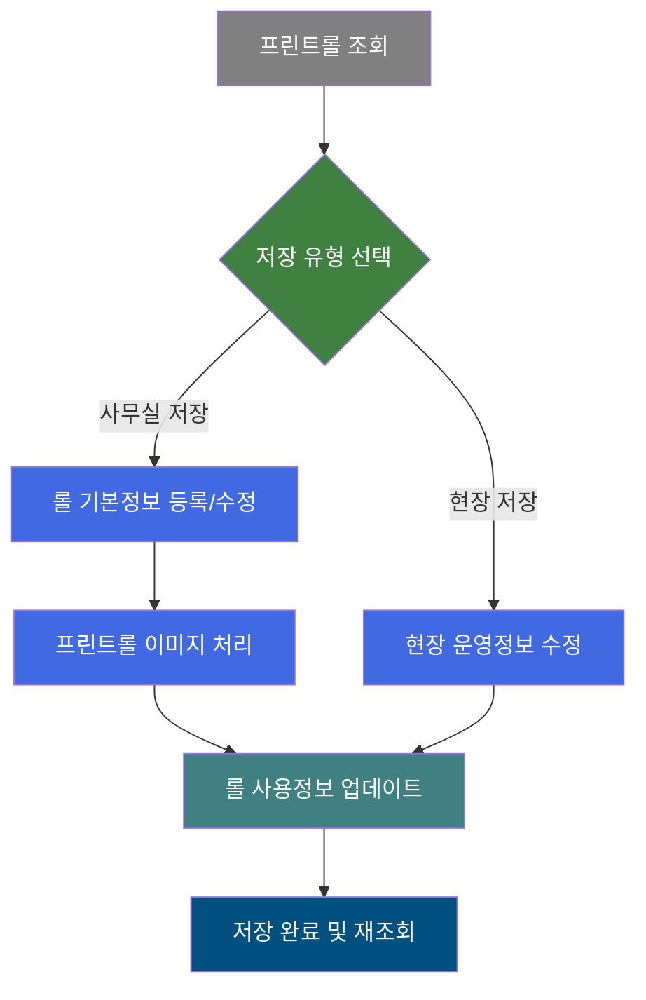
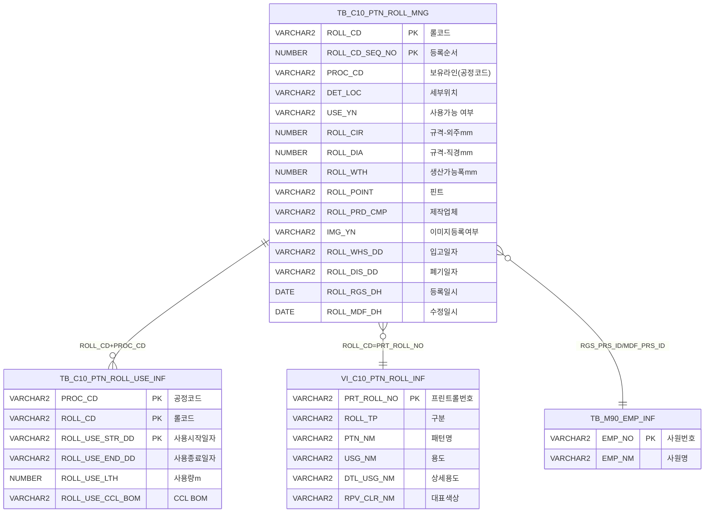

<h1 style="font-size: 40px; text-align: center; font-weight:
   bold; margin: 30px 0;">
  C106000080 레거시 시스템 분석 종합 보고서
</h1>


# 1. 시스템 개요
- **서비스 ID**: C106000080
- **업무명**: 프린트롤관리
- **분석 일시**: 2026-03-17 10:40 KST
- **전체 Activity 수**: 9개 (Built-in 8개, Custom 1개)
- **분석자**: Claude Opus 4.6
- **분석 도구**: /analyze-service C106000080
- **문서 버전**: 1.0

# 📊 비즈니스 프로세스 분석

## 시스템 목적

CCL(Color Coating Line) 공정에서 사용하는 프린트롤(Print Roll)의 전체 생명주기를 관리하는 시스템이다. 프린트롤은 PRINT, IMPRINT, UNITEX 세 가지 유형이 있으며, 각 CCL 라인(A4~A9)별로 보유·사용·폐기 현황을 추적한다.

사무실에서는 롤의 기본 정보(규격, 제작업체, 입고일자, 폐기일자 등)를 등록·수정하고, 현장에서는 세부위치, 사용시작/종료일자, 비고 등 운영 정보를 관리한다. 보유라인(공정코드) 변경 시 PTN_ROLL_USE_INF(사용정보) 테이블도 연동 업데이트되어 롤의 공정 이동 이력을 추적한다.

공정별 집계 현황(Summary)을 통해 치장사양 대비 현재 보유량, Φ310 기준 롤 분류, 보관여유, 사용불가/폐기대상/폐기누적 수량을 한눈에 파악할 수 있어 롤 수급 관리의 의사결정을 지원한다.


## 핵심 워크플로우 다이어그램



### 상세 워크플로우 다이어그램

```mermaid
flowchart TD
    subgraph 조회["조회 흐름"]
        F1["find 명령"]
        F1 --> Q1["C106000080.select<br/>TB_C10_PTN_ROLL_MNG ⋈ VI_C10_PTN_ROLL_INF"]
        F1 --> Q2["C106000080.select_summary<br/>공정별 집계 CTE"]
    end

    subgraph 사무실저장["사무실 저장 흐름"]
        S1["saveof 명령"]:::proc --> V1{"유효성 검증<br/>롤코드/규격/핀트 등 필수값"}:::decision
        V1 -->|통과| V2{"보유라인 변경?<br/>c10AjaxData.do로 중복확인"}:::decision
        V2 -->|중복없음| S2["C106000080.insert / updateOf / delete<br/>TB_C10_PTN_ROLL_MNG"]:::save
        V2 -->|중복| ERR["에러 메시지 표시"]:::error
        V1 -->|실패| ERR
        S2 --> S3["C106000080_DUMY.update / IMG.delete<br/>프린트롤 이미지 처리"]:::proc
        S3 --> S4["C10UiC106000080UpdateActivity<br/>C106000080_PTN_ROLL_USE_INF.update"]:::proc_call
    end

    subgraph 현장저장["현장 저장 흐름"]
        O1["saveop 명령"]:::proc --> V3{"보유라인 변경?<br/>c10AjaxData.do로 중복확인"}:::decision
        V3 -->|중복없음| O2["C106000080.updateOp<br/>TB_C10_PTN_ROLL_MNG"]:::save
        V3 -->|중복| ERR2["에러 메시지 표시"]:::error
        O2 --> O3["C10UiC106000080UpdateActivity<br/>C106000080_PTN_ROLL_USE_INF.update"]:::proc_call
    end

    classDef proc fill:#4169E1,color:#fff
    classDef proc_call fill:#408080,color:#fff
    classDef decision fill:#408040,color:#fff
    classDef save fill:#005080,color:#fff
    classDef error fill:#F00000,color:#fff
```



## 주요 유즈케이스

### UC-01: 프린트롤 현황 조회
- **Actor**: 품질설계 담당자
- **목적**: 공정별 프린트롤 보유 현황 및 상세 정보를 조회하여 롤 수급 상태를 파악

- **전제조건**:
  - 사용자가 시스템에 로그인되어 있음
  - C106000080 화면 접근 권한 보유

- **주요 흐름**:
  1. 검색 조건 입력 (롤코드, 등록사번, 대표색상, 구분, 보유라인)
  2. 조회 버튼 클릭 → find 함수 호출
  3. C106000080.select 실행 → Grid_1에 프린트롤 목록 표시 (TB_C10_PTN_ROLL_MNG ⋈ VI_C10_PTN_ROLL_INF, 사용량/CCL BOM/미사용일수 서브쿼리 포함)
  4. C106000080.select_summary 실행 → Grid_2에 공정별 집계 현황 표시

- **대체 흐름**:
  - 조회 결과 없음: Grid에 빈 목록 표시
  - Grid_1의 ROLL_CD 클릭 시: C106000090 화면(롤 상세)으로 탭 이동

- **후행조건**:
  - Grid_1에 롤 목록, Grid_2에 공정별 집계 표시
  - 사무실/현장 저장 작업 가능 상태

### UC-02: 프린트롤 신규 등록 (사무실 저장)
- **Actor**: 품질설계 담당자 (사무실)
- **목적**: 새로운 프린트롤을 시스템에 등록하고 기본 정보를 설정

- **전제조건**:
  - 행추가 권한 보유 (menuButtonSecurity에 의해 제어)
  - 등록할 롤의 패턴정보가 VI_C10_PTN_ROLL_INF 뷰에 존재

- **주요 흐름**:
  1. 메뉴 "행추가" 클릭 → Grid_1에 신규 행 추가, ROLL_RGS_DH/ROLL_MDF_DH 현재일시 자동설정
  2. ROLL_CD_SEQ_NO 컬럼 더블클릭 → 패턴롤 선택 팝업(c106000080pop03.do) 오픈
  3. 팝업에서 롤 선택 → ROLL_CD, ROLL_TP, PTN_NM, USG_NM, DTL_USG_NM, RPV_CLR_NM 자동 설정
  4. 보유라인, 사용가능 여부, 규격(외주/Φ/폭), 핀트, 제작업체, 입고일자 입력
  5. 외주(ROLL_CIR) 입력 시 Φ(ROLL_DIA) = 외주/π 자동 계산
  6. "사무실 저장" 클릭 → 필수값 검증 → C106000080.insert 실행 (ROLL_CD_SEQ_NO는 MAX+1 자동채번)
  7. 프린트롤 이미지 처리 Activity 실행 → 롤 사용정보 업데이트 Activity 실행

- **대체 흐름**:
  - 필수값 누락: "롤코드/보유라인/사용가능 여부/규격/핀트/제작업체/입고일자 입력하세요" 알림
  - 보유라인 중복 사용정보 존재 시: c10AjaxData.do AJAX 검증 실패 → 에러 메시지

- **후행조건**:
  - TB_C10_PTN_ROLL_MNG에 신규 레코드 INSERT
  - 자동 재조회 실행

### UC-03: 프린트롤 현장 운영정보 수정 (현장 저장)
- **Actor**: 현장 오퍼레이터
- **목적**: 프린트롤의 현장 운영 정보(세부위치, 사용기간, 비고)를 수정

- **전제조건**:
  - 프린트롤이 조회된 상태
  - 현장 저장 권한 보유

- **주요 흐름**:
  1. Grid_1에서 대상 롤의 현장 관련 컬럼 편집 (세부위치, 사용시작/종료일자, 비고)
  2. "현장 저장" 클릭 → C106000080.updateOp 실행 (DET_LOC, ROLL_USE_STR_DD, ROLL_USE_END_DD, RMK_MSG, PROC_CD 수정)
  3. 보유라인 변경 시 → C10UiC106000080UpdateActivity → C106000080_PTN_ROLL_USE_INF.update 실행

- **대체 흐름**:
  - 보유라인 변경 시 기존 사용정보 중복 확인 (c10AjaxData.do AJAX 호출)

- **후행조건**:
  - TB_C10_PTN_ROLL_MNG 현장 운영 필드 UPDATE
  - 보유라인 변경 시 TB_C10_PTN_ROLL_USE_INF 연동 업데이트

### UC-04: 프린트롤 이미지 관리
- **Actor**: 품질설계 담당자
- **목적**: 프린트롤의 패턴 이미지를 등록/조회

- **전제조건**:
  - 프린트롤이 조회된 상태

- **주요 흐름**:
  1. Grid_1에서 대상 롤의 이미지 컬럼 클릭
  2. 이미지 등록 팝업(C106000080pop01.jsp, 465x405) 또는 이미지 조회 팝업(C106000080pop02.jsp, 950x550) 오픈
  3. 이미지 등록/조회 수행

- **대체 흐름**:
  - IMAGE_YN = 'N': 이미지 미등록 상태 표시

- **후행조건**:
  - 이미지 등록 시 IMG_YN 플래그 업데이트

---
## 비즈니스 로직 상세

### 1. 롤 사용정보 업데이트 로직 (C10UiC106000080UpdateActivity)

- **목적**: 프린트롤의 보유라인(공정코드) 변경 시 PTN_ROLL_USE_INF 테이블의 사용정보를 연동 업데이트하여 공정 이동 이력을 관리
- **처리 케이스**:

  **[케이스 1: 보유라인 변경 시 사용정보 업데이트]**
  ```
    조건: OLD_PROC_CD(이전 공정코드) → PROC_CD(변경 공정코드) 변경
    처리:
      1. PosContext에서 IDS 배열의 첫 번째 요소로 대상 행 식별
      2. OLD_PROC_CD, PROC_CD, ROLL_CD, ROLL_USE_STR_DD, ROLL_USE_END_DD 파라미터 구성
      3. 감사속성(ObjectType, ObjectId, ProgramId, Timestamp) 추가
      4. C106000080_PTN_ROLL_USE_INF.update 실행
  ```

- **예외 처리**:
  - DB 오류 발생 시: PosException("데이타 오류입니다.") 발생 → 프레임워크에서 트랜잭션 롤백

### 2. 보관여유(SV_CP) 계산 로직 (SQL 기반)

- **목적**: 공정별 프린트롤 보관 여유 수량을 계산하여 롤 수급 관리 의사결정 지원
- **처리 케이스**:

  **[케이스 1: 공정별 보관여유 계산]**
  ```
    조건: select_summary 쿼리 실행 시
    처리:
      1. PROC CTE: 5개 공정(4CCL~9CCL) 정의 및 치장사양(S_CP) 고정값 설정
      2. ROLL1 CTE: 공정별 전체 롤 수, Φ310 이하/초과, 사용불가 수 집계
      3. unuseday CTE: 각 롤의 최근 사용일로부터 현재까지 미사용 일수 계산
      4. ROLL CTE: 365일 초과 미사용 롤 공정별 집계
      5. rst CTE: 보관여유 및 폐기대상 계산
  ```

- **계산 공식**:
  ```
  보관여유(SV_CP) = FLOOR(치장사양(S_CP) - Φ310이하(dia_310u) - (Φ310초과(dia_310e) × 1.5))

  폐기대상(dis_dm_cnt) = 사용불가(nouse_cnt) + 365일 초과 미사용 롤 수(cnt_unuse_365e)

  미사용일수 = TRUNC(SYSDATE) - MAX(사용일자)

  예시:
  치장사양=50, Φ310이하=20개, Φ310초과=10개
  보관여유 = FLOOR(50 - 20 - (10 × 1.5)) = FLOOR(15) = 15
  ```

### 3. 외주→직경 자동 계산 (JavaScript)

- **목적**: 롤 외주(ROLL_CIR) 입력 시 직경(ROLL_DIA)을 자동 계산하여 입력 편의성 제공
- **계산 공식**:
  ```
  ROLL_DIA = ROLL_CIR / π (= ROLL_CIR / 3.14159...)
  ```

### 4. ROLL_CD_SEQ_NO 자동 채번 (SQL 기반)

- **목적**: 동일 ROLL_CD에 대해 등록순서를 자동 채번
- **계산 공식**:
  ```
  ROLL_CD_SEQ_NO = NVL(MAX(ROLL_CD_SEQ_NO) + 1, 1)
    FROM TB_C10_PTN_ROLL_MNG
    WHERE ROLL_CD = :ROLL_CD
  ```

---

# ⚙️ Java 컴포넌트 분석

## Custom Activity 상세 분석

### 1개 Custom Activity 발견

### 1. C10UiC106000080UpdateActivity (롤 사용정보 업데이트)
- **클래스명**: com.unionsteel.mes.c10.activity.ui.C10UiC106000080UpdateActivity
- **액티비티명**: 롤 사용정보 업데이트
- **파일 경로**: src/com/unionsteel/mes/c10/activity/ui/C10UiC106000080UpdateActivity.java
- **주요 기능**: 롤코드의 보유라인 변경 시 PTN_ROLL_USE_INF 사용정보 업데이트
- **라인 수**: 193 라인 | **메소드 수**: 5개

> 품질설계 프린트롤 관리 화면에서 롤코드의 보유 라인 변경 시 해당 롤코드의 사용정보(PTN_ROLL_USE_INF)를 업데이트하는 액티비티이다. 단일 레코드의 업데이트만 수행하는 단순한 구조이나, OLD_PROC_CD(이전 공정코드)와 PROC_CD(변경 공정코드)를 함께 처리하여 공정 변경 이력을 관리한다.

📎 **[상세 분석 보고서](../customClass/com.unionsteel.mes.c10.activity.ui.C10UiC106000080UpdateActivity_class_analysis.md)**

---

# 💾 데이터 요구사항

## 핵심 테이블

### 1. TB_C10_PTN_ROLL_MNG - (프린트롤 관리 마스터)
| 컬럼명 | 타입 | PK | 설명 |
|--------|------|----|-----|
| ROLL_CD | VARCHAR2 | ✅ | 롤코드 |
| ROLL_CD_SEQ_NO | NUMBER | ✅ | 등록순서 (동일 롤코드 내 자동채번) |
| PROC_CD | VARCHAR2 | | 보유라인 (공정코드: A4~A9) |
| DET_LOC | VARCHAR2 | | 세부위치 |
| USE_YN | VARCHAR2 | | 사용가능 여부 (Y/N/Y(SPARE)) |
| ROLL_CIR | NUMBER | | 규격-외주(mm) |
| ROLL_DIA | NUMBER | | 규격-직경Φ(mm) |
| ROLL_WTH | NUMBER | | 생산가능폭(mm) |
| ROLL_POINT | VARCHAR2 | | 핀트 (무핀트/일반핀트/무늬핀트) |
| ROLL_PRD_CMP | VARCHAR2 | | 제작업체 |
| IMG_YN | VARCHAR2 | | 이미지 등록 여부 |
| ROLL_WHS_DD | VARCHAR2 | | 입고일자 |
| ROLL_USE_STR_DD | VARCHAR2 | | 사용시작일자 |
| ROLL_USE_END_DD | VARCHAR2 | | 사용종료일자 |
| ROLL_DIS_DD | VARCHAR2 | | 폐기일자 |
| RMK_MSG | VARCHAR2 | | 비고 |
| ROLL_RGS_PRS_ID | VARCHAR2 | | 등록자 ID |
| ROLL_RGS_DH | DATE | | 등록일시 |
| ROLL_MDF_PRS_ID | VARCHAR2 | | 수정자 ID |
| ROLL_MDF_DH | DATE | | 수정일시 |

### 2. TB_C10_PTN_ROLL_USE_INF - (프린트롤 사용정보)
| 컬럼명 | 타입 | PK | 설명 |
|--------|------|----|-----|
| PROC_CD | VARCHAR2 | ✅ | 공정코드 |
| ROLL_CD | VARCHAR2 | ✅ | 롤코드 |
| ROLL_USE_STR_DD | VARCHAR2 | ✅ | 사용시작일자 |
| ROLL_USE_END_DD | VARCHAR2 | | 사용종료일자 |
| ROLL_USE_LTH | NUMBER | | 사용량(m) |
| ROLL_USE_CCL_BOM | VARCHAR2 | | CCL BOM |
| PDN_PST_DD | VARCHAR2 | | 생산일자 |

### 3. VI_C10_PTN_ROLL_INF - (프린트롤 정보 뷰)
| 컬럼명 | 타입 | PK | 설명 |
|--------|------|----|-----|
| PRT_ROLL_NO | VARCHAR2 | ✅ | 프린트롤번호 |
| ROLL_TP | VARCHAR2 | | 구분 (PRINT/IMPRINT/UNITEX) |
| PTN_NM | VARCHAR2 | | 패턴명 |
| USG_NM | VARCHAR2 | | 용도 |
| DTL_USG_NM | VARCHAR2 | | 상세용도 |
| RPV_CLR_NM | VARCHAR2 | | 대표색상 |

### 4. TB_M90_EMP_INF - (직원 정보)
| 컬럼명 | 타입 | PK | 설명 |
|--------|------|----|-----|
| EMP_NO | VARCHAR2 | ✅ | 사원번호 |
| EMP_NM | VARCHAR2 | | 사원명 |

## 데이터 플로우

### 1. 조회

```
[프린트롤 목록 조회]
화면 진입 → find 버튼 클릭
→ C106000080.select
  FROM TB_C10_PTN_ROLL_MNG A
  INNER JOIN VI_C10_PTN_ROLL_INF B ON A.ROLL_CD = B.PRT_ROLL_NO
  서브쿼리: TB_C10_PTN_ROLL_USE_INF (사용량 합계, CCL BOM, 최근사용일, 미사용일수)
  서브쿼리: TB_M90_EMP_INF (등록자명, 수정자명)
  WHERE ROLL_CD LIKE, ROLL_RGS_PRS_ID LIKE, PROC_CD =, RPV_CLR_NM LIKE, ROLL_TP =
→ Grid_1에 프린트롤 목록 표시

[공정별 집계 현황 조회]
→ C106000080.select_summary
  CTE: PROC(5개 공정 정보), unuseday(미사용일수), ROLL(365일 초과 미사용), ROLL1(공정별 집계), rst(보관여유 계산)
  FROM C10APUSER.TB_C10_PTN_ROLL_MNG a
  INNER JOIN C10APUSER.VI_C10_PTN_ROLL_INF b ON a.roll_cd = b.PRT_ROLL_NO AND b.ROLL_TP = 'PRINT'
  LEFT JOIN ROLL ON a.proc_cd = b.proc_cd (+)
  UNION (합계 행)
→ Grid_2에 공정별 집계 표시
```

### 2. 사무실 저장

```
[신규 등록]
saveof 버튼 → 필수값 검증 → 보유라인 중복 확인(AJAX)
→ C106000080.insert
  INTO TB_C10_PTN_ROLL_MNG
  VALUES (ROLL_CD, MAX(SEQ_NO)+1, PROC_CD, USE_YN, ROLL_DIA, ROLL_CIR, ROLL_WTH, ROLL_POINT, ROLL_PRD_CMP, IMG_YN='N', ...)
→ 프린트롤 이미지 처리 (C106000080_DUMY.update / C106000080_IMG.delete)
→ 롤 사용정보 업데이트 (C106000080_PTN_ROLL_USE_INF.update)

[수정]
saveof 버튼 → 필수값 검증
→ C106000080.updateOf
  UPDATE TB_C10_PTN_ROLL_MNG
  SET PROC_CD, DET_LOC, USE_YN, ROLL_CIR, ROLL_DIA, ROLL_WTH, ROLL_POINT, ROLL_PRD_CMP, ROLL_WHS_DD, ROLL_DIS_DD, RMK_MSG, ...
  WHERE ROLL_CD = :ROLL_CD AND ROLL_CD_SEQ_NO = :ROLL_CD_SEQ_NO

[삭제]
saveof 버튼 (삭제 행)
→ C106000080.delete
  DELETE FROM TB_C10_PTN_ROLL_MNG
  WHERE ROLL_CD = :ROLL_CD AND ROLL_CD_SEQ_NO = :ROLL_CD_SEQ_NO
```

### 3. 현장 저장

```
saveop 버튼 → 보유라인 중복 확인(AJAX)
→ C106000080.updateOp
  UPDATE TB_C10_PTN_ROLL_MNG
  SET DET_LOC, ROLL_USE_STR_DD, ROLL_USE_END_DD, RMK_MSG, PROC_CD, ROLL_MDF_PRS_ID, ROLL_MDF_DH
  WHERE ROLL_CD = :ROLL_CD AND ROLL_CD_SEQ_NO = :ROLL_CD_SEQ_NO
→ 롤 사용정보 업데이트 (C106000080_PTN_ROLL_USE_INF.update)
```

### 4. 프린트롤 AJAX 조회

```
[롤코드 입력 시 패턴정보 조회]
→ C106000080_PRTROLLAJAX.select
  SELECT MAX(PRT_ROLL_NO), MAX(ROLL_TP), MAX(PTN_NM), MAX(USG_NM), MAX(DTL_USG_NM), MAX(RPV_CLR_NM)
  FROM VI_C10_PTN_ROLL_INF WHERE PRT_ROLL_NO = :ROLL_CD
  UNION ALL SELECT '', '', '', '', '', '' FROM DUAL
→ 결과 없을 경우 빈 행 반환 보장

[롤 사용정보 조회]
→ C106000080_PTN_ROLL_USE_INF.select
  SELECT COUNT(*) AS USE_CNT
  FROM TB_C10_PTN_ROLL_USE_INF
  WHERE PROC_CD = :PROC_CD AND ROLL_CD = :ROLL_CD AND ROLL_USE_STR_DD/END_DD 범위
→ 보유라인 변경 시 중복 확인용
```


## SQL 일람표
| SQL 이름 | 쿼리 ID | 타입 | 출처 | 테이블 |
|---------|---------|-----|-------|-------|
| 프린트롤 목록 조회 | C106000080.select | SELECT | Service | TB_C10_PTN_ROLL_MNG, VI_C10_PTN_ROLL_INF, TB_C10_PTN_ROLL_USE_INF, TB_M90_EMP_INF |
| 공정별 집계 조회 | C106000080.select_summary | SELECT | Service | C10APUSER.TB_C10_PTN_ROLL_MNG, C10APUSER.VI_C10_PTN_ROLL_INF, C10APUSER.TB_C10_PTN_ROLL_USE_INF |
| 프린트롤 AJAX 조회 | C106000080_PRTROLLAJAX.select | SELECT | Service | VI_C10_PTN_ROLL_INF, DUAL |
| 롤 사용정보 조회 | C106000080_PTN_ROLL_USE_INF.select | SELECT | Service | TB_C10_PTN_ROLL_USE_INF |
| 더미 조회 | C106000080_DUMY.select | SELECT | Service | DUAL |
| 프린트롤 신규 등록 | C106000080.insert | INSERT | Service | TB_C10_PTN_ROLL_MNG |
| 사무실 정보 수정 | C106000080.updateOf | UPDATE | Service | TB_C10_PTN_ROLL_MNG |
| 현장 정보 수정 | C106000080.updateOp | UPDATE | Service | TB_C10_PTN_ROLL_MNG |
| 프린트롤 삭제 | C106000080.delete | DELETE | Service | TB_C10_PTN_ROLL_MNG |
| 이미지 정보 수정 | C106000080_DUMY.update | UPDATE | Service | TB_C10_PTN_ROLL_MNG |
| 이미지 삭제 | C106000080_IMG.delete | DELETE | Service | TB_C10_PTN_ROLL_MNG |

## ER 다이어그램 (핵심 관계)



관계 설명:
- **TB_C10_PTN_ROLL_MNG**가 중심 테이블로 프린트롤 관리 정보를 보유
- **TB_C10_PTN_ROLL_USE_INF**: ROLL_CD + PROC_CD 기반 1:N 관계 (롤 하나가 여러 사용 이력 보유)
- **VI_C10_PTN_ROLL_INF**: PRT_ROLL_NO = ROLL_CD 기반 N:1 관계 (패턴 마스터 뷰 참조)
- **TB_M90_EMP_INF**: 등록자/수정자 사원번호로 사원명 조회 (서브쿼리)

---

# 🖥️ 사용자 인터페이스 요구사항

## 화면 레이아웃 상세

### Layout 구조 (initLayout)
```javascript
{
  programId: "C106000080",
  itemType: "layout",
  messageBox: true,
  dirType: "row",           // 수직 분할
  childSize: "60",          // 상단 Form 60px
  splitter: false,
  components: [
    {
      ref: "Form_1",
      itemType: "form",
      renderId: "C106000080_Form_1",  // 검색/버튼 바
      height: "60px"
    },
    {
      itemType: "layout",
      dirType: "row",        // 하위 수직 분할
      childSize: "340,160,", // Grid_1: 340px, Form_2: 160px, Grid_2: 나머지
      splitter: true,        // 크기 조정 가능
      components: [
        {
          ref: "Grid_1",
          itemType: "grid",
          renderId: "C106000080_Grid_1",  // 메인 편집 그리드
          menu: {
            ref: "Menu_1",
            renderId: "C106000080_Menu_1"  // 그리드 툴바
          }
        },
        {
          ref: "Form_2",
          itemType: "form",
          renderId: "C106000080_Form_2",  // 집계 현황 설명
          header: "* 공정별 Print Roll 집계 현황"
        },
        {
          ref: "Grid_2",
          itemType: "grid",
          renderId: "C106000080_Grid_2"   // 집계 그리드
        }
      ]
    }
  ]
}
```

## 입출력 요소

### Form 컴포넌트
**C106000080_Form_1 (검색 조건 및 버튼)**
- ROLL_CD: input - 롤코드 (75px)
- ROLL_RGS_PRS_ID: input - 등록사번 (75px)
- RPV_CLR_NM: input - 대표색상 (75px)
- ROLL_TP: combo - 구분 (80px, 옵션: 전체/PRINT/IMPRINT/UNITEX, 기본값: 전체)
- PROC_CD: combo - 보유라인 (80px, 옵션: 전체/A4/A5/A6/A7/A8/A9, 기본값: 전체)
- find: button - 조회 → find 함수 호출
- saveof: button - 사무실 저장 (기본 비활성) → saveof 함수 호출
- saveop: button - 현장 저장 (기본 비활성) → saveop 함수 호출
- winClose: button - 닫기
- label: 안내 텍스트 "(사무실: 세부위치, 최초등록, 입고일자, 사용가능, 폐기일자, 비고) (현장: 세부위치, 사용시작일자, 사용종료일자, 비고)"

**C106000080_Form_2 (공정별 집계 현황 설명 레이블)**
- 1. 치장사양: 고정값
- 2. 현재수량: 폐기일자가 없는 롤 수
- 3. 310이하: 폐기일자가 없고 310이하 롤 수
- 4. 301초과: 폐기일자가 없고 310초과 롤 수
- 5. 보관여유: 반올림(치장사양 - 310이하 - (301초과*1.5))
- 6. 사용불가: 폐기일자가 없고 사용가능이 N인 롤 수
- 7. 폐기대상: 사용불가 + (폐기일자 없고 사용가능 Y이며 과거 1년 미사용 롤)
- 8. 폐기누적: 폐기일자가 있는 롤 수

### Grid 컴포넌트

**C106000080_Grid_1 (프린트롤 목록 - 메인 편집 그리드)**
- 편집 가능 여부: 예 (편집 가능 컬럼은 노란색 배경 FFFFC0)
- Split: 0 (고정 컬럼 없음)
- Smart Rendering: 활성
- 페이지네이션: 활성 (22행 단위)
- 주요 컬럼 (32개):

  **기본 정보**:
  - ROLL_CD: ahref - Roll코드 (70px, 중앙정렬, 클릭 시 C106000090 탭 이동)
  - ROLL_CD_SEQ_NO: ro - 등록순서 (30px, 중앙정렬)
  - ROLL_TP: ro - 구분 (70px, 중앙정렬)

  **운영 정보 (편집 가능)**:
  - PROC_CD: combo_v - 보유라인 (60px, 중앙정렬, 편집가능, 옵션: A4~A9)
  - DET_LOC: edn - 세부위치 (160px, 중앙정렬, 편집가능)
  - USE_YN: combo_v - 사용가능 (60px, 좌측정렬, 편집가능, 옵션: Y/N/Y(SPARE))

  **규격 정보 (편집 가능)**:
  - ROLL_CIR: edn - 규격(외주,mm) (80px, 중앙정렬, 편집가능, 포맷 0,000, 변경 시 ROLL_DIA 자동계산)
  - ROLL_DIA: edn - 규격(Φ,mm) (80px, 중앙정렬, 편집가능, 포맷 0,000.0)
  - ROLL_WTH: edn - 생산가능폭(mm) (80px, 중앙정렬, 편집가능, 포맷 0,000, 최대 4자리)
  - ROLL_POINT: combo_v - 핀트 (90px, 좌측정렬, 편집가능, 옵션: 무핀트/일반핀트/무늬핀트)

  **패턴 정보 (읽기 전용)**:
  - PTN_NM: ro - 패턴명 (160px, 좌측정렬)
  - USG_NM: ro - 용도 (60px, 좌측정렬)
  - DTL_USG_NM: ro - 상세용도 (140px, 좌측정렬)
  - ROLL_PRD_CMP: combo_v - 제작업체 (100px, 좌측정렬, 편집가능, 옵션: 형제제판/다인/동성로라/태광스크린/기타)

  **이미지/색상 정보**:
  - IMAGE_YN: ro - 이미지 (60px, 중앙정렬)
  - RPV_CLR_NM: ro - 대표색상 (140px, 좌측정렬)

  **사용 이력 (읽기 전용)**:
  - ROLL_USE_LTH: ron - 사용량(m) (90px, 우측정렬, 포맷 0,000)
  - ROLL_USE_CCL_BOM: ro - CCL BOM (70px, 중앙정렬)
  - ROLL_USE_LST_DT: ro - 최근사용일자 (100px, 중앙정렬)
  - ROLL_UNUSE_DAY: ron - 미사용일수 (50px, 우측정렬, 포맷 0,000)

  **날짜 정보 (편집 가능)**:
  - ROLL_WHS_DD: dhxCalendar - 입고일자 (100px, 중앙정렬, 편집가능)
  - ROLL_USE_STR_DD: dhxCalendar - 사용시작일자 (100px, 중앙정렬, 편집가능, 더블클릭 시 초기화)
  - ROLL_USE_END_DD: dhxCalendar - 사용종료일자 (100px, 중앙정렬, 편집가능, 더블클릭 시 초기화)
  - ROLL_DIS_DD: dhxCalendar - 폐기일자 (100px, 중앙정렬, 편집가능, 더블클릭 시 초기화)

  **비고/이력 정보**:
  - RMK_MSG: ed - 비고 (400px, 좌측정렬, 편집가능)
  - ROLL_RGS_PRS_NM: ro - 등록자 (70px, 중앙정렬)
  - ROLL_RGS_DH: ro - 등록일 (100px, 중앙정렬)
  - ROLL_MDF_PRS_NM: ro - 수정자 (70px, 중앙정렬)
  - ROLL_MDF_DH: ro - 수정일 (100px, 중앙정렬)

  **숨김 컬럼**:
  - IMG_ADR: ro - 이미지 주소 (숨김)
  - IMG_NM: ro - 이미지명 (숨김)
  - OLD_PROC_CD: ro - 이전 보유라인 (숨김, 보유라인 변경 전 원래 값 보관용)

**C106000080_Grid_2 (공정별 집계 현황 - 읽기 전용)**
- 편집 가능 여부: 아니오 (읽기 전용)
- 컬럼 너비 단위: % (비율 기반)
- 주요 컬럼 (9개):
  - PROC_NM: ro - 공정 (12%, 중앙정렬)
  - S_CP: ron - 치장사양 (11%, 우측정렬, 포맷 0,000)
  - R_CNT: ron - 현재수량 (11%, 우측정렬, 포맷 0,000)
  - DIA_310U: ron - Φ310 이하 (11%, 우측정렬, 포맷 0,000)
  - DIA_310E: ron - Φ310 초과 (11%, 우측정렬, 포맷 0,000)
  - SV_CP: ron - 보관여유 (11%, 우측정렬, 포맷 0,000)
  - NOUSE_CNT: ron - 사용불가 (11%, 우측정렬, 포맷 0,000)
  - DIS_DM_CNT: ron - 폐기대상 (11%, 우측정렬, 포맷 0,000)
  - DIS_CNT: ron - 폐기누적 (11%, 우측정렬, 포맷 0,000)

## 화면 동작 흐름

### 1. 화면 초기 로딩
```
1. 화면 진입 → initLayout으로 DHTMLX 레이아웃 초기화
2. Grid_1 로드 완료(onLoadGrid) 시:
   - 콤보 옵션 설정: PROC_CD(A4~A9), USE_YN(Y/N/Y(SPARE)), ROLL_WTH(1350/1600), ROLL_POINT(무핀트/일반핀트/무늬핀트), ROLL_PRD_CMP(형제제판/다인/동성로라/태광스크린/기타)
   - 더블클릭 이벤트(rollSelectPopup) 등록
   - 메뉴 권한 처리(menuButtonSecurity): add/remove 기본 숨김 → 권한에 따라 표시
3. 상태바(messageBox) 초기화
```

### 2. 프린트롤 조회
```
1. 사용자가 검색 조건 입력 (롤코드, 등록사번, 대표색상, 구분 콤보, 보유라인 콤보)
2. "조회" 버튼 클릭 → find 함수 호출
3. Grid_1에 C106000080.select 결과 로드 (handleDataProcess.do)
4. Grid_2에 C106000080.select_summary 결과 로드
5. 두 그리드 동시 데이터 바인딩
```

### 3. 사무실 저장
```
1. Grid_1에서 행 추가/수정/삭제
2. "사무실 저장" 클릭 → saveof 함수 호출
3. 필수값 검증 (롤코드, 보유라인, 사용가능, 규격3종, 핀트, 제작업체, 입고일자)
4. 보유라인 변경 시 c10AjaxData.do AJAX 호출로 중복 사용정보 확인
5. Grid_1.sendGrid("saveof") → gridC10Data.do → C106000080-service (사무실 저장 Activity 체인)
6. 저장 완료 후 onAfterUpdateFinishEvent → 자동 재조회
```

### 4. 팝업 - 패턴롤 선택
```
1. 신규 행의 ROLL_CD_SEQ_NO 컬럼 더블클릭
2. rollSelectPopup 함수 호출 → c106000080pop03.do 팝업 오픈 (669x532)
3. 팝업에서 롤 선택 → pop3SetValue 콜백 호출
4. Grid_1에 ROLL_CD, ROLL_TP, PTN_NM, USG_NM, DTL_USG_NM, RPV_CLR_NM 자동 설정
```

### 5. 팝업 - 이미지 등록/조회
```
1. Grid_1에서 이미지 관련 셀 클릭
2. doImgPopUp: C106000080pop01.jsp (465x405) 이미지 등록 팝업 오픈
3. parentViewImg: C106000080pop02.jsp (950x550) 이미지 조회 팝업 오픈
```

## JavaScript 모듈

**C106000080.jsp** (메인 화면 스크립트)
- find(): 조회 - Grid_1, Grid_2 동시 데이터 로드
- saveof(): 사무실 저장 - 필수값 검증 → 보유라인 변경 시 AJAX 중복 확인 → Grid 전송
- saveop(): 현장 저장 - 보유라인 변경 시 AJAX 중복 확인 → Grid 전송
- doLink(id, ind): Grid 셀 클릭 → parent.newRemoveOpenTab("C106000090") 탭 이동
- doImgPopUp(): 이미지 등록 팝업(C106000080pop01.jsp) 오픈
- parentViewImg(): 이미지 조회 팝업(C106000080pop02.jsp) 오픈
- rollSelectPopup(): 신규 행 더블클릭 시 패턴롤 선택 팝업(c106000080pop03.do) 오픈
- pop3SetValue(): 패턴롤 선택 콜백 - ROLL_CD 등 6개 필드 자동 설정
- onEditCellEvent(): 셀 편집 이벤트 - PROC_CD 변경 시 OLD_PROC_CD 저장, ROLL_CIR 변경 시 ROLL_DIA 자동 계산(외주/π)
- onLoadGrid(): 그리드 로드 후 콤보 옵션 설정 및 더블클릭 이벤트 등록
- onAfterUpdateFinishEvent(): 저장 완료 후 자동 재조회
- menuButtonSecurity(): 메뉴 버튼 권한 처리 (add/remove 기본 숨김)
- setAutoData(): 행 추가 시 ROLL_RGS_DH, ROLL_MDF_DH 현재일시 자동 설정
- findMessage(): 저장 후 메시지 표시 처리 (uiCommon.message)
- onGridContextMenuClick(): 컨텍스트 메뉴 - 컬럼이동, 헤더필터, 편집모드, 엑셀 다운로드(excelExportC106000080.do)
- tooltip: 마우스 오버 툴팁 유틸리티

## 주요 이벤트 핸들러

**onEditCellEvent (셀 편집)**
- 이벤트 타입: Grid Cell Edit
- 처리 내용:
  1. PROC_CD(보유라인) 컬럼 변경 감지
  2. 변경 전 값을 OLD_PROC_CD 숨김 컬럼에 저장 (이후 저장 시 사용정보 업데이트에 활용)
  3. ROLL_CIR(외주) 컬럼 변경 감지
  4. ROLL_DIA = ROLL_CIR / π 자동 계산 후 셀 값 설정

**onLoadGrid (그리드 로드 완료)**
- 이벤트 타입: Grid XLE (Load Complete)
- 처리 내용:
  1. getColumnCombo로 5개 콤보 컬럼 옵션 설정 (PROC_CD, USE_YN, ROLL_WTH, ROLL_POINT, ROLL_PRD_CMP)
  2. rowDblClicked 이벤트 등록 → rollSelectPopup 함수 연결

**saveof/saveop (저장 버튼)**
- 이벤트 타입: Form Button Click
- 처리 내용:
  1. saveof: 8개 필수값 검증 (롤코드, 보유라인, 사용가능, 규격3종, 핀트, 제작업체, 입고일자)
  2. 보유라인(PROC_CD) 변경 여부 확인 (OLD_PROC_CD와 비교)
  3. 변경 시 c10AjaxData.do AJAX 호출 → PTN_ROLL_USE_INF에 기존 사용정보 중복 확인
  4. 검증 통과 시 sendGrid 호출 → 서비스 체인 실행


---

# 📌 특이사항 및 주의사항

## 1. String 배열 비교 버그 (C10UiC106000080UpdateActivity)
- **OLD_PROC_CD 조건 검사 결함**: `!OLD_PROC_CD.equals("")` 에서 `OLD_PROC_CD`는 `String[]` 타입이므로 `equals("")`는 항상 `false`를 반환하고, `!false = true`가 되어 **조건과 무관하게 항상 UPDATE가 실행**된다. 개발자의 의도는 `OLD_PROC_CD[0].equals("")` 였으나 배열 객체 비교가 된 버그로 추정된다. 현재 운영에서는 결과적으로 항상 업데이트되므로 기능상 문제가 없을 수 있지만, 의도와 다른 동작이다.

## 2. 사무실/현장 저장 분리 패턴
- **이중 저장 버튼**: 사무실과 현장이 수정할 수 있는 컬럼이 구분되어 있다. 사무실 저장(saveof)은 규격, 입고일자, 폐기일자, 사용가능 여부 등 기본 정보를 다루고, 현장 저장(saveop)은 세부위치, 사용시작/종료일자, 비고 등 운영 정보만 다룬다. 두 저장 모두 보유라인 변경 시 사용정보 업데이트 Activity를 호출한다.
- **안내 라벨**: Form_1에 각 저장별 편집 가능 필드를 안내하는 라벨이 포함되어 있다.

## 3. 파일 헤더 불일치
- **헤더 복사 오류**: C10UiC106000080UpdateActivity.java의 `@fileName`이 `C10UiC106000020InsertActivity.java`로 잘못 기록되어 있다. 다른 파일에서 헤더를 복사한 흔적이다.

## 4. 감사속성 키 명명 불일치
- **카멜케이스 직접 문자열 사용**: 다른 클래스가 `C10ConstantsIF.OBJECT_TYPE`(="OBJECT_TYPE") 상수를 사용하는 반면, 이 클래스는 `"ObjectType"`, `"ObjectId"`, `"ProgramId"`, `"Timestamp"` 등 카멜케이스 문자열을 직접 사용한다. SQL 쿼리의 바인드 변수명이 이에 맞추어져야 한다.

## 5. 더미 쿼리 패턴
- **C106000080_DUMY.select**: `SELECT 1 AS DUMY FROM DUAL`이라는 아무 작업도 하지 않는 더미 쿼리가 현장 저장의 insert-sql과 delete-sql로 지정되어 있다. GridSave Activity가 insert/update/delete 각각에 대응하는 SQL을 필수로 요구하지만, 현장 저장은 update만 필요하므로 나머지를 더미로 채운 패턴이다.

## 6. select_summary의 C10APUSER 스키마 직접 참조
- **크로스 스키마 쿼리**: select_summary 쿼리에서 `C10APUSER.TB_C10_PTN_ROLL_MNG`, `C10APUSER.VI_C10_PTN_ROLL_INF` 등으로 스키마를 직접 명시하고 있다. 다른 쿼리는 스키마 없이 테이블명만 사용하므로 MESAPUSER 스키마에서 실행되지만, select_summary는 C10APUSER 스키마의 데이터를 직접 참조한다.

## 7. 날짜 컬럼의 VARCHAR2 저장 패턴
- **날짜를 문자열로 저장**: ROLL_WHS_DD, ROLL_USE_STR_DD, ROLL_USE_END_DD, ROLL_DIS_DD 등이 DATE 타입이 아닌 VARCHAR2로 저장되며, `replace(:ROLL_WHS_DD,'-','')`으로 하이픈을 제거하는 패턴을 사용한다. 날짜 비교 시 문자열 비교가 되므로 주의가 필요하다.

---

# 📚 참고 문서

- **Query SQL**: `src/query/C106000080-query.glue_sql`
- **JS**: `WebContents/C106000080.jsp` (인라인 JavaScript)
- **Custom Java 클래스**:
  - `src/com/unionsteel/mes/c10/activity/ui/C10UiC106000080UpdateActivity.java`
