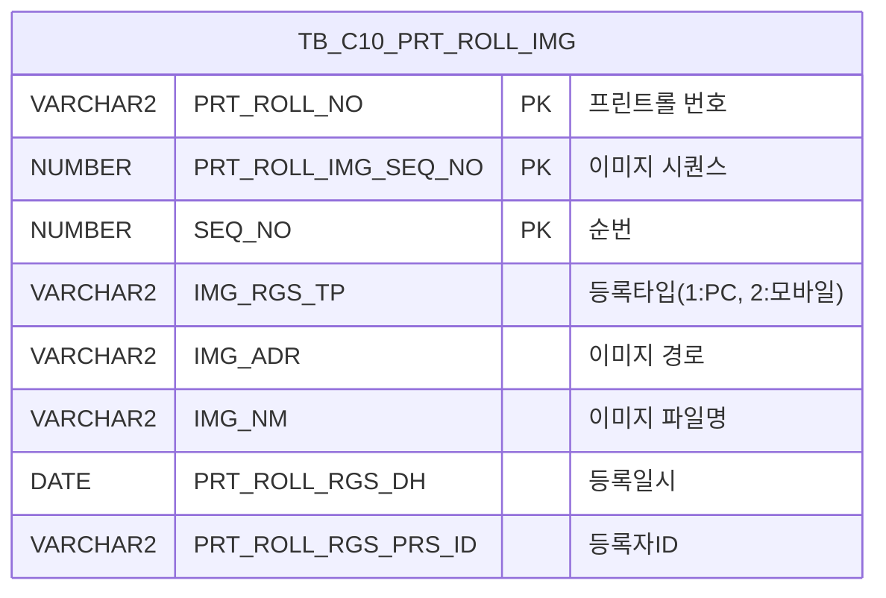

<h1 style="font-size: 40px; text-align: center; font-weight:
   bold; margin: 30px 0;">
  C106000080pop01 레거시 시스템 분석 종합 보고서
</h1>


# 1. 시스템 개요
- **서비스 ID**: C106000080pop01
- **업무명**: 프린트롤 이미지 조회/관리 팝업
- **분석 일시**: 2026-03-17 10:40 KST
- **전체 Activity 수**: 2개 (Built-in 2개, Custom 0개)
- **분석자**: Claude Opus 4.6 / Sonnet 4.6
- **분석 도구**: /analyze-service C106000080pop01
- **문서 버전**: 1.0

# 📊 비즈니스 프로세스 분석

## 시스템 목적

C106000080pop01은 CCL(Continuous Coating Line) 공정에서 프린트롤의 이미지를 관리하기 위한 팝업 화면이다. 부모 화면(C106000080)에서 특정 프린트롤을 선택하고 이미지 팝업을 호출하면, 해당 프린트롤에 등록된 이미지 목록을 조회하고, 새 이미지를 업로드하거나 기존 이미지를 삭제할 수 있다.

이 팝업은 dhtmlXVault 컴포넌트를 통한 파일 업로드 기능과 이미지 목록 그리드를 제공하며, 이미지 클릭 시 부모 화면의 이미지 뷰어에 선택한 이미지를 표시하는 연동 기능을 갖추고 있다. 프린트롤 이미지는 PC 또는 모바일에서 등록할 수 있으며, 등록 구분(IMG_RGS_TP)을 통해 출처를 구분한다.

<!-- 단순 조회 서비스: Custom Activity 0개, SELECT 쿼리만 사용, Router → 단일 조회 Activity 구성이므로 워크플로우 다이어그램 생략 -->

## 주요 유즈케이스

### UC-01: 프린트롤 이미지 목록 조회
- **Actor**: CCL 공정 오퍼레이터
- **목적**: 특정 프린트롤에 등록된 이미지 목록을 조회하여 롤 상태를 시각적으로 확인

- **전제조건**:
  - 부모 화면(C106000080)에서 프린트롤이 선택되어 있음
  - PRT_ROLL_NO, PRT_ROLL_IMG_SEQ_NO 파라미터가 팝업에 전달됨
  - 해당 프린트롤에 이미지가 등록되어 있음

- **주요 흐름**:
  1. 부모 화면에서 이미지 팝업 호출 → PRT_ROLL_NO, PRT_ROLL_IMG_SEQ_NO 파라미터 수신
  2. 팝업 로딩 시 onVaultLoad()에서 dhtmlXVault 초기화 및 부모 그리드 참조 설정
  3. onLoadGrid() 호출 → C106000080pop01-service find 액션 실행
  4. C106000080pop01_Grid_1.select 쿼리로 TB_C10_PRT_ROLL_IMG 테이블에서 이미지 목록 조회
  5. 그리드에 롤번호, 순번, 구분(PC/모바일), 이미지명(링크), 등록일자, 등록자, 삭제 버튼 표시

- **대체 흐름**:
  - 조회 결과 없음: 빈 그리드 표시
  - 파라미터 누락: 전체 이미지가 조회될 수 있음 (필터 미적용)

- **후행조건**:
  - 이미지 목록이 그리드에 표시됨
  - 사용자가 이미지 클릭, 업로드, 삭제 작업을 수행할 수 있는 상태

### UC-02: 프린트롤 이미지 업로드
- **Actor**: CCL 공정 오퍼레이터
- **목적**: 프린트롤의 현재 상태를 촬영한 이미지를 시스템에 등록하여 이력 관리

- **전제조건**:
  - 이미지 팝업이 열려 있음
  - 업로드할 이미지 파일이 jpg 또는 gif 형식임

- **주요 흐름**:
  1. 사용자가 dhtmlXVault 영역에 파일을 드래그하거나 파일 선택
  2. Vault가 파일 확장자 검증 (jpg, gif만 허용)
  3. _uploadHandler3.jsp로 파일 업로드 실행 (IMG_RGS_TP=1(PC), IMG_RGS_FLAG=03, IMG_RGS_FLAG_ID=PRT_ROLL_NO, IMG_RGS_FLAG_ID2=PRT_ROLL_IMG_SEQ_NO)
  4. 업로드 완료 시 onUploadComplete 이벤트 발생
  5. onLoadGrid() 자동 호출되어 그리드 데이터 재조회

- **대체 흐름**:
  - 허용되지 않은 확장자: Vault에서 업로드 거부
  - 업로드 실패: 에러 메시지 표시

- **후행조건**:
  - TB_C10_PRT_ROLL_IMG 테이블에 새 이미지 레코드 등록됨
  - 그리드에 새로 등록된 이미지가 표시됨

### UC-03: 프린트롤 이미지 삭제
- **Actor**: CCL 공정 오퍼레이터
- **목적**: 불필요하거나 잘못 등록된 이미지를 삭제

- **전제조건**:
  - 이미지 목록이 조회된 상태
  - 삭제할 이미지 행이 존재

- **주요 흐름**:
  1. 사용자가 그리드의 "삭제" 컬럼 클릭 → doImgDel(rowIdx) 호출
  2. 확인(confirm) 다이얼로그 표시
  3. 확인 시 _fileDeleteHandler3.jsp로 AJAX 호출 (IMG_RGS_FLAG=03, IMG_RGS_FLAG_ID, IMG_RGS_FLAG_ID2, SEQ, FILE_NAME)
  4. 서버에서 파일 물리 삭제 및 DB 레코드 삭제
  5. onLoadGrid() 호출되어 그리드 재조회

- **대체 흐름**:
  - 사용자가 확인 취소: 삭제 미수행
  - 파일 삭제 실패: 에러 메시지 표시

- **후행조건**:
  - 이미지 파일이 서버에서 삭제됨
  - TB_C10_PRT_ROLL_IMG에서 해당 레코드 삭제됨
  - 그리드에서 삭제된 행 제거됨

### UC-04: 이미지 선택하여 부모 화면에 표시
- **Actor**: CCL 공정 오퍼레이터
- **목적**: 그리드에서 이미지를 클릭하여 부모 화면의 이미지 뷰어에 해당 이미지를 표시

- **전제조건**:
  - 이미지 목록이 조회된 상태
  - 부모 화면에 parentViewImg() 함수가 정의되어 있음

- **주요 흐름**:
  1. 사용자가 그리드의 "이미지" 컬럼(ahref_idx 링크) 클릭
  2. Grid_doLink(val, rowIdx) 함수 호출
  3. 선택된 행의 이미지명(IMG_NM) 추출
  4. parent.parentViewImg(rowId, imgNm) 호출하여 부모 화면에 이미지 전달
  5. 부모 화면에서 해당 이미지 표시

- **대체 흐름**:
  - 부모 화면 참조 불가: JavaScript 오류 발생 가능

- **후행조건**:
  - 부모 화면의 이미지 뷰어에 선택한 이미지가 표시됨

---
## 비즈니스 로직 상세

### 1. 이미지 등록 구분 코드 변환

- **목적**: 이미지가 PC에서 등록되었는지 모바일에서 등록되었는지 구분하여 사용자에게 표시
- **처리 케이스**:

  **[케이스 1: 모바일 등록]**
  ```
    조건: IMG_RGS_TP = '2'
    처리:
      1. DECODE 함수로 '모바일'로 변환하여 그리드에 표시
  ```

  **[케이스 2: PC 등록]**
  ```
    조건: IMG_RGS_TP != '2' (기본값)
    처리:
      1. DECODE 함수로 'PC'로 변환하여 그리드에 표시
  ```

### 2. 이미지 경로 정규화 처리

- **목적**: DB에 저장된 이미지 경로를 웹에서 접근 가능한 URL 형식으로 변환
- **처리 케이스**:

  **[케이스 1: 경로 슬래시 정규화]**
  ```
    조건: 이미지 경로(IMG_ADR)에 역슬래시(\) 포함
    처리:
      1. IMG_NM을 CHK_IMG_NM으로 별도 컬럼에 복사
      2. IMG_ADR의 경로 구분자를 정규화하여 CHK_IMG_ADR로 변환
      3. 웹 브라우저에서 접근 가능한 슬래시(/) 기반 경로로 변환
  ```

### 3. 파일 업로드/삭제 직접 JSP 호출 패턴

- **목적**: 이미지 업로드 및 삭제를 GLUE 서비스가 아닌 전용 JSP 핸들러로 직접 처리
- **처리 케이스**:

  **[케이스 1: 업로드]**
  ```
    조건: 사용자가 Vault에 파일 드롭/선택
    처리:
      1. dhtmlXVault가 _uploadHandler3.jsp로 multipart 전송
      2. IMG_RGS_FLAG=03 (프린트롤 이미지 구분)
      3. IMG_RGS_FLAG_ID=PRT_ROLL_NO (프린트롤 번호)
      4. IMG_RGS_FLAG_ID2=PRT_ROLL_IMG_SEQ_NO (이미지 순번)
      5. 서버에서 파일 저장 + DB INSERT 수행
  ```

  **[케이스 2: 삭제]**
  ```
    조건: 사용자가 삭제 버튼 클릭 + confirm 승인
    처리:
      1. XMLHttpRequest로 _fileDeleteHandler3.jsp AJAX 호출
      2. IMG_RGS_FLAG=03, IMG_RGS_FLAG_ID, IMG_RGS_FLAG_ID2, SEQ, FILE_NAME 전달
      3. 서버에서 물리 파일 삭제 + DB DELETE 수행
  ```

---

# 💾 데이터 요구사항

## 핵심 테이블

### 1. TB_C10_PRT_ROLL_IMG - (프린트롤 이미지 정보)
| 컬럼명 | 타입 | PK | 설명 |
|--------|------|----|------|
| PRT_ROLL_NO | STRING | ✅ | 프린트롤 번호 |
| PRT_ROLL_IMG_SEQ_NO | NUMBER | ✅ | 프린트롤 이미지 시퀀스 번호 |
| SEQ_NO | NUMBER | ✅ | 순번 |
| IMG_RGS_TP | STRING |  | 이미지 등록 타입 (1=PC, 2=모바일) |
| IMG_ADR | STRING |  | 이미지 파일 경로 (서버 저장 경로) |
| IMG_NM | STRING |  | 이미지 파일명 |
| PRT_ROLL_RGS_DH | DATE |  | 등록 일시 |
| PRT_ROLL_RGS_PRS_ID | STRING |  | 등록자 ID |

## 데이터 플로우

### 1. 조회

```
[프린트롤 이미지 목록 조회]
팝업 진입 / 업로드 완료 / 삭제 완료
→ C106000080pop01_Grid_1.select
  FROM TB_C10_PRT_ROLL_IMG
  WHERE PRT_ROLL_NO = :PRT_ROLL_NO
    AND PRT_ROLL_IMG_SEQ_NO = :PRT_ROLL_IMG_SEQ_NO
→ Grid에 이미지 목록 표시
  (이미지명은 ahref_idx 링크로 클릭 가능)
```

### 2. 업로드 (서비스 외부 처리)

```
[이미지 파일 업로드]
사용자가 Vault에 파일 드롭
→ _uploadHandler3.jsp (multipart POST)
  IMG_RGS_FLAG = '03'
  IMG_RGS_FLAG_ID = PRT_ROLL_NO
  IMG_RGS_FLAG_ID2 = PRT_ROLL_IMG_SEQ_NO
→ 서버: 파일 저장 + TB_C10_PRT_ROLL_IMG INSERT
→ onUploadComplete → onLoadGrid() → 그리드 재조회
```

### 3. 삭제 (서비스 외부 처리)

```
[이미지 파일 삭제]
사용자가 삭제 컬럼 클릭 → confirm 승인
→ _fileDeleteHandler3.jsp (AJAX GET)
  IMG_RGS_FLAG = '03'
  IMG_RGS_FLAG_ID = PRT_ROLL_NO
  IMG_RGS_FLAG_ID2 = PRT_ROLL_IMG_SEQ_NO
  SEQ = SEQ_NO
  FILE_NAME = CHK_IMG_NM
→ 서버: 물리 파일 삭제 + TB_C10_PRT_ROLL_IMG DELETE
→ onLoadGrid() → 그리드 재조회
```

## SQL 일람표

| SQL 이름 | 쿼리 ID | 타입 | 출처 | 테이블 |
|---------|---------|------|------|--------|
| 프린트롤 이미지 목록 조회 | C106000080pop01_Grid_1.select | SELECT | Service | TB_C10_PRT_ROLL_IMG |

## ER 다이어그램 (핵심 관계)



관계 설명:
- TB_C10_PRT_ROLL_IMG가 유일한 테이블로, PRT_ROLL_NO + PRT_ROLL_IMG_SEQ_NO + SEQ_NO 복합 PK로 구성
- 부모 화면(C106000080)의 프린트롤 마스터 테이블과 PRT_ROLL_NO로 연결될 것으로 추정

---

# 🖥️ 사용자 인터페이스 요구사항

## 화면 레이아웃 상세

### Layout 구조
```javascript
// initLayout 없음 - DIV 기반 절대 위치 레이아웃
{
  type: "flat",
  description: "DIV 절대 위치 기반",
  components: [
    {
      id: "vault1",
      type: "vault",
      position: { top: 0, left: 0 },
      description: "dhtmlXVault 파일 업로드 영역"
    },
    {
      id: "C106000080pop01_Grid_1",
      type: "grid",
      position: { top: 260, left: 8, height: 70, width: 430 },
      description: "이미지 목록 그리드"
    },
    {
      id: "C106000080pop01_MessageBox_1",
      type: "messagebox",
      position: { top: 332, left: 0, height: 23, width: 445 },
      description: "상태 메시지 표시"
    }
  ]
}
```

## 입출력 요소

### Vault 컴포넌트
**vault1 (파일 업로드)**
- 타입: dhtmlXVaultObject
- 업로드 핸들러: _uploadHandler3.jsp
- 정보 조회 핸들러: _getInfoHandler.jsp
- ID 조회 핸들러: _getIdHandler.jsp
- 허용 확장자: jpg, gif
- 업로드 완료 이벤트: onUploadComplete → onLoadGrid()
- 폼 필드: IMG_RGS_TP=1, IMG_RGS_FLAG=03, IMG_RGS_FLAG_ID=PRT_ROLL_NO, IMG_RGS_FLAG_ID2=PRT_ROLL_IMG_SEQ_NO

### Grid 컴포넌트

**C106000080pop01_Grid_1 (이미지 목록)**
- 편집 가능 여부: 아니오 (읽기 전용)
- Split: 0 (고정 컬럼 없음)
- 세로 표시(vertical): true
- 행 수: 2행 (rowCnt)
- 너비 단위: % (colwidthUnit)
- 멀티선택: true
- 주요 컬럼 (11개):

  **표시 컬럼**:
  - PRT_ROLL_NO: ro - 롤번호 (19%, 중앙정렬)
  - SEQ_NO: ro - 순번 (8%, 중앙정렬)
  - IMG_RGS_TP: ro - 구분 (11%, 중앙정렬) - DECODE로 PC/모바일 변환 표시
  - IMG_NM: ahref_idx - 이미지 (*, 좌측정렬, 클릭 시 Grid_doLink → 부모 화면 parentViewImg 호출)
  - PRT_ROLL_RGS_DH: ro - 등록일자 (20%, 중앙정렬)
  - PRT_ROLL_RGS_PRS_ID: ro - 등록자 (16%, 중앙정렬)
  - DEL_IMG: ro - 삭제 (8%, 중앙정렬, 클릭 시 doImgDel 호출)

  **숨김 컬럼**:
  - PRT_ROLL_IMG_SEQ_NO: ro - 이미지 시퀀스 번호 (숨김)
  - IMG_ADR: ro - 이미지 경로 (숨김)
  - CHK_IMG_NM: ro - 검증용 이미지명 (숨김)
  - CHK_IMG_ADR: ro - 정규화된 이미지 경로 (숨김)

### MessageBox 컴포넌트
**C106000080pop01_MessageBox_1 (상태바)**
- 위치: 하단 (top: 332px)
- 용도: 작업 결과 메시지 표시

## 화면 동작 흐름

### 1. 화면 초기 로딩
```
1. 부모 화면에서 팝업 호출 (window.open)
2. JSP 로드 → request.getParameter로 5개 파라미터 수신
   - PRT_ROLL_NO, PRT_ROLL_IMG_SEQ_NO, rowId, parent_item, IMG_RGS_TP
3. body onload → onVaultLoad() 호출
4. dhtmlXVault 객체 생성 및 업로드 핸들러 설정
5. parent.items[parent_item].getDhxGrid()로 부모 그리드 참조 획득
6. XLE 그리드 초기화 이벤트 → onLoadGrid() → 이미지 목록 조회
7. 그리드에 이미지 목록 표시
```

### 2. 이미지 업로드 후 갱신
```
1. 사용자가 Vault 영역에 이미지 파일 드래그 앤 드롭
2. Vault가 파일 확장자 검증 (jpg, gif)
3. _uploadHandler3.jsp로 multipart 업로드 실행
4. 업로드 완료 → onUploadComplete 이벤트 발생
5. onLoadGrid() 자동 호출
6. parametersC10('C106000080pop01_Grid_1','find', customparam) 실행
7. 그리드 재조회하여 새 이미지 포함된 목록 표시
```

### 3. 이미지 삭제
```
1. 사용자가 그리드 '삭제' 컬럼 클릭
2. doImgDel(rowIdx) 호출
3. 선택 행에서 IMG_RGS_FLAG_ID, IMG_RGS_FLAG_ID2, SEQ, FILE_NAME 추출
4. confirm("삭제하시겠습니까?") 표시
5. 확인 시 XMLHttpRequest로 _fileDeleteHandler3.jsp 호출
6. 서버 응답 확인 후 onLoadGrid() 호출
7. 그리드 재조회하여 삭제된 행 제거
```

### 4. 이미지 선택 (부모 화면 연동)
```
1. 사용자가 그리드 '이미지' 컬럼(ahref_idx 링크) 클릭
2. Grid_doLink(val, rowIdx) 호출
3. 클릭한 행의 이미지명(IMG_NM) 추출
4. parent.parentViewImg(rowId, imgNm) 호출
5. 부모 화면의 이미지 뷰어에 선택 이미지 표시
```

## JavaScript 모듈

**C106000080pop01.jsp** (인라인 스크립트)
- onVaultLoad(): dhtmlXVault 초기화, 부모 그리드 참조 설정, 업로드/삭제 핸들러 등록
- onLoadGrid(): 그리드 데이터 재조회 (parametersC10 호출, customparam으로 PRT_ROLL_NO/PRT_ROLL_IMG_SEQ_NO 전달)
- Grid_doLink(val, rowIdx): 이미지 링크 클릭 시 부모 화면 parentViewImg 호출
- doImgDel(rowIdx): 이미지 삭제 (confirm → XMLHttpRequest → _fileDeleteHandler3.jsp)
- find(): 폼 파라미터로 그리드 데이터 조회
- save(): 그리드 데이터 저장
- refresh(): 그리드 초기화 후 재조회
- add(): 그리드 신규행 추가
- remove(): 그리드 선택행 삭제
- copy(): 그리드 행 클립보드 복사
- undo(): 변경사항 되돌리기
- redo(): 변경사항 다시 적용
- onGridContextMenuClick(): 컨텍스트 메뉴 처리 (컬럼이동, 헤더필터, 편집가능 토글, Excel 내보내기)
- findMessage(): appMsg 사용자 데이터를 메시지박스에 표시

## 주요 이벤트 핸들러

**onVaultLoad (팝업 초기화)**
- 이벤트 타입: body onload
- 처리 내용:
  1. dhtmlXVaultObject 생성 및 파일 업로드 URL 설정
  2. 허용 확장자(jpg, gif) 설정
  3. parent.items[parent_item].getDhxGrid()로 부모 그리드 참조
  4. onUploadComplete 이벤트에 onLoadGrid 연결

**Grid_doLink (이미지 선택)**
- 이벤트 타입: Grid ahref_idx 컬럼 클릭
- 처리 내용:
  1. 클릭된 행의 이미지명(IMG_NM) 값 추출
  2. parent.parentViewImg(rowId, imgNm) 호출
  3. 부모 화면에서 해당 이미지 표시

**doImgDel (이미지 삭제)**
- 이벤트 타입: Grid 삭제 컬럼 클릭
- 처리 내용:
  1. 선택 행에서 IMG_RGS_FLAG_ID, IMG_RGS_FLAG_ID2, SEQ, FILE_NAME 추출
  2. confirm 다이얼로그 표시
  3. XMLHttpRequest로 _fileDeleteHandler3.jsp 호출
  4. 삭제 완료 후 onLoadGrid()로 그리드 재조회

---

# 📌 특이사항 및 주의사항

## 1. 서비스 외부 파일 처리 패턴
- **업로드/삭제 비서비스 처리**: 이미지 업로드(_uploadHandler3.jsp)와 삭제(_fileDeleteHandler3.jsp)는 GLUE 서비스 프레임워크를 거치지 않고 전용 JSP 핸들러로 직접 처리한다. 이 패턴은 서비스 XML에 정의되지 않으므로 서비스 분석만으로는 전체 기능을 파악할 수 없다.
- **트랜잭션 미관리 위험**: JSP 핸들러 직접 호출 시 GLUE 프레임워크의 트랜잭션 관리가 적용되지 않을 수 있어, 파일 물리 삭제와 DB 레코드 삭제 간 불일치가 발생할 가능성이 있다.

## 2. 부모 화면 강결합
- **parent 객체 직접 참조**: `parent.items[parent_item].getDhxGrid()` 및 `parent.parentViewImg()` 등 부모 window 객체를 직접 참조하는 패턴을 사용한다. 부모 화면의 구조 변경(컴포넌트 ID 변경, 함수 리네이밍 등) 시 이 팝업이 연쇄적으로 오동작할 수 있다.
- **rowId 파라미터 의존**: 부모 그리드의 rowId를 파라미터로 받아 이미지 선택 시 다시 부모에게 전달하는 구조로, 부모-자식 간 밀접한 데이터 의존성이 존재한다.

## 3. IMG_RGS_TP 하드코딩
- **등록타입 강제 고정**: JSP에서 IMG_RGS_TP 파라미터를 수신하지만, Vault 업로드 시 formFields에서 `IMG_RGS_TP=1`(PC)로 하드코딩한다. 즉, 이 팝업에서 업로드하면 항상 PC 등록으로 처리되며, 모바일 등록(값 2)은 별도 경로에서만 가능하다.

## 4. IMG_RGS_FLAG 코드 체계
- **FLAG 값 '03'**: 업로드/삭제 시 IMG_RGS_FLAG=03으로 고정되어 있으며, 이는 프린트롤 이미지를 구분하는 코드이다. 다른 FLAG 값(예: 01, 02)은 다른 유형의 이미지를 의미하는 것으로 추정되며, 핸들러 JSP는 이 FLAG로 저장 경로와 DB 테이블을 결정한다.

## 5. 이미지 경로 정규화 SQL 로직
- **CHK_IMG_ADR 변환**: SQL에서 이미지 경로(IMG_ADR)를 웹 접근 가능한 형태로 변환하여 CHK_IMG_ADR 숨김 컬럼에 저장한다. 역슬래시를 슬래시로 변환하는 등의 경로 정규화가 DB 쿼리 레벨에서 수행되고 있어, 서버 OS 변경 시 영향을 받을 수 있다.

---

# 📚 참고 문서

- **Service XML**: `src/service/C106000080pop01-service.xml`
- **Query SQL**: `src/query/C106000080pop01-query.glue_sql`
- **JSP**: `WebContents/C106000080pop01.jsp`
- **Grid XML**: `WebContents/header/kr/C106000080pop01/C106000080pop01_Grid_1.xml`
- **외부 핸들러**:
  - `_uploadHandler3.jsp` (파일 업로드 처리)
  - `_getInfoHandler.jsp` (파일 정보 조회)
  - `_getIdHandler.jsp` (파일 ID 조회)
  - `_fileDeleteHandler3.jsp` (파일 삭제 처리)
